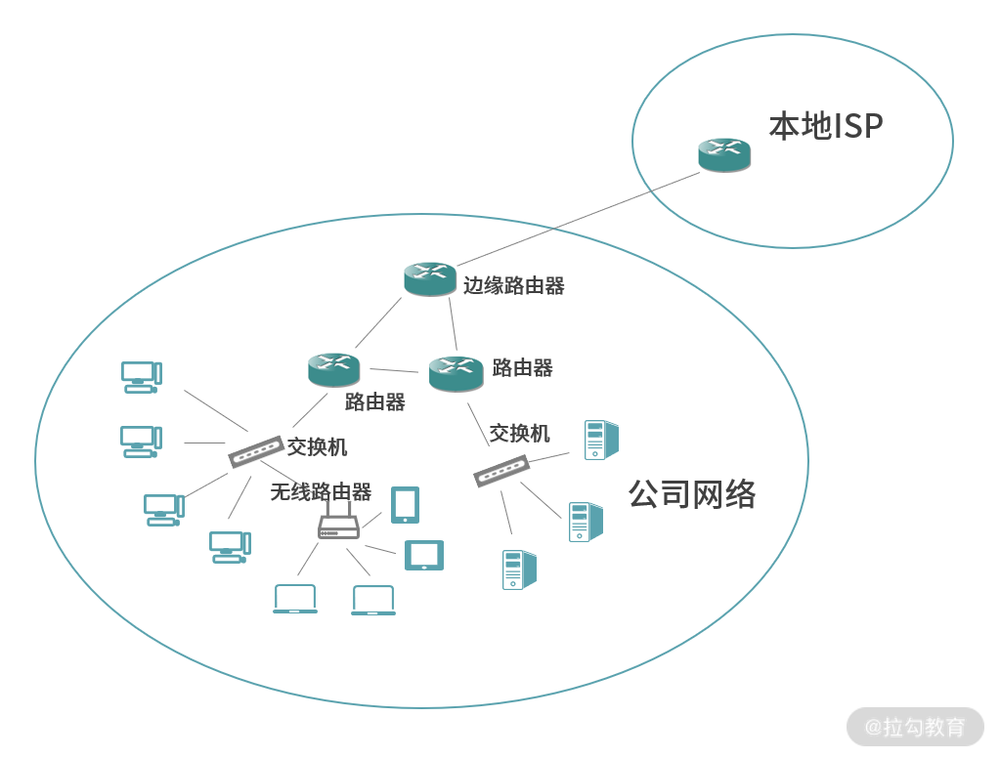
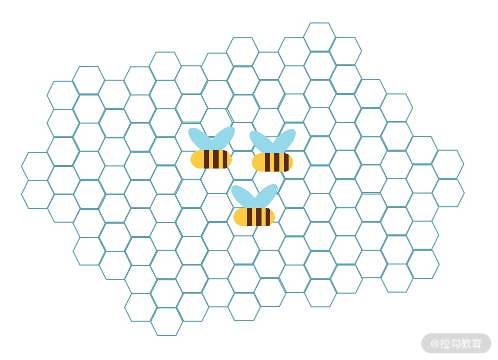
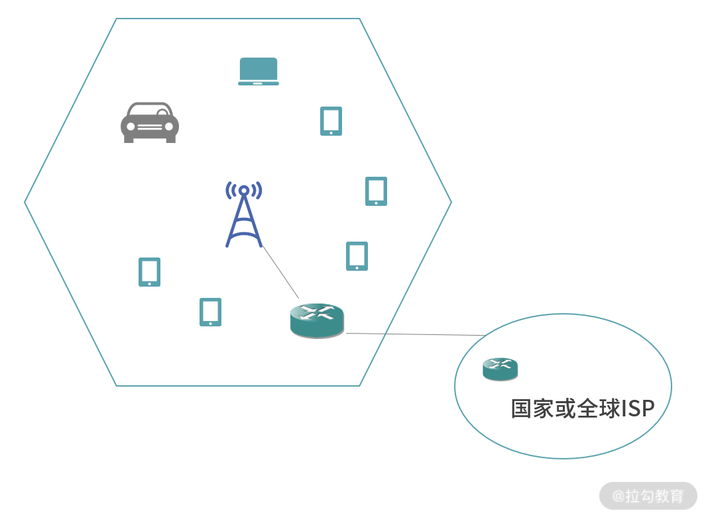
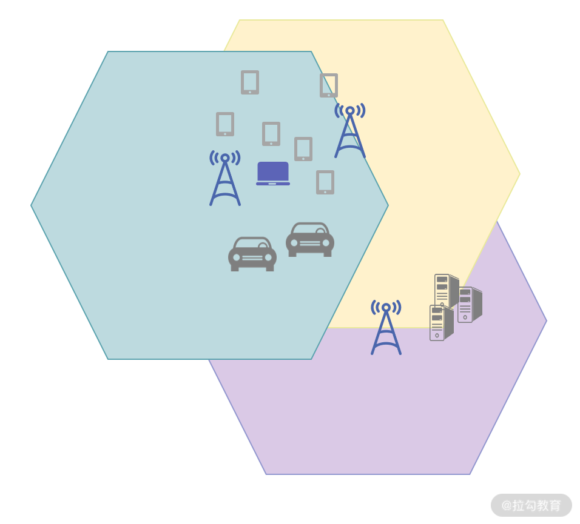
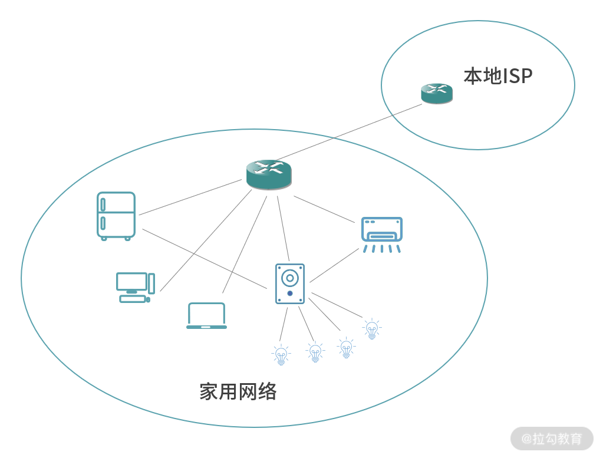
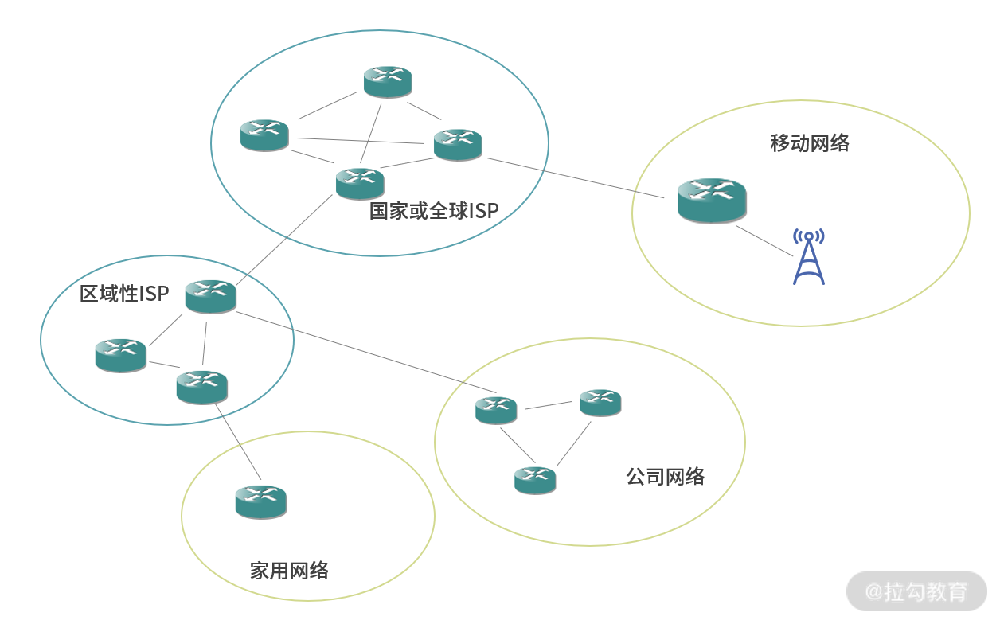
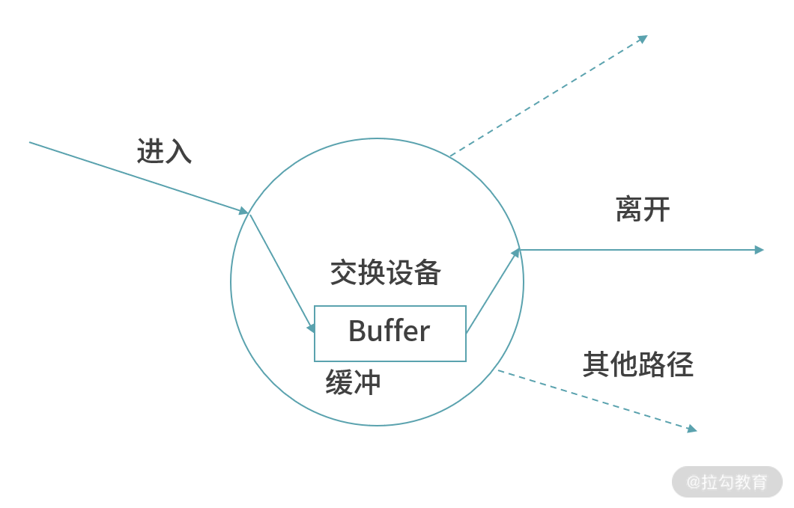
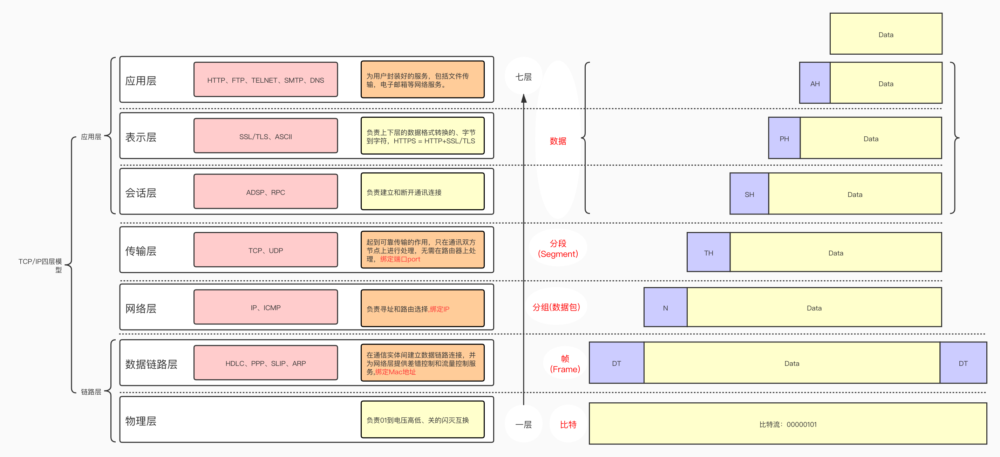

> 当前位置：【01】编程必备 -> 计算机网络 -> 00-计算机网络基础


# 第一章 网络的组成

## 1、公司网络

### 1.1 通信链路

- 公司网络从==本地网络服务提供商 （Internet Service Provider）==接入，然后内部再分成一个个子网。图中的线路，也被称作==通信链路（Communication Link）==，用于传输网络信号。

```
- 网络传输需要通信链路（Communication Link），而通信链路是一个抽象概念。这里说的抽象，就是面向对象中抽象类和继承类的关系

- 比如同轴电缆是通信链路
- 无线信号的发送接收器可以构成通信链路
- 蓝牙信道也可以构成通信链路
- 在移动网络中，无线信号构成了通信链路
```


### 1.2 交换

- 有的网络节点，同时接入了 2 条以上的链路，这个时候因为路径发生了分叉，数据传输到这些节点需要选择方向，因此在这些节点需要进行==交换（Switch）==
- 公司内部网络也被分成了多级子网。每个路由器、交换机构成一级子网。

```
- 最高级的路由器在公司网络的边缘，它可以将网络内部节点连接到其他的网络（网络外部）。
- 本地网络提供商（ISP）提供的互联网先到达边缘的路由器，然后再渗透到内部的网络节点。
- 公司内部的若干服务器可以通过交换机形成一个局域网络；公司内部的办公设备，比如电脑和笔记本，也可以通过无线路由器或者交换机形成局域网络。
- 局域网络之间，可以通过路由器、交换机进行连接，从而构成一个更大的局域网。
```



## 2、移动网络

### 2.1 蜂窝塔/基站

- 在移动网络中，无线信号构成了通信链路。
- 在移动网络的设计中，通信的核心被称作==蜂窝塔（Cellular Tower）==，有时候也称作==基站（BaseStation）==。

```
- 每个蜂窝塔只覆盖一个六边形的范围，如果要覆盖一个很大的区域就需要很多的蜂窝塔（六边形）排列在一起，像极了蜜蜂的巢穴。这种六边形的结构，可以让信号无死角地覆盖。
- 如果是圆形结构，那么圆和圆之间就会有间隙，造成一部分无法覆盖的信号死角，而六边形就完美地解决了这个问题。
```



### 2.2 蜂窝移动网络构成

- 国家或全球网络提供商将网络供给处于蜂窝网络边缘的路由器
- 路由器连接蜂窝塔，再通过蜂窝塔（基站）提供给处于六边形地区中的设备。
- 通常是国家级别的网络服务提供商负责部署基站，比如中国电信、中国联通。将网络提供给一个子网的行为，通常称为==网络提供（Network Provider）==
- 反过来，对一个子网连接提供商的网络，称为==网络接入（Network Access）==




### 2.3 边缘计算

- 随着移动网络的发展，一个蜂窝网格中的设备越来越多，也出现了基站覆盖有重叠关系的网格

- 这样设计的好处是，当一个基站过载、出现故障，或者用户设备周边信号出现不稳定，就可以切换到另一个基站的网络，不影响用户继续使用网络服务。

- 另一方面，在一定范围内的区域，离用户较近的地方还可以部署服务器，帮助用户完成计算。这相当于计算资源的下沉，称为==边缘计算==。
- 相比中心化的计算，边缘计算==延迟低、链路短==，能够将更好的体验带给距离边缘计算集群最近的节点。从而让用户享受到更优质、延迟更低、算力更强的服务。




## 3、家用网络

- 家用网络现在已经发展成一种网格状的连接。
- 一方面家用网络会通过路由器接入本地 ISP 提供的网络服务。
- 另一方面，一些设备，比如电脑、笔记本、手机、冰箱等都可以直接和路由器连接。

```
- 路由器也承担了链路层网关的作用，作为家用电器之间信息的交换设备。
- 有的设备会同时连接路由器（WI-FI）和智能音箱，这样手机和音箱都可以直接控制这些设备。这样的设计，即便网络断开，仍然可以控制这些家用设备。
```



## 4、整体关系

- 最顶部的全球或国家大型的 ISP 之间联网，构成了网络的主干。
- 然后区域性的 ISP 承接主干网络，在这个基础之上再向家庭和公司提供接入服务。
- 移动蜂窝网络因为部署复杂，往往也是由大型 ISP 直接提供。




# 第二章 数据的传输

## 1、数据交换

- 数据发生交换的时候，会先从一条链路进入交换设备，然后缓存下来，再转发（切换）到另一条路径

- 交换技术的本质，就是让数据切换路径。因为，网络中的数据是以分组或封包（Packet）的形式传输，因此这个技术也称作==封包交换技术（Packet Switch）==。

```
比如说，你要传递一首 2Mb 的 MP3 的歌曲，歌曲本身不是一次传输完成的，而是被拆分成很多个封包。每个封包只有歌曲中的一部分数据，而封包一旦遇到岔路口，就需要封包交换技术帮助每个封包选择最合理的路径。
```

- 在网络中，常见的具有交换能力的设备是==路由器（Router）==和==链路层交换机（Link-Layer Switch）==。
- 通常情况下，==两个网络可以通过路由器进行连接，多台设备可以通过交换机进行连接==。但是路由器通常也具有交换机的功能。



## 2、数据传输

- 为了传递数据，在网络中有几个特别重要的抽象。最终提供服务或者享受服务的设备，称为==终端（Terminal），或者端系统（End System）==，有时候简单称为==主机（Host）==。

```
比如说：电脑、手机、冰箱、汽车等，我们都可以看作是一个主机（Host）。
```


- 可以把网络传输分成两类
  - 一类是端到端（Host-to-Host）的能力，由 TCP/IP 协议群提供。
  - 一类是广播的能力，是一对多、多对多的能力，可以看作是端到端（Host-to-Host）能力的延伸。


- 网络基础设施往往不能一次性传输太大的数据量，因此通常会将数据分片传输。

```
比如传输一个 MP3，我们会将 MP3 内容切分成很多个组，每个组也称作一个封包，英文都是 Packet。
这样，如果一个封包损坏，只需要重发损坏的封包，而不需要重发所有数据。
```


- 另一方面，网络中两点间的路径非常多，如果一条路径阻塞了，部分封包可以考虑走其他路径。发送端将数据拆分成封包（Packet），封包在网络中遇到岔路，由交换器和路由器节点决定走向


- 封包交换技术演示


# 第三章 TCP/IP 五层模型

## 1、模型分类

- TCP/IP 五层模型：应用层、传输层、网络层、数据链路层、物理层

- TCP/IP 四层模型：应用层、传输层、网络层、链路层（数据链路层、物理层）

- OSI 七层模型：应用层、表示层、会话层、传输层、网络层、数据链路层、物理层




| 模型层                  | 功能                                   |
| ----------------------- | -------------------------------------- |
| 应用层                  | 会话（Session）：数据传输双方的契约    |
| 传输层                  | 连接（Connection）：网络行为状态的记录 |
| 网络层（Network Layer） | 提供地址到地址的通信                   |
| 数据链路层              | 负责两个相邻设备间传递信息             |
| 物理层                  | 封装最底层的物理设备、传输介质等       |


## 2、双工/单工

| 名称   | 概念                                                         | 线路          |
| ------ | ------------------------------------------------------------ | ------------- |
| 单工   | 在任何一个时刻，数据只能单向发送                             | 只需1条线路   |
| 半双工 | 在某个时刻数据可以向一个方向传输，也可以向另一个方向反方向传输，而且交替进行 | 至少1条线路   |
| 双工   | 任何时刻数据都可以双向收发                                   | 大于 1 条线路 |

