> 当前位置：【01】编程必备 -> 计算机网络 -> 02-网络层协议


# 第一章 IP 协议

## 1、什么是 IP 协议？

- IP 协议（Internet Protocol）是一个处于垄断地位的网络层协议
- 在网络层，IP 协议几乎一统天下


## 2、IP 协议分类

- IP 协议目前主要有两个版本 IPv4 和 IPv6

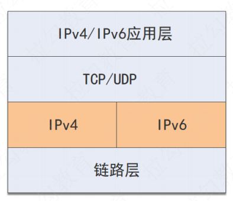


## 3、IP 协议不保证可靠性

- IP 协议并不负责数据的可靠性，自身不能保证可靠性

```
- 传输数据时，数据被切分成一个个数据封包。
- IP 协议上层的传输层协议会对数据进行一次拆分，IP 协议还会进一步进行拆分。
- 进行两次拆分是为了适配底层的设备。
```

- IP 协议可能会遇到的几个问题（ IP 协议并不会去处理这些问题，因为网络层只专注解决网络层的问题， 而且不同特性的应用在不同场景下需要解决的问题不一样）

```
- 封包损坏（数据传输过程中被损坏）
- 丢包（数据发送过程中丢失）
- 重发（数据被重发，比如中间设备通过 2 个路径传递数据）
- 乱序（到达目的地时数据和发送数据不一致）
```

- 数据在网络中交换（封包交换算法），并不需要预先建立一个连接，而是任由数据在网络中传输，每个节点通过路由算法帮助数据封包选择下一个目的地。


# 第二章 IPv4 协议

## 1、什么是 IPv4 协议

- IPv4 就是 IP 协议的第 4 个版本，是目前互联网的主要网络层协议。
- IPv4 为传输层提供 Host-To-Host 的能力
- IPv4 需要底层数据链路层的支持。


## 2、IPv4 协议的工作原理

- IP 协议接收 IP 协议上方的 Host-To-Host 协议传来的数据，然后进行拆分，这个能力叫作分片（Fragmentation）
- 然后 IP 协议为每个片段（Fragment）增加一个 IP 头（Header），组成一个IP 封包（Datagram）
- 之后，IP 协议调用底层的局域网（数据链路层）传送数据
- 最后 IP 协议通过寻址和路由能力最终把封包送达目的地


### 2.1 分片（Fragmentation）

- 分片就是把数据切分成片。 
- IP 协议通过它下层的局域网（链路层）协议传输数据，因此需要适配底层传输网络的传输能力。数据太大通常就不适合底层网络传输，这就需要把大的数据切片。 
- 当然也可能选择不切片，IP 协议提供了一个能力就是把封包标记为不切片，当底层网络看到不切片的封包，又没有能力传输的时候，就会丢弃这个封包。
- 你要注意，在网络环境中往往存在多条路径，一条路径断了，说不定其他路径可以连通。


### 2.2 增加协议头（IP Header）

- 切片完成之后，IP 协议会为每个切片（数据封包 Datagram）增加一个协议头
- IPv4 的地址是 4 组 8 位的数字，总共是 32 位

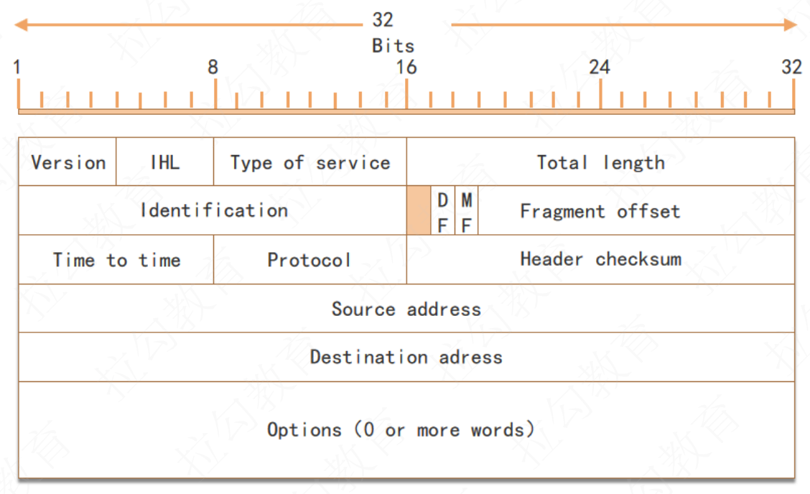

#### （1）IHL（Internet Header Length）

- 用来描述 IP 协议头的大小

- IP 协议头的大小是可变的
- IHL 只有 4 位，最大值 1111 = 15。最大是 15 个双字（15*4 字节 = 60 字节）


#### （2）Type Of Service 

- 服务的类型（是为了响应不同的用户诉求，用来选择延迟、吞吐量和丢包率之间的关系）

- 延迟（latency）

```
- 延迟指的是 1 bit 的数据从网络的一个终端传送到另一个终端需要的时间
- 这个时间包括在发送端准备发送的时间、排队发送的时间、发送数据的时间、数据传输的时间等
```

- 吞吐量（Throughput）

```
- 吞吐量指单位时间内可以传输的平均数据量
- 比如用 bit/s 作为单位，就是 bps

- 吞吐量和延迟没有联系
- 比如延迟很高的网络，有可能吞吐量很高。可以类比成水管很大流速很慢，对比水管很细流速很快，这两种情况，最终流量可以是相等的。
```

- 丢包率（Packet loss）

```
- 丢包率指发送出去的封包没有到达目的地的比例
- 在最大流速确定的网络中，丢包率会直接影响吞吐量
```


- 这三个条件，通常不能同时满足。如果同时追求延迟、吞吐量、丢包率，那么对网络设备的要求就会非常高，说白了就会非常贵。因此 IP 协议头中的 Type of Service 字段里，有以下 4 种主要的类型可以选择
  - 低延迟
  - 高吞吐量
  - 低丢包率
  - 低成本


#### （3）Total Length

- 定义报文（封包 Datagram）的长度


#### （4）Identification

- 报文的 ID

- 发送方分配，代表顺序


#### （5）Fragment offset 

- 描述要不要分包（拆分），以及如何拆分


#### （6）Time To Live

- 描述封包存活的时间
- 因此每个 IP 封包发送出去后，就开始销毁倒计时。
- 如果倒计时为 0，就会销毁。
- 比如中间的路由器看到一个 TTL 为 0 的封包，就直接丢弃。


#### （7）Protocol 

- 描述上层的协议，比如 TCP = 6，UDP = 17


#### （8）Checksum 

- 用来检验封包的正确性
- 如果 Checksum 对不上，就需要选择丢弃这个封包


#### （9）Source address

- 原地址


#### （10）Destination address

- 目标地址

  

#### （11）Options

- 代表可选项


### 2.3 寻址（Addressing）

- 地址想要表达的是一个东西在哪里
- 寻址要做的就是：给一个地址，然后找到这个东西
- IPv4 协议的寻址过程是逐级寻址


#### （1）IPv4 地址格式

- Pv4 地址是 4 个 8 位（Octet）排列而成，总共可以编址 43 亿个地址

```
- 比如 103.16.3.1 就是一个合法的 Ipv4 地址
- 4 组数字用.分开，是为了让人可读，实际上在内存和传输过程中，就是直接用 32 位

  103        16         3        1
01100111  00010000  00000011 00010001
```


#### （2）寻址过程

- 寻址就是如何根据 IP 地址找到设备
- IP 协议的寻址过程需要逐级找到网络，最后定位设备
- 因为 IPv4 的世界中，网络是一个树状模型。顶层有多个平行的网络，每个网络有自己的网络号。然后顶层网络下方又有多个子网，子网下方还有子网，最后才是设备。


##### 步骤 1：找到顶层网络

- 比如 103.16.3.1 最顶层的网络号可以和 255.0.0.0（子网掩码）做位与运算得到

```bash
# 103.0.0.0 就是 103.16.3.1 所在的顶层网络
103.16.3.1 & 255.0.0.0 = 103.0.0.0 
```

- 255.0.0.0.称作子网掩码

```
- 子网掩码的作用：根据 IP 地址找到对应子网
- 子网掩码是很多个1接着很多个0，和 IP 地址一起使用
```


##### 步骤 2：找到下一层网络

- 接下来要找到下一级网络，就需要用 IP 地址和下一级的子网掩码做位与运算。

```bash
# 103.16.0.0就是下一级的网络号
103.16.3.1 & 255.255.0.0 = 103.16.0.0
```


##### 步骤 3：找到再下一级网络

- 接下来使用 255.255.255.0 子网掩码找到下一级网络是103.16.3.0


##### 步骤 4：定位设备

- 设备就在子网103.16.3.0中，最终找到的设备号是1

- 当然子网掩码也不一定都是255，比如这个子网掩码 255.240.0.0 也是可以的


### 2.4 路由（Routing）

- 在寻址过程中，数据总是存于某个局域网中。如果目的地在局域网中，就可以直接定位到设备了。如果目的地不在局域网中，这个时候，就需再去往其他网络。

- 由于网络和网络间是网关在连接，因此如果目的地 IP 不在局域网中，就需要为 IP 封包选择通往下一个网络的路径，其实就是选择其中一个网关。


- 假如，我们要为 IP 地址 14.215.177.38 寻址
- 当前路由器所在的网络的编号是16.0.0.0
- 那么我们就需要知道去往 14.0.0.0 网络的 Gateway IP 地址


- 如果你在当前网络中用 route 查看路由表，可能可以看到一条下面这样的记录

```bash
Destination：14.0.0.0
Gateway：16.12.1.100
Mask：255.0.0.0
Iface：16.12.1.1
```

- 这条记录就说明如果你要去往 14.0.0.0 网络，IP 地址 14.215.177.38 先要和 255.0.0.0 进行位运算，然后再查表，看到 14.0.0.0，得知去往 Gateway 的网卡（IFace）是 16.12.1.1。

- 当封包去向下一个节点后，会进入新的路由节点，然后会继续上述路由过程，直到最终定位到设备


## 3、总结

- 首先 IP 协议会进行分片，将上游数据拆成一个个的封包（Datagram），然后为封包增加 IP 头部。封包发送出去后，就开始了寻址过程。寻址就是找到 IP 地址对应的设备。在局域网内，如果找不到设备，就需要路由。路由就是找到数据应该往哪里发送。最后通过层层路由定位到具体的设备。


## 【面试题】路由和寻址的区别是什么？

```
【解析】
- 寻址（Addressing）就是通过地址找设备
- 和现实生活中的寻址是一样的，比如根据地址找到一个公寓。
- 在 IPv4 协议中，寻址找到的是一个设备所在的位置。

- 路由（Routing）本质是路径的选择
- 就好像知道地址，但是到了每个十字路口，还需要选择具体的路径。
- 所以，要做路由，就必须能够理解地址，也就是需要借助寻址的能力。要通过寻址找到最终的设备，又要借助路由在每个节点选择数据传输的线路

- 因此，路由和寻址，是相辅相成的关系。
```

## 【面试题】地址 127.0.0.1, localhost, 0.0.0.0 有什么不同？

```
127.0.0.1是本地回环地址（loopback），发送到 loopback 的数据会被转发到本地应用。

localhost 指代的是本地计算机，用于访问绑定在 loopback 上的服务。
localhost 是一个主机名，不仅可以指向 IPv4 的本地回环地址，也可以指向 IPv6 的本地回环地址 [::1]

0.0.0.0是一个特殊目的 IP 地址，称作不可路由 IP 地址，它的用途会被特殊规定。
通常情况下，当把一个服务绑定到0.0.0.0，相当于把服务绑定到任意的 IP 地址。
比如一台服务器上有多个网卡，不同网卡连接不同的网络，如果服务绑定到 0.0.0.0 就可以保证服务在多个 IP 地址上都可以用。
```


# 第三章 IPv6 协议

## 1、IPv6 的引入

- IPv4 用 32 位整数描述地址，最多只能支持 43 亿设备，显然是不够用的，这也被称作 IP 地址耗尽问题。
- 为了解决这个问题，1998 年互联网工程工作小组推出了全新款的 IP 协议——IPv6 协议。

- 作为网络层协议的 IPv6，最核心的能力是确保数据可以从发送主机到达接收主机。
- IPv6 解决的是地址耗尽的问题

```
因为解决了地址耗尽的问题，所以很多其他问题也得到了解决，比如说减少了子网，更小的封包头部体积，最终提升了性能等
```


## 2、IPv6 协议的工作原理

- 接收上方主机到主机（Host-to-Host）协议传递来的数据，比如一个 TCP 段（Segment）
- 然后将 TCP 段再次切片做成一个个的 IPv6 封包（Datagram or Packet）
- 再调用底层局域网能力（数据链路层）传输数据


### 2.1 切片（Segmentation）


### 2.2 增加封包头


### 2.3 寻址

#### （1）IPv6 地址格式

- 位数
  - IPv4 的地址是 4 个 8 位（octet），总共 32 位
  - IPv6 的地址是 8 个 16 位（hextet），总共 128 位


- 格式上
  - IPv4 的地址用.分割，如103.28.7.35。每一个是 8 位，用 0-255 的数字表示。
  - IPv6 的地址用:分割，如0123:4567:89ab:cdef:0123:4567:89ab:cdef，总共 8 个 16 位的数字，通常用 16 进制表示。

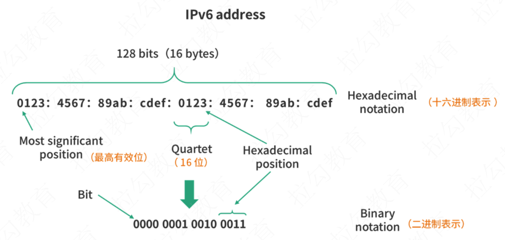


- Hexadecimal notation：十六进制表示
- Quartet：16 位
- Most significant：最高有效位
- Binary notation：二进制表示


- 简写形式

```bash
# 完全态写法
0123:4567:89ab:cdef:0123:4567:89ab:cdef

# 简写
0123:4567:0000:0000:0123:4567:0000:cdef

# 省略前 64 字节的0000:0000简写
0123:4567::0123:4567:0000:cdef

# 开头的 0 简写
123:4567::123:4567:0:cdef
```


#### （2）IPv6 寻址类型

- 和 IPv4 相同，IPv6寻址最核心的内容就是要对网络进行划分


##### 类型 1：全局单播寻址

- 和 IPv4 地址作用差不多，在互联网中通过地址查找一个设备，简单来说，单播就是 1 对 1）
- 全局单播，就是将消息从一个设备传到另一个设备，这和 IPv4 发送/接收消息大同小异。
- 全局单播地址，目标就是定位网络中的设备，这个地址和 IPv4 的地址作用相同，只不过格式略有差异。总的来说，IPv6 地址太多，因此不再需要子网掩码，而是直接将 IPv6 的地址分区即可

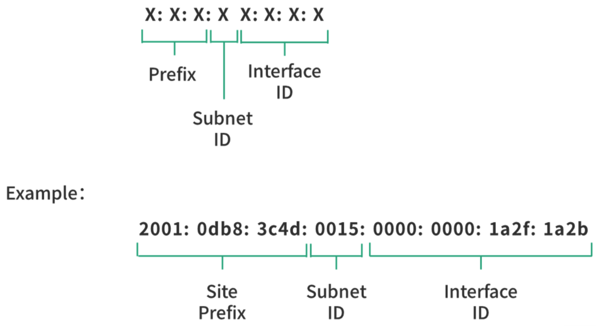

- 在实现全局单播时，IPv6 地址通常分成 3 个部分：

  - 站点前缀（Site Prefix），48bit

  ```
  一般是由 ISP（Internet Service Providor，运营商）或者RIR（Regional Internet Registry， 地区性互联网注册机构），RIR 将 IP 地址分配给运营商
  ```

  - 子网号（Subnet ID），16bit，用于站点内部区分子网；
  - 接口号（Interface ID）， 64bit，用于站点内部区分设备。


- 因此 IPv6 也是一个树状结构，站点前缀需要一定资质，子网号和接口号内部定义。IPv6 的寻址过程就是先通过站点前缀找到站点，然后追踪子网，再找到接口（也就是设备的网卡）。

- 从上面全局单播的分区，我们可以看出，IPv6 分给站点的地址非常多。一个站点，有 16bit 的子网，相当于 65535 个子网；每个子网中，还可以用 64 位整数表示设备。


##### 类型 2：本地单播

- 在局域网络中，实现设备到设备的通信，就是本地单播
- 本地单播地址必须以fe80开头，后面 64 位的 0，然后接上 54 位的设备编号。上图中的 Interface 可以理解成网络接口，其实就是网卡（类似 IPv4 里的一个内部网络，类似 IPv4 中127开头的地址）
- 理论上，虽然 IPv6 可以将所有的设备都连入一个网络。但在实际场景中，很多公司还是需要一个内部网络的。这种情况在 IPv6 的设计中属于局域网络。


##### 类型 3：分组多播（Group Multicast）

- 类似广播（就是将消息同时发送给多个接收者）

- IPv6 中设计了分组多播，来实现广播的能力。当 IP 地址以 8 个 1 开头，也就是ff00开头，后面会跟上一个分组的编号时，就是在进行分组多播。

- 这个时候，我们需要一个广播设备，在这个设备中已经定义了这些分组编号，并且拥有分组下所有设备的清单，这个广播设备会帮助我们将消息发送给对应分组下的所有设备。


##### 类型 4：任意播（Anycast）

- 任意播，本质是将消息发送给多个接收方，并选择一条最优的路径

- 比如说在一个网络中有多个授时服务，这些授时服务都共享了一个任播地址。当一个客户端想要获取时间，就可以将请求发送到这个任播地址。客户端的请求扩散出去后，可能会找到授时服务中的一个或者多个，但是距离最近的往往会先被发现。这个时候，客户端就使用它第一次收到的授时信息修正自己的时间。


### 2.4 路由


## 3、IPv6 和 IPv4 的兼容

### 情况 1：IPv4 网络和 IPv6 网络通信

- 一个 IPv4 的网络和一个 IPv6 的网络通信

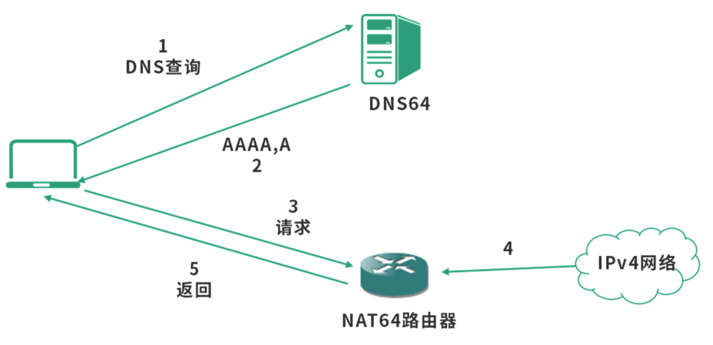

- 步骤 1：客户端通过 DNS64 服务器查询 AAAA 记录。

```
- DNS64 是国际互联网工程任务组（IETF）提供的一种解决 IPv4 和 IPv6 兼容问题的 DNS 服务。
- 这个 DNS 查询服务会把 IPv4 地址和 IPv6 地址同时返回。
```

- 步骤 2：DNS64 服务器返回含 IPv4 地址的 AAAA 记录。
- 步骤 3：客户端将对应的 IPv4 地址请求发送给一个 NAT64 路由器
- 步骤 4：由这个 NAT64 路由器将 IPv6 地址转换为 IPv4 地址，从而访问 IPv4 网络，并收集结果。
- 步骤 5：消息返回到客户端。


### 情况 2：两个 IPv6 网络被 IPv4 隔离

- 一个 IPv6 的网络和一个 IPv6 的网络通信，但是中间需要经过一个 IPv4 的网络。
- 隧道的本质就是在两个 IPv6 的网络出口网关处，实现一段地址转换的程序。

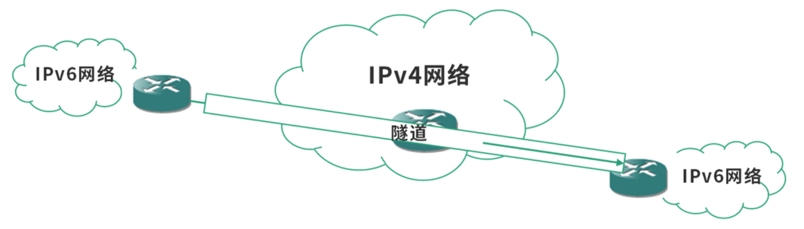


## 【面试题】Tunnel 技术是什么？

```
【解析】
- Tunnel 就是隧道，这和现实中的隧道是很相似的。隧道不是只有一辆车通过，而是每天都有大量的车辆来来往往。

- 两个网络，用隧道连接，位于两个网络中的设备通信，都可以使用这个隧道。

- 隧道是两个网络间用程序定义的一种通道。具体来说，如果两个 IPv6 网络被 IPv4 分隔开，那么两个 IPv6 网络的出口处（和 IPv4 网络的网关处）就可以用程序（或硬件）实现一个隧道，方便两个网络中设备的通信。
```


## 【面试题】IPv6 和 IPv4 有哪些区别？

```
（1）IPv6 和 IPv4 最核心的区别是地址空间大小不同。
- IPv6 用 128 位地址，解决了 IP 地址耗尽问题。
- 因为地址空间大小不同，它们对地址的定义，对路由寻址策略都有显著的差异。

（2）在路由寻址策略上
- IPv6 消除了设备间地址冲突的问题，改变了划分子网的方式。
- 在 IPv4 网络中，一个局域网往往会共享一个公网 IP，因此需要 NAT 协议和外网连接。

（3）在划分子网的时候
- IPv4 地址少，需要子网掩码来处理划分子网。
- IPv6 有充足的地址，因此不需要局域网共享外网 IP。
- 也正因为 IPv6 地址多，可以直接将 IPv6 地址划分成站点、子网、设备，每个段都有充足的 IP 地址。

（4）因为 IPv6 支持的 IP 地址数量大大上升，一个子网可以有 248 个 IP 地址，这个子网可能是公司网络、家庭网络等。这样 IP 地址的分配方式也发生了变化
- IPv4 网络中设备分配 IP 地址的方式是中心化的，由 DHCP（动态主机协议）为局域网中的设备分配 IP 地址。
- 在 IPv6 网络中，因为 IP 地址很少发生冲突，可以由设备自己申请自己的 IP 地址。

（5）因为 IPv6 中任何一个节点都可以是一个组播节点，这样就可以构造一个对等的网络，也就是可以支持在没有中心化的路由器，或者一个网络多个路由器的情况下工作。节点可以通过向周围节点类似打探消息的方式，发现更多的节点。这是一个配套 IPv6 的能力，叫作邻居发现（ND）。
```


# 第四章 NAT 协议

## 1、内部网络（局域网）和外部网络（外网）

- 对一个组织、机构、家庭来说，通常把内部网络称为局域网，外部网络就叫作外网。

```
- 局域网：所有设备的 IP 地址，通常会以 192.168 开头
- 广域网：由很多的局域网组成的
```


- 交换机（链路层交换机）：通常工作在链路层
- 路由器：通常也具有交换机的能力，工作在网络层和链路层
- 光纤：是一种透明的导光介质，多束光可以在一个介质中并行传播，不仅信号容量大，重量轻，并行度高而且传播距离远。当然，光纤不能弯曲，因此办公室里用来连接交换机和个人电脑的线路肯定不能是光纤，光线通常都用于主干网络。

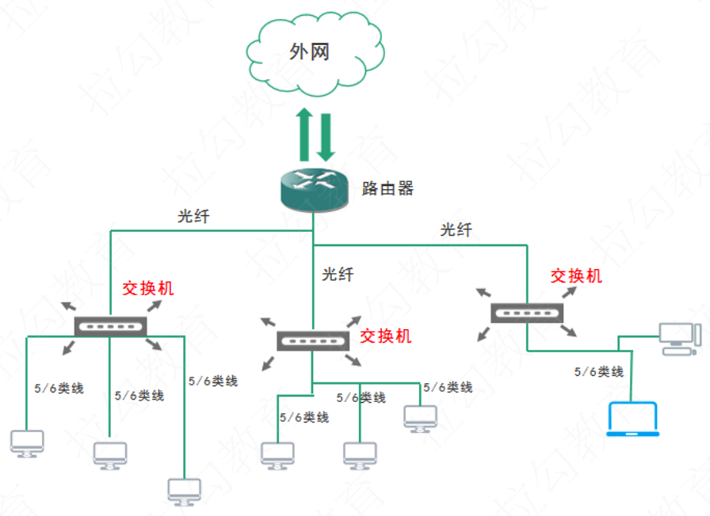


## 2、局域网数据交换（MAC 地址）

### 2.1 MAC 地址

- 设备间通信的本质其实是设备拥有的网络接口（网卡）间的通信
- 为了区别每个网络接口，互联网工程任务组（IETF）要求每个设备拥有一个唯一的编号，这个就是 MAC 地址。


### 2.2 交换机

- 在一个局域网中，不可以将消息从一个接口（网卡）发送到另一个接口（网卡），而是要通过交换机
- 数据交换，必须经过交换机，线路都是由网卡连接交换机的


- 链路层的数据交换，支持 IP 协议工作，是网络层的底层。
- 如果 IP 协议要传输数据，就要将数据转换成为链路层的分组，然后才可以在链路层传输。


### 2.3 MTU

- 链路层分组大小受限于链路层的网络设备、线路以及使用了链路层协议的设计。
- MTU ：Maximun Transmission Unit，最大传输单元

```
- 链路层网络允许的最大传输数据分组的大小。
- IP 协议要根据 MTU 拆分封包。
```


- MSS（Maximun Segment Size，最大段大小）是 TCP 段，或称为 TCP 分组（TCP Packet）的最大大小。
- MSS 是传输层概念，MTU 是链路层概念。


## 3、地址解析协议（ARP）

### 3.1 在一个网络接口向另一个网络接口发送数据的时候

- 数据的发送方，将自己的 MAC 地址、目的地 MAC 地址，以及数据作为一个分组（Packet），也称作 Frame 或者封包，发送给交换机。
- 交换机再根据目的地 MAC 地址，将数据转发到目的地的网络接口（网卡）

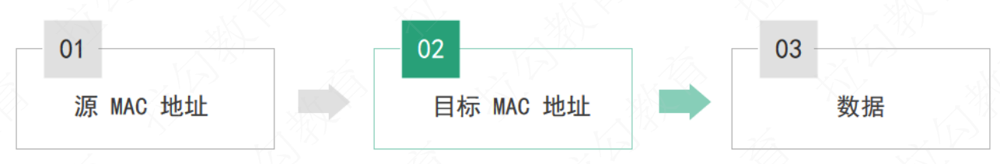


### 3.2 ARP

- 地址解析协议（Address Resolution Protocol，ARP）根据 IP 地址找到 MAC 地址

#### （1）已知目的地 MAC时

- 如果一个网络接口已经知道目标 IP 地址对应的 MAC 地址了，它会将数据直接发送给交换机，交换机将数据转发给目的地

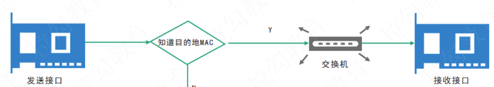


#### （2）未知目的地 MAC时

- 发送接口会发送一个广播查询给到交换机，交换机将查询转发给所有接口。

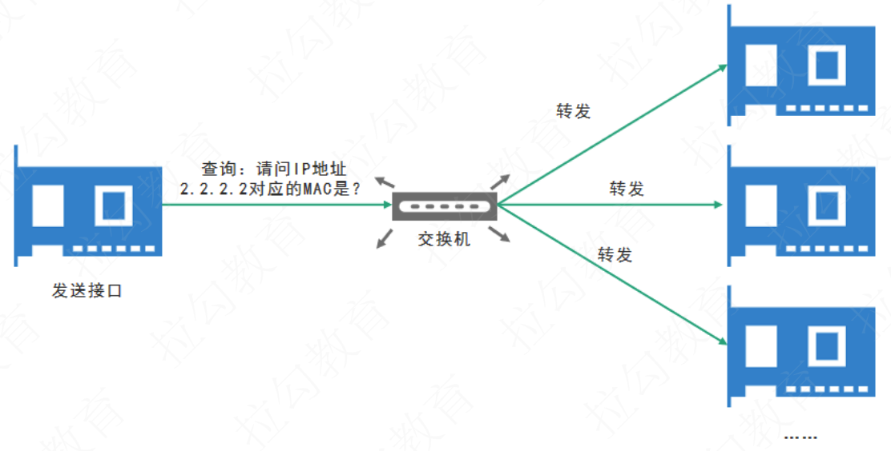

- 如果某个接口发现自己就是对方要查询的接口，则会将自己的 MAC 地址回传。接下来，会在交换机和发送接口的 ARP 表中，增加一个缓存条目。也就是说，接下来发送接口再次向 IP 地址 2.2.2.2 发送数据时，不需要再广播一次查询了
- 采用的是逐级缓存的设计减少 ARP 请求

```
- 发送接口先查询本地的 ARP 表，如果本地没有数据，然后广播 ARP 查询。
- 这个时候如果交换机中有数据，那么查询交换机的 ARP 表；
- 如果交换机中没有数据，才去广播消息给其他接口。
```


- 注意：ARP 表是一种缓存，也要考虑缓存的设计。
- 通常缓存的设计要考虑缓存的失效时间、更新策略、数据结构等。
  - 可以考虑用 TTL（Time To Live）的设计，为每个缓存条目增加一个失效时间
  - 更新策略可以考虑利用老化（Aging）算法模拟 LRU

```
- 家用的路由器，也具备交换机的功能。
- 但是当 ARP 表很大的时候，就需要专门的、能够承载大量网络接口的交换设备。
- 就好比，如果用数组实现 ARP 表，数据量小的时候，遍历即可；但如果数据量大的话，就需要设计更高效的查询结构和设计缓存
```

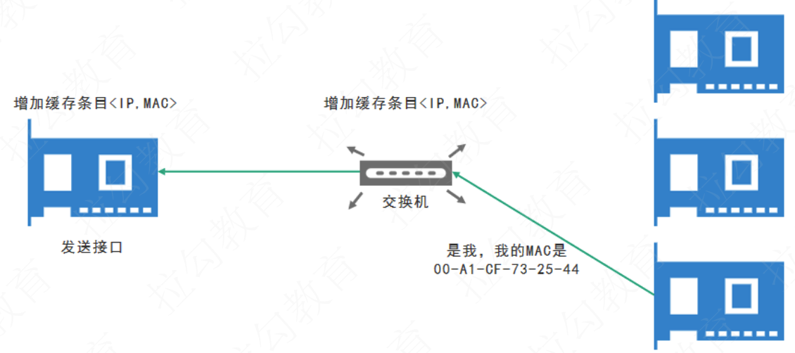

## 总结

### 连接内网

- 路由器，其实充当了两个子网通信的桥梁。
- 发送接口不能直接通过 MAC 地址发送数据到接收接口，因为子网 1 的交换机不知道子网 2 的接口。这个时候，发送接口需要通过 IP 协议，将数据发送到路由器，再由路由器转发信息到子网 2 的交换机。
- 子网 2 的交换机根据 IP 地址通过查询 ARP 表找到接收接口

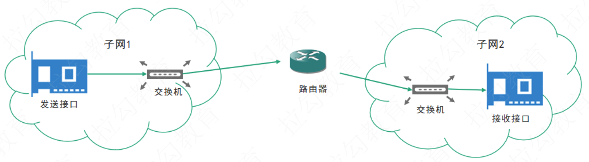


### 连接外网

- IPv4 协议因为存在网络地址耗尽的问题，不能为一个公司提供足够的地址，因此内网 IP 可能会和外网重复。比如内网 IP 地址192.168.0.1发送信息给22.22.22.22，这个时候，其实是跨着网络的。

- 跨网络必然会通过多次路由，最终将消息转发到目的地。但是这里存在一个问题，寻找的目标 IP 地址22.22.22.22是一个公网 IP，可以通过正常的寻址 + 路由算法定位。当22.22.22.22寻找192.168.0.1的时候，是寻找一个私网 IP，这个时候是找不到的。解决方案就是网络地址转换技术NAT（Network Address Translation）。

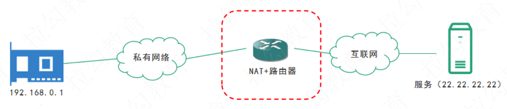


## 【面试题】网络地址转换协议是如何工作的？

```
【解析】
- 网络地址解析协议（NAT）解决的是内外网通信的问题。
- NAT 通常发生在内网和外网衔接的路由器中，由路由器中的 NAT 模块提供网络地址转换能力。

从设计上看，NAT 最核心的能力，就是能够将内网中某个 IP 地址映射到外网 IP，然后再把数据发送给外网的服务器。当服务器返回数据的时候，NAT 又能够准确地判断外网服务器的数据返回给哪个内网 IP。


你可以思考下 NAT 是如何做到这点的呢？需要做两件事。
（1）NAT 需要作为一个中间层替换 IP 地址。 
- 发送的时候，NAT 替换源 IP 地址（也就是将内网 IP 替换为出口 IP）；接收的时候，NAT 替换目标 IP 地址（也就是将出口 IP 替换回内网 IP 地址）。

（2）NAT 需要缓存内网 IP 地址和出口 IP 地址 + 端口的对应关系。
- 也就是说，发送的时候，NAT 要为每个替换的内网 IP 地址分配不同的端口，确保出口 IP 地址+ 端口的唯一性，这样当服务器返回数据的时候，就可以根据出口 IP 地址 + 端口找到内网 IP。
```


## 【面试题】IPv6 协议还需要 NAT 吗？

```
IPv6 解决了 IP 耗尽的问题，为机构、组织、公司、家庭等网络提供了充足的 IP 资源，从这个角度看是不是就不需要 NAT 协议了呢？

在没有 IPv6 之前，NAT 是 IP 资源耗尽的主流解决方案。在一个内网中的全部设备通过 NAT 协议共享一个外网的 IPv4 地址，是目前内外网对接的主要方式。IPv6 地址资源充足，可以给全球每个设备一个独立的地址。从这个角度看 IPv6 的确不需要 NAT 协议。

但是目前的情况，是 IPv6 网络还没有完全普及。尽管很多公司已经支持自己的互联网产品可以使用 IPv6 访问，但是公司内部员工使用的内部网络还是 IPv4。如果要连接 IPv6 和 IPv4 网络，仍然需要 NAT 协议（NAT64），这个协议可以让多个 IPv6 的设备共享一个 IPv4 的公网地址。
```

