> 当前位置：【01】编程必备 -> 计算机网络 -> 01-传输层协议


# 第一章 TCP 协议

## 1、TCP 概念

- TCP（Transport Control Protocol）是一个==传输层协议==，提供 Host-To-Host 数据的可靠传输，支持全双工，是一个连接导向的协议。


## 2、TCP 可靠性

- 可靠性指数据保证无损传输。
- 如果发送方按照顺序发送，然后数据无序地在网络间传递，就必须有一种算法在接收方将数据恢复原有的顺序。
- 另外，如果发送方同时要把消息发送给多个接收方，这种情况叫作==多播==，可靠性要求每个接收方都无损收到相同的副本。多播情况还有强可靠性，就是如果有一个消息到达任何一个接收者，那么所有接受者都必须收到这个消息。


## 3、TCP 的握手和挥手

- TCP 是一个连接导向的协议，设计有建立连接（握手）和断开连接（挥手）的过程。
- TCP ==没有设计会话（Session）==，因为会话通常是一个应用的行为。


### 3.1 TCP 协议的基本操作

- 如果一个 Host 主动向另一个 Host 发起连接，称为 ==SYN==（Synchronization），==请求同步==

- 如果一个 Host 主动断开请求，称为 ==FIN==（Finish），==请求完成==
- 如果一个 Host 给另一个 Host 发送数据，称为 ==PSH==（Push），==数据推送==

- 以上 3 种情况，接收方收到数据后，都需要给发送方一个==ACK（Acknowledgement）响应==。请求/响应的模型是可靠性的要求，如果一个请求没有响应，发送方可能会认为自己需要重发这个请求。


### 3.2 建立连接的过程（三次握手）

- 第一次握手
  - 客户端发消息给服务端（SYN）

服务端准备好进行连接

- 第二次握手
  - 服务端针对客户端的 SYN 给一个 ACK
  - 服务端发送一个 SYN 给客户端

客户端准备就绪

- 第三次握手
  - 客户端给服务端发送一个 ACK

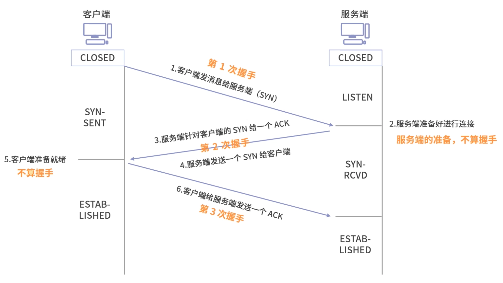

### 3.3 断开连接的过程（4 次挥手）

- 第一次挥手
  - 客户端要求断开连接，发送一个断开的请求，这个叫作（FIN）

- 第二次挥手
  - 服务端收到请求，然后给客户端一个 ACK，作为 FIN 的响应。

```
这里你需要思考一个问题，可不可以像握手那样马上传 FIN 回去？
- 其实这个时候服务端不能马上传 FIN，因为断开连接要处理的问题比较多，比如说服务端可能还有发送出去的消息没有得到 ACK；也有可能服务端自己有资源要释放。
- 因此断开连接不能像握手那样操作——将两条消息合并。
```

- 第三次挥手
  - 服务端经过一个等待，确定可以关闭连接了，再发一条 FIN 给客户端。

- 第四次挥手
  - 客户端收到服务端的 FIN，同时客户端也可能有自己的事情需要处理完，比如客户端有发送给服务端没有收到 ACK 的请求，客户端自己处理完成后，再给服务端发送一个 ACK。

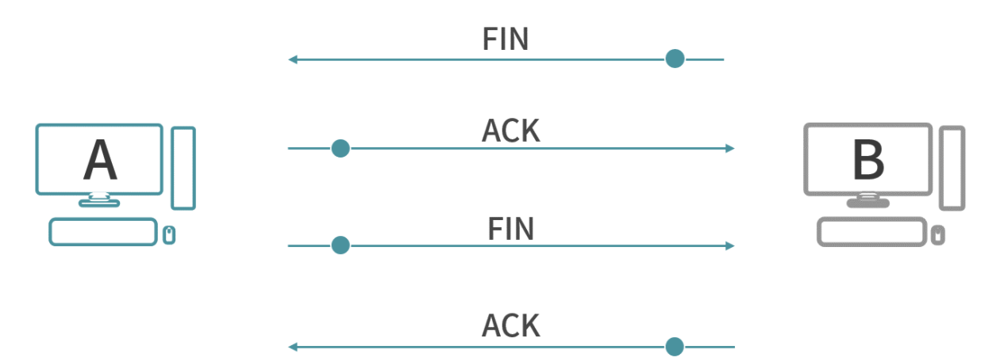


### 总结

```
TCP 提供连接（Connection），让双方的传输更加稳定、安全。

TCP 没有直接提供会话，因为应用对会话的需求多种多样，比如聊天程序会话在保持双方的聊天记录，电商程序会话在保持购物车、订单一致，所以会话通常在 TCP 连接上进一步封装，在应用层提供。

TCP 是一个面向连接的协议（Connection -oriented Protocol），说的就是 TCP 协议参与的双方（Host）在收发数据之前会先建立连接。后面我们还会学习 UDP 协议，UDP 是一个面向报文（Datagram-oriented）的协议——协议双方不需要建立连接，直接传送报文（数据）。

最后，连接需要消耗更多的资源。比如说，在传输数据前，必须先协商建立连接。因此，不是每种场景都应该用连接导向的协议。像视频播放的场景，如果使用连接导向的协议，服务端每向客户端推送一帧视频，客户端都要给服务端一次响应，这是不合理的。
```


### 面试题：TCP 为什么是 3 次握手，4 次挥手

```
【解析】TCP 是一个双工协议，为了让双方都保证，建立连接的时候，连接双方都需要向对方发送 SYC（同步请求）和 ACK（响应）。

握手阶段双方都没有烦琐的工作，因此一方向另一方发起同步（SYN）之后，另一方可以将自己的 ACK 和 SYN 打包作为一条消息回复，因此是 3 次握手——需要 3 次数据传输。

到了挥手阶段，双方都可能有未完成的工作。收到挥手请求的一方，必须马上响应（ACK），表示接收到了挥手请求。类比现实世界中，你收到一个 Offer，出于礼貌你先回复考虑一下，然后思考一段时间再回复 HR 最后的结果。最后等所有工作结束，再发送请求中断连接（FIN），因此是 4 次挥手
```


# 第二章 TCP 拆包和粘包

## 1、缓冲区

- 为了稳定性，一次发送的数据越多，出错的概率越大
- 为了效率，网络中有时候存在着并行的路径，拆分数据包就能更好地利用这些并行的路径
- 发送和接收数据的时候，都存在着缓冲区

```
- 缓冲区是在内存中开辟的一块区域，目的是缓冲。
- 因为大量的应用频繁地通过网卡收发数据，这个时候，网卡只能一个一个处理应用的请求。当网卡忙不过来的时候，数据就需要排队，也就是将数据放入缓冲区。
- 如果每个应用都随意发送很大的数据，可能导致其他应用实时性遭到破坏。
```


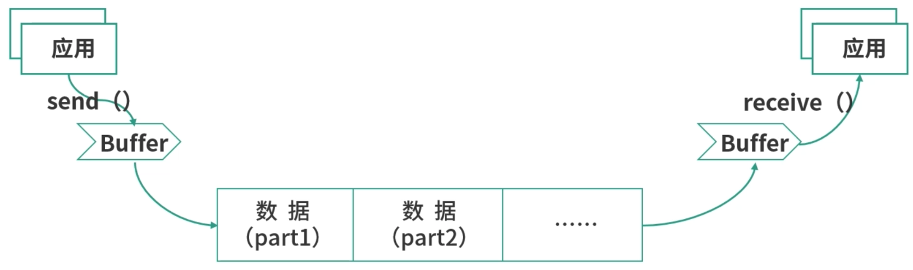


## 2、拆包

- 在 TCP 协议的设计当中，数据被拆分成很多个部分，部分增加了协议头。合并成为一个 TCP 段，进行传输。这个过程，我们俗称拆包。这些 TCP 段经过复杂的网络结构，由底层的 IP 协议，负责传输到目的地，然后再进行重组。
- 拆包是将数据拆分成多个 TCP 段传输


## 3、粘包

- 有时候，如果发往一个目的地的多个数据太小了，为了防止多次发送占用资源，TCP 协议有可能将它们合并成一个 TCP 段发送，在目的地再还原成多个数据，这个过程俗称粘包。
- 粘包是将多个数据合并成一个 TCP 段发送。


## 4、TCP 段（TCP Segment）

- 在传输层封包不能太大。这种限制，往往是以缓冲区大小为单位的。也就是 TCP 协议，会将数据拆分成不超过缓冲区大小的一个个部分。每个部分有一个独特的名词，叫作 TCP 段（TCP Segment）。
- TCP 协议就是依靠每一个 TCP 段工作的。

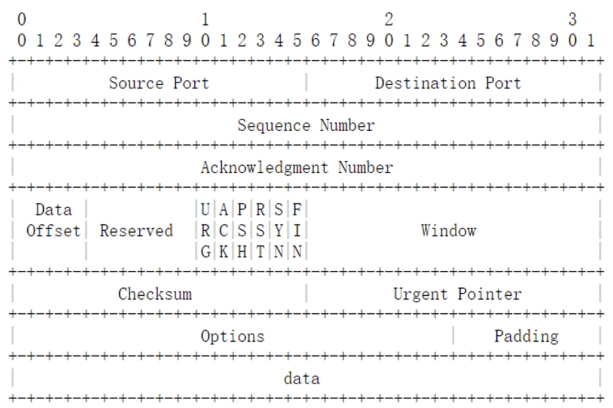


### （1）Source Port/Destination Port 

- 描述的是发送端口号和目标端口号，代表发送数据的应用程序和接收数据的应用程序。
- 比如 80 往往代表 HTTP 服务，22 往往是 SSH 服务……
- 类比快递包裹的发件人地址 和 收件人地址


### （2）Sequence Number 和 Achnowledgment Number 

- 保证可靠性的两个关键
- 类比快递包裹的编号

```
- 发出的每一个 TCP 段都需要有序号 Sequence Number（Seq）
- 发送数据的时候，为每一个 TCP 段分配一个自增的 Sequence Number
- 接收数据的时候，虽然得到的是乱序的 TCP 段，但是可以通过 Seq 进行排序
```


### （3）Data Offset

- 一个偏移量。
- 这个量存在的原因是 TCP Header 部分的长度是可变的，因此需要一个数值来描述数据从哪个字节开始。

- 类比快递包裹的大小


### （4）Reserved

- 很多协议设计会保留的一个区域，用于日后扩展能力。


### （5）URG/ACK/PSH/RST/SYN/FIN

- 标志位，用于描述 TCP 段的行为（也就是一个 TCP 封包到底是做什么用的）

```
- URG 代表这是一个紧急数据，比如远程操作的时候，用户按下了 Ctrl+C，要求终止程序，这种请求需要紧急处理。
- ACK 代表响应，所有的消息都必须有 ACK，这是 TCP 协议确保稳定性的一环。
- PSH 代表数据推送，也就是在传输数据的意思。
- SYN 同步请求，也就是申请握手。
- FIN 终止请求，也就是挥手。

特别说明一下：以上这 5 个标志位，每个占了一个比特，可以混合使用。比如 ACK 和 SYN 同时为 1，代表同步请求和响应被合并了。这也是 TCP 协议，为什么是三次握手的原因之一。
```


### （6）Window

- TCP 保证稳定性并进行流量控制的工具
- 类比快递包裹的运输方式（空运、陆运、水运）


### （7）Checksum

- 校验和，用于校验 TCP 段有没有损坏。

- 类比检查快递包裹有没有被拆过


### （8）Urgent Pointer

- 指向最后一个紧急数据的序号（Sequence Number）。
- 它存在的原因是：有时候紧急数据是连续的很多个段，所以需要提前告诉接收方进行准备。

- 类比快递包裹是一个加急快件


### （9）Options（如 MMS）

- 存储了一些可选字段，比如 MSS（Maximun Segment Size）。

```
- TCP Header 中的可选项（Options）
- MSS 可选项控制了 TCP 段的大小，它是一个协商字段（Negotiate）。
- TCP 段的大小（MSS）涉及发送、接收缓冲区的大小设置，双方实际发送接收封包的大小，对拆包和粘包的过程有指导作用，因此需要双方去协商

- 如果这个字段设置得非常大，就会带来一些影响。（因为大的 TCP 段，会降低性能，比如内存使用的性能。）
- MSS 太小的情况下，会浪费传输资源（降低吞吐量）。因为数据被拆分之后，每一份数据都要增加一个头部。如果 MSS 太小，那头部的数据占比会上升，这让吞吐量成为一个灾难。
```


### （10）Padding 

- 因为 Options 的长度不固定，需要 Pading 进行对齐。


## 【面试题】TCP 协议是如何恢复数据的顺序的，TCP 拆包和粘包的作用是什么？

```
【解析】
- TCP 拆包的作用是将任务拆分处理，降低整体任务出错的概率，以及减小底层网络处理的压力。
- 拆包过程需要保证数据经过网络的传输，又能恢复到原始的顺序。这中间，需要数学提供保证顺序的理论依据。
- TCP 利用（发送字节数、接收字节数）的唯一性来确定封包之间的顺序关系。
- 粘包是为了防止数据量过小，导致大量的传输，而将多个 TCP 段合并成一个发送。
```


# 第三章 TCP 滑动窗口算法（请求/响应模型演变）

## 3.1 请求 - 响应

```
- 每一个请求收到响应之后，再发送下一个请求，吞吐量会很低。
- 因为这样的设计，会产生网络的空闲时间（浪费带宽）
- 带宽没有用满，意味着可以同时发送更多的请求，接收更多的响应
```


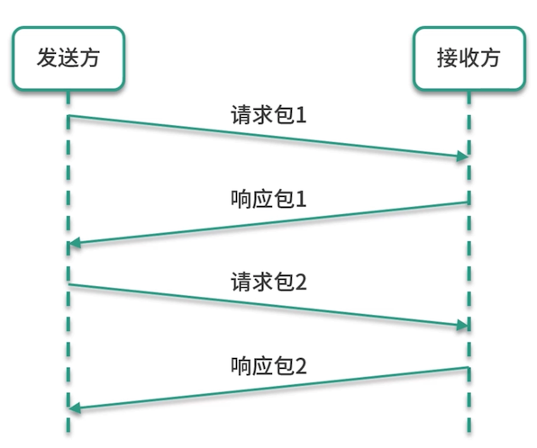


## 3.2 请求 响应

```
- 让发送方有请求就发送出去，而不是等待响应。
- 通过这样的处理方式，发送的数据连在了一起，响应的数据也连在了一起，吞吐量就提升了。

- 但是如果可以同时发送的数据真的非常多呢？比如成百上千个 TCP 段都需要发送，这个时候带宽可能会不足
```

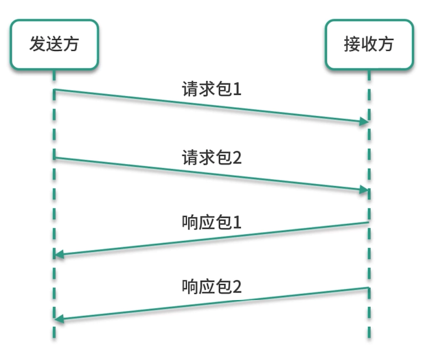


## 3.3 排队（Queuing）

```
- 在 TCP 层实现一个队列。新元素从队列的一端（左侧）排队，作为一个未发送的数据封包。开始发送的数据封包，从队列的右侧离开

- 这样做就需要多个队列，要将未发送的数据从队列中取出，加入发送中的队列。然后再将发送中的数据，收到 ACK 的部分取出，放入已接收的队列。而发送中的封包，何时收到 ACK 是一件不确定的事情，这样使用队列似乎也有一定的问题。
```

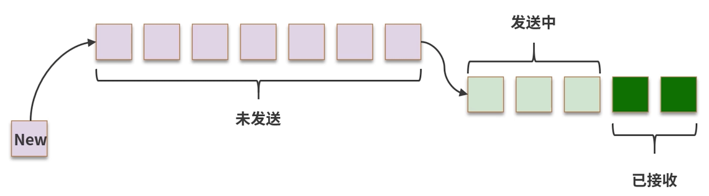

## 3.4 滑动窗口（Sliding Window）

### （1）简介

- TCP 作为一个传输层协议，最核心的能力是传输。(TCP 协议控制可靠性的核心)
- 传输需要保证可靠性，还需要控制流速，这两个核心能力均由滑动窗口提供。

- 滑动窗口中使用场景

```
- 比如设计一个分布式的 RPC 框架
- 实现一个消息队列
- 实现分布式的文件系统等
```


### （2）滑动窗口（是一种数据结构）

```
- 深绿色代表已经收到 ACK 的段
- 浅绿色代表发送了，但是没有收到 ACK 的段
- 白色代表没有发送的段
- 紫色代表暂时不能发送的段
```

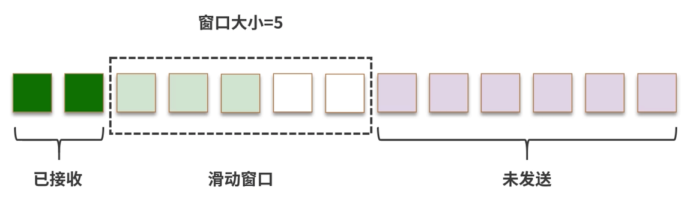


- 下面重新设计一下不同类型封包的顺序

  - 将已发送的数据放到最左边
  - 发送中的数据放到中间
  - 未发送的数据放到右边

  

- 假设最多同时发送 5 个封包，也就是窗口大小 = 5。窗口中的数据被同时发送出去，然后等待 ACK。

  - 如果一个封包 ACK 到达，就将它标记为已接收（深绿色）


- 如下图所示，有两个封包的 ACK 到达，因此标记为绿色。

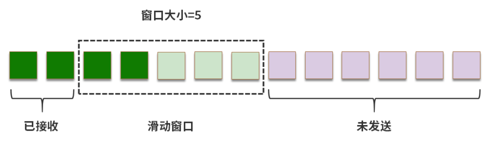

- 这个时候滑动窗口可以向右滑动，如下图所示

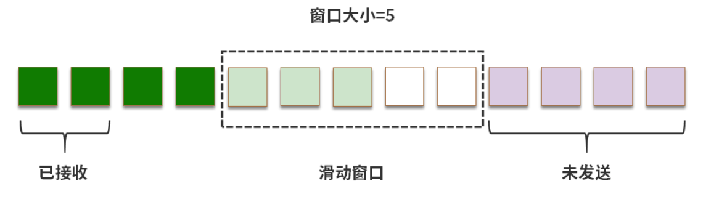


### （3）重传

- 如果发送过程中，部分数据没能收到 ACK ，就可能发生重传

- 如果发生下图这样的情况，段 4 迟迟没有收到 ACK

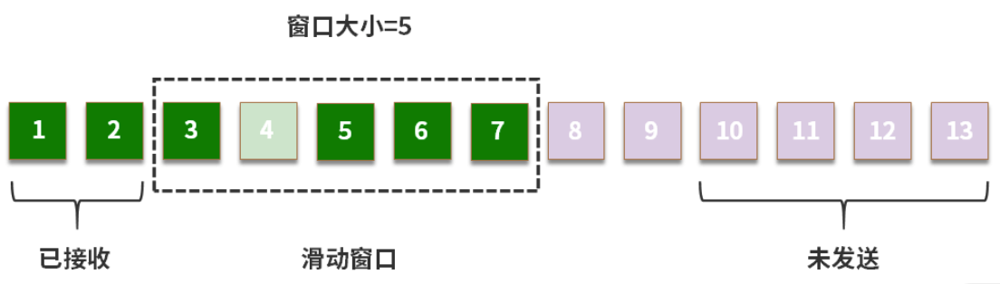

- 这个时候滑动窗口只能右移一个位置，如下图所示：

```
- 在这个过程中，如果后来段 4 重传成功（接收到 ACK），那么窗口就会继续右移
- 如果段 4 发送失败，还是没能收到 ACK，那么接收方也会抛弃段5、段6、段7
- 这样从段 4 开始之后的数据都需要重发。
```

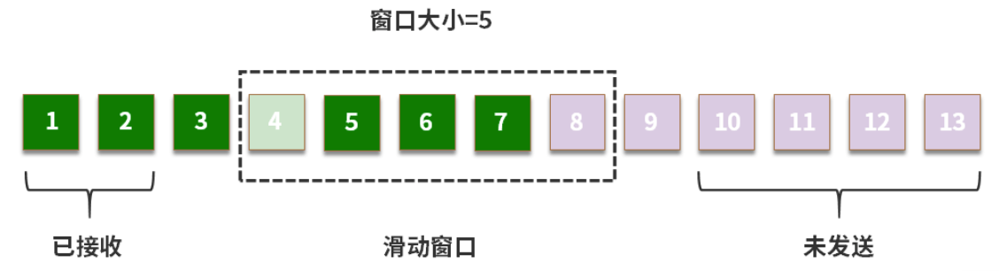


### （4）快速重传

- 在 TCP 协议中，如果接收方想丢弃某个段，可以选择不发 ACK
- 发送端超时后，会重发这个 TCP 段。
- 而有时候，接收方希望催促发送方尽快补发某个 TCP 段，这个时候可以使用==快速重传==。

```
- 例如段1、段2、段4 到了，但是段3没有到
- 接收方可以发送多次段3的 ACK
- 如果发送方收到多个段3的 ACK，就会重发段3。这个机制称为快速重传。这和超时重发不同，是一种催促的机制。

- 为了不让发送方误以为段3已经收到了，在快速重传的情况下，接收方即便收到发来的段4，依然会发段3的 ACK（不发段4的 ACK），直到发送方把段3重传。
```


### （5）流速控制

- 每个 TCP 段的大小不同，限制数量会让接收方的缓冲区不好操作，因此实际操作中窗口大小单位是字节数。
- 发送、接收窗口的大小可以用来控制 TCP 协议的流速。

```
- 窗口越大，同时可以发送、接收的数据就越多，支持的吞吐量也就越大
- 当然，窗口越大，如果数据发生错误，损失也就越大，因为需要重传越多的数据
```


- 举个例子

```
用 RTT 表示 Round Trip Time，就是消息一去一回的时间

假设 RTT = 1ms，带宽是 1mb/s。
如果窗口大小为 1kb，那么 1ms 可以发送一个 1kb 的数据（含 TCP 头），1s 就可以发送 1mb 的数据，刚好可以将带宽用满。
如果 RTT 再慢一些，比如 RTT = 10ms，那么这样的设计就只能用完 1/10 的带宽。 
当然可以提高窗口大小提高吞吐量，但是实际的模型会比这个复杂，因为还存在重传、快速重传、丢包等因素。

而实际操作中，也不可以真的把带宽用完，所以最终会使用折中的方案，在延迟、丢包率、吞吐量中进行选择，毕竟鱼和熊掌不可兼得。
```


## 【面试题】滑动窗口和流速控制是怎么回事？

```
滑动窗口是 TCP 协议控制可靠性的核心。发送方将数据拆包，变成多个分组。然后将数据放入一个拥有滑动窗口的数组，依次发出，仍然遵循先入先出（FIFO）的顺序，但是窗口中的分组会一次性发送。窗口中序号最小的分组如果收到 ACK，窗口就会发生滑动；如果最小序号的分组长时间没有收到 ACK，就会触发整个窗口的数据重新发送。

另一方面，在多次传输中，网络的平均延迟往往是相对固定的，这样 TCP 协议可以通过双方协商窗口大小控制流速
```


# 第四章 UDP 协议

## 1、UDP 简介

### 1.1 UDP 概述

- UDP（User Datagram Protocol），目标是在传输层提供直接发送报文（Datagram）的能力。Datagram 是数据传输的最小单位。UDP 协议不会帮助拆分数据，它的目标只有一个，就是发送报文。


### 1.2 UDP 使用场景

- UDP 在数据传输、网络控制、音视频、Web 技术中，都有很重要的地位


### 1.3 UDP 的核心价值

- TCP 最核心的价值是提供了可靠性
- UDP 最核心的价值是灵活，你几乎可以用它来做任何事情。
  - 例如：HTTP 协议 1.1 和 2.0 都基于 TCP，而到了 HTTP 3.0 就开始用 UDP 了。


### 1.4 为什么不直接调用 IP 协议呢？

- 因为传输层协议在承接上方应用层的调用，需要提供应用到应用的通信——因此要附上端口号。
- 每个端口，代表不同的应用。
- 传输层下层的 IP 协议，承接传输层的调用，将数据从主机传输到主机。
- IP 层不能区分应用，导致哪怕是在 IP 协议上进行简单封装，也需要单独一个协议。这就构成了 UDP 协议的市场空间。


## 2、UDP 的封包格式

- UDP 的设计目标就是在允许用户直接发送报文的情况下，最大限度地简化应用的设计。

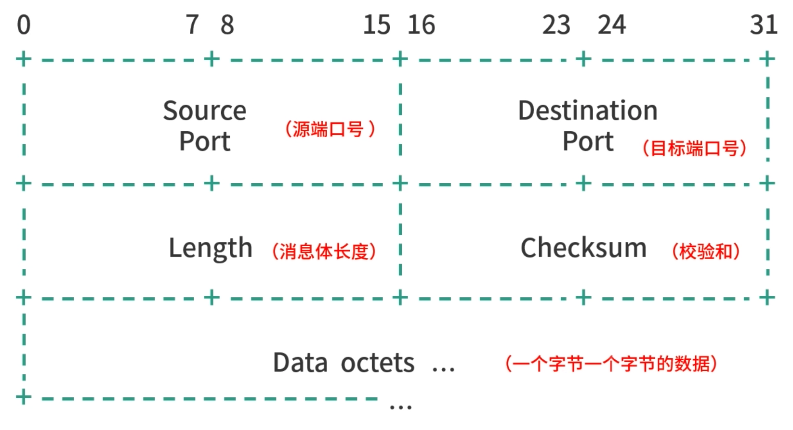

### （1）Source Port（源端口号）

- 因为 UDP 协议的特性（不需要 ACK），因此这个字段是可以省略的。
- 但有时候对于防火墙、代理来说，Source Port 有很重要的意义，它们需要用这个字段行过滤和路由。


### （2）Destination Port （目标端口号）

- 这个字段不可以省略


### （3）Length（消息体长度）


### （4）Checksum（校验和）

- 作用是检查封包是否出错
- 如果一个数据封包 Datagram 发生了数据损坏，UDP 可以通过 Checksum 纠错或者修复。 
- 但是 UDP 没有提供再多的任何机制，比如 ACK、顺序保证以及流控等。


### （5）Data octets

- 一个字节一个字节的数据，Octet 是 8 位。


# 第五章 UDP 与 TCP的区别

## 1、目的差异

- TCP 协议的核心目标是提供可靠的网络传输
- UDP 的目标是在提供报文交换能力基础上尽可能地简化协议轻装上阵


## 2、可靠性差异

- TCP 核心是要在保证可靠性提供更好的服务。

```
- TCP 会有握手的过程，需要建立连接，保证双方同时在线。
- 而且 TCP 有时间窗口持续收集无序的数据，直到这一批数据都可以合理地排序组成连续的结果。
```

- UDP 只管发送数据封包

```
- UDP 并不具备 TCP 的那些特性
- UDP 不需要 ACK，这意味着消息发送出去成功与否 UDP 是不管的
```


## 3、连接 vs 无连接

- TCP 是一个面向连接的协议（Connection-oriented Protocol），传输数据必须先建立连接。 
- UDP 是一个无连接协议（Connection-less Protocol），数据随时都可以发送，只提供发送封包（Datagram）的能力。


## 4、流控技术（Flow Control）

- TCP 使用了流控技术来确保发送方不会因为一次发送过多的数据包而使接收方不堪重负。

```
- TCP 在发送缓冲区中存储数据
- 在接收缓冲区中接收数据

- 当应用程序准备就绪时，它将从接收缓冲区读取数据。
- 如果接收缓冲区已满，接收方将无法处理更多数据，并将其丢弃。
```

- UDP 没有提供类似的能力。


## 5、传输速度

- UDP 协议简化，封包小，没有连接、可靠性检查等，因此单纯从传输速度上讲，UDP 更快。


## 6、场景差异

- TCP 每个数据封包都需要确认，不适应高速数据传输场景

```
比如观看视频（流媒体应用）、网络游戏（TCP 有延迟）等。
- 具体来说，如果网络游戏用 TCP，每个封包都需要确认，可能会造成一定的延迟；
- 再比如音、视频传输天生就允许一定的丢包率；
- Ping 和 DNSLookup，这类型的操作只需要一次简单的请求/返回，不需要建立连接，用 UDP 就足够了。
```

- TCP/UDP 的边界逐渐变得模糊，UDP 应用越来越多

```
- 比如传输文件，如果考虑希望文件无损到达，可以用 TCP。如果考虑希望传输足够块，就可能会用 UDP。

- 再比如 HTTP 协议，如果考虑请求/返回的可靠性，用 TCP 比较合适。但是像 HTTP 3.0 这类应用层协议，从功能性上思考，暂时没有找到太多的优化点，但是想要把网络优化到极致，就会用 UDP 作为底层技术，然后在 UDP 基础上解决可靠性。

- 所以理论上，任何一个用 TCP 协议构造的成熟应用层协议，都可以用 UDP 重构。这就好比，本来用一个工具可以解决所有问题，但是如果某一类问题体量非常大，就会专门为这类问题创造工具。因此，UDP 非常适合需要定制工具的场景。
```


### （1）TCP 场景

```
- 远程控制（SSH）
- File Transfer Protocol（FTP）
- 邮件（SMTP、IMAP）等
- 点对点文件传出（微信等）
```

### （2）UDP 场景

```
- 网络游戏
- 音视频传输
- DNS
- Ping
- 直播
```

### （3）模糊地带（TCP、UDP 都可以考虑）

```
- HTTP（目前以 TCP 为主）
- 文件传输
```


## 学习 TCP 和 UDP 的好处

- 学习 TCP 协议可以培养你思维的缜密性——序号的设计、滑动窗口的设计、快速重发的设计、内在状态机的设计，都是非常精妙的想法；

- 学习 UDP 协议可以带动我们反思自己的技术架构，有时候简单的工具更受欢迎。Linux 下每个工具都是那么简单、专注，容易理解。相比 TCP 协议，UDP 更容易理解。


## 【面试题】TCP 协议和 UDP 协议的优势和劣势？

```
【解析】
- TCP 最核心的价值就是提供封装好的一套解决可靠性的优秀方案。解决可靠性是非常复杂的，要考虑非常多的因素。TCP 帮助我们在确保吞吐量、延迟、丢包率的基础上，保证可靠性。

- UDP 提供了最小版的实现，只支持 Checksum。
- UDP 最核心的价值是灵活、轻量、传输速度快。考虑到不同应用的特性，如果不使用一个大而全的方案，为自己的应用特性量身定做，可能会做得更好。
- 比如网络游戏中游戏客户端不断向服务端发送玩家的位置，如果某一次消息丢失了，只要这个消息不影响最终的游戏结果，就可以只看下一个消息。不同应用有不同的特性，需要的可靠性级别不一样，这就是越来越多的应用开始使用 UDP 的原因之一。

最后还有一个非常重要的考虑因素就是成本，如果没有足够专业的团队解决网络问题，TCP 无疑会是更好的选择。
```


# 第六章 思考题

## 【问题】一台内存在 8G 左右的服务器，可以同时维护多少个连接？

【解析】连接是内存中的状态对象，从理论上分析，连接本身不太占用内存。不同语言连接对象大小不等，但是通常很小。

```java
public class Server {
    public static void main(String[] argv) throws IOException {
        var serverSocket = new ServerSocket();
        var addr = new InetSocketAddress(3001);
        serverSocket.bind(addr);
        var list = new LinkedList<>();
        while(true) {
            var client = serverSocket.accept();
            list.add(client);
            System.out.println(list.size());
        }
    }
}
public class Client {
    public static void main(String[] argv) throws IOException, InterruptedException {
        var clients = new LinkedList<>();
        for(int i = 0; i < 1000000; i++) {
            var client = new Socket("127.0.0.1", 3001);
            clients.add(client);
        }
        Thread.sleep(10000000);
    }
}
```

通过运行上面这段程序，你可以观察到以下这几个现象：

- 创建 100W 连接速度不是很快，这说明 TCP 连接创建有成本（3 次握手，都是网络 IO）；

- 用jps找到对应的进程的id，在用sudo cat /proc/{进程ID}/status | grep VmHWM可以看到实际的内存占用。按照这种增长趋势，8G 内存空间可以轻轻松松存放 100W 个连接。
- 但是如果单机建立太多的连接，会报一个Cannot assign requested address的异常，这是因为客户端连接服务端时，操作系统要为每个客户端分配一个端口，上面的程序很快会把端口号用尽。
- 所以，我们可以得出一个结论：核心的问题是，通信需要缓冲区，通信需要 I/O。这是因为通信占用资源，连接本身占用资源少。


## 【问题】既然发送方有窗口，那么接收方也需要有窗口吗？

【解析】我们一起思考下，接收方收到发送方的每个数据分组（或者称为 TCP Segment），接收方肯定需要缓存。举例来说，如果发送方发送了：1, 2, 3, 4。 那么接收方可能收到的一种情况是：1，4，3。注意，没有收到 2 的原因可能是延迟、丢包等。这个时候，接收方有两种选择。

- 选择一：什么都不做（这样分组 2 的 ACK 就不会发送给发送方，发送方发现没有收到 2 的 ACK，过一段时间就有可能重发 2,3,4,5）。 当然具体设计还需要探讨，比如不重发整个分组，只重发已发送没有收到 ACK 的分组。
- 这种方法的缺陷是性能太差，重发了整个分组（或部分）。因此我们可以考虑另一种选择。


- 选择二：如果重发一个窗口，或部分窗口，问题就不会太大了。虽然增加了网络开销，但是毕竟有进步（1 进步了，不会再重发）。

- 性能方面最大的开销是等待超时的时间，就是发送方要等到超时时间才重发窗口，这样操作性能太差。因此，TCP 协议有一个快速重传的机制——接收方发现接收到了 1，但是没有接收到 2，那么马上发送 3 个分组 2 的 ACK 给到发送方，这样发送方收到多个 ACK，就知道接收方没有收到 2，于是马上重发 2。

  

- 无论是上面哪种方案，接收方也维护一个滑动窗口，是一个不错的选择。接收窗口的状态，可以和发送窗口的状态相互对应了。


## 【问题】Moba 类游戏的网络应该用 TCP 还是 UDP？

【解析】所有在线联机游戏都有件非常重要的事情需要完成，就是确定事件发生的唯一性，这个性质和聊天工具是类似的。听我这么说，是不是有点迷？请听我慢慢道来。

你在王者荣耀中控制后羿释放技能，这是一个事件。同时，王昭君放了大招，这是第二个事件。两个事件一定要有先后顺序吗？答案是当然要有。因为游戏在同一时刻只能有一个状态。

类比一下，多个线程同时操作内存，发生了竞争条件（具体分析可以参见《重学操作系统》专栏关于“线程”的内容），那么是不是意味着，内存在同一时刻有两个状态呢？当然不是，==内存同时刻只能有一个状态，所以多个线程的操作必须有先有后。==

回到 Moba 游戏的问题，每个事件，游戏服务器必须给一个唯一的时序编号，对应后羿的技能和王昭君的技能。所以，==在线竞技类游戏，事实上是玩家在不断向服务器竞争一个自增序列号的过程。无论客户端发生怎样的行为，只有竞争到自增 ID 才能进步。==也就是说，服务器要尽快响应多个客户端提交的事件，并以最快的速度分配自增序号，然后返回给客户端。

所以，==Moba 服务端的核心是自增序号的计算和尽量缩减延迟==。从这个角度出发，你再来看看，应该用 TCP 协议还是 UDP 协议呢？

虽然TCP 协议有 3 次握手，但是连接上之后，双方就不会再有额外的传输成本，因此创建连接的成本，可以忽略不计。

同时，TCP 协议还提供稳定性支持，不需要自己实现稳定性。如果规模较小的在线竞技类游戏，TCP 完全适用。但是当游戏玩家体量上升后，TCP 协议的头部（数据封包）较大，会增加服务器额外的 I/O 压力。要发送更多的数据，自然有更大的 I/O 压力。从这个角度来看，UDP 就有了用武之地。


# 总结

- 当你既要保证 FIFO，又要提供多处理的数据结构时，可以想到滑动窗口；
- 当你设计请求/响应模型的时，可以想到多路复用；
- 当你为自己的应用选择协议时，可以想到实现可靠性最基本的思路。
