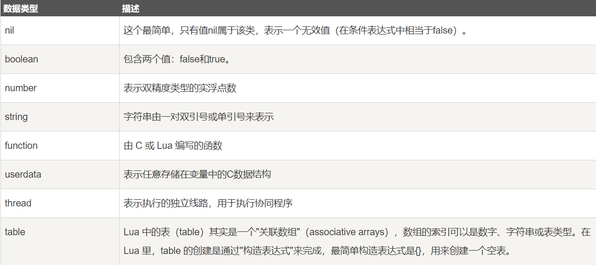

> 当前位置：【03】脚本语言 -> 3.1_Lua

# Lua 安装

```bash
# 下载
cd /usr/local/
curl -R -O http://www.lua.org/ftp/lua-5.3.5.tar.gz

# 解压
tar xf lua-5.3.5.tar.gz

# 安装
cd /usr/local/lua-5.3.5
make linux test

# 查看版本
lua -v

# 如果不是 5.3.5 版本，需要执行下面的操作替换系统自带版本
rm -rf /usr/bin/lua
ln -s /usr/local/lua-5.3.5/src/lua /usr/bin/lua
```

# 第一章 Lua 简介

## 1、Lua 概述

- Lua 是一个小巧的==脚本语言==。它是巴西里约热内卢天主教大学（Pontifical Catholic University of Rio de Janeiro）里的一个由Roberto Ierusalimschy、Waldemar Celes 和 Luiz Henrique de Figueiredo三人所组成的研究小组于1993年开发的。 
- 其设计目的是为了通过灵活嵌入应用程序中从而为应用程序提供灵活的扩展和定制功能。
- Lua由标准C编写而成，几乎在所有操作系统和平台上都可以编译，运行。
- Lua并没有提供强大的库，这是由它的定位决定的。所以Lua不适合作为开发独立应用程序的语言。
- Lua 有一个同时进行的JIT项目，提供在特定平台上的即时编译功能。
- Lua脚本可以很容易的被C/C++ 代码调用，也可以反过来调用C/C++的函数，这使得Lua在应用程序中可以被广泛应用。不仅仅作为扩展脚本，也可以作为普通的配置文件，代替XML、ini等文件格式，并且更容易理解和维护。
-  Lua由标准C编写而成，代码简洁优美，几乎在所有操作系统和平台上都可以编译，运行。
-  一个完整的Lua解释器不过200k，在所有脚本引擎中，Lua的速度是最快的。这一切都决定了Lua是作为嵌入式脚本的最佳选择。

## 2、Lua 特性

- 一个小巧的脚本语言
- 设计目的是为了通过灵活嵌入应用程序中从而为应用程序提供灵活的扩展和定制功能
- 所有操作系统和平台上都可以编译、运行Lua脚本
- 所有脚本引擎中，Lua的速度是最快的

## 3、Lua 应用场景

- 游戏开发
- 独立应用脚本
- 高性能Web应用（天猫、京东都有应用）
- 扩展和数据库插件如：MySQL Proxy 和 MySQL WorkBench

# 第二章 Lua 语法

## 0、进入 Lua

```lu
lua -i
```

## 1、打印

```lua
print("springcloud alibaba")
```

## 2、数据类型



```lua
print(type("Hello world"))      --> string
print(type(10.4*3))             --> number
print(type(true))               --> boolean

print(type(print))              --> function
print(type(type))               --> function

print(type(nil))                --> nil
print(type(type(X)))            --> string
```

## 3、变量

- 变量在使用前，需要在代码中进行声明，即创建该变量

### （1）全局变量

```lua
> age=19
> print(age)
19
```

### （2）局部变量

```lua
> local username=wangwu
> print(username)

-- 此时username不是全局变量，一般在某个方法中使用，不能全局使用，所以输出nil。
nil
```

### （3）表中的域

```lua

```

## 4、对象（table）

```lua
> --定义对象resp
> resp = {}

> --往对象resp中添加属性name，赋值为zhangsan
> resp["name"]="zhangsan"

> --往对象resp中添加属性address，赋值为hunanchangsha
> resp["address"]="hunanchangsha"

> --输出对象resp中的name属性值
> print(resp["name"])

zhangsan
```

## 5、函数

- 创建一个函数，其实就是创建一个方法，函数以 function 开始，end 结束，可以在 end 之前有返回值，也可以有入参

```lua
> --定义userinfo方法，入参为age
> function userinfo(age)
    
>> --age在原有基础上+1
>> age=age+1
    
>> --返回变化后的age
>> return age
    
>> --结束
>> end


> print(userinfo(19))
20
```

## 6、拼接

- 使用2个点拼接..

```lua
> print(userinfo(19).."岁了")
20岁了
```

## 7、逻辑判断

```lua
> function userinfo(age)
    
>> if age>=18 then
>> return "成年人"
>> else
>> return "未成年"
-- 结束if
>> end
    
-- 结束 function
>> end

> print(userinfo(17))
未成年
```

## 8、脚本编程

- course.lua

```lua
--定义一个对象
local course = {}

--定义一个方法
function course.courseName(id)
    if id==1 then
        return "java"
    else
        return "UI"
    end
end

-- 返回这个 course 对象
return course
```

- student.lua

```lua
-- 使用 require 导入 course.lua
local cr = require("course")

-- 调用 courseName 方法
local result = cr.courseName(1)

print(result)
```

- 执行 student.lua

```bash
[root@server1 lua]# lua student.lua
java
```

