> 当前位置：【Java】01_Java基础  -> 1.8_IO

# 第一章 IO 流

## 1、文件类 - File

### 1.1 前导知识

```bash
# 绝对路径：从盘符开始到文件的全路径
File file = new File(“C:\\XXX\project”);
File file = new File(“C:\\XXX\project\myfile.txt”);

# 相对路径：从某个参照物路径开始到指定文件所经过的路径（相对与谁就在谁的下面）
File file = new File(“myfile.txt”);

# 换行符：可以写在第一个数据的结尾，也可以写在第二个数据的开头
Windows：\r\n
Linux：\n
Mac：\r
```


### 1.2 简介

- File类：File文件和目录路径名的抽象表示形式

- 数据需要持久化存储到最适合的地方 - 硬盘文件上，Java提供了File类来表示文件

- 每个File对象就代表硬盘上的一个文件或者文件夹

  - Java中把文件或者目录（文件夹）都封装成File对象，也就是说如果要去操作硬盘上的文件，或者文件夹只要找到File这个类即可

  - 虽然File类封装的为文件路径或者文件夹路径，但是通过路径可以找到对应的文件或者文件夹，所以File类代表文件或文件夹


### 1.3 静态成员变量

```java
// API：与系统有关的路径分隔符，为了方便，它被表示为一个字符串
// 功能：目录的分割（win系统是一个分号，Linux系统下是冒号）
[String] pathSeparator
    
// API：与系统有关的路径分隔符
[char] pathSeparatorChar

// API：与系统有关的默认名称分隔符，为了方便，它被表示为一个字符串
// 功能：目录名称分割（win系统是向右 \，Linux系统下是向左 /）
[String] separator

// API：与系统有关的默认名称分隔符
[char] separatorChar
```


### 1.4 常用构造方法

```java
File(File parent, String child)
// API：根据 parent 抽象路径名和 child 路径名字符串创建一个新 File 实例
// 功能：传递路径，传递File类型父路径，字符串子路径
// 好处：父路径是File类型，父路径可以直接调用File类方法

File(String pathname)
// API：通过将给定路径名字符串转换为抽象路径名来创建一个新 File 实例
// 功能：传递路径名，将路径封装File类型对象，可以写到文件夹，可以写到一个文件

File(String parent, String child)
// API：根据 parent 路径名字符串和 child 路径名字符串创建一个新 File 实例
// 功能：传递路径，传递字符串父路径，字符串子路径
// 好处: 单独操作父路径和子路径

File(URI uri)
// API：通过将给定的 file: URI 转换为一个抽象路径名来创建一个新的 File 实例
```


### 1.5 常用成员方法

#### （1）创建功能

```java
// 创建单个文件夹
[boolean] mkdir( )  

// 创建多层文件夹（如果文件夹已经存在了，则不再创建）
[boolean] mkdirs( )  

// 创建的文件路径和文件名（如果文件已经存在了，则不再创建，如果路径错误，IOException）
[boolean] createNewFile( )  
```

#### （2）删除功能

```java
[boolean] delete()  
// 删除的文件或者是文件夹（删除成功返回true，删除失败返回false）
// 删除方法，不走回收站，直接从硬盘中删除
// 删除目录时，如果目录中有内容，无法直接删除
```

#### （3）获取功能

```java
[String] getAbsolutePath( )  
// 返回此抽象路径名的绝对路径名字符串

[String] getName( )  
// 返回由此抽象路径名表示的文件或目录的名称

[String] getPath( )
// 将此抽象路径名转换为路径名字符串

[long] length( )  
// 返回由此抽象路径名表示的文件的长度
```

#### （4）判断功能

```java
[boolean] isDirectory( )  
// 测试此抽象路径名表示的文件是否为目录

[boolean] isFile( )  
// 测试此抽象路径名表示的文件是否为普通文件
```


#### （5）获取一个目录中的所有文件夹下的所有文件

- 注意

  - 指定的目录必须是存在的
  - 指定的必须是目录，否则容易引发返回数组为 null，出现 NullPointerException

```java
String[ ] list( )  
// 返回一个字符串数组，命名由此抽象路径名表示的目录中的文件和目录
    
File[ ] listFiles( )  
// 返回一个抽象路径名数组，表示由该抽象路径名表示的目录中的文件
// 获取目录下当前文件和文件夹的绝对路径
```


## 2、IO 流 - 引入

- 当使用集合持有数据时，这些数据都存在于内存中，一旦程序运行结束，这些数据将会从内存中清除，下次再想使用这些数据，已经没有了

- 如果希望将数据永久地保存下来，可以使用IO，将这些数据持久化存储起来

- 要把数据持久化存储就需要把内存中的数据存储到内存以外的其他持久化设备（硬盘，光盘，U盘）上，此时需要数据的输入（in）输出（out）


## 3、IO 流 - 简介

### 3.1 IO 流 - 概述

- I：input，输入，读，把持久设备上的数据读取到内存中
- O：output，输出，写，把内存中的数据存储到持久化设备上
- 流：数据、字节、字符

### 3.2 IO 流 - 作用

- 用来处理设备之间的数据传输

- 文件复制

- 上传文件

- 下载文件


### 3.3 IO 流 - 流程图

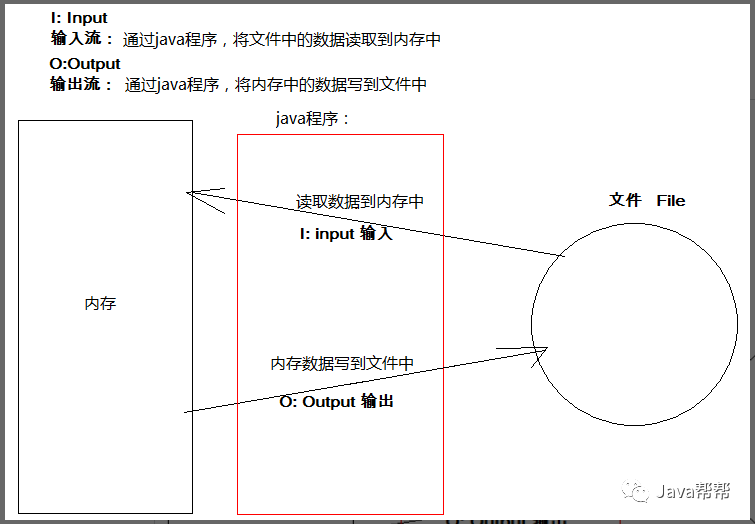


## 4、IO 流分类（按流向分）

- 输入流（每个IO流对象均要绑定一个IO资源）

- 输出流（每个IO流对象均要绑定一个IO资源）


## 5、IO 流分类（按类型分）

### 5.1 字节流（操作字节的流，底层是字节，可以是任何数据）

#### （1）概述

- 在数据传输过程中，一切数据(文本、图像、声音等)最终存储的均为一个个字节，即二进制数字。所以数据传输过程中使用二进制数据可以完成任意数据的传递

- 当向一个文件中存储一定数据(一些数字)，如果使用文本方式打开，则会以文本的方式解释数据。如果以视频的方式打开，则会以视频的方式解释数据。音频、可行执行文件等亦是如此。所以，在文件传输过程中，传输的始终为数据

#### （2）字节输出流 

##### 抽象类：OutputStream

- 抽象方法

```java
[abstract void] write(int b)
// API：将指定的字节写入此输出流
// 输出一个字节；(使用int替代了byte)
```

- 普通方法

```java
[void] write(byte[] b)
// API：将 b.length字节从指定的字节数组写入此输出流
// 输出一个字节数组

[void] write(byte[] b, int off , int len)
// API：从指定的字节数组写入 len个字节，从偏移 off开始输出到此输出流
// 输出字节数组的一部分

[void] flush( )
// API：刷新此输出流并强制任何缓冲的输出字节被写出。
// 刷新此输出流并强制写出所有缓冲的输出字节；

[void] close( )
// API：关闭此输出流并释放与此流相关联的任何系统资源
// 由于每个IO流都需要绑定一个IO资源，在使用时，需要回收资源
```


##### 子类：FileOutputStream（字节输出流 - 文件）

- 简介

  - 文件输出流，是基本输出流

  - 用于将数据写入 File的输出流  
- 类结构

```
java.lang.Object
	- java.io.OutputStream
 		 - java.io.FileOutputStream
```

- 构造方法

```java
FileOutputStream(String name) 
// API：创建文件输出流以指定的名称写入文件
// 创建覆盖写出对象

FileOutputStream(String name, boolean append) 
// API：创建文件输出流以指定的名称写入文件
// 创建指定是否追加写出对象

// 其他构造方法：写出时，如果没有该文件对象，会自动创建文件对象
FileOutputStream(File file) 
// API：创建文件输出流以写入由指定的 File对象表示的文件

FileOutputStream(File file, boolean append) 
// API：创建文件输出流以写入由指定的 File对象表示的文件
```


##### 子类：ObjectOutputStream（序列化流/从流中读取对象的操作流）

- 简介

  - 将一个对象存储到持久化(硬盘)的设备上

  - 对象序列化要继承Serializable接口
- 类结构

```java
- java.lang.Object
  - java.io.OutputStream
    - java.io.ObjectOutputStream
```

- 成员方法

```java
[void] writeObject(Object obj)  
// 将指定的对象写入ObjectOutputStream
```

- 使用注意

```java
// 容易产生的异常
当一个对象要能被序列化，这个对象所属的类必须实现Serializable接口。否则会发生异常NotSerializableException异常
同时当反序列化对象时，如果对象所属的class文件在序列化之后进行了修改，那么进行反序列化也会发生异常InvalidClassException
    
// serialVersionUID
给需要序列化的类，提供了一个序列版本号，目的在于验证序列化的对象和对应类是否版本匹配
只是一个对象的标记，防止类升级了，对象与类的信息不一致
    
// transient（瞬态关键字）
只要被transient修饰了，序列化时这个属性就不会被序列化了
同时静态修饰也不会被序列化，因为序列化是把对象数据进行持久化存储，而静态的属于类加载时的数据，不会被序列化
```


##### BufferedOutputStream（字节缓冲输出流/缓冲流/高效流）

- 简介

  - 高效流使用普通流对象作为构造方法参数。将普通流包装，提供高效的装饰

  - 内部包含了一个缓冲区，通过缓冲区读写，就可以提高了IO流的读写速度

  - 关闭流时只需要关闭高效流即可
- 类结构

```java
- java.lang.Object
    - java.io.OutputStream
      - java.io.FilterOutputStream
        - java.io.BufferedOutputStream
```

- 构造方法

```java
BufferedOutputStream(OutputStream out)
// 创建一个新的缓冲输出流，以将数据写入指定的底层输出流
```


##### PrintStream（字节打印流）

- 类结构

```java
- java.lang.Object
  - java.io.OutputStream
    - java.io.FilterOutputStream
      - java.io.PrintStream
```

- 成员方法

```java
[void] print(String str)
// 输出任意类型的数据
    
[void] println(String str)
// 输出任意类型的数据，自动写入换行操作
```


#### （3）字节输入流 

##### 抽象类：InputStream

- 抽象方法

```java
[abstract int] read( ) 
// API：从输入流读取数据的下一个字节
// 读取一个字节, 返回的是字节内容本身，读取到末尾返回-1
```

- 普通方法

```java
[int] available( ) 
// API：返回从该输入流中可以读取（或跳过）的字节数的估计值，而不会被下一次调用此输入流的方法阻塞

[void] close( ) 
// API：关闭此输入流并释放与流相关联的任何系统资源
// 由于每个IO流都需要绑定一个IO资源，在使用时，需要回收资源

[void] mark(int readlimit) 
// API：标记此输入流中的当前位置

[boolean] markSupported() 
// API：测试这个输入流是否支持 mark和 reset方法

[int] read(byte[] b) 
// API：从输入流读取一些字节数，并将它们存储到缓冲区 b 
// 使用字节数组读取文件，每一个都把数据添加到数组中返回, 返回值 len ,表示当前次读取到的有效字符数，提高读取的效率

[int] read(byte[] b, int off, int len) 
// API：从输入流读取最多 len字节的数据到一个字节数组

[void[] reset( )   
// API：将此流重新定位到上次在此输入流上调用 mark方法时的位置

[long] skip(long n) 
// API：跳过并丢弃来自此输入流的 n字节数据
```


##### 子类：FileInputStream（字节输入流 - 文件）

- 简介
  - 从文件系统中的某个文件中获得输入字节
- 类结构

```java
- java.lang.Object
  - java.io.InputStream
    - java.io.FileInputStream
```

- 构造方法

```java
FileInputStream(String name)
// API：通过打开与实际文件的连接来创建一个 FileInputStream ，该文件由文件系统中的路径名 name命名

FileInputStream(File file)
// API：通过打开与实际文件的连接创建一个 FileInputStream ，该文件由文件系统中的 File对象 file命名	
```


##### 子类：ObjectInputStream（反序列化流/向流中写入对象的操作流）

- 类结构

```java
- java.lang.Object
  - java.io.InputStream
    - java.io.ObjectInputStream
```

- 成员方法

```java
[Object] readObject( )   
// 从ObjectInputStream读取一个对象
```


##### BufferedInputStream（字节缓冲输入流/缓冲流/高效流）

- 简介

  - 高效流使用普通流对象作为构造方法参数。将普通流包装，提供高效的装饰

  - 内部包含了一个缓冲区，通过缓冲区读写，就可以提高了IO流的读写速度

  - 关闭流时只需要关闭高效流即可
- 类结构

```java
- java.lang.Object
  - java.io.InputStream
    - java.io.FilterInputStream
      - java.io.BufferedInputStream
```

- 构造方法

```java
BufferedInputStream(InputStream in)
// 创建一个 BufferedInputStream并保存其参数，输入流 in ，供以后使用
```


### 5.2 字符流（操作字符的流，只能操作文本文件）

#### （1）概述

- 字符流底层仍然为字节流

- 字符流只能操作字符，无法操作其他数据，如声音、视频等


#### （2）字符输出流

##### 抽象类：Writer


##### 子类：BufferedWriter（字符缓冲输出流/缓冲流/高效流）

- 简介

  - 将文本写入字符输出流，缓冲各个字符，从而提供单个字符、数组和字符串的高效写入

  - 高效流使用普通流对象作为构造方法参数。将普通流包装，提供高效的装饰

  - 内部包含了一个缓冲区，通过缓冲区读写，就可以提高了IO流的读写速度

  - 关闭流时只需要关闭高效流即可
- 类结构

```java
- java.lang.Object
  - java.io.Writer
    - java.io.BufferedWriter
```


- 常用成员方法

```java
[void] newLine()
// 功能：写一个换行符，这个换行符根据系统不同插入不同的换行符
```


##### 子类：PrintWriter（字符打印流）

- 类结构

```java
- java.lang.Object
    - java.io.Writer
      - java.io.PrintWriter
```

- 构造方法

```java
PrintWriter(OutputStream out, boolean autoFlush)
// 从现有的OutputStream创建一个新的PrintWriter

PrintWriter(Writer out, boolean autoFlush)
// 创建一个新的PrintWriter
```

- 成员方法

```java
[void] print(String str)
// 输出任意类型的数据

[void] println(String str)
// 输出任意类型的数据，自动写入换行操作
```


##### 子类：OutputStreamWriter（转换流 - 输出）字符 ->字节

- 包装思想

  - 在高效流的源码中，发现普通流通过构造方法传入到高效流对象中，即高效流对象中包含了一个普通流对象。所以普通流中的方法高效流都存在，而高效流在普通流的基础上又添加了新的更为强大的方法，且添加了缓冲区效率也更高

  - 这相当于将普通流进行了包装，让原有类的功能变得更为强大
- 简介

  - 可使用指定的字符编码表，将要写入流中的字符编码成字节。

  - 作用：将字符串按照指定的编码表转成字节，在使用字节流将这些字节写出去
- 类结构

```java
- java.lang.Object
    - java.io.Writer
      - java.io.OutputStreamWriter
```

- 转换原理：字符 ---> 编码表 ---> 字节
- 如何把字符转成字节输出的呢？
  - 在OutputStreamWriter流中维护自己的高效区，当调用OutputStreamWriter对象的write方法时，会拿着字符到指定的码表中进行查询，把查到的字符编码值转成字节数存放到OutputStreamWriter高效区中。然后再调用刷新功能，或者关闭流，或者高效区存满后会把高效区中的字节数据使用字节流写到指定的文件中


##### 子子类：FileWriter（字符输出流 - 文件）

- 类构成

```java
- java.lang.Object
  - java.io.Writer
    - java.io.OutputStreamWriter
      - java.io.FileWriter
```

- 构造方法

```java
FileWriter(File file) 
// API：给一个File对象构造一个FileWriter对象
// 功能：根据给定的 File 对象构造一个 FileWriter 对象

FileWriter(File file, boolean append) 
// API：给一个File对象构造一个FileWriter对象

FileWriter(FileDescriptor fd) 
// API：构造与文件描述符关联的FileWriter对象

FileWriter(String fileName) 
// API：构造一个给定文件名的FileWriter对象
// 功能：根据给定的 fileName 构造一个FileWriter 对象

FileWriter(String fileName, boolean append) 
// API：构造一个FileWriter对象，给出一个带有布尔值的文件名，表示是否附加写入的数据
// 功能：根据给定的文件名以及指示是否附加写入数据的 boolean 值来构造 FileWriter 对象
// 参数String fileName：文件名
// 参数boolean append
  // true表示文件内容可以续写
  // false表示文件内容不能续写，覆盖之前的内容
```

- 成员方法

```java
[void] write(String str) 
// 往文件中写入一个字符串
// 数据没有直接写到文件，其实是写到了内存缓冲区

[void] write(String str,int index,int len)
// 写一个字符串中的一部分数据
// index:开始索引
// len：写几个

[void] write(int ch)
// 写一个字符数据，这里写int类型的好处是既可以写char类型的数据，也可以写char对应的int类型的值。'a',97

[void] write(char[] chs)
// 写一个字符数组数据

[void] write(char[] chs,int index,int len)
// 写一个字符数组的一部分数据
// index：开始索引
// len：写几个

[void] flush( ) 
// 刷新该流的缓冲，把内存缓冲区中的数据刷新到文件中，刷新后，流对象还可以继续使用

[void] close( ) 
// 关闭此流（先刷新缓冲区，然后通知系统释放和该文件相关的资源，流对象不可以再被使用了）
// 如果写入数据多，一定要一边写一边刷新，最后一次可以不刷新，由close完成刷新并关闭。
```


#### （3）字符输入流

##### 抽象类：Reader


##### 子类：BufferedReader（字符缓冲输入流/缓冲流/高效流）

- 简介

  - 从字符输入流中读取文本，缓冲各个字符，从而实现字符、数组和行的高效读取

  - 高效流使用普通流对象作为构造方法参数。将普通流包装，提供高效的装饰

  - 内部包含了一个缓冲区，通过缓冲区读写，就可以提高了IO流的读写速度

  - 关闭流时只需要关闭高效流即可
- 类结构

```java
- java.lang.Object
  - java.io.Reader
    - java.io.BufferedReader
```

- 常用成员方法

```java
[String] readLine( )
// 功能：一次读取一行数据，但是不读取换行符
```


##### 子类：InputStreamReader（转换流 - 输入）字节 ->字符

- 简介

  - InputStreamReader 是字节流通向字符流的桥梁：它使用指定的字符编码表读取字节并将其解码为字符

  - 它使用的字符集可以由名称指定或显式给定，或者可以接受平台默认的字符集
- 类结构

```java
- java.lang.Object
  - java.io.Reader
    - java.io.InputStreamReader
```

- 转换原理：字节 ---> 编码表 ---> 字符


##### 子子类：FileReader（字符输入流 - 文件）

- 类构成

```java
- java.lang.Object
  - java.io.Reader
    - java.io.InputStreamReader
      - java.io.FileReader
```

- 构造方法

```java
FileReader(File file)
// 创建一个新的 FileReader ，给出 File读取
    
FileReader(String fileName)
// 创建一个新的 FileReader ，给定要读取的文件的名称
```

- 成员方法

```java
[int] read( ) 
// 读取单个字符并返回

[int] read(char[] cbuf，int offset, int length)
// 一次读取一个字符数组的数据，把读取到的数据存放在 chs 数组中，返回的是实际读取的字符个数
```

- 补充：什么时候使用FileReader？

  - 1、操作的是文件

  - 2、使用默认编码

  - 其他情况使用InputStreamReader


## 5、编码表

### 5.1 引入

- 在转换流或者字符串的构造方法当中，有一个参数始终没有使用，即字符串型的编码集名称

- 如果没有指定该名称，则默认为”GBK”，GBK就是编码表的一种

### 5.2 概念

- 编码表即字符与存储数据的对应关系表，每一个字符都对应一个数字

- 字符 = 字节 + 编码表

### 5.3 常用编码表

- GBK：中文环境默认码表，中文码表(2个字节对应一个汉字)

- GB2312：与GBK基本相同

- UTF-8：万国码，JavaEE项目中的通用编码表，包含各国文字编码(一般3个字节对应一个汉字)

- ISO8859-1：拉丁码表，不包含中文，是西方较通用的码表

- BIG-5：繁体字码表

### 5.4 乱码分析

- 原因：当字符与字节转换过程中使用了不同的码表，会造成乱码的情况

- 情形1：在字符串中
  - 当将字符串转为对应的数字字节时，需要指定码表，则存储了为该字符该码表对应的数字字节，如果使用了其他码表重写翻译回字符串，则拼写的新字符串会乱码

- 情形2：在 IO 中
  - 与字符串编码表使用类似，当以某个码表写出字节数据时，又使用另外码表展示，会出现乱码

## 6、CommonsIO（IO 操作库）

### 6.1 概述

- 提供了大量简洁的 IO 操作方法

### 6.2 使用方式

#### （1）导入jar包

#### （2）maven 仓库配置

```xml
<dependency>
    <groupId>commons-io</groupId>
    <artifactId>commons-io</artifactId>
    <version>2.5</version>
</dependency>
```

### 6.3 工具类：FilenameUtils

#### （1）概述

- 用来处理文件名的

- 可以轻松解决不同操作系统文件名称规范不同的问题

#### （2）常用的方法

```java
getExtension(String path)
// 获取文件的扩展名

getName( )
// 获取文件名

isExtension(String fileName,String ext)
// 判断fileName是否是ext后缀名
```


### 6.4 工具类：FileUtils

#### （1）概述

- 提供文件操作（移动文件，读取文件，检查文件是否存在等等）的方法

#### （2）常用方法

```java
readFileToString(File file)
// 读取文件内容，并返回一个String

writeStringToFile(File file，String content)
// 将内容content写入到file中

copyDirectoryToDirectory(File srcDir,File destDir)
// 文件夹复制 （带外层文件夹）

copyDirectory(File srcDir,File destDir)
// 文件夹复制（不带外层文件夹）

copyFileToFile(File srcFile,File destFile)
// 文件夹复制
```

# 第二章 IO模型

## 1、I/O 模型概念

- 用什么样的通道进行数据的发送和接收，很大程度上决定了程序通信的性能


## 2、阻塞与非阻塞

- 主要指的是访问 IO 的线程是否会阻塞（或处于等待）
- 线程访问资源，该资源是否准备就绪的一种处理方式

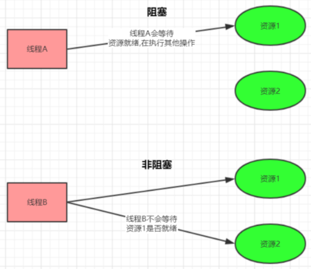


## 3、同步和异步

- 主要是指的数据的请求方式
- 同步和异步是指访问数据的一种机制

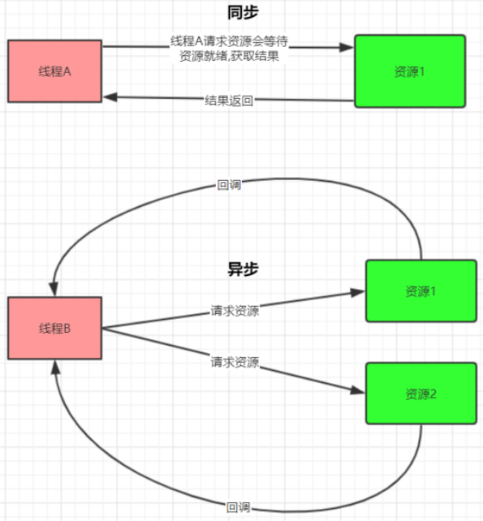


## 4、Java 共支持 3 种网络编程 IO 模型

### （1）BIO（同步并阻塞）

### （2）NIO（同步非阻塞）

### （3）AIO（异步非阻塞）


# 第三章 BIO（同步并阻塞）

## 1、概述

- Java BIO就是传统的 socket 编程
- BIO(blocking I/O)：同步阻塞，服务器实现模式为一个连接一个线程，即客户端有连接请求时服务器端就需要启动一个线程进行处理
- 如果这个连接不做任何事情会造成不必要的线程开销，可以通过线程池机制改善(实现多个客户连接服务器)

## 2、工作机制

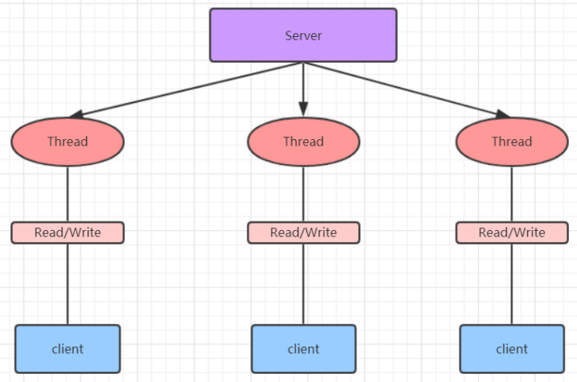

- 举例

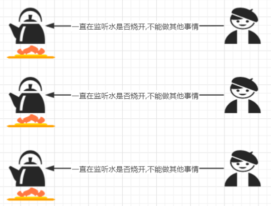

## 3、BIO 缺点

- 每个请求都需要创建独立的线程，与对应的客户端进行数据 Read，业务处理，数据 Write
- 并发数较大时，需要创建大量线程来处理连接，系统资源占用较大
- 连接建立后，如果当前线程暂时没有数据可读，则线程就阻塞在 Read 操作上，造成线程资源浪费

# 第四章 NIO（同步非阻塞）

## 1、NIO 简介

- Java NIO 全称java non-blocking IO ，是指 JDK 提供的新 API
- 从 JDK1.4 开始，Java 提供了一系列改进的输入/输出的新特性，被统称为 NIO(即 New IO)，是同步非阻塞的


- NIO是面向缓冲区编程的
- 数据读取到一个缓冲区中，需要时可在缓冲区中前后移动，这就增加了处理过程中的灵活性，使用它可以提供非阻塞式的高伸缩性网络


- Java NIO 的非阻塞模式，使一个线程从某通道发送请求或者读取数据，但是它仅能得到目前可用的数据
- 如果目前没有数据可用时，就什么都不会获取，而不是保持线程阻塞，所以直至数据变的可以读取之前，该线程可以继续做其他的事情
- 非阻塞写也是如此，一个线程请求写入一些数据到某通道，但不需要等待它完全写入，这个线程同时可以去做别的事情
- 通俗理解：NIO 是可以做到用一个线程来处理多个操作的
- 假设有 10000 个请求过来,根据实际情况，可以分配50或者100个线程来处理,不像之前的阻塞 IO 那样，非得分配10000个


- 同步非阻塞，服务器实现模式为一个线程处理多个请求(连接)，即客户端发送的连接请求都会注册到多路复用器上，多路复用器轮询到连接有 I/O 请求就进行处理

## 2、工作机制

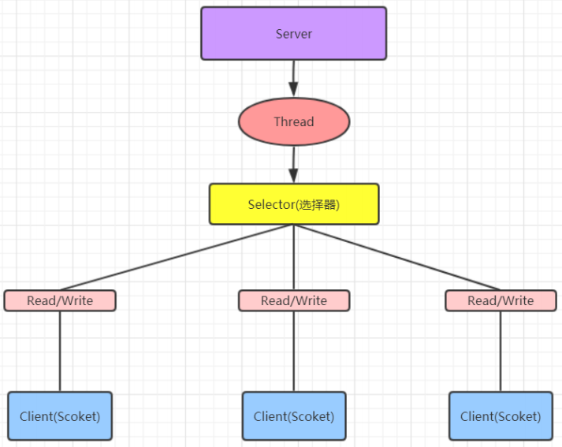

- 举例


## 3、NIO 三大核心原理示意图

- 每个 channel 都会对应一个 Buffer
- Selector 对应一个线程，一个线程对应多个 channel(连接) 
- 每个 channel 都注册到 Selector 选择器上
- Selector不断轮询查看 Channel 上的事件, 事件是通道 Channel 非常重要的概念
- Selector 会根据不同的事件，完成不同的处理操作
- Buffer 就是一个内存块，底层是有一个数组
- 数据的读取写入是通过 Buffer, 这个和 BIO , BIO 中要么是输入流，或者是输出流, 不能双向，但是NIO 的 Buffer 是可以读也可以写 , channel 是双向的

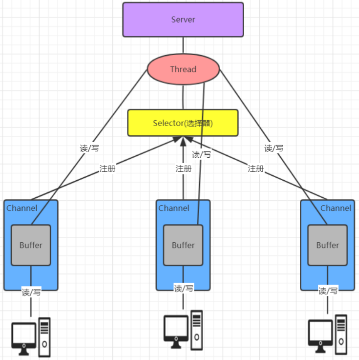

## 4、核心一：Buffer（ 缓冲区）

### 4.1 简介

- 缓冲区本质上是一个可以读写数据的内存块，可以理解成是一个数组
- 该对象提供了一组方法，可以更轻松地使用内存块，缓冲区对象内置了一些机制，能够跟踪和记录缓冲区的状态变化情况
- Channel 提供从网络读取数据的渠道，但是读取或写入的数据都必须经由 Buffer

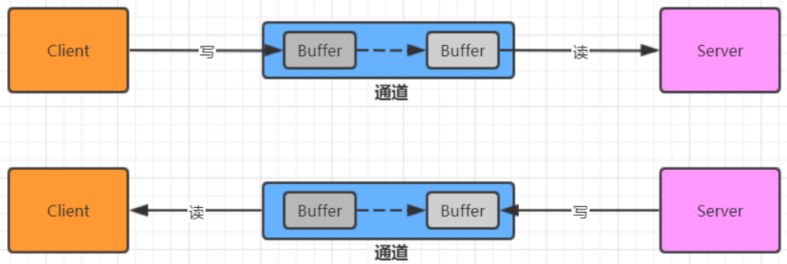


### 4.2 常用API

#### （1）Buffer 类及其子类

- 在 NIO 中，Buffer是一个顶层父类，它是一个抽象类，常用的缓冲区分别对应 byte、short、int、 long、float、double、char 7种

- 类的层级关系图

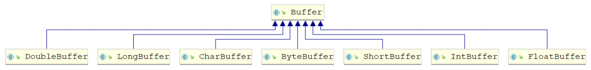

#### （2）Buffer 对象创建

| 方法名                               | 说明                           |
| ------------------------------------ | ------------------------------ |
| static ByteBuffer allocate(长度)     | 创建byte类型的指定长度的缓冲区 |
| static ByteBuffer wrap(byte[] array) | 创建一个有内容的byte类型缓冲区 |


#### （3）Buffer 对象添加数据

| 方法名                                     | 说明                                            |
| ------------------------------------------ | ----------------------------------------------- |
| int position() / position(int newPosition) | 获得当前要操作的索引 / 修改当前要操作的索引位   |
| int limit() / limit(int newLimit)          | 最多能操作到哪个索引 / 修改最多能操作的索引位置 |
| int capacity()                             | 返回缓冲区的总长度                              |
| int remaining() / boolean hasRemaining()   | 还有多少能操作索引个数 / 是否还有能操作         |
| put(byte b) / put(byte[] src)              | 添加一个字节 / 添加字节数组                     |

- remaining 图解

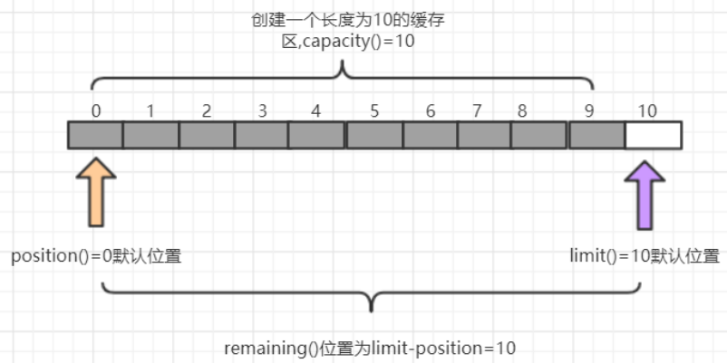


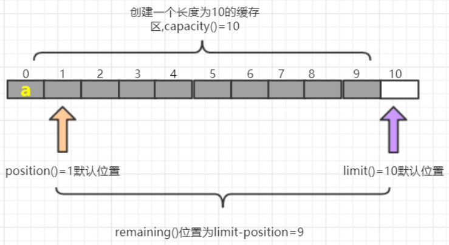

#### （4）Buffer 对象读取数据

- 获取缓冲区里面数据之前，需要调用flip方法
- 再次写数据之前，需要调用clear方法，但是数据还未消失，等再次写入数据，被覆盖了才会消失

| 方法名          | 说明                                               |
| --------------- | -------------------------------------------------- |
| flip()          | 写切换读模式 limit 设置position位置，position设置0 |
| get()           | 读一个字节                                         |
| get(byte[] dst) | 读多个字节                                         |
| get(int index)  | 读指定索引的字节                                   |
| rewind()        | 将position设置为0，可以重复读                      |
| clear()         | 切换写模式 position设置为0 , limit 设置为 capacity |
| array()         | 将缓冲区转换成字节数组返回                         |

- flip() 图解

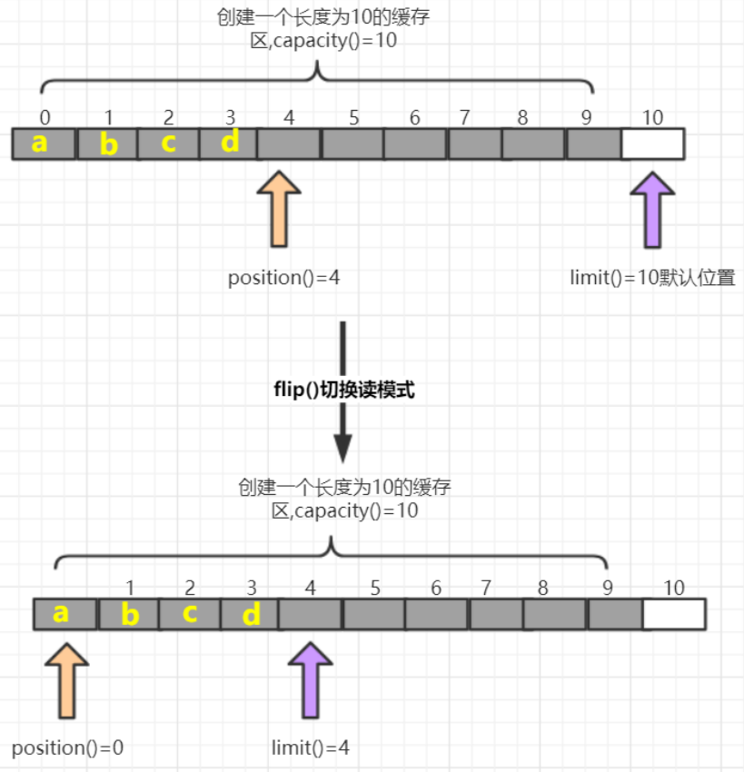

- clear()图解

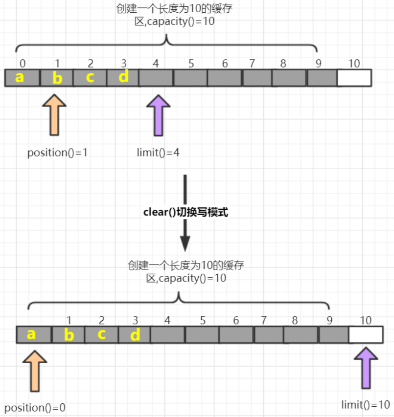


## 5、核心二：Channel（通道）

### 5.1 简介

- 通常来说NIO中的所有IO都是从 Channel（通道） 开始的
- NIO 的通道类似于流，但有些区别如下

```
- 通道可以读也可以写，流一般来说是单向的（只能读或者写，用流进行IO操作的时候需要分别创建一个输入流和一个输出流）
- 通道可以异步读写
- 通道总是基于缓冲区Buffer来读写
```

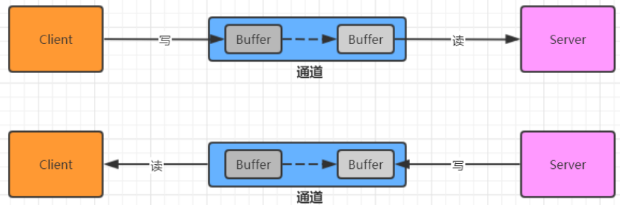


### 5.2 Channel 接口的常用实现类

```
- FileChannel 用于文件的数据读写
- DatagramChannel 用于 UDP 的数据读写
- ServerSocketChannel 和 SocketChannel 用于 TCP 的数据读写（用于完成客户端与服务端数据的通信工作）
	ServerSocketChannel 类似 ServerSocket
	SocketChannel 类似 Socket
```

### 5.3 实现步骤

#### （1）ServerSocketChannel 服务端

```
打开一个服务端通道
绑定对应的端口号
通道默认是阻塞的，需要设置为非阻塞
检查是否有客户端连接 有客户端连接会返回对应的通道
获取客户端传递过来的数据,并把数据放在byteBuffer这个缓冲区中
给客户端回写数据
释放资源
```

#### （2）SocketChannel 客户端实现步骤

```
打开通道
设置连接IP和端口号
写出数据
读取服务器写回的数据
释放资源
```


## 6、核心三：Selector（选择器）

### 6.1 简介

```
- 一个线程，处理多个的客户端连接，就会使用到 NIO 的 Selector(选择器)
- Selector 能够检测多个注册的服务端通道上是否有事件发生，如果有事件发生，便获取事件然后针对每个事件进行相应的处理。这样就可以只用一个单线程去管理多个通道，也就是管理多个连接和请求。
```

- 在这种没有选择器的情况下，每个连接对应一个处理线程，但是连接并不能马上就会发送信息，所以会产生资源浪费

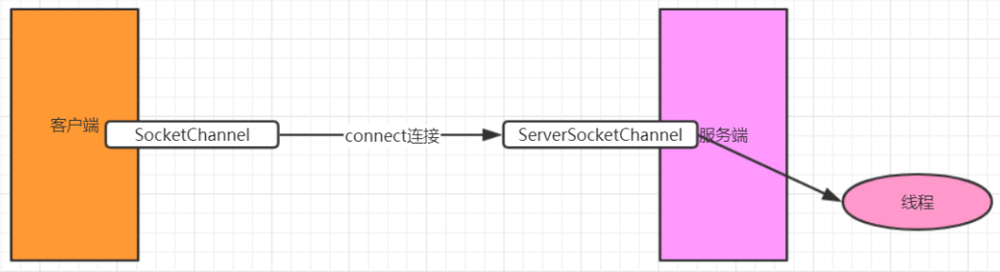

- 只有在通道真正有读写事件发生时，才会进行读写，这就大大地减少了系统开销，并且不必为每个连接都创建一个线程，不用去维护多个线程，避免了多线程之间的上下文切换导致的开销（可以一个单线程去管理多个通道，即多路复用器）

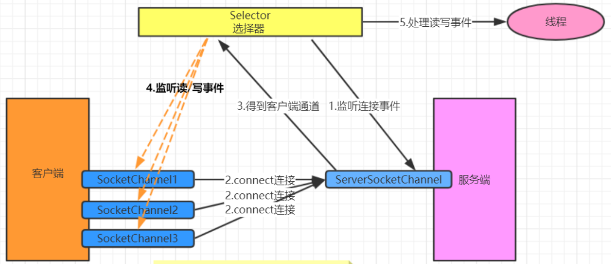


### 6.2 常用 API

#### （1）Selector 类（抽象类）

- 常用方法

```java
// 得到一个选择器对象
Selector.open()
  
// 阻塞 监控所有注册的通道,当有对应的事件操作时, 会将SelectionKey放入集合内部并返回事件数量
selector.select() 
  
// 阻塞 1000 毫秒，监控所有注册的通道,当有对应的事件操作时, 会将 SelectionKey 放入集合内部并返回
selector.select(1000)
  
// 返回存有SelectionKey的集合
selector.selectedKeys()
```

#### （2）SelectionKey

- 常用方法

```java
// 是否是连接继续事件
SelectionKey.isAcceptable()
  
// 是否是连接就绪事件  
SelectionKey.isConnectable()
  
// 是否是读就绪事件  
SelectionKey.isReadable()
  
// 是否是写就绪事件  
SelectionKey.isWritable()
```

- SelectionKey 中定义的4种事件

```java
// 接收连接继续事件，表示服务器监听到了客户连接，服务器可以接收这个连接了
SelectionKey.OP_ACCEPT
  
// 连接就绪事件，表示客户端与服务器的连接已经建立成功  
SelectionKey.OP_CONNECT
  
// 读就绪事件，表示通道中已经有了可读的数据，可以执行读操作了（通道目前有数据，可以进行读操作了）  
SelectionKey.OP_READ
  
// 写就绪事件，表示已经可以向通道写数据了（通道目前可以用于写操作）  
SelectionKey.OP_WRITE
```


### 6.3 实现步骤

#### （1）服务端实现步骤

```java
1. 打开一个服务端通道
2. 绑定对应的端口号
3. 通道默认是阻塞的，需要设置为非阻塞
4. 创建选择器
5. 将服务端通道注册到选择器上,并指定注册监听的事件为OP_ACCEPT
6. 检查选择器是否有事件
7. 获取事件集合
8. 判断事件是否是客户端连接事件SelectionKey.isAcceptable()
9. 得到客户端通道,并将通道注册到选择器上, 并指定监听事件为OP_READ
10. 判断是否是客户端读就绪事件SelectionKey.isReadable()
11. 得到客户端通道,读取数据到缓冲区
12. 给客户端回写数据
13. 从集合中删除对应的事件, 因为防止二次处理.
```

# 第五章 AIO（异步非阻塞）

## 1、概念

- AIO 引入异步通道的概念，采用了 Proactor 模式，简化了程序编写，有效的请求才启动线程
- 特点：先由操作系统完成后才通知服务端程序启动线程去处理
- 一般适用于连接数较多且连接时间较长的应用


- Proactor 模式是一个消息异步通知的设计模式，Proactor 通知的不是就绪事件，而是操作完成事件
- Proactor 模式也是操作系统异步 IO 的主要模型

## 2、举例

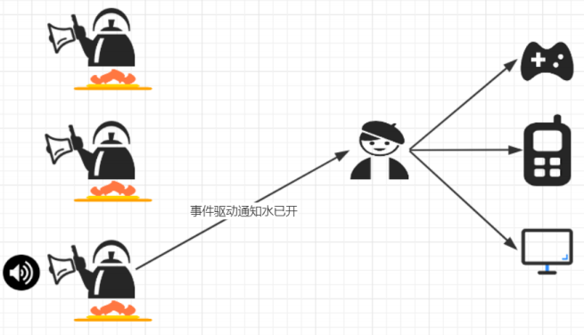


# 【区别】BIO、NIO、AIO

- 适用场景

```
BIO(同步并阻塞) 
- 适用于连接数目比较小且固定的架构
- 这种方式对服务器资源要求比较高，并发局限于应用中
- JDK1.4以前的唯一选择，但程序简单易理解

NIO(同步非阻塞) 
- 适用于连接数目多且连接比较短（轻操作）的架构
- 比如聊天服务器，弹幕系统，服务器间通讯等。
- 编程比较复杂，JDK1.4 开始支持

AIO(异步非阻塞) 
- 使用于连接数目多且连接比较长（重操作）的架构
- 比如相册服务器，充分调用 OS 参与并发操作
- 编程比较复杂，JDK7 开始支持
```

# 【区别】BIO、NIO

```
BIO 以流的方式处理数据
NIO 以缓冲区的方式处理数据，缓冲区 I/O 的效率比流 I/O 高很多

BIO 是阻塞的
NIO 是非阻塞的

BIO 基于字节流和字符流进行操作
NIO 基于 Channel(通道)和 Buffer(缓冲区)进行操作，数据总是从通道读取到缓冲区中，或者从缓冲区写入到通道中。Selector(选择器)用于监听多个通道的事件（比如：连接请求， 数据到达等），因此使用单个线程就可以监听多个客户端通道
```


> 参考资料

https://my.oschina.net/u/3471412/blog/2966696

