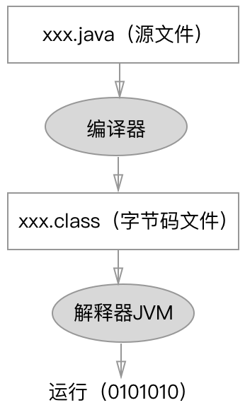

> 当前位置：【Java】01_Java基础  -> 1.0_开发环境

---


# 1、Java语言概述

### Java的简介

```
- Java 是一门语言，也是一种技术
- 代码分为结构定义语句和功能执行语句，功能执行语句的最后必须用分号结束
```


### Java的发展历史

##### 相关事件

```
- 詹姆斯·高斯林（James Gosling）
- SUN（Stanford University Network斯坦福大学网络公司）
```

##### 1996年01月23日，JDK 1.0，开发代号Oak（橡树）

##### 1997年02月19日，JDK 1.1

```
- 引入JDBC（Java DataBase Connectivity）
- 支持内部类
- 引入Java Bean
- 引入RMI（Remote Method Invocation）
- 引入反射（仅用于内省）
```

##### 1998年12月04日，J2SE 1.2，开发代号Playground（运动场）

```
- 把SDK（Software Development Kit，软件开发工具包）分成了J2SE、J2EE、J2ME
- 引入集合框架
- 对字符串常量做内存映射
- 引入JIT编译器（Just In Time）
- 引入对打包的Java文件进行数字签名
- 引入控制授权访问系统资源的策略工具
- 引入JFC（Java Foundation Classes）：包括Swing 1.0、拖放和Java2D类库
- 引入Java插件
- 在JDBC中引入可滚动结果集，BLOB，CLOB，批量更新和用户自定义类型
- 在Applet中添加声音支持
```

##### 2000年05月08日，J2SE 1.3，开发代号Kestrel（美洲红隼）

```
- 引入Java Sound API
- jar文件索引
- 对Java的各个方面都做了大量优化和增强
```

##### 2002年02月13日，J2SE1.4，开发代号Merlin（灰背隼），首次在JCP下发行

```
- XML处理
- Java打印服务
- 引入Logging API
- 引入Java Web Start
- 引入JDBC 3.0 API
- 引入断言
- 引入Preferences API
- 引入链式异常处理
- 支持IPV6
- 支持正则表达式
- 引入Imgae I/O API
```

##### 2004年09月30日，JavaSE 5.0，JDK 1.5，开发代号Tiger（老虎）

```
- Java 5.0 SDK改名JavaSE、JavaEE、JavaME
- 引入泛型
- 增强循环，可以使用迭代方式
- 自动装箱与自动拆箱
- 类型安全的枚举
- 可变参数
- 静态引入
- 元数据（注解）
- 引入Instrumentation
```

##### 2006年12月11日，JavaSE 6.0，JDK 1.6，开发代号Mustang（野马）

```
- 支持脚本语言
- 引入JDBC 4.0API
- 引入Java Compiler API
- 可插拔注解
- 增加对Native PKI（Public Key Infrastructure）的支持
- 增加对Java GSS（Generic Security Service）的支持
- 增加对Kerberos的支持
- 增加对LDAP（Lightweight Directory Access Protocol）的支持
- 继承Web Services
```

##### 2009年04月20日，甲骨文（Oracle）74亿美元收购Sun

##### 2011年07月28日，JavaSE 7.0，JDK1.7，开发代号Dolphin（海豚）

```
- 引入的新特性包括
- switch语句块中允许以字符串作为分支条件
- 在创建泛型对象时应用类型推断
- 在一个语句块中捕获多种异常
- 支持动态语言
- 支持try-with-resources（），在一个语句块中捕获多种异常
- 引入Java NIO.2开发包
- 数值类型可以用二进制字符串表示，并且可以在字符串表示中添加下划线
- 钻石型语法（在创建泛型对象时应用类型推断）
- null值得自动处理
```

##### 2014年03月18日，JavaSE 8.0，JDK1.8，开发代号Spider（蜘蛛）

```
- 引入Lambda 表达式
- 管道和流
- 新的日期和时间 API
- 默认的方法
- 类型注解
- Nashorn javascript引擎
- 并行累加器
- 并行操作
- 内存错误移除
- TLS SNI 服务器名称标识（Server Name Identification）
- Lambda Expressions
- Pipelines and Streams
- Date and Time API
- Default Methods
- Type Annotations
- Nashhorn JavaScript Engine
- Concurrent Accumulators
- Parallel operations
- PermGen Error Removed
- TLS SNI
```

##### 2017年09月21日，JavaSE 9.0，JDK1.9

##### 2018年03月14日，JavaSE 10，JDK1.10


### Java的分类：按应用环境划分

##### 标准版：J2SE（Java 2 Platform Standard Edition）

```
- 是为开发普通桌面和商务应用程序提供的解决方案
- 该技术体系是其他两者的基础，可以完成一些桌面应用程序的开发，比如Java版的扫雷
```


##### 企业版：J2EE（Java 2 Platform Enterprise Edition）

```
- 是为开发企业环境下的应用程序提供的一套解决方案
- 该技术体系中包含的技术如 Servlet、JSP等，主要针对于Web应用程序开发
```


##### 小型版：J2ME（Java 2 Platform Micro Edition）

```
- 是为开发电子消费产品和嵌入式设备提供的解决方案

- 该技术体系主要应用于小型电子消费类产品，如手机中的应用程序等
- 由于现在已经出现了Android、iOS、WindowsPhone等手机操作系统，所以J2ME架构基本上已经不用了
```


### Java的语言特点

##### （1）开源

##### （2）面向对象

##### （3）跨平台性/可移植性

- 跨平台的表现形式：Java程序可以在任意操作系统上运行，一次开发到处运行

```
- 一次开发：开发平台不影响开发结果，最后生成的目标码（.class文件）都是一致的，Java的.class文件相当于Windows中的.exe文件，是可执行的程序
- 到处执行：通过Java语言编写的应用程序在不同的系统平台上都可以运行
```

- 跨平台的原理

```
- 操作系统原始识别文件不包括class文件，在操作系统上安装该操作系统识别的Java虚拟机（JVM：Java Virtual Machine）
- 进而使用Java虚拟机执行class文件（解释成1010文件供操作系统执行），从而使该操作系统间接执行Java程序
```


##### （4）简单性

##### （5）解释性

##### （6）高性能

##### （7）分布式处理

##### （8）多线程

##### （9）健壮性

##### （10）安全性

##### （11）动态


### Java的应用范围

- 桌面应用软件（CS架构）
- 互联网应用软件（BS架构）
- 企业级应用（EPR、CRM、BOS、OA等）


# 2、Java开发环境（使用JDK开发完成Java程序，交给JRE运行）

### JVM（Java Virtual Machine -> Java虚拟机）

##### JVM的简介

```
- 实现跨平台需要依赖Java的虚拟机 JVM （Java Virtual Machine）
- 因为有了JVM，所以不同平台开发出的java程序是“独立的”，与平台无关，任何平台都可以通过对应的JVM执行该java程序
- Java语言是跨平台的，Java虚拟机不是跨平台的
- Java虚拟机可以是硬件 ,也可以是软件
- 用来运行/解释Java程序，保证语言的跨平台
- JVM已经包含在JRE中，因此不需要特意去安装
```

##### JVM的内存管理（暂略）


### JRE（Java Runtime Environment -> Java运行环境）

- JRE的组成：JRE = JVM + 核心类库（Java library）

- JRE的用途：直接运行一个已经完成开发的Java程序（class文件）

  

### JDK（Java Development Kit -> Java开发工具包）

##### JDK的简介

```
- JDK的组成：JDK = JRE + 开发工具
- JDK的使用者：Java开发人员
```


##### JDK的用途

```
- 成以编译为主的java程序开发任务
- 由于包含JRE安装了JDK的操作系统也可以运行java程序
```


##### JDK的目录分析

```
- javac.exe -> 编译工具
- java.exe -> 运行工具
- jar.exe -> 打包工具
- JRE
```


##### JDK的下载

- 官方下载地址

  - Oracle官方网站：http://www.oracle.com
  - Oracle官方网站中文页面：http://www.oracle.com/cn/index.html

  

- 注意事项
  
  - 公司开发使用的jdk最好版本一致
  
  
  
- 命名解释：例如jdk-7u72-windows-i586
  - jdk版本1.7的第72次更新
  - win系统32位的i5处理器


##### JDK的安装

###### 安装须知

```
- 开发工具最好安装目录统一
- 安装路径不要有中文或者特殊符号如空格等
- 当提示安装JRE时，可以选择不安装，建议还是安装上
- 安装路径中没有的文件夹,会自动创建
- JDK无需每次都安装，因为其本身就是绿色版本，可以直接存入U盘，在任何计算机上都可以直接使用
- 采用安装的方式使用JDK的好处在于其会在注册表中被注册，当JDK出现新版本，会自动更新
```


###### 配置环境变量（Win系统）

- 步骤1：配置 path 环境变量

```
- 配置目的
  - 为了能在DOS命令行窗口中，在任何目录下都能够执行Java的bin目录下javac命令
  - 需要将javac.exe命令文件所在目录的路径放入path环境变量中
  - path是记录所有在dos命令行中可直接运行的.exe文件的目录
  
- 原理
  - 在DOS命令提示符窗口中输入某个命令后，Windows系统会首先在当前目录下查找是否存在该命令文件可以执行
  - 如果没有，Windows系统就会在path环境变量路径中查找
  - 如果查找到，就会执行该命令，如果还没有找到，那么就会提示错误信息
  
- 操作步骤
  - 步骤1：计算机 -> 右键属性 -> 高级系统设置 -> 高级 -> 环境变量 -> 系统变量
  - 步骤2：创建新的变量名称：JAVA_HOME
  - 步骤3：为JAVA_HOME添加变量值：xxx（xxx为JDK安装根目录）
  - 步骤4：在path环境变量最前面添加如下内容：%JAVA_HOME%\bin;%JAVA_HOME%\jre\bin;
  - 步骤5：DOS下输入 java -version 后显示一串文字，则表示配置成功
```


- 步骤2：配置 classpath 环境变量

```
- 配置目的
  - 由于可能频繁执行多个class文件，并且多个class文件可能存储在不同的目录下，那么每次都在命令提示符窗口中切换目录会相当的麻烦
  - classpath环境变量的作用类似于path环境变量，但是它的作用在于告诉JVM去哪里找到class文件
  - classpath存储的是.class字节码文件的目录，是Java中的类路径
  
- JVM查找类文件的顺序
  - 如果没有配置classpath环境变量，JVM只在当前目录下查找要运行的类文件
  - 如果配置了classpath环境，JVM会先在classpath环境变量值的目录中查找要运行的类文件
  
- 操作步骤
  - 步骤1：计算机 -> 右键属性 -> 高级系统设置 -> 高级 -> 环境变量 -> 系统变量
  - 步骤2：创建新的变量名称：CLASSPATH
  - 步骤3：为CLASSPATH添加变量值：.;xxx（xxx为JDK安装根目录）
```


- 步骤3：配置临时环境变量：略


###### 验证是否安装成功的方法（Win系统）

```
- 在DOS窗口中输入：JDK安装路径\bin\java.exe
- 在DOS窗口中输入：JDK安装路径\bin\javac.exe
- 如果正常显示一些内容，说明安装成功
```


### IDE（Integrated Development Environment ->集成开发环境）

##### （1）入门级IDE

- EditPlus

- NotePad++


##### （2）中高级IDE（用法在开发工具篇有讲到）

- Eclipse
- MyEclipse
- IntelliJ IDEA


### 命令行工具

##### （1）Win系统：DOS命令行（Disk Operating System）

- 人机交互的方式

```
- 图形化界面 GUI（Graphical User Interface）
- 命令行方式 CLI（Command Line Interface）
```


- 打开DOS

```
- 方法1：开始 -> 程序 -> 附件 -> 命令提示符
- 方法2：开始 -> 运行 -> 输入cmd -> 回车
- 方法3：Win + R 组合键  -> 输入cmd -> 回车
```


- 常用DOS命令

| 命令参数              | 作用                         |
| --------------------- | ---------------------------- |
| dir                   | 列出当前目录下的文件和文件夹 |
| cd xxx（文件夹名字）  | 进入指定目录                 |
| cd ..                 | 退回到上一级目录             |
| cd \                  | 退回到根目录                 |
| cd /                  | 退回到根目录                 |
| 盘符名:               | 切换到对应盘符               |
| cls                   | 清屏                         |
| md xxx（文件夹名字）  | 创建xxx目录                  |
| rd xxx（文件夹名字）  | 删除xxx目录                  |
| del xxx（文件名全称） | 删除xxx文件                  |
| exit                  | 退出dos命令行工具            |
| help                  | 列出所有命令                 |
| help xxx（命令名字）  | 详解该命令                   |
| 方向键上下            | 本次命令行中使用过的命令     |


##### （2）Mac系统：终端/iTerm


# 3、第一个Java程序 & 分析

### 步骤1：编写源文件（.java）

- Java程序的文件名必须与类名保持一致
- 代码如下

```java
// 定义一个类
public class a_HelloWorld {
    // 添加 main 主方法（是程序的入口，会被 JVM 调用）
    public static void main(String[] args) {
        // 执行输出语句
        System.out.println("=================================");
        System.out.println("Hello World!");

        System.out.print("print打印不换行");
        System.out.println("println打印自动换行");
        System.out.println("println打印自动换行");
        System.out.println("=================================");
    }
}
```


### 步骤2：编译（.class）

- 没有配置环境变量时

```xml
- 步骤1：命令行中cd到源文件所在目录

- 步骤2：xxx\bin\javac.exe yyy.java
  - xxx表示JDK安装目录
  - yyy表示源文件名
```


- 配置环境变量后

```xml
- 步骤1：命令行中cd到源文件所在目录
- 步骤2：javac yyy.java（yyy表示源文件名）
```


### 步骤3：运行

- 没有配置环境变量时

```xml
- 步骤1：命令行中cd到源文件所在目录

- 步骤2：xxx\bin\java.exe yyy
  - xxx表示JDK安装目录
  - yyy表示源文件名
```


- 配置环境变量后

```xml
- 步骤1：命令行中cd到源文件所在目录
- 步骤2：java yyy（yyy表示源文件名）
```


- 图示

  