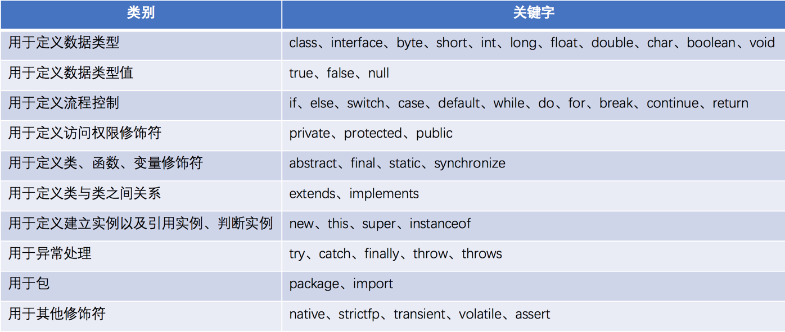
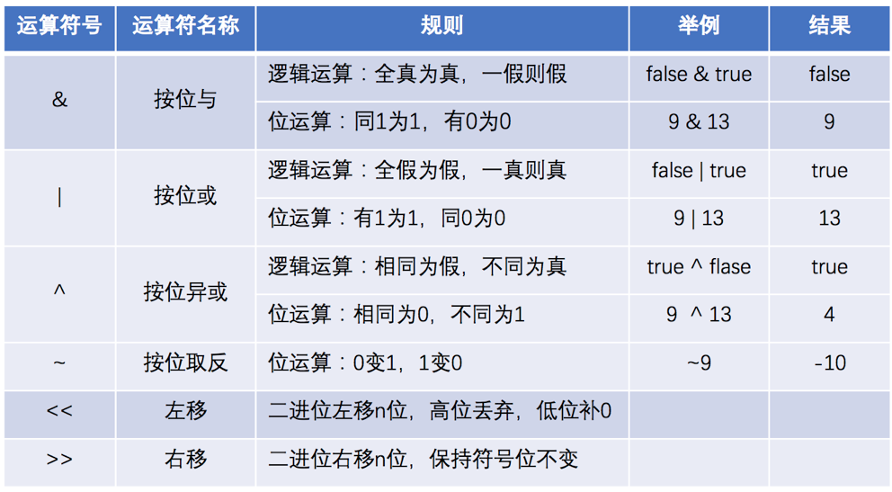
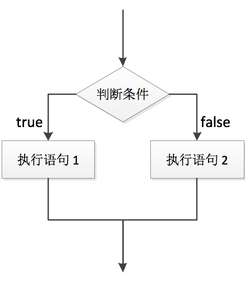
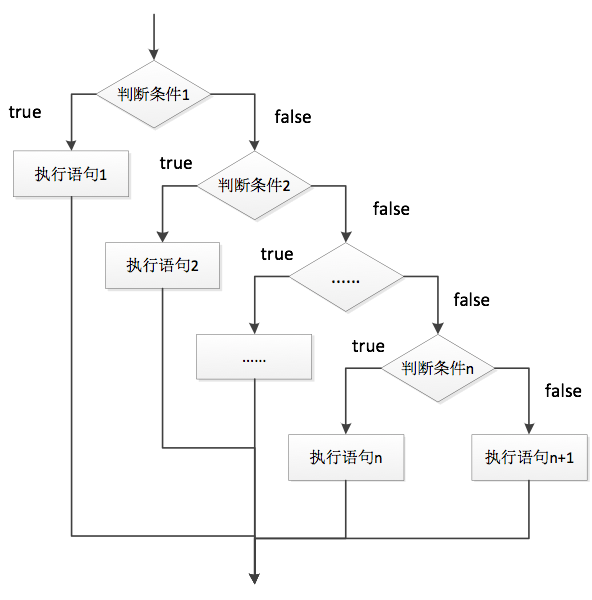
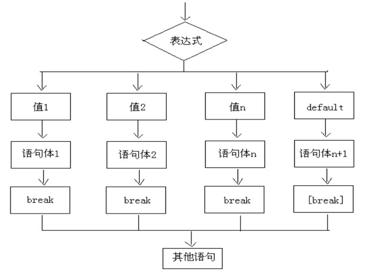
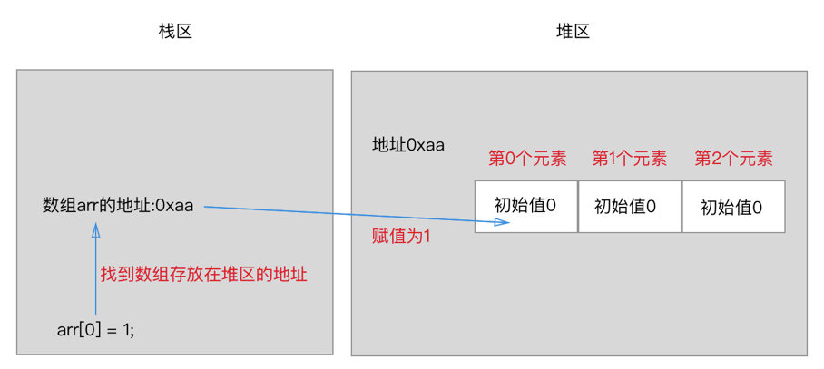

> 当前位置：【Java】01_Java基础  -> 1.1_Grammar（基础语法）

----


# 1、关键字

### 关键字特点

```
- 关键字都是小写，类名每个首字母必须大写
- goto与const是Java中的保留字，即没有赋予特殊含义却仍被Java占用的单词
- 常用的代码编辑器，针对关键字有特殊的颜色标记
```


### 关键字分类




# 2、标识符

### 标识符的概念

```
- 在程序中自定义的一些名称
```


### 标识符的构成

```
- 字符（包括英文大小写字母，中文字符，数字字符等）
- 下划线
- 美元符 $
```


### 标识符的规则

```
- Java中严格区分大小写
- 不能以数字开头
- 不能是Java中的关键字
```


### 标识符命名规则（驼峰命名法）

- 基本要求：见名知意

- 包名：全部小写（包本质其实就是文件夹，用于对类进行管理）

```java
- 单级包：如td.com
- 多级包：用点隔开，公司域名的反写，如com.loto.login
```

- 类名/接口名

```java
- 一个单词：首字母大写，如Xxxx
- 多个单词：每个单词首字母大写，如XxxYyyZzz
```

- 变量名 / 方法名 / 属性名

```java
- 一个单词：首字母小写，如xxx
- 多个单词：从第二个单词开始每个单词首字母大写，如xxxYyyZzz
```

- 常量名：所有字母都大写

```java
- 一个单词：如LOTO
- 多个单词：每个单词用下划线连接，如XXX_YYY_ZZZ
```


# 3、注释

### 注释的概述

- 注释是用来解释某一段程序或者某一行代码是什么意思

- 程序编译时，不对注释做任何处理


### 注释的分类

##### （1）单行注释

```java
// 注释内容

- 可单独占一行，可出现在一行中其他内容的右侧
```


##### （2）多行注释

```java
/* 注释内容 */

- 以/*开头，以*/结尾，/*和*/中间的内容都是注释
```


##### （3）文档注释

```java
/** 注释内容 */

- 程序说明书，包括作者以及版本信息之类
```


##### （4）特殊注释

```java
// TODO: + 说明
- 标识处有功能代码待编写，待实现的功能在说明中会简略说明

// FIXME: + 说明
- 标识处代码需要修正，甚至代码是错误的，不能工作，需要修复，如何修正会在说明中简略说明

// XXX: + 说明
- 标识处代码虽然实现了功能，但是实现的方法有待商榷，希望将来能改进，要改进的地方会在说明中简略说明
```


### 注释的嵌套

- 单行注释可以嵌套单行注释

- 单行注释可以嵌套多行注释，但多行注释必须写到一行里面

- 多行注释可以嵌套单行注释

- 多行注释不能嵌套多行注释


### 注释的作用

- 排错：程序报错时，将可疑代码注释后如果程序正确运行，则表示被注释的代码有错误

- 检查代码的作用：把注释后跟注释前的运行效果做一个对比，看看有没有少了什么效果，如果少了某些效果，说明被注释代码的作用就是实现这个少掉的效果


# 4、数据

### 前导知识：程序

```java
程序 = 数据 + 逻辑
- 程序是用来处理数据的
- 数据是用来处理逻辑的

- 通常数据是会发生变化的，而数据的处理逻辑是不会发生变化的
```


### 前导知识：计算机的存储单元

- bit（位/比特位）：计算机存储设备的最小信息单元，通常用小写的字母b表示

- byte（字节）：计算机最小的存储单元，通常用大写字母B表示

```java
- 字节是由连续的8个位组成
- 当程序需要使用存储空间时，操作系统最少会分派给程序1个字节的存储空间
- Java中的字符采用的是unicode编码，每一个字符占用两个字节，就可以存储一个汉字
```

- 常用的存储单位

```java
1byte(B)（字节） = 8bit
1KB = 1024B
1MB = 1024KB
1GB = 1024MB
1TB = 1024GB
1PB = 1024TB
```


### 数据类型的分类

##### （1）基本数据类型（8种）

###### ① 数值型：整数类型（编译器默认 int ）

- 字节：byte

- 短整型：short int

- 整型：int

- 长整型：long int（定义long类型数据的时候，要加L或者l，建议加L）


###### ② 数值型：浮点类型（编译器默认 double ）

- 单精度：float（定义float类型数据的时候，要加F或者f，建议加F）

- 双精度：double（如果定义数据的类型时候，后面加D表示double型）


###### ③ 字符型：char

- 编码表

```java
美国编码表（ASC Ⅱ，American Standard Code for Information Interchange，美国标准信息交换代码）
- 数字 0-9 对应ASCII编码十进制为48-57
- 字母 a-z 对应ASCII编码十进制为97-122
- 字母 A-Z 对应ASCII编码十进制为65-90

中国编码表
- 作用：让计算机可以识别汉字（十进制数，对应一个汉字）
- 发展阶段：早期是 GB2312 编码表，扩充汉字后是 GBK 编码表

万国编码表（Unicode）：所有国家的码表集合
```


- char的使用

```java
- char型与int型计算得到一个char型，自动转换，char型查询编码表，得到数字
- char型与int型计算得到一个int型，强制转换，查询编码表，得到相应的字符
- char型存储汉字，查询的是Unicode编码表
```


###### ④ 布尔型：boolean（适用于逻辑运算，一般用于流程控制）


##### （2）引用数据类型（4种）

###### ① 字符串：String

###### ② 数组：[ ]

###### ③ 类：class

###### ④ 接口：interface


### 数据的分类

##### （1）常量

###### 常量的概念

- 在程序执行的过程中，其值不可发生改变的量


###### 常量的分类

- 分类1：字面值常量（6种）

```java
（1）整型/整数常量：所有整数
- 表示方式：进制
    二进制表示方式：以0b/0B开头
    八进制表示方式：以数字0开头
    十进制表示方式：正常数字
    十六进制表示方式：以0x/0X开头，由数字以0-9及A-F组成
- 进制转换

（2）浮点型/小数常量：所有小数
（3）字符型常量：用单引号括起来的单个字符
（4）布尔型常量：true和false
（5）字符串常量：用双引号括起来的0 - N个字符
（6）空常量：null
```

- 分类2：自定义常量


##### （2）变量

###### 变量的概述

```java
- 在程序执行的过程中，在某个范围内其值可以发生改变的量
- 变量是内存中的小容器，用来存储数据
- 从本质上讲，变量是内存中储存数据的区域，只能用来存数据和取数据
- 变量必须要有明确的数据类型（什么类型的变量装载什么类型的数据）
```


###### 变量的分类

- 根据数据类型进行分类（5类9种）

```java
（1-4）数值型：整数类型（编译器默认 int ）
  - 字节：byte
  - 短整型：short int
  - 整型：int
  - 长整型：long int（定义long类型数据的时候，要加L或者l，建议加L）

（5-6）数值型：浮点类型（编译器默认 double ）
  - 单精度：float（定义float类型数据的时候，要加F或者f，建议加F）
  - 双精度：double（如果定义数据的类型时候，后面加D表示double型）

（7）字符型：char
（8）布尔型：boolean（适用于逻辑运算，一般用于流程控制）
（9）字符串变量：使用String表示字符串类型
```


- 根据作用域的范围进行分类

```JAVA
- 全局变量/外部变量
- 局部变量/内部变量
```


- 根据在类中定义位置的不同进行分类

```java
（1）成员变量/字段（Field）：直接定义在类中，在方法的外面
  - 分类1：类成员变量（使用static修饰的字段）
  - 分类2：实例成员变量（没有使用static修饰字段）

（2）局部变量：除了成员变量以外，其他的变量都是局部变量
  - 情形1：方法内部的变量，属于局部变量
  - 情形2：方法的形参，属于局部变量
  - 情形3：代码块中的变量，属于局部变量
```


###### 变量的定义

- 格式

```java
数据类型 变量名 = 初始化值;
- 解释：将等号右边的数值赋值给左边的变量
```


- 注意事项

```java
- 定义变量后，必须进行初始化赋值才能使用
  - 赋值方法1：可以定义的同时给变量初始化
  - 赋值方法2：可以先定义，后初始化

- 同一作用域中变量不允许重复定义
- 同一行可以定义多个变量（不建议）
```


###### 变量的作用域

```java
只在它所属的范围内有效：变量在哪对大括号内，变量就属于哪对大括号

- 全局变量/外部变量的作用域
- 局部变量/内部变量的作用域
```


###### 变量的取值范围占用内存大小及默认值


###### 变量的数据类型转换

- 目的：使不同类型的变量可以一起参与运算
- 遵循原则

```java
- 数据类型按照范围从小到大依次为：byte -> short -> int -> long -> float -> double
- 范围小的数据类型值，可以直接转换为范围大的数据类型值
- 范围大的数据类型值，不可以直接转换为范围小的数据类型值
```


- 分类

（1）基本数据类型之间的转换

```java
隐式类型转换 / 自动类型转换
  - 转换方法：把小类型的数据赋值给大类型的变量（大和小指的是容量范围）
  - 转换格式：范围大的数据类型 变量名 = 范围小的数据类型值；
  - 举例：byte a = 12; int b = a;

显式类型转换 / 强制类型转换
  - 转换方法：把大类型的数据赋值给小类型的变量（会造成精度缺失）
  - 转换格式：范围小的数据类型 变量名 = (范围小的数据类型) 范围大的数据类型值;
  - 举例：int i = (int)6.718; //i的值为6

  - 小数转整数
    - 进1法
    - 退1法
     float/double -> int

  - 小数转小数
     double -> int
     double -> float
```


（2）引用数据类型之间的转换

```java
隐式类型转换 / 自动类型转换
  - 把子类对象赋值给父类变量（多态）（大和小指的是父类和子类的关系）
  - 举例：Animal ani = new Dog(); Object obj = new Dog();

显式类型转换 / 强制类型转换
  - 把父类对象赋值给子类变量（此时该父类对象的真实类型是子类类型）
  - 举例：Animal ani = new Dog(); Dog d = (Dog)ani;
```


# 5、运算符

### 运算符的概述

- 运算符是用来计算数据的符号

- 数据可以是常量，也可以是变量

- 被运算符操作的数称为操作数


### 运算符的分类

#### 根据功能划分

##### （1）算数运算符

- 分类


- 注意事项

```java
+表示连接字符串：只有直接与字符串相加才会转成字符串

/除法运算符
- 当两边为整数时，取整数部分，舍余数
- 当其中一边为浮点型时，按正常规则相除
- 整数做被除数，0不能做除数，否则报错

%取余运算符
- 为整除取余符号，小数取余没有意义
- 运算结果的符号与被取余符号相同

++自增运算符
    a++：先赋值，后自增
    ++a：先自增，后赋值

--自减运算符
    a-- ：先赋值，后自减
    --a：先自减，后赋值
```


##### （2）赋值运算符

- 分类


- 注意事项

```java
- 运算符作用：将等号左右两边计算，会将结果自动强转成等号左边的数据类型，再赋值给等号左边
- 赋值运算符左边必须是变量
```


##### （3）关系运算符/比较运算符

- 分类


- 注意事项

```java
- 关系运算符是用来判断两个操作数的大小关系及是否相等关系的
- 结果是布尔值true或者false
```


##### （4）逻辑运算符

- 分类


- 注意事项

```java
- 逻辑运算符的运算对象必须是boolean类型的
- 逻辑运算符通常连接两个其他表达式计算后的布尔值结果
- 运算的最终结果为布尔值true或false
```


##### （5）位运算符

- 分类




- 注意事项

```java
& | ^运算时，可以进行逻辑运算，运算对象必须是boolean类型的
按位运算时都是用二进制进行计算的
```


#### 根据参与运算的操作数个数划分

##### （1）单目运算符：只有一个操作数（如++、- -、sizeof）

##### （2）双目运算符：有两个操作数

##### （3）三目运算符：问号表达式

```java
格式：
(条件表达式)？表达式1：表达式2；
    
运算规则
- 先判断条件表达式的值
- 若为true，运算结果为表达式1
- 若为false，运算结果为表达式2
```


### 运算符的优先级


# 6、控制语句

### （1）流程控制语句

- 概述

```java
- 在一个程序执行的过程中，各条语句的执行顺序对程序的结果是有直接影响的
- 也就是说程序的流程对运行结果有直接的影响，所以，我们必须清楚每条语句的执行流程
- 很多时候我们要通过控制语句的执行顺序来实现我们要完成的功能
```


- 分类

##### 分类1：顺序结构

```java
- 是程序中最简单最基本的流程控制，没有特定的语法结构
- 按照代码的先后顺序，依次执行（写在前面的先执行，写在后面的后执行）
```


##### 分类2：选择结构/分支结构

```java
概念
- 根据条件的不同，选择执行不同的代码
- 先判断条件，如果为真，则语句块执行；否则，语句块不执行
```


###### if 结构

```java

    
- 语法格式1
if( 表达式 ) {
    语句块
}

- 执行流程
首先判断表达式结果是 true 还是 false
  如果是 false 就不执行语句块
  如果是 true 就执行语句块
```


```java
- 语法格式2
if( 表达式 ) {
	语句块 1; 
}else {
	语句块 2; 
}

- 执行流程
首先判断表达式看其结果是 true 还是 false
  如果是 true 就只执行语句块 1
  如果是 false 就只执行语句块 2
```



```java
- 语法格式3
if ( 条件 1 ) {
	语句块 1 
} else if (条件 2) {
	语句块2 
} ...else if (条件 n) {
	语句块 n 
} else {
	语句块 n+1 
}

- 执行流程
  - 判断条件1
    - 如果条件1为 true，则执行语句块1，执行完毕，跳出整个if结构，执行if后面的语句
    - 如果条件1为 false，则判断条件2

  - 判断条件2
    - 如果条件2为 false，则判断条件....
    - 如果条件2为 true，则执行语句块2，执行完毕，跳出整个if结构，执行if后面的语句

  - 判断条件n
    - 如果条件n为 true，则执行语句块n，执行完毕，跳出整个if结构，执行if后面的语句
    - 如果条件n为 false，则执行else里的语句块n+1
```



- 三种语法格式的使用情景

```java
- 第1种格式适合做一种情况的判断
- 第2种格式适合做二种情况的判断
- 第3种格式适合做多种情况的判断
```


###### switch 结构

- 语法格式

```java
switch( 表达式 ) { 
    case 目标值 1： 
        语句块 1; 
        break; 
    case 目标值 2： 
        语句块 2; 
        break; 
        … 
    case 目标值 n： 
        语句块 n+1; 
        break; 
        default： 
        语句块 n+1;
    break; 
} 
```


- 使用要求

```java
表达式的取值
  - JDK1.1 - JDK1.4：表达式结果的数据类型只能是byte、short、int、char
  - JDK1.5 - JDK1.6：表达式结果的数据类型只能是byte、short、int、char、enum
  - JDK1.7 +以后：表达式结果的数据类型只能是byte、short、int、char、enum、String

目标值
  - 目标值的数据类型和表达式结果的数据类型要一致
  - 目标值不能重复
```


- case穿透原理

```java
- 实质是没有break
- case条件只判断一次，在判断完一次case条件后，所有的case判断语句将不再起作用，而剩余语句正常执行
```


- 执行流程

```java
- 计算出表达式的值
- 将表达式的值和 case 的目标值依次比较，如果相等，就会执行相应的语句，在执行的过程中，遇到break就会结束
- 如果所有 case 的目标值都和表达式的值的值不匹配，就会执行default语句体部分，然后程序结束
```



###### 使用选择

```java
- 分支较多，且无法穷尽或进行大量列举，最好用if
- 如果分支数量不是很多，但是使用if代码代码量比较大时，选switch
```


##### 分类3：循环结构

- 循环语句概述

```java
- 在给定条件成立时，反复执行某程序段，直到条件不成立为止
- 当反复执行这个循环体时，需要在合适的时候把循环判断条件修改为false，从而结束循环，否则循环将一直执行下去，形成死循环
- 循环语句可以在满足循环条件的情况下，反复执行某一段代码，这段被重复执行的代码被称为循环体语句
```

- 循环流程图


- 循环语句组成

```java
- 循环的变量初始化 (初始化表达式)：一条或者多条语句，这些语句完成一些初始化操作
- 循环的出口(布尔表达式/循环控制条件)：用来控制循环到底什么时候退出
- 循环的逻辑内容(循环体)：循环的过程中重复执行的代码段
- 循环的增量(步进表达式)：这个部分在一次循环体结束后，下一次循环判断条件执行前执行
```


- 循环分类

###### for循环

- 语法格式

```java
for(初始化表达式1；布尔表达式2；步进表达式4){
	循环体3 
}
```

- 执行流程

```java
- 1234-> 234 -> 234 … 直到2不满足为止
    
- 1 负责完成循环变量初始化
- 2 负责判断是否满足循环条件，不满足则跳出循环
- 3 具体执行的语句
- 4 循环后，循环条件所涉及变量的变化情况
```

- 流程图

  

###### while循环

- 语法格式

```java
初始化表达式1 
while( 布尔表达式2){ 
    循环体3
    步进表达式4
}
```

- 执行流程

```java
- 1234 -> 234 -> 234… 直到2不满足为止
    
- 1负责完成循环变量初始化
- 2 负责判断是否满足循环条件，不满足则跳出循环
- 3 具体执行的语句
- 4 循环后，循环变量的变化情况
```

- 流程图

  


###### do-while循环

- 语法格式

```java
初始化表达式1 
do{ 
    循环体3
    步进表达式4
}while(布尔表达式2);
```

- 执行流程

```java
- 134 -> 234 -> 234… 直到2不满足为止

- 1 负责完成循环变量初始化
- 2 负责判断是否满足循环条件，不满足则跳出循环
- 3 具体执行的语句
- 4 循环后，循环变量的变化情况
```

- 流程图

  

###### 注意事项

- 三种循环的区别

```java
- 控制条件语句所控制的那个变量，在 for 循环结束后，就不能再被访问到了，其他两个循环都可以再访问（原因是 for 循环结束，该变量就从内存中消失，能够提高内存的使用效率）

- for 循环和 while 循环只有在条件成立的时候才会去执行循环体
- do-while 循环至少会执行一次循环体
```

- 循环使用推荐：for -> while -> do-while 

  

###### 嵌套循环

- 嵌套循环定义：嵌套循环是指在一个循环语句的循环体中，再定义一个循环语句
- 嵌套循环形式

```java
- for、while、do-while各自嵌套
- for、while、do-while之间的相互嵌套
```

- 两个for循环嵌套

```java
- 总循环次数 = 内层循环次数 * 外层循环次数
    
- 外循环，控制的是行数
- 内循环，控制的是每行的个数
- 内层循环是外层循环的循环体
```


###### 死循环

- while死循环

- for死循环


### （2）跳转控制语句

- 概念

```java
- 用来实现流程控制语句的中断和跳转
- 跳转语句脱离循环没有意义
```


- 分类

##### 分类1：break中断

- 使用场景

```jajva 
- 在switch语句中使用，作用是终止某个case并跳出switch结构
- 在循环中使用，作用是跳出循环语句，执行后面的代码
```

- 在嵌套循环中使用

```java
- 写在内层循环，就结束内层循环
- 写在外层循环，就结束外层循环
- 写在内存循环，想要结束外层循环，需要使用循环标号
```


##### 分类2：continue继续

- 必须在在循环中使用，表示结束本次循环，进行下一次循环 


##### 分类3：goto 


# 7、数组

### 数组概述

- 数组是存储同一种数据类型多个元素的容器

- 数组中的每个数据被称作元素

- 数组存储的数据的值是可以变化的

- 数组既可以存储基本数据类型，也可以存储引用数据类型

- 在数组中可以存放任意类型的元素，但同一个数组里存放的元素数据类型必须一致


### 数组分类

#### 分类1：一维数组

- 一维数组的定义格式

```java
- 格式1：数据类型[ ] 数组名；
- 格式2：数据类型 数组名[ ];
```


- 一维数组的初始化

  - 概念

  ```java
  - Java中的数组必须先初始化，再使用
  - 初始化就是为数组中的数组元素分配内存空间，并为每个数组元素赋默认值
  - 给数组分配内存空间，对元素赋默认值
  ```

  

  - 初始化方式

  ```java
  方式1：动态初始化
  - 初始化时，只指定数组长度，数组元素的默认值由系统分配
  - 数据类型[ ] 数组名 = new 数据类型[数组长度];
  
  方式2：静态初始化
  - 初始化时，指定每个数组元素的初始值，数组长度由系统决定
  - 数据类型[ ] 数据名 = new 数据类型[ ]{元素值1，元素值2.....}；
  - 数据类型[ ] 数据名 = {元素值1，元素值2.....}；
  
  格式解释
  - 数据类型：元素的数据类型
  - [ ]：数组的标志，一个[ ]表示一维数组，[ ][ ]表示二维数组
  - 数组名：是标识符，可以通过数组名来获取数组的元素
  - 数组长度：可以最多存放元素的个数
  ```

  

  - 初始化内存分配：new 数据类型[数组长度]

  ```java
  - 步骤1：在堆区开辟内存空间（组数元素开始具有索引、有地址）
  - 步骤2：对数组元素进行初始化
  - 步骤3：把数组元素的首地址返回给栈区的变量
  ```

  

- 一维数组的存储方式

```java
- 计算机会给数组分配一块连续的存储空间
- 数组名代表数组的首地址，从首地址位置，依次存入数组的第1个、第2个....、第n个元素
- 每个元素占用相同的字节数(取决于数组类型)
- 数组中元素之间的地址是连续
```

内存图




- 一维数组的常见用法

  - 一维数组的元素访问

  ```java
  - 格式：数组名[索引]
  - 本质：访问的是数组堆内存中的地址
  
  - 关于索引
  数组中的每个元素都是有编号的，编号是从0开始的，最大的编号就是数组的长度-1
  用数组名和编号的配合就可以获取数组中的指定编号的元素，这个编号的专业叫法：索引
  ```

  

  - 一维数组的元素赋值

  ```java
  - 赋的值从栈区通过地址找到堆区存储的数组，并通过索引对相应的数组元素进行覆盖
  - 格式：数组名[索引] = 元素值;
  ```

  

  - 一维数组长度计算：数组名.length

    

  - 一维数组遍历

  ```java
  - 一维数组获取最值(获取数组中的最大值最小值)
  - 一维数组查表法(根据键盘录入索引，查找对应值)
  - 一维数组元素查找(查找指定元素第一次在数组中出现的索引)
  
  - 数组元素遍历（正向遍历）：从第一个元素开始依次向后遍历数组元素
  - 数组元素反向遍历：从最后一个元素开始依次向前遍历数组元素
  - 数组元素逆序遍历：数组中的元素逆序排列后遍历
  ```

  - 


#### 分类2：二维数组

- 二维数组的定义格式

```java
- 格式1：数据类型[ ][ ] 数组名;
- 格式2：数据类型 数组名[ ][ ];
- 格式3：数据类型[ ] 数组名[ ];
```


- 二维数组的初始化

```java
- 方式1：动态初始化 
数据类型[ ][ ] 数组名 = new 数据类型[M][N];

- 方式2：静态初始化
数组类型[ ][ ] 数组名 = new 数据类型[ ][ ]{{元素值1,元素值2,.... },{元素值1,元素值2,.... }….};
数据类型[ ][ ] 变量名 = {{元素值1,元素值2,…},{元素值1…},{元素值1,元素值2,…}};

- 格式解释
数据类型：数组元素的数据类型，前后一致
[ ]：数组的标志
数组名：是标识符，通过数组名可以访问数组的元素
N：二维数组中每个一维数组的元素个数
M：二维数组的长度，即构成这个二维数组的一维数组的个数
```


- 二维数组的存储方式

```java
- 步骤1：计算机会给二维数组分配一块连续的存储空间
- 步骤2：数组名代表数组的首地址,从首地址位置,依次存入第1行、第2行、.....
- 步骤3：每一行存储方式,从行首地址还是,依次存储行的第1个元素、第2个元素、第3个元素......
- 步骤4：每个元素占用相同的字节数(取决于数组类型)
- 步骤5：并且数组中元素之间的地址是连续
```

内存图


- 二维数组的常见用法

```java
- 二维数组的元素访问
格式：数组名[索引] [索引]

- 二维数组遍历
遍历采用两个for循环嵌套
正序遍历：依次输出数组中的每一个元素
逆序遍历： 把数组反过来遍历

- 二维数组长度计算
- 二维数组获取最值(获取数组中的最大值最小值)
- 二维数组查表法(根据键盘录入索引,查找对应值)
- 二维数组元素查找(查找指定元素第一次在数组中出现的索引)
```


### 数组操作异常

- 数组索引越界异常（ArrayIndexOfBoundsException）：访问到了数组中的不存在的索引时发生

- 空指针异常（NullPointerException）：数组引用没有指向对象，却在操作对象中的元素时


### 数组算法

#### 数组元素排序（一般为升序排列）

- 选择排序

```java
元素比较规则
- 步骤1：元素0跟元素1，2，3，4.....比较
- 步骤2：元素1跟元素2，3，4.....比较
- 步骤3：元素2跟元素3，4.....比较
- 步骤4：…..

元素比较方法
- 如果元素 i 的值 > 元素 i+1 的值，互换，否则不互换

元素比较结果
- 先确定的是元素0，依次是元素1，2，3，4....n

思路
- 外层for循环，控制比较次数
- 内层for循环，控制参与比较的元素
```


- 冒泡排序

```java
元素比较规则（相邻元素比较）
- 步骤1：元素0跟元素1比较
- 步骤2：元素1跟元素2比较
- 步骤3：元素2跟元素3比较
- 步骤4：….

元素比较方法
- 如果元素 i 的值 > 元素 i+1 的值，互换，否则不互换

元素比较结果
- 先确定的是元素n，依次是元素n-1，n-2，n-3，n-4....1，0

思路
- 外层for循环，控制比较次数
- 内层for循环，控制参与比较的元素
```


#### 数组元素查找

- 前提：首先数组的元素是有序排列（从小到大或从大到小）
- 普通查找：for循环遍历数组元素，使用if语句将要查找的元素值与数组元素值挨个进行比较
- 二分查找（折半查找）

```java
- 步骤1：定义三个变量
- 步骤2：进行循环折半 (可以折半的条件 min <= max)
- 步骤3：让被找元素，与min进行比较
被找元素 < mid, max = mid - 1，表示 searchNum 在mid左侧
被找元素 > mid, min = mid + 1，表示 searchNum 在mid右侧
被找元素 == mid, 找到该元素
    
- 步骤4：循环结束，元素没有找到，返回-1
```


### 数组元素插入原理

- 判断插入位置是否合法（不合法的话数组越界异常）

- 确认数组元素的最后一个下标

- 数组复制（从插入位置到数组最后一个下标，逆序遍历）

- 插入元素


# 8、简单算法 Algorithm

