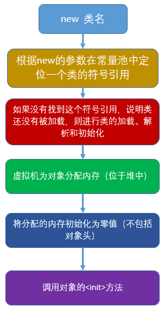

> 当前位置：【Java】01_Java基础  -> 1.2_Oriented（面向对象）

# 软件开发概述

## 1、软件开发的简介

### 1.1 软件开发的生命周期

- 软件的产生直到报废的整个过程


### 1.2 软件开发的阶段

#### （1）问题定义及规划

```java
- 是软件开发方与需求方共同讨论
- 主要确定软件的开发目标及可行性
```

#### （2）需求分析

```java
- 在确定软件开发可行的情况下，对软件需要实现的各项功能进行详细分析
```

#### （3）软件设计

```java
- 主要根据需求分析的结果，把整个软件系统划分为多个模块，设计出每一个模块的具体结构

- 系统框架设计
- 数据库设计等
- 总体设计
- 详细设计
```

#### （4）程序编码

```java
- 将软件设计的结果转换成计算机可运行的程序代码
- 在程序编码中必须要指定统一、符合标准的编写规范，以保证程序的可读性、易维护性，提高程序的运行效率
```

#### （5）软件测试

```java
- 在软件设计完成后要经过严密的测试，以发现软件在整个设计过程中存在的问题并加以纠正

- 测试分类
单元测试
集成测试
系统测试
```

#### （6）运行维护

```java
- 安装部署软件系统，修复软件中存在的bug和升级系统

- 维护分类
纠错性维护
改进性维护
```


### 1.3 软件开发的方式

#### （1）面向过程开发

```bash
# 面向过程简介
- 强调的是每一个功能的步骤
- 每一个功能都使用函数把这些步骤一步一步实现，使用的时候一次调用函数即可

# 面向过程的设计
- 最小的程序单元是函数，每个函数负责完成某一个功能，用以接收输入数据，函数对输入数据进行处理，然后输出结果数据
- 整个软件系统由一个个函数组成，其中作为程序入口的函数称之为主函数，主函数依次调用其他函数，普通函数直接可以相互调用，从而实现整个系统功能

# 面向过程的缺陷
- 设计不够直观，与人类的思维习惯不一致
- 系统软件适应性差，可拓展性差，维护性低
```

#### （2）面向对象开发

```bash
# 面向对象简介
- 强调的是对象，然后由对象去调用功能
- 面向对象是一种基于面向过程的编程思想，即把多个功能放到不同的对象里，强调的是具备某些功能的对象
- 面向对象最小的单位是类
- 面向对象的引入：面向过程最大的问题在于随着系统的膨胀，面向过程将无法应付，最终导致系统的崩溃，为了解决这一问题，提出了面向对象思想
  
# 面向对象特性
- 封装（Encapsulation）
- 继承（Inheritance）
- 多态（Polymorphism）
- 抽象：从特定的角度出发，从已经存在的一些事物中抽取特性和行为，从而形成一个新事物的思维过程，是一种从复杂到简洁的思维方式
```


## 2、软件模块的设计原则

### （1）结构稳定性

```java
- 在软件设计阶段，把一个模块划分为更小的模块时，一定要考虑设计是否合理
- 进而使得系统结构健壮，以便适应用户的需求变化
```

### （2）可拓展性

```java
- 当软件必须增加新功能时，可在现有模块的基础上产生新的模块
- 新的模块继承了原有模块的一些特性，并且还具有一些新的特性，从而实现软件的可重用和可拓展性
```

### （3）可组合性

```java
- 若干模块经过组合，形成大系统
- 模块的可组合性提高软件可重用和可维护性，并且能简化软件开发过程
```

### （4）高内聚性

```java
- 内聚是强调系统模块内的功能联系
- 每个模块只完成特定的功能，不同模块之间不会有功能的重叠，高内聚性可以提高软件的可重用性和可维护性
```

### （5）低耦合性

```java
- 耦合强调的是多个模块之间的关系
- 模块之间相互独立，修改某一模块，不会影响其他的模块，低耦合性提高了软件的可维护性
```


## 3、软件系统的设计原则

- 可重用性：遵循DRY原则，减少软件中的重要代码

- 可拓展性：当软件需要升级增加新的功能，能够在现有系统架构上方便地创建新的模块，而不需要改变软件现有结构，也不会影响以及存在的模块

- 可维护性：当用户需求发生改变时，只需要修改局部模块中的少量代码即可


---

# 第一章 方法

## 1、方法概述

- 方法是定义在类中，具有特定功能的代码块
- 函数在 Java 中被称为方法
- 方法与方法是平级关系，不能嵌套定义（方法不能定义在另一个方法里）


## 2、方法优点

- 降低程序的冗余度，便于后期维护
- 提高封装性


## 3、方法定义

### 3.1 方法定义 - 格式

```java
修饰符 返回值类型 方法名(参数类型 参数名1，参数类型 参数名2…) {
  方法体;
	return 返回值/结果值;
}
```

### 3.2 方法定义 - 格式说明

#### （1）修饰符

- 权限限定符 public 等
- 静态修饰符 static
- 最终修饰符 final

#### （2）返回值类型

- 用于限定返回值的数据类型
- 如果方法执行完毕，需要给调用者返回数据，则数据的类型就是返回值类型
- 如果方法执行完毕，不需要给调用者返回数据，则使用void关键字占位

```java
修饰符 void 方法名(参数类型参数名1，参数类型参数名2…) {
  方法体;
  return ;
}
```

#### （3）方法名

- 是一个标识符，通过方法名调用方法

#### （4）形参列表

- 用于接收调用者传递过来的数据，写法类似定义变量，可以有0个或n个参数项

- 参数类型：用于接收调用方法时，传入的数据类型
- 参数名：用于接收调用方法时，传入的数据变量

#### （5）方法体

- 实现特定功能的代码

#### （6）return

- 结束当前方法，并把结果值返回给调用者
- 如果这个方法执行完毕，不需要给调用者返回数据，return 可以省略
- 如果这个方法执行完毕，需要给调用者返回数据，可以返回==常量==、==变量==、==表达式==


## 4、方法调用

### 4.1 为什么调用

- 方法定义之后，如果没有调用，永远不会执行

### 4.2 方法调用方式

#### （1）有明确返回值的方法调用方式

- 单独调用：没有意义，不推荐
- 输出调用：有意义，但不够好，因为不一定非要把结束输出
- 赋值调用（推荐）

#### （2）void 类型修饰的方法调用方式

- 单独调用：方法名(实参列表);
- 当一个方法执行完毕，不要给调用者返回数据，使用void占位


## 5、方法参数

### 5.1 方法参数 - 概念

- 当要调用一个方法时，会把指定的数值传递给方法中的参数，这样方法中的参数就拥有了这个指定的值，可以使用该值并在方法中运算了，这种传递方式，称为参数传递

### 5.2 方法参数 - 分类

- 形式参数/形参：出现在方法的定义，用来接收传递过来的参数
- 实际参数/实参：出现在方法的调用，代表了要给方法传递的数据

### 5.3 方法参数传递

#### （1）当参数传递的是基本类型（String 也符合该情况）

- 结论：形式参数的改变不影响实际参数
- 本质：是值传递，在方法中修改本身参数值，对原值没有影响
- 在内存中：核心操作的数据在栈中的不同空间中


#### （2）当参数传递的是引用类型

- 结论：形式参数的值改变，直接影响实际参数的值
- 本质：是地址传递，传递的是数据所在位置的地址编号
- 在内存中：如果在方法中根据地址编号操作同一片数据，那么在原方法中可以看到修改后的结果


## 6、方法重载

### 6.1 方法重载 - 概念

- 在Java中允许出现多个同名的方法，但是要求方法的参数个数或参数类型必须不同，这种现象叫方法重载
- 在调用时，JVM虚拟机通过参数列表的不同来区分同名方法
- 好处：方法名字记忆变得简单，系统底层会自动调用对应类型的方法


### 6.2 方法重载 - 判断是否为重载

#### （1）判断依据

- 是否重载只看方法名和参数列表

```bash
# 在同一类中，与方法名有关（方法名必须相同）
# 在同一类中，与方法参数有关
- 参数个数不同
- 参数类型不同
- 参数顺序不同
# 在同一类中，与方法参数名无关（相同方法名，相同参数类型，不同参数名，不是重载）
# 在同一类中，与返回值类型无关
# 在同一类中，与修饰符无关
```

#### （2）判断步骤

```java
- 步骤1：看方法名，只有方法名相同的时候，才有可能是重载
- 步骤2：看参数的个数，个数不同一定是重载
- 步骤3：参数个数相同，看参数类型，如果对应位置的参数类型不同，则一定是重载
- 步骤4：重载跟参数名字无关、重载跟返回值类型无关
```


---

# 第二章 构造器/构造方法


## 1、构造器 - 须知

- 如果==不提供构造器==（自定义构造器），编译器在编译时将==会创建==一个缺省的构造器（默认构造器）
- 如果==提供构造器==（自定义构造器），编译器在编译时将==不会再创建==一个缺省的构造器（默认构造器）
- 但凡提供了任意的构造器，编译器在编译时都不会创建缺省构造器，如果此时需要使用无参构造器创建对象时，必须自己提供无参的构造器
- 即使提供了构造方法，也==不能省略 set 和 get 方法==（因为后期如果改变属性值的时候需要用到 set 和 get 方法）
- 一个类中可以有多个构造方法，多个构造方法是以重载的形式存在的
- 构造方法是可以被 private 修饰的，被 private 修饰后的构造器，其他程序无法创建该类的对象


## 2、构造器 - 作用

### 2.1 创建对象

- 必须是和new一起使用
- 创建对象其实是在调用构造器

### 2.2 完成对象的成员变量初始化操作

- 可以给字段设置初始值
- 可以调用初始化方法


## 3、构造器 - 分类

### 3.1 编译器创建的默认构造器

- 编译器在编译源文件的时候，会创建一个缺省的构造器（即无参的构造器）
- 默认构造器 - 定义格式

```java
// 修饰符
// 如果类A 没有使用 public 修饰符，则编译器创建的默认构造器也没有 public
// 如果类A 使用 public 修饰符，则编译器创建的默认构造器也有 public

// 禁止定义返回类型，因此不能使用 void 作为返回类型
// 在构造器中，不需要使用 return 语句（其实构造器是有返回值的，只不过返回的是当前对象的引用）
// 构造器方法名与当前所在类的名称相同

// 无参数
// 无方法体
修饰符 构造器方法名（）{
}
```

### 3.2 自定义构造器

- 如果自己手写了构造器，编译的时候，编译器不会再创建默认构造器
- 自定义构造器 - 定义格式

```java
// 禁止定义返回类型，因此不能使用 void 作为返回类型
// 在构造器中，不需要使用 return 语句（其实构造器是有返回值的，只不过返回的是当前对象的引用）
// 构造器方法名与当前所在类的名称相同

// 参数列表跟定义方法的形参一致
public 构造器方法名（参数列表）{
  若干条初始化语句；
}
```


## 4、构造器 - 重载

- 构造器是一种特殊的方法，也可以存在重载

- 判断是否是重载：在同一个类中，方法名相同的不同参数的构造器


## 5、【区别】构造方法 & 一般方法

- 构造方法：在==对象创建时就执行==了，而且只执行一次

- 一般方法：在==对象创建后，需要使用时==才被对象调用，并可以被多次调用


---

# 第三章 对象（Object）/ 实例（Instance）

## 1、对象 - 概念

- 一切事物都可以认为是对象
- 对象是具备某种功能的实体（实体是存在于现实世界中并且可以与其他物体区分开来的物体，实际存在的个体）
- 对象可以定义成包含状态和行为的一个实体
- 创建对象的本质：是在调用构造器


## 2、对象 - 创建方式

```java
// 对象的创建方式：根据类来创建对象
类名 对象名 = new 类名( )；
```


## 3、对象 - 创建过程



## 4、对象 - 使用

```java
// 给成员变量设置值（对象的成员变量赋值）
// 对象的变量名.成员变量名 = 该类型的值； 
p.name = 'TD';
   
// 获取成员变量的值（访问对象的成员变量值）
// 对象名.成员变量；
System.out.println(p.name);
    
// 通过对象调用方法（调用对象的成员方法）
// 对象的变量名.方法(实参)；
p.sendMeg("TD");    
```


## 5、对象信息的打印

### 5.1 使用 println 方法打印 hashCode 值

```java
// 打印格式
// println（对象名.字段名）；
Phone2 q = new Phone2();
System.out.println("输出的是(类的全限定名称@内存地址)：" + p);

// 打印结果：类名@十六进制的 hashCode 值
输出的是(类的全限定名称@内存地址)：com.loto.oriented.c.object.a.usage.Phone2@4554617c
```

### 5.2 使用 toString 方法打印对象的属性值

```java
// 步骤1：对象中重写 toString 方法
@Override
public String toString() {
    return "Phone{" +
        "brand='" + brand + '\'' +
        ", price=" + price +
        ", size=" + size +
        '}';
}

// 步骤2：类中调用打印 
// 对象名.toString
System.out.println("===== 重写 toString 方法，打印对象 p 的属性值 =====");
System.out.println(p.toString());

// 对象名
System.out.println("======因为 p 对象所在的类，重写了 toString，因此 p.toString() 和 p 的效果相同======");
System.out.println(p);

// 打印结果
Phone{brand='华为', price=4000.0, size=4.0}
```


## 6、对象 - 比较操作

### 6.1 “==“ 操作符

- == 对于==基本数据类型==来说，比较的是值

```java
// 如果操作数是 boolean、byte、short、int、long等基本数据类型，JVM 编译器会生成 if_icmpne 指令,该指令用于比较整形数值是否相等
int a1 = 1;
int a2 = 1;
System.out.println(a1 == a2);  // true，值相同

int a3 = 3;
int a4 = 4;
System.out.println(a3 == a4);  // false，值不同
```

- == 对于==引用数据类型==来说，比较的是在内存中的地址值，即用来比较两个引用变量是否指向同一个对象

```java
// 如果操作数是对象，JVM 编译器会生成 if_icmpne 指令，比较的是操作数栈上两个对象在堆中的指针
String s11 = "abc";
String s21 = "abc";
System.out.println(s11 == s21);  // true，变量 s11 和 s21，指向同一个地址

String s31 = "abcd";
String s41 = "abcde";
System.out.println(s31 == s41);  // false，变量 s31 和 s41，指向不同地址
```

### 6.2 equals 方法

- equals 对于==引用数据类型==来说，比较的是在内存中的地址值，即用来比较两个引用变量是否指向同一个对象

```java
String ss11 = "abc";
String ss21 = "abc";
System.out.println(ss11.equals(ss21));  // true，变量 ss11 和 ss21，指向同一个地址

String ss31 = "abcd";
String ss41 = "abcde";
System.out.println(ss31.equals(ss41));  // false，变量 ss31 和 ss41，指向不同地址

// new String 的方式与上面的结果相同
String s5 = new String("31");
String s6 = new String("31");
System.out.println(s5.equals(s6));    // true

String s7 = new String("41");
String s8 = new String("42");
System.out.println(s7.equals(s8));   // false
```


## 7、对象 - 生命周期

- 对象的产生：每次使用new关键字的时候，就会在内存开辟新的内存空间，此时对象开始存在

- 对象的结束：当堆中的对象，没有被任何变量所引用，此时该对象就成了垃圾，等着垃圾回收器（GC）来回收该垃圾，当被回收的时候，对象被销毁（回收垃圾的目的是为了释放更多的内存空间）


## 8、匿名对象

### 8.1 匿名对象 - 简介

- 创建对象之后没有把对象地址的值赋值给某一个变量的对象，即是没有名称的对象
- 由于没有记录堆内存对象的地址值，匿名对象在没有指定其引用变量时，只能使用一次，再次使用就找不到了
- 本质：匿名对象只是在堆中开辟一块新的内存空间，但是没有把该空间地址赋值给任何变量
- 好处：使用完毕就是垃圾，可以在垃圾回收器空闲时回收，节省内存空间

### 8.2 匿名对象 - 用法

```java
public static void main(String[] args) {
    System.out.println("======== 创建有名字的对象 ==========");
    // 创建有名字的学生对象
    Student s = new Student();
    s.study();
    System.out.println(s);

    // 匿名对象只能使用一次
    System.out.println("======== 创建匿名对象1，但是并未进行任何操作 ==========");
    new Student();

    System.out.println("======== 创建匿名对象2，并调用study()方法 ==========");
    new Student().study();

    System.out.println("======== 用法1：把匿名对象作为方法的实参传递 ==========");
    Student p1 = new Student();
    method1(p1);            // 把有名字的p1对象作为方法的实参传递
    method1(new Student()); // 把匿名对象作为方法的实参传递

    System.out.println("======== 用法2：匿名对象作为方法返回值 ==========");
    Student p2 = method2();
    p2.study();
}

private static void method1(Student p) {
    p.study();
}

private static Student method2() {
    return new Student();  // 匿名对象作为方法返回值
}
```


---

# 第四章 类

## 1、类和对象

### 1.1 类和对象的关系

```bash
# 通过对多个同类型的对象分析，可以把具有相同状态和行为的对象抽象成类

# 一个类可以创建多个对象
- 对象的抽象是类，类的具体化是对象
- 类的实例是对象，类实际上是一种数据类型

# 类是对象的类型或模板，对象是类的实例
- 创建一个对象，就是使用一个类作为构建该对象的基础
- 如果没有类，对象就无法实例化
```

### 1.2 类与对象的内存图

- 当一个类第一次使用的时候载入到方法区，后续每一次再使用这个类就不需要载入


## 2、类的成员

### 2.1 成员变量

- 类具有特性，相当于对象的状态，用成员变量来描述
- 成员变量 & 局部变量：重名问题

```java
- 现象：局部变量和成员变量重名时，局部变量隐藏成员变量
- 原因：（变量访问的就近原则）当出现多个重名变量的时候，目标代码使用的是离这行代码最近的那个变量
- 解决方法：当局部变量和成员变量重名的时候，想在特定的代码处访问成员变量，就可以在目标行的变量名前加 this
```

- 成员变量 & 局部变量：区别

| 区别               | 成员变量                       | 局部变量                           |
| :----------------- | ------------------------------ | ---------------------------------- |
| 类中定义的位置     | 类的内部，方法的外部           | 方法的内部                         |
| 在内存中的存放位置 | 跟随对象进入堆内存             | 跟随方法进入栈内存                 |
| 初始化值           | 有默认值                       | 没有初始值，使用前必须赋值         |
| 生命周期           | 对象创建时存在，对象消失时消失 | 方法调用时存在，方法调用完毕时消失 |

### 2.2 成员方法

- 类具有功能，相当于对象的行为，用方法来描述


## 3、类的定义

### 3.1 类 - 简介

- 在面向对象的过程中，定义类的时候，专门为描述对象提供一个类，该类不需要 main 方法

### 3.2 类 - 格式

```java
// 修饰符：使用 public 必须保证当前文件名和当前类名相同
// 类名：标识符规范，类名首字母大写，如果是多个单词组成，使用驼峰表示法
// 成员变量列表：事物的特征，只写当前场景关注的特性，写法类似于定义变量
// 成员方法列表：事物的行为/功能，只写当前场景关注的行为/功能，写法类似于定义方法，只不过去掉 static
修饰符 class 类名{
    数据类型 成员变量名 1；
    数据类型 成员变量名 2；
    ...
    数据类型 成员变量名 n；

    成员方法 1；
    成员方法 2；
    ...
    成员方法 n；
}
```


## 4、类的数据类型（引用数据类型）

### 4.1 官方 API 中提供的数据类型

- Scanner 类

- Random 类

- .... 等等

  

### 4.2 自定义的数据类型

- 通常所说的“自定义类”，本质上指的是自定义类的数据类型

```JAVA
// 步骤1：创建 java 文件，与类名相同

// 步骤2：定义类
修饰符 class 类名{
    // 定义成员变量
    数据类型 成员变量名1；
    数据类型 成员变量名2；

    // 定义成员方法
    修饰符 返回值类型 方法名(参数列表){
         // 方法功能
	}
}

// 步骤3：使用类
// 导包：一般将所有的类放到同一个文件夹下，可以避免导包
//（1）创建对象
数据类型 变量名 = new 数据类型();

//（2）成员变变量的赋值
//（3）成员变量的访问
// 直接访问
变量名.成员变量名
// 间接访问
getter

// 步骤4：调用方法
```


## 5、类的使用

- 类作为方法的参数
- 类作为方法的返回值


## 6、内部类

### 6.1 内部类 - 简介

- 将类写在其他类的内部，可以写在其他类的成员位置和局部位置
- 特点：内部类可以直接访问外部类的成员，包含私有的成员

### 6.2 内部类 - 分类

#### （1）成员内部类

```java
// 定义位置：在外部类中的成员位置

// 定义格式
class 外部类 { 
	修饰符 class 内部类 {
		//其他代码
	}
}

// 访问规则
与类中的成员变量相似，可通过外部类对象进行访问
内部类可以使用外部类成员（包括私有）
外部类想要使用内部类成员，必须通过建立内部类对象

// 访问格式
外部类名.内部类名 变量名 = new 外部类名().new 内部类名();
```

#### （2）局部内部类

```java
// 定义位置：定义在外部类方法中的局部位置

// 定义格式
class 外部类 { 
    修饰符 返回值类型 方法名(参数) {
        class 内部类 {
            // 其他代码
        }
    }
}

// 调用方式
调用外部类的方法，外部类的方法里又调用了局部内部类的方法
```

#### （3）匿名内部类（属于局部内部类）

```java
// 作用：匿名内部类是创建某个类型子类对象的快捷方式
// 完成功能：定义实现类、重写方法、创建实现类对象

// 定义格式
new 父类或接口(){
	// 重写抽象方法
};
```


## 7、抽象类 abstract

### 7.1 抽象类和抽象方法

- 抽象类和抽象方法都需要被 abstract 修饰
- 抽象关键字 abstract 不可以和 private、final、static共存
  - private：私有的方法子类是无法继承到的，也不存在覆盖，而abstract和private一起使用修饰方法，abstract既要子类去实现这个方法，而private修饰子类根本无法得到父类这个方法，互相矛盾
  - final：
  - static：

### 7.2 抽象类

#### （1）抽象类 - 简介

- 抽象类：被 abstract 关键字修饰的类是抽象类

- 抽象类一定是个父类

- 抽象类中可以不定义抽象方法（为了不让该类创建对象，同时子类可以直接调用抽象类中带有方法体的普通方法）
- 抽象类不可以直接创建对象（调用抽象方法没有意义）
- 定义一个类继承抽象类，将所有的抽象方法都进行重写，然后子类才可以创建对象（如果只重写部分抽象方法，这个子类还是一个抽象类，依然不能创建对象）

#### （2）抽象类 - 定义格式

```java
abstract class 类名 {
  // 抽象方法
}
```

#### （3）抽象类的使用

- 抽象类作为方法的参数
- 抽象类作为方法的返回值


### 7.3 抽象方法

#### （1）抽象方法 - 简介

- 抽象方法一定要定义在抽象类中
- 抽象方法
  - 分析事物时，发现了共性内容，就出现向上抽取
  - 会有这样一种特殊情况：方法功能声明相同，但方法功能主体不同
  - 此时只抽取方法声明，不抽取方法主体，那么此方法就是一个抽象方法

#### （2）抽象方法 - 定义格式

```java
public abstract 返回值类型 方法名(参数);
```


## 8、工具类

- 工具类：存放了某一类事物的工具方法的类

- 工具类的命名：xxxUtil、xxxUtils、xxxTool、xxxTools（xxx表示一类事物）
- 工具包：工具类存放的包（util、utils、tool、tools、helper、helpers）
- 工具类的设计

```java
- 如果工具方法没有使用 static 修饰，说明工具方法得使用工具类的对象来调用 —> 此时把工具类设计为单例的
- 如果工具方法全部使用 static 修饰，说明工具方法只需要使用工具类名调用即可 —> 此时必须把工具类的构造器私有化（防止创建工具类对象调用静态方法，JDK中提供的工具类都是此种方式）
```


---

# 第五章 面向对象特性：封装（Encapsulation）

## 1、封装 - 简介

### 1.1 封装的原则

- 把对象的状态和行为看成一个统一的整体，将二者存放在一个独立的模块中（类）
- 把不需要对外提供的内容隐藏起来，尽可能==隐藏对象功能实现细节==，==向外部暴露方法==，保证外界安全访问功能，以供调用
- 把所有的成员变量使用 private 私有化，不准外界直接访问，只能使用getter方法间接访问
- 把所有的成员方法使用 public 修饰，允许外界访问

### 1.2 封装的好处

- 使调用者正确、方便的使用系统功能，防止调用者随意修改系统属性
- 通过方法来控制成员变量的操作，==提高了代码的安全性==
- 把代码用方法进行封装，==提高了代码的重用性==
- 达到组件之间的==低耦合性==（当某一个模块实现发生变化时，只要对外暴露的接口不变，就不会影响到其他模块）


## 2、封装 - 方式

### 步骤1：对成员变量封装

- 使用 private 关键字，修饰对应的属性，防止外界通过 “对象名.属性” 的方式直接访问属性
- 书写对应属性的 setter 和 getter 方法，给外界一个访问属性的通道

### 步骤2：使用 setter 和 getter 方法间接访问成员变量

#### （1）setter 方法

- 作用：用来给外界访问属性，仅仅用于给某一个字段设置需要存储的值 
- 格式

```java
public void setXxx(参数数据类型 参数y) {
  // 把传递过来的参数y的值存储到xxx字段中
  xxx = 参数y;
}

// 创建对象并给对象设置初始值的两种方式（构造器和 setter 方法选用）
方式1：如果在构建对象的时候需要初始化多个数据，先通过无参构造器创建出一个对象，再通过对象调用相应的 setter 方法设置值
方式2：如果存在带参数的构造器，直接调用带参数的构造器，创建出来的对象有初始值
```

#### （2）getter 方法

- 作用：用来给外界访问属性，用于获取某一个字段存储的值 
- 格式

```java
// Xxx 表示字段名，第一个字母大写
// 如果操作的字段是 Boolean 类型，则此时应该用 is 方法，如 isXxx
public 字段数据类型 getXxx() {
  // 返回xxx字段存储的值
  return xxx;
}
```


## 3、封装 - 访问权限控制符

### （1）private

- private 表示私有，表示类访问权限
- 范围：用于修饰成员（成员变量和成员方法），被 private 修饰的成员只能在本类中才能访问，离开本类之后，不能直接访问
- 被 private 修饰的成员，需要提供对应的公共访问方式，setXxx() 和 getXxx()方法

### （2）缺省（什么也不写）

- 表示包私有，表示包访问权限
- 范围：访问者的包必须和当前定义类的包相同才能访问
- 使用场景：一般不使用缺省，即使要使用，也仅仅是暴露给同包中的其他类

### （3）protected

- 表示子类访问权限
- 范围：同包中的可以访问，即使不同包，但是有继承关系的子类也可以访问
- 使用场景：在继承关系中，父类需要把一个方法只暴露给子类

### （4）public

- 表示全局的，可以公共访问权限，
- 范围：如果某个方法、某个字段，使用了 public 修饰，则可以在当前项目中任何地方访问

### （5）总结

- 一般==成员变量==都使用 ==private== 修饰，表达隐藏，为了安全性
- ==拥有实现细节的方法==，一般使用 ==private== 修饰，不希望外界（调用者）看到该方法的实现细节
- 仅仅只是完成部分操作，并不是实现具体细节的方法，则使用 public 修饰，供外界直接调用

|  修饰符   | 类内部 | 同一个包 | 子类 | 任何地方 |
| :-------: | :----: | :------: | :--: | :------: |
|  private  |   √    |          |      |          |
|    无     |   √    |    √     |      |          |
| protected |   √    |    √     |  √   |          |
|  public   |   √    |    √     |  √   |    √     |


## 4、封装 - static 修饰符

- static 修饰符表示静态的
- static 修饰的资源属于类级别，而不是对象级别
- static 修饰符可以修饰字段、方法、内部类，其修饰的成员属于类
- static 修饰的成员变量和成员方法，随着所在类的加载而加载（当 JVM 把字节码加载进 JVM 的时候，static 修饰的成员变量已经在内存中存在了）


## 5、封装 - this 关键字

### 5.1 this 关键字 - 概念

- this 指的是当前调用这个方法的对象
- 方法被哪个对象调用，this 就代表哪个对象
- 当一个对象创建之后，JVM 会分配一个引用自身的引用（即this），this 相当于当前对象中的一个引用地址，指向自己，因此对象调用方法的时候，实际上访问自身 this 中的内容

### 5.2 this 关键字 - 使用场景

- 解决成员变量和局部变量（参数）之间的重名问题（this.xxx 是成员变量）
- 同类中实例方法之间的互相调用问题（一般省略 this）
- 解决构造器重载时的互相调用问题
  - 使用 this（实参）必须写在构造方法的第一行
  - 构造器中只能调用一个重载的构造器
  - 当多个构造器重载时，或多个方法重载时，一般是少参数的调用多参数的（因为参数越多，方法内部考虑的未知因素也越多，功能也就更强大）

- 将 this 作为参数传递给另一个方法
- 将 this 作为方法的返回值（链式编程）
- static 不能和 this 一起使用：当字节码被加载进 JVM，static 成员已经存在内存了，而对象还没有被创建，没有对象就没有 this

### 5.3 this 关键字 - 使用位置

- 构造器中：this 表示当前创建的对象
- 方法中：哪个对象调用 this 所在的方法，此时 this 就表示哪个对象


## 6、JavaBean 规范

### 6.1 JavaBean - 概述

- 简介：JavaBean 是一种 Java 语言写的可重用组件（即特殊的类）
- 规范

  - 类必须使用 public 修饰

  - 必须保证有公共无参构造器

  - 包含了属性的操作手段（给属性赋值、获取属性值）

### 6.2 JavaBean - 使用场景

- 复杂功能：UI界面
- 简单功能
  - 封装数据（封装字段，并提供setter和getter）
  - 操作数据库
  - 逻辑运算

### 6.3 JavaBean - 构成

#### （1）属性 property

- getter 方法中，去掉 get，把首字母小写，得到 xxx 才是属性
- setter 方法中，去掉 set，把首字母小写，得到 xxx 才是属性
- 【区分】字段 & 属性

```java
- 成员变量或者叫字段（field）被称为属性（attribute）
- 属性（property）则是其操作方法（setter或getter）决定的，框架中的大多数都是属性
```

#### （2）方法 method

#### （3）事件 event


---

# 第六章 面向对象特性：继承（Inheritance）

## 1、继承关系 - 根类

- Java中，除了 object 类之外，每一个类都有一个直接的父类

- object 类是 Java 语言中的根类（任何类都是 object 的子类）

- object 类要么是一个类的直接父类，要么是一个类的间接父类


## 2、继承关系 - 概述

- 从面向对象的角度：继承是一种从一般到特殊的关系，是一种“is a”的关系（即子类是对父类的拓展，是一种特殊的父类）

- 继承关系的作用

  - 解决了代码重复问题，提高了代码的复用性，提高软件开发效率
  - 表示出一个体系，让类与类之间产生了关系，为多态的产生提供了前提

- 继承关系在开发中的实际用法

  - 一般的，开发中先编写多个自定义的类，然后发现多个类中存在共同的代码，此时可以抽取出一个父类
  - 项目中大部分都是基于框架/组件进行的开发，因此，基本上都是定义新的类继承于框架/组件中提供的父类

- 继承关系的特性

  - Java中，类和类之间的继承关系只==允许单继承==，不允许多继承（即一个类只能有一个直接的父类）
  - Java中，类和类之间的继承关系==允许多重继承==（即父类可以有多个子类，子类可以有多个子子类）

  

## 3、继承关系 - 使用格式

```java
// extends关键字：表示子类和父类之间的关系
public class 子类类名 extends 父类类名{
    子类特有的状态（成员变量）
	子类特有的行为（成员方法）
}
```


## 4、继承关系 - 组成（子类和父类）

### （1）被继承的类：super class（父类/超类/基类/被拓展类）

- 存放的是共性（共同的特性，包括了状态和行为）


### （2）继承的类：sub class（子类/拓展类）

- 存放的是特性（自己特有的特性，包括了状态和行为）
- 当子类继承父类后

```bash
# 子类会自动拥有父类所有可继承的成员变量和成员方法
如果父类中的成员使用 public 修饰，子类可以继承该成员
如果父类中的成员使用 protected 修饰，子类可以继承该成员，即使父类和子类不在同一个包中
如果父类和子类在同一个包中，此时子类可以继承父类中缺省修饰符的成员
如果父类中的成员使用 private 修饰，子类不可以继承该成员（因为 private 修饰的成员只能在本类中访问）
父类的构造器，子类不可以继承（因为构造器必须和当前的类名相同）
    
# 能直接或间接获得父类里的成员变量和成员方法

# 可以增加原来父类没有的成员变量和成员方法，可以覆盖父类中的某些特性（子类重写父类方法，也即是方法覆盖 override）
```

- 默认情况下，子类的对象==调用成员变量==的时候

```java
- 子类自己有，就使用子类的
- 子类没有，就调用父类的
```

- 默认情况下，子类的对象==调用成员方法==的时候

```java
- 子类自己有，就使用子类的
- 子类没有该方法，就调用父类的
```

- 子类初始化过程（在创建子类对象时的执行顺序）

```bash
- 必须先有父类对象，而后才能有子类对象：在创建子类对象之前，会先创建父类对象
- 必须先调用父类构造器，而后再调用子类构造器：调用子类构造器之前，在子类构造器中会先调用父类的构造器，默认调用的是父类的无参构造器

# 注意事项
- 如果父类不存在可以被子类访问的构造器（如 private 修饰的），则不能存在子类
- 如果父类没有提供无参构造器，此时子类必须通过 super 语句去调用父类带参数的构造器
```


## 5、继承关系 - 子类重写父类方法（方法覆盖 override）

### 5.1 方法覆盖 - 引入

- 子类中出现与父类一模一样的方法时，会出现覆盖操作，也称为override重写、复写或者覆盖
- 只有方法存在覆盖的概念，字段没有覆盖
- 当父类的某一个行为不符合子类具体特征的时候，此时需要子类重新定义父类的方法，并重写方法体

### 5.2 方法覆盖 - 什么时候用

- 当子类需要父类的功能，而功能主体子类有自己特有内容时，可以重写父类中的方法，这样，即沿袭了父类的功能，又定义了子类特有的内容

### 5.3 方法覆盖 - 判断标准

- 在方法覆盖前加上 @override
- @override 是注解类型，表示判断当前子类的方法是否重写了父类方法

### 5.2 方法覆盖 - 调用顺序

- 先从==子类==中寻找调用的方法
- 如果找不到就去==父类==中去找该方法
- 如果还找不到就继续去==父类的父类==中找该方法
- 一直找到 ==object==，如果还找不到，编译报错

### 5.2 方法覆盖 - 遵循原则（一同两小一大）

#### （1）成员方法签名必须相同

- 方法签名 = 方法名 + 方法的参数列表

#### （2）子类方法的返回值类型 <= 父类方法的返回值类型

- 要么与父类相同
- 要么是父类类型的子类类型

#### （3）子类方法声明抛出的异常类型 <= 父类方法声明抛出的异常类型

- 要么与父类相同
- 要么是父类类型的子类类型
- 子类方法可以同时声明抛出多个属于父类方法声明抛出异常类的子类（RuntimeException 类型除外）

#### （4）子类方法的访问权限 >= 父类方法的访问权限

- 要么与父类相同
- 要么比父类的访问权限大
- private 修饰的方法不能被子类所继承，也就不存在覆盖的概念


## 6、继承关系 - super 关键字

### 6.1 隐藏/遮蔽

#### 情形1：满足继承的访问权限下，隐藏父类静态方法

  - 如果子类定义的静态方法的签名和父类中的静态方法签名相同，那么此时就是隐藏父类方法
  - 仅仅是静态方法，即子类存在和父类一模一样的静态方法

#### 情形2：满足继承的访问权限下，隐藏父类字段

- 如果子类中定义的字段和父类中的字段名相同（不管类型）此时就是隐藏父类字段
- 此时只能通过super访问被隐藏的字段：super.父类中的成员变量

#### 情形3：隐藏本类字段

- 如果同类中局部变量名和字段名相同，此时就是隐藏本类字段
- 此时只能通过this访问被隐藏的字段：this.本类中的成员变量

### 6.2 子父类中构造方法的调用

```java
// 调用本类中的构造方法
this(实参列表);

// 调用父类中的空参数构造方法
super();

// 调用父类中的有参数构造方法
super(实参列表);
```

### 6.3 super 使用场景

- 方法：在子类方法中，使用 super 调用父类被覆盖的方法（super 表示当前对象（this）的父类对象）
- 字段：子类隐藏了父类的字段，通过 super 访问父类被隐藏的字段（一般不使用，因为会破坏封装）
- 构造器：在子类构造器中，使用 super（实参）调用父类构造器
  - 构造方法的第一行 this()和super() 不能同时存在，任选其一，保证子类的构造方法调用到父类的构造方法即可
  - 子类的构造方法，如果什么都不写，默认的构造方法第一行是 super()
  - 子类中所用的构造方法，无论重载多少个，第一行必须是 super()
  - 如果父类有多个构造方法，子类任意调用一个就可以


## 7、【区别】static & super & this

- static 不能与 super 和 this 共存
- static 是==类级别==的，super 和 this 是==对象级别==的


## 8、组合关系

### 8.1 组合关系 - 概念

- 继承关系破坏了封装，复用代码可能会让子类具有不该具有的功能
- 所以为了解决代码复用问题，还可以使用组合关系（是一种包含关系，是一种“has a”的关系）

### 8.2 组合关系 - 使用场景

- 如果A类为了得到B类的功能行为

```java
- 如果A类是B类的一种特殊情况，则使用继承
- 否则使用组合关系
```


---

# 第七章 面向对象特性：多态（Polymorphism）

## 1、多态 - 简介

### 1.1 多态 - 引入

- 对象有两种类型（编译类型必须是运行类型的父类或相同）

  - 编译类型：声明对象变量的类型（表示把对象看成什么类型）
  - 运行类型：对象的真实类型

### 1.2 多态 - 概念

- 当编译类型和运行类型不同的时候，出现多态

### 1.3 多态 - 使用前提

- 有继承或者实现关系

  - 情形1：可以是继承关系（即类和类之间的关系）

  - 情形2：可以是实现关系（即接口和实现类之间的关系）

- 要方法重写

- 父类引用指向子类对象

### 1.4 多态 - 特点

- 可以直接把子类对象赋值给父类变量，但是运行时依然表现出子类的行为特征（即在运行时期调用子类的方法）

- 这意味着同一类型的对象在运行时可能表现出不同的行为特征，即是对象具有多种形态

### 1.5 多态 - 优缺点

- 优点：提高了程序的扩展性（把不同的子类对象都当做父类类型来看待，可以屏蔽不同子类对象之间的实现差异，从而写出通用的代码达到通用编程，以适应需求的不断变化）

- 缺点：不能访问子类的特有功能


## 2、多态 - 分类

### 2.1 普通类的多态

```java
// 定义
父类 变量名 = new 子类();

// 调用
变量名.子类重写父类的方法名();
```

### 2.2 抽象类的多态

```java
// 定义
抽象类 变量名 = new 抽象类子类();

// 调用
变量名.子类重写抽象方法的方法名();
```

### 2.3 接口的多态

```java
// 定义
接口 变量名 = new 接口实现类();

// 调用
变量名.实现类重写抽象方法的方法名();
```


## 3、多态中的成员

### 3.1 成员变量

```java
- 当子父类中出现同名的成员变量时，多态调用该变量时
  - 编译时，如果父类中有该变量，则编译成功，否则失败
  - 运行时，运行的是父类中的变量值
  - 总结：编译运行都看父类

- 成员变量隐藏现象
  - 成员变量不存在覆盖的概念，在多态时，不能有多态特征（多态特征是指在运行时期体现子类特征）
  - 通过对象调用成员变量，在编译时期就已经决定了调用哪一块内存空间的数据
  - 当子类和父类存在相同的成员变量时，无论字段的修饰符是什么，都会在各自的内存空间存储数据
```

### 3.2 成员方法

#### （1）当子父类中出现同名的成员方法时，多态调用该方法时

- 编译时，如果父类中有该方法，则编译成功，否则失败
- 运行时
    - 调用的是静态方法，运行的是父类中的静态方法
    - 调用的是非静态方法，运行的是子类中的重写方法
- 总结：编译看父类，运行看静态还是非静态

#### （2）方法调用问题

```java
// 编译看左，运行看右

// 情形1：方法存在于父类，不存在于子类
编译通过
执行顺序：先去子类中找该方法，如果找不到再去父类中找
    
// 情形2：方法不存在于父类，存在于子类
编译错误
执行顺序：编译时会在父类中找，找不到编译报错
    
// 情形3：方法存在于父类，也存在于子类（此时称为多态）
编译通过
执行顺序：执行子类中的方法（在运行时，调用运行类型中的方法，即子类中的方法）
    
// 情形4：方法存在于父类，也存在于子类，但是该方法是 static 修饰（此时称为隐藏）
编译通过
执行顺序：执行父类中的方法
静态方法的调用只需要类即可，如果使用对象来调用静态方法，其实使用的是对象的编译类型来调用静态方法
```


## 4、类的关系判断

### 4.1 instanceof 比较运算符

```java
// 使用前提
A 和 B 之间必须是继承关系或实现关系
    
// 效果：判断 A对象 是否是 B类 的实例
// 如果对象是类的实例，则返回 true 给 b
// 如果对象是类的父类的实例，则返回 true 给 b
// 返回的是一个 boolean 类型的值
boolean b = 对象A instanceof 类B；
```

### 4.2 getClass（）和 .class

```java
// 得到 对象A 的类型
对象A.getClass()

// 得到 类B 的类型
类B.class
    
// 比较 对象A的类型 和 类B的类型 是否一致
// 返回的是一个 boolean 类型的值
对象A.getClass() == 类B.class
```


## 5、多态的转型

### 5.1 向上转型

- （子类提升为父类）当有子类对象赋值给一个父类引用时，便是向上转型，多态本身就是向上转型的过程

```java
// 使用格式
父类类型 变量名 = new 子类类型();

// 举例
Person p = new Student();

// 使用场景：当不需要面对子类类型时，通过提高扩展性，或者使用父类的功能就能完成相应的操作，这时就可以使用向上转型
// 好处：可以调用父类与子类的公有成员
```

### 5.2 向下转型

- （父类类型强转为子类类型）一个已经向上转型的子类对象可以使用强制类型转换的格式，将父类引用转为子类引用，这个过程是向下转型
- 如果是直接创建父类对象，是无法向下转型的！

```java
// 使用格式
子类类型 变量名 = (子类类型) 父类类型的变量;

// 举例
Student stu = (Student) p; // 变量 p 实际上指向 Student 对象

// 使用场景：当要使用子类特有功能时，就需要使用向下转型
// 好处：可以调用子类特有成员
// 弊端：需要面对具体的子类对象；在向下转型时容易发生 ClassCastException 类型转换异常，因此在转换之前必须做类型判断
```


---

# 面向对象三大特性总结

- 封装：把对象的属性与方法的实现细节隐藏，仅对外提供一些公共的访问方式

- 继承：子类会自动拥有父类所有可继承的属性和方法

- 多态：配合继承与方法重写提高了代码的复用性与扩展性；如果没有方法重写，则多态同样没有意义


---

# 第八章 接口

## 1、接口 - 简介

### 1.1 接口 - 概念

- 接口是功能的集合，是一种数据类型，是比抽象类更为抽象的”类”，可以将接口看做是一种只包含了功能声明的特殊类
- 接口只描述所应该具备的方法，并没有具体实现，具体的实现由接口的实现类（相当于接口的子类）来完成

### 1.2 接口 - 好处

- 接口的出现扩展了功能
- 接口其实就是暴漏出来的规则
- 接口的出现降低了耦合性，即设备与设备之间实现了解耦
- 功能的定义与实现分离，优化了程序设计


## 2、接口 - 定义

- 定义接口仍在.java文件，虽然声明时使用的为 interface 关键字，编译后仍然会产生 .class 文件

- 格式

```java
// 接口中的方法均为公共访问的抽象方法（public 可省略）
// 接口中无法定义普通的成员变量
// 接口中无法定义带有方法体的普通方法
public interface 接口名 {
    public abstract 返回值类型 抽象方法名(参数列表); //抽象方法1
    public abstract 返回值类型 抽象方法名(参数列表); //抽象方法2
    public abstract 返回值类型 抽象方法名(参数列表); //抽象方法3
}
```


## 3、接口 - 实现

- 类与接口的关系为实现关系，即类实现接口
- 在类实现接口后，该类就会将接口中的抽象方法继承过来，此时该类需要重写该抽象方法，完成具体的逻辑

- 格式

```java
// 接口的单实现
public class 类名 implements 接口名 {
    // 重写了接口的抽象方法
    public 返回值类型 抽象方法名() {	
	}
} 

// 接口的多实现
public class 类名 implements 接口名1, 接口名2.... {
  // 重写抽象方法
}

// 类在继承的时候实现多接口
// 使用场景：当一个类已经继承了一个父类，它又需要扩展额外的功能
public class 类名 extends 父类 implements 接口名1, 接口名2.... {
  // 重写抽象方法
}
```


## 4、接口 - 成员

### 4.1 成员变量

```java
// public：权限修饰符
// static：被 static 修饰后，该成员变量可以直接被类名调用（通过.的方式）
// final：最终的，目的是为了固定该成员变量的值（因此其实该变量是一个常量）
// 注意：以上3个修饰符可以写部分，也可以省略不写
// 所有接口中的成员变量已是静态常量，由于接口没有构造方法，所以必须显示赋值
public static final 数据类型 变量名 = 值;
```

### 4.2 成员方法

```java
// 定义格式
// public 和 abstract 修饰符可以写部分，也可以省略不写
public abstract 返回值类型 抽象方法名(参数列表);
    
// 实现格式
// 必须重写接口的全部抽象方法，如果重写部分抽象方法，则实现类还是一个抽象类，所以也不能实例化创建对象
public 返回值类型 抽象方法名(参数列表) {
    
}

// 调用格式
// 步骤1：创建接口的实现类对象
接口实现类名 变量名 = new 接口实现类名();
// 步骤2：调用
变量名.成员方法名
```


## 5、接口的多继承

- 接口与接口之间可以通过继承产生关系

- Java支持接口之间的多继承，一个接口可以同时继承多个接口


## 6、 接口的使用

- 接口作为方法的参数

- 接口作为方法的返回值

  

## 【区别】接口 & 抽象类

- 相同点

```java
- 都位于继承的顶端，用于被其他类实现或继承
- 都不能直接实例化对象
- 都包含抽象方法，其子类都必须覆写这些抽象方法
```

- 区别

```java
- 抽象类为部分方法提供实现，避免子类重复实现这些方法，提高代码重用性，接口只能包含抽象方法
- 一个类只能继承一个直接父类(可能是抽象类)，却可以实现多个接口（接口弥补了Java的单继承）
- 抽象类是这个事物中应该具备的内容, 继承体系是一种 is..a关系
- 接口是这个事物中的额外内容，继承体系是一种 like..a关系
```

- 使用场景

```java
- 优先选用接口，尽量少用抽象类
- 需要定义子类的行为，又要为子类提供共性功能时才选用抽象类
```


---

# 第九章 面向对象高级

## 1、代码块

### 1.1 代码块 - 概念

- 代码块是指在类或方法中，直接使用{ } 括起来的一段代码，表示一块代码区域
- 代码块里的变量属于局部变量，只在代码块内部有效


### 1.2 代码块 - 分类（根据定义的位置不同）

#### （1）局部代码块

- 概念：是指直接定义在方法内部的代码块，用来限制变量的作用范围
- 使用场景：一般不会直接使用局部代码块，而是结合if、while、for、try等关键字，表示一块代码区域

#### （2）初始化代码块 / 构造代码块

- 概念：是指直接定义在类中方法外，用来给对象中的成员初始化赋值的代码块
- 使用场景：可用于对象的初始化操作
- 执行过程

```java
（1）每次创建对象的时候
    先去执行本类中的初始化代码块
    再去调用构造器中的代码块
（2）通过反编译后，可以发现其实初始化代码块也作为构造器的最初语句
（3）因此，一般不直接在初始化代码块中做初始化操作，只需在构造器中做初始化操作即可
（4）如果初始化操作代码过多，则可以专门定义一个方法做初始化操作，再在构造器中调用
```

#### （3）静态代码块

- 概念：使用 static 修饰，定义在类中方法外，用来给类的静态成员初始化赋值

- 使用场景：可用于类的初始化操作，可以用于加载资源、加载配置文件
- 特点

```
- 优先于主方法执行，优先于构造代码块执行，不管创建多少对象，静态代码块只执行一次
- 所在类被加载后就执行，和静态方法都不能访问外部实例成员
```

- 执行过程

```java
- 静态成员随着字节码的加载也加载进 JVM，此时 main 方法还没有执行（因为方法需要 JVM 调用）
- 因此整个过程是，先把字节码加载进 JVM，而后 JVM 再调用 main 方法
- 所以静态代码优先于 main 方法执行
```


### 1.3 代码块 - 执行顺序

- 静态代码块，只执行一次
- 构造代码块，new 一次，就执行一次，优先于构造方法


## 2、static 关键字

### 2.1 前导知识

- 对象的特有数据（非 static 修饰）

- 对象的共有数据（static 修饰）


### 2.2 static 特点

- 被静态所修饰的成员，会被所有的对象所共享
- 被静态所修饰的成员，通过类名直接访问成员，不需要创建对象
- 静态成员存于静态区，随着类的加载而加载，优先于对象，优先于非静态存在于内存中
- 静态内容是优先于对象存在，只能访问静态，不能使用 this/super


### 2.3 被 static 修饰的成员

#### （1）成员变量

- 成员变量属于类，不属于这个类的某个对象
- 多个对象在访问或修改 static 修饰的成员变量时，其中一个对象将 static 成员变量值进行了修改，其他对象中的 static 成员变量值跟着改变，即多个对象共享同一个static成员变量
- 使用格式

```java
类名.静态成员变量名

// 不建议使用该方式，会出现警告
对象名.静态成员变量名
```

#### （2）成员方法

- 静态方法中，只能访问静态成员变量或静态成员方法
- 成员方法中使用的成员变量全部都被 static 修饰，成员方法也要被 static 修饰
- 使用格式

```java
类名.静态成员方法名(参数)

// 不建议使用该方式，会出现警告
对象名.静态成员方法名(参数)
```


### 2.4 在类中定义一个静态常量

```java
// 变量名用全部大写，多个单词使用下划线连接
public static final 数据类型 静态常量的变量名 = 值;
```


## 3、final 关键字

### 3.1 final 概述

- 问题引入：继承的出现提高了代码的复用性，并方便开发，但随之也有问题，有些类在描述完之后，不想被继承，或者有些类中的部分方法功能是固定的，不想让子类重写，可是当子类继承了这些特殊类之后，就可以对其中的方法进行重写，要解决上述的这些问题，需要使用到一个关键字 final
- final 可以修饰非抽象类、非抽象方法、变量
- 构造方法不能使用 final 修饰，因为构造方法不能被继承，肯定是最终的，没有子类


### 3.2 final 分类

#### （1）final 修饰的类

- 表示最终的类，该类不能再有子类(不能被继承)，但可以有父类
- 把一个类设计成final类的条件
  - 某类不是专门为继承而设计
  - 出于安全考虑，类的实现细节不能改动，不能修改源代码
  - 确信该类不会再被拓展

#### （2）final 修饰的方法

- 表示最终的方法，该方法不能被子类重写，但可以被子类继承调用
- 方法需要 final 修饰的情况
  - 在父类中提供的统一算法骨架，不准子类通过方法覆盖来修改，此时使用final修饰（模板方法设计模式）
  - 在构造器中调用的方法（即初始化方法），此时一般使用final修饰

#### （3）final 修饰的变量

- 概念
  - final 修饰的变量，表示最终的常量，该常量只能赋值一次，不能再赋值
  - final 是唯一可以修饰局部变量的修饰符
  - 局部内部类只能访问 final 修饰的局部变量
  - 在编译生产 .class 文件后，该变量变为常量值

- 特点
  - final 修饰的变量必须显示的指定初始值，系统不会为final字段初始化
  - final 修饰的变量一旦被赋予初始值，就不能被重新赋值

- 分类
  - final 修饰局部变量
    - final 修饰基本类型变量：表示该变量的值不能改变，即不能用“=”重新赋值
    - final 修饰引用类型变量：表示该变量的引用地址不能变，而不是引用地址里的内容不能变

  - final 修饰成员变量
    - 成员变量赋值：定义的时候直接赋值
    - 成员变量赋值：采用构造方法赋值
    - 注意事项
      - 需要在创建对象前赋值，否则报错
      - setXXX 方法，属于创建对象之后赋值，因此不能为 final 修饰的成员变量赋值

#### （4）final 修饰的常量

- 全局静态常量：是指 public static final 修饰的常量
- 被修饰的该常量直接使用类名调用即可


---

# 总结

## 1、关系

- 类与类之间：继承关系，单继承，可以是多层继承
- 类与接口之间：实现关系，单实现，也可以多实现
- 接口与接口之间：继承关系，单继承，也可以是多继承
- 特别的：Java中的类可以继承一个父类的同时，实现多个接口


## 2、修饰符

### 2.1 修饰符分类

- public 权限修饰符：公共访问, 类,方法,成员变量
- protected 权限修饰符：受保护访问, 方法,成员变量
- 默认什么也不写 也是一种权限修饰符：默认访问, 类,方法,成员变量
- private 权限修饰符：私有访问, 方法,成员变量
- static 静态修饰符：方法,成员变量
- final 最终修饰符：类,方法,成员变量,局部变量
  
- abstract 抽象修饰符：类 ,方法
  - abstract与private不能同时使用
  - abstract与static不能同时使用
  - abstract与final不能同时使用

### 2.2 修饰类的修饰符（使用最多的是 public ）

  - public
  - 默认的
  - final
  - abstract

### 2.3 修饰成员变量的修饰符（使用最多的是 private ）

- public : 公共的
- protected : 受保护的
- : 默认的
- private ：私有的
- final : 最终的
- static : 静态的

### 2.4 修饰成员方法的修饰符（使用最多的是 public ）

  - public : 公共的
  - protected : 受保护的
  - : 默认的
  - private ：私有的
  - final : 最终的
  - static : 静态的
  - abstract : 抽象的

### 2.5 修饰构造方法的修饰符（使用最多的是 public ）

  - public : 公共的
  - protected : 受保护的
  - : 默认的
  - private ：私有的


## 3、编写的类、方法、成员变量的访问

- 要想仅能在本类中访问使用 private修 饰
- 要想本包中的类都可以访问不加修饰符即可
- 要想本包中的类与其他包中的子类可以访问使用 protected 修饰
- 要想所有包中的所有类都可以访问使用 public 修饰（如果类用 public 修饰，则类名必须与文件名相同，一个文件中只能有一个 public 修饰的类）


## 4、导包、导类、导成员

### 4.1 package - 导入包

- 前导知识：包

```java
- 包的概念
  - 包里存放的是类文件
  - 在项目中，当类文件很多的时候，将相同功能的类放到一个包中，通采用多个包进行存放管理，这种方式称为分包管理
  - 类中声明的包必须与实际class文件所在的文件夹情况相一致，即类声明在a包下，则生成的.class文件必须在a文件夹下，否则，程序运行时会找不到类

- 包名规则
  - 包名必须遵循标识符规范
  - 名字全部小写
  - 多层包之间用 . 连接
  - 自定义的包名，不能以java.打头，因为java的安全机制，防止修改其源代码

- 包的声明
  - 格式：package 包名.包名.包名…;
  - 规则：声明包的语句，必须写在程序有效代码的第一行（注释不算）

- 包的访问
  - 前提：包的访问与访问权限密切相关，这里以一般情况来说，即类用public修饰的情况
  - 在访问类时，为了能够找到该类，必须使用含有包名的类全限定名称（包名.类名）
  - 类的简化访问：当要使用的类与当前程序在同一个包中（即同一个文件夹中），或者这个类是java.lang包中的类时通常可以省略掉包名，直接使用该类
  - 当要使用的类与当前程序不在同一个包中（即不同文件夹中），要访问的类必须用public修饰才可访问
```

- 拓展：类的名称

```java
- 类的简单名称：定义类的名称

- 类的全限定名称
  - JDK中：包名.子包名.类名；
  - 项目中：公司域名倒写.模块名.组件名.类名；
```

- 概念引入

```java
- 如果没有使用package，在本java文件中，每个类定义的时候都需要写上类的全限定名
- 使用package则可解决上述问题，此后，在同一包下，只需要使用类的简单名称即可
```

- 项目中的包

```java
- 建包格式：公司域名倒写.模块名.组件名

- 导入包
  - 导包格式：package 公司域名倒写.模块名.组件名；
  - 位置：必须把该语句放在Java文件中的第一行代码（所有代码之前）

- 编译命令：javac -d . xxx.java
- 运行命令：java 包名.子包名.类名
```


### 4.2 static - 导入成员

```java
- 概念引入：使用static可以在本java文件中，将引入的类中的静态成员当做自己的静态成员一样调用（即省略成员方法名直接调用）
    
- 引入单个类的成员（类的全限定名称）
  - JDK中：import static 包名.子包名.类名.该类中的static成员名；
  - 项目中：import static 公司域名倒写.模块名.组件名.类名.该类中的static成员名；
    
- 引入多个相同包下的类的成员（通配符*）
  - JDK中：import static 包名.子包名.类名.*；
  - 项目中：import static 公司域名倒写.模块名.组件名.类名.*；
    
- 实际开发中，不推荐使用，因为会分不清某一个静态方法或字段来源于哪一个类
```


### 4.3 import - 导入类

```java
- 概念引入
  - 如果没有使用import，操作不在同一个包中的类，每次使用都需要使用全限定名
  - 使用import则可解决上述问题，此后，在本java文件中，只需要使用类的简单名称即可

- 引入单个类（类的全限定名称）
  - JDK中：import 包名.子包名.类名；
  - 项目中：import 公司域名倒写.模块名.组件名.类名；

- 引入多个相同包下的类（通配符*）
  - JDK中：import 包名.子包名.*；
  - 项目中：import 公司域名倒写.模块名.组件名.*；
```


## 5、项目的 jar 包管理

- jar 包是一个可以包含许多.class文件的压缩文件

### 5.1 导出 jar 包

```java
- 把项目中所有的类打包到指定的jar包，提供给其他项目使用
- 导入步骤：项目右键 -> exprot -> JAR file
```

### 5.2 导入 jar 包

```java
- 将一个jar包加入到项目的依赖中，从而该项目可以使用该jar下的所有类

- 导入步骤
（1）项目根文件夹下创建lib文件夹，用于同一管理所有的jar文件
（2）把jar文件复制到lib文件夹中，刷新项目
（3）右键点击jar文件，点击Build Path，选择Add to Build Path，此时查看项目根文件夹下的.classpath文件，发现新加入的jar包路径被配置到了该文件中，说明可以使用jar包中所有类了

- 注意事项
  - Jar包加入后，加入的类也必须导包
  - 如果加入的类其包名与现有类包名相同，则视作在同一个包下
```

