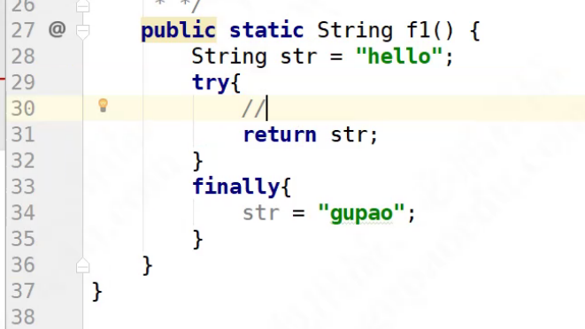

> 当前位置：【Java】01_Java基础  -> 1.3_Exception（异常处理）

---


- 异常简介

  - Java代码在运行时期发生的问题就是异常

  - 在Java中，把异常信息封装成了一个类，当出现了问题时，就会创建异常类对象并抛出异常相关的信息（如异常出现的位置、原因等）

  - 【区别】异常 & 错误

    - 异常：指程序在编译、运行期间发生了某种异常(XxxException)，可以对异常进行具体的处理，若不处理异常，程序将会结束运行

    - 错误：指程序在运行期间发生了某种错误(XxxError)，Error错误通常没有具体的处理方式，程序将会结束运行，Error错误的发生往往都是系统级别的问题，都是jvm所在系统发生的，并反馈给jvm的，无法针对处理，只能修正代码

- 异常的继承体系

  - 

- 异常对象产生和处理过程

  - 

- 异常分类

  - 编译异常: 调用了抛出异常的方法，不处理编译失败 (try catch、throws)

    - 声明异常throws

      - 将问题标识出来，报告给调用者

      - 如果方法内通过throw抛出了编译时异常，而没有捕获处理，那么必须通过throws进行声明，让调用者去处理

      - 声明格式
        修饰符 返回值类型 方法名(参数) throws 异常类名1,异常类名2… { 
        }

    - 抛出异常：throw

      - throw简介

        - throw用在方法内，用来抛出一个异常对象，将这个异常对象传递到调用者处，并结束当前方法的执行

        - throw 后面，必须写new 对象，必须是异常的对象，必须是Exception或者子类

      - 如何抛出异常

        - （1）创建一个异常对象，封装一些提示信息(信息可以自己编写)

        - （2）需要将这个异常对象告知给调用者（通过关键字throw）

      - 使用格式：throw new 异常类名(参数);

    - 捕获异常try…catch…finally

      - 捕获：Java中对异常有针对性的语句进行捕获，可以对出现的异常进行指定方式的处理 

      - 捕获异常格式
        try {
        //需要被检测的语句
        }
        catch(异常类名 变量) { 
        //异常的处理语句
        }
        finally {
        //一定会被执行的语句
        }

      - 格式解释

        - try：该代码块中编写可能产生异常的代码

        - catch：用来进行某种异常的捕获，实现对捕获到的异常进行处理（异常类名的顺序问题）

          - 平级异常: 抛出的异常类之间没有继承关系，没有顺序

            - NullPointerException（extends RuntimeException）

            - NoSuchElementException（extends RuntimeException）

            - ArrayIndexOutOfBoundsException（extends IndexOutOfBoundsException extends RuntimeException）

          - 上下级关系的异常：抛出的异常类之间有继承关系，父类在后面catch，如NullPointerException extends RuntimeException extends Exception

        - finally：有一些特定的代码无论异常是否发生，都需要执行

      - 组合

        - try catch finally组合：检测异常，并传递给catch处理，并在finally中进行资源释放

        - try catch组合 : 对代码进行异常检测，并对检测的异常传递给catch处理。对异常进行捕获处理

        - 一个try 多个catch组合 : 对代码进行异常检测，并对检测的异常传递给catch处理。对每种异常信息进行不同的捕获处理

        - try finally 组合: 对代码进行异常检测，检测到异常后因为没有catch，所以一样会被默认jvm抛出。异常是没有捕获处理的。但是功能所开启资源需要进行关闭，所有finally，只为关闭资源

  - 运行异常: 抛出的异常是RuntimeException类，或者是他的子类

    - 方法内部抛出的异常是运行异常, new XXXException

    - 方法定义中无需throws声明，调用者也无需处理此异常

    - 运行异常一旦发生，不要处理，直接修改源代码（运行异常一旦发生，后面的代码没有执行的意义）

- 继承后，在子类重写父类方法时

  - 如果父类的方法声明异常

    - （1）子类可以不抛出异常

    - （2）子类也可以抛出异常（只能声明父类异常或者该异常的子类）
      class Fu {
      public void method () throws RuntimeException {
      }
      }
      class Zi extends Fu {
      //抛出父类一样的异常
      public void method() throws RuntimeException {
      } 
      //抛出父类的子异常
      //public void method() throws NullPointerException{
      } 
      }

  - 当父类方法声明多个异常时，子类覆盖时只能声明多个异常的子集
    class Fu {
    public void method () throws NullPointerException, ClassCastException{
    }
    }
    class Zi extends Fu {
    public void method()throws NullPointerException, ClassCastException { 

    //抛出父类异常中的一部分
    public void method() throws NullPointerException{ 
    } 
    //抛出父类异常中的一部分
    public void method() throws ClassCastException { 
    }
    }

  - 如果父类的方法没有声明抛出

    - （1）不能抛出异常

    - （2）如果子类中调用了抛出异常的方法，只能try..catch处理

- 异常中的常用方法

  - getMessage方法

    - 返回该异常的详细信息字符串，即异常提示信息

    - 对异常信息的详细描述

  - toString方法

    - 返回该异常的名称与详细信息字符串

    - 对异常信息的简短描述

  - printStackTrace方法

    - 在控制台输出该异常的名称与详细信息字符串、异常出现的代码位置

    - 将异常信息追踪到标准的错误流（异常信息最全，JVM默认调用方法也是这个方法）

- 自定义异常

  - 步骤1：编译时异常继承Exception，运行时异常继承RuntimeException

  - 步骤2：构造方法中，super将异常信息传递给父类

  - 步骤3：提供空参构造方法（因为看到Java中的异常描述类中有提供对异常对象的初始化方法）

- 总结：异常基本操作

  - （1）创建异常对象

  - （2）抛出异常

  - （3）处理异常

- 

- 

- 

- 


```java
// 导包
import org.slf4j.Logger;
import org.slf4j.LoggerFactory;

....（代码）

// 声明静态变量
private static final Logger logger = LoggerFactory.getLogger(ParamConfigServiceImpl.class);

....（代码）

// 使用
try {
			getBaseDao().update("ParamConfigMapper.saveParamConfig", inputObject.getParams());
		} catch (Exception e) {
			logger.error("保存失败,异常信息如下:message:{}", e.getMessage());
			e.printStackTrace();   // 打印完整的异常信息
		}
```


