当前位置：【Java】01_Java基础  -> 1.4_API（常用API）

---


# 1、API文档

## 1.1 简介

- Application Programming Interface 应用程序编程接口

- Java API就是JDK中提供给我们使用的类，这些类将底层的代码实现封装了起来，我们不需要关心这些类是如何实现的

- 在JDK安装目录下有个src.zip文件，这个文件解压缩后里面的内容是所有Java类的源文件，可以在其中查看相对应的类的源码


## 1.2 使用步骤

```
（1）打开帮助文档
（2）点击显示，找到索引，看到输入框
（3）在输入框里输入要查询的类，然后回车

（4）看该类是属于哪个包
- 因为使用类的时候需要导包
- 例外：但凡 java.lang 下的类不需要导包

（5）看类的解释和说明
（6）查看构造方法（为了创建对象）

（7）查看成员方法
- 方法的返回值类型
- 方法名 + 参数类型 + 参数个数
- 方法功能说明
```


## 1.3 JDK API包结构

- java

```java
- applet：应用小程序相关
- awt：抽象窗口工具集相关接口和类（图形化界面）
- beans
- io：流的接口和类（读写文件）
- lang：语言核心类（系统自动导入）
- math：数学相关
- net：网络编程接口和类
- nio
- rmi
- security
- sql：jdbc相关接口和类（连接数据库）
- text：格式化相关类（国际化）
- util：java工具类（集合框架）
```

- javax

```java
- swing：图形用户界面相关接口和类（可跨平台）
```

- org

- index-file


## 1.4 引用数据类型的使用

- 创建引用类型变量的格式：数据类型  变量名  =  new 数据类型( );

- 调用该引用数据类型的实例：变量名.方法名( );


# 2、Object类

## 2.1 简介

- 类 Object 是类层次结构的根类

  - Object类要么是一个类的直接父类，要么就是一个类的间接父类

  - Object类是Java语言中的根类，即所有类的父类

- 每个类都使用 Object 作为超类
  - class A{ } 等价于 class A extends Object { }

- 所有对象（包括数组）都实现这个类的方法

  - 所有对象都具有某一些共同的行为，此时抽象出一个类（object类），表示对象类或者其他类都会继承object类，并拥有object类中的方法

  - 对象类即是引用数据类型，包括类、接口、数组（数组变量名称指的就是数组对象）

  - 其所有方法子类都可以使用，其中的toString、equals是非常常用的方法


## 2.2 所属包

```java
java.lang
╰ java.lang.Object
```


## 2.3 构造方法

- Object()


## 2.4 成员方法

```java
[protected Object] clone( )
- 创建并返回此对象的一个副本

[boolean] equals(Object obj)
- 指示其他某个对象是否与此对象“相等”（拿当前对象（this）和参数obj做比较，判断两个对象是否相同）
- 官方建议：每个类都应该重写equals方法，不要比较内存地址，而去比较我们比较关心的数据
- object类的equals方法比较的是对象的内存地址
- ==不仅比较对象的内存地址，还比较hashcode

[protected void] finalize( ) 
- API：当垃圾回收器确定不存在对该对象的更多引用时，由对象的垃圾回收器调用此方法
- 解释：垃圾回收器在回收某一个对象之前，会先调用该方法，做扫尾操作，该方法不需要我们去调用

[Class<?>] getClass( )
- 返回此 Object 的运行时类（返回当前对象的真实数据类型）

[int] hashCode( )
- 返回该对象的哈希码值（hashCode决定了对象在哈希表中的存储位置，不同对象的hashCode不同）

[void] notify( )
- 唤醒在此对象监视器上等待的单个线程

[void] notifyAll( )
- 唤醒在此对象监视器上等待的所有线程

[String] toString( ) 
- 返回该对象的字符串表示（表示把一个对象转换成字符串）
- 打印对象的时候，其实就是调用的对象的tostring方法
- System.out.println(obj对象); 等价于System.out.println(obj对象.toString());
- 默认情况下，打印对象，打印的是对象的十六进制的hashCode值（对象的类型+@+内存地址值）
- 官方建议：每个类都应该重写toString方法，返回对象的具体信息

[void] wait( )
- 在其他线程调用此对象的 notify() 方法或 notifyAll() 方法前，导致当前线程等待

[void] wait(long timeout)
- 在其他线程调用此对象的 notify() 方法或 notifyAll() 方法，或者超过指定的时间量前，导致当前线程等待

[void] wait(long timeout, int nanos)
- 在其他线程调用此对象的 notify() 方法或 notifyAll() 方法，或者其他某个线程中断当前线程，或者已超过某个实际时间量前，导致当前线程等待
```


# 3、Arrays类（数组）

## 3.1 简介

- 此类包含用来操作数组（比如排序和搜索）的各种方法

- 需要注意，如果指定数组引用为 null，则访问此类中的方法都会抛出空指针异常（NullPointerException）


## 3.2 所属包

- java.lang.Object

- ╰ java.util.Arrays


## 3.3 常用成员方法

```java
static [int] binarySearch(int[ ] a, int key)
- API：使用二分搜索法来搜索指定的 int 型数组，以获得指定的值
- 功能：返回要搜索的元素在数组中出现的索引，如果不存在，返回的是-（插入点-1）

- 具体搜索过程
- 1、搜索值是数组元素，从0开始计数，得搜索值的索引值
- 2、搜索值不是数组元素，且在数组范围内，从1开始计数，得“ - 插入点索引值”
- 3、搜索值不是数组元素，且大于数组内元素，索引值为 – (length + 1)
- 4、搜索值不是数组元素，且小于数组内元素，索引值为 – 1

static [void] sort(int[ ] a)
- 对指定的 int 型数组按数字升序进行排序（对数组进行升序排列）

static [String] toString(int[ ] a)
- 返回指定数组内容的字符串表示形式（将数组变成字符串，形如：[a,b,c,d] ）
```


# 4、String类（字符串）

## 4.1 简介

- 字符串是由多个字符组成的一串数据，用“”表示

- 字符串可以看成是字符数组

- 字符串是常量，它们的值在创建之后不能更改，存在于内存当中的常量池 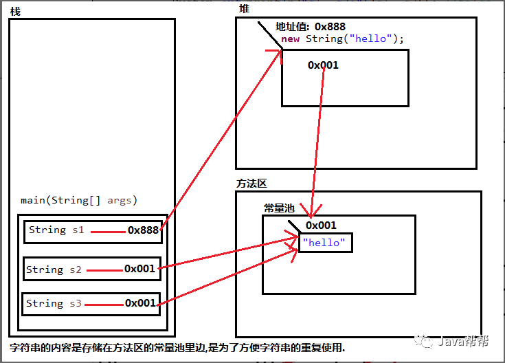

- 字符串缓冲区支持可变的字符串，因为 String 对象是不可变的，所以可以共享

- 字符串是一种比较特殊的引用数据类型


## 4.2 所属包

- java.lang.Object

- ╰ java.lang.String


## 4.3 常用构造方法

- 【常用方法】创建字符串

```java
方法1：使用字面值常量创建字符串
- 通过直接赋值创建一个字符串对象，输出的是该对象中的数据
- 创建的字符串一旦生成，在常量池中不可变，共享同一片内存区域，以后再创建相同的内容也只有一份
- 例子：String s = "abc";

方法2：使用new关键字创建对象（original原始创建方法）
- String(String original)
- 通过字符串创建一个字符串对象
- 初始化一个新创建的 String 对象，使其表示一个与参数相同的字符序列
- 新创建的字符串是该参数字符串的副本
- new出来的字符串对象存放在堆中
- 例子：String s = new String("hi");
```


```java
String( )
- API：初始化一个新创建的 String 对象，使其表示一个空字符序列

String(byte[ ] bytes)
- API：通过使用平台的默认字符集解码指定的 byte 数组，构造一个新的 String
- 功能：将字节数组全部转换成字符串
- 解释
- 平台是指机器操作系统，默认字符集是指默认编码表GBK
- 将字节数组中的每个字节，通过查询编码表得到结果
- 汉字的字节编码是负数，默认编码表GBK，一个汉字采用2个字节表示

String(byte[ ] bytes, Charset charset)
- API：通过使用指定的 charset 解码指定的 byte 数组，构造一个新的 String

String(byte[ ] bytes, int offset, int length)
- API：通过使用平台的默认字符集解码指定的 byte 子数组，构造一个新的 String
- 功能：将字节数组部分转换成字符串
- 解释
- offset表示数组的起始索引
- length表示转换的字符串的个数

String(byte[ ] bytes, int offset, int length, Charset charset)
- API：通过使用指定的 charset 解码指定的 byte 子数组，构造一个新的 Strin

String(byte[ ] bytes, int offset, int length, String charsetName)
- API：通过使用指定的字符集解码指定的 byte 子数组，构造一个新的 String

String(byte[ ] bytes, String charsetName)
- API：通过使用指定的 charset 解码指定的 byte 数组，构造一个新的 String
  
String(char[ ] value)
- API：分配一个新的 String，使其表示字符数组参数中当前包含的字符序列
- 功能：通过字符型数组创建一个字符串对象，将字符数组转成字符串（参数不查询编码表）
- 例子：char[] chs = { 'L', 'o', 't', 'o' };
String s = new String(chs);

String(char[ ] value, int offset, int count)
- API：分配一个新的 String，它包含取自字符数组参数一个子数组的字符
- 功能：通过字符型数组的一部分创建一个字符串对象，从索引值为offset开始，持续count个
- 例子：char[] chs = { 'L', 'o', 't', 'o' };
- String s = new String(chs, 0, 3);

String(int[ ] codePoints, int offset, int count)
- API：分配一个新的 String，它包含 Unicode 代码点数组参数一个子数组的字符

String(StringBuffer buffer)
- API：分配一个新的字符串，它包含字符串缓冲区参数中当前包含的字符序列

String(StringBuilder builder)
- API：分配一个新的字符串，它包含字符串生成器参数中当前包含的字符序列。
```


## 4.4 常用成员方法

### （1）判断功能方法

```java
equals & ==
- equals先判断两个字符串的地址是否相同，如果相同则内容也相同，如果地址不同再判断内容是否相同
- ==符号表示判断两边是否相等
	- 如果两边是基本类型，判断的是数值
  - 如果两边是引用类型，判断的是地址

[boolean] equals(Object anObject)
- 功能：比较字符串的内容是否相同，跟哪个字符串比较，参数就写哪个字符串
- 例子：System.out.println(s1.equals(s2));

[boolean] equalsIgnoreCase(String anotherString)
- 功能：比较字符串的内容是否相同,比较时忽略大小写
- 例子：System.out.println(s2.equalsIgnoreCase(s3));

[boolean] startsWith(String str)
- 功能：判断字符串对象是否以指定的str开头
- 例子1：System.out.println(s4.startsWith("ni"));
- 例子2：System.out.println("nihao".startsWith("ni"));

[boolean] endsWith(String str)
- 功能：判断字符串对象是否以指定的str结尾
- 例子1：System.out.println(s4.endsWith("hao"));
- 例子2：System.out.println("nihao".endsWith("hao"));

[boolean] contains(String s)
- 功能：判断一个字符串，是否包含另一个字符串

boolean isEmpty( ) 
- 功能：判断该字符串的内容是否为空的字符串
```


### （2）获取功能方法

```java
[int] length( )
- 功能：获取字符串的长度(即是字符个数)
- 例子：System.out.println(s.length());

[char] charAt(int index)
- 功能：获取指定索引处的字符(索引从0开始计算)
- 例子：System.out.println(s.charAt(3));

[int] indexOf(String str)
- 功能：获取str在字符串对象中第一次出现的索引，没有返回-1
- 例子1：System.out.println(s.indexOf("o"));
- 例子2：System.out.println(s.indexOf("llo"));

[int] indexOf(char ch)
- 功能：获取字符ch在字符串对象中第一次出现的索引，没有返回-1

[String] substring(int beginIndex)
- 功能：从索引值为beginIndex开始截取字符串到字符串结尾
- 例子：System.out.println(s.substring(1));

[String] substring(int beginIndex, int endIndex)
- 功能：从索引值为beginIndex开始，到endIndex-1结束截取字符串
- 例子：System.out.println(s.substring(1, 3));
```


### （3）转换功能方法

```java
byte[ ] getBytes()
- API：使用平台的默认字符集将此 String 编码为 byte 序列，并将结果存储到一个新的 byte 数组中
- 功能：将字符串转换成字节数组（byte数组相关的功能，会查询编码表）

char[ ] toCharArray()
- 功能：把字符串转换为字符数组
- 例子：char[] chs = s.toCharArray();

String toLowerCase()
- 功能：把字符串转换为小写字符串，产生一个新的字符串
- 例子：System.out.println("HELLO".toLowerCase());

String toUpperCase()
- 功能：把字符串转换为大写字符串，产生一个新的字符串
- 例子：System.out.println("hello".toUpperCase());
```


### （4）去空格方法

```java
String trim( )
- 功能：去除字符串两端空格，字符串中间的空格无法去掉，返回一个新字符串 
```


### （5）分割方法

```java
String[ ] split(String str) 
- 功能：把字符串使用str进行切割，切割之后得到的字符串组成一个字符串数组返回
```


### （6）替换方法

```java
String replaceAll(String regex，String replacement)  
- 功能：使用 replacement 替换字符串中所有的 regex
```


## 4.5 字符串的操作使用

### （1）字符串遍历

```java
[char] charAt(int index)
```


### （2）统计字符串中大写、小写和数字的字符个数


### （3）字符串大小写转换

- 键盘录入一个字符串，把该字符串的首字母转成大写，其余为小写


### （4）类名作为形式参数和返回值 


### （5）字符串的hashCode方法

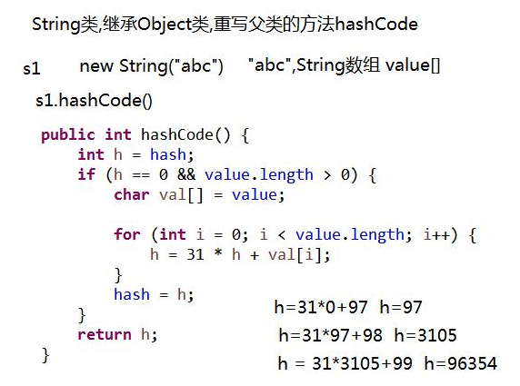


# 5、StringBuffer类（字符串缓冲区）（线程安全）

## 5.1 简介

- StringBuffer是可变字符序列

- 是一个类似于 String 的字符串缓冲区，通过某些方法调用可以改变该序列的长度和内容

- 本质是一个容器，容器中可以装很多字符串，并且能够对其中的字符串进行各种操作


## 5.2 所属包

```java
java.lang.Object
╰ java.lang.StringBuffer
```


## 5.3 构造方法

```java
StringBuffer()
- 构造一个其中不带字符的字符串缓冲区，初始容量为 16 个字符
  
StringBuffer(CharSequence seq)
- public java.lang.StringBuilder(CharSequence seq) 构造一个字符串缓冲区，它包含与指定的 CharSequence 相同的字符

StringBuffer(int capacity)
- 构造一个不带字符，但具有指定初始容量的字符串缓冲区

StringBuffer(String str)
- 构造一个字符串缓冲区，并将其内容初始化为指定的字符串内容
```


## 5.4 常用成员方法

```java
[StringBuffer] append(String str)
- API：Appends the specified string to this character sequence
- 功能：将指定字符串追加到此字符序列
- append 返回值，写return this，调用者是谁，返回值就是谁

[StringBuffer] delete(int start, int end)
- API：Removes the characters in a substring of this sequence.
- 功能：移除此序列的子字符串中的字符（包括start，不包括end）

[StringBuffer] insert(int offset, String str)
- API：Inserts the string into this character sequence
- 功能：将字符串插入此字符序列中

[StringBuffer] replace(int start, int end, String str)
- API：Replaces the characters in a substring of this sequence with characters in the specified String
- 功能：使用给定string中的字符替换此序列的子字符串中的字符

[StringBuffer] reverse( )
- API：Causes this character sequence to be replaced by the reverse of the sequence
- 功能：将此字符序列用其反转形式取代

[String] toString( )
- API：Returns a string representing the data in this sequence
- 功能：返回此序列中数据的字符串表示形式（继承object，重写toString()方法）
- 本质：将可变的字符串缓冲区对象，变成了不可变的string对象

[String] substring(int start)
- API：Returns a new String that contains a subsequence of characters currently contained in this character sequence
- 功能：从指定位置开始，到末尾结束，截取该字符串缓冲区，返回新字符串

[String] substring(int start,int end)
- API：Returns a new String that contains a subsequence of characters currently contained in this sequence
- 功能：从指定位置开始，到指定位置结束，截取该字符串缓冲区，返回新字符串
```


# 6、StringBuider类（字符串缓冲区）（线程不安全）

## 6.1 简介

- 如果对字符串进行拼接操作，每次拼接，都会构建一个新的String对象，既耗时，又浪费空间，而StringBuilder就可以解决这个问题 


## 6.2 所属包

```java
java.lang.Object
╰ java.lang.StringBuilder
```


## 6.3 构造方法

```java
StringBuilder( )
- 构造一个没有字符的字符串构建器，初始容量为16个字符

StringBuilder(String str)
- 构造一个初始化为指定字符串内容的字符串构建器

StringBuilder(CharSequence seq)
- 构造一个包含与指定的相同字符的字符串构建器 CharSequence

StringBuilder(int capacity)
- 构造一个没有字符的字符串构建器，由 capacity参数指定的初始容量
```


## 6.4 常用成员方法

```java
[int] length( )
- 返回长度（字符数）
- 容器实际存储的字符个数

[int] capacity( )
- 返回当前容量

[StringBuilder] append(任意类型)   
- 添加数据，并返回自身对象

[StringBuilder] reverse( )
- 导致该字符序列被序列的相反代替
- 反转容器中的内容
```


## 6.5【区别】StringBuilder & StringBuffer

- 相同：两个类的构造方法和成员方法都相同

- 不同：StringBuilder是一个线程不安全的类，StringBuffer是一个线程安全的类

- StringBuilde被设计用作 StringBuffer 的一个简易替换，用在字符串缓冲区被单个线程使用的时候，因为在大多数实现中，它比 StringBuffer 要快


## 6.6【区别】StringBuilder & String

- StringBuilder的内容是可变的

- String的内容是固定的


# 7、Scanner类（键盘录入）

## 7.1 所属包

```java
java.lang.Object
╰ java.util.Scanner
```


## 7.2 构造方法

```java
Scanner(File source)
- Constructs a new Scanner that produces values scanned from the specified file.
- 构造一个新的 Scanner，它生成的值是从指定文件扫描的

Scanner(File source, String charsetName)
- Constructs a new Scanner that produces values scanned from the specified file.
- 构造一个新的 Scanner，它生成的值是从指定文件扫描的

Scanner(InputStream source)
- Constructs a new Scanner that produces values scanned from the specified input stream.
- 构造一个新的 Scanner，它生成的值是从指定的输入流扫描的

Scanner(InputStream source, String charsetName)
- Constructs a new Scanner that produces values scanned from the specified input stream.
- 构造一个新的 Scanner，它生成的值是从指定的输入流扫描的

Scanner(Path source)
- Constructs a new Scanner that produces values scanned from the specified file.

Scanner(Path source, String charsetName)
- Constructs a new Scanner that produces values scanned from the specified file.

Scanner(Readable source)
- 构造一个新的 Scanner，它生成的值是从指定源扫描的
- Constructs a new Scanner that produces values scanned from the specified source.

Scanner(ReadableByteChannel source)
- Constructs a new Scanner that produces values scanned from the specified channel.
- 构造一个新的 Scanner，它生成的值是从指定信道扫描的

Scanner(ReadableByteChannel source, String charsetName)
- Constructs a new Scanner that produces values scanned from the specified channel.
- 构造一个新的 Scanner，它生成的值是从指定信道扫描的

Scanner(String source)
- Constructs a new Scanner that produces values scanned from the specified string.
- 构造一个新的 Scanner，它生成的值是从指定字符串扫描的
```


## 7.3 常用成员方法

```java
[int] nextInt( );
- Scans the next token of the input as an int
- 功能：键盘录入整数

[String] next( );
- Finds and returns the next complete token from this scanner
- 功能：键盘录入字符串
- 弊端：在遇到空格的时候，会判定当前输入结束，空格之后的内容会收不到

[String] nextLine( );
- Advances this scanner past the current line and returns the input that was skipped
- 功能：可以避免被空格中断
- 弊端：如果前面接收数字nextInt( )，后面使用nextLine()，会被干扰
```


# 8、Random类（产生随机整数）

## 8.1 所属包

```java
java.lang.Object
╰ java.util.Random
```


## 8.2 构造方法

```java
Random( )
- Creates a new random number generator
- 创建一个新的随机数生成器

Random(long seed)
- Creates a new random number generator using a single long seed
- 使用单个 long 种子创建一个新的随机数生成器
```


## 8.3 常用成员方法

```java
[int] nextInt( )
- Returns the next pseudorandom, uniformly distributed int value from this random number generator's sequence.
- 返回下一个伪随机数，它是此随机数生成器的序列中均匀分布的 int 值
- 范围：产生[ 0，n)范围的随机整数，包含0，不包含n

[double] nextDouble( )
- Returns the next pseudorandom, uniformly distributed double value between 0.0 and 1.0 from this random number generator's sequence
- 返回下一个伪随机数，它是取自此随机数生成器序列的、在 0.0 和 1.0 之间均匀分布的 double 值
- 范围：产生[ 0，1)范围的随机小数，包含0.0，不包含1.0
```


# 9、Pattern类（正则表达式）

## 9.1 简介

- 正则表达式全称：Regular Expression（代码中简写regex）

- 在开发中，正则表达式通常被用来检索、替换那些符合某个规则的文本

- 正则表达式是一个字符串，使用单个字符串来描述、用来定义匹配规则，匹配一系列符合某个句法规则的字符串


## 9.2 正则表达式的匹配规则

### （1）字符

```java
字符：\\
- 含义：代表的是反斜线字符'\'
- 例如：匹配规则为"\\" ，那么需要匹配的字符串内容就是 ”\”

字符：x
- 例如：匹配规则为 "a"，那么需要匹配的字符串内容就是 ”a”
- 含义：代表的是字符x

字符：\t
- 含义：制表符
- 例如：匹配规则为"\t" ，那么对应的效果就是产生一个制表符的空间

字符：\n
- 含义：换行符
- 例如：匹配规则为"\n"，那么对应的效果就是换行,光标在原有位置的下一行

字符：\r
- 含义：回车符
- 例如：匹配规则为"\r" ，那么对应的效果就是回车后的效果,光标来到下一行行首
```


### （2）字符类

```java
字符类：[abc]
- 例如：匹配规则为"[abc]" ，那么需要匹配的内容就是字符a，或者字符b，或字符c的一个
- 含义：代表的是字符a 或 b 或 c

字符类：[^abc]
- 例如：匹配规则为"[^abc]"，那么需要匹配的内容就是不是字符a，或者不是字符b，或不是字符c的任意一个字符
- 含义：代表的是除了 a、b 或 c以外的任何字符

字符类：[a-zA-Z]
- 例如：匹配规则为"[a-zA-Z]"，那么需要匹配的是一个大写或者小写字母
- 含义：代表的是a 到 z 或 A 到 Z，两头的字母包括在内

字符类：[0-9]
- 含义：代表的是 0到9数字，两头的数字包括在内
- 例如：匹配规则为"[0-9]"，那么需要匹配的是一个数字

字符类：[a-zA-Z_0-9]
- 含义：代表的字母或者数字或者下划线(即单词字符)
- 例如：匹配规则为" [a-zA-Z_0-9] "，那么需要匹配的是一个字母或者是一个数字或一个下滑线
```


### （3）预定义字符类

```java
预定义字符类：.
- 例如：匹配规则为" . "，那么需要匹配的是一个任意字符。如果，就想使用 . 的话，使用匹配规则"\\."来实现
- 含义：代表的是任何字符

预定义字符类：\d
- 例如：匹配规则为"\d "，那么需要匹配的是一个数字
- 含义：代表的是 0到9数字，两头的数字包括在内，相当于[0-9]

预定义字符类：\D
- 例如：匹配规则为”\D "，那么需要匹配的不是一个数字
- 含义：代表的不是数字

预定义字符类：\w
- 含义：代表的字母或者数字或者下划线(即单词字符)，相当于[a-zA-Z_0-9]
- 例如：匹配规则为"\w "，，那么需要匹配的是一个字母或者是一个数字或一个下滑线
```


### （4）边界匹配器

```java
边界匹配器：^
- 含义：代表的是行的开头
- 例如：匹配规则为^[abc][0-9]$ ，那么需要匹配的内容从[abc]这个位置开始, 相当于左双引号

边界匹配器：$
- 含义：代表的是行的结尾
- 例如：匹配规则为^[abc][0-9]$ ，那么需要匹配的内容以[0-9]这个结束, 相当于右双引号

边界匹配器：\b
- 含义：代表的是单词边界
- 例如：匹配规则为"\b[abc]\b" ，那么代表的是字母a或b或c的左右两边需要的是非单词字符([a-zA-Z_0-9])
```


### （5）数量词

```java
数量词：X?
- 含义：代表的是X出现一次或一次也没有
- 例如：匹配规则为"a?"，那么需要匹配的内容是一个字符a，或者一个a都没有

数量词：X*
- 含义：代表的是X出现零次或多次
- 例如：匹配规则为"a*" ，那么需要匹配的内容是多个字符a，或者一个a都没有

数量词：X+
- 含义：代表的是X出现一次或多次
- 例如：匹配规则为"a+"，那么需要匹配的内容是多个字符a，或者一个a

数量词：X{n}
- 含义：代表的是X出现恰好 n 次
- 例如：匹配规则为"a{5}"，那么需要匹配的内容是5个字符a

数量词：X{n,}
- 含义：代表的是X出现至少 n 次
- 例如：匹配规则为"a{5, }"，那么需要匹配的内容是最少有5个字符a

数量词：X{n,m}
- 含义：代表的是X出现至少 n 次，但是不超过 m 次
- 例如：匹配规则为"a{5,8}"，那么需要匹配的内容是有5个字符a 到 8个字符a之间
```


## 9.3 常用匹配规则

- 匹配正整数：\\d+

- 匹配正小数：\\d+\\.\\d+

- 匹配负整数：-\\d+

- 匹配负小数：-\\d+\\.\\d+

- 匹配保留两位小数的正数：\\d+\\.\\d{2}

- 匹配保留1-3位小数的正数：\\d+\\.\\d{1,3}


## 9.4 字符串类中涉及正则表达式的常用方法

```java
String[ ]  split(String regex)
- API：根据给定正则表达式的匹配拆分此字符串
- 功能：根据给定正则表达式的匹配规则，拆分此字符串

[boolean] matches(String regex)
- API：告知此字符串是否匹配给定的正则表达式
- 功能：判断字符串是否匹配给定的规则

[String] repalceAll(String regex,String replacement)
- 功能：将符合规则的字符串内容，全部替换为新字符串
- API：使用给定的 replacement 替换此字符串所有匹配给定的正则表达式的子字符串
```


# 10、Date类（日期）

## 10.1 简介

- Date 表示特定的瞬间，精确到毫秒 


## 10.2 所属包

```java
java.lang.Object
╰ java.util.Date
```


## 10.3 构造方法

```java
Date( )
- 分配 Date 对象并初始化此对象，以表示分配它的时间（精确到毫秒）

Date(long date)
- 分配 Date 对象并初始化此对象，以表示自从标准基准时间（称为“历元（epoch）”，即 1970 年 1 月 1 日 00:00:00 GMT）以来的指定毫秒数
```


## 10.4 成员方法

```java
[void] setTime(long time)
- API：设置此 Date 对象，以表示 1970 年 1 月 1 日 00:00:00 GMT 以后 time 毫秒的时间点
- 解释：将日期对象设置到指定毫秒值上，毫秒值转成日期对象

[long] getTime( )
- API：返回自 1970 年 1 月 1 日 00:00:00 GMT 以来此 Date 对象表示的毫秒数
- 解释：将Date表示的日期转换成毫秒值，日期对象转换成毫秒值

[long] System.currentTimeMillis( )
- 解释：从时间原点(1970年)到当前日期的毫秒值
- 时间原点：公元1970年1月1日，午夜0：00：00
- 1000毫秒 = 1秒
```


# 11、DateFormat类（日期格式化）

## 11.1 简介

- DateFormat 是日期/时间格式化子类的抽象类，它以与语言无关的方式格式化并解析日期或时间

- 日期/时间格式化子类（如 SimpleDateFormat类）允许进行格式化（也就是日期 -> 文本）、解析（文本-> 日期）和标准化

- DateFormat类可以完成日期和文本之间的转换

- DateFormat是抽象类，需要使用其子类SimpleDateFormat来创建对象


## 11.2 所属包

```java
java.lang.Object
╰ java.text.Format
╰ java.text.DateFormat
```


## 11.3 常用构造方法 


## 11.4 常用成员方法

```java
[String] format(Date date)
- API：将一个 Date 格式化为日期/时间字符串
- 解释：将日期对象转换成字符串（Date -> String format）

[Date] parse(String source)
- API：从给定字符串的开始解析文本，以生成一个日期
- 解释：将字符串解析为日期对象（String -> Date parse）
```


## 11.5 子类 SimpleDateFormat

### （1）常用构造方法

```java
SimpleDateFormat(String pattern)
- API：用给定的模式和默认语言环境的日期格式符号构造 SimpleDateFormat
```


### （2）日期格式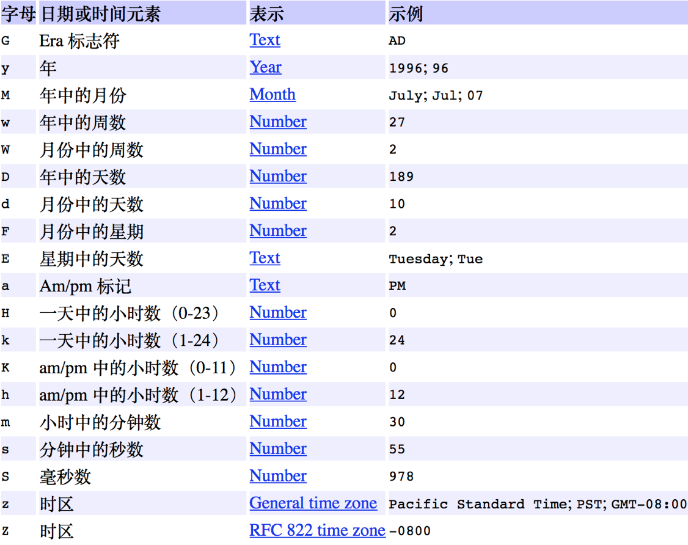


# 12、Calendar类（日历类）

## 12.1 简介

- Calendar是日历类，在Date后出现，替换掉了许多Date的方法

- Calendar将所有可能用到的时间信息封装为静态成员变量，方便获取

- Calendar为抽象类，由于语言敏感性，Calendar类在创建对象时并非直接创建，而是通过静态方法创建，将语言敏感内容处理好，再返回子类对象


## 12.2 所属包

```java
java.lang.Object
╰java.util.Calendar
```


## 12.3 常用构造方法 


## 12.4 常用成员方法

```java
static Calendar getInstance( )
- 使用默认时区和语言环境获得一个日历

[void] set(int field, int value)
- API：将给定的日历字段设置为给定值
- 功能：field设置的是哪个日历字段、value设置的是具体数值

[void] set(int year, int month, int date)
- API：设置日历字段 YEAR、MONTH 和 DAY_OF_MONTH 的值
- 功能：设置年月日

[int] get(int field)
- API：返回给定日历字段的值
- 功能：获取日历字段的值

abstract [void] add(int field, int amount)
- API：根据日历的规则，为给定的日历字段添加或减去指定的时间量
- 功能：日历的偏移量，可以指定一个日历中的字段，进行整体偏移

[Date] getTime( )
- API：返回一个表示此 Calendar 时间值（从历元至现在的毫秒偏移量）的 Date 对象
- 功能：把日历对象转成Date日期对象
```


## 12.5 注意事项

- 西方星期的开始为周日，中国为周一

- 在Calendar类中，月份的表示是以0-11代表1-12月

- 日期是有大小关系的，时间靠后，时间越大


# 13、System类（系统类）

## 13.1 简介

- System类代表程序所在系统，提供了对应的一些系统属性信息，和系统操作

- System类不能手动创建对象，因为构造方法被private修饰，阻止外界创建对象

- System类中的方法都是static方法，类名访问即可，在JDK中，有许多这样的类


## 13.2 所属包

```java
java.lang.Object
╰java.lang.System
```


## 13.3 常用成员方法

```java
[long] currentTimeMillis()
- API：返回以毫秒为单位的当前时间
- 功能：获取当前系统时间与1970年01月01日00:00点之间的毫秒差值

[void] exit(int status)
- API：终止当前正在运行的 Java 虚拟机
- 功能：用来结束正在运行的Java程序。参数传入一个数字即可。通常传入0记为正常状态，其他为异常状态

[void] gc()
- API：运行垃圾回收器
- 功能：用来运行JVM中的垃圾回收器，完成内存中垃圾的清除
  
[void] arraycopy(Object src, int srcPos, Object dest, int destPos, int length)
- API：从指定源数组中复制一个数组，复制从指定的位置开始，到目标数组的指定位置结束
- 功能：用来实现将源数组部分元素复制到目标数组的指定位置
- 参数细节
  - Object src：要复制的源数组名
  - int srcPos：要复制的源数组的起始元素位置
  - Object dest：复制后的目标数组名
  - int destPos：复制后的目标数组存储元素的起始位置
  - int length：要复制的元素个数

[String] getProperty(String key)
- API：获取指定键指示的系统属性
- 功能：用来获取指定键(字符串名称)中所记录的系统属性信息
```

- 具体信息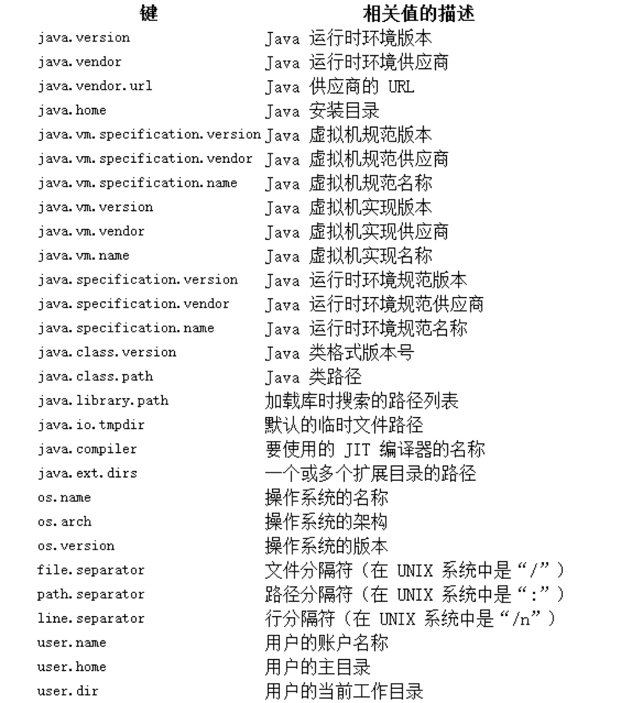


# 14、Math类（数学工具类）

## 14.1 简介

- Math 类是包含用于执行基本数学运算的方法的数学工具类，如初等指数、对数、平方根和三角函数

- 类似这样的工具类，其所有方法均为静态方法，并且一般不会创建对象


## 14.2 所属包

```java
java.lang.Object
╰ java.lang.Math
```


## 14.3 常用成员方法

```java
[int] abs(int a)
- API：返回 int 值的绝对值
- 功能：返回值类型可以是int、long、double、float，参数a的类型也要做相应变化

[double] ceil(double a)
- API：返回最小的（最接近负无穷大）double 值，该值大于等于参数，并等于某个整数
- 功能：返回值类型只能是double，返回 >= 参数a 的最小整数

[double] floor(double a)
- API：返回最大的（最接近正无穷大）double 值，该值小于等于参数，并等于某个整数
- 功能：返回值类型只能是double，返回 <= 参数a 的最大整数

[int] max(int a, int b)
- API：返回两个 int 值中较大的一个
- 功能：返回值类型可以是int、long、double、float，参数a的类型也要做相应变化

[int] min(int a, int b)
- API：返回两个 int 值中较小的一个
- 功能：返回值类型可以是int、long、double、float，参数a的类型也要做相应变化

[double] pow(double a, double b)
- API：返回第一个参数的第二个参数次幂的值
- 功能：表示a的b次方

[double] sqrt(double a)
- API：返回正确舍入的 double 值的正平方根
- 功能：表示a的开平方

[double] random( )
- API：返回带正号的 double 值，该值大于等于 0.0 且小于 1.0
- 功能：来源也是Random类，不推荐

[int] round(float a)
- API：返回最接近参数的 int
- 功能：获取参数的四舍五入值，取整数

[long] round(double a)
- API：返回最接近参数的 long
```


# 15、基本数据类型的包装类

## 15.1 概念引入

- 在实际程序使用中，程序界面上用户输入的数据都是以字符串类型进行存储的
- 而程序开发中，就需要把字符串数据，根据需求转换成指定的基本数据类型
- 八大基本数据类型的包装类都是使用final修饰，都是最终类，都不能被继承
- 基本类型转换成包装类的图

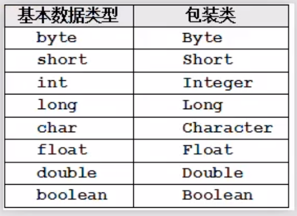


## 15.2 包装类中的构造器

- XXX类型的包装类xxx（xxx为8大基本数据类型）

- XXX(xxx value)：用于接收自己的基本类型值

- XXX(String value)：


## 15.3 包装类中的静态成员变量

- MAX_VALUE（表示最大值）
- MIN_VALUE（表示最小值）
- TYPE（表示基本类型对应的 Class 实例）
- SIZE（用来以二进制补码形式表示在内存中占多少位）

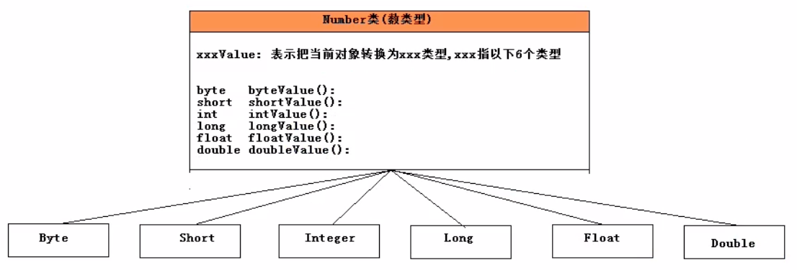


## 15.4 包装类中的成员方法(Integer举例)

```java
[int] parseInt(String s)
- API：将字符串参数作为有符号的十进制整数进行解析
- 功能：把字符串转换成十进制数（字符串必须是数字格式）

[int] parseInt(String s, int radix)
- API：使用第二个参数指定的基数，将字符串参数解析为有符号的整数
- 功能：把传递的进制数转换成十进制数（参数2为进制，参数1为参数2的具体数值，方法返回值是一个10进制数）

[String] toString(int i)
- API：返回一个表示指定整数的 String 对象
- 功能：把int转换成String

[String] toString(int i, int radix)
- API：返回用第二个参数指定基数表示的第一个参数的字符串表示形式
- 功能：把int转换成指定进制数的字符串

[String] toBinaryString(int i)
- API：以二进制（基数 2）无符号整数形式返回一个整数参数的字符串表示形式
- 功能：十进制转二进制

[String] toOctalString(int i)
- API：以八进制（基数 8）无符号整数形式返回一个整数参数的字符串表示形式
- 功能：十进制转八进制

[String] toHexString(int i)
- API：以十六进制（基数 16）无符号整数形式返回一个整数参数的字符串表示形式
- 功能：十进制转十六进制
```


## 15.5 基本类型和包装类型的转换（装箱和拆箱）

- 在Java的集合框架中，只能存储对象，不能存储基本类型，因此每次存储到集合中的基本数据都要手动装箱、拆箱

```java
- 装箱操作：把一个基本类型的值，转换为对应的包装类对象
- 拆箱操作：把包装类对象转换为对应的基本类型变量
```

- Java5以后，提供了自动装箱（Autoboxing）和自动拆箱（AutoUnboxing）功能

```java
- 自动装箱：基本数值转成对象（可以直接把一个基本类型的值赋给对应的包装类对象）
- 自动拆箱：对象转成基本数值（可以直接把一个包装类对象赋给对应的基本类型变量）
  
- 自动装箱和拆箱本质：底层依然是手动装箱和拆箱操作（装箱使用valueof的方式而非new出来的）
```

- 代码

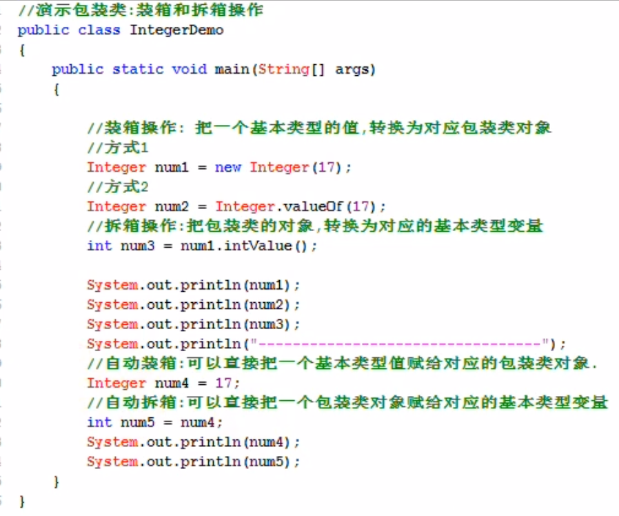


## 15.6 String和基本类型、包装类型之间的转换操作

- 把String装换为包装类对象

```java
static XXX valueof(String str)
new XXX(String str)
```

- 把包装类对象转换为String：String str = 任何对象.toString();
- 把基本数据类型转换为String：String str = 基本数据类型 + “”；
- 把String转换为基本数据类型：static XXX parsexxx(String str)

```java
- xxx表示8大基本数据类型

- 举例
String input = “123”；
int num =  Integer.parseInt(input);
```

- 图解

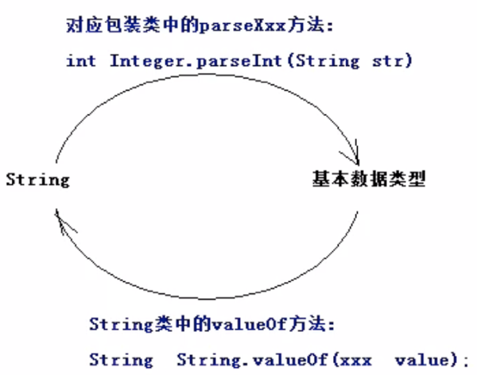


## 15.7 包装类型对象之间的比较

- 使用equals方法比较，因为比较的是包装的数据

​    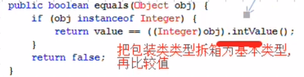


## 15.8【区别】包装类型 & 基本数据类型

```java
（1）默认值不同
- 基本数据类型默认为0
- 包装类型默认为null
- 推论：包装类型既可以表示null也可以表示0

（2）包装类中提供了该类型相关的很多算法操作方法
static String toBinaryString(int i)：把十进制转换为二进制
static String toOctalString(int i)：把十进制转换为八进制
static String toHexString(int i)：把十进制转换为十六进制

（3）在集合框架中，只能存储对象类型，不能存储基本数据类型值
（4）方法中基本数据类型变量存储在栈中，包装类型存放于堆中
```


-  补充

   - switch支持的数据类型是byte、short、char、int、也支持对应的包装类（本质是在底层switch会对包装类进行手动拆箱操作）    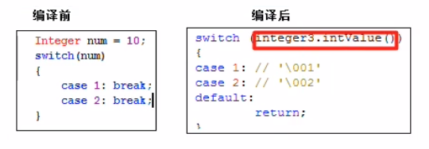

   

## 15.9 享元设计模式 - Flyweight pattern（包装类中的缓存设计）

- 本质是缓存设计
- Byte、Short、Integer、Long：缓存[-128，127]区间的数据
- Character：缓存[0，127]区间的数据

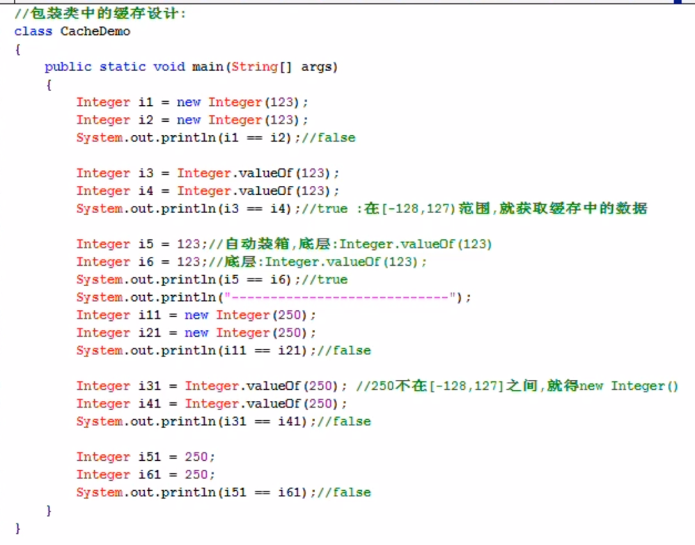


# 16、BigInteger类（整型大数据）

## 16.1 简介

- java中long型为最大整数类型,对于超过long型的数据已经不能被称为整数了,它们被封装成BigInteger对象

- 在BigInteger类中,实现四则运算都是方法来实现,并不是采用运算符


## 16.2 所属包

```java
java.lang.Object
╰ java.lang.Number
╰ java.math.BigInteger
```


## 16.3 构造方法

```java
BigInteger(byte[] val)
- API：将包含 BigInteger 的二进制补码表示形式的 byte 数组转换为 BigInteger

BigInteger(int signum, byte[] magnitude)
- API：将 BigInteger 的符号-数量表示形式转换为 BigInteger

BigInteger(int bitLength, int certainty, Random rnd)
- API：构造一个随机生成的正 BigInteger，它可能是一个具有指定 bitLength 的素数

BigInteger(int numBits, Random rnd)
- API：构造一个随机生成的 BigInteger，它是在 0 到 (2numBits - 1)（包括）范围内均匀分布的值

BigInteger(String val)
- API：将 BigInteger 的十进制字符串表示形式转换为 BigInteger
- 功能：传递字符串，要求数字格式，没有长度限制

BigInteger(String val, int radix)
- API：将指定基数的 BigInteger 的字符串表示形式转换为 BigIntege
```


## 16.4 常用成员方法

```java
[BigInteger] add(BigInteger val)
- API：返回其值为 (this + val) 的 BigInteger
- 功能：加法

[BigInteger] subtract(BigInteger val)
- API：返回其值为 (this - val) 的 BigInteger
- 功能：减法

[BigInteger] multiply(BigInteger val)
- API：返回其值为 (this * val) 的 BigIntege
- 功能：乘法

[BigInteger] divide(BigInteger val)
- API：返回其值为 (this / val) 的 BigIntege
- 功能：除法
```


# 17、BigDecimal类（浮点型大数据）

## 17.1 简介

- double和float类型在运算中很容易丢失精度，造成数据的不准确性

- Java提供我们BigDecimal类可以实现浮点数据的高精度运算


## 17.2 所属包

```java
java.lang.Object
╰ java.lang.Number
╰ java.math.BigDecimal
```


## 17.3 常见构造方法

```java
BigDecimal(String val)
- API：将 BigDecimal 的字符串表示形式转换为 BigDecimal
```


## 17.4 常用成员方法

```java
[BigDecimal] add(BigDecimal augend, MathContext mc)
- API：返回其值为 (this + augend) 的 BigDecimal（根据上下文设置进行舍入）

[BigDecimal] subtract(BigDecimal subtrahend, MathContext mc)
- API：返回其值为 (this - subtrahend) 的 BigDecimal（根据上下文设置进行舍入）

[BigDecimal] multiply(BigDecimal multiplicand, MathContext mc)
- API：返回其值为 (this × multiplicand) 的 BigDecimal（根据上下文设置进行舍入）

[BigDecimal] divide(BigDecimal divisor, int scale, int roundingMode)
- API：返回一个 BigDecimal，其值为 (this / divisor)，其标度为指定标度
- 参数功能
- BigDecimal divisor：被除数
- int scale：保留几位小数
- int roundingMode：保留模式
  - ROUND_UP：向上+1
  - ROUND_DOWN：直接舍去
  - ROUND_HALF_UP：舍弃部分>=0.5，向上+1
  - ROUND_HALF_DOWN：舍弃部分>0.5，向上+1 ，否则舍去
```

