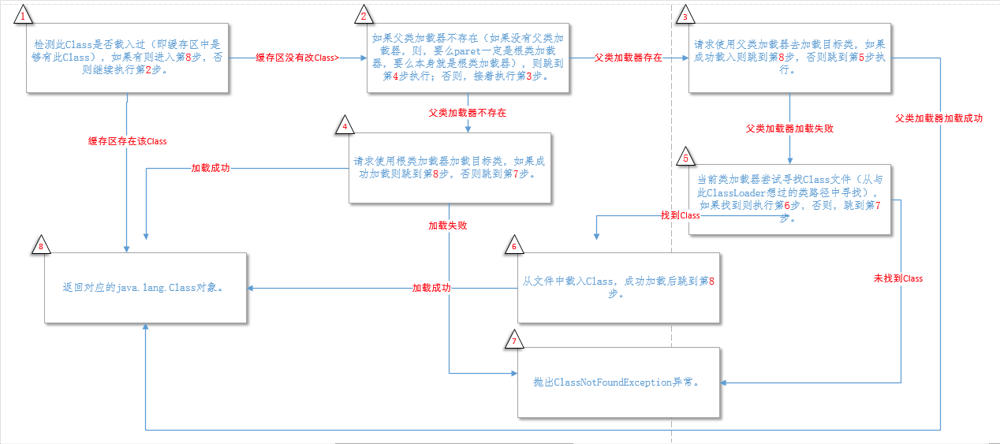
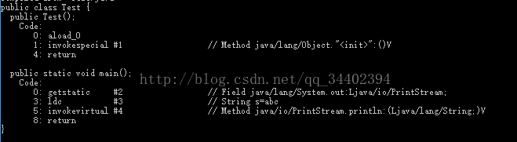

>  当前位置：【Java】02_Java加强  -> 2.1_ClassLoader（类加载器）


# ==类的生命周期==

- 类的生命周期：从加载到虚拟机内存中开始，到卸载出内存为止

- 图示：其中虚线表示，在加载或者连接之后没有被初始化就直接被使用的情况

 

# 阶段1：类的加载 - Loading

==查找和导入class文件==

## 1.1 概述

- 类的加载是指将class文件读入内存，并为之创建一个Class对象

  - 任何类被使用时系统都会建立一个Class对象（即java.lang.Class对象）
  - 也可以说类是java.lang.Class的实例

- 类的加载使用类加载器完成

  

## 1.2 类加载器

- 类加载器的作用

  - 负责将.class文件加载到内存中，并为之生成对应的Class对象
  - 寻找类的字节码文件，并构造出类在JVM内部表示的对象组件

- 类加载器的须知

  - 所有的类加载器都是  java.lang.ClassLoader 的子类
  - 类加载器通常无需等到“首次使用”该类时才加载该类，Java虚拟机规范允许系统预先加载某些类
  - 如果一个类装载器在预先装载的时遇到缺失或错误的class文件，它需要等到程序首次主动使用该类时才报告错误

- 类加载器的分类

  - ==BootStrap ClassLoader（启动类加载器/引导类加载器）== - 不是类
    
    ```xml
    c++编写
    
    - 负责加载Java核心类库 java.*，由JVM自身实现的（不是java.lang.ClassLoader的子类）
    - 负责加载JDK中JRE的lib目录下rt.jar文件中
    - 构造 ExtClassLoader 和 AppClassLoader
    
    - 在Sun的JVM中，当执行java.exe命令时，使用Xbootclasspath选项或使用-D选项指定sun.boot.class.path系统属性值可以指定加载附加的类
    ```
    
  - ==Extension ClassLoader（扩展类加载器）==- 是类
    
    ```xml
    java编写
    
    - 负责加载扩展库 JAVA_HOME/lib/ext ⽬录下的jar中的类，如classpath中的jre ，javax.*或者java.ext.dir指定位置中的类
    - 用途：为Java扩展核心类以外的新功能（把自己开发的类打包成JAR，放到JAVA_HOME\jre\lib\ext）
    ```
    
  - ==Application ClassLoader/SystemClassLoader（应用程序类加载器/系统类加载器）==- 是类
    
    ```xml
    如果应用程序中没有自定义的类加载器，则这个就是程序中默认的类加载器
    
    - 负责在JVM启动时加载来自java命令的-classpath选项、java.class.path系统属性，或CLASSPATH环境变量所指定的JAR包和类路径
    - 负责加载第三方jar包和自己编写的java文件
    - 程序可以通过ClassLoader的静态方法getSystemClassLoader()来获得系统类加载器
    ```
    
  - ==用户自定义类加载器== - 是类
    
    ```xml
    如果没有特别指定 ，用户自定义类加载器都以应用程序类加载器作为父加载器
    ```

  

  

- 类加载器加载Class的步骤

  ```
  步骤1：检测此Class是否载入过（即缓存区中是够有此Class），如果有则进入第8步，否则继续执行第2步
  步骤2：如果父类加载器不存在（如果没有父类加载器，则，要么paret一定是根类加载器，要么本身就是根类加载器），则跳到第4步执行；否则，接着执行第3步
  步骤3：请求使用父类加载器去加载目标类，如果成功载入则跳到第8步，否则跳到第5步执行
  步骤4：请求使用根类加载器加载目标类，如果成功加载则跳到第8步，否则跳到第7步
  步骤5：当前类加载器尝试寻找Class文件（从与此ClassLoader想过的类路径中寻找），如果找到则执行第6步，否则，跳到第7步
  步骤6：从文件中载入Class，成功加载后跳到第8步
  步骤7：抛出ClassNotFoundException异常
  步骤8：返回对应的java.lang.Class对象
  ```
  
  - 过程图：
  
    
  
  
  
- 类加载器的获取
  
  ```java
  // 1、获得字节码对象
  Class xxx = 类名.class;
    
  // 2、获得类加载器
  ClassLoader classLoader = xxx.getClassLoader();
  ```


## 1.3 类的加载步骤

```xml
步骤1：通过类的全限定名获取定义此类的二进制字节流
步骤2：将这个字节流所代表的静态存储结构转化为方法区的运行时数据结构
步骤3：在Java堆中生成一个代表这个类的java.lang.Class对象，作为方法区这些数据的访问入口
```


## 1.4 类的加载机制

  - 概述
    
    - 虚拟机把描述类的数据从class文件加载到内存，并对数据进行校验，转换解析和初始化，最终形成可以被虚拟机直接使用的Java类型
    
  - ==机制1：全盘负责==
    
    ```xml
    A类如果要使用B类（不存在），A类的加载器必须负责加载B类，除非明确指出使用另一个类加载器来加载
    ```
    
- ==机制2：委托机制/父类委托==
  
    ```xml
    A类加载器如果要加载资源B，必须询问父类加载器是否加载
    （1）如果加载，将直接使用
    （2）如果没有加载，自己再加载（只有在父类加载器无法加载该类时才会尝试自己加载该类）
    
    注意：类加载器之间的父子关系并不一定是继承上的父子关系（类加载器实例之间的关系），也有可能是包装关系
    ```
    
- ==机制3：缓存机制==

  ```xml
  好处：会保证所有加载过的Class都会被缓存
  原理：当程序需要某个Class时，类加载器先从缓存区搜索该Class，只有当缓存区中不存在该Class对象时，系统才会读取该类对应的二进制数据，并将其转换Class对象，存入缓存区中（这就是为什么修改了Class后，必须重新启动JVM，程序所做的修改才会生效的原因）
  ```

  - 总结
    - 采用“全盘负责委托机制”保证一个class文件只会被加载一次，只形成一个Class对象
    - 如果一个class文件，被两个类加载器加载，将是两个对象
    - 自定义类加载器，可以将一个class文件加载多次


## 1.5 双亲委派模型

### （1）处理过程

```
- 如果一个类加载器收到了加载类的请求，它会先把请求委托给上层加载器去完成
- 上层加载器又会委托上上层加载器，一直到最顶层的类加载器
- 如果上层加载器无法完成类的加载工作时，当前类加载器才会尝试自己去加载这个类
```

### （2）作用

```
- 防止重复加载同一个.class，通过委托去向上问一问，加载过了，就不用再加载一遍，保证数据安全

- 保证核心.class不能被篡改，通过委托方式，不会去篡改核心.class，即使篡改也不会去加载，即使加载也不会是同一个.class对象，不同的加载器加载同一个.class也不是同一个.class对象。这样保证了 class 执行安全（如果子类加载器先加载，那么可以写一些与java.lang包中基础类同名的类， 然后再定义一个子类加载器，这样整个应用使用的基础类就都变成自定义的类了）
```


# 阶段2：类的链接 - Linking

==把类的二进制数据合并到jre中==

#### 2.1 类的验证 - Verification

```xml
作用：检查载入Class文件数据的正确性
好处：虚拟机如果不检查输入的字节流，对其完全信任的话，很可能会因为载入了有害的字节流而导致系统奔溃
```

#### 2.2 类的准备 - Preparation

```xml
作用：为类的静态成员分配内存/存储空间，并设置默认初始化值，这些内存都将在方法区中进行分配
特别说明：进行内存分配的不包括实例变量，因为实例变量将会在对象实例化时随着对象一起分配在Java堆中
```

#### 2.3 类的解析 - Resolution

```xml
作用：将类的二进制数据中的符号引用替换为直接引用
```

- 符号引用 

  ```xml
  概述
  符号引用以一组符号来描述所引用的目标
  符号引用可以是任何形式的字面量，只要使用时能无歧义地定位到目标即可，符号引用和JVM的布局无关
  
  个人理解：在编译的时候，每个java类都会被编译成一个class文件，但在编译的时候虚拟机并不知道所引用的类的地址，所以就用符号引用来代替，而在这个解析阶段就是为了把这个符号引用转化成为真正的地址的阶段
  ```

  - 举例

    ```java
    public static void test1() { 
      String s1 = "abc"; 
        System.out.println("s1 =" + s1);
    }
    ```
    
    - 在编译的时候对应的s会被解析成为符号引用
    
    

- 直接引用

  ```xml
  概述
  - 直接引用和JVM的布局是相关的，不同的JVM对于相同的符号引用所翻译出来的直接引用一般是不同的
  ```
- 如果有了直接引用，那么直接引用的目标一定被加载到了内存中
  

直接引用可以是
  - 直接指向目标的指针（个人理解：指向对象/类变量/类方法的指针）
  - 相对偏移量（指向实例的变量，方法的指针）
  - 一个间接定位到对象的句柄
```
  
- 举例
  
    - 代码
    
  ```java
      public static void test2() { 
          System.out.println("s=" + "abc");
      }
```

    - 在编译的时候对应的s会直接解析成直接引用
    
       


# 阶段3：类的初始化 - Initalization

==对类的静态变量，静态代码块执行初始化操作==

#### 3.1 类初始化的时机（JVM规定有且只有5种情况必须立即对类进行初始化）

- 情况1：遇到 new、getstatic、putstatic或invokestatic这4条指令时，如果类没有进行过初始化，则需要先初始化
  
  ```xml
  - 使用new关键字实例化对象
  - 读取或设置一个类的静态字段（被final修饰、已在编译期把结果放入常量池的静态字段除外）
  - 调用一个类的静态方法
  ```
  
- 情况2：当初始化一个类的时候，如果该类的父类没有初始化，则需要先初始化其父类

- 情况3：当虚拟机启动时，用户需要指定一个要执行的主类（包括main( )方法的那个类），虚拟机会先初始化这个主类

- 情况4：使用 java.lang.reflect 包中的方法对类进行反射调用的时候，如果类没有进行过初始化，则需要先初始化

- 情况5：使用jdk1.7的动态语言支持时，如果一个 java.lang.MethodHandle 实例最后的解析结果是：REF_getStatic、REF_putStatic、REF_invokeStatic的方法句柄，且这个方法句柄所对应的类没有初始化，则需要先触发其初始化

- 个人理解

  ```xml
  - 创建类的实例
  使用new来创建实例、通过反射创建实例、通过反序列化的方式创建
  
  - 类的静态变量，或者为静态变量赋值
  对于一个final修饰的类变量，如果该类变量的值在编译时就可以确定下来，那么这个类变量相当于“宏变量”，也可理解成“常量”，Java在编译时直接把这个类变量出现的地方替换成它的值，因此即使程序使用该静态变量也不会导致该类的初始化
    
  - 类的静态方法
  
  - 使用反射方式来强制创建某个类或接口对应的java.lang.Class对象
  例如：Class.forName(xxx.xxx.Person);如果系统还未初始化Person类，则会将该Person类初始化，返回Person类对应的java.lang.Class对象
  
  - 初始化某个类的子类
  当初始化某个类时，系统会检查这个类是否有父类及该父类是否初始化，最终的结果是子类上级的所有父类都会被初始化
  
  - 直接使用java.exe命令来运行某个主类
  ```
  
  

#### 3.2 Java非继承和继承关系中类的初始化顺序

  - 非继承关系

        

  - 继承关系
  
        


# 阶段4：类的使用 - Using


# 阶段5：类的卸载 - Unloading