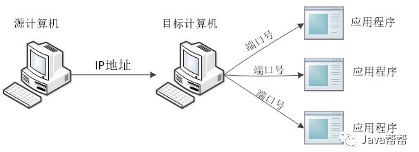
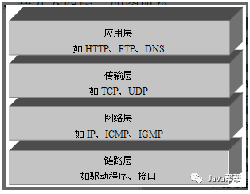
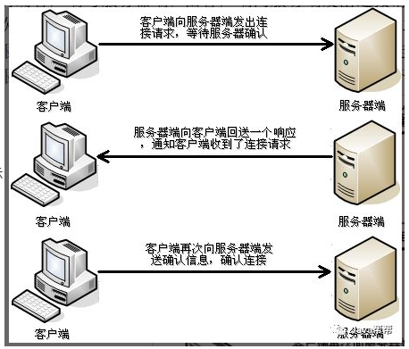
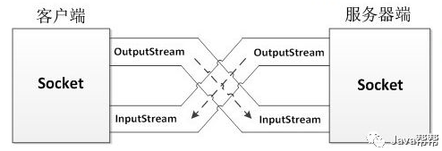

> 当前位置：【Java】02_Java_Reinforce（加强）  -> 2.6_Socket（网络编程）


# 第一章 网络通信协议

## 1、网络通信协议

### 1.1 概述

```
- 通过计算机网络可以使多台计算机实现连接，位于同一个网络中的计算机在进行连接和通信时需要遵守一定的规则，这就好比在道路中行驶的汽车一定要遵守交通规则一样。在计算机网络中，这些连接和通信的规则被称为网络通信协议，它对数据的传输格式、传输速率、传输步骤等做了统一规定，通信双方必须同时遵守才能完成数据交换
```


### 1.2 网络编程的机制

- 在Internet上的主机一般运行了多个服务软件，同时提供几种服务，每种服务都打开一个Socket，并绑定到一个端口上，不同的端口对应于不同的服务

- Socket就是为网络编程提供的一种机制，又叫套接字编程

  - 通信的两端都有Socket

  - 网络通信其实就是Socket间的通信

  - 数据在两个Socket间通过IO传输

  - Socket编程一般使用TCP与UDP两种协议

  ```
  - TCP（Transmission Control Protocol，传输控制协议）
  - UDP（User Datagram Protocol，用户数据报协议）
  ```

### 1.3 网络编程三要素

#### （1）IP地址

- 概述

```
- 要想使网络中的计算机能够进行通信，必须为每台计算机指定一个标识号，通过这个标识号来指定接受数据的计算机或者发送数据的计算机
- 在TCP/IP协议中，这个标识号就是IP地址，它可以唯一标识一台计算机
```

- 版本

```
- 目前，IP地址广泛使用的版本是IPv4
  - 它是由4个字节大小的二进制数来表示，如：00001010000000000000000000000001
  - 由于二进制形式表示的IP地址非常不便记忆和处理，因此通常会将IP地址写成十进制的形式，每个字节用一个十进制数字(0-255)表示，数字间用符号“.”分开，如 “192.168.1.100”

- 解决了网络地址资源数量不够的问题，便有了IPv6
  - 使用16个字节表示IP地址，它所拥有的地址容量约是IPv4的8×10的28次幂，达到2的128次幂个（算上全零的）
```

- JDK提供 InetAdderss 类（封装了一个IP地址）

```java
类结构
- java.lang.Object
  - java.net.InetAddress
     
成员方法
- [static InetAddress] getByName(String host) 
  - API：确定主机名称的IP地址
  - 功能：获得表示指定主机的InetAddress对象

- [static InetAddress] getLocalHost( ) 
  - API：返回本地主机的地址
  - 功能：获得表示本地的InetAddress对象

- [String] getHostName( )  
  - 获取此IP地址的主机名

- [String ]getHostAddress( )  
  - 返回文本显示中的IP地址字符串
```


#### （2）端口号

- 概述

```
- 如果想访问目标计算机中的某个应用程序，还需要指定端口号
- 在计算机中，不同的应用程序是通过端口号区分的
- 端口号是用两个字节（16位的二进制数）表示的，它的取值范围是0~65535
  - 0~1023之间的端口号用于一些知名的网络服务和应用
  - 用户的普通应用程序需要使用1024以上的端口号，从而避免端口号被另外一个应用或服务所占用
```

- 图示：位于网络中一台计算机可以通过IP地址去访问另一台计算机，并通过端口号访问目标计算机中的某个应用程序



#### （3）协议


## 2、TCP/IP协议

### 2.1 概述

```
- Transmission Control Protocal/Internet Protocal（传输控制协议/英特网互联协议）
- 它是一个包括TCP协议和IP协议，UDP（User Datagram Protocal）协议和其它一些协议的协议组
- 它是网络通信协议目前应用最广泛的
```


### 2.2 TCP/IP协议组的层次结构

#### （1）链路层

```
- 链路层是用于定义物理传输通道，通常是对某些网络连接设备的驱动协议
- 例如针对光纤、网线提供的驱动
```

#### （2）网络层

```
- 网络层是整个TCP/IP协议的核心
- 主要用于将传输的数据进行分组，将分组数据发送到目标计算机或者网络
```

#### （3）运输层

```
- 主要使网络程序进行通信
- 在进行网络通信时，可以采用TCP协议，也可以采用UDP协议
```

#### （4）应用层

```
- 主要负责应用程序的协议
- 例如HTTP协议、FTP协议等
```




## 3、UDP协议

### 3.1 概述

- UDP是无连接通信协议

```
- 在数据传输时，数据的发送端和接收端不建立逻辑连接
- 当一台计算机向另外一台计算机发送数据时，发送端不会确认接收端是否存在，就会发出数据，同样接收端在收到数据时，也不会向发送端反馈是否收到数据
```

- 优点

```
- 使用UDP协议消耗资源小，通信效率高
```

- 缺点

```
- 在使用UDP协议传送数据时，由于UDP的面向无连接性，不能保证数据的完整性，因此在传输重要数据时不建议使用UDP协议
```

- 使用场景

```
- 用于音频、视频和普通数据的传输（例如视频会议，因为这种情况即使偶尔丢失一两个数据包，也不会对接收结果产生太大影响）
```


### 3.2 UDP协议的通信

#### （1）UDP的交换过程图


#### （2）JDK提供了DatagramPacket类（用于封装UDP通信中发送端或者接收端的数据）

```java
类结构
- java.lang.Object
  - java.net.DatagramPacket

构造方法
- DatagramPacket(byte[] buf, int length)
  - API：构造一个 DatagramPacket用于接收长度的数据包 length
  - 功能：该构造方法在创建DatagramPacket对象时，指定了封装数据的字节数组和数据的大小
  - 补充：这样的对象只能用于接收端，不能用于发送端

- DatagramPacket(byte[] buf, int length, InetAddress address, int port)
  - API：构造用于发送长度的分组的数据报包 length指定主机上到指定的端口号
  - 功能：使用该构造方法在创建DatagramPacket对象时，不仅指定了封装数据的字节数组和数据的大小，还指定了数据包的目标IP地址（addr）和端口号（port）
  - 补充：这样的对象通常用于发送端
 
成员方法
- [InetAddress] getAddress( )   
  - 返回该数据报发送或接收数据报的计算机的IP地址

- [int] getPort( )  
  - 返回发送数据报的远程主机上的端口号，或从中接收数据报的端口号

- byte[] getData( )  
  - 返回数据缓冲区

- [int] getLength( )   
  - 返回要发送的数据的长度或接收到的数据的长度
```

#### （3）JDK提供了DatagramSocket类（用于发送和接收DatagramPacket数据包）

```java
- 类结构
  - java.lang.Object
    - java.net.DatagramSocket

- 构造方法
  - DatagramSocket()
    - API：构造数据报套接字并将其绑定到本地主机上的任何可用端口
    - 功能：用于创建发送端的DatagramSocket对象，在创建DatagramSocket对象时，并没有指定端口号，此时，系统会分配一个没有被其它网络程序所使用的端口号
    
  - DatagramSocket(int port)
    - API：构造数据报套接字并将其绑定到本地主机上的指定端口
    - 功能：既可用于创建接收端的DatagramSocket对象，又可以创建发送端的DatagramSocket对象，在创建接收端的DatagramSocket对象时，必须要指定一个端口号，这样就可以监听指定的端口

- 成员方法
  - [void] receive(DatagramPacket p) 
    - 从此套接字接收数据报包
  - [void] send(DatagramPacket p) 
    - 从此套接字发送数据报包
```

#### （4）DatagramPacket 和 DatagramSocket的关系图


## 4、TCP协议

### 4.1 概述

```
- TCP协议是面向连接的通信协议
- 在传输数据前先在发送端和接收端建立逻辑连接，然后再传输数据，它提供了两台计算机之间可靠无差错的数据传
- 由于TCP协议的面向连接特性，它可以保证传输数据的安全性，所以是一个被广泛采用的协议
```


### 4.2 TCP三次握手

- 概述

```
- 在TCP连接中必须要明确客户端与服务器端，由客户端向服务端发出连接请求，每次连接的创建都需要经过“三次握手”
```

- 三次握手

```
- 第一次握手：客户端向服务器端发出连接请求，等待服务器确认 
- 第二次握手：服务器端向客户端回送一个响应，通知客户端收到了连接请求
- 第三次握手：客户端再次向服务器端发送确认信息，确认连接
```




### 4.3 TCP协议的通信

#### （1）通信过程

```
- 通信时，首先创建代表服务器端的ServerSocket对象，该对象相当于开启一个服务，并等待客户端的连接，
- 然后创建代表客户端的Socket对象向服务器端发出连接请求，服务器端响应请求，两者建立连接开始通信
- 当客户端和服务端建立连接后，数据是以IO流的形式进行交互的，从而实现通信
```

#### （2）JDK提供了ServerSocket类（表示服务器端）

```java
- 类结构
  - java.lang.Object
    - java.net.ServerSocket

- 构造方法
  - ServerSocket(int port)
    - API：创建绑定到指定端口的服务器套接字
    - 功能：在创建ServerSocket对象时，就可以将其绑定到一个指定的端口号上（参数port就是端口号）

- 成员方法
  - [Socket] accept()  
    - 侦听要连接到此套接字并接受它
  - [InetAddress] getInetAddress()   
    - 返回此服务器套接字的本地地址
```

#### （3）JDK提供了Socket类（表示客户端）

```java
- 类结构
  - java.lang.Object
    - java.net.Socket

- 构造方法
  - Socket(String host, int port)
    - 创建流套接字并将其连接到指定主机上的指定端口号
  - Socket(InetAddress address, int port)
    - 创建流套接字并将其连接到指定IP地址的指定端口号

- 成员方法
  - [int] getPort( )
    - API：返回此套接字连接到的远程端口号
    - 功能：该方法返回一个int类型对象，该对象是Socket对象与服务器端连接的端口号
    
  - [InetAddress] getLocalAddress( )
    - API：获取套接字所绑定的本地地址
    - 功能：该方法用于获取Socket对象绑定的本地IP地址，并将IP地址封装成InetAddress类型的对象返回
    
  - [void] close( )
    - API：关闭此套接字
    - 功能：该方法用于关闭Socket连接，结束本次通信。在关闭socket之前，应将与socket相关的所有的输入/输出流全部关闭，这是因为一个良好的程序应该在执行完毕时释放所有的资源
    
  - [InputStream] getInputStream( ）
    - API：返回此套接字的输入流
    - 功能：该方法返回一个InputStream类型的输入流对象，如果该对象是由服务器端的Socket返回，就用于读取客户端发送的数据，反之，用于读取服务器端发送的数据
                                 
  - [OutputStream] getOutputStream( )
    - API：返回此套接字的输出流
    - 功能：该方法返回一个OutputStream类型的输出流对象，如果该对象是由服务器端的Socket返回，就用于向客户端发送数据，反之，用于向服务器端发送数据
```

#### （4）服务器端和客户端的数据传输图




## 5、【区别】UDP通信 & TCP通信

- 相同点

```
- 都能实现两台计算机之间的通信
- 通信的两端都需要创建socket对象
```

- 不同点

```
- UDP中只有发送端和接收端，不区分客户端与服务器端，计算机之间可以任意地发送数据
- TCP通信是严格区分客户端与服务器端的，在通信时，必须先由客户端去连接服务器端才能实现通信，服务器端不可以主动连接客户端，并且服务器端程序需要事先启动，等待客户端的连接
```


# 第二章  Socket

## 1、Socket 简介

### 1.1 Socket 概述

```
Socket，套接字就是两台主机之间逻辑连接的端点
- TCP/IP协议是传输层协议，主要解决数据如何在网络中传输
- HTTP是应用层协议，主要解决如何包装数据

Socket是通信的基石，是支持TCP/IP协议的网络通信的基本操作单元，是网络通信过程中端点的抽象表示
```

### 1.2 进行网络通信必须的五种信息

```
- 连接使用的协议
- 本地主机的IP地址
- 本地进程的协议端口
- 远程主机的IP地址
- 远程进程的协议端口
```

 

## 2、Socket 整体流程

- Socket 编程主要涉及到客户端和服务端两个方面

```
首先是在服务器端创建一个服务器套接字（ServerSocket），并把它附加到一个端口上，服务器从这个端口监听连接
端口号的范围是0到65536，但是0到1024是为特权服务保留的端口号，可以选择任意一个当前没有被其他进程使用的端口

客户端请求与服务器进行连接的时候，根据服务器的域名或者IP地址，加上端口号，打开一个套接字
当服务器接受连接后，服务器和客户端之间的通信就像输入输出流一样进行操作
```


## 3、Socket 代码实现

### 服务端

```java
package com.loto.network.d.socket.server;

import java.io.IOException;
import java.io.InputStream;
import java.io.OutputStream;
import java.net.ServerSocket;
import java.net.Socket;
import java.util.concurrent.ExecutorService;
import java.util.concurrent.Executors;

public class ServerDemo {
    public static void main(String[] args) throws Exception {
        // 1.创建一个线程池,如果有客户端连接就创建一个线程, 与之通信
        ExecutorService executorService = Executors.newCachedThreadPool();

        // 2.创建 ServerSocket 对象
        ServerSocket serverSocket = new ServerSocket(9999);
        System.out.println("服务器已启动");

        while (true) {
            // 3.监听客户端
            final Socket socket = serverSocket.accept();
            System.out.println("有客户端连接");

            // 4.开启新的线程处理
            executorService.execute(new Runnable() {
                @Override
                public void run() {
                    handle(socket);
                }
            });
        }
    }

    public static void handle(Socket socket) {
        try {
            System.out.println("线程ID:" + Thread.currentThread().getId() + "   线程名称:" + Thread.currentThread().getName());

            // 从连接中取出输入流来接收消息
            InputStream is = socket.getInputStream();
            byte[] b = new byte[1024];
            int read = is.read(b);
            System.out.println("客户端:" + new String(b, 0, read));

            // 连接中取出输出流并回话
            OutputStream os = socket.getOutputStream();
            os.write("没钱".getBytes());
        } catch (Exception e) {
            e.printStackTrace();
        } finally {
            try {
                // 关闭连接
                socket.close();
            } catch (IOException e) {
                e.printStackTrace();
            }
        }
    }
}
```

### 客户端

```java
package com.loto.network.d.socket.client;

import java.io.InputStream;
import java.io.OutputStream;
import java.net.Socket;
import java.util.Scanner;

public class ClientDemo {
    public static void main(String[] args) throws Exception {
        while (true) {
            // 1.创建 Socket 对象
            Socket s = new Socket("127.0.0.1", 9999);

            // 2.从连接中取出输出流并发消息
            OutputStream os = s.getOutputStream();
            System.out.println("请输入:");

            Scanner sc = new Scanner(System.in);
            String msg = sc.nextLine();
            os.write(msg.getBytes());

            // 3.从连接中取出输入流并接收回话
            InputStream is = s.getInputStream();
            byte[] b = new byte[1024];
            int read = is.read(b);
            System.out.println("服务器端:" + new String(b, 0, read).trim());

            // 4.关闭
            s.close();
        }
    }
}
```


