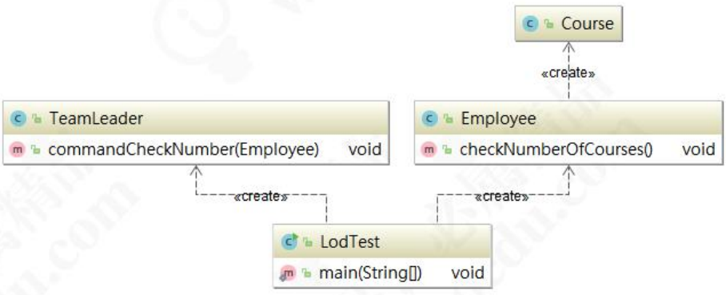
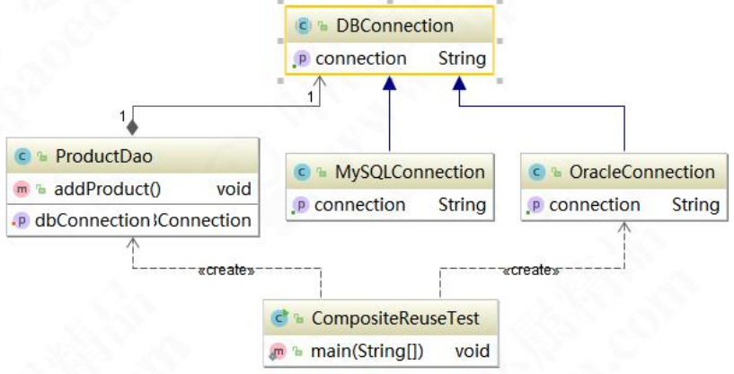

> 当前位置：【Java】02_Pattern（设计模式）-> 2.0_Principle（软件架构设计原则）


## 软件架构设计原则（7种）


## 1、开闭原则（Open Close Principle，OCP）

### 1.1 开闭原则 - 定义

- 开闭原则是指一个软件实体（如类、模块和函数）应该对扩展开放，对修改关闭（需要使用接口和抽象类）

- 在程序需要进行扩展的时候，不能去修改原有的代码，实现一个热插拔的效果
- 强调的是用抽象构建框架，用实现扩展细节
- 实现开闭原则的核心思想是：面向抽象编程

### 1.2 开闭原则 - 优点

- 提高软件系统的可复用性
- 使程序的扩展性更好，易于维护和升级  

### 1.3 开闭原则 - 应用场景

- 开发中：版本更新，尽可能不修改源代码，但是可以增加新功能
- 生活中：很多互联网公司都实行弹性制作息时间，规定每天工作 8 小时。意思就是说，对于每天工作 8 小时这个规定是关闭的，但是什么时候来，什么时候走是开放的，早来早走，晚来晚走

### 1.4 开闭原则 - 案例

#### （1）ICourse.java（课程接口）

```java
public interface ICourse {
    Integer getId();

    String getName();

    Double getPrice();
}
```

#### （2）JavaCourse.java（java课程类）

```java
public class JavaCourse implements ICourse{
    private Integer id;   // 课程id
    private String name;  // 课程标题
    private Double price; // 价格
....
```

#### （3）JavaDiscountCourse.java（java课程打折类）

```java
public class JavaDiscountCourse extends JavaCourse {
    public JavaDiscountCourse(Integer id, String name, Double price) {
        super(id, name, price);
    }

    // 得到原始价格
    public Double getOriginPrice() {
        return super.getPrice();
    }

    // 得到打折价格
    public Double getDiscountPrice() {
        return super.getPrice() * 0.61;
    }
}
```

#### （4）OpenCloseTest.java

```java
public class OCPTest {
    public static void main(String[] args) {
        JavaCourse javaCourse = new JavaCourse(1, "java架构课程", 18888.00);
        System.out.println("课程id：" + javaCourse.getId());
        System.out.println("课程标题：" + javaCourse.getName());
        System.out.println("价格：" + javaCourse.getPrice());

        System.out.println("==================================");

        JavaDiscountCourse javaDiscountCourse = new JavaDiscountCourse(2, "java架构课程（打折）", 18888.00);
		System.out.println("课程id：" + javaDiscountCourse.getId());
		System.out.println("课程标题：" + javaDiscountCourse.getName());
		System.out.println("原始价格：" + javaDiscountCourse.getOriginPrice());
        System.out.println("折后价格：" + javaDiscountCourse.getDiscountPrice());
    }
}
```

#### （5）测试结果

```java
课程id：1
课程标题：java架构课程
价格：18888.0
==================================
课程id：2
课程标题：java架构课程（打折）
原始价格：18888.0
折后价格：11521.68
```


## 2、依赖倒置原则（Dependence Inversion Principle，DIP）

### 2.1 依赖倒置原则 - 定义

- 依赖倒置原则是指设计代码结构时，高层模块不应该依赖底层模块，二者都应该依赖其抽象（细节应该依赖抽象）
- 总结：针对接口编程，依赖于抽象而不依赖于具体
- 注意：以抽象为基准比以细节为基准搭建起来的架构要稳定得多，因此在拿到需求之后，要面向接口编程，先顶层再细节来设计代码结构 

### 2.2 依赖倒置原则 - 优点

- 减少类与类之间的耦合性
- 提高系统的稳定性
- 提高代码的可读性和可维护性
- 能够降低修改程序所造成的风险 

### 2.3 依赖倒置原则 - 实现方式

- 依赖注入
- 构造器注入
- 单例下，setter方式注入

### 2.4 依赖倒置原则 - 案例


#### （1）ICourse.java（课程接口）

```java
public interface ICourse {
	void study();
}
```

#### （2）JavaCourse.java（课程实现类）

```java
public class JavaCourse implements ICourse {
	@Override
	public void study() {
		System.out.println("TD 在学习 Java 的课程");
	}
}
```

#### （3）PythonCourse.java（课程实现类）

```java
public class PythonCourse implements ICourse {
	@Override
	public void study() {
		System.out.println("TD 在学习 Python 的课程");
	}
}
```

#### （4）Student.java（学生类）

- 传统写法

```java
public class Student {
	public Student() {
	}

	// 传统写法
	public void studyJavaCourse() {
		System.out.println("TD 在学习 Java 的课程");
	}

	public void studyPythonCourse() {
		System.out.println("TD 在学习 Python 的课程");
	}
}
```

- 实现依赖倒置原则的方式1：依赖注入

```java
public class Student {
	public Student() {
	}

	public void study(ICourse course) {
		course.study();
	}
}
```

- 实现依赖倒置原则的方式2：构造器

```java
public class Student {
	public Student() {
	}

	private ICourse iCourse;

	public Student(ICourse iCourse) {
		this.iCourse = iCourse;
	}

	public void study(){
		iCourse.study();
	}
}
```

- 实现依赖倒置原则的方式3：单例下，setter方式注入

```java
public class Student {
	public Student() {
	}

	private ICourse course;

	public void setCourse(ICourse course) {
		this.course = course;
	}

	public void study(){
		course.study();
	}
}
```

#### （5）测试

- 传统写法

```java
public class DIPTest {
	public static void main(String[] args) {
		// 传统写法
		System.out.println("======== 传统写法 ======== ");
		Student stu1 = new Student();
		stu1.studyJavaCourse();
		stu1.studyPythonCourse();
	}
}
```

- 实现依赖倒置原则的方式1：依赖注入

```java
public class DIPTest {
	public static void main(String[] args) {
		System.out.println("======== 实现依赖倒置原则的方式1：依赖注入 ======== ");
		Student stu2 = new Student();
		stu2.study(new JavaCourse());
		stu2.study(new PythonCourse());
	}
}
```

- 实现依赖倒置原则的方式2：构造器

```java
public class DIPTest {
	public static void main(String[] args) {
		System.out.println("======== 实现依赖倒置原则的方式2：构造器 ======== ");
		Student stu3 = new Student(new JavaCourse());
		stu3.study();

		Student stu4 = new Student(new PythonCourse());
		stu4.study();
	}
}
```

- 实现依赖倒置原则的方式3：单例下，setter方式注入

```java
public class DIPTest {
	public static void main(String[] args) {
		System.out.println("======== 实现依赖倒置原则的方式：单例下，setter方式注入 ======== ");
		Student stu5 = new Student();
		stu5.setCourse(new JavaCourse());
		stu5.study();

		stu5.setCourse(new PythonCourse());
		stu5.study();
	}
}
```


## 3、单一职责原则（Simple Responsibility Pinciple，SRP）

### 3.1 单一职责原则 - 定义

- 单一职责原则是指不要存在多于一个导致类变更的原因
- 假设场景：假设有一个 Class 负责两个职责，一旦发生需求变更，修改其中一个职责的逻辑代码，有可能会导致另一个职责的功能发生故障。这样一来，这个Class 存在两个导致类变更的原因。如何解决这个问题呢？
- 解决方法：给两个职责分别用两个 Class 来实现，进行解耦，后期需求变更维护互不影响
- 总结：一个 Class/Interface/Method 只负责一项职责 

### 3.2 单一职责原则 - 优点

- 降低类的复杂度
- 提高类的可读性
- 提高系统的可维护性
- 降低变更引起的风险


### 3.3 单一职责原则 - 案例

#### （1）一个 class 只负责一项职责

- Course.java（课程类）

```java
public class Course {
	public void study(String courseName) {
		if ("直播课".equals(courseName)) {
			System.out.println("不能快进");
		} else {
			System.out.println("可以任意的来回播放");
		}
	}
}
```

- LiveCourse.java（直播课程，类层面的单一职责原则）

```java
public class LiveCourse {
	public void study(String courseName) {
		System.out.println("不能快进");
	}
}
```

- RecordCourse.java（录播课程，类层面的单一职责原则）

```java
public class RecordCourse {
	public void study(String courseName) {
		System.out.println("可以任意的来回播放");
	}
}
```

#### （2）一个 interface 只负责一项职责

- ICourse.java（课程接口）

```java
public interface ICourse {
	// 展示职责
	String getCourseName();  // 获取课程名
	byte[] getCourseVideo(); // 获取课程的视频

	// 权限职责
	void studyCourse();   // 学习课程的权限
	void refundCourse();  // 退费课程的权限
}
```

- ICourseInfo.java（课程的展示，接口层面的单一职责原则）

```java
public interface ICourseInfo {
	// 展示职责
	String getCourseName();  // 获取课程名
	byte[] getCourseVideo(); // 获取课程的视频
}
```

- ICourseManager.java（课程的权限，接口层面的单一职责原则）

```java
public interface ICourseManager {
	// 权限职责
	void studyCourse();   // 学习课程的权限
	void refundCourse();  // 退费课程的权限
}
```

- CourseImpl.java（课程的实现类）

```java
public class CourseImpl implements ICourseInfo, ICourseManager {
	@Override
	public String getCourseName() {
		return null;
	}

	@Override
	public byte[] getCourseVideo() {
		return new byte[0];
	}

	@Override
	public void studyCourse() {
	}

	@Override
	public void refundCourse() {
	}
}
```

#### （3）一个 method 只负责一项职责

- Method.java（方法层面的单一职责原则）

```java
public class Method {
	private void modifyUserInfo(String userName, String address) {
		userName = "TD";
		address = "Beijing";
	}

	// 使用单一职责原则后，解耦
	private void modifyUserName(String userName) {
		userName = "TD";
	}

	private void modifyAddress(String address) {
		address = "Beijing";
	}
}
```


## 4、接口隔离原则（Interface Segregation Principle，ISP）

### 4.1 接口隔离原则 - 定义

- 指用多个专门的接口，而不使用单一的总接口，客户端不应该依赖它不需要的接口

```java
// 设计注意点
一个类对一类的依赖应该建立在最小的接口之上
建立单一接口，不要建立庞大臃肿的接口
尽量细化接口，接口中的方法尽量少（不是越少越好，一定要适度）
```


### 4.2 接口隔离原则 - 优点 

- 符合高内聚低耦合的设计思想，从而使得类具有很好的可读性、可扩展性和可维护性。

### 4.3 接口隔离原则 - 案例

#### （1）不使用接口隔离原则


- IAnimal.java

```java
public interface IAnimal {
    void eat();

    void fly();

    void swim();
}
```

- Dog.java

```java
public class Dog implements IAnimal {
    @Override
    public void eat() {
        // Do nothing
    }

    @Override
    public void fly() {
        // Do nothing
    }

    @Override
    public void swim() {
        // Do nothing
    }
}
```

- Bird.java

```java
public class Bird implements IAnimal {
    @Override
    public void eat() {
        // Do nothing
    }

    @Override
    public void fly() {
        // Do nothing
    }

    @Override
    public void swim() {
        // Do nothing
    }
}
```

#### （2）使用接口隔离原则


- IEatAnimal.java

```java
public interface IEatAnimal {
    void eat();
}
```

- IFlyAnimal.java

```java
public interface IFlyAnimal {
    void fly();
}
```

- ISwimAnimal.java

```java
public interface ISwimAnimal {
    void swim();
}
```

- Dog.java

```java
public class Dog implements ISwimAnimal, IEatAnimal {
    @Override
    public void eat() {
        // Do nothing
    }

    @Override
    public void swim() {
        // Do nothing
    }
}
```

- Bird.java

```java
public class Bird implements IEatAnimal, IFlyAnimal {
    @Override
    public void eat() {
        // Do nothing
    }

    @Override
    public void fly() {
        // Do nothing
    }
}
```


## 5、迪米特法则（Law of Demeter，LOD）

### 5.1 迪米特法则 - 定义

- 迪米特原则（Law of Demeter，LoD）/最少知道原则（Least Knowledge Principle，LKP）：一个实体/对象应当尽量少的与其他实体/对象之间发生相互作用，保持最少的了解，使得系统功能模块相对独立。

- 尽量降低类与类之间的耦合。迪米特原则主要强调只和朋友交流，不和陌生人说话。出现在成员变量、方法的输入、输出参数中的类都可以称之为成员朋友类，而出现在方法体内部的类不属于朋友类。

### 5.2 迪米特法则 - 案例

- Course 和 TeamLeader 没有关联



#### （1）Course.java

```java
public class Course {

}
```

#### （2）Employee.java

```java
public class Employee {
    public void checkNumberOfCourses() {
        List<Course> courseList = new ArrayList<>();

        for (int i = 0; i < 20; i++) {
            courseList.add(new Course());
        }

        System.out.println("目前已发布的课程数量为：" + courseList.size());
    }
}
```

#### （3）TeamLeader.java

```java
public class TeamLeader {
    public void commandCheckNumber(Employee employee) {
        employee.checkNumberOfCourses();
    }
}
```

#### （4）LODTest.java

```java
public class LODTest {
    public static void main(String[] args) {
        TeamLeader teamLeader = new TeamLeader();
        Employee employee = new Employee();
        teamLeader.commandCheckNumber(employee);
    }
}
```


## 6、里氏替换原则（Liskov Substitution Principle，LSP）

### 6.1 里氏代换原则 - 概念

- 描述1：如果对每一个类型为 T1 的对象 o1，都有类型为 T2 的对象 o2，使得以 T1 定义的所有程序 P 在所有的对象 o1 都替换成 o2 时，程序 P 的行为没 有发生变化，那么类型 T2 是类型 T1 的子类型。
- 描述2：一个软件实体如果适用一个父类的话， 那一定是适用于其子类，所有引用父类的地方必须能透明地使用其子类的对象，子类对象能够替换父类 对象，而程序逻辑不变。
- LSP 是继承复用的基石，只有当衍生类可以 替换掉基类，软件单位的功能不受到影响时，基类才能真正被复用，而衍生类也能够在基类的基础上增加新的行为。里氏代换原则是对“开-闭”原则的补充。实现“开-闭”原则的关键步骤就是抽象化。而基类与子类的继承关系就是抽象化的具体实现，所以里氏代换原则是对实现抽象化的具体步骤的规范。

```java
// 引申含义：子类可以扩展父类的功能，但不能改变父类原有的功能。
1、子类可以实现父类的抽象方法，但不能覆盖父类的非抽象方法。 
2、子类中可以增加自己特有的方法。 
3、当子类的方法重载父类的方法时，方法的前置条件（即方法的输入/入参）要比父类方法的输入参数更宽松。
4、当子类的方法实现父类的方法时（重写/重载或实现抽象方法），方法的后置条件（即方法的输 出/返回值）要比父类更严格或相等。
```

### 6.2 里氏代换原则 - 优点

- 约束继承泛滥，开闭原则的一种体现。 
- 加强程序的健壮性，同时变更时也可以做到非常好的兼容性，提高程序的维护性、扩展性。降低需求变更时引入的风险。

### 6.3 里氏代换原则 - 案例

- QuadRangle.java（抽象四边形）

```java
public interface QuadRangle {
    long getWidth();

    long getHeight();
}
```

- Rectangle.java（长方形）

```java
public class Rectangle implements QuadRangle {
    private long height;
    private long width;
    ...
```

- Square.java（正方形）

```java
public class Square implements QuadRangle {
    private long length;
    ...
```

- 测试

```java
public class LSPTest {
    public static void main(String[] args) {
        Rectangle rectangle = new Rectangle();
        rectangle.setWidth(20);
        rectangle.setHeight(10);
        resize(rectangle);
    }

    /**
     * 让高一直自增，直到高等于宽。变成正方形
     * @param rectangle
     */
    public static void resize(Rectangle rectangle) {
        while (rectangle.getWidth() >= rectangle.getHeight()) {
            rectangle.setHeight(rectangle.getHeight() + 1);
            System.out.println("Width:" + rectangle.getWidth() + ",Height:" + rectangle.getHeight());
        }
        System.out.println("Resize End,Width:" + rectangle.getWidth() + ",Height:" + rectangle.getHeight());
    }
}
```


## 7、合成复用原则（Composite/Aggregate Reuse Principle，CARP）

### 7.1 合成复用原则 - 概念

- 原则是尽量使用对象组合（has-a）/ 聚合（contanis-a）的方式，而不是使用继承关系达到软件复用的目的。可以使系统更加灵活，降低类与类之间的耦 合度，一个类的变化对其他类造成的影响相对较少。 
- 继承叫做白箱复用，相当于把所有的实现细节暴露给子类。
- 组合/聚合也称之为黑箱复用，对类以外的对象是无法获取到实现细节的。

### 7.2 合成复用原则 - 案例



- DBConnection.java

```java
public abstract class DBConnection {
    public abstract String getConnection();
}
```

- ProductDao.java

```java 
public class ProductDao {
    private DBConnection dbConnection;

    public void setConnection(DBConnection dbConnection) {
        this.dbConnection = dbConnection;
    }

    public void addProduct() {
        String conn = dbConnection.getConnection();
        System.out.println("获得数据库连接："+ conn);
    }
}
```

- MySQLConnection.java

```java
public class MySQLConnection extends DBConnection {
    public String getConnection() {
        return "MySQL数据连接";
    }
}
```

- MyOracleConnection.java

```java
public class MyOracleConnection extends DBConnection {
    public String getConnection() {
        return "Oracle数据连接";
    }
}
```

- 测试

```java
public class CARPTest {
    public static void main(String[] args) {
        ProductDao productDao = new ProductDao();
        productDao.setConnection(new MySQLConnection());
        productDao.addProduct();
    }
}
```


## 小结与对比

| 设计原则     | 一句话归纳                                         | 目的                                       |
| ------------ | -------------------------------------------------- | ------------------------------------------ |
| 开闭原则     | 对扩展开放，对修改关闭                             | 降低维护带来的新风险                       |
| 依赖倒置原则 | 高层不应该依赖低层                                 | 更利于代码结构的升级扩展                   |
| 单一职责原则 | 一个类只干一件事                                   | 便于理解，提高代码的可读性                 |
| 接口隔离原则 | 一个接口只干一件事                                 | 功能解耦，高聚合，低内聚                   |
| 迪米特法则   | 不该知道的不要知道                                 | 只和朋友交流，不和陌生人说话，减少代码臃肿 |
| 里氏替换原则 | 子类重写方法功能发生改变，不应该影响父类方法的含义 | 防止继承泛滥                               |
| 合成复用原则 | 尽量使用组合实现代码复用，而不使用继承             | 降低代码耦合                               |

