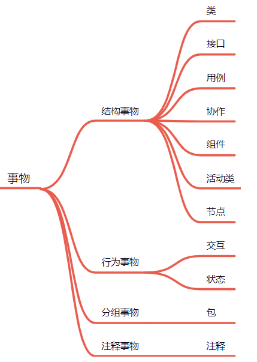
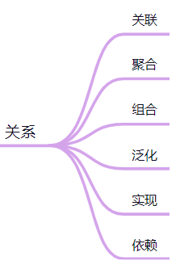
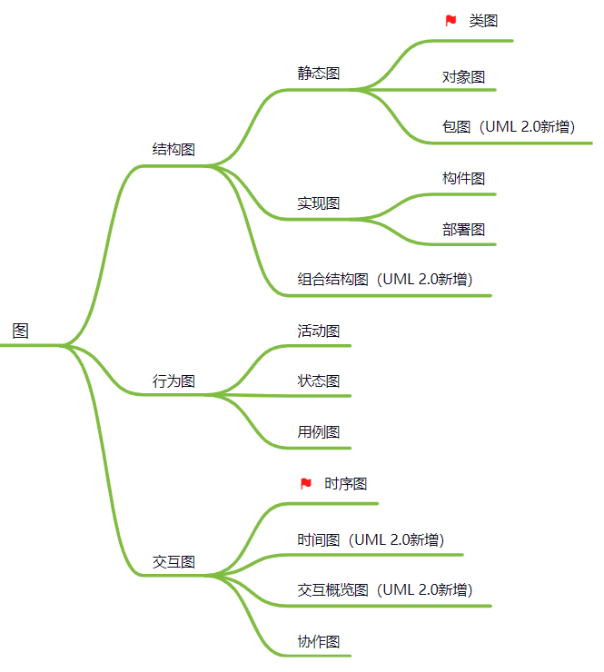

> 当前位置：【Java】02_Pattern（设计模式）-> 2.0_UML

# 第一章 UML  简介

## 1、UML 概述

### 1.1 UML 概念

### 1.2 UML 应用场景

## 2、UML 基本构件 

### 2.1 事物

### 2.2 关系

### 2.3 图

---

# 第二章 UML 类图

## 0、类图概述

## 1、类与类的事物关系 - 泛化（继承）

## 2、类与类的事物关系 - 实现

## 3、类与类的事物关系 - 组合

## 4、类与类的事物关系 - 聚合

## 5、类与类的事物关系 - 关联

## 6、类与类的事物关系 - 依赖

---

# 第三章  UML 时序图

## 1、时序图 - 概述

## 2、时序图 - 作用

## 3、时序图 - 组成元素

## 4、 时序图 - 组合片段

### 4.1 抉择 - Alt

### 4.2 选项 

### 4.3 循环

### 4.4 中断

### 4.5 并行

### 4.6 关键

### 4.7 弱顺性

### 4.8 强顺性

### 4.9 考虑

### 4.10 忽略

### 4.11 断言

### 4.12 否定

