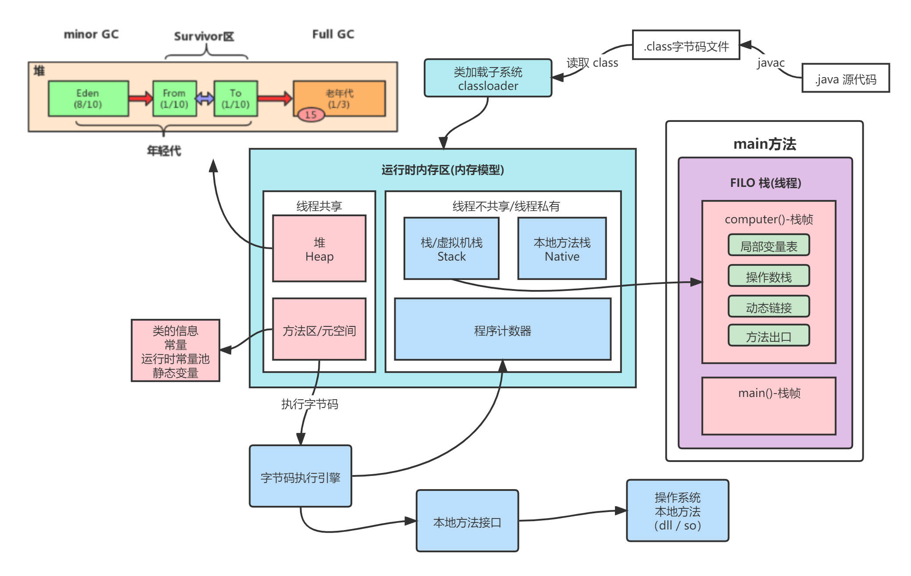
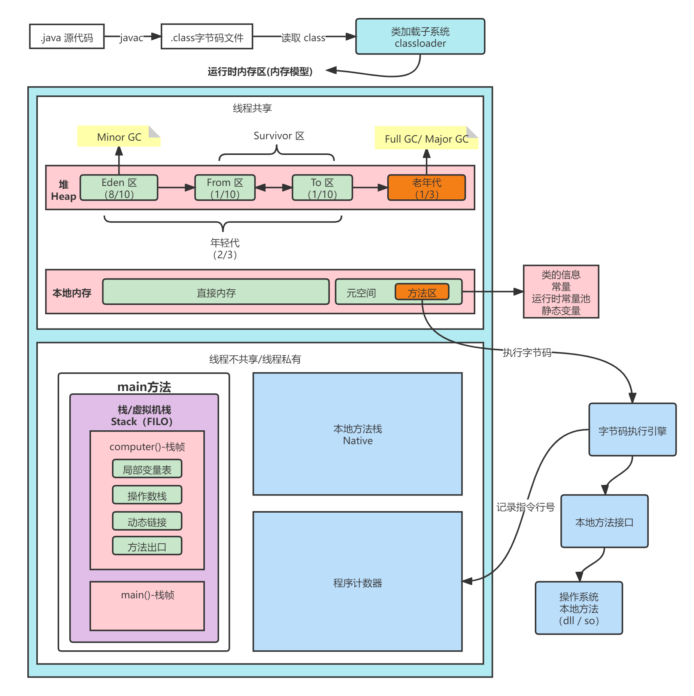

> 当前位置：【Java】08_JavaExpert（高阶） -> 8.3_JVM（虚拟机）

# 1、JVM 分类

JRockit VM

BEA公司

2008被Oracle收购

最快的JVM

JRockit 专注于服务器端

JRockit 不包含解释器，只包含编译器（效果是，项目启动慢，但启动后，响应速度很快）

- JVM内存模型

- JVM内存模型（jdk8）

方法区和永久代的关系很像Java中接口和类的关系，类实现了接口，而永久代就是HotSpot虚拟机对虚拟机规范中方法区的一种实现方式。

jdk 1.7之前常量池是存放在永久代（hotspot虚拟机对方法区的实现）

jdk 1.7常量池从永久代中移到了堆内存中，属于堆内存的一部分。

Java8移除了永久代并由元空间（metaspace）代替，存放在本地内存（native space）中。并没有对常量池再做变动。即常量池一直在堆中。
# 2、构建编译环境

## 2.1 构建系统和软件要求

| 系统  | 编译软件                            | 安装命令                                      |
| ----- | ----------------------------------- | --------------------------------------------- |
| Mac   | Xcode、Command Line Tools for Xcode |                                               |
| Linux | 最低版本：GCC 4.8+ 或者 CLang 3.2+  | 安装GCC：sudo apt-get install build-essential |
|       | 官方推荐：GCC 7.8 或者 CLang 9.1    |                                               |

## 2.2 OpenJDK 编译依赖库

| 工具     | 安装命令                                                     |
| -------- | ------------------------------------------------------------ |
| FreeType | sudo apt-get install libfreetype6-dev                        |
| CPUS     | sudo apt-get install libcups2-dev.                           |
| X11      | sudo apt-get install libx11-dev libxext-dev libxrender-dev libxrandr-dev libxt-dev. |
| ALSA     | sudo apt-get install libasound2-dev.                         |
| libffi   | sudo apt-get install libffi-dev.                             |
| Autoconf | sudo apt-get install autoconf.                               |

# 3、自动内存管理

# 4、虚拟机执行子系统

# 5、程序编译与代码优化

# 6、高效并发

# idea中的jvm调优

https://blog.csdn.net/weixin_44203995/article/details/98845694

https://blog.csdn.net/jinbaizhe/article/details/81048580

https://blog.csdn.net/weixin_51954021/article/details/112971664

https://blog.csdn.net/u013295276/article/details/78543190

