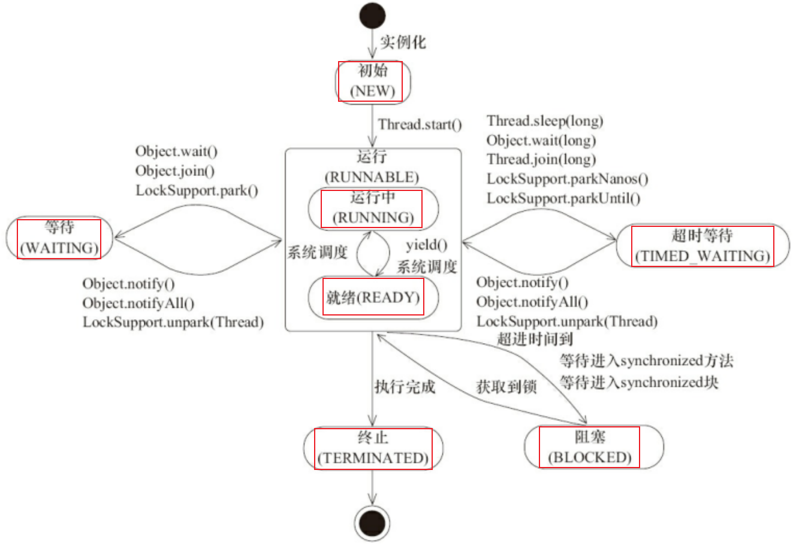
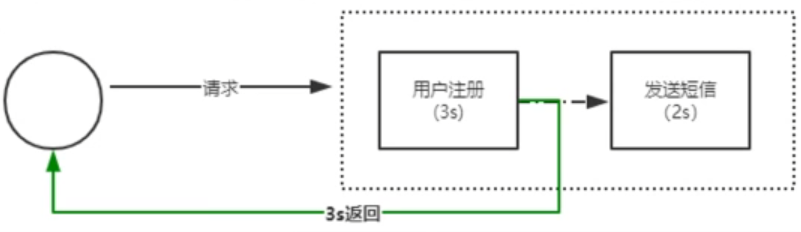
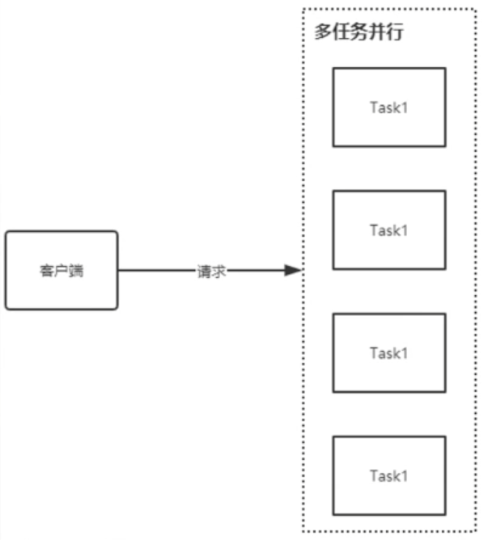

> 当前位置：【Java】04_MultiThread（并发多线程） -> 4.1_MultiThread（多线程）

# 第一章 线程相关概念

## 1、并行 & 并发

- 并行：在同一时间==点==上同时执行（需要多核 CPU 才能完成）
- 并发：在同一时间==段==上同时执行（单核 CPU 可以完成，通过多线程实现并发）


## 2、线程 & 进程 

- 线程：运行程序中的一个顺序控制流程，也是 CPU 中的最小调度单位（线程是进程中的一个执行单元，负责当前进程中程序的执行）
- 进程：运行中的应用程序（当一个程序进入内存运行，即变成一个进程）
- 总结：一个程序运行后至少有一个进程，一个进程中至少有一个线程，==一个进程中可以包含多个线程==


## 3、单线程 & 多线程 

- 单线程程序：多个任务只能依次执行，当上一个任务执行结束后，下一个任务开始执行

- 多线程程序：多个任务可以同时执行（一个程序中有多个线程在同时执行）

### 3.1 多线程优点 

- 能适当提高程序的执行效率

- 能适当提高资源利用率（CPU、内存利用率）

### 3.2 多线程缺点

- 开启线程需要占用一定的内存空间（默认情况下，主线程占用1M，子线程占用512KB的栈区空间），如果开启大量的线程，会占用大量的内存空间，降低程序的性能

- 线程开启越多，CPU 就需要在多条线程之间来回切换，CPU在调度线程上的开销就越大，CPU就越累!

- 开启线程会提高代码的复杂性（会使应用程序增加很多代码!代码变多之后,程序复杂性就会提高!）程序设计更加复杂：比如线程之间的通信、多线程的数据共享

### 3.3 程序运行原理

#### （1）分时调度

- 所有线程轮流使用 CPU 的使用权，平均分配每个线程占用 CPU 的时间

#### （2）抢占式调度

- 优先让优先级高的线程使用 CPU，如果线程的优先级相同，那么会随机选择一个(线程随机性)，Java使用的为抢占式调度

- 实际上，CPU(中央处理器)使用抢占式调度模式在多个线程间进行着高速的切换。对于CPU的一个核而言，某个时刻，只能执行一个线程，而 CPU的在多个线程间切换速度相对我们的感觉要快，看上去就是在同一时刻运行

- 其实，多线程程序并不能提高程序的运行速度，但能够提高程序运行效率，让CPU的使用率更高

### 3.4 主线程

- jvm 启动后，必然有一个执行路径(线程)从main方法开始的，一直执行到main方法结束，这个线程在java中称之为主线程（main线程）
- 主线程需要执行的任务定义在main函数中
- 自定义线程需要执行的任务定义在run方法中


## 4、高并发

### 4.1 什么是高并发？

- 当前系统能够同时承载的并发数

### 4.2 如何支撑高并发？

- 硬件资源

```
CPU：核心数可以支撑更高的并行任务数量
内存
磁盘
网卡
....
```

- 软件资源

```
CPU：CPU核心数 = 线程数，线程数越多，可以支撑高并发
IO：IO的性能影响到响应速度，使用内存/缓存/异步刷盘策略等减少 IO 次数
单节点遇到瓶颈：通过分布式解决
```

# 第二章 线程

## 1、线程 - 创建方式

### 方式1：new Thread

```java
// 步骤1：继承 Thread 类
// 步骤2：重写 run 方法
// 步骤3：通过 new Thread 创建自定义线程对象
// 步骤4：开启线程（调用线程的 start 方法）
```

- ExtendsThread.java

```java
public class ExtendsThread extends Thread {
    public ExtendsThread() {
    }

    // 重写 run 方法，完成该线程执行的逻辑
    @Override
    public void run() {
        for (int i = 0; i < 10; i++) {
            System.out.println(Thread.currentThread().getName() + ",i=" + i);
        }
    }
}
```

- NewThread.java

```java
public class NewThread {
    public static void main(String[] args) {
        // 创建自定义线程对象
        ExtendsThread thread1 = new ExtendsThread();
        ExtendsThread thread2 = new ExtendsThread();

        thread1.run();   // 没有开启新线程，在主线程中调用 run 方法
        thread2.start(); // 开启一个新线程，在新线程中调用 run 方法
    }
}
```


### 方式2：new Runnable

```java
// 步骤1：实现 Runnable 接口
// 步骤2：重写 run 方法
// 步骤3：通过 new 创建任务对象
// 步骤4：通过 new Thread 创建线程，用来承载上面的任务（将 Runnable 接口的子类对象 runnable 作为参数传递给 Thread 类的构造函数）
// 步骤5：开启线程（调用线程的 start 方法）
```

- NewThread.java

```java
public class NewThread {
    public static void main(String[] args) {
        // 通过 new 创建任务对象
        ImplementsRunnable runnable = new ImplementsRunnable();

        // 通过 new Thread 创建线程，用来承载上面的任务（将 Runnable 接口的子类对象 runnable 作为参数传递给 Thread 类的构造函数）
        Thread thread1 = new Thread(runnable);
        Thread thread2 = new Thread(runnable);

        // 开启线程（调用线程的 start 方法）
        thread1.start();
        thread2.start();

        for (int i = 0; i < 10; i++) {
            System.out.println("main线程：i=" + i);
        }
    }
}
```

- ImplementsRunnable.java

```java
public class ImplementsRunnable implements Runnable {
    // 重写 run 方法
    @Override
    public void run() {
        for (int i = 0; i < 10; i++) {
            System.out.println("我的线程：i=" + i);
        }
    }
}
```


### 方式3：new Callable

```java
// 步骤1：实现 Callable 接口
// 步骤2：实现 call 方法
// 步骤3：通过 new 创建任务对象
// 步骤4：通过线程池去承载上面的任务
// 步骤5：通过线程池的 submit 提交任务 
```

- ImplementsCallable.java

```java
public class ImplementsCallable implements Callable {

    @Override
    public Object call() throws Exception {
        for (int i = 1; i <= 50; i++) {
            System.out.println("第三种线程：" + i);
        }
        return "第三种线程执行完毕";
    }
}
```

- NewThread.java

```java
public class NewThread {
    public static void main(String[] args) {
        // 方式1：ExecutorService + submit
        ExecutorService executorService = Executors.newFixedThreadPool(3);
        executorService.submit(new ImplementsCallable());

        // 方式2：FutureTask + run
        FutureTask task = new FutureTask(new ImplementsCallable());
        task.run();
    }
}
```

- 匿名内部类的方式

```java
public class NewInnerClassThread {
    public static void main(String[] args) throws InterruptedException, ExecutionException {
        // 方式1：ExecutorService + Future + submit
        ExecutorService executorService1 = Executors.newCachedThreadPool();
        Future<Object> future1 = executorService1.submit(() -> {
            System.out.println("executorService1.submit");
            return "1";
        });

        // 方式2：ExecutorService + Future + submit + FutureTask
        ExecutorService executorService2 = Executors.newCachedThreadPool();
        Future<?> future2 = executorService2.submit(new FutureTask<>(() -> {
            System.out.println("executorService.submit --- FutureTask");
            return "2";
        }));

        // 方式3：FutureTask + run
        FutureTask<Object> futureTask = new FutureTask<>(() -> {
            System.out.println("futureTask.run");
            return "3";
        });
        futureTask.run();
        System.out.println(futureTask.get().toString());
    }
}
```


### 方式4：线程池


### 【面试题】Thread 和 Runnable 的区别

```java
Thread 是一个类
Runnable 是一个接口
    
Thread 底层会真正的去创建一个线程
Runnable 不是线程，它只是一个任务，要执行这个任务需要线程来完成
```

### 【面试题】Runnable 和 Callable 的区别

```java
//（1）底层方法
Runnable 调用的是 run() 方法 
Callable 调用的是 call() 方法

//（2）返回值
Runnable 的任务没有返回值
Callable 的任务执行后可返回值

//（3）异常处理
call 方法可以抛出异常
run方法不可以（因为run方法本身没有抛出异常，所以自定义的线程类在重写run的时候也无法抛出异常）
    
(4)运行Callable任务可以拿到一个Future对象，表示异步计算的结果。它提供了检查计算是否完成的方法，以等待计算的完成，并检索计算的结果。通过Future对象可以了解任务执行情况，可取消任务的执行，还可获取执行结果。
```


### 【面试题】 start（）和 run（）的区别


## 2、线程 - 生命周期（线程状态）



## 3、线程 - 启动


## 4、线程 - 停止


## 5、线程 - 特征

### 5.1 异步



### 5.2 并行



## 6、线程 - 三大特性


## 

## 3.2 创建线程 - 将类声明为 Thread 的子类（继承 Thread 类）

- 该子类应重写 Thread 类的 run 方法。创建对象，开启线程

- run方法相当于其他线程的main方法


### （1）概述

- Thread是程序中的执行线程，Java 虚拟机允许应用程序并发地运行多个执行线程

### （2）类结构

```java
java.lang.Object
  java.lang.Thread
```

### （3）构造方法

```java
// 分配一个新的 Thread对象
Thread( )

// 分配一个新的 Thread对象
Thread(String name)
```

### （4）成员方法

```java
// 导致此线程开始执行; Java虚拟机调用此线程的run方法
[void] start( ) 

// 如果这个线程使用单独的Runnable运行对象构造，则调用该Runnable对象的run方法;  否则，此方法不执行任何操作并返回
[void] run( ) 

// 使当前正在执行的线程以指定的毫秒数暂停（暂时停止执行），具体取决于系统定时器和调度程序的精度和准确性
[static void] sleep(long millis) 
  
[static Thread] currentThread( ) 
- API：返回对当前正在执行的线程对象的引用
- 功能：获取当前线程对象

[String] getName( )
- API：返回此线程的名称
- 功能：获取当前线程对象的名称
```

### （5）创建线程的步骤

```
- 步骤1：定义一个类继承 Thread
- 步骤2：重写 run 方法
- 步骤3：创建子类对象，就是创建线程对象
- 步骤4：调用 start 方法，开启线程并让线程执行，同时还会告诉jvm去调用 run 方法
```

### （6）线程对象调用 run 方法和调用 start 方法区别？

- 线程对象调用run方法不开启线程，仅是对象调用方法

- 线程对象调用start开启线程，并让jvm调用run方法在开启的线程中执行


## 3.3 创建线程 - 声明一个实现 Runnable 接口的类

- 声明实现 Runnable 接口的类，该类实现 run 方法，然后创建Runnable的子类对象，传入到某个线程的构造方法中，开启线程


- - -

- 创建线程方式2：实现Runnable接口

  - 概述

    - Runnable接口用来指定每个线程要执行的任务

    - 包含了一个 run 的无参数抽象方法，需要由接口实现类重写该方法

  - 类结构
    - java.lang
      - Interface Runnable

  - Thread类构造方法

    - Thread(Runnable target) 
      - 分配一个新的 Thread对象

    - Thread(Runnable target, String name) 
      - 分配一个新的 Thread对象

  - Runnable接口中的方法
    - [void] run( )
      - 当实现接口的对象 Runnable被用来创建一个线程，启动线程使对象的  run在独立执行的线程中调用的方法

  - 创建线程的步骤

    - 步骤1：定义类实现Runnable接口

    - 步骤2：覆盖接口中的run方法

    - 步骤3：创建Thread类的对象

    - 步骤4：将Runnable接口的子类对象作为参数传递给Thread类的构造函数

    - 步骤5：调用Thread类的start方法开启线程

  - 实现Runnable的原理

    - 实现Runnable接口，避免了继承Thread类的单继承局限性

    - 覆盖Runnable接口中的run方法，将线程任务代码定义到run方法中

    - 只有创建Thread类的对象才可以创建线程

    - 线程任务已被封装到Runnable接口的run方法中，而这个run方法所属于Runnable接口的子类对象，所以将这个子类对象作为参数传递给Thread的构造函数，这样，线程对象创建时就可以明确要运行的线程的任务

  - 实现Runnable的好处

    - 实现Runnable接口避免了单继承的局限性，所以较为常用

    - 实现Runnable接口的方式，更加的符合面向对象，线程分为两部分，一部分线程对象，一部分线程任务

    - 实现runnable接口，将线程任务单独分离出来封装成对象，类型就是Runnable接口类型

    - Runnable接口对线程对象和线程任务进行解耦

    - 第一种方式继承Thread类，线程对象和线程任务耦合在一起，一旦创建Thread类的子类对象，既是线程对象，有又有线程任务

  


## 3.4【区别】创建线程的两种方式图解

- 方式一：直接自定义了一种线程。同时规定了线程中要执行的逻辑

- 方式二：直接创建了普通的Thread线程，自定义了线程要执行的目标，将线程与线程执行目标分离。方便了多线程共享数据、躲避了不能多继承的业务实现，提高了代码复用性，优化了代码

- 图解


## 3.5 线程的匿名内部类使用

- 好处：使用线程的内匿名内部类方式，可以方便的实现每个线程执行不同的线程任务操作

- 方式1：创建线程对象时，直接重写Thread类中的run方法 
  - 代码
    new Thread() {
    public void run() {
    for (int x = 0; x < 40; x++) {
    System.out.println(Thread.currentThread().getName()
    \+ "...X...." + x);
    }
    }
    }.start();

- 方式2：使用匿名内部类的方式实现Runnable接口，重新Runnable接口中的run方法
  - 代码
    Runnable r = new Runnable() {
    public void run() {
    for (int x = 0; x < 40; x++) {
    System.out.println(Thread.currentThread().getName()
    \+ "...Y...." + x);
    }
    }
    };
    new Thread(r).start();

- 多线程的内存图解

  - 多线程执行时，在栈内存中，其实每一个执行线程都有一片自己所属的栈内存空间

  - 当执行线程的任务结束了，线程自动在栈内存中释放了。但是当所有的执行线程都结束了，那么进程就结束了


# 4、线程安全

- 概念

  - 如果有多个线程在同时运行，而这些线程可能会同时运行这段代码，程序每次运行结果和单线程运行的结果是一样的，而且其他的变量的值也和预期的是一样的，就是线程安全的

  - 线程安全问题都是由全局变量及静态变量引起的

    - 若每个线程中对全局变量、静态变量只有读操作，而无写操作，一般来说，这个全局变量是线程安全的

    - 若有多个线程同时执行写操作，一般都需要考虑线程同步，否则的话就可能影响线程安全

- 解决线程安全问题：线程同步机制（同步锁）

  - 方式1：同步代码块（在代码块声明上加上synchronized）

    - 格式
      synchronized (锁对象) {
           // 可能会产生线程安全问题的代码
      }

    - 说明

      - 同步代码块中的锁对象可以是任意的对象

      - 多个线程时，要使用同一个锁对象才能够保证线程安全

  - 方式2：同步方法（在方法声明上加上synchronized）

    - 格式
      public synchronized void method(){
          // 可能会产生线程安全问题的代码
      }

    - 说明：同步方法中的锁对象是 this

  - 方式3：静态同步方法（在方法声明上加上static synchronized）

    - 格式
      public static synchronized void method(){
            // 可能会产生线程安全问题的代码
      }

    - 说明：静态同步方法中的锁对象是 类名.class

- 死锁

  - 产生原因

    - 当线程任务中出现了多个同步(多个锁)时，如果同步中嵌套了其他的同步

    - 这时容易引发一种现象：程序出现无限等待，这种现象称为死锁

  - 解决方案：Lock接口


# Lock接口

- 概述
  - Lock提供了一个更加面对对象的锁，在该锁中提供了更多的操作锁的功能

- 类结构
  - java.util.concurrent.locks
    - Interface Lock

- 接口方法

  - [void] lock( )  
    - 获得锁

  - [void] unlock( )   
    - 释放锁
