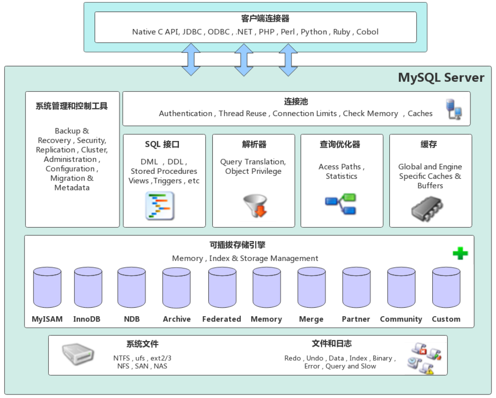
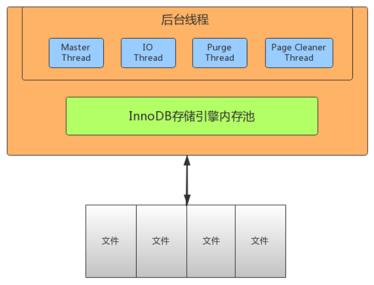
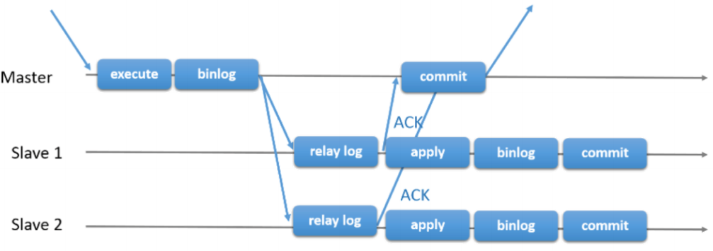
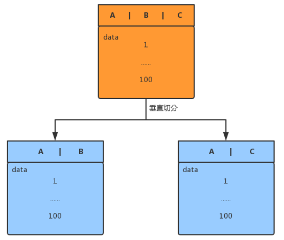
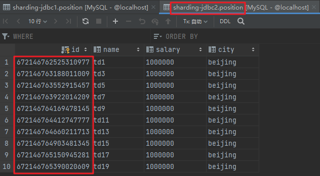

> 当前位置：【Java】05_Database（数据库）-> 5.1_MySQL

# MySQL 下载安装和配置


## 0、MySQL的下载

### 下载地址

- https://downloads.mysql.com/archives/community/


### 图形化界面工具

- 软件1：MySQLWorkBench

  https://dev.mysql.com/downloads/workbench/

- 软件2：Navicat（Win/Mac）

- 软件3：SQLyog（Win）


## 1、Docker - MySQL安装和配置

### 1.1 Docker-MySQL 官网地址

https://hub.docker.com/_/mysql


### 1.2 创建单容器

#### 步骤1：拉取镜像

```shell
docker pull mysql:5.7.34
```


#### 步骤2：备份镜像

```shell
cd /docker_data/
docker save mysql:5.7.34 -o mysql.5.7.34.tar
```


#### 步骤3：导入镜像

```shell
docker load -i mysql.5.7.34.tar
```


#### 步骤4：创建并运行容器

##### （1）使用命令

```shell
# --restart always：容器退出时总是重启
# --privileged=true：特权模式，不受限制地访问任何自己的系统调用，给容器提供了几乎所有主机（作为root）可以做的事情的权限
# -e , --env=[]：设置环境变量，容器中可以使用该环境变量

# Linux - 使用默认卷
docker run -itd --name mysql --restart always --privileged=true -p 3306:3306 -e MYSQL_ROOT_PASSWORD=root mysql:5.7.34 --character-set-server=utf8 --collation-server=utf8_general_ci

# Linux - 使用自定义卷挂载
docker run -itd --name mysql --restart always --privileged=true -p 3306:3306 -e MYSQL_ROOT_PASSWORD=root -v /docker_data/mysql:/var/lib/mysql mysql:5.7.34 --character-set-server=utf8 --collation-server=utf8_general_ci

# Mac - 使用自定义卷挂载
docker run -itd --name mysql --restart always --privileged=true -p 3306:3306 -e MYSQL_ROOT_PASSWORD=root -v /Users/td/Documents/03_DevTools/docker_data/mysql:/var/lib/mysql mysql:5.7.34 --character-set-server=utf8 --collation-server=utf8_general_ci

# 查看自定义卷挂载目录
cd /docker_data/
```

##### （2）使用 docker  compose

- TODO


#### 步骤5：进入容器

```shell
docker exec -it mysql bash
```


#### 步骤6：退出容器

```shell
exit
```


### 1.3 创建集群容器

#### （1）使用命令

#### （2）使用 docker  compose


## 2、Linux系统 -  MySQL安装和配置

### 2.1 MySQL 基本信息

```bash
- 安装目录： /usr/local/mysql
- 账户：root
- 密码：root
```


### 2.2  MySQL 安装和配置

- 步骤0：安装前的装备

```bash
- 添加 MySQL 组和 MySQL 用户，用于设置 MySQL 安装目录文件所有者和所属组
groupadd mysql
useradd -r -g mysql mysql

- 查看是否安装Mysql
chkconfig --list mysqld

- 切换到想要保存到的目录
mkdir /usr/local/download 
cd /usr/local/download/
```


- 步骤1：下载 MySQL（一般存放在执行本命令的目录下）

  wget [http://dev.MySQL.com/get/Downloads/MySQL-5.7/mysql-5.7.11-Linux-glibc2.5-x86_64.tar.gz](http://dev.mysql.com/get/Downloads/MySQL-5.7/mysql-5.7.11-Linux-glibc2.5-x86_64.tar.gz)

  

- 步骤2：解压二进制文件，更改 MySQL 目录名称，移动 MySQL 到/usr/local目录下

```bash
tar -zxvf mysql-5.7.11-Linux-glibc2.5-x86_64.tar.gz
mv mysql-5.7.11-linux-glibc2.5-x86_64 mysql
mv mysql /usr/local
```


- 步骤3：更改 MySQL 目录所属的组和用户，更改权限

```bash
cd /usr/local/mysql
chown -R mysql .
chgrp -R mysql .
```


- 步骤4：初始化 MySQL 配置表

```bash
mkdir data
yum -y install libaio.so.*
bin/mysqld --initialize --user=mysql --basedir=/usr/local/mysql --datadir=/usr/local/mysql/data

- 运行完上面3行命令后，此处会生成 MySQL 的密码，记下来
```


- 步骤5：将 MySQL 目录下除了data目录的所有文件，改回root用户所有，MySQL 用户只需作为 mysql/data/ 目录下所有文件的所有者

```bash
chown -R root .
chown -R mysql data
```


- 步骤6：复制配置文件，修改my.cnf关键配置

```bash
cp support-files/my-default.cnf /etc/my.cnf
vi /etc/my.cnf
```


- 步骤7：修改my.cnf内容（按下esc后，输入：wq 退出vim编辑器）

```bash
character-set-server=utf8
basedir = /usr/local/mysql
datadir = /usr/local/mysql/data
port = 3306
socket = /tmp/mysql.sock
```


- 步骤8：创建tmp目录，然后赋予 MySQL 权限

```bash
mkdir tmp
chown -R mysql:mysql tmp
```


- 步骤9：将mysqld服务加入开机自启动项

```bash
cp support-files/mysql.server /etc/init.d/mysql
chmod +x /etc/init.d/mysql
```


- 步骤10：把 MySQL 注册为开机启动的服务

```bash
chkconfig --add mysql
```


- 步骤11：查看是否添加成功

```bash
chkconfig --list mysql

显示结果为以下内容表示添加成功：
mysql 0:off 1:off 2:on 3:on 4:on 5:on 6:off
```


- 步骤12：开机自启，配置环境变量

```bash
（1）进入profile
vi /etc/profile

（2）按i编辑放在最后一行
# mysql
PATH=$PATH:/usr/local/mysql:/usr/local/mysql/bin
export PATH 

（3）退出vim之后，使其修改生效
source /etc/profile

（4）执行完可通过命令查看是否添加成功
echo $PATH
```


- 步骤13：第一次登录并修改密码

```bash
- 启动MySQL
service mysql start

- 登录 MySQL 服务
mysql -uroot -p

- 查看数据库
show databases;

- 使用数据库
use mysql

- 更改密码
alter user 'root'@'localhost' identified by 'tdcj@06300830';
update user set host='%' where user='root';
flush privileges;
```


- 步骤14：添加一个新用户

```bash
- 添加用户
grant all privileges on *.* to 'td'@'%' identified by 'td';
grant all privileges on *.* to 'cj'@'%' identified by 'cj';
grant all privileges on *.* to 'liweifa515'@'%' identified by 'root';
grant all privileges on *.* to 'jianan412'@'%' identified by 'root';

- 选择数据库
use mysql

- 查看用户
select host,user from user;
  +-----------+-----------+
  | host | user |
  +-----------+-----------+
  | % | td |
  | localhost | mysql.sys |
  | localhost | root |
  +-----------+-----------+ 

- 刷新配置
flush privileges;

- 退出mysql
quit
```


- 步骤15：停止firewalld服务（Centos从7开始默认用的是firewalld，这个是基于iptables的，虽然有iptables的核心，但是iptables的服务是没安装的）

```bash
sudo systemctl stop firewalld.service && sudo systemctl disable firewalld.service
```


- 步骤16：使用Navicat登录

```bash
- 用户名：td
- 密码：td
```


### 2.3 MySQL 启动和关闭

```bash
service mysql start
service mysql stop
service mysql restart
```


### 2.4 更改密码

（1）登录MySQL

```
mysql -u 用户名 -p
```

（2）选择数据库

```
use mysql;
```

（3）修改密码

```
set password for 用户名@localhost = password('密码'); 
```

（4）使配置生效

```
flush privileges;
```

（5）退出MySQL

```
quit;
```


### 2.5 root账户被删时，修改密码

（1）修改配置文件my.cnf

```
vim /etc/my.cnf
```

（2）在配置文件[mysqld]下添加语句，启动 MySQL 服务的时候跳过权限表认证

```
skip-grant-tables
```

（3）重启MySQL

```
service mysql restart
```

（4）用空密码的root 用户连接到MySQL

```
mysql -u root -p
```

（6）使用下列命令添加root账户

```mysql
use mysql;

insert into user set user='root',ssl_cipher='',x509_issuer='',x509_subject='';

flush privileges;

GRANT ALL PRIVILEGES ON *.* TO 'root'@'localhost' IDENTIFIED BY 'tdcj@06300830' WITH GRANT OPTION; 

flush privileges;
```

（7）查看root账户的权限（xxx_priv：Y表示成功）

```
select * from mysql.user where user='root'\G;
```

（8）修改配置文件my.cnf

```
vim /etc/my.cnf
```

（8）在配置文件[mysqld]下注释语句

```
#skip-grant-tables
```

（10）重启MySQL

```
service mysql restart
```


## 3、Win系统 -  MySQL安装和配置

### 3.1 MySQL 基本信息

```bash
- 安装目录：E:\06_study\MySQL_5.7.19
- 账户：root
- 密码：root
```


### 3.2 MySQL 配置 （cmd命令窗口下执行）

- 步骤1：配置环境变量

```java
MYSQL_HOME=D:\06_DevSoft\MySQL_5.7.19\
Path=%MYSQL_HOME%\bin;
```


- 步骤2：在安装目录的<span style='color:red'>根目录</span>下创建目录 data
  D:\06_DevSoft\MySQL_5.7.19\data


- 步骤3：修改安装目录下的 my.ini 中的路径（有的版本没有就直接创建该文件）

```bash
####################配置文件开始###################
[client]
default-character-set = utf8

[mysql]
default-character-set = utf8

[mysql.server]
default-character-set = utf8

[mysqld_safe]
default-character-set = utf8

[mysqld]
port=3306
basedir  ="D:/06_DevSoft/MySQL_5.7.19"
datadir  ="D:/06_DevSoft/MySQL_5.7.19/data"
tmpdir   ="D:/06_DevSoft/MySQL_5.7.19/data"
socket   ="D:/06_DevSoft/MySQL_5.7.19/mysql.sock"
log-error="D:/06_DevSoft/MySQL_5.7.19/data/mysql_error.log"
character-set-server=utf8 
collation-server=utf8_general_ci 

#server_id = 2

#skip-locking
max_connections=100
table_open_cache=256
query_cache_size=1M

tmp_table_size=32M
thread_cache_size=8

default-storage-engine=InnoDB
innodb_data_home_dir="D:/06_DevSoft/MySQL_5.7.19/data/"
innodb_flush_log_at_trx_commit =1
innodb_log_buffer_size=128M
innodb_buffer_pool_size=128M
innodb_log_file_size=10M
innodb_thread_concurrency=16
innodb-autoextend-increment=1000
join_buffer_size = 128M
sort_buffer_size = 32M
read_rnd_buffer_size = 32M
max_allowed_packet = 32M
explicit_defaults_for_timestamp=true
sql-mode="STRICT_TRANS_TABLES,NO_AUTO_CREATE_USER,NO_ENGINE_SUBSTITUTION"
sql_mode=NO_ENGINE_SUBSTITUTION,STRICT_TRANS_TABLES
####################配置文件结束###################
```


- 步骤4：在命令行中安装MySQL

```bash
# 切换目录
cd D:/06_DevSoft/MySQL_5.7.19/bin

# 初始化mysql
mysqld --initialize-insecure --user=mysql

# 执行安装mysql（安装成功显示Service successfully installed.）
mysqld install
```


- 步骤5：首次启动登录设置

```bash
# 启动mysql服务
net start mysql

# 登录mysql（第一次登录没有密码，直接回车）
mysql -u root -p

# 设置密码
set password for root@localhost = password('root');
set password for td@localhost = password('td');

# 刷新配置
flush privileges;
```


- 步骤6：设置开机自启

```bash
# 切换到bin目录
ccd D:\06_DevSoft\MySQL_5.7.19\bin

# 执行命令
mysqld -nt --install
```


### 3.3 MySQL 启动和关闭

```bash
# 数据库的启动
cd D:\06_DevSoft\MySQL_5.7.19\bin
net start mysql

# 数据库的关闭
cd E:\06_study\MySQL_5.7.19\bin
net stop mysql
```


## 4、Mac系统 -  MySQL安装和配置

### 4.1 MySQL 基本信息

```bash
# 安装目录：/usr/local/
账户：root
密码：root
```


### 4.2 修改MySQL默认密码

- 步骤1：Mac系统 -> 系统偏好设置 -> mysql -> 在弹出页面中点击stop mysql server，关闭mysql服务

```bash
sudo /usr/local/mysql/support-files/mysql.server start
sudo /usr/local/mysql/support-files/mysql.server stop
sudo /usr/local/mysql/support-files/mysql.server restart
```

- 步骤2：进入终端，获取管理员权限

```bash
cd /usr/local/mysql/bin/
sudo s:u
```

- 步骤3：禁止mysql验证功能（回车后，mysql会自动重启，偏好设置中mysql的状态会变成running）

```bash
./mysqld_safe --skip-grant-tables &
```

- 步骤4：刷新配置

```bash
./mysql
FLUSH PRIVILEGES;
```

- 步骤5：修改密码

```bash
SET PASSWORD FOR 'root'@'localhost' = PASSWORD('你的新密码’);
```


### 4.3 解决MySQL和navicat下，表的中文乱码问题

- 步骤1：将安装目录下的my.cnf复制到 /etc文件夹下，开始编辑

```bash
vim /etc/my.cnf
```

- 步骤2：复制以下内容到my.cnf文件（esc保存文件，:wq退出vim）

```bash
# Example MySQL config file for medium systems. 
# 
# This is for a system with little memory (32M - 64M) where MySQL plays 
# an important part, or systems up to 128M where MySQL is used together with 
# other programs (such as a web server) 
# 
# MySQL programs look for option files in a set of 
# locations which depend on the deployment platform. 
# You can copy this option file to one of those 
# locations. For information about these locations, see: 
# http://dev.mysql.com/doc/mysql/en/option-files.html
# 
# In this file, you can use all long options that a program supports. 
# If you want to know which options a program supports, run the program 
# with the "--help" option. 
# The following options will be passed to all MySQL clients 
[client]
default-character-set=utf8
#password = your_password 
port = 3306 
socket = /tmp/mysql.sock 
# Here follows entries for some specific programs 
# The MySQL server 
[mysqld]
character-set-server=utf8
init_connect='SET NAMES utf8
port = 3306 
socket = /tmp/mysql.sock 
skip-external-locking 
key_buffer_size = 16M 
max_allowed_packet = 16M 
table_open_cache = 64 
sort_buffer_size = 512K 
net_buffer_length = 8K 
read_buffer_size = 256K 
read_rnd_buffer_size = 512K 
myisam_sort_buffer_size = 8M 
character-set-server=utf8 
init_connect='SET NAMES utf8' 
# Don't listen on a TCP/IP port at all. This can be a security enhancement, 
# if all processes that need to connect to mysqld run on the same host. 
# All interaction with mysqld must be made via Unix sockets or named pipes. 
# Note that using this option without enabling named pipes on Windows 
# (via the "enable-named-pipe" option) will render mysqld useless! 
# 
#skip-networking

# Replication Master Server (default) 
# binary logging is required for replication 
log-bin=mysql-bin

# binary logging format - mixed recommended 
binlog_format=mixed

# required unique id between 1 and 2^32 - 1 
# defaults to 1 if master-host is not set 
# but will not function as a master if omitted 
server-id = 1

# Replication Slave (comment out master section to use this) 
# 
# To configure this host as a replication slave, you can choose between 
# two methods : 
# 
# 1) Use the CHANGE MASTER TO command (fully described in our manual) - 
# the syntax is: 
# 
# CHANGE MASTER TO MASTER_HOST=<host>, MASTER_PORT=<port>, 
# MASTER_USER=<user>, MASTER_PASSWORD=<password> ; 
# 
# where you replace <host>, <user>, <password> by quoted strings and 
# <port> by the master's port number (3306 by default). 
# 
# Example: 
# 
# CHANGE MASTER TO MASTER_HOST='125.564.12.1', MASTER_PORT=3306, 
# MASTER_USER='joe', MASTER_PASSWORD='secret'; 
# 
# OR 
# 
# 2) Set the variables below. However, in case you choose this method, then 
# start replication for the first time (even unsuccessfully, for example 
# if you mistyped the password in master-password and the slave fails to 
# connect), the slave will create a master.info file, and any later 
# change in this file to the variables' values below will be ignored and 
# overridden by the content of the master.info file, unless you shutdown 
# the slave server, delete master.info and restart the slaver server. 
# For that reason, you may want to leave the lines below untouched 
# (commented) and instead use CHANGE MASTER TO (see above) 
# 
# required unique id between 2 and 2^32 - 1 
# (and different from the master) 
# defaults to 2 if master-host is set 
# but will not function as a slave if omitted 
#server-id = 2 
# 
# The replication master for this slave - required 
#master-host = <hostname> 
# 
# The username the slave will use for authentication when connecting 
# to the master - required 
#master-user = <username> 
# 
# The password the slave will authenticate with when connecting to 
# the master - required 
#master-password = <password> 
# 
# The port the master is listening on. 
# optional - defaults to 3306 
#master-port = <port> 
# 
# binary logging - not required for slaves, but recommended 
#log-bin=mysql-bin

# Uncomment the following if you are using InnoDB tables 
#innodb_data_home_dir = /usr/local/mysql/data 
#innodb_data_file_path = ibdata1:10M:autoextend 
#innodb_log_group_home_dir = /usr/local/mysql/data 
# You can set .._buffer_pool_size up to 50 - 80 % 
# of RAM but beware of setting memory usage too high 
#innodb_buffer_pool_size = 16M 
#innodb_additional_mem_pool_size = 2M 
# Set .._log_file_size to 25 % of buffer pool size 
#innodb_log_file_size = 5M 
#innodb_log_buffer_size = 8M 
#innodb_flush_log_at_trx_commit = 1 
#innodb_lock_wait_timeout = 50

[mysqldump] 
quick 
max_allowed_packet = 16M

[mysql] 
no-auto-rehash 
# Remove the next comment character if you are not familiar with SQL 
#safe-updates 
default-character-set=utf8

[myisamchk] 
key_buffer_size = 20M 
sort_buffer_size = 20M 
read_buffer = 2M 
write_buffer = 2M

[mysqlhotcopy] 
interactive-timeout
```

- 步骤3：进入MySQL数据库，输入电脑密码

```bash
mysql -u root -p
```

- 步骤4：在MySQL的数据库界面，使用数据库

```bash
USE 数据库名;
```

- 步骤5：选择表
- 步骤6：查看该表字符集

```bash
show variables like ‘%char%’;
```


## 5、报错集锦

### 5.1 导入数据报错，2006 - MySQL server has gone away

- 问题描述：导入数据报错，2006 - MySQL server has gone away

- 解决方法：更改max_allowed_packet的值（如：max_allowed_packet=16M），然后重启Mysql

```java
- Win系统，在my.ini配置文件中更改（Mysql目录下）
- Mac系统，在my.cnf配置文件中更改（/private/etc/my.cnf）
```


### 5.2  MySQL：ERROR 1040: Too many connections

- 问题描述：连接数满
- 解决方法：修改MySQL配置文件

```shell
Win：安装根目录下 my.ini
Linux：/etc/my.cnf

# MySQL 最大连接数
max_connections=3600
```


### 5.3 java.sql.SQLException: The server time zone value 'xxxx' is unrecognized or represents more than one time zone

- 解决方法：jdbc.properties 文件中 url 后设置时区

```properties
jdbc.url = jdbc:mysql:///JavaWeb_7.1_Mybatis?serverTimezone=UTC
```


# 第一章 MySQL 语法

## 0、约束

### （1）主键约束

```sql
# 约束的作用: 对表中的数据进行进一步的限制，从而保证数据的正确性、有效性、完整性.
# 违反约束的不正确数据，将无法插入到表中

# 主键约束
# 特点：不可重复、唯一、非空
# 作用：用来表示数据库中的每一条记录

# ------------------------------------------------------

# 添加主键约束
#（1）建表时，添加主键约束
# 字段名 字段类型 primary key auto_increment,

# auto_increment：主键自增，字段类型必须是整数类型，默认的开始值是1

# delete 和 truncate 对自增长的影响
# delete：只是删除表中所有数据，对自增没有影响
# truncate：将整个表删除掉，然后创建一个新的表，自增的主键，重新从1开始

# 自定义主键自增的起始值
create table emp2
(
    id   int primary key auto_increment,
    name varchar(20),
    sex  char(1)
) auto_increment = 100;

#（2）建表后，插入主键约束
# alter table 表名 add primary key(主键列名);

# ------------------------------------------------------

# 删除主键约束
# alter table 表名 drop primary key;
```


### （2）非空约束

```sql
# 非空约束
# 特点：某一列不予许为空

# 语法格式
# 字段名 字段类型 not null
```


### （3）唯一约束

```sql
# 唯一约束
# 特点：表中的某一列的值不能重复(对 null 不做唯一的判断)

# 语法格式
# 字段名 字段类型 unique

# 添加唯一约束
create table emp3
(
    id   int primary key auto_increment,
    name varchar(20) unique,
    sex  char(1)
);

#【区别】主键约束与唯一约束
# 主键约束，唯一且不能够为空
# 唯一约束，唯一但是可以为空
# 一个表中只能有一个主键，但是可以有多个唯一约束
```


### （4）外键约束

```sql
# 外键：在从表中与主表的主键对应的那个字段
# 优点：外键约束可以让两张表之间产生一个对应关系，从而保证主从表的引用的完整性

# 创建外键约束
# （1）新建表时添加外键
# constraint 外键约束名称 foreign key(外键字段名) references 主表名(主键字段名)

# （2）已有表添加外键
# alter table 从表 add constraint 外键约束名称 foreign key(外键字段名) references 主表(主键字段名);

# 删除外键约束
# alter table 从表 drop foreign key 外键约束名称;


# 注意事项
# 从表外键类型必须与主表主键类型一致，否则创建失败
# 添加数据时，应该先添加主表中的数据
# 删除数据时，应该先删除从表中的数据
```


### （5）默认值约束

```sql
# 默认值约束
# 用来指定某列的默认值

# 语法格式
# 字段名 字段类型 default 默认值
```


## 1、DDL（数据定义语言）

### 1.1 操作库

#### （1）创建数据库

```mysql
# 创建数据库
# create database 数据库名;
create database if not exists `td_mysql_db` default character set utf8mb4 collate utf8mb4_unicode_ci;
```


#### （2）选择数据库

```mysql
# 选择数据库
# use 数据库名;
use td_mysql_db;
```


#### （3）删除数据库

```mysql
# 删除数据库
# drop database 数据库名;
drop database td_mysql_db;
```


### 1.2 操作表

#### （1）创建表

```mysql
# 创建表
# create table 表名 (列名 列类型);
CREATE TABLE IF NOT EXISTS `tb_admin_info`
(
    `id`          INT PRIMARY KEY AUTO_INCREMENT COMMENT '序号',
    `username`    VARCHAR(20) NOT NULL COMMENT '登录账户',
    `pwd`         VARCHAR(20) NOT NULL COMMENT '密码',
    `sex`         VARCHAR(20) COMMENT '性别',
    `create_user` VARCHAR(20) COMMENT '创建人',
    `create_time` DATE COMMENT '创建时间',
    `update_user` VARCHAR(20) COMMENT '修改人',
    `update_time` TIMESTAMP DEFAULT CURRENT_TIMESTAMP COMMENT '修改时间',
    `effective`   VARCHAR(1) COMMENT '是否有效（1有效 0无效）'
) COMMENT ='管理员信息管理表' ENGINE = InnoDB
                      DEFAULT CHARSET = utf8;
```

- 解析

```sql
- ``用于标注 表名和字段名
- ''用于标注 表和字段的 注释
- COMMENT 用于给表和字段标注注释
- PRIMARY KEY 关键字用于定义列为主键（可以使用多列来定义主键，列间以逗号分隔）
- AUTO_INCREMENT 定义列为自增的属性，一般用于主键，数值会自动加1
- NULL 表示该字段可以为空（默认不写就是为 NULL ）
- NOT NULL 表示该字段不能为空（添加记录时，如果该字段不输入任何数据，为NULL ，会报错）
- ENGINE 设置存储引擎
- CHARSET 设置编码
```


#### （2）修改表

```mysql
zhuyaoshi z# 修改表注释
ALTER TABLE tb_admin_info COMMENT '管理员表';

# 修改列注释
ALTER TABLE tb_admin_info MODIFY COLUMN username VARCHAR(100) COMMENT '用户名';

# 修改列类型（不带注释就会修改为无注释）
ALTER TABLE tb_admin_info MODIFY COLUMN pwd BIGINT;
```


#### （3）删除表

```mysql
# 删除表
# DROP TABLE 数据库名;
DROP TABLE tb_admin_info ;
```


#### （4）复制表

```mysql
#（1）只复制表结构到新表（带字段注释）
# create table 新表 select * from 旧表 where 1=2;
create table tb_admin_info1 select * from tb_admin_info where 1=2;

#（2）只复制表结构到新表（带表注释、字段注释）
# create table 新表 like 旧表;
create table tb_admin_info2 like tb_admin_info;

#（3）复制表结构及数据到新表（带字段注释）
# create table 新表 select * from 旧表;
create table tb_admin_info3 select * from tb_admin_info;

#（4）复制旧表的部分字段到新表（带数据、带字段注释）
# create table 新表 as ( select 旧表字段1, 旧表字段2 from 旧表);
create table tb_admin_info4 as ( select username, pwd from tb_admin_info);

#（5）旧表字段改名到新表（带数据、带字段注释）
# create table 新表 as (select id, 旧表字段1 as 新表字段1, 旧表字段2 as 新表字段2 from 旧表);
create table tb_admin_info5 as (select id, username as username5, pwd as pwd5 from tb_admin_info);

#（6）复制旧表的部分数据到新表（带数据、带字段注释）
# create table 新表 as ( select * from 旧表 where left(字段名,最左边的字符数) = '字段名的值匹配条件');
create table tb_admin_info6 as ( select * from tb_admin_info where left(username,2) = 'td');

# 创建新表的同时定义表中的字段信息（带数据、带字段注释）
create table tb_admin_info7 ( id integer not null auto_increment primary key) as ( select * from tb_admin_info);

```


#### （5）临时表

```
- 临时表只在当前连接可见，当关闭连接时，Mysql 会自动删除表并释放所有空间
- 如果使用了 MySQL 客户端程序连接来创建临时表，那么只有在关闭客户端程序时才会销毁临时表，当然也可以手动销毁

- 临时表在 MySQL 3.23 版本中添加，如果 MySQL 版本低于 3.23 版本就无法使用 MySQL 的临时表
```


```mysql
# 创建临时表 - 通过查询其他表
# create temporary table 临时表名 as (select *  from 旧的表名 limit 0,10000);
create temporary table temp_tb_admin_info as (select *  from tb_admin_info limit 0,10000);

# 查询临时表
select * from temp_tb_admin_info;

# 删除临时表
drop table temp_tb_admin_info;
```


## 2、DML（数据操作语言）

### 2.0 数据类型

#### （1）数值类型

- 严格数值数据类型：INTEGER、SMALLINT、DECIMAL、NUMERIC
- 近似数值数据类型：FLOAT、REAL、DOUBLE、PRECISION

| 类型         | 大小                                     | 范围（有符号）                                               | 范围（无符号）                                               | 用途                |
| ------------ | ---------------------------------------- | ------------------------------------------------------------ | ------------------------------------------------------------ | ------------------- |
| TINYINT      | 1 byte                                   | (-128，127)                                                  | (0，255)                                                     | 小整数值            |
| SMALLINT     | 2 bytes                                  | (-32 768，32 767)                                            | (0，65 535)                                                  | 大整数值            |
| MEDIUMINT    | 3 bytes                                  | (-8 388 608，8 388 607)                                      | (0，16 777 215)                                              | 大整数值            |
| INT或INTEGER | 4 bytes                                  | (-2 147 483 648，2 147 483 647)                              | (0，4 294 967 295)                                           | 大整数值            |
| BIGINT       | 8 bytes                                  | (-9,223,372,036,854,775,808，9 223 372 036 854 775 807)      | (0，18 446 744 073 709 551 615)                              | 极大整数值          |
| FLOAT        | 4 bytes                                  | (-3.402 823 466 E+38，-1.175 494 351 E-38)，<br/>0，<br/>(1.175 494 351 E-38，3.402 823 466 351 E+38) | 0，(1.175 494 351 E-38，3.402 823 466 E+38)                  | 单精度<br/>浮点数值 |
| DOUBLE       | 8 bytes                                  | (-1.797 693 134 862 315 7 E+308，-2.225 073 858 507 201 4 E-308)，<br/>0，<br/>(2.225 073 858 507 201 4 E-308，1.797 693 134 862 315 7 E+308) | 0，(2.225 073 858 507 201 4 E-308，1.797 693 134 862 315 7 E+308) | 双精度<br/>浮点数值 |
| DEC或DECIMAL | 对DECIMAL(M,D) ，如果M>D，为M+2否则为D+2 | 依赖于M和D的值                                               | 依赖于M和D的值                                               | 小数值              |


#### （2）日期/时间类型

- 每个时间类型有一个有效值范围和一个"零"值，当指定不合法的MySQL不能表示的值时使用"零"值
- 特别的：TIMESTAMP类型有专有的自动更新特性

| 类型      | 大小（bytes） | 范围                                                         | 格式                | 用途                     |
| --------- | ------------- | ------------------------------------------------------------ | ------------------- | ------------------------ |
| DATE      | 3             | 1000-01-01/9999-12-31                                        | YYYY-MM-DD          | 日期值                   |
| TIME      | 3             | '-838:59:59'/'838:59:59'                                     | HH:MM:SS            | 时间值或持续时间         |
| YEAR      | 1             | 1901/2155                                                    | YYYY                | 年份值                   |
| DATETIME  | 8             | 1000-01-01 00:00:00/9999-12-31 23:59:59                      | YYYY-MM-DD HH:MM:SS | 混合日期和时间值         |
| TIMESTAMP | 4             | 1970-01-01 00:00:00/2038结束时间是第 **2147483647** 秒，北京时间 **2038-1-19 11:14:07**，格林尼治时间 2038年1月19日 凌晨 03:14:07 | YYYYMMDD HHMMSS     | 混合日期和时间值，时间戳 |


#### （3）字符类型

- char(n) 和 varchar(n) 中括号中 n 代表字符的个数，比如 CHAR(30) 就可以存储 30 个字符

- BLOB 类型：TINYBLOB、BLOB、MEDIUMBLOB、LONGBLOB（区别在于可容纳存储范围不同）
- TEXT 类型：TINYTEXT、TEXT、MEDIUMTEXT、LONGTEXT

| 类型       | 大小                  | 格式       | 用途                            |
| ---------- | --------------------- | ---------- | ------------------------------- |
| CHAR       | 0-255 bytes           | char(n)    | 定长字符串                      |
| VARCHAR    | 0-65535 bytes         | varchar(n) | 变长字符串                      |
| TINYBLOB   | 0-255 bytes           |            | 不超过 255 个字符的二进制字符串 |
| TINYTEXT   | 0-255 bytes           |            | 短文本字符串                    |
| BLOB       | 0-65 535 bytes        |            | 二进制形式的长文本数据          |
| TEXT       | 0-65 535 bytes        |            | 长文本数据                      |
| MEDIUMBLOB | 0-16 777 215 bytes    |            | 二进制形式的中等长度文本数据    |
| MEDIUMTEXT | 0-16 777 215 bytes    |            | 中等长度文本数据                |
| LONGBLOB   | 0-4 294 967 295 bytes |            | 二进制形式的极大文本数据        |
| LONGTEXT   | 0-4 294 967 295 bytes |            | 极大文本数据                    |


### 3.1 插入数据 - 增

```mysql
# 插入数据 - 一条
# insert into 表名 (字段1, 字段2) values (字段1的值, 字段2的值);
insert into tb_admin_info (username, pwd, sex) values ('TD', '123','男');

# 插入数据 - 多条
# insert into 表名 (字段1, 字段2) values (字段1的值, 字段2的值), (字段1的值, 字段2的值) ;
insert into tb_admin_info (username, pwd, sex) values ('TD', '123','男'), ('CJ', '123','男'), ('Jan', '123', '男'), ('Shirley', '123', '女');
```


### 3.2 修改数据 - 改

```sql
# 修改数据
# 不带条件的修改
# update 表名 set 列名 = 值;

# 带条件的修改
# update 表名 set 列名 = 值 where 条件表达式：字段名 = 值;
```


### 3.3 删除数据 - 删

#### （1）单表删除

```sql
# 1、delete 删除整张表的数据，不会释放表所占用的空间，并且操作是可以撤销
# 删除所有数据
# delete from 表名;

# 指定条件 删除数据
# delete from 表名 where 字段名 = 值;

# 2、drop 删除表的结构，以及被依赖的约束(constrain)、触发器(trigger)、索引(index)
# drop table 数据库名;
drop table tb_admin_info ;

# 判断表是否存在， 存在的话就删除,不存在就不执行删除
drop table if exists tb_admin_info;

# 3、truncate 删除内容、释放空间但不删除表的结构(定义)
# truncate table 表名;


# 注意
# truncate 只能对table
# delete 可以是 table 和 view
# 执行速度：drop > truncate > delete
```

#### （2）级联删除

```sql
# 级联删除：删除主表数据的同时，也删除掉从表数据

# 在建表的时候，添加级联删除（ON DELETE CASCADE）
CREATE TABLE employee
(
    eid     INT PRIMARY KEY AUTO_INCREMENT,
    ename   VARCHAR(20),
    age     INT,
    dept_id INT,
    CONSTRAINT emp_dept_fk FOREIGN KEY (dept_id) REFERENCES department (id)
        ON DELETE CASCADE -- 添加级联删除
);
```


## 3、DQL（数据查询语言）

### 3.1 操作数据（单表查询）

#### （1）简单查询

```sql
# 查询表的所有数据
# select * from 表名;
select * from tb_admin_info;

# 查询表字段数据
# select 字段1,字段2,字段3 from 表名;
select id,username,pwd,create_user,create_time,update_user,update_time,effective from tb_admin_info;

# 别名查询
select id, username as '用户名', pwd as '密码' from tb_admin_info;

# 去重查询 distinct
select distinct username from tb_admin_info;

# 运算查询 (查询结果参与运算)
select id + 1, username from tb_admin_info;

# 获取最近的 id 值
#（1）查询和插入所使用的Connection对象必须是同一个才可以，否则返回值是不可预料的
#（2）LAST_INSERT_ID 是与table无关的，如果向表a插入数据后，再向表b插入数据，LAST_INSERT_ID返回表b中的Id值
#（3）假如你使用一条INSERT语句插入多个行，  LAST_INSERT_ID() 只返回插入的第一行数据时产生的值
#（4）假如你使用 INSERT IGNORE而记录被忽略，则AUTO_INCREMENT 计数器不会增量，而 LAST_INSERT_ID() 返回0, 这反映出没有插入任何记录。
select last_insert_id();
```


#### （2）条件查询（Where）

| 操作符 | 描述                                           |
| ------ | ---------------------------------------------- |
| =      | 等号，检测两个值是否相等                       |
| <>, != | 不等于，检测两个值是否相等                     |
| >      | 大于号，检测左边的值是否大于右边的值           |
| <      | 小于号，检测左边的值是否小于右边的值           |
| >=     | 大于等于号，检测左边的值是否大于或等于右边的值 |
| <=     | 小于等于号，检测左边的值是否小于或等于右边的值 |

```mysql
# 1、比较运算符
#（1） >    <     >=      <=     =    <>    !=
#    大于、小于、大于等于、小于等于、等于、不等于、不等于

#（2）between ... and ... 在某一区间的值
# select * from 表名 where 字段 between xx and xx;

#（3）in 集合表示多个值，使用逗号分隔，in中的每个数据都会作为一次条件，只要满足条件就会显示
# select * from 表名 where 字段 in ('xx','xx');

#（4）Like子句 - 模糊查询
# select * from 表名 where 条件1 like '%值%';
select * from tb_admin_info where username like '%T%'; -- 查看包含T的
select * from tb_admin_info where username like 'T%';  -- 查询 T 开头的
select * from tb_admin_info where username like '%T';  -- 查询 T 结尾的
select * from tb_admin_info where username like 'T';   -- 查询值为 T 的

# select * from 表名 where 条件1 like '_值_';
select * from tb_admin_info where username like '_t_';    -- 该值有三位且中间字母是 t 的
select * from tb_admin_info where username like '_t';     -- 该值有两位且结尾字母是 t 的
select * from tb_admin_info where username like 't_';     -- 该值有两位且开头字母是 t 的

#（5）查询某一列为 NULL 的值
# select * from 表名 where 字段 is null;
select * from tb_admin_info where effective is null;


# 2、逻辑运算符
#（1）多个条件同时成立（and 或者 &&）
# select * from 表名 where 条件1 = '值' and 条件2 = '值';
select * from tb_admin_info where username = 'TD' and pwd = '123';
# select * from 表名 where 条件1 = '值' && 条件2 = '值';
select * from tb_admin_info where username = 'TD' && pwd = '123';

#（2）多个条件任一成立（or 或者 ||）
# select * from 表名 where 条件1 = '值' or 条件2 = '值';
select * from tb_admin_info where username = 'TD' or username = 'CJ';
# select * from 表名 where 条件1 = '值' || 条件2 = '值';
select * from tb_admin_info where username = 'TD' || username = 'CJ';

#（3）不成立，取反（not）
select * from tb_admin_info where username not in ('TD');
select * from tb_admin_info where id not between 2 and 3;
```


#### （3）排序查询（Order by）

```sql
# asc：升序（默认，可以省略不写）
# desc：降序

# 1、单列排序：只按照某一个字段进行排序
# select 字段1, 字段2 from 表名1, 表名2 order by 字段1, 字段2;
select * from tb_admin_info order by username ;

# select 字段1, 字段2 from 表名1, 表名2 order by 字段1, 字段2 asc;
select * from tb_admin_info order by username asc ;

# select 字段1, 字段2 from 表名1, 表名2 order by 字段1, 字段2 desc;
select * from tb_admin_info order by username desc ;

# 2、组合排序：同时对多个字段进行排序, 如果第一个字段相同 就按照第二个字段进行排序,以此类推
select * from tb_admin_info order by username desc, id desc ;

# ---------------------------------------------------------------------------------

#【待验证】拼音排序：如果字符集采用的是 gbk(汉字编码字符集)，直接在查询语句后边添加 ORDER BY
select * from tb_admin_info order by username desc ;

#【待验证】拼音排序：如果字符集采用的是 utf8(万国码)，需要先对字段进行转码然后排序
select * from tb_admin_info order by CONVERT(username using gbk) desc ;
```


#### （4）聚合函数

```sql
# select 聚合函数(字段名) from 表名;

# count(字段) 统计指定列不为NULL的记录行数
# sum(字段)   计算指定列的数值和
# max(字段)   计算指定列的最大值
# min(字段)   计算指定列的最小值
# avg(字段)   计算指定列的平均值

# -----------------------------------------------------

# 1、count(字段) 统计指定列不为NULL的记录行数
#（1）1与 * 效果一样
select COUNT(1) from tb_admin_info;
select COUNT(*) from tb_admin_info;

#（2）统计表中某个字段的记录条数
select COUNT(username) from tb_admin_info;

#（3）count函数忽略了空值，所以使用时注意不要使用带有null的列进行统计
```


#### （5）分组查询

```sql
# 分组查询：使用 group by 语句,对查询的信息进行分组,相同数据作为一组（一般和聚合函数一起使用）
# select 分组字段/聚合函数 from 表名 group by 分组字段 [having 条件];

select sex from tb_admin_info group by sex;
select count(sex),sex from tb_admin_info group by sex;

# 在分组后，对数据进行过滤，使用关键字 having，作用类似于where条件
# 查询平均薪资大于6000的部门
# select dept_name, avg(salary)
# from emp
# where dept_name is not null
# group by dept_name
# having avg(salary) > 6000;

# ---------------------------------------------------------
#【区别】where 与 having
# where 进行分组前的过滤
# where 后面不能写聚合函数

# having 是分组后的过滤
# having 后面可以写聚合函数
```


（6）限制查询（Limit）

```sql
# 通过 limit 指定查询多少行数据，限制返回的查询结果的行数

# 参数说明
# select * : 返回所有记录
# limit N : 返回 N 条记录
# offset M : 起始行数, 从0开始记数, 如果省略，则默认为0
# limit N,M : 相当于 limit M offset N , 从第 N 条记录开始, 返回 M 条记录

# select 字段1,字段2 from 表名 where 条件1,条件2 order by 字段3,字段4 desc limit n offset m ;
# select 字段1,字段2 from 表名 where 条件1,条件2 order by 字段3,字段4 desc limit n, m ;

# 查询前5条
select * from tb_admin_info limit 0,5;

# 从第4条开始,查询6条
select * from tb_admin_info limit 3,6;

# 分页公式：起始索引 = (当前页 - 1) * 每页条数
# 每页显示3条数据
select * from tb_admin_info limit 0,3;  -- 第 1 页
select * from tb_admin_info limit 3,3;  -- 第 2 页
select * from tb_admin_info limit 6,3;  -- 第 3 页
```


### 3.2 操作数据（多表查询）

- 内连接：inner join，只获取两张表中，交集部分的数据.
- 左外连接：left join，以左表为基准，查询左表的所有数据，以及与右表有交集的部分
- 右外连接：right join，以右表为基准，查询右表的所有的数据，以及与左表有交集的部分

#### （1）交叉连接查询（笛卡尔积）

```sql
# 交叉连接查询，会产生笛卡尔积，得到2个表的数据的乘积
# select 字段名 from 表1, 表2;
```

#### （2）内连接查询

```sql
# 内连接的特点：通过指定的条件去匹配两张表中的数据，匹配上就显示，匹配不上就不显示
# 比如通过: 从表的外键 = 主表的主键 方式去匹配

# -------------------------------------------------------------------

# 隐式内连接
# from子句后面直接写 多个表名 使用where指定连接条件
# select 字段名 from 左表, 右表 where 连接条件;

# 查询所有商品信息和对应的分类信息
# select * from products,category where category_id = cid;

# -------------------------------------------------------------------

# 显式内连接
# 使用 inner join ...on（inner 可省略）
# select 字段名 from 左表 inner join 右表 on 条件;

# 查询所有商品信息和对应的分类信息
# select * from products p inner join category c on p.category_id = c.cid;
```

#### （3）外连接查询

```sql
# 左外连接的特点
# 以左表为基准，匹配右边表中的数据，如果匹配的上，就展示匹配到的数据
# 如果匹配不到，左表中的数据正常展示，右边的展示为null

# 使用 left outer join（outer 可以省略）
# select 字段名 from 左表 left outer join 右表 on 条件;
# select * from category c left join products p on c.`cid`= p.`category_id`;

# -------------------------------------------------------------------

# 右外连接的特点
# 以右表为基准，匹配左边表中的数据，如果能匹配到，展示匹配到的数据
# 如果匹配不到，右表中的数据正常展示，左边展示为null

# 使用 right outer join（outer 可以省略）
# select 字段名 from 左表 right outer join 右表 on 条件;
# select * from products p right join category c on p.`category_id` = c.`cid`;
```


#### （4）联合查询（Union）

```sql
# union 左右两边的列的数量要一样，一般是两个表有相同的列
# all: 可选，返回所有结果集，包含重复数据
# distinct: 可选，删除结果集中重复的数据（默认情况下 union 操作符已经删除了重复数据，所以 distinct 修饰符对结果没影响）
# select 字段1, 字段2 from 表1 where 条件1 = '' union/all/distinct select 字段1, 字段2 from 表2 where 条件2 = '';

# union 语句：用于将不同表中相同列中查询的数据展示出来（不包括重复数据）
# select 列名称 from 表名称 union select 列名称 from 表名称 order by 列名称;
select id, username, pwd from tb_admin_info union select id, username, pwd from tb_admin_info order by username;
select id, username, pwd from tb_admin_info union select id, username, pwd from tb_admin_info order by username;

# union all 语句：用于将不同表中相同列中查询的数据展示出来（包括重复数据）
# select 列名称 from 表名称 union all select 列名称 from 表名称 order by 列名称;
select id, username, pwd from tb_admin_info union all select id, username, pwd from tb_admin_info order by username;
```


#### （5）子查询

```sql
# 子查询概念
# 一条select 查询语句的结果，作为另一条 select 语句的一部分

# 子查询的特点
# 子查询必须放在小括号中
# 子查询一般作为父查询的查询条件使用

# 子查询常见分类
# where型子查询：将子查询的结果，作为父查询的比较条件
# from型子查询：将子查询的结果，作为一张表，提供给父层查询使用
# exists型子查询：子查询的结果是单列多行，类似一个数组，父层查询使用 IN 函数，包含子查询的结果

# -------------------------------------------------------------------

# 子查询的结果作为查询条件
# select 查询字段 from 表 where 字段=（子查询）;

# 将最高价格作为条件,获取商品信息
# select * from products where price = (select max(price) from products);

# -------------------------------------------------------------------

# 子查询的结果作为一张表
# 当子查询作为一张表的时候，需要起别名，否则无法访问表中的字段
# select 查询字段 from （子查询）表别名 where 条件;

# select p.`pname`, p.`price`, c.cname
# from products p
#          inner join (select * from category) c on p.`category_id` = c.cid
# where p.`price` > 500;

# -------------------------------------------------------------------


# 子查询总结
# 1. 子查询如果查出的是一个字段(单列)， 那就在where后面作为条件使用
# 2. 子查询如果查询出的是多个字段(多列)，就当做一张表使用(要起别名)
```


## 4、DCL（数据控制语言）

### 4.1 创建用户

#### 方式 1：使用 create user 语句创建用户

```sql
# create user '用户名'@'主机名' identified by '密码';
create user 'td'@'localhost' identified by 'td';

# % 表示用户可以在任意电脑登录 mysql 服务器
create user 'cj'@'%' identified by 'cj';
```

#### 方式 2：使用 insert 语句新建用户

```sql
# 可以使用 insert 语句将用户的信息添加到 mysql.user 表中，但必须拥有对 mysql.user 表的 insert 权限
# 通常 insert 语句只添加 host、user、authentication_string 这3个字段的值
# mysql 5.7+，user 表中的密码字段为authentication_string
# mysql 5.7-，user 表中的密码字段为 password
insert into mysql.user(host, user, authentication_string, ssl_cipher, x509_issuer, x509_subject)
values ('localhost', 'test1', password('test1'), '', '', '');
```

#### 方式 3：使用 grant 语句新建用户

```sql
# 权限：create、alter、select、insert、update（授予所有的权限则使用 all）
# grant 权限 1, 权限 2... on 数据库名.表名 to '用户名'@'主机名' identified by '密码';

# 创建 查询权限 的用户
grant select on *.* to 'test2'@localhost identified by 'test2';
grant select on *.* to 'test3'@'%' identified by 'test3';

# 创建 所有权限 的用户
grant all on *.* to 'test4'@localhost identified by 'test4';
grant all on *.* to 'test5'@'%' identified by 'test5';
```


#### 授权

```sql
# 格式
# GRANT priv_type [(column_list)] ON database.table
# TO user [IDENTIFIED BY [PASSWORD] 'password']
# [, user[IDENTIFIED BY [PASSWORD] 'password']] ...
# [WITH with_option [with_option]...]

# 其中：
# priv_type 参数表示权限类型；
# columns_list 参数表示权限作用于哪些列上，省略该参数时，表示作用于整个表；
# database.table 用于指定权限的级别；
# user 参数表示用户账户，由用户名和主机名构成，格式是“'username'@'hostname'”；
# IDENTIFIED BY 参数用来为用户设置密码；
# password 参数是用户的新密码。

# WITH 关键字后面带有一个或多个 with_option 参数。这个参数有 5 个选项，详细介绍如下：
# GRANT OPTION：被授权的用户可以将这些权限赋予给别的用户；
# MAX_QUERIES_PER_HOUR count：设置每个小时可以允许执行 count 次查询；
# MAX_UPDATES_PER_HOUR count：设置每个小时可以允许执行 count 次更新；
# MAX_CONNECTIONS_PER_HOUR count：设置每小时可以建立 count 个连接;
# MAX_USER_CONNECTIONS count：设置单个用户可以同时具有的 count 个连接。

# MySQL 中可以授予的权限有如下几组：
# 列权限，和表中的一个具体列相关。例如，可以使用 UPDATE 语句更新表 students 中 name 列的值的权限。
# 表权限，和一个具体表中的所有数据相关。例如，可以使用 SELECT 语句查询表 students 的所有数据的权限。
# 数据库权限，和一个具体的数据库中的所有表相关。例如，可以在已有的数据库 mytest 中创建新表的权限。
# 用户权限，和 MySQL 中所有的数据库相关。例如，可以删除已有的数据库或者创建一个新的数据库的权限。

# 在 GRANT 语句中可用于指定权限级别的值有以下几类格式：
# *：表示当前数据库中的所有表。
# *.*：表示所有数据库中的所有表。
# db_name.*：表示某个数据库中的所有表，db_name 指定数据库名。
# db_name.tbl_name：表示某个数据库中的某个表或视图，db_name 指定数据库名，tbl_name 指定表名或视图名。
# db_name.routine_name：表示某个数据库中的某个存储过程或函数，routine_name 指定存储过程名或函数名。
# TO 子句：如果权限被授予给一个不存在的用户，MySQL 会自动执行一条 CREATE USER 语句来创建这个用户，但同时必须为该用户设置密码。
```

#### 权限类型说明（授予数据库权限时）

| 权限名称                       | 对应user表中的字段    | 说明                                                         |
| ------------------------------ | --------------------- | ------------------------------------------------------------ |
| SELECT                         | Select_priv           | 表示授予用户可以使用 SELECT 语句访问特定数据库中所有表和视图的权限。 |
| INSERT                         | Insert_priv           | 表示授予用户可以使用 INSERT 语句向特定数据库中所有表添加数据行的权限。 |
| DELETE                         | Delete_priv           | 表示授予用户可以使用 DELETE 语句删除特定数据库中所有表的数据行的权限。 |
| UPDATE                         | Update_priv           | 表示授予用户可以使用 UPDATE 语句更新特定数据库中所有数据表的值的权限。 |
| REFERENCES                     | References_priv       | 表示授予用户可以创建指向特定的数据库中的表外键的权限。       |
| CREATE                         | Create_priv           | 表示授权用户可以使用 CREATE TABLE 语句在特定数据库中创建新表的权限。 |
| ALTER                          | Alter_priv            | 表示授予用户可以使用 ALTER TABLE 语句修改特定数据库中所有数据表的权限。 |
| SHOW VIEW                      | Show_view_priv        | 表示授予用户可以查看特定数据库中已有视图的视图定义的权限。   |
| CREATE ROUTINE                 | Create_routine_priv   | 表示授予用户可以为特定的数据库创建存储过程和存储函数的权限。 |
| ALTER ROUTINE                  | Alter_routine_priv    | 表示授予用户可以更新和删除数据库中已有的存储过程和存储函数的权限。 |
| INDEX                          | Index_priv            | 表示授予用户可以在特定数据库中的所有数据表上定义和删除索引的权限。 |
| DROP                           | Drop_priv             | 表示授予用户可以删除特定数据库中所有表和视图的权限。         |
| CREATE TEMPORARY TABLES        | Create_tmp_table_priv | 表示授予用户可以在特定数据库中创建临时表的权限。             |
| CREATE VIEW                    | Create_view_priv      | 表示授予用户可以在特定数据库中创建新的视图的权限。           |
| EXECUTE ROUTINE                | Execute_priv          | 表示授予用户可以调用特定数据库的存储过程和存储函数的权限。   |
| LOCK TABLES                    | Lock_tables_priv      | 表示授予用户可以锁定特定数据库的已有数据表的权限。           |
| ALL 或 ALL PRIVILEGES 或 SUPER | Super_priv            | 表示以上所有权限/超级权限                                    |

#### 权限类型说明（授予表权限时）

| 权限名称                       | 对应user表中的字段 | 说明                                                       |
| ------------------------------ | ------------------ | ---------------------------------------------------------- |
| SELECT                         | Select_priv        | 授予用户可以使用 SELECT 语句进行访问特定表的权限           |
| INSERT                         | Insert_priv        | 授予用户可以使用 INSERT 语句向一个特定表中添加数据行的权限 |
| DELETE                         | Delete_priv        | 授予用户可以使用 DELETE 语句从一个特定表中删除数据行的权限 |
| DROP                           | Drop_priv          | 授予用户可以删除数据表的权限                               |
| UPDATE                         | Update_priv        | 授予用户可以使用 UPDATE 语句更新特定数据表的权限           |
| ALTER                          | Alter_priv         | 授予用户可以使用 ALTER TABLE 语句修改数据表的权限          |
| REFERENCES                     | References_priv    | 授予用户可以创建一个外键来参照特定数据表的权限             |
| CREATE                         | Create_priv        | 授予用户可以使用特定的名字创建一个数据表的权限             |
| INDEX                          | Index_priv         | 授予用户可以在表上定义索引的权限                           |
| ALL 或 ALL PRIVILEGES 或 SUPER | Super_priv         | 所有的权限名                                               |

#### 权限类型说明（授予列权限时）

```
权限类型的值只能指定为 SELECT、INSERT 和 UPDATE，同时权限的后面需要加上列名列表 column-list
```


### 4.2 查看用户

```sql
# 查看所有用户信息和权限
select * from mysql.user;

# 查看某个用户的权限信息
# show grants for '用户名'@'主机名/主机ip';
show grants for 'root'@'localhost';
```


### 4.3 修改用户

```sql
# rename user <旧用户> to <新用户>
# 必须拥有 mysql 数据库的 update 权限或全局 create user 权限
rename user 'test1'@'localhost' to 'test2'@'localhost';
```


### 4.4 删除用户

```sql
# 使用 drop user 语句删除普通用户
# drop user '用户名'@'主机名';

# 使用 delete 语句删除普通用户
# delete from mysql.user where host='主机名' and user='用户名';
```


## 5、索引

### 5.1 创建索引

#### （1）普通索引（index）

- 基于普通字段建立的索引，没有任何限制
- 加快对数据的访问速度
- 最经常出现在查询条件（where column=）或排序条件（orderby column）中的数据列创建索引

```mysql
# 方式1：使用create index 语句创建，在已有的表上创建索引
# create index 索引名 on 表名(列名[长度])
create index username on tb_admin_info(username);

# 方式2：修改表结构添加索引
# alter table 表名 add index 索引名 (列名);
alter table tb_admin_info add index username (username);
alter table tb_admin_info add index (pwd);
```


#### （2）唯一索引（unique）

- 与"普通索引"类似，不同的就是：索引字段的值必须唯一，但允许有空值 
- 在创建或修改表时追加唯一约束，就会自动创建对应的唯一索引，唯一索引可以保证数据记录的唯一性

- 特点：索引列的所有值都只能出现一次，必须唯一

```mysql
# 方式1：创建表的时候直接添加主键索引
# create table 表名(
#     列名 类型(长度),
#     unique [索引名称] (列名)
# );

# 方式2：使用create语句创建，在已有的表上创建索引
# create unique index 索引名 on 表名(列名(长度));

# 方式3：修改表结构添加索引
# alter table 表名 add unique (列名);
```


#### （3）主键索引 (primary key)

- 主键是一种特殊唯一性索引，不允许有空值
- 一个表可以没有主键，但最多只能有一个主键，并且主键值不能包含NULL
- 在创建或修改表时追加主键约束即可，每个表只能有一个主键，用于标识数据表中的某一条记录
- 索引文件存在.ibd文件中

```mysql
# 方式1：创建表的时候直接添加主键索引 (最常用)
# create table 表名(
#     字段名 类型 primary key,
# );

# 方式2：修改表结构，添加主键索引
# alter table 表名 add primary key (列名);
```


#### （4）复合索引

- 单一索引是指索引列为一列的情况，即新建索引的语句只实施在一列上
- 用户可以在多个列上建立索引，这种索引叫做组复合索引（组合索引）
- 复合索引可以代替多个单一索引，相比多个单一索引复合索引所需的开销更小。
- 索引同时有两个概念叫做窄索引和宽索引

```mysql
- 窄索引是指索引列为1-2列的索引
- 宽索引也就是索引列超过2列的索引

设计索引的一个重要原则就是能用窄索引不用宽索引，因为窄索引往往比组合索引更有效

# 创建复合索引
# create index <索引的名字> on tablename (字段名1，字段名2...);
# alter table tablename add index [索引的名字] (字段名1，字段名2...);
# create table tablename ( [...], index [索引的名字] (字段名1，字段名2...) );
```

- 复合索引使用注意事项

```mysql
何时使用复合索引？
- 要根据where条件建索引，注意不要过多使用索引，过多使用会对更新操作效率有很大影响。

如果表已经建立了(col1，col2)，就没有必要再单独建立（col1）
如果现在有(col1)索引，如果查询需要col1和col2条件，可以建立(col1,col2)复合索引，对于查询有一定提高

复合索引字段是有顺序的，在查询使用时要按照索引字段的顺序使用
# 匹配(name,age)组合索引，不匹配(age,name)
select * from user wherename=xx and age=xx
```


#### （5）全文索引

- 查询操作在数据量比较少时，可以使用like模糊查询，但是对于大量的文本数据检索，效率很低
- 如果使用全文索引，查询速度会比like快很多倍
- 在MySQL 5.6 以前的版本，只有MyISAM存储引擎支持全文索引
- 从MySQL 5.6开始MyISAM和InnoDB存储引擎均支持

```mysql
# 创建全文索引
# create fulltext index <索引的名字> on tablename (字段名);
# alter table tablename add fulltext [索引的名字] (字段名);
# create table tablename ( [...], fulltext key [索引的名字] (字段名) ;

# 查询全文索引
# select * from 表名 where match(全文索引名) against('全文索引字段的值');
select * from user where match(name) against('aaa');
```

- 全文索引使用注意事项

```mysql
- 全文索引必须在字符串、文本字段上建立
- 全文索引字段值必须在最小字符和最大字符之间的才会有效。（innodb：3-84；myisam：4-84）
- 全文索引字段值要进行切词处理，按 syntax 字符进行切割，例如 b+aaa，切分成b和aaa

- 全文索引匹配查询，默认使用的是等值匹配，例如a匹配a，不会匹配ab,ac。如果想匹配可以在布尔模式下搜索 a*
select * from user where match(name) against('a*' in boolean mode);
```


### 5.2 查看索引

```mysql
# 查看索引（key_name 的值）
# show index from 表名;
show index from tb_admin_info;
```


### 5.3 删除索引

```mysql
# alter table 表名 drop index 索引名;
alter table tb_admin_info drop index username;

# drop index 索引名 on 表名;
drop index username on tb_admin_info;
```


## 6、序列


## 7、函数

https://www.cnblogs.com/biehongli/p/12389418.html

```sql
length()：mysql里面的length()函数是一个用来获取字符串长度的内置函数。
char_length()：在mysql内置函数里面查看字符串长度的还有一个函数是char_length()。

这两个函数的区别是：
length()： 单位是字节，utf8编码下,一个汉字三个字节，一个数字或字母一个字节。gbk编码下,一个汉字两个字节，一个数字或字母一个字节。
char_length()：单位为字符，不管汉字还是数字或者是字母都算是一个字符。


-- 查看某个汉字占多数字节
select length('哈哈') from dual;
```


## 8、视图

### 8.1 视图概述

```
- 视图是一种虚拟表
- 视图建立在已有表的基础上, 视图赖以建立的这些表称为基表
- 向视图提供数据内容的语句为 SELECT 语句, 可以将视图理解为存储起来的 SELECT 语句. 4. 视图向用户提供基表数据的另一种表现形式
```


### 8.2 视图作用

- 权限控制时可以使用

```
- 比如,某几个列可以运行用户查询,其他列不允许,可以开通视图查询特定的列,起到权限控制的作用
```

- 简化复杂的多表查询

```
- 视图主要就是为了简化多表的查询
- 视图本身就是一条查询SQL,可以将一次复杂的查询构建成一张视图,用户只要查询视图就可以获取想要得到的信息(不需要再编写复杂的SQL)
```


### 8.3 视图的使用

#### （1）创建视图

```mysql
# 参数解析
# view：表示视图
# 视图名称在数据库中必须是唯一的，不能与其他表或视图同名
# column_list：可选参数，表示属性清单，指定视图中各个属性的名称，默认情况下，与SELECT语句中查询 的属性相同
# as：表示视图要执行的操作
# select语句：向视图提供数据内容

# 格式
# create view 视图名 [column_list] as select语句;

create view products_category_view as
select *
from products p
         left join category c on p.`category_id` = c.`cid`;
```

#### （2）查看视图

```mysql
# describe 视图名;
# desc 视图名;
```

#### （3）查询视图

```mysql
# 查询视图，当做一张只读的表操作就可以
# select * from 视图名;
```

#### （4）修改视图

```mysql
# alter view <视图名> as <select语句>;
```

#### （5）删除视图

```mysql
# drop view 视图名;
# drop view 视图名1, 视图名2;
```


### 8.4【区别】视图与表

```
- 视图是建立在表的基础上，表存储数据库中的数据，而视图只是做一个数据的展示
- 通过视图不能改变表中数据（一般情况下视图中的数据都是表中的列经过计算得到的结果,不允许更新）
- 删除视图，表不受影响，而删除表，视图不再起作用
```


## 9、存储过程

### 9.1 存储过程概述

```
- MySQL 5.0 版本开始支持存储过程
- 存储过程（Stored Procedure）是一种在数据库中存储复杂程序，以便外部程序调用的一种数据库对象
- 存储过程是为了完成特定功能的SQL语句集，经编译创建并保存在数据库中，用户可通过指定存储过程的名字并给定参数(需要时)来调用执行
- 存储过程其实就是一堆 SQL 语句的合并，中间加入了一些逻辑控制
```


### 9.2 存储过程优缺点

```
优点:
- 存储过程一旦调试完成后，就可以稳定运行（前提是业务需求要相对稳定，没有变化）
- 存储过程减少业务系统与数据库的交互，降低耦合，数据库交互更加快捷（应用服务器与数据库服务器不在同一个地区）

缺点:
- 在互联网行业中，大量使用MySQL，MySQL的存储过程与Oracle的相比较弱，所以较少使用，并且互联网行业需求变化较快也是原因之一
- 尽量在简单的逻辑中使用，存储过程移植十分困难，数据库集群环境，保证各个库之间存储过程变更一致也十分困难。
- 阿里的代码规范里也提出了禁止使用存储过程，存储过程维护起来的确麻烦
```


### 9.3 存储过程的创建方式

- 数据准备

```sql
# 商品表
create table goods
(
    gid  int,
    name varchar(20),
    num  int -- 库存
);

# 订单表
create table orders
(
    oid   int,
    gid   int,
    price int -- 订单价格
);

# 向商品表中添加3条数据
insert into goods values (1, '奶茶', 20);
insert into goods values (2, '绿茶', 100);
insert into goods values (3, '花茶', 25);
```

#### 方式 1：简单存储过程

```sql
-- 声明语句结束符，可以自定义 一般使用$$
delimiter $$
-- 声明存储过程
create procedure 过程名称()
-- 开始编写存储过程
begin
    -- 要执行的操作
-- 存储过程结束
end $$

# 例子
# 查询所有商品数据
delimiter $$
create procedure goods_proc()
begin
    select * from goods;
end $$

# 调用存储过程
# call 存储过程名

# 查询goods表所有数据
call goods_proc;
```

#### 方式 2：创建接收参数的存储过程

```sql
# in 输入参数：表示调用者向存储过程传入值
# create procedure 存储过程名称(in 参数名 参数类型)

# 接收一个商品id, 根据id删除数据
delimiter $$
create procedure goods_proc02(in goods_id int)
begin
    delete from goods where gid = goods_id;
end $$

# 调用存储过程，传递参数
# 删除 id 为2的商品
call goods_proc02(2);
```

#### 方式 3：接收参数插入数据，并返回受影响的行数

```sql
# 变量赋值
# set @变量名=值

# out 输出参数：表示存储过程向调用者传出值
# out 变量名 数据类型

# 向订单表插入一条数据，返回1，表示插入成功
delimiter $$
create procedure orders_proc(in o_oid int, in o_gid int, in o_price int, out out_num int)
begin
    -- 执行插入操作
    insert into orders values (o_oid, o_gid, o_price);
    -- 设置 num 的值为 1
    set @out_num = 1;
    -- 返回 out_num的值
    select @out_num;
end $$

# 调用存储过程插入数据，获取返回值
call orders_proc(1, 2, 30, @out_num);
select * from orders;
```


### 9.4 查看存储过程

```sql
# 查看存储过程的状态
# show procedure status like 存储过程名;
show procedure status like 'goods_proc';
show procedure status like 'goods_proc02';
show procedure status like 'orders_proc';

# 查看存储过程的定义
# show create procedure 存储过程名;
show create procedure goods_proc;
show create procedure goods_proc02;
show create procedure orders_proc;
```


### 9.5 修改存储过程

```sql
# alter procedure 存储过程名 [特征 ...]
```


### 9.6 删除存储过程

```sql
# drop procedure [ if exists ] <过程名>
drop procedure goods_proc;
drop procedure if exists goods_proc02;
```


## 10、触发器

### 10.1 概述

```
- 触发器（trigger）是MySQL提供给程序员和数据分析员来保证数据完整性的一种方法，它是与表事件相关的特殊的存储过程，它的执行不是由程序调用，也不是手工启动，而是由事件来触发，比如当对一个表进行操作（insert，delete， update）时就会激活它执行

- 简单理解: 当执行一条sql语句的时候，这条sql语句的执行会自动去触发执行其他的sql语句

触发器创建的四个要素
1. 监视地点（table） 
2. 监视事件（insert/update/delete） 
3. 触发时间（before/after） 
4. 触发事件（insert/update/delete）
```


### 10.2 创建触发器

#### （1）语法格式

```sql
delimiter $
# 触发器名，在一个数据库中触发器名是唯一的
create trigger trigger_name
    # 触发的时机             监视的事件
    before / after    insert / update / delete
    # 触发器所在的表
    on table_name
    # 行触发器（固定写法，每一行受影响，触发事件都执行）
    for each row
begin
    # 触发事件
end $
```

#### （2）举例

```sql
# 数据准备
# 商品表
create table goods
(
    gid  int,
    name varchar(20),
    num  int -- 库存
);

# 向商品中添加一条数据
insert into goods values(1,'book',40);

# 创建触发器：在下订单的时候，对应的商品的库存量要相应的减少，卖出商品之后减少库存量
delimiter $
# 创建触发器
create trigger t1
    # 指定触发的时机,和要监听的表
    after insert
    # 触发器所在的表
    on orders
    # 行触发器
    for each row
begin
    # 触发后具体要执行的事件：订单+1 库存-1
    update goods set num = num - 1 where gid = 1;
end$
```


### 10.3 查看触发器

```sql
# 查看所有触发器信息
show triggers ;

# 在 triggers 表中查看部分触发器信息
# select * from information_schema.triggers where trigger_name= '触发器名';
select * from information_schema.triggers where trigger_name = 't1';
```


### 10.4 修改触发器

```sql
# 通过删除原触发器，再以相同的名称创建新的触发器
```


### 10.5 删除触发器

```sql
# drop trigger [if exists] [数据库名] <触发器名>
drop trigger td_mysql_db.t1;
drop trigger if exists td_mysql_db.t1;
```


## 11、数据库备份和还原

### 11.1 数据库备份

#### （1）命令行方式

```bash
# 1、进入到 Mysql 安装目录的 bin目录下

# 2、执行备份
# 格式
# mysqldump -u 用户名 -p 密码 数据库 > 文件路径

# 举例：备份 数据库 db2 中的数据到 D 盘的 db2.sql 文件中
mysqldump -uroot -p123456 db2 > D:/db2.sql
```


### 11.2 数据库还原

#### （1）命令行方式

```bash
# 1、登录到 Mysql 数据库

# 2、创建需要还原的 db2 数据库

# 3、选择 db2 数据库
use db2;

# 4、source 备份sql文件的地址
source D:/db2.sql
```


## 12、MySQL 开发规约

### 12.1 建表规约

```mysql
# 1、【强制】表达是与否概念的字段，必须使用 is_xxx 的方式命名，数据类型是 unsigned tinyint（1 表示是，0 表示否）。
select * from A left join B on B.name = A.namewhere B.name is null union all select * from B;

说明：任何字段如果为非负数，必须是 unsigned
注意：POJO 类中的任何布尔类型的变量，都不要加 is 前缀，所以，需要在设置从 is_xxx 到 Xxx 的映射关系。数据库表示是与否的值，使用 tinyint 类型，坚持 is_xxx 的命名方式是为了明确其取值含义与取值范围。
正例：表达逻辑删除的字段名 is_deleted，1 表示删除，0 表示未删除。

# 2、【强制】表名、字段名必须使用小写字母或数字，禁止出现数字开头，禁止两个下划线中间只出现数字。数据库字段名的修改代价很大，因为无法进行预发布，所以字段名称需要慎重考虑。
说明：MySQL 在 Windows 下不区分大小写，但在 Linux 下默认是区分大小写。因此，数据库名、表名、字段名，都不允许出现任何大写字母，避免节外生枝。
正例：aliyun_admin，rdc_config，level3_name
反例：AliyunAdmin，rdcConfig，level_3_name

# 3、【强制】表名不使用复数名词。
说明：表名应该仅仅表示表里面的实体内容，不应该表示实体数量，对应于 DO 类名也是单数形式，符合表达习惯。

# 4、【强制】禁用保留字，如 desc、range、match、delayed 等，请参考 MySQL 官方保留字。

# 5、【强制】主键索引名为 pk字段名；唯一索引名为 uk字段名；普通索引名则为 idx_字段名。
说明：pk_ 即 primary key；uk_ 即 unique key；idx_ 即 index 的简称。

# 6、【强制】小数类型为 decimal，禁止使用 float 和 double。
说明：float 和 double 在存储的时候，存在精度损失的问题，很可能在值的比较时，得到不正确的结果。如果存储的数据范围超过 decimal 的范围，建议将数据拆成整数和小数分开存储。

# 7、【强制】如果存储的字符串长度几乎相等，使用 char 定长字符串类型。

# 8、【强制】varchar 是可变长字符串，不预先分配存储空间，长度不要超过 5000，如果存储长度大于此值，定义字段类型为 text，独立出来一张表，用主键来对应，避免影响其它字段索引效率。

# 9、 【强制】表必备三字段：id, gmt_create, gmt_modified。
说明：
其中 id 必为主键，类型为 bigint unsigned、单表时自增、步长为 1。
gmt_create,gmt_modified 的类型均为 datetime 类型，前者现在时表示主动创建，后者过去分词表示被动更新。

# 10、【推荐】表的命名最好是加上“业务名称_表的作用”。
正例：alipay_task / force_project / trade_config

# 11、【推荐】库名与应用名称尽量一致。

# 12、【推荐】如果修改字段含义或对字段表示的状态追加时，需要及时更新字段注释。

# 13、【推荐】字段允许适当冗余，以提高查询性能，但必须考虑数据一致。冗余字段应遵循：
1）不是频繁修改的字段。
2）不是 varchar 超长字段，更不能是 text 字段。
正例：商品类目名称使用频率高，字段长度短，名称基本一成不变，可在相关联的表中冗余存储类目名称，避免关联查询。

#14、【推荐】单表行数超过 500 万行或者单表容量超过 2GB，才推荐进行分库分表。
说明：如果预计三年后的数据量根本达不到这个级别，请不要在创建表时就分库分表。

# 15、【参考】合适的字符存储长度，不但节约数据库表空间、节约索引存储，更重要的是提升检索速度。
正例：如下表，其中无符号值可以避免误存负数，且扩大了表示范围。
```


### 12.2 索引规约

```mysql
# 1、【强制】业务上具有唯一特性的字段，即使是多个字段的组合，也必须建成唯一索引。
说明：不要以为唯一索引影响了 insert 速度，这个速度损耗可以忽略，但提高查找速度是明显的；另外，即 使在应用层做了非常完善的校验控制，只要没有唯一索引，根据墨菲定律，必然有脏数据产生。

# 2、【强制】三个表以上禁止 join。需要 join 的字段，数据类型必须绝对一致；多表关联查询时，保证被关联的字段需要有索引。
说明：即使双表 join 也要注意表索引、SQL 性能。

# 3、【强制】在 varchar 字段上建立索引时，必须指定索引长度，没必要对全字段建立索引，根据实际文本区分度决定索引长度即可。
说明：索引的长度与区分度是一对矛盾体，一般对字符串类型数据，长度为 20 的索引，区分度会高达 90%以上，可以使用 count(distinct left(列名, 索引长度))/count(*)的区分度来确定。

# 4、【强制】页面搜索严禁左模糊或者全模糊，如果需要请走搜索引擎来解决。
说明：索引文件具有 B-Tree 的最左前缀匹配特性，如果左边的值未确定，那么无法使用此索引。

# 5、【推荐】如果有 order by 的场景，请注意利用索引的有序性。order by 最后的字段是组合索引的一部分，并且放在索引组合顺序的最后，避免出现 file_sort 的情况，影响查询性能。
正例：where a=? and b=? order by c; 索引：a_b_c
反例：索引中有范围查找，那么索引有序性无法利用，如：WHERE a>10 ORDER BY b; 索引a_b 无法排序。

# 6、【推荐】利用覆盖索引来进行查询操作，避免回表。
说明：如果一本书需要知道第 11 章是什么标题，会翻开第 11 章对应的那一页吗？目录浏览一下就好，这个目录就是起到覆盖索引的作用。
正例：能够建立索引的种类分为主键索引、唯一索引、普通索引三种，而覆盖索引只是一种查询的一种效果，用 explain 的结果，extra 列会出现：using index。

# 7、【推荐】利用延迟关联或者子查询优化超多分页场景。
说明：MySQL 并不是跳过 offset 行，而是取 offset+N 行，然后返回放弃前 offset 行，返回N 行，那当 offset 特别大的时候，效率就非常的低下，要么控制返回的总页数，要么对超过特定阈值的页数进行 SQL 改写。
正例：先快速定位需要获取的 id 段，然后再关联：
SELECT a.* FROM 表 1 a, (select id from 表 1 where 条件 LIMIT 100000,20 ) b where a.id=b.id

# 8、【推荐】SQL 性能优化的目标：至少要达到 range 级别，要求是 ref 级别，如果可以是 consts 最好。
说明：
1）consts 单表中最多只有一个匹配行（主键或者唯一索引），在优化阶段即可读取到数据。
2）ref 指的是使用普通的索引（normal index）。
3）range 对索引进行范围检索。
反例：explain 表的结果，type=index，索引物理文件全扫描，速度非常慢，这个 index 级别比较 range 还低，与全表扫描是小巫见大巫。

# 9、【推荐】建组合索引的时候，区分度最高的在最左边
正例：如果 where a=? and b=? ，如果 a 列的几乎接近于唯一值，那么只需要单建 idx_a索引即可。
说明：存在非等号和等号混合时，在建索引时，请把等号条件的列前置。如：where c>? andd=? 那么即使 c 的区分度更高，也必须把 d 放在索引的最前列，即索引 idx_d_c。

# 10、【推荐】防止因字段类型不同造成的隐式转换，导致索引失效。

# 11、 【参考】创建索引时避免有如下极端误解
1）宁滥勿缺。认为一个查询就需要建一个索引。
2）宁缺勿滥。认为索引会消耗空间、严重拖慢更新和新增速度。
3）抵制惟一索引。认为业务的惟一性一律需要在应用层通过“先查后插”方式解决
```


### 12.3 SQL 语句规约

```mysql
# 1、【强制】不要使用 count(列名)或 count(常量)来替代 count()，count()是 SQL92 定义的标准统计行数的语法， 跟数据库无关，跟 NULL 和非 NULL 无关。
说明：count(*)会统计值为 NULL 的行，而 count(列名)不会统计此列为 NULL 值的行。

# 2、【强制】count(distinct col) 计算该列除 NULL 之外的不重复行数，注意 count(distinct col1, col2)如果其中一 列全为 NULL，那么即使另一列有不同的值，也返回为 0。 

# 3、【强制】当某一列的值全是 NULL 时，count(col)的返回结果为 0，但 sum(col)的返回结果为NULL，因此使用 sum()时需注意 NPE (Null Pointer Exception)问题。
正例：可以使用如下方式来避免 sum 的 NPE 问题：SELECT IF(ISNULL(SUM(g)),0,SUM(g))FROM table;

# 4、【强制】使用 ISNULL()来判断是否为 NULL 值。
说明：NULL 与任何值的直接比较都为 NULL。 
1） NULL<>NULL 的返回结果是 NULL，而不是 false。 
2） NULL=NULL 的返回结果是 NULL，而不是 true。 
3） NULL<>1 的返回结果是 NULL，而不是 true。 

# 5、【强制】在代码中写分页查询逻辑时，若 count 为 0 应直接返回，避免执行后面的分页语句。

# 6、【强制】不得使用外键与级联，一切外键概念必须在应用层解决。
说明：以学生和成绩的关系为例，学生表中的 student_id是主键，那么成绩表中的 student_id则为外键。如果更新学生表中的 student_id，同时触发成绩表中的 student_id 更新，即为级联更新。外键与级联更新适用于单机低并发，不适合分布式、高并发集群；级联更新是强阻塞，存在数据库更新风暴的风险；外键影响数据库的插入速度。

# 7、【强制】禁止使用存储过程，存储过程难以调试和扩展，更没有移植性。

# 8、【强制】数据订正（特别是删除、修改记录操作）时，要先 select，避免出现误删除，确认无误才能执行更新 语句。

# 9、【推荐】in 操作能避免则避免，若实在避免不了，需要仔细评估 in 后边的集合元素数量，控制在1000 个之内。

# 10、【参考】如果有国际化需要，所有的字符存储与表示，均以 utf-8 编码，注意字符统计函数的区别。
说明：
SELECT LENGTH("轻松工作")； 返回为 12
SELECT CHARACTER_LENGTH("轻松工作")； 返回为 4
如果需要存储表情，那么选择 utf8mb4 来进行存储，注意它与 utf-8 编码的区别。

# 11、【参考】TRUNCATE TABLE 比 DELETE 速度快，且使用的系统和事务日志资源少，但 TRUNCATE 无事务且不 触发 trigger，有可能造成事故，故不建议在开发代码中使用此语句。
说明：TRUNCATE TABLE 在功能上与不带 WHERE 子句的 DELETE 语句相同
```


### 12.4 ORM 映射规约

```mysql
# 1. 【强制】在表查询中，一律不要使用 * 作为查询的字段列表，需要哪些字段必须明确写明。
说明：
1）增加查询分析器解析成本。
2）增减字段容易与 resultMap 配置不一致。
3）无用字段增加网络消耗，尤其是 text 类型的字段。

# 2. 【强制】POJO 类的布尔属性不能加 is，而数据库字段必须加 is_，要求在 resultMap 中进行字段与属性之间的映射。
说明：参见定义 POJO 类以及数据库字段定义规定，在中增加映射，是必须的。在 MyBatis Generator 生成的代码中，需要进行对应的修改。

# 3. 【强制】不要用 resultClass 当返回参数，即使所有类属性名与数据库字段一一对应，也需要定义；反过来，每一个表也必然有一个 POJO 类与之对应。
说明：配置映射关系，使字段与 DO 类解耦，方便维护。

# 4. 【强制】sql.xml 配置参数使用：#{}，#param# 不要使用${} 此种方式容易出现 SQL 注入。

# 5. 【强制】iBATIS 自带的 queryForList(String statementName,int start,int size)不推荐使用。
说明：其实现方式是在数据库取到statementName对应的SQL语句的所有记录，再通过subList取 start,size 的子集合。
正例：
Map<String, Object> map = new HashMap<>();
map.put("start", start);
map.put("size", size);

# 6. 【强制】不允许直接拿 HashMap 与 Hashtable 作为查询结果集的输出。
说明：resultClass=”Hashtable”，会置入字段名和属性值，但是值的类型不可控。

# 7. 【强制】更新数据表记录时，必须同时更新记录对应的 gmt_modified 字段值为当前时间。

# 8. 【推荐】不要写一个大而全的数据更新接口。传入为 POJO 类，不管是不是自己的目标更新字段，都进行 update table set c1=value1,c2=value2,c3=value3; 这是不对的。执行 SQL时，不要更新无改动的字段，一是易出错；二是效率低；三是增加 binlog 存储。

# 9. 【参考】@Transactional 事务不要滥用。事务会影响数据库的 QPS，另外使用事务的地方需要考虑各方面的回滚方案，包括缓存回滚、搜索引擎回滚、消息补偿、统计修正等。

# 10. 【参考】<isEqual> 中的 compareValue 是与属性值对比的常量，一般是数字，表示相等时带上此条件；
# <isNotEmpty>表示不为空且不为 null 时执行；
# <isNotNull>表示不为 null 值时执行。
```


# 第二章 MySQL 架构原理

## 1、MySQL 简介

- IOE：IBM的服务器，Oracle数据库，EMC存储设备


### 1.1 MySQL 发展历史

- 1985年，ISAM（Index Sequential Access Method）存储引擎被研发

- 1996年，MySQL 1.0 发布
- 1996年10月，MySQL 3.1 发布
- 1999年 - 2000年，MySQL AB 公司成立
- 2000年04月，ISAM 存储引擎升级为 MyISAM 存储引擎，MySQL开源
- 2001年，MySQL 4.0 发布，集成了 InnoDB 存储引擎
- 2005年10月，MySQL 5.0 发布，提供了视图、存储过程等功能
- 2008年01月，MySQL AB 公司被 Sun 公司收购
- 2009年04月，Oracle 收购了 Sun 公司，进入了 Oracle MySQL 时代
- 2010年04月，MySQL 5.5 发布，分为社区版和企业版，InnoDB 成为了默认的存储引擎，增加表分区
- 2013年02月，MySQL 5.6.10 发布（正式版），对 InnoDB 引擎进行改造，提供全文检索能力
- 2015年10月，MySQL 5.7.9 发布（GA正式版）
- 2016年09月，MySQL 8.0 发布（开发班），增加了数据字典、账号权限角色表、InnoDB  增强、JSON 增强等
- 2018年04月，MySQL 8.0.11 发布（GA正式版）


### 1.2 MySQL 分支


## 2、MySQL 应用架构演变

### 阶段1：单机单库

#### （1）方案

```
- 一个简单的小型网站或者应用背后的架构可以非常简单, 数据存储只需要一个 MySQL Instance 就能满足数据读取和写入需求（这里忽略掉了数据备份的实例）
- 处于这个的阶段系统，一般会把所有的信息存到一个 MySQL Instance 里面
```

#### （2）瓶颈

```
- 数据量太大，超出一台服务器承受
- 读写操作量太大，超出一台服务器承受
- 这一台服务器挂了，应用也会挂掉（可用性差）
```


### 阶段2：主从架构

#### （1）方案

```
- 主要解决 架构V1.0 单机单库 下的高可用和读扩展问题
- 通过给 Instance 挂载从库解决读取的压力，主库宕机也可以通过主从切换保障高可用
- 在 MySQL 的场景下就是通过主从结构（双主结构也属于特殊的主从），主库抗写压力，通过从库来分担读压力，对于写少读多的应用，V2.0主从架构完全能够胜任
```

#### （2）瓶颈

```
- 当数据量太大，超出一台服务器承受
- 当写操作太大，超出一台M服务器承受
```


### 阶段3：分库分表

#### （1）方案

```
- 对于 V1.0和V2.0 遇到写入瓶颈和存储瓶颈时，可以通过水平拆分来解决，水平拆分和垂直拆分有较大区别
- 垂直拆分拆完的结果，每一个实例都是拥有全部数据的，而水平拆分之后，任何实例都只有全量的 1/n 的数据
- 以下图所示，将 Userinfo 拆分为 3个Sharding，每个 Sharding 持有总量的 1/3数据，3个Sharding数据的总和等于一份完整数据
```

#### （2）瓶颈

```
- 数据如何路由？（一般可以采用范围拆分，List拆分、Hash拆分等）
- 如何保持数据的一致性也是个难题
```


### 阶段4：云数据库

```
- 对于数据存储的 MySQL来说，如何让其成为一个saas（Software as a Service）是关键点
- MySQL 作为一个 saas 服务，服务提供商负责解决可配置性，可扩展性，多用户存储结构设计等这些疑难问题
```


## 3、MySQL 体系架构



### 3.1 网络连接层

#### （1）客户端连接器（Client Connectors）

- 提供与MySQL服务器建立的支持
- 目前几乎支持所有主流的服务端编程技术，例如常见的 Java、C、Python、.NET等，它们通过各自API技术与MySQL建立连接。


### 3.2 服务层（MySQL Server）

- 服务层是MySQL Server的核心，主要包含系统管理和控制工具、连接池、SQL接口、解析器、查询优化器和缓存六个部分

#### （1）连接池（Connection Pool）

- 负责存储和管理客户端与数据库的连接，一个线程负责管理一个连接。

#### （2）系统管理和控制工具（Management Services & Utilities）

- 例如备份恢复、安全管理、集群管理等

#### （3）SQL接口（SQL Interface）

- 用于接受客户端发送的各种SQL命令，并且返回用户需要查询的结果。
- 比如DML、DDL、存储过程、视图、触发器等。

#### （4）解析器（Parser）

- 负责将请求的SQL解析生成一个"解析树"，然后根据一些MySQL规则进一步检查解析树是否合法。

#### （5）查询优化器（Optimizer）

- 当“解析树”通过解析器语法检查后，将交由优化器将其转化成执行计划，然后与存储引擎交互。

#### （6）缓存（Cache&Buffer）

- 缓存机制是由一系列小缓存组成的。比如表缓存，记录缓存，权限缓存，引擎缓存等。
- 如果查询缓存有命中的查询结果，查询语句就可以直接去查询缓存中取数据。


### 3.3 存储引擎层（Pluggable Storage Engines）

- 存储引擎负责MySQL中数据的存储与提取，与底层系统文件进行交互。
- MySQL存储引擎是插件式的，服务器中的查询执行引擎通过接口与存储引擎进行通信，接口屏蔽了不同存储引擎之间的差异 
- 现在有很多种存储引擎，各有各的特点，最常见的是 MyISAM 和 InnoDB。


#### 3.3.1 存储引擎分类

- 在5.5版本之前默认采用 MyISAM 存储引擎，从5.5开始采用 InnoDB 存储引擎

```mysql
# 查看当前数据库支持的引擎信息
show engines;

（1）InnoDB：支持事务，具有提交，回滚和崩溃恢复能力，事务安全
（2）MyISAM：不支持事务和外键，访问速度快
（3）Memory：利用内存创建表，访问速度非常快，因为数据在内存，而且默认使用Hash索引，但是一旦关闭，数据就会丢失
（4）Archive：归档类型引擎，仅能支持insert和select语句
（5）Csv：以CSV文件进行数据存储，由于文件限制，所有列必须强制指定not null，另外CSV引擎也不支持索引和分区，适合做数据交换的中间表
（6）BlackHole: 黑洞，只进不出，进来消失，所有插入数据都不会保存
（7）Federated：可以访问远端MySQL数据库中的表。一个本地表，不保存数据，访问远程表内容。
（8）MRG_MyISAM：一组MyISAM表的组合，这些MyISAM表必须结构相同，Merge表本身没有数据，对Merge操作可以对一组MyISAM表进行操作
```


#### 3.3.2 存储引擎特性对比


### 3.4 系统文件层（File System）

- 该层负责将数据库的数据和日志存储在文件系统之上，并完成与存储引擎的交互，是文件的物理存储层。

- 主要包含日志文件，配置文件，数据文件，pid 文件，socket 文件等。

  

#### （1）日志文件

```mysql
# 错误日志（Error log）：默认开启
show variables like '%log_error%';

# 通用查询日志（General query log）：记录一般查询语句
show variables like '%general%';

# 二进制日志（binary log）
# 记录了对 MySQL 数据库执行的更改操作，并且记录了语句的发生时间、执行时长；但是它不记录 select、show 等不修改数据库的SQL
# 主要用于数据库恢复和主从复制
show variables like '%log_bin%';  # 是否开启
show variables like '%binlog%';   # 参数查看
show binary logs;                 # 查看日志文件

# 慢查询日志（Slow query log）：记录所有执行时间超时的查询SQL，默认是10秒
show variables like '%slow_query%';       # 是否开启
show variables like '%long_query_time%';  # 时长
```


#### （2）配置文件

- 用于存放MySQL所有的配置信息文件，比如 my.cnf、my.ini 等。


#### （3）数据文件

```sql
# db.opt 文件
记录这个库的默认使用的字符集和校验规则。

# frm 文件
存储与表相关的元数据（meta）信息，包括表结构的定义信息等，每一张表都会有一个frm 文件

# MYD 文件
MyISAM 存储引擎专用，存放 MyISAM 表的数据（data)，每一张表都会有一个.MYD 文件

# MYI 文件
MyISAM 存储引擎专用，存放 MyISAM 表的索引相关信息，每一张 MyISAM 表对应一个 .MYI 文件

# ibd文件和 IBDATA 文件，用于存放 InnoDB 的数据文件（包括索引）
InnoDB 存储引擎有两种表空间方式：独享表空间和共享表空间
- 独享表空间使用 .ibd 文件来存放数据，且每一张 InnoDB 表对应一个 .ibd 文件（默认为独享表空间）
- 共享表空间使用 .ibdata 文件，所有表共同使用一个（或多个，自行配置）.ibdata 文件

# ibdata1 文件
系统表空间数据文件，存储表元数据、Undo日志等 。

# ib_logfile0、ib_logfile1 文件
Redo log 日志文件
```


#### （4）pid 文件

- pid 文件是 mysqld 应用程序在 Unix/Linux 环境下的一个进程文件
- 和许多其他 Unix/Linux 服务端程序一样，它存放着自己的进程 id。


#### （5）socket 文件

- socket 文件也是在 Unix/Linux 环境下才有的，用户在 Unix/Linux 环境下客户端连接可以不通过TCP/IP 网络而直接使用 Unix Socket 来连接 MySQL


## 4、MySQL 运行机制


### 步骤1：建立连接（Connectors & Connection Pool）

- 通过客户端/服务器通信协议与MySQL建立连接。
- MySQL 客户端与服务端的通信方式/通信机制是 “ 半双工 ”

```
全双工：能同时发送和接收数据（例如平时打电话）
半双工：指的某一时刻，要么发送数据，要么接收数据，不能同时（例如早期对讲机）
单工：只能发送数据或只能接收数据（例如单行道）
```

- 对于每一个 MySQL 的连接，时刻都有一个线程状态来标识这个连接正在做什么

```mysql
# 查看用户正在运行的线程信息 - Info 字段只显示前100个字符（root用户能查看所有线程，其他用户只能看自己的）
show processlist;

# 查看用户正在运行的线程信息 - Info 字段完整信息
show full processlist;

# 字段释义
# id：线程ID（可以使用 kill id号；）
# user：启动这个线程的用户
# Host：发送请求的客户端的IP和端口号
# db：当前命令在哪个库执行

# Command：该线程正在执行的操作命令
  # Create DB：正在创建库操作
  # Drop DB：正在删除库操作
  # Execute：正在执行一个 PreparedStatement
  # Close Stmt：正在关闭一个 PreparedStatement
  # Query：正在执行一个语句
  # Sleep：正在等待客户端发送语句
  # Quit：正在退出
  # Shutdown：正在关闭服务器
  
# Time：表示该线程处于当前状态的时间，单位是秒

# State：线程状态
  # Updating：正在搜索匹配记录，进行修改
  # Sleeping：正在等待客户端发送新请求
  # Starting：正在执行请求处理
  # Checking table：正在检查数据表
  # Closing table : 正在将表中数据刷新到磁盘中
  # Locked：被其他查询锁住了记录
  # Sending Data：正在处理Select查询，同时将结果发送给客户端
  
# Info：一般记录线程执行的语句，默认显示前100个字符。
```


### 步骤2：查询缓存（Cache & Buffer）

- 这是MySQL的一个可优化查询的地方
- 如果开启了查询缓存且在查询缓存过程中查询到完全相同的SQL语句，则将查询结果直接返回给客户端

```mysql
# 查看查询缓存是否启用，空间大小，限制等
show variables like '%query_cache%'; 

# 查看更详细的缓存参数，可用缓存空间，缓存块，缓存多少等
show status like 'Qcache%';

# 即使开启查询缓存，以下SQL也不能缓存
- 查询语句使用 SQL_NO_CACHE
- 查询的结果大于 query_cache_limit 设置
- 查询中有一些不确定的参数，比如now()
```

- 如果没有开启查询缓存或者没有查询到完全相同的 SQL 语句则会由解析器进行语法语义解析，并生成“解析树”
- 缓存Select查询的结果和SQL语句
- 执行Select查询时，先查询缓存，判断是否存在可用的记录集，要求是否完全相同（包括参数值），这样才会匹配缓存数据命中。


### 步骤3：解析器（Parser）将客户端发送的SQL进行语法解析，生成"解析树"

- 预处理器根据一些MySQL规则进一步检查“解析树”是否合法（例如检查数据表和数据列是否存在，还会解析名字和别名，看看它们是否有歧义）
- 最后生成新的“解析树”


### 步骤4：查询优化器（Optimizer）根据“解析树”生成最优的执行计划

- MySQL 使用很多优化策略生成最优的执行计划，可以分为两类：静态优化（编译时优化）、动态优化（运行时优化）

#### （1）优化策略 - 等价变换策略

- 基于联合索引，调整条件位置

```
5=5 and a>5 改成 a > 5
a < b and a=5 改成b>5 and a=5
```

#### （2）优化策略 - 优化 count、min、max 等函数

- InnoDB 引擎 min 函数只需要找索引最左边
- InnoDB 引擎 max 函数只需要找索引最右边
- MyISAM 引擎 count(*)，不需要计算，直接返回

#### （3）优化策略 - 提前终止查询

- 使用了limit查询，获取limit所需的数据，就不在继续遍历后面数据

#### （4）优化策略 - in的优化

- MySQL对in查询，会先进行排序，再采用二分法查找数据
- 比如where id in (2,1,3)，变成 in (1,2,3)


### 步骤5：查询执行引擎负责执行 SQL 语句

- 此时查询执行引擎会根据 SQL 语句中表的存储引擎类型，以及对应的API接口与底层存储引擎缓存或者物理文件的交互，得到查询结果并返回给客户端
- 若开启用查询缓存，这时会将SQL 语句和结果完整地保存到查询缓存（Cache&Buffer）中，以后若有相同的 SQL 语句执行则直接返回结果，如果返回结果过多，采用增量模式返回


# 第三章 MySQL 存储引擎 - InnoDB

- MySQL 5.5 版本开始默认使用 InnoDB 作为引擎，它擅长处理事务，具有自动崩溃恢复的特性，主要分为内存结构和磁盘结构


## 1、InnoDB 存储结构

### MySQL 5.7 + 

```
- 将 Undo日志表空间从共享表空间 ibdata 文件中分离出来，可以在安装 MySQL 时由用户自行指定文件大小和数量。
- 增加了 temporary 临时表空间，里面存储着临时表或临时查询结果集的数据。
- Buffer Pool 大小可以动态修改，无需重启数据库实例
```

- 下面是官方的 InnoDB 引擎架构图


### MySQL 8.0

```
- 将InnoDB表的数据字典和Undo都从共享表空间ibdata中彻底分离出来了，以前需要ibdata中数据字典与独立表空间ibd文件中数据字典一致才行，8.0版本就不需要了。
- temporary 临时表空间也可以配置多个物理文件，而且均为 InnoDB 存储引擎并能创建索引，这样加快了处理的速度。
- 用户可以像 Oracle 数据库那样设置一些表空间，每个表空间对应多个物理文件，每个表空间可以给多个表使用，但一个表只能存储在一个表空间中。
- 将Doublewrite Buffer从共享表空间ibdata中也分离出来了。
```


### 1.1 InnoDB 内存结构

#### （1）Buffer Pool（缓冲池，BP）

##### Buffer Pool 概述

- BP以 Page页为单位，默认大小16K，BP的底层采用链表数据结构管理Page
- 在 InnoDB 访问表记录和索引时会在Page页中缓存，以后使用可以减少磁盘IO操作，提升效率

- Page根据状态可以分为三种类型

```
- free page：空闲page，未被使用
- clean page：被使用page，数据没有被修改过
- dirty page：脏页，被使用page，数据被修改过，页中数据和磁盘的数据产生了不一致
```

- 针对上述三种 page 类型，InnoDB 通过三种链表结构来维护和管理

```java
free list
- 表示空闲缓冲区，管理free page

flush list
- 表示需要刷新到磁盘的缓冲区，管理dirty page，内部page按修改时间排序

lru list
- 表示正在使用的缓冲区，管理clean page和dirty page
- 缓冲区以 midpoint为基点，前面链表称为new列表区，存放经常访问的数据，占63%
- 后面的链表称为old列表区，存放使用较少数据，占37%。

脏页既存在于flush链表，也在LRU链表中，但是两种互不影响
- LRU链表负责管理page的可用性和释放
- flush链表负责管理脏页的刷盘操作
```


##### Buffer Pool 操作过程

- 每当有新的page数据读取到buffer pool时，InnoDb引擎会判断是否有空闲页，是否足够
- 如果有就将 free page 从 free list 列表删除，放入到LRU列表中
- 没有空闲页，就会根据改进型 LRU 算法，淘汰LRU链表默认的页，将内存空间释放分配给新的页

```
普通 LRU 算法
- 末尾淘汰法，新数据从链表头部加入，释放空间时从末尾淘汰

改进型 LRU 算法
- 链表分为new和old两个部分，加入元素时并不是从表头插入，而是从中间midpoint位置插入
- 如果数据很快被访问，那么page就会向new列表头部移动
- 如果数据没有被访问，会逐步向old尾部移动，等待淘汰。
```


##### Buffer Pool配置参数

```mysql
# 查看 page 页大小
show variables like '%innodb_page_size%';

# 查看 lru list 中 old 列表参数
show variables like '%innodb_old%';

# 查看 buffer pool 参数
# 可以设置 innodb_buffer_pool_size 为总内存大小的 60%-80%
# 可以设置 innodb_buffer_pool_instances 为多个，这样可以避免缓存争夺
show variables like '%innodb_buffer%';
```


#### （2）Change Buffer（写缓冲区，CB）

##### Change Buffer 概述

- 在进行DML操作时，如果BP没有其相应的Page数据，并不会立刻将磁盘页加载到缓冲池，而是在CB记录缓冲变更，等未来数据被读取时，再将数

  据合并恢复到BP中

- ChangeBuffer占用BufferPool空间，默认占25%，最大允许占50%，可以根据读写业务量来进行调整

```mysql
set global innodb_change_buffer_max_size=20;
```


##### Change Buffer 操作过程

- 当更新一条记录时，该记录在BufffferPool存在，直接在BufffferPool修改，一次内存操作
- 如果该记录在BufferPool不存在（没有命中），会直接在ChangeBuffffer进行一次内存操作，不用再去磁盘查询数据，避免一次磁盘IO
- 当下次查询记录时，会先进性磁盘读取，然后再从ChangeBuffer中读取信息合并，最终载入BufffferPool中。


##### 写缓冲区，仅适用于非唯一普通索引页，为什么？

- 如果在索引设置唯一性，在进行修改时，InnoDB必须要做唯一性校验，因此必须查询磁盘，做一次IO操作。会直接将记录查询到BufferPool中，然后在缓冲池修改，不会在 ChangeBuffer 操作


#### （3）Adaptive Hash Index（自适应哈希索引）

- 用于优化对BP数据的查询
- InnoDB存储引擎会监控对表索引的查找，如果观察到建立哈希索引可以带来速度的提升，则建立哈希索引，所以称之为自适应
- InnoDB存储引擎会自动根据访问的频率和模式来为某些页建立哈希索引


#### （4）Log Buffer（日志缓冲区）

- Log Buffer 用来保存要写入磁盘上log文件（Redo/Undo）的数据
- LogBuffer主要是用于记录InnoDB引擎日志，在DML操作时会产生Redo和Undo日志。
- 日志缓冲区的内容定期刷新到磁盘log文件中
- 日志缓冲区满时会自动将其刷新到磁盘，当遇到BLOB或多行更新的大事务操作时，增加日志缓冲区可以节省磁盘I/O（可以通过将innodb_log_buffffer_size参数调大，减少磁盘IO频率）

```mysql
# 查看 Log Buffer 日志缓冲区 的信息
show variables like '%innodb_log%';

# innodb_flush_log_at_trx_commit 参数控制日志刷新行为，默认为1
# 0：每隔1秒写日志文件和刷盘操作（写日志文件LogBuffer-->OS cache，刷盘OS cache-->磁盘文件），最多丢失1秒数据
# 1：事务提交，立刻写日志文件和刷盘，数据不丢失，但是会频繁IO操作
# 2：事务提交，立刻写日志文件，每隔1秒钟进行刷盘操作
show variables like '%innodb_flush_log%';
```


### 1.2 InnoDB 磁盘结构

#### 1.2.1 Tablespaces（表空间）

- 用于存储表结构和数据

##### （1）系统表空间（The System Tablespace）

- 包含 InnoDB 数据字典、Doublewrite Buffer、Change Buffer、Undo Logs 的存储区域
- 系统表空间也默认包含任何用户在系统表空间创建的表数据和索引数据
- 系统表空间是一个共享的表空间因为它是被多个表共享的
- 该空间的数据文件通过参数 innodb_data_file_path 控制

```mysql
# 默认值 ibdata1:12M:autoextend（文件名为ibdata1、12MB、自动扩展）
show variables like '%innodb_data_file_path%';
```


##### （2）独立表空间（File-Per-Table Tablespaces）

- 默认开启，独立表空间是一个单表表空间，该表创建于自己的数据文件中，而非创建于系统表空间中
- 当 innodb_file_per_table 选项开启时，表将被创建于表空间中。否则，innodb将被创建于系统表空间中
- 每个表文件的表空间由一个.ibd数据文件代表，该文件默认被创建于数据库目录中
- 表空间的表文件支持动态（dynamic）和压缩（commpressed）行格式

```mysql
show variables like '%innodb_file_per_table%';
```


##### （3）通用表空间（General Tablespaces）

- 通用表空间为通过 create tablespace 语法创建的共享表空间
- 通用表空间可以创建于 mysql 数据目录外的其他表空间，其可以容纳多张表，且其支持所有的行格式

```mysql
# 创建表空间 ts1 
CREATE TABLESPACE ts1 ADD DATAFILE ts1.ibd Engine=InnoDB;

# 将表添加到 ts1 表空间
CREATE TABLE t1 (c1 INT PRIMARY KEY) TABLESPACE ts1;
```


##### （4）撤销表空间（Undo Tablespaces）

- 撤销表空间由一个或多个包含Undo日志文件组成
- 在MySQL 5.7版本之前 Undo 占用的是System Tablespace共享区，从5.7开始将Undo从System Tablespace分离了出来
- InnoDB使用的undo表空间由innodb_undo_tablespaces配置选项控制，默认为0

```mysql
# 参数值=0表示使用系统表空间ibdata1
# 参数值>0表示使用undo表空间undo_001、undo_002等
show variables like '%innodb_undo_tablespaces%';
```


##### （5）临时表空间（Temporary Tablespaces） 

- 分为 session temporary tablespaces 和 global temporary tablespace 两种
- session temporary tablespaces：存储的是用户创建的临时表和磁盘内部的临时表
- global temporary tablespace：储存用户临时表的回滚段（rollback segments ）
- mysql 服务器正常关闭或异常终止时，临时表空间将被移除，每次启动时会被重新创建


#### 1.2.2 InnoDB Data Dictionary（数据字典）

- InnoDB 数据字典由内部系统表组成，这些表包含用于查找表、索引和表字段等对象的元数据
- 元数据物理上位于InnoDB系统表空间中。由于历史原因，数据字典元数据在一定程度上与InnoDB表元数据文件（.frm文件）中存储的信息重叠。


#### 1.2.3 Doublewrite Buffer（双写缓冲区）

- 双写缓冲区位于系统表空间，是一个存储区域
- 在BufferPage 的page页刷新到磁盘真正的位置前，会先将数据存在Doublewrite 缓冲区
- 如果在page页写入过程中出现操作系统、存储子系统或mysqld进程崩溃，InnoDB可以在崩溃恢复期间从Doublewrite 缓冲区中找到页面的一个好备份

```mysql
# 默认情况下启用双写缓冲区，要禁用 Doublewrite 缓冲区，可以将 innodb_doublewrite 设置为0
show variables like '%innodb_doublewrite%';

# 使用 Doublewrite 缓冲区时建议将 innodb_flflush_method 设置为 O_DIRECT
show variables like '%innodb_flush_method%';
```


#### 1.2.4 Redo Log（重做日志）

- 重做日志是一种基于磁盘的数据结构，用于在崩溃恢复期间更正不完整事务写入的数据。
- MySQL 以循环方式写入重做日志文件，记录 InnoDB 中所有对Buffer Pool修改的日志。
- 当出现实例故障（像断电），导致数据未能更新到数据文件，则数据库重启时须redo，重新把数据更新到数据文件。读写事务在执行的过程中，都会不断的产生redo log
- 默认情况下，重做日志在磁盘上由两个名为 ib_logfile0 和 ib_logfile1 的文件物理表示


#### 1.2.5 Undo Logs（撤销日志）

- 撤消日志是在事务开始之前保存的被修改数据的备份，用于例外情况时回滚事务。
- 撤消日志属于逻辑日志，根据每行记录进行记录。
- 撤消日志存在于系统表空间、撤消表空间和临时表空间中。


## 2、InnoDB 线程模型



### 2.1 IO Thread

- 在 InnoDB 中使用了大量的 AIO（Async IO）来做读写处理，这样可以极大提高数据库的性能
- 在 InnoDB1.0 版本之前共有4个IO Thread，分别是write、read、insert buffer、log thread，后来版本将 read thread 和 write thread 分别增大到了4个，一共有10个了

```
- read thread：负责读取操作，将数据从磁盘加载到缓存page页。4个
- write thread：负责写操作，将缓存脏页刷新到磁盘。4个
- log thread：负责将日志缓冲区内容刷新到磁盘。1个
- insert buffer thread ：负责将写缓冲内容刷新到磁盘。1个
```


### 2.2 Purge Thread

- 事务提交之后，其使用的 undo 日志将不再需要，因此需要 Purge Thread 回收已经分配的 undo 页。

```mysql
show variables like '%innodb_purge_threads%';
```


### 2.3 Page Cleaner Thread

- 作用是将脏数据刷新到磁盘，脏数据刷盘后相应的 redo log 也就可以覆盖，即可以同步数据，又能达到 redo log 循环使用的目的
- 会调用 write thread 线程处理

```mysql
show variables like '%innodb_page_cleaners%';
```


### 2.4 Master Thread

- Master thread 是 InnoDB 的主线程，负责调度其他各线程，优先级最高
- 作用是将缓冲池中的数据异步刷新到磁盘 ，保证数据的一致性
- 工作：脏页的刷新（page cleaner thread）、undo页回收（purge thread）、redo日志刷新（log thread）、合并写缓冲等
- 内部有两个主处理，分别是每隔1秒和10秒处理

```mysql
每1秒的操作
- 刷新日志缓冲区，刷到磁盘
- 合并写缓冲区数据，根据IO读写压力来决定是否操作
- 刷新脏页数据到磁盘，根据脏页比例达到75%才操作
# 脏页比例达到多少
show variables like '%innodb_max_dirty_pages_pct%';
# 每次执行刷多少页
show variables like '%innodb_io_capacity%';

每10秒的操作
- 刷新脏页数据到磁盘（Page Cleaner Thread）
- 合并写缓冲区数据   
- 刷新日志缓冲区（log thread）
- 删除无用的undo页（Purge Thread）
# 每次删除多少无用的 undo 页
show variables like '%innodb_purge_batch_size%';
```


## 3、InnoDB 数据文件（.ibd）

- InnoDB数据文件存储结构：一个ibd数据文件 ------> Segment（段）------> Extent（区）------> Page（页）------> Row（行）


### 3.1 ibd 文件存储结构

#### （1）Tablesapce（表空间）

- 一个文件包含多个段

- 用于存储多个ibd数据文件，用于存储表的记录和索引

#### （2）Segment（段）

- 用于管理多个Extent
- 分为数据段（Leaf node segment）、索引段（Non-leaf nodesegment）、回滚段（Rollback segment）
- 一个表至少会有两个segment，一个管理数据，一个管理索引。每多创建一个索引，会多两个segment。

#### （3）Extent（区）

- 一个区固定包含64个连续的页，大小为1M
- 当表空间不足，需要分配新的页资源，不会一页一页分，直接分配一个区

#### （4）Page（页）

- 用于存储多个Row行记录，大小为16K
- 包含很多种页类型，比如：数据页、undo页、系统页、事务数据页、大的BLOB对象页。
- Page是文件最基本的单位，无论何种类型的page，都是由page header、page trailer、pagebody组成


#### （5）Row（行）

- 包含了记录的字段值、事务ID（Trx id）、滚动指针（Roll pointer）、字段指针（Fieldpointers）等信息


### 3.2 ibd 文件存储格式

```mysql
# 关注 Row_format 列
# 如果 row_format 为 REDUNDANT、COMPACT，文件格式为 Antelope
# 如果 row_format 为 DYNAMIC、COMPRESSED，文件格式为 Barracuda
show table status;

# 关注 Row_format 列
# 关注 File_Format 列
select * from information_schema.innodb_sys_tables;

# 查看文件格式（File_Format）
show variables like '%innodb_file_format%';

# 在创建表和索引时，文件格式都被用于每个InnoDB表数据文件（其名称与*.ibd匹配）
# 修改文件格式的方法是重新创建表及其索引，最简单方法是对要修改的每个表使用
ALTER TABLE 表名 ROW_FORMAT=格式类型;
```


#### 3.2.1 行格式（Row_format）

- 表的行格式决定了它的行是如何物理存储的，这反过来又会影响查询和DML操作的性能
- 如果在单个page页中容纳更多行，查询和索引查找可以更快地工作，缓冲池中所需的内存更少，写入更新时所需的I/O更少
- 每个表的数据分成若干页来存储，每个页中采用B树结构存储；
- 如果某些字段信息过长，无法存储在B树节点中，这时候会被单独分配空间，此时被称为溢出页，该字段被称为页外列

- InnoDB 存储引擎支持四种行格式：REDUNDANT、COMPACT、DYNAMIC、COMPRESSED


##### （1）REDUNDANT 行格式

- 使用 REDUNDANT 行格式，表会将变长列值的前768字节存储在B树节点的索引记录中，其余的存储在溢出页上
- 对于大于等于786字节的固定长度字段 InnoDB 会转换为变长字段，以便能够在页外存储。

##### （2）COMPACT 行格式

- 与 REDUNDANT 行格式相比，COMPACT 行格式减少了约20%的行存储空间，但代价是增加了某些操作的CPU使用量
- 如果系统负载是受缓存命中率和磁盘速度限制，那么COMPACT格式可能更快
- 如果系统负载受到CPU速度的限制，那么COMPACT格式可能会慢一些

##### （3）DYNAMIC 行格式

- 使用DYNAMIC行格式，InnoDB会将表中长可变长度的列值完全存储在页外，而索引记录只包含指向溢出页的20字节指针
- 大于或等于768字节的固定长度字段编码为可变长度字段。
- DYNAMIC行格式支持大索引前缀，最多可以为3072字节

```mysql
# 通过 innodb_large_prefix 参数控制
show variables like '%innodb_large_prefix%';
```

##### （4）COMPRESSED 行格式

- COMPRESSED 行格式提供与 DYNAMIC 行格式相同的存储特性和功能，但增加了对表和索引数据压缩的支持。


#### 3.2.2 文件格式（File_Format）

- 在早期的InnoDB版本中，文件格式只有一种，随着InnoDB引擎的发展，出现了新文件格式，用于支持新的功能
- 目前InnoDB只支持两种文件格式：Antelope 和 Barracuda

##### （1）Antelope

- 先前未命名的，最原始的InnoDB文件格式
- 支持两种行格式：COMPACT、REDUNDANT
- MySQL 5.6版本- 默认格式为 Antelope

##### （2）Barracuda

- 新的文件格式
- 支持 InnoDB 所有行格式：COMPACT、REDUNDANT、新的行格式：COMPRESSED、DYNAMIC

- 5.7版本- 默认值为Antelope，5.7版本+ 改为 Barracuda


## 4、Undo Log 日志

### 4.1 Undo Log 概述

- Undo：意为撤销或取消，以撤销操作为目的，返回指定某个状态的操作。
- Undo Log：数据库事务开始之前，会将要修改的记录存放到 Undo 日志里，当事务回滚时或者数据库崩溃时，可以利用 Undo 日志，撤销未提交事务对数据库产生的影响。
- Undo Log 属于逻辑日志，记录一个变化过程

```
例如
- 执行一个 delete，undolog 会记录一个 insert
- 执行一个 update，undolog 会记录一个相反的 update
```


### 4.2 Undo Log 的产生

- Undo Log在事务开始前产生


### 4.3 Undo Log 的销毁

- 事务在提交时，并不会立刻删除undo log，innodb 会将该事务对应的 undo log 放入到删除列表中，后面会通过后台线程 purge thread进行回收处理


### 4.4 Undo Log 的存储

- undo log 采用段的方式管理和记录
- 在 innodb 数据文件中包含一种 rollback segment回滚段，内部包含1024个 undo log segment

```mysql
# Undo log 存储信息
show variables like '%innodb_undo%';
```


### 4.5 Undo Log 的作用

#### （1）实现事务的原子性

- Undo Log 是为了实现事务的原子性而出现的产物
- 事务处理过程中，如果出现了错误或者用户执行了 ROLLBACK 语句，MySQL 可以利用 Undo Log 中的备份将数据恢复到事务开始之前的状态


#### （2）实现多版本并发控制（MVCC）

- Undo Log 在 MySQL InnoDB 存储引擎中用来实现多版本并发控制
- 事务未提交之前，Undo Log 保存了未提交之前的版本数据，Undo Log 中的数据可作为数据旧版本快照供其他并发事务进行快照读

```
- 事务 A 手动开启事务，执行更新操作，首先会把更新命中的数据备份到 Undo Buffer 中
- 事务 B 手动开启事务，执行查询操作，会读取 Undo 日志数据返回，进行快照读
```


## 5、Redo Log 日志

### 5.1 Redo Log 概述

- Redo：顾名思义就是重做。以恢复操作为目的，在数据库发生意外时重现操作。
- Redo Log：指事务中修改的任何数据，将最新的数据备份存储的位置（Redo Log），被称为重做日志。


### 5.2 Redo Log 的生成

- 随着事务操作的执行，就会生成Redo Log
- 在事务提交时会将产生 Redo Log写入Log Buffer，并不是随着事务的提交就立刻写入磁盘文件。


### 5.3 Redo Log 的释放 

- 等事务操作的脏页写入到磁盘之后，Redo Log 的使命也就完成了，Redo Log 占用的空间就可以重用（被覆盖写入）


### 5.4 Redo Log 的工作原理

- Redo Log 是为了实现事务的持久性而出现的产物。
- 防止在发生故障的时间点，尚有脏页未写入表的 IBD 文件中，在重启 MySQL 服务的时候，根据 Redo Log 进行重做，从而达到事务的未入磁盘数据进行持久化这一特性。


### 5.4 Redo Log 的写入机制

- Redo Log 文件内容是以顺序循环的方式写入文件，写满时则回溯到第一个文件，进行覆盖写

```
- write pos 是当前记录的位置，一边写一边后移，写到最后一个文件末尾后就回到 0 号文件开头
- checkpoint 是当前要擦除的位置，也是往后推移并且循环的，擦除记录前要把记录更新到数据文件
- write pos 和 checkpoint 之间还空着的部分，可以用来记录新的操作

如果 write pos 追上checkpoint，表示写满，这时候不能再执行新的更新，得停下来先擦掉一些记录，把 checkpoint 推进一下
```


### 5.5 Redo Log 相关配置参数

#### （1）Redo Log 存储信息

```mysql
# 每个InnoDB存储引擎至少有1个重做日志文件组（group），每个文件组至少有2个重做日志文件，默认为 ib_logfile0 和 ib_logfile1
show variables like '%innodb_log%';
```


#### （2）Redo Buffer 持久化到 Redo Log 的策略

```mysql
# 0：每秒提交 Redo buffer ->OS cache -> flush cache to disk，可能丢失一秒内的事务数据，由后台Master线程每隔 1秒执行一次操作
# 1：（默认值），每次事务提交执行 Redo Buffer -> OS cache -> flush cache to disk，最安全，性能最差的方式
# 2：每次事务提交执行 Redo Buffer -> OS cache，然后由后台Master线程再每隔1秒执行OS cache -> flush cache to disk 的操作
# 一般建议选择取值2，因为 MySQL 挂了数据没有损失，整个服务器挂了才会损失1秒的事务提交数据
show variables like '%Innodb_flush_log_at_trx_commit%';
```


## 6、Binlog 日志

### 6.1 Binlog 概述

- Redo Log 是属于InnoDB引擎所特有的日志，而MySQL Server也有自己的日志，即 Binarylog（二进制日志），简称Binlog
- Binlog是记录所有数据库表结构变更以及表数据修改的二进制日志，不会记录SELECT和SHOW这类操作
- Binlog日志是以事件形式记录，还包含语句所执行的消耗时间。
- Binlog 日志使用场景

```
- 主从复制：在主库中开启Binlog功能，这样主库就可以把Binlog传递给从库，从库拿到 Binlog 后实现数据恢复达到主从数据一致性。
- 数据恢复：通过mysqlbinlog工具来恢复数据
```


### 6.2 Binlog 文件结构

- MySQL的binlog文件中记录的是对数据库的各种修改操作，用来表示修改操作的数据结构是Logevent
- 不同的修改操作对应的不同的log event
- 比较常用的log event有：Query event、Row event、Xid event等
- binlog文件的内容就是各种Log event的集合
- Binlog文件中Log event结构图


### 6.3 Binlog 写入模式/记录模式分类

- Binlog文件名默认为 “主机名_binlog-序列号” 格式，例如oak_binlog-000001，也可以在配置文件中指定名称


#### （1）ROW（row-based replication, RBR）

- 志中会记录每一行数据被修改的情况，然后在 slave 端对相同的数据进行修改。
- 优点：能清楚记录每一个行数据的修改细节，能完全实现主从数据同步和数据的恢复。
- 缺点：批量操作，会产生大量的日志，尤其是alter table会让日志暴涨。


#### （2）STATMENT（statement-based replication, SBR）

- 每一条被修改数据的SQL都会记录到 master的Binlog中，slave在复制的时候SQL进程会解析成和原来master端执行过的相同的SQL再次执行。简称SQL语句复制。
- 优点：日志量小，减少磁盘IO，提升存储和恢复速度
- 缺点：在某些情况下会导致主从数据不一致，比如last_insert_id()、now()等函数。


#### （3）MIXED（mixed-based replication, MBR）

- 以上两种模式的混合使用，MySQL会根据执行的SQL语句选择写入模式
- 一般会使用 STATEMENT模式 保存binlog
- 对于 STATEMENT模式 无法复制的操作使用 ROW模式 保存binlog


### 6.3 Binlog 写入机制

- 根据记录模式和操作触发event事件生成log event（事件触发执行机制）
- 将事务执行过程中产生log event写入缓冲区，每个事务线程都有一个缓冲区Log Event保存在一个binlog_cache_mngr数据结构中，在该结构中有两个缓冲区，一个是stmt_cache，用于存放不支持事务的信息；另一个是trx_cache，用于存放支持事务的信息。

- 事务在提交阶段会将产生的log event写入到外部binlog文件中。不同事务以串行方式将log event写入binlog文件中，所以一个事务包含的log event信息在binlog文件中是连续的，中间不会插入其他事务的log event。


### 6.3 Binlog 文件操作

#### （1）Binlog 状态查看

```mysql
show variables like '%log_bin%';
```


#### （2）开启 Binlog

```mysql
set global log_bin=mysqllogbin;
```

- 当开启时，报错ERROR 1238 (HY000): Variable 'log_bin' is a read only variable，需要修改my.cnf或my.ini配置文件

```ini
# 在[mysqld]下面增加 log_bin=mysql_bin_log，重启MySQL服务

# log-bin=ON 
# log-bin-basename=mysqlbinlog 
# 第4行等价于 第1行+第2行效果
log-bin=mysqlbinlog
binlog-format=ROW
```


#### （3）查看 Binlog

- 方式1：使用 show binlog events 命令

```mysql
# 等价于 show master logs;
show binary logs;

show master status;
show binlog events;
show binlog events in 'mysqlbinlog.000001';
```

- 方式2：使用 mysqlbinlog 命令（切换到安装目录下的data目录，然后在命令行中执行）

```bash
# 直接在命令行查看
mysqlbinlog "文件名"

# 输出到文件中查看
mysqlbinlog "文件名" > "test.sql"
```


#### （4）使用 Binlog 恢复数据

- 命令行中执行
- mysqldump：定期全部备份数据库数据
- mysqlbinlog：做增量备份和恢复操作

```bash
# 按指定时间恢复
mysqlbinlog --start-datetime="2020-04-25 18:00:00" --stop- datetime="2020-04-26 00:00:00" mysqlbinlog.000002 | mysql -uroot -p1234

# 按事件位置号恢复（用户名 root，密码 1234 ）
mysqlbinlog --start-position=154 --stop-position=957 mysqlbinlog.000002 | mysql -uroot -p1234
```


#### （5）删除 Binlog 文件

```sql
# 删除指定文件 
purge binary logs to 'mysqlbinlog.000001'; 

# 删除指定时间之前的文件 
purge binary logs before '2020-04-28 00:00:00'; 

# 清除所有文件
reset master; 

# 启动自动清理功能
# 默认值为0表示没启用
# 设置为1表示超出1天binlog文件会自动删除掉
show variables like '%expire_logs_days%';
```


## 7、【区别】Redo Log 和 Binlog

- Redo Log是属于InnoDB引擎功能
- Binlog是属于MySQL Server自带功能，并且是以二进制文件记录


- Redo Log属于物理日志，记录该数据页更新状态内容
- Binlog是逻辑日志，记录更新过程


- Redo Log日志是循环写，日志空间大小是固定
- Binlog是追加写入，写完一个写下一个，不会覆盖使用


- Redo Log作为服务器异常宕机后事务数据自动恢复使用
- Binlog可以作为主从复制和数据恢复使用，Binlog没有自动crash-safe能力。


# 第四章 MySQL 索引

## 1、索引概述

- 索引是存储引擎用于快速查找记录的一种数据结构。需要额外开辟空间和数据维护工作。
- 索引是物理数据页存储，在数据文件中（InnoDB，ibd文件），利用数据页(page)存储。
- 索引可以提升查询速度，但是同时也会降低增删改操作速度（如where查询，order by排序），索引维护需要代价。

- 添加索引首先应考虑在 where 及 order by 涉及的列上建立索引

  

- 索引的优点

```
- 大大的提高查询速度
- 可以显著的减少查询中分组和排序的时间
```

- 索引的缺点

```
- 创建索引和维护索引需要时间，而且数据量越大时间越长
- 当对表中的数据进行增加，修改，删除的时候，索引也要同时进行维护，降低了数据的维护速度
```


## 2、索引分类

### 2.1 从索引存储结构划分

- B Tree 索引
- Hash 索引
- FULLTEXT 全文索引
- R Tree 索引

### 2.2 从应用层次划分

- 普通索引
- 唯一索引
- 主键索引
- 复合索引

### 2.3 从索引键值类型划分

- 主键索引
- 辅助索引（二级索引）

### 2.4 从数据存储和索引键值逻辑关系划分

- 聚集索引（聚簇索引）
- 非聚集索引（非聚簇索引）


## 3、索引原理

### 3.1 二分查找法

#### （1）概述

- 二分查找法也叫作折半查找法，它是在有序数组中查找指定数据的搜索算法
- 优点：等值查询、范围查询性能优秀
- 缺点：更新数据、新增数据、删除数据维护成本高

#### （2）查找过程

- 首先定位left和right两个指针
- 计算(left+right)/2
- 判断除2后索引位置值与目标值的大小比对
- 索引位置值大于目标值就-1，right移动；如果小于目标值就+1，left移动

#### （3）查找示意图

- 下面的有序数组有17 个值，查找的目标值是7


### 3.2  InnoDB 自适应哈希索引

#### （1）Hash 结构

- Hash 底层实现是由Hash表来实现的，是根据键值 <key,value> 存储数据的结构
- 非常适合根据 key 查找 value 值，也就是单个 key 查询，或者说等值查询

#### （2）Hash 索引

- Hash索引可以方便的提供等值查询，但是对于范围查询就需要全表扫描了。
- Hash索引在 MySQL 中的Hash结构主要应用：Memory原生的Hash索引 、InnoDB 自适应哈希索引

#### （3）InnoDB 自适应哈希索引

- 目的：InnoDB 自适应哈希索引是为了提升查询效率
- 创建过程：InnoDB存储引擎会监控表上各个索引页的查询，当InnoDB注意到某些索引值访问非常频繁时，会在内存中基于B+Tree索引再创建一个哈希索引，使得内存中的 B+Tree 索引具备哈希索引的功能，即能够快速定值访问频繁访问的索引页。
- 特点：InnoDB自适应哈希索引，在使用Hash索引访问时，一次性查找就能定位数据，等值查询效率要优于B+Tree。
- 优点：自适应哈希索引的建立使得InnoDB存储引擎能自动根据索引页访问的频率和模式自动地为某些热点页建立哈希索引来加速访问

- InnoDB自适应哈希索引功能的开启或关闭

```mysql
# 开启
set global innodb_adaptive_hash_index=1;

# 关闭
set global innodb_adaptive_hash_index=0;

# 查看自适应哈希索引的信息（关注 innodb_adaptive_hash_index 的值）
show variables like '%innodb_adaptive%';
```


### 3.3 B+Tree 结构

- 系统从磁盘读取数据到内存时是以磁盘块（block）为基本单位的，位于同一个磁盘块中的数据会被一次性读取出来，而不是需要什么取什么。而系统一个磁盘块的存储空间往往没有这么大，因此InnoDB每次申请磁盘空间时都会是若干地址连续磁盘块来达到页的大小16KB。InnoDB在把磁盘数据读入到磁盘时会以页为基本单位，在查询数据时如果一个页中的每条数据都能有助于定位数据记录的位置，这将会减少磁盘I/O次数，提高查询效率。B+Tree结构的数据可以让系统高效的找到数据所在的磁盘块。

  

#### 3.3.1 B-Tree 结构

- 定义一条记录为一个二元组[key, data] ，key为记录的键值，对应表中的主键值，data为一行记录中除主键外的数据。对于不同的记录，key值互不相同
- 一棵m阶的B-Tree有如下特性

```
索引值和data数据分布在整棵树结构中
每个节点可以存放多个索引值及对应的data数据
树节点中的多个索引值从左到右升序排列

1. 每个节点最多有m个孩子。
2. 除了根节点和叶子节点外，其它每个节点至少有Ceil(m/2)个孩子。
3. 若根节点不是叶子节点，则至少有2个孩子
4. 所有叶子节点都在同一层，且不包含其它关键字信息
5. 每个非终端节点包含n个关键字信息（P0,P1,…Pn, k1,…kn）
6. 关键字的个数n满足：ceil(m/2)-1 <= n <= m-1
7. ki(i=1,…n)为关键字，且关键字升序排序。
8. Pi(i=1,…n)为指向子树根节点的指针。P(i-1)指向的子树的所有节点关键字均小于ki，但都大于k(i-1)

- 每个节点占用一个盘块的磁盘空间
- 一个节点上有两个升序排序的关键字和三个指向子树根节点的指针
- 指针存储的是子节点所在磁盘块的地址
- 两个关键词划分成的三个范围域对应三个指针指向的子树的数据的范围域

以根节点为例
- 关键字为17和35
- P1指针指向的子树的数据范围为小于17
- P2指针指向的子树的数据范围为17~35
- P3指针指向的子树的数据范围为大于35
```

- B-Tree 的搜索：从根节点开始，对节点内的索引值序列采用二分法查找，如果命中就结束查找。没有命中会进入子节点重复查找过程，直到所对应的的节点指针为空，或已经是叶子节点了才结束。

```
模拟查找关键字29的过程

根据根节点找到磁盘块1，读入内存。【磁盘I/O操作第1次】
比较关键字29在区间（17,35），找到磁盘块1的指针P2。
根据P2指针找到磁盘块3，读入内存。【磁盘I/O操作第2次】
比较关键字29在区间（26,30），找到磁盘块3的指针P2。
根据P2指针找到磁盘块8，读入内存。【磁盘I/O操作第3次】
在磁盘块8中的关键字列表中找到关键字29。

分析上面过程，发现需要3次磁盘I/O操作，和3次内存查找操作。由于内存中的关键字是一个有序表结构，可以利用二分法查找提高效率。而3次磁盘I/O操作是影响整个B-Tree查找效率的决定因素。B-Tree相对于AVLTree缩减了节点个数，使每次磁盘I/O取到内存的数据都发挥了作用，从而提高了查询效率。
```


#### 3.3.2 B+Tree 结构

##### （1）B+Tree 的引入

- B-Tree结构图中可以看到每个节点中不仅包含数据的key值，还有data值。而每一个页的存储空间是有限的，如果data数据较大时将会导致每个节点（即一个页）能存储的key的数量很小，当存储的数据量很大时同样会导致B-Tree的深度较大，增大查询时的磁盘I/O次数，进而影响查询效率。
- 在B+Tree中，所有数据记录节点都是按照键值大小顺序存放在同一层的叶子节点上，而非叶子节点上只存储key值信息，这样可以大大加大每个节点存储的key值数量，降低B+Tree的高度
- MySQL数据库索引采用的是B+Tree结构，在B-Tree结构上做了优化改，使其更适合实现外存储索引结构


##### （2）B+Tree 特点

```
- 非叶子节点只存储键值信息，这样便于存储更多的索引值
- 所有叶子节点之间都有一个链指针，提高区间的访问性能
- 数据记录（索引值和data数据）都存放在叶子节点中
- 树节点中的多个索引值从左到右升序排列
```


##### （3）B+Tree 查找方式

- 通常在B+Tree上有两个头指针，一个指向根节点，另一个指向关键字最小的叶子节点，而且所有叶子节点（即数据节点）之间是一种链式环结构
- 因此可以对B+Tree进行两种查找运算：一种是对于主键的范围查找和分页查找，另一种是从根节点开始，进行随机查找


##### （4）B+Tree 结构图

- 假设每个磁盘块能存储4个键值及指针信息，则 B+Tree 结构如下图所示


##### （5）B+Tree 与 B-Tree 比较

- B+树进行范围查找时，只需要查找定位两个节点的索引值，然后利用叶子节点的指针进行遍历即可
- B树需要遍历范围内所有的节点和数据
- 显然B+Tree效率高


##### （6）B+Tree 索引分类

- 聚集索引（clustered index）/聚簇索引

```mysql
# 聚簇索引
B+Tree的叶子节点存放主键索引值和行记录就属于聚簇索引
InnoDB 引擎中，主键索引采用的就是聚簇索引结构存储

# 非聚簇索引
如果索引值和行记录分开存放就属于非聚簇索引
MyISAM 引擎数据表的索引文件和数据文件是分开的，被称为非聚簇索引结构

# 聚簇索引概念
- 聚簇索引是一种数据存储方式，InnoDB的聚簇索引就是按照主键顺序构建 B+Tree结构
- B+Tree 的叶子节点就是行记录，行记录和主键值紧凑地存储在一起
- 这也意味着 InnoDB 的主键索引就是数据表本身，它按主键顺序存放了整张表的数据，占用的空间就是整个表数据量的大小
- 通常说的主键索引就是聚集索引

# InnoDB的表要求必须要有聚簇索引
- 如果表定义了主键，则主键索引就是聚簇索引
- 如果表没有定义主键，则第一个非空unique列作为聚簇索引
- 否则InnoDB会从建一个隐藏的row-id作为聚簇索引
```


- 辅助索引（secondary index）/二级索引

```
根据索引列构建 B+Tree结构
在 B+Tree 的叶子节点中只存了索引列和主键的信息
二级索引占用的空间会比聚簇索引小很多
通常创建辅助索引就是为了提升查询效率
一个表InnoDB只能创建一个聚簇索引，但可以创建多个辅助索引
```


## 4、索引分析 - EXPLAIN

### （1）select_type

- 表示查询的类型

```mysql
# simple：表示查询语句不包含子查询或union
explain select * from tb_admin_info where id < 3;

# primary：表示此查询是最外层的查询

# union：表示此查询是union的第二个或后续的查询
explain select * from tb_admin_info where id = 1 union select * from tb_admin_info where id = 2;

# dependent union：union中的第二个或后续的查询语句，使用了外面查询结果

# union result：union的结果

# subquery：select子查询语句
explain select * from tb_admin_info where id =(select max(id) from tb_admin_info);

# dependent subquery：select子查询语句依赖外层查询的结果
explain select * from tb_admin_info t1 where id =(select max(t2.id) from tb_admin_info t2 where t1.pwd = '2');
```


### （2）type

- 表示存储引擎查询数据时采用的方式
- 通过它可以判断出查询是全表扫描还是基于索引的部分扫描
- 常用属性值如下，从上至下效率依次增强

```mysql
# all：表示全表扫描，性能最差
explain select * from t_user;
explain select * from t_user where sex = 1;

# index：表示基于索引的全表扫描，先扫描索引再扫描全表数据
explain select * from t_user where sex = 1 order by id;   # id 有索引，因此 type = index
explain select * from t_user where sex = 1 order by sex;  # sex 没有索引，因此 type = all

# range：表示使用索引范围查询。使用>、>=、<、<=、in等等
explain select * from t_user where id > 1;   # id 有索引，因此 type = range
explain select * from t_user where sex > 1;  # sex 没有索引，因此 type = all

# ref：表示使用非唯一索引进行单值查询
create index age on t_user (age);  # 创建非唯一索引
explain select * from t_user where age = 22;  # 使用非唯一索引进行单值查询（查询结果唯一，type = ref）
explain select * from t_user where age = 18;  # 使用非唯一索引进行单值查询（查询结果不唯一，type = all）

create index sex on tb_admin_info (sex);  # 创建非唯一索引
explain select * from tb_admin_info where sex = 1;  # 使用非唯一索引进行单值查询（查询结果唯一，type = ref）
explain select * from tb_admin_info where sex = 2;  # 使用非唯一索引进行单值查询（查询结果不唯一，type = all）

# eq_ref：一般情况下出现在多表join查询，表示前面表的每一个记录，都只能匹配后面表的一行结果。
# t_user表 all
# t_score表 eq_ref
explain select * from t_user u,t_score s where u.id = s.user_id;

# const：表示使用主键或唯一索引做等值查询，常量查询
explain select * from t_user where id = 1;  # 使用主键或唯一索引做等值查询，常量查询

# null：表示不用访问表，速度最快
explain select now();
```


### （3）possible_keys

- 表示查询时能够使用到的索引
- 注意并不一定会真正使用，显示的是索引名称


### （4）key

- 表示查询时真正使用到的索引，显示的是索引名称


### （5）rows

- MySQL查询优化器会根据统计信息，估算SQL要查询到结果需要扫描多少行记录

- 原则上 rows 是越少效率越高，可以直观的了解到SQL效率高低

  

### （6）key_len

- 表示查询使用了索引的字节数量
- 可以判断是否全部使用了组合索引
- key_len的计算规则

```mysql
# 字符串类型
字符串长度跟字符集有关：latin1=1、gbk=2、utf8=3、utf8mb4=4
char(n)：n*字符集长度
varchar(n)：n * 字符集长度 + 2字节

# 数值类型
TINYINT：1个字节
SMALLINT：2个字节
MEDIUMINT：3个字节
INT、FLOAT：4个字节
BIGINT、DOUBLE：8个字节

# 时间类型
DATE：3个字节
TIMESTAMP：4个字节
DATETIME：8个字节

# 字段属性
NULL属性占用1个字节，如果一个字段设置了NOT NULL，则没有此项
```


### （7）Extra

- 表示很多额外的信息，各种操作会在Extra提示相关信息

```mysql
# Using where：表示查询需要通过索引回表查询数据
explain select * from t_user where age > 18;

# Using index：表示覆盖索引，表示查询需要通过索引，索引就可以满足所需数据（建议尽可能采用覆盖索引）
explain select id from t_user order by id;     # Using index
explain select age from t_user where age = 18; # Using index
explain select age from t_user where age > 18; # Using where; Using index

# Using filesort：表示查询出来的结果需要额外排序，数据量小在内存，数据量大在磁盘，因此有 Using filesort 建议优化
explain select * from t_user order by age; # Using filesort
explain select id from t_user where age = 18 order by name; # Using where; Using filesort

# Using temporary：查询使用到了临时表，一般出现于去重、分组等操作
explain select distinct(name) from t_user;  # name 没有索引
explain select distinct(age) from t_user;   # age 有索引，extra = Using index for group-by
explain select * from t_user group by name; # name 没有索引，extra =Using temporary; Using filesort
explain select * from t_user group by age;  # age 有索引，extra = null

# 不可能
explain select * from t_user where 1 < 0;                # Impossible WHERE
explain select * from t_user group by age having 1 < 0;  # Impossible HAVING
```


## 5、索引覆盖

### 5.1 回表查询

- InnoDB索引有聚簇索引和辅助索引
- 聚簇索引的叶子节点存储行记录，InnoDB必须要有，且只有一个
- 辅助索引的叶子节点存储的是主键值和索引字段值，通过辅助索引无法直接定位行记录


- 通常情况下，需要扫码两遍索引树
- 先通过辅助索引定位主键值，然后再通过聚簇索引定位行记录，这就叫做**回表查询**，它的性能比扫一遍索引树低
- 总结：通过索引查询主键值，然后再去聚簇索引查询记录信息


### 5.2 索引覆盖

- 只需要在一棵索引树上就能获取SQL所需的所有列数据，无需回表，速度更快，这就叫做索引覆盖

- 实现索引覆盖最常见的方法就是：将被查询的字段，建立到组合索引/复合索引


### 5.2 复合索引遵循的原则 - 最左前缀原则

- 最左前缀原则：查询中使用到最左边的列，那么查询就会使用到索引，如果从索引的第二列开始查找，索引将失效


## 6、索引与 like

- MySQL在使用Like模糊查询时，索引是可以被使用的，只有把%字符写在后面才会使用到索引

```mysql
# 不起作用
select * from user where name like '%o%';

# 起作用
select * from user where name like 'o%';

# 不起作用
select * from user where name like '%o'; 
```


## 7、索引与 null

- 如果MySQL表的某一列含有NULL值，那么包含该列的索引是否有效？

```
- NULL 列需要增加额外空间来记录其值是否为NULL。对于MyISAM表，每一个空列额外占用一位，四舍五入到最接近的字节
- 虽然MySQL可以在含有NULL的列上使用索引，但不建议列上允许为 NULL
- 最好设置NOT NULL，并给一个默认值
- 比如0和 ‘’ 空字符串等，如果是datetime类型，也可以设置系统当前时间或某个固定的特殊值，例如'1970-01-01 00:00:00'
```


## 8、索引与排序

- MySQL 查询支持 filesort 和 index 两种方式的排序


### 8.1 filesort 排序方式

- filesort 是先把结果查出，然后在缓存或磁盘进行排序操作，效率较低。

#### （1）filesort 排序算法：双路排序

- 需要两次磁盘扫描读取，最终得到用户数据
- 第一次将排序字段读取出来，然后排序
- 第二次去读取其他字段数据


#### （2）filesort 排序算法：单路排序

- 从磁盘查询所需的所有列数据，然后在内存排序将结果返回
- 如果查询数据超出缓存 sort_buffer，会导致多次磁盘读取操作，并创建临时表，最后产生了多次IO，反而会增加负担
- 解决方案

```mysql
# 方案1：少使用select *

# 方案2：增加 sort_buffer_size 容量和 max_length_for_sort_data 容量
show variables like '%sort_buffer%';
```


#### （3）使用 filesort 方式的排序

```mysql
# 对索引列同时使用了 asc和 desc
explain select id from user order by age asc,name desc;  # 对应 (age,name)索引

# where子句 和 order by 子句满足最左前缀，但 where 子句使用了范围查询（例如>、<、in等）
explain select id from user where age>10 order by name;  # 对应 (age,name)索引

# order by 或者 where + order by 索引列没有满足索引最左前列
explain select id from user order by name;  # 对应(age,name)索引

# 使用了不同的索引，mysql 每次只采用一个索引，order by 涉及了两个索引
explain select id from user order by name,age;  # 对应(name)、(age)两个索 引

# where子句 与 order by 子句，使用了不同的索引
explain select id from user where name='tom' order by age;  # 对应 (name)、(age)索引

# where子句 或者 order by 子句中索引列使用了表达式，包括函数表达式
explain select id from user order by abs(age);  # 对应(age)索
```


### 8.2 index 排序方式

- index 是指利用索引自动实现排序，不需另做排序操作，效率会比较高。

#### （1）使用 index 方式的排序

```mysql
# order by 子句索引列组合满足索引最左前列
explain select id from user order by id; # 对应(id)、(id,name)索引有效

# where子句 + order by 子句索引列组合满足索引最左前列
explain select id from user where age = 18 order by name; # 对应 (age,name) 索引有效
```


## 9、Explain 分析 SQL 结果

- 结果中 Extra 属性显示 Using filesort，表示使用了filesort排序方式，需要优化
- 如果 Extra 属性显示 Using index 时，表示覆盖索引，也表示所有操作在索引上完成，也可以使用 index 排序方式，建议尽可能采用覆盖索引


# 第五章 MySQL 事务

## 1、事务的特性 - ACID

### 1.1 原子性（Atomicity）

- 原子性：事务是一个原子操作单元，其对数据的修改，要么全都执行，要么全都不执行

- 修改 ---> Buffer Pool修改 ---> 刷盘。可能会有下面两种情况：

```
事务提交了，如果此时Buffer Pool的脏页没有刷盘，如何保证修改的数据生效？ 使用 Redo
如果事务没提交，但是Buffer Pool的脏页刷盘了，如何保证不该存在的数据撤销？使用 Undo
```

- 每一个写事务，都会修改BufferPool，从而产生相应的Redo/Undo日志，在Buffer Pool 中的页被刷到磁盘之前，这些日志信息都会先写入到日志文件中，如果 Buffer Pool 中的脏页没有刷成功，此时数据库挂了，那在数据库再次启动之后，可以通过 Redo 日志将其恢复出来，以保证脏页写的数据不会丢失。如果脏页刷新成功，此时数据库挂了，就需要通过Undo来实现了。


### 1.2 持久性（Durability）

- 持久性：指的是一个事务一旦提交，它对数据库中数据的改变就应该是永久性的，后续的操作或故障不应该对其有任何影响，不会丢失

- MySQL 的持久性也与 WAL 技术（Write-Ahead Logging，先写日志，再写磁盘）相关，redo log在系统Crash重启之类的情况时，可以修复数据，从而保

  障事务的持久性。通过原子性可以保证逻辑上的持久性，通过存储引擎的数据刷盘可以保证物理上的持久性。

- 一个“提交”动作触发的操作有：binlog落地、发送binlog、存储引擎提交、flush_logs，check_point、事务提交标记等。


### 1.3 隔离性（Isolation）

- 隔离性：指的是一个事务的执行不能被其他事务干扰，即一个事务内部的操作及使用的数据对其他的并发事务是隔离的

- InnoDB 支持的隔离性有 4 种，隔离性从低到高分别为：读未提交、读提交、可重复读、可串行化
- 锁和多版本控制（MVCC）技术就是用于保障隔离性的


### 1.4 一致性（Consistency）

- 一致性：指的是事务开始之前和事务结束之后，数据库的完整性限制未被破坏
- 一致性包括两方面的内容，分别是约束一致性和数据一致性

```
约束一致性：创建表结构时所指定的外键、Check、唯一索引等约束（MySQL 中不支持 Check）
数据一致性：是一个综合性的规定，因为它是由原子性、持久性、隔离性共同保证的结果，而不是单单依赖于某一种技术
```

- 一致性也可以理解为数据的完整性

```
- 数据的完整性是通过原子性、隔离性、持久性来保证的，而这3个特性又是通过 Redo/Undo 来保证的
- 逻辑上的一致性，包括唯一索引、外键约束、check 约束，这属于业务逻辑范畴。
```


### 1.5 ACID 关系图

- 持久性（Durability）、隔离性（Isolation）、原子性（Atomicity） 与 WAL 技术（Write-Ahead Logging，先写日志，再写磁盘）有关


## 2、事务的隔离级别

### 2.1 事务的隔离级别 - 简介

- 事务隔离级别，只针对 Innodb 引擎（因为 Innodb  支持事务的功能，MyISAM 引擎不支持）
- 数据库的事务隔离级别越高，并发问题就越小，但是并发处理能力越差
- 一般使用时，建议采用默认隔离级别，如果存在并发问题，可以通过悲观锁、乐观锁等实现处理

- MySQL默认隔离级别：可重复读 Repeatable Read 
- Oracle、SQLServer默认隔离级别：已提交读 Read Committed 


### 2.2 事务的隔离级别 - 分类

#### （1）读未提交 Read Uncommitted（隔离级别最低）

- 解决了回滚覆盖类型的更新丢失，但可能发生脏读现象，也就是可能读取到其他会话中未提交事务修改的数据。


#### （2）已提交读 Read Committed 

- 只能读取到其他会话中已经提交的数据，解决了脏读
- 但可能发生不可重复读现象，也就是可能在一个事务中两次查询结果不一致


#### （3）可重复读 Repeatable Read 

- 解决了不可重复读，它确保同一事务的多个实例在并发读取数据时，会看到同样的数据行。
- 不过理论上会出现幻读，简单的说幻读指的的当用户读取某一范围的数据行时，另一个事务又在该范围插入了新行，当用户在读取该范围的数据时会发现有新的幻影行。


#### （4）可串行化 Serializable（隔离级别最高）

- 所有的增删改查串行执行。
- 它通过强制事务排序，解决相互冲突，从而解决幻度的问题。这个级别可能导致大量的超时现象的和锁竞争，效率低下


### 2.3 事务的隔离级别 - 并发处理能力

#### （1）事务的并发会产生的问题：更新丢失、脏读、不可重复读、幻读

```mysql
#（1）更新丢失
当两个或多个事务更新同一行记录，会产生更新丢失现象，更新丢失现象可以分为回滚覆盖和提交覆盖
- 回滚覆盖：一个事务回滚操作，把其他事务已提交的数据给覆盖了
- 提交覆盖：一个事务提交操作，把其他事务已提交的数据给覆盖了

#（2）脏读
一个事务读取到了另一个事务修改但未提交的数据

#（3）不可重复读
一个事务中多次读取同一行记录不一致，后面读取的跟前面读取的不一致

#（4）幻读
一个事务中多次按相同条件查询，结果不一致。后续查询的结果和面前查询结果不同，多了或少了几行记录
```


#### （2）事务的隔离级别 - 并发处理能力

| 事务隔离级别              | 回滚覆盖 |   脏读   | 不可重复读 | 提交覆盖 |   幻读   |
| :------------------------ | :------: | :------: | :--------: | :------: | :------: |
| 读未提交 Read Uncommitted |    ×     | 可能发生 |  可能发生  | 可能发生 | 可能发生 |
| 已提交读 Read Committed   |    ×     |    ×     |  可能发生  | 可能发生 | 可能发生 |
| 可重复读 Repeatable Read  |    ×     |    ×     |     ×      |    ×     | 可能发生 |
| 可串行化 Serializable     |    ×     |    ×     |     ×      |    ×     |    ×     |


### 2.4 事务的隔离级别 - 设置

#### （1）查看MySQL当前数据库的事务隔离级别

```mysql
# 查看MySQL当前数据库的事务隔离级别（默认是 Repeatable Read）
show variables like 'tx_isolation';
select @@tx_isolation;
```


#### （2）设置事务隔离级别

```mysql
# 设置事务隔离级别
set tx_isolation = 'READ-UNCOMMITTED';
set tx_isolation = 'READ-COMMITTED';
set tx_isolation = 'REPEATABLE-READ';
set tx_isolation = 'SERIALIZABLE';

# 设置当前 mysql连接会话的事务隔离级别，并不是永久改变的
set session transaction isolation level read uncommitted;
set session transaction isolation level read committed;
set session transaction isolation level repeatable read;
set session transaction isolation level serializable;
```


## 4、事务的控制方案

### 方案1：排队

- 完全顺序执行所有事务的数据库操作，不需要加锁，简单的说就是全局排队
- 序列化执行所有的事务单元，数据库某个时刻只处理一个事务操作
- 特点是强一致性，处理性能低


### 方案2：排他锁/互斥锁

- 引入锁之后就可以支持并发处理事务，如果事务之间涉及到相同的数据项时，会使用排他锁，或叫互斥锁
- 先进入的事务独占数据项以后，其他事务被阻塞，等待前面的事务释放锁
- 在整个事务1结束之前，锁是不会被释放的，所以，事务2必须等到事务1结束之后开始


### 方案3：读写锁（解决读读并发处理）

- 读写锁，可以让读和读并行，而读和写、写和读、写和写这几种之间还是要加排他锁

- 读写锁就是进一步细化锁的颗粒度，区分读操作和写操作，让读和读之间不加锁，这样下面的两个事务就可以同时被执行了


### 方案4：MVCC（解决读读、读写、写读并发处理）

#### （1）MVCC 概述

- MVCC：Multi Version Concurrency Control，多版本控制
- MVCC 是指在数据库中为了实现高并发的数据访问，对数据进行多版本处理，并通过事务的可见性来保证事务能看到自己应该看到的数据版本
- 优点：多版本控制很巧妙地将稀缺资源的独占互斥转换为并发，大大提高了数据库的吞吐量及读写性能
- 如何生成的多版本？每次事务修改操作之前，都会在Undo日志中记录修改之前的数据状态和事务号，该备份记录可以用于其他事务的读取，也可以进行必要时的数据回滚
- MVCC除了支持读和读并行，还支持读和写、写和读的并行，但为了保证一致性，写和写是无法并行的
- MVCC最大的好处是读不加锁，读写不冲突。在读多写少的系统应用中，读写不冲突是非常重要的，极大的提升系统的并发性能
- MVCC只在 Read Commited 和 Repeatable Read 两种隔离级别下工作
- 在事务1开始写操作的时候会copy一个记录的副本，其他事务读操作会读取这个记录副本，因此不会影响其他事务对此记录的读取，实现写和读并行


#### （2）MVCC 实现原理

- 在 MVCC 并发控制中，读操作可以分为两类: 快照读（Snapshot Read）与当前读 （Current Read）

```
快照读：读取的是记录的快照版本（有可能是历史版本），不用加锁。（select）
当前读：读取的是记录的最新版本，并且当前读返回的记录，都会加锁，保证其他事务不会再并发修改这条记录。（select... for update 或lock in share mode，insert/delete/update）
```


#### （3）MVCC 多版本实现案例

- 假设 F1～F6 是表中字段的名字，1～6 是其对应的数据。后面三个隐含字段分别对应该行的隐含ID、事务号和回滚指针，如下图所示


- 假如一条数据是刚 INSERT 的，DB_ROW_ID 为 1，其他两个字段为空。当事务 1 更改该行的数据值时，会进行如下操作，如下图所示

```
用排他锁锁定该行；记录 Redo log；
把该行修改前的值复制到 Undo log，即图中下面的行；
修改当前行的值，填写事务编号，使回滚指针指向 Undo log 中修改前的行
```


- 接下来事务2操作，过程与事务 1 相同，此时 Undo log 中会有两行记录，并且通过回滚指针连在一起，通过当前记录的回滚指针回溯到该行创建时的初始内容，如下图所示


# 第六章 MySQL 锁

## 0、锁分类

- 从操作的粒度分：行级锁、表级锁、页级锁

- 从操作的类型分：读锁/S锁/共享锁、写锁/X锁/排他锁

- 从操作的性能分：乐观锁、悲观锁


## 1、行级锁 - 属于悲观锁（InnoDB）

### 1.1 行级锁概述

- 每次操作锁住一行数据
- 锁定粒度最小，发生锁冲突的概率最低，并发度最高
- 应用在InnoDB 存储引擎中


### 1.2 行级锁实现算法

- InnoDB 行锁是通过对索引数据页上的记录加锁实现的

#### （1）RecordLock 记录锁

- 锁定单个行记录的锁
- RC、RR隔离级别都支持

#### （2）GapLock 间隙锁/范围锁

- 锁定索引记录间隙，确保索引记录的间隙不变
- RR隔离级别支持

#### （3）Next-key Lock

- 记录锁和间隙锁组合，同时锁住数据，并且锁住数据前后范围
- RR隔离级别支持


### 1.3 SQL 语句与锁

- 在RR隔离级别，InnoDB对于记录加锁行为都是先采用Next-Key Lock，如果SQL操作含有唯一索引时，Innodb会对Next-Key Lock进行优化，降级为RecordLock，仅锁住索引本身而非范围

#### （1）select ... from 语句

- InnoDB引擎采用MVCC机制实现非阻塞读，所以对于普通的select语句，InnoDB不加锁

#### （2）select ... from … lock in share mode 语句

- 追加了共享锁，InnoDB会使用Next-Key Lock锁进行处理，如果扫描发现唯一索引，可以降级为 RecordLock锁

#### （3）select ... from … for update 语句

- 追加了排他锁，InnoDB 会使用Next-Key Lock锁进行处理，如果扫描发现唯一索引，可以降级为 RecordLock锁

#### （4）update ... where 语句

- InnoDB会使用Next-Key Lock锁进行处理，如果扫描发现唯一索引，可以降级为 RecordLock锁

#### （5）delete ... where 语句

- InnoDB会使用Next-Key Lock锁进行处理，如果扫描发现唯一索引，可以降级为 RecordLock锁

#### （6）insert 语句

- InnoDB会在将要插入的那一行设置一个排他锁RecordLock


### 1.4 举例 - 主键加锁

- InnoDB 引擎，RR隔离级别，update t1 set name=‘XX’ where id=10;
- 加锁行为：仅在id=10的主键索引记录上加X锁


### 1.5 举例 - 唯一键加锁

- InnoDB 引擎，RR隔离级别，update t1 set name=‘XX’ where id=10;
- 加锁行为：现在唯一索引id上加X锁，然后在id=10的主键索引记录上加X锁


### 1.6 举例 - 非唯一键加锁

- InnoDB 引擎，RR隔离级别，update t1 set name=‘XX’ where id=10;

- 加锁行为：对满足id=10条件的记录和主键分别加X锁，然后在(6,c)-(10,b)、(10,b)-(10,d)、(10,d)-(11,f)范围分别加Gap Lock


### 1.7 举例 - 无索引加锁

- InnoDB 引擎，RR隔离级别，update t1 set name=‘XX’ where id=10;
- 加锁行为：表里所有行和间隙都会加X锁。（当没有索引时，会导致全表锁定，因为InnoDB引擎锁机制是基于索引实现的记录锁定）


## 2、表级锁 - 属于悲观锁（MyISAM、InnoDB、BDB）

### 2.1 表级锁概述

- 每次操作锁住整张表
- 锁定粒度大，发生锁冲突的概率最高，并发度最低
- 应用在 MyISAM、InnoDB、BDB 等存储引擎中


### 2.2 表级锁操作命令

```mysql
# 手动增加表锁
# lock table 表名称 read|write,表名称2 read|write;
lock table t_score read, t_user write;

# 查看表上加过的锁
show open tables;

# 删除表锁
unlock tables;
```


## 3、页级锁（BDB）

- 每次锁定相邻的一组记录
- 锁定粒度界于表锁和行锁之间，开销和加锁时间界于表锁和行锁之间，并发度一般
- 应用在BDB 存储引擎中


## ==行锁、表锁、页锁 与 存储引擎==

| 存储引擎 | 行锁 | 表锁 | 页锁 |
| -------- | ---- | ---- | ---- |
| MyISAM   |      | √    |      |
| InnoDB   | √    | √    |      |
| BDB      |      | √    | √    |


## 4、读锁/S锁/共享锁 - 属于悲观锁

- 读锁/S锁/共享锁：属于行级锁，针对同一份数据，多个读操作可以同时进行而不会互相影响
- IS锁/意向读锁：属于表级锁，在对表记录添加 S锁 之前，会先对表添加 IS 锁

- 举例：事务A对记录添加了S锁，可以对记录进行读操作，不能做修改，其他事务可以对该记录追加S锁，但是不能追加X锁，需要追加X锁，需要等记录的S锁全部释放


## 5、写锁/X锁/排他锁 - 属于悲观锁

- 写锁/X锁/排他锁：属于行级锁，当前写操作没有完成前，它会阻断其他写锁和读锁
- IX锁/意向写锁：属于表级锁，在对表记录添加 X锁 之前，会先对表添加 IX 锁
- 举例：事务A对记录添加了X锁，可以对记录进行读和修改操作，其他事务不能对记录做读和修改操作


## 6、乐观锁（解决写写冲突）

- 一般的实现方式是对记录数据版本进行比对，在数据更新提交的时候才会进行冲突检测，如果发现冲突了，则提示错误信息

- 乐观锁是相对于悲观锁而言的，它不是数据库提供的功能，需要开发者自己去实现
- 在数据库操作时，想法很乐观，认为这次的操作不会导致冲突，因此在数据库操作时并不做任何的特殊处理，即不加锁，而是在进行事务提交时再去判断是否有冲突了
- 乐观锁实现的关键点：冲突的检测。
- 对并发率要求高的选择乐观锁


### 6.1 乐观锁实现方式 - 使用版本字段（version）

- 先给数据表增加一个版本(version) 字段，每操作一次，将那条记录的版本号加 1
- version是用来查看被读的记录有无变化，作用是防止记录在业务处理期间被其他事务修改
- 案例

```mysql
# 查询商品信息
select (quantity,version) from products where id=1;

# 根据商品信息生成订单
insert into orders ... 
insert into items ...

# 修改商品库存
update products set quantity=quantity-1,version=version+1 where id=1 and version=#{version};
```


### 6.2 乐观锁实现方式 - 使用时间戳（Timestamp）

- 需要给在数据表增加一个字段，字段类型使用timestamp时间戳
- 在更新提交的时候检查当前数据库中数据的时间戳和自己更新前取到的时间戳进行对比，如果一致则提交更新，否则就是版本冲突，取消操作。


## 7、悲观锁 Pessimistic Locking（解决写写冲突）

- 在对一条数据修改的时候，为了避免同时被其他人修改，在修改数据之前先锁定，再修改的控制方式
- 从广义上来讲，前面提到的行锁、表锁、读锁、写锁、共享锁、排他锁等，这些都属于悲观锁
- 对于并发率要求低的可以选择悲观锁


### 7.1 表级读锁

- 当前表追加read锁，当前连接和其他的连接都可以读操作
- 但是当前连接增删改操作会报错，其他连接增删改会被阻塞
- 表级读锁会阻塞写操作，但是不会阻塞读操作


### 7.2 表级写锁

- 当前表追加write锁，当前连接可以对表做增删改查操作，其他连接对该表所有操作都被阻塞（包括查询）
- 表级写锁则会把读和写操作都阻塞


### 7.3 行级读锁/共享锁/S锁

- 多个事务对于同一数据可以共享一把锁，都能访问到数据，但是只能读不能修改
- 使用方法：select ... lock in share mode，只适用查询语句
- 总结：事务使用了共享锁（读锁），只能读取，不能修改，修改操作被阻塞


### 7.4 行级写锁/排他锁/X锁

- 排他锁就是不能与其他锁并存，如一个事务获取了一个数据行的排他锁，其他事务就不能对该行记录做其他操作，也不能获取该行的锁
- 使用方法：SQL末尾加上 for update（innodb引擎默认会在update，delete语句加上for update）
- 行级锁的实现其实是依靠其对应的索引，所以如果操作没用到索引的查询，那么会锁住全表记录。
- 总结：事务使用了排他锁（写锁），当前事务可以读取和修改，其他事务不能修改，也不能获取记录锁（select... for update）。如果查询没有使用到索引，将会锁住整个表记录


## 8、死锁

### 8.0 死锁排查

```mysql
# 查看近期死锁日志信息，使用 explain 查看下SQL执行计划
show engine innodb status;

# 检查锁的状态变量（如果等待次数高，而且每次等待时间长，需要分析系统中为什么会有如此多的等待，然后着手定制优化）
# Innodb_row_lock_current_waits：当前正在等待锁的数量
# Innodb_row_lock_time：从系统启动到现在锁定总时间长度
# Innodb_row_lock_time_avg： 每次等待锁的平均时间
# Innodb_row_lock_time_max：从系统启动到现在等待最长的一次锁的时间
# Innodb_row_lock_waits：系统启动后到现在总共等待的次数
show status like 'innodb_row_lock%';
```


### 8.1 表级死锁

#### （1）产生原因

- 用户A访问表A（锁住了表A），然后又访问表B
- 另一个用户B访问表B（锁住了表B），然后企图访问表A
- 这时用户A由于用户B已经锁住表B，它必须等待用户B释放表B才能继续，同样用户B要等用户A释放表A才能继续，这就死锁就产生了
- 用户A --> A表（表锁）--> B表（表锁）
- 用户B --> B表（表锁）--> A表（表锁）

#### （2）解决方案

- 这种是由于程序的BUG产生的，除了调整的程序的逻辑没有其它的办法。仔细分析程序的逻辑，对于数据库的多表操作时，尽量按照相同的顺序进行处理，尽量避免同时锁定两个资源
- 如操作A和B两张表时，总是按先A后B的顺序处理， 必须同时锁定两个资源时，要保证在任何时刻都应该按照相同的顺序来锁定资源。


### 8.2 行级死锁

#### 产生原因1

- 如果在事务中执行了一条没有索引条件的查询，引发全表扫描，把行级锁上升为全表记录锁定（等价于表级锁），多个这样的事务执行后，就很容易产生死锁和阻塞，最终应用系统会越来越慢，发生阻塞或死锁

#### 解决方案1

- SQL语句中不要使用太复杂的关联多表的查询
- 使用explain“执行计划"对SQL语句进行分析，对于有全表扫描和全表锁定的SQL语句，建立相应的索引进行优化


#### 产生原因2

- 两个事务分别想拿到对方持有的锁，互相等待，于是产生死锁

#### 解决方案2

- 在同一个事务中，尽可能做到一次锁定所需要的所有资源
- 按照id对资源排序，然后按顺序进行处理


### 8.3 共享锁转换为排他锁

#### （1）产生原因

- 事务A 查询一条纪录，然后更新该条纪录
- 此时事务B 也更新该条纪录，这时事务B 的排他锁由于事务A 有共享锁，必须等A 释放共享锁后才可以获取，只能排队等待
- 事务A 再执行更新操作时，此处发生死锁，因为事务A 需要排他锁来做更新操作。但是，无法授予该锁请求，因为事务B 已经有一个排他锁请求，并且正在等待事务A 释放其共享锁

```mysql
# 第一步，事务A操作（开启了共享锁）
select * from dept where deptno=1 lock in share mode;

# 第二步，事务B操作（由于1有共享锁，没法获取排他锁，需等待）
update dept set dname='Java' where deptno=1;

# 第三步，事务A操作（发生死锁，因为需要排他锁，事务B的排他锁导致A无法使用排他锁，必须等事务B释放排他锁，而事务B在等待事务A释放共享锁）
update dept set dname='java' where deptno=1;
```

#### （2）解决方案

- 思路1：一般发生在按钮等控件的重复点击，可以点击一次后立刻失效，不让用户重复点击，避免引发同时对同一条记录多次操作
- 思路2：使用乐观锁进行控制

```
- 乐观锁机制避免了长事务中的数据库加锁开销，大大提升了大并发量下的系统性能
- 需要注意的是，由于乐观锁机制是在我们的系统中实现，来自外部系统的用户更新操作不受我们系统的控制，因此可能会造成脏数据被更新到数据库中
```


---

# 第七章 MySQL 集群架构

## 1、集群架构设计理念

### （1）可用性设计

- 站点高可用，冗余站点
- 服务高可用，冗余服务
- 数据高可用，冗余数据

```mysql
# 保证高可用的方法
- 冗余（数据冗余会带来数据一致性问题）

# 实现高可用的方案
- 主从架构模式：简单灵活，能满足多种需求，比较主流的用法（写操作高可用需要自行处理）
- 双主架构模式：互为主从（有双主双写、双主单写两种方式，建议使用双主单写）
```


### （2）扩展性设计

- 读操作扩展，提高读性能

```mysql
# 方案1：加从库
- 从库过多会引发主库性能损耗
- 建议不要作为长期的扩充方案，应该设法用良好的设计避免持续加从库来缓解读性能问题

# 方案2：分库分表（分为垂直拆分和水平拆分）
- 垂直拆分可以缓解部分压力
- 水平拆分理论上可以无限扩展
```

- 写操作扩展，提高写性能

```mysql
# 方案：分库分表（分为垂直拆分和水平拆分）
- 垂直拆分可以缓解部分压力
- 水平拆分理论上可以无限扩展
```


### （3）一致性设计

- 一致性主要考虑集群中各数据库数据同步以及同步延迟问题

```mysql
# 方案1：不使用从库
- 扩展读性能问题需要单独考虑，否则容易出现系统瓶颈

# 方案2：增加访问路由层
- 可以先得到主从同步最长时间t，在数据发生修改后的t时间内，先访问主库
```


## 2、主从架构模式

### 2.0 架构图

- MySQL 主从架构模式是指数据可以从一个MySQL数据库服务器主节点复制到一个或多个从节点
- MySQL 主从架构用途

```
实时灾备，用于故障切换（高可用）
读写分离，提供查询服务（读扩展）
数据备份，避免影响业务（高可用）
```

- MySQL 主从架构条件

```
从库服务器能连通主库
主库开启binlog日志（设置log-bin参数）
主从server-id不同
```


### 2.1 复制方式 - 主从复制/异步复制

- MySQL 默认采用异步复制方式
- 从节点不用一直访问主服务器来更新自己的数据，从节点可以复制主数据库中的所有数据库，或者特定的数据库，或者特定的表

#### （1）主从复制 - 原理图


#### （2）主从复制 - 操作步骤

- 步骤1：主库将数据库的变更操作记录到Binlog日志文件中
- 步骤2：从库读取主库中的Binlog日志文件信息写入到从库的Relay Log中继日志中
- 步骤3：从库读取中继日志信息在从库中进行Replay,更新从库数据信息


#### （3）主从复制 - 异步操作/异步复制

- Master 服务器对数据库更改操作记录在Binlog中，==BinlogDump Thread== 接到写入请求后，读取Binlog信息推送给Slave的I/O Thread
- Slave的 ==I/O Thread== 将读取到的Binlog信息写入到本地Relay Log中。
- Slave的 ==SQL Thread== 检测到Relay Log的变更请求，解析relay log中内容在从库上执行


- 异步复制时序图


#### （4）主从复制 - 存在的问题

- 主库宕机后，数据可能丢失

- 从库只有一个SQL Thread，主库写压力大，复制很可能延时
- 在从库中有两个线程IO Thread和SQL Thread，都是单线程模式工作，因此有了延迟问题（采用多线程机制来加强，减少从库复制延迟，即下面介绍并行复制）


### 2.2 复制方式 - 半同步复制（解决数据丢失的问题）

#### （1）半同步复制 - 概述

- 为了提升数据安全，MySQL让Master在某一个时间点等待Slave节点的 ACK（*Ack*nowledgecharacter）消息，接收到ACK消息后才进行事务提交，这也是半同步复制的基础
- MySQL从5.5版本开始引入了半同步复制机制来降低数据丢失的概率


#### （2）MySQL 主库事务写入步骤

- 步骤1：InnoDB Redo File Write (Prepare Write)
- 步骤2：Binlog File Flush & Sync to Binlog File
- 步骤3：InnoDB Redo File Commit（Commit Write）
- 步骤4：Send Binlog to Slave

```
当 Master 不需要关注 Slave 是否接受到 Binlog Event 时，即为传统的主从复制
当 Master 需要在第三步等待 Slave 返回 ACK 时，即为 after-commit，半同步复制（MySQL 5.5引入）
当 Master 需要在第二步等待 Slave 返回 ACK 时，即为 after-sync，增强半同步（MySQL 5.7引入）
```


#### （3）半同步复制 - 时序图




### 2.3 复制方式 - 并行复制（解决从库复制延迟的问题）

#### （1）并行复制 - 概述

- 并行复制，enhanced multi-threaded slave，简称MTS

- MySQL从5.6版本开始追加了并行复制功能，目的就是为了改善主从复制延迟问题
- 在 MySQL 5.6、MySQL5.7、MySQL8.0版本上，都是基于上述SQL Thread多线程思想，不断优化，减少复制延迟
- 要使用 MTS 功能，最少升级到 5.7.19 版本


#### （2）并行复制原理 - MySQL 5.6

- MySQL 5.6版本的并行复制，其并行只是基于库的
- 如果用户的MySQL数据库中是多个库，对于从库复制的速度的确可以有比较大的帮助
- 优点：基于库的并行复制，实现相对简单，使用也相对简单些
- 缺点：基于库的并行复制遇到单库多表使用场景就发挥不出优势了，另外对事务并行处理的执行顺序也是个大问题


#### （3）并行复制原理 - MySQL 5.7

- MySQL 5.7是基于组提交的并行复制
- MySQL 5.7才可称为真正的并行复制，这其中最为主要的原因就是slave服务器的回放与master服务器是一致的，即master服务器上是怎么并行执行的slave上就怎样进行并行回放。不再有库的并行复制限制。
- 为了兼容MySQL 5.6基于库的并行复制，5.7引入了新的变量 slave-parallel-type，其可以配置的值有：DATABASE（默认值，基于库的并行复制方式）、LOGICAL_CLOCK（基于组提交的并行复制方式）

- MySQL 5.7中组提交的并行复制究竟是如何实现的？

```
MySQL 5.7是通过对事务进行分组，当事务提交时，它们将在单个操作中写入到二进制日志中。如果多个事务能同时提交成功，那么它们意味着没有冲突，因此可以在Slave上并行执行，所以通过在主库上的二进制日志中添加组提交信息。

MySQL 5.7的并行复制基于一个前提，即所有已经处于prepare阶段的事务，都是可以并行提交的。这些当然也可以在从库中并行提交，因为处理这个阶段的事务都是没有冲突的。在一个组里提交的事务，一定不会修改同一行。这是一种新的并行复制思路，完全摆脱了原来一直致力于为了防止冲突而做的分发算法，等待策略等复杂的而又效率底下的工作。

InnoDB事务提交采用的是两阶段提交模式。一个阶段是prepare，另一个是commit。
```

- 那么如何知道事务是否在同一组中，生成的Binlog内容如何告诉Slave哪些事务是可以并行复制的？

```
在MySQL 5.7版本中，其设计方式是将组提交的信息存放在GTID中。为了避免用户没有开启GTID功能（gtid_mode=OFF），MySQL 5.7又引入了称之为Anonymous_Gtid的二进制日志event类型 ANONYMOUS_GTID_LOG_EVENT
```

- 通过 mysqlbinlog 工具分析 binlog 日志，可以发现组提交的内部信息

```
MySQL 5.7二进制日志较之原来的二进制日志内容多了last_committed和 sequence_number

last_committed表示事务提交的时候，上次事务提交的编号
如果事务具有相同的last_committed，表示这些事务都在一组内，可以进行并行的回放
```


#### （4）并行复制原理 - MySQL 8.0

- MySQL8.0 是基于write-set的并行复制

- MySQL会有一个集合变量来存储事务修改的记录信息（主键哈希值），所有已经提交的事务所修改的主键值经过hash后都会与那个变量的集合进行对比，来判断改行是否与其冲突，并以此来确定依赖关系，没有冲突即可并行。这样的粒度，就到了 row级别了，此时并行的粒度更加精细，并行的速度会更快。

  

#### （5）并行复制配置与调优

```mysql
# 用于控制集合变量的大小
binlog_transaction_dependency_history_size

# 用于控制binlog文件中事务之间的依赖关系，即 last_committed 值
# COMMIT_ORDERE: 基于组提交机制
# WRITESET: 基于写集合机制
# WRITESET_SESSION: 基于写集合，比writeset多了一个约束，同一个session中的事务last_committed按先后顺序递增
binlog_transaction_depandency_tracking

# 用于控制事务的检测算法，参数值为：OFF、 XXHASH64、MURMUR32
transaction_write_set_extraction

# 开启MTS功能后，务必将参数master_info_repostitory设置为TABLE，这样性能可以有50%~80%的提升
# 这是因为并行复制开启后对于元master.info这个文件的更新将会大幅提升，资源的竞争也会变大
master_info_repository

# 将slave_parallel_workers设置为0，则MySQL 5.7退化为原单线程复制
# 将slave_parallel_workers设置为1，则SQL线程功能转化为coordinator线程，但是只有1个worker线程进行回放，也是单线程复制
# 这两种性能却又有一些的区别，因为多了一次coordinator线程的转发，因此slave_parallel_workers=1的性能反而比0还要差
slave_parallel_workers

# MySQL 5.7后的MTS可以实现更小粒度的并行复制，但需要将slave_parallel_type设置为LOGICAL_CLOCK，但仅仅设置为LOGICAL_CLOCK也会存在问题，因为此时在slave上应用事务的顺序是无序的，和relay log中记录的事务顺序不一样，这样数据一致性是无法保证的，为了保证事务是按照relay log中记录的顺序来回放，就需要开启参数slave_preserve_commit_order。
slave_preserve_commit_order
```

- 开启enhanced multi-threaded slave

```properties
slave-parallel-type=LOGICAL_CLOCK
slave-parallel-workers=16
slave_pending_jobs_size_max=2147483648 slave_preserve_commit_order=1
master_info_repository=TABLE
relay_log_info_repository=TABLE
relay_log_recovery=ON
```


#### （6）并行复制监控

- MySQL 5.7在 performance_schema 库中提供了很多元数据表，可以更详细的监控并行复制过程

```mysql
show tables like 'replication%';

# 查看 worker 进程的工作情况
select * from replication_applier_status_by_worker;
```


### 2.4 主从架构策略 - 读写分离

#### 2.4.1 读写分离 - 概述

- 引入：大多数互联网业务中，往往读多写少，这时候数据库的读会首先成为数据库的瓶颈。如果已经优化了SQL，但是读依旧还是瓶颈时，这时就可以选择“读写分离”架构了

- 读写分离：首先需要将数据库分为主从库，一个主库用于写数据，多个从库完成读数据的操作，主从库之间通过主从复制机制进行数据的同步
- 优点：读写分离架构也能够消除读写锁冲突从而提升数据库的读写性能


#### 2.4.2 读写分离 - 架构图

- 在应用中可以在从库追加多个索引来优化查询，主库这些索引可以不加，用于提升写效率。


#### 2.4.3 读写分离 - 主从同步延迟解决方案

- 使用读写分离架构时，数据库主从同步具有延迟性，数据一致性会有影响，对于一些实时性要求比较高的操作

##### （1）方案1：写后立刻读

- 在写入数据库后，某个时间段内读操作就去主库，之后读操作访问从库。

##### （2）方案2：二次查询

- 先去从库读取数据，找不到时就去主库进行数据读取。
- 该操作容易将读压力返还给主库，为了避免恶意攻击，建议对数据库访问API操作进行封装，有利于安全和低耦合。

##### （3）方案3：根据业务特殊处理

- 根据业务特点和重要程度进行调整
- 比如重要的，实时性要求高的业务数据读写可以放在主库
- 对于次要的业务，实时性要求不高可以进行读写分离，查询时去从库查询


#### 2.4.4 读写分离 - 读写路由分配机制实现方案

- 读写路由分配机制，就是控制何时去主库写，何时去从库读

##### （1）方案1：基于编程和配置实现（应用端）

- 目前生产环境下应用最广泛的：程序员在代码中封装数据库的操作，代码中可以根据操作类型进行路由分配，增删改时操作主库，查询时操作从库
- 优点：实现简单，因为程序在代码中实现，不需要增加额外的硬件开支
- 缺点：需要开发人员来实现，运维人员无从下手，如果其中一个数据库宕机了，就需要修改配置重启项目 

##### （2）方案2：基于服务器端代理实现（服务器端）

- 中间件代理一般介于应用服务器和数据库服务器之间
- 应用服务器并不直接进入到master数据库或者slave数据库，而是进入MySQL proxy代理服务器。代理服务器接收到应用服务器的请求后，先进行判断然后转发到后端master和slave数据库


- 常用数据库中间件

```mysql
# MySQL Proxy
- 官方提供的MySQL中间件产品可以实现负载平衡、读写分离等

# MyCat
- MyCat是一款基于阿里开源产品Cobar而研发的，基于 Java 语言编写的开源数据库中间件

# ShardingSphere
- ShardingSphere是一套开源的分布式数据库中间件解决方案
- 它由Sharding JDBC、Sharding-Proxy、Sharding-Sidecar（计划中）这3款相互独立的产品组成
- 已经在2020年4月16日从Apache孵化器毕业，成为Apache顶级项目

# Atlas
- Atlas是由 Qihoo 360公司Web平台部基础架构团队开发维护的一个数据库中间件

# Amoeba
- 变形虫，该开源框架于2008年开始发布一款 Amoeba for MySQL软件
```


### 2.4 高可用方案 - MHA 

#### （1）MHA 概述

- MHA（Master High Availability）是一套比较成熟的 MySQL 高可用方案，也是一款优秀的故障切换和主从提升的高可用软件
- 在MySQL故障切换过程中，MHA能做到在30秒之内自动完成数据库的故障切换操作，并且在进行故障切换的过程中，MHA能在最大程度上保证数据的致性，以达到真正意义上的高可用
- MHA还支持在线快速将Master切换到其他主机，通常只需0.5－2秒


#### （2）MHA 架构图


#### （3）MHA 优点

- 自动故障转移快
- 主库崩溃不存在数据一致性问题
- 性能优秀，支持半同步复制和异步复制
- 一个Manager监控节点可以监控多个集群


#### （4）MHA 组成

##### MHA Manager（管理节点）

- MHA Manager可以单独部署在一台独立的机器上管理多个master-slave集群，也可以部署在一台slave节点上

- 负责检测master是否宕机、控制故障转移、检查MySQL复制状况等。

  

##### MHA Node（数据节点）

- MHA Node运行在每台MySQL服务器上，不管是Master角色，还是Slave角色，都称为Node，是被监控管理的对象节点
- 负责保存和复制master的二进制日志、识别差异的中继日志事件并将其差异的事件应用于其他的slave、清除中继日志


##### 综述

- MHA Manager会定时探测集群中的master节点
- 当master出现故障时，它可以自动将最新数据的slave提升为新的master
- 然后将所有其他的slave重新指向新的master，整个故障转移过程对应用程序完全透明


#### （5）MHA 故障处理机制

- 步骤1：把宕机master的binlog保存下来
- 步骤2：根据binlog位置点找到最新的slave
- 步骤3：用最新slave的relay log修复其它slave
- 步骤4：将保存下来的binlog在最新的slave上恢复
- 步骤5：将最新的slave提升为master
- 步骤6：将其它slave重新指向新提升的master，并开启主从复制


## 3、双主架构模式

### 3.0 双主架构模式概述

- 双主模式：是指两台服务器互为主从，任何一台服务器数据变更，都会通过复制应用到另外一方的数据库中

- 随着业务的发展，数据库架构可以由主从模式演变为双主模式，单主如果发生单点故障，从库切换成主库还需要作改动。因此，如果是双主或者多主，就会增加MySQL入口，提升了主库的可用性
- 其中一个Master提供线上服务，另一个Master作为备胎供高可用切换，Master下游挂载Slave承担读请求


### 3.1 双主双写

- 双主双写存在以下问题

```
（1）ID冲突
- 在A主库写入，当A数据未同步到B主库时，对B主库写入，如果采用自动递增容易发生ID主键的冲突。
- 可以采用MySQL自身的自动增长步长来解决，例如A的主键为1,3,5,7...，B的主键为2,4,6,8... ，但是对数据库运维、扩展都不友好。

（2）更新丢失
- 同一条记录在两个主库中进行更新，会发生前面覆盖后面的更新丢失。
```


### 3.2 双主单写（推荐）

- 随着业务发展，架构会从主从模式演变为双主模式，建议用双主单写，再引入高可用组件，例如 Keepalived 和 MMM 等工具，实现主库故障自动切换


### 3.3 双主架构配置

- TODO


### 3.4 高可用方案 - MMM 组件

#### （1）MMM 概述

- MMM（Master-Master Replication Manager for MySQL）是一套用来管理和监控双主复制，支持双主故障切换 的第三方软件
- MMM 使用Perl语言开发，虽然是双主架构，但是业务上同一时间只允许一个节点进行写入操作


#### （2）MMM 双主高可用架构图


#### （3）MMM 故障处理机制

- MMM 包含writer和reader两类角色，分别对应写节点和读节点
- 步骤1：当 writer节点出现故障，程序会自动移除该节点上的VIP

- 步骤2：写操作切换到 Master2，并将Master2设置为writer

- 步骤3：将所有Slave节点会指向Master2

- 步骤4：除了管理双主节点，MMM 也会管理 Slave 节点，在出现宕机、复制延迟或复制错误，MMM 会移除该节点的 VIP，直到节点恢复正常


#### （4）MMM 监控机制

- MMM 包含monitor和agent两类程序
- monitor：监控集群内数据库的状态，在出现异常时发布切换命令，一般和数据库分开部署。
- agent：运行在每个 MySQL 服务器上的代理进程，monitor 命令的执行者，完成监控的探针工作和具体服务设置，例如设置 VIP（虚拟IP）、指向新同步节点。


## 4、MySQL策略 - 主备切换

### 4.1 主备切换 - 概述

- 主备切换是指将备库变为主库，主库变为备库
- 大多数情况下，优先选择可靠性优先策略，在满足数据可靠性的前提下，MySQL的可用性依赖于同步延时的大小，同步延时越小，可用性就越高


### 4.2 主备延迟 

- 现象：由主从数据同步延迟导致的

```mysql
- 主库 A 执行完成一个事务，写入 binlog，把这个时刻记为 T1
- 之后将binlog传给备库 B，把备库 B 接收完 binlog 的时刻记为 T2
- 备库 B 执行完成这个binlog复制，把这个时刻记为 T3

主备延迟，就是同一个事务，在备库执行完成的时间和主库执行完成的时间之间的差值，也就是 T3-T1

# 查看状态
# seconds_behind_master 表示当前备库延迟了多少秒
show slave status
```

- 主备延迟 - 产生原因

```mysql
# 备库机器性能问题
- 机器性能差，甚至一台机器充当多个主库的备库

# 分工问题
- 备库提供了读操作，或者执行一些后台分析处理的操作，消耗大量的CPU资源

# 大事务操作
- 大事务耗费的时间比较长，导致主备复制时间长
- 比如一些大量数据的delete或大表DDL操作都可能会引发大事务
```


### 4.3 主备切换策略 - 可靠性优先（推荐）

- 主备切换过程一般由专门的HA高可用组件完成，但是切换过程中会存在短时间不可用，因为在切换过程中某一时刻主库A和从库B都处于只读状态
- 主库由A切换到B，具体流程如下

```
- 判断从库B的Seconds_Behind_Master值，当小于某个值才继续下一步
- 把主库A改为只读状态（readonly=true）
- 等待从库B的Seconds_Behind_Master值降为 0
- 把从库B改为可读写状态（readonly=false）
- 把业务请求切换至从库B
```


### 4.4 主备切换策略 - 可用性优先

- 不等主从同步完成， 直接把业务请求切换至从库B ，并且让从库B可读写 ，这样几乎不存在不可用时间，但可能会数据不一致
- 在A切换到B过程中，执行两个 insert 操作，过程如下

```
- 主库A执行完 INSERT c=4 ，得到 (4,4) ，然后开始执行 主从切换
- 主从之间有5S的同步延迟，从库B会先执行 INSERT c=5 ，得到 (4,5)
- 从库B执行主库A传过来的binlog日志 INSERT c=4 ，得到 (5,4)
- 主库A执行从库B传过来的binlog日志 INSERT c=5 ，得到 (5,5)
- 此时主库A和从库B会有 两行 不一致的数据
```


## 5、MySQL策略 - 分库分表

### 5.0 分库分表 - 概述

#### （1）分库分表 - 产生原因

- 数据量只增不减，历史数据又必须要留存，非常容易成为数据库性能的瓶颈，“读写分离”和缓存往往都不合适，比较普遍的方案就是使用NoSQL/NewSQL或者采用分库分表

#### （2）分库分表 - 分类

- 根据拆分方案分为：只分库、只分表、分库又分表
- 根据拆分模式分为：垂直拆分、水平拆分（属于物理空间的拆分）
- 垂直拆分更偏向于产品/业务/功能拆分的过程，在技术上更关注水平拆分的方案

#### （3）分库分表 - 技术选型

```mysql
# 主键选择
UUID：本地生成，不依赖数据库，缺点就是作为主键性能太差
SNOWFLAKE
百度 UidGenerator（基于 SNOWFLAKE 算法实现）
美团 Leaf（基于 SNOWFLAKE 算法实现）

# 数据一致性
强一致性：XA协议
最终一致性：TCC、saga、Seata

# 数据库扩容
成倍增加数据节点，实现平滑扩容
成倍扩容以后，表中的部分数据请求已被路由到其他节点上面，可以清理掉

# 业务层改造
基于代理层方式：Mycat、Sharding-Proxy、MySQL-Proxy
基于应用层方式：Sharding-jdbc
```

#### （4）分库后面临的问题

- 事务问题：一次投递需要插入两条记录，且分布在不同的服务器上，数据需要保障一致性。

- 跨库跨表的 join 问题

```mysql
# 解决方案
- 使用全局表（字典表）：基础数据/配置数据，所有库都拷贝一份
- 使用字段冗余：使用字段冗余就不用join查询了
- 使用系统层组装：在业务层分别查询出来，然后组装起来，逻辑较复杂
```

- 额外的数据管理负担和数据运算压力：数据库扩容、维护成本变高


### 5.1 垂直拆分/纵向拆分

#### （0）概述

- 由于表数量多导致的单个库大
- 垂直拆分：解决表过多或者是表字段过多问题
- 垂直拆分优点

```
- 拆分后业务清晰，拆分规则明确；
- 易于数据的维护和扩展；
- 可以使得行数据变小，一个数据块 (Block) 就能存放更多的数据，在查询时就会减少 I/O 次数；
- 可以达到最大化利用 Cache 的目的，具体在垂直拆分的时候可以将不常变的字段放一起，将经常改变的放一起；
- 便于实现冷热分离的数据表设计模式
```

- 垂直拆分缺点

```
- 主键出现冗余，需要管理冗余列；
- 会引起表连接 JOIN 操作，可以通过在业务服务器上进行 join 来减少数据库压力，提高了系统的复杂度；
- 依然存在单表数据量过大的问题；
- 事务处理复杂
```


#### （1）垂直分库

- 将表拆分到多个库中


#### （2）垂直分表

- 修改表结构按照访问的差异将某些列拆分出去
- 垂直分表：将一张表中不常用的字段拆分到另一张表中，从而保证第一张表中的字段较少，避免出现数据库跨页存储的问题，从而提升查询效率。
- 解决：一个表中字段过多，还有有些字段经常使用，有些字段不经常使用，或者还有text等字段信息
- 按列进行垂直拆分，即把一条记录分开多个地方保存，每个子表的行数相同。把主键和一些列放到一个表，然后把主键和另外的列放到另一个表中



### 5.2 水平拆分/横向拆分

#### （0）概述

- 水平拆分：不再将数据根据业务逻辑分类，而是通过某个字段（或某几个字段），根据某种规则将数据分散至多个库或表中，每个表仅包含数据的一部分
- 水平分库分表能够有效的缓解单机和单库的性能瓶颈和压力，突破IO、连接数、硬件资源等的瓶颈，解决表中记录过多问题
- 水平拆分优点

```
- 拆分规则设计好，join 操作基本可以数据库做；
- 不存在单库大数据，高并发的性能瓶颈；
- 切分的表的结构相同，应用层改造较少，只需要增加路由规则即可；
- 提高了系统的稳定性和负载能力
```

- 水平拆分缺点

```
- 拆分规则难以抽象；
- 跨库Join性能较差；
- 分片事务的一致性难以解决；
- 数据扩容的难度和维护量极大
```


#### （1）水平分库

- 水平分库：将单张表的数据切分到多个服务器上去，每个服务器具有相应的库与表，只是表中数据集合不同。
- 水平分库规则

```mysql
- 不跨库、不跨表，保证同一类的数据都在同一个服务器上面。
- 数据在切分之前，需要考虑如何高效的进行数据获取，如果每次查询都要跨越多个节点，就需要谨慎使用。
```


#### （2）水平分表

- 水平分表：将一张含有很多记录数的表水平切分，不同的记录可以分开保存，拆分成几张结构相同的表
- 如果一张表中的记录数过多，那么会对数据库的读写性能产生较大的影响，虽然此时仍然能够正确地读写，但读写的速度已经到了业务无法忍受的地步，此时就需要使用水平分表来解决这个问题。

- 水平分表规则

```mysql
# RANGE
- 时间：按照年、月、日去切分（例如：order_2020、order_202005、order_20200501）
- 地域：按照省或市去切分（例如：order_beijing、order_shanghai、order_chengdu）
- 大小：从 0 到 1000000 一个表（例如：1000001-2000000放一个表，每100万放一个表）

# HASH
- 用户ID取模
```

- 不同的业务使用的切分规则是不一样，就上面提到的切分规则，举例如下

```mysql
采用空间换时间，将一次的投递记录存为两
份，C端的投递记录以用户ID为分片键，B端收到的简历按照公司ID为分片键# 站内信
（1）用户维度：用户只能看到发送给自己的消息，其他用户是不可见的，这种情况下是按照用户ID hash分库，在用户查看历史记录翻页查询时，所有的查询请求都在同一个库内

# 用户表
（1）范围法：以用户ID为划分依据，将数据水平切分到两个数据库实例（如：1到1000W在一张表，1000W到2000W在一张表，这种情况会出现单表的负载较高）
（2）按照用户ID HASH尽量保证用户数据均衡分到数据库中（推荐）
- 如果在登录场景下，用户输入手机号和验证码进行登录，这种情况下，登录时是不是需要扫描所有分库的信息？
- 最终方案：用户信息采用ID做切分处理，同时存储用户ID和手机号的映射的关系表（新增一个关系表），关系表采用手机号进行切分。可以通过关系表根据手机号查询到对应的ID，再定位用户信息。

# 流水表
（1）时间维度：可以根据每天新增的流水来判断，选择按照年份分库，还是按照月份分库，甚至也可以按照日期分库

# 订单表
采用空间换时间，C端以用户ID为分片键，B端公司ID为分片键，同时满足C端和B端对数据查询，不进行跨库处理
```


## 6、MySQL策略 - 分片（Sharding）

### 6.1 数据库扩展方案

- 横向扩展：一个库变多个库，加机器数量（分片是属于横向扩展方案）
- 纵向扩展：一个库还是一个库，优化机器性能，加高配CPU或内存


### 6.2 分片概述

- 分片就是用来确定数据在多台存储设备上分布的技术
- 如果将一个数据库当作一块大玻璃，将这块玻璃打碎，那么每一小块都称为数据库的碎片（DatabaseSharding）。将一个数据库打碎成多个的过程就叫做分片
- 在分布式存储系统中，数据需要分散存储在多台设备上，分片就是把数据库横向扩展到多个数据库服务器上的一种有效的方式，其主要目的就是为突破单节点数据库服务器的 I/O 能力限制，解决数据库扩展性问题。
- 数据分片可以使用水平分库、水平分表


### 6.3 分片 与 分库分表

- 分片：表示分配过程，是一个逻辑上概念，表示如何实现
- 分库分表：表示分配结果，是一个物理上概念，表示最终实现的结果


### 6.4 分片策略

- 数据分片是根据指定的分片键和分片策略将数据水平拆分，拆分成多个数据片后分散到多个数据存储节点中
- 分片键是用于划分和定位表的字段，一般使用ID或者时间字段
- 分片策略是指分片的规则


#### （1）基于范围分片

- 根据特定字段的范围进行拆分，比如用户ID、订单时间、产品价格等。例如：{[1 - 100] => Cluster A, [101 - 199] => Cluster B}
- 优点：新的数据可以落在新的存储节点上，如果集群扩容，数据无需迁移。
- 缺点：数据热点分布不均，数据冷热不均匀，导致节点负荷不均。


#### （2）哈希取模分片

- 整型的Key可直接对设备数量取模，其他类型的字段可以先计算Key的哈希值，然后再对设备数量取模
- 假设有n台设备，编号为0 ~ n-1，通过Hash(Key) % n就可以确定数据所在的设备编号。该模式也称为离散分片。
- 优点：实现简单，数据分配比较均匀，不容易出现冷热不均，负荷不均的情况。
- 缺点：扩容时会产生大量的数据迁移，比如从n台设备扩容到n+1，绝大部分数据需要重新分配和迁移。


#### （3）一致性哈希分片

- 采用Hash取模的方式进行拆分，后期集群扩容需要迁移旧的数据，使用一致性Hash算法能够很大程度的避免这个问题，所以很多中间件的集群分片都会采用一致性Hash算法。
- 一致性Hash是将数据按照特征值映射到一个首尾相接的Hash环上，同时也将节点（按照IP地址或者机器名Hash）映射到这个环上。对于数据，从数据在环上的位置开始，顺时针找到的第一个节点即为数据的存储节点，一致性Hash在增加或者删除节点的时候，受到影响的数据是比较有限的，只会影响到Hash环相邻的节点，不会发生大规模的数据迁移
- Hash环示意图与数据的分布如下


## 7、MySQL策略 - 扩容方案

- 当系统用户进入了高速增长期时，即便是对数据进行分库分表，但数据库的容量，还有表的数据量也总会达到天花板
- 当现有数据库达到承受极限时，就需要增加新服务器节点数量进行横向扩容
- 横向扩展面临的技术困难

```
数据迁移问题
分片规则改变
数据同步、时间点、数据一致性
```


### 7.1 停机扩容

- 停机扩容的具体步骤

```
- 站点发布一个公告，例如：“为了为广大用户提供更好的服务，本站点将在今晚00:00-2:00之间升级，给您带来不便抱歉"；
- 时间到了，停止所有对外服务；
- 新增n个数据库，然后写一个数据迁移程序，将原有x个库的数据导入到最新的y个库中。比如分片规则由%x变为%y；
- 数据迁移完成，修改数据库服务配置，原来x个库的配置升级为y个库的配置
- 重启服务，连接新库重新对外提供服务
```

- 回滚方案：万一数据迁移失败，需要将配置和数据回滚，改天再挂公告。
- 优点：简单
- 缺点

```
- 停止服务，缺乏高可用
- 程序员压力山大，需要在指定时间完成
- 如果有问题没有及时测试出来启动了服务，运行后发现问题，数据会丢失一部分，难以回滚
```

- 适用场景

```
小型网站
大部分游戏
对高可用要求不高的服务
```


### 7.2 平滑扩容

- 数据库扩容的过程中，如果想要持续对外提供服务，保证服务的可用性，平滑扩容方案是最好的选择。
- 平滑扩容就是将数据库数量扩容成原来的2倍，比如：由2个数据库扩容到4个数据库
- 平滑扩容能够实现n库扩2n库的平滑扩容，增加数据库服务能力，降低单库一半的数据量
- 平滑扩容核心原理是：成倍扩容，避免数据迁移
- 优点

```
扩容期间，服务正常进行，保证高可用
相对停机扩容，时间长，项目组压力没那么大，出错率低
扩容期间遇到问题，随时解决，不怕影响线上服务
可以将每个数据库数据量减少一半
```

- 缺点

```
程序复杂、配置双主同步、双主双写、检测数据同步等
后期数据库扩容，比如成千上万，代价比较高
```

- 适用场景

```
大型网站
对高可用要求高的服务
```


#### 步骤1：新增2个数据库

#### 步骤2：配置双主进行数据同步（先测试、后上线）


#### 步骤3：配置双主双写

- 数据同步完成之后，配置双主双写（同步因为有延迟，如果时时刻刻都有写和更新操作，会存在不准确问题）


#### 步骤4：删除双主同步

- 数据同步完成后，删除双主同步，修改数据库配置，并重启


#### 步骤5：清空数据库中多余的数据

- 写程序，清空数据库中多余的数据

```
User1去除 uid % 4 = 2的数据；
User3去除 uid % 4 = 0的数据；
User2去除 uid % 4 = 3的数据；
User4去除 uid % 4 = 1的数据；
```


# 第八章 MySQL 中间件 - MySQL Proxy

- 下载 MySQL Proxy（root目录下）
- 解压 MySQL Proxy
- 配置文件
- 在 /etc/ 下创建 mysql-proxy.cnf

```bash
[mysql-proxy]
# 当前服务器的用户
user=root

# 主从数据库的账号密码
admin-username=root
admin-password=root

# 当前服务器地址，端口号固定4040
proxy-address=192.168.95.134:4040

# 主库服务器地址
proxy-backend-addresses=192.168.95.130:3306

# 从库服务器地址（多个从库，逗号隔开）
proxy-read-only-backend-addresses=192.168.95.132:3306

# lua-script 脚本
proxy-lua-script=/root/mysql-proxy-0.8.5-linux-el6-x86-64bit/share/doc/mysql-proxy/rw-splitting.lua

# 日志文件存放目录
log-file=/var/log/ mysql-proxy.log

# 日志输出级别
log-level=debug

# mysql-proxy 运行方式（使用 daemon 守护方式）
daemon=true

# mysql-proxy 遇到故障，会尝试重启
keepalive=true
```

- 修改 mysql-proxy.cnf 文件权限

```bash
chmod 660 /etc/mysql-proxy.cnf
```

- 启动 mysql-proxy

```bash
cd mysql-proxy/bin
./mysql-proxy --defaults-file=/etc/mysql-proxy.cnf
```


# 第九章 MySQL 中间件 - ShardingSphere 数据分片

## 1、ShardingSphere 简介

### 0、ShardingSphere  下载

- 下载地址：https://shardingsphere.apache.org/document/current/cn/downloads/
- GitHub：https://github.com/apache/shardingsphere


### 1.1 ShardingSphere 概述

- Apache ShardingSphere是一款开源的分布式数据库中间件组成的生态圈。
- 提供标准化的数据分片、分布式事务和数据库治理功能，可适用于如Java同构、异构语言、容器、云原生等各种多样化的应用场景。
- ShardingSphere 定位为关系型数据库中间件，旨在充分合理地在分布式的场景下利用关系型数据库的计算和存储能力
- ShardingSphere 由 Sharding-JDBC、Sharding-Proxy、Sharding-Sidecar（规划中）这3款相互独立的产品组成。

```mysql
Sharding-JDBC：被定位为轻量级Java框架，在Java的JDBC层提供的额外服务，以jar包形式使用。
Sharding-Proxy：被定位为透明化的数据库代理端，提供封装了数据库二进制协议的服务端版本，用于完成对异构语言的支持。
Sharding-Sidecar：被定位为 Kubernetes 或 Mesos 的云原生数据库代理，以 DaemonSet 的形式代理所有对数据库的访问。
```


### 1.2 ShardingSphere 架构图


### 1.3 Sharding-JDBC、Sharding-Proxy、Sharding-Sidecar对比图

|            | Sharding-JDBC    | Sharding-Proxy | Sharding-Sidecar |
| ---------- | ---------------- | -------------- | ---------------- |
| 数据库     | 任意关系型数据库 | MySQL          | MySQL            |
| 连接消耗数 | 高               | 低             | 高               |
| 异构语言   | 仅Java           | 任意           | 任意             |
| 性能       | 损耗低           | 损耗略高       | 损耗低           |
| 无中心化   | 是               | 否             | 是               |
| 静态入口   | 无               | 有             | 无               |


## 2、Sharding-JDBC 简介

### 2.1 Sharding-JDBC 概述

- Sharding-JDBC定位为轻量级Java框架，在Java的JDBC层提供的额外服务。 
- 它使用客户端直连数据库，以jar包形式提供服务，无需额外部署和依赖，可理解为增强版的JDBC驱动，完全兼容JDBC和各种ORM框架的使用

```
适用于任何基于Java的ORM框架，如：JPA, Hibernate, Mybatis, Spring JDBC Template或直接使用JDBC。
基于任何第三方的数据库连接池，如：DBCP, C3P0, BoneCP, Druid, HikariCP等。
支持任意实现JDBC规范的数据库。目前支持MySQL，Oracle，SQLServer和PostgreSQL。
```


### 2.2 Sharding-JDBC 主要功能

```
数据分片
- 分库、分表
- 读写分离
- 分片策略
- 分布式主键

分布式事务
- 标准化的事务接口
- XA 强一致性事务
- Saga 柔性事务

数据库治理
- 编排治理（配置动态化）
- 数据脱敏
- 可视化链路追踪
```


### 2.3 Sharding-JDBC 内部结构

```mysql
# 黄色部分：表示的是Sharding-JDBC的入口API，采用工厂方法的形式提供。
- 目前有 ShardingDataSourceFactory和MasterSlaveDataSourceFactory两个工厂类
- ShardingDataSourceFactory支持分库分表、读写分离操作
- MasterSlaveDataSourceFactory支持读写分离操作

# 蓝色部分：表示的是Sharding-JDBC的配置对象，提供灵活多变的配置方式。
- ShardingRuleConfiguration 是分库分表配置的核心和入口，它可以包含多个 TableRuleConfiguration 和 MasterSlaveRuleConfiguration。 
- TableRuleConfiguration 封装的是表的分片配置信息，有5种配置形式对应不同的 Configuration 类型。
- MasterSlaveRuleConfiguration 封装的是读写分离配置信息。

# 红色部分：表示的是内部对象，由Sharding-JDBC内部使用，应用开发者无需关注。
- Sharding JDBC通过 ShardingRuleConfiguration 和 MasterSlaveRuleConfiguration 生成真正供 ShardingDataSource 和 MasterSlaveDataSource 使用的规则对象。
- ShardingDataSource 和 MasterSlaveDataSource 实现了 DataSource 接口，是 JDBC 的完整实现方案。
```


### 2.4 Sharding-JDBC 初始化流程

- 根据配置的信息生成 Configuration 对象
- 通过 Factory 会将 Configuration 对象转化为 Rule 对象
- 通过 Factory 会将 Rule 对象与 DataSource 对象封装
- Sharding-JDBC 使用 DataSource 进行分库分表和读写分离操作


### 2.5 Sharding-JDBC 的使用

#### （1）导入依赖

```xml
<dependency> 
  <groupId>org.apache.shardingsphere</groupId> 
  <artifactId>sharding-jdbc-core</artifactId> 
  <version>${latest.release.version}</version> 
</dependency>
```

#### （2）规则配置

- Sharding-JDBC可以通过Java，YAML，Spring命名空间和Spring Boot Starter四种方式配置，开发者可根据场景选择适合的配置方式。

#### （3）创建 DataSource

- 通过ShardingDataSourceFactory工厂和规则配置对象获取ShardingDataSource，然后即可通过DataSource选择使用原生JDBC开发，或者使用JPA, MyBatis等ORM工具。

```java
DataSource dataSource = ShardingDataSourceFactory.createDataSource(dataSourceMap, shardingRuleConfig, props);
```


## 3、Sharding-JDBC 功能 - 数据分片

### 3.1 数据分片 - 表

#### （1）真实表

- 数据库中真实存在的物理表。
- 例如b_order0、b_order1

#### （2）逻辑表

- 在分片之后，同一类表结构的名称（总成）。
- 例如b_order

#### （3）数据节点

- 在分片之后，由数据源和数据表组成。
- 例如ds0.b_order1

#### （4）绑定表

- 指的是分片规则一致的关系表（主表、子表）
- 例如b_order和b_order_item，均按照order_id分片，则此两个表互为绑定表关系。
- 绑定表之间的多表关联查询不会出现笛卡尔积关联，可以提升关联查询效率。

```mysql
# b_order：b_order0、b_order1 
# b_order_item：b_order_item0、b_order_item1 

# 原始 SQL
select * from b_order o join b_order_item i on(o.order_id=i.order_id) where o.order_id in (10,11);

# 如果不配置绑定表关系，采用笛卡尔积关联，会生成4个SQL
select * from b_order0 o join b_order_item0 i on(o.order_id=i.order_id) where o.order_id in (10,11);
select * from b_order0 o join b_order_item1 i on(o.order_id=i.order_id) where o.order_id in (10,11); 
select * from b_order1 o join b_order_item0 i on(o.order_id=i.order_id) where o.order_id in (10,11);
select * from b_order1 o join b_order_item1 i on(o.order_id=i.order_id) where o.order_id in (10,11);

# 如果配置绑定表关系，生成2个SQL
select * from b_order0 o join b_order_item0 i on(o.order_id=i.order_id) where o.order_id in (10,11);
select * from b_order1 o join b_order_item1 i on(o.order_id=i.order_id) where o.order_id in (10,11);
```

#### （5）广播表

- 在使用中，有些表没必要做分片，例如字典表、省份信息等，因为他们数据量不大，而且这种表可能需要与海量数据的表进行关联查询。
- 广播表会在不同的数据节点上进行存储，存储的表结构和数据完全相同。


### 3.2 数据分片 - 分片算法（ShardingAlgorithm）

- 由于分片算法和业务实现紧密相关，因此并未提供内置分片算法，而是通过分片策略将各种场景提炼出来，提供更高层级的抽象，并提供接口让应用开发者自行实现分片算法。

#### （1）精确分片算法 - PreciseShardingAlgorithm

- 用于处理使用单一键作为分片键的=与 in 进行分片的场景。

#### （2）范围分片算法 - RangeShardingAlgorithm

- 用于处理使用单一键作为分片键的BETWEEN AND、>、<、>=、<=进行分片的场景。

#### （3）复合分片算法 - ComplexKeysShardingAlgorithm

- 用于处理使用多键作为分片键进行分片的场景，多个分片键的逻辑较复杂，需要应用开发者自行处理其中的复杂度。

#### （4）Hint 分片算法 - HintShardingAlgorithm

- 用于处理使用Hint行分片的场景。对于分片字段非SQL决定，而由其他外置条件决定的场景，可使用SQL Hint灵活的注入分片字段。

- SQL Hint支持通过Java API和SQL注释两种方式使用

- 例：内部系统，按照员工登录主键分库，而数据库中并无此字段。

  

### 3.3 数据分片 - 分片策略（ShardingStrategy）

- 分片策略包含分片键和分片算法，真正可用于分片操作的是分片键 + 分片算法，也就是分片策略。

#### （1）标准分片策略 - StandardShardingStrategy

- 只支持单分片键
- 提供对SQL语句中的=, >, <, >=, <=, IN和BETWEEN AND的分片操作支持。
- 提供PreciseShardingAlgorithm和RangeShardingAlgorithm两个分片算法。
- PreciseShardingAlgorithm是必选的，RangeShardingAlgorithm是可选的。
- 当 SQL 中使用了范围操作，如果不配置RangeShardingAlgorithm会采用全库路由扫描，效率低

#### （2）复合分片策略 - ComplexShardingStrategy

- 支持多分片键
- 提供对SQL语句中的=, >, <, >=, <=, IN和BETWEEN AND的分片操作支持。由

于多分片键之间的关系复杂，因此并未进行过多的封装，而是直接将分片键值组合以及分片

操作符透传至分片算法，完全由应用开发者实现，提供最大的灵活度。

#### （3）行表达式分片策略- InlineShardingStrategy

- 只支持单分片键
- 使用Groovy的表达式，提供对SQL语句中的=和IN的分片操作支持，对于简单的分片算法，可以通过简单的配置使用，从而避免繁琐的Java代码开发。
- 如：t_user_$->{u_id % 8} 表示t_user表根据u_id模8，而分成8张表，表名称为t_user_0到t_user_7

#### （4）Hint分片策略 - HintShardingStrategy

- 通过Hint指定分片值而非从SQL中提取分片值的方式进行分片的策略。

#### （5）不分片策略 - NoneShardingStrategy

- 不分片的策略


### 3.4 数据分片 - 分片策略配置

- 对于分片策略存有数据源分片策略和表分片策略两种维度，两种策略的API完全相同。

#### （1）数据源分片策略

- 用于配置数据被分配的目标数据源。

#### （2）表分片策略

- 用于配置数据被分配的目标表，由于表存在与数据源内，所以表分片策略是依赖数据源分片策略结果的。


### 3.5 数据分片 - 流程

- ShardingSphere 3个产品的数据分片功能主要流程是完全一致的


#### （1）SQL解析

- SQL解析分为词法解析和语法解析。
- 先通过词法解析器将SQL拆分为一个个不可再分的单词。再使用语法解析器对SQL进行理解，并最终提炼出解析上下文。
- Sharding-JDBC采用不同的解析器对SQL进行解析

```mysql
# 解析器类型
MySQL解析器
Oracle解析器
SQLServer解析器
PostgreSQL解析器
默认SQL解析器
```

#### （2）查询优化

- 负责合并和优化分片条件，
- 如OR等。

#### （3）SQL路由

- 根据解析上下文匹配用户配置的分片策略，并生成路由路径。
- 目前支持分片路由和广播路由。

#### （4）SQL改写

- 将SQL改写为在真实数据库中可以正确执行的语句。
- SQL改写分为正确性改写和优化改写。

#### （5）SQL执行

- 通过多线程执行器异步执行SQL。

#### （6）结果归并

- 将多个执行结果集归并以便于通过统一的JDBC接口输出。
- 结果归并包括流式归并、内存归并、使用装饰者模式的追加归并这几种方式


### 3.6 数据分片 - SQL 使用规范

#### （1）支持的 SQL 语法

- 路由至单数据节点时，目前MySQL数据库100%全兼容，其他数据库完善中。
- 路由至多数据节点时，全面支持DQL、DML、DDL、DCL、TCL
- 支持分页、去重、排序、分组、聚合、关联查询（不支持跨库关联）。
- 以下用最为复杂的查询为例

```mysql
select select_expr [, select_expr ...] from table_reference [, table_reference ...]
[where predicates]
[group by {col_name | position} [asc | desc], ...]
[order by {col_name | position} [asc | desc], ...]
[limit {[offset,] row_count | row_count offset offset}];
```


#### （2）不支持的 SQL 语法

```mysql
# 支持分页子查询，但其他子查询有限支持，无论嵌套多少层，只能解析至第一个包含数据表的子查询，一旦在下层嵌套中再次找到包含数据表的子查询将直接抛出解析异常。
# 通过子查询进行非功能需求，在大部分情况下是可以支持的。比如分页、统计总数等；
# 通过子查询实现业务查询当前并不能支持，由于归并的限制，子查询中包含聚合函数目前无法支持

# 以下子查询可以支持
select count(*) from (select * from b_order o);

# 以下子查询不支持
select count(*) from (select * from b_order o where o.id in (select id from b_order where status = ?));

#############################################################################################################

# 不支持 case when

# 不支持 values 语句不支持运算表达式
insert into tbl_name (col1, col2, …) values (1 + 2, ?, …);

# 不支持 insert.. select
insert into tbl_name (col1, col2, …) select col1, col2, … from tbl_name where col3 = ?;

# 不支持 having
select count(col1) as count_alias from tbl_name group by col1 having count_alias > ?;

# 不支持 union
select * from tbl_name1 union select * from tbl_name2;

# 不支持 union all
select * from tbl_name1 union all select * from tbl_name2;

# 不支持 包含schema的SQL
# 因为ShardingSphere的理念是像使用一个数据源一样使用多数据源，因此对SQL的访问都是在同一个逻辑schema之上
select * from ds.tbl_name1;

# 不支持 同时使用普通聚合函数和distinct
select sum(distinct col1), sum(col1) from tbl_name;

# 会导致 全路由
# 当分片键处于运算表达式或函数中的SQL时，将采用全路由的形式获取结果
# 由于ShardingSphere只能通过SQL字面提取用于分片的值，因此当分片键处于运算表达式或函数中时，ShardingSphere无法提前获取分片键位于数据库中的值，从而无法计算出真正的分片值。
select * from tbl_name where to_date(create_time, ‘yyyy - mm - dd’) = '2020- 05-05';
```


#### （3）分页查询优化方案

- 完全支持MySQL和Oracle的分页查询
- SQLServer由于分页查询较为复杂，仅部分支持

```mysql
# ShardingSphere进行了以下2个方面的优化
首先，采用流式处理 + 归并排序的方式来避免内存的过量占用
其次，ShardingSphere对仅落至单节点的查询进行进一步优化

分页方案优化：
# 由于limit并不能通过索引查询数据，因此如果可以保证id的连续性，通过id进行分页是比较好的解决方案
select * from b_order where id > 1000000 and id <= 1000010 order by id;

# 通过记录上次查询结果的最后一条记录的id进行下一页的查询
select * from b_order where id > 1000000 limit 10;
```


#### （4）Inline 行表达式

- InlineShardingStrategy：采用Inline行表达式进行分片的配置
- Inline 是可以简化数据节点和分片算法配置信息。主要是解决配置简化、配置一体化

- 语法格式

```mysql
# 配置中使用 ${expression}或 $->{expression} 标识行表达式
# 表示范围区间 
${begin..end} 

# 表示枚举值
${[unit1, unit2, unit_x]} 
```

- 行表达式中如果出现多个${}或$->{}表达式，整个表达式结果会将每个子表达式结果进行笛卡尔(积)组合

```mysql
# 表达式
${['online', 'offline']}_table${1..3} 
$->{['online', 'offline']}_table$->{1..3}

# 解析
online_table1, online_table2, online_table3, 
offline_table1, offline_table2, offline_table3
```

- 数据节点配置

```mysql
# 对于均匀分布的数据节点，如果数据结构如下
db0
	├── b_order2 
		└── b_order1 
	db1
		├── b_order2 
		└── b_order1
		
# 用行表达式可以简化为
db${0..1}.b_order${1..2} 
或者
db$->{0..1}.b_order$->{1..2}	

##########################################################

# 对于自定义的数据节点，如果数据结构如下
db0
  ├── b_order0 
  └── b_order1 
db1
  ├── b_order2 
  ├── b_order3 
  └── b_order4

# 用行表达式可以简化为
db0.b_order${0..1},db1.b_order${2..4}
```

- 分片算法配置

```mysql
# 行表达式内部的表达式本质上是一段Groovy代码，可以根据分片键进行计算的方式，返回相应的真实数据源或真实表名称
ds${id % 10} 
或者
ds$->{id % 10}

结果为：ds0、ds1、ds2... ds9
```


### 3.7 代码编写 - 分库

#### 步骤1：pom.xml

```xml
<properties>
  <maven.compiler.source>11</maven.compiler.source>
  <maven.compiler.target>11</maven.compiler.target>

  <springboot.version>2.2.5.RELEASE</springboot.version>
</properties>

<dependencies>
  <dependency>
    <groupId>org.springframework.boot</groupId>
    <artifactId>spring-boot-starter-jdbc</artifactId>
    <version>${springboot.version}</version>
  </dependency>

  <dependency>
    <groupId>org.springframework.boot</groupId>
    <artifactId>spring-boot-starter-data-jpa</artifactId>
    <version>${springboot.version}</version>
  </dependency>

  <dependency>
    <groupId>org.springframework.boot</groupId>
    <artifactId>spring-boot-starter-test</artifactId>
    <version>${springboot.version}</version>
    <scope>test</scope>
  </dependency>

  <!-- 数据库驱动 -->
  <dependency>
    <groupId>mysql</groupId>
    <artifactId>mysql-connector-java</artifactId>
    <version>5.1.48</version>
  </dependency>

  <dependency>
    <groupId>org.apache.shardingsphere</groupId>
    <artifactId>sharding-transaction-xa-core</artifactId>
    <version>4.0.0-RC2</version>
  </dependency>

  <dependency>
    <groupId>io.shardingsphere</groupId>
    <artifactId>sharding-transaction-base-saga</artifactId>
    <version>4.0.0-RC2</version>
  </dependency>

  <!-- https://mvnrepository.com/artifact/org.apache.shardingsphere/sharding-jdbc-spring-boot-starter -->
  <dependency>
    <groupId>org.apache.shardingsphere</groupId>
    <artifactId>sharding-jdbc-spring-boot-starter</artifactId>
    <version>4.0.0-RC2</version>
  </dependency>
</dependencies>

<build>
  <plugins>
    <plugin>
      <groupId>org.apache.maven.plugins</groupId>
      <artifactId>maven-compiler-plugin</artifactId>
      <configuration>
        <source>11</source>
        <target>11</target>
        <testSource>11</testSource>
        <testTarget>11</testTarget>
      </configuration>
      <version>3.8.1</version>
    </plugin>
  </plugins>
</build>
```


#### 步骤2：实体类 Position.java

```java
@Entity
@Table(name = "position")
public class Position implements Serializable {
    @Id
    @Column(name = "id")
    private long id;

    @Column(name = "name")
    private String name;

    @Column(name = "salary")
    private String salary;

    @Column(name = "city")
    private String city;

   ....
```


#### 步骤3：PositionRepository.java 接口

```java
public interface PositionRepository extends JpaRepository<Position, Long> {
}
```


#### 步骤4：启动类

```java
@SpringBootApplication
public class RunBoot {
}
```


#### 步骤5：application.properties

```properties
spring.profiles.active = sharding-database
spring.shardingsphere.props.sql.show = true
```


#### 步骤6：application-sharding-database.properties

```properties
# 配置数据源
spring.shardingsphere.datasource.names = ds0,ds1
# ds0：sharding-jdbc1
spring.shardingsphere.datasource.ds0.type = com.zaxxer.hikari.HikariDataSource
spring.shardingsphere.datasource.ds0.driver-class-name = com.mysql.jdbc.Driver
spring.shardingsphere.datasource.ds0.jdbc-url = jdbc:mysql://localhost:3306/sharding-jdbc1
spring.shardingsphere.datasource.ds0.username = root
spring.shardingsphere.datasource.ds0.password = root
# ds1：sharding-jdbc1
spring.shardingsphere.datasource.ds1.type = com.zaxxer.hikari.HikariDataSource
spring.shardingsphere.datasource.ds1.driver-class-name = com.mysql.jdbc.Driver
spring.shardingsphere.datasource.ds1.jdbc-url = jdbc:mysql://localhost:3306/sharding-jdbc2
spring.shardingsphere.datasource.ds1.username = root
spring.shardingsphere.datasource.ds1.password = root


# sharding 分片策略
# 按照 id%2 分片
spring.shardingsphere.sharding.tables.position.database-strategy.inline.sharding-column = id
spring.shardingsphere.sharding.tables.position.database-strategy.inline.algorithm-expression = ds$->{id % 2}
```


#### 步骤7：测试类

```java
@RunWith(SpringRunner.class)
@SpringBootTest(classes = RunBoot.class)
public class TestShardingDatabase {
    @Resource
    private PositionRepository positionRepository;

    @Test
    public void testAdd() {
        for (int i = 1; i <= 20; i++) {
            Position position = new Position();

            position.setId(i);
            position.setName("td" + i);
            position.setSalary("1000000");
            position.setCity("beijing");

            positionRepository.save(position);
        }
    }
}
```


#### 步骤8：测试效果


### 3.8 代码编写 - 分库拆表

#### 步骤1：pom.xml

```xml
<properties>
  <maven.compiler.source>11</maven.compiler.source>
  <maven.compiler.target>11</maven.compiler.target>

  <springboot.version>2.2.5.RELEASE</springboot.version>
</properties>

<dependencies>
  <dependency>
    <groupId>org.springframework.boot</groupId>
    <artifactId>spring-boot-starter-jdbc</artifactId>
    <version>${springboot.version}</version>
  </dependency>

  <dependency>
    <groupId>org.springframework.boot</groupId>
    <artifactId>spring-boot-starter-data-jpa</artifactId>
    <version>${springboot.version}</version>
  </dependency>

  <dependency>
    <groupId>org.springframework.boot</groupId>
    <artifactId>spring-boot-starter-test</artifactId>
    <version>${springboot.version}</version>
    <scope>test</scope>
  </dependency>

  <!-- 数据库驱动 -->
  <dependency>
    <groupId>mysql</groupId>
    <artifactId>mysql-connector-java</artifactId>
    <version>5.1.48</version>
  </dependency>

  <dependency>
    <groupId>org.apache.shardingsphere</groupId>
    <artifactId>sharding-transaction-xa-core</artifactId>
    <version>4.0.0-RC2</version>
  </dependency>

  <dependency>
    <groupId>io.shardingsphere</groupId>
    <artifactId>sharding-transaction-base-saga</artifactId>
    <version>4.0.0-RC2</version>
  </dependency>

  <!-- https://mvnrepository.com/artifact/org.apache.shardingsphere/sharding-jdbc-spring-boot-starter -->
  <dependency>
    <groupId>org.apache.shardingsphere</groupId>
    <artifactId>sharding-jdbc-spring-boot-starter</artifactId>
    <version>4.0.0-RC2</version>
  </dependency>
</dependencies>

<build>
  <plugins>
    <plugin>
      <groupId>org.apache.maven.plugins</groupId>
      <artifactId>maven-compiler-plugin</artifactId>
      <configuration>
        <source>11</source>
        <target>11</target>
        <testSource>11</testSource>
        <testTarget>11</testTarget>
      </configuration>
      <version>3.8.1</version>
    </plugin>
  </plugins>
</build>
```


#### 步骤2：实体类 

- Position.java

```java
@Entity
@Table(name = "position")
public class Position implements Serializable {
    @Id
    @Column(name = "id")
    @GeneratedValue(strategy = GenerationType.IDENTITY)
    private long id;

    @Column(name = "name")
    private String name;

    @Column(name = "salary")
    private String salary;

    @Column(name = "city")
    private String city;
  
  ....
```

- PositionDetail.java

```java
@Entity
@Table(name = "position_detail")
public class PositionDetail implements Serializable {
    @Id
    @Column(name = "id")
    @GeneratedValue(strategy = GenerationType.IDENTITY)
    private long id;

    @Column(name = "pid")
    private long pid;

    @Column(name = "description")
    private String description;
 
  ....
```


#### 步骤3：接口

- PositionRepository.java 接口

```java
public interface PositionRepository extends JpaRepository<Position, Long> {
   @Query(nativeQuery = true, value = "select p.id,p.name,p.salary,p.city,pd.description from position p join position_detail pd on(p.id=pd.pid) where p.id=:id")
    public Object findPositionsById(@Param("id") long id);
}
```

- PositionDetailRepository.java 接口

```java
public interface PositionDetailRepository extends JpaRepository<PositionDetail, Long> {
}
```


#### 步骤4：启动类

```java
@SpringBootApplication
public class RunBoot {
}
```


#### 步骤5：application.properties

```properties
spring.profiles.active = sharding-database
spring.shardingsphere.props.sql.show = true
```


#### 步骤6：application-sharding-database.properties

```properties
# 配置数据源
spring.shardingsphere.datasource.names = ds0,ds1
# ds0：sharding-jdbc1
spring.shardingsphere.datasource.ds0.type = com.zaxxer.hikari.HikariDataSource
spring.shardingsphere.datasource.ds0.driver-class-name = com.mysql.jdbc.Driver
spring.shardingsphere.datasource.ds0.jdbc-url = jdbc:mysql://localhost:3306/sharding-jdbc1
spring.shardingsphere.datasource.ds0.username = root
spring.shardingsphere.datasource.ds0.password = root
# ds1：sharding-jdbc1
spring.shardingsphere.datasource.ds1.type = com.zaxxer.hikari.HikariDataSource
spring.shardingsphere.datasource.ds1.driver-class-name = com.mysql.jdbc.Driver
spring.shardingsphere.datasource.ds1.jdbc-url = jdbc:mysql://localhost:3306/sharding-jdbc2
spring.shardingsphere.datasource.ds1.username = root
spring.shardingsphere.datasource.ds1.password = root


# sharding 分片策略
# position 表（按照 id%2 分片）
spring.shardingsphere.sharding.tables.position.database-strategy.inline.sharding-column = id
spring.shardingsphere.sharding.tables.position.database-strategy.inline.algorithm-expression = ds$->{id % 2}
# position_detail 表（按照 pid%2 分片）
spring.shardingsphere.sharding.tables.position_detail.database-strategy.inline.sharding-column = pid
spring.shardingsphere.sharding.tables.position_detail.database-strategy.inline.algorithm-expression = ds$->{pid % 2}


# 内置主键生成器（使用雪花算法 SNOWFLAKE）
# position 表
spring.shardingsphere.sharding.tables.position.key-generator.column = id
spring.shardingsphere.sharding.tables.position.key-generator.type = SNOWFLAKE
# position_detail 表
spring.shardingsphere.sharding.tables.position_detail.key-generator.column = id
spring.shardingsphere.sharding.tables.position_detail.key-generator.type = SNOWFLAKE
```


#### 步骤7：测试类

```java
@RunWith(SpringRunner.class)
@SpringBootTest(classes = RunBoot.class)
public class TestShardingDatabase {
    @Resource
    private PositionRepository positionRepository;

    @Resource
    private PositionDetailRepository positionDetailRepository;

    /**
     * 向 Position 表、PositionDetail 表添加数据
     */
    @Test
    public void testAdd2() {
        for (int i = 1; i <= 20; i++) {
            Position position = new Position();
            position.setName("TD" + i);
            position.setSalary("1000000");
            position.setCity("beijing");
            positionRepository.save(position);

            PositionDetail positionDetail = new PositionDetail();
            positionDetail.setPid(position.getId());
            positionDetail.setDescription("this is a message " + i);
            positionDetailRepository.save(positionDetail);
        }
    }

    /**
     * 根据 id，查找分表的数据之和
     */
    @Test
    public void testLoad() {
        Object object = positionRepository.findPositionsById(672154149885837312L);
        Object[] position = (Object[]) object;
        System.out.println("===========================================");
        System.out.println(position[0] + " " + position[1] + " " + position[2] + " " + position[3] + " " + position[4]);
    }
}
```


### 3.9 代码编写 - 广播表

#### 步骤1：pom.xml

```xml
<properties>
  <maven.compiler.source>11</maven.compiler.source>
  <maven.compiler.target>11</maven.compiler.target>

  <springboot.version>2.2.5.RELEASE</springboot.version>
</properties>

<dependencies>
  <dependency>
    <groupId>org.springframework.boot</groupId>
    <artifactId>spring-boot-starter-jdbc</artifactId>
    <version>${springboot.version}</version>
  </dependency>

  <dependency>
    <groupId>org.springframework.boot</groupId>
    <artifactId>spring-boot-starter-data-jpa</artifactId>
    <version>${springboot.version}</version>
  </dependency>

  <dependency>
    <groupId>org.springframework.boot</groupId>
    <artifactId>spring-boot-starter-test</artifactId>
    <version>${springboot.version}</version>
    <scope>test</scope>
  </dependency>

  <!-- 数据库驱动 -->
  <dependency>
    <groupId>mysql</groupId>
    <artifactId>mysql-connector-java</artifactId>
    <version>5.1.48</version>
  </dependency>

  <dependency>
    <groupId>org.apache.shardingsphere</groupId>
    <artifactId>sharding-transaction-xa-core</artifactId>
    <version>4.0.0-RC2</version>
  </dependency>

  <dependency>
    <groupId>io.shardingsphere</groupId>
    <artifactId>sharding-transaction-base-saga</artifactId>
    <version>4.0.0-RC2</version>
  </dependency>

  <!-- https://mvnrepository.com/artifact/org.apache.shardingsphere/sharding-jdbc-spring-boot-starter -->
  <dependency>
    <groupId>org.apache.shardingsphere</groupId>
    <artifactId>sharding-jdbc-spring-boot-starter</artifactId>
    <version>4.0.0-RC2</version>
  </dependency>
</dependencies>

<build>
  <plugins>
    <plugin>
      <groupId>org.apache.maven.plugins</groupId>
      <artifactId>maven-compiler-plugin</artifactId>
      <configuration>
        <source>11</source>
        <target>11</target>
        <testSource>11</testSource>
        <testTarget>11</testTarget>
      </configuration>
      <version>3.8.1</version>
    </plugin>
  </plugins>
</build>
```


#### 步骤2：实体类 City.java

```java
@Entity
@Table(name = "city")
public class City implements Serializable {
    @Id
    @Column(name = "id")
    @GeneratedValue(strategy = GenerationType.IDENTITY)
    private long id;

    @Column(name = "name")
    private String name;

    @Column(name = "province")
    private String province;
  
  ....
```


#### 步骤3：CityRepository 接口

```java
public interface CityRepository extends JpaRepository<City, Long> {
}
```


#### 步骤4：启动类

```java
@SpringBootApplication
public class RunBoot {
}
```


#### 步骤5：application.properties

```properties
spring.profiles.active = sharding-database
spring.shardingsphere.props.sql.show = true
```


#### 步骤6：application-sharding-database.properties

```properties
# 配置数据源
spring.shardingsphere.datasource.names = ds0,ds1
# ds0：sharding-jdbc1
spring.shardingsphere.datasource.ds0.type = com.zaxxer.hikari.HikariDataSource
spring.shardingsphere.datasource.ds0.driver-class-name = com.mysql.jdbc.Driver
spring.shardingsphere.datasource.ds0.jdbc-url = jdbc:mysql://localhost:3306/sharding-jdbc1
spring.shardingsphere.datasource.ds0.username = root
spring.shardingsphere.datasource.ds0.password = root
# ds1：sharding-jdbc1
spring.shardingsphere.datasource.ds1.type = com.zaxxer.hikari.HikariDataSource
spring.shardingsphere.datasource.ds1.driver-class-name = com.mysql.jdbc.Driver
spring.shardingsphere.datasource.ds1.jdbc-url = jdbc:mysql://localhost:3306/sharding-jdbc2
spring.shardingsphere.datasource.ds1.username = root
spring.shardingsphere.datasource.ds1.password = root


# 广播表（city 表）
spring.shardingsphere.sharding.broadcast-tables = city
# 内置主键生成器（使用雪花算法 SNOWFLAKE）
spring.shardingsphere.sharding.tables.city.key-generator.column = id
spring.shardingsphere.sharding.tables.city.key-generator.type = SNOWFLAKE
```


#### 步骤7：测试类

```java
@RunWith(SpringRunner.class)
@SpringBootTest(classes = RunBoot.class)
public class a_ShardingJDBC {
    @Resource
    private CityRepository cityRepository;

    /**
     * 广播表
     */
    @Test
    public void testBroadCast() {
        City city = new City();
        city.setName("beijing");
        city.setProvince("beijing");

        cityRepository.save(city);
    }
}
```


#### 步骤8：测试效果

- 两个库的表数据相同


### 3.10 代码编写 - 分库分表

#### 步骤1：pom.xml

```xml
<properties>
  <maven.compiler.source>11</maven.compiler.source>
  <maven.compiler.target>11</maven.compiler.target>

  <springboot.version>2.2.5.RELEASE</springboot.version>
</properties>

<dependencies>
  <dependency>
    <groupId>org.springframework.boot</groupId>
    <artifactId>spring-boot-starter-jdbc</artifactId>
    <version>${springboot.version}</version>
  </dependency>

  <dependency>
    <groupId>org.springframework.boot</groupId>
    <artifactId>spring-boot-starter-data-jpa</artifactId>
    <version>${springboot.version}</version>
  </dependency>

  <dependency>
    <groupId>org.springframework.boot</groupId>
    <artifactId>spring-boot-starter-test</artifactId>
    <version>${springboot.version}</version>
    <scope>test</scope>
  </dependency>

  <!-- 数据库驱动 -->
  <dependency>
    <groupId>mysql</groupId>
    <artifactId>mysql-connector-java</artifactId>
    <version>5.1.48</version>
  </dependency>

  <dependency>
    <groupId>org.apache.shardingsphere</groupId>
    <artifactId>sharding-transaction-xa-core</artifactId>
    <version>4.0.0-RC2</version>
  </dependency>

  <dependency>
    <groupId>io.shardingsphere</groupId>
    <artifactId>sharding-transaction-base-saga</artifactId>
    <version>4.0.0-RC2</version>
  </dependency>

  <!-- https://mvnrepository.com/artifact/org.apache.shardingsphere/sharding-jdbc-spring-boot-starter -->
  <dependency>
    <groupId>org.apache.shardingsphere</groupId>
    <artifactId>sharding-jdbc-spring-boot-starter</artifactId>
    <version>4.0.0-RC2</version>
  </dependency>
</dependencies>

<build>
  <plugins>
    <plugin>
      <groupId>org.apache.maven.plugins</groupId>
      <artifactId>maven-compiler-plugin</artifactId>
      <configuration>
        <source>11</source>
        <target>11</target>
        <testSource>11</testSource>
        <testTarget>11</testTarget>
      </configuration>
      <version>3.8.1</version>
    </plugin>
  </plugins>
</build>
```


#### 步骤2：实体类 BOrder.java

```java
@Entity
@Table(name = "b_order")
public class BOrder implements Serializable {
    @Id
    @Column(name = "id")
    @GeneratedValue(strategy = GenerationType.IDENTITY)
    private long id;

    @Column(name = "is_del")
    private Boolean isDel;

    @Column(name = "company_id")
    private Integer companyId;

    @Column(name = "position_id")
    private long positionId;

    @Column(name = "user_id")
    private Integer userId;

    @Column(name = "publish_user_id")
    private Integer publishUserId;

    @Column(name = "resume_type")
    private Integer resumeType;

    @Column(name = "status")
    private String status;

    @Column(name = "create_time")
    private Date createTime;

    @Column(name = "operate_time")
    private Date operateTime;

    @Column(name = "work_year")
    private String workYear;

    @Column(name = "name")
    private String name;

    @Column(name = "position_name")
    private String positionName;

    @Column(name = "resume_id")
    private Integer resumeId;
  ....
```


#### 步骤3：BOrderRepository 接口

```java
public interface BOrderRepository extends JpaRepository<BOrder, Long> {
}
```


#### 步骤4：启动类

```java
@SpringBootApplication
public class RunBoot {
}
```


#### 步骤5：application.properties

```properties
spring.profiles.active = sharding-database
spring.shardingsphere.props.sql.show = true
```


#### 步骤6：application-sharding-database.properties

```properties
# 配置数据源
spring.shardingsphere.datasource.names = ds0,ds1
# ds0：sharding-jdbc1
spring.shardingsphere.datasource.ds0.type = com.zaxxer.hikari.HikariDataSource
spring.shardingsphere.datasource.ds0.driver-class-name = com.mysql.jdbc.Driver
spring.shardingsphere.datasource.ds0.jdbc-url = jdbc:mysql://localhost:3306/sharding-jdbc1
spring.shardingsphere.datasource.ds0.username = root
spring.shardingsphere.datasource.ds0.password = root
# ds1：sharding-jdbc1
spring.shardingsphere.datasource.ds1.type = com.zaxxer.hikari.HikariDataSource
spring.shardingsphere.datasource.ds1.driver-class-name = com.mysql.jdbc.Driver
spring.shardingsphere.datasource.ds1.jdbc-url = jdbc:mysql://localhost:3306/sharding-jdbc2
spring.shardingsphere.datasource.ds1.username = root
spring.shardingsphere.datasource.ds1.password = root


# 分库分表
# sharding 分片策略：先根据company_id的奇偶分到数据库sharding-jdbc1和sharding-jdbc2中，再根据id的奇偶再分在b_order0和b_order1中
# b_order 表（按照 company_id%2 分片）
spring.shardingsphere.sharding.tables.b_order.database-strategy.inline.sharding-column = company_id
spring.shardingsphere.sharding.tables.b_order.database-strategy.inline.algorithm-expression = ds$->{company_id % 2}
# b_order 表（按照 id%2 分片）
spring.shardingsphere.sharding.tables.b_order.table-strategy.inline.sharding-column = id
spring.shardingsphere.sharding.tables.b_order.table-strategy.inline.algorithm-expression = b_order${id % 2}

# 数据节点配置
spring.shardingsphere.sharding.tables.b_order.actual-data-nodes = ds${0..1}.b_order${0..1}

# 内置主键生成器（使用雪花算法 SNOWFLAKE）
spring.shardingsphere.sharding.tables.b_order.key-generator.column = id
spring.shardingsphere.sharding.tables.b_order.key-generator.type = SNOWFLAKE
```


#### 步骤7：测试类

```java
@RunWith(SpringRunner.class)
@SpringBootTest(classes = RunBoot.class)
public class a_ShardingJDBC {
    @Resource
    private BOrderRepository orderRepository;

    /**
     * 分库分表
     */
    @Test
    @Repeat(100)
    public void testShardingBOrder() {
        BOrder order = new BOrder();

        Random random = new Random();
        int companyId = random.nextInt(10);
        order.setCompanyId(companyId);

        order.setDel(false);
        order.setPositionId(3242342);
        order.setUserId(2222);
        order.setPublishUserId(1111);
        order.setResumeType(1);
        order.setStatus("AUTO");
        order.setCreateTime(new Date());
        order.setOperateTime(new Date());
        order.setWorkYear("2");
        order.setName("TD");
        order.setPositionName("Java");
        order.setResumeId(23233);

        orderRepository.save(order);
    }
}
```


#### 步骤8：测试效果

- 根据company_id的奇偶分到数据库sharding-jdbc1和sharding-jdbc2中，再根据id的奇偶再分在b_order0和b_order1中


- sharding-jdbc1数据库，b_order0表，偶数company_id，偶数id


- sharding-jdbc1数据库，b_order1表，偶数company_id，奇数id


- sharding-jdbc2数据库，b_order0表，奇数company_id，偶数id


- sharding-jdbc2数据库，b_order1表，奇数company_id，奇数id


## 4、Sharding-JDBC 功能 - 数据分片 - 分布式主键生成方案

#### 方案1：内置主键生成器

```mysql
# UUID
- 采用UUID.randomUUID()的方式产生分布式主键

# SNOWFLAKE
- 在分片规则配置模块可配置每个表的主键生成策略，默认使用雪花算法，生成64bit的长整型数据。
```


##### 步骤1：pom.xml

```xml
<properties>
  <maven.compiler.source>11</maven.compiler.source>
  <maven.compiler.target>11</maven.compiler.target>

  <springboot.version>2.2.5.RELEASE</springboot.version>
</properties>

<dependencies>
  <dependency>
    <groupId>org.springframework.boot</groupId>
    <artifactId>spring-boot-starter-jdbc</artifactId>
    <version>${springboot.version}</version>
  </dependency>

  <dependency>
    <groupId>org.springframework.boot</groupId>
    <artifactId>spring-boot-starter-data-jpa</artifactId>
    <version>${springboot.version}</version>
  </dependency>

  <dependency>
    <groupId>org.springframework.boot</groupId>
    <artifactId>spring-boot-starter-test</artifactId>
    <version>${springboot.version}</version>
    <scope>test</scope>
  </dependency>

  <!-- 数据库驱动 -->
  <dependency>
    <groupId>mysql</groupId>
    <artifactId>mysql-connector-java</artifactId>
    <version>5.1.48</version>
  </dependency>

  <dependency>
    <groupId>org.apache.shardingsphere</groupId>
    <artifactId>sharding-transaction-xa-core</artifactId>
    <version>4.0.0-RC2</version>
  </dependency>

  <dependency>
    <groupId>io.shardingsphere</groupId>
    <artifactId>sharding-transaction-base-saga</artifactId>
    <version>4.0.0-RC2</version>
  </dependency>

  <!-- https://mvnrepository.com/artifact/org.apache.shardingsphere/sharding-jdbc-spring-boot-starter -->
  <dependency>
    <groupId>org.apache.shardingsphere</groupId>
    <artifactId>sharding-jdbc-spring-boot-starter</artifactId>
    <version>4.0.0-RC2</version>
  </dependency>
</dependencies>

<build>
  <plugins>
    <plugin>
      <groupId>org.apache.maven.plugins</groupId>
      <artifactId>maven-compiler-plugin</artifactId>
      <configuration>
        <source>11</source>
        <target>11</target>
        <testSource>11</testSource>
        <testTarget>11</testTarget>
      </configuration>
      <version>3.8.1</version>
    </plugin>
  </plugins>
</build>
```


##### 步骤2：实体类 Position.java

```java
@Entity
@Table(name = "position")
public class Position implements Serializable {
    @Id
    @Column(name = "id")
    @GeneratedValue(strategy = GenerationType.IDENTITY)
    private long id;

    @Column(name = "name")
    private String name;

    @Column(name = "salary")
    private String salary;

    @Column(name = "city")
    private String city;

    ...
```


##### 步骤3：PositionRepository.java 接口

```java
public interface PositionRepository extends JpaRepository<Position, Long> {
}
```


##### 步骤4：启动类

```java
@SpringBootApplication
public class RunBoot {
}
```


##### 步骤5：application.properties

```properties
spring.profiles.active = sharding-database
spring.shardingsphere.props.sql.show = true
```


##### 步骤6：application-sharding-database.properties

```properties
# 配置数据源
spring.shardingsphere.datasource.names = ds0,ds1
# ds0：sharding-jdbc1
spring.shardingsphere.datasource.ds0.type = com.zaxxer.hikari.HikariDataSource
spring.shardingsphere.datasource.ds0.driver-class-name = com.mysql.jdbc.Driver
spring.shardingsphere.datasource.ds0.jdbc-url = jdbc:mysql://localhost:3306/sharding-jdbc1
spring.shardingsphere.datasource.ds0.username = root
spring.shardingsphere.datasource.ds0.password = root
# ds1：sharding-jdbc1
spring.shardingsphere.datasource.ds1.type = com.zaxxer.hikari.HikariDataSource
spring.shardingsphere.datasource.ds1.driver-class-name = com.mysql.jdbc.Driver
spring.shardingsphere.datasource.ds1.jdbc-url = jdbc:mysql://localhost:3306/sharding-jdbc2
spring.shardingsphere.datasource.ds1.username = root
spring.shardingsphere.datasource.ds1.password = root


# sharding 分片策略
# 按照 id%2 分片
spring.shardingsphere.sharding.tables.position.database-strategy.inline.sharding-column = id
spring.shardingsphere.sharding.tables.position.database-strategy.inline.algorithm-expression = ds$->{id % 2}


# 内置主键生成器（使用雪花算法）
spring.shardingsphere.sharding.tables.position.key-generator.column = id
spring.shardingsphere.sharding.tables.position.key-generator.type = SNOWFLAKE
```


##### 步骤7：测试类

```java
@RunWith(SpringRunner.class)
@SpringBootTest(classes = RunBoot.class)
public class TestShardingDatabase {
    @Resource
    private PositionRepository positionRepository;

    @Test
    public void testAdd() {
        for (int i = 1; i <= 20; i++) {
            Position position = new Position();

            //position.setId(i);
            position.setName("td" + i);
            position.setSalary("1000000");
            position.setCity("beijing");

            positionRepository.save(position);
        }
    }
}
```


##### 步骤8：测试效果





#### 方案2：自定义主键生成器

```mysql
# 自定义主键类，实现ShardingKeyGenerator接口按SPI规范配置自定义主键类
# 在Apache ShardingSphere中，很多功能实现类的加载方式是通过SPI注入的方式完成的。

# 使用步骤
在resources目录下新建META-INF文件夹，再新建services文件夹，
然后新建文件的名字为org.apache.shardingsphere.spi.keygen.ShardingKeyGenerator，打开文件，复制自定义主键类全路径到文件中保存。

# 自定义主键类应用配置

# 对应主键字段名
spring.shardingsphere.sharding.tables.t_book.key-generator.column=id 
# 对应主键类getType返回内容 
spring.shardingsphere.sharding.tables.t_book.key-generator.type=TDKEY
```


##### 步骤1：pom.xml

```xml
<properties>
  <maven.compiler.source>11</maven.compiler.source>
  <maven.compiler.target>11</maven.compiler.target>

  <springboot.version>2.2.5.RELEASE</springboot.version>
</properties>

<dependencies>
  <dependency>
    <groupId>org.springframework.boot</groupId>
    <artifactId>spring-boot-starter-jdbc</artifactId>
    <version>${springboot.version}</version>
  </dependency>

  <dependency>
    <groupId>org.springframework.boot</groupId>
    <artifactId>spring-boot-starter-data-jpa</artifactId>
    <version>${springboot.version}</version>
  </dependency>

  <dependency>
    <groupId>org.springframework.boot</groupId>
    <artifactId>spring-boot-starter-test</artifactId>
    <version>${springboot.version}</version>
    <scope>test</scope>
  </dependency>

  <!-- 数据库驱动 -->
  <dependency>
    <groupId>mysql</groupId>
    <artifactId>mysql-connector-java</artifactId>
    <version>5.1.48</version>
  </dependency>

  <dependency>
    <groupId>org.apache.shardingsphere</groupId>
    <artifactId>sharding-transaction-xa-core</artifactId>
    <version>4.0.0-RC2</version>
  </dependency>

  <dependency>
    <groupId>io.shardingsphere</groupId>
    <artifactId>sharding-transaction-base-saga</artifactId>
    <version>4.0.0-RC2</version>
  </dependency>

  <!-- https://mvnrepository.com/artifact/org.apache.shardingsphere/sharding-jdbc-spring-boot-starter -->
  <dependency>
    <groupId>org.apache.shardingsphere</groupId>
    <artifactId>sharding-jdbc-spring-boot-starter</artifactId>
    <version>4.0.0-RC2</version>
  </dependency>
</dependencies>

<build>
  <plugins>
    <plugin>
      <groupId>org.apache.maven.plugins</groupId>
      <artifactId>maven-compiler-plugin</artifactId>
      <configuration>
        <source>11</source>
        <target>11</target>
        <testSource>11</testSource>
        <testTarget>11</testTarget>
      </configuration>
      <version>3.8.1</version>
    </plugin>
  </plugins>
</build>
```


##### 步骤2：实体类 Position.java

```java
@Entity
@Table(name = "position")
public class Position implements Serializable {
    @Id
    @Column(name = "id")
    @GeneratedValue(strategy = GenerationType.IDENTITY)
    private long id;

    @Column(name = "name")
    private String name;

    @Column(name = "salary")
    private String salary;

    @Column(name = "city")
    private String city;

   ...
```


##### 步骤3：PositionRepository.java 接口

```java
public interface PositionRepository extends JpaRepository<Position, Long> {
}
```


##### 步骤4：启动类

```java
@SpringBootApplication
public class RunBoot {
}
```


##### 步骤5：application.properties

```properties
spring.profiles.active = sharding-database
spring.shardingsphere.props.sql.show = true
```


##### 步骤6：application-sharding-database.properties

```properties
# 配置数据源
spring.shardingsphere.datasource.names = ds0,ds1
# ds0：sharding-jdbc1
spring.shardingsphere.datasource.ds0.type = com.zaxxer.hikari.HikariDataSource
spring.shardingsphere.datasource.ds0.driver-class-name = com.mysql.jdbc.Driver
spring.shardingsphere.datasource.ds0.jdbc-url = jdbc:mysql://localhost:3306/sharding-jdbc1
spring.shardingsphere.datasource.ds0.username = root
spring.shardingsphere.datasource.ds0.password = root
# ds1：sharding-jdbc1
spring.shardingsphere.datasource.ds1.type = com.zaxxer.hikari.HikariDataSource
spring.shardingsphere.datasource.ds1.driver-class-name = com.mysql.jdbc.Driver
spring.shardingsphere.datasource.ds1.jdbc-url = jdbc:mysql://localhost:3306/sharding-jdbc2
spring.shardingsphere.datasource.ds1.username = root
spring.shardingsphere.datasource.ds1.password = root


# sharding 分片策略
# 按照 id%2 分片
spring.shardingsphere.sharding.tables.position.database-strategy.inline.sharding-column = id
spring.shardingsphere.sharding.tables.position.database-strategy.inline.algorithm-expression = ds$->{id % 2}


# 内置主键生成器（使用雪花算法 SNOWFLAKE）
#spring.shardingsphere.sharding.tables.position.key-generator.column = id
#spring.shardingsphere.sharding.tables.position.key-generator.type = SNOWFLAKE

# 自定义主键生成器（使用 TDKEY）
spring.shardingsphere.sharding.tables.position.key-generator.column = id
spring.shardingsphere.sharding.tables.position.key-generator.type=TDKEY
```


##### 步骤7：自定义主键生成逻辑 - MyTDId.java

```java
public class MyTDId implements ShardingKeyGenerator {
    // 此处使用雪花算法，测试用（开发具体看业务需要写具体的算法逻辑）
    private SnowflakeShardingKeyGenerator snow = new SnowflakeShardingKeyGenerator();

    @Override
    public Comparable<?> generateKey() {
        System.out.println("------执行了自定义主键生成器MyTDId-------");
        return snow.generateKey();
    }

    @Override
    public String getType() {
        return "TDKEY";
    }

    @Override
    public Properties getProperties() {
        return null;
    }

    @Override
    public void setProperties(Properties properties) {

    }
}
```


##### 步骤8：SPI 

- src/main/resources/META-INF/services/org.apache.shardingsphere.spi.keygen.ShardingKeyGenerator

```properties
com.loto.id.MyTDId
```


##### 步骤9：测试类

```java
@RunWith(SpringRunner.class)
@SpringBootTest(classes = RunBoot.class)
public class TestShardingDatabase {
    @Resource
    private PositionRepository positionRepository;

    @Test
    public void testAdd() {
        for (int i = 1; i <= 20; i++) {
            Position position = new Position();

            //position.setId(i);
            position.setName("td" + i);
            position.setSalary("1000000");
            position.setCity("beijing");

            positionRepository.save(position);
        }
    }
}
```


## 5、Sharding-JDBC 功能 - 数据分片 - 读写分离

- 读写分离是通过主从的配置方式，将查询请求均匀的分散到多个数据副本，进一步的提升系统的处理能力。
- ShardingSphere读写分离模块的主要设计目标：让使用方尽量像使用一个数据库一样使用主从数据库集群
- 核心功能

```mysql
- 提供一主多从的读写分离配置。仅支持单主库，可以支持独立使用，也可以配合分库分表使用
- 独立使用读写分离，支持SQL透传。不需要SQL改写流程
- 同一线程且同一数据库连接内，能保证数据一致性。如果有写入操作，后续的读操作均从主库读取。
- 基于Hint的强制主库路由。可以强制路由走主库查询实时数据，避免主从同步数据延迟。
```

- 不支持项

```mysql
- 主库和从库的数据同步
- 主库和从库的数据同步延迟
- 主库双写或多写
- 跨主库和从库之间的事务的数据不一致。建议在主从架构中，事务中的读写均用主库操作。
```


### 5.1 读写分离

- 在数据量不是很多的情况下，可以将数据库进行读写分离，以应对高并发的需求，通过水平扩展从库，来缓解查询的压力


#### 步骤1：pom.xml

```xml
<properties>
  <maven.compiler.source>11</maven.compiler.source>
  <maven.compiler.target>11</maven.compiler.target>

  <springboot.version>2.2.5.RELEASE</springboot.version>
</properties>

<dependencies>
  <dependency>
    <groupId>org.springframework.boot</groupId>
    <artifactId>spring-boot-starter-jdbc</artifactId>
    <version>${springboot.version}</version>
  </dependency>

  <dependency>
    <groupId>org.springframework.boot</groupId>
    <artifactId>spring-boot-starter-data-jpa</artifactId>
    <version>${springboot.version}</version>
  </dependency>

  <dependency>
    <groupId>org.springframework.boot</groupId>
    <artifactId>spring-boot-starter-test</artifactId>
    <version>${springboot.version}</version>
    <scope>test</scope>
  </dependency>

  <!-- 数据库驱动 -->
  <dependency>
    <groupId>mysql</groupId>
    <artifactId>mysql-connector-java</artifactId>
    <version>5.1.48</version>
  </dependency>

  <dependency>
    <groupId>org.apache.shardingsphere</groupId>
    <artifactId>sharding-transaction-xa-core</artifactId>
    <version>4.0.0-RC2</version>
  </dependency>

  <dependency>
    <groupId>io.shardingsphere</groupId>
    <artifactId>sharding-transaction-base-saga</artifactId>
    <version>4.0.0-RC2</version>
  </dependency>

  <!-- https://mvnrepository.com/artifact/org.apache.shardingsphere/sharding-jdbc-spring-boot-starter -->
  <dependency>
    <groupId>org.apache.shardingsphere</groupId>
    <artifactId>sharding-jdbc-spring-boot-starter</artifactId>
    <version>4.0.0-RC2</version>
  </dependency>
</dependencies>

<build>
  <plugins>
    <plugin>
      <groupId>org.apache.maven.plugins</groupId>
      <artifactId>maven-compiler-plugin</artifactId>
      <configuration>
        <source>11</source>
        <target>11</target>
        <testSource>11</testSource>
        <testTarget>11</testTarget>
      </configuration>
      <version>3.8.1</version>
    </plugin>
  </plugins>
</build>
```


#### 步骤2：实体类 City.java

```java
@Entity
@Table(name = "city")
public class City implements Serializable {
    @Id
    @Column(name = "id")
    @GeneratedValue(strategy = GenerationType.IDENTITY)
    private long id;

    @Column(name = "name")
    private String name;

    @Column(name = "province")
    private String province;

    ...
```


#### 步骤3：CityRepository.java 接口

```java
public interface CityRepository extends JpaRepository<City, Long> {
}
```


#### 步骤4：启动类

```java
@SpringBootApplication
public class RunBoot {
}
```


#### 步骤5：application.properties

```properties
spring.profiles.active = master-slave
spring.shardingsphere.props.sql.show = true
```


#### 步骤6：application-master-slave.properties

```properties
# 配置数据源
spring.shardingsphere.datasource.names = master,slave0
# 主库
spring.shardingsphere.datasource.master.type = com.zaxxer.hikari.HikariDataSource
spring.shardingsphere.datasource.master.driver-class-name = com.mysql.jdbc.Driver
spring.shardingsphere.datasource.master.jdbc-url = jdbc:mysql://localhost:3306/sharding-jdbc1
spring.shardingsphere.datasource.master.username = root
spring.shardingsphere.datasource.master.password = root
# 从库
spring.shardingsphere.datasource.slave0.type = com.zaxxer.hikari.HikariDataSource
spring.shardingsphere.datasource.slave0.driver-class-name = com.mysql.jdbc.Driver
spring.shardingsphere.datasource.slave0.jdbc-url = jdbc:mysql://localhost:3306/sharding-jdbc2
spring.shardingsphere.datasource.slave0.username = root
spring.shardingsphere.datasource.slave0.password = root

# 读写分离（主从）
spring.shardingsphere.masterslave.name = datasource
# 一主
spring.shardingsphere.masterslave.master-data-source-name = master
# 多从
spring.shardingsphere.masterslave.slave-data-source-names = slave0
# 负载均衡策略
spring.shardingsphere.masterslave.load-balance-algorithm-type = ROUND_ROBIN

# 内置主键生成器（使用雪花算法 SNOWFLAKE）
spring.shardingsphere.sharding.tables.city.key-generator.column = id
spring.shardingsphere.sharding.tables.city.key-generator.type = SNOWFLAKE
```


#### 步骤7：测试类

```java
@RunWith(SpringRunner.class)
@SpringBootTest(classes = RunBoot.class)
public class TestMasterSlave {
    @Resource
    private CityRepository cityRepository;

    /**
     * 插入数据
     */
    @Test
    public void testAdd() {
        City city = new City();
        city.setName("shanghai");
        city.setProvince("shanghai");

        cityRepository.save(city);
    }

    @Test
    public void testFind() {
        List<City> list = cityRepository.findAll();
        list.forEach(city -> {
            System.out.println(city.getId() + " " + city.getName() + " " + city.getProvince());
        });
    }
}
```


### 5.2 读写分离 + 分表

- 在数据量达到500万的时候，这时数据量预估千万级别，可以将数据进行分表存储


### 5.3 读写分离 + 分库分表

- 数据量继续扩大，这时可以考虑分库分表，将数据存储在不同数据库的不同表中


## 6、Sharding-JDBC 功能 - 数据分片 - Hint 强制路由配置

### 6.1 Hint 概述

- 在一些应用场景中，分片条件并不存在于SQL，而存在于外部业务逻辑。因此需要提供一种通过在外部业务代码中指定路由配置的一种方式，在ShardingSphere中叫做Hint
- 如果使用 Hint 指定了强制分片路由，那么SQL将会无视原有的分片逻辑，直接路由至指定的数据节点操作。


### 6.2 Hint 使用场景 

- 数据分片操作，如果分片键没有在SQL或数据表中，而是在业务逻辑代码中
- 读写分离操作，如果强制在主库进行某些数据操作


### 6.3 代码编写 - Hint 

- HintManager 主要使用ThreadLocal管理分片键信息，进行hint强制路由
- 在代码中向HintManager添加的配置信息只能在当前线程内有效


#### 步骤1：pom.xml

```xml
    <properties>
        <maven.compiler.source>11</maven.compiler.source>
        <maven.compiler.target>11</maven.compiler.target>

        <springboot.version>2.2.5.RELEASE</springboot.version>
        <shardingsphere.version>4.1.0</shardingsphere.version>
    </properties>

    <dependencies>
        <dependency>
            <groupId>org.springframework.boot</groupId>
            <artifactId>spring-boot-starter-jdbc</artifactId>
            <version>${springboot.version}</version>
        </dependency>

        <dependency>
            <groupId>org.springframework.boot</groupId>
            <artifactId>spring-boot-starter-data-jpa</artifactId>
            <version>${springboot.version}</version>
        </dependency>

        <dependency>
            <groupId>org.springframework.boot</groupId>
            <artifactId>spring-boot-starter-test</artifactId>
            <version>${springboot.version}</version>
            <scope>test</scope>
        </dependency>

        <!-- 数据库驱动 -->
        <dependency>
            <groupId>mysql</groupId>
            <artifactId>mysql-connector-java</artifactId>
            <version>5.1.48</version>
        </dependency>

        <dependency>
            <groupId>org.apache.shardingsphere</groupId>
            <artifactId>sharding-transaction-xa-core</artifactId>
            <version>${shardingsphere.version}</version>
        </dependency>

        <!-- https://mvnrepository.com/artifact/org.apache.shardingsphere/sharding-jdbc-spring-boot-starter -->
        <dependency>
            <groupId>org.apache.shardingsphere</groupId>
            <artifactId>sharding-jdbc-spring-boot-starter</artifactId>
            <version>${shardingsphere.version}</version>
        </dependency>
    </dependencies>

    <build>
        <plugins>
            <plugin>
                <groupId>org.apache.maven.plugins</groupId>
                <artifactId>maven-compiler-plugin</artifactId>
                <configuration>
                    <source>11</source>
                    <target>11</target>
                    <testSource>11</testSource>
                    <testTarget>11</testTarget>
                </configuration>
                <version>3.8.1</version>
            </plugin>
        </plugins>
    </build>
```


#### 步骤2：实体类 City.java

```java
@Entity
@Table(name = "city")
public class City implements Serializable {
    @Id
    @Column(name = "id")
    @GeneratedValue(strategy = GenerationType.IDENTITY)
    private long id;

    @Column(name = "name")
    private String name;

    @Column(name = "province")
    private String province;

    ...
```


#### 步骤3：CityRepository.java 接口

```java
public interface CityRepository extends JpaRepository<City, Long> {
}
```


#### 步骤4：启动类

```java
@SpringBootApplication
public class RunBoot {
}
```


#### 步骤5：application.properties

```properties
spring.profiles.active = hint-database
spring.shardingsphere.props.sql.show = true
```


#### 步骤6：application-hint-database.properties

```properties
# 配置数据源
spring.shardingsphere.datasource.names = ds0,ds1
# ds0：sharding-jdbc1
spring.shardingsphere.datasource.ds0.type = com.zaxxer.hikari.HikariDataSource
spring.shardingsphere.datasource.ds0.driver-class-name = com.mysql.jdbc.Driver
spring.shardingsphere.datasource.ds0.jdbc-url = jdbc:mysql://localhost:3306/sharding-jdbc1
spring.shardingsphere.datasource.ds0.username = root
spring.shardingsphere.datasource.ds0.password = root
# ds1：sharding-jdbc1
spring.shardingsphere.datasource.ds1.type = com.zaxxer.hikari.HikariDataSource
spring.shardingsphere.datasource.ds1.driver-class-name = com.mysql.jdbc.Driver
spring.shardingsphere.datasource.ds1.jdbc-url = jdbc:mysql://localhost:3306/sharding-jdbc2
spring.shardingsphere.datasource.ds1.username = root
spring.shardingsphere.datasource.ds1.password = root

# Hint 强制路由配置策略
spring.shardingsphere.sharding.tables.city.database-strategy.hint.algorithm-class-name = com.loto.hint.MyHintShardingAlgorithm
```


#### 步骤7：MyHintShardingAlgorithm.java

- 编写分库或分表路由策略，实现 HintShardingAlgorithm 接口

```java
public class MyHintShardingAlgorithm implements HintShardingAlgorithm<Long> {
    @Override
    public Collection<String> doSharding(Collection<String> availableTargetNames, HintShardingValue<Long> shardingValue) {
        // 添加分库或分表路由逻辑
        Collection<String> result = new ArrayList<>();

        for (String each : availableTargetNames) {
            for (Long value : shardingValue.getValues()) {
                if (each.endsWith(String.valueOf(value % 2))) {
                    result.add(each);
                }
            }
        }

        return result;
    }
}
```


#### 步骤8：测试类

```java
@RunWith(SpringRunner.class)
@SpringBootTest(classes = RunBoot.class)
public class TestHintAlgorithm {
    @Resource
    private CityRepository cityRepository;

    @Test
    public void test1() {
        // 在代码执行查询前使用 HintManager 指定执行策略值
        HintManager hintManager = HintManager.getInstance();
        hintManager.setDatabaseShardingValue(0L); // 强制路由到 ds${xx%2}

        List<City> list = cityRepository.findAll();
        list.forEach(city -> {
            System.out.println(city.getId() + " " + city.getName() + " " + city.getProvince());
        });
    }
}
```


## 7、Sharding-JDBC 功能 - 数据库治理 - 数据脱敏

### 7.0 数据脱敏 - 概述

- 数据脱敏是指对某些敏感信息通过脱敏规则进行数据的变形，实现敏感隐私数据的可靠保护。
- 涉及客户安全数据或者一些商业性敏感数据，如身份证号、手机号、卡号、客户号等个人信息按照规定，都需要进行数据脱敏。
- Apache ShardingSphere自动化&透明化了数据脱敏过程，让用户无需关注数据脱敏的实现细节，像使用普通数据那样使用脱敏数据

```
- 在更新操作时，它通过对用户输入的SQL进行解析，并依据用户提供的脱敏配置对SQL进行改写，从而实现对原文数据进行加密，并将密文数据存储到底层数据库。
- 在查询数据时，它又从数据库中取出密文数据，并对其解密，最终将解密后的原始数据返回给用户。
```


### 7.1 数据脱敏 - 架构图

- ShardingSphere提供的 Encrypt-JDBC和业务代码部署在一起，业务方需面使用 Encrypt-JDBC进行JDBC编程
- Encrypt-JDBC将用户发起的SQL进行拦截，并通过SQL语法解析器进行解析、理解SQL行为，再依据用户传入的脱敏规则，找出需要脱敏的字段和所使用的加解密器对目标字段进行加解密处理后，再与底层数据库进行交互。


### 7.2 数据脱敏 - 脱敏规则


#### （1）数据源配置

- 指DataSource的配置信息

#### （2）加密器配置

- 指使用什么加密策略进行加解密

- Encryptor 接口

```mysql
# 提供encrypt(), decrypt()两种方法对需要脱敏的数据进行加解密
- 在用户进行 INSERT, DELETE, UPDATE时，ShardingSphere会按照用户配置，对SQL进行解析、改写、路由，并会调用 encrypt() 将数据加密后存储到数据库
- 在 SELECT 时，则调用 decrypt() 方法将从数据库中取出的脱敏数据进行逆向解密，最终将原始数据返回给用户。、

# 当前，ShardingSphere针对这种类型的脱敏解决方案提供了两种具体实现类，分别是 MD5(不可逆)、AES(可逆)，用户只需配置即可使用这两种内置的方案
```

- QueryAssistedEncryptor 接口

```mysql
# 相比较于第一种脱敏方案，该方案更为安全和复杂。
# 它的理念是：即使是相同的数据，如两个用户的密码相同，它们在数据库里存储的脱敏数据也应当是不一样的。这种理念更有利于保护用户信息，防止撞库成功。

# 提供三种函数进行实现，分别是encrypt(), decrypt(), queryAssistedEncrypt()。
- 在encrypt()阶段，用户通过设置某个变动种子，例如时间戳。针对原始数据+变动种子组合的内容进行加密，就能保证即使原始数据相同，也因为有变动种子的存在，致使加密后的脱敏数据是不一样的。
- 在decrypt()可依据之前规定的加密算法，利用种子数据进行解密。
- queryAssistedEncrypt()用于生成辅助查询列，用于原始数据的查询过程。

# 当前，ShardingSphere针对这种类型的脱敏解决方案并没有提供具体实现类，却将该理念抽象成接口，提供给用户自行实现。ShardingSphere将调用用户提供的该方案的具体实现类进行数据脱敏。
```

#### （3）脱敏表配置

- 指定哪个列用于存储密文数据（cipherColumn）、哪个列用于存储明文数据（plainColumn）以及用户想使用哪个列进行SQL编写（logicColumn）

#### （4）查询属性配置

- 当底层数据库表里同时存储了明文数据、密文数据后，该属性开关用于决定是直接查询数据库表里的明文数据进行返回，还是查询密文数据通过Encrypt-JDBC解密后返回。


### 7.3 数据脱敏 - 脱敏流程

- ShardingSphere将逻辑列与明文列和密文列进行了列名映射


- 使用Encrypt-JDBC进行增删改查


### 7.4 代码编写

#### 步骤1：pom.xml

```xml
<properties>
  <maven.compiler.source>11</maven.compiler.source>
  <maven.compiler.target>11</maven.compiler.target>

  <springboot.version>2.2.5.RELEASE</springboot.version>
</properties>

<dependencies>
  <dependency>
    <groupId>org.springframework.boot</groupId>
    <artifactId>spring-boot-starter-jdbc</artifactId>
    <version>${springboot.version}</version>
  </dependency>

  <dependency>
    <groupId>org.springframework.boot</groupId>
    <artifactId>spring-boot-starter-data-jpa</artifactId>
    <version>${springboot.version}</version>
  </dependency>

  <dependency>
    <groupId>org.springframework.boot</groupId>
    <artifactId>spring-boot-starter-test</artifactId>
    <version>${springboot.version}</version>
    <scope>test</scope>
  </dependency>

  <!-- 数据库驱动 -->
  <dependency>
    <groupId>mysql</groupId>
    <artifactId>mysql-connector-java</artifactId>
    <version>5.1.48</version>
  </dependency>

  <dependency>
    <groupId>org.apache.shardingsphere</groupId>
    <artifactId>sharding-transaction-xa-core</artifactId>
    <version>4.0.0-RC2</version>
  </dependency>

  <dependency>
    <groupId>io.shardingsphere</groupId>
    <artifactId>sharding-transaction-base-saga</artifactId>
    <version>4.0.0-RC2</version>
  </dependency>

  <!-- https://mvnrepository.com/artifact/org.apache.shardingsphere/sharding-jdbc-spring-boot-starter -->
  <dependency>
    <groupId>org.apache.shardingsphere</groupId>
    <artifactId>sharding-jdbc-spring-boot-starter</artifactId>
    <version>4.0.0-RC2</version>
  </dependency>
</dependencies>

<build>
  <plugins>
    <plugin>
      <groupId>org.apache.maven.plugins</groupId>
      <artifactId>maven-compiler-plugin</artifactId>
      <configuration>
        <source>11</source>
        <target>11</target>
        <testSource>11</testSource>
        <testTarget>11</testTarget>
      </configuration>
      <version>3.8.1</version>
    </plugin>
  </plugins>
</build>
```


#### 步骤2：实体类 CUser.java

```java
@Entity
@Table(name = "c_user")
public class CUser implements Serializable {
    @Id
    @Column(name = "id")
    @GeneratedValue(strategy = GenerationType.IDENTITY)
    private long id;

    @Column(name = "name")
    private String name;

    @Column(name = "pwd")//逻辑列名
    private String pwd;

    ...
```


#### 步骤3：CUserRepository.java 接口

```java
public interface CUserRepository extends JpaRepository<CUser, Long> {
    public List<CUser> findByPwd(String pwd);
}
```


#### 步骤4：启动类

```java
@SpringBootApplication
public class RunBoot {
}
```


#### 步骤5：application.properties

```properties
spring.profiles.active = encryptor
spring.shardingsphere.props.sql.show = true
```


#### 步骤6：application-encryptor.properties

```properties
# 配置数据源
spring.shardingsphere.datasource.names = ds0
# ds0：sharding-jdbc1
spring.shardingsphere.datasource.ds0.type = com.zaxxer.hikari.HikariDataSource
spring.shardingsphere.datasource.ds0.driver-class-name = com.mysql.jdbc.Driver
spring.shardingsphere.datasource.ds0.jdbc-url = jdbc:mysql://localhost:3306/sharding-jdbc1
spring.shardingsphere.datasource.ds0.username = root
spring.shardingsphere.datasource.ds0.password = root

# encrypt
# 明文列名
spring.shardingsphere.encrypt.tables.c_user.columns.pwd.plain-column = pwd_plain
# 密文列
spring.shardingsphere.encrypt.tables.c_user.columns.pwd.cipher-column = pwd_cipher

# 加密器配置（使用aes）
spring.shardingsphere.encrypt.encryptors.td_pwd.type = aes
# 密钥
spring.shardingsphere.encrypt.encryptors.td_pwd.props.aes.key.value = 1234
# encryptors
spring.shardingsphere.encrypt.tables.c_user.columns.pwd.encryptor = td_pwd

# 使用明文列查询
spring.shardingsphere.props.query.with.cipher.column = false
# 使用密文列查询
#spring.shardingsphere.props.query.with.cipher.column = true


# 内置主键生成器（使用雪花算法 SNOWFLAKE） --- 未起作用，暂未解决
spring.shardingsphere.sharding.tables.c_user.key-generator.column = id
spring.shardingsphere.sharding.tables.c_user.key-generator.type = SNOWFLAKE
```


#### 步骤7：测试类

```java
@RunWith(SpringRunner.class)
@SpringBootTest(classes = RunBoot.class)
public class TestEncryptor {
    @Resource
    private CUserRepository userRepository;

    @Test
    @Repeat(2)
    public void testAdd() {
        CUser user = new CUser();
        user.setName("tiger");
        user.setPwd("abc");
        userRepository.save(user);
    }

    @Test
    public void testFind() {
        List<CUser> list = userRepository.findByPwd("abc");
        list.forEach(cUser -> {
            System.out.println(cUser.getId() + " " + cUser.getName() + " " + cUser.getPwd());
        });
    }
}
```


## 8、Sharding-JDBC 功能 - 数据库治理 - 编排治理

- ShardingSphere在数据库治理模块使用SPI方式载入数据到配置中心/注册中心，进行实例熔断和数据库禁用

- 目前，ShardingSphere内部支持Zookeeper和Etcd这种常用的配置中心/注册中心。

- 此外，可以使用其他第三方配置中心/注册中心，例如Apollo、Nacos等，并通过SPI的方式注入到ShardingSphere，从而使用该配置中心/注册中心，实现数据库治理功能。

  

### 8.1 配置中心

- 配置集中化：越来越多的运行时实例，使得散落的配置难于管理，配置不同步导致的问题十分严重。将配置集中于配置中心，可以更加有效进行管理。
- 配置动态化：配置修改后的分发，是配置中心可以提供的另一个重要能力。它可支持数据源、表与分片及读写分离策略的动态切换。
- 配置中心数据结构

```yaml
# 配置中心在定义的命名空间的config下，以YAML格式存储，包括数据源，数据分片，读写分离、Properties配置，可通过修改节点来实现对于配置的动态管理

config
  ├──authentication # Sharding-Proxy权限配置 
  ├──props # 属性配置 
  ├──schema # Schema配置 
  ├ 	├──sharding_db # SchemaName配置 
  ├ 	├ 		├──datasource # 数据源配置 
  ├ 	├ 		├──rule # 数据分片规则配置 
  ├ 	├──masterslave_db # SchemaName配置 
  ├ 	├ 		├──datasource # 数据源配置 
  ├ 	├ 		├──rule # 读写分离规则
```

- 配置中心数据结构 - 举例

```yaml
# config/authentication
password: root username: root

# config/sharding/props
sql.show: true

# config/schema/schemeName/datasource
# 多个数据库连接池的集合，不同数据库连接池属性自适配（例如：DBCP，C3P0，Druid,HikariCP）
ds_0: 
  dataSourceClassName: com.zaxxer.hikari.HikariDataSource 
  properties: 
    url: jdbc:mysql://127.0.0.1:3306/db1?serverTimezone=UTC&useSSL=false 
    password: root 
    username: root 
    maxPoolSize: 50 
    minPoolSize: 1 
ds_1: 
  dataSourceClassName: com.zaxxer.hikari.HikariDataSource 
  properties: 
    url: jdbc:mysql://127.0.0.1:3306/db2?serverTimezone=UTC&useSSL=false 
    password: root 
    username: root 
    maxPoolSize: 50 
    minPoolSize: 1
    
# config/schema/sharding_db/rule
# 数据分片配置，包括数据分片配置。
tables: 
  b_order: 
    actualDataNodes: ds_$->{0..1}.b_order_$->{0..1} 
    databaseStrategy:
      inline: 
      shardingColumn: user_id 
      	algorithmExpression: ds_$->{user_id % 2} 
keyGenerator: 
	column: order_id 
logicTable: b_order 
  tableStrategy: 
    inline: 
      shardingColumn: order_id 
      algorithmExpression: b_order_$->{order_id % 2} 
b_order_item: 
  actualDataNodes: ds_$->{0..1}.b_order_item_$->{0..1} 
  databaseStrategy: 
    inline: 
    shardingColumn: user_id 
    algorithmExpression: ds_$->{user_id % 2} 
  keyGenerator: 
 	 column: order_item_id 
  logicTable: b_order_item 
  tableStrategy: 
    inline: 
      shardingColumn: order_id 
      algorithmExpression: b_order_item_$->{order_id % 2} 
     
# config/schema/masterslave/rule
# 读写分离独立使用时使用该配置
name: ds_ms 
masterDataSourceName: master 
slaveDataSourceNames: 
  - ds_slave0 
  - ds_slave1 
loadBalanceAlgorithmType: ROUND_ROBIN
```


### 8.2 注册中心

- 相对于配置中心管理配置数据，注册中心存放运行时的动态/临时状态数据
- 比如可用的proxy的实例，需要禁用或熔断的datasource实例
- 通过注册中心，可以提供熔断数据库访问程序对数据库的访问和禁用从库的访问的编排治理能力
- 治理仍然有大量未完成的功能（比如流控等）

- 动态生效：在注册中心上修改、删除、新增相关配置，会动态推送到生产环境并立即生效
- 注册中心数据结构

```yaml
instances 
  ├──your_instance_ip_a@-@your_instance_pid_x 
  ├──your_instance_ip_b@-@your_instance_pid_y 
  ├──.... 
datasources 
  ├──ds0 
  ├──ds1 
  ├──....
```

- 注册中心数据结构 - 举例

```bash
# state/instances
数据库访问对象运行实例信息，子节点是当前运行实例的标识。 
运行实例标识由运行服务器的IP地址和PID构成。
运行实例标识均为临时节点，当实例上线时注册，下线时自动清理。
注册中心监控这些节点的变化来治理运行中实例对数据库的访问等。

# state/datasources
可以控制读写分离，可动态添加删除以及禁用。

# 熔断实例
可在IP地址@-@PID节点写入DISABLED（忽略大小写）表示禁用该实例，删除 DISABLED 表示启用。
# Zookeeper命令如下
set /your_zk_namespace/your_app_name/state/instances/your_instance_ip_a@- @your_instance_pid_x DISABLED

# 禁用从库
在读写分离场景下，可在数据源名称子节点中写入DISABLED表示禁用从库数据源，删除 DISABLED 或节点表示启用
# Zookeeper命令如下
set /your_zk_namespace/your_app_name/state/datasources/your_slave_datasource_nam e DISABLED
```


### 8.3 应用性能监控（APM）

- APM是应用性能监控的缩写
- 目前APM的主要功能着眼于分布式系统的性能诊断，其主要功能包括调用链展示，应用拓扑分析等。
- ShardingSphere并不负责如何采集、存储以及展示应用性能监控的相关数据，而是将SQL解析与SQL执行这两块数据分片的最核心的相关信息发送至应用性能监控系统，并交由其处理。
- 换句话说，ShardingSphere仅负责产生具有价值的数据，并通过标准协议递交至相关系统。
- ShardingSphere可以通过两种方式对接应用性能监控系统

```bash
# 使用OpenTracing API发送性能追踪数据
- 面向OpenTracing协议的APM产品都可以和ShardingSphere自动对接，比如SkyWalking，Zipkin和Jaeger。

# 使用SkyWalking的自动探针
- ShardingSphere团队与SkyWalking团队共同合作，在SkyWalking中实现了ShardingSphere自动探针，可以将相关的应用性能数据自动发送到SkyWalking中
```


## 9、Sharding-JDBC 功能 - 分布式事务 - XA 强一致性事务

- Java通过定义JTA接口实现了XA的模型，JTA接口里的ResourceManager需要数据库厂商提供XA的驱动实现，而TransactionManager则需要事务管理器的厂商实现，传统的事务管理器需要同应用服务器绑定，因此使用的成本很高。 而嵌入式的事务管器可以以jar包的形式提供服务，同ShardingSphere集成后，可保证分片后跨库事务强一致性。
- ShardingSphere 整合 XA 事务时，分离了XA事务管理和连接池管理，这样接入XA时，可以做到对业务的零侵入


### ShardingSphere支持以下功能

```bash
- 支持数据分片后的跨库XA事务
- 两阶段提交保证操作的原子性和数据的强一致性
- 服务宕机重启后，提交/回滚中的事务可自动恢复
- SPI机制整合主流的XA事务管理器，默认Atomikos
- 同时支持XA和非XA的连接池
- 提供spring-boot和namespace的接入端
```


### ShardingSphere 整合 XA 执行流程

```bash
# Begin（开启XA全局事务）
XAShardingTransactionManager 会调用具体的XA事务管理器开启XA的全局事。

# 执行物理SQL
ShardingSphere进行解析/优化/路由后会生成SQL操作，执行引擎为每个物理SQL创建连接的同时，物理连接所对应的XAResource也会被注册到当前XA事务中
事务管理器会在此阶段发送XAResource.start命令给数据库，数据库在收到XAResource.end命令之前的所有SQL操作，会被标记为XA事务。

例如:
XAResource1.start          ## Enlist阶段执行 
statement.execute("sql1"); ## 模拟执行一个分片SQL1 
statement.execute("sql2"); ## 模拟执行一个分片SQL2 
XAResource1.end            ## 提交阶段执行（sql1和sql2将会被标记为XA事务）

# Commit/rollback（提交XA事务）
XAShardingTransactionManager收到接入端的提交命令后，会委托实际的XA事务管理进行提交动作
这时事务管理器会收集当前线程里所有注册的XAResource
首先发送XAResource.end指令，用以标记此XA事务的边界
接着会依次发送prepare指令，收集所有参与XAResource投票
如果所有XAResource的反馈结果都是OK，则会再次调用commit指令进行最终提交
如果有一个XAResource的反馈结果为No，则会调用rollback指令进行回滚
在事务管理器发出提交指令后，任何XAResource产生的异常都会通过recovery日志进行重试，来保证提交阶段的操作原子性，和数据强一致性

例如：
XAResource1.prepare ## ack: yes 
XAResource2.prepare ## ack: yes 
XAResource1.commit 
XAResource2.commit 
XAResource1.prepare ## ack: yes 
XAResource2.prepare ## ack: no 
XAResource1.rollback 
XAResource2.rollback
```


## 10、Sharding-JDBC 功能 - 分布式事务 - Saga 柔性事务

- ShardingSphere的柔性事务已通过第三方servicecomb-saga组件实现的，通过SPI机制注入使用。

- ShardingSphere是基于反向SQL技术实现的反向补偿操作，它将对数据库进行更新操作的SQL自动生成反向SQL，并交由Saga-actuator引擎执行。使用方则无需再关注如何实现补偿方法，将柔性事务管理器的应用范畴成功的定位回了事务的本源，数据库层面

  

### ShardingSphere支持以下功能

```bash
- 完全支持跨库事务
- 支持失败SQL重试及最大努力送达
- 支持反向SQL、自动生成更新快照以及自动补偿
- 默认使用关系型数据库进行快照及事务日志的持久化，支持使用SPI的方式加载其他类型的持久化
```


### Saga 执行流程

```bash
# Saga柔性事务的实现类为 SagaShardingTransactionMananger
# ShardingSphere通过Hook的方式拦截逻辑SQL的解析和路由结果
# 这样，在分片物理SQL执行前，可以生成逆向SQL，在事务提交阶段再把SQL调用链交给Saga引擎处理

# Init（Saga引擎初始化）
包含Saga柔性事务的应用启动时，saga-actuator引擎会根据saga.properties的配置进行初始化的流程。

# Begin（开启Saga全局事务）
每次开启Saga全局事务时，将会生成本次全局事务的上下文（SagaTransactionContext），事务上下文记录了所有子事务的正向SQL和逆向SQL，作为生成事务调用链的元数据使用。

# 执行物理SQL
在物理SQL执行前，ShardingSphere根据SQL的类型生成逆向SQL，这里是通过Hook的方式拦截Parser的解析结果进行实现。

# Commit/rollback（提交Saga事务）
提交阶段会生成Saga执行引擎所需的调用链路图
commit操作产生ForwardRecovery（正向SQL补偿）任务
rollback操作产生BackwardRecovery任务（逆向SQL补偿）
```


## 11、Sharding-JDBC 功能 - 分布式事务 - Seata

- 分布式事务的实现目前主要分为两阶段的XA强事务和BASE柔性事务


- Seata AT事务作为BASE柔性事务的一种实现，可以无缝接入到ShardingSphere生态中。
- 在整合SeataAT事务时，需要把TM，RM，TC的模型融入到ShardingSphere 分布式事务的SPI的生态中。
- 在数据库资源上，Seata通过对接DataSource接口，让JDBC操作可以同TC进行RPC通信。同样，ShardingSphere也是面向DataSource接口对用户配置的物理DataSource进行了聚合，因此把物理DataSource二次包装为Seata 的DataSource后，就可以把Seata AT事务融入到ShardingSphere的分片中。


### Seata AT 事务执行流程

```bash
# Init（Seata引擎初始化）
包含Seata柔性事务的应用启动时，用户配置的数据源会按seata.conf的配置，适配成Seata事务所需的DataSourceProxy，并且注册到RM中。

# Begin（开启Seata全局事务）
TM控制全局事务的边界，TM通过向TC发送Begin指令，获取全局事务ID，所有分支事务通过此全局事务ID，参与到全局事务中；全局事务ID的上下文存放在当前线程变量中。

# 执行分片物理SQL
处于Seata全局事务中的分片SQL通过RM生成undo快照，并且发送participate指令到TC，加入到全局事务中。ShardingSphere的分片物理SQL是按多线程方式执行，因此整合Seata AT事务时，需要在主线程和子线程间进行全局事务ID的上下文传递，这同服务间的上下文传递思路完全相同。

# Commit/rollback（提交Seata事务）
提交Seata事务时，TM会向TC发送全局事务的commit和rollback指令，TC根据全局事务ID协调所有分支事务进行commit和rollback。
```


## =============== Sharding-JDBC 功能 - 分布式事务 - 代码编写

### 步骤1：pom.xml

- 三选一

```xml
<!-- XA模式 -->
<dependency>
    <groupId>org.apache.shardingsphere</groupId>
    <artifactId>sharding-transaction-xa-core</artifactId>
    <version>4.0.0-RC2</version>
</dependency>

<!-- Saga模式 -->
<dependency>
    <groupId>io.shardingsphere</groupId>
    <artifactId>sharding-transaction-base-saga</artifactId>
    <version>4.0.0-RC2</version>
</dependency>

<!-- Seata模式 -->
<dependency>
    <groupId>org.apache.shardingsphere</groupId>
    <artifactId>sharding-transaction-base-seata-at</artifactId>
    <version>4.0.0-RC2</version>
</dependency>
```


### 步骤2：启动类

- 添加注解 @EnableTransactionManagement

```java
@EnableTransactionManagement
@SpringBootApplication
public class RunBoot {
}
```


### 步骤3：properties 配置文件

#### （1）XA

- ShardingSphere默认的XA事务管理器为Atomikos，通过在项目的classpath中添加 jta.properties 来定制化Atomikos配置项。

```properties
# 指定是否启动磁盘日志，默认为true。在生产环境下一定要保证为true，否则数据的完整性无法保证
com.atomikos.icatch.enable_logging=true 

# JTA/XA资源是否应该自动注册 
com.atomikos.icatch.automatic_resource_registration=true 

# JTA事务的默认超时时间，默认为10000ms 
com.atomikos.icatch.default_jta_timeout=10000 

# 事务的最大超时时间，默认为300000ms。这表示事务超时时间由 UserTransaction.setTransactionTimeout()较大者决定
# 4.x版本之后，指定为0的话则表示 不设置超时时间 
com.atomikos.icatch.max_timeout=300000 

# 指定在两阶段提交时，是否使用不同的线程(意味着并行)
# 3.7版本之后默认为false，更早的版本 默认为true。如果为false，则提交将按照事务中访问资源的顺序进行。 
com.atomikos.icatch.threaded_2pc=false 

# 指定最多可以同时运行的事务数量，默认值为50，负数表示没有数量限制。在调用 UserTransaction.begin()方法时，可能会抛出一个”Max number of active transactions reached”异常信息，表示超出最大事务数限制 
com.atomikos.icatch.max_actives=50 

# 是否支持subtransaction，默认为true 
com.atomikos.icatch.allow_subtransactions=true 

# 指定在可能的情况下，否应该join 子事务(subtransactions)，默认值为true。
# 如果设置为 false，对于有关联的不同subtransactions，不会调用XAResource.start(TM_JOIN) 
com.atomikos.icatch.serial_jta_transactions=true 

# 指定JVM关闭时是否强制(force)关闭事务管理器，默认为false 
com.atomikos.icatch.force_shutdown_on_vm_exit=false 

# 在正常关闭(no-force)的情况下，应该等待事务执行完成的时间，默认为Long.MAX_VALUE 
com.atomikos.icatch.default_max_wait_time_on_shutdown=9223372036854775807 

# ========= 日志记录配置======= 
# 事务日志目录，默认为./
com.atomikos.icatch.log_base_dir=./

# 事务日志文件前缀，默认为tmlog。事务日志存储在文件中，文件名包含一个数字后缀，日志文件 以.log为扩展名，如tmlog1.log。
# 遇到checkpoint时，新的事务日志文件会被创建，数字增加。 
com.atomikos.icatch.log_base_name=tmlog 

# 指定两次checkpoint的时间间隔，默认为500 
com.atomikos.icatch.checkpoint_interval=500 

# =========日志恢复配置=============
# 指定在多长时间后可以清空无法恢复的事务日志(orphaned)，默认86400000ms 
com.atomikos.icatch.forget_orphaned_log_entries_delay=86400000 
 
# 指定两次恢复扫描之间的延迟时间。默认值为与com.atomikos.icatch.default_jta_timeout 相同
com.atomikos.icatch.recovery_delay=${com.atomikos.icatch.default_jta_timeout}

# 提交失败时，再抛出一个异常之前，最多可以重试几次，默认值为5 
com.atomikos.icatch.oltp_max_retries=5 
 
# 提交失败时，每次重试的时间间隔，默认10000ms 
com.atomikos.icatch.oltp_retry_interval=10000
```


#### （2）Saga

- 通过在项目的classpath中添加 saga.properties 来定制化Saga事务的配置项

```properties
# 使用的线程池大小，默认值5
saga.actuator.executor.size 

# 失败SQL的最大重试次数，默认值5
saga.actuator.transaction.max.retries

# 失败SQL的最大尝试补偿次数，默认值5
saga.actuator.compensation.max.retries

# 失败SQL的重试间隔，单位毫秒，默认值5000
saga.actuator.transaction.retry.delay.milliseconds 

# 失败SQL的补偿间隔，单位毫秒，默认值3000
saga.actuator.compensation.retry.delay.milliseconds 

# 是否对日志进行持久化，默认值false
saga.persistence.enabled  

# 事务日志数据库JDBC连接
saga.persistence.ds.url

# 事务日志数据库用户名
saga.persistence.ds.username

# 事务日志数据库密码
saga.persistence.ds.password

# 事务日志连接池最大连接数，默认值50
saga.persistence.ds.max.pool.size 

# 事务日志连接池最小连接数，默认值1
saga.persistence.ds.min.pool.size 

# 事务日志连接池最大存活时间，单位毫秒，默认值 0(无限制)
saga.persistence.ds.max.life.time.milliseconds

# 事务日志连接池空闲回收时间，单位毫秒，默认值60 * 1000
saga.persistence.ds.idle.timeout.milliseconds 

# 事务日志连接池超时时间，单位毫秒，默认值30 * 1000
saga.persistence.ds.connection.timeout.milliseconds 
```


### 步骤4：测试类

```java
package com.loto.dao;

import com.loto.RunBoot;
import com.loto.entity.Position;
import com.loto.entity.PositionDetail;
import com.loto.repository.PositionDetailRepository;
import com.loto.repository.PositionRepository;
import org.apache.shardingsphere.transaction.annotation.ShardingTransactionType;
import org.apache.shardingsphere.transaction.core.TransactionType;
import org.junit.Test;
import org.junit.runner.RunWith;
import org.springframework.boot.test.context.SpringBootTest;
import org.springframework.test.context.junit4.SpringRunner;
import org.springframework.transaction.annotation.Transactional;

import javax.annotation.Resource;

@RunWith(SpringRunner.class)
@SpringBootTest(classes = RunBoot.class)
public class TestShardingTransaction {
    @Resource
    private PositionRepository positionRepository;

    @Resource
    private PositionDetailRepository positionDetailRepository;

    @Test
    @Transactional
    @ShardingTransactionType(TransactionType.XA)
    //@ShardingTransactionType(TransactionType.BASE)
    public void test1() {
        // 设置分布式事务类型
        //TransactionTypeHolder.set(TransactionType.XA);   // XA，与30行注解效果相同
        //TransactionTypeHolder.set(TransactionType.BASE); // saga/seata，与31行注解效果相同，取决于pom引入了哪种依赖

        for (int i = 1; i <= 5; i++) {
            Position position = new Position();
            position.setName("root" + i);
            position.setSalary("1000000");
            position.setCity("beijing");
            positionRepository.save(position);

            if (i == 3) {
                throw new RuntimeException("人为制造异常");
            }

            PositionDetail positionDetail = new PositionDetail();
            positionDetail.setPid(position.getId());
            positionDetail.setDescription("this is a root " + i);
            positionDetailRepository.save(positionDetail);
        }
    }
}
```


## 12、Sharding-Proxy

### 12.1 Sharding-Proxy 概述

- Sharding-Proxy是ShardingSphere的第二个产品，定位为透明化的数据库代理端，提供封装了数据库二进制协议的服务端版本，用于完成对异构语言的支持。
- 目前先提供MySQL版本，它可以使用任何兼容MySQL协议的访问客户端，如MySQL Command Client、MySQL Workbench等操作数据
- 优点

```
向应用程序完全透明，可直接当做MySQL使用
适用于任何兼容MySQL协议的客户端
对异构语言的支持，以及为DBA提供可操作入口
```


### 12.2 Sharding-Proxy 架构图


### 12.3 Sharding-Proxy 客户端安装启动

#### （1）下载


#### （2）引入jar包

- 如果后端连接 MySQL 数据库，需要下载MySQL驱动， 解压缩后将 mysql-connector-java-5.1.48.jar 拷贝到 ${sharding-proxy}\lib 目录
- 如果后端连接 PostgreSQL 数据库，不需要引入额外依赖


#### （3）配置

- 修改 apache-shardingsphere-sharding-proxy\conf\server.yaml

```yaml
authentication:
  users:
    root:
      password: root
      authorizedSchemas: td_db

props:
  max.connections.size.per.query: 1
  acceptor.size: 16  # The default value is available processors count * 2.
  executor.size: 16  # Infinite by default.
  proxy.frontend.flush.threshold: 128  # The default value is 128.

  # LOCAL: Proxy will run with LOCAL transaction.
  # XA: Proxy will run with XA transaction.
  # BASE: Proxy will run with B.A.S.E transaction.
  proxy.transaction.type: LOCAL

  proxy.opentracing.enabled: false
  proxy.hint.enabled: false
  query.with.cipher.column: true
  sql.show: true
  allow.range.query.with.inline.sharding: false
```

- 修改 apache-shardingsphere-sharding-proxy\conf\config-sharding.yaml

```yaml
schemaName: td_db

dataSources:
  ds_0:
    url: jdbc:mysql://localhost:3306/sharding-jdbc1?serverTimezone=UTC&useSSL=false
    username: root
    password: root
    connectionTimeoutMilliseconds: 30000
    idleTimeoutMilliseconds: 60000
    maxLifetimeMilliseconds: 1800000
    maxPoolSize: 50
  ds_1:
    url: jdbc:mysql://localhost:3306/sharding-jdbc2?serverTimezone=UTC&useSSL=false
    username: root
    password: root
    connectionTimeoutMilliseconds: 30000
    idleTimeoutMilliseconds: 60000
    maxLifetimeMilliseconds: 1800000
    maxPoolSize: 50

# 分片规则 
shardingRule:
  tables:
    position:
      actualDataNodes: ds_${0..1}.position
      databaseStrategy:
        inline:
          shardingColumn: id
          algorithmExpression: ds_${id % 2}
      keyGenerator:
        type: SNOWFLAKE
        column: id
```


#### （4）启动

- 如果 jdk>1.9，则需要将 start.sh 文件中的 -XX:+UseFastAccessorMethods 删除

```bash
# 方式1：使用默认配置启动
# ${sharding-proxy}\bin\start.sh

# Linux操作系统运行
bin/start.sh

# Windows操作系统运行
bin/start.bat

# 方式2：使用指定端口启动（默认端口3307）
# ${sharding-proxy}\bin\start.sh ${port}
bin/start.sh 3308
```


#### （5）连接

- 使用客户端工具连接

```bash
# 回车后，输入密码
mysql -h 127.0.0.1 -P 3307 -u root -p
```


#### （6）其他

```bash
# 若想使用Sharding-Proxy的数据库治理功能，则需要使用注册中心实现实例熔断和从库禁用功能。
Sharding-Proxy默认提供了Zookeeper的注册中心解决方案。只需按照配置规则进行注册中心的配置，即可使用

# Sharding-Proxy 默认不支持hint
如需支持，请在conf/server.yaml中，将props的属性 proxy.hint.enabled 设置为true。
在Sharding-Proxy中，HintShardingAlgorithm的泛型只能是String类型

# Sharding-Proxy 使用conf/server.yaml配置注册中心、认证信息以及公用属性

# Sharding-Proxy支持多逻辑数据源，每个以"config-"做前缀命名yaml配置文件，即为一个逻辑数据源
```


### 12.4 Sharding-Proxy 项目使用

#### 步骤1：pom.xml

```xml
<properties>
    <maven.compiler.source>11</maven.compiler.source>
    <maven.compiler.target>11</maven.compiler.target>

    <springboot.version>2.2.5.RELEASE</springboot.version>
</properties>

<dependencies>
    <dependency>
        <groupId>org.springframework.boot</groupId>
        <artifactId>spring-boot-starter-jdbc</artifactId>
        <version>${springboot.version}</version>
    </dependency>

    <dependency>
        <groupId>org.springframework.boot</groupId>
        <artifactId>spring-boot-starter-data-jpa</artifactId>
        <version>${springboot.version}</version>
    </dependency>

    <dependency>
        <groupId>org.springframework.boot</groupId>
        <artifactId>spring-boot-starter-test</artifactId>
        <version>${springboot.version}</version>
        <scope>test</scope>
    </dependency>

    <dependency>
        <groupId>mysql</groupId>
        <artifactId>mysql-connector-java</artifactId>
        <version>5.1.48</version>
    </dependency>
</dependencies>
```


#### 步骤2：application.properties

```properties
# 连接 Sharding-Proxy 客户端的端口号 3307 和 指定的虚拟库 td_db
spring.datasource.url = jdbc:mysql://localhost:3307/td_db?serverTimezone=UTC&useSSL=false
spring.datasource.driver-class-name = com.mysql.jdbc.Driver
spring.datasource.username = root
spring.datasource.password = root
```


## 13、ShardingSphere SPI 加载总结

- 在Apache ShardingSphere中，很多功能实现类的加载方式是通过SPI注入的方式完成的。 
- ServiceProvider Interface （SPI）是Java提供的一套被第三方实现或扩展的API，它可以用于实现框架扩展或组件替换

- Apache ShardingSphere 所有通过SPI方式载入的功能模块

```bash
# SQL解析
SQL解析的接口用于规定用于解析SQL的ANTLR语法文件。
主要接口：SQLParserEntry，其内置实现类有 MySQLParserEntry、PostgreSQLParserEntry、SQLServerParserEntry、OracleParserEntry

# 数据库协议
数据库协议的接口用于Sharding-Proxy解析与适配访问数据库的协议。
主要接口：DatabaseProtocolFrontendEngine，其内置实现类有 MySQLProtocolFrontendEngine、PostgreSQLProtocolFrontendEngine

# 数据脱敏
数据脱敏的接口用于规定加解密器的加密、解密、类型获取、属性设置等方式。
主要接口有两个：Encryptor、QueryAssistedEncryptor，其中Encryptor的内置实现类有AESEncryptor、MD5Encryptor

# 分布式主键
分布式主键的接口主要用于规定如何生成全局性的自增、类型获取、属性设置等。
主要接口：ShardingKeyGenerator，其内置实现类有UUIDShardingKeyGenerator、SnowflakeShardingKeyGenerator

# 分布式事务
分布式事务的接口主要用于规定如何将分布式事务适配为本地事务接口。
主要接口：ShardingTransactionManager，其内置实现类有XAShardingTransactionManager、SeataATShardingTransactionManager。

# XA事务管理器
XA事务管理器的接口主要用于规定如何将XA事务的实现者适配为统一的XA事务接口。
主要接口：XATransactionManager，其内置实现类有AtomikosTransactionManager、NarayanaXATransactionManager、BitronixXATransactionManager。

# 注册中心
注册中心的接口主要用于规定注册中心初始化、存取数据、更新数据、监控等行为。
主要接口：RegistryCenter，其内置实现类有Zookeeper。
```


# 第十章 MySQL 中间件 - MyCat 分库分表

## 1、MyCat 安装

### 1.1 Linux 环境

```bash
# 启动
./mycat start

# 停止
./mycat stop

# 重启
./mycat restart

# 查看状态
./mycat status

# 访问
mysql -uroot -proot -h127.0.0.1 -P8066
```


### 1.2 Win 环境

```bash
# 运行cmd 时以管理员身份运行
cd E:\06_DevSoft\Mycat-server-1.6.7.5\bin

# 安装
mycat install

# 启动
mycat start

# 重启
mycat restart

# 访问
mysql -uroot -proot -h127.0.0.1 -P8066
```


## 2、MyCat 简介

- Mycat 是一个实现了 MySQL 协议的 Server，前端用户可以把它看作是一个数据库代理，用 MySQL 客户端工具和命令行访问，而其后端可以用 MySQL 原生协议或JDBC 协议与多个 MySQL 服务器通信，
- 其核心功能是分库分表和读写分离，即将一个大表水平分割为 N 个小表，存储在后端 MySQL 服务器里或者其他数据库里
- 对于 DBA 来说，Mycat 就是 MySQL Server，但是Mycat 本身并不存储数据，数据是在后端的 MySQL 上存储的，因此数据可靠性以及事务等都是 MySQL 保证的。简单的说，Mycat 就是 MySQL 最佳伴侣。
- 对于软件工程师来说，Mycat 就是一个近似等于 MySQL 的数据库服务器，你可以用连接 MySQL 的方式去连接Mycat（除了端 口不同，默认的 Mycat 端口是 8066 而非 MySQL 的 3306，因此需要在连接字符串上增加端口信息），大多数 情况下，可以用你熟悉的对象映射框架使用 Mycat，但建议对于分片表，尽量使用基础的 SQL 语句，因为这样能 达到最佳性能，特别是几千万甚至几百亿条记录的情况下。
- 对于架构师来说，Mycat 是一个强大的数据库中间件，不仅仅可以用作读写分离、以及分表分库、容灾备份，而且可以用于多 用户应用开发、云平台基础设施、让你的架构具备很强的适应性和灵活性，借助于即将发布的 Mycat 智能优化模块，系统的数据访问瓶颈和热点一目了然，根据这些统计分析数据，你可以自动或手工调整后端存储，将不同的 表映射到不同存储引擎上，而整个应用的代码一行也不用改变


## 3、MyCat 核心概念

### （1）逻辑库

- 对数据进行分片处理之后，从原有的一个库，被切分为多个分片数据库，所有的分片数据库集群构成了整个完整的数据库存储。
- Mycat在操作时，使用逻辑库来代表这个完整的数据库集群，便于对整个集群操作。

### （2）逻辑表

- 分布式数据库中，对应用来说，读写数据的表就是逻辑表。

### （3）分片表

- 分片表，是指那些原有的很大数据的表，需要切分到多个数据库的表，这样，每个分片都有一部分数据，所有分片构成了完整的数据。
- 例如在 mycat 配置中的 t_node 就属于分片表，数据按照规则被分到 dn1,dn2 两个分片节点上。

```xml
<table name="t_node" primaryKey="vid" autoIncrement="true" dataNode="dn1,dn2" rule="rule1" />
```

### （4）非分片表

- 一个数据库中并不是所有的表都很大，某些表是可以不用进行切分的，非分片是相对分片表来说的，就是那些不需要进行数据切分的表。
- 如下配置中 t_node，只存在于分片节点dn1上

```xml
<table name="t_node" primaryKey="vid" autoIncrement="true" dataNode="dn1,dn2" rule="rule1" />
```

### （5）ER表

- Mycat提出了基于 E-R 关系的数据分片策略，子表的记录与所关联的父表记录存放在同一个数据分片上，即子表依赖于父表，通过表分组(Table Group)保证数据 join 不会跨库操作。
- 表分组(Table Group)是解决跨分片数据 join 的一种很好的思路，也是数据切分规划的重要一条规则。

### （6）全局表

- 一个真实的业务系统中，往往存在大量的类似字典表的表，这些表基本上很少变动
- 字典表具有以下几个特性

```
变动不频繁;
数据量总体变化不大;
数据规模不大，很少有超过数十万条记录。
```

- 对于这类的表，在分片的情况下，当业务表因为规模而进行分片以后，业务表与这些附属的字典表之间的关联，就成了比较棘手的问题，所以 Mycat 中通过数据冗余来解决这类表的 join，即所有的分片都有一份数据的拷贝，所有将字典表或者符合字典表特性的一些表定义为全局表。
- 数据冗余是解决跨分片数据 join 的一种很好的思路，也是数据切分规划的另外一条重要规则。

### （7）分片节点

- 数据切分后，一个大表被分到不同的分片数据库上面，每个表分片所在的数据库就是分片节点dataNode。

### （8）节点主机

- 数据切分后，每个分片节点不一定都会独占一台机器，同一机器上面可以有多个分片数据库， 这样一个或多个分片节点所在的机器就是节点主机，为了规避单节点主机并发数限制， 尽量将读写压力高的分片节点均衡的放在不同的节点主机dataHost。

### （9）分片规则

- 前面讲了数据切分，一个大表被分成若干个分片表，就需要一定的规则rule，这样按照某种业务规则把数据分到某个分片的规则就是分片规则，数据切分选择合适的分片规则非常重要，将极大的避免后续数据处理的难度。


## 4、MyCat 配置 - server.xml

- server.xml 几乎保存了所有 mycat 需要的系统配置信息

```xml
<?xml version="1.0" encoding="UTF-8"?>
<!-- - - Licensed under the Apache License, Version 2.0 (the "License"); 
	- you may not use this file except in compliance with the License. - You 
	may obtain a copy of the License at - - http://www.apache.org/licenses/LICENSE-2.0 
	- - Unless required by applicable law or agreed to in writing, software - 
	distributed under the License is distributed on an "AS IS" BASIS, - WITHOUT 
	WARRANTIES OR CONDITIONS OF ANY KIND, either express or implied. - See the 
	License for the specific language governing permissions and - limitations 
	under the License. -->
<!DOCTYPE mycat:server SYSTEM "server.dtd">
<mycat:server xmlns:mycat="http://io.mycat/">
	<system>
		<!-- 默认为0，0为需要密码登陆、1为不需要密码登陆，设置为1则需要指定默认账户 -->
		<property name="nonePasswordLogin">0</property> 

		<!-- 0遇上没有实现的报文(Unknown command:),就会报错、1为忽略该报文，返回ok报文。
		在某些mysql客户端存在客户端已经登录的时候还会继续发送登录报文,mycat会报错,该设置可以绕过这个错误-->
		<property name="ignoreUnknownCommand">0</property>

		<property name="useHandshakeV10">1</property>
	    <property name="removeGraveAccent">1</property>
		<property name="useSqlStat">0</property>           <!-- 1为开启实时统计、0为关闭 -->
		<property name="useGlobleTableCheck">0</property>  <!-- 1为开启全加班一致性检测、0为关闭 -->
		<property name="sqlExecuteTimeout">300</property>  <!-- SQL 执行超时 单位:秒-->

		<!-- 全局 sequence 序列号 -->
		<!-- 0表示使用本地文件方式 -->
		<!-- 1表示使用数据库方式生成 -->
		<!-- 2表示使用本地时间戳方式 -->
		<!-- 3表示基于ZK与本地配置的分布式ID生成器 -->
		<!-- 4表示使用zookeeper递增方式生成 -->
		<property name="sequenceHandlerType">1</property>

		<!--必须带有MYCATSEQ_或者 mycatseq_进入序列匹配流程 注意MYCATSEQ_有空格的情况-->
		<!--<property name="sequnceHandlerPattern">(?:(\s*next\s+value\s+for\s*MYCATSEQ_(\w+))(,|\)|\s)*)+</property>
		INSERT INTO `travelrecord` (`id`,user_id) VALUES ('next value for MYCATSEQ_GLOBAL',"xxx");-->
		<property name="sequnceHandlerPattern">(?:(\s*next\s+value\s+for\s*MYCATSEQ_(\w+))(,|\)|\s)*)+</property>
		
		<!-- 子查询中存在关联查询的情况下,检查关联字段中是否有分片字段 .默认 false -->
		<property name="subqueryRelationshipCheck">false</property> 

		<property name="sequenceHanlderClass">io.mycat.route.sequence.handler.HttpIncrSequenceHandler</property>
	     
	  <!-- <property name="useCompression">1</property>--> <!--1为开启mysql压缩协议-->
	  <!-- <property name="fakeMySQLVersion">5.6.20</property>--> <!--设置模拟的MySQL版本号-->
		<!-- <property name="processorBufferChunk">40960</property> -->
		<!-- <property name="processors">1</property> -->
	  <!-- <property name="processorExecutor">32</property> -->
	   
	  <!--默认为type 0: DirectByteBufferPool | type 1 ByteBufferArena | type 2 NettyBufferPool -->
		<property name="processorBufferPoolType">0</property>
		
		<!--默认是65535 64K 用于sql解析时最大文本长度 -->
		<!--<property name="maxStringLiteralLength">65535</property>-->
		
		<!--<property name="backSocketNoDelay">1</property>-->
		<!--<property name="frontSocketNoDelay">1</property>-->
		<!--<property name="processorExecutor">16</property>-->
		
		<!--
		<property name="serverPort">8066</property> <property name="managerPort">9066</property> 
		<property name="idleTimeout">300000</property> <property name="bindIp">0.0.0.0</property>
		<property name="dataNodeIdleCheckPeriod">300000</property> 5 * 60 * 1000L; //连接空闲检查
		<property name="frontWriteQueueSize">4096</property> <property name="processors">32</property> 
		-->

		<!-- 分布式事务开关 -->
		<!-- 0为不过滤分布式事务 -->
		<!-- 1为过滤分布式事务（如果分布式事务内只涉及全局表，则不过滤） -->
		<!-- 2为不过滤分布式事务,但是记录分布式事务日志 -->
		<property name="handleDistributedTransactions">0</property>
			
		<!--off heap for merge/order/group/limit  1开启   0关闭-->
		<property name="useOffHeapForMerge">0</property>

		<!-- 单位为m -->
	    <property name="memoryPageSize">64k</property>

		<!-- 单位为k -->
		<property name="spillsFileBufferSize">1k</property>

		<property name="useStreamOutput">0</property>

		<!-- 单位为m -->
		<property name="systemReserveMemorySize">384m</property>

		<!--是否采用zookeeper协调切换  -->
		<property name="useZKSwitch">false</property>

		<!-- XA Recovery Log日志路径 -->
		<!--<property name="XARecoveryLogBaseDir">./</property>-->

		<!-- XA Recovery Log日志名称 -->
		<!--<property name="XARecoveryLogBaseName">tmlog</property>-->
		
		<!-- false，表示在开事务之后，如果不运行 update/delete/select for update 等更新类语句SQL 的话，不会将当前连接与当前 session 绑定 -->
		<!-- true，表示严格遵守隔离级别，不会在仅仅只有select语句的时候在事务中切换session连接 -->
		<property name="strictTxIsolation">false</property>
		<property name="strictTxIsolation">false</property>
		
		<!--如果为0的话,涉及多个DataNode的catlet任务不会跨线程执行-->
		<property name="parallExecute">0</property>
	</system>
	
	<!-- 全局SQL防火墙设置 -->
	<firewall>
		<!-- ip白名单（可以使用通配符%或*） -->
		<whitehost>
			<host host="127.0.0.*" user="root"/> 
			<host host="127.0.*" user="root"/>
			<host host="127.*" user="root"/> 
			<host host="1*7.*" user="root"/>
	    </whitehost>

	    <!-- 黑名单 -->
        <blacklist check="false">
        	<property name="selelctAllow">false</property> 
        	<property name="selelctIntoAllow">false</property> 
        	<property name="updateAllow">false</property> 
        	<property name="insertAllow">false</property> 
        	<property name="deletetAllow">false</property> 
        	<property name="dropAllow">false</property>
        </blacklist>
	</firewall>

	<!-- 用于定义登录 mycat 的用户和权限 -->
	<user name="root" defaultAccount="true">
		<property name="password">root</property>
		<property name="schemas">TDDB</property>
		<!--No MyCAT Database selected 错误前会尝试使用该schema作为schema，不设置则为null,报错 -->
		<property name="defaultSchema">TDDB</property> 		

		<!-- 表级 DML 权限设置 -->
		<!-- 		
		<privileges check="false">
			<schema name="TESTDB" dml="0110" >
				<table name="tb01" dml="0000"></table>
				<table name="tb02" dml="1111"></table>
			</schema>
		</privileges>		
		-->
	</user>
</mycat:server>
```


### 全局序列号0 - 本地文件

- 此方式 Mycat 将 sequence 配置到文件中，当使用到 sequence 中的配置后， 取 sequence_conf.properties 文件中 sequence 当前的值

```properties
#default global sequence
GLOBAL.HISIDS=
GLOBAL.MINID=10001
GLOBAL.MAXID=20000
GLOBAL.CURID=10000

# self define sequence
COMPANY.HISIDS=
COMPANY.MINID=1001
COMPANY.MAXID=2000
COMPANY.CURID=1000

# 自定义 ORDER 表
ORDER.HISIDS=
ORDER.MINID=1001
ORDER.MAXID=2000
ORDER.CURID=1000
```


### 全局序列号1 - 数据库方式

- 在数据库中执行下面的语句
- sequence 名称（name），sequence 当前值（current_value），步长（increment） 

```mysql
CREATE TABLE MYCAT_SEQUENCE (  name VARCHAR(64) NOT NULL,  current_value BIGINT(20) NOT NULL,  increment INT NOT NULL DEFAULT 1, PRIMARY KEY (name) ) ENGINE=InnoDB;


CREATE FUNCTION `mycat_seq_currval`(seq_name VARCHAR(64)) RETURNS varchar(64) CHARSET UTF8MB4
    DETERMINISTIC
BEGIN
    DECLARE retval VARCHAR(64);
    SET retval="-1,0";
    SELECT CONCAT(CONVERT(current_value  USING UTF8MB4 ),",",CONVERT(increment USING UTF8MB4)) INTO retval FROM MYCAT_SEQUENCE WHERE name = seq_name;
    RETURN retval ;
END


CREATE FUNCTION `mycat_seq_nextval`(seq_name VARCHAR(64)) RETURNS varchar(64) CHARSET UTF8MB4
    DETERMINISTIC
BEGIN
    DECLARE retval VARCHAR(64);
    DECLARE val BIGINT;
    DECLARE inc INT;
    DECLARE seq_lock INT;
    set val = -1;
    set inc = 0;
    SET seq_lock = -1;
    SELECT GET_LOCK(seq_name, 15) into seq_lock;
    if seq_lock = 1 then
      SELECT current_value + increment, increment INTO val, inc FROM MYCAT_SEQUENCE WHERE name = seq_name for update;
      if val != -1 then
          UPDATE MYCAT_SEQUENCE SET current_value = val WHERE name = seq_name;
      end if;
      SELECT RELEASE_LOCK(seq_name) into seq_lock;
    end if;
    SELECT concat(CAST((val - inc + 1) as CHAR),",",CAST(inc as CHAR)) INTO retval;
    RETURN retval;
END


CREATE FUNCTION `mycat_seq_nextvals`(seq_name VARCHAR(64), count INT) RETURNS VARCHAR(64) CHARSET UTF8MB4
    DETERMINISTIC
BEGIN
    DECLARE retval VARCHAR(64);
    DECLARE val BIGINT;
    DECLARE seq_lock INT;
    SET val = -1;
    SET seq_lock = -1;
    SELECT GET_LOCK(seq_name, 15) into seq_lock;
    if seq_lock = 1 then
        SELECT current_value + count INTO val FROM MYCAT_SEQUENCE WHERE name = seq_name for update;
        IF val != -1 THEN
            UPDATE MYCAT_SEQUENCE SET current_value = val WHERE name = seq_name;
        END IF;
        SELECT RELEASE_LOCK(seq_name) into seq_lock;
    end if;
    SELECT CONCAT(CAST((val - count + 1) as CHAR), ",", CAST(val as CHAR)) INTO retval;
    RETURN retval;
END

CREATE FUNCTION `mycat_seq_setval`(seq_name VARCHAR(64), value BIGINT) RETURNS varchar(64) CHARSET UTF8MB4
    DETERMINISTIC
BEGIN
    DECLARE retval VARCHAR(64);
    DECLARE inc INT;
    SET inc = 0;
    SELECT increment INTO inc FROM MYCAT_SEQUENCE WHERE name = seq_name;
    UPDATE MYCAT_SEQUENCE SET current_value = value WHERE name = seq_name;
    SELECT concat(CAST(value as CHAR),",",CAST(inc as CHAR)) INTO retval;
    RETURN retval;
END

INSERT INTO MYCAT_SEQUENCE VALUES ('GLOBAL', 1, 1);
```


### 全局序列号2 - 本地时间戳方式

- ID为64 位二进制 ，42（毫秒）+5（机器 ID）+5（业务编码）+12（重复累加）
- 换算成十进制为 18 位数的 long 类型，每毫秒可以并发 12 位二进制的累加
- 每个Mycat 配置的 WORKID、DATAACENTERID 不同，组成唯一标识，总共支持32*32=1024 种组合
- 在 Mycat 下配置sequence_time_conf.properties文件

```properties
#sequence depend on TIME
# 0-31 任意整数
WORKID=01

# 0-31 任意整数
DATAACENTERID=01
```


### 全局序列号3 - 基于ZK与本地配置的分布式ID生成器

- Zk 的连接信息统一在 myid.properties 的 zkURL 属性中配置。基于 ZK 与本地配置的分布式 ID 生成器，InstanceID可以通过ZK自动获取，也可以通过配置文件配置。

- ID 最大为63位二进制，可以承受单机房单机器单线程 1000*(2^6)=640000 的并发，结构如下

```
current time millis（微秒时间戳 38 位，可以使用 17 年）
clusterId（机房或者 ZKid，通过配置文件配置，5 位）
instanceId（实例 ID，可以通过 ZK 或者配置文件获取，5 位）
threadId（线程 ID，9 位）
increment（自增，6 位）
```

- 在sequence_distributed_conf.properties，只要配置INSTANCEID=ZK就表示从 ZK 上获取 InstanceID

```properties
INSTANCEID=01
CLUSTERID=01
```


### 全局序列号4 - zookeeper递增方式生成

- Zk 的连接信息统一在 myid.properties 的 zkURL 属性中配置
- 需要配置 sequence_conf.properties 文件 
- TABLE.MINID 某线程当前区间内最小值
- TABLE.MAXID 某线程当前区间内最大值
- TABLE.CURID 某线程当前区间内当前值


## 5、MyCat 配置 - schema.xml

- schema.xml 管理着 Mycat 的逻辑库、表、分片节点、主机等信息

```xml
<?xml version="1.0"?>
<!DOCTYPE mycat:schema SYSTEM "schema.dtd">
<mycat:schema xmlns:mycat="http://io.mycat/">
	<!-- 逻辑库 -->
	<!-- sqlMaxLimit：查询返回的记录数限制limit -->
	<!-- checkSQLschema：是否去表库名 -->
	<schema name="TDDB" checkSQLschema="true" sqlMaxLimit="100" randomDataNode="dn1">
		<!-- splitTableNames 启用<table name 属性使用逗号分割配置多个表,即多个表使用这个配置-->
		<!-- fetchStoreNodeByJdbc 启用ER表使用JDBC方式获取DataNode-->

		<!-- 定义了 Mycat 中的逻辑表，所有需要拆分的表都需要在这个标签中定义 -->
		<!-- name：逻辑表名 -->
		<!-- dataNode：分片节点 -->
		<!-- rule：分片规则 -->
		<!-- ruleRequired：是否强制绑定分片规则 -->
		<!-- primaryKey：主键 -->
		<!-- type：逻辑表类型（全局表、普通表）-->
		<!-- autoIncrement：自增长主键 -->
		<!-- subTables：分表 -->
		<!-- needAddLimit：是否为查询SQL自动加limit限制 -->
		<table name="position" primaryKey="id" dataNode="dn1,dn2" rule="mod-long" autoIncrement="true">
			<!-- <childTable name="customer_addr" primaryKey="id" joinKey="customer_id" parentKey="id"> </childTable> -->
		</table>

		<!-- 全局表 -->
		<table name="city" primaryKey="id" dataNode="dn1,dn2" type="global" autoIncrement="true"></table>
	</schema>

	<!-- 定义了 MyCat 中的分片节点（数据分片） -->
	<!-- name： 定义数据节点的名字，这个名字需要是唯一的，需要在 table 标签上应用这个名字，来建立表与分片对应的关系。 -->
	<!-- dataHost : 用于定义该分片属于哪个分片主机，属性值是引用 dataHost 标签上定义的 name 属性。 -->
	<!-- database： 用于定义该分片节点属于哪个具体的库 -->
	<dataNode name="dn1" dataHost="localhost1" database="sharding-jdbc1" />
	<dataNode name="dn2" dataHost="localhost1" database="sharding-jdbc2" />

	<!-- 定义了具体的数据库实例、读写分离配置和心跳语句 -->
	<!-- name：节点主机名 -->
	<!-- maxCon：最大连接数 -->
	<!-- minCon：最小连接数 -->

	<!-- balance：读操作负载均衡类型 -->
	<!-- balance=0，所有读操作都发送到当前可用的writeHost -->
	<!-- balance=1，所有读操作都随机发送到readHost和stand by writeHost -->
	<!-- balance=2，所有读操作都随机发送到writeHost和readHost -->
	<!-- balance=3，所有读操作都随机发送到writeHost对应的readHost上，但是writeHost不负担读压力 -->

	<!-- writeType：写操作负载均衡类型 -->
	<!-- writeType=0，所有写操作都发送到可用的writeHost -->
	<!-- writeType=1，所有写操作都随机发送到readHost -->
	<!-- writeType=2，所有写操作都随机发送到writeHost，readHost -->

	<!-- dbType：数据库类型 -->
	<!-- dbDriver：数据库驱动 -->
  
	<!-- switchType：主从切换类型 -->
	<!-- switchType=-1： 表示不自动切换 -->
	<!-- switchType=1 ：表示自动切换 -->
	<!-- switchType=2 ：基于MySQL主从同步状态决定是否切换 -->
	<!-- switchType=3 ：基于MySQL cluster集群切换机制 -->

	<!-- 写法1，当写挂了读不可用 -->
	<dataHost name="localhost1" maxCon="1000" minCon="10" balance="0" writeType="0" dbType="mysql" dbDriver="jdbc" switchType="1"  slaveThreshold="100">
		<!-- 指明用于和后端数据库进行心跳检查的语句 -->
		<heartbeat>select user()</heartbeat>      <!-- mysql -->
		<heartbeat>select 1 from dual</heartbeat> <!-- Oracle -->

		<!-- 用于实例化后端连接池（writeHost 指定写实例、readHost 指定读实例） -->
		<!-- host：主机名 -->
		<!-- url：连接字符串 -->
		<!-- password：密码 -->
		<!-- user：用户 -->
		<!-- weight：权重 -->
		<!-- usingDecrypt：是否对密码加密，默认0 -->
		<writeHost host="hostM1" url="jdbc:mysql://localhost:3306" user="root" password="root"></writeHost>
		<!-- <writeHost host="hostM2" url="localhost:3316" user="root" password="123456"/> -->

		<!-- 读写分离 -->
		<writeHost host="M1" url="localhost:3306" user="root" password="123456"> 
			<readHost host="S1" url="localhost:3307" user="root" password="123456" weight="1" /> 
		</writeHost>
	</dataHost>

	<!-- 写法2，当写挂了读可用 -->
	<dataHost name="localhost1" maxCon="1000" minCon="10" balance="1" writeType="0" dbType="mysql" dbDriver="native"> 
		<!-- 指明用于和后端数据库进行心跳检查的语句 -->
		<heartbeat>select user()</heartbeat>      <!-- mysql -->
		<heartbeat>select 1 from dual</heartbeat> <!-- Oracle -->

		<!-- 读写分离 -->
		<writeHost host="M1" url="localhost:3306" user="root" password="123456"> </writeHost> 
		<writeHost host="S1" url="localhost:3307" user="root" password="123456"> </writeHost> 
	</dataHost>
</mycat:schema>
```


## 6、MyCat 配置 - rule.xml

- rule.xml用于定义Mycat的分片规则

```xml
<?xml version="1.0" encoding="UTF-8"?>
<!-- - - Licensed under the Apache License, Version 2.0 (the "License"); 
	- you may not use this file except in compliance with the License. - You 
	may obtain a copy of the License at - - http://www.apache.org/licenses/LICENSE-2.0 
	- - Unless required by applicable law or agreed to in writing, software - 
	distributed under the License is distributed on an "AS IS" BASIS, - WITHOUT 
	WARRANTIES OR CONDITIONS OF ANY KIND, either express or implied. - See the 
	License for the specific language governing permissions and - limitations 
	under the License. -->
<!DOCTYPE mycat:rule SYSTEM "rule.dtd">
<!-- 定义Mycat的分片规则 -->
<mycat:rule xmlns:mycat="http://io.mycat/">
	<!-- name：指定唯一的名字，用于标识不同的表规则 -->
	<!-- columns：指定要拆分的列名字 -->
	<!-- algorithm：使用 function 标签中的 name 属性，连接表规则和具体路由算法 -->
	<tableRule name="rule1">
		<rule>
			<columns>id</columns>
			<algorithm>func1</algorithm>
		</rule>
	</tableRule>

	<!-- 冷热数据分片 -->
	<!-- 根据日期查询日志数据冷热数据分布 ，最近 n 个月的到实时交易库查询，超过 n 个月的按照 m 天分片。 -->
	<tableRule name="sharding-by-date">
		<rule>
			<columns>createTime</columns>
			<algorithm>partbyday</algorithm>
		</rule>
	</tableRule>

	<!-- name：指定算法的名字 -->
	<!-- class：制定路由算法具体的类名字 -->
	<!-- property： 为具体算法需要用到的一些属性 -->
	<function name="partbyday" class="io.mycat.route.function.PartitionByDate">
		<property name="dateFormat">yyyy-MM-dd</property>   <!-- 定义日期格式 -->
		<property name="sNaturalDay">0</property>           
		<property name="sLastDay">30</property>             <!-- 热库存储多少天数据 -->
		<property name="sBeginDate">2014-01-01</property>
		<property name="sEndDate">2014-01-31</property>
		<property name="sPartionDay">10</property>          <!-- 超过热库期限的数据按照多少天来分片 -->
	</function>

	<tableRule name="rule2">
		<rule>
			<columns>user_id</columns>
			<algorithm>func1</algorithm>
		</rule>
	</tableRule>

	<!-- 枚举分片（partition-hash-int.txt） -->
	<tableRule name="sharding-by-intfile">
		<rule>
			<columns>sharding_id</columns>
			<algorithm>hash-int</algorithm>
		</rule>
	</tableRule>

	<function name="hash-int" class="io.mycat.route.function.PartitionByFileMap">
		<property name="mapFile">partition-hash-int.txt</property>

		<!-- 找不到分片时设置容错规则，把数据插入到默认分片0里面 -->
		<property name="defaultNode">0</property>
	</function>

	<!-- 自动分片（autopartition-long.txt） -->
	<tableRule name="auto-sharding-long">
		<rule>
			<columns>id</columns>
			<algorithm>rang-long</algorithm>
		</rule>
	</tableRule>
	
	<function name="rang-long" class="io.mycat.route.function.AutoPartitionByLong">
		<property name="mapFile">autopartition-long.txt</property>
	</function>

    <!-- 取模分片，根据分片字段值 % 分片数 -->
	<tableRule name="mod-long">
		<rule>
			<columns>id</columns>
			<algorithm>mod-long</algorithm>
		</rule>
	</tableRule>

	<function name="mod-long" class="io.mycat.route.function.PartitionByMod">
		<!--分片数 -->
		<property name="count">2</property>
	</function>

	<!-- 一致性哈希分片 -->
	<tableRule name="sharding-by-murmur">
		<rule>
			<columns>id</columns>
			<algorithm>murmur</algorithm>
		</rule>
	</tableRule>

	<function name="murmur" class="io.mycat.route.function.PartitionByMurmurHash">
		<property name="seed">0</property>     <!-- 默认是0 -->
		<property name="count">2</property>    <!-- 要分片的数据库节点数量，必须指定，否则没法分片 -->
		<!-- 一个实际的数据库节点被映射为这么多虚拟节点，默认是160倍，也就是虚拟节点数是物理节点数的160倍 -->
		<property name="virtualBucketTimes">160</property>  
		
		<!-- 节点的权重，没有指定权重的节点默认是1 -->
		<!-- 以properties文件的格式填写，以从0开始到count-1的整数值也就是节点索引为key，以节点权重值为值。所有权重值必须是正整数，否则以1代替 -->
		<property name="weightMapFile">weightMapFile</property>
		
		<!-- 用于测试时观察各物理节点与虚拟节点的分布情况，如果指定了这个属性，会把虚拟节点的murmur hash值与物理节点的映射按行输出到这个文件，没有默认值，如果不指定，就不会输出任何东西  -->
		<property name="bucketMapPath">/etc/mycat/bucketMapPath</property>
	</function>


	<tableRule name="crc32slot">
		<rule>
			<columns>id</columns>
			<algorithm>crc32slot</algorithm>
		</rule>
	</tableRule>

	<tableRule name="sharding-by-month">
		<rule>
			<columns>create_time</columns>
			<algorithm>partbymonth</algorithm>
		</rule>
	</tableRule>

	<tableRule name="latest-month-calldate">
		<rule>
			<columns>calldate</columns>
			<algorithm>latestMonth</algorithm>
		</rule>
	</tableRule>

	<tableRule name="auto-sharding-rang-mod">
		<rule>
			<columns>id</columns>
			<algorithm>rang-mod</algorithm>
		</rule>
	</tableRule>

	<tableRule name="jch">
		<rule>
			<columns>id</columns>
			<algorithm>jump-consistent-hash</algorithm>
		</rule>
	</tableRule>

	<function name="crc32slot" class="io.mycat.route.function.PartitionByCRC32PreSlot">
		<property name="count">2</property><!-- 要分片的数据库节点数量，必须指定，否则没法分片 -->
	</function>

	<function name="func1" class="io.mycat.route.function.PartitionByLong">
		<property name="partitionCount">8</property>
		<property name="partitionLength">128</property>
	</function>

	<function name="latestMonth" class="io.mycat.route.function.LatestMonthPartion">
		<property name="splitOneDay">24</property>
	</function>

	<function name="partbymonth" class="io.mycat.route.function.PartitionByMonth">
		<property name="dateFormat">yyyy-MM-dd</property>
		<property name="sBeginDate">2015-01-01</property>
	</function>

	<function name="rang-mod" class="io.mycat.route.function.PartitionByRangeMod">
		<property name="mapFile">partition-range-mod.txt</property>
	</function>

	<function name="jump-consistent-hash" class="io.mycat.route.function.PartitionByJumpConsistentHash">
		<property name="totalBuckets">3</property>
	</function>
</mycat:rule>
```


## 7、MyCat 使用 - 分库分表

- 在 rule.xml 配置Mycat分库分表

- Mycat常用分片规则

```
时间类：按天分片、自然月分片、单月小时分片
哈希类：Hash固定分片、日期范围Hash分片、截取数字Hash求模范围分片、截取数字Hash分片、一致性Hash分片
取模类：取模分片、取模范围分片、范围求模分片
其他类：枚举分片、范围约定分片、应用指定分片、冷热数据分片
```


## 8、MyCat 使用 - 读写分离

- 在 schema.xml 文件中配置Mycat读写分离。
- 使用前需要搭建MySQL主从架构，并实现主从复制，Mycat不负责数据同步问题

```xml
	<!-- 定义了具体的数据库实例、读写分离配置和心跳语句 -->
	<!-- name：节点主机名 -->
	<!-- maxCon：最大连接数 -->
	<!-- minCon：最小连接数 -->

	<!-- balance：读操作负载均衡类型 -->
	<!-- balance=0，所有读操作都发送到当前可用的writeHost -->
	<!-- balance=1，所有读操作都随机发送到readHost和stand by writeHost -->
	<!-- balance=2，所有读操作都随机发送到writeHost和readHost -->
	<!-- balance=3，所有读操作都随机发送到writeHost对应的readHost上，但是writeHost不负担读压力 -->

	<!-- writeType：写操作负载均衡类型 -->
	<!-- writeType=0，所有写操作都发送到可用的writeHost -->
	<!-- writeType=1，所有写操作都随机发送到readHost -->
	<!-- writeType=2，所有写操作都随机发送到writeHost，readHost -->

	<!-- dbType：数据库类型 -->
	<!-- dbDriver：数据库驱动 -->

	<!-- switchType：主从切换类型 -->
	<!-- switchType=-1： 表示不自动切换 -->
	<!-- switchType=1 ：表示自动切换 -->
	<!-- switchType=2 ：基于MySQL主从同步状态决定是否切换 -->
	<!-- switchType=3 ：基于MySQL cluster集群切换机制 -->

	<!-- 写法1，当写挂了读不可用 -->
	<dataHost name="localhost1" maxCon="1000" minCon="10" balance="0" writeType="0" dbType="mysql" dbDriver="jdbc" switchType="1"  slaveThreshold="100">
		<!-- 指明用于和后端数据库进行心跳检查的语句 -->
		<heartbeat>select user()</heartbeat>      <!-- mysql -->
		<heartbeat>select 1 from dual</heartbeat> <!-- Oracle -->

		<!-- 用于实例化后端连接池（writeHost 指定写实例、readHost 指定读实例） -->
		<!-- host：主机名 -->
		<!-- url：连接字符串 -->
		<!-- password：密码 -->
		<!-- user：用户 -->
		<!-- weight：权重 -->
		<!-- usingDecrypt：是否对密码加密，默认0 -->
		<writeHost host="hostM1" url="jdbc:mysql://localhost:3306" user="root" password="root"></writeHost>
		<!-- <writeHost host="hostM2" url="localhost:3316" user="root" password="123456"/> -->

		<!-- 读写分离 -->
		<writeHost host="M1" url="localhost:3306" user="root" password="123456"> 
			<readHost host="S1" url="localhost:3307" user="root" password="123456" weight="1" /> 
		</writeHost>
	</dataHost>

	<!-- 写法2，当写挂了读可用 -->
	<dataHost name="localhost1" maxCon="1000" minCon="10" balance="1" writeType="0" dbType="mysql" dbDriver="native"> 
		<!-- 指明用于和后端数据库进行心跳检查的语句 -->
		<heartbeat>select user()</heartbeat>      <!-- mysql -->
		<heartbeat>select 1 from dual</heartbeat> <!-- Oracle -->

		<!-- 读写分离 -->
		<writeHost host="M1" url="localhost:3306" user="root" password="123456"> </writeHost> 
		<writeHost host="S1" url="localhost:3307" user="root" password="123456"> </writeHost> 
	</dataHost>
```


## 9、MyCat 使用 - 强制路由

- 一个查询 SQL 语句以/* !mycat * /注解来确定其是走读节点还是写节点

```mysql
# 以下写法都可用
/*! */
/*# */
/** */

强制走从: 
/*!mycat:db_type=slave*/ select * from travelrecord   # 有效
/*#mycat:db_type=slave*/ select * from travelrecord 

强制走写: 
/*!mycat:db_type=master*/ select * from travelrecord  # 有效
/*#mycat:db_type=slave*/ select * from travelrecord

# 1.6 以后Mycat除了支持db_type注解以外，还有其他注解，如下：
# 指定真正执行的SQL
/*!mycat:sql=sql */  

# 指定走那个schema 
/*!mycat:schema=schema1 */ 

# 指定sql要运行的节点 
/*!mycat:datanode=dn1 */ 

# 通过catlet支持跨分片复杂SQL实现以及存 储过程支持等
/*!mycat:catlet=io.mycat.catlets.ShareJoin */
```


## 10、MyCat 使用 - 主从延时切换/主从同步切换

- 1.4 开始支持 MySQL 主从复制状态绑定的读写分离机制，让读更加安全可靠

```xml
- MyCAT 心跳检查语句配置为 show slave status 
- dataHost 上定义两个新属性: switchType="2" 与 slaveThreshold="100"，此时意味着开启 MySQL 主从复制状态绑定的读写分离与切换机制
- Mycat 心跳机制通过检测 show slave status 中的 "Seconds_Behind_Master", "Slave_IO_Running","Slave_SQL_Running" 三个字段来确定当前主从同步的状态以及 Seconds_Behind_Master 主从复制时延， 
- 当 Seconds_Behind_Master > slaveThreshold 时，读写分离筛选器会过滤掉此 Slave 机器，防止读到很久之 前的旧数据，而当主节点宕机后，切换逻辑会检查 Slave 上的 Seconds_Behind_Master 是否为 0，为 0 时则 表示主从同步，可以安全切换，否则不会切换。

<dataHost name="localhost1" maxCon="1000" minCon="10" balance="0" writeType="0" dbType="mysql" dbDriver="native" switchType="2" slaveThreshold="100"> 
  <heartbeat>show slave status </heartbeat> 
  <!-- can have multi write hosts --> 
  <writeHost host="M1" url="localhost:3306" user="root" password="123456"> </writeHost> 
  <writeHost host="S1" url="localhost:3316" user="root" password="123456"> </writeHost> 
</dataHost>
```

-  1.4.1 开始支持 MySQL 集群模式，让读更加安全可靠

```xml
MyCAT 心跳检查语句配置为 showstatus like ‘wsrep%’ ，dataHost 上定义两个新属性: switchType="3"
此时意味着开启 MySQL 集群复制状态状态绑定的读写分离与切换机制，Mycat 心跳机制通过检测集群复制时延时，如果延时过大或者集群出现节点问题不会负载改节点。

<dataHost name="localhost1" maxCon="1000" minCon="10" balance="0" writeType="0" dbType="mysql" dbDriver="native" switchType="3" > 
  <heartbeat> show status like ‘wsrep%’</heartbeat> 
  <writeHost host="M1" url="localhost:3306" user="root"password="123456"> </writeHost> 
  <writeHost host="S1"url="localhost:3316"user="root"password="123456" > </writeHost>
</dataHost>
```


## 11、Mycat 使用 - 可重复读配置 Repeatable Read

- mycat 有一个特性，就是开事务之后，如果不运行 update/delete/select for update 等更新类语句SQL 的话，不会将当前连接与当前 session 绑定
- 好处：可以保证连接可以最大限度的复用，提升性能
- 问题：会导致两次 select 中如果有其它的在提交的话，会出现两次同样的 select 不一 致的现象，即不能 Repeatable Read，这会让人直连 MySQL 的人很困惑，可能会在依赖 Repeatable Read 的场景出现问题。


- 解决方案：当 server.xml 的 system 配置了 strictTxIsolation=true 的时候，会关掉这个特性，以保证 repeatable read

```xml
	<!-- false，表示在开事务之后，如果不运行 update/delete/select for update 等更新类语句SQL 的话，不会将当前连接与当前 session 绑定 -->
	<!-- true，表示严格遵守隔离级别，不会在仅仅只有select语句的时候在事务中切换session连接-->
	<property name="strictTxIsolation">false</property>
```


## 12、MyCat 事务

### 12.1 Mycat 数据库事务

- Mycat 目前没有出来跨分片的事务强一致性支持，单库内部可以保证事务的完整性
- 如果跨库事务，在执行的时候任何分片出错，可以保证所有分片回滚，但是一旦应用发起 commit 指令，无法保证所有分片都成功，考虑到某个分片挂的可能性不大所以称为弱 XA。


### 12.2 XA 事务使用

- Mycat 从 1.6.5 版本开始支持标准 XA 分布式事务，考虑到 MySQL 5.7 之前版本XA有bug，所以推荐最佳搭配 XA 功能使用 MySQL 5.7 版本。
- Mycat 实现 XA 标准分布式事务，Mycat 作为XA 事务协调者角色，即使事务过程中 Mycat 宕机挂掉，由于 Mycat 会记录事务日志，所以 Mycat 恢复后会进行事务的恢复善后处理工作。
- 考虑到分布式事务的性能开销比较大，所以只推荐在全局表的事务以及其他一些对一致性要 求比较高的场景。
- XA 操作说明（在命令行中，进入mysql 后）

```bash
# XA 事务设置手动提交
set autocommit=0;

# 开启 XA 事务
set xa=on;

# 执行相应的 SQL 语句部分
insert into city(id,name,province) values(200,'chengdu','sichuan'); update position set salary='300000' where id<5;

# 提交或回滚事务
commit； 
rollback;
```


# 第十一章 MySQL 运维工具

## 1、Yearning

- 开源的MySQL SQL语句审核平台，提供数据库字典查询，查询审计，SQL审核等多种功能。
- https://guide.yearning.io/


## 2、canal

- 基于MySQL数据库增量日志解析，提供增量数据订阅和消费
- https://github.com/alibaba/canal

- canal的工作原理类似mysql主从同步原理

```
canal模拟MySQL slave的交互协议，伪装自己为MySQL slave，向MySQL master发送dump协议
MySQL master收到dump协议请求，开始推送binary log 给canal
canal解析binary log对象（原始为byte流）
```


## 3、DataX

- DataX 是阿里巴巴集团内被广泛使用的离线数据同步工具/平台，
- https://github.com/alibaba/DataX
- 实现包括 MySQL、Oracle、SqlServer、Postgre、HDFS、Hive、ADS、HBase、TableStore(OTS)、MaxCompute(ODPS)、DRDS等各种异构数据源之间高效的数据同步功能。


### DataX 框架设计

```
DataX本身作为离线数据同步框架，采用Framework + plugin架构构建。将数据源读取和写入抽象成为 Reader/Writer插件，纳入到整个同步框架中

- Reader：Reader为数据采集模块，负责采集数据源的数据，将数据发送给Framework。 
- Writer： Writer为数据写入模块，负责不断向Framework取数据，并将数据写入到目的端。
- Framework：Framework用于连接reader和writer，作为两者的数据传输通道，并处理缓冲，流控，并发，数据转换等核心技术问题
```


### DataX 核心框架

- DataX 3.0 开源版本支持单机多线程模式完成同步作业运行
- 下图按一个DataX作业生命周期的时序图，从整体架构设计非常简要说明DataX各个模块相互关系

```
DataX完成单个数据同步的作业，我们称之为Job，DataX接受到一个Job之后，将启动一个进程来完成整个作业同步过程。DataX Job模块是单个作业的中枢管理节点，承担了数据清理、子任务切分(将单一作业计算转化为多个子Task)、TaskGroup管理等功能。

DataXJob启动后，会根据不同的源端切分策略，将Job切分成多个小的Task(子任务)，以便于并发执行。Task便是DataX作业的最小单元，每一个Task都会负责一部分数据的同步工作。

切分多个Task之后，DataX Job会调用Scheduler模块，根据配置的并发数据量，将拆分成的Task重新组合，组装成TaskGroup(任务组)。每一个TaskGroup负责以一定的并发运行完毕分配好的所有Task，默认单个任务组的并发数量为5。

每一个Task都由TaskGroup负责启动，Task启动后，会固定启动Reader—>Channel—>Writer的线程来完成任务同步工作。

DataX作业运行起来之后， Job监控并等待多个TaskGroup模块任务完成，等待所有TaskGroup任务完成后Job成功退出。否则，异常退出，进程退出值非0
```


## 4、percona-toolkit

- percona-toolkit是一组高级命令行工具的集合，可以查看当前服务的摘要信息，磁盘检测，分析慢查询日志，查找重复索引，实现表同步等等。
- 下载地址：https://www.percona.com/downloads/percona-toolkit/LATEST/
- 使用文档：https://www.percona.com/doc/percona-toolkit/3.0/index.html


### pt-query-digest

- pt-query-digest是用于分析mysql慢查询的一个工具
- 它可以分析binlog、General log、slowlog，也可以通过showprocesslist或者mysqldumpslow命令来进行分析。可以把分析结果输出到文件中，分析过程是先对查询语句的条件进行参数化，然后对参数化以后的查询进行分组统计，统计出各查询的执行时间、次数、占比等，可以借助分析结果找出问题进行优化。


### pt-index-usage

- pt-index-usage命令能够连接到MySQL数据库服务器，读取慢查询日志，并使用EXPLAIN询问MySQL如何执行每个查询。
- 分析完成时，它打印出一个关于查询没有使用的索引的报告


### pt-online-schema-change

- pt-online-schema-change命令可以在线整理表结构，收集碎片，给大表添加字段和索引。避免出现锁表导致阻塞读写的操作。
- 针对 MySQL 5.7 版本，就可以不需要使用这个命令，直接在线 online DDL 就可以了。


### pt-table-checksum

- pt-table-checksum命令可以检查主从复制一致性。
- pt table checksum通过在主机上执行校验和查询来执行在线复制一致性检查。
- 如果发现任何差异，或者出现任何警告或错误，则工具的“退出状态”为非0，该命令将连接到本地主机上的复制主机，对每个表进行校验和，并报告每个检测到的复制副本的结果


## 5、MySQLMTOP/Lepus

- MySQLMTOP/Lepus 是一个由Python+PHP开发的开源MySQL企业监控系统。
- http://www.lepus.cc/
- 该系统由Python实现多进程数据采集和告警，PHP实现Web展示和管理
- 优点

```
MySQL服务器无需安装任何Agent，只需在监控WEB界面配置相关数据库信息
启动监控进程后，即可对上百台MySQL数据库的状态、连接数、QTS、TPS、数据库流量、复制、性能慢查询等进行实时监控。
可以在数据库偏离设定的正常运行阀值(如连接异常，复制异常，复制延迟) 时发送告警邮件通知到DBA进行处理。
可以对历史数据归档，通过图表展示数据库近期状态，以便DBA和开发人员能对遇到的问题进行分析和诊断。
```

- 主要功能

```mysql
# 实时 MySQL 状态监控和警报
MySQLMTOP 持续监视 MySQL 的基本状态和性能信息，包括数据库连接状态，启动时间，数据库版本，总连接数，活动进程，QPS，TPS，进出MySQL数据库的流量信息。在数据库状态异常或偏离正常基准水平时发出报警邮件通知。

# 实时 MySQL 复制监控
MySQLMTOP自动发现 MySQL 复制拓扑结构，自动监视数据库的延时和binlog信息，可以了解所有 MySQL 主服务器和从服务器的性能、可用性和运行状况。并在问题（如从服务器延迟）导致停机前向管理员提供改正建议

# 远程监控云中的 MySQL
适合于云和虚拟机的设计，能远程监视MySQL服务器不需要任何远程代理器。

# 直观管理所有 MySQL
MySQLMTOP提供一个基于 Web 的界面，可令全面深入地了解数据库性能、可用性、关键活动等；直观地查看一台服务器、自定义的应用组或所有服务器。一组丰富的实时图形和历史图形将帮助您深入了解详细的服务器统计信息。

# 可视化 MySQL 慢查询分析
监视实时查询性能，查看执行统计信息，筛选和定位导致性能下降的 SQL 代码。结合使用Information Schema 可直接从 MySQL 服务器收集数据，无需额外的软件或配置。

# 性能监控
监视影响 MySQL 性能的主要指标。如Key_buffer_read_hits、Key_buffer_write_hits、Thread_cache_hits、Key_blocks_used_rate、Created_tmp_disk_tables_rate等信息，根据相关性能指标可以对服务器核心参数进行调整优化。
```


## 6、ELK/ES

- ELK 最早是 Elasticsearch（简称ES）、Logstash、Kibana 三款开源软件的简称，三款软件后来被同一公司收购，并加入了Xpark、Beats等组件，改名为Elastic Stack，成为现在最流行的开源日志解决方案，现在所说的ELK就指的是基于这些开源软件构建的日志系统


## 7、Prometheus

- Prometheus于2012年由SoundCloud创建，目前已经已发展为最热门的分布式监控系统。
- Prometheus主要用于对基础设施的监控，包括服务器、数据库、VPS，几乎所有东西都可以通过Prometheus进行监控。


# 第十二章 MySQL 性能优化

## 0、优化维度

```
优化成本：硬件升级 > 系统配置 > 表结构设计 > SQL语句及索引
优化效果：硬件升级 < 系统配置 < 表结构设计 < SQL语句及索引
```


## 1、优化 - 系统配置

### 1.1 保证从内存中读取数据

- 优化原理

```
- MySQL会在内存中保存一定的数据，通过LRU算法将不常访问的数据保存在硬盘文件中。
- 尽可能的扩大内存中的数据量，将数据保存在内存中，从内存中读取数据，可以提升 MySQL性能
- 扩大innodb_buffer_pool_size，能够全然从内存中读取数据，最大限度降低磁盘操作
```

- 优化方案：修改 innodb_buffer_pool_size 的值

```mysql
# 查看 innodb_buffer_pool_size 容量
show global status like 'innodb_buffer_pool_pages_%';

# 修改 my.cnf，默认为128M，理论上可以扩大到内存的3/4或4/5
innodb_buffer_pool_size = 750M
```

- 如果是专用的 MySQL Server 可以禁用 SWAP

```mysql
# 查看swap
cat /proc/swaps

# 关闭所有交换设备和文件
swapoff -a
```


### 1.2 数据预热

- 优化原理

```
- 默认情况，仅仅有某条数据被读取一次，才会缓存在 innodb_buffer_pool。
- 所以，数据库刚刚启动，须要进行数据预热，将磁盘上的全部数据缓存到内存中。
- 数据预热能够提高读取速度
```

- 步骤1：对于 InnoDB 数据库，创建数据预热的脚本 loadtomem.sql，保存到/root/下

```mysql
# InnoDB 数据库，进行数据预热的脚本
select distinct concat('select ', ndxcollist, ' from ', db, '.', tb, ' order by ', ndxcollist,
                       ';') selectquerytoloadcache
from (select engine,
             table_schema                                    db,
             table_name                                      tb,
             index_name,
             group_concat(column_name order by seq_in_index) ndxcollist
      from (select b.engine,
                   a.table_schema,
                   a.table_name,
                   a.index_name,
                   a.column_name,
                   a.seq_in_index
            from information_schema.statistics a
                     inner join (select engine, table_schema, table_name
                                 from information_schema.tables
                                 where engine = 'innodb') b using (table_schema, table_name)
            where b.table_schema not in ('information_schema', 'mysql')
            order by table_schema, table_name, index_name, seq_in_index) a
      group by table_schema, table_name, index_name) aa
order by db, tb;
```

- 步骤2：执行命令

```bash
mysql -uroot -proot -AN < /root/loadtomem.sql > /root/loadtomem.sql
```

- 步骤3：在需要数据预热时，比如重启数据库，执行命令

```bash
mysql -uroot < /root/loadtomem.sql > /dev/null 2>&1
```


### 1.3 降低磁盘写入次数

```mysql
# 修改 my.cnf，增大 redolog，减少落盘次数
# 一般设置为 0.25 * innodb_buffer_pool_size
innodb_log_file_size 

# 通用查询日志、慢查询日志可以不开 ，bin-log 开
- 生产中不开通用查询日志，遇到性能问题开慢查询日志

# 写 redolog 策略 innodb_flush_log_at_trx_commit 设置为0或2
# 如果不涉及非常高的安全性 (金融系统)，或者基础架构足够安全，或者事务都非常小，都能够用 0 或者 2 来减少磁盘操作
show variables like '%Innodb_flush_log_at_trx_commit%';
```


### 1.4 提高磁盘读写性能

- 使用SSD或者内存磁盘


## 2、优化 - 表结构设计

### 2.1 设计中间表

- 设计中间表，一般针对于统计分析功能，或者实时性不高的需求（OLTP、OLAP）

### 2.2 设计冗余字段

- 为减少关联查询，创建合理的冗余字段（创建冗余字段还需要注意数据一致性问题）

### 2.3 拆表

- 对于字段太多的大表，考虑拆表（比如一个表有100多个字段）
- 对于表中经常不被使用的字段或者存储数据比较多的字段，考虑拆表

### 2.4 主键优化

- 每张表建议都要有一个主键（主键索引），而且主键类型最好是int类型，建议自增主键（不考虑分布式系统的情况下 雪花算法）

### 2.5 字段的设计

- 数据库中的表越小，在它上面执行的查询也就会越快，因此，在创建表的时候，为了获得更好的性能，可以将表中字段的宽度设得尽可能小
- 尽量把字段设置为NOT NULL，这样在将来执行查询的时候，数据库不用去比较NULL值
- 对于某些文本字段，例如“省份”或者“性别”，我们可以将它们定义为ENUM类型。因为在MySQL中，ENUM类型被当作数值型数据来处理，而数值型数据被处理起来的速度要比文本类型快得多


## 3、优化 - SQL 语句

### 3.1 分页查询优化

#### （1）SQL查询诊断分析工具

```mysql
# 查看是否开启，SQL查询诊断分析工具
show variables like 'profiling';

# 打开，SQL查询诊断分析工具
set profiling = 1;

# 查看 sql 执行时间
show profiles;
```


#### （2）一般性分页

- 一般的分页查询使用简单的 limit 子句就可以实现

```mysql
# 第一个参数指定第一个返回记录行的偏移量，注意从0开始；
# 第二个参数指定返回记录行的最大数目；
# 如果只给定一个参数，它表示返回最大的记录行数目
# select * from 表名 limit [offset,] rows;
```

- 在查询记录时，返回记录量低于100条，查询时间基本没有变化，差距不大。随着查询记录量越大，所花费的时间也会越来越多。

```mysql
# 偏移量固定，返回记录数变化
select * from slow limit 10000,1;
select * from slow limit 10000,10;
select * from slow limit 10000,100;
select * from slow limit 10000,1000;
select * from slow limit 10000,10000;
```

- 在查询记录时，如果查询记录量相同，偏移量超过100后就开始随着偏移量增大，查询时间急剧的增加。（这种分页查询机制，每次都会从数据库第一条记录开始扫描，越往后查询越慢，而且查询的数据越多，也会拖慢总查询速度。）

```mysql
# 偏移量变化，返回记录数固定
select * from slow limit 1,100;
select * from slow limit 10,100;
select * from slow limit 100,100;
select * from slow limit 1000,100;
select * from slow limit 10000,1000;
```


#### （3）分页查询优化方案

```mysql
# 优化1：利用覆盖索引优化
select id from slow limit 10000,100;

# 优化2：利用子查询优化
# 使用了id做主键比较(id>=)，并且子查询使用了覆盖索引进行优化
select * from slow where id>= (select id from slow limit 10000,1) limit 100;

# 优化3：使用合理的分页方式以提高分页的效率
# 耗时 sql
select * from tb_admin_info where limit 9999998, 2;

# 分页使用 limit m,n 尽量让 m 小
# 利用主键定位数据，可以减小 m 的值
select * from tb_admin_info where id>9999998 limit 2;

# 优化4：当只需要一条数据的时候，使用limit 1
# limit 可以停止全表扫描
select id,
       username,
       pwd,
       create_user,
       create_time,
       update_user,
       update_time,
       effective
from tb_admin_info
order by update_time
limit 1;
```


### 3.2 慢查询优化

#### （1）查看是否开启慢查询日志

```mysql
# 查看 MySQL 数据库是否开启了慢查询日志
# 查看慢查询日志文件的存储位置
show variables like 'slow_query_log%';
```


#### （2）开启慢查询日志

```mysql
# 开启慢查询日志
set global slow_query_log = on;
set global slow_query_log_file = 'oak-slow.log';
set global log_queries_not_using_indexes = on;  # 表示会记录没有使用索引的查询SQL。前提是slow_query_log的值为ON，否则不会奏效
set long_query_time = 10;  # 指定慢查询的阀值，单位秒。如果SQL执行时间超过阀值，就属于慢查询，会记录到日志文件中

# ============================  慢查询日志 ============================
select * from slow;
```


#### （3）查看慢查询日志

##### 方法1：直接使用文本编辑器打开 slow.log 日志即可

##### 方法2：使用 mysqldumpslow 查看

```bash
perl mysqldumpslow.pl -t 5 -s at E:\06_study\MySQL_5.7.19\data\OAK-slow.log
```


#### （4）慢查询日志项

- time：日志记录的时间 
- User@Host：执行的用户及主机
- Query_time：执行的时间
- Lock_time：锁表时间
- Rows_sent：发送给请求方的记录数，结果数量
- Rows_examined：语句扫描的记录条数
- SET timestamp：语句执行的时间点
- select....：执行的具体的SQL语句


#### （5）慢查询优化方案

- 提高索引过滤性：索引过滤性与索引字段、表的数据量、表设计结构都有关系

```mysql
select * from student;

# 默认
explain select * from student where age = 18 and name like 'a%';  # rows - 5120

# 优化1：追加 name 索引
create index age_1 on student(age);
explain select * from student where age = 18 and name like 'a%';  # rows - 3072

# 优化2：追加 age,name 索引
create index age_name on student(age, name);
explain select * from student where age = 18 and name like 'a%';  # rows - 1706

# 优化3：为表添加 first_name 虚拟列，以及联合索引(first_name,age)
alter table student add first_name varchar(2) generated always as (left(name, 1)), add index(first_name, age);
explain select * from student where age = 18 and first_name = 'a%';  # rows - 1
```


#### （6）慢查询判断

- 如何判断是否为慢查询？

```
- MySQL判断一条语句是否为慢查询语句，主要依据SQL语句的执行时间
- 它把当前语句的执行时间跟 long_query_time 参数做比较
- 如果语句的执行时间 > long_query_time，就会把这条执行语句记录到慢查询日志里面

long_query_time 参数的默认值是 10s，该参数值可以根据自己的业务需要进行调整。
```

- 如何判断是否应用了索引？

```
- SQL语句是否使用了索引，可根据SQL语句执行过程中有没有用到表的索引
- 可通过 explain命令分析查看，检查结果中的 key 值，是否为NULL
```


#### （7）慢查询原因总结

- 全表扫描引起的慢查询（通过 explain 分析后，type = all 的 SQL 语句）
- 全索引扫描引起的慢查询（通过 explain 分析后，type = index 的 SQL 语句）
- 索引过滤性不好引起的慢查询（可以通过优化索引字段选型、数据量和状态、表设计解决）

```
- 在使用索引时，不要只关注是否起作用，应该关心索引是否减少了查询扫描的数据行数
- 如果扫描行数减少了，效率才会得到提升
- 对于一个大表，不止要创建索引，还要考虑索引过滤性，过滤性好，执行速度才会快。
```

- 频繁的回表查询开销引起的慢查询（尽量少用select *，使用覆盖索引）


### 3.3 SQL语句中 in 包含的值不应过多

- MySQL对于 in 做了相应的优化，会将 in 中的常量全部存储在一个数组里面，而且这个数组是排好的。但是如果数值较多，产生的消耗也是比较大的


### 3.4 select 语句务必指明字段名称

- select * 增加很多不必要的消耗（CPU、IO、内存、网络带宽），减少了使用覆盖索引的可能性


### 3.5 尽量用 union all 代替 union

- union 需要将结果集合并后再进行唯一性过滤操作，这就会涉及到排序，增加大量的CPU运算，加大资源消耗及延迟
- union all 的前提条件是两个结果集没有重复数据


### 3.6 区分 in和exists、not in和not exists

```mysql
- 区分in和exists主要是造成了驱动顺序的改变（这是性能变化的关键），如果是exists，那么以外层表为驱动表，先被访问，如果是IN，那么先执行子查询
- 所以IN适合于外表大而内表小的情况；EXISTS适合于外表小而内表大的情况。
- 关于not in和not exists，推荐使用not exists，不仅仅是效率问题，not in可能存在逻辑问题。

如何高效的写出一个替代not exists的SQL语句？
# 原来的sql
select colname … from A表 where a.id not in (select b.id from B表)

# 高效sql
select colname … from A表 Left join B表 on where a.id = b.id where b.id is null
```


### 3.7 使用分段查询

- 一些用户选择页面中，可能一些用户选择的范围过大，造成查询缓慢，主要的原因是扫描行数过多
- 可以通过程序，分段进行查询，循环遍历，将结果合并处理进行展示


### 3.8 避免隐式类型转换

- where子句中出现column字段的类型和传入的参数类型不一致的时候发生的类型转换，建议先确定where中的参数类型


### 3.9 使用 join 优化

#### （1）MySQL 中没有 full join

```mysql
# 解决方案
select * from A left join B on B.name = A.namewhere B.name is null union all select * from B;
```

#### （2）尽量使用inner join，避免left join

```mysql
# 参与联合查询的表至少为2张表，一般都存在大小之分
# left join：A表为驱动表（在驱动表的选择上遵循的是左边驱动右边的原则，即left join左边的表名为驱动表）
# right join：B 表为驱动表
# inner join：在没有其他过滤条件的情况下，MySQL会自动选择小表（数据少的）作为驱动表
```

#### （3）合理利用索引

- 被驱动表的索引字段作为on的限制字段

#### （4）利用小表去驱动大表

- 从原理图能够直观的看出如果能够减少驱动表的话，减少嵌套循环中的循环次数，以减少 IO总量及CPU运算的次数


## 4、优化 - 索引

### 4.1 explain 查看索引使用情况

- 使用【慢查询日志】功能，获取所有查询时间比较长的SQL语句 3秒-5秒
- 常见的索引的字段：where 字段 、组合索引（最左前缀）、索引下推（非选择行不加锁）、覆盖索引（不回表）on 两边、排序、分组统计
- 使用 explain 查看有问题的SQL的执行计划，重点查看索引使用情况

```mysql
# type 列，连接类型
一个好的SQL语句至少要达到range级别。杜绝出现all级别

# key 列，使用到的索引名
如果没有选择索引，值是NULL。可以采取强制索引方式。

# key_len 列，索引长度

# rows 列，扫描行数
该值是个预估值。

# extra 列，详细说明
常见的不太友好的值如下：Using filesort，Using temporary 
```


### 4.2 排序字段加索引

```mysql
# 给排序字段 username 加索引
select * from tb_admin_info where username='td' order by username ;
```


### 4.3 如果限制条件中其他字段没有索引，尽量少用or

```mysql
# or两边的字段中，如果有一个不是索引字段，会造成该查询不走索引的情况
select * from tb_admin_info where username='td' or pwd='123';
```


### 4.5 不使用 ORDER BY RAND()

```mysql
# ORDER BY RAND() 不走索引
select * from tb_admin_info order by rand() limit 10;

# 可以使用如下 sql
select * from tb_admin_info t1 join (select rand()*(select max(id) from tb_admin_info) nid ) t2 on t1.id>t2.nid limit 10;
```


### 4.6 不建议使用 %前缀模糊查询

- like “%name” 或者 like “%name%”，这种查询会导致索引失效而进行全表扫描（可以使用全文索引或ES全文检索解决）
- 可以使用 like “name%”


### 4.7 避免在 where 子句中对字段进行表达式操作

```mysql
# 对字段进行算术运算，这会造成引擎放弃使用索引
select * from tb_admin_info where pwd * 2 = 246;

# 建议修改为
select * from tb_admin_info where pwd = 246/2;
```


### 4.8 对于联合索引来说，要遵守最左前缀法则

- 对于联合索引来说，要遵守最左前缀法则
- 举列来说索引含有字段id、name、school，可以直接用id字段，也可以id、name这样的顺序，但是name和school都无法使用这个索引
- 所以在创建联合索引的时候一定要注意索引字段顺序，常用的查询字段放在最前面


### 4.9 必要时可以使用 force index 来强制查询走某个索引

- 有时候 MySQL 优化器采取它认为合适的索引来检索SQL语句，但是可能它所采用的索引并不是我想要的
- 这时就可以采用 forceindex 来强制优化器使用我们制定的索引


### 4.10 注意范围查询语句

- 对于联合索引来说，如果存在范围查询，比如between、>、<等条件时，会造成后面的索引字段失效


## 5、复杂 SQL 优化实战

### 5.1 初始化表

```mysql
create table tbiguser
(
    id        int primary key auto_increment,
    nickname  varchar(255),
    loginname varchar(255),
    age       int,
    sex       char(1),
    status    int,
    address   varchar(255)
);

# 执行该存储过程，插入 10000000 条数据
CREATE PROCEDURE test_insert()
BEGIN
    DECLARE i INT DEFAULT 1;
    WHILE i <= 10000000
        DO
            insert into tbiguser VALUES (null, concat('zy', i), concat('zhaoyun', i), 23, '1', 1, 'beijing');
            SET i = i + 1;
        END WHILE;
    commit;
END;

create table tuser1
(
    id      int primary key auto_increment,
    name    varchar(255),
    address varchar(255)
);

INSERT INTO tuser1 (id, name, address) VALUES (1, 'zhangfei', 'tianjin');
INSERT INTO tuser1 (id, name, address) VALUES (2, 'zhaoyun', 'tianjin');
INSERT INTO tuser1 (id, name, address) VALUES (3, 'diaochan', 'guangzhou');
INSERT INTO tuser1 (id, name, address) VALUES (4, 'diaochan', 'xianggang');
INSERT INTO tuser1 (id, name, address) VALUES (5, 'diaochan', 'hebei');
INSERT INTO tuser1 (id, name, address) VALUES (6, 'diaochan', 'dongbei');
INSERT INTO tuser1 (id, name, address) VALUES (7, 'diaochan', 'dongbei');
INSERT INTO tuser1 (id, name, address) VALUES (8, 'diaochan', 'dongbei');
INSERT INTO tuser1 (id, name, address) VALUES (9, 'diaochan', 'dongbei');
INSERT INTO tuser1 (id, name, address) VALUES (10, 'diaochan', 'dongbei');
INSERT INTO tuser1 (id, name, address) VALUES (11, '1', '1');
INSERT INTO tuser1 (id, name, address) VALUES (12, '1', '1');
INSERT INTO tuser1 (id, name, address) VALUES (13, '1', '1');
INSERT INTO tuser1 (id, name, address) VALUES (14, '1', '1');
INSERT INTO tuser1 (id, name, address) VALUES (15, '1', '1');
INSERT INTO tuser1 (id, name, address) VALUES (16, '1', '1');
INSERT INTO tuser1 (id, name, address) VALUES (17, '1', '1');
INSERT INTO tuser1 (id, name, address) VALUES (18, '1', '1');
INSERT INTO tuser1 (id, name, address) VALUES (19, '1', '1');
INSERT INTO tuser1 (id, name, address) VALUES (20, '1', '1');

create table tuser2
(
    id      int primary key auto_increment,
    name    varchar(255),
    address varchar(255)
);

INSERT INTO tuser2 (id, name, address) VALUES (1, 'zhangfei', 'shanghai');
INSERT INTO tuser2 (id, name, address) VALUES (2, 'zhaoyun', 'shanghai');
INSERT INTO tuser2 (id, name, address) VALUES (3, 'diaochan', 'guangzhou');
INSERT INTO tuser2 (id, name, address) VALUES (4, 'diaochan', 'xianggang');
INSERT INTO tuser2 (id, name, address) VALUES (5, 'diaochan', 'hebei');
INSERT INTO tuser2 (id, name, address) VALUES (6, 'diaochan', 'dongbei');
INSERT INTO tuser2 (id, name, address) VALUES (7, 'diaochan', 'dongbei');
INSERT INTO tuser2 (id, name, address) VALUES (8, 'diaochan', 'dongbei');
INSERT INTO tuser2 (id, name, address) VALUES (9, 'diaochan', 'dongbei');
INSERT INTO tuser2 (id, name, address) VALUES (10, 'diaochan', 'dongbei');
INSERT INTO tuser2 (id, name, address) VALUES (11, '1', '1');
INSERT INTO tuser2 (id, name, address) VALUES (12, '1', '1');
INSERT INTO tuser2 (id, name, address) VALUES (13, '1', '1');
INSERT INTO tuser2 (id, name, address) VALUES (14, '1', '1');
INSERT INTO tuser2 (id, name, address) VALUES (15, '1', '1');
INSERT INTO tuser2 (id, name, address) VALUES (16, '1', '1');
INSERT INTO tuser2 (id, name, address) VALUES (17, '1', '1');
INSERT INTO tuser2 (id, name, address) VALUES (18, '1', '1');
INSERT INTO tuser2 (id, name, address) VALUES (19, '1', '1');
INSERT INTO tuser2 (id, name, address) VALUES (20, '1', '1');
```


### 5.2 待优化的 sql 语句

- 需求：tbiguser表按照地区分组统计求和，要求是在tuser1表和tuser2表中出现过的地区

```mysql
select count(id) num, address from tbiguser where address in (select distinct address from tuser1) group by address
union
select count(id) num, address from tbiguser where address in (select distinct address from tuser2) group by address;
```


### 5.3 explain 结果

```mysql
explain 
select count(id) num, address from tbiguser where address in (select distinct address from tuser1) group by address
union
select count(id) num, address from tbiguser where address in (select distinct address from tuser2) group by address;
```

- type：为ALL 说明没有索引，全表扫描
- Using temporary：说明使用了临时表
- Using filesort ：说明使用了文件排序
- Using where：没有索引下推，在Server层进行了全表扫描和过滤
- Using join buffer(Block Nested Loop)：关联没有索引，有关联优化


### 5.4 第一次优化

```mysql
# 给address加索引
alter table tbiguser add index idx_addr(address);
alter table tuser1 add index idx_addr(address); 
alter table tuser2 add index idx_addr(address);

# 查看执行计划
explain 
select count(id) num, address from tbiguser where address in (select distinct address from tuser1) group by address
union
select count(id) num, address from tbiguser where address in (select distinct address from tuser2) group by address;
```

- type：index ，说明用到了索引 ： 覆盖索引
- Using temporary ：有临时表
- Using where ：没有索引下推，在Server层进行了全表扫描和过滤


### 5.5 第二次优化

```mysql
# 修改sql
select count(id) num, address from tbiguser
where address in (select distinct address from tuser1)
   or address in (select distinct address from tuser2)
group by address
order by address;

# 查看执行计划
explain
select count(id) num, address from tbiguser
where address in (select distinct address from tuser1)
   or address in (select distinct address from tuser2)
group by address
order by address;
```

- type：index
- 没有了临时表


### 5.6 第三次优化

```mysql
# 使用 address 索引做关联，合并结果集后再分组求和
select count(x.id), x.address
from (select distinct b.* from tuser1 a, tbiguser b where a.address = b.address
      union all
      select distinct b.*  from tuser2 a, tbiguser b where a.address = b.address
    ) x
group by x.address;

# 查看执行计划
explain
select count(x.id), x.address
from (select distinct b.* from tuser1 a, tbiguser b where a.address = b.address
      union all
      select distinct b.*  from tuser2 a, tbiguser b where a.address = b.address
    ) x
group by x.address;
```

- DERIVED：派生表


### 5.7 第四次优化

```mysql
# 创建视图
create view v_tuser as
select distinct b.*
from tuser1 a, tbiguser b where a.address = b.address
union all
select distinct b.* from tuser2 a, tbiguser b where a.address = b.address;

# 执行SQL
select count(id) cont, address from v_tuser group by address order by address;
```


### 5.8 优化总结

- 开启慢查询日志，定位运行慢的SQL语句
- 利用explain执行计划，查看SQL执行情况
- 关注索引使用情况：type
- 关注Rows：行扫描
- 关注Extra：没有信息最好
- 加索引后，查看索引使用情况，index只是覆盖索引，并不算很好的使用索引
- 如果有关联尽量将索引用到 eq_ref 或 ref 级别
- 复杂SQL可以做成视图，视图在MySQL内部有优化，而且开发也比较友好
- 对于复杂的SQL要逐一分析，找到比较费时的SQL语句片段进行优化


> 参考资料

https://www.runoob.com/mysql/mysql-tutorial.html

http://c.biancheng.net/view/7200.html

https://blog.csdn.net/u013235478/article/details/50625677


