> 当前位置：【Java】05_Database（数据库）-> 5.2_MongoDB

# MongoDB 下载安装和配置

## 0、MongoDB下载

- https://www.mongodb.com/try/download/community
- 文档：https://docs.mongodb.com/manual/


## 1、Docker - MongoDB 安装和配置

### 1.1 Docker-MongoDB 官网地址

- https://hub.docker.com/_/mongo

### 1.2 创建单容器

#### 步骤1：拉取镜像

```shell
docker pull mongo:4.4.14
```

#### 步骤2：备份镜像

```shell
cd /docker_data/
docker save mongo:4.4.14 -o mongo:4.4.14.tar
```

#### 步骤3：导入镜像

```shell
docker load -i mongo:4.4.14.tar
```

#### 步骤4：创建并运行容器

##### （1）使用命令

```bash
# -e MONGO_INITDB_ROOT_USERNAME：创建管理员账号
# -e MONGO_INITDB_ROOT_PASSWORD=123456：创建密码
# 映射容器服务的 27017 端口到宿主机的 27017 端口
docker run -d  -p 27017:27017 --name mongodb -e MONGO_INITDB_ROOT_USERNAME=root -e MONGO_INITDB_ROOT_PASSWORD=root mongo:4.4.14

# 进入容器
docker exec -it mongodb /bin/bash
docker exec -it mongo bash

# 登录mongo，登录的数据库是 shop 数据库
mongo 192.168.126.200:27017 -u 'root' -p 'root' --authenticationDatabase 'shop'
```

##### （2）使用 docker  compose

- TODO

### 1.3 创建集群容器

#### （1）使用命令

#### （2）使用 docker  compose


## 2、Linux 系统 -  MongoDB 安装和配置

### 2.1 单机版

#### （1）准备

```bash
# 将压缩包解压
cd /usr/local/
tar -zxvf linux-mongodb-4.1.3.tgz
cd /usr/local/mongodb-4.1.3/

# 创建数据文件夹
mkdir -p /data/mongodb 	
```

#### （2）mongo.conf 配置

```bash
cd /usr/local/mongodb-4.1.3/

# 创建 mongo.conf
vi mongo.conf
```

- mongo.conf

```bash
# 数据库目录
dbpath=/data/mongodb/

# 监听端口，默认27107
port=27017

# 监听IP地址，0.0.0.0表示默认全部可以访问
bind_ip=0.0.0.0

# 程序使用后台运行方式
fork=true

# 日志路径
logpath = /data/mongodb/MongoDB.log

# 是否追加日志
logappend = true

# 是开启用户密码登陆
auth=false
```

#### （3）启动

```bash
# 查看
ps -ef | grep mongo

# 启动
cd /usr/local/mongodb-4.1.3/
./bin/mongod

# 指定配置⽂件⽅式的启动
cd /usr/local/mongodb-4.1.3/
./bin/mongod -f mongo.conf
```

#### （4）进入MongoDB

```bash
cd /usr/local/mongodb-4.1.3/
./bin/mongo --port 27017
```

### 2.2 集群版 - 复制集

#### （1）复制三份

```bash
cd /usr/local
mkdir mongodb-replica-sets
cd /usr/local/mongodb-replica-sets

# 解压
tar -zxvf linux-mongodb-4.1.3.tgz

# 创建数据文件夹
mkdir /data/mongodb-37017 -p
mkdir /data/mongodb-37018 -p
mkdir /data/mongodb-37019 -p

# 创建日志文件夹
mkdir /data/mongodb-replica-sets-log
```

#### （2）配置 mongo_37017.conf

```bash
cd /usr/local/mongodb-replica-sets/mongodb-37017/
vi mongo_37017.conf


# 数据库目录
dbpath=/data/mongodb-37017/

# 监听端口，默认27107
port=37017

# 监听IP地址，0.0.0.0表示默认全部可以访问
bind_ip=0.0.0.0

# 程序使用后台运行方式
fork=true

# 日志路径
logpath=/data/mongodb-replica-sets-log/37017.log

# 集群名称
replSet=mongodbCluster
```

#### （3）配置 mongo_37018.conf

```bash
cd /usr/local/mongodb-replica-sets/mongodb-37018/
vi mongo_37018.conf


# 数据库目录
dbpath=/data/mongodb-37018/

# 监听端口，默认27107
port=37018

# 监听IP地址，0.0.0.0表示默认全部可以访问
bind_ip=0.0.0.0

# 程序使用后台运行方式
fork=true

# 日志路径
logpath=/data/mongodb-replica-sets-log/37018.log

# 集群名称
replSet=mongodbCluster
```

#### （4）配置 mongo_37019.conf

```bash
cd /usr/local/mongodb-replica-sets/mongodb-37019/
vi mongo_37019.conf


# 数据库目录
dbpath=/data/mongodb-37019/

# 监听端口，默认27107
port=37019

# 监听IP地址，0.0.0.0表示默认全部可以访问
bind_ip=0.0.0.0

# 程序使用后台运行方式
fork=true

# 日志路径
logpath=/data/mongodb-replica-sets-log/37019.log

# 集群名称
replSet=mongodbCluster
```

#### （5）启动

```bash
cd /usr/local/mongodb-replica-sets/mongodb-37017/
./bin/mongod -f mongo_37017.conf

cd /usr/local/mongodb-replica-sets/mongodb-37018/
./bin/mongod -f mongo_37018.conf

cd /usr/local/mongodb-replica-sets/mongodb-37019/
./bin/mongod -f mongo_37019.conf
```

#### （6）初始化节点配置

- 进入任意一个节点

```bash
cd /usr/local/mongodb-replica-sets/mongodb-37017/
./bin/mongo --port 37017
```

- 运行如下命令

```bash
var cfg ={"_id":"mongodbCluster",
					"protocolVersion" : 1, 
					"members":[ {"_id":1,"host":"192.168.31.246:37017","priority":10}, 
											{"_id":2,"host":"192.168.31.246:37018"} 
										] 
					} 
					
rs.initiate(cfg)
```

- 查看节点信息

```bash
# 查看当前节点的集群状态
rs.status()
```

- 节点命令

```bash
# 动态增加节点
rs.add("192.168.31.246:37019") 

# 动态删除 slave 节点
rs.remove("192.168.31.246:37019")

# 主从数据同步
rs.slaveOk()
```

#### （7）复制集成员的配置参数

- 参数

```bash
# _id：复制集中的标示（整数）
_id:0

# host：节点主机名（字符串）
host:"主机:端口"

# arbiterOnly：是否为仲裁（裁判）节点（布尔值）
arbiterOnly:true

# priority：权重，是否有资格变成主节点（整数）
# 默认1，取值范围0-1000，0永远不会变成主节点
priority=0
priority=1

# hidden：隐藏，权重必须为0，才可以设置（布尔值）
hidden=0
hidden=false
hidden=1
hidden=true

# votes：是否为投票节点（默认1是投票节点，0不是投票节点）
votes=0
votes=1

# slaveDelay：从库的延迟多少秒
slaveDelay=3600

# buildIndexes：主库的索引，从库也会创建，_id索引无效
buildIndexes=true
buildIndexes=false
```

- 举例

```bash
var cfg ={"_id":"mongodbCluster", 
					"protocolVersion" : 1,
          "members":[ {"_id":1,"host":"192.168.211.133:37017","priority":10},
          						{"_id":2,"host":"192.168.211.133:37018","priority":0}, 
          						{"_id":3,"host":"192.168.211.133:37019","priority":5},
          						{"_id":4,"host":"192.168.211.133:37020","arbiterOnly":true} 
          					] 
         	}; 
         	
# 重新装载配置，并重新生成集群节点
rs.reconfig(cfg) 

# 重新查看当前节点集群状态 
rs.status()
```

#### （8）有仲裁节点的复制集

```bash
# 增加一个特殊节点 - 仲裁节点
rs.addArb("192.168.211.133:37020")
```


### 2.3 分片集群

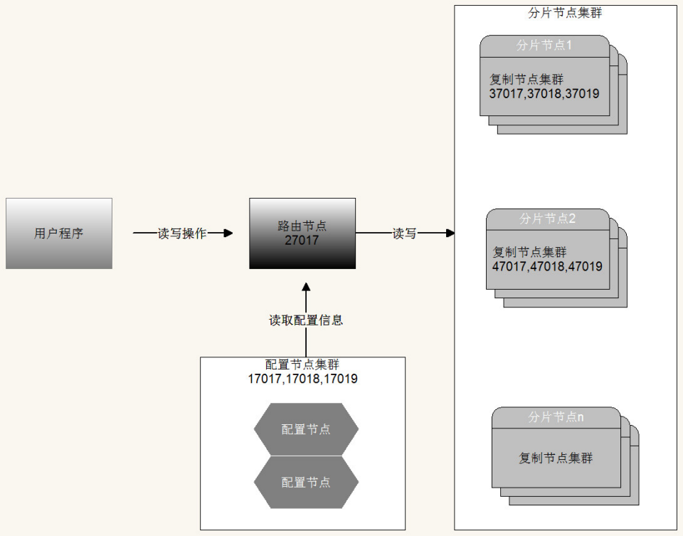

#### （1）配置启动 config 节点集群

- config-17017.conf、config-17018.conf、config-17019.conf

```bash
# 数据库文件位置 
dbpath=config/config1 

#日志文件位置 
logpath=config/logs/config1.log 

# 以追加方式写入日志 
logappend=true 

# 是否以守护进程方式运行 
fork = true 

bind_ip=0.0.0.0 
port = 17017 

# 表示是一个配置服务器 
configsvr=true 

#配置服务器副本集名称 
replSet=configsvr
```

- 添加集群节点

```bash
./bin/mongo --port 17017 

use admin 

var cfg ={"_id":"configsvr", 
					"members":[{"_id":1,"host":"192.168.211.133:17017"},
         						 {"_id":2,"host":"192.168.211.133:17018"},
                     {"_id":3,"host":"192.168.211.133:17019"}
                    ] 
          };
          
rs.initiate(cfg)
```

#### （2）配置启动 shard 集群

- shard1集群搭建37017到37019
- shard2集群搭建47017到47019

#### （3）配置启动 路由节点

- route-27017.conf

```bash
port=27017 
bind_ip=0.0.0.0 
fork=true 
logpath=route/logs/route.log 
configdb=configsvr/192.168.211.133:17017,192.168.211.133:17018,192.168.211.133:1 7019
```

- 启动路由节点使用 mongos 

```bash
./bin/mongos -f route/route-27017.conf
```

- mongos（路由）中添加分片节点

```bash
mongo --port 27017 

sh.status() 

sh.addShard("shard1/192.168.211.133:37017,192.168.211.133:37018,192.168.211.133: 37019"); sh.addShard("shard2/192.168.211.133:47017,192.168.211.133:47018,192.168.211.133: 47019"); 

sh.status()
```

#### （4） 开启数据库和集合分片（指定片键）

```bash
# 为数据库开启分片功能 
sh.enableSharding("td_resume") 

# 为指定集合开启分片功能 
sh.shardCollection("td_resume.lagou_resume_datas",{"片键字段名如 name":索引说明})
```

#### （5）数据测试

- 向集合中插入数据测试

- 分别进入 shard1 和 shard2 中的数据库，进行验证


## 3、Win 系统 -  MongoDB 安装和配置


## 4、Mac 系统 -  MongoDB 安装和配置

# 第一章 MongoDB 语法命令

## 0、重要！（对某个数据库创建某个账户）

```java
// 连接使用 admin
// 查看当前数据库的用户
show users

// 使用 admin 账户
use admin

// 登录 admin
db.auth("root","密码")

// 创建某个数据库的账户
// db.createUser({ user: '用户名', pwd: '密码', roles: [ { role: "dbOwner", db: "数据库名" } ] });
db.createUser({ user: "td", pwd: "xxxx", roles: [ { role: "dbOwner", db: "MyProject_mall" } ] });

// 使用新创建的用户 td，登录
db.auth("td","密码")

// 创建某个数据库的账户
// db.createUser({ user: '用户名', pwd: '密码', roles: [ { role: "dbOwner", db: "数据库名" } ] });
db.createUser({ user: "td", pwd: "xxxx", roles: [ { role: "dbOwner", db: "MyProject_mall" } ] });

// 创建数据库
use MyProject_mall

// 创建文档集合（表）
db.createCollection("item")
```


## 0、操作账户

- 数据库用户角色：read、readWrite 
- 数据库管理角色：dbAdmin、dbOwner、userAdmin 
- 集群管理角色：clusterAdmin、clusterManager、clusterMonitor、hostManager 
- 备份恢复角色：backup、restore； 
- 所有数据库角色：readAnyDatabase、readWriteAnyDatabase、userAdminAnyDatabase、 dbAdminAnyDatabase 
- 超级用户角色：root 
- 间接或直接提供了系统超级用户的访问（dbOwner 、userAdmin、 serAdminAnyDatabase）

```java
// 切换到 admin 数据库
use admin
  
// 内置角色
// read：允许用户读取指定数据库
// readWrite：允许用户读写指定数据库
// dbAdmin：允许用户在指定数据库中执行管理函数，如索引创建、删除，查看统计或访问 system.profile
// userAdmin：允许用户向system.users集合写入，可以找指定数据库里创建、删除和管理用户
// clusterAdmin：只在admin数据库中可用，赋予用户所有分片和复制集相关函数的管理权限
// readAnyDatabase：只在admin数据库中可用，赋予用户所有数据库的读权限
// readWriteAnyDatabase：只在admin数据库中可用，赋予用户所有数据库的读写权限
// userAdminAnyDatabase：只在admin数据库中可用，赋予用户所有数据库的userAdmin权限
// dbAdminAnyDatabase：只在admin数据库中可用，赋予用户所有数据库的dbAdmin权限
// root：只在admin数据库中可用。超级账号，超级权限
// dbOwner：库拥有者权限，即readWrite、dbAdmin、userAdmin角色的合体

// 添加用户格式
db.createUser({
    user: "账号",
    pwd: "密码",
    roles: [
        {role: "角色", db: "安全认证的数据库实例名称"},
        {role: "角色", db: "安全认证的数据库实例名称"}
    ]
})

// role=root，则db必须为admin库
db.createUser({
    user: "myroot",
    pwd: "root",
    roles: [
        {role: "root", db: "admin"}
    ]
})

// 修改密码
db.changeUserPassword('root', 'rootNew');

// 用户添加角色
db.grantRolesToUser('用户名', [{role: '角色名', db: '数据库名'}])
  
// 验证用户
// db.auth("账号", "密码")
db.auth("myroot", "root")

// 删除用户
// db.dropUser("账号")
db.dropUser("myroot")
  
// 以 auth 方式启动 mongod（也可以在mongo.conf 中添加auth=true 参数）
./bin/mongod -f conf/mongo.conf --auth
```


## 1、操作数据库

```java
// 查看数据库
show dbs

// 切换数据库（如果没有对应的数据库则创建）
use td

// 删除当前数据库
db.dropDatabase()
```


## 2、操作集合

```java
// 创建集合
db.createCollection("td_collection")

// 查看集合
show tables
show collections

// 删除集合
db.td_collection.drop();
```


## 3、操作数据 - 增

### （1）插入单条数据

```java
// db.集合名.insert(⽂档)
db.td_collection.insert({
    name: "蓝田",
    birthday: new ISODate("2000-07-01"),
    expectSalary: 15000,
    gender: 0,
    city: "bj"
})

// db.集合名.insertOne(⽂档)
db.td_collection.insertOne({
    name: "蓝田",
    birthday: new ISODate("2000-07-01"),
    expectSalary: 15000,
    gender: 1,
    city: "bj"
})
```


### （2）插入多条数据

```java
// 
// db.集合名.insert([⽂档,⽂档])
db.td_collection.insert([{
    name: "蓝田",
    birthday: new ISODate("2000-07-01"),
    expectSalary: 15000,
    gender: 0,
    city: "bj"
}, {
    name: "CJ",
    birthday: new ISODate("2000-07-01"),
    expectSalary: 18000,
    gender: 0,
    city: "bj"
}])

// db.集合名.insertMany([⽂档,⽂档])
db.td_collection.insertMany([{
    name: "蓝田",
    birthday: new ISODate("2000-07-01"),
    expectSalary: 15000,
    gender: 0,
    city: "bj"
}, {
    name: "CJ",
    birthday: new ISODate("2000-07-01"),
    expectSalary: 18000,
    gender: 0,
    city: "bj"
}])
```


## 4、操作数据 - 查

### （1）比较条件查询

```java
// db.集合名.find()
db.td_collection.find()    // 无条件查询

// db.集合名.find({条件})
db.td_collection.find({})  // 无条件查询
db.td_collection.find({city: "bj"})                  // where 字段名=值
db.td_collection.find({expectSalary: 15000})         // where 字段名=值
db.td_collection.find({expectSalary: {$eq: 18000}})  // where 字段名=值
db.td_collection.find({expectSalary: {$gt: 10000}})  // where 字段名>值
db.td_collection.find({expectSalary: {$lt: 16000}})  // where 字段名<值
db.td_collection.find({expectSalary: {$gte: 18000}}) // where 字段名>=值
db.td_collection.find({expectSalary: {$lte: 15000}}) // where 字段名<=值
db.td_collection.find({expectSalary: {$ne: 15000}})  // where 字段名!=值
```


### （2）逻辑条件查询

```java
// and 且
// db.集合名.find({key1:value1, key2:value2}).pretty()
db.td_collection.find({city: "bj", expectSalary: {$eq: 15000}})

// db.集合名.find({$and:[{key1:value1}, {key2:value2}]}).pretty()
db.td_collection.find({$and: [{city: "bj"}, {expectSalary: 15000}]})

// or 或
// db.集合名.find({$or:[{key1:value1}, {key2:value2}]}).pretty()
db.td_collection.find({$or: [{city: "bj"}, {expectSalary: 15000}]})

// not 非
// db.集合名.find({key:{$not:{$操作符:value}}).pretty()
db.td_collection.find({city: {$not: {$eq: "bj"}}})
```


### （3）排序

```java
// db.集合名.find({条件}).sort({排序字段:排序⽅式}))
db.td_collection.find().sort({expectSalary: 1})   // 升序
db.td_collection.find().sort({expectSalary: -1})  // 降序
```


### （4）分页查询

```java
// db.集合名.find({条件}).sort({排序字段:排序⽅式})).skip(跳过的⾏数).limit(⼀⻚显示多少数据)
db.td_collection.find().sort({expectSalary: 1}).skip(1).limit(2)
```


## 5、操作数据 - 改

### （0）语法

```java
// 参数说明：
// query : update的查询条件，类似 sql update 查询内 where 后⾯的
// update : update的对象和⼀些更新的操作符（如$set,$inc...）等，类似 sql update 中 set 后⾯的
    // $set ：设置字段值
    // $unset :删除指定字段
    // $inc：对修改的值进行自增
// upsert : 可选，如果不存在update的记录，是否插⼊ objNew（true为插⼊，默认是false，不插⼊）
// multi : 可选，MongoDB 默认是false，只更新找到的第⼀条记录，如果为true，就把按条件查出来多条记录全部更新
// writeConcern :可选，⽤来指定mongod对写操作的回执行为，比如写的行为是否需要确认。

// db.集合名.update(
// <query>,
// <update>,
// {
//     upsert: <boolean>,
//     multi: <boolean>,
//     writeConcern: <document>
// })
```


### （1）multi

```java
// db.集合名.update({条件},{$set:{字段名:值}},{multi:true})
// 命令行中有效，multi=true，只修改找到的第⼀条记录，multi=false，修改全部
db.td_collection.update(
    {expectSalary: 18000},
    {$set: {expectSalary: 28000}},
    {
        multi: true,
        upsert: false
    })
```


### （2）updateOne、updateMany

```java
// updateOne：每执行一次只修改找到的第⼀条记录
db.td_collection.updateOne(
    {expectSalary: 18000},
    {$set: {expectSalary: 28000}},
    {
        upsert: false
    })

// updateMany：符合条件的都修改
db.td_collection.updateMany(
    {expectSalary: 28000},
    {$set: {expectSalary: 18000}},
    {
        upsert: false
    })

// 测试修改效果
db.td_collection.find({expectSalary: 28000})
db.td_collection.find({expectSalary: 18000})
```


### （3）没有找到符合条件的数据，且upsert=true

```java
// 下面三个语句效果相同，只要没有找到符合条件的数据，且upsert: true，则会自动插入一条要设置的数据
db.td_collection.update(
    {expectSalary: 88000},
    {$set: {expectSalary: 15000}},
    {
        upsert: true
    })

db.td_collection.updateOne(
    {expectSalary: 88000},
    {$set: {expectSalary: 15000}},
    {
        upsert: true
    })

db.td_collection.updateMany(
    {expectSalary: 88000},
    {$set: {expectSalary: 15000}},
    {
        upsert: true
    })

// 测试修改效果：会新增3条数据
db.td_collection.find({expectSalary: 15000})
```


### （4）清空字段值

```java
// update：清空一条
db.td_collection.update(
    {name: "蓝田"},
    {$unset: {expectSalary: ""}},
    {
        upsert: false
    })

// updateOne：清空一条
db.td_collection.updateOne(
    {name: "蓝田"},
    {$unset: {expectSalary: ""}},
    {
        upsert: false
    })

// updateMany：清空所有满足条件的
db.td_collection.updateMany(
    {name: "蓝田"},
    {$unset: {expectSalary: ""}},
    {
        upsert: false
    })

// 测试修改效果
db.td_collection.find({name: "蓝田"})

// 找到满足条件 name: "蓝田" 的第一条数据，然后清空 expectSalary 之外的所有字段的值，并设置 expectSalary = 18000
db.td_collection.update(
    {name: "蓝田"},
    {expectSalary: 18000},
    {
        upsert: false
    })

// 测试修改效果
db.td_collection.find({expectSalary: 18000})
```


## 6、操作数据 - 删

### （1）deleteOne、deleteMany

```java
db.td_collection.deleteOne({city: "bj"})  // 删除满足条件的1条数据
db.td_collection.deleteMany({city: "bj"}) // 删除满足条件的所有数据
```


### （2）remove

```java
// 参数说明：
// query :（可选）删除的⽂档的条件
// justOne : （可选）如果设为 true 或 1，则只删除⼀个⽂档，如果不设置该参数，或使⽤默认值 false，则删除所有匹配条件的⽂档
// writeConcern :（可选）⽤来指定mongod对写操作的回执⾏为

// db.collection.remove(
// <query>,
// {
//     justOne: <boolean>,
//     writeConcern: <document>
// })

// 删除满足条件的所有数据
db.td_collection.remove({expectSalary: 18000})

// 删除满足条件的第一条数据
db.td_collection.remove(
    {city: "bj"},
    {
        justOne: true
    })

// 删除满足条件的所有数据
db.td_collection.remove(
    {city: "bj"},
    {
        justOne: false
    })
```


## 7、操作数据 - 聚合

- 聚合允许通过转化合并由多个⽂档的数据来⽣成新的在单个⽂档⾥不存在的⽂档信息
- 聚合操作的输⼊是集中的⽂档，输出可以是⼀个⽂档也可以是多个⽂档
- ⼀般都是将记录按条件分组之后进⾏⼀系列求最⼤值，最⼩值，平均值的简单操作，也可以对记录进⾏复杂数据统计，数据挖掘的操作。

```java
// 数据准备（8条数据）
db.createCollection("td_aggregation")
db.td_aggregation.insertOne({name:"张晓峰",birthday:new ISODate("2000-07-01"),gender:1,expectSalary:15000,city:"bj"})
db.td_aggregation.insertOne({name:"张震",birthday:new ISODate("1995-04-01"),gender:1,expectSalary:18000,city:"bj"})
db.td_aggregation.insertOne({name:"李山",birthday:new Date("1995-04-01"),gender:1,expectSalary:25000,city:"sh"})
db.td_aggregation.insertOne({name:"李笑来",birthday:new Date("1998-04-01 14:20:09"),gender:1,expectSalary:20000,city:"sh"})
db.td_aggregation.insertOne({name:null,birthday:new Date("1992-04-01 14:20:09"),gender:1,expectSalary:30000,city:"sh"})
db.td_aggregation.insertOne({birthday:new Date("1991-05-01 14:20:09"),gender:1,expectSalary:50000,city:"sz"})
db.td_aggregation.insert([{name:"李丽",birthday:new Date("1996-05-01 14:20:09"),gender:0,expectSalary:21000,city:"sz"}, {name:"李平",birthday:new Date("1997-07-01 14:20:09"),gender:0,expectSalary:22000,city:"sz"}])
```


### （1）单目的聚合操作（Single Purpose Aggregation Operation）

```java
// 计算满足条件的数量
db.td_aggregation.find().count()
db.td_aggregation.count()

// 查询去重后，满足条件的字段值
db.td_aggregation.distinct("city")
```


### （2）聚合管道（Aggregation Pipeline）

- 聚合管道将MongoDB⽂档在⼀个管道处理完毕后将结果传递给下⼀个管道处理
- 管道操作是可以重复的
- MongoDB不允许Pipeline的单个聚合操作占⽤过多的系统内存，如果⼀个聚合操作消耗20%以上的内存，那么MongoDB直接停⽌操作，并向客户端输出错误消息。

```java
// db.集合名称.aggregate(聚合操作)

// 聚合框架操作
// $group：将集合中的⽂档分组，可⽤于统计结果。
// $project：修改输⼊⽂档的结构。可以⽤来重命名、增加或删除域，也可以⽤于创建计算结果以及嵌套⽂档。
// $match：⽤于过滤数据，只输出符合条件的⽂档。$match使⽤MongoDB的标准查询操作。
// $limit：⽤来限制MongoDB聚合管道返回的⽂档数。
// $skip：在聚合管道中跳过指定数量的⽂档，并返回余下的⽂档。
// $sort：将输⼊⽂档排序后输出。
// $geoNear：输出接近某⼀地理位置的有序⽂档。

// 表达式：处理输⼊⽂档并输出（表达式只能⽤于计算当前聚合管道的⽂档，不能处理其它的⽂档）
// $sum：计算总和
// $avg：计算平均值
// $min：获取集合中所有⽂档对应值得最⼩值
// $max：获取集合中所有⽂档对应值得最⼤值
// $push：在结果⽂档中插⼊值到⼀个数组中
// $addToSet：在结果⽂档中插⼊值到⼀个数组中，但数据不重复
// $first：根据资源⽂档的排序获取第⼀个⽂档数据
// $last：根据资源⽂档的排序获取最后⼀个⽂档数据

// 按照 city 分组，统计每个 city 的值，放在一个数组中
db.td_aggregation.aggregate([{$group: {_id: "$city", city_name: {$push: "$city"}}}])

// 按照 city 分组，统计每个 city 中 expectSalary 的平均值
db.td_aggregation.aggregate([{$group: {_id: "$city", avgSal: {$avg: "$expectSalary"}}}])

db.td_aggregation.aggregate(
    [
        {$group: {_id: "$city", avgSal: {$avg: "$expectSalary"}}},
        {$project: {city: "$city", avgSal: "$avgSal"}}
    ])

// 按照 city 分组，统计每个 city 出现的次数
db.td_aggregation.aggregate([{$group: {_id: "$city", city_count: {$sum: 1}}}])

db.td_aggregation.aggregate(
    [
        {$group: {_id: "$city", city_count: {$sum: 1}}},
        {$match: {city_count: {$gte: 2}}}
    ])
```


### （3） MapReduce 计算模型

- Pipeline 管道查询速度快于MapReduce，但是MapReduce的强⼤之处在于能够在多台Server上并⾏执⾏复杂的聚合逻辑。
- MapReduce是⼀种计算模型，简单的说就是将⼤批量的⼯作（数据）分解（MAP）执⾏，然后再将结果合并成最终结果（REDUCE）

```java
// map：是JavaScript 函数，负责将每⼀个输⼊⽂档转换为零或多个⽂档，⽣成键值对序列,作为 reduce 函数参数
// reduce：是JavaScript 函数，对map操作的输出做合并的化简的操作（将key-value变成key-values，也就是把values数组变成⼀个单⼀的值value）
// out：统计结果存放集合
// query：⼀个筛选条件，只有满⾜条件的⽂档才会调⽤map函数。
// sort：和limit结合的sort排序参数（也是在发往map函数前给⽂档排序），可以优化分组机制
// limit：发往map函数的⽂档数量的上限（要是没有limit，单独使⽤sort的⽤处不⼤）
// finalize：可以对reduce输出结果再⼀次修改
// verbose：是否包括结果信息中的时间信息，默认为fasle

// 原理：Map 函数调⽤ emit(key, value), 遍历 collection 中所有的记录, 将 key 与 value 传递给 Reduce 函数进⾏处理
db.集合名称.mapReduce(
    // map 函数
    function () {
        emit(key, value);
    },
    // reduce 函数
    function (key, values) {
        return reduceFunction
    },
    {
    out: collection,
    query: document,
    sort: document,
    limit: number,
    finalize: <function>,
    verbose: <boolean >
    }
)

db.td_aggregation.mapReduce(
    function () {
        emit(this.city, this.expectSalary);
    },
    function (key, value) {
        return Array.avg(value);
    },
    {
        out: "cityAvgSal",
        query: {expectSalary: {$gt: 15000}},
        finalize: function (key, value) {
            return value + 500;
        },
        verbose: true
    }
    )

db.cityAvgSal.find()
```


## 8、索引

### 8.1 创建索引

#### （1）单键索引（Single Field）

- MongoDB⽀持所有数据类型中的单个字段索引，并且可以在⽂档的任何字段上定义。
-  对于单个字段索引，索引键的排序顺序⽆关紧要，因为MongoDB可以在任⼀⽅向读取索引

```java
// 数据准备
db.td_index.insertOne({name: "test1", salary: 18000})
db.td_index.insertOne({name: "test2", salary: 29000, birth: new ISODate("2000-01-01")})
  
// db.集合名.createIndex({"字段名":排序⽅式})
db.td_index.createIndex({name: 1})

// 创建索引并在后台运⾏
// db.集合名.createIndex({"字段":排序⽅式}, {background: true})
db.td_index.createIndex({name: 1}, {background: true})

// 旧语法
// db.集合名.ensureIndex({"字段名":排序⽅式})
db.td_index.ensureIndex({name: 1})
  
// 查看索引
db.td_index.getIndexes()  
```


#### （2）过期索引 TTL（Time To Live）

- TTL索引是MongoDB中⼀种特殊的索引， 可以⽀持⽂档在⼀定时间之后⾃动过期删除
- ⽬前TTL索引只能在单字段上建⽴，并且字段类型必须是⽇期类型

```java
// 数据准备
db.td_index.insertOne({name: "test1", salary: 18000})
db.td_index.insertOne({name: "test2", salary: 29000, birth: new ISODate("2000-01-01")})

// 特殊的单键索引
// db.集合名.createIndex({"⽇期字段":排序⽅式}, {expireAfterSeconds: 秒数})
db.td_index.createIndex({birth: 1}, {expireAfterSeconds: 5})

// 查看索引
db.td_index.getIndexes()
```


#### （3）复合索引（Compound Index）

- 复合索引⽀持基于多个字段的索引
- 复合索引要注意字段顺序与索引⽅向

```java
// db.集合名.createIndex( { "字段名1" : 排序⽅式, "字段名2" : 排序⽅式 } )
```


#### （4）多键索引（Multikey indexes）

- 针对属性包含数组数据的情况，MongoDB⽀持针对数组中每⼀个element创建索引
- Multikey indexes⽀持strings、numbers、nested documents


#### （5）地理空间索引（Geospatial Index）

- 2dsphere 索引：⽤于存储和查找球⾯上的点

```java
// 准备数据
db.td_index_2dsphere.insertOne(
    {
        loc: {type: "Point", coordinates: [116.482451, 39.914176]},
        name: "大望路地铁",
        category: "Parks"
    }
    )

db.td_index_2dsphere.insertOne(
    {
        loc: {type: "Point", coordinates: [116.492451, 39.934176]},
        name: "test1",
        category: "Parks"
    }
    )

db.td_index_2dsphere.insertOne(
    {
        loc: {type: "Point", coordinates: [116.462451, 39.954176]},
        name: "test2",
        category: "Parks"
    }
    )


db.td_index_2dsphere.insertOne(
    {
        loc: {type: "Point", coordinates: [116.562451, 38.954176]},
        name: "test3",
        category: "Parks"
    }
    )

db.td_index_2dsphere.insertOne(
    {
        loc: {type: "Point", coordinates: [117.562451, 37.954176]},
        name: "test4",
        category: "Parks"
    }
    )  
  
// 2dsphere 索引，⽤于存储和查找球⾯上的点
db.td_index_2dsphere.ensureIndex({loc: "2dsphere"})

// 以 116.482451, 39.914176 为中心，找 0.05，即0.5公里内的点
db.td_index_2dsphere.find({
    "loc": {
        "$geoWithin": {
            "$center": [[116.482451, 39.914176], 0.05]
        }
    }
})

// 计算中心点最近的三个点
db.td_index_2dsphere.aggregate([
    {
        $geoNear: {
            near: {type: "Point", coordinates: [116.482451, 39.914176]},
            key: "loc",
            distanceField: "dist.calculated"
        }
    },
    {$limit: 3}
])

// 查看索引
db.td_index_2dsphere.getIndexes()  
```

- 2d 索引：⽤于存储和查找平⾯上的点

```java
// 测试数据
db.td_index_2d.insertOne({"name": "Temple1", "tile": [32, 22]})
db.td_index_2d.insertOne({"name": "Temple2", "tile": [30, 22]})
db.td_index_2d.insertOne({"name": "Temple3", "tile": [28, 21]})
db.td_index_2d.insertOne({"name": "Temple4", "tile": [34, 27]})
db.td_index_2d.insertOne({"name": "Temple5", "tile": [34, 26]})
db.td_index_2d.insertOne({"name": "Temple6", "tile": [39, 28]})

// 2d 索引，⽤于存储和查找平⾯上的点
db.td_index_2d.ensureIndex({"tile": "2d"}, {"min": -90, "max": 90, "bits": 20})

// 查看  
db.td_index_2d.find({"tile": {"$within": {"$box": [[0, 0], [30, 30]]}}})

// 查看索引
db.td_index_2d.getIndexes()
```


#### （6）全文索引（Text Index）

- ⽀持任意属性值为string或string数组元素的索引查询。
- ⼀个集合仅⽀持最多⼀个Text Index（中⽂分词不理想，推荐ES）

```java
// 测试数据
db.td_index_text.insertOne({id: 1, name: "test1", description: "one world one dream in bj", city: "bj"})
db.td_index_text.insertOne({id: 2, name: "test2", description: "two world one dream in nj", city: "nj"})
db.td_index_text.insertOne({id: 3, name: "test3", description: "dj is not bj and nj", city: "dj"})

// db.集合.createIndex({"字段": "text"})
db.td_index_text.createIndex({description: "text"})

// db.集合.find({"$text": {"$search": "关键词"}})
db.td_index_text.find({"$text": {"$search": "two"}})
  
// 查看索引
db.td_index_text.getIndexes()  
```


#### （7）哈希索引（Hashed Index）

- 针对属性的哈希值进⾏索引查询，当要使⽤Hashed index时，MongoDB能够⾃动的计算hash值，⽆需程序计算hash值
- hash index 仅⽀持等于查询，不⽀持范围查询

```java
// db.集合.createIndex({"字段": "hashed"})
```


### 8.2 查看索引

```java
// 获取针对某个集合的索引
db.td_index.getIndexes()
```


### 8.3 重建索引

```java
// db.集合名.reIndex()
db.td_index.reIndex()
```


### 8.4 删除索引

```java
// 根据索引名称删除
// db.集合名.dropIndex("索引名称")
db.td_index.dropIndex("INDEX-NAME")

// 删除该集合中所有索引（_id 对应的索引删除不了）
// db.集合名.dropIndexes()
db.td_index.dropIndexes()
```


### 8.5 获取索引大小

```java
// db.集合名.totalIndexSize()
db.td_index.totalIndexSize()
```


## 9、数据备份 - mongodump 

- 全量备份的三种方式：文件系统快照、复制数据文件、mongodump 
- mongodump 命令

```java
// -h：MongoDB所在服务器地址，例如：127.0.0.1，当然也可以指定端口号：127.0.0.1:37017
// --db 或者 -d ：需要备份的数据库实例
// -o：备份的数据存放位置，例如：/root/bdatas 在备份完成后，系统自动在root目录下建立一个bdatas目录，这个目录里面存放该数据库实例的备份数据
mongodump -h 服务器地址 -d 数据库实例名称 -o 备份数据存放位置

// 举例
// 备份所有 MongoDB 数据
mongodump --host 192.168.211.136 --port 37017

// 备份指定的数据库
mongodump --port 37017 --d dbname --out /data/backup/

// 将备份指定数据库的集合 td
mongodump --collection mycol -d td

// oplog 是replica set或者master/slave模式专用
// --oplog 选项只对全库导出有效，-d 和--oplog 不能同时使用
./bin/mongodump -h 127.0.0.1:37017 --oplog -o /root/bdatas
```


## 10、数据恢复 - mongorestore

- mongorestore 命令

```java
// --host <:port>, -h <:port>：MongoDB所在服务器地址，默认为： localhost:37017
// --db 或者 -d ：需要恢复的数据库实例，例如：test，当然这个名称也可以和备份时候的不一样，比如test2
// --drop：恢复的时候，先删除当前数据，然后恢复备份的数据。就是说，恢复后，备份后添加修改的数据都会被删除，慎用！
// <path>：mongorestore 最后的一个参数，设置备份数据所在位置，不能同时指定 <path> 和 --dir 选项，--dir也可以设置备份目录。
// 注意: 恢复指定的数据库 需要在恢复的路径中出现数据库的名字
// --dir：指定备份的目录，不能同时指定 <path> 和 --dir 选项
mongorestore -h <hostname><:port> -d dbname <path>

// 举例
./bin/mongorestore -h 127.0.0.1:37017 -d lg /root/bdatas/td

// --oplogReplay：可以重放oplog.bson中的操作内容
// --oplogLimit：回放的时间节点，即此时间之前的数据恢复，假设你后面有误操作，误操作的不恢复
mongorestore -h localhost:37017 --oplogReplay /root/dump

// 通过 oplog 查询误操作的最后时间
/root/mongodb/bin/bsondump oplog.rs.bson | grep ""op":"d"" | head
// 或
db.oplog.rs.find({"op" : "d"}).sort({"ts":-1})

```


# 第二章 MongoDB 简介

## 1、NoSQL

- NoSQL，Not Only SQL，⽀持类似SQL的功能，与Relational Database相辅相成。
- 其性能较⾼，不使⽤SQL意味着没有结构化的存储要求（SQL为结构化的查询语句），没有约束之后架构更加灵活。
- NoSQL 数据库分类

```
- 列存储 Hbase
- 键值(Key-Value)存储 Redis
- 图像存储 Neo4j
- ⽂档存储 MongoDB
```


## 2、MongoDB 概述

- MongoDB 是⼀款⾼性能的 ==NoSQL== 数据库
- MongoDB 是⼀个基于==分布式文件存储==的数据库，由==C++==编写，可以为 WEB 应⽤提供可扩展、⾼性能、易部署的数据存储解决方案
- MongoDB 是⼀个介于关系数据库和非关系数据库之间的产品，是⾮关系数据库中功能最丰富、最像关系数据库的。在⾼负载的情况下，通过添加更多的节点，可以保证服务器性能。


## 3、MongoDB 应用

### 3.1 MongoDB  适用场景

- ⽹站数据：Mongo ⾮常适合实时的插⼊,更新与查询，并具备⽹站实时数据存储所需的复制及⾼度伸缩性。
- 缓存：由于性能很⾼，Mongo 也适合作为信息基础设施的缓存层。在系统重启之后，由Mongo 搭建的持久化缓存层可以避免下层的数据源过载。
- ⼤尺⼨、低价值的数据：使⽤传统的关系型数据库存储⼀些⼤尺⼨低价值数据时会⽐较浪费，在此之前，很多时候程序员往往会选择传统的⽂件进⾏存储。
- ⾼伸缩性的场景：Mongo ⾮常适合由数⼗或数百台服务器组成的数据库，Mongo 的路线图中已经包含对MapReduce 引擎的内置⽀持以及集群⾼可⽤的解决⽅案。
- ⽤于对象及JSON 数据的存储：Mongo 的BSON 数据格式⾮常适合⽂档化格式的存储及查询。


### 3.2 MongoDB  行业适用场景

- 游戏场景：使⽤ MongoDB 存储游戏⽤户信息，⽤户的装备、积分等直接以内嵌⽂档的形式存储，⽅便查询、更新。
- 物流场景：使⽤ MongoDB 存储订单信息，订单状态在运送过程中会不断更新，以 MongoDB 内嵌数组的形式来存储，⼀次查询就能将订单所有的变更读取出来。
- 社交场景：使⽤ MongoDB 存储存储⽤户信息，以及⽤户发表的朋友圈信息，通过地理位置索引实现附近的⼈、地点等功能。
- 物联⽹场景：使⽤ MongoDB 存储所有接⼊的智能设备信息，以及设备汇报的⽇志信息，并对这些信息进⾏多维度的分析。
- 直播：使⽤ MongoDB 存储⽤户信息、礼物信息等


### 3.3 什么情况下使用 MongoDB 

- 基础条件：应⽤不需要事务及复杂 join ⽀持
- 以下条件满足三个以上，直接选择 MongoDB  最优

```
新应⽤，需求会变，数据模型⽆法确定，想快速迭代开发 
应⽤需要2000-3000以上的读写QPS（更⾼也可以） 
应⽤需要TB甚⾄ PB 级别数据存储 
应⽤发展迅速，需要能快速⽔平扩展 
应⽤要求存储的数据不丢失 
应⽤需要99.999%⾼可⽤ 
应⽤需要⼤量的地理位置查询、⽂本查询
```


## 4、【区别】MongoDB 和 RDBMS（关系型数据库）

| RDBMS                             | MongoDB                                         |
| --------------------------------- | ----------------------------------------------- |
| database（数据库）                | database（数据库）                              |
| table （表）                      | collection（集合）                              |
| row（行）                         | document（ BSON ⽂档）                          |
| column （列）                     | field （字段）                                  |
| index（唯⼀索引、主键索引）       | index （⽀持地理位置索引、全⽂索引 、哈希索引） |
| join （主外键关联）               | embedded Document (嵌套⽂档)                    |
| primary key（指定1⾄N个列做主键） | primary key （指定_id field做为主键）           |


## 5、Document（文档）

### 5.1 BSON

- BSON是⼀种类 json 的⼀种⼆进制形式的存储格式，简称Binary JSON，它和JSON⼀样，⽀持内嵌的⽂档对象和数组对象，
- BSON 有 JSON 没有的⼀些数据类型，如Date和Binary Data类型。
- BSON 可以做为⽹络数据交换的⼀种存储形式，是⼀种 schema-less 的存储形式
- BSON 特点：轻量性、可遍历性、⾼效性 
- BSON 优点：灵活性⾼
- BSON 缺点：空间利⽤率不是很理想

```properties
# key是字符串类型
# value值，类型⼀般是字符串、double、Array、ISODate等类型
{key:value,key2:value2} 
```


### 5.2 Document（BSON 在 MongoDB 中的使用）

-  MongoDB 使⽤了 BSON 这种结构来存储数据和⽹络数据交换，把这种格式转化成⼀⽂档这个概念(Document)
- 这⾥的⼀个Document也可以理解成关系数据库中的⼀条记录(Record)，只是这⾥的 Document 的变化更丰富⼀些，如Document可以嵌套
- MongoDB 中 Document 中 可以出现的数据类型

| 数据类型       | 说明         | 解释说明                                            | Document 举例                                       |
| -------------- | ------------ | --------------------------------------------------- | --------------------------------------------------- |
| ObjectId       | 对象ID       | ⽤于创建文档的ID                                    | {_id:new ObjectId()}                                |
| String         | 字符串       | UTF-8 编码的字符串                                  | {key:“cba”}                                         |
| Integer        | 整型数值     | 根据使用的服务器，分为 32 位或 64位，一般用 Int32   | {key:1}                                             |
| Double         | 双精度浮点值 | ⽤于存储浮点值（没有float类型，所有小数都是Double） | {key:3.14}                                          |
| Boolean        | 布尔值       | ⽤于存储布尔值（true / false）                      | {key:true}                                          |
| Array          | 数组 / 列表  | ⽤于将数组或列表或多个值存储为⼀个键                | {arr:[“a”,“b”]}                                     |
| Object         | 内嵌⽂档     | ⽂档可以作为⽂档中某个key的value                    | {o:{foo:“bar”}}                                     |
| Timestamp      | 时间戳       | 从开始纪元开始的毫秒数                              | { ts: new Timestamp() }                             |
| Date / ISODate | 格林尼治时间 | ⽇期时间，⽤Unix⽇期格式来存储当前⽇期或            | {birth:new Date()}                                  |
| Null           | 空值         | 表示空值或者未定义的对象                            | {key:null}                                          |
| Code           | 代码         | 可以包含JS代码                                      | {x:function(){}}                                    |
| File           | ⽂件         | 1、⼆进制转码(Base64)后存储 (<16M) 2、GridFS(>16M)  | GridFS ⽤两个集合来存储⼀个⽂件：fs.files与s.chunks |

-  _id 类型是ObjectId 类型是⼀个12字节 BSON 类型数据

```bash
（1）前4个字节表示时间戳
# 使用下面的 sql 获取
ObjectId("对象Id字符串").getTimestamp() 

（2）接下来的3个字节是机器标识码

（3）紧接的两个字节由进程id组成（PID）

（4）最后三个字节是随机数
```


# 第三章 MongoDB 架构

## 1、MongoDB - 体系结构

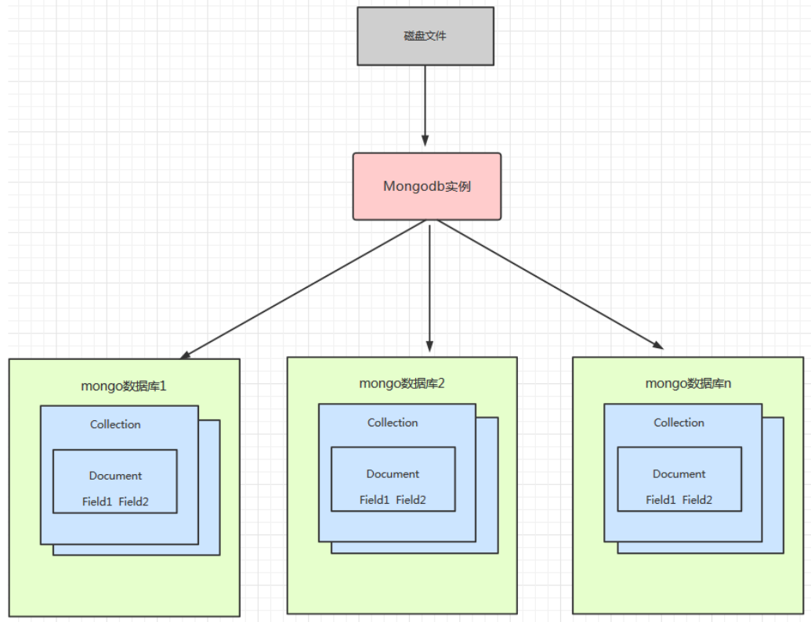


## 2、MongoDB - 逻辑结构

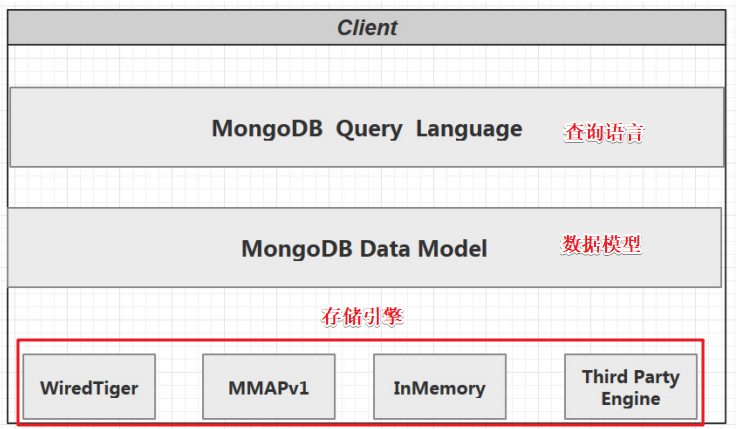


## 3、MongoDB - 逻辑结构

### （1）内嵌的方式

- 内嵌的方式指的是把相关联的数据保存在同一个文档结构之中。
- MongoDB的文档结构允许一个字段或者一个数组内的值作为一个嵌套的文档。
- 选择场景

```
数据对象之间有包含关系，一般是数据对象之间有一对多或者一对一的关系
需要经常一起读取的数据
有 map-reduce/aggregation 需求的数据放在一起，这些操作都只能操作单个 collection
```


### （2）引用的方式

- 引用方式通过存储数据引用信息来实现两个不同文档之间的关联，应用程序可以通过解析这些数据引用来访问相关数据。
- 选择场景

```
当内嵌数据会导致很多数据的重复，并且读性能的优势又不足于覆盖数据重复的弊端
需要表达比较复杂的多对多关系的时候
大型层次结果数据集，嵌套不要太深
```


## 4、MongoDB - 存储引擎

### 4.1 概述

- 存储引擎负责管理数据如何存储在硬盘和内存上。
- MongoDB支持的存储引擎有：MMAPv1、WiredTiger、InMemory
- InMemory 存储引擎用于将数据只存储在内存中，只将少量的元数据 (meta-data)和诊断日志（Diagnostic）存储到硬盘文件中，由于不需要Disk的IO操作，就能获取所需的数据，InMemory存储引擎大幅度降低了数据查询的延迟（Latency）
- 从mongodb3.2开始默认的存储引擎是WiredTiger，3.2版本之前的默认存储引擎是MMAPv1
- mongodb4.x版本不再支持MMAPv1存储引擎

```yaml
storage: 
	journal: 
		enabled: true 
	dbPath: /data/mongo/ 
	##是否一个库一个文件夹 
	directoryPerDB: true 
	##数据引擎 
	engine: wiredTiger 
	##WT引擎配置 
	WiredTiger: 
		engineConfig: 
			##WT最大使用cache（根据服务器实际情况调节） 
			cacheSizeGB: 2
			##是否将索引也按数据库名单独存储 
			directoryForIndexes: true 
			## 默认snappy
			journalCompressor:none  
		##表压缩配置 
		collectionConfig:
			## 默认snappy,还可选none、zlib
			blockCompressor: zlib 
		##索引配置 
		indexConfig: 
			prefixCompression: true
```


### 4.2 WiredTiger 引擎

#### （1）WiredTiger 和 MMAPV1

```bash
# 文档空间分配方式
WiredTiger使用的是BTree存储 
MMAPV1 线性存储，需要Padding 

# 并发级别 
WiredTiger 文档级别锁 
MMAPV1 引擎使用表级锁

# 数据压缩 
WiredTiger：snappy (默认) 和 zlib 
MMAPV1：无压缩

# 内存使用 
WiredTiger 可以指定内存的使用大小

# Cache使用 
WiredTiger 引擎使用了二阶缓存 WiredTiger Cache, File System Cache 来保证 Disk 上的数据的最终一致性
MMAPv1 只有journal 日志
```


#### （2）WiredTiger 引擎包含的文件

```bash
# 存储基本配置信息，与 ConfifigServer有关系
WiredTiger.basecfg

# 定义锁操作
WiredTiger.lock

# 存储各张表的数据
table*.wt

# 存储table* 的元数据
WiredTiger.wt

# 存储 WiredTiger.wt 的元数据
WiredTiger.turtle

# 存储 WAL(Write Ahead Log)
journal
```

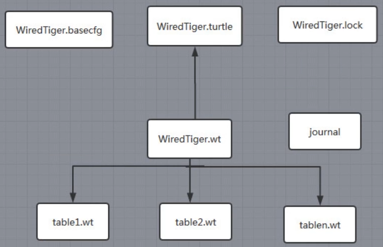


### 4.3 WiredTiger 引擎实现原理

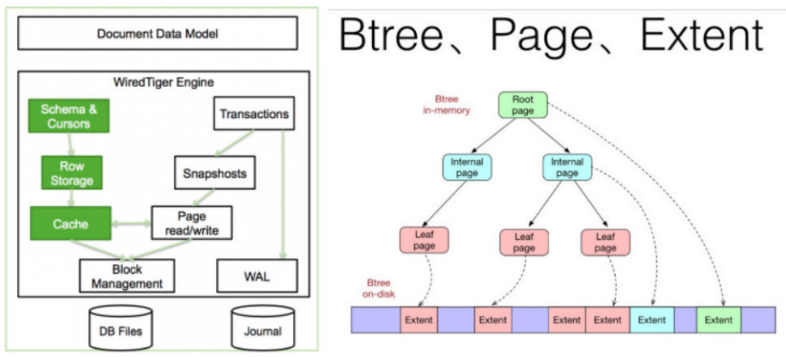

#### （1）写请求

```
WiredTiger的写操作会默认写入 Cache ,并持久化到 WAL (Write Ahead Log)，每60s或Log文件达到2G做一次 checkpoint
也可以通过在写入时传入 j: true 的参数强制 journal 文件的同步 ，writeConcern { w: , j: , wtimeout: }) 产生快照文件
WiredTiger初始化时，恢复至最新的快照状态，然后再根据WAL恢复数据，保证数据的完整性。
```

#### （2）cache

```
Cache是基于BTree的，节点是一个page，root page是根节点，internal page是中间索引节点，leafpage真正存储数据，数据以page为单位读写。WiredTiger采用Copy on write的方式管理写操作（insert、update、delete），写操作会先缓存在cache里，持久化时，写操作不会在原来的leaf page上进行，而是写入新分配的page，每次 checkpoint 都会产生一个新的root page。
```

#### （3）checkpoint 流程

```
对所有的table进行一次checkpoint，每个table的checkpoint的元数据更新至WiredTiger.wt
对WiredTiger.wt进行checkpoint，将该table checkpoint的元数据更新至临时文件 WiredTiger.turtle.set
将WiredTiger.turtle.set重命名为WiredTiger.turtle
上述过程如果中间失败，WiredTiger在下次连接初始化时，首先将数据恢复至最新的快照状态，然后根据WAL恢复数据，以保证存储可靠性
```

#### （4）Journaling

```
在数据库宕机时, 为保证 MongoDB 中数据的持久性，MongoDB 使用了 Write Ahead Logging 向磁盘上的 journal 文件预先进行写入。除了 journal 日志，MongoDB 还使用检查点（checkpoint）来保证数据的一致性，当数据库发生宕机时，我们就需要 checkpoint 和 journal 文件协作完成数据的恢复工作。

1. 在数据文件中查找上一个检查点的标识符
2. 在 journal 文件中查找标识符对应的记录
3. 重做对应记录之后的全部操作
```

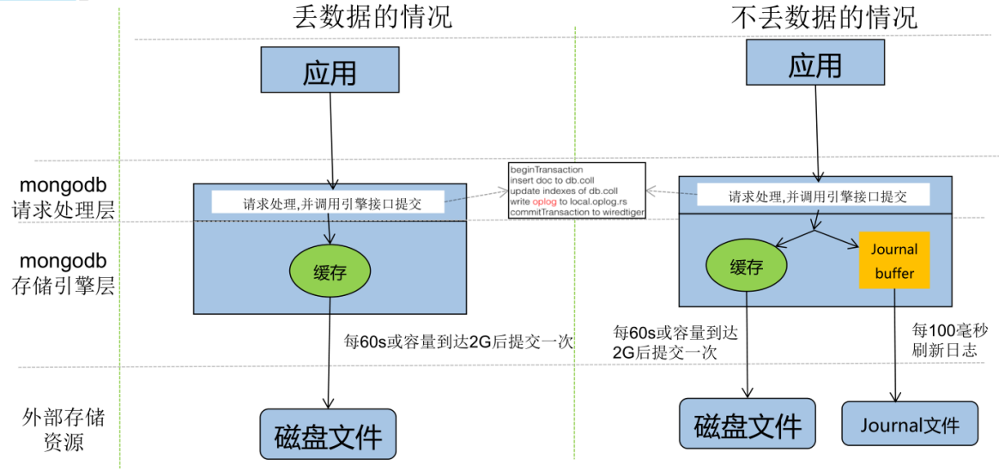


# 第四章 MongoDB index 索引

## 1、索引概述

- 索引是⼀种单独的、物理的对数据库表中⼀列或多列的值进⾏排序的⼀种存储结构，它是某个表中⼀列或若⼲列值的集合和相应的指向表中物理标识这些值的数据⻚的逻辑指针清单。
- 索引的作⽤相当于图书的⽬录，可以根据目录中的页码快速找到所需的内容。
- 索引⽬标是提⾼数据库的查询效率，没有索引的话，查询会进⾏全表扫描（scan every document in a collection）,数据量⼤时严重降低了查询效率。
- 默认情况下Mongo在⼀个集合（collection）创建时，⾃动地对集合的_id创建了唯⼀索引


## 2、索引 - 底层实现原理

- MongoDB 是⽂档型的数据库，它使⽤BSON 格式保存数据，⽐关系型数据库存储更⽅便
- MySql是关系型数据库，数据的关联性是⾮常强的，区间访问是常⻅的⼀种情况，底层索引组织数据使⽤B+树，B+树由于数据全部存储在叶⼦节点，并且通过指针串在⼀起，这样就很容易的进⾏区间遍历甚⾄全部遍历。
- MongoDB使⽤B-树，所有节点都有Data域，只要找到指定索引就可以进⾏访问，单次查询从结构上来看要快于MySql


### 2.1 B+树

-  B+ 树的特点

```
多路⾮⼆叉
只有叶⼦节点保存数据
搜索时也相当于⼆分查找
增加了相邻节点指针
```


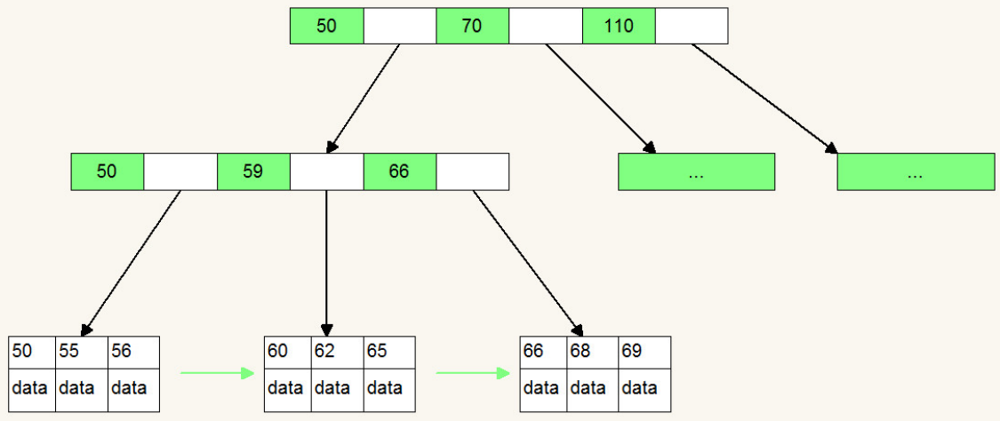


### 2.2 B-树

- B-树的特点

```
多路⾮⼆叉树
每个节点既保存数据⼜保存索引
搜索时相当于⼆分查找
```


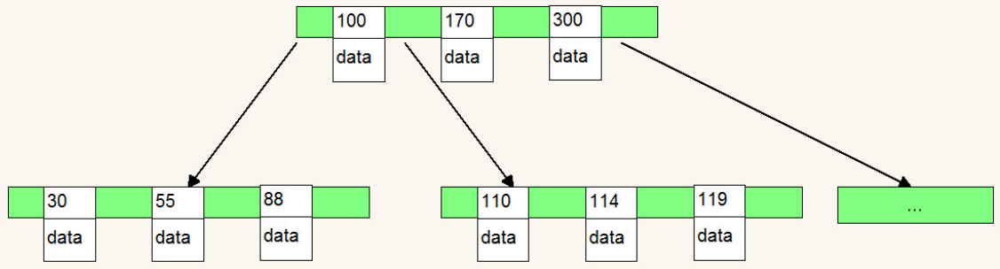


### 2.3 区别

- 最核⼼的区别：⼀个是数据的保存位置，⼀个是相邻节点的指向。就是这造成了MongoDB和MySql的差别

```
B+树相邻接点的指针可以⼤⼤增加区间访问性，可使⽤在范围查询等
B-树每个节点 key 和 data 在⼀起适合随机读写 ，⽽区间查找效率很差

B+树更适合外部存储，也就是磁盘存储
使⽤B-结构的话，每次磁盘预读中的很多数据是⽤不上的数据。因此，它没能利⽤好磁盘预读的提供的数据。由于节点内⽆ data 域，每个节点能索引的范围更⼤更精确。

B-树每个节点即保存数据⼜保存索引树的深度⼤，所以磁盘IO的次数多
B+树只有叶⼦节点保存，较B树⽽⾔深度⼩，磁盘IO少，有利于区间访问
```


## 3、索引 - explain 分析

### 3.0 数据准备

```java
// 插入100 万条数据（在命令行中执行快）
for (var i = 0; i < 1000000; i++) {
    db.td_index_explain.insertOne({id: i, name: "test" + i, salary: (Math.random() * 20000).toFixed(2)});
}

// 查看数量
db.td_index_explain.count()
```


### 3.1 explain - 格式

```java
// 返回结果包括：queryPlanner、serverInfo
// db.集合名.find().explain()
// db.集合名.find().explain("queryPlanner")

// 返回结果包括：executionStats、queryPlanner、serverInfo
// db.集合名.find().explain("executionStats")
// db.集合名.find().explain("allPlansExecution")

// 举例
db.td_index_explain.find({name: "test11011"}).explain()
db.td_index_explain.find({name: "test11011"}).explain("queryPlanner")
db.td_index_explain.find({name: "test11011"}).explain("executionStats")
db.td_index_explain.find({name: "test11011"}).explain("allPlansExecution")
```


### 3.2 explain - 参数详解

#### （1）queryPlanner：默认参数

```properties
# 查询计划版本
plannerVersion

# 要查询的集合（该值返回的是该query所查询的表）数据库.集合
namespace

# 针对该query是否有indexFilter
indexFilterSet

# 查询条件
parsedQuery 

# 被选中的执⾏计划
winningPlan 

# 被选中执⾏计划的stage(查询⽅式)
# COLLSCAN/全表扫描：CollectionScan，和mysql中tablescan/heap scan类似，性能最差
# IXSCAN/索引扫描：IndexScan，说明已经命中索引
# FETCH/根据索引去检索⽂档
# SHARD_MERGE/合并分⽚结果
# IDHACK/针对_id进⾏查询
winningPlan.stage

# ⽤来描述⼦stage，并且为其⽗stage提供⽂档和索引关键字
winningPlan.inputStage

# 如果此处是IXSCAN，表示进⾏的是index scanning
winningPlan.stage.childstage

# 所扫描的index内容
winningPlan.keyPattern 

# winning plan所选⽤的index
winningPlan.indexName

# 是否是Multikey，此处返回是false，如果索引建⽴在array上，此处将是true。
winningPlan.isMultiKey 

# 此query的查询顺序，此处是forward，如果⽤了.sort({字段:-1})将显示backward。
winningPlan.direction

# 过滤条件
filter 

# winningplan所扫描的索引范围,如果没有制定范围就是[MaxKey, MinKey]，这主要是直接定位到mongodb的chunck中去查找数据，加快数据读取。
winningPlan.indexBounds

# 被拒绝的执⾏计划的详细返回，其中具体信息与winningPlan的返回中意义相同
rejectedPlans

#  MongoDB服务器信息
serverInfo
```


#### （2）executionStats：返回执行计划的一些统计信息

```properties
# 是否执⾏成功
executionSuccess

# 返回的⽂档数
nReturned 

# 执⾏耗时
executionTimeMillis 

# 索引扫描次数
totalKeysExamined 

# ⽂档扫描次数
totalDocsExamined 

# 这个分类下描述执⾏的状态
executionStages 

# 扫描⽅式，具体可选值与上⽂的相同
executionStages.stage 

# 查询结果数量
executionStages.nReturned 

# 检索document获得数据的时间
executionStages.executionTimeMillisEstimate 

# 该查询扫描⽂档 index所⽤时间（待验证）
executionStages.inputStage.executionTimeMillisEstimate 

# ⼯作单元数，⼀个查询会分解成⼩的⼯作单元
executionStages.works 

# 优先返回的结果数
executionStages.advanced

# ⽂档检查数⽬，与totalDocsExamined⼀致。检查了总共的document个数，⽽从返回上⾯的nReturned数量
executionStages.docsExamined 
```


#### （3）allPlansExecution：获取所有执行计划

- 有些版本中和 allPlansExecution 等同


## 4、索引 - 优化方案

- 主要优化 executionStats 中的值


### （1）executionTimeMillis

- executionTimeMillis值，指的是这条语句的执⾏时间，这个值当然是希望越少越好

```properties
# 该query的整体查询时间
executionStats.executionTimeMillis

# 该查询检索document获得数据的时间
executionStats.executionStages.executionTimeMillisEstimate 

# 该查询扫描⽂档 index所⽤时间
executionStats.executionStages.inputStage.executionTimeMillisEstimate
```


### （2）扫描数与查询返回条数 

- 对于⼀个查询，最理想的状态是：nReturned = totalKeysExamined = totalDocsExamined
- 下面三个条目，直观地影响到 executionTimeMillis，因此需要扫描的条数越少，则查询速度越快

```properties
# 查询返回的条⽬
nReturned

# 索引扫描条⽬
totalKeysExamined

# ⽂档扫描条⽬
totalDocsExamined
```


### （3）stage 状态分析 

- stage 的类型影响 totalKeysExamined 和 totalDocsExamined

```properties
COLLSCAN：全表扫描
IXSCAN：索引扫描
FETCH：根据索引去检索指定document
SHARD_MERGE：将各个分⽚返回数据进⾏merge
SORT：表明在内存中进⾏了排序
LIMIT：使⽤limit限制返回数
SKIP：使⽤skip进⾏跳过
IDHACK：针对_id进⾏查询
SHARDING_FILTER：通过mongos对分⽚数据进⾏查询
COUNT：利⽤db.coll.explain().count()之类进⾏count运算
TEXT：使⽤全⽂索引进⾏查询时候的stage返回
PROJECTION：限定返回字段时候stage的返回

# 举例：限定返回字段 PROJECTION（id中包含0的数据都不展示）
db.td_index_explain.find({name: {$gt: "test222333"}}, {_id: 0}).explain("executionStats")
```

- 对于普通查询，希望看到 stage 组合（查询的时候尽可能⽤上索引）

```
Fetch + IDHACK
Fetch + IXSCAN
Limit +（Fetch+IXSCAN）
PROJECTION + IXSCAN
SHARDING_FITER + IXSCAN
```

- 不希望看到的 stage

```
COLLSCAN：全表扫描
SORT：使⽤ sort 但是⽆ index
COUNT：不使⽤ index 进⾏ count
```


## 5、慢查询分析

```java
// 开启内置的查询分析器，记录读写操作效率
// n = 0，表示不记录
// n = 1，表示记录慢速操作（如果值为1，m 必须赋值单位为 ms，⽤于定义慢速查询时间的阈值）
// n = 2，表示记录所有的读写操作
// db.setProfilingLevel(n, m)
db.setProfilingLevel(1, 100)

// 查看索引
db.td_index_explain.getIndexes()

// 模拟慢查询
db.td_index_explain.find({name: "test99989"})
db.td_index_explain.find({name: "test9919"})
db.td_index_explain.find({name: "test9799"})

// 查询监控结果
db.system.profile.find().sort({millis: -1}).limit(3)
  
// 分析慢速查询
应⽤程序设计不合理、不正确的数据模型、硬件配置问题、缺少索引等
  
// 解读 explain 结果，确定是否缺少索引
```


# 第五章 MongoDB 集群

## 1、MongoDB 主从复制

- 在主从结构中，主节点的操作记录成为oplog（operation log）
- oplog存储在系统数据库local的 oplog.$main集合中，这个集合的每个文档都代表主节点上执行的一个操作
- 从服务器会定期从主服务器 中获取oplog记录，然后在本机上执行！对于存储oplog的集合，MongoDB采用的是固定集合，也就是说随 着操作过多，新的操作会覆盖旧的操作！
- 主从结构没有自动故障转移功能，需要指定master和slave端，不推荐在生产中使用
- mongodb4.0后不再支持主从复制！


## 2、MongoDB 复制集（replica sets）

### 2.1 复制集 - 概述

- 复制集是由一组拥有相同数据集的mongod实例做组成的集群。
- 复制集是一个集群，它是2台及2台以上的服务器组成
- 复制集成员包括：Primary主节点、secondary从节点、投票节点

```
PRIMARY 节点：可以查询和新增数据
SECONDARY 节点：只能查询，不能新增，基于priority 权重可以被选为主节点
ARBITER 节点：不能查询数据和新增数据，不能变成主节点
```

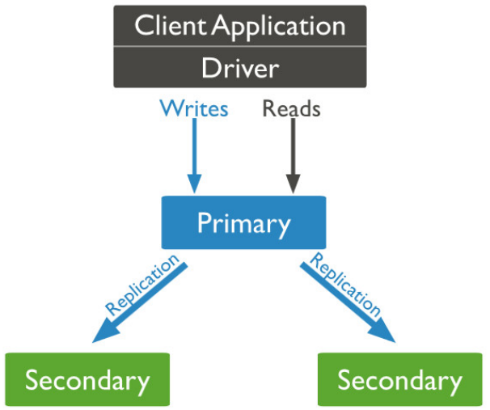


### 2.2 复制集 - 特点

- 复制集提供了数据的冗余备份，并在多个服务器上存储数据副本，提高了数据的可用性，保证数据的安全性

#### （1）高可用

- 防止设备（服务器、网络）故障
- 提供自动 failover 功能
- 技术来保证高可用 

#### （2）灾难恢复 

- 当发生故障时，可以从其他节点恢复用于备份。 

#### （3）功能隔离 

- 可以在备节点上执行读操作，减少主节点的压力 
- 比如：用于分析、报表，数据挖掘，系统任务等


### 2.3 复制集 - 集群架构原理

#### （1）原理

- 一个复制集中Primary节点上能够完成读写操作
- Secondary节点仅能用于读操作
- Primary节点需要记录所有改变数据库状态的操作，这些记录保存在 oplog 中，这个文件存储在 local 数据库，各个Secondary节点通过此 oplog 来复制数据并应用于本地，保持本地的数据与主节点的一致。
- oplog 具有幂等性：即无论执行几次其结果一致，这个比 mysql 的二进制日志更好用。


#### （2）oplog 组成结构

```properties
# ts：操作时间，当前timestamp + 计数器，计数器每秒都被重置 
# h：操作的全局唯一标识 
# v：oplog 版本信息 
# op：操作类型（i：插入操作 u：更新操作 d：删除操作 c：执行命令（如createDatabase，dropDatabase） n：空操作，特殊用途） 
# ns：操作针对的集合 
# o：操作内容 
# o2：更新查询条件，仅update操作包含该字段

{
"ts" : Timestamp(1446011584, 2),
"h" : NumberLong("1687359108795812092"), 
"v" : 2, 
"op" : "i", 
"ns" : "test.nosql", 
"o" : { "_id" : ObjectId("563062c0b085733f34ab4129"), "name" : "mongodb", "score" : "10"} }
```


#### （3）复制集数据同步分为：初始化同步和keep复制同步

- 初始化同步：指全量从主节点同步数据，如果Primary节点数据量比较大同步时间会比较长

````bash
# 初始化同步有以下两种情况会触发
(1) Secondary第一次加入
(2) Secondary落后的数据量超过了oplog的大小，这样也会被全量复制
````

- keep复制：指初始化同步过后，节点之间的实时同步一般是增量同步。


#### （4）心跳检测

- MongoDB的Primary节点选举基于心跳触发
- 一个复制集N个节点中的任意两个节点维持心跳，每个节点维护其他N-1个节点的状态
- 整个集群需要保持一定的通信才能知道哪些节点活着哪些节点挂掉
- mongodb节点会向副本集中的其他节点每2秒就会发送一次pings包，如果其他节点在10秒钟之内没有返回就标示为不能访问。
- 每个节点内部都会 维护一个状态映射表，表明当前每个节点是什么角色、日志时间戳等关键信息
- 如果主节点发现自己无法与 大部分节点通讯则把自己降级为secondary只读节点

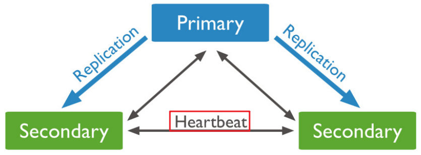


#### （5）主节点选举触发时机

- 第一次初始化一个复制集 
- Secondary节点权重比Primary节点高时，发起替换选举 
- Secondary节点发现集群中没有Primary时，发起选举 
- Primary节点不能访问到大部分(Majority)成员时主动降级

- 当触发选举时，Secondary节点尝试将自身选举为Primary（主节点选举是一个二阶段过程+多数派协议）

```bash
# 第一阶段:
检测自身是否有被选举的资格
如果符合资格会向其它节点发起本节点是否有选举资格的 FreshnessCheck，进行同僚仲裁

# 第二阶段
发起者向集群中存活节点发送Elect(选举)请求，仲裁者收到请求的节点会执行一系列合法性检查
如果检查通过，则仲裁者(一个复制集中最多50个节点 其中只有7个具有投票权)给发起者投一票
pv0通过30秒选举锁防止一次选举中两次投票
pv1使用了terms(一个单调递增的选举计数器)来防止在一次选举中投两次票的情况

# 多数派协议：发起者如果获得超过半数的投票，则选举通过，自身成为Primary节点
获得低于半数选票的原因，除了常见的网络问题外，相同优先级的节点同时通过第一阶段的同僚仲裁并进入第二阶段也是一个原因
因此，当选票不足时，会sleep[0,1]秒内的随机时间，之后再次尝试选举
```


## 3、MongoDB 分片集群（Shard Cluster）


# 第六章 MongoDB 分片

## 1、分片 - 概述

- 分片（sharding）是MongoDB用来将大型集合水平分割到不同服务器（或者复制集）上所采用的方法。 不需要功能强大的大型计算机就可以存储更多的数据，处理更大的负载。 
- 垂直扩展：增加更多的CPU和存储资源来扩展容量。 
- 水平扩展：将数据集分布在多个服务器上。水平扩展即分片
- 为什么要分片

```bash
存储容量需求超出单机磁盘容量
活跃的数据集超出单机内存容量，导致很多请求都要从磁盘读取数据，影响性能
IOPS超出单个MongoDB节点的服务能力，随着数据的增长，单机实例的瓶颈会越来越明显
副本集具有节点数量限制
```


## 2、分片 - 工作原理

- 分片集群由以下3个服务组成

```bash
Shards Server: 每个shard由一个或多个mongod进程组成，用于存储数据
Router Server: 数据库集群的请求入口，所有请求都通过Router(mongos)进行协调，不需要在应用程序添加一个路由选择器，Router(mongos)就是一个请求分发中心它负责把应用程序的请求转发到对应的 Shard 服务器上
Config Server: 配置服务器。存储所有数据库元信息（路由、分片）的配置
```

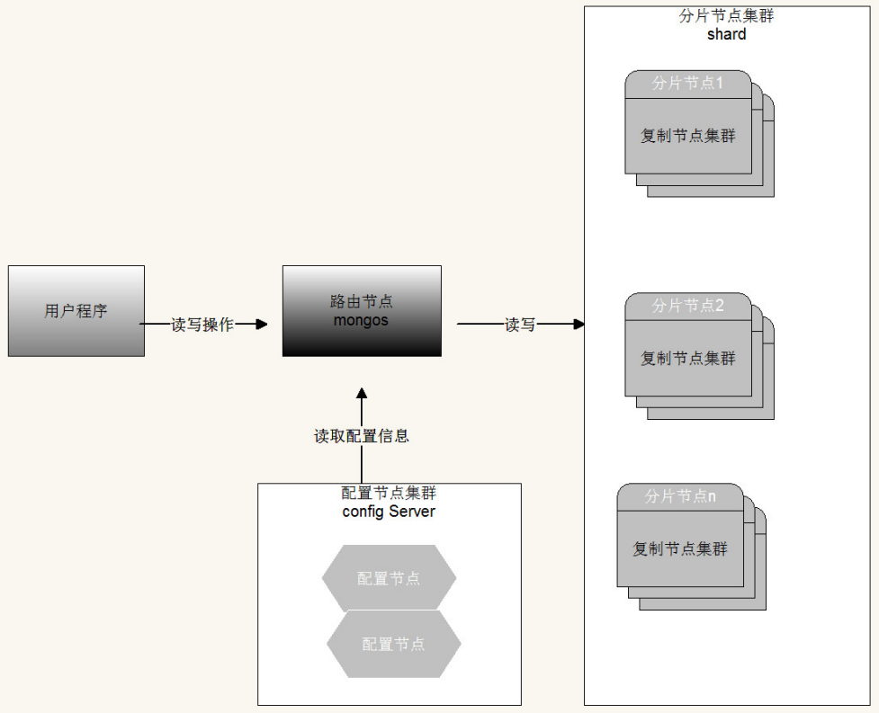


## 3、分片策略

- 片键（shard key）：为了在数据集合中分配文档，MongoDB使用分片主键分割集合
- 区块（chunk）：在一个shard server内部，MongoDB还是会把数据分为chunks，每个chunk代表这个shardserver内部一部分数据。MongoDB分割分片数据到区块，每一个区块包含基于分片主键的左闭右开的区间范围
- 分片策略：无非从两个方面考虑，数据的查询和写入，最好的效果就是数据查询时能命中更少的分片，数据写入时能够随机的写入每个分片，关键在于如何权衡性能和负载


### （1）范围分片（Range based sharding）

- 范围分片是基于分片主键的值切分数据，每一个区块将会分配到一个范围。
- 范围分片适合满足在一定范围内的查找，例如查找X的值在[20,30)之间的数据，mongo 路由根据Confifig server中存储的元数据，可以直接定位到指定的shard的Chunk中。
- 缺点：如果shard key有明显递增（或者递减）趋势，则新插入的文档多会分布到同一个chunk，无法扩展写的能力。

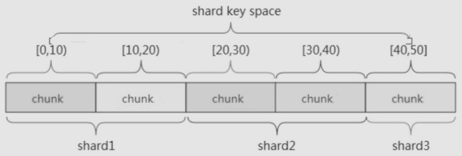


### （2）hash分片（Hash based sharding）

- Hash分片是计算一个分片主键的hash值，每一个区块将分配一个范围的hash值。
- Hash分片与范围分片互补，能将文档随机的分散到各个chunk，充分的扩展写能力，弥补了范围分片的不足，缺点是不能高效的服务范围查询，所有的范围查询要分发到后端所有的Shard才能找出满足条件的文档。

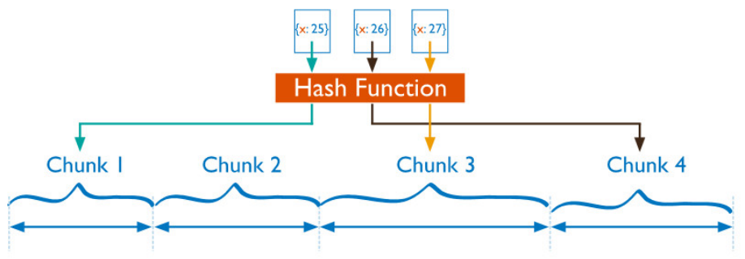


### （3）组合片键

- 数据库中没有比较合适的片键供选择，或者是打算使用的片键基数太小（即变化少如星期只有7天可变化），可以选另一个字段使用组合片键，甚至可以添加冗余字段来组合。
- 一般是粗粒度+细粒度进行组合


# 第七章 MongoDB 使用

## 1、Java 项目

### 步骤1：pom.xml

```xml
<dependencies>
    <dependency>
        <groupId>org.mongodb</groupId>
        <artifactId>mongo-java-driver</artifactId>
        <version>3.10.1</version>
    </dependency>
</dependencies>
```


### 步骤2：MongoDB  使用

#### （1）插入

```java
public class Document_Insert {
    public static void main(String[] args) {
        // 新建 MongoClient
        MongoClient mongoClient = new MongoClient("192.168.31.246", 27017);

        // 获取数据库对象
        MongoDatabase mongoDatabase = mongoClient.getDatabase("td");

        // 获取集合对象
        MongoCollection<Document> collection = mongoDatabase.getCollection("td_collection");

        //  构建Document 对象，并插入到集合中
        Document document = Document.parse("{name:'lisi',city:'北京',birth_day:new ISODate('2001-08-01'),expectSalary:18000}");
        collection.insertOne(document);

        // 关闭 MongoClient
        mongoClient.close();
    }
}
```


#### （2）查询

```java
public class Document_Find {
    public static void main(String[] args) {
        // 新建 MongoClient
        MongoClient mongoClient = new MongoClient("192.168.31.246", 27017);

        // 获取数据库对象
        MongoDatabase mongoDatabase = mongoClient.getDatabase("td");

        // 获取集合对象
        MongoCollection<Document> collection = mongoDatabase.getCollection("td_collection");

        // 根据 expectSalary 降序排列
        Document sortDocument = new Document();
        sortDocument.append("expectSalary", -1);
        FindIterable<Document> findIterable = collection.find().sort(sortDocument);
        for (Document document : findIterable) {
            System.out.println(document);
        }

        // 关闭 MongoClient
        mongoClient.close();
    }
}
```


#### （3）查询 - 使用 Filters

```java
public class Document_Find_Filters {
    public static void main(String[] args) {
        // 新建 MongoClient
        MongoClient mongoClient = new MongoClient("192.168.31.246", 27017);

        // 获取数据库对象
        MongoDatabase mongoDatabase = mongoClient.getDatabase("td");

        // 获取集合对象
        MongoCollection<Document> collection = mongoDatabase.getCollection("td_collection");

        // 根据 expectSalary 降序排列
        Document sortDocument = new Document();
        sortDocument.append("expectSalary", -1);

        // 两种方式都可以
        //FindIterable<Document>  findIterable =  collection.find(Document.parse("{expectSalary:{$gt:21000}}")).sort(sortDocument);
        FindIterable<Document> findIterable = collection.find(Filters.gt("expectSalary", 21000)).sort(sortDocument);

        for (Document document : findIterable) {
            System.out.println(document);
        }

        // 关闭 MongoClient
        mongoClient.close();
    }
}
```


## 2、Spring 项目

### 步骤1：pom.xml

```xml
<dependencies>
    <dependency>
        <groupId>org.springframework.data</groupId>
        <artifactId>spring-data-mongodb</artifactId>
        <version>2.0.9.RELEASE</version>
    </dependency>
</dependencies>
```


### 步骤2：applicationContext.xml

```xml
<?xml version="1.0" encoding="UTF-8"?>
<beans xmlns="http://www.springframework.org/schema/beans"
       xmlns:xsi="http://www.w3.org/2001/XMLSchema-instance"
       xmlns:context="http://www.springframework.org/schema/context"
       xmlns:mongo="http://www.springframework.org/schema/data/mongo"
       xsi:schemaLocation="
    http://www.springframework.org/schema/beans http://www.springframework.org/schema/beans/spring-beans.xsd
    http://www.springframework.org/schema/context http://www.springframework.org/schema/context/spring-context.xsd
    http://www.springframework.org/schema/data/mongo http://www.springframework.org/schema/data/mongo/spring-mongo.xsd">

    <!-- 构建 MongoDb ⼯⼚对象 -->
    <mongo:db-factory id="mongoDbFactory" client-uri="mongodb://192.168.31.246:27017/td"/>

    <!-- 构建 MongoTemplate 类型的对象 -->
    <bean id="mongoTemplate" class="org.springframework.data.mongodb.core.MongoTemplate">
        <constructor-arg index="0" ref="mongoDbFactory"/>
    </bean>

    <!-- 开启组件扫描 -->
    <context:component-scan base-package="com.loto"/>
</beans>
```


### 步骤3：MongoDB  使用

#### （1）ResumeDAOImpl

```java
@Repository("resumeDao")
public class ResumeDAOImpl implements ResumeDAO {
    @Autowired
    private MongoTemplate mongoTemplate;

    @Override
    public void insertResume(Resume resume) {
        mongoTemplate.insert(resume, "td_collection");
    }

    @Override
    public Resume findByName(String name) {
        Query query = new Query();
        query.addCriteria(Criteria.where("name").is(name));
        List<Resume> datas = mongoTemplate.find(query, Resume.class, "td_collection");
        return datas.isEmpty() ? null : datas.get(0);
    }

    @Override
    public List<Resume> findList(String name) {
        Query query = new Query();
        query.addCriteria(Criteria.where("name").is(name));
        List<Resume> datas = mongoTemplate.find(query, Resume.class, "td_collection");
        return datas;
    }

    @Override
    public List<Resume> findListByNameAndExpectSalary(String name, double expectSalary) {
        Query query = new Query();
        //query.addCriteria(Criteria.where("name").is(name).andOperator(Criteria.where("expectSalary").is(expectSalary)));
        query.addCriteria(Criteria.where("name").is(name).andOperator(Criteria.where("expectSalary").is(expectSalary)));
        return mongoTemplate.find(query, Resume.class, "td_collection");
    }
}
```


#### （2）MongoTemplateMain

```java
public class MongoTemplateMain {
    public static void main(String[] args) {
        ClassPathXmlApplicationContext applicationContext = new ClassPathXmlApplicationContext("applicationContext.xml");

        ResumeDAO resumeDao = applicationContext.getBean("resumeDao", ResumeDAO.class);


        //Resume resume = new Resume();
        //resume.setName("lisi");
        //resume.setCity("北京");
        //
        //Date date = null;
        //String dateStr = "yyyy-MM-dd hh:mm:ss";
        //SimpleDateFormat simpleDateFormat = new SimpleDateFormat(dateStr);
        //
        //try {
        //    date = simpleDateFormat.parse("2003-10-02 11:13:14");
        //} catch (ParseException e) {
        //    e.printStackTrace();
        //}
        //
        //resume.setBirthday(date);
        //resume.setExpectSalary(28000);
        //resumeDao.insertResume(resume);


        Resume resume = resumeDao.findByName("lisi");
        System.out.println(resume);

        List<Resume> datas = resumeDao.findList("zhangsan");
        System.out.println(datas);

        List<Resume> datas2 = resumeDao.findListByNameAndExpectSalary("zhangsan", 25000);
        System.out.println(datas2);
    }
}
```


## 3、SpringBoot 项目 - MongoTemplate

### SpringData MongoDB特征

```properties
1、Spring配置支持使用基于Java的@Configuration类或Mongo驱动程序实例和副本集的XML命名空间。
2、MongoTemplate助手类，可提高执行常见Mongo操作的效率。包括文档和POJO之间的集成对象映射。
3、异常转换为Spring的可移植数据访问异常层次结构
4、功能丰富的对象映射与Spring的转换服务集成
5、基于注解的映射元数据，但可扩展以支持其他元数据格式
6、持久性和映射生命周期事件
7、使用MongoReader/MongoWriter抽象的低级映射
8、基于Java的查询，标准和更新DSL
9、自动实现Repository接口，包括支持自定义finder方法。
10、QueryDSL集成以支持类型安全查询。
11、跨存储持久性 - 使用MongoDB透明地持久保存/检索具有字段的JPA实体的支持
12、Log4j日志appender
13、地理空间整合
14、Map-Reduce集成
15、JMX管理和监控
16、CDI对存储库的支持
17、GridFS支持
18、支持事务，4.x版本支持多文件事务操作
```


### 步骤1：pom.xml

```xml
<dependencies>
    <dependency>
        <groupId>org.springframework.boot</groupId>
        <artifactId>spring-boot-starter-data-mongodb</artifactId>
        <version>2.2.2.RELEASE</version>
    </dependency>
</dependencies>
```


### 步骤2：配置文件

- application.properties

```properties
spring.data.mongodb.host = 192.168.31.246
spring.data.mongodb.port = 27017
spring.data.mongodb.database = td
```

- bootstrap.yml

```yaml
spring: 
  data:
    # MongoDB 配置
    # mongodb://用户名:密码@地址:27017/数据库名
    mongodb:
      uri: mongodb://td:td@192.168.126.200:27017/MyProject_mall
```


### 步骤3：MongoDB  使用

#### （1）ResumeDAOImpl

- DAO 实现类 注⼊ MongoTemplate 完成增删改查

```java
@Repository("resumeDao")
public class ResumeDAOImpl implements ResumeDAO {
    @Autowired
    private MongoTemplate mongoTemplate;

    @Override
    public void insertResume(Resume resume) {
        mongoTemplate.insert(resume, "td_collection");
    }

    @Override
    public Resume findByName(String name) {
        Query query = new Query();
        query.addCriteria(Criteria.where("name").is(name));
        List<Resume> datas = mongoTemplate.find(query, Resume.class, "td_collection");
        return datas.isEmpty() ? null : datas.get(0);
    }

    @Override
    public List<Resume> findList(String name) {
        Query query = new Query();
        query.addCriteria(Criteria.where("name").is(name));
        List<Resume> datas = mongoTemplate.find(query, Resume.class, "td_collection");
        return datas;
    }

    @Override
    public List<Resume> findListByNameAndExpectSalary(String name, double expectSalary) {
        Query query = new Query();
        //query.addCriteria(Criteria.where("name").is(name).andOperator(Criteria.where("expectSalary").is(expectSalary)));
        query.addCriteria(Criteria.where("name").is(name).andOperator(Criteria.where("expectSalary").is(expectSalary)));
        return mongoTemplate.find(query, Resume.class, "td_collection");
    }
}
```


#### （2）MongoTemplateMain

- 从 Spring 容器中获取DAO对象 进⾏测试

```java
@SpringBootApplication
public class MongoTemplateMain {
    public static void main(String[] args) {
        ApplicationContext applicationContext = SpringApplication.run(MongoTemplateMain.class, args);
        ResumeDAO resumeDao = applicationContext.getBean("resumeDao", ResumeDAO.class);

        Resume resume = new Resume();
        resume.setName("lisi22");
        resume.setCity("北京");
        Date date = null;
        String dateStr = "yyyy-MM-dd hh:mm:ss";
        SimpleDateFormat simpleDateFormat = new SimpleDateFormat(dateStr);
        try {
            date = simpleDateFormat.parse("2003-11-02 11:13:14");
        } catch (ParseException e) {
            e.printStackTrace();
        }
        resume.setBirthday(date);
        resume.setExpectSalary(28000);
        resumeDao.insertResume(resume);
        System.out.println("resume=" + resume);

        Resume resume2 = resumeDao.findByName("lisi");
        System.out.println(resume2);

        List<Resume> datas = resumeDao.findList("zhangsan");
        System.out.println(datas);

        List<Resume> datas2 = resumeDao.findListByNameAndExpectSalary("zhangsan", 1);
        System.out.println(datas2);
    }
}
```


## 4、SpringBoot 项目 - MongoRepository

### 步骤1：pom.xml

```java
<dependencies>
    <dependency>
        <groupId>org.springframework.boot</groupId>
        <artifactId>spring-boot-starter-data-mongodb</artifactId>
        <version>2.2.2.RELEASE</version>
    </dependency>
</dependencies>
```


### 步骤2：application.properties

```properties
spring.data.mongodb.host = 192.168.31.246
spring.data.mongodb.port = 27017
spring.data.mongodb.database = td
```


### 步骤3：MongoDB  使用

#### （1）Resume

- 在实体类上使用 @Document(“集合名”)

```java
@Document("td_collection")
public class Resume {
    private String id;
    private String name;
    private String city;
    private Date birthday;
    private double expectSalary;
  ...
}
```


#### （2）ResumeRepository

- 编写 Repository 接⼝，继承 MongoRepository
- 如果内置⽅法不够⽤，就⾃定义，如：定义find|read|get 等开头的⽅法进⾏查询 
- ⽅法具体参考:https://docs.spring.io/spring-data/jpa/docs/current/reference/html/#jpa.query-methods.query-creation

```java
public interface ResumeRepository extends MongoRepository<Resume, String> {
    List<Resume> findByNameEquals(String name);

    List<Resume> findByNameAndExpectSalary(String name, double expectSalary);
}
```


#### （3）MongoRepositoryMain

- 从Spring容器中获取Repository对象，进⾏测试

```java
@SpringBootApplication
public class MongoRepositoryMain {
    public static void main(String[] args) {
        ApplicationContext applicationContext = SpringApplication.run(MongoRepositoryMain.class, args);
        ResumeRepository resumeRepository = applicationContext.getBean(ResumeRepository.class);

        // 插入
        //Resume resume = new Resume();
        //resume.setName("zhangsan");
        //resume.setExpectSalary(1);
        //resume.setCity("bj");
        //resumeRepository.save(resume);

        // 查询
        System.out.println(resumeRepository.findAll());
        System.out.println(resumeRepository.findByNameEquals("zhangsan"));
        System.out.println(resumeRepository.findByNameAndExpectSalary("zhangsan", 1));
    }
}
```


# 第八章 MongoDB 监控 - MongoDB Ops Manager（MMS） 


