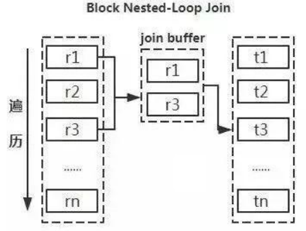

> 当前位置：【Java】05_JavaWeb_Database  -> 5.1_MySQL数据库

----


# 第一章 MySQL 下载安装和配置


## 0、MySQL的下载

### 下载地址

- https://downloads.mysql.com/archives/community/


### 图形化界面工具

- 软件1：MySQLWorkBench

  https://dev.mysql.com/downloads/workbench/

- 软件2：Navicat（Win/Mac）

- 软件3：SQLyog（Win）


## 1、Docker - MySQL安装和配置

### 1.1 Docker-MySQL 官网地址

https://hub.docker.com/_/mysql


### 1.2 创建单容器

#### 步骤1：拉取镜像

```shell
docker pull mysql:5.7.34
```


#### 步骤2：备份镜像

```shell
cd /docker_data/
docker save mysql:5.7.34 -o mysql.5.7.34.tar
```


#### 步骤3：导入镜像

```shell
docker load -i mysql.5.7.34.tar
```


#### 步骤4：创建并运行容器

##### （1）使用命令

```shell
# --restart always：容器退出时总是重启
# --privileged=true：特权模式，不受限制地访问任何自己的系统调用，给容器提供了几乎所有主机（作为root）可以做的事情的权限
# -e , --env=[]：设置环境变量，容器中可以使用该环境变量

# Linux - 使用默认卷
docker run -itd --name mysql --restart always --privileged=true -p 3306:3306 -e MYSQL_ROOT_PASSWORD=root mysql:5.7.34 --character-set-server=utf8 --collation-server=utf8_general_ci

# Linux - 使用自定义卷挂载
docker run -itd --name mysql --restart always --privileged=true -p 3306:3306 -e MYSQL_ROOT_PASSWORD=root -v /docker_data/mysql:/var/lib/mysql mysql:5.7.34 --character-set-server=utf8 --collation-server=utf8_general_ci

# Mac - 使用自定义卷挂载
docker run -itd --name mysql --restart always --privileged=true -p 3306:3306 -e MYSQL_ROOT_PASSWORD=root -v /Users/td/Documents/03_DevTools/docker_data/mysql:/var/lib/mysql mysql:5.7.34 --character-set-server=utf8 --collation-server=utf8_general_ci
```

##### （2）使用 docker  compose

- TODO


#### 步骤5：进入容器

```shell
docker exec -it mysql bash
```


#### 步骤6：退出容器

```shell
exit
```


### 1.3 创建集群容器

#### （1）使用命令

#### （2）使用 docker  compose


## 2、Linux系统 -  MySQL安装和配置

### 2.1 MySQL 基本信息

```bash
- 安装目录： /usr/local/mysql
- 账户：root
- 密码：root
```


### 2.2  MySQL 安装和配置

- 步骤0：安装前的装备

```bash
- 添加 MySQL 组和 MySQL 用户，用于设置 MySQL 安装目录文件所有者和所属组
groupadd mysql
useradd -r -g mysql mysql

- 查看是否安装Mysql
chkconfig --list mysqld

- 切换到想要保存到的目录
mkdir /usr/local/download 
cd /usr/local/download/
```


- 步骤1：下载 MySQL（一般存放在执行本命令的目录下）

  wget [http://dev.MySQL.com/get/Downloads/MySQL-5.7/mysql-5.7.11-Linux-glibc2.5-x86_64.tar.gz](http://dev.mysql.com/get/Downloads/MySQL-5.7/mysql-5.7.11-Linux-glibc2.5-x86_64.tar.gz)

  

- 步骤2：解压二进制文件，更改 MySQL 目录名称，移动 MySQL 到/usr/local目录下

```bash
tar -zxvf mysql-5.7.11-Linux-glibc2.5-x86_64.tar.gz
mv mysql-5.7.11-linux-glibc2.5-x86_64 mysql
mv mysql /usr/local
```


- 步骤3：更改 MySQL 目录所属的组和用户，更改权限

```bash
cd /usr/local/mysql
chown -R mysql .
chgrp -R mysql .
```


- 步骤4：初始化 MySQL 配置表

```bash
mkdir data
yum -y install libaio.so.*
bin/mysqld --initialize --user=mysql --basedir=/usr/local/mysql --datadir=/usr/local/mysql/data

- 运行完上面3行命令后，此处会生成 MySQL 的密码，记下来
```


- 步骤5：将 MySQL 目录下除了data目录的所有文件，改回root用户所有，MySQL 用户只需作为 mysql/data/ 目录下所有文件的所有者

```bash
chown -R root .
chown -R mysql data
```


- 步骤6：复制配置文件，修改my.cnf关键配置

```bash
cp support-files/my-default.cnf /etc/my.cnf
vi /etc/my.cnf
```


- 步骤7：修改my.cnf内容（按下esc后，输入：wq 退出vim编辑器）

```bash
character-set-server=utf8
basedir = /usr/local/mysql
datadir = /usr/local/mysql/data
port = 3306
socket = /tmp/mysql.sock
```


- 步骤8：创建tmp目录，然后赋予 MySQL 权限

```bash
mkdir tmp
chown -R mysql:mysql tmp
```


- 步骤9：将mysqld服务加入开机自启动项

```bash
cp support-files/mysql.server /etc/init.d/mysql
chmod +x /etc/init.d/mysql
```


- 步骤10：把 MySQL 注册为开机启动的服务

```bash
chkconfig --add mysql
```


- 步骤11：查看是否添加成功

```bash
chkconfig --list mysql

显示结果为以下内容表示添加成功：
mysql 0:off 1:off 2:on 3:on 4:on 5:on 6:off
```


- 步骤12：开机自启，配置环境变量

```bash
（1）进入profile
vi /etc/profile

（2）按i编辑放在最后一行
# mysql
PATH=$PATH:/usr/local/mysql:/usr/local/mysql/bin
export PATH 

（3）退出vim之后，使其修改生效
source /etc/profile

（4）执行完可通过命令查看是否添加成功
echo $PATH
```


- 步骤13：第一次登录并修改密码

```bash
- 启动MySQL
service mysql start

- 登录 MySQL 服务
mysql -uroot -p

- 查看数据库
show databases;

- 使用数据库
use mysql

- 更改密码
alter user 'root'@'localhost' identified by 'tdcj@06300830';
update user set host='%' where user='root';
flush privileges;
```


- 步骤14：添加一个新用户

```bash
- 添加用户
grant all privileges on *.* to 'td'@'%' identified by 'td';
grant all privileges on *.* to 'cj'@'%' identified by 'cj';
grant all privileges on *.* to 'liweifa515'@'%' identified by 'root';
grant all privileges on *.* to 'jianan412'@'%' identified by 'root';

- 选择数据库
use mysql

- 查看用户
select host,user from user;
  +-----------+-----------+
  | host | user |
  +-----------+-----------+
  | % | td |
  | localhost | mysql.sys |
  | localhost | root |
  +-----------+-----------+ 

- 刷新配置
flush privileges;

- 退出mysql
quit
```


- 步骤15：停止firewalld服务（Centos从7开始默认用的是firewalld，这个是基于iptables的，虽然有iptables的核心，但是iptables的服务是没安装的）

```bash
sudo systemctl stop firewalld.service && sudo systemctl disable firewalld.service
```


- 步骤16：使用Navicat登录

```bash
- 用户名：td
- 密码：td
```


### 2.3 MySQL 启动和关闭

```bash
service mysql start
service mysql stop
service mysql restart
```


### 2.4 更改密码

（1）登录MySQL

```
mysql -u 用户名 -p
```

（2）选择数据库

```
use mysql;
```

（3）修改密码

```
set password for 用户名@localhost = password('密码'); 
```

（4）使配置生效

```
flush privileges;
```

（5）退出MySQL

```
quit;
```


### 2.5 root账户被删时，修改密码

（1）修改配置文件my.cnf

```
vim /etc/my.cnf
```

（2）在配置文件[mysqld]下添加语句，启动 MySQL 服务的时候跳过权限表认证

```
skip-grant-tables
```

（3）重启MySQL

```
service mysql restart
```

（4）用空密码的root 用户连接到MySQL

```
mysql -u root -p
```

（6）使用下列命令添加root账户

```mysql
use mysql;

insert into user set user='root',ssl_cipher='',x509_issuer='',x509_subject='';

flush privileges;

GRANT ALL PRIVILEGES ON *.* TO 'root'@'localhost' IDENTIFIED BY 'tdcj@06300830' WITH GRANT OPTION; 

flush privileges;
```

（7）查看root账户的权限（xxx_priv：Y表示成功）

```
select * from mysql.user where user='root'\G;
```

（8）修改配置文件my.cnf

```
vim /etc/my.cnf
```

（8）在配置文件[mysqld]下注释语句

```
#skip-grant-tables
```

（10）重启MySQL

```
service mysql restart
```


## 3、Win系统 -  MySQL安装和配置

### 3.1 MySQL 基本信息

```bash
- 安装目录：E:\06_study\MySQL_5.7.19
- 账户：root
- 密码：root
```


### 3.2 MySQL 配置 （cmd命令窗口下执行）

- 步骤1：配置环境变量

```java
MYSQL_HOME=E:\06_study\MySQL_5.7.19\
Path=%MYSQL_HOME%\bin;
```


- 步骤2：在安装目录的<span style='color:red'>根目录</span>下创建目录 data
  E:\06_study\MySQL_5.7.19\data


- 步骤3：修改安装目录下的 my.ini 中的路径（有的版本没有就直接创建该文件）

```bash
####################配置文件开始###################
[client]
default-character-set = utf8

[mysql]
default-character-set = utf8

[mysql.server]
default-character-set = utf8

[mysqld_safe]
default-character-set = utf8

[mysqld]
port=3306
basedir  ="E:/06_study/MySQL_5.7.19"
datadir  ="E:/06_study/MySQL_5.7.19/data"
tmpdir   ="E:/06_study/MySQL_5.7.19/data"
socket   ="E:/06_study/MySQL_5.7.19/mysql.sock"
log-error="E:/06_study/MySQL_5.7.19/data/mysql_error.log"
character-set-server=utf8 
collation-server=utf8_general_ci 

#server_id = 2

#skip-locking
max_connections=100
table_open_cache=256
query_cache_size=1M

tmp_table_size=32M
thread_cache_size=8

default-storage-engine=InnoDB
innodb_data_home_dir="E:/06_study/MySQL_5.7.19/data/"
innodb_flush_log_at_trx_commit =1
innodb_log_buffer_size=128M
innodb_buffer_pool_size=128M
innodb_log_file_size=10M
innodb_thread_concurrency=16
innodb-autoextend-increment=1000
join_buffer_size = 128M
sort_buffer_size = 32M
read_rnd_buffer_size = 32M
max_allowed_packet = 32M
explicit_defaults_for_timestamp=true
sql-mode="STRICT_TRANS_TABLES,NO_AUTO_CREATE_USER,NO_ENGINE_SUBSTITUTION"
sql_mode=NO_ENGINE_SUBSTITUTION,STRICT_TRANS_TABLES
####################配置文件结束###################
```


- 步骤4：在命令行中安装MySQL

```bash
# 切换目录
cd E:/06_study/MySQL_5.7.19/bin

# 初始化mysql
mysqld --initialize-insecure --user=mysql

# 执行安装mysql（安装成功显示Service successfully installed.）
mysqld install
```


- 步骤5：首次启动登录设置

```bash
- 启动mysql服务
net start mysql

- 登录mysql（第一次登录没有密码，直接回车）
mysql -u root -p

- 设置密码
set password for root@localhost = password('root');
set password for td@localhost = password('td');

- 刷新配置
flush privileges;
```


- 步骤6：设置开机自启

```bash
- 切换到bin目录
cd E:\06_study\MySQL_5.7.19\bin

- 执行命令
mysqld -nt --install
```


### 3.3 MySQL 启动和关闭

```bash
- 数据库的启动
net start mysql

- 数据库的关闭
net stop mysql
```


## 4、Mac系统 -  MySQL安装和配置

### 4.1 MySQL 基本信息

```bash
- 安装目录：/usr/local/
- 账户：root
- 密码：root
```


### 4.2 修改MySQL默认密码

- 步骤1：Mac系统 -> 系统偏好设置 -> mysql -> 在弹出页面中点击stop mysql server，关闭mysql服务

```bash
sudo /usr/local/mysql/support-files/mysql.server start
sudo /usr/local/mysql/support-files/mysql.server stop
sudo /usr/local/mysql/support-files/mysql.server restart
```

- 步骤2：进入终端，获取管理员权限

```bash
cd /usr/local/mysql/bin/
sudo s:u
```

- 步骤3：禁止mysql验证功能（回车后，mysql会自动重启，偏好设置中mysql的状态会变成running）

```bash
./mysqld_safe --skip-grant-tables &
```

- 步骤4：刷新配置

```bash
./mysql
FLUSH PRIVILEGES;
```

- 步骤5：修改密码

```bash
SET PASSWORD FOR 'root'@'localhost' = PASSWORD('你的新密码’);
```


### 4.3 解决MySQL和navicat下，表的中文乱码问题

- 步骤1：将安装目录下的my.cnf复制到 /etc文件夹下，开始编辑

```bash
vim /etc/my.cnf
```

- 步骤2：复制以下内容到my.cnf文件（esc保存文件，:wq退出vim）

```bash
# Example MySQL config file for medium systems. 
# 
# This is for a system with little memory (32M - 64M) where MySQL plays 
# an important part, or systems up to 128M where MySQL is used together with 
# other programs (such as a web server) 
# 
# MySQL programs look for option files in a set of 
# locations which depend on the deployment platform. 
# You can copy this option file to one of those 
# locations. For information about these locations, see: 
# http://dev.mysql.com/doc/mysql/en/option-files.html
# 
# In this file, you can use all long options that a program supports. 
# If you want to know which options a program supports, run the program 
# with the "--help" option. 
# The following options will be passed to all MySQL clients 
[client]
default-character-set=utf8
#password = your_password 
port = 3306 
socket = /tmp/mysql.sock 
# Here follows entries for some specific programs 
# The MySQL server 
[mysqld]
character-set-server=utf8
init_connect='SET NAMES utf8
port = 3306 
socket = /tmp/mysql.sock 
skip-external-locking 
key_buffer_size = 16M 
max_allowed_packet = 16M 
table_open_cache = 64 
sort_buffer_size = 512K 
net_buffer_length = 8K 
read_buffer_size = 256K 
read_rnd_buffer_size = 512K 
myisam_sort_buffer_size = 8M 
character-set-server=utf8 
init_connect='SET NAMES utf8' 
# Don't listen on a TCP/IP port at all. This can be a security enhancement, 
# if all processes that need to connect to mysqld run on the same host. 
# All interaction with mysqld must be made via Unix sockets or named pipes. 
# Note that using this option without enabling named pipes on Windows 
# (via the "enable-named-pipe" option) will render mysqld useless! 
# 
#skip-networking

# Replication Master Server (default) 
# binary logging is required for replication 
log-bin=mysql-bin

# binary logging format - mixed recommended 
binlog_format=mixed

# required unique id between 1 and 2^32 - 1 
# defaults to 1 if master-host is not set 
# but will not function as a master if omitted 
server-id = 1

# Replication Slave (comment out master section to use this) 
# 
# To configure this host as a replication slave, you can choose between 
# two methods : 
# 
# 1) Use the CHANGE MASTER TO command (fully described in our manual) - 
# the syntax is: 
# 
# CHANGE MASTER TO MASTER_HOST=<host>, MASTER_PORT=<port>, 
# MASTER_USER=<user>, MASTER_PASSWORD=<password> ; 
# 
# where you replace <host>, <user>, <password> by quoted strings and 
# <port> by the master's port number (3306 by default). 
# 
# Example: 
# 
# CHANGE MASTER TO MASTER_HOST='125.564.12.1', MASTER_PORT=3306, 
# MASTER_USER='joe', MASTER_PASSWORD='secret'; 
# 
# OR 
# 
# 2) Set the variables below. However, in case you choose this method, then 
# start replication for the first time (even unsuccessfully, for example 
# if you mistyped the password in master-password and the slave fails to 
# connect), the slave will create a master.info file, and any later 
# change in this file to the variables' values below will be ignored and 
# overridden by the content of the master.info file, unless you shutdown 
# the slave server, delete master.info and restart the slaver server. 
# For that reason, you may want to leave the lines below untouched 
# (commented) and instead use CHANGE MASTER TO (see above) 
# 
# required unique id between 2 and 2^32 - 1 
# (and different from the master) 
# defaults to 2 if master-host is set 
# but will not function as a slave if omitted 
#server-id = 2 
# 
# The replication master for this slave - required 
#master-host = <hostname> 
# 
# The username the slave will use for authentication when connecting 
# to the master - required 
#master-user = <username> 
# 
# The password the slave will authenticate with when connecting to 
# the master - required 
#master-password = <password> 
# 
# The port the master is listening on. 
# optional - defaults to 3306 
#master-port = <port> 
# 
# binary logging - not required for slaves, but recommended 
#log-bin=mysql-bin

# Uncomment the following if you are using InnoDB tables 
#innodb_data_home_dir = /usr/local/mysql/data 
#innodb_data_file_path = ibdata1:10M:autoextend 
#innodb_log_group_home_dir = /usr/local/mysql/data 
# You can set .._buffer_pool_size up to 50 - 80 % 
# of RAM but beware of setting memory usage too high 
#innodb_buffer_pool_size = 16M 
#innodb_additional_mem_pool_size = 2M 
# Set .._log_file_size to 25 % of buffer pool size 
#innodb_log_file_size = 5M 
#innodb_log_buffer_size = 8M 
#innodb_flush_log_at_trx_commit = 1 
#innodb_lock_wait_timeout = 50

[mysqldump] 
quick 
max_allowed_packet = 16M

[mysql] 
no-auto-rehash 
# Remove the next comment character if you are not familiar with SQL 
#safe-updates 
default-character-set=utf8

[myisamchk] 
key_buffer_size = 20M 
sort_buffer_size = 20M 
read_buffer = 2M 
write_buffer = 2M

[mysqlhotcopy] 
interactive-timeout
```

- 步骤3：进入MySQL数据库，输入电脑密码

```bash
mysql -u root -p
```

- 步骤4：在MySQL的数据库界面，使用数据库

```bash
USE 数据库名;
```

- 步骤5：选择表
- 步骤6：查看该表字符集

```bash
show variables like ‘%char%’;
```


## 5、报错集锦

### 5.1 导入数据报错，2006 - MySQL server has gone away

- 问题描述：导入数据报错，2006 - MySQL server has gone away

- 解决方法：更改max_allowed_packet的值（如：max_allowed_packet=16M），然后重启Mysql

```java
- Win系统，在my.ini配置文件中更改（Mysql目录下）
- Mac系统，在my.cnf配置文件中更改（/private/etc/my.cnf）
```


### 5.2  MySQL：ERROR 1040: Too many connections

- 问题描述：连接数满
- 解决方法：修改MySQL配置文件

```shell
Win：安装根目录下 my.ini
Linux：/etc/my.cnf

# MySQL 最大连接数
max_connections=3600
```


### 5.3 java.sql.SQLException: The server time zone value 'xxxx' is unrecognized or represents more than one time zone

- 解决方法：jdbc.properties 文件中 url 后设置时区

```properties
jdbc.url = jdbc:mysql:///JavaWeb_7.1_Mybatis?serverTimezone=UTC
```


# 第二章 MySQL 语法

## 0、约束

### （1）主键约束

```sql
# 约束的作用: 对表中的数据进行进一步的限制，从而保证数据的正确性、有效性、完整性.
# 违反约束的不正确数据，将无法插入到表中

# 主键约束
# 特点：不可重复、唯一、非空
# 作用：用来表示数据库中的每一条记录

# ------------------------------------------------------

# 添加主键约束
#（1）建表时，添加主键约束
# 字段名 字段类型 primary key auto_increment,

# auto_increment：主键自增，字段类型必须是整数类型，默认的开始值是1

# delete 和 truncate 对自增长的影响
# delete：只是删除表中所有数据，对自增没有影响
# truncate：将整个表删除掉，然后创建一个新的表，自增的主键，重新从1开始

# 自定义主键自增的起始值
create table emp2
(
    id   int primary key auto_increment,
    name varchar(20),
    sex  char(1)
) auto_increment = 100;

#（2）建表后，插入主键约束
# alter table 表名 add primary key(主键列名);

# ------------------------------------------------------

# 删除主键约束
# alter table 表名 drop primary key;
```


### （2）非空约束

```sql
# 非空约束
# 特点：某一列不予许为空

# 语法格式
# 字段名 字段类型 not null
```


### （3）唯一约束

```sql
# 唯一约束
# 特点：表中的某一列的值不能重复(对 null 不做唯一的判断)

# 语法格式
# 字段名 字段类型 unique

# 添加唯一约束
create table emp3
(
    id   int primary key auto_increment,
    name varchar(20) unique,
    sex  char(1)
);

#【区别】主键约束与唯一约束
# 主键约束，唯一且不能够为空
# 唯一约束，唯一但是可以为空
# 一个表中只能有一个主键，但是可以有多个唯一约束
```


### （4）外键约束

```sql
# 外键：在从表中与主表的主键对应的那个字段
# 优点：外键约束可以让两张表之间产生一个对应关系，从而保证主从表的引用的完整性

# 创建外键约束
# （1）新建表时添加外键
# constraint 外键约束名称 foreign key(外键字段名) references 主表名(主键字段名)

# （2）已有表添加外键
# alter table 从表 add constraint 外键约束名称 foreign key(外键字段名) references 主表(主键字段名);

# 删除外键约束
# alter table 从表 drop foreign key 外键约束名称;


# 注意事项
# 从表外键类型必须与主表主键类型一致，否则创建失败
# 添加数据时，应该先添加主表中的数据
# 删除数据时，应该先删除从表中的数据
```


### （5）默认值约束

```sql
# 默认值约束
# 用来指定某列的默认值

# 语法格式
# 字段名 字段类型 default 默认值
```


## 1、DDL（数据定义语言）

### 1.1 操作库

#### （1）创建数据库

```mysql
# 创建数据库
# create database 数据库名;
create database if not exists `td_mysql_db` default character set utf8mb4 collate utf8mb4_unicode_ci;
```


#### （2）选择数据库

```mysql
# 选择数据库
# use 数据库名;
use td_mysql_db;
```


#### （3）删除数据库

```mysql
# 删除数据库
# drop database 数据库名;
drop database td_mysql_db;
```


### 1.2 操作表

#### （1）创建表

```mysql
# 创建表
# create table 表名 (列名 列类型);
CREATE TABLE IF NOT EXISTS `tb_admin_info`
(
    `id`          INT PRIMARY KEY AUTO_INCREMENT COMMENT '序号',
    `username`    VARCHAR(20) NOT NULL COMMENT '登录账户',
    `pwd`         VARCHAR(20) NOT NULL COMMENT '密码',
    `sex`         VARCHAR(20) COMMENT '性别',
    `create_user` VARCHAR(20) COMMENT '创建人',
    `create_time` DATE COMMENT '创建时间',
    `update_user` VARCHAR(20) COMMENT '修改人',
    `update_time` TIMESTAMP DEFAULT CURRENT_TIMESTAMP COMMENT '修改时间',
    `effective`   VARCHAR(1) COMMENT '是否有效（1有效 0无效）'
) COMMENT ='管理员信息管理表' ENGINE = InnoDB
                      DEFAULT CHARSET = utf8;
```

- 解析

```sql
- ``用于标注 表名和字段名
- ''用于标注 表和字段的 注释
- COMMENT 用于给表和字段标注注释
- PRIMARY KEY 关键字用于定义列为主键（可以使用多列来定义主键，列间以逗号分隔）
- AUTO_INCREMENT 定义列为自增的属性，一般用于主键，数值会自动加1
- NULL 表示该字段可以为空（默认不写就是为 NULL ）
- NOT NULL 表示该字段不能为空（添加记录时，如果该字段不输入任何数据，为NULL ，会报错）
- ENGINE 设置存储引擎
- CHARSET 设置编码
```


#### （2）修改表

```mysql
zhuyaoshi z# 修改表注释
ALTER TABLE tb_admin_info COMMENT '管理员表';

# 修改列注释
ALTER TABLE tb_admin_info MODIFY COLUMN username VARCHAR(100) COMMENT '用户名';

# 修改列类型（不带注释就会修改为无注释）
ALTER TABLE tb_admin_info MODIFY COLUMN pwd BIGINT;
```


#### （3）删除表

```mysql
# 删除表
# DROP TABLE 数据库名;
DROP TABLE tb_admin_info ;
```


#### （4）复制表

```mysql
#（1）只复制表结构到新表（带字段注释）
# create table 新表 select * from 旧表 where 1=2;
create table tb_admin_info1 select * from tb_admin_info where 1=2;

#（2）只复制表结构到新表（带表注释、字段注释）
# create table 新表 like 旧表;
create table tb_admin_info2 like tb_admin_info;

#（3）复制表结构及数据到新表（带字段注释）
# create table 新表 select * from 旧表;
create table tb_admin_info3 select * from tb_admin_info;

#（4）复制旧表的部分字段到新表（带数据、带字段注释）
# create table 新表 as ( select 旧表字段1, 旧表字段2 from 旧表);
create table tb_admin_info4 as ( select username, pwd from tb_admin_info);

#（5）旧表字段改名到新表（带数据、带字段注释）
# create table 新表 as (select id, 旧表字段1 as 新表字段1, 旧表字段2 as 新表字段2 from 旧表);
create table tb_admin_info5 as (select id, username as username5, pwd as pwd5 from tb_admin_info);

#（6）复制旧表的部分数据到新表（带数据、带字段注释）
# create table 新表 as ( select * from 旧表 where left(字段名,最左边的字符数) = '字段名的值匹配条件');
create table tb_admin_info6 as ( select * from tb_admin_info where left(username,2) = 'td');

# 创建新表的同时定义表中的字段信息（带数据、带字段注释）
create table tb_admin_info7 ( id integer not null auto_increment primary key) as ( select * from tb_admin_info);

```


#### （5）临时表

```
- 临时表只在当前连接可见，当关闭连接时，Mysql 会自动删除表并释放所有空间
- 如果使用了 MySQL 客户端程序连接来创建临时表，那么只有在关闭客户端程序时才会销毁临时表，当然也可以手动销毁

- 临时表在 MySQL 3.23 版本中添加，如果 MySQL 版本低于 3.23 版本就无法使用 MySQL 的临时表
```


```mysql
# 创建临时表 - 通过查询其他表
# create temporary table 临时表名 as (select *  from 旧的表名 limit 0,10000);
create temporary table temp_tb_admin_info as (select *  from tb_admin_info limit 0,10000);

# 查询临时表
select * from temp_tb_admin_info;

# 删除临时表
drop table temp_tb_admin_info;
```


## 2、DML（数据操作语言）

### 2.0 数据类型

#### （1）数值类型

- 严格数值数据类型：INTEGER、SMALLINT、DECIMAL、NUMERIC
- 近似数值数据类型：FLOAT、REAL、DOUBLE、PRECISION

| 类型         | 大小                                     | 范围（有符号）                                               | 范围（无符号）                                               | 用途                |
| ------------ | ---------------------------------------- | ------------------------------------------------------------ | ------------------------------------------------------------ | ------------------- |
| TINYINT      | 1 byte                                   | (-128，127)                                                  | (0，255)                                                     | 小整数值            |
| SMALLINT     | 2 bytes                                  | (-32 768，32 767)                                            | (0，65 535)                                                  | 大整数值            |
| MEDIUMINT    | 3 bytes                                  | (-8 388 608，8 388 607)                                      | (0，16 777 215)                                              | 大整数值            |
| INT或INTEGER | 4 bytes                                  | (-2 147 483 648，2 147 483 647)                              | (0，4 294 967 295)                                           | 大整数值            |
| BIGINT       | 8 bytes                                  | (-9,223,372,036,854,775,808，9 223 372 036 854 775 807)      | (0，18 446 744 073 709 551 615)                              | 极大整数值          |
| FLOAT        | 4 bytes                                  | (-3.402 823 466 E+38，-1.175 494 351 E-38)，<br/>0，<br/>(1.175 494 351 E-38，3.402 823 466 351 E+38) | 0，(1.175 494 351 E-38，3.402 823 466 E+38)                  | 单精度<br/>浮点数值 |
| DOUBLE       | 8 bytes                                  | (-1.797 693 134 862 315 7 E+308，-2.225 073 858 507 201 4 E-308)，<br/>0，<br/>(2.225 073 858 507 201 4 E-308，1.797 693 134 862 315 7 E+308) | 0，(2.225 073 858 507 201 4 E-308，1.797 693 134 862 315 7 E+308) | 双精度<br/>浮点数值 |
| DEC或DECIMAL | 对DECIMAL(M,D) ，如果M>D，为M+2否则为D+2 | 依赖于M和D的值                                               | 依赖于M和D的值                                               | 小数值              |


#### （2）日期/时间类型

- 每个时间类型有一个有效值范围和一个"零"值，当指定不合法的MySQL不能表示的值时使用"零"值
- 特别的：TIMESTAMP类型有专有的自动更新特性

| 类型      | 大小（bytes） | 范围                                                         | 格式                | 用途                     |
| --------- | ------------- | ------------------------------------------------------------ | ------------------- | ------------------------ |
| DATE      | 3             | 1000-01-01/9999-12-31                                        | YYYY-MM-DD          | 日期值                   |
| TIME      | 3             | '-838:59:59'/'838:59:59'                                     | HH:MM:SS            | 时间值或持续时间         |
| YEAR      | 1             | 1901/2155                                                    | YYYY                | 年份值                   |
| DATETIME  | 8             | 1000-01-01 00:00:00/9999-12-31 23:59:59                      | YYYY-MM-DD HH:MM:SS | 混合日期和时间值         |
| TIMESTAMP | 4             | 1970-01-01 00:00:00/2038结束时间是第 **2147483647** 秒，北京时间 **2038-1-19 11:14:07**，格林尼治时间 2038年1月19日 凌晨 03:14:07 | YYYYMMDD HHMMSS     | 混合日期和时间值，时间戳 |


#### （3）字符类型

- char(n) 和 varchar(n) 中括号中 n 代表字符的个数，比如 CHAR(30) 就可以存储 30 个字符

- BLOB 类型：TINYBLOB、BLOB、MEDIUMBLOB、LONGBLOB（区别在于可容纳存储范围不同）
- TEXT 类型：TINYTEXT、TEXT、MEDIUMTEXT、LONGTEXT

| 类型       | 大小                  | 格式       | 用途                            |
| ---------- | --------------------- | ---------- | ------------------------------- |
| CHAR       | 0-255 bytes           | char(n)    | 定长字符串                      |
| VARCHAR    | 0-65535 bytes         | varchar(n) | 变长字符串                      |
| TINYBLOB   | 0-255 bytes           |            | 不超过 255 个字符的二进制字符串 |
| TINYTEXT   | 0-255 bytes           |            | 短文本字符串                    |
| BLOB       | 0-65 535 bytes        |            | 二进制形式的长文本数据          |
| TEXT       | 0-65 535 bytes        |            | 长文本数据                      |
| MEDIUMBLOB | 0-16 777 215 bytes    |            | 二进制形式的中等长度文本数据    |
| MEDIUMTEXT | 0-16 777 215 bytes    |            | 中等长度文本数据                |
| LONGBLOB   | 0-4 294 967 295 bytes |            | 二进制形式的极大文本数据        |
| LONGTEXT   | 0-4 294 967 295 bytes |            | 极大文本数据                    |


### 3.1 插入数据 - 增

```mysql
# 插入数据 - 一条
# insert into 表名 (字段1, 字段2) values (字段1的值, 字段2的值);
insert into tb_admin_info (username, pwd, sex) values ('TD', '123','男');

# 插入数据 - 多条
# insert into 表名 (字段1, 字段2) values (字段1的值, 字段2的值), (字段1的值, 字段2的值) ;
insert into tb_admin_info (username, pwd, sex) values ('TD', '123','男'), ('CJ', '123','男'), ('Jan', '123', '男'), ('Shirley', '123', '女');
```


### 3.2 修改数据 - 改

```sql
# 修改数据
# 不带条件的修改
# update 表名 set 列名 = 值;

# 带条件的修改
# update 表名 set 列名 = 值 where 条件表达式：字段名 = 值;
```


### 3.3 删除数据 - 删

#### （1）单表删除

```sql
# 1、delete 删除整张表的数据，不会释放表所占用的空间，并且操作是可以撤销
# 删除所有数据
# delete from 表名;

# 指定条件 删除数据
# delete from 表名 where 字段名 = 值;

# 2、drop 删除表的结构，以及被依赖的约束(constrain)、触发器(trigger)、索引(index)
# drop table 数据库名;
drop table tb_admin_info ;

# 判断表是否存在， 存在的话就删除,不存在就不执行删除
drop table if exists tb_admin_info;

# 3、truncate 删除内容、释放空间但不删除表的结构(定义)
# truncate table 表名;


# 注意
# truncate 只能对table
# delete 可以是 table 和 view
# 执行速度：drop > truncate > delete
```

#### （2）级联删除

```sql
# 级联删除：删除主表数据的同时，也删除掉从表数据

# 在建表的时候，添加级联删除（ON DELETE CASCADE）
CREATE TABLE employee
(
    eid     INT PRIMARY KEY AUTO_INCREMENT,
    ename   VARCHAR(20),
    age     INT,
    dept_id INT,
    CONSTRAINT emp_dept_fk FOREIGN KEY (dept_id) REFERENCES department (id)
        ON DELETE CASCADE -- 添加级联删除
);
```


## 3、DQL（数据查询语言）

### 3.1 操作数据（单表查询）

#### （1）简单查询

```sql
# 查询表的所有数据
# select * from 表名;
select * from tb_admin_info;

# 查询表字段数据
# select 字段1,字段2,字段3 from 表名;
select id,username,pwd,create_user,create_time,update_user,update_time,effective from tb_admin_info;

# 别名查询
select id, username as '用户名', pwd as '密码' from tb_admin_info;

# 去重查询 distinct
select distinct username from tb_admin_info;

# 运算查询 (查询结果参与运算)
select id + 1, username from tb_admin_info;

# 获取最近的 id 值
#（1）查询和插入所使用的Connection对象必须是同一个才可以，否则返回值是不可预料的
#（2）LAST_INSERT_ID 是与table无关的，如果向表a插入数据后，再向表b插入数据，LAST_INSERT_ID返回表b中的Id值
#（3）假如你使用一条INSERT语句插入多个行，  LAST_INSERT_ID() 只返回插入的第一行数据时产生的值
#（4）假如你使用 INSERT IGNORE而记录被忽略，则AUTO_INCREMENT 计数器不会增量，而 LAST_INSERT_ID() 返回0, 这反映出没有插入任何记录。
select last_insert_id();
```


#### （2）条件查询（Where）

| 操作符 | 描述                                           |
| ------ | ---------------------------------------------- |
| =      | 等号，检测两个值是否相等                       |
| <>, != | 不等于，检测两个值是否相等                     |
| >      | 大于号，检测左边的值是否大于右边的值           |
| <      | 小于号，检测左边的值是否小于右边的值           |
| >=     | 大于等于号，检测左边的值是否大于或等于右边的值 |
| <=     | 小于等于号，检测左边的值是否小于或等于右边的值 |

```mysql
# 1、比较运算符
#（1） >    <     >=      <=     =    <>    !=
#    大于、小于、大于等于、小于等于、等于、不等于、不等于

#（2）between ... and ... 在某一区间的值
# select * from 表名 where 字段 between xx and xx;

#（3）in 集合表示多个值，使用逗号分隔，in中的每个数据都会作为一次条件，只要满足条件就会显示
# select * from 表名 where 字段 in ('xx','xx');

#（4）Like子句 - 模糊查询
# select * from 表名 where 条件1 like '%值%';
select * from tb_admin_info where username like '%T%'; -- 查看包含T的
select * from tb_admin_info where username like 'T%';  -- 查询 T 开头的
select * from tb_admin_info where username like '%T';  -- 查询 T 结尾的
select * from tb_admin_info where username like 'T';   -- 查询值为 T 的

# select * from 表名 where 条件1 like '_值_';
select * from tb_admin_info where username like '_t_';    -- 该值有三位且中间字母是 t 的
select * from tb_admin_info where username like '_t';     -- 该值有两位且结尾字母是 t 的
select * from tb_admin_info where username like 't_';     -- 该值有两位且开头字母是 t 的

#（5）查询某一列为 NULL 的值
# select * from 表名 where 字段 is null;
select * from tb_admin_info where effective is null;


# 2、逻辑运算符
#（1）多个条件同时成立（and 或者 &&）
# select * from 表名 where 条件1 = '值' and 条件2 = '值';
select * from tb_admin_info where username = 'TD' and pwd = '123';
# select * from 表名 where 条件1 = '值' && 条件2 = '值';
select * from tb_admin_info where username = 'TD' && pwd = '123';

#（2）多个条件任一成立（or 或者 ||）
# select * from 表名 where 条件1 = '值' or 条件2 = '值';
select * from tb_admin_info where username = 'TD' or username = 'CJ';
# select * from 表名 where 条件1 = '值' || 条件2 = '值';
select * from tb_admin_info where username = 'TD' || username = 'CJ';

#（3）不成立，取反（not）
select * from tb_admin_info where username not in ('TD');
select * from tb_admin_info where id not between 2 and 3;
```


#### （3）排序查询（Order by）

```sql
# asc：升序（默认，可以省略不写）
# desc：降序

# 1、单列排序：只按照某一个字段进行排序
# select 字段1, 字段2 from 表名1, 表名2 order by 字段1, 字段2;
select * from tb_admin_info order by username ;

# select 字段1, 字段2 from 表名1, 表名2 order by 字段1, 字段2 asc;
select * from tb_admin_info order by username asc ;

# select 字段1, 字段2 from 表名1, 表名2 order by 字段1, 字段2 desc;
select * from tb_admin_info order by username desc ;

# 2、组合排序：同时对多个字段进行排序, 如果第一个字段相同 就按照第二个字段进行排序,以此类推
select * from tb_admin_info order by username desc, id desc ;

# ---------------------------------------------------------------------------------

#【待验证】拼音排序：如果字符集采用的是 gbk(汉字编码字符集)，直接在查询语句后边添加 ORDER BY
select * from tb_admin_info order by username desc ;

#【待验证】拼音排序：如果字符集采用的是 utf8(万国码)，需要先对字段进行转码然后排序
select * from tb_admin_info order by CONVERT(username using gbk) desc ;
```


#### （4）聚合函数

```sql
# select 聚合函数(字段名) from 表名;

# count(字段) 统计指定列不为NULL的记录行数
# sum(字段)   计算指定列的数值和
# max(字段)   计算指定列的最大值
# min(字段)   计算指定列的最小值
# avg(字段)   计算指定列的平均值

# -----------------------------------------------------

# 1、count(字段) 统计指定列不为NULL的记录行数
#（1）1与 * 效果一样
select COUNT(1) from tb_admin_info;
select COUNT(*) from tb_admin_info;

#（2）统计表中某个字段的记录条数
select COUNT(username) from tb_admin_info;

#（3）count函数忽略了空值，所以使用时注意不要使用带有null的列进行统计
```


#### （5）分组查询

```sql
# 分组查询：使用 group by 语句,对查询的信息进行分组,相同数据作为一组（一般和聚合函数一起使用）
# select 分组字段/聚合函数 from 表名 group by 分组字段 [having 条件];

select sex from tb_admin_info group by sex;
select count(sex),sex from tb_admin_info group by sex;

# 在分组后，对数据进行过滤，使用关键字 having，作用类似于where条件
# 查询平均薪资大于6000的部门
# select dept_name, avg(salary)
# from emp
# where dept_name is not null
# group by dept_name
# having avg(salary) > 6000;

# ---------------------------------------------------------
#【区别】where 与 having
# where 进行分组前的过滤
# where 后面不能写聚合函数

# having 是分组后的过滤
# having 后面可以写聚合函数
```


（6）限制查询（Limit）

```sql
# 通过 limit 指定查询多少行数据，限制返回的查询结果的行数

# 参数说明
# select * : 返回所有记录
# limit N : 返回 N 条记录
# offset M : 起始行数, 从0开始记数, 如果省略，则默认为0
# limit N,M : 相当于 limit M offset N , 从第 N 条记录开始, 返回 M 条记录

# select 字段1,字段2 from 表名 where 条件1,条件2 order by 字段3,字段4 desc limit n offset m ;
# select 字段1,字段2 from 表名 where 条件1,条件2 order by 字段3,字段4 desc limit n, m ;

# 查询前5条
select * from tb_admin_info limit 0,5;

# 从第4条开始,查询6条
select * from tb_admin_info limit 3,6;

# 分页公式：起始索引 = (当前页 - 1) * 每页条数
# 每页显示3条数据
select * from tb_admin_info limit 0,3;  -- 第 1 页
select * from tb_admin_info limit 3,3;  -- 第 2 页
select * from tb_admin_info limit 6,3;  -- 第 3 页
```


### 3.2 操作数据（多表查询）

- 内连接：inner join，只获取两张表中，交集部分的数据.
- 左外连接：left join，以左表为基准，查询左表的所有数据，以及与右表有交集的部分
- 右外连接：right join，以右表为基准，查询右表的所有的数据，以及与左表有交集的部分

#### （1）交叉连接查询（笛卡尔积）

```sql
# 交叉连接查询，会产生笛卡尔积，得到2个表的数据的乘积
# select 字段名 from 表1, 表2;
```

#### （2）内连接查询

```sql
# 内连接的特点：通过指定的条件去匹配两张表中的数据，匹配上就显示，匹配不上就不显示
# 比如通过: 从表的外键 = 主表的主键 方式去匹配

# -------------------------------------------------------------------

# 隐式内连接
# from子句后面直接写 多个表名 使用where指定连接条件
# select 字段名 from 左表, 右表 where 连接条件;

# 查询所有商品信息和对应的分类信息
# select * from products,category where category_id = cid;

# -------------------------------------------------------------------

# 显式内连接
# 使用 inner join ...on（inner 可省略）
# select 字段名 from 左表 inner join 右表 on 条件;

# 查询所有商品信息和对应的分类信息
# select * from products p inner join category c on p.category_id = c.cid;
```

#### （3）外连接查询

```sql
# 左外连接的特点
# 以左表为基准，匹配右边表中的数据，如果匹配的上，就展示匹配到的数据
# 如果匹配不到，左表中的数据正常展示，右边的展示为null

# 使用 left outer join（outer 可以省略）
# select 字段名 from 左表 left outer join 右表 on 条件;
# select * from category c left join products p on c.`cid`= p.`category_id`;

# -------------------------------------------------------------------

# 右外连接的特点
# 以右表为基准，匹配左边表中的数据，如果能匹配到，展示匹配到的数据
# 如果匹配不到，右表中的数据正常展示，左边展示为null

# 使用 right outer join（outer 可以省略）
# select 字段名 from 左表 right outer join 右表 on 条件;
# select * from products p right join category c on p.`category_id` = c.`cid`;
```


#### （4）联合查询（Union）

```sql
# union 左右两边的列的数量要一样，一般是两个表有相同的列
# all: 可选，返回所有结果集，包含重复数据
# distinct: 可选，删除结果集中重复的数据（默认情况下 union 操作符已经删除了重复数据，所以 distinct 修饰符对结果没影响）
# select 字段1, 字段2 from 表1 where 条件1 = '' union/all/distinct select 字段1, 字段2 from 表2 where 条件2 = '';

# union 语句：用于将不同表中相同列中查询的数据展示出来（不包括重复数据）
# select 列名称 from 表名称 union select 列名称 from 表名称 order by 列名称;
select id, username, pwd from tb_admin_info union select id, username, pwd from tb_admin_info order by username;
select id, username, pwd from tb_admin_info union select id, username, pwd from tb_admin_info order by username;

# union all 语句：用于将不同表中相同列中查询的数据展示出来（包括重复数据）
# select 列名称 from 表名称 union all select 列名称 from 表名称 order by 列名称;
select id, username, pwd from tb_admin_info union all select id, username, pwd from tb_admin_info order by username;
```


#### （5）子查询

```sql
# 子查询概念
# 一条select 查询语句的结果，作为另一条 select 语句的一部分

# 子查询的特点
# 子查询必须放在小括号中
# 子查询一般作为父查询的查询条件使用

# 子查询常见分类
# where型子查询：将子查询的结果，作为父查询的比较条件
# from型子查询：将子查询的结果，作为一张表，提供给父层查询使用
# exists型子查询：子查询的结果是单列多行，类似一个数组，父层查询使用 IN 函数，包含子查询的结果

# -------------------------------------------------------------------

# 子查询的结果作为查询条件
# select 查询字段 from 表 where 字段=（子查询）;

# 将最高价格作为条件,获取商品信息
# select * from products where price = (select max(price) from products);

# -------------------------------------------------------------------

# 子查询的结果作为一张表
# 当子查询作为一张表的时候，需要起别名，否则无法访问表中的字段
# select 查询字段 from （子查询）表别名 where 条件;

# select p.`pname`, p.`price`, c.cname
# from products p
#          inner join (select * from category) c on p.`category_id` = c.cid
# where p.`price` > 500;

# -------------------------------------------------------------------


# 子查询总结
# 1. 子查询如果查出的是一个字段(单列)， 那就在where后面作为条件使用
# 2. 子查询如果查询出的是多个字段(多列)，就当做一张表使用(要起别名)
```


## 4、DCL（数据控制语言）

### 4.1 创建用户

#### 方式 1：使用 create user 语句创建用户

```sql
# create user '用户名'@'主机名' identified by '密码';
create user 'td'@'localhost' identified by 'td';

# % 表示用户可以在任意电脑登录 mysql 服务器
create user 'cj'@'%' identified by 'cj';
```

#### 方式 2：使用 insert 语句新建用户

```sql
# 可以使用 insert 语句将用户的信息添加到 mysql.user 表中，但必须拥有对 mysql.user 表的 insert 权限
# 通常 insert 语句只添加 host、user、authentication_string 这3个字段的值
# mysql 5.7+，user 表中的密码字段为authentication_string
# mysql 5.7-，user 表中的密码字段为 password
insert into mysql.user(host, user, authentication_string, ssl_cipher, x509_issuer, x509_subject)
values ('localhost', 'test1', password('test1'), '', '', '');
```

#### 方式 3：使用 grant 语句新建用户

```sql
# 权限：create、alter、select、insert、update（授予所有的权限则使用 all）
# grant 权限 1, 权限 2... on 数据库名.表名 to '用户名'@'主机名' identified by '密码';

# 创建 查询权限 的用户
grant select on *.* to 'test2'@localhost identified by 'test2';
grant select on *.* to 'test3'@'%' identified by 'test3';

# 创建 所有权限 的用户
grant all on *.* to 'test4'@localhost identified by 'test4';
grant all on *.* to 'test5'@'%' identified by 'test5';
```


#### 授权

```sql
# 格式
# GRANT priv_type [(column_list)] ON database.table
# TO user [IDENTIFIED BY [PASSWORD] 'password']
# [, user[IDENTIFIED BY [PASSWORD] 'password']] ...
# [WITH with_option [with_option]...]

# 其中：
# priv_type 参数表示权限类型；
# columns_list 参数表示权限作用于哪些列上，省略该参数时，表示作用于整个表；
# database.table 用于指定权限的级别；
# user 参数表示用户账户，由用户名和主机名构成，格式是“'username'@'hostname'”；
# IDENTIFIED BY 参数用来为用户设置密码；
# password 参数是用户的新密码。

# WITH 关键字后面带有一个或多个 with_option 参数。这个参数有 5 个选项，详细介绍如下：
# GRANT OPTION：被授权的用户可以将这些权限赋予给别的用户；
# MAX_QUERIES_PER_HOUR count：设置每个小时可以允许执行 count 次查询；
# MAX_UPDATES_PER_HOUR count：设置每个小时可以允许执行 count 次更新；
# MAX_CONNECTIONS_PER_HOUR count：设置每小时可以建立 count 个连接;
# MAX_USER_CONNECTIONS count：设置单个用户可以同时具有的 count 个连接。

# MySQL 中可以授予的权限有如下几组：
# 列权限，和表中的一个具体列相关。例如，可以使用 UPDATE 语句更新表 students 中 name 列的值的权限。
# 表权限，和一个具体表中的所有数据相关。例如，可以使用 SELECT 语句查询表 students 的所有数据的权限。
# 数据库权限，和一个具体的数据库中的所有表相关。例如，可以在已有的数据库 mytest 中创建新表的权限。
# 用户权限，和 MySQL 中所有的数据库相关。例如，可以删除已有的数据库或者创建一个新的数据库的权限。

# 在 GRANT 语句中可用于指定权限级别的值有以下几类格式：
# *：表示当前数据库中的所有表。
# *.*：表示所有数据库中的所有表。
# db_name.*：表示某个数据库中的所有表，db_name 指定数据库名。
# db_name.tbl_name：表示某个数据库中的某个表或视图，db_name 指定数据库名，tbl_name 指定表名或视图名。
# db_name.routine_name：表示某个数据库中的某个存储过程或函数，routine_name 指定存储过程名或函数名。
# TO 子句：如果权限被授予给一个不存在的用户，MySQL 会自动执行一条 CREATE USER 语句来创建这个用户，但同时必须为该用户设置密码。
```

#### 权限类型说明（授予数据库权限时）

| 权限名称                       | 对应user表中的字段    | 说明                                                         |
| ------------------------------ | --------------------- | ------------------------------------------------------------ |
| SELECT                         | Select_priv           | 表示授予用户可以使用 SELECT 语句访问特定数据库中所有表和视图的权限。 |
| INSERT                         | Insert_priv           | 表示授予用户可以使用 INSERT 语句向特定数据库中所有表添加数据行的权限。 |
| DELETE                         | Delete_priv           | 表示授予用户可以使用 DELETE 语句删除特定数据库中所有表的数据行的权限。 |
| UPDATE                         | Update_priv           | 表示授予用户可以使用 UPDATE 语句更新特定数据库中所有数据表的值的权限。 |
| REFERENCES                     | References_priv       | 表示授予用户可以创建指向特定的数据库中的表外键的权限。       |
| CREATE                         | Create_priv           | 表示授权用户可以使用 CREATE TABLE 语句在特定数据库中创建新表的权限。 |
| ALTER                          | Alter_priv            | 表示授予用户可以使用 ALTER TABLE 语句修改特定数据库中所有数据表的权限。 |
| SHOW VIEW                      | Show_view_priv        | 表示授予用户可以查看特定数据库中已有视图的视图定义的权限。   |
| CREATE ROUTINE                 | Create_routine_priv   | 表示授予用户可以为特定的数据库创建存储过程和存储函数的权限。 |
| ALTER ROUTINE                  | Alter_routine_priv    | 表示授予用户可以更新和删除数据库中已有的存储过程和存储函数的权限。 |
| INDEX                          | Index_priv            | 表示授予用户可以在特定数据库中的所有数据表上定义和删除索引的权限。 |
| DROP                           | Drop_priv             | 表示授予用户可以删除特定数据库中所有表和视图的权限。         |
| CREATE TEMPORARY TABLES        | Create_tmp_table_priv | 表示授予用户可以在特定数据库中创建临时表的权限。             |
| CREATE VIEW                    | Create_view_priv      | 表示授予用户可以在特定数据库中创建新的视图的权限。           |
| EXECUTE ROUTINE                | Execute_priv          | 表示授予用户可以调用特定数据库的存储过程和存储函数的权限。   |
| LOCK TABLES                    | Lock_tables_priv      | 表示授予用户可以锁定特定数据库的已有数据表的权限。           |
| ALL 或 ALL PRIVILEGES 或 SUPER | Super_priv            | 表示以上所有权限/超级权限                                    |

#### 权限类型说明（授予表权限时）

| 权限名称                       | 对应user表中的字段 | 说明                                                       |
| ------------------------------ | ------------------ | ---------------------------------------------------------- |
| SELECT                         | Select_priv        | 授予用户可以使用 SELECT 语句进行访问特定表的权限           |
| INSERT                         | Insert_priv        | 授予用户可以使用 INSERT 语句向一个特定表中添加数据行的权限 |
| DELETE                         | Delete_priv        | 授予用户可以使用 DELETE 语句从一个特定表中删除数据行的权限 |
| DROP                           | Drop_priv          | 授予用户可以删除数据表的权限                               |
| UPDATE                         | Update_priv        | 授予用户可以使用 UPDATE 语句更新特定数据表的权限           |
| ALTER                          | Alter_priv         | 授予用户可以使用 ALTER TABLE 语句修改数据表的权限          |
| REFERENCES                     | References_priv    | 授予用户可以创建一个外键来参照特定数据表的权限             |
| CREATE                         | Create_priv        | 授予用户可以使用特定的名字创建一个数据表的权限             |
| INDEX                          | Index_priv         | 授予用户可以在表上定义索引的权限                           |
| ALL 或 ALL PRIVILEGES 或 SUPER | Super_priv         | 所有的权限名                                               |

#### 权限类型说明（授予列权限时）

```
权限类型的值只能指定为 SELECT、INSERT 和 UPDATE，同时权限的后面需要加上列名列表 column-list
```


### 4.2 查看用户

```sql
# 查看所有用户信息和权限
select * from mysql.user;

# 查看某个用户的权限信息
# show grants for '用户名'@'主机名/主机ip';
show grants for 'root'@'localhost';
```


### 4.3 修改用户

```sql
# rename user <旧用户> to <新用户>
# 必须拥有 mysql 数据库的 update 权限或全局 create user 权限
rename user 'test1'@'localhost' to 'test2'@'localhost';
```


### 4.4 删除用户

```sql
# 使用 drop user 语句删除普通用户
# drop user '用户名'@'主机名';

# 使用 delete 语句删除普通用户
# delete from mysql.user where host='主机名' and user='用户名';
```


## 5、索引

### 5.1 索引类型

### 5.2 索引原理

### 5.3 索引分析与优化

### 5.4 查询优化

### 5.5 索引的优缺点总结

```
添加索引首先应考虑在 where 及 order by 涉及的列上建立索引

索引的优点
大大的提高查询速度
可以显著的减少查询中分组和排序的时间。

索引的缺点
创建索引和维护索引需要时间，而且数据量越大时间越长
当对表中的数据进行增加，修改，删除的时候，索引也要同时进行维护，降低了数据的维护速度
```


## 6、序列


## 7、函数

https://www.cnblogs.com/biehongli/p/12389418.html

```sql
length()：mysql里面的length()函数是一个用来获取字符串长度的内置函数。
char_length()：在mysql内置函数里面查看字符串长度的还有一个函数是char_length()。

这两个函数的区别是：
length()： 单位是字节，utf8编码下,一个汉字三个字节，一个数字或字母一个字节。gbk编码下,一个汉字两个字节，一个数字或字母一个字节。
char_length()：单位为字符，不管汉字还是数字或者是字母都算是一个字符。


-- 查看某个汉字占多数字节
select length('哈哈') from dual;
```


## 8、视图

### 8.1 视图概述

```
- 视图是一种虚拟表
- 视图建立在已有表的基础上, 视图赖以建立的这些表称为基表
- 向视图提供数据内容的语句为 SELECT 语句, 可以将视图理解为存储起来的 SELECT 语句. 4. 视图向用户提供基表数据的另一种表现形式
```


### 8.2 视图作用

- 权限控制时可以使用

```
- 比如,某几个列可以运行用户查询,其他列不允许,可以开通视图查询特定的列,起到权限控制的作用
```

- 简化复杂的多表查询

```
- 视图主要就是为了简化多表的查询
- 视图本身就是一条查询SQL,可以将一次复杂的查询构建成一张视图,用户只要查询视图就可以获取想要得到的信息(不需要再编写复杂的SQL)
```


### 8.3 视图的使用

#### （1）创建视图

```mysql
# 参数解析
# view：表示视图
# 视图名称在数据库中必须是唯一的，不能与其他表或视图同名
# column_list：可选参数，表示属性清单，指定视图中各个属性的名称，默认情况下，与SELECT语句中查询 的属性相同
# as：表示视图要执行的操作
# select语句：向视图提供数据内容

# 格式
# create view 视图名 [column_list] as select语句;

create view products_category_view as
select *
from products p
         left join category c on p.`category_id` = c.`cid`;
```

#### （2）查看视图

```mysql
# describe 视图名;
# desc 视图名;
```

#### （3）查询视图

```mysql
# 查询视图，当做一张只读的表操作就可以
# select * from 视图名;
```

#### （4）修改视图

```mysql
# alter view <视图名> as <select语句>;
```

#### （5）删除视图

```mysql
# drop view 视图名;
# drop view 视图名1, 视图名2;
```


### 8.4【区别】视图与表

```
- 视图是建立在表的基础上，表存储数据库中的数据，而视图只是做一个数据的展示
- 通过视图不能改变表中数据（一般情况下视图中的数据都是表中的列经过计算得到的结果,不允许更新）
- 删除视图，表不受影响，而删除表，视图不再起作用
```


## 9、存储过程

### 9.1 存储过程概述

```
- MySQL 5.0 版本开始支持存储过程
- 存储过程（Stored Procedure）是一种在数据库中存储复杂程序，以便外部程序调用的一种数据库对象
- 存储过程是为了完成特定功能的SQL语句集，经编译创建并保存在数据库中，用户可通过指定存储过程的名字并给定参数(需要时)来调用执行
- 存储过程其实就是一堆 SQL 语句的合并，中间加入了一些逻辑控制
```


### 9.2 存储过程优缺点

```
优点:
- 存储过程一旦调试完成后，就可以稳定运行（前提是业务需求要相对稳定，没有变化）
- 存储过程减少业务系统与数据库的交互，降低耦合，数据库交互更加快捷（应用服务器与数据库服务器不在同一个地区）

缺点:
- 在互联网行业中，大量使用MySQL，MySQL的存储过程与Oracle的相比较弱，所以较少使用，并且互联网行业需求变化较快也是原因之一
- 尽量在简单的逻辑中使用，存储过程移植十分困难，数据库集群环境，保证各个库之间存储过程变更一致也十分困难。
- 阿里的代码规范里也提出了禁止使用存储过程，存储过程维护起来的确麻烦
```


### 9.3 存储过程的创建方式

- 数据准备

```sql
# 商品表
create table goods
(
    gid  int,
    name varchar(20),
    num  int -- 库存
);

# 订单表
create table orders
(
    oid   int,
    gid   int,
    price int -- 订单价格
);

# 向商品表中添加3条数据
insert into goods values (1, '奶茶', 20);
insert into goods values (2, '绿茶', 100);
insert into goods values (3, '花茶', 25);
```

#### 方式 1：简单存储过程

```sql
-- 声明语句结束符，可以自定义 一般使用$$
delimiter $$
-- 声明存储过程
create procedure 过程名称()
-- 开始编写存储过程
begin
    -- 要执行的操作
-- 存储过程结束
end $$

# 例子
# 查询所有商品数据
delimiter $$
create procedure goods_proc()
begin
    select * from goods;
end $$

# 调用存储过程
# call 存储过程名

# 查询goods表所有数据
call goods_proc;
```

#### 方式 2：创建接收参数的存储过程

```sql
# in 输入参数：表示调用者向存储过程传入值
# create procedure 存储过程名称(in 参数名 参数类型)

# 接收一个商品id, 根据id删除数据
delimiter $$
create procedure goods_proc02(in goods_id int)
begin
    delete from goods where gid = goods_id;
end $$

# 调用存储过程，传递参数
# 删除 id 为2的商品
call goods_proc02(2);
```

#### 方式 3：接收参数插入数据，并返回受影响的行数

```sql
# 变量赋值
# set @变量名=值

# out 输出参数：表示存储过程向调用者传出值
# out 变量名 数据类型

# 向订单表插入一条数据，返回1，表示插入成功
delimiter $$
create procedure orders_proc(in o_oid int, in o_gid int, in o_price int, out out_num int)
begin
    -- 执行插入操作
    insert into orders values (o_oid, o_gid, o_price);
    -- 设置 num 的值为 1
    set @out_num = 1;
    -- 返回 out_num的值
    select @out_num;
end $$

# 调用存储过程插入数据，获取返回值
call orders_proc(1, 2, 30, @out_num);
select * from orders;
```


### 9.4 查看存储过程

```sql
# 查看存储过程的状态
# show procedure status like 存储过程名;
show procedure status like 'goods_proc';
show procedure status like 'goods_proc02';
show procedure status like 'orders_proc';

# 查看存储过程的定义
# show create procedure 存储过程名;
show create procedure goods_proc;
show create procedure goods_proc02;
show create procedure orders_proc;
```


### 9.5 修改存储过程

```sql
# alter procedure 存储过程名 [特征 ...]
```


### 9.6 删除存储过程

```sql
# drop procedure [ if exists ] <过程名>
drop procedure goods_proc;
drop procedure if exists goods_proc02;
```


## 10、触发器

### 10.1 概述

```
- 触发器（trigger）是MySQL提供给程序员和数据分析员来保证数据完整性的一种方法，它是与表事件相关的特殊的存储过程，它的执行不是由程序调用，也不是手工启动，而是由事件来触发，比如当对一个表进行操作（insert，delete， update）时就会激活它执行

- 简单理解: 当执行一条sql语句的时候，这条sql语句的执行会自动去触发执行其他的sql语句

触发器创建的四个要素
1. 监视地点（table） 
2. 监视事件（insert/update/delete） 
3. 触发时间（before/after） 
4. 触发事件（insert/update/delete）
```


### 10.2 创建触发器

#### （1）语法格式

```sql
delimiter $
# 触发器名，在一个数据库中触发器名是唯一的
create trigger trigger_name
    # 触发的时机             监视的事件
    before / after    insert / update / delete
    # 触发器所在的表
    on table_name
    # 行触发器（固定写法，每一行受影响，触发事件都执行）
    for each row
begin
    # 触发事件
end $
```

#### （2）举例

```sql
# 数据准备
# 商品表
create table goods
(
    gid  int,
    name varchar(20),
    num  int -- 库存
);

# 向商品中添加一条数据
insert into goods values(1,'book',40);

# 创建触发器：在下订单的时候，对应的商品的库存量要相应的减少，卖出商品之后减少库存量
delimiter $
# 创建触发器
create trigger t1
    # 指定触发的时机,和要监听的表
    after insert
    # 触发器所在的表
    on orders
    # 行触发器
    for each row
begin
    # 触发后具体要执行的事件：订单+1 库存-1
    update goods set num = num - 1 where gid = 1;
end$
```


### 10.3 查看触发器

```sql
# 查看所有触发器信息
show triggers ;

# 在 triggers 表中查看部分触发器信息
# select * from information_schema.triggers where trigger_name= '触发器名';
select * from information_schema.triggers where trigger_name = 't1';
```


### 10.4 修改触发器

```sql
# 通过删除原触发器，再以相同的名称创建新的触发器
```


### 10.5 删除触发器

```sql
# drop trigger [if exists] [数据库名] <触发器名>
drop trigger td_mysql_db.t1;
drop trigger if exists td_mysql_db.t1;
```


## 11、数据库备份和还原

### 11.1 数据库备份

#### （1）命令行方式

```bash
# 1、进入到 Mysql 安装目录的 bin目录下

# 2、执行备份
# 格式
# mysqldump -u 用户名 -p 密码 数据库 > 文件路径

# 举例：备份 数据库 db2 中的数据到 D 盘的 db2.sql 文件中
mysqldump -uroot -p123456 db2 > D:/db2.sql
```


### 11.2 数据库还原

#### （1）命令行方式

```bash
# 1、登录到 Mysql 数据库

# 2、创建需要还原的 db2 数据库

# 3、选择 db2 数据库
use db2;

# 4、source 备份sql文件的地址
source D:/db2.sql
```


## 12、MySQL 开发开发规约


# 第三章 MySQL 性能优化

## 0、优化维度

```
优化成本：硬件升级 > 系统配置 > 表结构设计 > SQL语句及索引
优化效果：硬件升级 < 系统配置 < 表结构设计 < SQL语句及索引
```


## 1、系统配置优化

### 1.1 保证从内存中读取数据

```
MySQL会在内存中保存一定的数据，通过LRU算法将不常访问的数据保存在硬盘文件中。

尽可能的扩大内存中的数据量，将数据保存在内存中，从内存中读取数据，可以提升MySQL性能

扩大innodb_buffer_pool_size，能够全然从内存中读取数据。最大限度降低磁盘操作。
```

- 修改 innodb_buffer_pool_size 的值

```mysql
# 确定 innodb_buffer_pool_size 的容量
show global status like 'innodb_buffer_pool_pages_%';

# 修改 my.cnf，默认为128M，理论上可以扩大到内存的3/4或4/5
innodb_buffer_pool_size = 750M
```

- 如果是专用的 MySQL Server 可以禁用 SWAP

```mysql
# 查看swap
cat /proc/swaps

# 关闭所有交换设备和文件
swapoff -a
```


### 1.2 数据预热

- 原理

```
- 默认情况，仅仅有某条数据被读取一次，才会缓存在 innodb_buffer_pool。
- 所以，数据库刚刚启动，须要进行数据预热，将磁盘上的全部数据缓存到内存中。
- 数据预热能够提高读取速度
```

- 步骤1：对于 InnoDB 数据库，创建数据预热的脚本 loadtomem.sql，保存到/root/下

```mysql
# InnoDB 数据库，进行数据预热的脚本
select distinct concat('select ', ndxcollist, ' from ', db, '.', tb, ' order by ', ndxcollist,
                       ';') selectquerytoloadcache
from (select engine,
             table_schema                                    db,
             table_name                                      tb,
             index_name,
             group_concat(column_name order by seq_in_index) ndxcollist
      from (select b.engine,
                   a.table_schema,
                   a.table_name,
                   a.index_name,
                   a.column_name,
                   a.seq_in_index
            from information_schema.statistics a
                     inner join (select engine, table_schema, table_name
                                 from information_schema.tables
                                 where engine = 'innodb') b using (table_schema, table_name)
            where b.table_schema not in ('information_schema', 'mysql')
            order by table_schema, table_name, index_name, seq_in_index) a
      group by table_schema, table_name, index_name) aa
order by db, tb;
```

- 步骤2：执行命令

```mysql
mysql -uroot -proot -AN < /root/loadtomem.sql > /root/loadtomem.sql
```

- 步骤3：在需要数据预热时，比如重启数据库，执行命令

```mysql
mysql -uroot < /root/loadtomem.sql > /dev/null 2>&1
```


### 1.3 降低磁盘写入次数

```
（1）增大redolog，减少落盘次数
- innodb_log_file_size 设置为 0.25 * innodb_buffer_pool_size

（2）通用查询日志、慢查询日志可以不开 ，bin-log开
- 生产中不开通用查询日志，遇到性能问题开慢查询日志

（3）写redolog策略 innodb_flush_log_at_trx_commit设置为0或2
- 如果不涉及非常高的安全性 (金融系统)，或者基础架构足够安全，或者事务都非常小，都能够用 0 或者 2 来减少磁盘操作
```


### 1.4 提高磁盘读写性能

```mysql
使用SSD或者内存磁盘
```


## 2、表结构设计优化

### 2.1 设计中间表

```
设计中间表，一般针对于统计分析功能，或者实时性不高的需求（OLTP、OLAP）
```

### 2.2 设计冗余字段

```
为减少关联查询，创建合理的冗余字段（创建冗余字段还需要注意数据一致性问题）
```

### 2.3 拆表

```
对于字段太多的大表，考虑拆表（比如一个表有100多个字段）
对于表中经常不被使用的字段或者存储数据比较多的字段，考虑拆表
```

### 2.4 主键优化

```
每张表建议都要有一个主键（主键索引），而且主键类型最好是int类型，建议自增主键（不考虑分布式系统的情况下 雪花算法）
```

### 2.5 字段的设计

```
- 数据库中的表越小，在它上面执行的查询也就会越快
- 因此，在创建表的时候，为了获得更好的性能，可以将表中字段的宽度设得尽可能小
- 尽量把字段设置为NOTNULL，这样在将来执行查询的时候，数据库不用去比较NULL值
- 对于某些文本字段，例如“省份”或者“性别”，我们可以将它们定义为ENUM类型。因为在MySQL中，ENUM类型被当作数值型数据来处理，而数值型数据被处理起来的速度要比文本类型快得多
```


## 3、SQL 语句优化

### 3.1 SQL语句中IN包含的值不应过多

```
MySQL对于IN做了相应的优化，即将IN中的常量全部存储在一个数组里面，而且这个数组是排好的。但是如果数值较多，产生的消耗也是比较大的
```

### 3.2 当只需要一条数据的时候，使用limit 1

```mysql
# 当只需要一条数据的时候，使用limit 1
# limit 可以停止全表扫描
select id,
       username,
       pwd,
       create_user,
       create_time,
       update_user,
       update_time,
       effective
from tb_admin_info
order by update_time
limit 1;
```

### 3.3 尽量用union all代替union

```
union和union all的差异主要是前者需要将结果集合并后再进行唯一性过滤操作，这就会涉及到排序，增加大量的CPU运算，加大资源消耗及延迟。当然，union all的前提条件是两个结果集没有重复数据。
```

### 3.4 区分in和exists、not in和not exists

```mysql
- 区分in和exists主要是造成了驱动顺序的改变（这是性能变化的关键），如果是exists，那么以外层表为驱动表，先被访问，如果是IN，那么先执行子查询
- 所以IN适合于外表大而内表小的情况；EXISTS适合于外表小而内表大的情况。
- 关于not in和not exists，推荐使用not exists，不仅仅是效率问题，not in可能存在逻辑问题。

如何高效的写出一个替代not exists的SQL语句？
# 原来的sql
select colname … from A表 where a.id not in (select b.id from B表)
# 高效sql
select colname … from A表 Left join B表 on where a.id = b.id where b.id is null
```

### 3.5 使用合理的分页方式以提高分页的效率

```mysql
# 分页使用 limit m,n 尽量让m 小
# 利用主键的定位，可以减小m的值
select * from tb_admin_info where id>6 limit 2;
```

### 3.6 分段查询

```
一些用户选择页面中，可能一些用户选择的范围过大，造成查询缓慢。主要的原因是扫描行数过多。这
个时候可以通过程序，分段进行查询，循环遍历，将结果合并处理进行展示
```

### 3.7 避免隐式类型转换

```
避免隐式类型转换
where子句中出现column字段的类型和传入的参数类型不一致的时候发生的类型转换，建议先确定where中的参数类型
```

### 3.8 使用JOIN优化

```mysql
LEFT JOIN A表为驱动表，INNER JOIN MySQL会自动找出那个数据少的表作用驱动表，RIGHT JOIN B 表为驱动表

（1）MySQL中没有full join，可以用以下方式来解决
select * from A left join B on B.name = A.namewhere B.name is null union all select * from B;

（2）尽量使用inner join，避免left join
参与联合查询的表至少为2张表，一般都存在大小之分。如果连接方式是inner join，在没有其他过滤条件的情况下MySQL会自动选择小表作为驱动表，但是left join在驱动表的选择上遵循的是左边驱动右边的原则，即left join左边的表名为驱动表。

（3）合理利用索引
被驱动表的索引字段作为on的限制字段

（4）利用小表去驱动大表
```

- 从原理图能够直观的看出如果能够减少驱动表的话，减少嵌套循环中的循环次数，以减少 IO总量及CPU运算的次数




## 4、索引优化

### 4.1 EXPLAIN查看索引使用情况

```mysql
# 使用【慢查询日志】功能，获取所有查询时间比较长的SQL语句 3秒-5秒
# 使用explain查看有问题的SQL的执行计划，重点查看索引使用情况
explain select * from tb_admin_info where username='td' and pwd='123';
```

- 查询结果列表的列字段解释

```
- type列，连接类型。一个好的SQL语句至少要达到range级别。杜绝出现all级别。
- key列，使用到的索引名。如果没有选择索引，值是NULL。可以采取强制索引方式。
- key_len列，索引长度。
- rows列，扫描行数。该值是个预估值。
- extra列，详细说明。注意，常见的不太友好的值，如下：Using filesort，Using temporary 。

常见的索引：
where 字段 、组合索引（最左前缀）、索引下推（非选择行不加锁）、覆盖索引（不回表）on 两边、排序、分组统计
```

### 4.2 SELECT 语句务必指明字段名称

```
- SELECT * 增加很多不必要的消耗（CPU、IO、内存、网络带宽）
- 减少了使用覆盖索引的可能性
- 当表结构发生改变时，前端也需要更新

所以要求直接在select后面接上字段名
```

### 4.3 排序字段加索引

```mysql
# 排序字段加索引
explain select * from tb_admin_info where username='td' order by username ;
```

### 4.4 如果限制条件中其他字段没有索引，尽量少用or

```mysql
# 如果限制条件中其他字段没有索引，尽量少用or
# or两边的字段中，如果有一个不是索引字段，会造成该查询不走索引的情况
explain select * from tb_admin_info where username='td' or pwd='123';
```

### 4.5 不使用 ORDER BY RAND()

```mysql
# ORDER BY RAND() 不走索引
select * from tb_admin_info order by rand() limit 5;
```

### 4.6 不建议使用%前缀模糊查询

```
例如LIKE“%name”或者LIKE“%name%”，这种查询会导致索引失效而进行全表扫描。但是可以使用LIKE“name%”。
那么如何解决这个问题呢，答案：使用全文索引或ES全文检索
```

### 4.7 避免在where子句中对字段进行表达式操作

```mysql
# 避免在where子句中对字段进行表达式操作
# 对字段就行了算术运算，这会造成引擎放弃使用索引
select * from tb_admin_info where pwd * 2 = 246;
# 建议修改为
select * from tb_admin_info where pwd = 246/2;
```

### 4.8 对于联合索引来说，要遵守最左前缀法则

```
对于联合索引来说，要遵守最左前缀法则

举列来说索引含有字段id、name、school，可以直接用id字段，也可以id、name这样的顺序，但是name;school都无法使用这个索引。所以在创建联合索引的时候一定要注意索引字段顺序，常用的查询字段放在最前面。
```

### 4.9 必要时可以使用force index来强制查询走某个索引

```
必要时可以使用force index来强制查询走某个索引
有的时候MySQL优化器采取它认为合适的索引来检索SQL语句，但是可能它所采用的索引并不是我们想要的。这时就可以采用forceindex来强制优化器使用我们制定的索引
```

### 4.10 注意范围查询语句

```
注意范围查询语句
对于联合索引来说，如果存在范围查询，比如between、>、<等条件时，会造成后面的索引字段失效
```


## 5、复杂SQL优化实战


# 第四章 MySQL 架构原理

## 0、MySQL 应用架构演变


## 1、MySQL 体系架构

## 2、MySQL 运行机制

## 3、MySQL 存储引擎


# 第五章 MySQL 事务和锁

## 1、ACID特性

## 2、事务控制的演进

## 3、事务隔离级别

MySQL的默认隔离级别是：REPEATABLE READ

查询当前使⽤的隔离级别： select @@tx_isolation;

设置MySQL事务的隔离级别： set session transaction isolation level xxx; （设置的是当前

mysql连接会话的，并不是永久改变的）

## 4、锁机制


# 第六章 MySQL 集群架构

## 1、集群架构设计

## 2、主从模式

## 3、双主模式

## 4、分库分表


# 第七章 MyCat 分库分表

1、MyCat 简介

2、MyCat 核心概念

3、server.xml 配置

4、schema.xml 配置

5、rule.xml 配置

6、MyCat 事务


# 第八章 ShardingSphere 数据分片

1、ShardingSphere 简介

2、Sharding-JDBC

3、数据分片

4、读写分离

5、强制路由

6、数据脱敏

7、分布式事务

8、SPI 加载

9、编排治理

10、Sharding-Proxy


# 第九章 MySQL 运维工具

1、Yearning

2、canal

3、DataX

4、percona-toolkit

5、MySQLMTOP

6、ELK

7、Prometheus


> 参考资料

https://www.runoob.com/mysql/mysql-tutorial.html

http://c.biancheng.net/view/7200.html

