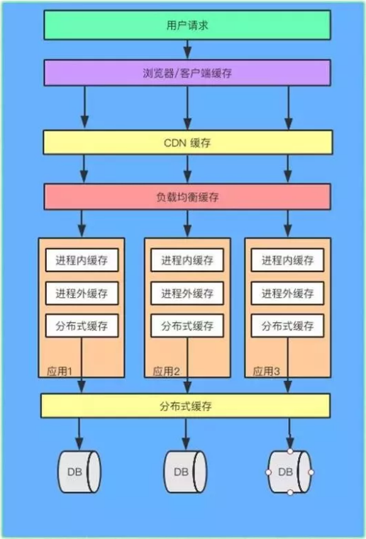
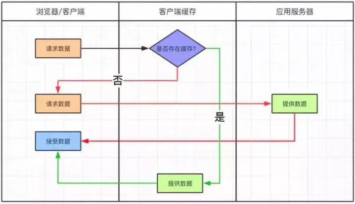

# 0、概述

从用户请求数据到数据返回，数据经过了浏览器、CDN、代理服务器、应用服务器以及数据库各个环节。每个环节都可以运用缓存技术。

从浏览器/客户端开始请求数据，通过 HTTP 配合 CDN 获取数据的变更情况，到达代理服务器（Nginx）可以通过反向代理获取静态资源。再往下来到应用服务器可以通过进程内（堆内）缓存，分布式缓存等递进的方式获取数据。如果以上所有缓存都没有命中数据，才会回源到数据库。

缓存的请求顺序是：用户请求 → HTTP 缓存 → CDN 缓存 → 代理服务器缓存 → 进程内缓存 → 分布式缓存 → 数据库

# 1、HTTP缓存

### 为什么对HTTP请求进行缓存

- 当用户通过浏览器请求服务器的时候，会发起 HTTP 请求
- 如果对每次 HTTP 请求进行缓存，那么可以减少应用服务器的压力

### HTTP缓存原理

- 当第一次请求的时候，浏览器本地缓存库没有缓存数据，会从服务器取数据，并且放到浏览器的缓存库中
- 下次再进行请求的时候会根据缓存的策略来读取本地或者服务的信息

### HTTP缓存方式

- 强制缓存
- 对比缓存

https://www.jianshu.com/p/572db07a5c6f