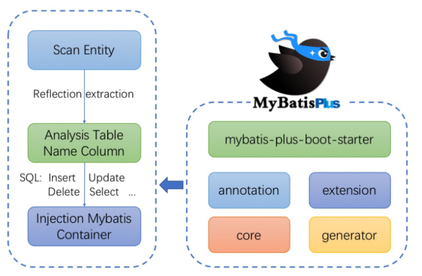
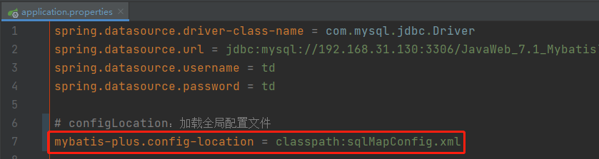

> 当前位置：【Java】07_JavaWeb_Framework（开源框架）  -> 7.1_Mybatis3


# 第一章 Mybatis

## 1、Mybatis的概述

### 1.1 对象/关系数据库映射（ORM） 

- ORM框架简介

```java
- ORM 全称 Object/Relation Mapping，表示对象-关系映射的缩写

- ORM 完成面向对象的编程语言到关系数据库的映射。当ORM框架完成映射后，程序员既可以利用面向
  对象程序设计语言的简单易用性，又可以利用关系数据库的技术优势。
  
- ORM把关系数据库包装成面向对象的模型。

- ORM框架是面向对象设计语言与关系数据库发展不同步时的中间解决方案。

- 采用ORM框架后，应用程序不再直接访问底层数据库，而是以面向对象的方式来操作持久化对象，而ORM框架则将这些面向对象的操作转换成底层SQL操作。

- ORM框架实现的效果：把对持久化对象的保存、修改、删除等操作，转换为对数据库的操作
```

- ORM分类

| 名称        | 特征   | 描述                                                |
| ----------- | ------ | --------------------------------------------------- |
| Hibernate   | 全自动 | 不需要写SQL                                         |
| mybatis     | 半自动 | 手动、自动一体，支持简单的映射，复杂关系要自己写SQL |
| Spring JDBC | 纯手动 | 所有SQL需要自己写，有一套标准流程                   |


### 1.2 Mybatis简介

```java
- MyBatis是一款优秀的基于ORM的半自动轻量级持久层框架，它支持定制化SQL、存储过程以及高级映射,对JDBC操作数据库的过程进行封装
- MyBatis避免了几乎所有的JDBC代码和手动设置参数以及获取结果集
- MyBatis可以使用简单的XML或注解来配置和映射原生类型、接口和Java的POJO （Plain Old Java Objects，普通老式Java对 象）为数据库中的记录 
- Mybatis 通过 XML 或注解的方式将要执行的各种 statement（statement、preparedStatemnt、CallableStatement）配置起来，并通过 Java 对象和 statement中 的 SQL 进行映射生成最终执行的 SQL语句，最后由 Mybatis 框架执行 SQL 并将结果映射成 Java 对象并返回
```


### 1.3 MyBatis 发展历史

```java
- MyBatis 本来是 apache 的一个开源项目 iBatis
- iBATIS一词来源于“internet”和“abatis”的组合，是一个基于Java的持久层框架
- iBATIS提供的持久层框架包括SQL Maps和Data Access Objects(DAO) 
    
- 2010年6月，开源项目 iBatis 由 apache software foundation 迁移到了google code，随着开发团队转投Google Code旗下，ibatis3.x正式更名为Mybatis
    
- 2013年11月代码迁移到 Github
```


### 1.4 MyBatis 优点

```java
- Mybatis是一个半自动化的持久层框架，对开发人员开说，核心sql还是需要自己进行优化，sql和java编码进行分离，功能边界清晰，一个专注业务，一个专注数据 
    
- 使开发者只需要关注 SQL 本身，而不需要花费精力去处理 JDBC 繁杂的过程代码（如：注册驱动、创建connection、创建statement、手动设置参数、结果集检索等）
```


### 1.5 MyBatis 源码下载与概览

  - 官网地址：http://www.mybatis.org/mybatis-3/ 
  - 源码下载地址：https://github.com/mybatis/mybatis-3/releases
- 文件包说明

```java
lib文件夹：mybatis的依赖包所在
mybatis-xxx.jar：mybatis的核心包
mybatis-xxx.pdf：mybatis使用手册
```


### 1.6【区别】Mybatis & Hibernate

| 区别     | Mybatis         | Hibernate |
| -------- | --------------- | --------- |
| 本质上   | 半自动          | 全自动    |
| 安全性   | 存在SQL注入问题 | 预编译    |
| 日志系统 |                 | √         |
| 移植性   |                 | √         |
| 灵活性   | √               |           |

#### （1）本质上

```java
- Hibernate是全自动：Hibernate可以通过对象关系模型实现对数据库的操作，拥有完整的JavaBean对象与数据库的映射结构，从而自动生成SQL语句
- MyBatis是半自动：MyBatis仅有基本的字段映射，对象数据和对象实际关系仍然需要通过定制SQL语句来实现和管理

- 对数据库类型进行切换时，Hibernate的成本明显低于MyBatis
```

#### （2）日志系统：Hibernate >> MyBatis

```java
- Hibernate拥有完整的日志系统（如：SQL记录、关系异常、优化警告、缓存提示、脏数据警告等）
- MyBatis则除了基本记录功能外，功能薄弱很多
```

#### （3）移植性：Hibernate >> MyBatis

```java
- Hibernate通过它强大的映射结构和HQL语言，大大降低了对象与数据库（Oracle、MySQL等）的耦合性
- MyBatis由于需要手写SQL，因此与数据库的耦合性直接取决于程序员写SQL的方法，如果SQL不具通用性并且用了很多某些固定数据库特性的SQL语句，移植性也会随之降低很多，成本很高
```

#### （4）灵活性：MyBatis >> Hibernate

```java
- SQL优化方面，MyBatis都是直接编写原生态SQL到 XML 里，可严格控制SQL执行性能，灵活度高，非常适合对关系数据模型要求不高的软件开发

- SQL优化方面，Hibernate的SQL很多都是自动生成的，无法直接维护
  - 在一些复杂的业务需求上，HQL也是有局限性的
  - Hibernate虽然也支持原生SQL，但开发模式上却与orm不同，需要转换思维，因此使用上不是非常方便
```

#### （5）安全性

```java
- Hibernate是预编译的
- MyBatis可能存在SQL注入问题
```


## 2、Mybatis的引入

### 2.1 原生 JDBC 写法 

```java
public static void main(String[] args) {
    Connection connection = null;
    PreparedStatement preparedStatement = null;
    ResultSet resultSet = null;
  try {
    // 加载数据库驱动
    Class.forName("com.mysql.jdbc.Driver");
    
    // 通过驱动管理类获取数据库链接
    connection = DriverManager.getConnection("jdbc:mysql://localhost:3306/mybatis?characterEncoding=utf-8", "root", "root");
 
    // 定义sql语句？表示占位符
    String sql = "select * from user where username = ?";

    // 获取预处理statement
    preparedStatement = connection.prepareStatement(sql);

    // 设置参数，第一个参数为sql语句中参数的序号(从1开始)，第二个参数为设置的参数值
    preparedStatement.setString(1, "tom");

    // 向数据库发出sql执行查询，查询出结果集
    resultSet = preparedStatement.executeQuery();

    // 遍历查询结果集
    while (resultSet.next()) {
		int id = resultSet.getInt("id");
		String username = resultSet.getString("username");
		// 封装User
		user.setId(id);
		user.setUsername(username);
	}
		System.out.println(user);
    }
 }catch (Exception e) {
	e.printStackTrace();
 } finally {
	// 释放资源
	if (resultSet != null) {
		try {
			resultSet.close();
		} catch (SQLException e) {
			e.printStackTrace();
		}
	}
	
    if (preparedStatement != null) {
		try {
			preparedStatement.close();
		} catch (SQLException e) {
			e.printStackTrace();
		}
    }
}
```


### 2.2 Mybatis解决JDBC编程的问题

- 原生jdbc开发存在的问题如下

```java
（1）数据库连接创建、释放频繁造成系统资源浪费，从而影响系统性能
- 解决：使用数据库连接池初始化连接资源，在 SqlMapConfig.xml 中配置数据连接池，使用连接池管理数据库链接

（2）Sql语句在代码中硬编码，造成代码不易维护，实际应用中sql变化的可能较大，sql变动需要改变java代码
- 解决：将SQL语句配置/抽取在 XXXXmapper.xml 文件中，从而与Java代码分离

（3）使用preparedStatement向占有位符号传参数存在硬编码，因为sql语句的where条件不一定，可能多也可能少，修改sql还要修改代码，系统不易维护
- 原因：SQL 语句的 where 条件不一定，可能多也可能少，占位符需要和参数一一对应
- 解决：Mybatis自动将Java对象映射到SQL语句，通过 statement 中的parameterType定义输入参数类型

（4）对结果集解析存在硬编码（查询列名），sql变化导致解析代码变化，系统不易维护，如果能将数据库记录封装成pojo对象解析比较方便
- 原因：SQL 变化导致解析代码变化，并且解析前需要遍历
- 解决：使用反射、内省等底层技术，自动将实体与表进行属性与字段的自动映射（Mybatis 自动将 SQL 执行结果映射到 Java对象，通过statement中的resultType定义输出结果类型）
```


### 2.3 自定义框架设计

#### （1）使用端：提供核心配置文件

```java
sqlMapConfig.xml : 存放数据库配置信息，引入mapper.xml
Mapper.xml : 存放sql语句的配置文件信息（包含sql语句、参数类型、返回值类型）
```

#### （2）框架端：本质是对 JDBC 代码进行封装

```java
（1）读取配置文件
- 根据配置文件的路径，加载配置文件成字节输入流，存储在内存中

（2）创建javaBean（容器对象）存放对配置文件解析出来的内容
- 读取完成以后配置信息以流的形式存在，如果存放在内存中，不好操作，所以创建容器对象
- Configuration 核心配置类: 存放sqlMapConfig.xml解析出来的内容（包含数据库基本信息、Map<唯一标识，Mapper> ）
- 唯一标识：namespace + "." + id
- MappedStatement映射配置类：存放Mapper.xml解析出来的内容（包含sql语句、statement类型、输入参数java类型、输出参数java类型）

（3）解析配置文件
- 创建sqlSessionFactoryBuilder类  方法：sqlSessionFactory build(inputSteam in)：
- 使用dom4j解析配置文件，将解析出来的内容封装到Configuration和MappedStatement容器对象中
- 创建 SqlSessionFactory 对象，获取sqlSession接口的实现类实例对象（工厂模式）

（4）创建 SqlSessionFactory 接口及实现类DefaultSqlSessionFactory
- openSession（）方法用来生成sqlSession

（5）创建 SqlSession 接口及实现类 DefaultSession，定义对数据库的CRUD操作（封装JDBC完成对数据库表的查询操作）
selectList(String statementId,Object param)：查询所有
selectOne(String statementId,Object param)：查询单个
update（）
delete（）

（6）创建 Executor 接口及实现类 SimpleExecutor实现类
query（Configuration，MapperStatement,Object...params）：执行JDBC代码

涉及到的设计模式：
Builder构建者设计模式、工厂模式、代理模式
```


### 2.4 自定义框架实现

#### 步骤1：使用端 - 创建配置文件


## 3、Mybatis的API

### 3.1 SqlSessionFactoryBuilder（SqlSession 工厂构建器）

```java
常用API：SqlSessionFactory build(InputStream inputStream)
作用：通过加载 mybatis 的核心文件的输入流的形式构建一个 SqlSessionFactory 对象

InputStream resourceAsStream = Resources.getResourceAsStream("sqlMapConfig.xml");
SqlSessionFactory sqlSessionFactory = new SqlSessionFactoryBuilder().build(resourceAsStream);

Resources 工具类
- 在 org.apache.ibatis.io 包中
- 作用：Resources 类帮助你从类路径下、文件系统或一个 web URL 中加载资源文件
```


### 3.2 SqlSessionFactory （SqlSession工厂对象）

- SqlSessionFactory 有多个方法创建 SqlSession 实例，常用的有如下两个

| 方法                            | 解释                                                         |
| ------------------------------- | ------------------------------------------------------------ |
| openSession()                   | 默认开启一个事务，不会自动提交（需手动提交事务，更新操作数据才会持久化到数据库） |
| openSession(boolean autoCommit) | 参数为是否自动提交，如设置为True，则不需要手动提交事务       |


### 3.3 Session（会话对象）

- 执行语句的方法

```java
<T> T selectOne(String statement, Object parameter) 
<E> List<E> selectList(String statement, Object parameter)
    
int insert(String statement, Object parameter)
int update(String statement, Object parameter)
int delete(String statement, Object parameter)

```

- 操作事务的方法

```java
void commit() 
void rollback()
```


## 4、Mybatis的配置式开发

### 4.1 开发步骤

#### 步骤1：pom.xml添加MyBatis的jar包

```xml
<dependencies>
    <!-- mybatis -->
    <dependency>
        <groupId>org.mybatis</groupId>
        <artifactId>mybatis</artifactId>
        <version>3.5.1</version>
    </dependency>

    <!-- mysql驱动 -->
    <dependency>
        <groupId>mysql</groupId>
        <artifactId>mysql-connector-java</artifactId>
        <version>5.1.47</version>
        <scope>runtime</scope>
    </dependency>

    <!-- https://mvnrepository.com/artifact/junit/junit -->
    <dependency>
        <groupId>junit</groupId>
        <artifactId>junit</artifactId>
        <version>4.13.1</version>
    </dependency>

    <!--简化bean代码的⼯具包-->
    <dependency>
        <groupId>org.projectlombok</groupId>
        <artifactId>lombok</artifactId>
        <version>1.18.18</version>
    </dependency>
</dependencies>
```

#### 步骤2：创建user数据表

```mysql
# 创建 user 用户表
DROP TABLE IF EXISTS user;
CREATE TABLE user
(
    id       int(20)     NOT NULL AUTO_INCREMENT COMMENT '主键ID',
    username VARCHAR(50) NULL DEFAULT NULL COMMENT '用户名',
    password VARCHAR(50) NULL DEFAULT NULL COMMENT '密码',
    PRIMARY KEY (id)
) comment = 'Mybatis的user表';

```

#### 步骤3：编写User实体类

```java
@Data
public class User {
	private Integer id;
	private String username;
}
```

#### 步骤4：编写映射文件UserMapper.xml

```xml
<?xml version="1.0" encoding="UTF-8" ?>
<!DOCTYPE mapper
        PUBLIC "-//mybatis.org//DTD Mapper 3.0//EN"
        "http://mybatis.org/dtd/mybatis-3-mapper.dtd">

<!-- namespace : 名称空间，与id组成sql的唯一标识 -->
<mapper namespace="IUserDao">
    <!-- parameterType：参数类型 -->
    <!-- resultType：返回值类型 -->

    <!-- 查询全部 -->
    <!-- SQL片段抽取：Sql 中可将重复的 sql 提取出来，使用时用 include 引用即可，最终达到 sql 重用的目的 -->
    <select id="findAll" resultType="user">
        <include refid="selectUser"/>
    </select>
    <sql id="selectUser">
        select *
        from user
    </sql>

    <!-- 多条件组合查询：if -->
    <select id="findByCondition" parameterType="user" resultType="user">
        <include refid="selectUser"/>
        <where>
            <if test="id !=null">
                and id = #{id}
            </if>
            <if test="username !=null">
                and username = #{username}
            </if>
        </where>
    </select>

    <!-- 多值查询：foreach -->
    <select id="findByIds" parameterType="list" resultType="user">
        <include refid="selectUser"/>
        <where>
            /*标签⽤于遍历集合
             collection：代表要遍历的集合元素，注意编写时不要写#{}
             open：代表语句的开始部分
             close：代表结束部分
             item：代表遍历集合的每个元素，⽣成的变量名
             sperator：代表分隔符
            */
            <foreach collection="array" open="id in (" close=")" item="id" separator=",">
                #{id}
            </foreach>
        </where>
    </select>

    <!-- 添加用户 -->
    <insert id="saveUser" parameterType="user">
        insert into user (id, username)
        values (#{id}, #{username})
    </insert>

    <!-- 修改 -->
    <update id="updateUser" parameterType="user">
        update user
        set username = #{username}
        where id = #{id}
    </update>

    <!-- 删除 -->
    <delete id="deleteUser" parameterType="int">
        delete
        from user
        where id = #{id}
    </delete>
</mapper>
```

#### 步骤5：编写核心文件SqlMapConfig.xml

```xml
<?xml version="1.0" encoding="UTF-8" ?>
<!DOCTYPE configuration PUBLIC "-//mybatis.org//DTD Config 3.0//EN"
        "http://mybatis.org/dtd/mybatis-3-config.dtd">

<configuration>
    <!-- 加载外部的properties文件 -->
    <properties resource="jdbc.properties"/>

    <!-- 给实体类的全限定类名给别名 -->
    <typeAliases>
        <!--类型1：给单独某个实体起别名-->
        <!--<typeAlias type="com.loto.pojo.User" alias="user"/>-->

        <!--类型2：批量起别名，该包下所有的类的本身的类名，别名还不区分大小写 -->
        <package name="com.loto.pojo"/>
    </typeAliases>

    <!-- 指定默认的环境名称 -->
    <environments default="development">
        <!-- 指定当前环境的名称 -->
        <environment id="development">
            <!-- 指定事务的管理类型：交由JDBC进行管理 -->
            <transactionManager type="JDBC"/>

            <!-- 指定当前数据源类型：连接池 -->
            <dataSource type="POOLED">
                <!-- 数据源配置的基本参数 -->
                <property name="driver" value="${jdbc.driver}"/>
                <property name="url" value="${jdbc.url}"/>
                <property name="username" value="${jdbc.username}"/>
                <property name="password" value="${jdbc.password}"/>
            </dataSource>
        </environment>
    </environments>

    <!-- 引入映射配置文件 -->
    <mappers>
        <!-- 使用相对于类路径的资源引用 -->
        <!--<mapper resource="com/loto/UserMapper.xml"/>-->
        <mapper resource="UserMapper.xml"/>

        <!-- 使用完全限定资源定位符（URL）-->
        <!--<mapper url="file:///com/loto/UserMapper.xml"/>-->

        <!-- 使用映射器接口实现类的完全限定类名 -->
        <!--<mapper class="com.loto.UserMapper"/>-->

        <!-- 将包内的映射器接口实现全部注册为映射器 -->
        <!--<package name="com.loto"/>-->
    </mappers>
</configuration>
```

- typeAliases（自定义类的别名，用于 xxxmapper.xml 的标签中的 parameterType 和 resultType）

mybatis框架提供的常用类型的别名

| 别名    | 数据类型 |
| ------- | -------- |
| string  | String   |
| long    | Long     |
| int     | Integer  |
| double  | Double   |
| boolean | Boolean  |


- 事务管理器（transactionManager）类型

```
- JDBC：直接使用了JDBC 的提交和回滚设置，它依赖于从数据源得到的连接来管理事务作用域

- MANAGED：从来不提交或回滚一个连接，而是让容器来管理事务的整个生命周期（比如 JEE 应用服务器的上下文）
默认情况下它会关闭连接，然而一些容器并不希望这样，因此需要将 closeConnection 属性设置为 false 来阻止它默认的关闭行为
```

- 数据源（dataSource）类型

```
- UNPOOLED：这个数据源的实现只是每次被请求时打开和关闭连接
- POOLED：这种数据源的实现利用“池”的概念将 JDBC 连接对象组织起来
- JNDI：该数据源的实现是为了能在如 EJB 或应用服务器这类容器中使用，容器可以集中或在外部配置数据源，然后放置一个JNDI上下文的引用
```


#### 步骤6：编写测试类

```java
@Test
public void test_findAll_XML() throws IOException {
    // 1、加载核心配置文件（使用 Resources 工具类把配置文件加载成字节输入流）
    InputStream resourceAsStream = Resources.getResourceAsStream("sqlMapConfig.xml");

    // 2、解析了配置文件，并创建 sqlSessionFactory 工厂对象
    SqlSessionFactory sqlSessionFactory = new SqlSessionFactoryBuilder().build(resourceAsStream);

    // 3、获得sqlSession对象
    // 默认开启一个事务，但是该事务不会自动提交，在进行增删改操作时，要手动提交事务
    SqlSession sqlSession = sqlSessionFactory.openSession();

    // 4、执行sql语句（使用 sqlSession 调用方法）
    // 查询单个：selectOne  查询所有selectList  添加：insert  修改：update  删除：delete
    List<User> users = sqlSession.selectList("IUserDao.findAll");
    for (User user : users) {
        System.out.println(user);
    }

    // 5、释放资源
    sqlSession.close();
}
```


### 4.2 MyBatis的增删改查操作 


### 4.4 Mybatis的Dao层实现 - 传统开发方式

- 编写 UserDao 接口

```java
public interface UserDao {
	 List<User> findAll() throws IOException; 
}
```

- 编写 UserDaoImpl 实现

```java
public class UserDaoImpl implements UserDao {
 public List<User> findAll() throws IOException {
     InputStream resourceAsStream = Resources.getResourceAsStream("SqlMapConfig.xml");
     SqlSessionFactory sqlSessionFactory = new SqlSessionFactoryBuilder().build(resourceAsStream);
     SqlSession sqlSession = sqlSessionFactory.openSession();

     List<User> userList = sqlSession.selectList("IUserDao.findAll");

     sqlSession.close();
     return userList;
 }
}
```

- 测试类

```java
@Test
public void testTraditionDao() throws IOException {
     UserDao userDao = new UserDaoImpl();
     List<User> all = userDao.findAll();
     System.out.println(all);
}
```


### 4.5 Mybatis的Dao层实现 - Mapper 代理开发方式

- 简介

```java
Mapper 接口开发方法需要程序员编写 Mapper 接口（相当于 Dao 接口），由 Mybatis 框架根据接口定义创建接口的动态代理对象
    
Mapper 接口开发需要遵循以下规范
- Mapper.xml 文件中的 namespace 与 mapper 接口的全限定名相同
- Mapper接口方法名和 Mapper.xml 中定义的每个 statement 的id相同
- Mapper接口方法的输入参数类型和 mapper.xml 中定义的每个sql的 parameterType 的类型相同
- Mapper接口方法的输出参数类型和 mapper.xml 中定义的每个sql的 resultType 的类型相同
```

- 编写 UserMapper 接口

```java
public interface IUserDao {
	public List<User> findAll() throws IOException;
}
```

- 编写 UserMapper.xml 文件

```xml
<mapper namespace="IUserDao">
    <select id="findAll" resultType="user">
        <include refid="selectUser"/>
    </select>
    <sql id="selectUser">
        select *
        from user
    </sql>
</mapper>
```

- 测试类

```java
@Test
public void test_findAll_mapper() throws IOException {
    InputStream resourceAsStream = Resources.getResourceAsStream("sqlMapConfig.xml");
    SqlSessionFactory sqlSessionFactory = new SqlSessionFactoryBuilder().build(resourceAsStream);
    SqlSession sqlSession = sqlSessionFactory.openSession();

    IUserDao mapper = sqlSession.getMapper(IUserDao.class);
    List<User> all = mapper.findAll();
    for (User user : all) {
        System.out.println(user);
    }
}
```


### 4.6 MyBatis的配置式实现复杂映射开发 

#### 一对一查询

#### 一对多查询

#### 多对多查询


## 5、Mybatis注解式开发 

### 5.1 MyBatis的常用注解

```xml
@Insert：实现新增
@Update：实现更新
@Delete：实现删除
@Select：实现查询

@Result：实现结果集封装
@Results：可以与@Result 一起使用，封装多个结果集
@One：实现一对一结果集封装
@Many：实现一对多结果集封装
```


### 5.2 MyBatis的增删改查 

### 5.3 MyBatis的注解式实现复杂映射开发 

#### 一对一查询

#### 一对多查询

#### 多对多查询


## 6、Mybatis缓存 

### 6.1 一级缓存


### 6.2 二级缓存


### 6.3 二级缓存整合redis 


## 7、Mybatis插件 


## 8、Mybatis的架构原理

##### 架构图


- 架构详解
  - Mybatis的配置文件：SqlMapConfig.xml
    - 此文件作为mybatis的全局配置文件，配置了Mybatis的运行环境等信息
  - Mybatis的配置文件：mapper.xml
    - sql映射文件，文件中配置了操作数据库的sql语句，此文件需要在SqlMapConfig.xml中加载
  - SqlSessionFactory（会话工厂）
    - 通过Mybatis环境等配置信息构造SqlSessionFactory即会话工厂
  - SqlSession（会话）
    - 由会话工厂创建sqlSession即会话，操作数据库需要通过sqlSession进行
  - Executor（执行器）
    - Mybatis底层自定义了Executor执行器接口操作数据库
    - Executor接口有两个实现：一个是基本执行器、一个是缓存执行器
  - 输入映射
    - Mapped Statement对sql执行输入参数进行定义，包括HashMap、基本类型、pojo
    - Executor通过Mapped Statement在执行sql前将输入的java对象映射至sql中
    - 输入参数映射就是jdbc编程中对preparedStatement设置参数
  - MappedStatement
    - Mapped Statement也是Mybatis一个底层封装对象
    - 它包装了Mybatis配置信息及sql映射信息等
    - mapper.xml文件中一个sql对应一个Mapped Statement对象，sql的id即是Mapped statement的id
  - 输出映射
    - Mapped Statement对sql执行输出结果进行定义，包括HashMap、基本类型、pojo
    - Executor通过Mapped Statement在执行sql后将输出结果映射至java对象中
    - 输出结果映射过程相当于jdbc编程中对结果的解析处理过程


## 9、Mybatis中的设计模式分析


## 10、Mybatis源码分析 


# 第二章 Mybatis-Plus 

## 1、简介

### 1.1 网址

- 官网地址
  -  https://mybatis.plus/
  - https://mp.baomidou.com/ 
- GitHub地址：https://github.com/baomidou/mybatis-plus

- 码云地址：https://gitee.com/organizations/baomidou


### 1.2 介绍 

```java
- MyBatis-Plus（简称 MP）是一个 MyBatis 的增强工具
- 在 MyBatis 的基础上只做增强不做改变，为简化开发、提高效率而生
- Mybatis-Plus是由baomidou（苞米豆）组织开发并且开源的
```


### 1.3 特性

```java
- 无侵入：只做增强不做改变，引入它不会对现有工程产生影响，如丝般顺滑

- 损耗小：启动即会自动注入基本 CURD，性能基本无损耗，直接面向对象操作

- 强大的 CRUD 操作：内置通用 Mapper、通用 Service，仅仅通过少量配置即可实现单表大部分CRUD 操作，更有强大的条件构造器，满足各类使用需求

- 支持 Lambda 形式调用：通过 Lambda 表达式，方便的编写各类查询条件，无需再担心字段写错支持主键自动生成：支持多达 4 种主键策略（内含分布式唯一 ID 生成器Sequence），可自由配置，完美解决主键问题

- 支持 ActiveRecord 模式：支持 ActiveRecord 形式调用，实体类只需继承 Model 类即可进行强大的CRUD 操作

- 支持自定义全局通用操作：支持全局通用方法注入（ Write once, use anywhere ）

- 内置代码生成器：采用代码或者 Maven 插件可快速生成 Mapper 、 Model 、 Service 、Controller 层代码，支持模板引擎，更有超多自定义配置等您来使用

- 内置分页插件：基于 MyBatis 物理分页，开发者无需关心具体操作，配置好插件之后，写分页等同于普通 List 查询

- 分页插件支持多种数据库：支持 MySQL、MariaDB、Oracle、DB2、H2、HSQL、SQLite、Postgre、SQLServer 等多种数据库

- 内置性能分析插件：可输出 Sql 语句以及其执行时间，建议开发测试时启用该功能，能快速揪出慢查询

- 内置全局拦截插件：提供全表 delete 、 update 操作智能分析阻断，也可自定义拦截规则，预防误操作
```


### 1.4 架构图



依赖启动器

注解

核心

扩展

代码生成器

扫描实体类

反射

分析表基本信息

注入Mybatis容器


## 2、快速搭建

### 步骤1：安装要求（MyBatis-Plus 3.0+）

- JDK 8+ 

- Maven or Gradle


### 步骤2：依赖包

- Springboot项目

```xml
<dependency> 
    <groupId>com.baomidou</groupId> 
    <artifactId>mybatis-plus-boot-starter</artifactId> 
    <version>3.4.0</version> 
</dependency>
```

- SpringMVC项目

```xml
<dependency> 
    <groupId>com.baomidou</groupId> 
    <artifactId>mybatis-plus</artifactId> 
    <version>3.4.0</version> 
</dependency>
```

- 引入<span style='color:red'>MyBatis-Plus</span>之后请不要再次引入<span style='color:red'>MyBatis</span>以及<span style='color:red'>MyBatis-Spring</span>，以避免因版本差异导致的问题


### 步骤3：表结构


### 步骤4：Mybatis 整合 MP

#### 方式1：Mybatis + Plus

#### 方式2：Mybatis + Plus + Spring

#### 方式3：Mybatis + Plus + SpringBoot


## 3、注解

@TableName

@TableId

@TableField


## 4、CRUD操作


## 5、MybatisPlus 配置属性

### 类型1：基本配置

#### （1）configLocation：加载全局配置文件

- MyBatis 配置⽂件位置，如果有单独的 MyBatis 配置，请将其路径配置到 configLocation 中

- 官方文档：https://mybatis.plus/config/


Spring Boot项目

```bash
mybatis-plus.config-location = classpath:mybatis-config.xml
```




Spring MVC项目

```xml
<bean id="sqlSessionFactory" class="com.baomidou.mybatisplus.extension.spring.MybatisSqlSessionFactoryBean">
	<property name="configLocation" value="classpath:mybatis-config.xml"/>
</bean>
```


#### （2）mapperLocations：加载映射配置文件


#### （3）typeAliasesPackage：起别名


### 类型2：进阶配置

#### （1）mapUnderscoreToCamelCase：是否开启自动驼峰映射

```bash
# mapUnderscoreToCamelCase：是否开启自动驼峰映射（默认开启，值为true）
# 默认开启时，当数据库字段在实体类中的命名符合驼峰规则，则⽆需在实体类的成员变量上使⽤ @TableField 注解去指定数据库字段名
# 规则：从经典数据库列名 A_COLUMN（下划线命名） 到经典 Java 属性名 aColumn（驼峰命名） 的类似映射
# 关闭⾃动驼峰映射时，该参数不能和 mybatis-plus.config-location 同时存在
mybatis-plus.configuration.map-underscore-to-camel-case = false
```


#### （2）cacheEnabled：是否开启所有映射器已经配置缓存

```bash
# cacheEnabled：全局地开启或关闭配置⽂件中的所有映射器已经配置的任何缓存，默认为 true
mybatis-plus.configuration.cache-enabled = false
```


### 类型3：DB 策略配置

#### （1）idType：设置全局的主键生成策略

```bash
# idType：设置全局的主键生成策略
#（1）AUTO：主键自增
#（2）NONE：不设置主键类型
#（3）INPUT：用户输入主键 ID
# 以下3种类型、只有当插入对象ID 为空，才自动填充
#（4）ID_WORKER：全局唯一ID (idWorker)
#（5）ID_WORKER_STR：字符串全局唯一ID (idWorker 的字符串表示)
#（6）UUID：全局唯一ID (UUID)
mybatis-plus.global-config.db-config.id-type = auto
```


#### （2）tablePrefix：全局配置表名前缀

```bash
# tablePrefix：全局配置表名前缀
# 全局配置 tablePrefix 后，可省略 @TableName() 配置
mybatis-plus.global-config.db-config.table-prefix = tb_
```


## 6、条件构造器

### （1）allEq方法

```java
// 参数1：params（key 为数据库字段名, value 为字段值）
allEq(Map<R, V> params) 
    
// 参数1：params（key 为数据库字段名, value 为字段值）
// 参数2：null2IsNull
// 		为 true 则在 map 的 value 为 null 时调用 isNull 方法
//	    为 false 时则忽略 value 为 null 的
allEq(Map<R, V> params, boolean null2IsNull) 
    
// 参数1：condition（为true，参数3才会起作用 为false，参数3不起作用，且没有where条件）
// 参数2：params（key 为数据库字段名, value 为字段值）
// 参数3：null2IsNull
//    为 true 则在 map 的 value 为 null 时调用 isNull 方法
//    为 false 时则忽略 value 为 null 的
allEq(boolean condition, Map<R, V> params, boolean null2IsNull)
    
// 参数1：filter（过滤函数,是否允许字段传入比对条件中）
// 参数2：params（key 为数据库字段名, value 为字段值
allEq(BiPredicate<R, V> filter, Map<R, V> params) 
    
// allEq(BiPredicate  filter, Map  params, boolean null2IsNull)
// 参数1：filter（过滤函数,是否允许字段传入比对条件中）
// 参数2：params（key 为数据库字段名, value 为字段值）
// 参数3：null2IsNull
//    为 true 则在 map 的 value 为 null 时调用 isNull 方法
//    为 false 时则忽略 value 为 null 的
allEq(BiPredicate<R, V> filter, Map<R, V> params, boolean null2IsNull) 
    
// allEq(boolean condition, BiPredicate  filter, Map  params, boolean null2IsNull)
// 参数1：condition（为true，参数4才会起作用 为false，参数4不起作用，且没有where条件）
// 参数2：filter（过滤函数,是否允许字段传入比对条件中）
// 参数3：params（key 为数据库字段名, value 为字段值）
// 参数4：null2IsNull
//    为 true 则在 map 的 value 为 null 时调用 isNull 方法
//    为 false 时则忽略 value 为 null 的
allEq(boolean condition, BiPredicate<R, V> filter, Map<R, V> params, boolean null2IsNull)
```


### （2）基本比较操作

```java
eq
等于 =
    
ne
不等于 <>
    
gt
大于 >
    
ge
大于等于 >=
    
lt
小于 <
    
le
小于等于 <=
    
between
BETWEEN 值1 AND 值2
    
notBetween
NOT BETWEEN 值1 AND 值2
    
in
字段 IN (value.get(0), value.get(1), ...)
    
notIn
字段 NOT IN (v0, v1, ...)
```


### （3）模糊查询

```java
like
LIKE '%值%'
    
notLike
NOT LIKE '%值%'
    
likeLeft
LIKE '%值' 
    
likeRight
LIKE '值%'
```


### （4）排序

```java
orderBy(boolean condition, boolean isAsc, R... columns)
condition – 是否开启执行条件
isAsc – 是否是 ASC 排序
columns – 字段数组 
   
orderByAsc
升序排序：ORDER BY 字段, ... ASC

orderByDesc
降序排序：ORDER BY 字段, ... DESC
```


### （5）逻辑查询

- and

```java
// SELECT id,name,email AS mail,info_mark FROM mp_user WHERE ( name = ? OR age = ? )
queryWrapper.and(i -> i.eq("name", "Jack").or().eq("age","20"));

// SELECT id,name,email AS mail,info_mark FROM mp_user WHERE ( name = ? AND age = ? )
queryWrapper.and(i -> i.eq("name", "Jack").eq("age", "20"));

// SELECT id,name,email AS mail,info_mark FROM mp_user WHERE name = ? AND age = ?
queryWrapper.eq("name", "Jack").eq("age", "20");
```

- or

```java
// SELECT id,name,email AS mail,info_mark FROM mp_user WHERE name = ?
queryWrapper.or().eq("name", "Jack");

// SELECT id,name,email AS mail,info_mark FROM mp_user WHERE name = ? AND age = ?
queryWrapper.or().eq("name", "Jack").eq("age","20");

// SELECT id,name,email AS mail,info_mark FROM mp_user WHERE ( name = ? )
queryWrapper.or(i -> i.eq("name", "Jack"));

// SELECT id,name,email AS mail,info_mark FROM mp_user WHERE ( name = ? AND age = ? )
queryWrapper.or(i -> i.eq("name", "Jack").eq("age","20"));

// SELECT id,name,email AS mail,info_mark FROM mp_user WHERE ( name = ? OR age = ? )
queryWrapper.or(i -> i.eq("name", "Jack").or().eq("age","20"));

// SELECT id,name,email AS mail,info_mark FROM mp_user WHERE name = ? OR age = ?
queryWrapper.eq("name", "Jack").or().eq("age","20");

// SELECT id,name,email AS mail,info_mark FROM mp_user WHERE name = ? AND age = ? OR email = ?
queryWrapper.eq("name", "Jack")
			.eq("age","20")
			.or().eq("email","test2@baomidou.com");

// SELECT id,name,email AS mail,info_mark FROM mp_user WHERE name = ? AND ( age = ? OR email = ? )
queryWrapper.eq("name", "Jack")
			.and(i -> i.eq("age", "20").or().eq("email", "test2@baomidou.com"));
```


### （6）select查询

```java
// SELECT name FROM mp_user WHERE name = ? OR age = ?
queryWrapper.eq("name","Jack").or().eq("age",20).select("name");

// SELECT name,age FROM mp_user WHERE name = ? OR age = ?
queryWrapper.eq("name","Jack").or().eq("age",20).select("name","age");
```


## 7、ActiveRecord（AR）

### 7.1 简介

```java
- 属于ORM（对象关系映射）层，由Rails最早提出
- 遵循标准的ORM模型：表映射到记录，记录映射到对象，字段映射到对象属性
- 配合遵循的命名和配置惯例，能够很大程度的快速实现模型的操作，而且简洁易懂
```


### 7.2 主要思想

```java
- 每一个数据库表对应创建一个类，类的每一个对象实例对应于数据库中表的一行记录；通常表的每个字段在类中都有相应的Field
- ActiveRecord同时负责把自己持久化，在ActiveRecord中封装了对数据库的访问，即CURD
- ActiveRecord是一种领域模型(Domain Model)，封装了部分业务逻辑
```


### 7.3 CRUD


## 8、插件

### 插件机制

### 插件1：执行分析插件

### 插件2：性能分析插件

### 插件3：乐观锁插件

```java
- 支持的数据类型只有:int,Integer,long,Long,Date,Timestamp,LocalDateTime
- 整数类型下 newVersion = oldVersion + 1 newVersion 会回写到 entity 中
- 仅支持 updateById(id) 与 update(entity, wrapper) 方法
- 在 update(entity, wrapper) 方法下, wrapper 不能复用
```


## 9、SQL注入器

 SQL注入的原理


## 10、自动填充（MetaObjectHandler）

- 插入或者更新数据时，希望有些字段可以自动填充数据，比如密码、version等
- 步骤1：实体类中的成员变量上添加 @TableField 注解

```java
/*
DEFAULT 默认不处理
INSERT 插入时填充字段
UPDATE 更新时填充字段
INSERT_UPDATE 插入和更新时填充字段
*/
@Version
@TableField(fill = FieldFill.INSERT)
private Integer version;
```

- 步骤2：编写类，继承 MetaObjectHandler

```java
package com.loto.metaobjecthandler.handler;

import com.baomidou.mybatisplus.core.handlers.MetaObjectHandler;
import org.apache.ibatis.reflection.MetaObject;
import org.springframework.stereotype.Component;

@Component
public class MyMetaObjectHandler implements MetaObjectHandler {
	@Override
	public void insertFill(MetaObject metaObject) {
		Object version = getFieldValByName("version", metaObject);
		if (null == version) {
			// 如果属性 version 为空，则进行填充为1
			setFieldValByName("version", 1, metaObject);
		}
	}

	@Override
	public void updateFill(MetaObject metaObject) {
	}
}
```


## 11、逻辑删除


##  12、代码生成器（AutoGenerator）


## 13、MybatisX（idea插件）


# 动态SQL

- 需求1：根据性别和名字查询用户
  - 使用到的标签
    - sql片段
    - if标签
    - where标签
  - UserMapper.java
  - UserMapper.xml
  - sqlMapConfig2.xml
  - MybatisTest07_sql.java
- 需求2：根据多个id查询用户信息
  - 使用到的标签
    - sql片段
    - where标签
    - foreach标签
  - QueryVo.java
  - UserMapper.java
  - UserMapper.xml
  - sqlMapConfig2.xml
  - MybatisTest07_sql.java


# 关联查询

- 商品订单数据模型

  - 图

    

- 一对一查询

  - 需求：查询所有订单信息，关联查询下单用户信息
  - 方法1：使用resultType
  - 方法2：使用resultMap
    - Orders.java
    - OrderMapper.java
    - OrderMapper.xml
    - sqlMapConfig2.xml
    - MybatisTest08_relatedquery.java

- 一对多查询

  - 需求：查询所有用户信息及用户关联的订单信息
  - Orders.java
  - OrderMapper.java
  - OrderMapper.xml
  - sqlMapConfig2.xml
  - MybatisTest08_relatedquery.java


# Mybatis整合Spring

- 整合思想
  - SqlSessionFactory对象应该放到spring容器中作为单例存在
  - 传统dao的开发方式中，应该从spring容器中获得sqlsession对象
  - Mapper代理形式中，应该从spring容器中直接获得mapper的代理对象
  - 数据库的连接以及数据库连接池事务管理都交给spring容器来完成
- 整合jar包
  - Spring的jar包
  - Mybatis的jar包
  - Spring + Mybatis的整合包
  - Mysql的数据库驱动jar包
  - 数据库连接池的jar包
- 配置文件
  - log4j.properties
  - sqlMapConfig.xml
  - db.properties
  - applicationContext.xml
- Dao的开发
  - 方式1：原始Dao开发
  - 方式2：使用Mapper代理形式开发方式
    - 直接配置Mapper代理
    - 使用扫描包配置Mapper代理


# Mybatis逆向工程

- 使用步骤
  - 导入逆向工程到eclipse中
  - 修改配置文件generatorConfig.xml
    - 修改要生成的数据库表（17-19行）
    - 修改pojo文件所在包路径（29行）
    - 修改Mapper所在的包路径（38行、44行）
    - 总结：修改17行、29行、38行、44行、50行
  - 生成逆向工程代码：执行GeneratorSqlmap.java文件中的main函数
  - 刷新工程，得到逆向工程代码
  - 复制生成的代码到mybatis-spring工程
  - 修改applicationContext.xml配置文件
  - 单元测试
- 注意事项
  - 逆向工程生成的代码只能做单表查询
  - 不能在生成的代码上进行扩展，因为如果数据库变更，需要重新使用逆向工程生成代码，原来编写的代码就被覆盖了
  - 一张表会生成4个文件


# 分页插件：PageHelper

- PageHelper插件的简介
  - 支持Oracle、Mysql、MariaDB、SQLite、Hsqldb、PostgreSQL六种数据库分页
- PageHelper插件的使用方法
  - 步骤1：把PageHelper依赖的jar包添加到pom.xml中
    - 官方提供的代码对逆向工程支持的不好，使用参考资料中的pagehelper-fix
    - 使用idea将pagehelper-fix项目打开，然后使用maven进行install
    - 完成后，pagehelper-3.4.2-fix.jar存到本地的maven仓库
    - 目录：/Users/td/Documents/Maven3.5.2/repository/com/github/pagehelper/pagehelper/3.4.2-fix/pagehelper-3.4.2-fix.jar
  - 步骤2：在Mybatis配置文件SqlMapConfig.xml中配置拦截器插件
    <!-- Mybatis分页插件：Pag6eHelper --><plugins><plugin interceptor="com.github.pagehelper.PageHelper"><property name="dialect" value="mysql"/> <!-- 设置数据库方言（类型）--></plugin></plugins>
  - 步骤3：在代码中使用


# 11、问题报错

##### 1、元素类型为 "mapper" 的内容必须匹配 "(cache-ref|cache|resultMap==*==|parameterMap==*==|sql==*==|insert==*==|update==*==|delete==*==|select==*==)+".“

- 分析原因：属性必须按顺序来写

- 解决方案：比如<select 属性>   </select >，其中的属性的顺序必须按照规定写


Mybatis提供的内置类型别名

- https://www.cnblogs.com/cainiao-Shun666/p/7909675.html?tdsourcetag=s_pcqq_aiomsg

- 基本类型

  |   别名   |  类型   |
  | :------: | :-----: |
  |  _byte   |  byte   |
  |  _long   |  long   |
  |  _short  |  short  |
  |   _int   |   int   |
  | _integer | integer |
  | _double  | double  |
  |  _float  |  float  |
  | _boolean | boolean |

- 常用包装类型

  |    别名    |  类型   |
  | :--------: | :-----: |
  |   string   |  byte   |
  |    byte    |  long   |
  |    long    |  short  |
  |   short    |   int   |
  |    int     | integer |
  |  _double   | double  |
  |   double   |  float  |
  |   float    | boolean |
  |  boolean   |         |
  |    date    |         |
  |   object   |         |
  | collection |         |
  |    list    |         |
  | arraylist  |         |
  |    map     |         |
  |  hashmap   |         |
  |  iterator  |         |
  |   array    |         |

  


参考文档

- https://blog.csdn.net/fageweiketang/article/details/80739589


# 步骤1：配置文件 SqlMapConfig.xml

```xml
<?xml version="1.0" encoding="UTF-8" ?>
<!DOCTYPE configuration PUBLIC "-//mybatis.org//DTD Config 3.0//EN" "http://mybatis.org/dtd/mybatis-3-config.dtd">

<!-- SqlMapConfig.xml：Mybatis的核心配置文件详解 -->
<configuration>
    <!-- 1、属性配置：引入jdbc.properties -->
    <properties resource="jdbc.properties"/>

    <!-- 2、全局配置参数:配置一些改变运行时行为的信息 -->
    <settings>
        <setting name="" value=""/>
    </settings>

    <!-- 3、类型别名：包以其子包下所有类，头字母大小都行 -->
    <typeAliases>
        <!-- 方式1：单个别名定义 -->
        <typeAlias type="com.loto.mybatis.pojo.User" alias="User"/>

        <!-- 方式2：批量别名定义，扫描整个包下的类，别名为类名（大小写不敏感） -->
        <package name="com.loto.mybatis.pojo"/>
    </typeAliases>

    <!-- 4、类型处理器：将 sql 中返回的数据库类型转换为相应 Java 类型的处理器配置-->
    <typeHandlers>
        <!-- 方式1：配置package（mybatis会去配置的package扫描TypeHandler）-->
        <!-- <package name="com.loto.mybatis"/> -->

        <!-- 方式2 -->
        <!-- handler：直接配置要指定的TypeHandler -->
        <!-- javaType：配置java类型（如String）-->
        <!-- jdbcType：配置数据库基本数据类型（如varchar）-->
        <typeHandler javaType="" jdbcType="" handler=""/>
    </typeHandlers>

    <!-- 5、对象工厂：实例化目标类的工厂类配置-->
    <objectFactory type=""/>

    <!-- 6、插件：修改 MyBatis 的核心行为 -->
    <plugins>
        <plugin interceptor=""></plugin>
    </plugins>

    <!-- 7、环境集合属性对象：数据库环境信息的集合（和spring整合后environments配置将废除）-->
    <environments default="development">
        <!-- 环境子属性对象：数据库环境配置的详细配置 -->
        <environment id="development">
            <!-- 事务管理：指定 MyBatis 的事务管理器（采用JDBC）-->
            <transactionManager type="JDBC"/>

            <!-- 数据源：数据库连接池 -->
            <!-- type：指定数据源的连接类型（POOLED：mybatis的数据源）（JNDI：基于tomcat的数据源）-->
            <dataSource type="POOLED">
                <property name="driver" value="${jdbc.driver}"/>
                <property name="url" value="${jdbc.url}"/>
                <property name="username" value="${jdbc.username}"/>
                <property name="password" value="${jdbc.password}"/>
            </dataSource>
        </environment>
    </environments>

    <!-- 8、映射器：加载配置sql映射文件的位置（xxxxMapper.xml）-->
	<mappers>
		<!-- 方式1：注册指定包下的所有mapper接口（要求mapper接口名称和mapper映射文件名称相同，且放在同一个目录中）-->
		<package name="com.loto.mybatis.mapper"/>

		<!-- 方式2：使用mapper接口类路径（要求mapper接口名称和mapper映射文件名称相同，且放在同一个目录中）-->
		<!-- <mapper class="com.loto.mybatis.mapper" /> -->

		<!-- 方式3：使用相对于类路径的资源（不用保证同接口同包同名）-->
       <!-- <mapper resource="mapperxml/OrderMapper.xml" />
        <mapper resource="mapperxml/UserMapper.xml" />-->

		<!-- 方式4：url指定mapper的绝对路径（与实际开发不符，因此基本不用）-->
		<!-- <mapper url="" /> -->
	</mappers>
</configuration>

```

##### 步骤2：创建pojo类：xxx.java

##### 步骤3：配置sql映射文件：xxxMapper.xml

- \#{}代表占位符
  - sql语法：select * from user where id = ?
  - mybatis语法：select * from user where id = #{v}
- ${}代表字符串拼接
  - sql语法：select * from user where username like '%五%'
  - mybatis语法
    - select * from user where username like "%"#{haha}"%"   ->用#，{}中可以用任意字符
    - select * from user where username like "%${value}%"    ->用$，{}中必须用value
- 输入映射：parameterType
  - 传入简单类型
  - 传入pojo对象
  - 传入pojo包装对象
  - 包装类QueryVo.java
    - UserMapper.xml
    - UserMapper.java
    - sqlMapConfig2.xml
    - MybatisTest04_parameterType.java
- 输出映射
  - resultType
    - 输出简单类型
      - 需求：查询用户表数据条数
      - MybatisTest05_resultType.java
      - UserMapper.java
      - UserMapper.xml
      - sqlMapConfig2.xml
    - 输出pojo对象
    - 输出pojo列表
  - resultMap

##### 步骤4：加载映射文件

- 方法1：原始Dao开发
- 方法2：Mapper动态代理开发

##### 【区别】selectOne和selectList