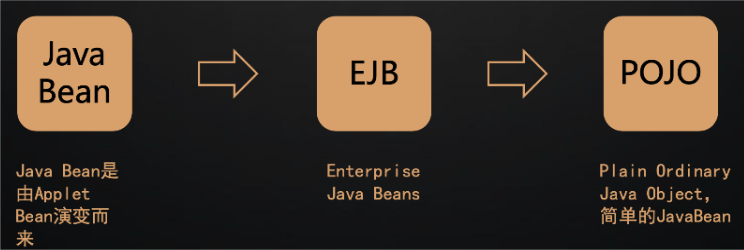
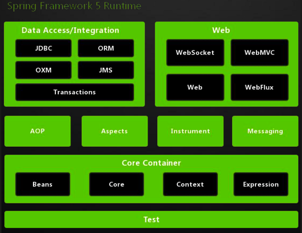
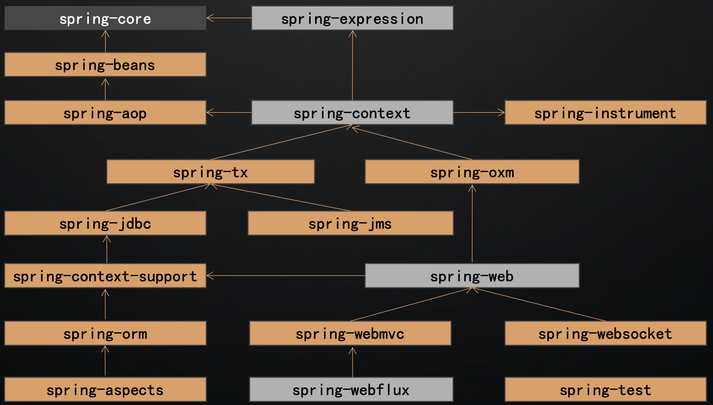
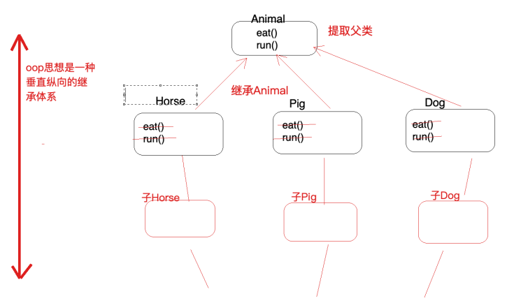
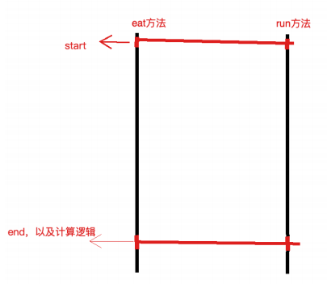
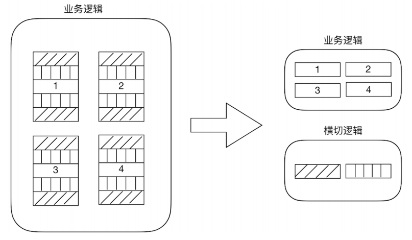

> 当前位置：【Java】07_JavaWeb_Framework（开源框架） -> 7.2_Spring5


# 第一章 Spring

## 1、Spring 简介

```java
- Spring 是分层的 full-stack（全栈） 轻量级开源框架，以 IoC 和 AOP 为内核，提供了展现层 Spring MVC 和业务层事务管理等众多的企业级应用技术，还能整合开源世界众多著名的第三方框架和类库，已经成为使用最多的 Java EE 企业应用开源框架

- 经常说的 Spring 其实指的是Spring Framework（spring 框架）
```


## 2、Spring 发展历史

```java
- 1997年，IBM 提出了 EJB 的思想； 
- 1998年，SUN 制定开发标准规范 EJB 1.0； 
- 1999年，EJB 1.1发布； 
- 2001年，EJB 2.0发布； 
- 2003年，EJB 2.1发布；
- 2006年，EJB 3.0发布；
- 2017年9月份发布了 Spring 的最新版本 Spring 5.0 通用版（GA）
```




## 3、Spring 特点

### （1）方便解耦，简化开发

```java
- 通过Spring提供的IoC容器，可以将对象间的依赖关系交由Spring进行控制，避免硬编码所造成的过度程序耦合
- 用户也不必再为单例模式类、属性文件解析等这些很底层的需求编写代码，可以更专注于上层的应用
```


- 简化开发的基本策略

```
- 基于POJO的轻量级和最小侵入性编程
- 通过依赖注入和面向接口松耦合
- 基于切面和惯性进行声明式编程
- 通过切面和模板减少样板式代码
```

### （2）支持AOP编程

```java
- 通过Spring的AOP功能，方便进行面向切面的编程，许多不容易用传统OOP实现的功能可以通过AOP轻松应对
```


### （3）支持声明式事务

```java
@Transactional
- 从单调烦闷的事务管理代码中解脱出来，通过声明式方式灵活的进行事务的管理，提高开发效率和质量
```

### （4）方便程序测试

```java
- 用容器依赖的编程方式进行几乎所有的测试工作，测试不再是昂贵的操作，而是随手可做的事情
```

### （5）方便集成各种优秀框架

```java
- Spring可以降低各种框架的使用难度，提供了对各种优秀框架（Struts、Hibernate、Hessian、Quartz等）的直接支持
```

### （6）降低**JavaEE API**的使用难度

```java
- Spring对JavaEE API（如JDBC、JavaMail、远程调用等）进行了薄薄的封装层，使这些API的使用难度大为降低
```


## 4、Spring 版本命名规则

| 描述方式 | 说明     | 含义                                                         |
| -------- | -------- | ------------------------------------------------------------ |
| Snapshot | 快照版   | 尚不不稳定、尚处于开发中的版本                               |
| Release  | 稳定版   | 功能相对稳定，可以对外发行，但有时间限制                     |
| GA       | 正式版   | 代表广泛可用的稳定版(General Availability)                   |
| M        | 里程碑版 | (M是Milestone的意思)具有一些全新的功能或是具有里程碑意义的版本。 |
| RC       | 终测版   | Release Candidate(最终测试)，即将作为正式版发布。            |


## 5、Spring5 系统架构

### 5.1 模块结构图




### 5.2 模块分类 

#### （1）核心模块

| 模块名称               | 主要功能                                  |
| ---------------------- | ----------------------------------------- |
| spring-core            | 依赖注入IOC与DI的最基本实现               |
| spring-beans           | Bean工厂与Bean的装配                      |
| spring-context         | 定义基础的Spring的Context上下文即IOC容器  |
| spring-context-support | 对Spring IOC容器的扩展支持，以及IOC子容器 |
| spring-context-indexer | Spring的类管理组件和Classpath扫描         |
| spring-expression      | Spring表达式语言                          |

#### （2）切面编程

| 模块名称          | 主要功能                                         |
| ----------------- | ------------------------------------------------ |
| spring-aop        | 面向切面编程的应用模块，整合Asm，CGLIb、JDKProxy |
| spring-aspects    | 集成AspectJ，AOP应用框架                         |
| spring-instrument | 动态Class Loading模块                            |

#### （3）数据访问与集成

| 模块名称    | 主要功能                                                     |
| ----------- | ------------------------------------------------------------ |
| spring-jdbc | Spring 提供的JDBC抽象框架的主要实现模块，用于简化Spring JDBC操作 |
| spring-tx   | Spring JDBC事务控制实现模块                                  |
| spring-orm  | 主要集成 Hibernate, Java Persistence API (JPA) 和 Java Data Objects (JDO) |
| spring-oxm  | 将Java对象映射成XML数据，或者将XML数据映射成Java对象         |
| spring-jms  | Java Messaging Service能够发送和接收信息                     |

#### （4）web 组件

| 模块名称         | 主要功能                                                     |
| ---------------- | ------------------------------------------------------------ |
| spring-web       | 提供了最基础Web支持，主要建立于核心容器之上，通过Servlet或者Listeners来 初始化IOC容器。 |
| spring-webmvc    | 实现了Spring MVC(model-view-Controller)的Web应用。           |
| spring-websocket | 主要是与Web前端的全双工通讯的协议。                          |
| spring-webflux   | 一个新的非堵塞函数式 Reactive Web 框架，可以用来建立异步的，非阻塞，事 件驱动的服务。 |

#### （5）通信报文

| 模块名称         | 主要功能                                                     |
| ---------------- | ------------------------------------------------------------ |
| spring-messaging | 提供了最基础Web支持，主要建立于核心容器之上，通过Servlet或者Listeners来 初始化IOC容器。 |

#### （6）集成测试

| 模块名称    | 主要功能               |
| ----------- | ---------------------- |
| spring-test | 主要为测试提供支持的。 |

#### （7）集成兼容

| 模块名称             | 主要功能                                                 |
| -------------------- | -------------------------------------------------------- |
| spring-framework-bom | Bill of Materials.解决Spring的不同模块依赖版本不同问题。 |


### 5.3 Spring各模块之间的依赖关系




## 6、Spring 源码构建（待完善）

下载：https://github.com/spring-projects/spring-framework/tree/v5.2.7.RELEASE

基于Gradle的Spring 源码构建


## 7、Spring 整合（待完善）

整合SpringMVC

整合MyBatis

整合Shiro（权限管理）

认证

授权

整合SpringSecurity（权限管理）


## MiNi Spring（待完善）

### 基本实现思路


# 第二章 Spring IOC

## 1、IOC 简介

### 1.1 Inversion of Control (IOC，控制反转/反转控制)

```java
- 控制：指的是对象创建（实例化、管理）的权利
- 反转：控制权交给外部环境了（spring框架、IoC容器）

IOC 描述的是：Java开发领域对象的创建和管理问题
它是一个技术思想，不是技术实现
```

- IOC 解决对象之间的耦合问题


### 1.2 传统开发方式 和 IOC开发方式

- 传统开发方式：如果类A依赖于类B，往往会在类A中new一个B的对象


- IOC思想下的开发方式：不再自己new对象了，而是由IOC容器（Spring框架）来实例化对象并且管理它，我们需要使用哪个对象，向IOC容器要即可


### 1.3 Dependancy Injection（DI，依赖注入）

```java
IOC和DI的区别：IOC和DI描述的是同一件事情（对象实例化及其依赖关系维护），只不过⻆度不同样罢了
- IOC 站在对象的角度，对象实例化及其管理的权力交（反转）给了容器
- DI 站在容器的角度，容器会把对象依赖的其他对象注入（如A对象声明了B类型的属性，A实例化的过程会通过容器把B对象注入给A）
```


# 第三章 Spring AOP

## 1、AOP 简介

### 1.1 OOP

```java
AOP是OOP的延续
- OOP 是一种垂直继承体系
- OOP 三大特征：封装、继承、多态
```



### 1.2 横切逻辑

```java
- 横切逻辑：在多个纵向（顺序）流程中出现的相同子流程代码，称为横切逻辑代码
- 横切逻辑代码使用场景：事务控制、权限校验、日志等

横切逻辑代码缺点
- 横切代码重复
- 横切逻辑代码和业务代码混杂在一起，代码臃肿，维护不方便    
```



### 1.3 AOP

```java
Aspect oriented Programming（AOP，面向切面编程/面向方面编程）
- 切：指的是横切逻辑，原有业务逻辑代码不动，只能操作横切逻辑代码，所以面向横切逻辑
- 面：横切逻辑代码往往影响很多个方法，每一个方法都如同一个点，多个点构成面
    
AOP在解决什么问题
- 在不改变原有业务逻辑情况下，增强横切逻辑代码，根本上解耦合，避免横切逻辑代码重复
```

- AOP提出横向抽取机制，将横切逻辑代码和业务逻辑代码分离




