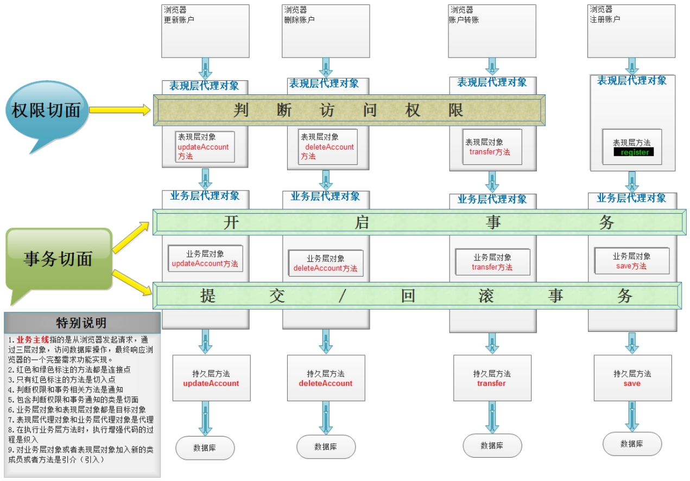

> 当前位置：【Java】07_JavaWeb_Framework（开源框架） -> 7.2_Spring5


# 第一章 Spring 简介

## 0、网站地址

- 官网：https://spring.io/projects/spring-framework
- GitHub：https://github.com/spring-projects/spring-framework


## 1、Spring 概述

```java
- Spring 是分层的 full-stack（全栈） 轻量级开源框架，以 IoC 和 AOP 为内核，提供了展现层 Spring MVC 和业务层事务管理等众多的企业级应用技术，还能整合开源世界众多著名的第三方框架和类库，已经成为使用最多的 Java EE 企业应用开源框架

- 经常说的 Spring 其实指的是Spring Framework（spring 框架）
```


## 2、Spring 发展历史

```java
- 1997年，IBM 提出了 EJB 的思想； 
- 1998年，SUN 制定开发标准规范 EJB 1.0； 
- 1999年，EJB 1.1发布； 
- 2001年，EJB 2.0发布； 
- 2003年，EJB 2.1发布；
- 2006年，EJB 3.0发布；
- 2017年9月份发布了 Spring 的最新版本 Spring 5.0 通用版（GA）
```


## 3、Spring 特点

### 3.1 方便解耦，简化开发

```java
- 通过Spring提供的IoC容器，可以将对象间的依赖关系交由Spring进行控制，避免硬编码所造成的过度程序耦合
- 用户也不必再为单例模式类、属性文件解析等这些很底层的需求编写代码，可以更专注于上层的应用
```

- 简化开发的基本策略

```
- 基于POJO的轻量级和最小侵入性编程
- 通过依赖注入和面向接口松耦合
- 基于切面和惯性进行声明式编程
- 通过切面和模板减少样板式代码
```

### 3.2 支持AOP编程

```java
- 通过Spring的AOP功能，方便进行面向切面的编程，许多不容易用传统OOP实现的功能可以通过AOP轻松应对
```


### 3.3 支持声明式事务

```java
@Transactional
- 从单调烦闷的事务管理代码中解脱出来，通过声明式方式灵活的进行事务的管理，提高开发效率和质量
```

### 3.4 方便程序测试

```java
- 用容器依赖的编程方式进行几乎所有的测试工作，测试不再是昂贵的操作，而是随手可做的事情
```

### 3.5 方便集成各种优秀框架

```java
- Spring可以降低各种框架的使用难度，提供了对各种优秀框架（Struts、Hibernate、Hessian、Quartz等）的直接支持
```

### 3.6 降低  JavaEE API 的使用难度

```java
- Spring对JavaEE API（如JDBC、JavaMail、远程调用等）进行了薄薄的封装层，使这些API的使用难度大为降低
```


## 4、Spring 版本

### 4.1 命名规则

| 描述方式 | 说明     | 含义                                                         |
| -------- | -------- | ------------------------------------------------------------ |
| Snapshot | 快照版   | 尚不不稳定、尚处于开发中的版本                               |
| Release  | 稳定版   | 功能相对稳定，可以对外发行，但有时间限制                     |
| GA       | 正式版   | 代表广泛可用的稳定版(General Availability)                   |
| M        | 里程碑版 | (M是Milestone的意思)具有一些全新的功能或是具有里程碑意义的版本。 |
| RC       | 终测版   | Release Candidate(最终测试)，即将作为正式版发布。            |

### 4.2 Spring 对应 JDK

| Spring Framework     | JDK    |
| -------------------- | ------ |
| Spring Framework 5.X | JDK 8+ |
| Spring Framework 4.X | JDK 6+ |
| Spring Framework 3.X | JDK 5+ |


## 5、Spring5 系统架构

### 5.1 模块结构图


### 5.2 模块分类 

#### （1）核心容器（Core Container）

| 模块名称               | 主要功能                                           |
| ---------------------- | -------------------------------------------------- |
| spring-core            | 依赖注入 IOC 与 DI 的最基本实现                    |
| spring-beans           | Bean 工厂与 Bean 的装配                            |
| spring-context         | 定义基础的 Spring 的 Context 上下文（即 IOC 容器） |
| spring-context-support | 对 Spring IOC 容器的扩展支持，以及 IOC 子容器      |
| spring-context-indexer | Spring 的类管理组件和 Classpath 扫描               |
| spring-expression      | Spring 表达式语言                                  |

```
- 容器是 Spring 框架最核⼼的部分，它管理着 Spring 应用中 bean 的创建、配置和管理
- 在该模块中，包括了 Spring bean 工厂，它为 Spring 提供了 DI 的功能
- 基于 bean 工厂，发现有多种 Spring 应用上下文的实现
- 所有的 Spring 模块都构建于核心容器之上
```


#### （2）切面编程（AOP）

| 模块名称          | 主要功能                                                     |
| ----------------- | ------------------------------------------------------------ |
| spring-aop        | 面向切面编程的应用模块，整合 Asm，CGLIb、JDKProxy            |
| spring-aspects    | 集成 AspectJ，AOP 应用框架                                   |
| spring-instrument | 动态 Class Loading 模块                                      |
| spring-messaging  | 通信报文，提供了最基础 Web 支持，主要建立于核心容器之上，通过 Servlet 或者 Listeners 来初始化 IOC 容器 |

```
- 对⾯向切⾯编程提供了丰富的⽀持
- 这个模块是 Spring 应⽤系统中开发切⾯的基础，与 DI ⼀样，AOP 可以帮助应⽤对象解耦
```


#### （3）数据访问与集成（Data Access/Integration）

| 模块名称    | 主要功能                                                     |
| ----------- | ------------------------------------------------------------ |
| spring-jdbc | Spring 提供的 JDBC 抽象框架的主要实现模块，用于简化 Spring JDBC 操作 |
| spring-tx   | Spring  JDBC 事务控制实现模块                                |
| spring-orm  | 主要集成 Hibernate, Java Persistence API (JPA) 和 Java Data Objects (JDO) |
| spring-oxm  | 将 Java 对象映射成 XML 数据，或者将 XML 数据映射成 Java 对象 |
| spring-jms  | Java Messaging Service 能够发送和接收信息                    |

```
- Spring 的 JDBC 和 DAO 模块封装了⼤量样板代码，这样可以使得数据库代码变得简洁，也可以更专注于业务，还可以避免数据库资源释放失败⽽引起的问题
- Spring AOP 为数据访问提供了事务管理服务，同时 Spring 还对 ORM 进⾏了集成，如 Hibernate、MyBatis 等
- 该模块由 JDBC、Transactions、ORM、OXM 和 JMS 等模块组成
```


#### （4）web 组件

| 模块名称         | 主要功能                                                     |
| ---------------- | ------------------------------------------------------------ |
| spring-web       | 提供了最基础 Web 支持，主要建立于核心容器之上，通过 Servlet 或者 Listeners 来初始化IOC容器。 |
| spring-webmvc    | 实现了 Spring MVC(model-view-Controller) 的Web应用。         |
| spring-websocket | 主要是与 Web 前端的全双工通讯的协议。                        |
| spring-webflux   | 一个新的非堵塞函数式 Reactive Web 框架，可以用来建立异步的，非阻塞，事件驱动的服务。 |

```
- Web 模块提供了 SpringMVC 框架给 Web 应⽤，还提供了多种构建和其它应⽤交互的远程调⽤⽅案
- SpringMVC 框架在 Web 层提升了应⽤的松耦合⽔平
```


#### （5）集成测试

| 模块名称    | 主要功能               |
| ----------- | ---------------------- |
| spring-test | 主要为测试提供支持的。 |

```
- Test 为了使得开发者能够很⽅便的进⾏测试，Spring提供了测试模块以致⼒于Spring应⽤的测试
- 通过该模块，Spring 为使⽤ Servlet、JNDI 等编写单元测试提供了⼀系列的 mock对象实现
```


#### （6）集成兼容

| 模块名称             | 主要功能                                                    |
| -------------------- | ----------------------------------------------------------- |
| spring-framework-bom | Bill of Materials，解决 Spring 的不同模块依赖版本不同问题。 |


### 5.3 Spring各模块之间的依赖关系


## 6、Spring 源码构建（基于 Gradle）

- 下载：https://github.com/spring-projects/spring-framework/


## 7、Spring 整合（待完善）

整合SpringMVC

整合MyBatis

整合Shiro（权限管理）

认证

授权

整合SpringSecurity（权限管理）


## MiNi Spring（待完善）

### 基本实现思路


# 第二章 Spring IOC

## 1、IOC 简介

### 1.1 引入：传统开发方式 和 IOC开发方式

#### （1）传统开发方式

```
- 如果类 A 依赖于类 B，往往会在类 A 中 new 一个 B 对象
```


#### （2）IOC思想下的开发方式

```
- 不再自己 new 对象了，而是由 IOC 容器（Spring框架）来实例化对象并且管理它，需要使用哪个对象，向 IOC 容器要即可
```


### 1.2 IOC 和 DI

```java
Inversion of Control (IOC，控制反转/反转控制)
- 它是一个技术思想，不是技术实现
- 控制：指的是对象创建（实例化、管理）的权利
- 反转：控制权交给外部环境了（spring框架、IoC容器）
  
Dependancy Injection（DI，依赖注入）
  

IOC 和 DI 描述的是同一件事情(对象实例化及依赖关系维护这件事情)，只不过角度不同罢了
- IOC 是站在对象的角度，对象实例化及其管理的权利交给了（反转）给了容器
- DI 是站在容器的角度，容器会把对象依赖的其他对象注入（送进去）（比如 A 对象实例化过程中因为声明了一个B类型的属性，那么就需要容器把B对象注入给A）
```

- IOC 解决对象之间的耦合问题

```
- new 对象会使得 service 和 dao 之间进行强耦合- 使用 ioc，只需要声明即可，private UserDao userDao；降低对象之间的耦合
```


## 2、IOC 使用

### 2.1 BeanFactory 与 ApplicationContext 区别

### 2.2 XML 配置

### 2.3 XML + 注解

### 2.4 纯注解


## 3、IOC 特性

### 3.1lazy-Init 延迟加载

### 3.2 FactoryBean 和 BeanFactory

### 3.3 后置处理器

#### （1）BeanPostProcessor

#### （2）BeanFactoryPostProcessor


## 4、IOC 源码分析

### 4.1 IoC 容器初始化主体流程

### 4.2 BeanFactory 创建流程

### 4.3 Bean 创建流程

### 4.4 lazy-init 延迟加载机制原理

### 4.5 Spring IoC 循环依赖问题


# 第三章 Spring AOP

## 1、AOP 简介

### 1.1 OOP

```java
- OOP 是一种垂直继承体系
- OOP 三大特征：封装、继承、多态
- OOP编程思想可以解决⼤多数的代码重复问题，但是有⼀些情况是处理不了的，如在顶级⽗类中的多个⽅法中相同位置出现了重复代码，OOP就解决不了
```


### 1.2 AOP

#### （1）AOP 概念

```
Aspect oriented Programming（AOP，面向切面编程/面向方面编程）
- AOP 是 OOP 的延续
- 切：指的是横切逻辑，原有业务逻辑代码不动，只能操作横切逻辑代码，所以面向横切逻辑
- 面：横切逻辑代码往往影响很多个方法，每一个方法都如同一个点，多个点构成面

AOP 在解决什么问题
- 在不改变原有业务逻辑情况下，增强横切逻辑代码，根本上解耦合，避免横切逻辑代码重复
```

#### （2）横切逻辑

```
横切逻辑：在多个纵向（顺序）流程中出现的相同子流程代码，称为横切逻辑代码
使用场景：权限校验代码、⽇志代码、事务控制代码、性能监控代码。

横切逻辑代码缺点
- 横切代码重复
- 横切逻辑代码和业务代码混杂在一起，代码臃肿，维护不方便
```

- 把重复代码抽取出来的同时，运⽤动态代理技术，在运⾏期对需要使⽤的业务逻辑⽅法进⾏增强。




- AOP提出横向抽取机制，将  ==横切逻辑== 代码和 ==业务逻辑== 代码分离


### 1.3 AOP 术语

```java
Joinpoint(连接点)
- ⽅法开始时、结束时、正常运⾏完毕时、⽅法异常时等这些特殊的时机点，称之为连接点，项目中每个⽅法都有连接点，连接点是⼀种候选点
- 指的是那些可以⽤于把增强代码加⼊到业务主线中的点（这些点指的就是⽅法）
- 在⽅法执⾏的前后通过动态代理技术加⼊增强的代码
- 在 Spring 框架 AOP 思想的技术实现中，也只⽀持⽅法类型的连接点
  
// --------------------------------------------------------------------------------------------------------------------------

Pointcut(切⼊点)
- 指定 AOP 思想想要影响的具体⽅法是哪些，描述感兴趣的⽅法
- 指的是那些已经把增强代码加⼊到业务主线进来之后的连接点
- 上图中，表现层 transfer ⽅法就只是连接点，因为判断访问权限的功能并没有对其增强

Advice(通知/增强)
第⼀个层次：指的是横切逻辑
第⼆个层次：⽅位点（在某⼀些连接点上加⼊横切逻辑，那么这些连接点就叫做⽅位点，描述的是具体的特殊时机）
- 指的是切⾯类中⽤于提供增强功能的⽅法，并且不同的⽅法增强的时机是不⼀样的
- ⽐如，开启事务肯定要在业务⽅法执⾏之前执⾏，提交事务要在业务⽅法正常执⾏之后执⾏，⽽回滚事务要在业务⽅法执⾏产⽣异常之后执⾏等等，这些就是通知的类型
- 分类有：前置通知、后置通知、异常通知、最终通知、环绕通知

Aspect(切面)
Aspect切面= 切⼊点 + 增强 = 切⼊点（锁定⽅法） + ⽅位点（锁定⽅法中的特殊时机）+ 横切逻辑
- 指定是增强的代码所关注的⽅⾯，把这些相关的增强代码定义到⼀个类中，这个类就是切⾯类
- 例如，事务切⾯，它⾥⾯定义的⽅法就是和事务相关的，像开启事务，提交事务，回滚事务等等，不会定义其他与事务⽆关的⽅法

// --------------------------------------------------------------------------------------------------------------------------

Target(⽬标对象) 
- 指的是代理的⽬标对象（即被代理对象）

Proxy(代理) 
- 指的是⼀个类被 AOP 织⼊增强后，产⽣的代理类（即代理对象）

Weaving(织⼊)
- 指的是把增强应⽤到⽬标对象来创建新的代理对象的过程
- spring 采⽤动态代理织⼊，⽽ AspectJ 采⽤编译期织⼊和类装载期织⼊
```


## 2、AOP 使用

### 2.0 AOP 代理选择

```java
Spring 实现 AOP 思想使⽤的是动态代理技术，默认情况下，Spring 会根据被代理对象是否实现接⼝来选择使⽤JDK还是CGLIB
- 当被代理对象没有实现任何接⼝时，Spring 会选择 CGLIB（可以通过配置的⽅式，让 Spring 强制使⽤ CGLIB）
- 当被代理对象实现了接⼝，Spring 会选择 JDK 官⽅的代理技术
```


### 2.1 XML 配置

#### （1）pom 依赖

```xml
<!--spring aop的jar包支持-->
<dependency>
  <groupId>org.springframework</groupId>
  <artifactId>spring-aop</artifactId>
  <version>5.1.12.RELEASE</version>
</dependency>

<!-- 第三方的aop框架aspectj的jar -->
<dependency>
  <groupId>org.aspectj</groupId>
  <artifactId>aspectjweaver</artifactId>
  <version>1.8.13</version>
</dependency>
```

#### （2）applicationContext.xml

```xml
<!-- 进行aop相关的xml配置，配置aop的过程其实就是把aop相关术语落地 -->
<!-- 横切逻辑bean -->
<bean id="logUtils" class="com.loto.aop.utils.LogUtils"/>
<bean id="transferService" class="com.loto.aop.service.impl.TransferServiceImpl"/>

<!-- 使用 config 标签表明开始 aop 配置，在内部配置切面 aspect -->
<aop:config>
  <aop:aspect id="logAspect" ref="logUtils">
    <!-- 切入点锁定感兴趣的方法，使用 aspectj 语法表达式 -->
    <!--<aop:pointcut id="pt1" expression="execution(public void com.loto.aop.service.impl.TransferServiceImpl.transfer(java.lang.String, java.lang.String, int))"/>-->
    <aop:pointcut id="pt1" expression="execution(* com.loto.aop.service.impl.TransferServiceImpl.*(..))"/>
    <!--<aop:pointcut id="pt1" expression="execution(* *..*.*(..))"/>-->

    <!-- 1、前置通知/前置增强 -->
    <!-- method：⽤于指定前置通知的⽅法名称 -->
    <!-- pointcut：⽤于指定切⼊点表达式 -->
    <!-- pointcut-ref：⽤于指定切⼊点表达式的引⽤（方位信息，关联切入点） -->
    <aop:before method="beforeMethod" pointcut-ref="pt1"/>

    <!-- 2、后置通知/返回通知/正常执行通知 -->
    <aop:after-returning method="successMethod" returning="retVal" pointcut-ref="pt1"/>

    <!-- 3、异常通知 -->
    <aop:after-throwing method="exceptionMethod" pointcut-ref="pt1"/>

    <!-- 4、最终通知，无论如何都执行-->
    <aop:after method="afterMethod" pointcut-ref="pt1"/>

    <!-- 5、环绕通知 -->
    <aop:around method="aroundMethod" pointcut-ref="pt1"/>
  </aop:aspect>
</aop:config>
```

#### （3）LogUtils.java

```java
package com.loto.aop.utils;

import org.aspectj.lang.JoinPoint;
import org.aspectj.lang.ProceedingJoinPoint;

public class LogUtils {
    public void pt1() {

    }

    /**
     * 业务逻辑 开始之前 执行
     */
    public void beforeMethod(JoinPoint joinPoint) {
        Object[] args = joinPoint.getArgs();
        for (int i = 0; i < args.length; i++) {
            Object arg = args[i];
            System.out.println(arg);
        }
        System.out.println("业务逻辑开始执行之前执行.......");
    }

    /**
     * 业务逻辑 结束时 执行（无论异常与否）
     */
    public void afterMethod() {
        System.out.println("业务逻辑结束时执行，无论异常与否都执行.......");
    }

    /**
     * 异常时执行
     */
    public void exceptionMethod() {
        System.out.println("异常时执行.......");
    }

    /**
     * 业务逻辑 正常时 执行
     */
    public void successMethod(Object retVal) {
        System.out.println("业务逻辑正常时执行.......");
    }

    /**
     * 环绕通知
     */
    public Object aroundMethod(ProceedingJoinPoint proceedingJoinPoint) throws Throwable {
        System.out.println("环绕通知中的before method....");

        Object result = null;
        try {
            // 控制原有业务逻辑是否执行
             result = proceedingJoinPoint.proceed(proceedingJoinPoint.getArgs());
        } catch (Exception e) {
            System.out.println("环绕通知中的exception method....");
        } finally {
            System.out.println("环绕通知中的after method....");
        }
        return result;
    }
}
```

（4）测试类

```java
public class AopTest {
    @Test
    public void testXmlAop() throws Exception {
        ClassPathXmlApplicationContext applicationContext = new ClassPathXmlApplicationContext("classpath:applicationContext.xml");
        TransferService transferService = applicationContext.getBean(TransferService.class);
        transferService.transfer("6029621011000", "6029621011001", 100);
    }
}
```


### 2.2 XML + 注解

#### （1）applicationContext.xml

```xml
<!-- 开启 aop 注解驱动 -->
<aop:aspectj-autoproxy/>

<!-- 强制使用 cglib 动态代理-->
<!--<aop:aspectj-autoproxy proxy-target-class="true"/>-->
```

#### （2）LogUtils.java

| LogUtils.java                                                | applicationContext.xml                                       |
| ------------------------------------------------------------ | ------------------------------------------------------------ |
| @Component                                                   | < bean id="logUtils" class="com.loto.aop.utils.LogUtils"/>   |
| @Service                                                     | < bean id="transferService" class="com.loto.aop.service.impl.TransferServiceImpl"/> |
| @Aspect                                                      | <aop:aspect id="logAspect" ref="logUtils">                   |
| @Pointcut("execution(* com.lagou.edu.service.impl.TransferServiceImpl.*(..))") | <aop:pointcut id="pt1" expression="execution(* com.loto.aop.service.impl.TransferServiceImpl.*(..))"/> |
| @xxxx 五种类型通知                                           | <aop:xxxx   />                                               |


```java
package com.loto.aop.utils;

import org.aspectj.lang.JoinPoint;
import org.aspectj.lang.ProceedingJoinPoint;
import org.aspectj.lang.annotation.After;
import org.aspectj.lang.annotation.AfterReturning;
import org.aspectj.lang.annotation.AfterThrowing;
import org.aspectj.lang.annotation.Aspect;
import org.aspectj.lang.annotation.Before;
import org.aspectj.lang.annotation.Pointcut;
import org.springframework.context.annotation.EnableAspectJAutoProxy;
import org.springframework.stereotype.Component;

@Component
@Aspect
public class LogUtils {

    @Pointcut("execution(* com.loto.aop.service.impl.TransferServiceImpl.*(..))")
    public void pt1() {
    }

    /**
     * 业务逻辑 开始之前 执行
     */
    @Before("pt1()")
    public void beforeMethod(JoinPoint joinPoint) {
        Object[] args = joinPoint.getArgs();
        for (int i = 0; i < args.length; i++) {
            Object arg = args[i];
            System.out.println(arg);
        }
        System.out.println("业务逻辑开始执行之前执行.......");
    }

    /**
     * 业务逻辑 结束时 执行（无论异常与否）
     */
    @After("pt1()")
    public void afterMethod() {
        System.out.println("业务逻辑结束时执行，无论异常与否都执行.......");
    }

    /**
     * 异常时执行
     */
    @AfterThrowing("pt1()")
    public void exceptionMethod() {
        System.out.println("异常时执行.......");
    }

    /**
     * 业务逻辑 正常时 执行
     */
    @AfterReturning(value = "pt1()", returning = "retVal")
    public void successMethod(Object retVal) {
        System.out.println("业务逻辑正常时执行.......");
    }

    /**
     * 环绕通知
     */
    //@Around("pt1()")
    public Object aroundMethod(ProceedingJoinPoint proceedingJoinPoint) throws Throwable {
        System.out.println("环绕通知中的before method....");

        Object result = null;
        try {
            // 控制原有业务逻辑是否执行
            result = proceedingJoinPoint.proceed(proceedingJoinPoint.getArgs());
        } catch (Exception e) {
            System.out.println("环绕通知中的exception method....");
        } finally {
            System.out.println("环绕通知中的after method....");
        }
        return result;
    }
}
```


### 2.3 纯注解

#### （1）LogUtils.java

| LogUtils.java                                                | applicationContext.xml                                       |
| ------------------------------------------------------------ | ------------------------------------------------------------ |
| @Component                                                   | < bean id="logUtils" class="com.loto.aop.utils.LogUtils"/>   |
| @Service                                                     | < bean id="transferService" class="com.loto.aop.service.impl.TransferServiceImpl"/> |
| @Aspect                                                      | <aop:aspect id="logAspect" ref="logUtils">                   |
| @Pointcut("execution(* com.lagou.edu.service.impl.TransferServiceImpl.*(..))") | <aop:pointcut id="pt1" expression="execution(* com.loto.aop.service.impl.TransferServiceImpl.*(..))"/> |
| @xxxx 五种类型通知                                           | <aop:xxxx   />                                               |
| @EnableAspectJAutoProxy // 开启spring对注解AOP的⽀持         | < aop:aspectj-autoproxy/>                                    |
| @EnableAspectJAutoProxy(proxyTargetClass = true) // 强制使用 cglib 动态代理 | <aop:aspectj-autoproxy proxy-target-class="true"/>           |


```java
package com.loto.aop.utils;

import org.aspectj.lang.JoinPoint;
import org.aspectj.lang.ProceedingJoinPoint;
import org.aspectj.lang.annotation.After;
import org.aspectj.lang.annotation.AfterReturning;
import org.aspectj.lang.annotation.AfterThrowing;
import org.aspectj.lang.annotation.Aspect;
import org.aspectj.lang.annotation.Before;
import org.aspectj.lang.annotation.Pointcut;
import org.springframework.context.annotation.EnableAspectJAutoProxy;
import org.springframework.stereotype.Component;

@Component
@Aspect
@EnableAspectJAutoProxy // 开启spring对注解AOP的⽀持
//@EnableAspectJAutoProxy(proxyTargetClass = true) // 强制使用 cglib 动态代理
public class LogUtils {

    @Pointcut("execution(* com.loto.aop.service.impl.TransferServiceImpl.*(..))")
    public void pt1() {
    }

    /**
     * 业务逻辑 开始之前 执行
     */
    @Before("pt1()")
    public void beforeMethod(JoinPoint joinPoint) {
        Object[] args = joinPoint.getArgs();
        for (int i = 0; i < args.length; i++) {
            Object arg = args[i];
            System.out.println(arg);
        }
        System.out.println("业务逻辑开始执行之前执行.......");
    }

    /**
     * 业务逻辑 结束时 执行（无论异常与否）
     */
    @After("pt1()")
    public void afterMethod() {
        System.out.println("业务逻辑结束时执行，无论异常与否都执行.......");
    }

    /**
     * 异常时执行
     */
    @AfterThrowing("pt1()")
    public void exceptionMethod() {
        System.out.println("异常时执行.......");
    }

    /**
     * 业务逻辑 正常时 执行
     */
    @AfterReturning(value = "pt1()", returning = "retVal")
    public void successMethod(Object retVal) {
        System.out.println("业务逻辑正常时执行.......");
    }

    /**
     * 环绕通知
     */
    //@Around("pt1()")
    public Object aroundMethod(ProceedingJoinPoint proceedingJoinPoint) throws Throwable {
        System.out.println("环绕通知中的before method....");

        Object result = null;
        try {
            // 控制原有业务逻辑是否执行
            result = proceedingJoinPoint.proceed(proceedingJoinPoint.getArgs());
        } catch (Exception e) {
            System.out.println("环绕通知中的exception method....");
        } finally {
            System.out.println("环绕通知中的after method....");
        }
        return result;
    }
}
```

## 3、AOP 源码分析


# 第四章 手写 IOC  和 AOP

（1）自定义aop，从原始的使用new实现类的方式演化成实例化的方式

（2）再继续优化dao层事务控制，从原始的每次数据库操作创建一个连接，演化为整个业务操作过程中将连接池绑定到同一个线程中，保证事务属于同一个

（3）最后使用代理设计模式，增强横切逻辑（即事务控制的代码块），扩展功能


# 第五章 Spring 声明式事务控制

## 1、编程式事务 和 声明式事务

```java
- 编程式事务：在业务代码中添加事务控制代码，这样的事务控制机制就叫做编程式事务
- 声明式事务：通过 xml 或者 注解 配置的⽅式达到事务控制的⽬的，叫做声明式事务
```


## 2、声明式事务 API

### 2.1 三种框架 API

| 框架      | API                        |
| --------- | -------------------------- |
| Mybatis   | sqlSession.commit();       |
| Hibernate | session.commit();          |
| Spring    | PlatformTransactionManager |


### 2.2 PlatformTransactionManager

- org/springframework/transaction/PlatformTransactionManager.java

```java
package org.springframework.transaction;

import org.springframework.lang.Nullable;

public interface PlatformTransactionManager {
  // 获取事务状态信息
  TransactionStatus getTransaction(@Nullable TransactionDefinition definition) throws TransactionException;
  
  // 提交事务
  void commit(TransactionStatus status) throws TransactionException;

  // 回滚事务
  void rollback(TransactionStatus status) throws TransactionException;
}
```


## 3、声明式事务的使用

### 3.1 XML 配置

#### （1）pom 依赖

```xml
<!-- 引入spring声明式事务相关 -->
<dependency>
  <groupId>org.springframework</groupId>
  <artifactId>spring-jdbc</artifactId>
  <version>5.1.12.RELEASE</version>
</dependency>

<dependency>
  <groupId>org.springframework</groupId>
  <artifactId>spring-tx</artifactId>
  <version>5.1.12.RELEASE</version>
</dependency>
```

#### （2）applicationContext.xml

```xml
<?xml version="1.0" encoding="UTF-8"?>
<beans xmlns="http://www.springframework.org/schema/beans"
       xmlns:context="http://www.springframework.org/schema/context"
       xmlns:aop="http://www.springframework.org/schema/aop"
       xmlns:tx="http://www.springframework.org/schema/tx"
       xmlns:xsi="http://www.w3.org/2001/XMLSchema-instance"
       xsi:schemaLocation="
        http://www.springframework.org/schema/beans
        https://www.springframework.org/schema/beans/spring-beans.xsd
        http://www.springframework.org/schema/context
        https://www.springframework.org/schema/context/spring-context.xsd
        http://www.springframework.org/schema/aop
        https://www.springframework.org/schema/aop/spring-aop.xsd
        http://www.springframework.org/schema/tx
        https://www.springframework.org/schema/tx/spring-tx.xsd
">

    .......

    <!-- 注入bean -->
    <bean id="jdbcTemplate" class="org.springframework.jdbc.core.JdbcTemplate">
        <constructor-arg name="dataSource" ref="dataSource"/>
    </bean>

    <!-- spring声明式事务配置：声明式事务无非就是配置一个aop，只不过有些标签不一样罢了-->
    <!-- 横切逻辑 -->
    <bean id="transactionManager" class="org.springframework.jdbc.datasource.DataSourceTransactionManager">
        <constructor-arg name="dataSource" ref="dataSource"/>
    </bean>

    <!-- advice-ref：指向增强=横切逻辑+方位-->
    <aop:config>
        <aop:advisor advice-ref="txAdvice" pointcut="execution(* com.loto.tx.service.impl.TransferServiceImpl.*(..))"/>
    </aop:config>

    <tx:advice id="txAdvice" transaction-manager="transactionManager">
        <!-- 定制事务细节：事务的传播行为、隔离级别等 -->
        <tx:attributes>
            <!-- 一般性配置 -->
            <tx:method name="*" read-only="false" propagation="REQUIRED" isolation="DEFAULT" timeout="-1"/>

            <!-- 针对查询的覆盖性配置 -->
            <tx:method name="query*" read-only="true" propagation="SUPPORTS"/>
        </tx:attributes>
    </tx:advice>
</beans>
```


### 3.2 XML + 注解

#### （1）applicationContext.xml

```xml
<?xml version="1.0" encoding="UTF-8"?>
<beans xmlns="http://www.springframework.org/schema/beans"
       xmlns:context="http://www.springframework.org/schema/context"
       xmlns:aop="http://www.springframework.org/schema/aop"
       xmlns:tx="http://www.springframework.org/schema/tx"
       xmlns:xsi="http://www.w3.org/2001/XMLSchema-instance"
       xsi:schemaLocation="
        http://www.springframework.org/schema/beans
        https://www.springframework.org/schema/beans/spring-beans.xsd
        http://www.springframework.org/schema/context
        https://www.springframework.org/schema/context/spring-context.xsd
        http://www.springframework.org/schema/aop
        https://www.springframework.org/schema/aop/spring-aop.xsd
        http://www.springframework.org/schema/tx
        https://www.springframework.org/schema/tx/spring-tx.xsd
">

    <!-- 开启注解扫描，base-package指定扫描的包路径 -->
    <context:component-scan base-package="com.loto.tx"/>

    <!-- 引入外部资源文件 -->
    <context:property-placeholder location="classpath:jdbc.properties"/>

    <!-- 第三方jar中的bean定义在xml中 -->
    <bean id="dataSource" class="com.alibaba.druid.pool.DruidDataSource">
        <property name="driverClassName" value="${jdbc.driver}"/>
        <property name="url" value="${jdbc.url}"/>
        <property name="username" value="${jdbc.username}"/>
        <property name="password" value="${jdbc.password}"/>
    </bean>

    <!-- 注入bean -->
    <bean id="jdbcTemplate" class="org.springframework.jdbc.core.JdbcTemplate">
        <constructor-arg name="dataSource" ref="dataSource"/>
    </bean>

    <!-- spring声明式事务配置：声明式事务无非就是配置一个aop，只不过有些标签不一样罢了-->
    <!-- 横切逻辑 -->
    <bean id="transactionManager" class="org.springframework.jdbc.datasource.DataSourceTransactionManager">
        <constructor-arg name="dataSource" ref="dataSource"/>
    </bean>

    <!-- 声明式事务的注解驱动 -->
    <tx:annotation-driven transaction-manager="transactionManager"/>
</beans>
```


#### （2）TransferServiceImpl.java

| TransferServiceImpl.java                                     | applicationContext.xml                                       |
| ------------------------------------------------------------ | ------------------------------------------------------------ |
| @Transactional                                               | < aop:config>  和 < tx:advice>                               |


### 3.3 纯注解

#### （1）TransferServiceImpl.java

| TransferServiceImpl.java | applicationContext.xml                                       |
| ------------------------ | ------------------------------------------------------------ |
| @Component               | <tx:annotation-driven transaction-manager="transactionManager"/> |


## 4、声明式事务源码分析
