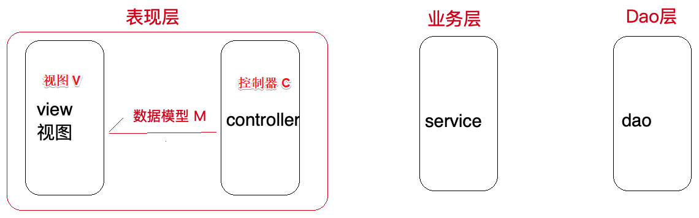
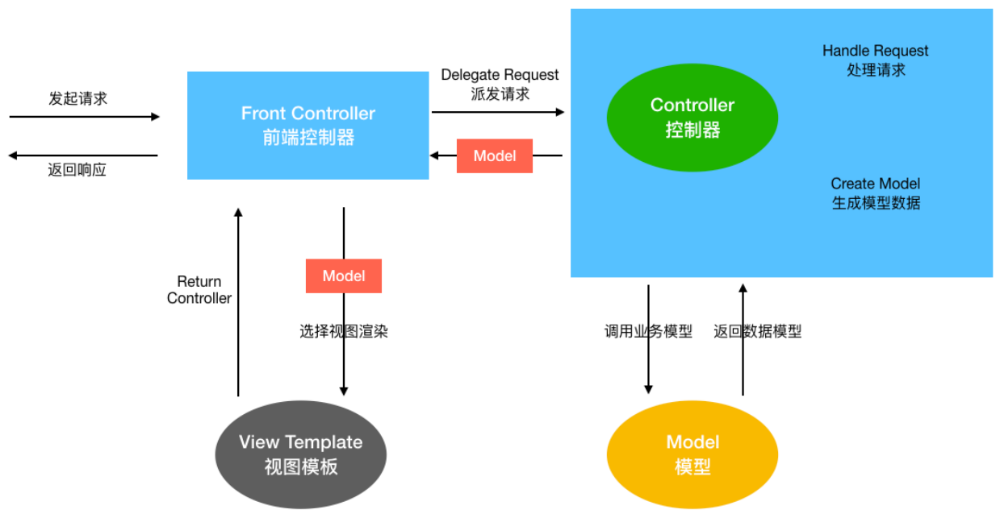
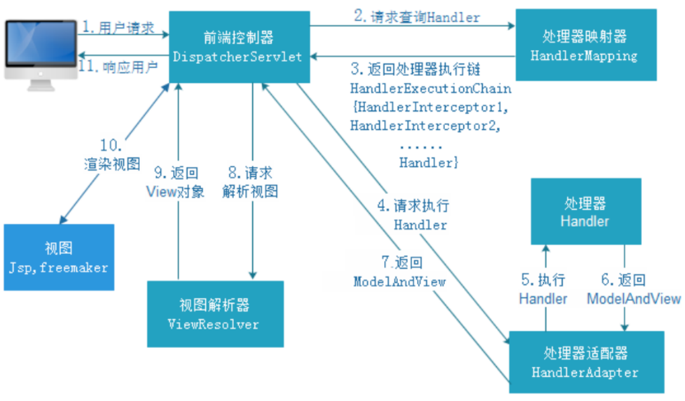
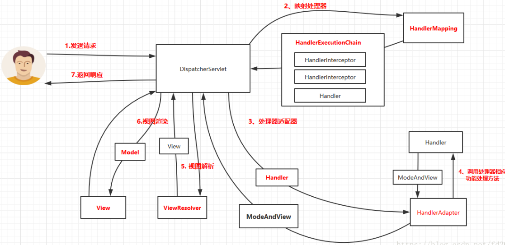

> 当前位置：【Java】07_JavaWeb_Framework（开源框架） -> 7.3_SpringMVC


# 第一章 SpringMVC 简介

## 1、MVC 体系结构

### 1.1 开发架构

```java
开发架构⼀般都是基于两种形式
- C/S 架构，也就是客户端/服务器
- B/S 架构，也就是浏览器/服务器

在 JavaEE 开发中，⼏乎全都是基于 B/S 架构的开发
```


### 1.2 B/S 三层架构

```java
在 B/S 架构中，系统标准的三层架构包括：表现层、业务层、持久层

表现层（web 层）
- 负责接收客户端请求，向客户端响应结果，通常客户端使⽤ http 协议请求 web 层，web 需要接收 http 请求，完成 http 响应
- 表现层包括展示层和控制层：控制层负责接收请求，展示层负责结果的展示
- 表现层依赖业务层，接收到客户端请求⼀般会调⽤业务层进⾏业务处理，并将处理结果响应给客户端
- 表现层的设计⼀般都使⽤ MVC 模型（MVC 是表现层的设计模型，和其他层没有关系）

业务层（service 层）
- 负责业务逻辑处理，和开发项⽬的需求息息相关
- web 层依赖业务层，但是业务层不依赖 web 层
- 业务层在业务处理时可能会依赖持久层，如果要对数据持久化需要保证事务⼀致性（事务应该放到业务层来控制）

持久层（dao层）
- 负责数据持久化，包括数据层（即数据库和数据访问层）
  - 数据库是对数据进⾏持久化的载体
  - 数据访问层是业务层和持久层交互的接⼝
- 业务层需要通过数据访问层将数据久化到数据库中
- 通俗的讲，持久层就是和数据库交互，对数据库表进⾏增删改查的
```


## 2、MVC 设计模式

```
- MVC 全名是 Model View Controller，是 模型(model) －视图(view) －控制器(controller) 的缩写
- MVC 是⼀种⽤于设计创建 Web 应⽤程序 表现层 的模式
- MVC提倡：每⼀层只编写⾃⼰的东⻄，不编写任何其他的代码
- 分层是为了解耦，解耦是为了维护⽅便和分⼯协作
```



#### （1）Model / 模型

```java
模型包含业务模型和数据模型
- 数据模型⽤于封装数据（pojo、vo、po）
- 业务模型⽤于处理业务（业务逻辑）
```

#### （2）View / 视图

```java
- 用于展示数据（jsp 或 html）
- 通常视图是依据模型数据创建的 
```

#### （3）Controller / 控制器 

```java
- 用于处理程序逻辑
- 应⽤程序中处理⽤户交互的部分
```


## 3、SpringMVC 概述

```java
SpringMVC 全名叫 Spring Web MVC
- 是⼀种基于 Java 的实现 MVC 设计模型的请求驱动类型的轻量级 Web 框架，属于 SpringFrameWork 的后续产品
- 通过⼀套注解，让⼀个简单的 Java 类成为处理请求的控制器，⽽⽆须实现任何接⼝
- ⽀持 RESTful 编程⻛格的请求
- SpringMVC 和 Struts2 ⼀样，都是为了解决表现层问题的 web 框架，都是基于 MVC 设计模式（这些表现层框架的主要职责就是处理前端 HTTP 请求）
  
Spring MVC 本质
- 对 servlet 的封装，简化 serlvet的开发
```




# 第二章 SpringMVC 使用

## 1、SpringMVC 使用步骤

### 步骤1：配置 DispatcherServlet 前端控制器

- web.xml

```xml
<!DOCTYPE web-app PUBLIC
        "-//Sun Microsystems, Inc.//DTD Web Application 2.3//EN"
        "http://java.sun.com/dtd/web-app_2_3.dtd" >

<web-app>
    ......
  
    <servlet>
        <!-- 配置 DispatcherServlet 前端控制器 -->
        <servlet-name>springmvc</servlet-name>
        <servlet-class>org.springframework.web.servlet.DispatcherServlet</servlet-class>

       ......
    </servlet>

    <servlet-mapping>
        ......
    </servlet-mapping>
</web-app>
```


### 步骤2：开发处理具体业务逻辑的 Handler

- xxxController.java

```java
@Controller
@RequestMapping("/quickstart")
public class QuickStartController {
    /**
     * 快速搭建<p>
     * http://localhost:8080/quickstart/handler
     */
    @RequestMapping("/handler")
    public ModelAndView Handler() {
      // ......
    }
}
```


### 步骤3：配置 controller 扫描，配置 springmvc 三大组件

- springmvc.xml（视图解析器、处理器映射器、处理器适配器）

```xml
<?xml version="1.0" encoding="UTF-8"?>
<beans xmlns="http://www.springframework.org/schema/beans"
       xmlns:xsi="http://www.w3.org/2001/XMLSchema-instance"
       xmlns:context="http://www.springframework.org/schema/context"
       xmlns:mvc="http://www.springframework.org/schema/mvc"
       xsi:schemaLocation="
        http://www.springframework.org/schema/beans
        https://www.springframework.org/schema/beans/spring-beans.xsd
        http://www.springframework.org/schema/context
        https://www.springframework.org/schema/context/spring-context.xsd
        http://www.springframework.org/schema/mvc
        https://www.springframework.org/schema/mvc/spring-mvc.xsd
">
		<!-- 开启 controller 扫描 -->
    <context:component-scan base-package="com.loto.springmvc.controller"/>

    <!-- 视图解析器 -->
    <bean class="org.springframework.web.servlet.view.InternalResourceViewResolver">
        <property name="prefix" value="/WEB-INF/jsp/"/>
        <property name="suffix" value=".jsp"/>
    </bean>

    <!-- 处理器映射器 和 处理器适配器（自动注册最合适的）-->
    <mvc:annotation-driven/>
</beans>
```


### 步骤4：将配置文件路径告诉 springmvc（DispatcherServlet）

- web.xml

```xml
<!DOCTYPE web-app PUBLIC
        "-//Sun Microsystems, Inc.//DTD Web Application 2.3//EN"
        "http://java.sun.com/dtd/web-app_2_3.dtd" >

<web-app>
    <display-name>Archetype Created Web Application</display-name>

    <servlet>
        .....

        <!-- 指定配置文件 springmvc.xml 路径 -->
        <init-param>
            <param-name>contextConfigLocation</param-name>
            <param-value>classpath:springmvc.xml</param-value>
        </init-param>
    </servlet>

    <servlet-mapping>
        ......
    </servlet-mapping>
</web-app>
```


## 2、SpringMVC 请求处理流程




```
第⼀步：⽤户发送请求⾄前端控制器 DispatcherServlet
第⼆步：DispatcherServlet 收到请求调⽤ HandlerMapping 处理器映射器
第三步：处理器映射器根据请求 Url 找到具体的 Handler（后端控制器），⽣成处理器对象及处理器拦截器(如果有则⽣成)⼀并返回DispatcherServlet
第四步：DispatcherServlet 调⽤ HandlerAdapter 处理器适配器去调⽤ Handler
第五步：处理器适配器执⾏ Handler
第六步：Handler 执⾏完成给处理器适配器返回 ModelAndView
第七步：处理器适配器向前端控制器返回 ModelAndView（是SpringMVC 框架的⼀个底层对象，包括 Model 和 View）
第⼋步：前端控制器请求视图解析器去进⾏视图解析，根据逻辑视图名来解析真正的视图
第九步：视图解析器向前端控制器返回 View
第⼗步：前端控制器进⾏视图渲染，就是将模型数据（在 ModelAndView 对象中）填充到 request 域
第⼗⼀步：前端控制器向⽤户响应结果
```




## 3、SpringMVC 九大组件

### 3.1 HandlerMapping（处理器映射器）

```
- HandlerMapping 是⽤来查找 Handler 的，也就是处理器，具体的表现形式可以是类，也可以是⽅法
- ⽐如，标注了 @RequestMapping 的每个⽅法都可以看成是⼀个 Handler
- Handler 负责具体实际的请求处理，在请求到达后，HandlerMapping 的作⽤便是找到请求相应的处理器 Handler 和 拦截器 Interceptor
```


### 3.2 HandlerAdapter（处理器适配器）

```
- 使用 HandlerAdapter 执行不同形式的 Handler

- 通过HandlerAdapter对处理器进行执行，这是适配器模式的应用
- 通过扩展适配器可以对更多类型的处理器进行执行
```


### 3.3 HandlerExceptionResolver（处理器异常解析器）

```java
- ⽤于处理 Handler 产⽣的异常情况
- 作⽤是根据异常设置 ModelAndView，之后交给渲染⽅法进⾏渲染，渲染⽅法会将 ModelAndView 渲染成⻚⾯
```


### 3.4 ViewResolver（视图解析器）

```java
- ⽤于将 String 类型的视图名和 Locale 解析为 View 类型的视图，只有⼀个 resolveViewName() ⽅法
- 从⽅法的定义可以看出，Controller 层返回的 String 类型视图名 viewName 最终会在这⾥被解析成为 View
- View 是⽤来渲染⻚⾯的，也就是说，它会将程序返回的参数和数据填⼊模板中，⽣成html⽂件

ViewResolver 在这个过程主要完成两件事情：
- ViewResolver 找到渲染所⽤的模板（第⼀件⼤事）和所⽤的技术（第⼆件⼤事，其实也就是找到视图的类型，如JSP）并填⼊参数

- 默认情况下，Spring MVC会⾃动配置⼀个 InternalResourceViewResolver，是针对 JSP 类型视图的
```


### 3.5 RequestToViewNameTranslator

```java
- 作用：从请求中获取 ViewName 视图名
- 因为 ViewResolver 根据 ViewName 查找 View，但有的 Handler 处理完成之后，没有设置 View，也没有设置 ViewName，便要通过这个组件从请求中查找 ViewName
```


### 3.6 LocaleResolver（国际化）

```java
- ViewResolver 组件的 resolveViewName ⽅法需要两个参数：⼀个是视图名，⼀个是 Locale
- LocaleResolver ⽤于从请求中解析出 Locale，⽤来表示⼀个区域（⽐如中国 Locale 是 zh-CN）
- 这个组件也是 i18n 的基础
```


### 3.7 ThemeResolver（主题解析器）

```java
- ThemeResolver 组件是⽤来解析主题的。
- 主题是样式、图⽚及它们所形成的显示效果的集合
- Spring MVC 中⼀套主题对应⼀个 properties⽂件，⾥⾯存放着与当前主题相关的所有资源，如图⽚、CSS样式等

创建主题步骤
- 准备好资源
- 新建“主题名.properties”并将资源路径放进去
- 将文件放在 classpath 下，之后便可以在⻚⾯中使⽤了

SpringMVC 中与主题相关的类
- ThemeResolver 负责从请求中解析出主题名
- ThemeSource 根据主题名找到具体的主题，其抽象也就是 Theme，
- Theme 用来获取主题和具体的资源
```


### 3.8 MultipartResolver

```java
- MultipartResolver 作⽤：封装普通的请求，使其拥有⽂件上传的功能
- 通过将普通的请求包装成 MultipartHttpServletRequest 来实现

- MultipartHttpServletRequest 可以通过 getFile() ⽅法直接获得⽂件
- 如果上传多个⽂件，还可以调⽤ getFileMap() ⽅法得到 Map<FileName，File> 这样的结构
```


### 3.9 FlashMapManager

```java
- ⽤于重定向时的参数传递
  
- ⽐如在处理⽤户订单时候，为了避免重复提交，可以处理完post请求之后重定向到⼀个get请求，这个get请求可以⽤来显示订单详情之类的信息。
- 这样做虽然可以规避⽤户重新提交订单的问题，但是在这个⻚⾯上要显示订单的信息，这些数据从哪⾥来获得呢？
- 因为重定向时么有传递参数这⼀功能的，如果不想把参数写进URL（不推荐），那么就可以通过FlashMap来传递。只需要在重定向之前将要传递的数据写⼊请求（可以通过ServletRequestAttributes.getRequest()⽅法获得）的属性OUTPUT_FLASH_MAP_ATTRIBUTE中，这样在重定向之后的Handler中Spring就会⾃动将其设置到Model中，在显示订单信息的⻚⾯上就可以直接从Model中获取数据
  
- FlashMapManager 就是⽤来管理 FalshMap 的
```


## SpringMVC 参数绑定

## SpringMVC 拦截器

## SpringMVC 异常处理器


# 第三章 自定义 MVC 框架


# 第四章 SpringMVC 源码分析
