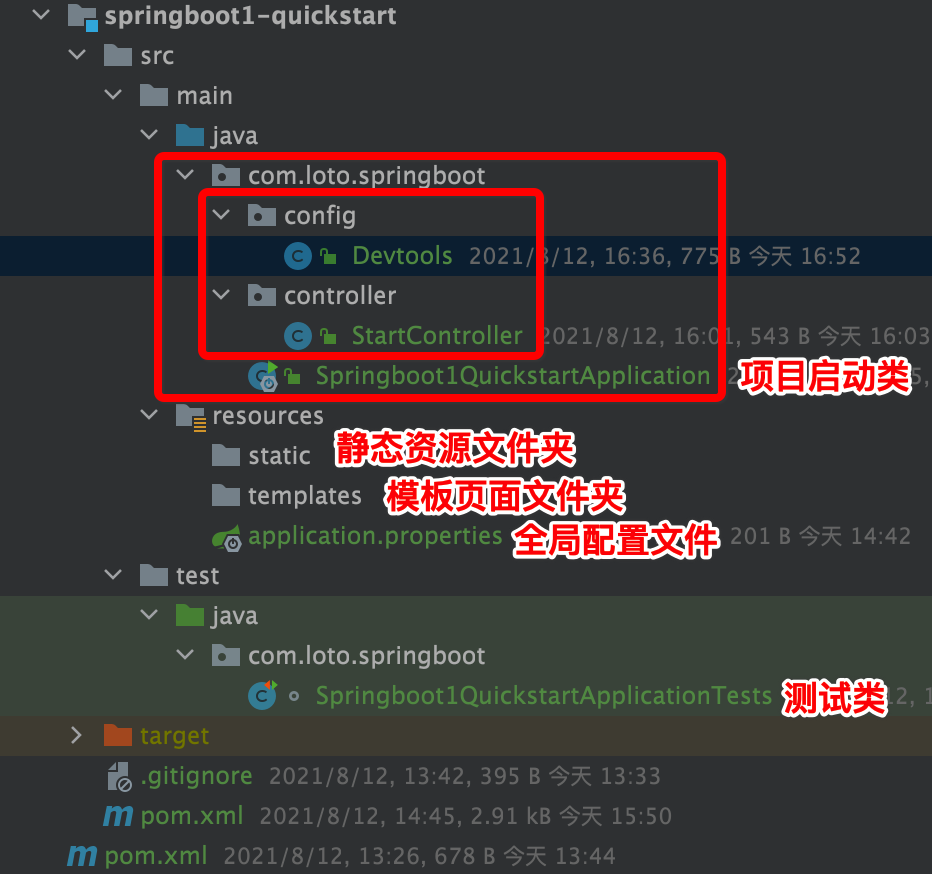

> 当前位置：【Java】07_JavaWeb_Framework（开源框架） -> 7.5_SpringBoot


# 第一章 SpringBoot 概述

## 0、约定优于配置

```
概念：约定优于配置(Convention over Configuration)，又称按约定编程，是一种软件设计规范。

本质上是对系统、类库或框架中一些东西假定一个大众化合理的默认值(缺省值)。

例如在模型中存在一个名为 User 的类，那么对应到数据库会存在一个名为 user 的表，此时无需做额外的配置，只有在偏离这个约定时才需要做相关的配置（例如你想将表名命名为 t_user 等非 user 时才需要写关于这个名字的配置）。

如果所用工具的约定与你的期待相符，便可省去配置；反之，你可以配置来达到你所期待的方式。

简单来说就是假如你所期待的配置与约定的配置一致，那么就可以不做任何配置，约定不符合期待时才需要对约定进行替换配置。

好处：大大减少了配置项
```


## 1、SpringBoot 简介

### 1.1 什么是SpringBoot

- 官网：https://spring.io/projects/spring-boot
- GitHub：https://github.com/spring-projects/spring-boot

```
- 通过Spring Boot，可以轻松地创建独立的，基于生产级别的基于Spring的应用程序，并且可以“运行”它们
- 其实 Spring Boot 的设计是为了让你尽可能快的启动 Spring 应用程序并且尽可能减少你的配置文件

- SpringBoot是由Pivotal团队在2013年开始研发、2014年4月发布第一个版本的全新开源的轻量级框
架
- 它基于Spring4.0设计
```


### 1.2 SpringBoot 发展

| 年份 | Spring 版本                   | SpringBoot 版本 |
| ---- | ----------------------------- | --------------- |
| 2004 | Spring 1.0                    |                 |
| 2006 | Spring 2.0                    |                 |
| 2007 | Spring 2.5                    |                 |
| 2009 | Spring 3.0（Servlet 3.0规范） |                 |
| 2013 | Spring 4.0（Servlet 3.1规范） |                 |
| 2014 |                               | SpringBoot 1.0  |
| 2017 | Spring 5.0                    |                 |
| 2018 |                               | SpringBoot 2.0  |


### 1.3 SpringBoot 主要特性 

#### （1）SpringBoot Starter

- 将常用的依赖分组进行了整合，将其合并到一个依赖中，这样就可以一次性添加到项目的 Maven 或 Gradle 构建中；

#### （2）使编码变得简单

- SpringBoot 采用  JavaConfig 的方式对 Spring 进行配置，并且提供了大量的注解，极大的提高了工作效率。

```
- 在类名上添加注解 @Configuration
```

#### （3）自动配置

- SpringBoot 的自动配置特性利用了 Spring 对条件化配置的支持，合理地推测应用所需的 bean 并自动化配置他们；

```
- SpringBoot 在启动的过程中，会自动的将一些配置类的 bean 进行创建，并且添加到 ioc 容器中
```

#### （4）使部署变得简单

- SpringBoot 内置了三种 Servlet 容器（Tomcat、Jetty、undertow），只需要一个 Java 的运行环境就可以跑 SpringBoot 的项目了，SpringBoot 的项目可以打成一个jar包。


## 2、SpringBoot 案例实现 

### 步骤 1：创建方式

#### 方式 1：使用 idea 创建

#### 方式 2：在 SpringBoot 官网创建

- https://start.spring.io/


### 步骤 2：界面介绍




## 3、SpringBoot 全局配置文件

### 3.1 全局配置文件优先级

- Spring Boot 使用一个 application.properties 或者 application.yaml 的文件作为全局配置文件

```shell
优先级从高到低，以下四个目录的文件都会被加载，互补设置
- 先去 项目根目录 找 config 文件夹下找配置文件（项目名/config/xxx，如果是多级 maven，要配置到顶级父工程下）
- 再去 根目录 下找配置文件（项目名/xxx，如果是多级 maven，要配置到顶级父工程下）
- 去 resources 下找 cofnig 文件夹下找配置文件（项目名/src/main/resources/config/xxx）
- 去 resources 下找配置文件（项目名/src/main/resources/xxx）
```

- 其他情况

```shell
- 如果同一个目录下，有 application.yml 也有 application.properties，默认先读取 application.properties

- 如果同一个配置属性，在多个配置文件都配置了，默认使用第1个读取到的，后面读取的不覆盖前面读取到的

- 创建 SpringBoot 项目时，一般的配置文件放置在项目的 resources 目录下
```

- 使用命令指定其他位置配置文件

```shell
- 如果配置文件名字不叫 application.properties 或者 application.yml，可以通过以下参数来指定
配置文件的名字，myproject是配置文件名
java -jar myproject.jar --spring.config.name=myproject

- 也可以指定其他位置的配置文件来生效
java -jar run-0.0.1-SNAPSHOT.jar -- spring.config.location=D:/application.properties
```


### 3.2 application.properties 配置文件

#### （1）Person.java

```java
package com.loto.springboot.pojo;

import org.springframework.boot.context.properties.ConfigurationProperties;
import org.springframework.stereotype.Component;

import java.util.Arrays;
import java.util.List;
import java.util.Map;

// 将当前注入属性值的 Person 类对象作为 Bean 组件放到 Spring IOC 容器中，只有这样才能被 @ConfigurationProperties 注解进行赋值
@Component
// 将配置文件中以 person 开头的属性值通过 setXX() 方法注入到实体类对应属性中，实现批量注入
@ConfigurationProperties(prefix = "person")
public class Person {
    private int id;           // id
    private String name;      // 名称
    private List hobby;       // 爱好
    private String[] family;  //家庭成员
    private Map map;
    private Pet pet;          // 宠物

  	// 省略属性getXX()和setXX()方法
  	// 省略toString()方法
}
```

#### （2）pom.xml

```xml
- 编写 application.properties 配置文件时，由于要配置的 Person 对象属性是自定义的，SpringBoot 无法自动识别，所以不会有任何书写提示。
- 在实际开发中，为了出现代码提示的效果来方便配置，在使用 @ConfigurationProperties 注解进行配置文件属性值注入时，可以在 pom.xml 文件中添加一个Spring Boot 提供的配置处理器依赖
- 在 pom.xml 中添加上述配置依赖后，还需要重新运行项目启动类或者使用 “Ctrl+F9” 快捷键（即 Build Project ）重构当前 Spring Boot 项目方可生效

<!-- 配置处理器依赖 -->
<!-- 实体类配置 @ConfigurationProperties 后，在 application.properties 中有提示 prefix 的内容 -->
<dependency>
  <groupId>org.springframework.boot</groupId>
  <artifactId>spring-boot-configuration-processor</artifactId>
  <optional>true</optional>
</dependency>
```

#### （3）application.properties

```properties
person.id = 1
person.name = jack
person.hobby = 吃饭
person.family = father,mother
person.map.k1 = v1
person.map.k2 = v2
person.pet.type = dog
person.pet.name = 站站
```

#### （4）Springboot1QuickstartApplicationTests.java

```java
package com.loto.springboot;

import com.loto.springboot.pojo.Person;
import org.junit.jupiter.api.Test;
import org.junit.runner.RunWith;
import org.springframework.beans.factory.annotation.Autowired;
import org.springframework.boot.test.context.SpringBootTest;
import org.springframework.test.context.junit4.SpringRunner;

// 测试启动器，并加载 Spring Boot 测试注解
@RunWith(SpringRunner.class)
// 标记为 Spring Boot 单元测试类，并加载项目的 ApplicationContext 上下文环境
@SpringBootTest
class Springboot1QuickstartApplicationTests {
    @Autowired
    private Person person;

    @Test
    void contextLoads() {
        System.out.println(person);
    }
}
```

#### （5）打印结果

```
Person{id=1, name='jack', hobby=[吃饭], family=[father, mother], map={k1=v1, k2=v2}, pet=Pet{type='dog', name='站站'}}
```


### 3.3 application.yaml 配置文件

#### （0）yaml/yml 简介

```yaml
- YAML 文件格式是 Spring Boot 支持的一种 JSON 超集文件格式
- YAML 文件的扩展名可以使用 .yml 或者 .yaml
- application.yml 文件使用 “key:（空格）value” 格式配置属性，使用缩进控制层级关系。

# （1）当 YAML 配置文件中配置的属性值 value 为普通数据类型时（例如数字、字符串、布尔等） ，可以直接配置对应的属性值，同时对于字符串类型的属性值，不需要额外添加引号
server: 
	port: 8080 
	servlet: 
		context-path: /hello
  
#（2）当 YAML 配置文件中配置的属性值 value 为数组或单列集合类型时，主要有两种书写方式：缩进式写法和行内式写法
# 缩进式写法1
person: 
	hobby: 
		- play 
		- read 
		- sleep
		
# 缩进式写法2
person: 
	hobby: 
		play, 
		read, 
		sleep
		
# 行内式写法		
person: 
	hobby: [play,read,sleep]
	
	
#（3）当 YAML 配置文件中配置的属性值 value 为 Map 集合或对象类型时，YAML 配置文件格式同样可以分为两种书写方式：缩进式写法和行内式写法
# 缩进式写法
person: 
	map:
		k1: v1 
		k2: v2

行内式写法示例代码如下 
person: 
	map: {k1: v1,k2: v2}
```

#### （1）Person.java

```java
package com.loto.springboot.pojo;

import org.springframework.boot.context.properties.ConfigurationProperties;
import org.springframework.stereotype.Component;

import java.util.Arrays;
import java.util.List;
import java.util.Map;

// 将当前注入属性值的 Person 类对象作为 Bean 组件放到 Spring IOC 容器中，只有这样才能被 @ConfigurationProperties 注解进行赋值
@Component
// 将配置文件中以 person 开头的属性值通过 setXX() 方法注入到实体类对应属性中，实现批量注入
@ConfigurationProperties(prefix = "person")
public class Person {
    private int id;           // id
    private String name;      // 名称
    private List hobby;       // 爱好
    private String[] family;  //家庭成员
    private Map map;
    private Pet pet;          // 宠物

  	// 省略属性getXX()和setXX()方法
  	// 省略toString()方法
}
```

#### （2）pom.xml

```xml
- 编写 application.properties 配置文件时，由于要配置的 Person 对象属性是自定义的，SpringBoot 无法自动识别，所以不会有任何书写提示。
- 在实际开发中，为了出现代码提示的效果来方便配置，在使用 @ConfigurationProperties 注解进行配置文件属性值注入时，可以在 pom.xml 文件中添加一个Spring Boot 提供的配置处理器依赖
- 在 pom.xml 中添加上述配置依赖后，还需要重新运行项目启动类或者使用 “Ctrl+F9” 快捷键（即 Build Project ）重构当前 Spring Boot 项目方可生效

<!-- 配置处理器依赖 -->
<!-- 实体类配置 @ConfigurationProperties 后，在 application.properties 中有提示 prefix 的内容 -->
<dependency>
  <groupId>org.springframework.boot</groupId>
  <artifactId>spring-boot-configuration-processor</artifactId>
  <optional>true</optional>
</dependency>
```

#### （3）application.yaml

```properties
person:
  id: 2
  name: CJ
  hobby: [ 吃饭,睡觉 ]
  family: [ father,mother ]
  map: { k1: v1,k2: v2 }
  pet: { type: pig,name: 佩奇 }
```

#### （4）Springboot1QuickstartApplicationTests.java

```java
package com.loto.springboot;

import com.loto.springboot.pojo.Person;
import org.junit.jupiter.api.Test;
import org.junit.runner.RunWith;
import org.springframework.beans.factory.annotation.Autowired;
import org.springframework.boot.test.context.SpringBootTest;
import org.springframework.test.context.junit4.SpringRunner;

// 测试启动器，并加载 Spring Boot 测试注解
@RunWith(SpringRunner.class)
// 标记为 Spring Boot 单元测试类，并加载项目的 ApplicationContext 上下文环境
@SpringBootTest
class Springboot1QuickstartApplicationTests {
    @Autowired
    private Person person;

    @Test
    void contextLoads() {
        System.out.println(person);
    }
}
```

#### （5）打印结果

```
Person{id=2, name='CJ', hobby=[吃饭, 睡觉], family=[father, mother], map={k1=v1, k2=v2}, pet=Pet{type='pig', name='佩奇'}}
```


## 4、属性注入

### 4.0 属性注入常用注解

- 使用Spring Boot全局配置文件设置属性时
  - 如果配置属性是Spring Boot已有属性，例如服务端口server.port，那么Spring Boot内部会自动扫描并读取这些配置文件中的属性值并覆盖默认属性。
  - 如果配置的属性是用户自定义属性，例如刚刚自定义的Person实体类属性，还必须在程序中注入这些配置属性方可生效

  ```java
  @Configuration：声明一个类作为配置类
  @Bean：声明在方法上，将方法的返回值加入Bean容器
  @Value：单个属性注入
  @ConfigurationProperties(prefix = "jdbc")：批量属性注入
  @PropertySource("classpath:/jdbc.properties")：指定外部属性文件，在类上添加
  ```


### 4.1 使用 - 单属性注入

#### （1）pom.xml 添加依赖

```xml
<!-- 属性值注入 -->
<dependency>
  <groupId>com.github.drtrang</groupId>
  <artifactId>druid-spring-boot2-starter</artifactId>
  <version>1.1.10</version>
</dependency>
```


#### （2）application.properties

```properties
# 数据源配置信息
jdbc.driverClassName = com.mysql.jdbc.Driver
jdbc.url = jdbc:mysql:///JavaWeb_7.5_SpringBoot
jdbc.username = root
jdbc.password = admin
```


#### （3）JdbcConfiguration_singleproperty.java（配置类）

- 不需要写 getter 和 setter 方法

```java
package com.loto.springboot.config;

import com.alibaba.druid.pool.DruidDataSource;
import org.springframework.beans.factory.annotation.Value;
import org.springframework.context.annotation.Bean;
import org.springframework.context.annotation.Configuration;

import javax.sql.DataSource;

/**
 * 单属性注入
 */
@Configuration
public class JdbcConfiguration_singleproperty {
    @Value("${jdbc.url}")
    String url;

    @Value("${jdbc.driverClassName}")
    String driverClassName;

    @Value("${jdbc.username}")
    String username;

    @Value("${jdbc.password}")
    String password;

    @Bean
    public DataSource dataSource_singleproperty() {
        DruidDataSource dataSource = new DruidDataSource();
        dataSource.setUrl(url);
        dataSource.setDriverClassName(driverClassName);
        dataSource.setUsername(username);
        dataSource.setPassword(password);
        return dataSource;
    }

    @Override
    public String toString() {
        return "JdbcConfiguration_singleproperty{" +
                "url='" + url + '\'' +
                ", driverClassName='" + driverClassName + '\'' +
                ", username='" + username + '\'' +
                ", password='" + password + '\'' +
                '}';
    }
}
```


#### （4）测试

```java
@Autowired
private DataSource dataSource_singleproperty;

@Autowired
private JdbcConfiguration_singleproperty jdbcConfigurationSingleproperty;

/**
 * 测试：单属性注入
 */
@Test
public void test_Singleproperty(){
  System.out.println(jdbcConfigurationSingleproperty);
  System.out.println(dataSource_singleproperty);
}
```


### 4.2 使用 - 多属性批量注入

#### （1）pom.xml 添加依赖

```xml
<!-- 属性值注入 -->
<dependency>
  <groupId>com.github.drtrang</groupId>
  <artifactId>druid-spring-boot2-starter</artifactId>
  <version>1.1.10</version>
</dependency>
```


#### （2）application.properties

```properties
# 数据源配置信息
jdbc.driverClassName = com.mysql.jdbc.Driver
jdbc.url = jdbc:mysql:///JavaWeb_7.5_SpringBoot
jdbc.username = root
jdbc.password = admin
```


#### （3）JdbcConfiguration.java（配置类）

- 使用 lombok 注解

```java
package com.loto.springboot.config;

import com.alibaba.druid.pool.DruidDataSource;
import lombok.Data;
import org.springframework.boot.context.properties.ConfigurationProperties;
import org.springframework.boot.context.properties.EnableConfigurationProperties;
import org.springframework.context.annotation.Bean;
import org.springframework.context.annotation.Configuration;

import javax.sql.DataSource;

/**
 * 多属性批量注入
 */
@Configuration
// Spring Boot 提供的一个注解，用于启用应用对另外一个注解 @ConfigurationProperties 的支持
// 用于设置一组使用了注解 @ConfigurationProperties 的类，用于作为 bean 定义注册到容器中
@EnableConfigurationProperties(JdbcConfiguration.class)
// 定义在 application 文件中属性值的前缀信息
@ConfigurationProperties(prefix = "jdbc")
@Data
public class JdbcConfiguration {
    private String driverClassName;
    private String url;
    private String username;
    private String password;

    @Bean
    public DataSource dataSource() {
        DruidDataSource druidDataSource = new DruidDataSource();
        druidDataSource.setDriverClassName(driverClassName);
        druidDataSource.setUrl(url);
        druidDataSource.setUsername(username);
        druidDataSource.setPassword(password);
        return druidDataSource;
    }

    @Override
    public String toString() {
        return "JdbcConfiguration{" +
                "driverClassName='" + driverClassName + '\'' +
                ", url='" + url + '\'' +
                ", username='" + username + '\'' +
                ", password='" + password + '\'' +
                '}';
    }
}
```


#### （4）测试

```java
@Autowired
private DataSource dataSource;

@Autowired
private JdbcConfiguration jdbcConfiguration;

/**
 * 测试：多属性批量注入
 */
@Test
public void test_property(){
  System.out.println(jdbcConfiguration);
  System.out.println(dataSource);
}
```


### 4.3 使用 - 将属性绑定到控件之外的第三方组件

#### （1）pom.xml 添加依赖

```xml
<!-- 属性值注入 -->
<dependency>
  <groupId>com.github.drtrang</groupId>
  <artifactId>druid-spring-boot2-starter</artifactId>
  <version>1.1.10</version>
</dependency>
```


#### （2）application.properties

```properties
# 将属性绑定到控件之外的第三方组件
another.enabled = true
another.remoteAddress = 192.168.1.11
```


#### （3）AnotherComponent.java（实体类）

```java
package com.loto.springboot.pojo;

import lombok.Data;

import java.net.InetAddress;

/**
 * 将属性绑定到控件之外的第三方组件
 */
@Data
public class AnotherComponent {
    // 是否启用
    private Boolean enabled;

    // IP地址
    private InetAddress remoteAddress;

    @Override
    public String toString() {
        return "AnotherComponent{" +
                "enabled=" + enabled +
                ", remoteAddress=" + remoteAddress +
                '}';
    }
}
```


#### （4）AnotherComponentConfiguration.java（配置类）

```java
package com.loto.springboot.config;

import com.loto.springboot.pojo.AnotherComponent;
import org.springframework.boot.context.properties.ConfigurationProperties;
import org.springframework.context.annotation.Bean;
import org.springframework.context.annotation.Configuration;

@Configuration
public class AnotherComponentConfiguration {
    // 将属性绑定到控件之外的第三方组件
    @ConfigurationProperties(prefix = "another")
    @Bean
    public AnotherComponent anotherComponent() {
        return new AnotherComponent();
    }
}
```


#### （5）测试

```java
@Autowired
private AnotherComponent anotherComponent;

/**
 * 将属性绑定到控件之外的第三方组件
 */
@Test
public void test_anotherComponent(){
  System.out.println(anotherComponent);
}
```


### 4.4 使用 - 松散绑定

#### （1）pom.xml 添加依赖

```xml
<!-- 属性值注入 -->
<dependency>
  <groupId>com.github.drtrang</groupId>
  <artifactId>druid-spring-boot2-starter</artifactId>
  <version>1.1.10</version>
</dependency>
```


#### （2）application.yml

```yaml
# 松散绑定
acme:
  myPerson:
    person:
      # 当出现多种规则时，以标准驼峰模式为主
      first-name: 泰森（羊肉串模式case, 推荐使用）
      firstName: 泰森（标准驼峰模式）
      first_name: 泰森（下划线模式）
      FIRST_NAME: 泰森（大写下划线，使用系统环境时候推荐使用）
```


#### （3）OwnerProperties.java（实体类）

```java
package com.loto.springboot.pojo;

import org.springframework.boot.context.properties.ConfigurationProperties;
import org.springframework.stereotype.Component;

/**
 * 松散绑定
 */
@Component
@ConfigurationProperties("acme.my-person.person")
public class OwnerProperties {

    public String firstName;

    public void setFirstName(String firstName) {
        this.firstName = firstName;
    }

    @Override
    public String toString() {
        return "OwnerProperties{" +
                "firstName='" + firstName + '\'' +
                '}';
    }
}
```


#### （4）测试

```java
@Autowired
private OwnerProperties ownerProperties;

@Test
public void test_ownerProperties(){
    System.out.println(ownerProperties);
}
```


#### 松散绑定的命名规则

| **属性文件中配置**                | 说明                                   |
| --------------------------------- | -------------------------------------- |
| acme.my-project.person.first-name | 羊肉串模式case（推荐使用）             |
| acme.myProject.person.firstName   | 标准驼峰模式                           |
| acme.my_project.person.first_name | 下划线模式                             |
| ACME_MYPROJECT_PERSON_FIRSTNAME   | 大写下划线（使用系统环境时候推荐使用） |


### 4.5 @ConfigurationProperties  和 @Value

| 特征                                                         | @ConfigurationProperties | @Value       |
| ------------------------------------------------------------ | ------------------------ | ------------ |
| [宽松的绑定](https://docs.spring.io/spring-boot/docs/2.4.0/reference/html/spring-boot-features.html#boot-features-external-config-relaxed-binding) | yes                      | Limited      |
| [元数据支持](https://docs.spring.io/spring-boot/docs/2.4.0/reference/html/appendix-configuration-metadata.html#configuration-metadata) | yes                      | no           |
| SpEL 表达式                                                  | no                       | yes          |
| 应用场景                                                     | 批量属性绑定             | 单个属性绑定 |


# 第二章 SpringBoot 源码剖析


# 第三章 SpringBoot 日志框架


# 第四章 SpringBoot 数据访问


# 第五章 SpringBoot 缓存使用


# 第六章 SpringBoot 项目部署

## 1、热部署

### 1.1 使用步骤

#### 步骤 1：pom.xml 添加依赖

```xml
<!-- 引入热部署依赖 -->
<dependency>
  <groupId>org.springframework.boot</groupId>
  <artifactId>spring-boot-devtools</artifactId>
</dependency>
```

#### 步骤 2：排除资源

```properties
# 默认情况下，改变资源文件 /META-INF/maven ， /META-INF/resources ， /resources ， /static ， /public ， 或 /templates 不触发重新启动

# 在 application.properties 中设置不触发重新启动的目录
spring.devtools.restart.exclude=static/**,public/**
```

#### 步骤 3： IDEA 工具热部署设置

- File -> Settings -> Compiler -> 勾选 “Build project automatically” 选项将项目设置为自动编译

- 使用组合快捷键 “Ctrl+Shift+Alt+/” 打开 Maintenance 选项框，选中并打开 Registry 页面，列表中找到“compiler.automake.allow.when.app.running”，将该选项后的Value值勾选，用于指定 IDEA 工具在程序运行过程中自动编译


### 1.2 热部署原理

- 原理：引入了插件后，在编辑器上启动项目，插件会监控 classpath 的资源变化，当改动相关的代码， classpath 有变化后，编辑器会自动触发编译替换掉历史的 .class 文件，重启 srpring-boot 项目

  

- 插件重启快速的原因：对类加载采用了两种类加载器

```java
- 对于第三方 jar 包采用 base-classloader 来加载
- 对于开发人员自己开发的代码则使用 restartClassLoader 来进行加载
  
- 这使得热部署比停掉服务重启要快的多，因为使用插件 devtools 只是重启开发人员编写的代码部分
```


- 验证

```java
package com.loto.springboot.config;

import org.slf4j.Logger;
import org.slf4j.LoggerFactory;
import org.springframework.beans.factory.InitializingBean;
import org.springframework.stereotype.Component;
import org.springframework.web.servlet.DispatcherServlet;

@Component
public class Devtools implements InitializingBean {
    private static final Logger log = LoggerFactory.getLogger(Devtools.class);

    /**
     *  验证热部署：对类加载采用了两种类加载器
     */
    @Override
    public void afterPropertiesSet() throws Exception {
        log.info("guava-jar ClassLoader: " + DispatcherServlet.class.getClassLoader().toString());
        log.info("Devtools ClassLoader: " + this.getClass().getClassLoader().toString());
    }
}
```

- 先去除spring-boot-devtools插件，跑下工程，可以看到，DispatcherServlet（第三方jar包）和Devtools（自己编写的类）使用的都是 AppClassLoader 加载的。

```properties
c.l.s.c.Devtools : guava-jar ClassLoader: jdk.internal.loader.ClassLoaders$AppClassLoader@512ddf17
c.l.s.c.Devtools : Devtools ClassLoader : jdk.internal.loader.ClassLoaders$AppClassLoader@512ddf17
```

- 加上插件，然后执行下代码，发现第三方的 jar 包的类加载器确实是使用的系统的类加载器，而自己写的代码的类加载器为 RestartClassLoader，并且每次重启，类加载器的实例都会改变。

```properties
c.l.s.c.Devtools : guava-jar ClassLoader: jdk.internal.loader.ClassLoaders$AppClassLoader@512ddf17
c.l.s.c.Devtools : Devtools ClassLoader : org.springframework.boot.devtools.restart.classloader.RestartClassLoader@65156812
```


# 第七章 SpringBoot 项目监控


# 其他问题

## 1、解决页面输出中文乱码

```properties
# 解决方法一：在某个具体方法上
@RequestMapping(produces = "application/json; charset=utf-8")

# 解决方法二：在 application.properties 中配置
# 设置响应为utf-8 
spring.http.encoding.force-response=true
```


