> 当前位置：【Java】09_Architecture_Distributed（分布式架构） -> 9.0_DistributedBasic（分布式架构基础）


# 第一章 分布式架构介绍

## 1、分布式系统概述

```
- 分布式系统是一个硬件或软件组件分布在不同的网络计算机上，彼此之间仅仅通过消息传递进行通信和协调的系统

- 一个业务拆分成多个子业务，分布在不同的服务器节点，共同构成的系统称为分布式系统
- 同一个分布式系统中的服务器节点在空间部署上是可以随意分布的
- 这些服务器可能放在不同的机柜中，也可能在不同的机房中，甚至分布在不同的城市
```


## 2、分布式和集群

### （1）单机

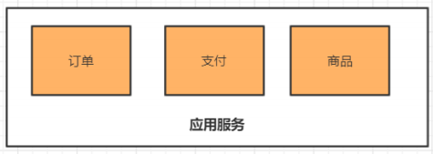

### （2）集群

- 多个实例共同工作

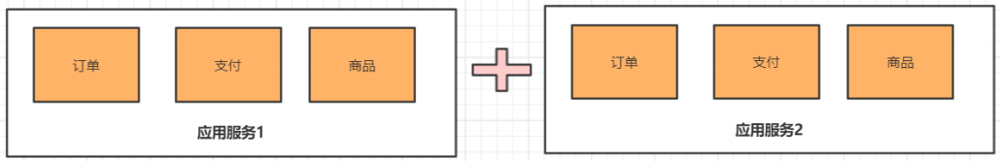

### （3）分布式

- 把一个系统拆分为多个子系统，每个子系统负责各自的部分功能，独立部署，各司其职

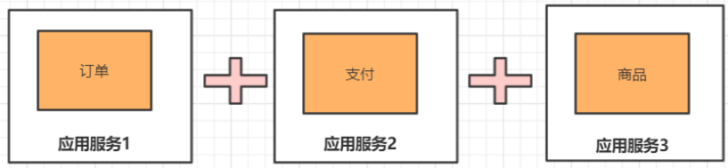


- 分布式⼀定是集群，但是集群不⼀定是分布式

```
因为集群就是多个实例⼀起⼯作，分布式将⼀个系统拆分之后那就是多个实例；
集群并不⼀定是分布式，因为复制型的集群不是拆分⽽是复制
```


## 3、分布式系统特性

```
（1）分布性
- 空间中随机分布。这些计算机可以分布在不同的机房，不同的城市，甚至不同的国家

（2）对等性
- 分布式系统中的计算机没有主/从之分，组成分布式系统的所有节点都是对等的

（3）并发性
- 同一个分布式系统的多个节点，可能会并发地操作一些共享的资源，诸如数据库或分布式存储

（4）缺乏全局时钟
- 既然各个计算机之间是依赖于交换信息来进行相互通信，很难定义两件事件的先后顺序，缺乏全局始终控制序列

（5）故障总会发生
- 组成分布式的计算机，都有可能在某一时刻突然间崩掉
- 分的计算机越多，可能崩掉一个的几率就越大
- 如果再考虑到设计程序时的异常故障，也会加大故障的概率

（6）处理单点故障
- 单点SPOF（Single Point of Failure）：某个角色或者功能只有某一台计算机在支撑，在这台计算机上出现的故障是单点故障
```


## 4、分布式系统面临的问题

### 4.1 通信异常

```
- 网络本身的不可靠性，因此每次网络通信都会伴随着网络不可用的风险（光纤、路由、DNS等硬件设备或系统的不可用），都会导致最终分布式系统无法顺利进行一次网络通信

- 另外，即使分布式系统各节点之间的网络通信能够正常执行，其延时也会大于单机操作，存在巨大的延时差别，也会影响消息的收发过程，因此消息丢失和消息延迟变的非常普遍
```

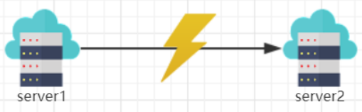

### 4.2 网络分区

```
- 网络之间出现了网络不连通，但各个子网络的内部网络是正常的，从而导致整个系统的网络环境被切分成了若干个孤立的区域，分布式系统就会出现局部小集群
- 在极端情况下，这些小集群会独立完成原本需要整个分布式系统才能完成的功能，包括数据的事务处理，这就对分布式一致性提出非常大的挑战
```

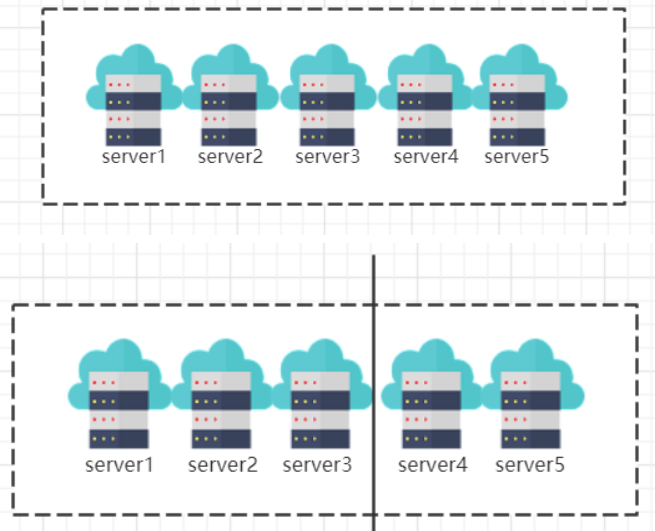

### 4.3 节点故障

```
- 节点故障是分布式系统下另一个比较常见的问题
- 指的是组成分布式系统的服务器节点出现的宕机或"僵死"现象
- 根据经验来说，每个节点都有可能出现故障，并且经常发生
```

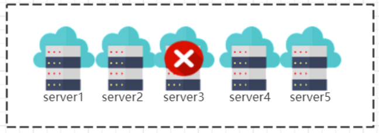

### 4.4 三态

```
- 分布式系统每一次请求与响应存在特有的“三态”概念，即成功、失败和超时
```

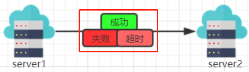

### 4.5 重发

```
- 分布式系统在发生调用的时候可能会出现 失败或超时 的情况，这个时候需要重新发起调用
```

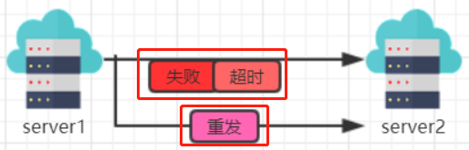

### 4.6 幂等

```
- 一次和多次请求某一个资源对于资源本身应该具有同样的结果（网络超时等问题除外）
- 任意多次执行对资源本身所产生的影响均与一次执行的影响相同
```

- 场景举例

```mysql
-- 无论执行多少次都不会改变状态，是天然的幂等
select * from users where id = 1;

-- 无论执行成功多少次，都是一致的，也是幂等
update users set age = 18 where id = 1;

-- 每次执行的结果都会发生变化，不是幂等
update users set age = age + 1 where id = 1;
```


# 第二章 分布式理论

## 1、数据一致性

### 1.1 数据一致性概念

```
- 分布式数据一致性，指的是数据在多份副本中存储时，各副本中的数据是一致的
```

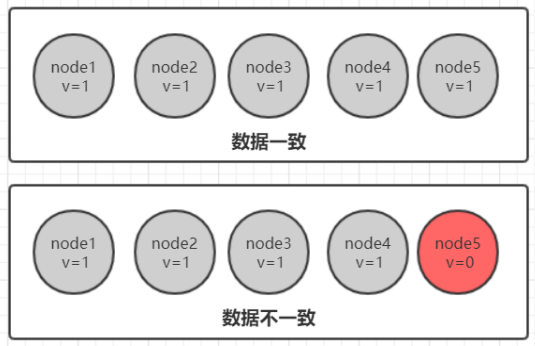


### 1.2 副本一致性

```
- 分布式系统中，数据往往会有多个副本，多个副本就需要保证数据的一致性，这就带来了同步的问题，因为网络延迟等因素, 我们几乎没有办法保证可以同时更新所有机器当中的包括备份所有数据，就会有数据不一致的情况

- 总得来说，我们无法找到一种能够满足分布式系统中数据一致性解决方案
- 因此，如何既保证数据的一致性，同时又不影响系统运行的性能，是每一个分布式系统都需要重点考虑和权衡的，于是一致性级别由此诞生
```

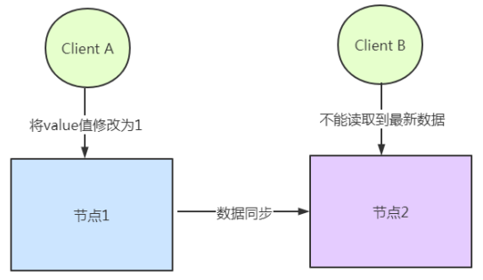


### 1.3 数据一致性分类

#### （1）强一致性

```
- 这种一致性级别是最符合用户直觉的，它要求系统写入什么，读出来的也会是什么，用户体验好
- 实现起来往往对系统的性能影响大
- 但是强一致性很难实现
```


#### （2）强一致性

```
- 这种一致性级别约束了系统在写入成功后，不承诺立即可以读到写入的值，也不承诺多久之后数据能够达到一致，但会尽可能地保证到某个时间级别（比如秒级别）后，数据能够达到一致状态
```


#### （3）最终一致性

```
 最终一致性也是弱一致性的一种
- 它无法保证数据更新后，所有后续的访问都能看到最新数值，而是需要一个时间，在这个时间之后可以保证这一点（就是在一段时间后，节点间的数据会最终达到一致状态），而在这个时间内，数据也许是不一致的，这个系统无法保证强一致性的时间片段被称为不一致窗口
- 不一致窗口的时间长短取决于很多因素，比如备份数据的个数、网络传输延迟速度、系统负载等
```


#### （4）最终一致性的变种

##### 因果一致性

```
- 如果进程A通知进程B它已更新了一个数据项，那么进程B的后续访问将返回更新后的值
- 与进程A无因果关系的进程C的访问遵守一般的最终一致性规则
```

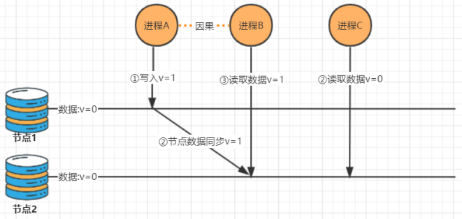

##### 读己之所写一致性

```
- 当进程A自己更新一个数据项之后，它总是访问到更新过的值，绝不会看到旧值。这是因果一致性模型的一个特例
```

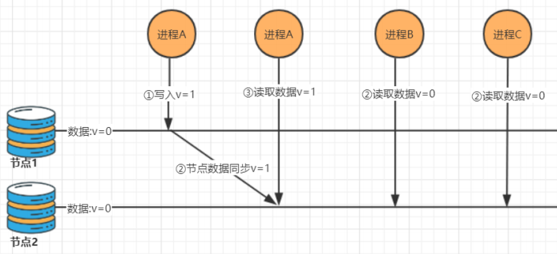

##### 会话一致性

```
- 它把访问存储系统的进程放到会话的上下文中
- 只要会话还存在，系统就保证“读己之所写”一致性
- 如果由于某些失败情形令会话终止，就要建立新的会话，而且系统保证不会延续到新的会话
```

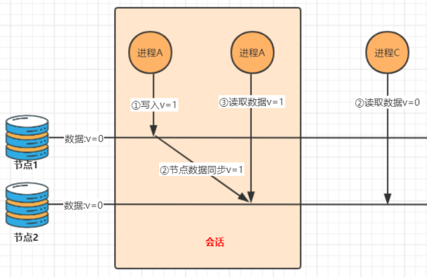

##### 单调读一致性

```
- 如果一个进程已经读取到一个特定值，那么该进程不会读取到该值以前的任何值
```

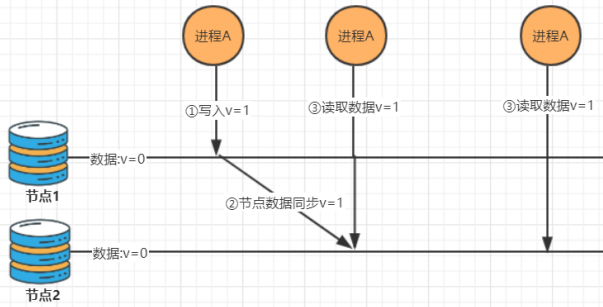

##### 单调写一致性

```
- 系统保证对同一个进程的写操作串行化
```

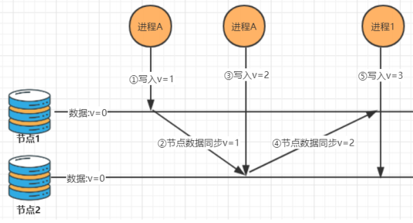


### 1.4 一致性模型图

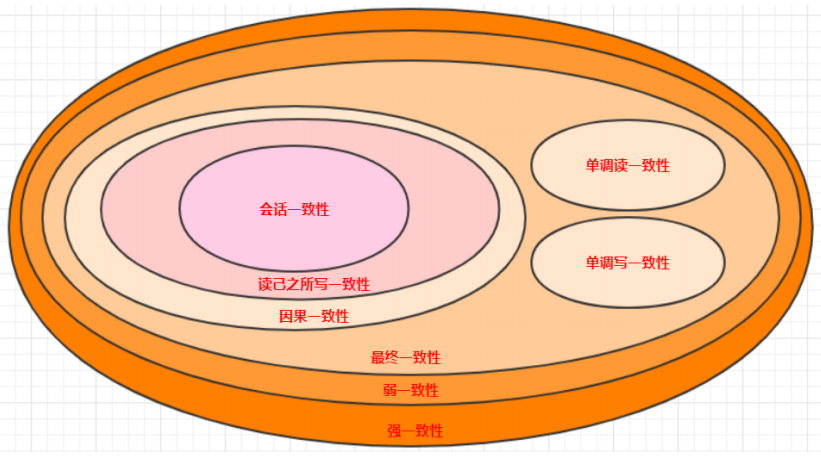


## 2、CAP定理

- CAP定理（CAP theorem），又被称作布鲁尔定理（Brewer's theorem），它指出对于一个分布式算系统来说，不可能同时满足以下三点

| 选项                              | 具体意义                                                     |
| --------------------------------- | ------------------------------------------------------------ |
| 一致性（Consistency）             | 所有节点访问时都是同一份最新的数据副本                       |
| 可用性（Availability）            | 每次请求都能获取到非错的响应，但是不保证获取的数据为最新数据 |
| 分区容错性（Partition tolerance） | 分布式系统在遇到任何网络分区故障的时候，仍然能够对外提供满足一致 |


### 2.1 一致性（Consistency）

```
- 这里指的是强一致性

- 在写操作完成后开始的任何读操作都必须返回该值，或者后续写操作的结果
- 也就是说，在一致性系统中，一旦客户端将值写入任何一台服务器并获得响应，那么之后client从其他任何服务器读取的都是刚写入的数据
```


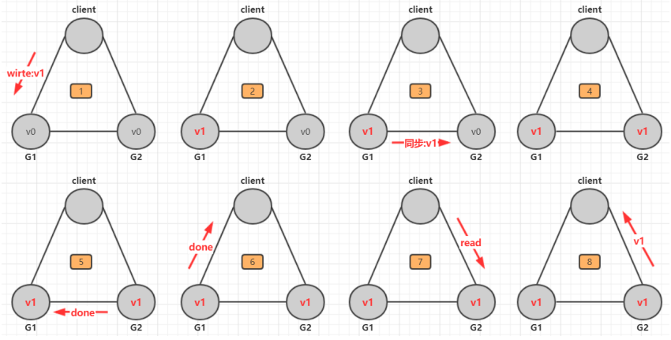

```
（1）客户端向G1写入数据v1，并等待响应
（2）此时，G1服务器的数据为v1，而G2服务器的数据为v0，两者不一致
（3）接着，在返回响应给客户端之前，G2服务器会自动同步G1服务器的数据，使得G2服务器的数据也是v1
（4）一致性保证了不管向哪台服务器（比如这边向G1）写入数据，其他的服务器（G2）能实时同步数据
（5）G2已经同步了G1的数据，会告诉G1，我已经同步了
（6）G1接收了所有同步服务器的已同步的报告，才将“写入成功”信息响应给client
（7）client再发起请求，读取G2的数据
（8）此时得到的响应是v1，即使client读取数据到G2
```


### 2.2 可用性（A-Availability)

```
- 系统中非故障节点收到的每个请求都必须有响应
- 在可用系统中，如果我们的客户端向服务器发送请求，并且服务器未崩溃，则服务器必须最终响应客户端，不允许服务器忽略客户的请求
```


### 2.3 分区容错性（P-Partition tolerance）

```
- 允许网络丢失从一个节点发送到另一个节点的任意多条消息，即不同步
- 也就是说，G1和G2发送给对方的任何消息都是可以放弃的
- 也就是说G1和G2可能因为各种意外情况，导致无法成功进行同步，分布式系统要能容忍这种情况
```

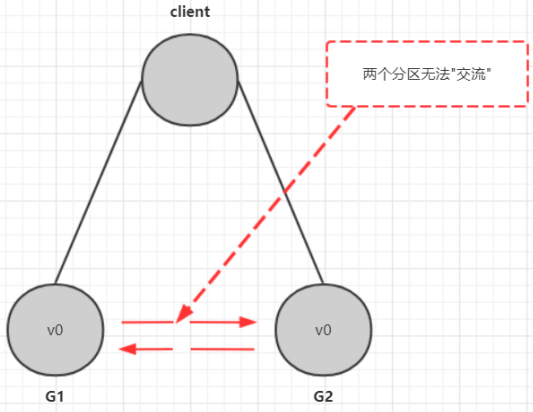


### 2.4  CAP三者不可能同时满足论证

```
假设确实存在三者能同时满足的系统

（1）分区系统，由于满足分区容错性，也就是说可能因为通信不佳等情况，G1和G2之间是没有同步
（2）客户端将v1写入G1，但G1和G2之间是不同步的，所以如下G1是v1数据，G2是v0数据
（3）由于要满足可用性，即一定要返回数据，所以G1必须在数据没有同步给G2的前提下返回数据给 client
（4）client请求的是G2服务器，由于G2服务器的数据是v0，所以client得到的数据是v0
```

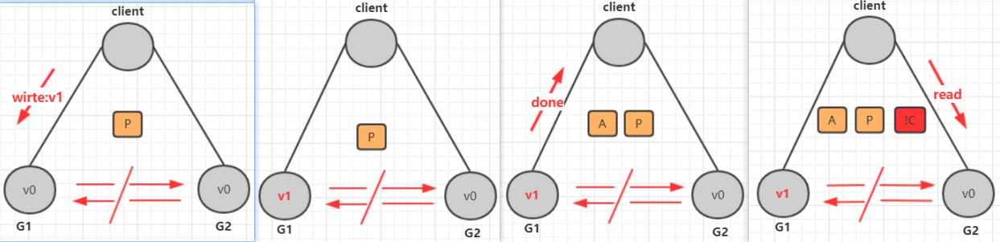

- 结论

```
很G1返回的是v1数据，G2返回的是v0数据，两者不一致。其余情况也有类似推导，也就是说 CAP三者不能同时出现。
```

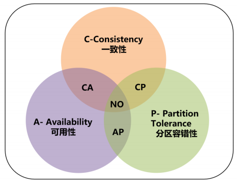

### 2.5 CAP三者如何权衡

#### （1）CA (Consistency + Availability)

```
- 关注一致性和可用性，它需要非常严格的全体一致的协议
- CA 系统不能容忍网络错误或节点错误，一旦出现这样的问题，整个系统就会拒绝写请求，因为它并不知道对面的那个结点是否挂掉了，还是只是网络问题
- 唯一安全的做法就是把自己变成只读的
```

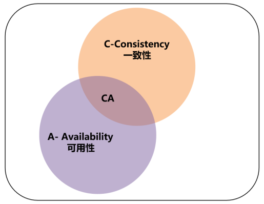

#### （2）CP (Consistency + Partition tolerance)

```
- 关注一致性和分区容忍性
- 它关注的是系统里大多数人的一致性协议
- 这样的系统只需要保证大多数结点数据一致，而少数的结点会在没有同步到最新版本的数据时变成不可用的状态，这样能够提供一部分的可用性
```

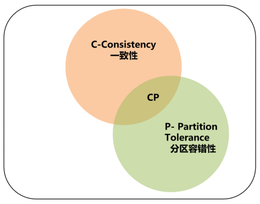

#### （3）AP (Availability + Partition tolerance)

```
- 关心可用性和分区容忍性
- 因此，这样的系统不能达成一致性，需要给出数据冲突，给出数据冲突就需要维护数据版本
```

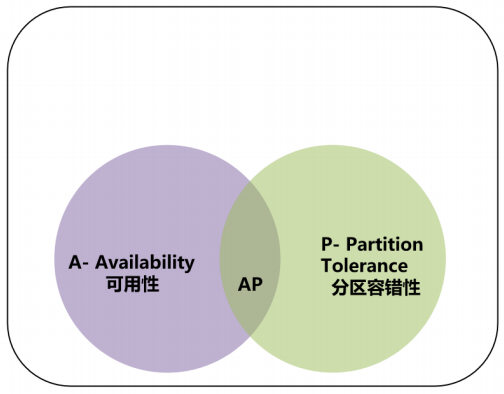


### 2.6 场景选择

```
- 对于互联网应用来说，机器数量庞大，节点分散，网络故障再正常不过了，那么此时就是保障AP，放弃C的场景，而从实际中理解，像网站这种偶尔没有一致性是能接受的，但不能访问问题就非常大了

- 对于银行来说，就是必须保证强一致性，也就是说C必须存在，那么就只用CA和CP两种情况
（1）当保障强一致性和可用性（CA），那么一旦出现通信故障，系统将完全不可用
（2）另一方面，如果保障了强一致性和分区容错（CP），那么就具备了部分可用性
- 实际究竟应该选择什么，是需要通过业务场景进行权衡的（并不是所有情况都是CP好于CA，只能查看信息但不能更新信息有时候还不如直接拒绝服务）
```


## 3、BASE理论

```
BASE：Basically Available(基本可用)，Soft state（软状态）,和 Eventually consistent（最终一致性）三个短语的缩写 

Base 理论是对 CAP 中一致性和可用性权衡的结果，其来源于对大型互联网分布式实践的总结，是基于 CAP 定理逐步演化而来的
其核心思想是： 既是无法做到强一致性（Strong consistency），但每个应用都可以根据自身的业务特点，采用适当的方式来使系统达到最终一致性（Eventual consistency）
```

### 3.1  Basically Available(基本可用)

```
假设系统，出现了不可预知的故障，但还是能用，相比较正常的系统而言：
- 响应时间上的损失：正常情况下的搜索引擎 0.5 秒即返回给用户结果，而基本可用的搜索引擎可以在 1 秒返回结果
- 功能上的损失：在一个电商网站上，正常情况下，用户可以顺利完成每一笔订单，但是到了大促期间，为了保护购物系统的稳定性，部分消费者可能会被引导到一个降级页面
```

### 3.2 Soft state（软状态）

```
- 硬状态：相对于原子性而言，要求多个节点的数据副本都是一致的
- 软状态：允许系统中的数据存在中间状态，并认为该状态不会影响系统的整体可用性，即允许系统在多个不同节点的数据副本存在数据延时
```

### 3.3 Eventually consistent（最终一致性）

```
- 上面说软状态，不可能一直是软状态，必须有个时间期限
- 在期限过后，应当保证所有副本保持数据一致性，从而达到数据的最终一致性
- 这个时间期限取决于网络延时，系统负载，数据复制方案设计等等因素
```


# 第三章 分布式 一致性协议

## 1、两阶段提交协议(2PC)

### 1.1 2PC 简介

```
- 两阶段提交协议，简称2PC(2 Prepare Commit)，是比较常用的解决分布式事务问题的方式
- 要么所有参与进程都提交事务，要么都取消事务，即实现ACID中的原子性(A)的常用手段

分布式事务: 事务提供一种操作本地数据库的不可分割的一系列操作 “要么什么都不做，要么做全套（All or Nothing）”的机制,而分布式事务就是为了操作不同数据库的不可分割的一系列操作 “要么什么都不做，要么做全套（All or Nothing）”的机制
```

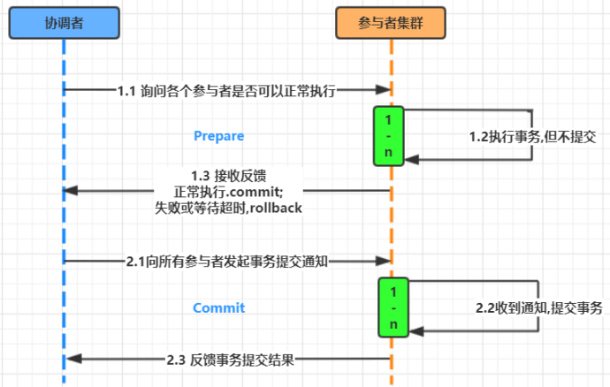

### 1.2 2PC 执行流程

#### （1）成功执行事务事务提交流程

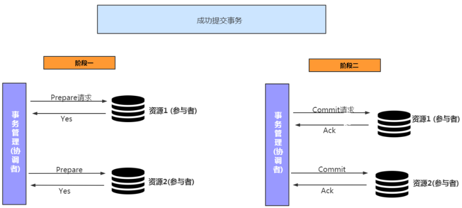

```
阶段一
- 事务询问：协调者向所有的参与者发送事务内容，询问是否可以执行事务提交操作，并开始等待各参与者的响应
- 执行事务 (写本地的Undo/Redo日志)
- 各参与者向协调者反馈事务询问的响应

阶段二
- 发送提交请求：协调者向所有参与者发出 commit 请求
- 事务提交：参与者收到 commit 请求后，会正式执行事务提交操作，并在完成提交之后释放整个事务执行期间占用的事务资源
- 反馈事务提交结果：参与者在完成事务提交之后，向协调者发送 Ack 信息
- 完成事务：协调者接收到所有参与者反馈的 Ack 信息后，完成事务
```


#### （2）中断事务流程

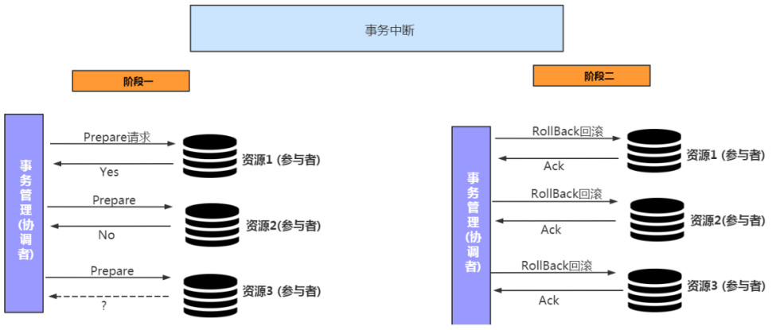

```
假如任何一个参与者向协调者反馈了No响应，或者在等待超时之后，协调者尚无法接收到所有参与者的反馈响应，那么就会中断事务

阶段一
- 事务询问：协调者向所有的参与者发送事务内容，询问是否可以执行事务提交操作，并开始等待各参与者的响应
- 执行事务 (写本地的Undo/Redo日志)
- 各参与者向协调者反馈事务询问的响应

阶段二
- 发送回滚请求：协调者向所有参与者发出 Rollback 请求
- 事务回滚：参与者接收到 Rollback 请求后，会利用其在阶段一中记录的 Undo 信息来执行事务回滚操作，并在完成回滚之后释放在整个事务执行期间占用的资源
- 反馈事务回滚结果：参与者在完成事务回滚之后，向协调者发送 Ack 信息
- 中断事务：协调者接收到所有参与者反馈的 Ack 信息后，完成事务中断
```


### 1.3 2PC 优缺点

```
优点：原理简单

缺点
（1）同步阻塞
在二阶段提交的执行过程中，所有参与该事务操作的逻辑都处于阻塞状态，即当参与者占有共资源时，其他节点访问公共资源会处于阻塞状态

（2）单点问题
若协调器出现问题，那么整个二阶段提交流程将无法运转，若协调者是在阶段二中出现问题时，那么其他参与者将会一直处于锁定事务资源的状态中，而无法继续完成事务操作

（3）数据不一致
在阶段二中，执行事务提交的时候，当协调者向所有的参与者发送Commit请求之后，发生了局部网络异常或者是协调者在尚未发送完Commit请求之前自身发生了崩溃，导致最终只有部分参与者收到了Commit请求，于是会出现数据不一致的现象

（4）太过保守
在进行事务提交询问的过程中，参与者出现故障而导致协调者始终无法获取到所有参与者的响应信息的话，此时协调者只能依靠自身的超时机制来判断是否需要中断事务，这样的策略过于保守，即没有完善的容错机制，任意一个结点的失败都会导致整个事务的失败
```


## 2、三阶段提交协议(3PC)

### 2.1 3PC 简介

```
三阶段提交协议出现背景：
- 一致性协议中设计出了二阶段提交协议（2PC），但是2PC设计中还存在缺陷，于是就有了三阶段提交协议，这便是3PC的诞生背景

简介：
- 3PC，全称 “three phase commit”，是 2PC 的改进版
- 将 2PC 的 “提交事务请求” 过程一分为二，共形成了由CanCommit、PreCommit和doCommit三个阶段组成的事务处理协议
- 3PC协议并没有完全解决数据一致问题
```

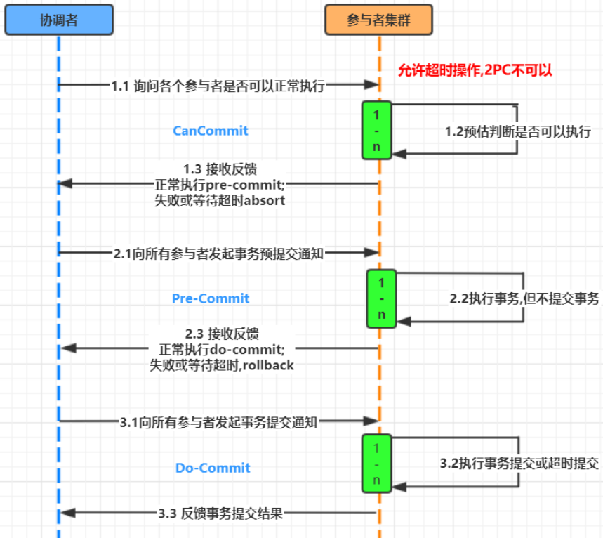


### 2.2 第一阶段 CanCommit

```
类似于2PC的准备（第一）阶段。协调者向参与者发送commit请求，参与者如果可以提交就返回Yes响应，否则返回No响应

- 事务询问：协调者向参与者发送CanCommit请求，询问是否可以执行事务提交操作。然后开始等待参与者的响应
- 响应反馈：参与者接到CanCommit请求后，正常情况下，如果其自身认为可以顺利执行事务，则返回Yes响应，并进入预备状态，否则反馈No
```


### 2.3 第二阶段 PreCommit

```
协调者根据参与者的反应情况来决定是否可以执行事务的PreCommit操作。根据响应情况，有以下两种可能

Yes
(1)发送预提交请求：协调者向参与者发送PreCommit请求，并进入Prepared阶段
(2)事务预提交：参与者接收到PreCommit请求后，会执行事务操作，并将undo和redo信息记录到事务日志中
(3)响应反馈：如果参与者成功的执行了事务操作，则返回ACK响应，同时开始等待最终指令

No
假如有任何一个参与者向协调者发送了No响应，或者等待超时之后，协调者都没有接到参与者的响应，那么就执行事务的中断。则有：
(1)发送中断请求： 协调者向所有参与者发送abort请求
(2)中断事务: 参与者收到来自协调者的abort请求之后（或超时之后，仍未收到协调者的请求），执行事务的中断
```


### 2.4 第三阶段 DoCommit

```
该阶段进行真正的事务提交，也可以分为执行提交和中断事务两种情况
执行成功
(1)发送提交请求: 协调者接收到参与者发送的ACK响应，那么它将从预提交状态进入到提交状态。 并向所有参与者发送doCommit请求
(2)事务提交: 参与者接收到doCommit请求之后，执行正式的事务提交。 并在完成事务提交之后释放所有事务资源
(3)响应反馈: 事务提交完之后，向协调者发送ACK响应
(4)完成事务: 协调者接收到所有参与者的ACK响应之后，完成事务

中断事务
(1)发送中断请求: 协调者向所有参与者发送abort请求
(2)事务回滚: 参与者接收到abort请求之后，利用其在阶段二记录的undo信息来执行事务的回滚操作，并在完成回滚之后释放所有的事务资源
(3)反馈结果: 参与者完成事务回滚之后，向协调者发送ACK消息
(4)中断事务: 协调者接收到所有参与者反馈的ACK消息之后，执行事务的中断
```

- 可能出现的2种故障

```
- 协调者出现问题
- 协调者和参与者之间的网络故障

如果出现了任一一种情况，最终都会导致参与者无法收到 doCommit 请求或者 abort 请求
针对这种情况，参与者都会在等待超时之后，继续进行事务提交
```

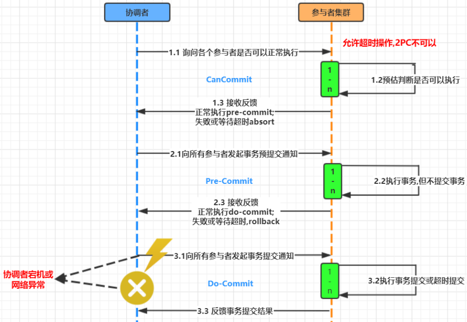


### 2.5 【区别】2PC 和 3PC

```
（1）首先对于协调者和参与者都设置了超时机制（在2PC中，只有协调者拥有超时机制，即如果在一定时间内没有收到参与者的消息则默认失败）,主要是避免了参与者在长时间无法与协调者节点通讯（协调者挂掉了）的情况下，无法释放资源的问题，因为参与者自身拥有超时机制会在超时后，自动进行本地commit从而进行释放资源。而这种机制也侧面降低了整个事务的阻塞时间和范围

（2）通过CanCommit、PreCommit、DoCommit三个阶段的设计，相较于2PC而言，多设置了一个缓冲阶段保证了在最后提交阶段之前各参与节点的状态是一致的

（3）PreCommit是一个缓冲，保证了在最后提交阶段之前各参与节点的状态是一致的
```


## 3、NWR 协议

### 3.1 简介

```
- NWR 是一种在分布式存储系统中用于控制一致性级别的一种策略
- 在亚马逊的云存储系统中，就应用 NWR 来控制一致性

N：在分布式存储系统中，有多少份备份数据
W：代表一次成功的更新操作要求至少有w份数据写入成功
R：代表一次成功的读数据操作要求至少有R份数据成功读取
```

### 3.2 原理

```
- NWR值的不同组合会产生不同的一致性效果，当W+R>N的时候，整个系统对于客户端来讲能保证强一致性

以常见的N=3、W=2、R=2为例:
N=3表示，任何一个对象都必须有三个副本
W=2表示，对数据的修改操作只需要在3个副本中的2个上面完成就返回
R=2表示，从三个对象中要读取到2个数据对象，才能返回

在分布式系统中，数据的单点是不允许存在的。即线上正常存在的备份数量N设置1的情况是非常危险的，因为一旦这个备份发生错误，就 可能发生数据的永久性错误。假如我们把N设置成为2，那么，只要有一个存储节点发生损坏，就会有单点的存在。所以N必须大于2。N越高，系统的维护和整体 成本就越高。工业界通常把N设置为3
```

#### （1）当 W+R>N

```
- 当W是2、R是2的时候，W+R>N，这种情况对于客户端就是强一致性的，读取操作和写入操作成功的数据一定会有交集（如图中的Node2），这样就可以保证一定能够读取到最新版本的更新数据，数据的强一致性得到了保证

- 在满足数据一致性协议的前提下，R或者W设置的越大，则系统延迟越大，因为这取决于最慢的那份备份数据的响应时间
```


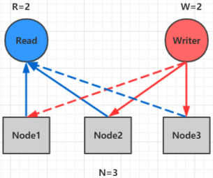

#### （2）当 R+W<=N

```
- 当 R+W<=N，无法保证数据的强一致性
- 因为成功写和成功读集合可能不存在交集，这样读操作无法读取到最新的更新数值，也就无法保证数据的强一致性
```

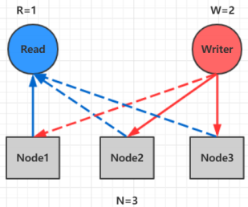

## 4、Gossip 协议

### 4.1 Gossip 概述

```
- Gossip 协议也叫 Epidemic 协议 （流行病协议）。原本用于分布式数据库中节点同步数据使用，后被广泛用于数据库复制、信息扩散、集群成员身份确认、故障探测等。

- 从 gossip 单词就可以看到，其中文意思是八卦、流言等意思，我们可以想象下绯闻的传播（或者流行病的传播）；gossip 协议的工作原理就类似于这个。gossip 协议利用一种随机的方式将信息传播到整个网络中，并在一定时间内使得系统内的所有节点数据一致。Gossip 其实是一种去中心化思路的分布式协议，解决状态在集群中的传播和状态一致性的保证两个问题
```

### 4.2 Gossip  原理

- Gossip 协议的消息传播方式有两种：反熵传播 和 谣言传播

#### （1）反熵传播

```
- 是以固定的概率传播所有的数据
- 所有参与节点只有两种状态：Suspective(病原)、Infective(感染)
- 过程：种子节点会把所有的数据都跟其他节点共享，以便消除节点之间数据的任何不一致，它可以保证最终、完全的一致
- 缺点：消息数量非常庞大，且无限制；
- 通常只用于新加入节点的数据初始化
```

#### （2）谣言传播

```
- 是以固定的概率仅传播新到达的数据。
- 所有参与节点有三种状态：Suspective(病原)、Infective(感染)、Removed(愈除)
- 过程：消息只包含最新 update，谣言消息在某个时间点之后会被标记为 removed，并且不再被传播
- 缺点：系统有一定的概率会不一致
- 通常用于节点间数据增量同步
```


### 4.3 通信方式

- Gossip 协议最终目的是将数据分发到网络中的每一个节点。根据不同的具体应用场景，网络中两个节点之间存在三种通信方式：推送模式、拉取模式、推/拉模式

#### （1）Push

```
- 节点 A 将数据 (key,value,version) 及对应的版本号推送给 B 节点，B 节点更新 A 中比自己新的数据
```

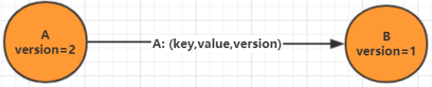

#### （2）Pull

```
- A 仅将数据 key, version 推送给 B，B 将本地比 A 新的数据（Key, value, version）推送给 A，A 更新本地
```

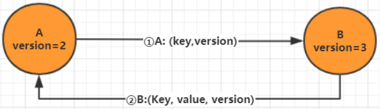

#### （3）Push/Pull

```
- 与 Pull 类似，只是多了一步，A 再将本地比 B 新的数据推送给 B，B 则更新本地
```


### 4.4 优缺点

```
综上所述，可以得出 Gossip 是一种去中心化的分布式协议，数据通过节点像病毒一样逐个传播。因为是指数级传播，整体传播速度非常快。

1. 优点
- 扩展性：允许节点的任意增加和减少，新增节点的状态 最终会与其他节点一致
- 容错：任意节点的宕机和重启都不会影响 Gossip 消息的传播，具有天然的分布式系统容错特性
- 去中心化：无需中心节点，所有节点都是对等的，任意节点无需知道整个网络状况，只要网络连通，任意节点可把消息散播到全网
- 最终一致性：Gossip 协议实现信息指数级的快速传播，因此在有新信息需要传播时，消息可以快速地发送到全局节点，在有限的时间内能够做到所有节点都拥有最新的数据。

2. 缺点
- 消息延迟:节点随机向少数几个节点发送消息，消息最终是通过多个轮次的散播而到达全网；不可避免的造成消息延迟。
- 消息冗余:节点定期随机选择周围节点发送消息，而收到消息的节点也会重复该步骤；不可避免的引起同一节点消息多次接收，增加消息处理压力

Gossip 协议由于以上的优缺点，所以适合于 AP 场景的数据一致性处理，常见应用有：P2P 网络通信、Redis Cluster、Consul。
```


## 5、Paxos 协议

### 5.1 Paxos  概述

```
Paxos协议其实说的就是Paxos算法, Paxos算法是基于消息传递且具有高度容错特性的一致性算法，是目前公认的解决分布式一致性问题最有效的算法之一。
```

### 5.2 Paxos  引入

```
在常见的分布式系统中，总会发生诸如机器宕机或网络异常（包括消息的延迟、丢失、重复、乱序，还有网络分区）等情况。Paxos算法需要解决的问题就是如何在一个可能发生上述异常的分布式系统中，快速且正确地在集群内部对某个数据的值达成一致，并且保证不论发生以上任何异常，都不会破坏整个系统的一致性。

注：这里某个数据的值并不只是狭义上的某个数，它可以是一条日志，也可以是一条命令（command）。。。根据应用场景不同，某个数据的值有不同的含义
```

### 5.3 Paxos  解决2PC和3PC存在的问题

- 在之前讲解2PC 和 3PC的时候在一定程度上是可以解决数据一致性问题的. 但是并没有完全解决就是协调者宕机的情况

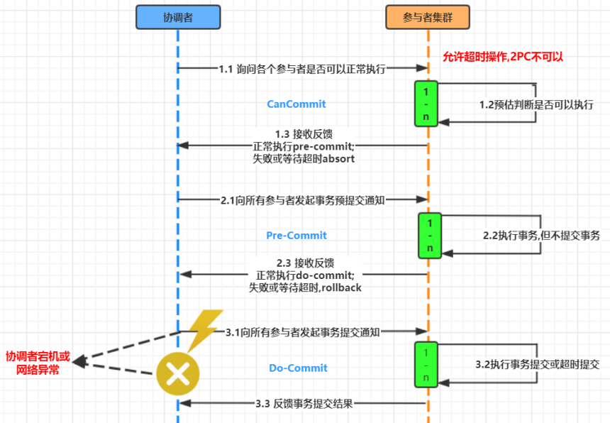

- 解决方法，步骤1：引入多个协调者

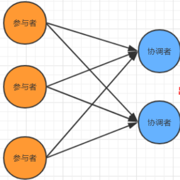

- 解决方法，步骤2：引入主协调者，主协调者负责协调，协调者负责跟随

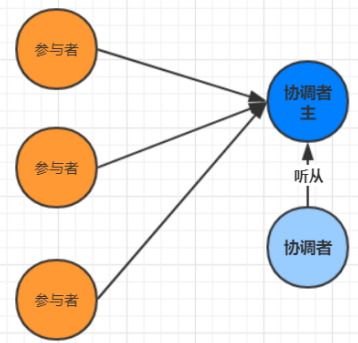

```
其实在引入多个协调者之后又引入主协调者.那么这个就是最简单的一种Paxos 算法.
Paxos的版本有: Basic Paxos , Multi Paxos, Fast-Paxos, 具体落地有Raft 和zk的ZAB协议
```

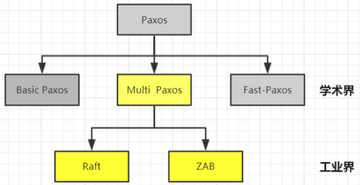

### 5.4 Basic Paxos 相关概念

#### （1）角色介绍

```
Client:客户端
- 客户端向分布式系统发出请求，并等待响应。例如，对分布式文件服务器中文件的写请求。

Proposer：提案发起者
- 提案者提倡客户端请求，试图说服Acceptor对此达成一致，并在发生冲突时充当协调者以推动协议向前发展

Acceptor: 决策者，可以批准提案
- Acceptor可以接受（accept）提案；并进行投票, 投票结果是否通过以多数派为准, 以如果某个提案被选定，那么该提案里的value就被选定了

Learner: 最终决策的学习者
- 学习者充当该协议的复制因素(不参与投票)
```

#### （2）决策模型

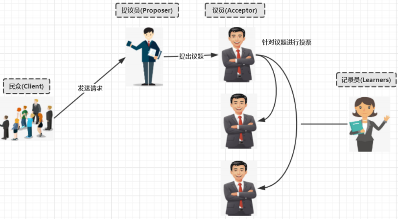

#### （3）Basic Paxos 流程

```
步骤1：Prepare
- Proposer提出一个提案,编号为N, 此N大于这个Proposer之前提出所有提出的编号, 请求Accpetor的多数人接受这个提案

步骤2：Promise
如果编号N大于此Accpetor之前接收的任提案编号则接收, 否则拒绝

步骤3：Accept
- 如果达到多数派, Proposer会发出accept请求, 此请求包含提案编号和对应的内容

步骤4：Accepted
- 如果此Accpetor在此期间没有接受到任何大于N的提案,则接收此提案内容, 否则忽略
```


### 5.5 Basic Paxos 流程图

#### （1）无故障的basic Paxos

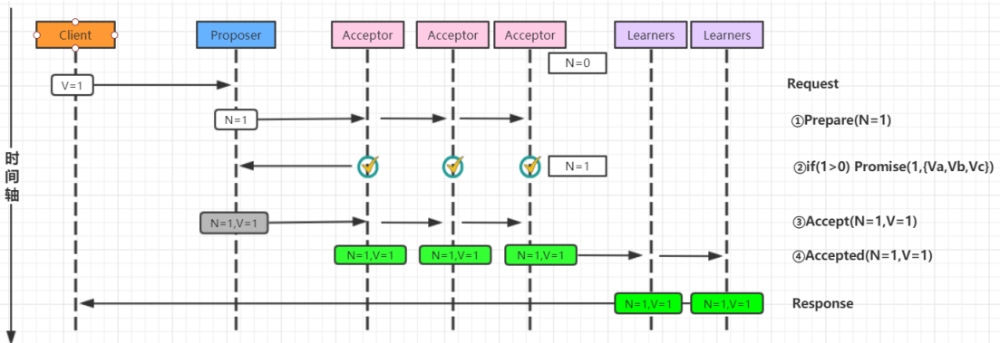

#### （2）Acceptor失败时的basic Paxos

- 多数派中的一个Acceptor发生故障，因此多数派大小变为2。在这种情况下，Basic Paxos协议仍然成功

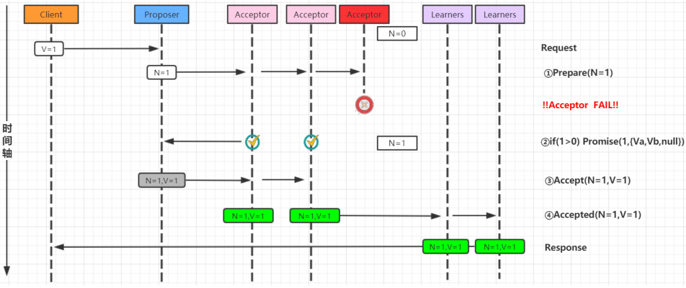

#### （3）Proposer失败时的basic Paxos

- Proposer在提出提案之后但在达成协议之前失败。具体来说，传递到Acceptor的时候失败了,这个时候需要选出新的Proposer（提案人）,那么 Basic Paxos协议仍然成功

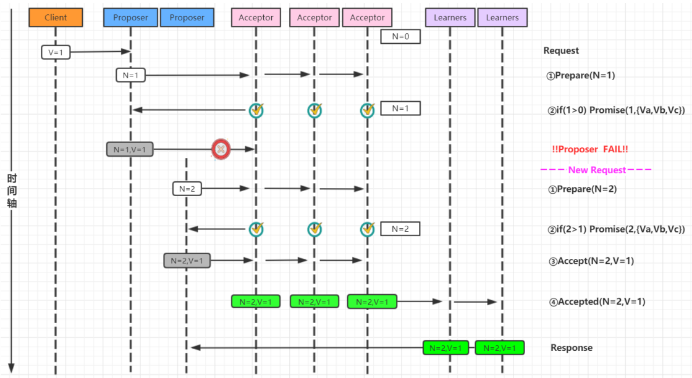

#### （4）当多个提议者发生冲突时的basic Paxos

- 最复杂的情况是多个Proposer都进行提案,导致Paxos的活锁问题
- 针对活锁问题解决起来非常简单: 只需要在每个Proposer再去提案的时候随机加上一个等待时间即可

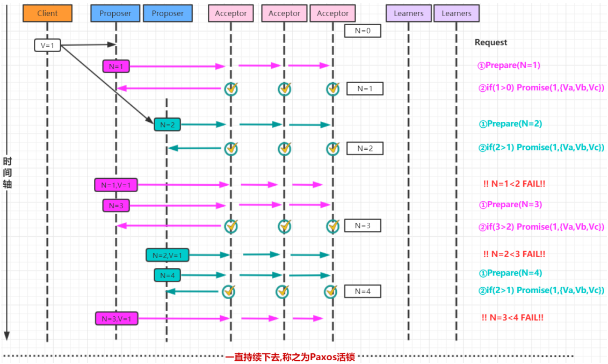


### 5.6 Multi-Paxos 流程图


## 6、Raft 协议


## 7、Lease 机制


# 第四章 分布式 - 设计策略

## 1、心跳检测

### 1.1 简介

```
在分布式环境中，存在非常多的节点（Node），如何检测一个节点出现了故障乃至无法工作了？
- 通常解决这一问题是采用心跳检测的手段，如同通过仪器对病人进行一些检测诊断一样

- 心跳顾名思义，就是以固定的频率向其他节点汇报当前节点状态的方式
- 收到心跳，一般可以认为一个节点和现在的网络是良好的
- 当然，心跳汇报时，一般也会携带一些附加的状态、元数据信息，以便管理
```

### 1.2 原理

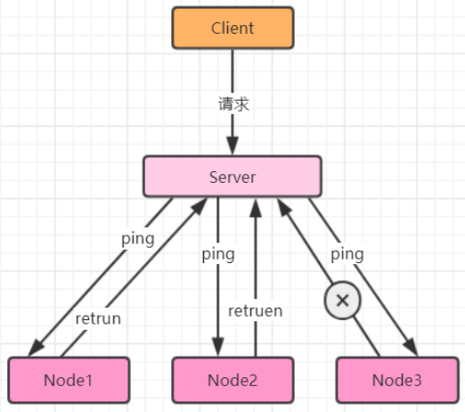

```
若Server没有收到Node3的心跳时，Server认为Node3失联

但是失联是失去联系，并不确定是否是Node3故障，有可能是Node3处于繁忙状态，导致调用检测超时；也有可能是Server与Node3之间链路出现故障或闪断

所以心跳不是万能的，收到心跳可以确认节点正常，但是收不到心跳也不能认为该节点就已经宣告“死亡”

此时，可以通过一些方法帮助Server做决定： 周期检测心跳机制、累计失效检测机制
```

#### （1）周期检测心跳机制

```
Server端每间隔 t 秒向Node集群发起监测请求，设定超时时间，如果超过超时时间，则判断“死 亡”,可以把该节点踢出集群
```

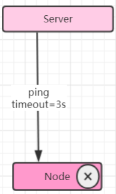

#### （2）累计失效检测机制

```
- 在周期检测心跳机制的基础上，统计一定周期内节点的返回情况（包括超时及正确返回），以此计算节点的“死亡”概率
- 另外，对于宣告“濒临死亡”的节点可以发起有限次数的重试，以作进一步判断,如果超过次数则可以把该节点踢出集群
```

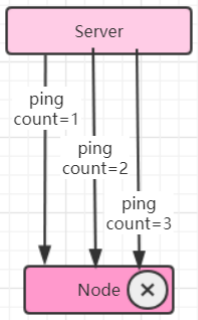

## 2、高可用

### 2.1 高可用HA设计

```
- 高可用(High Availability)是系统架构设计中必须考虑的因素之一,通常是指经过设计来减少系统不能提供服务的时间
- 系统高可用性的常用设计模式包括三种：主备（Master-SLave）、互备（Active-Active）和集群（Cluster）模式
```

| 可用性   | 一年中可故障时长 | 一天中可故障时长 |
| -------- | ---------------- | ---------------- |
| 90%      | 36.5天           | 144分钟          |
| 99%      | 3.6天            | 14.4分钟         |
| 99.9%    | 8.8小时          | 86.4秒           |
| 99.99%   | 52.6分钟         | 8.6秒            |
| 99.999%  | 5.3分钟          | 860毫秒          |
| 99.9999% | 31.5秒           | 86毫秒           |

#### （1）主备模式（Master-SLave）

```
主备模式就是Active-Standby模式，当主机宕机时，备机接管主机的一切工作，待主机恢复正常后，按使用者的设定以自动（热备）或手动（冷备）方式将服务切换到主机上运行。在数据库部分，习惯称之为MS模式。MS模式即Master/Slave模式，这在数据库高可用性方案中比较常用，如MySQL、Redis等就采用MS模式实现主从复制，保证高可用
```

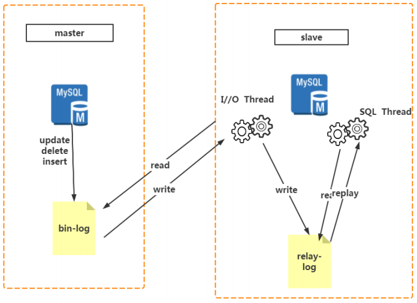

#### （2）互备模式（Active-Active）

```
互备模式指两台主机同时运行各自的服务工作且相互监测情况。在数据库高可用部分，常见的互备是MM模式。MM模式即Multi-Master模式，指一个系统存在多个master，每个master都具有read-write能力，会根据时间戳或业务逻辑合并版本
```

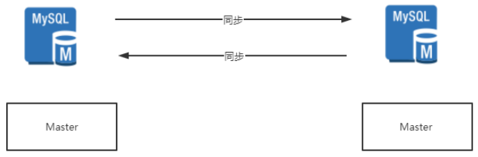

#### （3）集群模式（Cluster）

```
- 集群模式是指有多个节点在运行，同时可以通过主控节点分担服务请求
- 集群模式需要解决主控节点本身的高可用问题，一般采用主备模式
```


### 2.2 高可用HA下"脑裂问题"

#### （1）简介

```
在高可用（HA）系统中，当联系两个节点的"心跳线"断开时(即两个节点断开联系时)，本来为一个整体、动作协调的HA系统，就分裂成为两个独立的节点(即两个独立的个体)。由于相互失去了联系，都以为是对方出了故障，两个节点上的HA软件像"裂脑人"一样，"本能"地争抢"共享资源"、争起"应用服务"。就会发生严重后果：

- 共享资源被瓜分、两边"服务"都起不来了；
- 两边"服务"都起来了，但同时读写"共享存储"，导致数据损坏（常见如数据库轮询着的联机日志出错）
```

#### （2） 脑裂出现的原因

```
- 高可用服务器各节点之间心跳线链路发生故障，导致无法正常通信
- 因网卡及相关驱动坏了，ip配置及冲突问题（网卡直连）
- 因心跳线间连接的设备故障（网卡及交换机）
- 因仲裁的机器出问题（采用仲裁的方案）
- 高可用服务器上开启了iptables防火墙阻挡了心跳消息传输
- 高可用服务器上心跳网卡地址等信息配置不正确，导致发送心跳失败
- 其他服务配置不当等原因，如心跳方式不同，心跳广插冲突、软件Bug等
```

#### （3）脑裂预防方案

```
- 添加冗余的心跳线 [即冗余通信的方法]
同时用两条心跳线路 (即心跳线也HA)，这样一条线路坏了，另一个还是好的，依然能传送心跳消息，尽量减少"脑裂"现象的发生几率。

- 仲裁机制
当两个节点出现分歧时，由第3方的仲裁者决定听谁的。这个仲裁者，可能是一个锁服务，一个共享盘或者其它什么东西

- Lease机制

- 隔离(Fencing)机制
    共享存储fencing：确保只有一个Master往共享存储中写数据
    客户端fencing：确保只有一个Master可以响应客户端的请求
    Slave fencing：确保只有一个Master可以向Slave下发命令
```


## 3、容错性

### 3.1 简介

```
容错顾名思义就是IT系统对于错误包容的能力，容错的处理是保障分布式环境下相应系统的高可用或者健壮性

一个典型的案例就是对于缓存穿透问题的解决方案如图所示
```

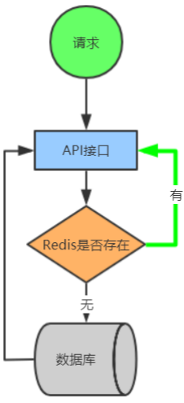

### 3.2 问题描述

```
在项目中使用缓存通常都是先检查缓存中是否存在
如果存在直接返回缓存内容
如果不存在，就直接查询数据库然后再缓存查询结果返回

这个时候如果我们查询的某一个数据在缓存中一直不存在，就会造成每一次请求都查询DB，这样缓存就失去了意义，在流量大时，或者有人恶意攻击如频繁发起为id为“-1”的条件进行查询，可能DB就挂掉了
```

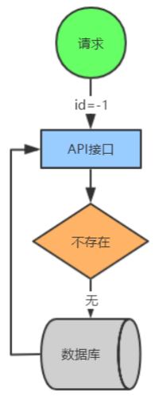

### 3.3 解决方案

```
（1）临时存放null值
（2）使用布隆过滤器
```

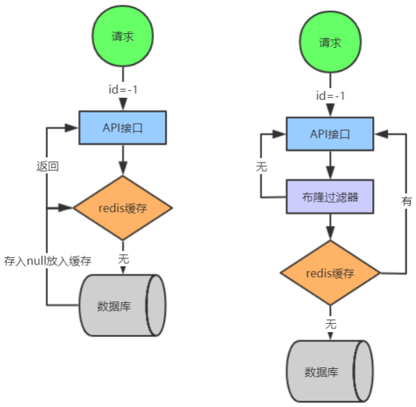

## 4、负载均衡

### 4.1 简介

```
负载均衡：其关键在于使用多台集群服务器共同分担计算任务，把网络请求及计算分配到集群可用的不同服务器节点上，从而达到高可用性及较好的用户操作体验

负载均衡器有硬件解决方案，也有软件解决方案
- 硬件解决方案有著名的F5
- 软件有LVS、HAProxy、Nginx等

如图，不同的用户client1、client2、client3访问应用，通过负载均衡器分配到不同的节点
```

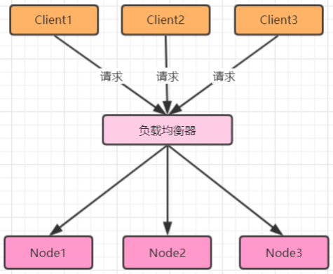

### 4.2 Nginx 负载均衡的6种策略

| 方式               | 说明                                                         |
| ------------------ | ------------------------------------------------------------ |
| 轮询               | 默认方式，每个请求会按时间顺序逐一分配到不同的后端服务器     |
| weight             | 权重方式，在轮询策略的基础上指定轮询的几率,权重越大,接受请求越多 |
| ip_hash            | 依据ip分配方式,相同的客户端的请求一直发送到相同的服务器，以保证 |
| least_conn         | 最少连接方式,把请求转发给连接数较少的后端服务器              |
| fair（第三方）     | 响应时间方式,按照服务器端的响应时间来分配请求，响应时间短的优先分配 |
| url_hash（第三方） | 依据URL分配方式,按访问url的hash结果来分配请求，使每个url定向到同一 |


# 第五章 分布式 - 服务调用

## 1、服务调用实现方式

### 1.1  HTTP 应用协议的通信框架

#### （1）HttpURLConnection

```
java 原生 HttpURLConnection是基于http协议的，支持get，post，put，delete等各种请求方式，最常用的就是get和post
```

#### （2）Apache Common HttpClient

```
HttpClient 是Apache Common 下的子项目，可以用来提供高效的、最新的、功能丰富的支持HTTP 协议的客户端编程工具包，并且它支持 HTTP 协议最新的版本

- 实现了所有 HTTP 的方法（GET,POST,PUT,HEAD 等）
- 支持 HTTPS 协议
- 支持代理服务器等
```

#### （3）OKhttp3

```
OKHttp是一个当前主流的网络请求的开源框架, 用于替代HttpUrlConnection和Apache HttpClient

- 支持http2.0，对一台机器的请求共享一个socket
- 采用连接池技术，可以有效的减少Http连接数量
- 无缝集成GZIP压缩技术
- 支持Response Cache，避免重复请求
- 域名多IP支持
```

#### （4）RestTemplate

```
Spring RestTemplate 是 Spring 提供的用于访问 Rest 服务的客户端，RestTemplate 提供了多种便捷访问远程Http服务的方法，能够大大提高客户端的编写效率，所以很多客户端比如 Android或者第三方服务商都是使用 RestTemplate 请求 restful 服务

- 面向 URL 组件，必须依赖于主机 + 端口 + URI
- RestTemplate 不依赖于服务接口，仅关注 REST 响应内容
- Spring Cloud Feign
```


### 1.2 RPC框架

```
- RPC全称 remote procedure call，即远程过程调用
- 借助RPC可以做到像本地调用一样调用远程服务，是一种进程间的通信方式
```

#### （1）Java RMI

```
Java RMI（Romote Method Invocation）是一种基于Java的远程方法调用技术，是Java特有的一种RPC实现
```

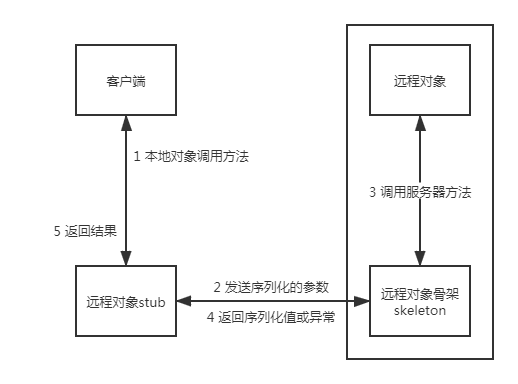

#### （2）Hessian

```
- Hessian是一个轻量级的remoting onhttp工具，使用简单的方法提供了RMI的功能.
- 相比WebService，Hessian更简单、快捷
- 采用的是二进制RPC协议，因为采用的是二进制协议，所以它很适合于发送二进制数据
```

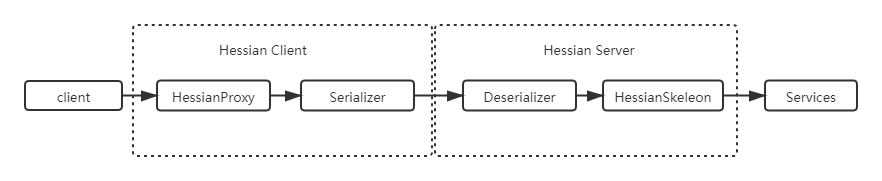

#### （3）Dubbo

```
- Dubbo是阿里巴巴公司开源的一个高性能优秀的服务框架
- 使得应用可通过高性能的 RPC 实现服务的输出和输入功能，可以和Spring框架无缝集成

- Dubbo是一款高性能、轻量级的开源Java RPC框架
- 它提供了三大核心能力：面向接口的远程方法调用，智能容错和负载均衡，以及服务自动注册和发现
```

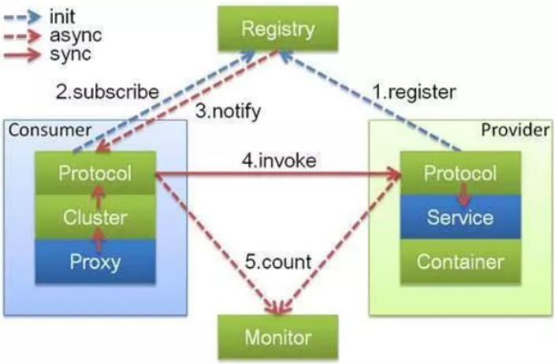

#### （4）gRPC

```
- gRPC是由Google公司开源的一款高性能的远程过程调用(RPC)框架，可以在任何环境下运行
- 该框架提供了负载均衡，跟踪，智能监控，身份验证等功能，可以实现系统间的高效连接
```

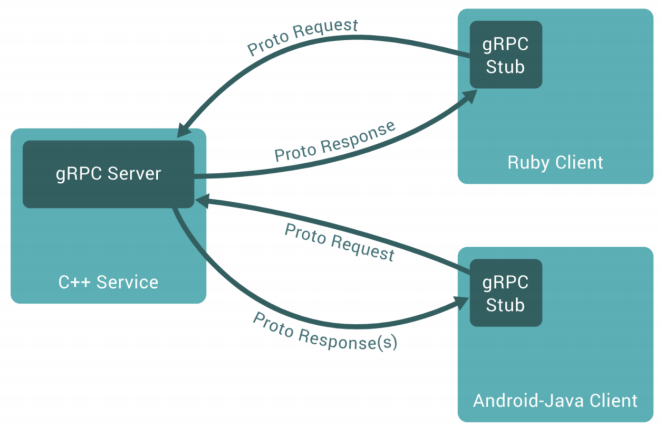

## 3、跨域调用

```
- 在分布式系统中，会有调用其他业务系统，导致出现跨域问题
- 跨域实质上是浏览器的一种保护处理，如果产生了跨域，服务器在返回结果时就会被浏览器拦截(注意：此时请求是可以正常发起的，只是
浏览器对其进行了拦截)，导致响应的内容不可用
```

### 3.1 产生跨域的几种情况

| 当前页面URL              | 被请求页面URL                   | 是否跨域 | 原因                         |
| ------------------------ | ------------------------------- | -------- | ---------------------------- |
| http://www.xxxx.com/     | http://www.xxxx.com/index.html  | 否       | 同源(协议, 域名, 端口号相同) |
| http://www.xxxx.com/     | https://www.xxxx.com/index.html | 跨域     | 协议不同(http/https)         |
| http://www.xxxx.com/     | http://www.baidu.com/           | 跨域     | 主域名不同(xxxx/baidu)       |
| http://www.xxxx.com/     | http://yyy.xxxx.com/            | 跨域     | 子域名不同(www/yyy)          |
| http://www.xxxx.com:8080 | http://www.xxxx.com:8090        | 跨域     | 端口号不同(8080/8090)        |

### 3.2 跨域解决方案

```java
（1）使用jsonp解决网站跨域
缺点：不支持post请求，代码书写比较复杂

（2）使用HttpClient内部转发

（3）使用设置响应头允许跨域
// 设置响应头允许跨域
response.setHeader(“Access-Control-Allow-Origin”, “*”); 

（4）基于Nginx搭建企业级API接口网关
    
（5）使用Zuul搭建微服务API接口网关
- 请求首先通过网关，进行路径的路由，定位到具体的服务节点上，然后使用zuul的过滤器的请求转发去解决跨域问题
- Zuul是spring cloud中的微服务网关
- 网关：是一个网络整体系统中的前置门户入口
```


# 第六章 分布式 - 服务治理

## 1、服务协调

### 1.1 概述

```
- 分布式协调技术主要用来解决分布式环境当中多个进程之间的同步控制，让他们有序的去访问某种临界资源，防止造成"脏数据"的后果
- 分布式锁是分布式协调技术实现的核心内容
```

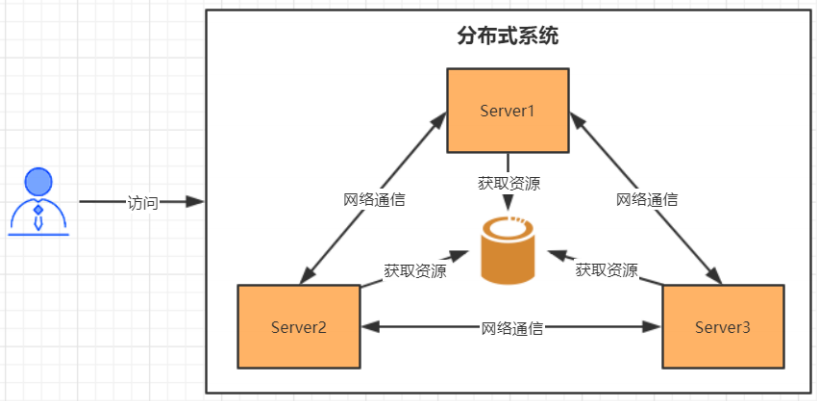

### 1.2 分布式锁实现方式

#### （1）基于缓存（Redis等）实现分布式锁

```
- 获取锁的时候，使用setnx加锁，并使用expire命令为锁添加一个超时时间，超过该时间则自动释放锁，锁的value值为一个随机生成的UUID, 释放锁的时候进行判断
- 获取锁的时候还设置一个获取的超时时间，若超过这个时间则放弃获取锁
- 释放锁的时候，通过UUID判断是不是该锁，若是该锁，则执行delete进行锁释放

- SETNX ：set一个key为value的字符串，返回1；若key存在，则什么都不做，返回0
- expire: 为key设置一个超时时间，单位为second，超过这个时间锁会自动释放，避免死锁
- delete ：删除key
```


#### （2）基于ZooKeeper实现分布式锁

```
- ZooKeeper 是一个为分布式应用提供一致性服务的开源组件，内部是一个分层的文件系统目录树结构，规定同一个目录下只能有一个唯一文件名

基于ZooKeeper实现分布式锁的步骤如下：
- 创建一个目录mylock
- 线程A想获取锁就在mylock目录下创建临时顺序节点
- 获取mylock目录下所有的子节点，然后获取比自己小的兄弟节点，如果不存在，则说明当前线程顺序号最小，获得锁
- 线程B获取所有节点，判断自己不是最小节点，设置监听比自己次小的节点
- 线程A处理完，删除自己的节点，线程B监听到变更事件，判断自己是不是最小的节点，如果是则获得锁
```


## 2、服务削峰

### 2.1 为什么要削峰

```
主要是还是来自于互联网的业务场景，例如：
- 春节火车票抢购，大量的用户需要同一时间去抢购；
- 阿里双11秒杀， 短时间上亿的用户涌入，瞬间流量巨大（高并发）
```


### 2.2 流量削峰方案

```
削峰从本质上来说就是更多地延缓用户请求，以及层层过滤用户的访问需求，遵从“最后落地到数据库的请求数要尽量少”的原则
```

#### （1）消息队列解决削峰

```
要对流量进行削峰，最容易想到的解决方案就是：用消息队列来缓冲瞬时流量，把同步的直接调用转换成异步的间接推送，中间通过一个队列在一端承接瞬时的流量洪峰，在另一端平滑地将消息推送出去

- 消息队列中间件主要解决应用耦合，异步消息，流量削锋等问题
- 常用消息队列系统：目前在生产环境，使用较多的消息队列有 ActiveMQ、RabbitMQ、 ZeroMQ、Kafka、RocketMQ 等
- 在这里，消息队列就像“水库”一样，拦截上游的洪水，削减进入下游河道的洪峰流量，从而达到减免洪水灾害的目的。
```

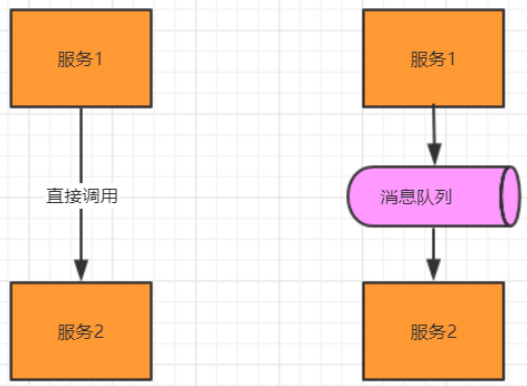

#### （2）流量削峰漏斗：层层削峰

```
- 分层过滤其实就是采用“漏斗”式设计来处理请求的，这样就像漏斗一样，尽量把数据量和请求量一层一层地过滤和减少了。
```

- 分层过滤的核心思想

```
- 通过在不同的层次尽可能地过滤掉无效请求
- 通过CDN过滤掉大量的图片，静态资源的请求
- 再通过类似Redis这样的分布式缓存过滤请求
```

- 分层过滤的基本原则

```
- 对写数据进行基于时间的合理分片，过滤掉过期的失效请求
- 对写请求做限流保护，将超出系统承载能力的请求过滤掉
- 涉及到的读数据不做强一致性校验，减少因为一致性校验产生瓶颈的问题
- 对写数据进行强一致性校验，只保留最后有效的数据
```

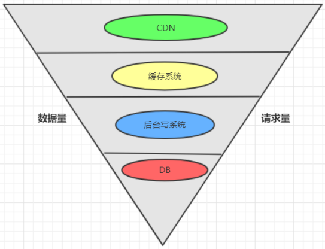


## 3、服务降级

### 3.1 服务降级概述

```
当服务器压力剧增的情况下，根据实际业务情况及流量，对一些服务和页面有策略的不处理或换种简单的方式处理，从而释放服务器资源以保证核心服务正常运作或高效运作

整个架构整体的负载超出了预设的上限阈值或即将到来的流量预计将会超过预设的阈值时，为了保证重要或基本的服务能正常运行，将一些 不重要 或 不紧急 的服务或任务进行服务的 延迟使用或 暂停使用
```

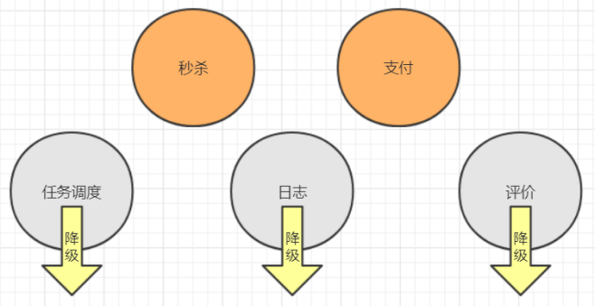

### 3.2 降级策略

```
当触发服务降级后，新的交易再次到达时，该如何来处理这些请求呢？从分布式,微服务架构全局的视角来看，降级处理方案：
- 页面降级（可视化界面禁用点击按钮、调整静态页面）
- 延迟服务（如定时任务延迟处理、消息入MQ后延迟处理）
- 写降级（直接禁止相关写操作的服务请求）
- 读降级（直接禁止相关读的服务请求）
- 缓存降级（使用缓存方式来降级部分读频繁的服务接口）

针对后端代码层面的降级处理策略，则通常使用以下几种处理措施进行降级处理：
- 抛异常
- 返回NULL
- 调用Mock数据
- 调用Fallback处理逻辑
```

### 3.3 分级降级

- 结合服务能否降级的优先原则，并根据台风预警（都属于风暴预警）的等级进行参考设计，可将分布式服务架构的所有服务进行故障风暴等级划分为以下四种：

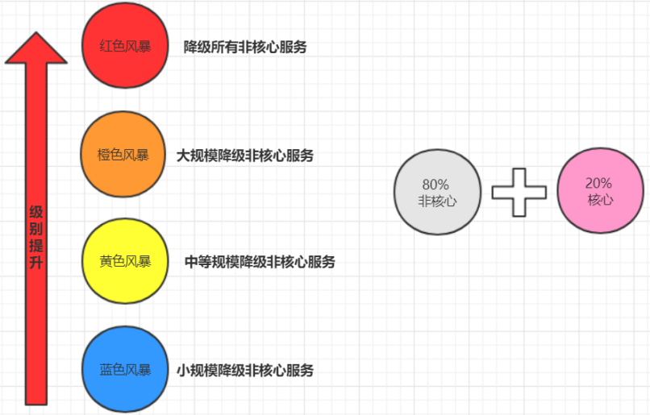


## 4、服务限流

### 4.1 服务限流概述

```
限流并非新鲜事，在生活中亦无处不在，下面例举一二：
- 博物馆：限制每天参观总人数以保护文物
- 地铁安检：有若干安检口，乘客依次排队，工作人员根据安检快慢决定是否放人进去。遇到节假日，可以增加安检口来提高处理能力，同时增加排队等待区长度。
- 水坝泄洪：水坝可以通过闸门控制泄洪速度

以上"限流"例子，可以让服务提供者稳定的服务客户
限流的目：通过对并发访问请求进行限速或者一个时间窗口内的的请求数量进行限速来保护系统，一旦达到限制速率则可以拒绝服务、排队或等待
```


### 4.2 多维度限流

```
在请求到达目标服务接口的时候, 可以使用多维度的限流策略,这样就可以让系统平稳度过瞬间来临的并发
```

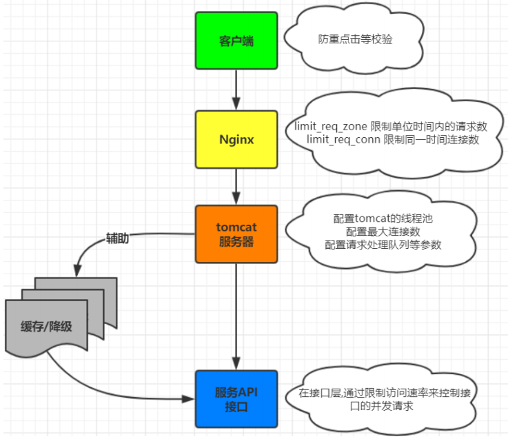

### 4.3 限流算法

#### （1）计数器（固定窗口）

```
计数器限制每一分钟或者每一秒钟内请求不能超过一定的次数，在下一秒钟计数器清零重新计算

存在问题:
客户端在第一分钟的59秒请求100次，在第二分钟的第1秒又请求了100次, 2秒内后端会受到200次请求的压力，形成了流量突刺
```

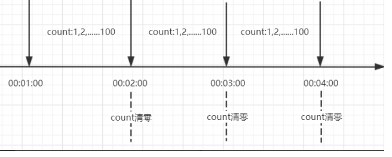

#### （2）计数器（滑动窗口）

```
滑动窗口其实是细分后的计数器，它将每个时间窗口又细分成若干个时间片段，每过一个时间片段，整个时间窗口就会往右移动一格
时间窗口向右滑动一格，这时这个时间窗口其实已经打满了100次，客户端将被拒绝访问,时间窗口划分的越细，滑动窗口的滚动就越平滑，限流的效果就会越精确
```

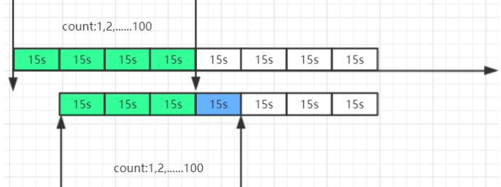

#### （3）漏桶

```
漏桶算法类似一个限制出水速度的水桶，通过一个固定大小FIFO队列+定时取队列元素的方式实现，请求进入队列后会被匀速的取出处理（桶底部开口匀速出水），当队列被占满后后来的请求会直接拒绝（水倒的太快从桶中溢出来）

优点：可以削峰填谷，不论请求多大多快，都只会匀速发给后端，不会出现突刺现象，保证下游服务正常运行
缺点：在桶队列中的请求会排队，响应时间拉长
```

#### （4）令牌桶

```
令牌桶算法是以一个恒定的速度往桶里放置令牌（如果桶里的令牌满了就废弃），每进来一个请求去桶里找令牌，有的话就拿走令牌继续处理，没有就拒绝请求

优点：可以应对突发流量，当桶里有令牌时请求可以快速的响应，也不会产生漏桶队列中的等待时间
缺点：相对漏桶一定程度上减小了对下游服务的保护
```

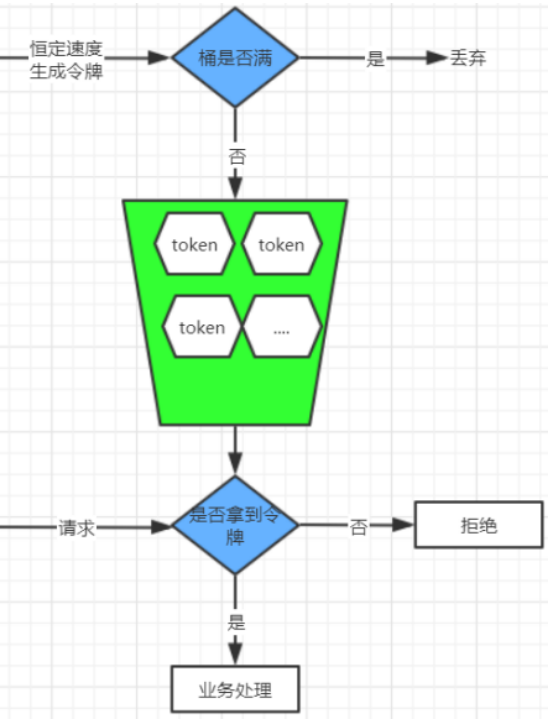


## 5、服务熔断

### 5.1 熔断概述

```
- 熔断这一概念来源于电子工程中的断路器（Circuit Breaker）
- 在互联网系统中，当下游服务因访问压力过大而响应变慢或失败，上游服务为了保护系统整体的可用性，可以暂时切断对下游服务的调用。这种牺牲局部，保全整体的措施就叫做熔断
```


```
如果不采取熔断措施，我们的系统会怎样呢？
举例说明:
当前系统中有A，B，C三个服务，服务A是上游，服务B是中游，服务C是下游. 它们的调用链如下
```

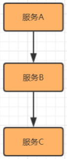


```
一旦下游服务C因某些原因变得不可用，积压了大量请求，服务B的请求线程也随之阻塞
线程资源逐渐耗尽，使得服务B也变得不可用。紧接着，服务A也变为不可用，整个调用链路被拖垮，像这种调用链路的连锁故障，叫做雪崩
```

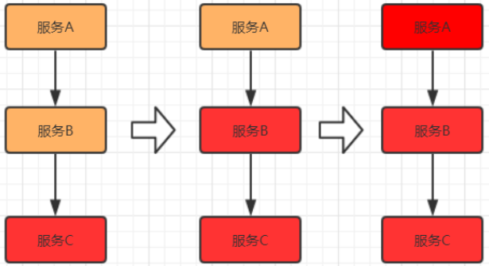


### 5.2 熔断机制

```
开启熔断
- 在固定时间窗口内，接口调用超时比率达到一个阈值，会开启熔断。
- 进入熔断状态后，后续对该服务接口的调用不再经过网络，直接执行本地的默认方法，达到服务降级的效果

熔断恢复
- 熔断不可能是永久的。当经过了规定时间之后，服务将从熔断状态回复过来，再次接受调用方的远程调用
```

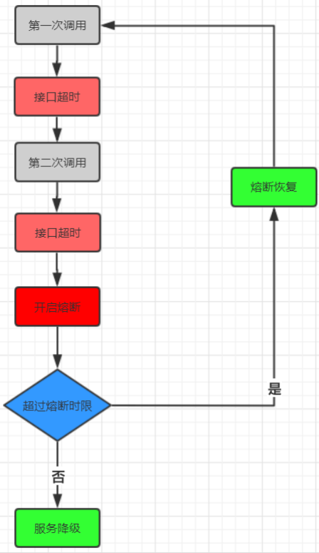

​		

### 5.3 熔断机制实现

#### （1）Spring Cloud Hystrix

```
Spring Cloud Hystrix 是基于 Netflix 的开源框架 Hystrix 实现，该框架实现了服务熔断、线程隔离等一系列服务保护功能

对于熔断机制的实现，Hystrix设计了三种状态：
（1）熔断关闭状态（Closed）
- 服务没有故障时，熔断器所处的状态，对调用方的调用不做任何限制

（2）熔断开启状态（Open）
- 在固定时间内（Hystrix默认是10秒），接口调用出错比率达到一个阈值（Hystrix 默认为50%），会进入熔断开启状态。进入熔断状态后， 后续对该服务接口的调用不再经过网络，直接执行本地的 fallback 方法

（3）半熔断状态（Half-Open）
- 在进入熔断开启状态一段时间之后（Hystrix 默认是5秒），熔断器会进入半熔断状态
- 所谓半熔断就是尝试恢复服务调用，允许有限的流量调用该服务，并监控调用成功率。
- 如果成功率达到预期，则说明服务已恢复，进入熔断关闭状态；如果成功率仍旧很低，则重新进入熔断开启状态。
```

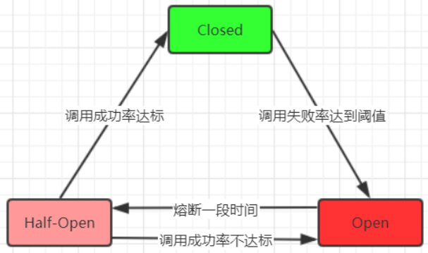

#### （2）Sentinel

```
Sentinel 和 Hystrix 的原则是一致的: 当调用链路中某个资源出现不稳定，例如，表现为 timeout，异常比例升高的时候，则对这个资源的调用进行限制，并让请求快速失败，防止避免影响到其它的资源，最终产生雪崩的效果。

Sentinel 熔断手段:
- 通过并发线程数进行限制
- 通过响应时间对资源进行降级
- 系统负载保护
```


## 6、服务链路追踪

### 6.1 链路追踪概述

```
分布式微服务架构上通过业务来划分服务的，通过REST调用对外暴露的一个接口，可能需要很多个服务协同才能完成这个接口功能，如果链路上任何一个服务出现问题或者网络超时，都会形成导致接口调用失败。随着业务的不断扩张，服务之间互相调用会越来越复杂。

分布式链路追踪（Distributed Tracing），也叫分布式链路跟踪，分布式跟踪，分布式追踪 等等. 其实就是将一次分布式请求还原成调用链路。显示的在后端查看一次分布式请求的调用情况，比如各个节点上的耗时、请求具体打到了哪台机器上、每个服务节点的请求状态等等
```

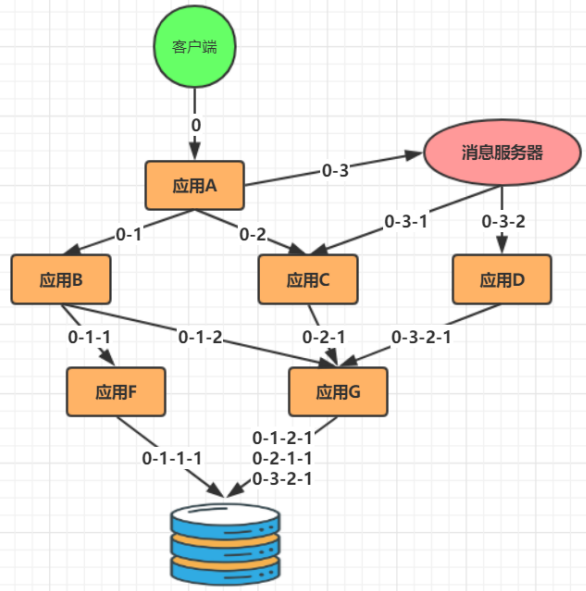

### 6.2 链路追踪具备的功能

#### （1）故障快速定位

```
通过调用链跟踪，一次请求的逻辑轨迹可以完整清晰的展示出来。开发中可以在业务日志中添加调用链ID，可以通过调用链结合业务日志快速定位错误信息
```

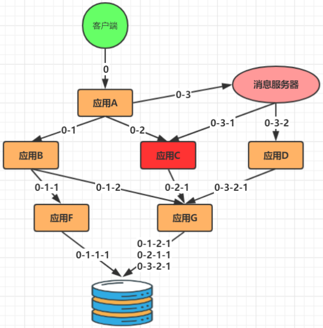

#### （2）各个调用环节的性能分析

```
在调用链的各个环节分别添加调用时延，可以分析系统的性能瓶颈，可以进行针对性的优化。通过分析各个环节的平均时延，QPS等信息，可以找到系统的薄弱环节，对一些模块做调整
```

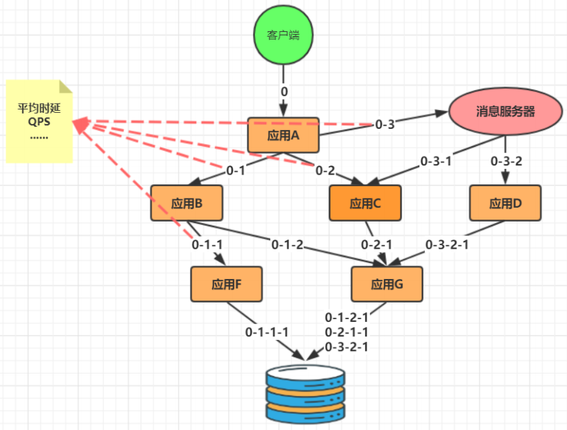

#### （3）数据分析

```
调用链绑定业务后查看具体每条业务数据对应的链路问题，可以得到用户的行为路径，经过了哪些服务器上的哪个服务，汇总分析应用在很多业务场景。
```

#### （4）生成服务调用拓扑图

```
通过可视化分布式系统的模块和他们之间的相互联系来理解系统拓扑。点击某个节点会展示这个模块的详情，比如它当前的状态和请求数量
```


### 6.3 链路追踪设计原则

```
（1）设计目标
- 低侵入性，应用透明
- 低损耗
- 大范围部署，扩展性

（2）埋点和生成日志
- 埋点即系统在当前节点的上下文信息，可以分为客户端埋点、服务端埋点，以及客户端和服务端双向型埋点
- 埋点日志通常要包含以下内容：TraceId、RPCId、调用的开始时间，调用类型，协议类型，调用方ip和端口，请求的服务名等信息；调用耗时，调用结果，异常信息，消息报文等

（3）抓取和存储日志
- 日志的采集和存储有许多开源的工具可以选择，一般来说，会使用离线+实时的方式去存储日志，主要是分布式日志采集的方式。典型的解决方案如Flume结合Kafka。

（4）分析和统计调用链数据
- 一条调用链的日志散落在调用经过的各个服务器上，首先需要按 TraceId 汇总日志，然后按照RpcId 对调用链进行顺序整理。调用链数据不要求百分之百准确，可以允许中间的部分日志丢失。

（5）计算和展示
- 汇总得到各个应用节点的调用链日志后，可以针对性的对各个业务线进行分析。需要对具体日志进行整理，进一步储存在HBase或者关系型数据库中，可以进行可视化的查询
```


### 6.4 链路追踪 Trace 模型

#### （1）概念

| 术语             | 解释                                                         |
| ---------------- | ------------------------------------------------------------ |
| Trace            | 一次完整的分布式调用跟踪链路                                 |
| Span             | 跟踪服务调用基本结构，表示跨服务的一次调用； 多span形成树形结构，组合成一次Trace追踪记录 |
| Annotation       | 在span中的标注点，记录整个span时间段内发生的事件：Cs CLIENT_SEND，客户端发起请求；Cr CLIENT_RECIEVE，客户端收到响应；Sr SERVER_RECIEVE，服务端收到请求；Ss SERVER_SEND，服务端发送结果 |
| BinaryAnnotation | 可以认为是特殊的Annotation，用户自定义事件：Event 记录普通事件；Exception 记录异常事件 |


#### （2）关系图

-  Client && Server：对于跨服务的一次调用，请求发起方为client，服务提供方为Server各术语在一次分布式调用中，关系如下图所示

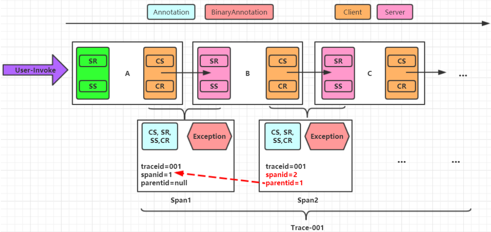

#### （3）链路跟踪系统实现

```
大的互联网公司都有自己的分布式跟踪系统，比如Google的Dapper，Twitter的zipkin，淘宝的鹰眼，新浪的Watchman，京东的Hydra等等
```


# 第七章 分布式集群架构场景化解决⽅案

## 1、普通 Hash 算法

### 1.1 普通查找算法 - 分类

#### （1）顺序查找法

- 通过循环来完成

#### （2）二分查找法

- 排序之后折半查找

#### （3）直接寻址法

- 把数据和数的下标绑定到⼀起，查找的时候，array[n] 就取出了数据

- 优点：速度快，⼀次查找得到结果

- 缺点：浪费空间

  

### 1.2 普通 Hash 算法 - 分类

#### （1）除留余数法

- 对数据求模 （数据%空间位置数），这种构造Hash算法的⽅式叫做除留余数法

#### （2）开放寻址法

- 当有重复时，向前或者向后找空闲位置存放
- 缺点：数组长度固定，不能扩展

#### （3）拉链法

- 当有重复时，纵向放置一个链表


### 1.3 普通 Hash 算法 - 应用场景

#### （1）请求的负载均衡

- 如 Nginx 的 ip_hash 策略

```
Nginx的IP_hash策略可以在客户端ip不变的情况下，将其发出的请求始终路由到同⼀个⽬标服务器上，实现会话粘滞，避免处理session共享问题
- 可以对ip地址或者sessionid进⾏计算哈希值，哈希值与服务器数量进⾏取模运算，得到的值就是当前请求应该被路由到的服务器编号，如此，同⼀个客户端ip发送过来的请求就可以路由到同⼀个⽬标服务器，实现会话粘滞。

如果没有IP_hash策略，那么如何实现会话粘滞？
- 可以维护⼀张映射表，存储客户端IP或者sessionid与具体⽬标服务器的映射关系<ip,tomcat1>

如果没有IP_hash策略，缺点：
- 在客户端很多的情况下，映射表⾮常⼤，浪费内存空间
- 客户端上下线，⽬标服务器上下线，都会导致重新维护映射表，映射表维护成本很⼤
```


#### （2）分布式存储

- ⽐如分布式集群架构Redis、Hadoop、ElasticSearch，Mysql分库分表

```
以分布式内存数据库Redis为例,集群中有redis1，redis2，redis3 三台Redis服务器
- 在进⾏数据存储时,<key1,value1>数据存储到哪个服务器当中呢？
- 针对key进⾏hash处理 hash(key1)%3=index, 使⽤余数index锁定存储的具体服务器节点
```


### 1.4 普通 Hash 算法 - 存在的问题

- 服务器缩容和扩容，⼤量⽤户的请求会被路由到其他的⽬标服务器处理，⽤户在原来服务器中的会话都会丢失


## 2、一致性 Hash 算法

### 2.1 算法思路

#### （1）缩容思路

#### （2）扩容思路

#### （3）虚拟节点（解决数据倾斜问题）


## 3、集群时钟同步问题

## 4、分布式 ID 解决方案

## 5、分布式调度问题

## 6、session 共享问题

#### 
