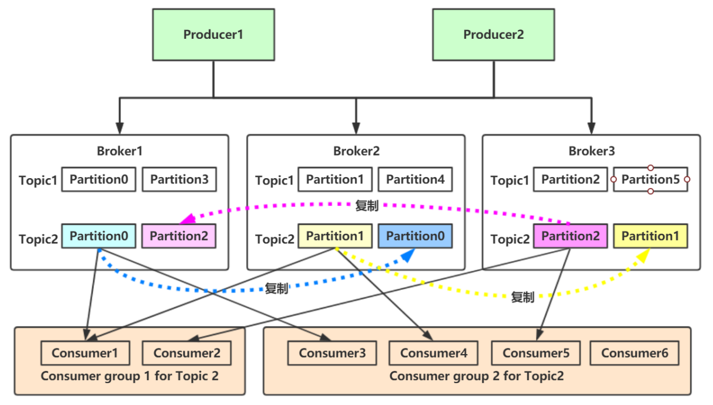
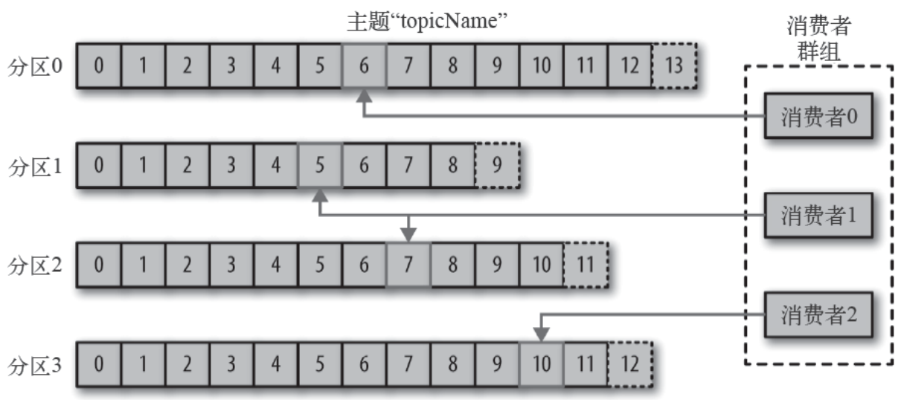
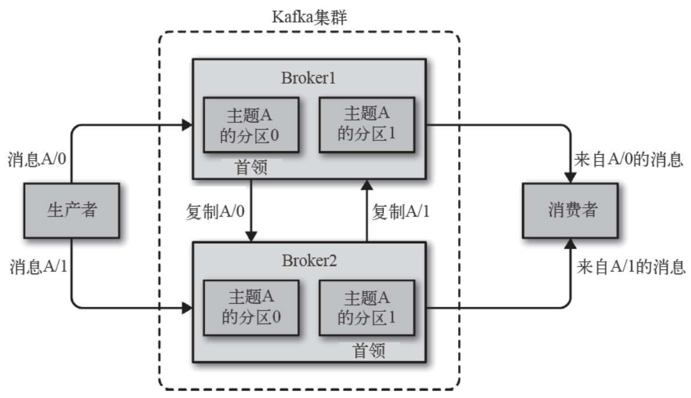
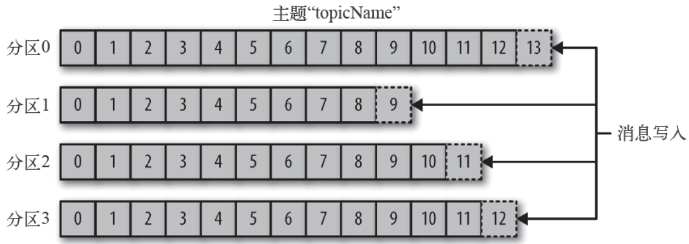
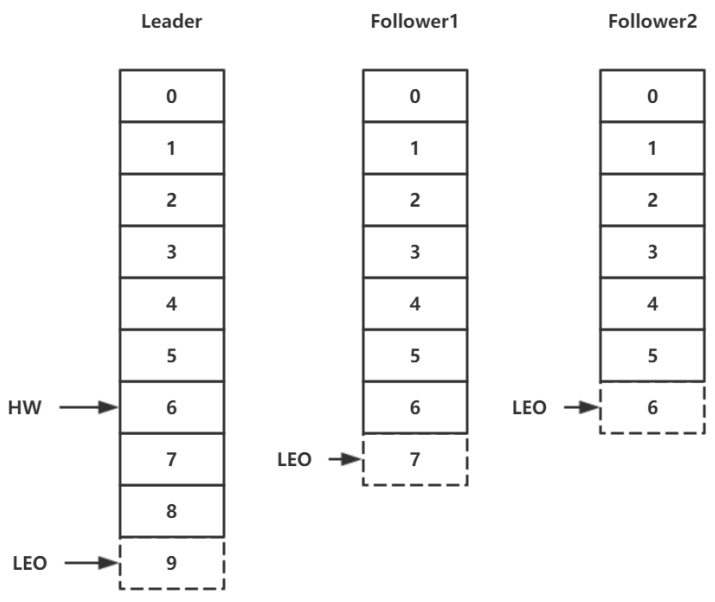
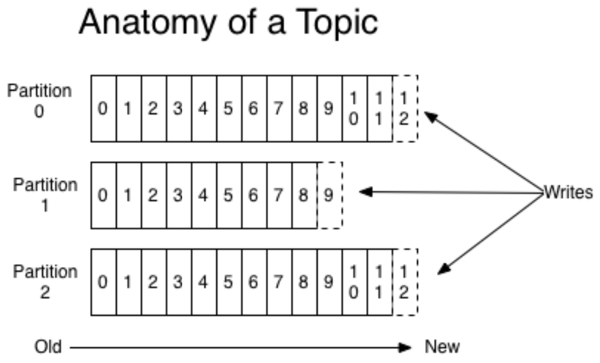
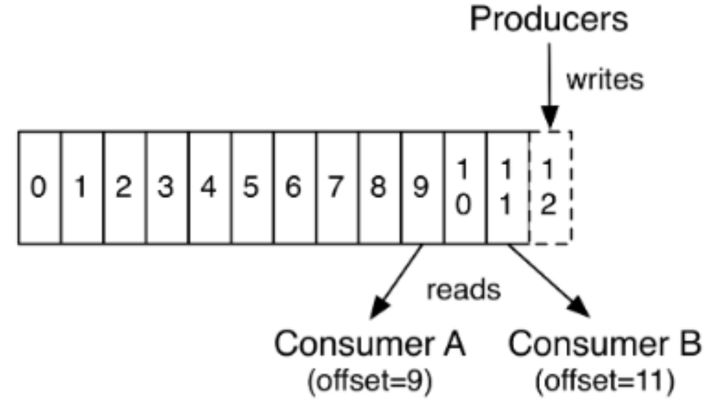
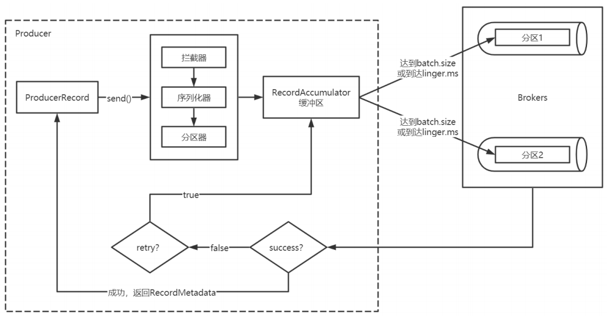

> 当前位置：【Java】09_Architecture_Distributed（分布式架构） -> 9.10_Kafka（分布式消息中间件）


# Kafka 下载安装和配置

## 1、Docker - Kafka 安装和配置


## 2、Linux 系统 - Kafka 安装和配置

### （1）安装 jdk

### （2）安装 zookeeper

```bash
# 步骤1：切换到bin目录
cd /usr/local/zookeeper-3.4.6/bin

# 步骤2：启动Zookeeper
./zkServer.sh start

# 步骤3：查看状态
./zkServer.sh status
```


### （3）安装 Kafka 

#### 步骤1：解压

```bash
tar -zxf kafka_2.12-1.0.2.tgz -C /opt
```


#### 步骤2：配置环境变量

```bash
vim /etc/profile

export KAFKA_HOME=/opt/kafka_2.12-1.0.2/
export PATH=$PATH:$KAFKA_HOME/bin

# 使配置生效
source /etc/profile
```


#### 步骤3：修改配置文件 server.properties

```properties
# 指定当前 Broker 向外发布服务的地址和端口
advertised.listeners=PLAINTEXT://192.168.31.246:9092

# 指定Kafka在磁盘上保存消息的⽇志⽚段的⽬录
log.dirs=/var/kafka/kafka-logs

# 配置 Kafka 要连接的 Zookeeper 集群的地址
zookeeper.connect=localhost:2181/myKafka
zookeeper.connect=ip1:2181,ip2:2181,ip3:2181/myKafka

# 创建日志目录
mkdir -p /var/kafka/kafka-logs
```


#### 步骤4：启动 kafka

```bash
cd /opt/kafka_2.12-1.0.2/

# 启动
kafka-server-start.sh /opt/kafka_2.12-1.0.2/config/server.properties

# 后台启动
kafka-server-start.sh -daemon /opt/kafka_2.12-1.0.2/config/server.properties

# 停止
kafka-server-stop.sh

# 查看 Kafka 后台进程
ps aux | grep kafka
```


### （4）查看 zk 节点下的 myKafka

```bash
# 进入
cd /usr/local/zookeeper-3.4.6/bin
./zkCli.sh -server 127.0.0.1:2181

# 查看
ls /myKafka
```


# 第一章 Kafka 命令

## 1、kafka-topics.sh 用于管理主题

```bash
# 列出现有的主题
kafka-topics.sh --list --zookeeper localhost:2181/myKafka

# 创建主题，该主题包含⼀个分区，该分区为Leader分区，它没有Follower分区副本。
kafka-topics.sh --zookeeper localhost:2181/myKafka --create --topic topic_1 --partitions 1 --replication-factor 1

# 查看分区信息
kafka-topics.sh --zookeeper localhost:2181/myKafka --list

# 查看指定主题的详细信息
kafka-topics.sh --zookeeper localhost:2181/myKafka --describe --topic topic_1

# 删除指定主题
kafka-topics.sh --zookeeper localhost:2181/myKafka --delete --topic topic_1
```


## 2、kafka-console-producer.sh 用于生产消息

```bash
# 开启⽣产者
kafka-console-producer.sh --topic topic_1 --broker-list localhost:9092
```


### 3、kafka-console-consumer.sh 用于消费消息

```bash
# 开启消费者
kafka-console-consumer.sh --bootstrap-server localhost:9092 --topic topic_1

# 开启消费者⽅式⼆，从头消费，不按照偏移量消费
kafka-console-consumer.sh --bootstrap-server localhost:9092 --topic topic_1 --from-beginning
```


# 第二章 Kafka 简介

##  Kafka 优势

```
- ⾼吞吐量：单机每秒处理⼏⼗上百万的消息量。即使存储了许多TB的消息，它也保持稳定的性能。
- ⾼性能：单节点⽀持上千个客户端，并保证零停机和零数据丢失。
- 持久化数据存储：将消息持久化到磁盘。通过将数据持久化到硬盘以及replication防⽌数据丢失。
  零拷⻉
  顺序读，顺序写
  利⽤Linux的⻚缓存

- 分布式系统，易于向外扩展
	所有的Producer、Broker和Consumer都会有多个，均为分布式的。
	⽆需停机即可扩展机器。
	多个Producer、Consumer可能是不同的应⽤。
	
- 可靠性：Kafka是分布式、分区、复制、容错的。
- 客户端状态维护：消息被处理的状态是在Consumer端维护，⽽不是由server端维护。当失败时能⾃动平衡。
- ⽀持online和offline的场景。
- ⽀持多种客户端语⾔。Kafka⽀持Java、.NET、PHP、Python等多种语⾔
```


## Kafka 应用场景

### （1）日志收集

- ⼀个公司可以⽤Kafka可以收集各种服务的Log，通过Kafka以统⼀接⼝服务的⽅式开放给各种Consumer；

### （2）消息系统

- 解耦⽣产者和消费者、缓存消息等；

### （3）用户活动跟踪

- Kafka经常被⽤来记录Web⽤户或者App⽤户的各种活动，如浏览⽹⻚、搜索、点击等活动，这些活动信息被各个服务器发布到Kafka的Topic中，然后消费者通过订阅这些Topic来做实时的监控分析，亦可保存到数据库；

### （4）运营指标

- Kafka也经常⽤来记录运营监控数据。包括收集各种分布式应⽤的数据，⽣产各种操作的集中反馈，⽐如报警和报告；

### （5）流式处理

- ⽐如Spark Streaming和Storm


# 第三章 Kafka 架构




## 1、相关概念

### （1）消息

- Kafka的数据单元称为消息。可以把消息看成是数据库⾥的⼀个“数据⾏”或⼀条“记录”。
- 消息由字节数组组成。
- 消息有键，键也是⼀个字节数组。当消息以⼀种可控的⽅式写⼊不同的分区时，会⽤到键。


### （2）批次

- 为了提⾼效率，消息被分批写⼊Kafka。
- 批次就是⼀组消息，这些消息属于同⼀个主题和分区。
- 把消息分成批次可以减少⽹络开销。
- 批次越⼤，单位时间内处理的消息就越多，单个消息的传输时间就越⻓。
- 批次数据会被压缩，这样可以提升数据的传输和存储能⼒，但是需要更多的计算处理。


### （3）消息模式（schema）

- 消息模式（schema）有许多可⽤的选项，以便于理解。如JSON和XML，但是它们缺乏强类型处理能⼒。
- Kafka的许多开发者喜欢使⽤Apache Avro。
- Avro提供了⼀种紧凑的序列化格式，模式和消息体分开。当模式发⽣变化时，不需要重新⽣成代码，它还⽀持强类型和模式进化，其版本既向前兼容，也向后兼容。
- 数据格式的⼀致性对Kafka很重要，因为它消除了消息读写操作之间的耦合性


### （4）producer 生产者

- ⽣产者创建消息
- 该⻆⾊将消息发布到Kafka的topic中。broker接收到⽣产者发送的消息后，broker将该消息追加到当前⽤于追加数据的 segment ⽂件中。
- ⼀般情况下，⼀个消息会被发布到⼀个特定的主题上

```
默认情况下通过轮询把消息均衡地分布到主题的所有分区上。
- 直接指定消息的分区
- 根据消息的key散列取模得出分区
- 轮询指定分区。

在某些情况下，⽣产者会把消息直接写到指定的分区。这通常是通过消息键和分区器来实现的，分区器为键⽣成⼀个散列值，并将其映射到指定的分区上。这样可以保证包含同⼀个键的消息会被写到同⼀个分区上

⽣产者也可以使⽤⾃定义的分区器，根据不同的业务规则将消息映射到分区。
```


### （5）消费者

- 消费者消费消息
- 消费者订阅⼀个或多个主题，并按照消息⽣成的顺序读取它们，消费者通过偏移量来区分已经读过的消息，从⽽消费消息。
- 消费者通过检查消息的偏移量来区分已经读取过的消息。偏移量是另⼀种元数据，它是⼀个不断递增的整数值，在创建消息时，Kafka 会把它添加到消息⾥。在给定的分区⾥，每个消息的偏移量都是唯⼀的。消费者把每个分区最后读取的消息偏移量保存在Zookeeper 或Kafka 上，如果消费者关闭或重启，它的读取状态不会丢失。
- 消费者是消费组的⼀部分。群组保证每个分区只能被⼀个消费者使⽤，避免重复消费。
- 如果⼀个消费者失效，消费组⾥的其他消费者可以接管失效消费者的⼯作，再平衡，分区重新分配




### （6）broker和集群

- ⼀个独⽴的Kafka服务器称为broker。
- broker接收来⾃⽣产者的消息，为消息设置偏移量，并提交消息到磁盘保存。
- broker为消费者提供服务，对读取分区的请求做出响应，返回已经提交到磁盘上的消息。

```
如果某topic有N个partition，集群有N个broker，那么每个broker存储该topic的⼀个partition。

如果某topic有N个partition，集群有(N+M)个broker，那么其中有N个broker存储该topic的⼀个partition，剩下的M个broker不存储该topic的partition数据。

如果某topic有N个partition，集群中broker数⽬少于N个，那么⼀个broker存储该topic的⼀个或多个partition。在实际⽣产环境中，尽量避免这种情况的发⽣，这种情况容易导致Kafka集群数据不均衡。
```

- 单个broker可以轻松处理数千个分区以及每秒百万级的消息量。
- broker 是集群的组成部分。每个集群都有⼀个broker是集群控制器（⾃动从集群的活跃成员中选举出来）
- 控制器负责管理⼯作，包括将分区分配给broker 和监控broker。

- 集群中⼀个分区属于⼀个broker，该broker称为分区首领。
- ⼀个分区可以分配给多个broker，此时会发⽣分区复制。
- 分区的复制提供了消息冗余，⾼可⽤。副本分区不负责处理消息的读写



### （7）Topic 主题

- 每条发布到Kafka集群的消息都有⼀个类别，这个类别被称为Topic。
- 物理上不同Topic的消息分开存储。
- Kafka的消息通过主题进⾏分类。
- 主题是数据库的表或者⽂件系统⾥的⽂件夹。
- 主题就好⽐数据库的表，尤其是分库分表之后的逻辑表。


### （8）partition 分区

- 主题可以被分为若⼲分区，⼀个分区就是⼀个提交⽇志。
- ⼀个主题通过分区分布于Kafka集群中，提供了横向扩展的能⼒。
- 消息以追加的⽅式写⼊分区，然后以先⼊先出的顺序读取。
- ⽆法在整个主题范围内保证消息的顺序，但可以保证消息在单个分区内的顺序。
- Kafka 通过分区来实现数据冗余和伸缩性。
- 在需要严格保证消息的消费顺序的场景下，需要将partition数⽬设为1。




### （9）Replicas 副本

- Kafka通过副本保证⾼可⽤
- Kafka 使⽤主题来组织数据，每个主题被分为若⼲个分区，每个分区有多个副本。那些副本被保存在broker 上，
- 每个broker 可以保存成百上千个属于不同主题和分区的副本。
- 副本类型

```
⾸领副本（Leader）
- 每个分区都有⼀个⾸领副本。为了保证⼀致性，所有⽣产者请求和消费者请求都会经过这个副本。

跟随者副本（Follower）
- ⾸领以外的副本都是跟随者副本。跟随者副本不处理来⾃客户端的请求，它们唯⼀的任务就是从⾸领那⾥复制消息，保持与⾸领⼀致的状态。如果⾸领发⽣崩溃，其中的⼀个跟随者会被提升为新⾸领。
- 跟随者副本包括同步副本和不同步副本，在发⽣⾸领副本切换的时候，只有同步副本可以切换为⾸领副本
```


#### AR（Assigned Repllicas）

- 分区中的所有副本统称为AR（Assigned Repllicas）。
- AR=ISR+OSR


#### ISR（In-Sync Replicas）

- 所有与leader副本保持⼀定程度同步的副本（包括Leader）组成ISR（In-Sync Replicas），ISR集合是AR集合中的⼀个⼦集。消息会先发送到leader副本，然后follower副本才能从leader副本中拉取消息进⾏同步，同步期间内follower副本相对于leader副本⽽⾔会有⼀定程度的滞后。前⾯所说的“⼀定程度”是指可以忍受的滞后范围，这个范围可以通过参数进⾏配置。


#### OSR（Out-Sync Relipcas）

- 与leader副本同步滞后过多的副本（不包括leader）副本，组成OSR(Out-Sync Relipcas)。在正常情况下，所有的follower副本都应该与leader副本保持⼀定程度的同步，即AR=ISR,OSR集合为空。


#### HW（High Watermak）

- HW是High Watermak的缩写， 俗称⾼⽔位，它表示了⼀个特定消息的偏移量（offset），消费之只能拉取到这个offset之前的消息。


#### LEO（Log End Offset）

- LEO是Log End Offset的缩写，它表示了当前⽇志⽂件中下⼀条待写⼊消息的offset。





### （10）offset 偏移量

#### 生产者 offset

- 消息写⼊的时候，每⼀个分区都有⼀个offset，这个offset就是⽣产者的offset，同时也是这个分区的最新最⼤的offset。
- 有些时候没有指定某⼀个分区的offset，这个⼯作kafka帮我们完成




#### 消费者 offset

- 这是某⼀个分区的offset情况，⽣产者写⼊的offset是最新最⼤的值是12，⽽当Consumer A进⾏消费时，从0开始消费，⼀直消费到了9，消费者的offset就记录在9，Consumer B就纪录在了11。等下⼀次他们再来消费时，他们可以选择接着上⼀次的位置消费，当然也可以选择从头消费，或者跳到最近的记录并从“现在”开始消费。




## 1、生产者 - 消息发送

```
- Producer创建时，会创建⼀个Sender线程并设置为守护线程
- ⽣产消息时，内部其实是异步流程；⽣产的消息先经过拦截器->序列化器->分区器，然后将消息缓存在缓冲区（该缓冲区也是在Producer创建时创建）
- 批次发送的条件为：缓冲区数据⼤⼩达到batch.size或者linger.ms达到上限，哪个先达到就算哪个
- 批次发送后，发往指定分区，然后落盘到broker；如果⽣产者配置了retrires参数⼤于0并且失败原因允许重试，那么客户端内部会对该消息进⾏重试
- 落盘到broker成功，返回⽣产元数据给⽣产者
- 元数据返回有两种⽅式：⼀种是通过阻塞直接返回，另⼀种是通过回调返回
```




