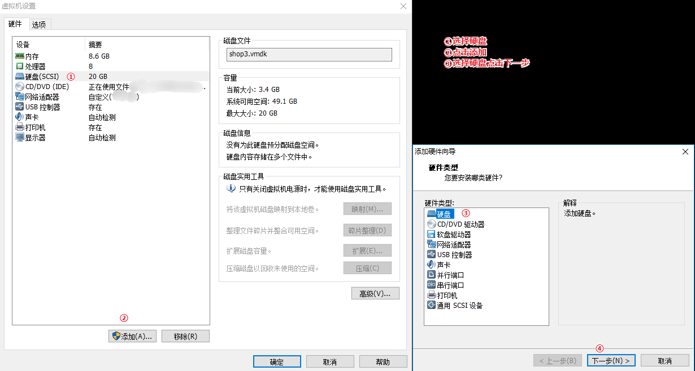
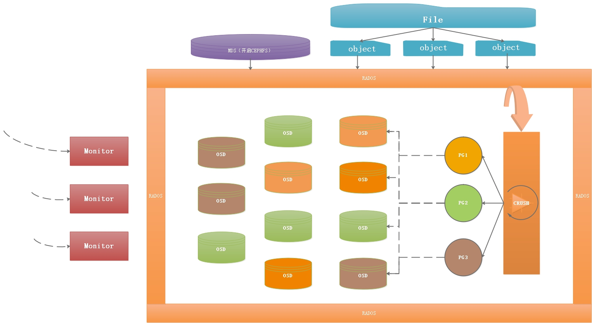
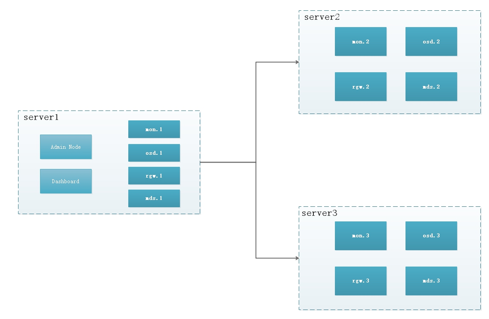

> 当前位置：【Java】09_Architecture_Distributed（分布式架构） -> 9.12_Ceph（分布式文件存储系统）


# Ceph下载安装和配置

## 0、Ceph下载 

- 官网：https://www.ceph.com/en/
- 中文官网：http://ceph.org.cn/
- 中文文档：http://docs.ceph.org.cn/


## 1、Docker - Ceph 集群安装和配置


## 2、Linux系统 - Ceph 集群安装和配置

### （1）机器名称修改 hostname

```bash
# 192.168.126.131
vi /etc/hostname
# 内容添加
CENTOS1

# 192.168.126.132
vi /etc/hostname
# 内容添加
CENTOS2

# 192.168.126.133
vi /etc/hostname
# 内容添加
CENTOS3
```

### （2）配置名字解析 IP

```bash
vi /etc/hosts

# 内容添加，三台机器都添加下面三行
192.168.126.131 CENTOS1
192.168.126.132 CENTOS2
192.168.126.133 CENTOS3

# 重启 
reboot
```

### （3）yum 源修改

```properties
# 三台机器都执行
vi /etc/yum.repos.d/ceph.repo

# 采用清华镜像源
[Ceph]
name=Ceph packages for $basearch
baseurl=https://mirrors.tuna.tsinghua.edu.cn/ceph/rpm-mimic/el7/x86_64/
enabled=1
gpgcheck=1
type=rpm-md
gpgkey=https://download.ceph.com/keys/release.asc

[Ceph-noarch]
name=Ceph noarch packages
# 清华源
baseurl=https://mirrors.tuna.tsinghua.edu.cn/ceph/rpm-mimic/el7/noarch/
enabled=1
gpgcheck=1
type=rpm-md
gpgkey=https://download.ceph.com/keys/release.asc

[ceph-source]
name=Ceph source packages
baseurl=https://mirrors.tuna.tsinghua.edu.cn/ceph/rpm-mimic/el7/SRPMS/
enabled=1
gpgcheck=1
type=rpm-md
gpgkey=https://download.ceph.com/keys/release.asc
```

### （4）ceph 与 ceph-deploy 安装

```bash
# 更新 yum 源，并安装`ceph`和`ceph-deploy`（192.168.126.131 执行即可）
yum update && yum -y install ceph ceph-deploy
```

### （5）免密配置

```bash
# 三台机器都执行
# 创建用户名密码（cephuser/cephuser）
useradd -d /home/cephuser -m cephuser
passwd cephuser

# 设置sudo权限：免密 + 只读权限
echo "cephuser ALL = (root) NOPASSWD:ALL" | sudo tee /etc/sudoers.d/cephuser
sudo chmod 0440 /etc/sudoers.d/cephuser

# 切换用户 
su cephuser

# 生成RSA密钥信息，一路回车即可
ssh-keygen

# 分发密钥至各机器节点，密码为 cephuser（192.168.126.131 执行即可）
ssh-copy-id cephuser@CENTOS1
ssh-copy-id cephuser@CENTOS2
ssh-copy-id cephuser@CENTOS3

# 验证：登录其他机器
ssh 'cephuser@CENTOS2'
ssh 'cephuser@CENTOS3'

# ssh远程连接免密登录
# 切换root身份
su root

# 编辑config
vi ~/.ssh/config

# 添加内容：
Host CENTOS1
   Hostname CENTOS1
   User cephuser
Host CENTOS2
   Hostname CENTOS2
   User cephuser
Host CENTOS3
   Hostname CENTOS3
   User cephuser

# 修改文件权限
chmod 600 ~/.ssh/config

# 禁用SELINUX：
vi /etc/selinux/config
SELINUX=disabled
```

### （6）使用 root 用户安装

```bash
# ceph 配置信息存储目录
mkdir -p /usr/ceph-cluster
cd /usr/ceph-cluster/

# 创建集群 
ceph-deploy new CENTOS1 CENTOS2 CENTOS3

# 创建成功后，会生配置文件和秘钥信息，生成以下三个文件
ceph-deploy-ceph.log
ceph.conf
ceph.mon.keyring

# 修改配置文件
vi /usr/ceph-cluster/ceph.conf

# 添加内容:
# 对外开放网段
public network = 192.168.126.0/24
# 设置pool池默认分配数量
osd pool default size = 2
# 容忍更多的时钟误差
mon clock drift allowed = 2
mon clock drift warn backoff = 30
# 允许删除pool
mon_allow_pool_delete = true
[mgr]
# 开启WEB仪表盘
mgr modules = dashboard

# 安装（该命令将在三台机器上安装 ceph）
cd /usr/ceph-cluster/
sudo ceph-deploy install CENTOS1 CENTOS2 CENTOS3

# 初始化 Monitor 信息，此时会生成很多秘钥文件信息
ceph-deploy mon create-initial

# 同步管理信息
ceph-deploy admin CENTOS1 CENTOS2 CENTOS3

# 安装 mgr（管理守护进程）
ceph-deploy mgr create CENTOS1 CENTOS2 CENTOS3

# 安装 rgw
ceph-deploy rgw create CENTOS1 CENTOS2 CENTOS3

# 安装 mds 服务
ceph-deploy mds create CENTOS1 CENTOS2 CENTOS3

# 上面三个如果有一个安装失败，则需要卸载重装
ceph-deploy purge CENTOS1 CENTOS2 CENTOS3
ceph-deploy purgedata CENTOS1 CENTOS2 CENTOS3
ceph-deploy forgetkeys
rm -rf /var/run/ceph/

# 查看安装情况
ceph -s
```

### （7）安装 OSD

- 添加磁盘：三台机器都需要执行，使用  `VMware `选择设置->硬盘->添加，然后一直下一步，输入10G，重启虚拟机



```bash
# 查看磁盘信息（多了一个 /dev/sdb 的磁盘）
fdisk -l

# 执行创建 OSD 命令（三条命令都在 192.168.126.131 执行即可）
cd /usr/ceph-cluster/
ceph-deploy osd create --data /dev/sdb CENTOS1
ceph-deploy osd create --data /dev/sdb CENTOS2
ceph-deploy osd create --data /dev/sdb CENTOS3

# 出现下面语句表示安装成功
Host CENTOS1 is now ready for osd use

# 查看集群状态
cd /usr/bin
./ceph -s

# 显示下面的语句，表示成功
osd: 3 osds: 3 up, 3 in

# 三个机器，每个机器都执行，同步各个节点的时间
ntpdate ntp1.aliyun.com
```


### （8）安装 dashboard

```bash
# 开启dashboard模块
ceph mgr module enable dashboard

# 生成签名
ceph dashboard create-self-signed-cert

# 创建目录
mkdir -p /usr/ceph-cluster/mgr-dashboard
cd /usr/ceph-cluster/mgr-dashboard

# 生成密钥对
openssl req -new -nodes -x509   -subj "/O=IT/CN=ceph-mgr-dashboard" -days 3650 -keyout dashboard.key -out dashboard.crt -extensions v3_ca

# 启动dashboard
ceph mgr module disable dashboard
ceph mgr module enable dashboard

# 设置IP与PORT（默认端口号 8443）
ceph config set mgr mgr/dashboard/server_addr 192.168.126.131
ceph config set mgr mgr/dashboard/server_port 8443

# 关闭HTTPS
ceph config set mgr mgr/dashboard/ssl false

# 设置管理员账号密码
ceph dashboard set-login-credentials admin admin

# 查看服务信息
ceph mgr services
```

- 访问 dashboard：http://192.168.126.131:8443（admin/admin）
- 访问RGW：http://192.168.126.131:7480/

### （9）安装 Cephfs

- Cephfs 可以支持对外访问的文件系统

```bash
# 创建两个存储池
# 少于5个OSD可把pg_num设置为128
# OSD数量在5到10，可以设置pg_num为512
# OSD数量在10到50，可以设置pg_num为4096
# OSD数量大于50，需要计算pg_num的值
ceph osd pool create cephfs_data 128
ceph osd pool create cephfs_metadata 64

# 列出当前创建的存储池：
ceph osd lspools

# 创建fs，名称为 fs_test
ceph fs new fs_test cephfs_metadata cephfs_data

# 状态查看
ceph fs ls

# 以下信息代表正常
name: fs_test, metadata pool: cephfs_metadata, data pools: [cephfs_data]

# 状态
ceph mds stat

# up
fs_test-0/0/1 up

# fuse 挂载
yum -y install ceph-fuse

# 创建挂载目录
mkdir -p /usr/cephfs-directory
cd /usr/cephfs-directory

# 挂载 cephfs
ceph-fuse -k /etc/ceph/ceph.client.admin.keyring -m 192.168.126.131:6789 cd/usr/cephfs-directory

# 出现下面信息表示挂载成功了
ceph-fuse[28003]: starting fuse

# 挂载信息查看 
df -h
```


# 第一章 Ceph 简介

## 1、Ceph 概述

- Ceph是一个统一的分布式存储系统，设计初衷是提供较好的性能、可靠性和可扩展性。

- Ceph项目最早起源于Sage就读博士期间的工作（最早的成果于2004年发表），并随后贡献给开源社区。
- 在经过了数年的发展之后，目前已得到众多云计算厂商的支持并被广泛应用。
- RedHat及OpenStack都可与Ceph整合以支持虚拟机镜像的后端存储。


## 2、Ceph 特点

### （1）CRUSH算法

- Crush算法是ceph的两大创新之一，简单来说，ceph摒弃了传统的集中式存储元数据寻址的方案，转而使用CRUSH算法完成数据的寻址操作。
- CRUSH在一致性哈希基础上很好的考虑了容灾域的隔离，能够实现各类负载的副本放置规则，例如跨机房、机架感知等。
- Crush算法有相当强大的扩展性，理论上支持数千个存储节点。

### （2）高性能

- Ceph中的数据副本数量可以由管理员自行定义，并可以通过CRUSH算法指定副本的物理存储位置以分隔故障域，支持数据强一致性；
-  ceph可以忍受多种故障场景并自动尝试并行修复。

### （3）高扩展性

- Ceph本身并没有主控节点，扩展起来比较容易，并且理论上，它的性能会随着磁盘数量的增加而线性增长。

### （4）特性丰富

- Ceph支持三种调用接口：对象存储，块存储，文件系统挂载。三种方式可以一同使用。
- 在国内一些公司的云环境中，通常会采用ceph作为openstack的唯一后端存储来提升数据转发效率。


## 3、分布式文件存储系统对比

| 对比说明     | TFS                  | FASTDFS                | MooseFS          | GlusterFS      | CEPH               |
| ------------ | -------------------- | ---------------------- | ---------------- | -------------- | ------------------ |
| 开发语言     | C++                  | C                      | C                | C              | C++                |
| 数据存储方式 | 块                   | 文件/Trunk             | 块               | 文件/块        | 对象/文件/块       |
| 在线扩容     | 支持                 | 支持                   | 支持             | 支持           | 支持               |
| 冗余备份     | 支持                 | 支持                   | 支持             | 支持           | 支持               |
| 单点故障     | 存在                 | 不存在                 | 存在             | 不存在         | 不存在             |
| 易用性       | 安装复杂，官方文档少 | 安装简单，社区相对活跃 | 安装简单         | 官方文档专业化 | 安装有一定复杂度   |
| 适用场景     | 跨集群的小文件       | 单集群的中小文件       | 单集群的大中文件 | 跨集群云存储   | 单集群的大中小文件 |


# 第二章 Ceph 架构




## 1、组件对象

### （1）RADOS

- 一个可用于PB级规模数据存储集群的可伸缩的、可靠的对象存储服务
- 可以理解成Ceph的整个存储对象，包括逻辑对象。

### （2）File

- 用户上传的文件

### （3）object

- 上传的文件被切成N个小文件块对象，RADOS的基本存储单元。

### （4）MDS

- 元数据的内存缓存，为了加快元数据的访问。

### （5）CRUSH

- Ceph寻址算法，用于计算当前文件存储到哪个PG对应的OSD中。

### （6）PG

- 对object的存储进行组织和位置映射。
- 具体而言，一个PG负责组织若干个object（可以为数千个甚至更多），但一个object只能被映射到一个PG中，即，PG和object之间是“一对多”映射关系。同时，一个PG会被映射到n个OSD上，而每个OSD上都会承载大量的PG，即，PG和OSD之间是“多对多”映射关系。

### （7）OSD

- RADOS中的存储节点被称为OSD


## 2、整体流程

- 文件上传，先将文件切片成N个object（如果开启了cephFS，可以使用MDS缓存）
- 切片后的文件object会存入到Ceph中
- 文件存储前，会经过CRUSH算法，计算当前文件存储归结于哪个PG
- PG是逻辑概念上对文件存储范围划分的索引
- 根据PG索引将文件存储到指定服务器的OSD中


# 第三章 Ceph 集群

- 主节点 server1：Dashbaord、mon、mds、rgw、mgr、osd
- 子节点 server2和server3：mon、mds、rgw、mgr、osd
  - dashbaord：Ceph可视化管理界面
  - rgw：RADOSGW，Ceph对象网关，使客户端能够利用标准对象存储API来访问Ceph集群
  - mgr：ceph-mgr，主要目标实现 ceph 集群的管理，为外界提供统一的入口



# 第四章 Ceph + Swift API 接口开发

## 1、Swift API

- Swift是由Rackspace开发的用来为云计算提供可扩展存储的项目。专注于对象存储， 并提供一套REST风格的Api来访问，
- 与Ceph强一致性不同， 它是最终一致性。
- 如果是专注于对象存储， 那么可以选择swift即可满足需要
- 如果还有块存储要求， 那么选择Ceph更为合适


## 2、集成步骤

### （1）创建Swift用户，用于接口请求认证

```bash
# uid 为主用户
# subuser为子用户信息
# secret指定密钥，不指定则随机生成
# access拥有权限设定,代码中需使用返回信息中的user和secret_key
sudo radosgw-admin user create --subuser="cephtester:subtester" --uid="cephtester" --display-name="cephtester" --key-type=swift --secret="root" --access=full
```

### （2）创建管理员账号

```bash
radosgw-admin user create --uid=mgruser --display-name=mgruser  --system

# 执行后，关注下面的公钥和密钥
  "keys": [
        {
            "user": "mgruser",
            "access_key": "UILPHL93SL3LCCLD1S83",
            "secret_key": "VboiLAjQMjnkSP7m1TqlYV0WKg0mKG5JTIZ2k2um"
        }
    ]   
```

### （3）根据access_key与secret_key，执行

```bash
ceph dashboard set-rgw-api-access-key UILPHL93SL3LCCLD1S83
ceph dashboard set-rgw-api-secret-key VboiLAjQMjnkSP7m1TqlYV0WKg0mKG5JTIZ2k2um
```

### （4）访问

- 可以查看到刚才创建的两个用户：http://192.168.126.131:8443/#/rgw/user

### （5）文件服务搭建

- pom.xml

```xml
<dependencies>
    <!-- Rados Java Api依赖 -->
    <dependency>
        <groupId>com.ceph</groupId>
        <artifactId>rados</artifactId>
        <version>0.6.0</version>
    </dependency>
    
    <!-- Cephfs 文件系统依赖 -->
    <dependency>
        <groupId>com.ceph</groupId>
        <artifactId>libcephfs</artifactId>
        <version>0.80.5</version>
    </dependency>

    <!--swift-->
    <dependency>
        <groupId>org.javaswift</groupId>
        <artifactId>joss</artifactId>
        <version>0.10.2</version>
    </dependency>
</dependencies>
```

- bootstrap.yml

```yaml
ceph:
  username: cephtester:subtester  # Ceph配置 主用户名：子用户名
  password: root # 秘钥
  authUrl: http://192.168.126.131:7480/auth/1.0 # 接口访问路径
  defaultContainerName: user_datainfo # 默认容器名字
# 图片路径
cephurl: http://localhost:8082/file/download
```

