> 当前位置：【Java】09_Architecture_Distributed（分布式架构） -> 9.1_IO


# 第一章 IO模型

## 1、I/O 模型概念

- 用什么样的通道进行数据的发送和接收，很大程度上决定了程序通信的性能


## 2、阻塞与非阻塞

- 主要指的是访问 IO 的线程是否会阻塞（或处于等待）
- 线程访问资源，该资源是否准备就绪的一种处理方式

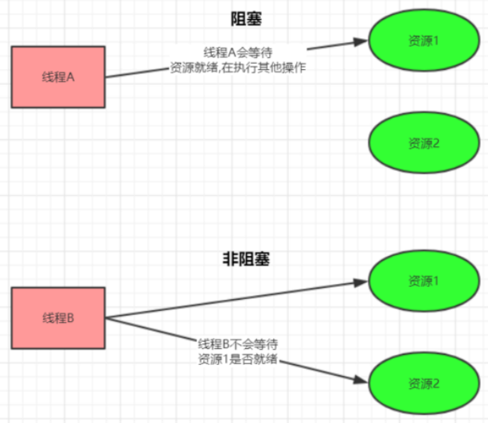


## 3、同步和异步

- 主要是指的数据的请求方式
- 同步和异步是指访问数据的一种机制

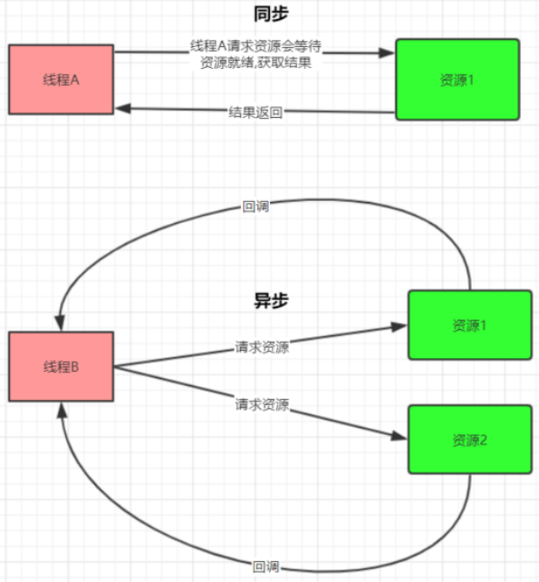


## 4、Java 共支持 3 种网络编程 IO 模型

### （1）BIO(同步并阻塞)

### （2）NIO(同步非阻塞)

### （3）AIO(异步非阻塞)


# 第二章 BIO（同步并阻塞）

## 1、概述

```
- Java BIO就是传统的 socket 编程
- BIO(blocking I/O)：同步阻塞，服务器实现模式为一个连接一个线程，即客户端有连接请求时服务器端就需要启动一个线程进行处理
- 如果这个连接不做任何事情会造成不必要的线程开销，可以通过线程池机制改善(实现多个客户连接服务器)
```

- 工作机制

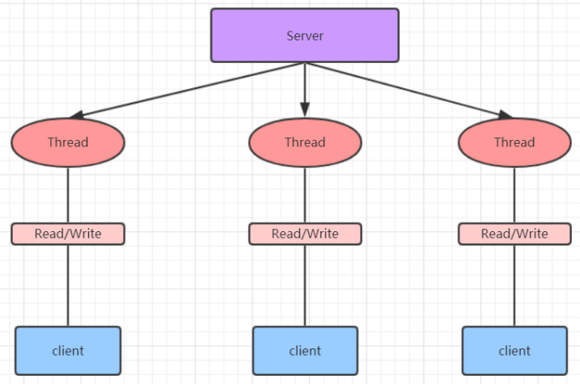

- 举例


## 2、BIO 缺点

```
- 每个请求都需要创建独立的线程，与对应的客户端进行数据 Read，业务处理，数据 Write
- 并发数较大时，需要创建大量线程来处理连接，系统资源占用较大
- 连接建立后，如果当前线程暂时没有数据可读，则线程就阻塞在 Read 操作上，造成线程资源浪费
```


# 第三章 NIO（同步非阻塞）

## 1、NIO 简介

```
- Java NIO 全称java non-blocking IO ，是指 JDK 提供的新 API
- 从 JDK1.4 开始，Java 提供了一系列改进的输入/输出的新特性，被统称为 NIO(即 New IO)，是同步非阻塞的

- NIO是面向缓冲区编程的
- 数据读取到一个缓冲区中，需要时可在缓冲区中前后移动，这就增加了处理过程中的灵活性，使用它可以提供非阻塞式的高伸缩性网络

- Java NIO 的非阻塞模式，使一个线程从某通道发送请求或者读取数据，但是它仅能得到目前可用的数据
- 如果目前没有数据可用时，就什么都不会获取，而不是保持线程阻塞，所以直至数据变的可以读取之前，该线程可以继续做其他的事情
- 非阻塞写也是如此，一个线程请求写入一些数据到某通道，但不需要等待它完全写入，这个线程同时可以去做别的事情
- 通俗理解：NIO 是可以做到用一个线程来处理多个操作的
- 假设有 10000 个请求过来,根据实际情况，可以分配50或者100个线程来处理,不像之前的阻塞 IO 那样，非得分配10000个

- 同步非阻塞，服务器实现模式为一个线程处理多个请求(连接)，即客户端发送的连接请求都会注册到多路复用器上，多路复用器轮询到连接有 I/O 请求就进行处理
```

- 工作机制

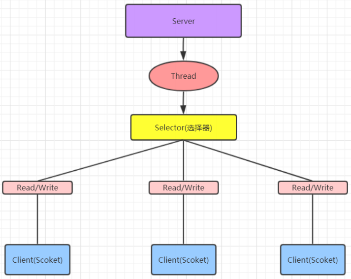

- 举例

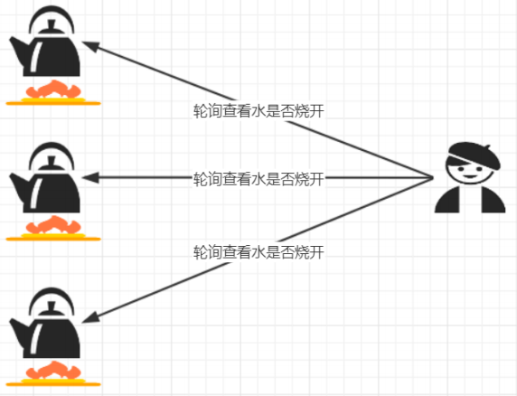


## 2、NIO 三大核心原理示意图

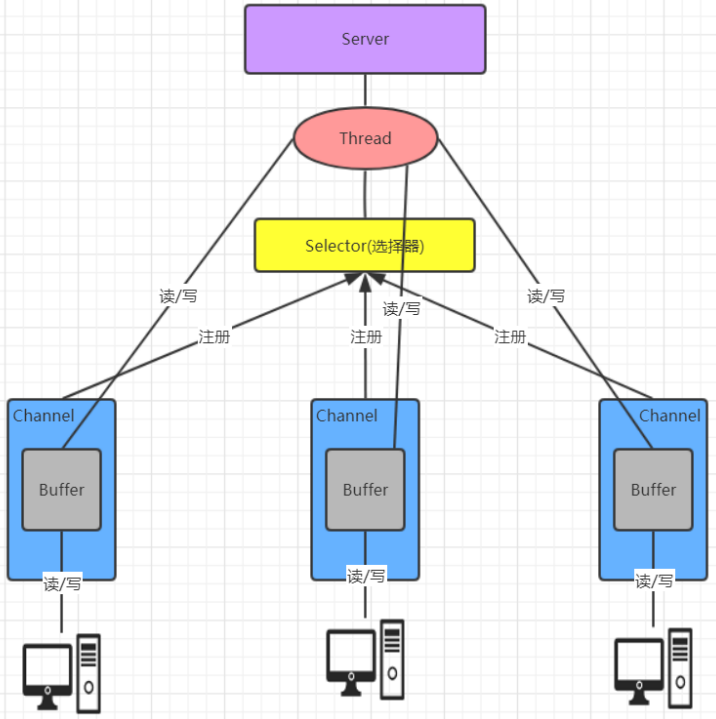

```
- 每个 channel 都会对应一个 Buffer
- Selector 对应一个线程，一个线程对应多个 channel(连接) 
- 每个 channel 都注册到 Selector 选择器上
- Selector不断轮询查看 Channel 上的事件, 事件是通道 Channel 非常重要的概念
- Selector 会根据不同的事件，完成不同的处理操作
- Buffer 就是一个内存块，底层是有一个数组
- 数据的读取写入是通过 Buffer, 这个和 BIO , BIO 中要么是输入流，或者是输出流, 不能双向，但是NIO 的 Buffer 是可以读也可以写 , channel 是双向的
```


## 3、核心一：Buffer（ 缓冲区）

### 3.1 简介

```
- 缓冲区本质上是一个可以读写数据的内存块，可以理解成是一个数组
- 该对象提供了一组方法，可以更轻松地使用内存块，缓冲区对象内置了一些机制，能够跟踪和记录缓冲区的状态变化情况
- Channel 提供从网络读取数据的渠道，但是读取或写入的数据都必须经由 Buffer
```

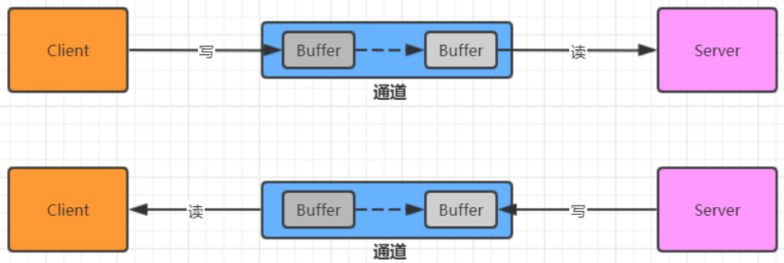


### 3.2 常用API

#### （1）Buffer 类及其子类

- 在 NIO 中，Buffer是一个顶层父类，它是一个抽象类，常用的缓冲区分别对应 byte、short、int、 long、float、double、char 7种

- 类的层级关系图

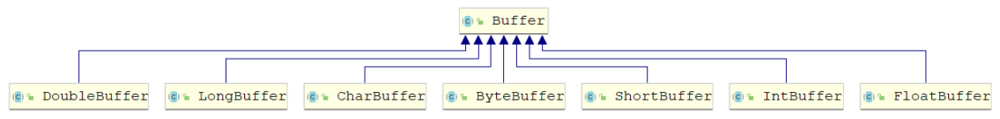

#### （2）Buffer 对象创建

| 方法名                               | 说明                           |
| ------------------------------------ | ------------------------------ |
| static ByteBuffer allocate(长度)     | 创建byte类型的指定长度的缓冲区 |
| static ByteBuffer wrap(byte[] array) | 创建一个有内容的byte类型缓冲区 |


#### （3）Buffer 对象添加数据

| 方法名                                     | 说明                                            |
| ------------------------------------------ | ----------------------------------------------- |
| int position() / position(int newPosition) | 获得当前要操作的索引 / 修改当前要操作的索引位   |
| int limit() / limit(int newLimit)          | 最多能操作到哪个索引 / 修改最多能操作的索引位置 |
| int capacity()                             | 返回缓冲区的总长度                              |
| int remaining() / boolean hasRemaining()   | 还有多少能操作索引个数 / 是否还有能操作         |
| put(byte b) / put(byte[] src)              | 添加一个字节 / 添加字节数组                     |

- remaining 图解

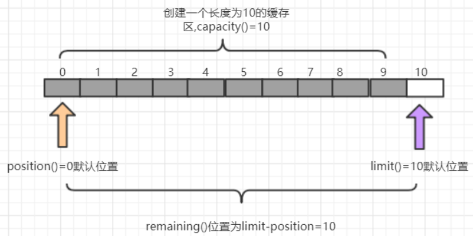

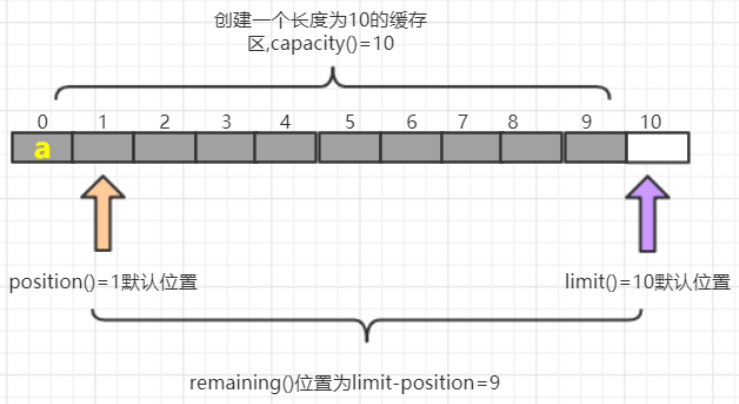

#### （4）Buffer 对象读取数据

- 获取缓冲区里面数据之前，需要调用flip方法
- 再次写数据之前，需要调用clear方法，但是数据还未消失，等再次写入数据，被覆盖了才会消失

| 方法名          | 说明                                               |
| --------------- | -------------------------------------------------- |
| flip()          | 写切换读模式 limit 设置position位置，position设置0 |
| get()           | 读一个字节                                         |
| get(byte[] dst) | 读多个字节                                         |
| get(int index)  | 读指定索引的字节                                   |
| rewind()        | 将position设置为0，可以重复读                      |
| clear()         | 切换写模式 position设置为0 , limit 设置为 capacity |
| array()         | 将缓冲区转换成字节数组返回                         |

- flip() 图解

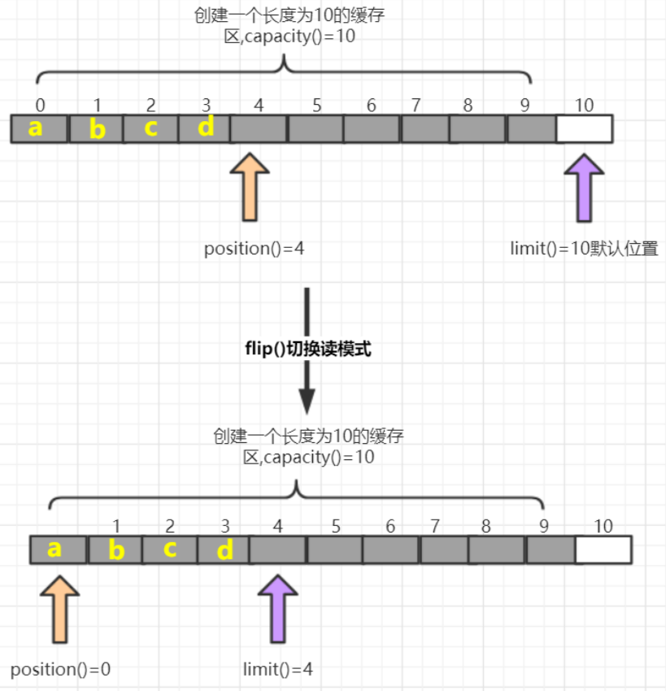

- clear()图解

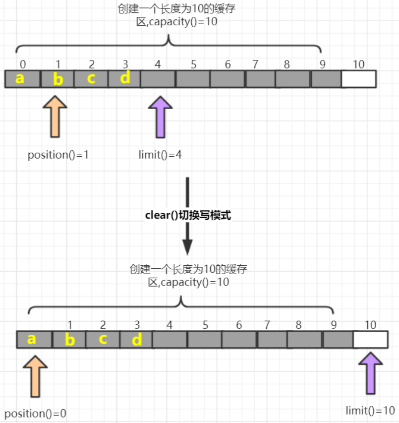


## 4、核心二：Channel（通道）

### 4.1 简介

- 通常来说NIO中的所有IO都是从 Channel（通道） 开始的
- NIO 的通道类似于流，但有些区别如下

```
- 通道可以读也可以写，流一般来说是单向的（只能读或者写，用流进行IO操作的时候需要分别创建一个输入流和一个输出流）
- 通道可以异步读写
- 通道总是基于缓冲区Buffer来读写
```

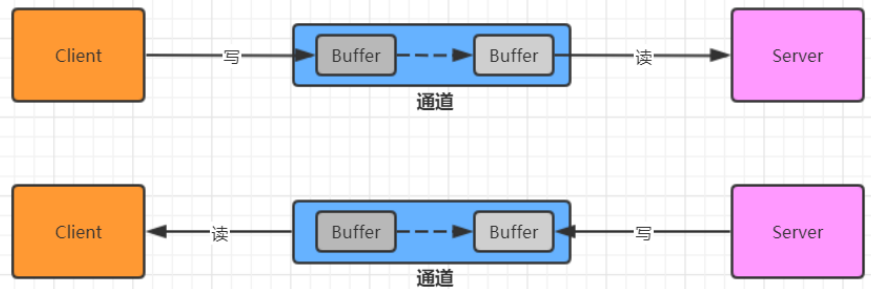


### 4.2 Channel 接口的常用实现类

```
- FileChannel 用于文件的数据读写
- DatagramChannel 用于 UDP 的数据读写
- ServerSocketChannel 和 SocketChannel 用于 TCP 的数据读写（用于完成客户端与服务端数据的通信工作）
	ServerSocketChannel 类似 ServerSocket
	SocketChannel 类似 Socket
```


### 4.3 实现步骤

#### （1）ServerSocketChannel 服务端

```
打开一个服务端通道
绑定对应的端口号
通道默认是阻塞的，需要设置为非阻塞
检查是否有客户端连接 有客户端连接会返回对应的通道
获取客户端传递过来的数据,并把数据放在byteBuffer这个缓冲区中
给客户端回写数据
释放资源
```

#### （2）SocketChannel 客户端实现步骤

```
打开通道
设置连接IP和端口号
写出数据
读取服务器写回的数据
释放资源
```


## 5、核心三：Selector（选择器）

### 5.1 简介

```
- 一个线程，处理多个的客户端连接，就会使用到 NIO 的 Selector(选择器)
- Selector 能够检测多个注册的服务端通道上是否有事件发生，如果有事件发生，便获取事件然后针对每个事件进行相应的处理。这样就可以只用一个单线程去管理多个通道，也就是管理多个连接和请求。
```

- 在这种没有选择器的情况下，每个连接对应一个处理线程，但是连接并不能马上就会发送信息，所以会产生资源浪费

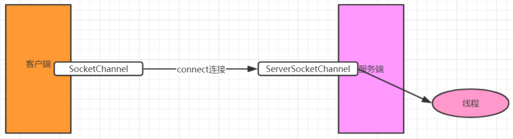

- 只有在通道真正有读写事件发生时，才会进行读写，这就大大地减少了系统开销，并且不必为每个连接都创建一个线程，不用去维护多个线程，避免了多线程之间的上下文切换导致的开销（可以一个单线程去管理多个通道，即多路复用器）

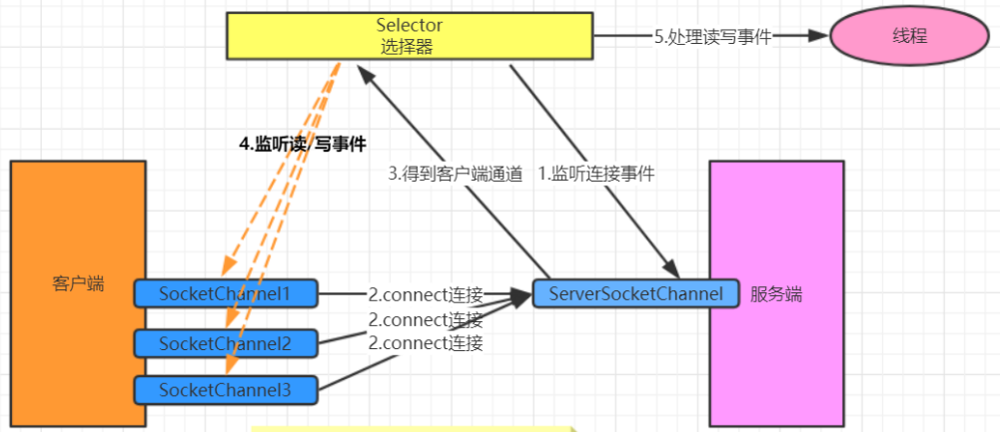


### 5.2 常用 API

#### （1）Selector 类（抽象类）

- 常用方法

```java
// 得到一个选择器对象
Selector.open()
  
// 阻塞 监控所有注册的通道,当有对应的事件操作时, 会将SelectionKey放入集合内部并返回事件数量
selector.select() 
  
// 阻塞 1000 毫秒，监控所有注册的通道,当有对应的事件操作时, 会将 SelectionKey 放入集合内部并返回
selector.select(1000)
  
// 返回存有SelectionKey的集合
selector.selectedKeys()
```

#### （2）SelectionKey

- 常用方法

```java
// 是否是连接继续事件
SelectionKey.isAcceptable()
  
// 是否是连接就绪事件  
SelectionKey.isConnectable()
  
// 是否是读就绪事件  
SelectionKey.isReadable()
  
// 是否是写就绪事件  
SelectionKey.isWritable()
```

- SelectionKey 中定义的4种事件

```java
// 接收连接继续事件，表示服务器监听到了客户连接，服务器可以接收这个连接了
SelectionKey.OP_ACCEPT
  
// 连接就绪事件，表示客户端与服务器的连接已经建立成功  
SelectionKey.OP_CONNECT
  
// 读就绪事件，表示通道中已经有了可读的数据，可以执行读操作了（通道目前有数据，可以进行读操作了）  
SelectionKey.OP_READ
  
// 写就绪事件，表示已经可以向通道写数据了（通道目前可以用于写操作）  
SelectionKey.OP_WRITE
```


### 5.3 实现步骤

#### （1）服务端实现步骤

```java
1. 打开一个服务端通道
2. 绑定对应的端口号
3. 通道默认是阻塞的，需要设置为非阻塞
4. 创建选择器
5. 将服务端通道注册到选择器上,并指定注册监听的事件为OP_ACCEPT
6. 检查选择器是否有事件
7. 获取事件集合
8. 判断事件是否是客户端连接事件SelectionKey.isAcceptable()
9. 得到客户端通道,并将通道注册到选择器上, 并指定监听事件为OP_READ
10. 判断是否是客户端读就绪事件SelectionKey.isReadable()
11. 得到客户端通道,读取数据到缓冲区
12. 给客户端回写数据
13. 从集合中删除对应的事件, 因为防止二次处理.
```


# 第四章 AIO（异步非阻塞）

## 1、概念

```
- AIO 引入异步通道的概念，采用了 Proactor 模式，简化了程序编写，有效的请求才启动线程
- 特点：先由操作系统完成后才通知服务端程序启动线程去处理
- 一般适用于连接数较多且连接时间较长的应用

- Proactor 模式是一个消息异步通知的设计模式，Proactor 通知的不是就绪事件，而是操作完成事件
- Proactor 模式也是操作系统异步 IO 的主要模型
```

 

## 2、举例

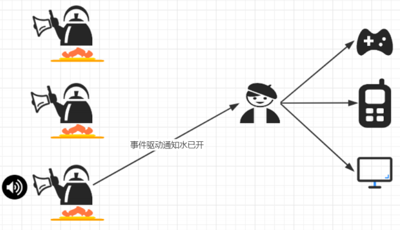


# 【区别】BIO、NIO、AIO

- 适用场景

```
BIO(同步并阻塞) 
- 适用于连接数目比较小且固定的架构
- 这种方式对服务器资源要求比较高，并发局限于应用中
- JDK1.4以前的唯一选择，但程序简单易理解

NIO(同步非阻塞) 
- 适用于连接数目多且连接比较短（轻操作）的架构
- 比如聊天服务器，弹幕系统，服务器间通讯等。
- 编程比较复杂，JDK1.4 开始支持

AIO(异步非阻塞) 
- 使用于连接数目多且连接比较长（重操作）的架构
- 比如相册服务器，充分调用 OS 参与并发操作
- 编程比较复杂，JDK7 开始支持
```


# 【区别】BIO、NIO

```
BIO 以流的方式处理数据
NIO 以缓冲区的方式处理数据，缓冲区 I/O 的效率比流 I/O 高很多

BIO 是阻塞的
NIO 是非阻塞的

BIO 基于字节流和字符流进行操作
NIO 基于 Channel(通道)和 Buffer(缓冲区)进行操作，数据总是从通道读取到缓冲区中，或者从缓冲区写入到通道中。Selector(选择器)用于监听多个通道的事件（比如：连接请求， 数据到达等），因此使用单个线程就可以监听多个客户端通道
```


> 参考资料

https://my.oschina.net/u/3471412/blog/2966696

