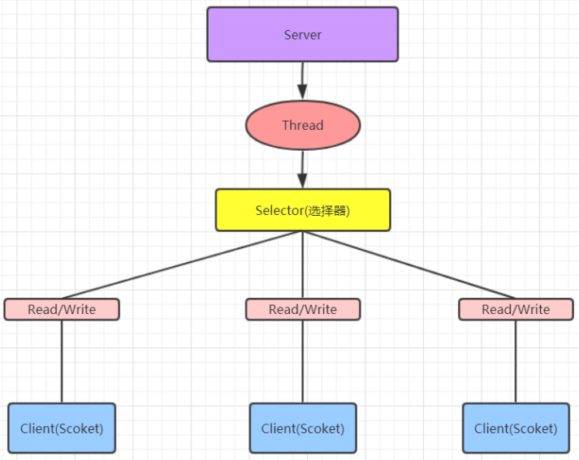
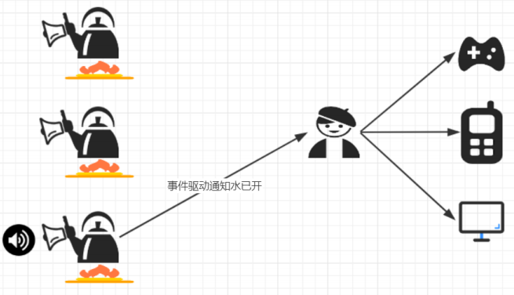

> 当前位置：【Java】09_Architecture_Distributed（分布式架构） -> 9.1_IO（分布式通信）


# 第一章 IO模型

## 1、I/O 模型概念

- 用什么样的通道进行数据的发送和接收，很大程度上决定了程序通信的性能


## 2、阻塞与非阻塞

- 主要指的是访问 IO 的线程是否会阻塞（或处于等待）
- 线程访问资源，该资源是否准备就绪的一种处理方式


## 3、同步和异步

- 主要是指的数据的请求方式
- 同步和异步是指访问数据的一种机制


## 4、Java 共支持 3 种网络编程 IO 模型

- BIO(同步并阻塞)
- NIO(同步非阻塞)
- AIO(异步非阻塞)


# 第二章 BIO（同步并阻塞）

## 1、概述

```
- Java BIO就是传统的 socket 编程
- BIO(blocking I/O)：同步阻塞，服务器实现模式为一个连接一个线程，即客户端有连接请求时服务器端就需要启动一个线程进行处理
- 如果这个连接不做任何事情会造成不必要的线程开销，可以通过线程池机制改善(实现多个客户连接服务器)
```

- 工作机制


- 举例


## 2、BIO 缺点

```
- 每个请求都需要创建独立的线程，与对应的客户端进行数据 Read，业务处理，数据 Write
- 并发数较大时，需要创建大量线程来处理连接，系统资源占用较大
- 连接建立后，如果当前线程暂时没有数据可读，则线程就阻塞在 Read 操作上，造成线程资源浪费
```


# 第三章 NIO（同步非阻塞）

## 1、NIO 简介

```
- Java NIO 全称java non-blocking IO ，是指 JDK 提供的新 API
- 从 JDK1.4 开始，Java 提供了一系列改进的输入/输出的新特性，被统称为 NIO(即 New IO)，是同步非阻塞的

- NIO是面向缓冲区编程的
- 数据读取到一个缓冲区中，需要时可在缓冲区中前后移动，这就增加了处理过程中的灵活性，使用它可以提供非阻塞式的高伸缩性网络

- Java NIO 的非阻塞模式，使一个线程从某通道发送请求或者读取数据，但是它仅能得到目前可用的数据
- 如果目前没有数据可用时，就什么都不会获取，而不是保持线程阻塞，所以直至数据变的可以读取之前，该线程可以继续做其他的事情
- 非阻塞写也是如此，一个线程请求写入一些数据到某通道，但不需要等待它完全写入，这个线程同时可以去做别的事情
- 通俗理解：NIO 是可以做到用一个线程来处理多个操作的
- 假设有 10000 个请求过来,根据实际情况，可以分配50或者100个线程来处理,不像之前的阻塞 IO 那样，非得分配10000个

- 同步非阻塞，服务器实现模式为一个线程处理多个请求(连接)，即客户端发送的连接请求都会注册到多路复用器上，多路复用器轮询到连接有 I/O 请求就进行处理
```

- 工作机制



- 举例


## 2、NIO 三大核心原理示意图


```
- 每个 channel 都会对应一个 Buffer
- Selector 对应一个线程，一个线程对应多个 channel(连接) 
- 每个 channel 都注册到 Selector 选择器上
- Selector不断轮询查看 Channel 上的事件, 事件是通道 Channel 非常重要的概念
- Selector 会根据不同的事件，完成不同的处理操作
- Buffer 就是一个内存块，底层是有一个数组
- 数据的读取写入是通过 Buffer, 这个和 BIO , BIO 中要么是输入流，或者是输出流, 不能双向，但是NIO 的 Buffer 是可以读也可以写 , channel 是双向的
```


## 3、核心一：Buffer（缓冲区）

### 3.1 简介

```
- 缓冲区本质上是一个可以读写数据的内存块，可以理解成是一个数组
- 该对象提供了一组方法，可以更轻松地使用内存块，缓冲区对象内置了一些机制，能够跟踪和记录缓冲区的状态变化情况
- Channel 提供从网络读取数据的渠道，但是读取或写入的数据都必须经由 Buffer
```


### 3.2 常用API

#### （1）Buffer 类及其子类

#### （2）Buffer 对象创建

#### （3）Buffer 对象添加数据

#### （4）Buffer 对象读取数据


## 4、核心二：Channel（通道）

### 4.1 Channel 接口的常用实现类

```
- FileChannel 用于文件的数据读写
- DatagramChannel 用于 UDP 的数据读写
- ServerSocketChannel 和 SocketChannel 用于 TCP 的数据读写（用于完成客户端与服务端数据的通信工作）
	ServerSocketChannel 类似 ServerSocket
	SocketChannel 类似 Socket
```


## 5、核心三：Selector（选择器）

### 5.1 简介

```
- 一个线程，处理多个的客户端连接，就会使用到 NIO 的 Selector(选择器)
- Selector 能够检测多个注册的服务端通道上是否有事件发生，如果有事件发生，便获取事件然后针对每个事件进行相应的处理。这样就可以只用一个单线程去管理多个通道，也就是管理多个连接和请求。
```

- 在这种没有选择器的情况下，每个连接对应一个处理线程，但是连接并不能马上就会发送信息，所以会产生资源浪费


- 只有在通道真正有读写事件发生时，才会进行读写，这就大大地减少了系统开销，并且不必为每个连接都创建一个线程，不用去维护多个线程，避免了多线程之间的上下文切换导致的开销（可以一个单线程去管理多个通道，即多路复用器）


### 5.2 常用 API


# 第四章 AIO（异步非阻塞）

## 1、概念

```
- AIO 引入异步通道的概念，采用了 Proactor 模式，简化了程序编写，有效的请求才启动线程
- 特点：先由操作系统完成后才通知服务端程序启动线程去处理
- 一般适用于连接数较多且连接时间较长的应用

- Proactor 模式是一个消息异步通知的设计模式，Proactor 通知的不是就绪事件，而是操作完成事件
- Proactor 模式也是操作系统异步 IO 的主要模型
```

 

## 2、举例




# 【区别】BIO、NIO、AIO

- 适用场景

```
BIO(同步并阻塞) 方式适用于连接数目比较小且固定的架构，这种方式对服务器资源要求比较高，并发局限于应用中，JDK1.4以前的唯一选择，但程序简单易理解

NIO(同步非阻塞) 方式适用于连接数目多且连接比较短（轻操作）的架构，比如聊天服务器，弹幕系统，服务器间通讯等。编程比较复杂，JDK1.4 开始支持

AIO(异步非阻塞) 方式使用于连接数目多且连接比较长（重操作）的架构，比如相册服务器，充分调用 OS 参与并发操作， 编程比较复杂，JDK7 开始支持
```


https://my.oschina.net/u/3471412/blog/2966696

