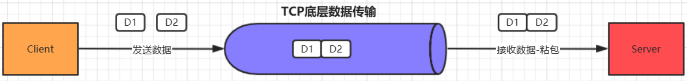

> 当前位置：【Java】09_Architecture_Distributed（分布式架构） -> 9.2_Netty（分布式网络通信）


# 第一章 Netty 简介

## 1、原生 NIO 的问题

```
（1）NIO 的类库和 API 繁杂，使用麻烦
- 需要熟练掌握 Selector、ServerSocketChannel、SocketChannel、ByteBuffer等

（2）需要具备其他的额外技能
- 要熟悉 Java 多线程编程，因为 NIO 编程涉及到 Reactor 模式，必须对多线程和网络编程非常熟悉，才能编写出高质量的 NIO 程序

（3）开发工作量和难度都非常大
- 例如客户端面临断连重连、网络闪断、半包读写、失败缓存、网络拥塞和异常流的处理等等

（4）JDK NIO 的 Bug
- 臭名昭著的 Epoll Bug，它会导致 Selector 空轮询，最终导致 CPU 100%，直到JDK 1.7版本该问题仍旧存在，没有被根本解决
- Epoll Bug：在NIO中通过Selector的轮询当前是否有IO事件，根据JDK NIO api描述，Selector的select方法会一直阻塞，直到IO事件达到或超时，但是在Linux平台上这里有时会出现问题，在某些场景下select方法会直接返回，即使没有超时并且也没有IO事件到达，这就是著名的epollbug，这是一个比较严重的bug，它会导致线程陷入死循环，会让CPU飙到100%，极大地影响系统的可靠性，到目前为止，JDK都没有完全解决这个问题
```


## 2、Netty 概述

```
- Netty 是由 JBOSS 提供的一个 Java 开源框架
- Netty 提供异步的、基于事件驱动的网络应用程序框架，用以快速开发高性能、高可靠性的网络 IO 程序
- Netty 是一个基于 NIO 的网络编程框架，使用 Netty 可以快速、简单的开发出一个网络应用，相当于简化和流程化了 NIO 的开发过程
- 作为当前最流行的 NIO 框架，Netty 在互联网领域、大数据分布式计算领域、游戏行业、 通信行业等获得了广泛的应用，知名的 Elasticsearch 、Dubbo 框架内部都采用了 Netty
```


- 优点

```
- 设计优雅，提供阻塞和非阻塞的 Socket
- 零拷贝、提供灵活可拓展的事件模型
- 提供高度可定制的线程模型
- 具备更高的性能和更大的吞吐量，使用零拷贝技术最小化不必要的内存复制，减少资源的消耗
- 提供安全传输、压缩、大文件传输、编解码支持等等
- 支持多种主流协议（TCP、UDP、HTTP、WebSocket等）
- 预置多种编解码功能，支持用户开发私有协议
```


## 3、线程模型

### 3.1 线程模型类型

```
不同的线程模式，对程序的性能有很大影响，目前存在的线程模型有：
- 类型1：传统阻塞 I/O 服务模型
- 类型2：Reactor 模型

根据 Reactor 的数量和处理资源池线程的数量不同，有 3 种典型的实现
- 实现1：单 Reactor 单线程
- 实现2：单 Reactor 多线程
- 实现3：主从 Reactor 多线程
- 实现4：Netty 线程模型（基于主从 Reactor 多线程模式，并做了一定的改进）
```


### 3.2 类型1：传统阻塞 I/O 服务模型

```
采用阻塞 IO 模式获取输入的数据，每个连接都需要独立的线程完成数据的输入、业务处理和数据返回工作

存在问题:
- 当并发数很大，就会创建大量的线程，占用很大系统资源
- 连接创建后，如果当前线程暂时没有数据可读，该线程会阻塞在 read 操作，造成线程资源浪费
```


### 3.3 类型2：Reactor 模型

```
- Reactor 模式：通过一个或多个输入同时传递给服务处理器的模式，服务器端程序处理传入的多个请求，并将它们同步分派到相应的处理线程， 因此 Reactor 模式也叫 Dispatcher模式

- Reactor 模式使用 IO 复用监听事件，收到事件后，分发给某个线程(进程)，这点就是网络服务器高并发处理关键
```


#### 实现1：单 Reactor 单线程

- 流程

```
- Selector 可以实现应用程序通过一个阻塞对象监听多路连接请求
- Reactor 对象通过 Selector 监控客户端请求事件，收到事件后通过 Dispatch 进行分发是建立连接请求事件，由 Acceptor 通过 Accept 处理连接请求，然后创建一个 Handler 对象处理连接完成后的后续业务处理
- Handler 会完成 Read -> 业务处理 -> Send 的完整业务流程
```


- 优点

```
- 模型简单
- 没有多线程、进程通信、竞争的问题，全部都在一个线程中完成
```

- 缺点

```
- 性能问题: 只有一个线程，无法完全发挥多核 CPU 的性能，Handler 在处理某个连接上的业务时，整个进程无法处理其他连接事件，很容易导致性能瓶颈

- 可靠性问题: 线程意外终止或者进入死循环，会导致整个系统通信模块不可用，不能接收和处理外部消息，造成节点故障
```


#### 实现2：单 Reactor 多线程

- 流程

```
Reactor 对象通过 selector 监控客户端请求事件, 收到事件后，通过 dispatch 进行分发
- 如果建立连接请求, 则由 Acceptor 通过 accept 处理连接请求
- 如果不是连接请求，则由 reactor 分发调用连接对应的 handler 来处理
- handler 只负责响应事件，不做具体的业务处理, 通过 read 读取数据后，会分发给后面的

worker 线程池的某个线程处理业务
- worker 线程池会分配独立线程完成真正的业务，并将结果返回给 handler
- handler 收到响应后，通过 send 将结果返回给 client
```


- 优点

```
- 可以充分的利用多核 cpu 的处理能力
```

- 缺点

```
- 多线程数据共享和访问比较复杂，reactor 处理所有的事件的监听和响应，在单线程运行，在高并发场景容易出现性能瓶颈
```


#### 实现3：主从 Reactor 多线程

- 流程

```
- Reactor 主线程 MainReactor 对象通过 select 监听客户端连接事件，收到事件后，通过 Acceptor 处理客户端连接事件

- 当 Acceptor 处理完客户端连接事件之后（与客户端建立好 Socket 连接），MainReactor 将连接分配给 SubReactor（即：MainReactor 只负责监听客户端连接请求，和客户端建立连接之后将连接交由 SubReactor 监听后面的 IO 事件)

- SubReactor 将连接加入到自己的连接队列进行监听，并创建 Handler 对各种事件进行处理
- 当连接上有新事件发生的时候，SubReactor 就会调用对应的 Handler 处理
- Handler 通过 read 从连接上读取请求数据，将请求数据分发给 Worker 线程池进行业务处理
- Worker 线程池会分配独立线程来完成真正的业务处理，并将处理结果返回给 Handler
- Handler 通过 send 向客户端发送响应数据
- 一个 MainReactor 可以对应多个 SubReactor，即一个 MainReactor 线程可以对应多个 SubReactor 线程
```


- 优点

```
- MainReactor 线程与 SubReactor 线程的数据交互简单职责明确，MainReactor 线程只需要接收新连接，SubReactor 线程完成后续的业务处理

- MainReactor 线程与 SubReactor 线程的数据交互简单， MainReactor 线程只需要把新连接传给 SubReactor 线程，SubReactor 线程无需返回数据

- 多个 SubReactor 线程能够应对更高的并发请求
```

- 缺点

```
- 编程复杂度较高

但是由于其优点明显，在许多项目中被广泛使用，包括Nginx、Memcached、Netty 等。这种模式也被叫做服务器的 1+M+N 线程模式，即使用该模式开发的服务器包含一个（或多个，1 只是表示相对较少）连接建立线程 + M个IO线程 + N个业务处理线程。这是业界成熟的服务器程序设计模式。
```


#### 实现4：Netty 线程模型

##### （1）简单版 Netty 模型


```
- BossGroup 线程维护 Selector，ServerSocketChannel 注册到这个 Selector 上，只关注连接建立请求事件（主 Reactor）

- 当接收到来自客户端的连接建立请求事件的时候，通过 ServerSocketChannel.accept 方法获得对应的 SocketChannel，并封装成 NioSocketChannel 注册到 WorkerGroup 线程中的 Selector，每个 Selector 运行在一个线程中（从 Reactor） 

- 当 WorkerGroup 线程中的 Selector 监听到自己感兴趣的 IO 事件后，就调用 Handler 进行处理
```


##### （2）进阶版 Netty 模型


```
有两组线程池：BossGroup 和 WorkerGroup
- BossGroup 中的线程专门负责和客户端建立连接
- WorkerGroup 中的线程专门负责处理连接上的读写

BossGroup 和 WorkerGroup 含有多个不断循环的执行事件处理的线程，每个线程都包含一个 Selector，用于监听注册在其上的 Channel

每个 BossGroup 中的线程循环执行以下三个步骤
- 轮询注册在其上的 ServerSocketChannel 的 accept 事件（OP_ACCEPT 事件）
- 处理 accept 事件，与客户端建立连接，生成一个 NioSocketChannel，并将其注册到 WorkerGroup 中某个线程上的 Selector 
- 再去以此循环处理任务队列中的下一个事件

每个 WorkerGroup 中的线程循环执行以下三个步骤
- 轮询注册在其上的 NioSocketChannel 的 read/write 事件（OP_READ/OP_WRITE 事件）
- 在对应的 NioSocketChannel 上处理 read/write 事件
- 再去以此循环处理任务队列中的下一个事件
```


##### （3）详细版 Netty 模型


```
Netty 抽象出两组线程池：BossGroup 和 WorkerGroup，也可以叫做 BossNioEventLoopGroup 和 WorkerNioEventLoopGroup

每个线程池中都有 NioEventLoop 线程

BossGroup 中的线程专门负责和客户端建立连接，WorkerGroup 中的线程专门负责处理连接上的读写

BossGroup 和 WorkerGroup 的类型都是 NioEventLoopGroup

NioEventLoopGroup 相当于一个事件循环组，这个组中含有多个事件循环，每个事件循环就是一个 NioEventLoop

NioEventLoop 表示一个不断循环的执行事件处理的线程，每个 NioEventLoop 都包含一个 Selector，用于监听注册在其上的 Socket 网络连接（Channel）

NioEventLoopGroup 可以含有多个线程，即可以含有多个 NioEventLoop

每个 BossNioEventLoop 中循环执行以下三个步骤
- select：轮训注册在其上的 ServerSocketChannel 的 accept 事件（OP_ACCEPT 事件）
- processSelectedKeys：处理 accept 事件，与客户端建立连接，生成一个NioSocketChannel，并将其注册到某个WorkerNioEventLoop 上的 Selector 上
- runAllTasks：再去以此循环处理任务队列中的其他任务

每个 WorkerNioEventLoop 中循环执行以下三个步骤
- select：轮训注册在其上的 NioSocketChannel 的 read/write 事件（OP_READ/OP_WRITE 事件）
- processSelectedKeys：在对应的 NioSocketChannel 上处理 read/write 事件
- runAllTasks：再去以此循环处理任务队列中的其他任务

在以上两个 processSelectedKeys 步骤中，会使用 Pipeline（管道），Pipeline 中引用了 Channel，即通过 Pipeline 可以获取到对应的 Channel，Pipeline 中维护了很多的处理器（拦截处理器、过滤处理器、自定义处理器等）
```


## 4、Netty API

### 4.1 ChannelHandler 接口


- Netty 开发中需要自定义一个 Handler 类去实现 ChannelHandle 接口或其子接口或其实现类，然后重写相应方法实现业务逻辑

```java
// 通道就绪事件
public void channelActive(ChannelHandlerContext ctx)
  
// 通道读取数据事件  
public void channelRead(ChannelHandlerContext ctx, Object msg)
  
// 数据读取完毕事件  
public void channelReadComplete(ChannelHandlerContext ctx)
  
// 通道发生异常事件  
public void exceptionCaught(ChannelHandlerContext ctx, Throwable cause)
```


### 4.2 ChannelPipeline

- ChannelPipeline 是一个 Handler 的集合，它负责处理和拦截 inbound 或者 outbound 的事件和

  操作，相当于一个贯穿 Netty 的责任链

```
- 如果客户端和服务器的Handler是一样的，消息从客户端到服务端或者反过来，每个Inbound类型或Outbound类型的Handler只会经过一次

- 混合类型的Handler（实现了Inbound和Outbound的Handler）会经过两次。准确的说 ChannelPipeline 中是一个ChannelHandlerContext，每个上下文对象中有 ChannelHandler

- InboundHandler是按照Pipleline的加载顺序的顺序执行，OutboundHandler 是按照Pipeline的加载顺序，逆序执行
```


### 4.3 ChannelHandlerContext

- ChannelHandlerContext 事 件 处 理 器 上 下 文 对 象 ， Pipeline 链 中 的 实 际 处 理 节 点
- 每 个 处 理 节 点 ChannelHandlerContext 中 包 含 一 个 具 体 的 事 件 处 理 器 ChannelHandler，同时ChannelHandlerContext 中也绑定了对应的 ChannelPipeline和 Channel 的信息，方便对ChannelHandler 进行调用
- 常用方法

```java
// 关闭通道
ChannelFuture close()

// 刷新
ChannelOutboundInvoker flush()
  
// 将数据写到 ChannelPipeline 中，当前 ChannelHandler 的下一个 ChannelHandler 开始处理（出站）  
ChannelFuture writeAndFlush(Object msg)
```


### 4.4 ChannelOption

- Netty 在创建 Channel 实例后，一般都需要设置 ChannelOption 参数（ChannelOption 是 Socket 的标准参数，而非 Netty 独创的）

- 常用的参数配置

```properties
# 对应 TCP/IP 协议 listen 函数中的 backlog 参数，用来初始化服务器可连接队列大小。服务端处理客户端连接请求是顺序处理的，所以同一时间只能处理一个客户端连接。多个客户端来的时候，服务端将不能处理的客户端连接请求放在队列中等待处理，backlog 参数指定 了队列的大小。
ChannelOption.SO_BACKLOG

# 一直保持连接活动状态。
# 该参数用于设置TCP连接，当设置该选项以后，连接会测试链接的状态，这个选项用于可能长时间没有数据交流的连接。当设置该选项以后，如果在两小时内没有数据的通信时，TCP会自动发送一个活动探测数据报文。
ChannelOption.SO_KEEPALIVE
```


### 4.5 ChannelFuture

- 表示 Channel 中异步 I/O 操作的结果，在 Netty 中所有的 I/O 操作都是异步的，I/O 的调用会直接返回，调用者并不能立刻获得结果，但是可以通过 ChannelFuture 来获取 I/O 操作 的处理状态。

- 常用方法

```java
// 返回当前正在进行 IO 操作的通道
Channel channel()

// 等待异步操作执行完毕，将异步改为同步
ChannelFuture sync()
```


### 4.6 EventLoopGroup 和实现类 NioEventLoopGroup

- EventLoopGroup 是一组 EventLoop 的抽象，Netty 为了更好的利用多核 CPU 资源，一般会有多个EventLoop 同时工作，每个 EventLoop 维护着一个 Selector 实例
- EventLoopGroup 提供 next 接口，可以从组里面按照一定规则获取其中一个 EventLoop 来处理任务

```
- 在 Netty 服务器端编程中，一般都需要提供两个 EventLoopGroup
- 例如：BossEventLoopGroup 和 WorkerEventLoopGroup

- 通常一个服务端口即一个 ServerSocketChannel 对应一个 Selector 和一个 EventLoop 线程
- BossEventLoop 负责接收客户端的连接并将 SocketChannel 交给 WorkerEventLoopGroup 来进行 IO 处理
```


- BossEventLoopGroup 通常是一个单线程的 EventLoop，EventLoop 维护着一个注册了ServerSocketChannel 的 Selector 实例，BossEventLoop 不断轮询 Selector 将连接事件分离出来， 通常是 OP_ACCEPT 事件，然后将接收到的 SocketChannel 交给 WorkerEventLoopGroup，WorkerEventLoopGroup 会由 next 选择其中一个 EventLoopGroup 来将这个 SocketChannel 注册到其维护的 Selector 并对其后续的 IO 事件进行处理。一般情况下我们都是用实现类NioEventLoopGroup
- 常用方法

```java
// 构造方法，创建线程组
public NioEventLoopGroup()

// 断开连接，关闭线程
public Future<?> shutdownGracefully()
```


### 4.7 ServerBootstrap 和 Bootstrap

- ServerBootstrap 是 Netty 中的服务器端启动助手，通过它可以完成服务器端的各种配置
- Bootstrap 是 Netty 中的客户端启动助手，通过它可以完成客户端的各种配置
- 常用方法

```java
// 该方法用于服务器端，用来设置两个 EventLoop
public ServerBootstrap group(EventLoopGroup parentGroup, EventLoopGroup childGroup)

// 该方法用于客户端，用来设置一个 EventLoop  
public B group(EventLoopGroup group)

// 该方法用来设置一个服务器端的通道实现  
public B channel(Class<? extends C> channelClass)

// 用来给 ServerChannel 添加配置  
public B option(ChannelOption option, T value)

// 用来给接收到的通道添加配置  
public ServerBootstrap childOption(ChannelOption childOption, T value)

// 该方法用来设置业务处理类（自定义的 handler)  
public ServerBootstrap childHandler(ChannelHandler childHandler)

// 该方法用于服务器端，用来设置占用的端口号  
public ChannelFuture bind(int inetPort) 

// 该方法用于客户端，用来连接服务器端 
public ChannelFuture connect(String inetHost, int inetPort)
```


### 4.8 Unpooled

- Netty 提供的一个专门用来操作缓冲区的工具类
- 常用方法

```java
// 通过给定的数据和字符编码返回一个 ByteBuf 对象（类似于 NIO 中的 ByteBuffer 对象）
public static ByteBuf copiedBuffer(CharSequence string, Charset charset)
```


## 5、Netty 异步模型

- 异步的概念和同步相对。当一个异步过程调用发出后，调用者不能立刻得到结果。实际处理这个调用的组件在完成后，通过状态、通知和回调来通知调用者。

- Netty 中的 I/O 操作是异步的，包括 Bind、Write、Connect 等操作会简单的返回一个ChannelFuture。调用者并不能立刻获得结果，而是通过 Future-Listener 机制，用户可以方便的主动获取或者通过通知机制获得IO 操作结果. Netty 的异步模型是建立在 future 和 callback 的之上的。callback 就是回调。重点说 Future，它的核心思想是：假设一个方法 fun，计算过程可能非常耗时，等待 fun 返回显然不合适。那么可以在调用 fun 的时候，立马返回一个 Future，后续可以通过 Future 去监控方法 fun 的处理过程(即 ： Future-Listener 机制)


### 5.1 Future

- 表示异步的执行结果, 可以通过它提供的方法来检测执行是否完成，ChannelFuture 是他的一个子接口.
- ChannelFuture 是一个接口 ,可以添加监听器，当监听的事件发生时，就会通知到监听器当 Future 对象刚刚创建时，处于非完成状态，调用者可以通过返回的 ChannelFuture 来获取操作执行的状态， 注册监听函数来执行完成后的操作。

- 常用方法

```java
// 阻塞等待程序结果反回
sync 方法

// 判断当前操作是否完成
isDone 方法

// 判断已完成的当前操作是否成功  
isSuccess 方法

// 获取已完成的当前操作失败的原因  
getCause 方法

// 判断已完成的当前操作是否被取消  
isCancelled 方法
  
// 注册监听器，当操作已完成(isDone 方法返回完成)，将会通知指定的监听器；如果Future 对象已完成，则通知指定的监听器  
addListener 方法
```


### 5.2 Future-Listener 机制

- 给Future添加监听器，监听操作结果


## 6、Netty 编解码器

### 6.0  Java 编解码

- 编码（Encode）称为序列化， 它将对象序列化为字节数组，用于网络传输、数据持久化或者其它用途。
- 解码（Decode）称为反序列化，它把从网络、磁盘等读取的字节数组还原成原始对象（通常是原始对象的拷贝），以方便后续的业务逻辑操作。

```
- java序列化对象只需要实现java.io.Serializable接口并生成序列化ID，这个类就能够通过java.io.ObjectInput和java.io.ObjectOutput序列化和反序列化。

Java序列化目的：
1.网络传输
2.对象持久化。

Java序列化缺点：
1.无法跨语言。 
2.序列化后码流太大。
3.序列化性能太低。

Java序列化仅仅是Java编解码技术的一种，由于它的种种缺陷，衍生出了多种编解码技术和框架，这些编解码框架实现消息的高效序列化。
```


### 6.1 Netty 编解码器 - 概述

- 在网络应用中需要实现某种编解码器，将原始字节数据与自定义的消息对象进行互相转换。网络中都是以字节码的数据形式来传输数据的，服务器编码数据后发送到客户端，客户端需要对数据进行解码。

- 对于Netty而言，编解码器由两部分组成：编码器、解码器。

```
解码器：负责将消息从字节或其他序列形式转成指定的消息对象。（负责处理“入站 InboundHandler” 数据）
编码器：将消息对象转成字节或其他序列形式在网络上传输。（负责“出站 OutboundHandler”数据）
```

- Netty 的编（解）码器实现了 ChannelHandlerAdapter，也是一种特殊的 ChannelHandler，所以依赖于 ChannelPipeline，可以将多个编（解）码器链接在一起，以实现复杂的转换逻辑。


### 6.2 Netty 编解码器 - 解码器 Decoder

- 解码器负责解码“入站”数据从一种格式到另一种格式，解码器处理入站数据是抽象 ChannelInboundHandler的实现。需要将解码器放在ChannelPipeline中。

- 对于解码器，Netty中主要提供了抽象基类 ByteToMessageDecoder 和 MessageToMessageDecoder

  

- 抽象解码器

```java
// 用于将字节转为消息，需要检查缓冲区是否有足够的字节
ByteToMessageDecoder

// 继承ByteToMessageDecoder，不需要检查缓冲区是否有足够的字节，但是 ReplayingDecoder 速度略慢于ByteToMessageDecoder，同时不是所有的ByteBuf都支持，项目复杂性高则使用 ReplayingDecoder，否则使用ByteToMessageDecoder
ReplayingDecoder

// 用于从一种消息解码为另外一种消息（例如POJO到POJO）
MessageToMessageDecoder
```

- 核心方法

```java
decode(ChannelHandlerContext ctx, ByteBuf msg, List<Object> out)
```


### 6.3 Netty 编解码器 - 编码器 Encoder

- 与 ByteToMessageDecoder 和 MessageToMessageDecoder 相对应，Netty 提供了对应的编码器实现MessageToByteEncoder和MessageToMessageEncoder，二者都实现 ChannelOutboundHandler接口


- 抽象编码器

```java
// 将消息转化成字节
MessageToByteEncoder

// 用于从一种消息编码为另外一种消息（例如POJO到POJO）  
MessageToMessageEncoder
```

- 核心方法

```java
encode(ChannelHandlerContext ctx, String msg, List<Object> out)
```


### 6.4 Netty 编解码器 - 编码解码器Codec

- 编码解码器: 同时具有编码与解码功能
- 特点：同时实现了ChannelInboundHandlerChannelOutboundHandler接口，因此在数据输入和输出时都能进行处理

- Netty 提供提供了一个 ChannelDuplexHandler 适配器类，编码解码器的抽象基类 ByteToMessageCodec ，MessageToMessageCodec都继承与此类


## 7、Netty 中粘包和拆包的解决方案

### 7.1 概述

- 粘包和拆包是TCP网络编程中不可避免的，无论是服务端还是客户端，当我们读取或者发送消息的时候，都需要考虑TCP底层的粘包/拆包机制。
- TCP是个“流”协议，所谓流，就是没有界限的一串数据。TCP底层并不了解上层业务数据的具体含义，它会根据TCP缓冲区的实际情况进行包的划分，所以在业务上认为，一个完整的包可能会被TCP拆分成多个包进行发送，也有可能把多个小的包封装成一个大的数据包发送，这就是所谓的TCP粘包和拆包问题。


### 7.2 图解

- 假设客户端分别发送了两个数据包D1和D2给服务端，由于服务端一次读取到的字节数是不确定的，故可能存在以下4种情况。

（1）服务端分两次读取到了两个独立的数据包，分别是D1和D2，没有粘包和拆包


（2）服务端一次接收到了两个数据包，D1和D2粘合在一起，被称为TCP 粘包



（3）如果D2的数据包比较大, 服务端分两次读取到了两个数据包，第一次读取到了完整的D1包和D2包的部分内容，第二次读取到了D2包的剩余内容，这被称为TCP 拆包


（4）如果D1, D2的数据包都很大，服务端分多次才能将D1和D2包接收完全，期间发生多次拆包


### 7.3 TCP 粘包和拆包产生的原因

- 数据从发送方到接收方需要经过操作系统的缓冲区，而造成粘包和拆包的主要原因就在这个缓冲区上。
- 粘包可以理解为缓冲区数据堆积，导致多个请求数据粘在一起
- 拆包可以理解为发送的数据大于缓冲区，进行拆分处理


### 7.4 粘包和拆包的解决方法

#### （1）业内解决方案

- 由于底层的TCP无法理解上层的业务数据，所以在底层是无法保证数据包不被拆分和重组的，这个问题只能通过上层的应用协议栈设计来解决，根据业界的主流协议的解决方案，可以归纳如下

```
- 消息长度固定，累计读取到长度和为定长LEN的报文后，就认为读取到了一个完整的信息
- 将换行符作为消息结束符
- 将特殊的分隔符作为消息的结束标志，回车换行符就是一种特殊的结束分隔符
- 通过在消息头中定义长度字段来标识消息的总长度
```


#### （2）Netty中的粘包和拆包解决方案

- Netty提供了4种解码器来解决

```
- 固定长度的拆包器 FixedLengthFrameDecoder，每个应用层数据包的都拆分成都是固定长度的大小
- 行拆包器 LineBasedFrameDecoder，每个应用层数据包，都以换行符作为分隔符，进行分割拆分
- 分隔符拆包器 DelimiterBasedFrameDecoder，每个应用层数据包，都通过自定义的分隔符，进行分割拆分
- 基于数据包长度的拆包器 LengthFieldBasedFrameDecoder，将应用层数据包的长度，作为接收端应用层数据包的拆分依据。按照应用层数据包的大小，拆包。这个拆包器，有一个要求，就是应用层协议中包含数据包的长度
```


# 第二章 Netty 开发案例 

## 1、Netty 开发案例 - 入门

### （1）依赖包

```xml
<dependency>
  <groupId>io.netty</groupId>
  <artifactId>netty-all</artifactId>
  <version>4.1.42.Final</version>
</dependency>
```

### （2）服务端实现步骤

```
1. 创建bossGroup线程组: 处理网络事件--连接事件
2. 创建workerGroup线程组: 处理网络事件--读写事件
3. 创建服务端启动助手
4. 设置bossGroup线程组和workerGroup线程组
5. 设置服务端通道实现为NIO
6. 参数设置
7. 创建一个通道初始化对象
8. 向pipeline中添加自定义业务处理handler
9. 启动服务端并绑定端口,同时将异步改为同步
10. 关闭通道和关闭连接池
```

### （3）客户端实现步骤

```
1. 创建线程组
2. 创建客户端启动助手
3. 设置线程组
4. 设置客户端通道实现为NIO
5. 创建一个通道初始化对象
6. 向pipeline中添加自定义业务处理handler
7. 启动客户端,等待连接服务端,同时将异步改为同步
8. 关闭通道和关闭连接池
```


## 2、基于 Netty 的群聊天室

- NettyChatClientHandler.java

```java
package com.loto.netty.c.chat;

import io.netty.channel.ChannelHandlerContext;
import io.netty.channel.SimpleChannelInboundHandler;

/**
 * 聊天室处理类
 */
public class NettyChatClientHandler extends SimpleChannelInboundHandler<String> {
    /**
     * 通道读取就绪事件
     *
     * @param ctx
     * @param msg
     * @throws Exception
     */
    @Override
    protected void channelRead0(ChannelHandlerContext ctx, String msg) throws Exception {
        System.out.println(msg);
    }
}
```

- NettyChatServerHandler.java

```java
package com.loto.netty.c.chat;

import io.netty.channel.Channel;
import io.netty.channel.ChannelHandlerContext;
import io.netty.channel.SimpleChannelInboundHandler;

import java.util.ArrayList;
import java.util.List;

/**
 * 聊天室业务处理类
 */
public class NettyChatServerHandler extends SimpleChannelInboundHandler<String> {
    public static List<Channel> channelList = new ArrayList<>();

    /**
     * 通道就绪事件
     *
     * @param ctx
     * @throws Exception
     */
    @Override
    public void channelActive(ChannelHandlerContext ctx) throws Exception {
        Channel channel = ctx.channel();

        // 当有新的客户端连接的时候, 将通道放入集合
        channelList.add(channel);
        System.out.println("[Server]:" + channel.remoteAddress().toString().substring(1) + "在线.");
    }

    /**
     * 通道未就绪（channel下线）
     *
     * @param ctx
     * @throws Exception
     */
    @Override
    public void channelInactive(ChannelHandlerContext ctx) throws Exception {
        Channel channel = ctx.channel();

        // 当有客户端断开连接的时候,就移除对应的通道
        channelList.remove(channel);
        System.out.println("[Server]:" + channel.remoteAddress().toString().substring(1) + "下线.");
    }

    /**
     * 通道读取事件
     *
     * @param ctx
     * @param msg
     * @throws Exception
     */
    @Override
    protected void channelRead0(ChannelHandlerContext ctx, String msg) throws Exception {
        // 当前发送消息的通道, 当前发送的客户端连接
        Channel channel = ctx.channel();
        for (Channel channel1 : channelList) {
            // 排除自身通道
            if (channel != channel1) {
                channel1.writeAndFlush("[" + channel.remoteAddress().toString().substring(1) + "]说:" + msg);
            }
        }
    }

    /**
     * 异常处理事件
     *
     * @param ctx
     * @param cause
     * @throws Exception
     */
    @Override
    public void exceptionCaught(ChannelHandlerContext ctx, Throwable cause) throws Exception {
        cause.printStackTrace();
        Channel channel = ctx.channel();
        // 移除集合
        channelList.remove(channel);
        System.out.println("[Server]:" + channel.remoteAddress().toString().substring(1) + "异常.");
    }
}
```


## 3、基于 Netty 的 Http 服务器开发

- NettyHttpServerHandler.java

```java
package com.loto.netty.d.http;

import io.netty.buffer.ByteBuf;
import io.netty.buffer.Unpooled;
import io.netty.channel.ChannelHandlerContext;
import io.netty.channel.SimpleChannelInboundHandler;
import io.netty.handler.codec.http.*;
import io.netty.util.CharsetUtil;

/**
 * http服务器处理类
 */
public class NettyHttpServerHandler extends SimpleChannelInboundHandler<HttpObject> {
    /**
     * 读取就绪事件
     *
     * @param ctx
     * @param msg
     * @throws Exception
     */
    @Override
    protected void channelRead0(ChannelHandlerContext ctx, HttpObject msg) throws Exception {
        // 1.判断请求是不是HTTP请求
        if (msg instanceof HttpRequest) {
            DefaultHttpRequest request = (DefaultHttpRequest) msg;
            System.out.println("浏览器请求路径:" + request.uri());
            if ("/favicon.ico".equals(request.uri())) {
                System.out.println("图标不响应");
                return;
            }

            // 2.给浏览器进行响应
            ByteBuf byteBuf = Unpooled.copiedBuffer("Hello! 我是Netty服务器 ", CharsetUtil.UTF_8);
            DefaultFullHttpResponse response = new DefaultFullHttpResponse(HttpVersion.HTTP_1_1, HttpResponseStatus.OK, byteBuf);

            // 2.1 设置响应头
            response.headers().set(HttpHeaderNames.CONTENT_TYPE, "text/html;charset=utf-8");
            response.headers().set(HttpHeaderNames.CONTENT_LENGTH, byteBuf.readableBytes());
            ctx.writeAndFlush(response);
        }
    }
}
```


## 4、基于 Netty 的 WebSocket 开发网页版聊天室


## 5、基于 Netty 实现 RPC 框架


# 第三章 Netty 源码分析


