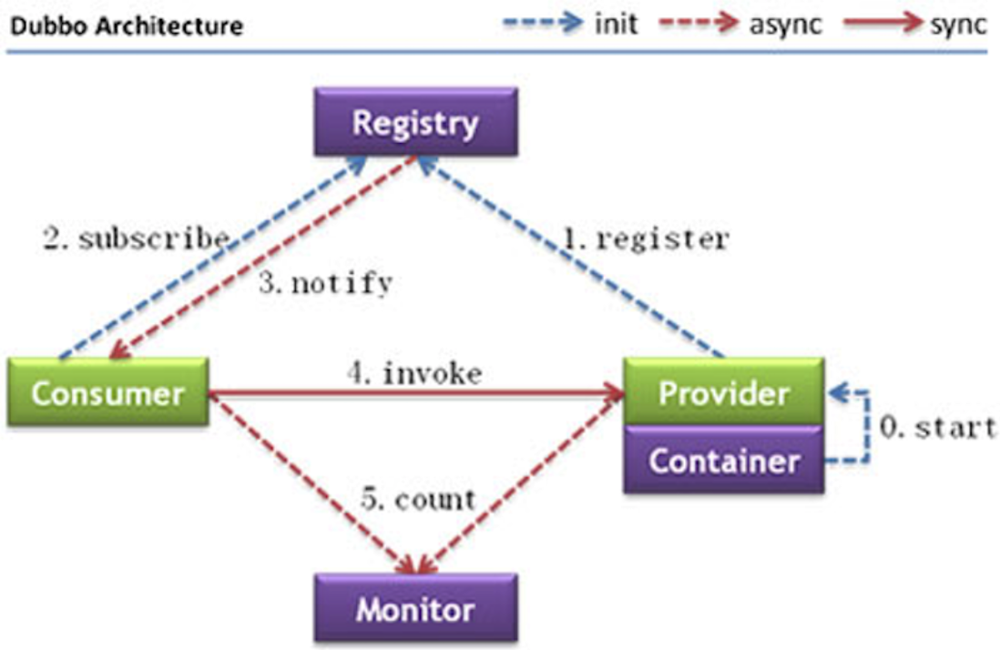

> 当前位置：【Java】09_Architecture_Distributed（分布式架构） -> 9.5_Dubbo


# 第一章 Dubbo 简介

## 1、Dubbo 概述

### 1.1 Dubbo

- Apache Dubbo是一款高性能的Java RPC框架
- 其前身是阿里巴巴公司开源的一个高性能、轻量级的开源Java RPC框架，可以和Spring框架无缝集成。


### 1.2 Dubbo 特性

- https://dubbo.apache.org/zh/

```xml
（1）面向接口代理的高性能RPC调用
- 提供高性能的基于代理的远程调用能力，服务以接口为粒度，为开发者屏蔽远程调用底层细节。

（2）智能负载均衡
- 内置多种负载均衡策略，智能感知下游节点健康状况，显著减少调用延迟，提高系统吞吐量。

（3）服务自动注册与发现
- 支持多种注册中心服务，服务实例上下线实时感知。

（4）高度可扩展能力
- 遵循微内核+插件的设计原则，所有核心能力如Protocol、Transport、Serialization被设计为扩展点，平等对待内置实现和第三方实现。

（5）运行期流量调度
- 内置条件、脚本等路由策略，通过配置不同的路由规则，轻松实现灰度发布，同机房优先等功能。

（6）可视化的服务治理与运维
- 提供丰富服务治理、运维工具：随时查询服务元数据、服务健康状态及调用统计，实时下发路由策略、调整配置参数。
- 服务治理（SOA governance），企业为了确保项目顺利完成而实施的过程，包括最佳实践、架构原则、治理规程、规律以及其他决定性的因素。服务治理指的是用来管理SOA的采用和实现的过程
```


## 2、Dubbo 处理流程

### 2.1 关系流程图



### 2.2 调用关系说明

- 虚线：代表异步调用
- 实线：代表同步访问
- 蓝色虚线：是在启动时完成的功能
- 红色虚线：是程序运行中执行的功能


### 2.3 节点说明

| 节点名称  | 作用                                             |
| --------- | ------------------------------------------------ |
| Container | 服务运行==容器==，负责启动、加载、运行服务提供者 |
| Provider  | 暴露服务的服务==提供方==                         |
| Registry  | 服务注册与发现的==注册中心==                     |
| Consumer  | 调用远程服务的服务==消费方==                     |
| Monitor   | 统计服务的调用次调和调用时间的==监控中心==       |


### 2.4 调用流程

- 服务提供者在服务容器启动时 向注册中心 注册自己提供的服务
- 服务消费者在启动时 向注册中心订阅自己所需的服务
- 注册中心返回服务提供者地址列表给消费者 如果有变更 注册中心会基于长连接推送变更数据给消费者
- 服务消费者 从提供者地址列表中 基于软负载均衡算法 选一台提供者进行调用 如果调用失败 则重新选择一台
- 服务提供者和消费者 在内存中的调用次数 和 调用时间 定时每分钟发送给监控中心


## 3、Dubbo 注册中心（zookeeper）


## 4、Dubbo 管理控制台（dubbo-admin）


## 5、Dubbo 配置项说明


## 6、Dubbo 开发案例


# 第二章 Dubbo 应用

## 1、Dubbo SPI


## 2、Dubbo 负载均衡策略


## 3、Dubbo 异步调用


## 4、Dubbo 线程池


## 5、Dubbo 路由规则


## 6、Dubbo 服务动态降级


# 第三章 Dubbo 源码

## 1、Dubbo 源码下载和编译环境


## 2、Dubbo 整体架构设计
