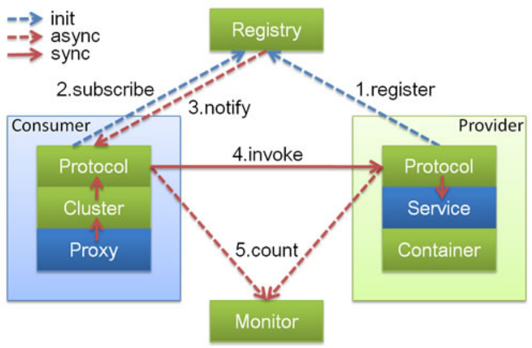
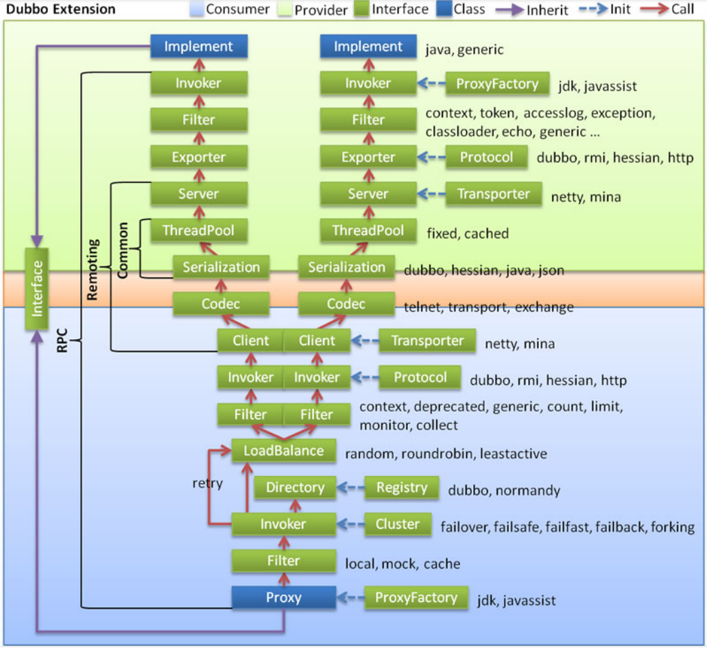
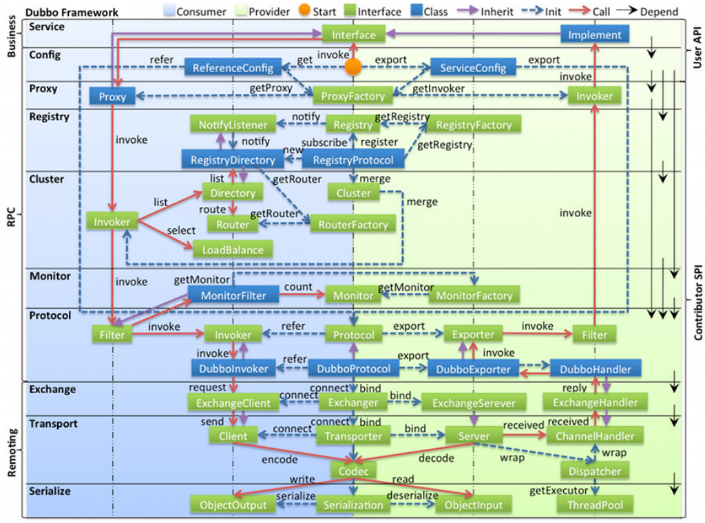
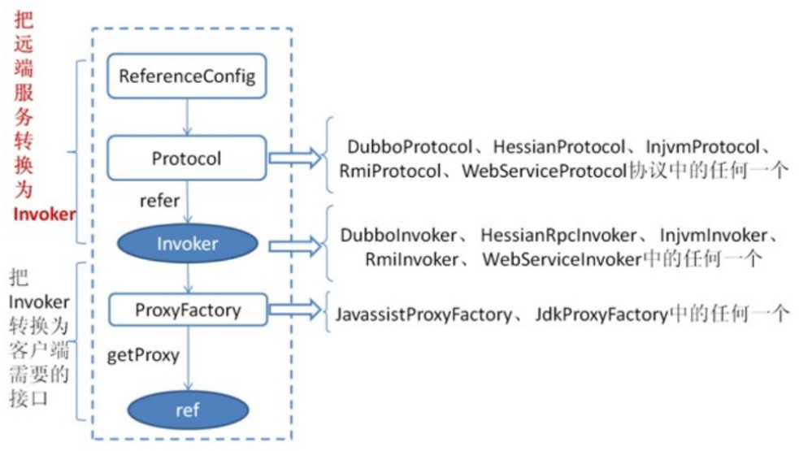
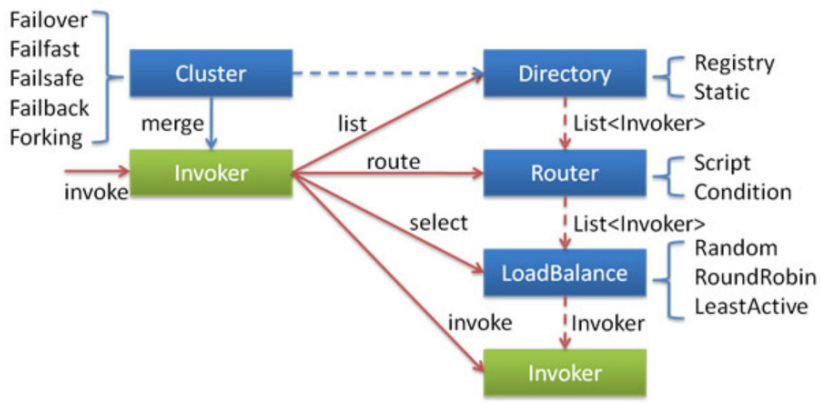
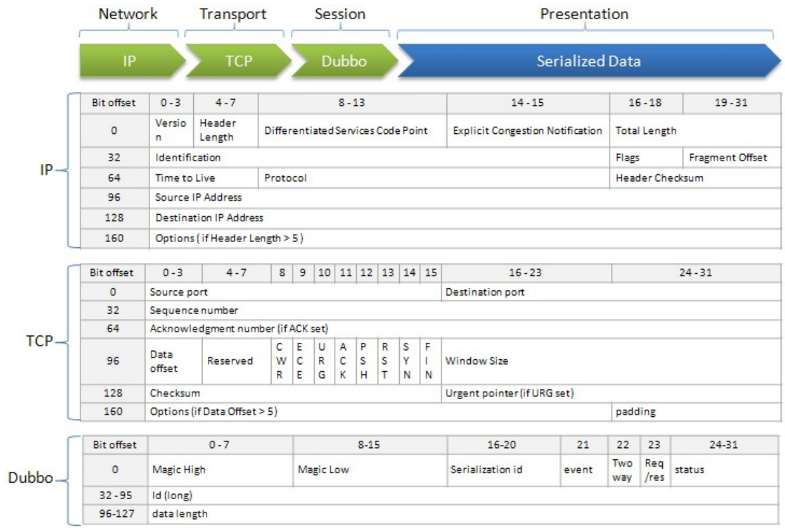

> 当前位置：【Java】09_Architecture_Distributed（分布式架构） -> 9.5_Dubbo


# 第一章 Dubbo 简介

## 1、Dubbo 概述

### 1.1 Dubbo

- Apache Dubbo是一款高性能的Java RPC框架
- 其前身是阿里巴巴公司开源的一个高性能、轻量级的开源Java RPC框架，可以和Spring框架无缝集成。


### 1.2 Dubbo 特性

- https://dubbo.apache.org/zh/

```xml
（1）面向接口代理的高性能RPC调用
- 提供高性能的基于代理的远程调用能力，服务以接口为粒度，为开发者屏蔽远程调用底层细节。

（2）智能负载均衡
- 内置多种负载均衡策略，智能感知下游节点健康状况，显著减少调用延迟，提高系统吞吐量。

（3）服务自动注册与发现
- 支持多种注册中心服务，服务实例上下线实时感知。

（4）高度可扩展能力
- 遵循微内核+插件的设计原则，所有核心能力如Protocol、Transport、Serialization被设计为扩展点，平等对待内置实现和第三方实现。

（5）运行期流量调度
- 内置条件、脚本等路由策略，通过配置不同的路由规则，轻松实现灰度发布，同机房优先等功能。

（6）可视化的服务治理与运维
- 提供丰富服务治理、运维工具：随时查询服务元数据、服务健康状态及调用统计，实时下发路由策略、调整配置参数。
- 服务治理（SOA governance），企业为了确保项目顺利完成而实施的过程，包括最佳实践、架构原则、治理规程、规律以及其他决定性的因素。服务治理指的是用来管理SOA的采用和实现的过程
```


## 2、Dubbo 处理流程

### 2.1 关系流程图


### 2.2 调用关系说明

- 虚线：代表异步调用
- 实线：代表同步访问
- 蓝色虚线：是在启动时完成的功能
- 红色虚线：是程序运行中执行的功能


### 2.3 节点说明

| 节点名称  | 作用                                             |
| --------- | ------------------------------------------------ |
| Container | 服务运行==容器==，负责启动、加载、运行服务提供者 |
| Provider  | 暴露服务的服务==提供方==                         |
| Registry  | 服务注册与发现的==注册中心==                     |
| Consumer  | 调用远程服务的服务==消费方==                     |
| Monitor   | 统计服务的调用次调和调用时间的==监控中心==       |


### 2.4 调用流程

- 服务提供者在服务容器启动时 向注册中心 注册自己提供的服务
- 服务消费者在启动时 向注册中心订阅自己所需的服务
- 注册中心返回服务提供者地址列表给消费者 如果有变更 注册中心会基于长连接推送变更数据给消费者
- 服务消费者 从提供者地址列表中 基于软负载均衡算法 选一台提供者进行调用 如果调用失败 则重新选择一台
- 服务提供者和消费者 在内存中的调用次数 和 调用时间 定时每分钟发送给监控中心


## 3、Dubbo 注册中心（zookeeper）


## 4、Dubbo 管理控制台（dubbo-admin）


## 5、Dubbo 配置项说明


## 6、Dubbo URL 规则详解

- Dubbo 中的URL与java中的URL是有一些区别的
  - 提供了针对于参数的 parameter 的增加和减少(支持动态更改)
  - 提供缓存功能，对一些基础的数据做缓存

```properties
protocol://host:port/path?key=value&key=value 
provider://192.168.20.1:20883/com.lagou.service.HelloService? anyhost=true&application=service- provider2&bind.ip=192.168.20.1&bind.port=20883&category=configurators&check=fals e&deprecated=false&dubbo=2.0.2&dynamic=true&generic=false&interface=com.lagou.se rvice
```


### （1）protocol

- 协议，一般像 provider 或者 consumer 在这里都是人为具体的协议


### （2）host

- 当前 provider 或者其他协议所具体针对的地址，比较特殊的像 override 协议所指定的
- host 就是 0.0.0.0 代表所有的机器都生效


### （3）port

- 代表所处理的端口号


### （4）path

- 服务路径，在 provider 或者 consumer 等其他中代表着真实的业务接口


### （5）key=value

- 代表具体的参数，可以理解为对这个地址的配置。比如 provider 中需要具体机器的服务应用名，就可以是一个配置的方式设置上去


## 7、Dubbo 开发案例


# 第二章 Dubbo 应用

## 1、Dubbo SPI


## 2、Dubbo 负载均衡策略


## 3、Dubbo 异步调用


## 4、Dubbo 线程池


## 5、Dubbo 路由规则


## 6、Dubbo 服务动态降级


# 第三章 Dubbo 架构设计

## 1、Dubbo 调用关系说明

### （0）启动和执行流程说明

```
提供者端启动 容器负责把Service信息加载 并通过Protocol 注册到注册中心

消费者端启动 通过监听提供者列表来感知提供者信息 并在提供者发生改变时 通过注册中心及时通知消费端

消费方发起 请求 通过Proxy模块

利用Cluster模块 来选择真实的要发送给的提供者信息

交由Consumer中的Protocol 把信息发送给提供者

提供者同样需要通过 Protocol 模块来处理消费者的信息

最后由真正的服务提供者 Service 来进行处理
```



### （1）Provider：暴露服务的服务提供方

- Protocol：负责提供者和消费者之间协议交互数据
- Service：真实的业务服务信息，可以理解成接口 和 实现
- Container：Dubbo的运行环境 


### （2）Consumer：调用远程服务的服务消费方

- Protocol 负责提供者和消费者之间协议交互数据
- Cluster 感知提供者端的列表信息、
- Proxy 可以理解成 提供者的服务调用代理类 由它接管 Consumer中的接口调用逻辑


### （3）Registry：注册中心

- 用于作为服务发现和路由配置等工作，提供者和消费者都会在这里进行注册


### （4）Monitor：监控中心

- 用于提供者和消费者中的数据统计，比如调用频次，成功失败次数等信息。


## 2、Dubbo 调用链路

### 2.1 说明

```
淡绿色：服务生产者的范围
淡蓝色：代表了服务消费者的范围
红色箭头：代表了调用的方向 

业务逻辑层
RPC层(远程过程调用) 
Remoting (远程数据传输)
```

 


### 2.2 调用的流程

```
1. 消费者通过Interface进行方法调用 统一交由消费者端的 Proxy 通过ProxyFactory 来进行代理对象的创建 使用到了 jdk javassist 技术

2.交给Filter 这个模块 做一个统一的过滤请求 在SPI案例中涉及过

3.接下来会进入最主要的Invoker调用逻辑
 通过Directory 去配置中新读取信息 最终通过list方法获取所有的Invoker
 通过Cluster模块 根据选择的具体路由规则 来选取Invoker列表
 通过LoadBalance模块 根据负载均衡策略 选择一个具体的Invoker 来处理我们的请求
 如果执行中出现错误 并且Consumer阶段配置了重试机制 则会重新尝试执行

4. 继续经过Filter 进行执行功能的前后封装 Invoker 选择具体的执行协议

5. 客户端 进行编码和序列化 然后发送数据

6. 到达Consumer中的 Server 在这里进行 反编码 和 反序列化的接收数据

7. 使用Exporter选择执行器 

8. 交给Filter 进行一个提供者端的过滤 到达 Invoker 执行器 

9. 通过Invoker 调用接口的具体实现 然后返回
```


# 第四章 Dubbo 源码

## 0、Dubbo 源码准备

### （1）下载地址

- 以 2.7.6 版本为例：https://github.com/apache/dubbo/tree/dubbo-2.7.6


### （2）编译环境准备

```bash
# idea 中进行编译操作
mvn clean install -DskipTests 
```


## 1、Dubbo 源码整体设计

### 1.1 说明

```
左边淡蓝色背景：为服务消费方使用的接口
右边淡绿色背景：为服务提供方使用的接口

位于中轴线上的为双方都用到的接口
图中从下至上分为十层，各层均为单向依赖

右边的黑色箭头代表层之间的依赖关系，每一层都可以剥离上层被复用，其中，Service 和 Config 层为 API，其它各层均为 SPI。

绿色小块：为扩展接口
蓝色小块：为实现类，图中只显示用于关联各层的实现类。
蓝色虚线：为初始化过程，即启动时组装链
红色实线：为方法调用过程，即运行时调时链
紫色三角箭头：为继承，可以把子类看作父类的同一个节点，线上的文字为调用的方法

Dubbo源码整体设计与调用链路十分相似。只不过这里可以看到接口的一些具体实现以及左侧也有更为详细的层次划分
```




### 1.2 分层介绍

#### （1）Business - 业务逻辑层

- service 业务层 包括我们的业务代码 比如 接口 实现类 直接面向开发者


#### （2）RPC层 - 远程过程调用层

- config 配置层 对外提供配置 以ServiceConfifig ReferenceConfifig 为核心 可以直接初始化配置类 也可以解析配置文件生成 

- proxy 服务代理层 无论是生产者 还是消费者 框架都会产生一个代理类 整个过程对上层透明 就是业务层对远程调用无感 
- registry 注册中心层 封装服务地址的注册与发现 以服务的URL为中心 
- cluster 路由层 (集群容错层) 提供了多个提供者的路由和负载均衡 并且它桥接注册中心 以 Invoker 为核心
- monitor 监控层 RPC调用相关的信息 如 调用次数 成功失败的情况 调用时间等 在这一层完成
- protocol 远程调用层 封装RPC调用 无论是服务的暴露 还是 服务的引用 都是在Protocol中作为主功能入口 负责Invoker的整个生命周期 Dubbo中所有的模型都向Invoker靠拢


#### （3）Remoting层 - 远程数据传输层

- exchange 信息交换层 封装请求和响应的模式 如把请求由同步 转换成异步
- transport 网络传输层 统一网络传输的接口 比如 netty 和 mina 统一为一个网络传输接口
- serialize 数据序列化层 负责管理整个框架中的数据传输的序列化 和反序列化


## 2、Dubbo 源码分析 - 服务注册/服务暴露 过程

### 2.0 整体分析

```
- 首先 ServiceConfig 类拿到对外提供服务的实际类 ref(如：HelloServiceImpl)
- 然后通过 ProxyFactory 接口实现类中的 getInvoker 方法使用 ref 生成一个 AbstractProxyInvoker 实例，到这一步就完成具体服务到 Invoker 的转化
- 接下来就是 Invoker 转换到 Exporter 的过程
```


### 2.1 ServiceConfig

- ServiceConfig 类拿到对外提供服务的实际类 ref (如：HelloServiceImpl)
- 然后通过 ProxyFactory 接口实现类中的 getInvoker 方法使用 ref 生成一个 AbstractProxyInvoker 实例，到这一步就完成具体服务到 Invoker 的转化
- 接下来就是 Invoker 转换到 Exporter 的过程


### 2.2 RegistryService

- 主要是对指定的路径进行注册、解绑、监听、取消监听，查询操作。也是注册中心中最为基础的类。

```java
public interface RegistryService {
  // 进行对URL的注册操作，比如provider，consumer，routers等
	void register(URL url);
  
	// 解除对指定URL的注册，比如provider，consumer，routers等
	void unregister(URL url);
  
	// 增加对指定 URL 的路径监听，当有变化的时候进行通知操作
	void subscribe(URL url, NotifyListener listener);
  
	// 解除对指定URL的路径监听，取消指定的 listener
	void unsubscribe(URL url, NotifyListener listener);
  
	// 查询指定URL下面的URL列表，比如查询指定服务下面的consumer列表
	List<URL> lookup(URL url);
}
```


### 2.3 RegistryFactory

- 生成真实的注册中心
- 通过这种方式，也可以保证一个应用中可以使用多个注册中心。可以看到这里也是通过不同的protocol参数，来选择不同的协议

```java
@SPI("dubbo")
public interface RegistryFactory {
    // 获取注册中心地址
    @Adaptive({"protocol"})
    Registry getRegistry(URL url);
}
```


### 2.4 RegistryProtocol

- 负责管理整个注册中心相关协议，并且统一对外提供服务
- RegistryProtocol.export 方法作为入口，作用就是将需要执行的信息注册并且导出

```java
@Override
public <T> Exporter<T> export(final Invoker<T> originInvoker) throws RpcException {
  // 获取注册中心的地址
  URL registryUrl = getRegistryUrl(originInvoker);

  // 获取当前提供者需要注册的地址
  URL providerUrl = getProviderUrl(originInvoker);

  // 获取进行注册override协议的访问地址
  final URL overrideSubscribeUrl = getSubscribedOverrideUrl(providerUrl);

  // 增加 override 的监听器
  final OverrideListener overrideSubscribeListener = new OverrideListener(overrideSubscribeUrl, originInvoker);
  overrideListeners.put(overrideSubscribeUrl, overrideSubscribeListener);

  // 根据现有的override协议，对注册地址进行改写操作
  providerUrl = overrideUrlWithConfig(providerUrl, overrideSubscribeListener);

  // 对当前的服务进行本地导出
  // 完成后即可在看到本地的 20880 端口号已经启动，并且暴露服务
  final ExporterChangeableWrapper<T> exporter = doLocalExport(originInvoker, providerUrl);

  // 获取真实的注册中心, 比如常用的 ZookeeperRegistry
  final Registry registry = getRegistry(originInvoker);

  // 获取当前服务需要注册到注册中心的providerURL，主要用于去除一些没有必要的参数(比如在本地导出时所使用的 qos 参数等值)
  final URL registeredProviderUrl = getUrlToRegistry(providerUrl, registryUrl);

  // 获取当前url是否需要进行注册参数
  boolean register = providerUrl.getParameter(REGISTER_KEY, true);
  if (register) {
    // 将当前的提供者注册到注册中心上去
    register(registryUrl, registeredProviderUrl);
  }

  // 对override协议进行注册，用于在接收到override请求时做适配，这种方式用于适配2.6.x及之前的版本(混用)
  registry.subscribe(overrideSubscribeUrl, overrideSubscribeListener);

  // 设置当前导出中的相关信息
  exporter.setRegisterUrl(registeredProviderUrl);
  exporter.setSubscribeUrl(overrideSubscribeUrl);
  notifyExport(exporter);

  // 返回导出对象(对数据进行封装)
  return new DestroyableExporter<>(exporter);
}
```


- 从 RegistryFactory 中获取注册中心，并且进行地址注册

```java
public void register(URL registryUrl, URL registeredProviderUrl) {
  // 获取注册中心
  Registry registry = registryFactory.getRegistry(registryUrl);

  // 对当前的服务进行注册
  registry.register(registeredProviderUrl);

  // ProviderModel 表示服务提供者模型，此对象中存储了与服务提供者相关的信息，比如服务的配置信息，服务实例等，每个被导出的服务对应一个 ProviderModel
  ProviderModel model = ApplicationModel.getProviderModel(registeredProviderUrl.getServiceKey());
  model.addStatedUrl(new ProviderModel.RegisterStatedURL(
    registeredProviderUrl,
    registryUrl,
    true
  ));
}
```


### 2.5 Registry

- 在这里每个层级代表继承自父级
- RegistryService 是对外提供注册机制的接口
- Registry 也是一个接口，是对 RegistryService 的集成，并且继承了 Node 接口，说明注册中心也是基于URL去做的
- AbstractRegistry 是对注册中心的封装，其主要会对本地注册地址的封装，主要功能在于远程注册中心不可用的时候，可以采用本地的注册中心来使用。
- FailbackRegistry 从名字中可以看出来，失败自动恢复，后台记录失败请求，定时重发功能
- 最深的一层则更多是真实的第三方渠道实现

```properties
+- RegistryService 
| +- Registry 
| | +- AbstractRegistry 
| | | +- FailbackRegistry 
| | | | +- ZookeeperRegistry 
| | | | +- NacosRegistry 
| | | | +- ...
```


### 2.6 FailbackRegistry

- 调用第三方的实现方式，并且在出现错误时增加重试机制

```java
@Override
public void register(URL url) {
  if (!acceptable(url)) {
    logger.info("URL " + url + " will not be registered to Registry. Registry " + url + " does not accept service of this protocol type.");
    return;
  }

  // 上层调用，主要用于保存已经注册的地址列表
  super.register(url);

  // 将一些错误的信息移除（确保当前地址可以在出现一些错误的地址时可以被删除）
  removeFailedRegistered(url);
  removeFailedUnregistered(url);

  try {
    // 发送给第三方渠道进行注册操作
    doRegister(url);
  } catch (Exception e) {
    Throwable t = e;

    // 记录日志
    boolean check = getUrl().getParameter(Constants.CHECK_KEY, true) && url.getParameter(Constants.CHECK_KEY, true) && !CONSUMER_PROTOCOL.equals(url.getProtocol());
    boolean skipFailback = t instanceof SkipFailbackWrapperException;
    if (check || skipFailback) {
      if (skipFailback) {
        t = t.getCause();
      }
      throw new IllegalStateException("Failed to register " + url + " to registry " + getUrl().getAddress() + ", cause: " + t.getMessage(), t);
    } else {
      logger.error("Failed to register " + url + ", waiting for retry, cause: " + t.getMessage(), t);
    }

    // 后台异步进行重试，也是 Failback 比较关键的代码
    addFailedRegistered(url);
  }
}
```


### 2.7 ZookeeperRegistry

- doRegister 方法

```java
@Override
public void doRegister(URL url) {
  try {
    // 进行创建地址
    zkClient.create(toUrlPath(url), url.getParameter(DYNAMIC_KEY, true));
  } catch (Throwable e) {
    throw new RpcException("Failed to register " + url + " to zookeeper " + getUrl() + ", cause: " + e.getMessage(), e);
  }
}
```

- toUrlPath 方法

```java
private String toUrlPath(URL url) {
    // 分类地址 + url字符串
    return toCategoryPath(url) + PATH_SEPARATOR + URL.encode(url.toFullString());
}
```

- toCategoryPath 方法

```java
private String toCategoryPath(URL url) {
    // 服务名称 + category（在当前的例子中是providers）
    return toServicePath(url) + PATH_SEPARATOR + url.getParameter(CATEGORY_KEY, DEFAULT_CATEGORY);
}
```

- toServicePath 方法

```java
private String toServicePath(URL url) {
    // 接口地址
    String name = url.getServiceInterface();
    if (ANY_VALUE.equals(name)) {
        return toRootPath();
    }

    // 根节点 + 接口地址
    return toRootDir() + URL.encode(name);
}
```


## 3、Dubbo 源码分析 - Dubbo 服务本地缓存

### （0）dubbo有对路径进行本地缓存操作

```java
- dubbo 调用者需要通过注册中心（例如：ZK）注册信息，获取提供者，但是如果频繁往从ZK获取信息，肯定会存在单点故障问题，所以dubbo提供了将提供者信息缓存在本地的方法
- Dubbo在订阅注册中心的回调处理逻辑当中会保存服务提供者信息到本地缓存文件当中（同步/异步两种方式），以URL纬度进行全量保存。
- Dubbo在服务引用过程中会创建registry对象并加载本地缓存文件，会优先订阅注册中心，订阅注册中心失败后会访问本地缓存文件内容获取服务提供信息。

- 本地缓存相关类 AbstractRegistry
dubbo-registry/dubbo-registry-api/src/main/java/org/apache/dubbo/registry/support/AbstractRegistry.java
```


### （1）AbstractRegistry 方法

```java
public AbstractRegistry(URL url) {
  setUrl(url);

  if (url.getParameter(REGISTRY__LOCAL_FILE_CACHE_ENABLED, true)) {
    // Start file save timer
    syncSaveFile = url.getParameter(REGISTRY_FILESAVE_SYNC_KEY, false);

    // 默认保存路径(home/.dubbo/dubbo-registry-appName-address-port.cache)
    String defaultFilename = System.getProperty("user.home") + "/.dubbo/dubbo-registry-" + url.getParameter(APPLICATION_KEY) + "-" + url.getAddress().replaceAll(":", "-") + ".cache";
    String filename = url.getParameter(FILE_KEY, defaultFilename);

    // 创建文件
    File file = null;
    if (ConfigUtils.isNotEmpty(filename)) {
      file = new File(filename);
      if (!file.exists() && file.getParentFile() != null && !file.getParentFile().exists()) {
        if (!file.getParentFile().mkdirs()) {
          throw new IllegalArgumentException("Invalid registry cache file " + file + ", cause: Failed to create directory " + file.getParentFile() + "!");
        }
      }
    }
    this.file = file;

    // 加载已有的配置文件
    // When starting the subscription center,
    // we need to read the local cache file for future Registry fault tolerance processing.
    loadProperties();
    notify(url.getBackupUrls());
  }
}
```


### （2）notify 方法（1个参数）

```java
protected void notify(List<URL> urls) {
  if (CollectionUtils.isEmpty(urls)) {
    return;
  }

  for (Map.Entry<URL, Set<NotifyListener>> entry : getSubscribed().entrySet()) {
    URL url = entry.getKey();

    if (!UrlUtils.isMatch(url, urls.get(0))) {
      continue;
    }

    Set<NotifyListener> listeners = entry.getValue();
    if (listeners != null) {
      for (NotifyListener listener : listeners) {
        try {
          notify(url, listener, filterEmpty(url, urls));
        } catch (Throwable t) {
          logger.error("Failed to notify registry event, urls: " + urls + ", cause: " + t.getMessage(), t);
        }
      }
    }
  }
}
```


### （3）notify 方法（3个参数）

```java
protected void notify(URL url, NotifyListener listener, List<URL> urls) {
  if (url == null) {
    throw new IllegalArgumentException("notify url == null");
  }
  
  if (listener == null) {
    throw new IllegalArgumentException("notify listener == null");
  }
  
  if ((CollectionUtils.isEmpty(urls))
      && !ANY_VALUE.equals(url.getServiceInterface())) {
    logger.warn("Ignore empty notify urls for subscribe url " + url);
    return;
  }
  
  if (logger.isInfoEnabled()) {
    logger.info("Notify urls for subscribe url " + url + ", urls: " + urls);
  }
  
  // keep every provider's category.
  Map<String, List<URL>> result = new HashMap<>();
  for (URL u : urls) {
    if (UrlUtils.isMatch(url, u)) {
      String category = u.getParameter(CATEGORY_KEY, DEFAULT_CATEGORY);
      List<URL> categoryList = result.computeIfAbsent(category, k -> new ArrayList<>());
      categoryList.add(u);
    }
  }
  
  if (result.size() == 0) {
    return;
  }
  
  Map<String, List<URL>> categoryNotified = notified.computeIfAbsent(url, u -> new ConcurrentHashMap<>());
  for (Map.Entry<String, List<URL>> entry : result.entrySet()) {
    String category = entry.getKey();
    List<URL> categoryList = entry.getValue();
    categoryNotified.put(category, categoryList);
    listener.notify(categoryList);
    // We will update our cache file after each notification.
    // When our Registry has a subscribe failure due to network jitter, we can return at least the existing cache URL.
    saveProperties(url);
  }
}
```


### （4）saveProperties 方法

```java
private void saveProperties(URL url) {
  if (file == null) {
    return;
  }

  try {
    StringBuilder buf = new StringBuilder();

    // 获取所有通知到的地址
    Map<String, List<URL>> categoryNotified = notified.get(url);
    if (categoryNotified != null) {
      for (List<URL> us : categoryNotified.values()) {
        for (URL u : us) {
          // 多个地址进行拼接
          if (buf.length() > 0) {
            buf.append(URL_SEPARATOR);
          }
          buf.append(u.toFullString());
        }
      }
    }

    // 保存数据
    properties.setProperty(url.getServiceKey(), buf.toString());

    // 保存为一个新的版本号
    // 通过这种机制可以保证后面保存的记录，在重试的时候，不会重试之前的版本
    long version = lastCacheChanged.incrementAndGet();

    // 需要同步保存则进行保存
    if (syncSaveFile) {
      doSaveProperties(version);
    } else {
      // 否则则异步去进行处理
      registryCacheExecutor.execute(new SaveProperties(version));
    }
  } catch (Throwable t) {
    logger.warn(t.getMessage(), t);
  }
}
```


### （5）doSaveProperties 方法（properties.store）

```java
public void doSaveProperties(long version) {
  if (version < lastCacheChanged.get()) {
    return;
  }
  if (file == null) {
    return;
  }

  // Save
  try {
    // 使用文件级别锁，来保证同一段时间只会有一个线程进行读取操作
    File lockfile = new File(file.getAbsolutePath() + ".lock");
    if (!lockfile.exists()) {
      lockfile.createNewFile();
    }

    try (RandomAccessFile raf = new RandomAccessFile(lockfile, "rw");
         FileChannel channel = raf.getChannel()) {
      // 利用文件锁来保证并发的执行的情况下，只会有一个线程执行成功(原因在于可能是跨 VM的)
      FileLock lock = channel.tryLock();
      if (lock == null) {
        throw new IOException("Can not lock the registry cache file " + file.getAbsolutePath() + ", ignore and retry later, maybe multi java process use the file, please config: dubbo.registry.file=xxx.properties");
      }

      // Save
      try {
        if (!file.exists()) {
          file.createNewFile();
        }

        // 将配置的文件信息保存到文件中
        try (FileOutputStream outputFile = new FileOutputStream(file)) {
          properties.store(outputFile, "Dubbo Registry Cache");
        }
      } finally {
        // 解开文件锁
        lock.release();
      }
    }
  } catch (Throwable e) {
    // 执行出现错误时，则交给专门的线程去进行重试
    savePropertiesRetryTimes.incrementAndGet();
    if (savePropertiesRetryTimes.get() >= MAX_RETRY_TIMES_SAVE_PROPERTIES) {
      logger.warn("Failed to save registry cache file after retrying " + MAX_RETRY_TIMES_SAVE_PROPERTIES + " times, cause: " + e.getMessage(), e);
      savePropertiesRetryTimes.set(0);
      return;
    }
    if (version < lastCacheChanged.get()) {
      savePropertiesRetryTimes.set(0);
      return;
    } else {
      registryCacheExecutor.execute(new SaveProperties(lastCacheChanged.incrementAndGet()));
    }
    logger.warn("Failed to save registry cache file, will retry, cause: " + e.getMessage(), e);
  }
}
```


## 4、Dubbo 源码分析 - 服务消费 过程

### 4.0 整体分析

```
- 首先 ReferenceConfig 类的 init 方法调用 createProxy() 
- 期间使用 Protocol 调用 refer 方法生成 Invoker 实例(图中的红色部分)，这是服务消费的关键
- 接下来使用ProxyFactory把 Invoker转换为客户端需要的接口(如：HelloService)
```




### 4.1 ReferenceConfig

- init 方法

```java
public synchronized void init() {
  ....
    
	// 创建代理
	ref = createProxy(map);

  ....
}
```

- createProxy 方法

```java
private T createProxy(Map<String, String> map) {
  ....
    
	invoker = REF_PROTOCOL.refer(interfaceClass, urls.get(0));
  
  ....

	return (T) PROXY_FACTORY.getProxy(invoker, ProtocolUtils.isGeneric(generic));
}
```


### 4.2 RegistryProtocol

- refer 方法

```java
public <T> Invoker<T> refer(Class<T> type, URL url) throws RpcException {
  
}
```


## 5、SPI源码分析

### 5.1 getExtensionLoader 加载过程

- 涉及到3个类

```java
dubbo-common/src/main/java/org/apache/dubbo/common/extension/ExtensionLoader.java
dubbo-common/src/main/java/org/apache/dubbo/common/extension/ExtensionFactory.java
dubbo-common/src/main/java/org/apache/dubbo/common/extension/factory/AdaptiveExtensionFactory.java
```

- 当执行完下面几个方法之后，会对以下几个字段进行更新

```properties
cachedAdaptiveClass: 当前Extension类型对应的AdaptiveExtension类型(只能一个)
cachedWrapperClasses: 当前Extension类型对应的所有Wrapper实现类型(无顺序)
cachedActivates: 当前Extension实现自动激活实现缓存(map,无序)
cachedNames: 扩展点实现类对应的名称(如配置多个名称则值为第一个)
```


#### （1）getExtensionLoader 方法

- 获取扩展点加载器，并加载所对应的所有的扩展点实现

```java
@SuppressWarnings("unchecked")
public static <T> ExtensionLoader<T> getExtensionLoader(Class<T> type) {
  // 必须传入类型
  if (type == null) {
    throw new IllegalArgumentException("Extension type == null");
  }

  // 必须是接口类型
  if (!type.isInterface()) {
    throw new IllegalArgumentException("Extension type (" + type + ") is not an interface!");
  }

  // 必须包含SPI的注解
  if (!withExtensionAnnotation(type)) {
    throw new IllegalArgumentException("Extension type (" + type + ") is not an extension, because it is NOT annotated with @" + SPI.class.getSimpleName() + "!");
  }

  // 尝试从已经加载过的数据中去读取(缓存功能)
  ExtensionLoader<T> loader = (ExtensionLoader<T>) EXTENSION_LOADERS.get(type);
  if (loader == null) {
    // 如果没有的话，才会进行初始化
    EXTENSION_LOADERS.putIfAbsent(type, new ExtensionLoader<T>(type));
    loader = (ExtensionLoader<T>) EXTENSION_LOADERS.get(type);
  }
  return loader;
}
```


#### （2）withExtensionAnnotation 方法

```java
private static <T> boolean withExtensionAnnotation(Class<T> type) {
  // 包含`@SPI`注解在接口上
  return type.isAnnotationPresent(SPI.class);
}
```


#### （3）ExtensionLoader 构造器

- 对type进行赋值操作，然后获取 ExtensionFactory 对象

```java
private ExtensionLoader(Class<?> type) {
  this.type = type;

  // 需要对对象的工厂做额外的创建，可以看到扩展的工厂也是一个扩展点
  objectFactory = (type == ExtensionFactory.class ? null : ExtensionLoader.getExtensionLoader(ExtensionFactory.class).getAdaptiveExtension());
}
```


#### （4）ExtensionFactory 接口

- 通过传入扩展点类型和真正的名称来获取扩展的（和 SPI 中的具体名称实现挂钩）

```java
@SPI
public interface ExtensionFactory {
    /**
     * Get extension.
     *
     * @param type object type.
     * @param name object name.
     * @return object instance.
     */
    <T> T getExtension(Class<T> type, String name);
}
```


#### （5）扩展点

- dubbo-common/src/main/resources/META-INF/dubbo/internal/org.apache.dubbo.common.extension.ExtensionFactory 中默认有三个实现的提供

```properties
spring=org.apache.dubbo.config.spring.extension.SpringExtensionFactory
adaptive=org.apache.dubbo.common.extension.factory.AdaptiveExtensionFactory
spi=org.apache.dubbo.common.extension.factory.SpiExtensionFactory
```


#### （6）AdaptiveExtensionFactory 类

- 通过第5步扩展点文件中，可以看到在 AdaptiveExtensionFactory 中是使用 @Adaptive 标记的，主要的作用是进行代理其他的ExtensionFactory
- 其中比较重要的方法在于 getSupportedExtensions 方法，获取所有支持的扩展信息实现

```java
@Adaptive
public class AdaptiveExtensionFactory implements ExtensionFactory {
    private final List<ExtensionFactory> factories;

    public AdaptiveExtensionFactory() {
        // 获取针对 ExtensionFactory 扩展加载器
        ExtensionLoader<ExtensionFactory> loader = ExtensionLoader.getExtensionLoader(ExtensionFactory.class);
        List<ExtensionFactory> list = new ArrayList<ExtensionFactory>();

        // 获取支持的扩展
        for (String name : loader.getSupportedExtensions()) {
            // 将所有的 ExtensionFactory 进行缓存
            list.add(loader.getExtension(name));
        }

        factories = Collections.unmodifiableList(list);
    }

    @Override
    public <T> T getExtension(Class<T> type, String name) {
        // 交给每个真实的 ExtensionFactory 来处理
        for (ExtensionFactory factory : factories) {
            T extension = factory.getExtension(type, name);
            if (extension != null) {
                return extension;
            }
        }
        return null;
    }
}
```


#### （7）getSupportedExtensions 方法

```java
public Set<String> getSupportedExtensions() {
  // 获取所有的扩展类信息
  Map<String, Class<?>> clazzes = getExtensionClasses();

  // 返回所有的扩展点名称
  return Collections.unmodifiableSet(new TreeSet<>(clazzes.keySet()));
}
```


#### （8）getExtensionClasses 方法

- 防止重复被加载
- 在通过名称获取扩展类之前，首先需要根据配置文件解析出扩展类名称到扩展类的映射关系表classes，之后再根据扩展项名称，从映射关系表中获取取对应的扩展类即可

```java
private Map<String, Class<?>> getExtensionClasses() {
    // 从缓存中获取已加载的扩展类
    Map<String, Class<?>> classes = cachedClasses.get();

    // 双重检查
    // 为空的话，则锁住，标识只会被执行一次
    if (classes == null) {
        synchronized (cachedClasses) {
            classes = cachedClasses.get();
            if (classes == null) {
                // 进行加载信息，加载扩展类，并缓存
                classes = loadExtensionClasses();
                cachedClasses.set(classes);
            }
        }
    }
    return classes;
}
```


#### （9）loadExtensionClasses 方法

- 加载当前SPI的默认实现
- 加载这个类的所有扩展点实现，并且按照name和Class对象的形式存储

```java
private Map<String, Class<?>> loadExtensionClasses() {
    // 加载默认扩展的实现名称
    cacheDefaultExtensionName();

    // 获取每个目录下 实现名称和对应实现类classes 的关系
    // 具体的目录请参照下面的所有目录 strategies（DUBBO_INTERNAL_STRATEGY, DUBBO_STRATEGY, SERVICES_STRATEGY）
    Map<String, Class<?>> extensionClasses = new HashMap<>();
    for (LoadingStrategy strategy : strategies) {
        loadDirectory(extensionClasses, strategy.directory(), type.getName(), strategy.preferExtensionClassLoader(), strategy.excludedPackages());
        loadDirectory(extensionClasses, strategy.directory(), type.getName().replace("org.apache", "com.alibaba"), strategy.preferExtensionClassLoader(), strategy.excludedPackages());
    }

    return extensionClasses;
}
```


#### （10）cacheDefaultExtensionName 方法

- 用于读取注解中 value 值来获取到默认的名称

```java
private void cacheDefaultExtensionName() {
    // 获取当前类是否包含SPI注解（一般走到这里都是拥有这个注解的），如果没有 @SPI，则返回
    final SPI defaultAnnotation = type.getAnnotation(SPI.class);
    if (defaultAnnotation == null) {
        return;
    }

    // 获取默认的扩展名
    // value 值主要的作用是设置这个 SPI 中的默认扩展名
    // 比如 LoadBalance 的默认实现就是 random，就是通过这里进行的设置
    String value = defaultAnnotation.value();
    if ((value = value.trim()).length() > 0) {
        String[] names = NAME_SEPARATOR.split(value);
        if (names.length > 1) {
            throw new IllegalStateException("More than 1 default extension name on extension " + type.getName() + ": " + Arrays.toString(names));
        }

        if (names.length == 1) {
            cachedDefaultName = names[0];
        }
    }
}
```


#### （11）loadDirectory 方法

- 从这个文件夹中寻找真正的文件列表，并且对其中的文件内容解析并且放入到 extensionClasses Map中，具体解析文件的内容实现

```java
private void loadDirectory(Map<String, Class<?>> extensionClasses, String dir, String type, boolean extensionLoaderClassLoaderFirst, String... excludedPackages) {
    // 文件名称规则: 路径/包名.接口名
    String fileName = dir + type;

    try {
        // 寻找 classloader 和 url 列表
        Enumeration<java.net.URL> urls = null;
        ClassLoader classLoader = findClassLoader();

        // 如果需要的话, 需要先从当前类的 ClassLoader 中寻找
        if (extensionLoaderClassLoaderFirst) {
            ClassLoader extensionLoaderClassLoader = ExtensionLoader.class.getClassLoader();
            if (ClassLoader.getSystemClassLoader() != extensionLoaderClassLoader) {
                urls = extensionLoaderClassLoader.getResources(fileName);
            }
        }

        // 如果找不到任何的 URL 列表，则继续尝试去其当前线程的 ClassLoader 中寻找
        if(urls == null || !urls.hasMoreElements()) {
            if (classLoader != null) {
                urls = classLoader.getResources(fileName);
            } else {
                urls = ClassLoader.getSystemResources(fileName);
            }
        }

        // 如果存在文件的话
        if (urls != null) {
            // 遍历每一个资源文件，并且进行加载资源信息到 extensionClasses，主要功能是读取文件内容
            while (urls.hasMoreElements()) {
                java.net.URL resourceURL = urls.nextElement();
                loadResource(extensionClasses, classLoader, resourceURL, excludedPackages);
            }
        }
    } catch (Throwable t) {
        logger.error("Exception occurred when loading extension class (interface: " +
                type + ", description file: " + fileName + ").", t);
    }
}
```


#### （12）loadResource 方法

- 用于读取文件操作，并且将方法交由 loadClass 来加载类信息

```java
private void loadResource(Map<String, Class<?>> extensionClasses, ClassLoader classLoader, java.net.URL resourceURL, String... excludedPackages) {
    try {
        // 根据 resourceURL 读取文件
        try (BufferedReader reader = new BufferedReader(new InputStreamReader(resourceURL.openStream(), StandardCharsets.UTF_8))) {
            String line;
            while ((line = reader.readLine()) != null) {
                // 截取文件 # 前面的内容（# 后面的是注释）
                final int ci = line.indexOf('#');
                if (ci >= 0) {
                    line = line.substring(0, ci);
                }

                line = line.trim();

                // 如果有内容的话
                if (line.length() > 0) {
                    try {
                        // 则进行加载 key=value 的形式数据
                        String name = null;
                        int i = line.indexOf('=');
                        if (i > 0) {
                            name = line.substring(0, i).trim();
                            line = line.substring(i + 1).trim();
                        }

                        if (line.length() > 0 && !isExcluded(line, excludedPackages)) {
                            // 对类信息进行加载操作
                            loadClass(extensionClasses, resourceURL, Class.forName(line, true, classLoader), name);
                        }
                    } catch (Throwable t) {
                        IllegalStateException e = new IllegalStateException("Failed to load extension class (interface: " + type + ", class line: " + line + ") in " + resourceURL + ", cause: " + t.getMessage(), t);
                        exceptions.put(line, e);
                    }
                }
            }
        }
    } catch (Throwable t) {
        logger.error("Exception occurred when loading extension class (interface: " +
                type + ", class file: " + resourceURL + ") in " + resourceURL, t);
    }
}
```


#### （13）loadClass 方法

- 最终进行完成类映射

```java
private void loadClass(Map<String, Class<?>> extensionClasses, java.net.URL resourceURL, Class<?> clazz, String name) throws NoSuchMethodException {
    // 当前扩展点的实现，必须是当前扩展接口的实现才可以
    if (!type.isAssignableFrom(clazz)) {
        throw new IllegalStateException("Error occurred when loading extension class (interface: " + type + ", class line: " + clazz.getName() + "), class " + clazz.getName() + " is not subtype of interface.");
    }

    // 如果是包含了 Adaptive 注解，则认为是需要对扩展点包装的方法，这里只做了存储操作，存储至 cachedAdaptiveClass
    if (clazz.isAnnotationPresent(Adaptive.class)) {
        cacheAdaptiveClass(clazz);
    } else if (isWrapperClass(clazz)) {
        // 判断是否是 wrapper 类型, 是否构造函数中有该接口类型的传入
        // wrapper 类型的意思是，对当前的扩展点实现封装功能处理
        cacheWrapperClass(clazz);
    } else {
        clazz.getConstructor();

        // 判断是否已经定义过了名称，如果有的话就使用这个名称，否则的话就是用当前类的简单名称
        // 主要是获取当前类的 org.apache.dubbo.common.Extension 注解
        if (StringUtils.isEmpty(name)) {
            name = findAnnotationName(clazz);
            if (name.length() == 0) {
                throw new IllegalStateException("No such extension name for the class " + clazz.getName() + " in the config " + resourceURL);
            }
        }

        // 否则的话，就对这个名称和class做映射关系
        String[] names = NAME_SEPARATOR.split(name);

        // 如果当前类拥有 Activate 注解，则将其进行添加到 cachedActivates 对象中，意味着需要执行
        if (ArrayUtils.isNotEmpty(names)) {
            cacheActivateClass(clazz, names[0]);

            // 进行名称映射保存
            for (String n : names) {
                cacheName(clazz, n);
                saveInExtensionClass(extensionClasses, clazz, n);
            }
        }
    }
}
```


### 5.2  getExtension（根据 name 获取扩展点的方法）

#### （1）getExtension 方法

- 根据 name 对扩展点进行处理和进行加锁来创建真实的引用，使用缓存来处理

```java
public T getExtension(String name) {
    if (StringUtils.isEmpty(name)) {
        throw new IllegalArgumentException("Extension name == null");
    }

    // 获取当前SPi的默认扩展实现类
    if ("true".equals(name)) {
        return getDefaultExtension();
    }

    // 获取当前类的holder，实现原理和 cachedClasses 的方式相同，都是建立同一个引用后再进行加锁
    final Holder<Object> holder = getOrCreateHolder(name);
    Object instance = holder.get();
    if (instance == null) {
        synchronized (holder) {
            instance = holder.get();
            if (instance == null) {
                // 真正进行创建实例
                instance = createExtension(name);
                holder.set(instance);
            }
        }
    }
    return (T) instance;
}
```


#### （2）getOrCreateHolder 方法

- 保证缓存

```java
private Holder<Object> getOrCreateHolder(String name) {
  // 从缓存中获取当前名称的和对象Holder的映射关系
  Holder<Object> holder = cachedInstances.get(name);

  // 判断如果不存在的话，则使用putIfAbsent的原子操作来设置值，这个值可以保证多线程的情况下有值的时候不处理，没有值进行保存
  if (holder == null) {
    cachedInstances.putIfAbsent(name, new Holder<>());
    // 获取真实的 holder 处理器
    holder = cachedInstances.get(name);
  }
  return holder;
}
```


#### （3）createExtension 方法

- 根据扩展的class名称来进行创建实例的类，也是创建扩展点类的主要实现

```java
private T createExtension(String name) {
    // 从配置文件中加载所有的扩展类，可以得到配置项名称到配置类的映射关系
    Class<?> clazz = getExtensionClasses().get(name);
    if (clazz == null) {
        throw findException(name);
    }
    try {
        // 获取是否已经有实例了
        T instance = (T) EXTENSION_INSTANCES.get(clazz);

        // 没有的话，同样使用 putIfAbsent 的方式来保证只会创建一个对象并且保存
        if (instance == null) {
            EXTENSION_INSTANCES.putIfAbsent(clazz, clazz.newInstance());
            instance = (T) EXTENSION_INSTANCES.get(clazz);
        }

        // 注入其他扩展点的实体，用于扩展点和其他的扩展点相互打通
        injectExtension(instance);

        // 进行遍历所有的包装类信息，分别对包装的类进行包装实例化，并且返回自身引用
        Set<Class<?>> wrapperClasses = cachedWrapperClasses;
        if (CollectionUtils.isNotEmpty(wrapperClasses)) {
            for (Class<?> wrapperClass : wrapperClasses) {
                // 同样进行注册其他扩展点的功能
                instance = injectExtension((T) wrapperClass.getConstructor(type).newInstance(instance));
            }
        }

        // 对扩展点进行初始化操作（给当前扩展点设置其他的扩展点对象）
        initExtension(instance);
        return instance;
    } catch (Throwable t) {
        throw new IllegalStateException("Extension instance (name: " + name + ", class: " + type + ") couldn't be instantiated: " + t.getMessage(), t);
    }
}
```


#### （4）injectExtension 方法

```java
private T injectExtension(T instance) {
    if (objectFactory == null) {
        return instance;
    }

    try {
        // 遍历其中的所有方法
        for (Method method : instance.getClass().getMethods()) {
					// 判断是否是 set方法
					// 判断参数长度是否为 1
					// 判断是否为 public 公开方法
          if (!isSetter(method)) {
                continue;
            }

            /**
             * Check {@link DisableInject} to see if we need auto injection for this property
             */
            // 如果设置了取消注册，则不进行处理
            if (method.getAnnotation(DisableInject.class) != null) {
                continue;
            }

            // 获取参数类型，并且非基础类型(String，Integer等类型)
            Class<?> pt = method.getParameterTypes()[0];
            if (ReflectUtils.isPrimitives(pt)) {
                continue;
            }

            try {
                // 获取需要 set 的扩展点名称
                String property = getSetterProperty(method);

                // 从 objectFactory（实际是 ExtensionLoader）中加载指定的扩展点
                // 比如有一个方法为 setRandom(LoadBalance loadBalance)，那么则以为着需要加载负载均衡中名为 random 的扩展点
                Object object = objectFactory.getExtension(pt, property);
                if (object != null) {
                    method.invoke(instance, object);
                }
            } catch (Exception e) {
                logger.error("Failed to inject via method " + method.getName() + " of interface " + type.getName() + ": " + e.getMessage(), e);
            }

        }
    } catch (Exception e) {
        logger.error(e.getMessage(), e);
    }
    return instance;
}
```


### 5.3 Adaptive 动态代理实现过程

- Adaptive的主要功能是对所有的扩展点进行封装为一个类，通过URL传入参数的时动态选择需要使用的扩展点
- 其底层的实现原理就是动态代理


#### （1）getAdaptiveExtension 方法

```java
public T getAdaptiveExtension() {
  // 与原先是用相同的方式，进行Holder和加锁的方式来保证只会被创建一次
  Object instance = cachedAdaptiveInstance.get();

  if (instance == null) {
    // 如果已经有创建并且错误的情况，则直接返回错误信息，防止重复没必要的创建
    if (createAdaptiveInstanceError != null) {
      throw new IllegalStateException("Failed to create adaptive instance: " + createAdaptiveInstanceError.toString(), createAdaptiveInstanceError);
    }

    synchronized (cachedAdaptiveInstance) {
      instance = cachedAdaptiveInstance.get();
      if (instance == null) {
        try {
          // 真实的进行创建操作
          instance = createAdaptiveExtension();
          cachedAdaptiveInstance.set(instance);
        } catch (Throwable t) {
          createAdaptiveInstanceError = t;
          throw new IllegalStateException("Failed to create adaptive instance: " + t.toString(), t);
        }
      }
    }
  }

  return (T) instance;
}
```


#### （2）createAdaptiveExtension 方法

- 进行了一些方法封装

```java
private T createAdaptiveExtension() {
    try {
        // 使用 getAdaptiveExtensionClass 方法进行构建类并且执行实例化，然后和普通的其他class相同，依旧使用injectExtension进行扩展
        return injectExtension((T) getAdaptiveExtensionClass().newInstance());
    } catch (Exception e) {
        throw new IllegalStateException("Can't create adaptive extension " + type + ", cause: " + e.getMessage(), e);
    }
}
```


#### （3）getAdaptiveExtensionClass 方法

```java
private Class<?> getAdaptiveExtensionClass() {
    // 确保已经加载了所有的扩展类信息
    getExtensionClasses();

    // 如果已经加载过了，则直接返回
    if (cachedAdaptiveClass != null) {
        return cachedAdaptiveClass;
    }

    // 否则进行构建操作
    return cachedAdaptiveClass = createAdaptiveExtensionClass();
}
```


#### （4）createAdaptiveExtensionClass 方法

- 进行生成Adaptive的代码，并且进行编译生成class

```java
private Class<?> createAdaptiveExtensionClass() {
    // 实例化一个新的 Adaptive 代码生成器，并且进行代码生成
    String code = new AdaptiveClassCodeGenerator(type, cachedDefaultName).generate();

    // 获取类加载器
    ClassLoader classLoader = findClassLoader();

    // 通过扩展点，寻找编译器, 目前有Java自带的编译器和Javassist的编译器
    org.apache.dubbo.common.compiler.Compiler compiler = ExtensionLoader.getExtensionLoader(org.apache.dubbo.common.compiler.Compiler.class).getAdaptiveExtension();

    // 编译并且生成class
    return compiler.compile(code, classLoader);
}
```


#### （5）generate 方法

- 通过 AdaptiveClassLoaderCodeGenerator.generate 方法来进行实现真正的代码生成

```java
public String generate() {
    // 如果没有任何方法标记为Adaptive，则不做处理
    if (!hasAdaptiveMethod()) {
        throw new IllegalStateException("No adaptive method exist on extension " + type.getName() + ", refuse to create the adaptive class!");
    }

    // 进行编写代码
    StringBuilder code = new StringBuilder();
    code.append(generatePackageInfo());       // 生成包信息
    code.append(generateImports());           // 生成引用信息
    code.append(generateClassDeclaration());  // 生成类声明

    // 生成每一个方法
    Method[] methods = type.getMethods();
    for (Method method : methods) {
        code.append(generateMethod(method));
    }

    // 输出最后的一个"}"来结束当前类
    code.append("}");

    if (logger.isDebugEnabled()) {
        logger.debug(code.toString());
    }
    return code.toString();
}
```


#### （6）generateMethod 方法

- 对其中的每一个方法来做处理

- 依赖反射机制去进行方法封装，最终拼接为一个最终字符串

```java
private String generateMethod(Method method) {
    String methodReturnType = method.getReturnType().getCanonicalName();  // 方法返回类型
    String methodName = method.getName();                 // 方法名称
    String methodContent = generateMethodContent(method); // 生成方法内容
    String methodArgs = generateMethodArguments(method);  // 生成参数列表
    String methodThrows = generateMethodThrows(method);   // 方法抛出的异常

    // 格式化为一个字符串
    // public %s %s(%s) %s {
    // %s
    // }
    return String.format(CODE_METHOD_DECLARATION, methodReturnType, methodName, methodArgs, methodThrows, methodContent);
}
```


#### （7）generateMethodContent 方法

- 通过 generateMethodContent 方法来生成代理功能

```java
private String generateMethodContent(Method method) {
    // 获取Adaptive注解，只支持含有Adaptive注解方法处理
    Adaptive adaptiveAnnotation = method.getAnnotation(Adaptive.class);
    StringBuilder code = new StringBuilder(512);

    if (adaptiveAnnotation == null) {
        // 没有该注解，直接抛出异常 throw new UnsupportedOperationException
        return generateUnsupported(method);
    } else {
        // 获取URL参数的所在位置
        int urlTypeIndex = getUrlTypeIndex(method);

        // found parameter in URL type
        if (urlTypeIndex != -1) {
            // 增加判断url不为空的代码
            code.append(generateUrlNullCheck(urlTypeIndex));
        } else {
            // did not find parameter in URL type
            // 获取这个方法中的所有参数列表
            // 寻找每个参数中是否有"get"开头的方法，并且返回值是URL的
            // 如果有则同样认定为找到，否则抛出异常
            code.append(generateUrlAssignmentIndirectly(method));
        }

        // 获取扩展点的适配名称
        String[] value = getMethodAdaptiveValue(adaptiveAnnotation);

        // 判断是否有参数是Invocation类
        // 这里判断的主要目的在于，拥有Invocation时，则获取扩展名称的方式发生改变
        // 存在Invocation时，通过getMethodParameter，否则通过getParameter来执行
        // getMethodParameter是dubboURL中特有的，用于将"test.a"转换为"testA"的形式
        boolean hasInvocation = hasInvocationArgument(method);

        // 增加有Invocation类时的不为空判断
        code.append(generateInvocationArgumentNullCheck(method));

        // 生成获取扩展点名称的方法
        code.append(generateExtNameAssignment(value, hasInvocation));

        // 检查扩展点不能为空
        // check extName == null?
        code.append(generateExtNameNullCheck(value));

        // 获取扩展点实现
        code.append(generateExtensionAssignment());

        // 返回扩展点中的真实调用
        // return statement
        code.append(generateReturnAndInvocation(method));
    }

    return code.toString();
}
```


## 6、集群容错源码分析

### 6.0 集群容错组件

#### （1）集群容错组件

- Directory（信息缓存接口）

- Router（路由规则实现原理）

- Cluster

- LoadBalance（负载均衡实现原理）

- Invoker（执行请求逻辑）

  

#### （2）集群工作过程

```
第一个阶段是在服务消费者初始化期间，集群 Cluster 实现类为服务消费者创建 Cluster Invoker 实例，即图中的 merge 操作
第二个阶段是在服务消费者进行远程调用时

以 FailoverClusterInvoker 为例
- 该类型 Cluster Invoker 首先会调用 Directory 的 list 方法列举Invoker 列表（可将 Invoker 简单理解为服务提者）。
- Directory 的用途是保存 Invoker列表，可简单类比为 List。其实现类 RegistryDirectory 是一个动态服务目录，可感知注册中心配置的变化，它所持有的 Invoker 列表会随着注册中心内容的变化而变化。每次变化后，RegistryDirectory 会动态增删Invoker，并调用 Router 的 route 方法进行路由，过滤掉不符合路由规则的 Invoker。
- 当FailoverClusterInvoker 拿到 Directory 返回的 Invoker 列表后，它会通过 LoadBalance 从 Invoker 列表中选择一个 Invoker。最后FailoverClusterInvoker 会将参数传给 LoadBalance 选择出的 Invoker实例的 invoke 方法，进行真正的远程调用。
```




#### （3）Dubbo 提供的容错方式

- Failover Cluster：失败自动切换（失败时会重试其它服务器）
- Failfast Cluster：快速失败（请求失败后快速返回异常结果，不重试）
- Failsafe Cluster：失败安全（出现异常 直接忽略，会对请求做负载均衡）
- Failback Cluster：失败自动恢复（请求失败后，会自动记录请求到失败队列中）
- Forking Cluster：并行调用多个服务提供者，其中有一个返回，则立即返回结果


### 6.1 Directory（信息缓存接口）

#### （1）Directory 接口

- 通过 Directory 来找到指定服务中的提供者信息列表

```java
public interface Directory<T> extends Node {

    /**
     * get service type.
     *
     * @return service type.
     */
    // 获取服务的类型，也就是demo中所使用的HelloService
    Class<T> getInterface();

    /**
     * list invokers.
     *
     * @return invokers
     */
    // 根据本次调用的信息来获取所有可以被执行的提供者信息
    List<Invoker<T>> list(Invocation invocation) throws RpcException;

    // 获取所有的提供者信息
    List<Invoker<T>> getAllInvokers();

    URL getConsumerUrl();
}
```


#### （2）AbstractDirectory实现类（实现 list 方法）

```java
@Override
public List<Invoker<T>> list(Invocation invocation) throws RpcException {
    if (destroyed) {
        throw new RpcException("Directory already destroyed .url: " + getUrl());
    }

    // 交给子类进行处理
    return doList(invocation);
}
```


#### （3）doList 抽象方法

```java
protected abstract List<Invoker<T>> doList(Invocation invocation) throws RpcException;

}
```


#### （4）RegistryDirectory 实现类（实现 doList方法）

- doList 方法（依靠 routerChain 去决定真实返回的提供者列表）

```java
@Override
public List<Invoker<T>> doList(Invocation invocation) {
    if (forbidden) {
        // 1. No service provider 2. Service providers are disabled
        throw new RpcException(RpcException.FORBIDDEN_EXCEPTION, "No provider available from registry " +
                getUrl().getAddress() + " for service " + getConsumerUrl().getServiceKey() + " on consumer " +
                NetUtils.getLocalHost() + " use dubbo version " + Version.getVersion() +
                ", please check status of providers(disabled, not registered or in blacklist).");
    }

    if (multiGroup) {
        return this.invokers == null ? Collections.emptyList() : this.invokers;
    }

    List<Invoker<T>> invokers = null;
    try {
        // Get invokers from cache, only runtime routers will be executed.
        // 交给路由chain去处理并且获取所有的invokers
        invokers = routerChain.route(getConsumerUrl(), invocation);
    } catch (Throwable t) {
        logger.error("Failed to execute router: " + getUrl() + ", cause: " + t.getMessage(), t);
    }

    return invokers == null ? Collections.emptyList() : invokers;
}
```

- route 方法（依次遍历所有的路由，然后分别执行并返回）

```java
public List<Invoker<T>> route(URL url, Invocation invocation) {
    // 所有的invoker列表
    List<Invoker<T>> finalInvokers = invokers;

    // 依次交给所有的路由规则进行选取路由列表
    for (Router router : routers) {
        finalInvokers = router.route(finalInvokers, url, invocation);
    }
    return finalInvokers;
}
```


#### （5）RegistryProtocol 类中的 refer 方法（路由获取 Invoker 列表）

```java
/**
 * @param type （比如 HelloService服务）
 * @param url 注册中心地址信息
 */
@Override
@SuppressWarnings("unchecked")
public <T> Invoker<T> refer(Class<T> type, URL url) throws RpcException {
    // 获取注册中心的地址URL(主要用于转换协议)，比如使用的zookeeper，那么就会转换 为zookeeper://
    url = getRegistryUrl(url);

    // 获取注册中心配置信息
    Registry registry = registryFactory.getRegistry(url);
    if (RegistryService.class.equals(type)) {
        return proxyFactory.getInvoker((T) registry, type, url);
    }

    // 适用于多个分组时使用
    // group="a,b" or group="*"
    Map<String, String> qs = StringUtils.parseQueryString(url.getParameterAndDecoded(REFER_KEY));
    String group = qs.get(GROUP_KEY);
    if (group != null && group.length() > 0) {
        if ((COMMA_SPLIT_PATTERN.split(group)).length > 1 || "*".equals(group)) {
            return doRefer(getMergeableCluster(), registry, type, url);
        }
    }

    // 真正进行构建invoker和上面的Directory
    return doRefer(cluster, registry, type, url);
}
```


#### （6）doRefer 方法

- 产生Directory并且注册和监听
- 所需要的 routerChain 也是在这里产生的

```java
private <T> Invoker<T> doRefer(Cluster cluster, Registry registry, Class<T> type, URL url) {
    // 实例化Directory
    RegistryDirectory<T> directory = new RegistryDirectory<T>(type, url);

    // 设置注册中心和所使用的协议
    directory.setRegistry(registry);
    directory.setProtocol(protocol);

    // 生成监听路径URL
    // all attributes of REFER_KEY
    Map<String, String> parameters = new HashMap<String, String>(directory.getConsumerUrl().getParameters());
    URL subscribeUrl = new URL(CONSUMER_PROTOCOL, parameters.remove(REGISTER_IP_KEY), 0, type.getName(), parameters);
    if (directory.isShouldRegister()) {
        // 在Directory中设置监听的 consumerurl 地址
        directory.setRegisteredConsumerUrl(subscribeUrl);

        // 在注册中心中注册消费者URL
        // 也就是Zookeeper的node中看到的consumer://
        registry.register(directory.getRegisteredConsumerUrl());
    }

    // 构建路由链
    directory.buildRouterChain(subscribeUrl);

    // 进行监听所有的的provider
    directory.subscribe(toSubscribeUrl(subscribeUrl));

    // 加入到集群中
    Invoker<T> invoker = cluster.join(directory);
    List<RegistryProtocolListener> listeners = findRegistryProtocolListeners(url);
    if (CollectionUtils.isEmpty(listeners)) {
        return invoker;
    }

    RegistryInvokerWrapper<T> registryInvokerWrapper = new RegistryInvokerWrapper<>(directory, cluster, invoker, subscribeUrl);
    for (RegistryProtocolListener listener : listeners) {
        listener.onRefer(this, registryInvokerWrapper);
    }
    return registryInvokerWrapper;
}
```


### 6.2 Router 实现类 ConditionRouter（路由规则实现原理）

#### （1）关键属性

- ConditionRouter 中的 whenCondition  和 thenCondition

```java
// 是否满足判断条件
protected Map<String, MatchPair> whenCondition;

// 当满足判断条件时如何选择invokers
protected Map<String, MatchPair> thenCondition;
```

- MatchPair 中的 matches 和 mismatches

```java
protected static final class MatchPair {
    final Set<String> matches = new HashSet<String>();    // 满足/匹配 条件
    final Set<String> mismatches = new HashSet<String>(); // 不满足/不匹配 条件
}
```


#### （2）如何选择 Invoker

##### route 方法

```java
@Override
public <T> List<Invoker<T>> route(List<Invoker<T>> invokers, URL url, Invocation invocation) throws RpcException {
    // 不启用的时，则直接返回提供者的列表
    if (!enabled) {
        return invokers;
    }

    // 如果不存在任何invoker则直接返回
    if (CollectionUtils.isEmpty(invokers)) {
        return invokers;
    }

    try {
        // 判断是否满足判断条件，不满足直接返回列表
        if (!matchWhen(url, invocation)) {
            return invokers;
        }
        List<Invoker<T>> result = new ArrayList<Invoker<T>>();
        if (thenCondition == null) {
            logger.warn("The current consumer in the service blacklist. consumer: " + NetUtils.getLocalHost() + ", service: " + url.getServiceKey());
            return result;
        }

        // 依次判断每一个 invoker 的 url 是否满足条件
        for (Invoker<T> invoker : invokers) {
            if (matchThen(invoker.getUrl(), url)) {
                result.add(invoker);
            }
        }

        // 如果不为空则直接返回
        if (!result.isEmpty()) {
            return result;
        } else if (force) {
            // 如果为空，并且必须要走这个条件时，则直接返回空
            logger.warn("The route result is empty and force execute. consumer: " + NetUtils.getLocalHost() + ", service: " + url.getServiceKey() + ", router: " + url.getParameterAndDecoded(RULE_KEY));
            return result;
        }
    } catch (Throwable t) {
        logger.error("Failed to execute condition router rule: " + getUrl() + ", invokers: " + invokers + ", cause: " + t.getMessage(), t);
    }
    return invokers;
}
```


##### matchWhen 方法

```java
boolean matchWhen(URL url, Invocation invocation) {
    // 如果判断条件为空则直接认定为匹配
    // 如果条件匹配则认定为匹配
    return CollectionUtils.isEmptyMap(whenCondition) || matchCondition(whenCondition, url, null, invocation);
}

private boolean matchThen(URL url, URL param) {
    // 判断条件不能为空并且匹配条件规则时才返回
    return CollectionUtils.isNotEmptyMap(thenCondition) && matchCondition(thenCondition, url, param, null);
}
```


#### （3）如何生成整个路由规则

##### init 方法

```java
public void init(String rule) {
    try {
        // 必须包含规则配置
        if (rule == null || rule.trim().length() == 0) {
            throw new IllegalArgumentException("Illegal route rule!");
        }

        rule = rule.replace("consumer.", "").replace("provider.", "");

        // 根据"=>"来判断when或者then条件
        int i = rule.indexOf("=>");
        String whenRule = i < 0 ? null : rule.substring(0, i).trim();
        String thenRule = i < 0 ? rule.trim() : rule.substring(i + 2).trim();

        // 分别根据"=>"来生成前后的规则
        Map<String, MatchPair> when = StringUtils.isBlank(whenRule) || "true".equals(whenRule) ? new HashMap<String, MatchPair>() : parseRule(whenRule);
        Map<String, MatchPair> then = StringUtils.isBlank(thenRule) || "false".equals(thenRule) ? null : parseRule(thenRule);
        // NOTE: It should be determined on the business level whether the `When condition` can be empty or not.
        this.whenCondition = when;
        this.thenCondition = then;
    } catch (ParseException e) {
        throw new IllegalStateException(e.getMessage(), e);
    }
}
```


##### parseRule 方法

```java
private static Map<String, MatchPair> parseRule(String rule) throws ParseException {
    Map<String, MatchPair> condition = new HashMap<String, MatchPair>();
    if (StringUtils.isBlank(rule)) {
        return condition; 
    }

    // 当前所操作的数据，用于后面循环中使用，标识上一次循环中所操作的信息
    // Key-Value pair, stores both match and mismatch conditions
    MatchPair pair = null;

    // Multiple values
    Set<String> values = null;

    // 转化每一个条件
    // 这里分别会对每一次的分割做匹配
    // host = 1.1.1.* & host != 1.1.1.2 & method=sayHello
    // "" host
    // "=" 1.1.1.x
    // "&" host
    // "!=" 1.1.1.2
    // ....
    final Matcher matcher = ROUTE_PATTERN.matcher(rule);
    while (matcher.find()) { // Try to match one by one
        String separator = matcher.group(1);  // 分隔符
        String content = matcher.group(2);    // 内容

        // 如果不存在分隔符，则认为是首个判断
        // Start part of the condition expression.
        if (StringUtils.isEmpty(separator)) {
            pair = new MatchPair();
            // 直接放入当前condition
            condition.put(content, pair);
        }

        // 如果是"&"则代表并且
        // The KV part of the condition expression
        else if ("&".equals(separator)) {
            // 如果当前的when或者then中不包含该判定条件则添加则放入
            if (condition.get(content) == null) {
                pair = new MatchPair();
                condition.put(content, pair);
            } else {
                // 否则当前的condition就需要拿出来
                pair = condition.get(content);
            }
        }
        // The Value in the KV part.
        else if ("=".equals(separator)) {
            if (pair == null) {
                throw new ParseException("Illegal route rule \""
                        + rule + "\", The error char '" + separator
                        + "' at index " + matcher.start() + " before \""
                        + content + "\".", matcher.start());
            }

            // 如果是等于的比较，则需要将值放入matches中
            values = pair.matches;
            values.add(content);
        }

        // The Value in the KV part.
        else if ("!=".equals(separator)) {
            if (pair == null) {
                throw new ParseException("Illegal route rule \""
                        + rule + "\", The error char '" + separator
                        + "' at index " + matcher.start() + " before \""
                        + content + "\".", matcher.start());
            }

            // 如果为不等于，则需要放入到不等于中
            values = pair.mismatches;
            values.add(content);
        }

        // 如果values是多个的话
        // The Value in the KV part, if Value have more than one items.
        else if (",".equals(separator)) { // Should be separated by ','
            if (values == null || values.isEmpty()) {
                throw new ParseException("Illegal route rule \""
                        + rule + "\", The error char '" + separator
                        + "' at index " + matcher.start() + " before \""
                        + content + "\".", matcher.start());
            }

            // 则分别加入到values列表中
            values.add(content);
        } else {
            throw new ParseException("Illegal route rule \"" + rule
                    + "\", The error char '" + separator + "' at index "
                    + matcher.start() + " before \"" + content + "\".", matcher.start());
        }
    }
    return condition;
}
```


### 6.3 Cluster

#### （1）Cluster 接口

```java
// 默认使用 failover 作为实现
@SPI(FailoverCluster.NAME)
public interface Cluster {
    // 生成一个新的invoker
    @Adaptive
    <T> Invoker<T> join(Directory<T> directory) throws RpcException;
}
```


#### （2）AbstractCluster 实现类

- join 方法

```java
@Override
public <T> Invoker<T> join(Directory<T> directory) throws RpcException {
    // 使用子类 FailoverCluster 的 doJoin 来真正生成Invoker，并且使用拦截器的方式进行一层封装
    return buildClusterInterceptors(doJoin(directory), directory.getUrl().getParameter(REFERENCE_INTERCEPTOR_KEY));
}
```

- doJoin 抽象类

```java
protected abstract <T> AbstractClusterInvoker<T> doJoin(Directory<T> directory) throws RpcException;
```


#### （3）FailoverCluster 子类

```java
public class FailoverCluster extends AbstractCluster {
    public final static String NAME = "failover";

    @Override
    public <T> AbstractClusterInvoker<T> doJoin(Directory<T> directory) throws RpcException {
        // 构建 FailoverClusterInvoker 对象
        return new FailoverClusterInvoker<>(directory);
    }
}
```


#### （4）AbstractClusterInvoker

- invoke 方法

```java
@Override
public Result invoke(final Invocation invocation) throws RpcException {
    // 检查是否已经关闭
    checkWhetherDestroyed();

    // 拷贝当前RPCContext中的附加信息到当前的invocation中
    // binding attachments into invocation.
    Map<String, Object> contextAttachments = RpcContext.getContext().getObjectAttachments();
    if (contextAttachments != null && contextAttachments.size() != 0) {
        ((RpcInvocation) invocation).addObjectAttachments(contextAttachments);
    }

    // 找寻出所有支持的invoker，已经路由过的
    List<Invoker<T>> invokers = list(invocation);

    // 初始化负载均衡器
    LoadBalance loadbalance = initLoadBalance(invokers, invocation);

    // 用于适配异步请求使用
    RpcUtils.attachInvocationIdIfAsync(getUrl(), invocation);

    // 交给子类 FailoverClusterInvoker 的 doInvoke 进行真正处理请求
    return doInvoke(invocation, invokers, loadbalance);
}
```


#### （5）FailoverClusterInvoker子类

- doInvoke 方法（通过for循环的形式来达到重试次数的目的，并且每次重试否会重新走一遍路由等规则）

```java
@Override
@SuppressWarnings({"unchecked", "rawtypes"})
public Result doInvoke(Invocation invocation, final List<Invoker<T>> invokers, LoadBalance loadbalance) throws RpcException {
    // 如果没有任何的invoker则抛出异常
    List<Invoker<T>> copyInvokers = invokers;
    checkInvokers(copyInvokers, invocation);

    // 获取这个方法最大的重试次数
    String methodName = RpcUtils.getMethodName(invocation);
    int len = getUrl().getMethodParameter(methodName, RETRIES_KEY, DEFAULT_RETRIES) + 1;
    if (len <= 0) {
        len = 1;
    }

    // 通过for循环的形式表示可以重试的次数
    // retry loop.
    RpcException le = null; // last exception.
    List<Invoker<T>> invoked = new ArrayList<Invoker<T>>(copyInvokers.size()); // invoked invokers.
    Set<String> providers = new HashSet<String>(len);
    for (int i = 0; i < len; i++) {
        //Reselect before retry to avoid a change of candidate `invokers`.
        //NOTE: if `invokers` changed, then `invoked` also lose accuracy.
        if (i > 0) {
            checkWhetherDestroyed();          // 每次都执行一次是否关闭当前consumer的判断
            copyInvokers = list(invocation);  // 重新获取一遍invoker列表
            checkInvokers(copyInvokers, invocation);  // 再次进行一次存在invoker的检查
        }

        // 选择具体的invoker(交给负载均衡)
        Invoker<T> invoker = select(loadbalance, invocation, copyInvokers, invoked);

        // 增加到已经执行过得invoker列表中
        invoked.add(invoker);
        RpcContext.getContext().setInvokers((List) invoked);

        try {
            // 让其真正的去进行执行操作
            Result result = invoker.invoke(invocation);
            if (le != null && logger.isWarnEnabled()) {
                logger.warn("Although retry the method " + methodName
                        + " in the service " + getInterface().getName()
                        + " was successful by the provider " + invoker.getUrl().getAddress()
                        + ", but there have been failed providers " + providers
                        + " (" + providers.size() + "/" + copyInvokers.size()
                        + ") from the registry " + directory.getUrl().getAddress()
                        + " on the consumer " + NetUtils.getLocalHost()
                        + " using the dubbo version " + Version.getVersion() + ". Last error is: "
                        + le.getMessage(), le);
            }
            return result;
        } catch (RpcException e) {
            // 如果是业务异常则直接抛出
            if (e.isBiz()) { // biz exception.
                throw e;
            }
            le = e;
        } catch (Throwable e) {
            le = new RpcException(e.getMessage(), e);
        } finally {
            providers.add(invoker.getUrl().getAddress());
        }
    }

    // 如果重试了指定次数后依旧失败，则直接认定为失败
    throw new RpcException(le.getCode(), "Failed to invoke the method "
            + methodName + " in the service " + getInterface().getName()
            + ". Tried " + len + " times of the providers " + providers
            + " (" + providers.size() + "/" + copyInvokers.size()
            + ") from the registry " + directory.getUrl().getAddress()
            + " on the consumer " + NetUtils.getLocalHost() + " using the dubbo version "
            + Version.getVersion() + ". Last error is: "
            + le.getMessage(), le.getCause() != null ? le.getCause() : le);
}
```


### 6.4 LoadBalance（负载均衡实现原理）

#### （1）LoadBalance 接口

```java
// 默认使用随机算法
@SPI(RandomLoadBalance.NAME)
public interface LoadBalance {
    // 进行选择真正的invoker
    @Adaptive("loadbalance")
    <T> Invoker<T> select(List<Invoker<T>> invokers, URL url, Invocation invocation) throws RpcException;
}
```


#### （2）AbstractLoadBalance 实现类

- select 方法 

```java
@Override
public <T> Invoker<T> select(List<Invoker<T>> invokers, URL url, Invocation invocation) {
    // 如果不存在任何的invoker则直接返回
    if (CollectionUtils.isEmpty(invokers)) {
        return null;
    }

    // 如果还有一个invoker则直接返回，不需要执行负载均衡
    if (invokers.size() == 1) {
        return invokers.get(0);
    }

    // 交给子类 RandomLoadBalance 的 doSelect 方法进行实现
    return doSelect(invokers, url, invocation);
}
```


#### （3）其中一个子类 RandomLoadBalance

- doSelect 方法

```java
@Override
protected <T> Invoker<T> doSelect(List<Invoker<T>> invokers, URL url, Invocation invocation) {
    // 总计的invoker列表数量
    int length = invokers.size();

    // 默认每个invoker的权重都是相同的
    boolean sameWeight = true;

    // 所有的权重列表
    int[] weights = new int[length];

    // 首个invoker的权重信息
    int firstWeight = getWeight(invokers.get(0), invocation);
    weights[0] = firstWeight;

    // 计算总共的权重，并且把每一个invoker的权重进行设置到列表中
    int totalWeight = firstWeight;
    for (int i = 1; i < length; i++) {
        int weight = getWeight(invokers.get(i), invocation);
        // save for later use
        weights[i] = weight;
        // Sum
        totalWeight += weight;
        if (sameWeight && weight != firstWeight) {
            sameWeight = false;
        }
    }

    // 如果权重不相同
    if (totalWeight > 0 && !sameWeight) {
        // 通过总共的权重来随机分配
        int offset = ThreadLocalRandom.current().nextInt(totalWeight);

        // 看看最终落到哪一个机器上去
        for (int i = 0; i < length; i++) {
            offset -= weights[i];
            if (offset < 0) {
                return invokers.get(i);
            }
        }
    }

    // 如果权重都是相同的话，则随机选取一个即可
    return invokers.get(ThreadLocalRandom.current().nextInt(length));
}
```


### 6.5 Invoker（执行请求逻辑）

#### （1）Invoker 接口

```java
public interface Invoker<T> extends Node {
    // 当前执行器的服务接口是哪一个
    Class<T> getInterface();

    // 执行请求操作
    Result invoke(Invocation invocation) throws RpcException;
}
```


#### （2）AbstractInvoker 实现类

- invoke 方法

```java
@Override
public Result invoke(Invocation inv) throws RpcException {
    // 判断系统是否已经关闭
    if (destroyed.get()) {
        logger.warn("Invoker for service " + this + " on consumer " + NetUtils.getLocalHost() + " is destroyed, "
                + ", dubbo version is " + Version.getVersion() + ", this invoker should not be used any longer");
    }

    RpcInvocation invocation = (RpcInvocation) inv;
    invocation.setInvoker(this);

    // 设置所有的RPCContext中的附加信息
    if (CollectionUtils.isNotEmptyMap(attachment)) {
        invocation.addObjectAttachmentsIfAbsent(attachment);
    }

    Map<String, Object> contextAttachments = RpcContext.getContext().getObjectAttachments();
    if (CollectionUtils.isNotEmptyMap(contextAttachments)) {
        /**
         * invocation.addAttachmentsIfAbsent(context){@link RpcInvocation#addAttachmentsIfAbsent(Map)}should not be used here,
         * because the {@link RpcContext#setAttachment(String, String)} is passed in the Filter when the call is triggered
         * by the built-in retry mechanism of the Dubbo. The attachment to update RpcContext will no longer work, which is
         * a mistake in most cases (for example, through Filter to RpcContext output traceId and spanId and other information).
         */
        invocation.addObjectAttachments(contextAttachments);
    }

    // 获取执行的模式
    invocation.setInvokeMode(RpcUtils.getInvokeMode(url, invocation));

    // 设置执行id，主要用于适配异步模式使用
    RpcUtils.attachInvocationIdIfAsync(getUrl(), invocation);

    AsyncRpcResult asyncResult;
    try {
        // 交给子类 DubboInvoker 的 doInvoke 方法进行真正的执行
        asyncResult = (AsyncRpcResult) doInvoke(invocation);
    } catch (InvocationTargetException e) { // biz exception
        // 业务异常
        Throwable te = e.getTargetException();
        if (te == null) {
            asyncResult = AsyncRpcResult.newDefaultAsyncResult(null, e, invocation);
        } else {
            if (te instanceof RpcException) {
                ((RpcException) te).setCode(RpcException.BIZ_EXCEPTION);
            }
            asyncResult = AsyncRpcResult.newDefaultAsyncResult(null, te, invocation);
        }
    } catch (RpcException e) {
        // RPC阶段出现了异常
        if (e.isBiz()) {
            asyncResult = AsyncRpcResult.newDefaultAsyncResult(null, e, invocation);
        } else {
            throw e;
        }
    } catch (Throwable e) {
        asyncResult = AsyncRpcResult.newDefaultAsyncResult(null, e, invocation);
    }

    // 设置执行的结果信息
    RpcContext.getContext().setFuture(new FutureAdapter(asyncResult.getResponseFuture()));

    // 返回结果
    return asyncResult;
}
```


#### （3）抽象方法 doInvoke

```java
protected abstract Result doInvoke(Invocation invocation) throws Throwable;
```


#### （4）DubboInvoker 实现类

- doInvoke  方法

```java
@Override
protected Result doInvoke(final Invocation invocation) throws Throwable {
    RpcInvocation inv = (RpcInvocation) invocation;
    final String methodName = RpcUtils.getMethodName(invocation);
    inv.setAttachment(PATH_KEY, getUrl().getPath());
    inv.setAttachment(VERSION_KEY, version);

    // 传输的客户端
    ExchangeClient currentClient;
    if (clients.length == 1) {
        currentClient = clients[0];
    } else {
        currentClient = clients[index.getAndIncrement() % clients.length];
    }

    try {
        // 是否返回值，也就是相当于发送了一个指令，不在乎服务端的返回
        // 通常适用于异步请求
        boolean isOneway = RpcUtils.isOneway(getUrl(), invocation);

        // 获取超时的配置
        int timeout = getUrl().getMethodPositiveParameter(methodName, TIMEOUT_KEY, DEFAULT_TIMEOUT);
        if (isOneway) {
            // 如果不需要返回值信息(异步)
            boolean isSent = getUrl().getMethodParameter(methodName, Constants.SENT_KEY, false);

            // 发送命令
            currentClient.send(inv, isSent);

            // 告知为异步的结果
            return AsyncRpcResult.newDefaultAsyncResult(invocation);
        } else {
            // 获取真正执行的线程池(ThreadPool中的SPI)
            ExecutorService executor = getCallbackExecutor(getUrl(), inv);

            // 发送请求并且等待结果
            CompletableFuture<AppResponse> appResponseFuture = currentClient.request(inv, timeout, executor).thenApply(obj -> (AppResponse) obj);

            // 在2.6.x中使用，设置完成的结果信息
            FutureContext.getContext().setCompatibleFuture(appResponseFuture);

            // 创建新的结果信息并且返回
            AsyncRpcResult result = new AsyncRpcResult(appResponseFuture, inv);
            result.setExecutor(executor);
            return result;
        }
    } catch (TimeoutException e) {
        throw new RpcException(RpcException.TIMEOUT_EXCEPTION, "Invoke remote method timeout. method: " + invocation.getMethodName() + ", provider: " + getUrl() + ", cause: " + e.getMessage(), e);
    } catch (RemotingException e) {
        throw new RpcException(RpcException.NETWORK_EXCEPTION, "Failed to invoke remote method: " + invocation.getMethodName() + ", provider: " + getUrl() + ", cause: " + e.getMessage(), e);
    }
}
```


#### （5）ExchangeClient 接口

```java
public interface ExchangeClient extends Client, ExchangeChannel {
}
```


#### （6）ExchangeChannel 接口

- ExchangeClient 的父类接口
- request 方法

```java
// 真实的发送请求信息
// request: 请求对象  RPCInvocation
// timeout: 超时
// executor: 业务线程池
CompletableFuture<Object> request(Object request, int timeout, ExecutorService executor) throws RemotingException;
```


#### （7）HeaderExchangeChannel 实现类

- request 方法

```java
@Override
public CompletableFuture<Object> request(Object request, int timeout, ExecutorService executor) throws RemotingException {
    if (closed) {
        throw new RemotingException(this.getLocalAddress(), null, "Failed to send request " + request + ", cause: The channel " + this + " is closed!");
    }

    // 创建一个新的request对象
    Request req = new Request();
    req.setVersion(Version.getProtocolVersion());
    req.setTwoWay(true);
    req.setData(request);

    // 创建一个执行结果的回调信息处理
    DefaultFuture future = DefaultFuture.newFuture(channel, req, timeout, executor);
    try {
        // 交给真正的业务渠道进行处理
        // 这里的渠道是交给Transporter这个SPI进行创建的，其中NettyChannel就是在这里产生的
        channel.send(req);
    } catch (RemotingException e) {
        // 请求出现异常则取消当前的请求封装
        future.cancel();
        throw e;
    }
    return future;
}
```


## 7、网络通信原理

### 7.1  Dubbo 协议概述

- Dubbo 协议采用固定长度的消息头（16字节）和不定长度的消息体来进行数据传输
- 消息头定义了底层框架（netty）在IO线程处理时需要的信息，协议的报文格式如下



 

### 7.2 Dubbo 协议详情 - 消息头

#### （1）Magic - Magic High & Magic Low (16 bits)

- 标识协议版本号
- Dubbo 协议：0xdabb


#### （2）Serialization ID (5 bit)

- 标识序列化类型
- 比如 fastjson 的值为6


#### （3）Event (1 bit)

- 标识是否是事件消息

- 例如，心跳事件。如果这是一个事件，则设置为1。


#### （4）2 Way (1 bit)

- 仅在 Req/Res 为1（请求）时才有用，标记是否期望从服务器返回值。如果需要来自服务器的返回值，则设置为1。


#### （5）Req/Res (1 bit)

- 标识是请求或响应
- 请求： 1; 响应： 0


#### （6）Status (8 bits)

- 仅在 Req/Res 为0（响应）时有用，用于标识响应的状态

```
20 - OK
30 - CLIENT_TIMEOUT
31 - SERVER_TIMEOUT
40 - BAD_REQUEST
50 - BAD_RESPONSE
60 - SERVICE_NOT_FOUND
70 - SERVICE_ERROR
80 - SERVER_ERROR
90 - CLIENT_ERROR
100 - SERVER_THREADPOOL_EXHAUSTED_ERROR
```


#### （7）Request ID (64 bits)

- 标识唯一请求。类型为long。


#### （8）Data Length (32 bits)

- 序列化后的内容长度（可变部分），按字节计数。int类型。


### 7.3 Dubbo 协议详情 - 消息体 Variable Part

- 被特定的序列化类型（由序列化 ID 标识）序列化后，每个部分都是一个 byte [] 或者 byte
- 对于(Variable Part)变长部分，当前版本的Dubbo 框架使用json序列化时，在每部分内容间额外增加了换行符作为分隔，请在Variable Part的每个part后额外增加换行符

```
Dubbo version bytes (换行符) 
Service name bytes (换行符) 
...
```

- 如果是请求包 ( Req/Res = 1)，则每个部分依次为

```
Dubbo version
Service name
Service version
Method name
Method parameter types
Method arguments
Attachments
```

- 如果是响应包（Req/Res = 0），则每个部分依次为：

```
返回值类型(byte)，标识从服务器端返回的值类型：
返回空值：RESPONSE_NULL_VALUE 2
正常响应值： RESPONSE_VALUE 1
异常：RESPONSE_WITH_EXCEPTION 0
返回值：从服务端返回的响应bytes
```


### 7.4 Dubbo 协议优点

- 协议设计上很紧凑，能用 1 个 bit 表示的，不会用一个 byte 来表示，比如 boolean 类型的标识。
- 请求、响应的 header 一致，通过序列化器对 content 组装特定的内容，代码实现起来简单。


### 7.5 Dubbo 协议改进点

- 类似于 http 请求，通过 header 就可以确定要访问的资源，而 Dubbo 需要涉及到用特定序列化协议才可以将服务名、方法、方法签名解析出来，并且这些资源定位符是 string 类型或者 string数组，很容易转成 bytes，因此可以组装到 header 中。类似于 http2 的 header 压缩，对于 rpc 调用的资源也可以协商出来一个int来标识，从而提升性能，如果在 header 上组装资源定位符的话，该功能则更易实现。

- 通过 req/res 是否是请求后，可以精细定制协议，去掉一些不需要的标识和添加一些特定的标识。比如 status , twoWay 标识可以严格定制，去掉冗余标识。还有超时时间是作为 Dubbo 的 attachment 进行传输的，理论上应该放到请求协议的header中，因为超时是网络请求中必不可少的。提到 attachment ，通过实现可以看到 attachment 中有一些是跟协议 content 中已有的字段是重复的，比如 path 和 version 等字段，这些会增大协议尺寸。

- Dubbo 会将服务名com.alibaba.middleware.hsf.guide.api.param.ModifyOrderPriceParam ，转换为com/alibaba/middleware/hsf/guide/api/param/ModifyOrderPriceParam; ，理论上是不必要的，最后追加一个 ; 即可。Dubbo 协议没有预留扩展字段，没法新增标识，扩展性不太好，比如新增 响应上下文 的功能，只有改协议版本号的方式，但是这样要求客户端和服务端的版本都进行升级，对于分布式场景很不友好


### 7.6 Dubbo 源码分析 - ExchangeCodec 数据协议

#### （1）常量定义

```java
// header length. 消息头的长度
protected static final int HEADER_LENGTH = 16;

// magic header. 标示为0-15位
protected static final short MAGIC = (short) 0xdabb;
protected static final byte MAGIC_HIGH = Bytes.short2bytes(MAGIC)[0];
protected static final byte MAGIC_LOW = Bytes.short2bytes(MAGIC)[1];

// message flag. 消息头中的内容
protected static final byte FLAG_REQUEST = (byte) 0x80;
protected static final byte FLAG_TWOWAY = (byte) 0x40;
protected static final byte FLAG_EVENT = (byte) 0x20;
protected static final int SERIALIZATION_MASK = 0x1f;
private static final Logger logger = LoggerFactory.getLogger(ExchangeCodec.class);
```


#### （2）encode 方法调用

```java
@Override
public void encode(Channel channel, ChannelBuffer buffer, Object msg) throws IOException {
    // 处理请求对象
    if (msg instanceof Request) {
        encodeRequest(channel, buffer, (Request) msg);
    } else if (msg instanceof Response) {
        // 处理响应
        encodeResponse(channel, buffer, (Response) msg);
    } else {
        // 其他的交给上级处理，用于telnet模式
        super.encode(channel, buffer, msg);
    }
}
```


#### （3）encodeRequest 方法调用

```java
protected void encodeRequest(Channel channel, ChannelBuffer buffer, Request req) throws IOException {
    // 请求的序列化类型
    Serialization serialization = getSerialization(channel);

    // 写入header信息
    // header.
    byte[] header = new byte[HEADER_LENGTH];

    // 模数0-15位
    // set magic number.
    Bytes.short2bytes(MAGIC, header);

    // 标记为请求
    // set request and serialization flag.
    header[2] = (byte) (FLAG_REQUEST | serialization.getContentTypeId());

    // 是否是单向还是双向的(异步)
    if (req.isTwoWay()) {
        header[2] |= FLAG_TWOWAY;
    }

    // 是否为事件(心跳)
    if (req.isEvent()) {
        header[2] |= FLAG_EVENT;
    }

    // 写入当前的请求ID
    // set request id.
    Bytes.long2bytes(req.getId(), header, 4);

    // 保存当前写入的位置，将其写入的位置往后面偏移,保留出写入内容大小的位置，先进行写入body 内容
    // encode request data.
    int savedWriteIndex = buffer.writerIndex();
    buffer.writerIndex(savedWriteIndex + HEADER_LENGTH);
    ChannelBufferOutputStream bos = new ChannelBufferOutputStream(buffer);
    ObjectOutput out = serialization.serialize(channel.getUrl(), bos);

    // 按照数据内容的不同，来写入不同的内容
    if (req.isEvent()) {
        encodeEventData(channel, out, req.getData());
    } else {
        encodeRequestData(channel, out, req.getData(), req.getVersion());
    }

    out.flushBuffer();
    if (out instanceof Cleanable) {
        ((Cleanable) out).cleanup();
    }
    bos.flush();
    bos.close();

    // 记录body中写入的长度
    int len = bos.writtenBytes();
    checkPayload(channel, len);
    // 将其写入到header中的位置中
    Bytes.int2bytes(len, header, 12);

    // 发送到buffer中
    // write
    buffer.writerIndex(savedWriteIndex);
    buffer.writeBytes(header); // write header.
    buffer.writerIndex(savedWriteIndex + HEADER_LENGTH + len);
}
```


##### encodeRequestData 方法

```java
protected void encodeRequestData(Channel channel, ObjectOutput out, Object data, String version) throws IOException {
    encodeRequestData(out, data);
}
```


##### encodeRequestData 子类方法 

- ExchangeCodec 的子类 DubboCodec 类中的 encodeRequestData 方法

```java
@Override
protected void encodeRequestData(Channel channel, ObjectOutput out, Object data, String version) throws IOException {
    RpcInvocation inv = (RpcInvocation) data;

    out.writeUTF(version);                         // 写入版本
    out.writeUTF(inv.getAttachment(PATH_KEY));     // 接口全名称
    out.writeUTF(inv.getAttachment(VERSION_KEY));  // 接口版本号
    out.writeUTF(inv.getMethodName());             // 写入方法名称
    out.writeUTF(inv.getParameterTypesDesc());     // 调用参数描述信息
    Object[] args = inv.getArguments();            // 所有的请求参数写入

    if (args != null) {
        for (int i = 0; i < args.length; i++) {
            out.writeObject(encodeInvocationArgument(channel, inv, i));
        }
    }

    // 写入所有的附加信息
    out.writeAttachments(inv.getObjectAttachments());
}
```


#### （4）encodeResponse 方法调用 

```java
protected void encodeResponse(Channel channel, ChannelBuffer buffer, Response res) throws IOException {
    int savedWriteIndex = buffer.writerIndex();
    try {
        Serialization serialization = getSerialization(channel);
        // header.
        byte[] header = new byte[HEADER_LENGTH];
        // set magic number.
        Bytes.short2bytes(MAGIC, header);
        // set request and serialization flag.
        header[2] = serialization.getContentTypeId();
        if (res.isHeartbeat()) {
            header[2] |= FLAG_EVENT;
        }

        // 写入状态码
        // set response status.
        byte status = res.getStatus();
        header[3] = status;

        // 写入内容
        // set request id.
        Bytes.long2bytes(res.getId(), header, 4);

        // 和Request一样的内容写入方式，先写入内容，再写入长度
        buffer.writerIndex(savedWriteIndex + HEADER_LENGTH);
        ChannelBufferOutputStream bos = new ChannelBufferOutputStream(buffer);
        ObjectOutput out = serialization.serialize(channel.getUrl(), bos);
        // encode response data or error message.
        if (status == Response.OK) {
            if (res.isHeartbeat()) {
                encodeEventData(channel, out, res.getResult());
            } else {
                encodeResponseData(channel, out, res.getResult(), res.getVersion());
            }
        } else {
            // 这里不太一样的地方在于，如果错误的时候，则直接将错误信息写入，不需要再交由序 列化
            out.writeUTF(res.getErrorMessage());
        }

        out.flushBuffer();
        if (out instanceof Cleanable) {
            ((Cleanable) out).cleanup();
        }
        bos.flush();
        bos.close();

        int len = bos.writtenBytes();
        checkPayload(channel, len);
        Bytes.int2bytes(len, header, 12);
        // write
        buffer.writerIndex(savedWriteIndex);
        buffer.writeBytes(header); // write header.
        buffer.writerIndex(savedWriteIndex + HEADER_LENGTH + len);
    } catch (Throwable t) {
        // 写入出现异常
        // clear buffer
        buffer.writerIndex(savedWriteIndex);
        // send error message to Consumer, otherwise, Consumer will wait till timeout.
        if (!res.isEvent() && res.getStatus() != Response.BAD_RESPONSE) {
            Response r = new Response(res.getId(), res.getVersion());
            r.setStatus(Response.BAD_RESPONSE);

            // 如果是超过内容长度则重新设置内容大小并写入
            if (t instanceof ExceedPayloadLimitException) {
                logger.warn(t.getMessage(), t);
                try {
                    r.setErrorMessage(t.getMessage());
                    channel.send(r);
                    return;
                } catch (RemotingException e) {
                    logger.warn("Failed to send bad_response info back: " + t.getMessage() + ", cause: " + e.getMessage(), e);
                }
            } else {
                // FIXME log error message in Codec and handle in caught() of IoHanndler?
                logger.warn("Fail to encode response: " + res + ", send bad_response info instead, cause: " + t.getMessage(), t);
                try {
                    r.setErrorMessage("Failed to send response: " + res + ", cause: " + StringUtils.toString(t));
                    channel.send(r);
                    return;
                } catch (RemotingException e) {
                    logger.warn("Failed to send bad_response info back: " + res + ", cause: " + e.getMessage(), e);
                }
            }
        }

        // 其他的则抛出异常
        // Rethrow exception
        if (t instanceof IOException) {
            throw (IOException) t;
        } else if (t instanceof RuntimeException) {
            throw (RuntimeException) t;
        } else if (t instanceof Error) {
            throw (Error) t;
        } else {
            throw new RuntimeException(t.getMessage(), t);
        }
    }
}
```

 

##### encodeResponseData 方法

```java
protected void encodeResponseData(Channel channel, ObjectOutput out, Object data, String version) throws IOException {
  encodeResponseData(out, data);
}
```


##### encodeResponseData 子类方法

- ExchangeCodec 的子类 DubboCodec 类中的 encodeResponseData方法

```java
@Override
protected void encodeResponseData(Channel channel, ObjectOutput out, Object data, String version) throws IOException {
    Result result = (Result) data;

    // 是否支持返回attachment参数
    // currently, the version value in Response records the version of Request
    boolean attach = Version.isSupportResponseAttachment(version);

    Throwable th = result.getException();
    if (th == null) {
        // 如果没有异常信息，则直接写入内容
        Object ret = result.getValue();
        if (ret == null) {
            out.writeByte(attach ? RESPONSE_NULL_VALUE_WITH_ATTACHMENTS : RESPONSE_NULL_VALUE);
        } else {
            out.writeByte(attach ? RESPONSE_VALUE_WITH_ATTACHMENTS : RESPONSE_VALUE);
            out.writeObject(ret);
        }
    } else {
        // 否则的话则将异常信息序列化
        out.writeByte(attach ? RESPONSE_WITH_EXCEPTION_WITH_ATTACHMENTS : RESPONSE_WITH_EXCEPTION);
        out.writeThrowable(th);
    }

    // 支持写入attachment，则写入
    if (attach) {
        // returns current version of Response to consumer side.
        result.getObjectAttachments().put(DUBBO_VERSION_KEY, Version.getProtocolVersion());
        out.writeAttachments(result.getObjectAttachments());
    }
}
```


#### （5）decode 解码

##### decode 方法

```java
@Override
protected Object decode(Channel channel, ChannelBuffer buffer, int readable, byte[] header) throws IOException {
    // 检查魔数
    // check magic number.
    if (readable > 0 && header[0] != MAGIC_HIGH || readable > 1 && header[1] != MAGIC_LOW) {
        int length = header.length;
        if (header.length < readable) {
            header = Bytes.copyOf(header, readable);
            buffer.readBytes(header, length, readable - length);
        }

        for (int i = 1; i < header.length - 1; i++) {
            if (header[i] == MAGIC_HIGH && header[i + 1] == MAGIC_LOW) {
                buffer.readerIndex(buffer.readerIndex() - header.length + i);
                header = Bytes.copyOf(header, i);
                break;
            }
        }
        return super.decode(channel, buffer, readable, header);
    }

    // 不完整的包 需要继续读取
    // check length.
    if (readable < HEADER_LENGTH) {
        return DecodeResult.NEED_MORE_INPUT;
    }

    // 获取数据长度
    // get data length.
    int len = Bytes.bytes2int(header, 12);
    checkPayload(channel, len);

    // 需要继续读取
    int tt = len + HEADER_LENGTH;
    if (readable < tt) {
        return DecodeResult.NEED_MORE_INPUT;
    }

    // limit input stream.
    ChannelBufferInputStream is = new ChannelBufferInputStream(buffer, len);

    try {
        // 解码数据
        return decodeBody(channel, is, header);
    } finally {
        if (is.available() > 0) {
            try {
                if (logger.isWarnEnabled()) {
                    logger.warn("Skip input stream " + is.available());
                }
                StreamUtils.skipUnusedStream(is);
            } catch (IOException e) {
                logger.warn(e.getMessage(), e);
            }
        }
    }
}
```

 

##### decodeBody 方法

- 解析响应中的信息处理

```java
protected Object decodeBody(Channel channel, InputStream is, byte[] header) throws IOException {
    byte flag = header[2], proto = (byte) (flag & SERIALIZATION_MASK);

    // 获取请求ID
    // get request id.
    long id = Bytes.bytes2long(header, 4);

    // 判断是请求还是响应
    if ((flag & FLAG_REQUEST) == 0) {
        // 说明是响应
        // decode response.
        Response res = new Response(id);

        // 是否是event事件
        if ((flag & FLAG_EVENT) != 0) {
            res.setEvent(true);
        }

        // 获取请求的状态码
        // get status.
        byte status = header[3];
        res.setStatus(status);
        try {
            // 进行数据内容解析
            ObjectInput in = CodecSupport.deserialize(channel.getUrl(), is, proto);
            if (status == Response.OK) {
                Object data;

                // 根据不同的类型来进行解析
                if (res.isHeartbeat()) {
                    data = decodeHeartbeatData(channel, in);
                } else if (res.isEvent()) {
                    data = decodeEventData(channel, in);
                } else {
                    data = decodeResponseData(channel, in, getRequestData(id));
                }
                res.setResult(data);
            } else {
                res.setErrorMessage(in.readUTF());
            }
        } catch (Throwable t) {
            res.setStatus(Response.CLIENT_ERROR);
            res.setErrorMessage(StringUtils.toString(t));
        }
        return res;
    } else {
        // 解析为请求
        // decode request.
        Request req = new Request(id);
        req.setVersion(Version.getProtocolVersion());
        req.setTwoWay((flag & FLAG_TWOWAY) != 0);
        if ((flag & FLAG_EVENT) != 0) {
            req.setEvent(true);
        }

        try {
            // 与响应相同，进行内容解析
            ObjectInput in = CodecSupport.deserialize(channel.getUrl(), is, proto);
            Object data;
            if (req.isHeartbeat()) {
                data = decodeHeartbeatData(channel, in);
            } else if (req.isEvent()) {
                data = decodeEventData(channel, in);
            } else {
                data = decodeRequestData(channel, in);
            }
            req.setData(data);
        } catch (Throwable t) {
            // bad request
            req.setBroken(true);
            req.setData(t);
        }
        return req;
    }
}
```


### 7.7 Dubbo 处理 TCP 粘包

- 当发生TCP拆包问题时候 这里假设之前还没有发生过任何数据交互，系统刚刚初始化好，那么这个时候在 InternalDecoder里面的buffer属性会是EMPTY_BUFFER。
- 当发生第一次inbound数据的时候，第一次 在InternalDecoder里面接收的肯定是dubbo消息头的部分（这个由TCP协议保证），由于发生了拆包情 况，那么此时接收的inbound消息可能存在一下几种情况 

```
当前inbound消息只包含dubbo协议头的一部分 
当前inbound消息只包含dubbo的协议头 
当前inbound消息只包含dubbo消息头和部分payload消息 
```


- 发生上面三种情况，都会触发ExchangeCodec返回NEED_MORE_INPUT，由于 在DubboCountCodec对于返回NEED_MORE_INPUT会回滚读索引，所以此时的buffer里面的数据可以当作 并没有发生过读取操作，并且DubboCountCodec的decode也会返回NEED_MORE_INPUT，在 InternalDecoder对于当判断返回NEED_MORE_INPUT，也会进行读索引回滚，并且退出循环，最后会执 行finally内容，这里会判断inbound消息是否还有可读的，由于在DubboCountCodec里面进行了读索引 回滚，所以此时的buffer里面不是完整的inbound消息，等待第二次的inbound消息的到来，当第二次 inbound消息过来的时候，再次经过上面的判断。 


### 7.8 Dubbo 处理 TCP 拆包

当发生TCP粘包的时候 是tcp将一个dubbo协议栈放在一个tcp包中，那么有可能发生下面几种情况 

```
当前inbound消息只包含一个dubbo协议栈 
当前inbound消息包含一个dubbo协议栈，同时包含部分另一个或者多个dubbo协议栈内容 
```

- 如果发生只包含一个协议栈，那么当前buffer通过ExchangeCodec解析协议之后，当前的buffer的 readeIndex位置应该是buffer尾部，那么在返回到InternalDecoder中message的方法readable返回 的是false,那么就会对buffer重新赋予EMPTY_BUFFER实体，而针对包含一个以上的dubbo协议栈，当然 也会解析出其中一个dubbo协议栈，但是经过ExchangeCodec解析之后，message的readIndex不在 message尾部，所以message的readable方法返回的是true。那么则会继续遍历message，读取下面的 信息。最终要么message刚好整数倍包含完整的dubbo协议栈，要不ExchangeCodec返回 NEED_MORE_INPUT,最后将未读完的数据缓存到buffer中,等待下次inbound事件，将buffer中的消息合 并到下次的inbound消息中，种类又回到了拆包的问题上。 


- dubbo在处理tcp的粘包和拆包时是借助InternalDecoder的buffer缓存对象来缓存不完整的dubbo协议 栈数据，等待下次inbound事件，合并进去。所以说在dubbo中解决TCP拆包和粘包的时候是通过buffer 变量来解决的。

