> 当前位置：【Java】09_Framework（开源框架）-> 9.3_Mybatis3

# MyBatis - 源码下载与概览

  - 官网地址：http://www.mybatis.org/mybatis-3/ 
  - 源码下载地址：https://github.com/mybatis/mybatis-3/releases
- 文件包说明

```java
// mybatis 依赖包所在
lib文件夹
    
// mybatis 核心包
mybatis-xxx.jar
    
// mybatis 使用手册
mybatis-xxx.pdf
```


---

# 第一章 Mybatis - 简介

## 0、 对象/关系数据库映射（ORM） 

### （1）ORM 框架简介

- ORM 全称 Object/Relation Mapping，表示对象-关系映射的缩写
- ORM 完成面向对象的编程语言到关系数据库的映射。
- 当 ORM 框架完成映射后，程序员既可以利用面向对象程序设计语言的简单易用性，又可以利用关系数据库的技术优势。
- ORM 把关系数据库包装成面向对象的模型。
- ORM 框架是面向对象设计语言与关系数据库发展不同步时的中间解决方案。
- 采用 ORM 框架后，应用程序不再直接访问底层数据库，而是以面向对象的方式来操作持久化对象（ORM 框架则将面向对象的操作转换成底层SQL操作）
- ORM 框架实现的效果：把对持久化对象的保存、修改、删除等操作，转换为对数据库的操作

### （2）ORM 分类

| 名称        | 特征   | 描述                                                |
| ----------- | ------ | --------------------------------------------------- |
| Hibernate   | 全自动 | 不需要写SQL                                         |
| mybatis     | 半自动 | 手动、自动一体，支持简单的映射，复杂关系要自己写SQL |
| Spring JDBC | 纯手动 | 所有SQL需要自己写，有一套标准流程                   |

### 【区别】Mybatis & Hibernate

| 区别     | Mybatis         | Hibernate |
| -------- | --------------- | --------- |
| 本质上   | 半自动          | 全自动    |
| 安全性   | 存在SQL注入问题 | 预编译    |
| 日志系统 |                 | √         |
| 移植性   |                 | √         |
| 灵活性   | √               |           |

#### （1）本质上

```java
- Hibernate是全自动：Hibernate可以通过对象关系模型实现对数据库的操作，拥有完整的JavaBean对象与数据库的映射结构，从而自动生成SQL语句
- MyBatis是半自动：MyBatis仅有基本的字段映射，对象数据和对象实际关系仍然需要通过定制SQL语句来实现和管理

- 对数据库类型进行切换时，Hibernate的成本明显低于MyBatis
```

#### （2）日志系统：Hibernate >> MyBatis

```java
- Hibernate拥有完整的日志系统（如：SQL记录、关系异常、优化警告、缓存提示、脏数据警告等）
- MyBatis则除了基本记录功能外，功能薄弱很多
```

#### （3）移植性：Hibernate >> MyBatis

```java
- Hibernate通过它强大的映射结构和HQL语言，大大降低了对象与数据库（Oracle、MySQL等）的耦合性
- MyBatis由于需要手写SQL，因此与数据库的耦合性直接取决于程序员写SQL的方法，如果SQL不具通用性并且用了很多某些固定数据库特性的SQL语句，移植性也会随之降低很多，成本很高
```

#### （4）灵活性：MyBatis >> Hibernate

```java
- SQL优化方面，MyBatis都是直接编写原生态SQL到 XML 里，可严格控制SQL执行性能，灵活度高，非常适合对关系数据模型要求不高的软件开发

- SQL优化方面，Hibernate的SQL很多都是自动生成的，无法直接维护
  - 在一些复杂的业务需求上，HQL也是有局限性的
  - Hibernate虽然也支持原生SQL，但开发模式上却与orm不同，需要转换思维，因此使用上不是非常方便
```

#### （5）安全性

```java
- Hibernate是预编译的
- MyBatis可能存在SQL注入问题
```


## 1、Mybatis - 概述

### 1.1 Mybatis - 简介

- MyBatis 是一款优秀的基于 ORM 的半自动轻量级持久层框架，它支持定制化 SQL、存储过程以及高级映射，对 JDBC 操作数据库的过程进行封装
- MyBatis 避免了几乎所有的 JDBC 代码和手动设置参数以及获取结果集
- MyBatis 可以使用简单的 XML 或注解来配置和映射原生类型、接口和 Java 的 POJO （Plain Old Java Objects，普通老式 Java 对象）为数据库中的记录 
- Mybatis 通过 XML 或注解的方式将要执行的各种 statement（statement、preparedStatemnt、CallableStatement）配置起来，并通过  Java 对象和statement 中的 SQL 进行映射生成最终执行的 SQL语句，最后由 Mybatis 框架执行 SQL 并将结果映射成 Java 对象并返回

### 1.2 MyBatis - 发展历史

- MyBatis 本来是 apache 的一个开源项目 iBatis
  - iBATIS 一词来源于“internet”和“abatis”的组合，是一个基于Java的持久层框架
  - iBATIS 提供的持久层框架包括 SQL Maps 和 Data Access Objects （DAO） 

- 2010年6月，开源项目 iBatis 由 apache software foundation 迁移到了 google code，随着开发团队转投 Google Code 旗下，ibatis3.x 正式更名为Mybatis

- 2013年11月代码迁移到 Github

### 1.3 MyBatis - 优点

- Mybatis 是一个半自动化的持久层框架，对开发人员开说，核心 sql 还是需要自己进行优化，sql 和 java 编码进行分离，功能边界清晰，一个专注业务，一个专注数据 
  
- 使开发者只需要关注 SQL 本身，而不需要花费精力去处理 JDBC 繁杂的过程代码（如：注册驱动、创建connection、创建statement、手动设置参数、结果集检索等）

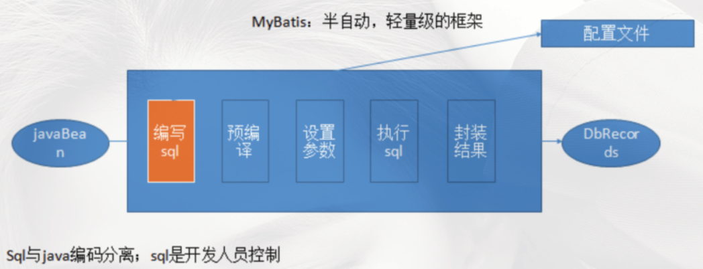


## 2、Mybatis - 引入

### 2.1 原生 JDBC 写法 

```java
public static void main(String[] args) {
    Connection connection = null;
    PreparedStatement preparedStatement = null;
    ResultSet resultSet = null;
  try {
    // 加载数据库驱动
    Class.forName("com.mysql.jdbc.Driver");
    
    // 通过驱动管理类获取数据库链接
    connection = DriverManager.getConnection("jdbc:mysql://localhost:3306/mybatis?characterEncoding=utf-8", "root", "root");
 
    // 定义sql语句？表示占位符
    String sql = "select * from user where username = ?";

    // 获取预处理statement
    preparedStatement = connection.prepareStatement(sql);

    // 设置参数，第一个参数为sql语句中参数的序号(从1开始)，第二个参数为设置的参数值
    preparedStatement.setString(1, "tom");

    // 向数据库发出sql执行查询，查询出结果集
    resultSet = preparedStatement.executeQuery();

    // 遍历查询结果集
    while (resultSet.next()) {
		int id = resultSet.getInt("id");
		String username = resultSet.getString("username");
		// 封装User
		user.setId(id);
		user.setUsername(username);
	}
		System.out.println(user);
    }
 }catch (Exception e) {
	e.printStackTrace();
 } finally {
	// 释放资源
	if (resultSet != null) {
		try {
			resultSet.close();
		} catch (SQLException e) {
			e.printStackTrace();
		}
	}
	
    if (preparedStatement != null) {
		try {
			preparedStatement.close();
		} catch (SQLException e) {
			e.printStackTrace();
		}
    }
}
```


### 2.2 Mybatis 引入 - 解决 JDBC 编程的问题

- 原生jdbc开发存在的问题如下

```java
// 数据库连接创建、释放频繁造成系统资源浪费，从而影响系统性能
- 解决：使用数据库连接池初始化连接资源，在 SqlMapConfig.xml 中配置数据连接池，使用连接池管理数据库链接

// Sql语句在代码中硬编码，造成代码不易维护，实际应用中sql变化的可能较大，sql变动需要改变java代码
- 解决：将SQL语句配置/抽取在 XXXXmapper.xml 文件中，从而与Java代码分离

// 使用preparedStatement向占有位符号传参数存在硬编码，因为sql语句的where条件不一定，可能多也可能少，修改sql还要修改代码，系统不易维护
- 原因：SQL 语句的 where 条件不一定，可能多也可能少，占位符需要和参数一一对应
- 解决：Mybatis自动将Java对象映射到SQL语句，通过 statement 中的parameterType定义输入参数类型

// 对结果集解析存在硬编码（查询列名），sql变化导致解析代码变化，系统不易维护，如果能将数据库记录封装成pojo对象解析比较方便
- 原因：SQL 变化导致解析代码变化，并且解析前需要遍历
- 解决：使用反射、内省等底层技术，自动将实体与表进行属性与字段的自动映射（Mybatis 自动将 SQL 执行结果映射到 Java对象，通过statement中的resultType定义输出结果类型）
```

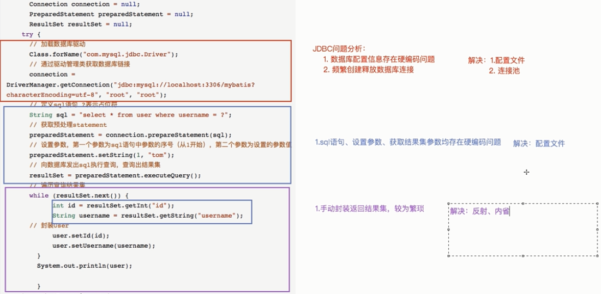

### 2.3 自定义框架 - 设计思路

#### （1）使用端：提供核心配置文件

```java
sqlMapConfig.xml : 存放数据库配置信息，引入mapper.xml
Mapper.xml : 存放sql语句的配置文件信息（包含sql语句、参数类型、返回值类型）
```

#### （2）框架端：本质是对 JDBC 代码进行封装

```java
（1）加载/读取配置文件
步骤1：根据配置文件的路径，加载配置文件成字节输入流，存储在内存中

（2）创建 javaBean（容器对象）存放对配置文件解析出来的内容
- 读取完成以后配置信息以流的形式存在，如果存放在内存中，不好操作，所以创建容器对象
步骤2：Configuration 核心配置类，存放 sqlMapConfig.xml 解析出来的内容（包含数据库基本信息、Map<唯一标识，Mapper> ）
			唯一标识：namespace + "." + id
步骤3：MappedStatement 映射配置类，存放 Mapper.xml 解析出来的内容（包含sql语句、statement类型、输入参数java类型、输出参数java类型）

（3）解析配置文件
- 创建 sqlSessionFactoryBuilder类  方法：sqlSessionFactory build(inputSteam in)
步骤4：使用 dom4j 解析配置文件，将解析出来的内容封装到 Configuration 和 MappedStatement 容器对象中
步骤4：创建 SqlSessionFactory 对象，获取 sqlSession 接口的实现类实例对象（工厂模式）

（4）创建 SqlSessionFactory 接口及实现类 DefaultSqlSessionFactory
- openSession（）方法用来生成 sqlSession

（5）创建 SqlSession 接口及实现类 DefaultSqlSession，定义对数据库的 CRUD 操作（封装JDBC完成对数据库表的查询操作）
// 查询所有
selectList(String statementId,Object param)
// 查询单个
selectOne(String statementId,Object param)
// 更新
update（）
// 删除
delete（）

（6）创建 Executor 接口及实现类 SimpleExecutor 实现类
// 执行 JDBC 代码
query（Configuration，MapperStatement,Object...params）

涉及到的设计模式：
Builder构建者设计模式、工厂模式、代理模式
```


### 2.4 自定义框架 - 代码实现

#### （1）使用端 

##### 步骤0：pom.xml依赖包

```xml
<!-- 引入自定义持久层框架的依赖 -->
<dependencies>
  <dependency>
    <groupId>com.loto.mybatis</groupId>
    <artifactId>mybatis2-custom</artifactId>
    <version>1.0-SNAPSHOT</version>
  </dependency>

  <!-- lombok 简化bean代码的⼯具包 -->
  <dependency>
    <groupId>org.projectlombok</groupId>
    <artifactId>lombok</artifactId>
    <version>1.18.18</version>
  </dependency>
</dependencies>
```

##### 步骤1：创建配置文件 sqlMapConfig.xml

```xml
<configuration>
    <!-- 数据库配置信息 -->
    <dataSource>
        <property name="driverClass" value="com.mysql.jdbc.Driver"/>
        <property name="jdbcUrl" value="jdbc:mysql:///JavaWeb_7.1_Mybatis"/>
        <property name="username" value="root"/>
        <property name="password" value="root"/>
    </dataSource>

    <!-- 存放mapper.xml的全路径 -->
    <mapper resource="UserMapper.xml"/>
</configuration>
```

##### 步骤2：UserMapper.xml

```xml
<!-- sql的唯一标识 statementId：namespace.id-->
<mapper namespace="com.loto.mybatis.dao.IUserDao">
    <!-- 查询所有 -->
    <select id="findAll" resultType="com.loto.mybatis.pojo.User">
        select * from user
    </select>

    <!-- 根据条件查询 -->
    <select id="findByCondition" resultType="com.loto.mybatis.pojo.User" parameterType="com.loto.mybatis.pojo.User">
        select * from user where id = #{id} and username = #{username}
    </select>
</mapper>
```

##### 步骤3：User.java实体

```java
package com.loto.mybatis.pojo;

import lombok.Data;

@Data
public class User {
	private Integer id;
	private String username;
	private String password;
}
```

##### 步骤4：测试类 - sqlSession

```java
package com.loto.mybatis.test;

import com.loto.mybatis.io.Resources;
import com.loto.mybatis.pojo.User;
import com.loto.mybatis.sqlsession.SqlSession;
import com.loto.mybatis.sqlsession.SqlSessionFactory;
import com.loto.mybatis.sqlsession.SqlSessionFactoryBuilder;
import org.junit.Test;

import java.io.InputStream;
import java.util.List;

/**
 * 缺点1，存在重复的代码：创建 sqlsession、调用 sqlsession 方法、关闭 sqlsession<p>
 * 缺点2，存在硬编码：调用 sqlsession 的方法时，参数 statement 的 id 硬编码
 */

public class Test_sqlSession {
	/**
	 * 查询所有
	 */
	@Test
	public void test_findAll() throws Exception {
		InputStream resourceAsSteam = Resources.getResourceAsSteam("sqlMapConfig.xml");
		SqlSessionFactory sqlSessionFactory = new SqlSessionFactoryBuilder().build(resourceAsSteam);
		SqlSession sqlSession = sqlSessionFactory.openSession();

		List<User> users = sqlSession.selectList("com.loto.mybatis.dao.IUserDao.findAll");
		for (User user1 : users) {
			System.out.println(user1);
		}
	}

	/**
	 * 根据条件查询
	 */
	@Test
	public void test_findByCondition() throws Exception {
		InputStream resourceAsSteam = Resources.getResourceAsSteam("sqlMapConfig.xml");
		SqlSessionFactory sqlSessionFactory = new SqlSessionFactoryBuilder().build(resourceAsSteam);
		SqlSession sqlSession = sqlSessionFactory.openSession();

		// 调用
		User user = new User();
		user.setId(1);
		user.setUsername("TD");

		// sql的唯一标识 statementId：namespace.id
		User user2 = sqlSession.selectOne("com.loto.mybatis.dao.IUserDao.findByCondition", user);
		System.out.println(user2);
	}

}
```

#####  步骤4：测试类 -  JDK 动态代理

```java
package com.loto.mybatis.test;

import com.loto.mybatis.dao.IUserDao;
import com.loto.mybatis.io.Resources;
import com.loto.mybatis.pojo.User;
import com.loto.mybatis.sqlsession.SqlSession;
import com.loto.mybatis.sqlsession.SqlSessionFactory;
import com.loto.mybatis.sqlsession.SqlSessionFactoryBuilder;
import org.junit.Test;

import java.io.InputStream;
import java.util.List;

public class Test_getMapper {

    /**
     * 使用代理
     */
    @Test
    public void test_getMapper() throws Exception {
        InputStream resourceAsSteam = Resources.getResourceAsSteam("sqlMapConfig.xml");
        SqlSessionFactory sqlSessionFactory = new SqlSessionFactoryBuilder().build(resourceAsSteam);
        SqlSession sqlSession = sqlSessionFactory.openSession();

        // 代理
        IUserDao userDao = sqlSession.getMapper(IUserDao.class);
        List<User> all = userDao.findAll();
        for (User user1 : all) {
            System.out.println(user1);
        }
    }
}
```


#### （2）框架端

##### 步骤0：pom.xml依赖包

```xml
<dependencies>
    <dependency>
        <groupId>mysql</groupId>
        <artifactId>mysql-connector-java</artifactId>
        <version>5.1.47</version>
    </dependency>

    <dependency>
        <groupId>c3p0</groupId>
        <artifactId>c3p0</artifactId>
        <version>0.9.1.2</version>
    </dependency>

    <dependency>
        <groupId>log4j</groupId>
        <artifactId>log4j</artifactId>
        <version>1.2.17</version>
    </dependency>

    <!-- https://mvnrepository.com/artifact/junit/junit -->
    <dependency>
        <groupId>junit</groupId>
        <artifactId>junit</artifactId>
        <version>4.13.1</version>
    </dependency>

    <dependency>
        <groupId>dom4j</groupId>
        <artifactId>dom4j</artifactId>
        <version>1.6.1</version>
    </dependency>

    <dependency>
        <groupId>jaxen</groupId>
        <artifactId>jaxen</artifactId>
        <version>1.1.6</version>
    </dependency>
    
    <!--简化bean代码的⼯具包-->
    <dependency>
        <groupId>org.projectlombok</groupId>
        <artifactId>lombok</artifactId>
        <version>1.18.18</version>
    </dependency>
</dependencies>
```

##### 关系图


## 3、Mybatis - API

### 3.1 SqlSessionFactoryBuilder（SqlSession 工厂构建器）

```java
// 作用：通过加载 mybatis 的核心文件的输入流的形式构建一个 SqlSessionFactory 对象
SqlSessionFactory build(InputStream inputStream)

// Resources 工具类
// 在 org.apache.ibatis.io 包中
// 作用：Resources 类帮助你从类路径下、文件系统或一个 web URL 中加载资源文件
    
// 举例
InputStream resourceAsStream = Resources.getResourceAsStream("sqlMapConfig.xml");
SqlSessionFactory sqlSessionFactory = new SqlSessionFactoryBuilder().build(resourceAsStream);
```

### 3.2 SqlSessionFactory（SqlSession 工厂对象）

- SqlSessionFactory 有多个方法创建 SqlSession 实例，常用的有如下两个

| 方法                            | 解释                                                         |
| ------------------------------- | ------------------------------------------------------------ |
| openSession()                   | 默认开启一个事务，不会自动提交（需手动提交事务，更新操作数据才会持久化到数据库） |
| openSession(boolean autoCommit) | 参数为是否自动提交，如设置为True，则不需要手动提交事务       |

### 3.3 Session（会话对象）

- 执行语句的方法

```java
<T> T selectOne(String statement, Object parameter) 
<E> List<E> selectList(String statement, Object parameter)
    
int insert(String statement, Object parameter)
int update(String statement, Object parameter)
int delete(String statement, Object parameter)
```

- 操作事务的方法

```java
void commit() 
void rollback()
```


---

# 第二章 Mybatis - 开发使用

## 1、核心配置文件解析 - sqlMapConfig.xml

### 1.1 Mybatis 提供的内置类型别名

#### （1）基本类型

|   别名   |  类型   |
| :------: | :-----: |
|  _byte   |  byte   |
|  _long   |  long   |
|  _short  |  short  |
|   _int   |   int   |
| _integer | integer |
| _double  | double  |
|  _float  |  float  |
| _boolean | boolean |

#### （2）常用包装类型

|    别名    |    类型    |
| :--------: | :--------: |
|   string   |   String   |
|    byte    |    Byte    |
|    long    |    Long    |
|   short    |   Short    |
|    int     |  integer   |
|  integer   |  Integer   |
|   double   |   Double   |
|   float    |   Float    |
|  boolean   |  Boolean   |
|    date    |    Date    |
|   object   |   Object   |
| collection | Collection |
|    list    |    List    |
| arraylist  | Arraylist  |
|    map     |    Map     |
|  hashmap   |  Hashmap   |
|  iterator  |  Iterator  |
|   array    |    数组    |


### 1.2 核心配置文件详解

- settings 的属性值：https://mybatis.org/mybatis-3/zh/configuration.html#settings

```xml
<?xml version="1.0" encoding="UTF-8" ?>
<!DOCTYPE configuration PUBLIC "-//mybatis.org//DTD Config 3.0//EN" "http://mybatis.org/dtd/mybatis-3-config.dtd">

<!-- SqlMapConfig.xml：Mybatis的核心配置文件详解 -->
<configuration>
    <!-- 1、属性配置：引入jdbc.properties -->
    <properties resource="jdbc.properties"/>

    <!-- 2、全局配置参数:配置一些改变运行时行为的信息 -->
    <settings>
        <setting name="" value=""/>
    </settings>

    <!-- 3、类型别名：包以其子包下所有类，头字母大小都行 -->
    <!--自定义类的别名，用于 xxxmapper.xml 的标签中的 parameterType 和 resultType -->
    <typeAliases>
        <!-- 方式1：单个别名定义 -->
        <typeAlias type="com.loto.mybatis.pojo.User" alias="User"/>

        <!-- 方式2：批量别名定义，扫描整个包下的类，别名为类名（大小写不敏感） -->
        <package name="com.loto.mybatis.pojo"/>
    </typeAliases>

    <!-- 4、类型处理器：将 sql 中返回的数据库类型转换为相应 Java 类型的处理器配置-->
    <typeHandlers>
        <!-- 方式1：配置package（mybatis会去配置的package扫描TypeHandler）-->
        <!-- <package name="com.loto.mybatis"/> -->

        <!-- 方式2 -->
        <!-- handler：直接配置要指定的TypeHandler -->
        <!-- javaType：配置java类型（如String）-->
        <!-- jdbcType：配置数据库基本数据类型（如varchar）-->
        <typeHandler javaType="" jdbcType="" handler=""/>
    </typeHandlers>

    <!-- 5、对象工厂：实例化目标类的工厂类配置-->
    <objectFactory type=""/>

    <!-- 6、插件：修改 MyBatis 的核心行为 -->
    <plugins>
        <plugin interceptor=""></plugin>
    </plugins>

    <!-- 7、环境集合属性对象：数据库环境信息的集合（和spring整合后environments配置将废除）-->
    <environments default="development">
        <!-- 环境子属性对象：数据库环境配置的详细配置 -->
        <environment id="development">
            <!-- 事务管理：指定 MyBatis 的事务管理器（采用JDBC）-->
            <!-- JDBC：直接使用了JDBC 的提交和回滚设置，它依赖于从数据源得到的连接来管理事务作用域 -->
 			<!-- MANAGED：从来不提交或回滚一个连接，而是让容器来管理事务的整个生命周期（比如 JEE 应用服务器的上下文）默认情况下它会关闭连接，然而一些容器并不希望这样，因此需要将 closeConnection 属性设置为 false 来阻止它默认的关闭行为 -->
            <transactionManager type="JDBC"/>

            <!-- 数据源：数据库连接池 -->
            <!-- type：指定数据源的连接类型 -->
            <!-- UNPOOLED：这个数据源的实现只是每次被请求时打开和关闭连接 -->
			<!-- POOLED：这种数据源的实现利用“池”的概念将 JDBC 连接对象组织起来，mybatis的数据源 -->
			<!-- JNDI：该数据源的实现是为了能在如 EJB 或应用服务器这类容器中使用，容器可以集中或在外部配置数据源，然后放置一个JNDI上下文的引用，基于 tomcat 的数据源 -->
            <dataSource type="POOLED">
                <property name="driver" value="${jdbc.driver}"/>
                <property name="url" value="${jdbc.url}"/>
                <property name="username" value="${jdbc.username}"/>
                <property name="password" value="${jdbc.password}"/>
            </dataSource>
        </environment>
    </environments>

    <!-- 8、映射器：加载配置sql映射文件的位置（xxxxMapper.xml）-->
	<mappers>
		<!-- 方式1：注册指定包下的所有mapper接口（要求mapper接口名称和mapper映射文件名称相同，且放在同一个目录中）-->
		<package name="com.loto.mybatis.mapper"/>

		<!-- 方式2：使用mapper接口类路径（要求mapper接口名称和mapper映射文件名称相同，且放在同一个目录中）-->
		<!-- <mapper class="com.loto.mybatis.mapper" /> -->

		<!-- 方式3：使用相对于类路径的资源（不用保证同接口同包同名）-->
       <!-- <mapper resource="mapperxml/OrderMapper.xml" />
        <mapper resource="mapperxml/UserMapper.xml" />-->

		<!-- 方式4：url指定mapper的绝对路径（与实际开发不符，因此基本不用）-->
		<!-- <mapper url="" /> -->
	</mappers>
</configuration>
```


## 2、映射配置文件解析 - xxxMapper.xml

```xml
<?xml version="1.0" encoding="UTF-8" ?>
<!DOCTYPE mapper
        PUBLIC "-//mybatis.org//DTD Mapper 3.0//EN"
        "http://mybatis.org/dtd/mybatis-3-mapper.dtd">

<!-- namespace : 名称空间，与id组成sql的唯一标识 -->
<mapper namespace="com.loto.mapper.IUserMapper">
    <!-- parameterType：参数类型 -->
    <!-- resultType：返回值类型 -->

    <!-- 查询全部 -->
    <!-- SQL⽚段抽取：Sql 中可将重复的 sql 提取出来，使⽤时⽤ include 引⽤即可，最终达到 sql 重⽤的⽬的 -->
    <select id="findAll" resultType="user">
        <include refid="selectUser"/>
    </select>
    <sql id="selectUser">
        select *
        from user
    </sql>

    <!-- 多条件组合查询：if -->
    <select id="findByCondition" parameterType="user" resultType="user">
        <include refid="selectUser"/>
        <where>
            <if test="id !=null">
                and id = #{id}
            </if>
            <if test="username !=null">
                and username = #{username}
            </if>
        </where>
    </select>

    <!-- 多值查询：foreach -->
    <!-- 标签⽤于遍历集合
        collection：代表要遍历的集合元素，注意编写时不要写#{}
        open：代表语句的开始部分
        close：代表结束部分
        item：代表遍历集合的每个元素，⽣成的变量名
        sperator：代表分隔符
    -->
    <select id="findByIds" parameterType="list" resultType="user">
        <include refid="selectUser"/>
        <where>
            <foreach collection="array" open="id in (" close=")" item="id" separator=",">
                #{id}
            </foreach>
        </where>
    </select>

    <!-- 添加用户 -->
    <insert id="saveUser" parameterType="user">
        insert into user (id, username)
        values (#{id}, #{username})
    </insert>

    <!-- 修改 -->
    <update id="updateUser" parameterType="user">
        update user
        set username = #{username}
        where id = #{id}
    </update>

    <!-- 删除 -->
    <delete id="deleteUser" parameterType="int">
        delete
        from user
        where id = #{id}
    </delete>

    <!-- 手动配置实体属性与表字段的映射关系 -->
    <resultMap id="userMap" type="com.loto.pojo.User">
        <result property="id" column="uid"/>
        <result property="username" column="username"/>

        <collection property="orderList" ofType="com.loto.pojo.Order">
            <result property="id" column="id"/>
            <result property="orderTime" column="orderTime"/>
            <result property="total" column="total"/>
        </collection>
    </resultMap>

    <!-- 一对多查询（1个用户多条订单记录）-->
    <select id="findAllUser" resultMap="userMap">
        select * from user u left join orders o on u.id = o.uid
    </select>

    <!-- 手动配置实体属性与表字段的映射关系 -->
    <resultMap id="userRoleMap" type="com.loto.pojo.User">
        <result property="id" column="userid"/>
        <result property="username" column="username"/>

        <collection property="roleList" ofType="com.loto.pojo.Role">
            <result property="id" column="roleid"/>
            <result property="roleName" column="roleName"/>
            <result property="roleDesc" column="roleDesc"/>
        </collection>
    </resultMap>

    <!-- 多对多查询（查询多个⽤户同时查询出每个⽤户的所有⻆⾊）-->
    <select id="findAllUserAndRole" resultMap="userRoleMap">
        select * from user u left join user_role ur on u.id = ur.userid
                             left join roles r on r.id = ur.roleid
    </select>
</mapper>
```


### 2.1 #{} 和 ${}

#### #{} 代表占位符

```sql
# sql语法
select * from user where id = ?

# mybatis语法
select * from user where id = #{v}
```

#### ${} 代表字符串拼接

```sql
# sql语法
select * from user where username like '%五%'

# mybatis语法
-- 用#，{}中可以用任意字符
select * from user where username like "%"#{haha}"%"

-- 用{}中必须用value
select * from user where username like "%{value}%"
```

### 2.1 动态 SQL

#### （1）if test

```sql
# 条件判断中不能使用 &&，要使用 and
# <if> 标签的 test 属性中写的是对象的属性
<if test=条件判断></if>
```

#### （2）where

```sql
# 用于简化 where 1=1 的条件拼装，会自动删去第一个and
<where><where/>
```

#### （3）foreach

```sql
# 用于遍历集合
# collection: 代表要遍历的集合元素，注意编写时不要写#{}
# open: 代表语句的开始部分
# close: 代表结束部分
# item: 代表遍历集合的每个元素，生成的变量名
# separator: 代表分隔符
<foreach> </foreach>
```

#### （4）sql 代码片段

```sql
# 用于抽取重复的语句代码片段
<sql id="defaultSql">
	select * from user
</sql>

# 使用代码片段
<include refid="defaultSql"></include>
```

#### （5）复杂映射（一对一）

```sql
# 实体中表示一方关系：实体
# 使用 resultMap，定义专门的 resultMap 用于映射一对一查询结果。
<association property="user" javaType="com.loto.pojo.User">
```

#### （6）复杂映射（一对多）

```sql
# 实体中表示多方关系：集合
# 使用 resultMap，定义专门的 resultMap 用于映射一对多查询结果。
<collection property="orderList" ofType="com.loto.pojo.Order">
```

#### （7）复杂映射（多对多）

```sql
# 双方实体中表示对方关系：集合
# 使用 resultMap，定义专门的 resultMap 用于映射一对多查询结果。
<collection property="orderList" ofType="com.loto.pojo.Order">
```


## 3、Mybatis 开发 - 配置式

### 步骤1：pom.xml添加MyBatis的jar包

```xml
<dependencies>
    <!-- mybatis -->
    <dependency>
        <groupId>org.mybatis</groupId>
        <artifactId>mybatis</artifactId>
        <version>3.5.1</version>
    </dependency>

    <!-- mysql驱动 -->
    <dependency>
        <groupId>mysql</groupId>
        <artifactId>mysql-connector-java</artifactId>
        <version>5.1.47</version>
        <scope>runtime</scope>
    </dependency>

    <!-- https://mvnrepository.com/artifact/junit/junit -->
    <dependency>
        <groupId>junit</groupId>
        <artifactId>junit</artifactId>
        <version>4.13.1</version>
    </dependency>

    <!--简化bean代码的⼯具包-->
    <dependency>
        <groupId>org.projectlombok</groupId>
        <artifactId>lombok</artifactId>
        <version>1.18.18</version>
    </dependency>
</dependencies>
```

### 步骤2：创建user数据表

```mysql
# 创建 user 用户表
DROP TABLE IF EXISTS user;
CREATE TABLE user
(
    id       int(20)     NOT NULL AUTO_INCREMENT COMMENT '主键ID',
    username VARCHAR(50) NULL DEFAULT NULL COMMENT '用户名',
    password VARCHAR(50) NULL DEFAULT NULL COMMENT '密码',
    PRIMARY KEY (id)
) comment = 'Mybatis的user表';

```

### 步骤3：编写User实体类

```java
@Data
public class User {
	private Integer id;
	private String username;
}
```

### 步骤4：编写映射文件UserMapper.xml

```xml
<?xml version="1.0" encoding="UTF-8" ?>
<!DOCTYPE mapper
        PUBLIC "-//mybatis.org//DTD Mapper 3.0//EN"
        "http://mybatis.org/dtd/mybatis-3-mapper.dtd">

<!-- namespace : 名称空间，与id组成sql的唯一标识 -->
<mapper namespace="IUserDao">
    <!-- parameterType：参数类型 -->
    <!-- resultType：返回值类型 -->

    <!-- 查询全部 -->
    <!-- SQL片段抽取：Sql 中可将重复的 sql 提取出来，使用时用 include 引用即可，最终达到 sql 重用的目的 -->
    <select id="findAll" resultType="user">
        <include refid="selectUser"/>
    </select>
    <sql id="selectUser">
        select *
        from user
    </sql>

    <!-- 多条件组合查询：if -->
    <select id="findByCondition" parameterType="user" resultType="user">
        <include refid="selectUser"/>
        <where>
            <if test="id !=null">
                and id = #{id}
            </if>
            <if test="username !=null">
                and username = #{username}
            </if>
        </where>
    </select>

    <!-- 多值查询：foreach -->
    <select id="findByIds" parameterType="list" resultType="user">
        <include refid="selectUser"/>
        <where>
            /*标签⽤于遍历集合
             collection：代表要遍历的集合元素，注意编写时不要写#{}
             open：代表语句的开始部分
             close：代表结束部分
             item：代表遍历集合的每个元素，⽣成的变量名
             sperator：代表分隔符
            */
            <foreach collection="array" open="id in (" close=")" item="id" separator=",">
                #{id}
            </foreach>
        </where>
    </select>

    <!-- 添加用户 -->
    <insert id="saveUser" parameterType="user">
        insert into user (id, username)
        values (#{id}, #{username})
    </insert>

    <!-- 修改 -->
    <update id="updateUser" parameterType="user">
        update user
        set username = #{username}
        where id = #{id}
    </update>

    <!-- 删除 -->
    <delete id="deleteUser" parameterType="int">
        delete
        from user
        where id = #{id}
    </delete>
</mapper>
```

### 步骤5：编写核心文件SqlMapConfig.xml

```xml
<?xml version="1.0" encoding="UTF-8" ?>
<!DOCTYPE configuration PUBLIC "-//mybatis.org//DTD Config 3.0//EN"
        "http://mybatis.org/dtd/mybatis-3-config.dtd">

<configuration>
    <!-- 加载外部的properties文件 -->
    <properties resource="jdbc.properties"/>

    <!-- 给实体类的全限定类名给别名 -->
    <typeAliases>
        <!--类型1：给单独某个实体起别名-->
        <!--<typeAlias type="com.loto.pojo.User" alias="user"/>-->

        <!--类型2：批量起别名，该包下所有的类的本身的类名，别名还不区分大小写 -->
        <package name="com.loto.pojo"/>
    </typeAliases>

    <!-- 指定默认的环境名称 -->
    <environments default="development">
        <!-- 指定当前环境的名称 -->
        <environment id="development">
            <!-- 指定事务的管理类型：交由JDBC进行管理 -->
            <transactionManager type="JDBC"/>

            <!-- 指定当前数据源类型：连接池 -->
            <dataSource type="POOLED">
                <!-- 数据源配置的基本参数 -->
                <property name="driver" value="${jdbc.driver}"/>
                <property name="url" value="${jdbc.url}"/>
                <property name="username" value="${jdbc.username}"/>
                <property name="password" value="${jdbc.password}"/>
            </dataSource>
        </environment>
    </environments>

    <!-- 引入映射配置文件 -->
    <mappers>
        <!-- 使用相对于类路径的资源引用 -->
        <!--<mapper resource="com/loto/UserMapper.xml"/>-->
        <mapper resource="UserMapper.xml"/>

        <!-- 使用完全限定资源定位符（URL）-->
        <!--<mapper url="file:///com/loto/UserMapper.xml"/>-->

        <!-- 使用映射器接口实现类的完全限定类名 -->
        <!--<mapper class="com.loto.UserMapper"/>-->

        <!-- 将包内的映射器接口实现全部注册为映射器 -->
        <!--<package name="com.loto"/>-->
    </mappers>
</configuration>
```


### 步骤6：Mybatis的Dao层实现 - 传统开发方式

#### 编写 UserDao 接口

```java
public interface UserDao {
	 List<User> findAll() throws IOException; 
}
```

#### 编写 UserDaoImpl 实现

```java
public class UserDaoImpl implements UserDao {
 public List<User> findAll() throws IOException {
     InputStream resourceAsStream = Resources.getResourceAsStream("SqlMapConfig.xml");
     SqlSessionFactory sqlSessionFactory = new SqlSessionFactoryBuilder().build(resourceAsStream);
     SqlSession sqlSession = sqlSessionFactory.openSession();

     List<User> userList = sqlSession.selectList("IUserDao.findAll");

     sqlSession.close();
     return userList;
 }
}
```

#### 测试类

```java
@Test
public void testTraditionDao() throws IOException {
     UserDao userDao = new UserDaoImpl();
     List<User> all = userDao.findAll();
     System.out.println(all);
}
```


### 步骤6：Mybatis的Dao层实现 - Mapper 代理开发方式

#### 简介

```java
Mapper 接口开发方法需要程序员编写 Mapper 接口（相当于 Dao 接口），由 Mybatis 框架根据接口定义创建接口的动态代理对象
    
Mapper 接口开发需要遵循以下规范
- Mapper.xml 文件中的 namespace 与 mapper 接口的全限定名相同
- Mapper接口方法名和 Mapper.xml 中定义的每个 statement 的id相同
- Mapper接口方法的输入参数类型和 mapper.xml 中定义的每个sql的 parameterType 的类型相同
- Mapper接口方法的输出参数类型和 mapper.xml 中定义的每个sql的 resultType 的类型相同
```

#### 编写 UserMapper 接口

```java
public interface IUserDao {
	public List<User> findAll() throws IOException;
}
```

#### 编写 UserMapper.xml 文件

```xml
<mapper namespace="IUserDao">
    <select id="findAll" resultType="user">
        <include refid="selectUser"/>
    </select>
    <sql id="selectUser">
        select *
        from user
    </sql>
</mapper>
```

#### 测试类

```java
@Test
public void test_findAll_mapper() throws IOException {
    InputStream resourceAsStream = Resources.getResourceAsStream("sqlMapConfig.xml");
    SqlSessionFactory sqlSessionFactory = new SqlSessionFactoryBuilder().build(resourceAsStream);
    SqlSession sqlSession = sqlSessionFactory.openSession();

    IUserDao mapper = sqlSession.getMapper(IUserDao.class);
    List<User> all = mapper.findAll();
    for (User user : all) {
        System.out.println(user);
    }
}
```


### 步骤7：MyBatis的增删改查操作 

#### （1）增

```java
/**
 * 【传统开发方式】插入：通过 namespace + id
 */
@Test
public void test_Insert() throws IOException {
    InputStream resourceAsStream = Resources.getResourceAsStream("sqlMapConfig.xml");
    SqlSessionFactory sqlSessionFactory = new SqlSessionFactoryBuilder().build(resourceAsStream);
    //事务自动提交
    SqlSession sqlSession = sqlSessionFactory.openSession(true);

    User user = new User();
    user.setUsername("Jan");
    sqlSession.insert("com.loto.dao.IUserMapper.saveUser", user);

    sqlSession.close();
}

/**
 * 【Mapper 代理开发方式】插入：通过方法
 */
@Test
public void test_Insert_Mapper() throws IOException {
    InputStream resourceAsStream = Resources.getResourceAsStream("sqlMapConfig.xml");
    SqlSessionFactory sqlSessionFactory = new SqlSessionFactoryBuilder().build(resourceAsStream);
    //事务自动提交
    SqlSession sqlSession = sqlSessionFactory.openSession(true);

    User user = new User();
    user.setUsername("Jan");

    IUserMapper mapper = sqlSession.getMapper(IUserMapper.class);
    mapper.saveUser(user);

    sqlSession.close();
}
```

#### （2）改

```java
@Test
public void test_Update() throws IOException {
    InputStream resourceAsStream = Resources.getResourceAsStream("sqlMapConfig.xml");
    SqlSessionFactory sqlSessionFactory = new SqlSessionFactoryBuilder().build(resourceAsStream);
    SqlSession sqlSession = sqlSessionFactory.openSession();

    User user = new User();
    user.setId(3);
    user.setUsername("loto");
    sqlSession.update("com.loto.dao.IUserMapper.updateUser", user);
    sqlSession.commit();

    sqlSession.close();
}

@Test
public void test_Update_Mapper() throws IOException {
    InputStream resourceAsStream = Resources.getResourceAsStream("sqlMapConfig.xml");
    SqlSessionFactory sqlSessionFactory = new SqlSessionFactoryBuilder().build(resourceAsStream);
    SqlSession sqlSession = sqlSessionFactory.openSession();

    User user = new User();
    user.setId(3);
    user.setUsername("shorfng");

    IUserMapper mapper = sqlSession.getMapper(IUserMapper.class);
    mapper.updateUser(user);

    sqlSession.commit();
    sqlSession.close();
}
```

#### （3）查

##### 传统开发方式

```java
/**
 * 【传统开发方式】查询全部：通过 namespace + id
 */
@Test
public void test_findAll_XML() throws IOException {
    // 1、加载核心配置文件（使用 Resources 工具类把配置文件加载成字节输入流）
    InputStream resourceAsStream = Resources.getResourceAsStream("sqlMapConfig.xml");

    // 2、解析了配置文件，并创建 sqlSessionFactory 工厂对象
    SqlSessionFactory sqlSessionFactory = new SqlSessionFactoryBuilder().build(resourceAsStream);

    // 3、获得sqlSession对象
    // 默认开启一个事务，但是该事务不会自动提交，在进行增删改操作时，要手动提交事务
    SqlSession sqlSession = sqlSessionFactory.openSession();

    // 4、执行sql语句（使用 sqlSession 调用方法）
    // 查询单个：selectOne  查询所有selectList  添加：insert  修改：update  删除：delete
    List<User> users = sqlSession.selectList("com.loto.dao.IUserMapper.findAll");
    for (User user : users) {
        System.out.println(user);
    }

    // 5、释放资源
    sqlSession.close();
}
```

##### Mapper 代理开发方式

```java
/**
 * 【Mapper 代理开发方式】查询全部：通过方法
 */
@Test
public void test_findAll_mapper() throws IOException {
    InputStream resourceAsStream = Resources.getResourceAsStream("sqlMapConfig.xml");
    SqlSessionFactory sqlSessionFactory = new SqlSessionFactoryBuilder().build(resourceAsStream);
    SqlSession sqlSession = sqlSessionFactory.openSession();

    IUserMapper mapper = sqlSession.getMapper(IUserMapper.class);
    List<User> all = mapper.findAll();
    for (User user : all) {
        System.out.println(user);
    }
}

/**
 * 【Mapper 代理开发方式】多条件组合查询：if
 */
@Test
public void test_findByCondition() throws IOException {
    User user1 = new User();
    user1.setId(1);
    user1.setUsername("TD");

    InputStream resourceAsStream = Resources.getResourceAsStream("sqlMapConfig.xml");
    SqlSessionFactory sqlSessionFactory = new SqlSessionFactoryBuilder().build(resourceAsStream);
    SqlSession sqlSession = sqlSessionFactory.openSession();
    IUserMapper mapper = sqlSession.getMapper(IUserMapper.class);

    List<User> all = mapper.findByCondition(user1);
    for (User user : all) {
        System.out.println(user);
    }
}

/**
 * 【Mapper 代理开发方式】多值查询：foreach
 */
@Test
public void test_findByIds() throws IOException {
    InputStream resourceAsStream = Resources.getResourceAsStream("sqlMapConfig.xml");
    SqlSessionFactory sqlSessionFactory = new SqlSessionFactoryBuilder().build(resourceAsStream);
    SqlSession sqlSession = sqlSessionFactory.openSession();
    IUserMapper mapper = sqlSession.getMapper(IUserMapper.class);

    int[] arr = {1, 2};

    List<User> all = mapper.findByIds(arr);
    for (User user : all) {
        System.out.println(user);
    }
}
```


#### （4）删

```java
@Test
public void test_Delete() throws IOException {
    InputStream resourceAsStream = Resources.getResourceAsStream("sqlMapConfig.xml");
    SqlSessionFactory sqlSessionFactory = new SqlSessionFactoryBuilder().build(resourceAsStream);
    SqlSession sqlSession = sqlSessionFactory.openSession();

    sqlSession.delete("com.loto.dao.IUserMapper.deleteUser",3);
    sqlSession.commit();

    sqlSession.close();
}

@Test
public void test_Delete_Mapper() throws IOException {
    InputStream resourceAsStream = Resources.getResourceAsStream("sqlMapConfig.xml");
    SqlSessionFactory sqlSessionFactory = new SqlSessionFactoryBuilder().build(resourceAsStream);
    SqlSession sqlSession = sqlSessionFactory.openSession();

    IUserMapper mapper = sqlSession.getMapper(IUserMapper.class);
    mapper.deleteUser(4);

    sqlSession.commit();
    sqlSession.close();
}
```


### MyBatis的配置式实现复杂映射开发 

#### （1）复杂映射查询：一对一

```java
/**
 * 一对一查询
 */
@Test
public void oneToOne() throws IOException {
    InputStream resourceAsStream = Resources.getResourceAsStream("sqlMapConfig.xml");
    SqlSessionFactory sqlSessionFactory = new SqlSessionFactoryBuilder().build(resourceAsStream);
    SqlSession sqlSession = sqlSessionFactory.openSession();

    IOrderMapper mapper = sqlSession.getMapper(IOrderMapper.class);
    List<Order> all = mapper.findOrderAndUser();
    for (Order order : all) {
        System.out.println(order);
    }
}
```

#### （2）复杂映射查询：一对多

```java
/**
 * 一对多查询（1个用户多条订单记录）
 */
@Test
public void oneToMany() throws IOException {
    InputStream resourceAsStream = Resources.getResourceAsStream("sqlMapConfig.xml");
    SqlSessionFactory sqlSessionFactory = new SqlSessionFactoryBuilder().build(resourceAsStream);
    SqlSession sqlSession = sqlSessionFactory.openSession();

    IUserMapper mapper = sqlSession.getMapper(IUserMapper.class);
    List<User> all = mapper.findAllUser();
    for (User user : all) {
        System.out.println(user.getUsername());

        List<Order> orderList = user.getOrderList();
        for (Order order : orderList) {
            System.out.println(order);
        }
        System.out.println("----------------------------------");
    }
}
```

#### （3）复杂映射查询：多对多

```java
/**
 * 多对多查询（查询多个用户同时查询出每个用户的所有角色）
 */
@Test
public void ManyToMany() throws IOException {
    InputStream resourceAsStream = Resources.getResourceAsStream("sqlMapConfig.xml");
    SqlSessionFactory sqlSessionFactory = new SqlSessionFactoryBuilder().build(resourceAsStream);
    SqlSession sqlSession = sqlSessionFactory.openSession();

    IUserMapper mapper = sqlSession.getMapper(IUserMapper.class);
    List<User> all = mapper.findAllUserAndRole();
    for (User user : all) {
        System.out.println(user.getUsername());
        List<Role> roleList = user.getRoleList();
        for (Role role : roleList) {
            System.out.println(role);
        }
        System.out.println("----------------------------------");
    }
}
```


## 4、Mybatis 开发 - 注解式

### 4.1 MyBatis - 常用注解

```sql
@Insert：实现新增
@Update：实现更新
@Delete：实现删除
@Select：实现查询

# 结合 @Select 一起使用
@Result：实现结果集封装
@Results：可以与 @Result 一起使用，封装多个结果集
@One：实现一对一结果集封装
@Many：实现一对多结果集封装
    
@CacheNamespace:实现注解二级缓存的使用
```

### 4.2 MyBatis - 常用注解 - 增删改查案例 

#### （1）增

- Test_Insert.java

```java
private IUserMapper userMapper;

/**
 * 添加一条用户数据
 */
@Test
public void testAdd() throws IOException {
    InputStream resourceAsStream = Resources.getResourceAsStream("sqlMapConfig.xml");
    SqlSessionFactory sqlSessionFactory = new SqlSessionFactoryBuilder().build(resourceAsStream);
	SqlSession sqlSession = sqlSessionFactory.openSession(true);
    userMapper = sqlSession.getMapper(IUserMapper.class);

    User user = new User();
    user.setUsername("测试用户名");
    user.setPassword("123");

    userMapper.addUser(user);
    System.out.println("插入数据的id为："+user.getId());
}

/**
 * 添加多条用户数据
 */
@Test
public void test_batchAddUser() throws IOException {
    InputStream resourceAsStream = Resources.getResourceAsStream("sqlMapConfig.xml");
    SqlSessionFactory sqlSessionFactory = new SqlSessionFactoryBuilder().build(resourceAsStream);
	SqlSession sqlSession = sqlSessionFactory.openSession(true);
    userMapper = sqlSession.getMapper(IUserMapper.class);

    List<User> users = new ArrayList<>() ;

    User user = new User();
    user.setUsername("测试用户名");
    user.setPassword("123");
    users.add(user);

    User user1 = new User();
    user1.setUsername("测试用户名1");
    user1.setPassword("123");
    users.add(user1);

    userMapper.batchAddUser(users);
}
```

- IUserMapper.java

```java
/**
 * 添加一条用户数据
 * @param user 用户对象<p>
 * keyProperty：表示对象中的成员变量<p>
 * keyColumn：表示数据库中的列名
 */
@Insert("insert into user (username, password) values (#{username},#{password})")
@Options(useGeneratedKeys = true, keyProperty = "id", keyColumn = "id")
public int addUser(User user);

/**
 * 添加多条用户数据
 */
@Insert("<script>" +
        "insert into user (username, password) values " +
        "<foreach collection=\"list\" item=\"item1\" index=\"index\"  separator=\",\">" +
        "(#{item1.username},#{item1.password})" +
        "</foreach>" +
        "</script>")
int batchAddUser(@Param("list") List<User> users);

```


#### （2）改

- Test_Update.java

```java

	/**
	 * 根据 id 更新用户
	 */
	@Test
	public void test_Update() throws IOException {
		InputStream resourceAsStream = Resources.getResourceAsStream("sqlMapConfig.xml");
		SqlSessionFactory sqlSessionFactory = new SqlSessionFactoryBuilder().build(resourceAsStream);
		// 事务自动提交
		SqlSession sqlSession = sqlSessionFactory.openSession(true);
		userMapper = sqlSession.getMapper(IUserMapper.class);

		User user = new User();
		user.setId(1);
		user.setUsername("TD");

		userMapper.updateUser(user);
	}
```

- IUserMapper.java

```java
	/**
	 * 根据 id 更新用户
	 * @param user
	 */
	@Update("update user set username = #{username} where id = #{id}")
	public void updateUser(User user);
```


#### （3）查

- Test_Select.java

```java
	private IUserMapper userMapper;

	/**
	 * 查询用户
	 */
	@Test
	public void test_selectAll() throws IOException {
		InputStream resourceAsStream = Resources.getResourceAsStream("sqlMapConfig.xml");
		SqlSessionFactory sqlSessionFactory = new SqlSessionFactoryBuilder().build(resourceAsStream);
		// 事务自动提交
		SqlSession sqlSession = sqlSessionFactory.openSession(true);
		userMapper = sqlSession.getMapper(IUserMapper.class);

		List<User> allUser = userMapper.selectAllUser();
		for (User user : allUser) {
			System.out.println(user);
		}
	}

	/**
	 * 根据 id 查询用户
	 */
	@Test
	public void test_findUserById() throws IOException {
		InputStream resourceAsStream = Resources.getResourceAsStream("sqlMapConfig.xml");
		SqlSessionFactory sqlSessionFactory = new SqlSessionFactoryBuilder().build(resourceAsStream);
		// 事务自动提交
		SqlSession sqlSession = sqlSessionFactory.openSession(true);
		userMapper = sqlSession.getMapper(IUserMapper.class);

		User user = userMapper.findUserById(1);
		System.out.println(user);
	}
```

- IUserMapper.java

```java
	/**
	 * 查询用户
	 *
	 * @return
	 */
	@Select("select * from user")
	public List<User> selectAllUser();

	/**
	 * 根据 id 查询用户
	 * @param id 用户id
	 * @return
	 */
	@Select({"select * from user where id = #{id}"})
	public User findUserById(Integer id);
```


#### （4）删

- Test_Delete.java

```java
private IUserMapper userMapper;

/**
 * 根据 id 删除一条用户数据（因为本案例涉及的表字段有外键关联，所以执行会报错）
 */
@Test
public void testAdd() throws IOException {
    InputStream resourceAsStream = Resources.getResourceAsStream("sqlMapConfig.xml");
    SqlSessionFactory sqlSessionFactory = new SqlSessionFactoryBuilder().build(resourceAsStream);
    SqlSession sqlSession = sqlSessionFactory.openSession(true);
    userMapper = sqlSession.getMapper(IUserMapper.class);

    userMapper.deleteUser(2);
}
```

- IUserMapper.java

```java
/**
 * 根据 id 删除用户
 * @param id 用户id
 */
@Delete("delete from user where id = #{id}")
public void deleteUser(Integer id);
```


### 4.3 MyBatis - 复杂映射 - 注解

```sql
# 代替标签 <resultMap>
@Results

# 代替 <id> 标签和 <result> 标签
# id：是否是主键字段
# column：数据库的列名
# property：需要装配的属性名
# one：需要使用 @One 注解（@Result（one=@One）（）））
# many：需要使用 @Many 注解（@Result（many=@many）（））
@Resutl 
	   
# 一对一
# 代替了<assocation> 标签，是多表查询的关键，在注解中用来指定子查询返回单一对象
# select 指定用来多表查询的 sql mapper
# fetchType 会覆盖全局的配置参数 lazyLoadingEnabled
@One

# 多对一
# 代替了<collection> 标签，是多表查询的关键，在注解中用来指定子查询返回单一对象
@Many
```


### 4.3 MyBatis - 复杂映射 - 查询案例

#### （1）复杂映射查询：一对一

- Test_Select.java

```java
	/**
	 * 一对一（查询订单的同时还查询该订单所属的用户）
	 */
	@Test
	public void test_oneToOne() throws IOException {
		InputStream resourceAsStream = Resources.getResourceAsStream("sqlMapConfig.xml");
		SqlSessionFactory sqlSessionFactory = new SqlSessionFactoryBuilder().build(resourceAsStream);
		// 事务自动提交
		SqlSession sqlSession = sqlSessionFactory.openSession(true);
		orderMapper = sqlSession.getMapper(IOrderMapper.class);

		List<Order> orderAndUser = orderMapper.findOrderAndUser();
		for (Order order : orderAndUser) {
			System.out.println(order);
		}
	}
```

- IOrderMapper.java

```java
	/**
	 * 一对一（查询订单的同时还查询该订单所属的用户）
	 */
	@Results({
			@Result(property = "id", column = "id"),
			@Result(property = "orderTime", column = "orderTime"),
			@Result(property = "total", column = "total"),
			@Result(property = "user", column = "uid", javaType = User.class, one = @One(select = "com.loto.mapper.IUserMapper.findUserById"))
	})
	@Select("select * from orders")
	public List<Order> findOrderAndUser();
```


#### （2）复杂映射查询：一对多

- Test_Select.java

```java
	/**
	 * 一对多（查询所有用户、同时查询每个用户关联的订单信息）
	 */
	@Test
	public void test_oneToMany() throws IOException {
		InputStream resourceAsStream = Resources.getResourceAsStream("sqlMapConfig.xml");
		SqlSessionFactory sqlSessionFactory = new SqlSessionFactoryBuilder().build(resourceAsStream);
		// 事务自动提交
		SqlSession sqlSession = sqlSessionFactory.openSession(true);
		userMapper = sqlSession.getMapper(IUserMapper.class);

		List<User> all = userMapper.findAll();
		for (User user : all) {
			System.out.println(user);
		}
	}
```

- IUserMapper.java

```java
	/**
	 * 一对多（查询所有用户、同时查询每个用户关联的订单信息）
	 */
	@Select("select * from user")
	@Results({
			@Result(property = "id", column = "id"),
			@Result(property = "username", column = "username"),
			@Result(property = "orderList", column = "id", javaType = List.class,
					many = @Many(select = "com.loto.mapper.IOrderMapper.findOrderByUid"))
	})
	public List<User> findAll();
```


#### （3）复杂映射查询：多对多

- Test_Select.java

```java
	/**
	 * 多对多（查询所有用户、同时查询每个用户关联的角色信息）
	 */
	@Test
	public void test_ManyToMany() throws IOException {
		InputStream resourceAsStream = Resources.getResourceAsStream("sqlMapConfig.xml");
		SqlSessionFactory sqlSessionFactory = new SqlSessionFactoryBuilder().build(resourceAsStream);
		// 事务自动提交
		SqlSession sqlSession = sqlSessionFactory.openSession(true);
		userMapper = sqlSession.getMapper(IUserMapper.class);

		List<User> all = userMapper.findAllUserAndRole();
		for (User user : all) {
			System.out.println(user);
		}
	}
```

- IUserMapper.java

```java
	/**
	 * 多对多（查询所有用户、同时查询每个用户关联的角色信息）
	 */
	@Select("select * from user")
	@Results({
			@Result(property = "id", column = "id"),
			@Result(property = "username", column = "username"),
			@Result(property = "roleList", column = "id", javaType = List.class,
					many = @Many(select = "com.loto.mapper.IRoleMapper.findRoleByUid"))
	})
	public List<User> findAllUserAndRole();
```


---

# 第三章 Mybatis - 缓存  

## 1、一级缓存

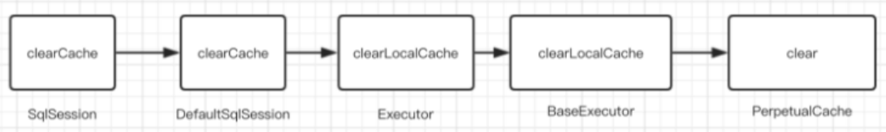

### 1.1 证明一级缓存存在

```java
private IUserMapper userMapper;
private SqlSession sqlSession;
private SqlSessionFactory sqlSessionFactory;

/**
 * 一级缓存
*/
@Test
public void test_firstCache() throws IOException {
    InputStream resourceAsStream = Resources.getResourceAsStream("sqlMapConfig.xml");
    sqlSessionFactory = new SqlSessionFactoryBuilder().build(resourceAsStream);
    sqlSession = sqlSessionFactory.openSession();
    userMapper = sqlSession.getMapper(IUserMapper.class);

    // 第一次查询id为1的用户
    // 第⼀次发起查询⽤户id为1的⽤户信息，先去找缓存中是否有id为1的⽤户信息
    // 如果没有，从数据库查询⽤户信息，得到⽤户信息，将⽤户信息存储到⼀级缓存中
    // 如果中间 sqlSession 去执⾏commit操作（执⾏插⼊、更新、删除），则会清空SqlSession中的⼀级缓存，这样做的⽬的为了让缓存中存储的是最新的信息，避免脏读
    User user1 = userMapper.findUserById(1);
    System.out.println(user1);

    User user2 = userMapper.findUserById(1);
    System.out.println(user2);
    System.out.println(user1 == user2);

    // 更新用户
    User user = new User();
    user.setId(1);
    user.setUsername("tom");
    userMapper.updateUser(user);
    sqlSession.commit();
    sqlSession.clearCache();

    // 第⼆次发起查询⽤户id为1的⽤户信息，先去找缓存中是否有id为1的⽤户信息，缓存中有，直接从缓存中获取⽤户信息
    User user3 = userMapper.findUserById(1);
    System.out.println(user1 == user3);
}
```

- 执行结果（4-6行，没有执行sql，user1=user2）（13行打印，因为中间对数据库进行修改，所以清空了一级缓存，再次执行查询，执行了sql语句）

```java
[main] [com.loto.mybatis.mapper.IUserMapper.findUserById]-[DEBUG] ==>  Preparing: select * from user where id = ? 
[main] [com.loto.mybatis.mapper.IUserMapper.findUserById]-[DEBUG] ==> Parameters: 1(Integer)
[main] [com.loto.mybatis.mapper.IUserMapper.findUserById]-[DEBUG] <==      Total: 1
User(id=1, username=lisi, password=123)
User(id=1, username=lisi, password=123)
true
[main] [com.loto.mybatis.mapper.IUserMapper.updateUser]-[DEBUG] ==>  Preparing: update user set username = ? where id = ? 
[main] [com.loto.mybatis.mapper.IUserMapper.updateUser]-[DEBUG] ==> Parameters: tom(String), 1(Integer)
[main] [com.loto.mybatis.mapper.IUserMapper.updateUser]-[DEBUG] <==    Updates: 1
[main] [com.loto.mybatis.mapper.IUserMapper.findUserById]-[DEBUG] ==>  Preparing: select * from user where id = ? 
[main] [com.loto.mybatis.mapper.IUserMapper.findUserById]-[DEBUG] ==> Parameters: 1(Integer)
[main] [com.loto.mybatis.mapper.IUserMapper.findUserById]-[DEBUG] <==      Total: 1
false
```


### 1.2 一级缓存源码分析 - 创建方法

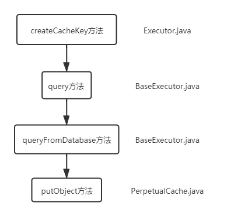

- Executor.java

```java
// createCacheKey 方法是由BaseExecutor执行的
CacheKey createCacheKey(MappedStatement ms, Object parameterObject, RowBounds rowBounds, BoundSql boundSql);
```

- BaseExecutor.java

```java
@Override
  public <E> List<E> query(MappedStatement ms, Object parameter, RowBounds rowBounds, ResultHandler resultHandler) throws SQLException {
    BoundSql boundSql = ms.getBoundSql(parameter);
    CacheKey key = createCacheKey(ms, parameter, rowBounds, boundSql);
    return query(ms, parameter, rowBounds, resultHandler, key, boundSql);
  }
```

- BaseExecutor.java

```java
@SuppressWarnings("unchecked")
  @Override
  public <E> List<E> query(MappedStatement ms, Object parameter, RowBounds rowBounds, ResultHandler resultHandler, CacheKey key, BoundSql boundSql) throws SQLException {
    ErrorContext.instance().resource(ms.getResource()).activity("executing a query").object(ms.getId());
    if (closed) {
      throw new ExecutorException("Executor was closed.");
    }
    if (queryStack == 0 && ms.isFlushCacheRequired()) {
      clearLocalCache();
    }
    List<E> list;
    try {
      queryStack++;
      list = resultHandler == null ? (List<E>) localCache.getObject(key) : null;
      if (list != null) {
        handleLocallyCachedOutputParameters(ms, key, parameter, boundSql);
      } else {
        list = queryFromDatabase(ms, parameter, rowBounds, resultHandler, key, boundSql);
      }
    } finally {
      queryStack--;
    }
    if (queryStack == 0) {
      for (DeferredLoad deferredLoad : deferredLoads) {
        deferredLoad.load();
      }
      // issue #601
      deferredLoads.clear();
      if (configuration.getLocalCacheScope() == LocalCacheScope.STATEMENT) {
        // issue #482
        clearLocalCache();
      }
    }
    return list;
  }
```

- BaseExecutor.java

```java
private <E> List<E> queryFromDatabase(MappedStatement ms, Object parameter, RowBounds rowBounds, ResultHandler resultHandler, CacheKey key, BoundSql boundSql) throws SQLException {
    List<E> list;
    localCache.putObject(key, EXECUTION_PLACEHOLDER);
    try {
      list = doQuery(ms, parameter, rowBounds, resultHandler, boundSql);
    } finally {
      localCache.removeObject(key);
    }
    localCache.putObject(key, list);
    if (ms.getStatementType() == StatementType.CALLABLE) {
      localOutputParameterCache.putObject(key, parameter);
    }
    return list;
  }
```

- PerpetualCache.java

```java
// cache 本质是 hashMap
private Map<Object, Object> cache = new HashMap<>();

// 如果查不到的话，就从数据库查，在queryFromDatabase中，会对localcache进行写入
// localcache对象的put方法最终交给Map进行存放
@Override
  public void putObject(Object key, Object value) {
    cache.put(key, value);
  }
```


### 1.3 一级缓存源码分析 - 清空方法

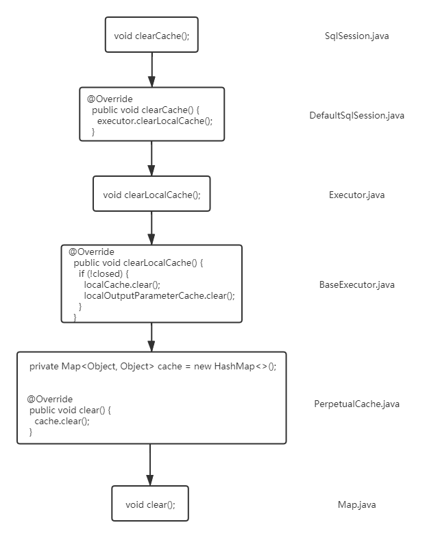

## 2、二级缓存

### 2.1 二级缓存 - 使用步骤

#### 步骤1：全局配置文件 sqlMapConfig.xml 开启二级缓存

```xml
<!-- 开启二级缓存 -->
<settings>
  <setting name="cacheEnabled" value="true"/>
</settings>
```


#### 步骤2：mapper 文件开启缓存

- 方式1配置式：IUserMapper.xml ⽂件中开启缓存

```xml
<?xml version="1.0" encoding="UTF-8" ?>
<!DOCTYPE mapper
        PUBLIC "-//mybatis.org//DTD Mapper 3.0//EN"
        "http://mybatis.org/dtd/mybatis-3-mapper.dtd">

<mapper namespace="com.loto.mybatis.mapper.IUserMapper">
    <!-- 开启⼆级缓存 -->
    <cache>
    </cache>

    <!-- userCache：⽤来设置本次查询是否禁⽤⼆级缓存，默认为true -->
    <!-- flushCache：默认情况下为true，即刷新缓存，如果改成false则不会刷新，使⽤缓存时如果⼿动修改数据库表中的查询数据会出现脏读（在mapper的同⼀个namespace中，如果有其它insert、update, delete操作数据后需要刷新缓存，如果不执⾏刷新缓存会出现脏读） -->
    <select id="selectUserByUserId" useCache="false" flushCache="true" resultType="com.loto.mybatis.pojo.User" parameterType="int">
        select * from user where id = #{id}
    </select>
</mapper>
```

- 方式2注解式：IUserMapper.java 文件中开启缓存

```java
// 开启二级缓存
//@CacheNamespace
@CacheNamespace(implementation = PerpetualCache.class)
public interface IUserMapper {
    /**
     * 根据 id 更新用户
     *
     * @param user
     */
    @Update("update user set username = #{username} where id = #{id}")
    public void updateUser(User user);

    /**
     * 根据 id 查询用户
     *
     * @param id 用户id
     * @return
     */
    // userCache：⽤来设置本次查询是否禁⽤⼆级缓存，默认为true
    @Options(useCache = true)
    @Select({"select * from user where id = #{id}"})
    public User findUserById(Integer id);
}
```

#### 步骤3：将要缓存的 pojo 实现 Serializable 接口

```java
@Data
// 因为⼆级缓存数据存储介质多种多样，不⼀定只存在内存中，有可能存在硬盘中，如果要取这个缓存，就需要反序列化
public class User implements Serializable {
	@Id //对应的是注解id
	@GeneratedValue(strategy = GenerationType.IDENTITY) //设置主键的生成策略
	private Integer id;

	private String username;

	private String password;
}
```

#### 步骤4：测试程序

```java
/**
 * 二级缓存
 */
@Test
public void testTwoCache() throws IOException {
  InputStream resourceAsStream = Resources.getResourceAsStream("sqlMapConfig.xml");
  SqlSessionFactory sqlSessionFactory = new SqlSessionFactoryBuilder().build(resourceAsStream);

  // 根据 sqlSessionFactory 产⽣ session
  SqlSession sqlSession1 = sqlSessionFactory.openSession();
  SqlSession sqlSession2 = sqlSessionFactory.openSession();

  IUserMapper userMapper1 = sqlSession1.getMapper(IUserMapper.class);
  IUserMapper userMapper2 = sqlSession2.getMapper(IUserMapper.class);

  // 第⼀次查询，发出sql语句，并将查询的结果放⼊缓存中
  User u1 = userMapper1.findUserById(1);
  System.out.println(u1);
  sqlSession1.close(); //第⼀次查询完后关闭 sqlSession，清空一级缓存

  // 第⼆次查询，即使sqlSession1已经关闭了，这次查询依然不发出sql语句，直接去二级缓存中取
  User u2 = userMapper2.findUserById(1);
  System.out.println(u2);
  sqlSession2.close();

  // ⼀级缓存是基于sqlSession的，⽽⼆级缓存是基于mapper⽂件的namespace的（多个sqlSession可以共享⼀个mapper中的⼆级缓存区域）
  // 并且如果两个mapper的namespace 相同，即使是两个mapper,那么这两个mapper中执⾏sql查询到的数据也将存在相同的⼆级缓存区域中

  System.out.println(u1 == u2);
}
```

#### 步骤5：运行测试结果

```java
// 第一次运行，要去数据库查，命中率为0.0
[main] [com.loto.mybatis.mapper.IUserMapper]-[DEBUG] Cache Hit Ratio [com.loto.mybatis.mapper.IUserMapper]: 0.0
[main] [com.loto.mybatis.mapper.IUserMapper.findUserById]-[DEBUG] ==>  Preparing: select * from user where id = ? 
[main] [com.loto.mybatis.mapper.IUserMapper.findUserById]-[DEBUG] ==> Parameters: 1(Integer)
[main] [com.loto.mybatis.mapper.IUserMapper.findUserById]-[DEBUG] <==      Total: 1
User(id=1, username=tom, password=123)
  
// 第二次，使用了二级缓存，因为
[main] [com.loto.mybatis.mapper.IUserMapper]-[DEBUG] Cache Hit Ratio [com.loto.mybatis.mapper.IUserMapper]: 0.5
User(id=1, username=tom, password=123)
  
false
```


### 2.2 清理二级缓存

#### 方式 1：commit()

```java
// sqlsession不可以是查询语句（前面的操作不能是查询操作）
sqlsession.commit();
```

#### 方式 2：使用 flushCache=“true”

```java
- 在select标签后添加flushCache=“true”。
- 当用在select语句时，表示调用select语句不会清空本地缓存和二级缓存，
- 用在insert,update.delete时，会导致清空本地和二级缓存
```


### 2.3 二级缓存整合redis 

#### 步骤 1：添加依赖

```java
<!-- Mybatis Redis-->
<dependency>
  <groupId>org.mybatis.caches</groupId>
  <artifactId>mybatis-redis</artifactId>
  <version>1.0.0-beta2</version>
</dependency>
```

#### 步骤 2：修改配置文件

- 方式 1：Mapper.xml

```xml
<?xml version="1.0" encoding="UTF-8"?> <!DOCTYPE mapper PUBLIC "-//mybatis.org//DTD Mapper 3.0//EN" "http://mybatis.org/dtd/mybatis-3-mapper.dtd">
  <mapper namespace="com.loto.mapper.IUserMapper"> 
  
  <cache type="org.mybatis.caches.redis.RedisCache" /> 
  
  <select id="findAll" resultType="com.lagou.pojo.User" useCache="true"> 
  	select * from user 
  </select>
```

- 方式 2：UserMapper.java（接口前加注解）

```java
@CacheNamespace(implementation = RedisCache.class)
```

#### 步骤 3：配置 Redis 信息（redis.properties）

```properties
host = localhost
port = 6379
connectionTimeout = 15000
password = root
database = 0
```


### 2.4 二级缓存 - 源码分析

##### （1）在 mybatis 启动的时候，由 MyBatis 的 CacheBuilder 创建 RedisCache，就是调用 RedisCache 的带有String参数的构造方法，即 RedisCache(String id)；

```java
public RedisCache(final String id) {
  if (id == null) {
    throw new IllegalArgumentException("Cache instances require an ID");
  }
  
  this.id = id;
  
  // 在 RedisCache 的构造方法中，调用了 RedisConfigurationBuilder 来创建 RedisConfig 对象
  // RedisConfig 对象是由 RedisConfigurationBuilder 创建的
  RedisConfig redisConfig = RedisConfigurationBuilder.getInstance().parseConfiguration();
  
  // RedisCache 使用 RedisConfig 类创建完成 JedisPool
  pool = new JedisPool(redisConfig, redisConfig.getHost(), redisConfig.getPort(),
                       redisConfig.getConnectionTimeout(), redisConfig.getSoTimeout(), 
                       redisConfig.getPassword(),redisConfig.getDatabase(), 
                       redisConfig.getClientName());
}
```

##### （2）RedisConfig 类继承了 JedisPoolConfig，并提供了 host,port等属性的包装

```java
public class RedisConfig extends JedisPoolConfig {
	private String host = Protocol.DEFAULT_HOST;
	private int port = Protocol.DEFAULT_PORT;
	private int connectionTimeout = Protocol.DEFAULT_TIMEOUT;
	private int soTimeout = Protocol.DEFAULT_TIMEOUT;
	private String password;
	private int database = Protocol.DEFAULT_DATABASE;
	private String clientName;
 	.... 
}
```

##### （3）核心的方法就是 parseConfiguration 方法，该方法从 classpath 中读取一个 redis.properties 文件

```java
public RedisConfig parseConfiguration(ClassLoader classLoader) {
  Properties config = new Properties();

  InputStream input = classLoader.getResourceAsStream(redisPropertiesFilename);
  if (input != null) {
    try {
      config.load(input);
    } catch (IOException e) {
      throw new RuntimeException(
        "An error occurred while reading classpath property '"
        + redisPropertiesFilename
        + "', see nested exceptions", e);
    } finally {
      try {
        input.close();
      } catch (IOException e) {
        // close quietly
      }
    }
  }

  // 将该配置文件中的内容设置到 RedisConfig 对象中，并返回
  RedisConfig jedisConfig = new RedisConfig();
  setConfigProperties(config, jedisConfig);
  return jedisConfig;
}
```

##### （4）在RedisCache中实现了一个简单的模板方法，用来操作Redis

```java
private Object execute(RedisCallback callback) {
  Jedis jedis = pool.getResource();
  try {
    return callback.doWithRedis(jedis);
  } finally {
    jedis.close();
  }
}
```

##### （5）模板接口为 RedisCallback，这个接口中就只需要实现了一个 doWithRedis 方法

```java
package org.mybatis.caches.redis;
import redis.clients.jedis.Jedis;

public interface RedisCallback {
	Object doWithRedis(Jedis jedis);
}
```

##### （6）putObject和getObject，通过这两个方法来查看 mybatis-redis 储存数据的格式

```java
@Override
public void putObject(final Object key, final Object value) {
  execute(new RedisCallback() {
    @Override
    public Object doWithRedis(Jedis jedis) {
      jedis.hset(id.toString().getBytes(), key.toString().getBytes(), SerializeUtil.serialize(value));
      return null;
    }
  });
}

@Override
public Object getObject(final Object key) {
  return execute(new RedisCallback() {
    @Override
    public Object doWithRedis(Jedis jedis) {
      return SerializeUtil.unserialize(jedis.hget(id.toString().getBytes(), key.toString().getBytes()));
    }
  });
}
```

##### 结论

```
mybatis-redis 在存储数据的时候，是使用的 hash 结构
  把cache的id作为这个hash的key (cache的id在mybatis中就是mapper的namespace)
  这个mapper中的查询缓存数据作为 hash 的field

需要缓存的内容直接使用 SerializeUtil 存储，SerializeUtil 和其他的序列化类差不多，负责对象的序列化和反序列化
```


## 【对比】一级缓存 和 二级缓存

- 缓存数据更新机制：当某一个作用域（一级缓存 Session / 二级缓存Namespaces）的进行了 C/U/D 操作后，默认该作用域下所有 select 中的缓存将被 clear

|                      | 存储作用域                 | 底层数据结构                            | 失效情况                                                     |
| -------------------- | -------------------------- | --------------------------------------- | ------------------------------------------------------------ |
| 一级缓存（默认开启） | sqlSession 级别            | 基于 PerpetualCache 的 HashMap 本地缓存 | insert/update/delete/session.close/session.commit 会清空一级缓存 |
| 二级缓存             | namespace（跨 sqlSession） | 基于 PerpetualCache 的 HashMap 本地缓存 | session.close/session.commit 会清空一级缓存，并将缓存内容存到二级缓存 |


---

# 第四章 Mybatis - 插件 

## 1、基本原理

- MyBatis 在启动时可以加载插件，并保存插件实例到相关对象（InterceptorChain，拦截器链）中待准备工作做完后，MyBatis 处于就绪状态。
- 在执行 SQL 时，需要先通过 DefaultSqlSessionFactory 创建 SqlSession
- Executor 实例会在创建 SqlSession 的过程中被创建，Executor 实例创建完毕后，MyBatis 会通过 JDK 动态代理为实例生成代理类。这样，插件逻辑即可在 Executor 相关方法被调用前执行。


## 2、自定义插件

### 步骤1：sqlMapConfig.xml

```xml
<plugins>
    <plugin interceptor="com.loto.mybatis.plugin.MybatisPlugin">
        <property name="name" value="tom"/>
    </plugin>
</plugins>
```

### 步骤2：自定义插件

- MybatisPlugin.java

```java
/**
 * - @Signature 可以定义多个 @Signature 对多个地方拦截<p>
 * - type：指拦截哪个接口<p>
 * - method：被拦截的接口中的方法名<p>
 * - args：拦截方法的入参（顺序写入，如果方法重载，可通过方法名和入参来确定唯一）
 */
@Intercepts({
		@Signature(
		        type = StatementHandler.class,
               		 method = "prepare",
                	 args = {Connection.class, Integer.class}
        )
})
public class MybatisPlugin implements Interceptor {
	/**
	 * 获取配置文件的参数，传递插件所需参数
	 */
	@Override
	public void setProperties(Properties properties) {
		System.out.println("获取到的配置文件的参数是：" + properties);
	}

	/**
	 * 把当前的要拦截的对象 target 生成的代理对象 wrap 存到拦截器链中
	 */
	@Override
	public Object plugin(Object target) {
		Object wrap = Plugin.wrap(target, this);
		System.out.println(wrap);
		return wrap;
	}

	/**
	 * 拦截方法：只要被拦截的目标对象的目标方法被执行时，每次都会执行intercept方法
	 */
	@Override
	public Object intercept(Invocation invocation) throws Throwable {
		System.out.println("执行 intercept 方法......");
		//原方法执行
		return invocation.proceed();
	}
}
```

### 测试类

- Test_Plugin.java

```java
private IUserMapper userMapper;

/**
 * 根据 id 查询用户
 */
@Test
public void test_findUserById() throws IOException {
    InputStream resourceAsStream = Resources.getResourceAsStream("sqlMapConfig.xml");
    SqlSessionFactory sqlSessionFactory = new SqlSessionFactoryBuilder().build(resourceAsStream);
    // 事务自动提交
    SqlSession sqlSession = sqlSessionFactory.openSession(true);
    userMapper = sqlSession.getMapper(IUserMapper.class);

    User user = userMapper.findUserById(1);
    System.out.println(user);
}
```

### 测试结果

```java
// setProperties 方法 （配置文件的参数）
获取到的配置文件的参数是：{name=tom}

// plugin 方法（拦截器链）
org.apache.ibatis.executor.CachingExecutor@32eebfca
org.apache.ibatis.scripting.defaults.DefaultParameterHandler@2f0a87b3
org.apache.ibatis.executor.resultset.DefaultResultSetHandler@5c18298f
org.apache.ibatis.executor.statement.RoutingStatementHandler@5579bb86

// intercept 方法（可写入增强代码）
执行 intercept 方法......
    
[main] [com.loto.mybatis.mapper.IUserMapper.findUserById]-[DEBUG] ==>  Preparing: select * from user where id = ? 
[main] [com.loto.mybatis.mapper.IUserMapper.findUserById]-[DEBUG] ==> Parameters: 1(Integer)
[main] [com.loto.mybatis.mapper.IUserMapper.findUserById]-[DEBUG] <==      Total: 1
User(id=1, username=tom, password=123)
```


## 3、常用插件 - 分页插件 pageHelper 

### 步骤1：添加 PageHelper 依赖

```xml
<!-- mybatis分页插件 -->
<dependency>
    <groupId>com.github.pagehelper</groupId>
    <artifactId>pagehelper</artifactId>
    <version>3.7.5</version>
</dependency>
<dependency>
    <groupId>com.github.jsqlparser</groupId>
    <artifactId>jsqlparser</artifactId>
    <version>0.9.1</version>
</dependency>
```

### 步骤2：sqlMapConfig.xml 配置

```xml
<plugins>
    <!-- 分页插件 -->
    <plugin interceptor="com.github.pagehelper.PageHelper">
        <property name="dialect" value="mysql"/>
    </plugin>
</plugins>
```

### 测试代码

```java
private IUserMapper userMapper;

/**
 * 分页查询<p>
 * pageNum：当前页<p>
 * pageSize：每页显示的条数
 */
@Test
public void Test_PageHelper() throws IOException {
    InputStream resourceAsStream = Resources.getResourceAsStream("sqlMapConfig.xml");
    SqlSessionFactory sqlSessionFactory = new SqlSessionFactoryBuilder().build(resourceAsStream);
    // 事务自动提交
    SqlSession sqlSession = sqlSessionFactory.openSession(true);
    userMapper = sqlSession.getMapper(IUserMapper.class);

    PageHelper.startPage(1, 1);
    List<User> users = userMapper.selectAllUser();
    for (User user : users) {
        System.out.println(user);
    }

    PageInfo<User> pageInfo = new PageInfo<>(users);
    System.out.println("总条数：" + pageInfo.getTotal());
    System.out.println("总页数：" + pageInfo.getPages());
    System.out.println("当前页：" + pageInfo.getPageNum());
    System.out.println("每页显示的条数：" + pageInfo.getPageSize());
}
```

### 测试结果

```java
[main] [com.loto.mybatis.mapper.IUserMapper.selectAllUser_PageHelper]-[DEBUG] ==>  Preparing: select * from user limit ?,? 
[main] [com.loto.mybatis.mapper.IUserMapper.selectAllUser_PageHelper]-[DEBUG] ==> Parameters: 0(Integer), 1(Integer)
[main] [com.loto.mybatis.mapper.IUserMapper.selectAllUser_PageHelper]-[DEBUG] <==      Total: 1
    
User(id=1, username=tom, password=123)
总条数：2
总页数：2
当前页：1
每页显示的条数：1
```


## 4、常用插件 - 通用 Mapper 插件

- 基于Mybatis的插件机制，开发人员不需要编写SQL，不需要在DAO中增加方法，只要写好实体类，就能支持相应的单表的增删改查方法

### 步骤1：添加依赖

```xml
<!-- mybatis插件 - 通用mapper -->
<dependency>
    <groupId>tk.mybatis</groupId>
    <artifactId>mapper</artifactId>
    <version>3.1.2</version>
</dependency>
```

### 步骤2：sqlMapConfig.xml

```xml
<plugins>
    <plugin interceptor="tk.mybatis.mapper.mapperhelper.MapperInterceptor">
        <!--指定当前通用mapper接口使用的是哪一个-->
        <property name="mappers" value="tk.mybatis.mapper.common.Mapper"/>
    </plugin>
</plugins>
```

### 步骤3：实体类设置主键

```java
@Data
public class User {
	@Id
	@GeneratedValue(strategy = GenerationType.IDENTITY)
	private Integer id;
	private String username;
	private String password;
}
```

### 步骤4：通用mapper

```java
package com.loto.mybatis.mapper;

import com.loto.mybatis.pojo.User;
import tk.mybatis.mapper.common.Mapper;

public interface IUserMapper extends Mapper<User> {

}
```

### 测试类

#### 增

```java
private IUserMapper userMapper;

/**
 * 插入
 */
@Test
public void test_tkmapper_insert() throws IOException {
    InputStream resourceAsStream = Resources.getResourceAsStream("sqlMapConfig.xml");
    SqlSessionFactory sqlSessionFactory = new SqlSessionFactoryBuilder().build(resourceAsStream);
    // 事务自动提交
    SqlSession sqlSession = sqlSessionFactory.openSession(true);
    userMapper = sqlSession.getMapper(IUserMapper.class);

    User user = new User();
    user.setUsername("tkmapper_insert");

    // 插入数据（实体类的属性值，如果为null，会被插入数据库）
    //int insert1 = userMapper.insert(user);

    // 插入数据（实体类的属性值，如果为null，不会被插入数据库，使用数据库默认值）
    int insert2 = userMapper.insertSelective(user);
}
```

#### 改

```java
private IUserMapper userMapper;

/**
 * 更新
 */
@Test
public void test_tkmapper_update() throws IOException {
    InputStream resourceAsStream = Resources.getResourceAsStream("sqlMapConfig.xml");
    SqlSessionFactory sqlSessionFactory = new SqlSessionFactoryBuilder().build(resourceAsStream);
    // 事务自动提交
    SqlSession sqlSession = sqlSessionFactory.openSession(true);
    userMapper = sqlSession.getMapper(IUserMapper.class);

    User user = new User();
    user.setId(1);
    user.setUsername("mybatis");

    // 根据主键更新实体全部字段，如果实体类的某一个字段没有set，则为null，且null值会被更新到数据库
    int count = userMapper.updateByPrimaryKey(user);
}
```

#### 查

```java
private IUserMapper userMapper;

/**
 * 根据 id 查询用户
 */
@Test
public void test_tkmapper_select() throws IOException {
    InputStream resourceAsStream = Resources.getResourceAsStream("sqlMapConfig.xml");
    SqlSessionFactory sqlSessionFactory = new SqlSessionFactoryBuilder().build(resourceAsStream);
    // 事务自动提交
    SqlSession sqlSession = sqlSessionFactory.openSession(true);
    userMapper = sqlSession.getMapper(IUserMapper.class);

    User user = new User();
    user.setId(1);

    // 1、根据条件查询一条数据
    User user1 = userMapper.selectOne(user);
    System.out.println("根据条件查询一条数据：" + user1);

    // 2、查询全部数据
    List<User> user2 = userMapper.select(null);
    System.out.println("查询全部数据：" + user2);

    // 3、根据主键字段进行查询
    User user3 =userMapper.selectByPrimaryKey(1);
    System.out.println("根据主键字段进行查询：" + user3);

    // 4、根据实体中的属性查询符合条件的数量
    int count = userMapper.selectCount(user);
    System.out.println("根据实体中的属性查询符合条件的数量：" + count);

    // 5、example方法
    Example example = new Example(User.class);
    // SELECT id,username,password FROM User WHERE ( id = ? )
    //example.createCriteria().andEqualTo("id", 3);

    // SELECT id,username,password FROM User WHERE ( username like ? )
    //example.createCriteria().andLike("username", "shorfng");

    // SELECT id,username,password FROM User WHERE ( id = ? and username like ? )
    //example.createCriteria().andEqualTo("id", 4).andLike("username", "shorfng");

    // 自定义查询
    List<User> users5 = userMapper.selectByExample(example);
    System.out.println(users5);
}
```


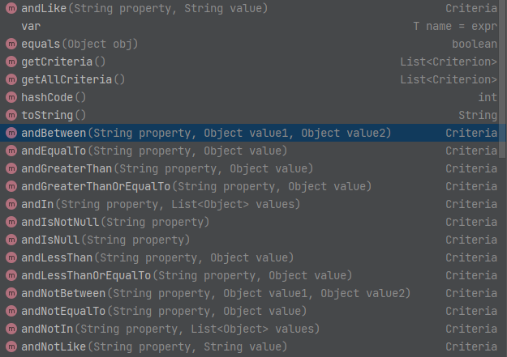

#### 删

```java
private IUserMapper userMapper;

/**
 * 删除
 */
@Test
public void test_tkmapper_delete() throws IOException {
    InputStream resourceAsStream = Resources.getResourceAsStream("sqlMapConfig.xml");
    SqlSessionFactory sqlSessionFactory = new SqlSessionFactoryBuilder().build(resourceAsStream);
    // 事务自动提交
    SqlSession sqlSession = sqlSessionFactory.openSession(true);
    userMapper = sqlSession.getMapper(IUserMapper.class);

    User user = new User();
    user.setUsername("tkmapper_insert");

	// 根据实体属性作为条件进行删除，查询条件使用等号
	int delete = userMapper.delete(user);

	// 根据主键字段进行删除，方法参数必须包含完整的主键属性
	userMapper.deleteByPrimaryKey(3);
}
```


---

# 第五章 Mybatis - 架构原理 

## 1、功能架构分层

### API 接口层

- 提供给外部使用的接口API，开发人员通过这些本地API来操纵数据库。接口层一接收到调用请求就会调用数据处理层来完成具体的数据处理

### 数据处理层

- 负责具体的SQL查找、SQL解析、SQL执行和执行结果映射处理等。它主要的目的是根据调用的请求完成一次数据库操作	

### 基础支撑层

- 负责最基础的功能支撑，包括连接管理、事务管理、配置加载和缓存处理，这些都是共用的东西，将他们抽取出来作为最基础的组件。为上层的数据处理层提供最基础的支撑


## 2、架构图

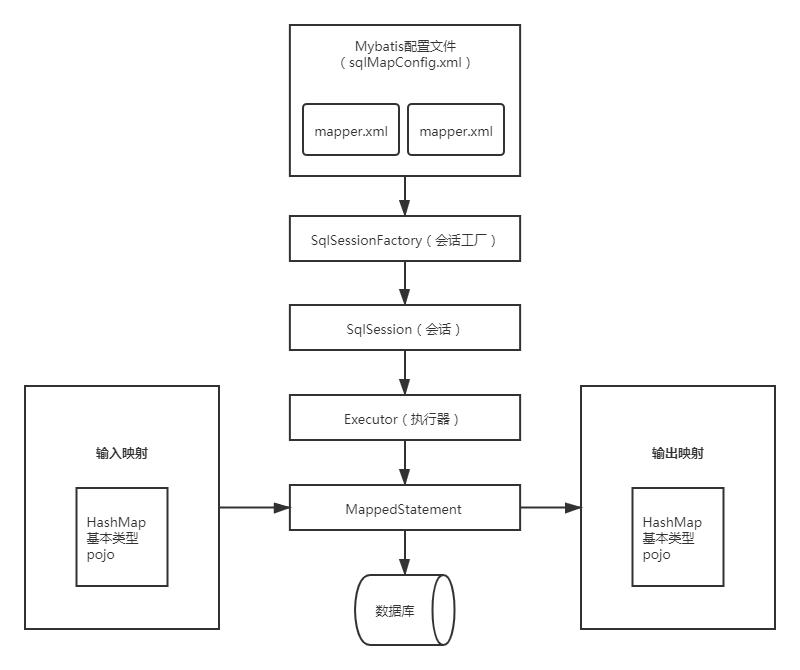

## 3、组件详解

### Mybatis的配置文件：SqlMapConfig.xml

- 此文件作为mybatis的全局配置文件，配置了Mybatis的运行环境等信息

### Mybatis的配置文件：mapper.xml

- sql映射文件，文件中配置了操作数据库的sql语句，此文件需要在SqlMapConfig.xml中加载

### SqlSessionFactory（会话工厂）

- 通过Mybatis环境等配置信息构造SqlSessionFactory即会话工厂

### SqlSession（会话）

- 由会话工厂创建sqlSession即会话，操作数据库需要通过sqlSession进行

### Executor（执行器）

- Mybatis底层自定义了Executor执行器接口操作数据库
- Executor接口有两个实现：一个是基本执行器、一个是缓存执行器

### 输入映射

- Mapped Statement对sql执行输入参数进行定义，包括HashMap、基本类型、pojo
- Executor通过Mapped Statement在执行sql前将输入的java对象映射至sql中
- 输入参数映射就是jdbc编程中对preparedStatement设置参数

### MappedStatement

- Mapped Statement也是Mybatis一个底层封装对象
- 它包装了Mybatis配置信息及sql映射信息等
- mapper.xml文件中一个sql对应一个Mapped Statement对象，sql的id即是Mapped statement的id

### 输出映射

- Mapped Statement对sql执行输出结果进行定义，包括HashMap、基本类型、pojo
- Executor通过Mapped Statement在执行sql后将输出结果映射至java对象中
- 输出结果映射过程相当于jdbc编程中对结果的解析处理过程


## 4、执行流程

### （1）加载配置并初始化

- 触发条件：加载配置文件
- 配置来源于两个地方，一个是配置文件(主配置文件conf.xml,mapper文件*.xml)，一个是java代码中的注解，将主配置文件内容解析封装到Configuration,将sql的配置信息加载成为一个mappedstatement对象，存储在内存之中

### （2）接收调用请求

- 触发条件：调用Mybatis提供的API
- 传入参数：为SQL的ID和传入参数对象
- 处理过程：将请求传递给下层的请求处理层进行处理。

### （3）处理操作请求

- 触发条件：API接口层传递请求过来

- 传入参数：为SQL的ID和传入参数对象

- 处理过程

  - 根据SQL的ID查找对应的MappedStatement对象。
  - 根据传入参数对象解析MappedStatement对象，得到最终要执行的SQL和执行传入参数。
  - 获取数据库连接，根据得到的最终SQL语句和执行传入参数到数据库执行，并得到执行结果。
  - 根据MappedStatement对象中的结果映射配置对得到的执行结果进行转换处理，并得到最终的处理结果。
  - 释放连接资源

  

---

# 第六章 Mybatis - 设计模式分析

## 1、Builder 构建者模式


## 2、工厂模式


## 3、代理模式


---

# 第七章 Mybatis - 源码分析  

## 1、传统方式源码分析


## 2、Mapper 代理方式分析


## 3、二级缓存源码分析


## 4、MyBatis 延迟加载源码分析


## 5、异常日志的输出（ErrorContext）


## 6、pagehelper 分页源码


---

# 第八章 Mybatis-Plus 

## 1、简介

### 1.1 网址

- 官网地址
  -  https://mybatis.plus/
  - https://mp.baomidou.com/ 
- 代码托管地址
  - GitHub地址：https://github.com/baomidou/mybatis-plus
  - 码云地址：https://gitee.com/baomidou/mybatis-plus
- 其他资料
  - 更新日志：https://github.com/baomidou/mybatis-plus/blob/3.0/CHANGELOG.md
  - 代码生成（逆向工程）：https://github.com/baomidou/generator
  - 功能示例：https://gitee.com/baomidou/mybatis-plus-samples
  - Mybatis-Plus 实践及架构原理：https://gitee.com/baomidou/mybatis-plus/attach_files
  - 视频教程、使用了mybatis的开源项目：https://github.com/baomidou/awesome-mybatis-plus


### 1.2 介绍 

```java
- MyBatis-Plus（简称 MP）是一个 MyBatis 的增强工具
- 在 MyBatis 的基础上只做增强不做改变，为简化开发、提高效率而生
- Mybatis-Plus是由baomidou（苞米豆）组织开发并且开源的
```


### 1.3 特性

```bash
# 无侵入
只做增强不做改变，引入它不会对现有工程产生影响，如丝般顺滑

# 损耗小
启动即会自动注入基本 CURD，性能基本无损耗，直接面向对象操作

# 强大的 CRUD 操作
内置通用 Mapper、通用 Service，仅仅通过少量配置即可实现单表大部分CRUD 操作，更有强大的条件构造器，满足各类使用需求

# 支持 Lambda 形式调用
通过 Lambda 表达式，方便的编写各类查询条件，无需再担心字段写错支持主键自动生成
支持多达 4 种主键策略（内含分布式唯一 ID 生成器Sequence），可自由配置，完美解决主键问题

# 支持 ActiveRecord 模式
支持 ActiveRecord 形式调用，实体类只需继承 Model 类即可进行强大的CRUD 操作

# 支持自定义全局通用操作
支持全局通用方法注入（ Write once, use anywhere ）

# 内置代码生成器
采用代码或者 Maven 插件可快速生成 Mapper 、 Model 、 Service 、Controller 层代码，支持模板引擎，更有超多自定义配置等您来使用

# 内置分页插件
基于 MyBatis 物理分页，开发者无需关心具体操作，配置好插件之后，写分页等同于普通 List 查询

# 分页插件支持多种数据库
支持 MySQL、MariaDB、Oracle、DB2、H2、HSQL、SQLite、Postgre、SQLServer、presto 、Gauss 、Firebird等多种数据库
Phoenix 、clickhouse 、Sybase ASE 、 OceanBase 、达梦数据库 、虚谷数据库 、人大金仓数据库 、南大通用数据库 

# 内置性能分析插件
可输出 Sql 语句以及其执行时间，建议开发测试时启用该功能，能快速揪出慢查询

# 内置全局拦截插件
提供全表 delete 、 update 操作智能分析阻断，也可自定义拦截规则，预防误操作
```


### 1.4 架构图

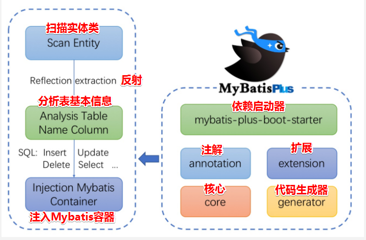


## 2、快速搭建

### 步骤1：安装要求（MyBatis-Plus 3.0+）

- JDK 8+ 

- Maven or Gradle


### 步骤2：依赖包

- Springboot项目

```xml
<dependency> 
    <groupId>com.baomidou</groupId> 
    <artifactId>mybatis-plus-boot-starter</artifactId> 
    <version>3.4.0</version> 
</dependency>
```

- SpringMVC项目

```xml
<dependency> 
    <groupId>com.baomidou</groupId> 
    <artifactId>mybatis-plus</artifactId> 
    <version>3.4.0</version> 
</dependency>
```

- 引入 ==MyBatis-Plus==之后请不要再次引入==MyBatis==以及==MyBatis-Spring==，以避免因版本差异导致的问题


### 步骤3：表结构

```mysql
# 创建 mp_user 用户表
DROP TABLE IF EXISTS mp_user;
CREATE TABLE mp_user
(
    id        BIGINT(20)  NOT NULL AUTO_INCREMENT COMMENT '主键ID',
    name      VARCHAR(30) NULL DEFAULT NULL COMMENT '姓名',
    age       INT(11)     NULL DEFAULT NULL COMMENT '年龄',
    email     VARCHAR(50) NULL DEFAULT NULL COMMENT '邮箱',
    info_mark VARCHAR(50) NULL DEFAULT NULL COMMENT '个人备注',
    version   INT(10)     NULL DEFAULT 1 COMMENT '版本号',
    deleted   INT(1)      NULL DEFAULT 0 COMMENT '1删除，0未删除',
    PRIMARY KEY (id)
) comment = 'MybatisPlus的user表';
```


### 步骤4：Mybatis 整合 MP

#### 方式1：Mybatis + Plus

##### （0）pom.xml

```xml
<?xml version="1.0" encoding="UTF-8"?>
<project xmlns="http://maven.apache.org/POM/4.0.0"
         xmlns:xsi="http://www.w3.org/2001/XMLSchema-instance"
         xsi:schemaLocation="http://maven.apache.org/POM/4.0.0 http://maven.apache.org/xsd/maven-4.0.0.xsd">
    <modelVersion>4.0.0</modelVersion>

    <!-- 父工程信息 -->
    <parent>
        <artifactId>JavaWeb_7.1_Mybatis</artifactId>
        <groupId>com.loto</groupId>
        <version>1.0-SNAPSHOT</version>
    </parent>

    <artifactId>MybatisPlus1-Mybatis-Plus</artifactId>

    <!-- 解决Language Level版本问题 -->
    <properties>
        <maven.compiler.source>8</maven.compiler.source>
        <maven.compiler.target>8</maven.compiler.target>
    </properties>

    <dependencies>
        <!-- mybatis-plus插件依赖 -->
        <dependency>
            <groupId>com.baomidou</groupId>
            <artifactId>mybatis-plus</artifactId>
            <version>3.1.1</version>
        </dependency>

        <!--Mysql-->
        <dependency>
            <groupId>mysql</groupId>
            <artifactId>mysql-connector-java</artifactId>
            <version>5.1.47</version>
        </dependency>

        <!--连接池-->
        <dependency>
            <groupId>com.alibaba</groupId>
            <artifactId>druid</artifactId>
            <version>1.0.11</version>
        </dependency>

        <!--简化bean代码的⼯具包-->
        <dependency>
            <groupId>org.projectlombok</groupId>
            <artifactId>lombok</artifactId>
            <version>1.18.18</version>
        </dependency>

        <!-- https://mvnrepository.com/artifact/junit/junit -->
        <dependency>
            <groupId>junit</groupId>
            <artifactId>junit</artifactId>
            <version>4.13.1</version>
        </dependency>

        <dependency>
            <groupId>org.slf4j</groupId>
            <artifactId>slf4j-log4j12</artifactId>
            <version>1.7.30</version>
        </dependency>
    </dependencies>

    <build>
        <plugins>
            <plugin>
                <groupId>org.apache.maven.plugins</groupId>
                <artifactId>maven-compiler-plugin</artifactId>
                <configuration>
                    <source>1.8</source>
                    <target>1.8</target>
                </configuration>
            </plugin>
        </plugins>
    </build>

</project>
```

##### （1）sqlMapConfig.xml

```xml
<?xml version="1.0" encoding="UTF-8" ?>
<!DOCTYPE configuration
        PUBLIC "-//mybatis.org//DTD Config 3.0//EN"
        "http://mybatis.org/dtd/mybatis-3-config.dtd">

<configuration>
    <!-- 数据源配置 -->
    <properties resource="jdbc.properties"/>

    <!-- 运行环境 -->
    <environments default="development">
        <environment id="development">
            <!--当前的事务事务管理器是JDBC-->
            <transactionManager type="JDBC"/>

            <!--数据源信息 POOLED：使用mybatis的连接池-->
            <dataSource type="POOLED">
                <property name="driver" value="${jdbc.driver}"/>
                <property name="url" value="${jdbc.url}"/>
                <property name="username" value="${jdbc.username}"/>
                <property name="password" value="${jdbc.password}"/>
            </dataSource>
        </environment>
    </environments>

    <!-- 引入映射配置文件 -->
    <mappers>
        <package name="com.loto.mapper"/>
    </mappers>

</configuration>
```

##### （2）jdbc.properties

```properties
jdbc.driver = com.mysql.jdbc.Driver
jdbc.url=jdbc:mysql:///JavaWeb_7.1_Mybatis
jdbc.username=root
jdbc.password=root
```

##### （3）log4j.properties

```properties
log4j.rootLogger = DEBUG,A1
log4j.appender.A1 = org.apache.log4j.ConsoleAppender
log4j.appender.A1.layout = org.apache.log4j.PatternLayout
log4j.appender.A1.layout.ConversionPattern = [%t] [%c]-[%p] %m%n
```

##### （4）实体类 User

```java
@Data                   // Lombok 插件自动生成 getter 和 setter
@NoArgsConstructor      // 生成无参构造
@AllArgsConstructor     // 生成全参构造
@TableName("mp_user")   // 指定数据库表名
public class User {
    private Long id;
    private String name;
    private Integer age;
    private String email;
}
```

##### （5）UserMapper_MybatisPlus.java

```java
public interface UserMapper_MybatisPlus extends BaseMapper<User> {
    /**
     * 查询所有用户
     */
    public List<User> findAll();
}
```

##### （6）UserMapper_MybatisPlus.xml

```xml
<?xml version="1.0" encoding="UTF-8" ?>
<!DOCTYPE mapper
        PUBLIC "-//mybatis.org//DTD Mapper 3.0//EN"
        "http://mybatis.org/dtd/mybatis-3-mapper.dtd">

<mapper namespace="com.loto.mapper.UserMapper_MybatisPlus">
    <!-- 查询所有用户信息 -->
    <select id="findAll" resultType="com.loto.pojo.User">
        select *
        from mp_user
    </select>
</mapper>
```

##### （7）Test_MybatisPlus.java

```java
@Test
public void mybatisPlusTest() throws IOException {
    InputStream resourceAsStream = Resources.getResourceAsStream("sqlMapConfig.xml");
    // 使用 MybatisPlus
    SqlSessionFactory sqlSessionFactory = new MybatisSqlSessionFactoryBuilder().build(resourceAsStream);
    SqlSession sqlSession = sqlSessionFactory.openSession();
    UserMapper_MybatisPlus mapper = sqlSession.getMapper(UserMapper_MybatisPlus.class);

    List<User> users1 = mapper.findAll();
    System.out.println("======== findAll 方法 ========");
    for (User user : users1) {
        System.out.println(user);
    }

    List<User> users2 = mapper.selectList(null);
    System.out.println("======== selectList 方法（MybatisPlus提供） ========");
    for (User user : users2) {
        System.out.println(user);
    }
}
```


#### 方式2：Mybatis + Plus + Spring

##### （0）pom.xml

```xml
<?xml version="1.0" encoding="UTF-8"?>
<project xmlns="http://maven.apache.org/POM/4.0.0"
         xmlns:xsi="http://www.w3.org/2001/XMLSchema-instance"
         xsi:schemaLocation="http://maven.apache.org/POM/4.0.0 http://maven.apache.org/xsd/maven-4.0.0.xsd">
    <modelVersion>4.0.0</modelVersion>

    <!-- 父工程信息 -->
    <parent>
        <artifactId>JavaWeb_7.1_Mybatis</artifactId>
        <groupId>com.loto</groupId>
        <version>1.0-SNAPSHOT</version>
    </parent>

    <artifactId>MybatisPlus2-Mybatis-Plus-Spring</artifactId>

    <properties>
        <!-- 解决Language Level版本问题 -->
        <maven.compiler.source>8</maven.compiler.source>
        <maven.compiler.target>8</maven.compiler.target>

        <spring.version>5.2.13.RELEASE</spring.version>
    </properties>

    <dependencies>
        <dependency>
            <groupId>org.springframework</groupId>
            <artifactId>spring-webmvc</artifactId>
            <version>${spring.version}</version>
        </dependency>
        <dependency>
            <groupId>org.springframework</groupId>
            <artifactId>spring-jdbc</artifactId>
            <version>${spring.version}</version>
        </dependency>
        <dependency>
            <groupId>org.springframework</groupId>
            <artifactId>spring-test</artifactId>
            <version>${spring.version}</version>
        </dependency>

        <!-- mybatis-plus插件依赖 -->
        <dependency>
            <groupId>com.baomidou</groupId>
            <artifactId>mybatis-plus</artifactId>
            <version>3.1.1</version>
        </dependency>

        <!--Mysql-->
        <dependency>
            <groupId>mysql</groupId>
            <artifactId>mysql-connector-java</artifactId>
            <version>5.1.47</version>
        </dependency>

        <!--连接池-->
        <dependency>
            <groupId>com.alibaba</groupId>
            <artifactId>druid</artifactId>
            <version>1.0.11</version>
        </dependency>

        <!--简化bean代码的⼯具包-->
        <dependency>
            <groupId>org.projectlombok</groupId>
            <artifactId>lombok</artifactId>
            <version>1.18.18</version>
        </dependency>

        <!-- https://mvnrepository.com/artifact/junit/junit -->
        <dependency>
            <groupId>junit</groupId>
            <artifactId>junit</artifactId>
            <version>4.13.1</version>
        </dependency>

        <dependency>
            <groupId>org.slf4j</groupId>
            <artifactId>slf4j-log4j12</artifactId>
            <version>1.7.30</version>
        </dependency>
    </dependencies>

    <build>
        <plugins>
            <plugin>
                <groupId>org.apache.maven.plugins</groupId>
                <artifactId>maven-compiler-plugin</artifactId>
                <configuration>
                    <source>1.8</source>
                    <target>1.8</target>
                </configuration>
            </plugin>
        </plugins>
    </build>

</project>
```

##### （1）applicationContext.xml

```xml
<?xml version="1.0" encoding="UTF-8"?>
<beans xmlns="http://www.springframework.org/schema/beans"
       xmlns:xsi="http://www.w3.org/2001/XMLSchema-instance"
       xmlns:context="http://www.springframework.org/schema/context"
       xsi:schemaLocation="
       	http://www.springframework.org/schema/beans
		http://www.springframework.org/schema/beans/spring-beans.xsd
       	http://www.springframework.org/schema/context
		http://www.springframework.org/schema/context/spring-context.xsd">

    <!-- 引入properties文件-->
    <context:property-placeholder location="classpath:jdbc.properties"/>

    <!-- 数据源 -->
    <bean id="dataSource" class="com.alibaba.druid.pool.DruidDataSource">
        <property name="driverClassName" value="${jdbc.driver}"/>
        <property name="url" value="${jdbc.url}"/>
        <property name="username" value="${jdbc.username}"/>
        <property name="password" value="${jdbc.password}"/>
    </bean>

    <!-- 将sqlSessionFactory对象的创建交给spring -->
    <bean id="sqlSessionFactory" class="com.baomidou.mybatisplus.extension.spring.MybatisSqlSessionFactoryBean">
        <property name="dataSource" ref="dataSource"/>
    </bean>

    <!-- mapper映射扫描 -->
    <bean class="org.mybatis.spring.mapper.MapperScannerConfigurer">
        <property name="basePackage" value="com.loto.mapper"/>
    </bean>

</beans>
```

##### （2）jdbc.properties

```properties
jdbc.driver = com.mysql.jdbc.Driver
jdbc.url=jdbc:mysql:///JavaWeb_7.1_Mybatis
jdbc.username=root
jdbc.password=root
```

##### （3）log4j.properties

```properties
log4j.rootLogger = DEBUG,A1
log4j.appender.A1 = org.apache.log4j.ConsoleAppender
log4j.appender.A1.layout = org.apache.log4j.PatternLayout
log4j.appender.A1.layout.ConversionPattern = [%t] [%c]-[%p] %m%n
```

##### （4）实体类 User

```java
@Data                   // Lombok 插件自动生成 getter 和 setter
@NoArgsConstructor      // 生成无参构造
@AllArgsConstructor     // 生成全参构造
@TableName("mp_user")   // 指定数据库表名
public class User {
    private Long id;
    private String name;
    private Integer age;
    private String email;
}
```

##### （5）UserMapper.java

```java
public interface UserMapper extends BaseMapper<User> {
    /**
     * 查询所有用户
     */
    @Select("SELECT * FROM mp_user")
    public List<User> findAll();
}
```

##### （6）Test_MybatisPlus_Spring.java

```java
@RunWith(SpringJUnit4ClassRunner.class)
@ContextConfiguration(locations = "classpath:applicationContext.xml")
public class Test_MybatisPlus_Spring {
    @Autowired
    private UserMapper userMapper;

    @Test
    public void test() {
        List<User> users = userMapper.selectList(null);
        for (User user : users) {
            System.out.println(user);
        }

        List<User> users2 = userMapper.findAll();
        for (User user : users2) {
            System.out.println(user);
        }

    }
}
```


#### 方式3：Mybatis + Plus + SpringBoot

##### （0）pom.xml

```xml
<?xml version="1.0" encoding="UTF-8"?>
<project xmlns="http://maven.apache.org/POM/4.0.0" xmlns:xsi="http://www.w3.org/2001/XMLSchema-instance"
         xsi:schemaLocation="http://maven.apache.org/POM/4.0.0 https://maven.apache.org/xsd/maven-4.0.0.xsd">
    <modelVersion>4.0.0</modelVersion>

    <!-- 父工程信息 -->
    <parent>
        <groupId>org.springframework.boot</groupId>
        <artifactId>spring-boot-starter-parent</artifactId>
        <version>2.4.3</version>
        <relativePath/> <!-- lookup parent from repository -->
    </parent>

    <!-- 本工程信息 -->
    <groupId>com.loto</groupId>
    <artifactId>mybatisplus3-mybatis-plus-springboot</artifactId>
    <version>0.0.1-SNAPSHOT</version>
    <name>mybatisplus3-mybatis-plus-springboot</name>
    <description>Demo project for Spring Boot</description>

    <properties>
        <java.version>1.8</java.version>

        <!-- 解决Language Level版本问题 -->
        <maven.compiler.source>8</maven.compiler.source>
        <maven.compiler.target>8</maven.compiler.target>
    </properties>

    <dependencies>
        <!-- SpringBoot -->
        <dependency>
            <groupId>org.springframework.boot</groupId>
            <artifactId>spring-boot-starter</artifactId>
            <exclusions>
                <exclusion>
                    <groupId>org.springframework.boot</groupId>
                    <artifactId>spring-boot-starter-logging</artifactId>
                </exclusion>
            </exclusions>
        </dependency>

        <!-- SpringBoot 测试 -->
        <dependency>
            <groupId>org.springframework.boot</groupId>
            <artifactId>spring-boot-starter-test</artifactId>
            <scope>test</scope>
        </dependency>

        <!-- 简化代码的⼯具包 -->
        <dependency>
            <groupId>org.projectlombok</groupId>
            <artifactId>lombok</artifactId>
            <version>1.18.18</version>
        </dependency>

        <!-- mybatis-plus的springboot⽀持 -->
        <dependency>
            <groupId>com.baomidou</groupId>
            <artifactId>mybatis-plus-boot-starter</artifactId>
            <version>3.1.1</version>
        </dependency>

        <!--mysql驱动-->
        <dependency>
            <groupId>mysql</groupId>
            <artifactId>mysql-connector-java</artifactId>
            <version>5.1.47</version>
        </dependency>

        <dependency>
            <groupId>org.slf4j</groupId>
            <artifactId>slf4j-log4j12</artifactId>
            <version>1.7.30</version>
        </dependency>

        <!-- https://mvnrepository.com/artifact/junit/junit -->
        <dependency>
            <groupId>junit</groupId>
            <artifactId>junit</artifactId>
            <version>4.13.1</version>
        </dependency>
    </dependencies>

    <build>
        <plugins>
            <plugin>
                <groupId>org.springframework.boot</groupId>
                <artifactId>spring-boot-maven-plugin</artifactId>
            </plugin>
            <plugin>
                <groupId>org.apache.maven.plugins</groupId>
                <artifactId>maven-compiler-plugin</artifactId>
                <configuration>
                    <source>8</source>
                    <target>8</target>
                </configuration>
            </plugin>
        </plugins>
    </build>

</project>
```

##### （1）application.properties

```properties
spring.datasource.driver-class-name = com.mysql.jdbc.Driver
spring.datasource.url = jdbc:mysql:///JavaWeb_7.1_Mybatis?useUnicode=true&characterEncoding=utf8&autoReconnect=true&allowMultiQueries=true&useSSL=false
spring.datasource.username = root
spring.datasource.password = root

# configLocation：加载全局配置文件
#mybatis-plus.config-location = classpath:sqlMapConfig.xml

# mapperLocations：加载映射配置文件
mybatis-plus.mapper-locations = classpath*:mapper/*.xml

# typeAliasesPackage：起别名
mybatis-plus.type-aliases-package = com.loto.pojo

# mapUnderscoreToCamelCase：是否开启自动驼峰映射（默认开启，值为true）
# 默认开启时，当数据库字段在实体类中的命名符合驼峰规则，则⽆需在实体类的成员变量上使⽤ @TableField 注解去指定数据库字段名
# 规则：从经典数据库列名 A_COLUMN（下划线命名） 到经典 Java 属性名 aColumn（驼峰命名） 的类似映射
# 关闭⾃动驼峰映射时，该参数不能和 mybatis-plus.config-location 同时存在
#mybatis-plus.configuration.map-underscore-to-camel-case = false

# cacheEnabled：全局地开启或关闭配置⽂件中的所有映射器已经配置的任何缓存，默认为 true
#mybatis-plus.configuration.cache-enabled = false

# idType：设置全局的主键生成策略
#（1）AUTO：主键自增
#（2）NONE：不设置主键类型
#（3）INPUT：用户输入主键 ID
# 以下3种类型、只有当插入对象ID 为空，才自动填充
#（4）ID_WORKER：全局唯一ID (idWorker)
#（5）ID_WORKER_STR：字符串全局唯一ID (idWorker 的字符串表示)
#（6）UUID：全局唯一ID (UUID)
mybatis-plus.global-config.db-config.id-type = auto

# tablePrefix：全局配置表名前缀
# 全局配置 tablePrefix 后，可省略 @TableName() 配置
mybatis-plus.global-config.db-config.table-prefix = mp_

# 逻辑已删除值(默认为 1)
mybatis-plus.global-config.db-config.logic-delete-value = 1
# 逻辑未删除值(默认为 0)
mybatis-plus.global-config.db-config.logic-not-delete-value = 0
```

##### （2）log4j.properties

```properties
log4j.rootLogger = info,A1
log4j.appender.A1 = org.apache.log4j.ConsoleAppender
log4j.appender.A1.layout = org.apache.log4j.PatternLayout
log4j.appender.A1.layout.ConversionPattern = [%t] [%c]-[%p] %m%n

# 对某一包下的文件打印信息设置打印级别
log4j.logger.com.loto = TRACE
```

##### （3）实体类 User

```java

@Data                   // Lombok 插件自动生成 getter 和 setter
@NoArgsConstructor      // 生成无参构造
@AllArgsConstructor     // 生成全参构造
//@TableName("mp_user")   // 指定数据库表名（全局配置 tablePrefix 后，可省略 @TableName() 配置）
public class User {
    /**
     * 主键生成策略
     * */
    //@TableId(type = IdType.AUTO)
    private Long id;

    /**
     * 查询的时候，返回该字段的值
     * */
    @TableField(select = true)
    private String name;

    /**
    * 查询的时候，不返回该字段的值
    * */
    @TableField(select = false)
    private Integer age;

    /**
     * 解决字段名不一致问题
     * */
    @TableField(value = "email")
    private String mail;

    /**
     * 该字段在数据库表中不存在
     * */
    @TableField(exist = false)
    private String address;

    /**
     * 该字段满足从经典数据库列名 A_COLUMN（下划线命名） 到经典 Java 属性名 aColumn（驼峰命名） 的类似映射
     * <p> info_mark -> infoMark
     * */
    private String infoMark;
}
```

##### （4）UserMapper.java

```java
public interface UserMapper extends BaseMapper<User> {
    /**
     * 注解式：自定义 sql
     * <p>查询所有用户
     */
    @Select("SELECT * FROM mp_user")
    public List<User> findAll();
}
```

##### （5）启动类 MybatisPlus3_SpringbootApplication.java

```java
import org.mybatis.spring.annotation.MapperScan;
import org.springframework.boot.SpringApplication;
import org.springframework.boot.autoconfigure.SpringBootApplication;

// mapper 接口的扫描包路径
@MapperScan("com.loto.mapper")
@SpringBootApplication
public class MybatisPlus3_SpringbootApplication {
    public static void main(String[] args) {
        SpringApplication.run(MybatisPlus3_SpringbootApplication.class, args);
    }
}
```

##### （6）测试类 Test_MybatisPlus3_SpringbootApplication.java

```java
import com.loto.mapper.UserMapper;
import com.loto.pojo.User;
import org.junit.Test;
import org.junit.runner.RunWith;
import org.springframework.beans.factory.annotation.Autowired;
import org.springframework.boot.test.context.SpringBootTest;
import org.springframework.test.context.junit4.SpringRunner;

import java.util.List;

@RunWith(SpringRunner.class)
@SpringBootTest
public class Test_MybatisPlus3_SpringbootApplication {
    @Autowired
    private UserMapper userMapper;

    /**
     * 使用 MybatisPlus 提供的方法
     * */
    @Test
    public void testSelect() {
        List<User> users = userMapper.selectList(null);
        for (User user : users) {
            System.out.println(user);
        }
    }

    /**
     * 注解式：自定义 sql
     * */
    @Test
    public void testFindAll() {
        List<User> all = userMapper.findAll();
        for (User user : all) {
            System.out.println(user);
        }
    }
}
```


## 3、注解

```
@TableName
- 指定数据库表名（全局配置 tablePrefix 后，可省略 @TableName() 配置）

@TableId
- 主键生成策略

@TableField（可以指定字段的一些属性）
- 对象中的属性名和字段名不一致的问题（非驼峰）
- 对象中的属性字段在表中不存在的问题
```


## 4、CRUD操作

### 增

```java
@RunWith(SpringRunner.class)
@SpringBootTest
public class Test_Insert {
    @Autowired
    private UserMapper userMapper;

    @Test
    public void testInsert() {
        User user = new User();
        user.setName("TD");
        user.setAge(20);
        user.setMail("TD@loto.com");

        // 返回值 result 是受影响的数据的行数
        int result = userMapper.insert(user);
        System.out.println("受影响的数据的行数：" + result);

        // id为主键自增
        System.out.println("id值为" + user.getId());
    }
}
```

### 改

```java
@RunWith(SpringRunner.class)
@SpringBootTest
public class Test_Update {
    @Autowired
    private UserMapper userMapper;

    /**
     * <p>方式1：根据 ID 进行修改</p>
     * 效果：将 id 为 4 的数据中的 age 修改为 30
     */
    @Test
    public void test_UpdateById() {
        User user = new User();
        user.setId(4L);
        user.setAge(30);

        int i = userMapper.updateById(user);
        System.out.println("受影响的数据的行数：" + i);
    }

    /**
     * <p>方式2：根据条件进行修改（使用 QueryWrapper）</p>
     * 效果：将 name 为 TD 的数据中的 age 修改为 28
     */
    @Test
    public void test_UpdateByCondition_QueryWrapper() {
        // 1. 要更新的字段
        User user = new User();
        user.setAge(28);

        // 2.更新的条件
        QueryWrapper<User> queryWrapper = new QueryWrapper<>();
        queryWrapper.eq("name", "TD");

        // 参数1：要更新的字段  参数2：更新的条件
        int i = userMapper.update(user, queryWrapper);
        System.out.println("受影响的数据的行数：" + i);
    }

    /**
     * <p>方式3：根据条件进行修改（使用 UpdateWrapper）</p>
     * 效果：将 id 为 5 的数据中的 age 修改为 40
     */
    @Test
    public void test_UpdateByCondition_UpdateWrapper() {
        UpdateWrapper<User> updateWrapper = new UpdateWrapper<>();
        updateWrapper.eq("id", 5).set("age", 40);

        int i = userMapper.update(null, updateWrapper);
        System.out.println("受影响的数据的行数：" + i);
    }

}
```

### 查

```java
@RunWith(SpringRunner.class)
@SpringBootTest
public class Test_Select {
    @Autowired
    private UserMapper userMapper;

    /**
     * 方式1：根据 ID 进行查询
     */
    @Test
    public void testSelectById() {
        User user = userMapper.selectById(2L);
        System.out.println(user);
    }

    /**
     * 方式2：根据 ID 进行批量查询
     */
    @Test
    public void testSelectBatchIds() {
        List<User> users = userMapper.selectBatchIds(Arrays.asList(2L, 3L));
        for (User user : users) {
            System.out.println(user);
        }
    }

    /**
     * 方式3：根据条件查询1条数据（selectOne方法）
     */
    @Test
    public void testSelectOne() {
        QueryWrapper<User> queryWrapper = new QueryWrapper<>();
        queryWrapper.eq("name", "Jone");

        // 根据条件查询一条记录，如果查询结果超过一条，会报错
        User user = userMapper.selectOne(queryWrapper);
        System.out.println(user);
    }

    /**
     * 方式4：根据 queryWrapper 匹配查询条件，查询总记录数（selectCount）
     */
    @Test
    public void testSelectCount() {
        // 查询年龄大于18的
        QueryWrapper<User> queryWrapper = new QueryWrapper<>();
        queryWrapper.gt("age", 18);

        // 根据条件查询数据条数
        Integer count = userMapper.selectCount(queryWrapper);
        System.out.println(count);
    }

    /**
     * 方式5：根据 queryWrapper 匹配查询条件，查询全部录数（selectList）
     */
    @Test
    public void testSelectList() {
        // 查询年龄大于18的
        QueryWrapper<User> queryWrapper = new QueryWrapper<>();
        queryWrapper.gt("age", 18);

        // 根据条件查询数据条数
        List<User> users = userMapper.selectList(queryWrapper);
        for (User user : users) {
            System.out.println(user);
        }
    }
}

```

### 分页查询

#### （1）配置分页插件

- 方式1：配置类 

```java
import com.baomidou.mybatisplus.extension.plugins.PaginationInterceptor;
import org.springframework.context.annotation.Bean;
import org.springframework.context.annotation.Configuration;

@Configuration
public class MybatisPlus_PageConfig {
    /**
     * 分页插件配置
     * <p>方式1：写在类中
     * <p>方式2：写在 sqlMapConfig.xml 中
     */
    @Bean
    public PaginationInterceptor paginationInterceptor() {
        return new PaginationInterceptor();
    }
}
```

- 方式2：写在 sqlMapConfig.xml 中

```xml
<?xml version="1.0" encoding="UTF-8" ?>
<!DOCTYPE configuration
        PUBLIC "-//mybatis.org//DTD Config 3.0//EN"
        "http://mybatis.org/dtd/mybatis-3-config.dtd">

<configuration>
    <!-- 分页插件配置
     * 方式1：写在类中
     * 方式2：写在 sqlMapConfig.xml 中
     -->
    <plugins>
        <plugin interceptor="com.baomidou.mybatisplus.extension.plugins.PaginationInterceptor"/>
    </plugins>
</configuration>
```

application.properties 添加 configLocation：加载全局配置文件

```properties
# configLocation：加载全局配置文件
mybatis-plus.config-location = classpath:sqlMapConfig.xml
```

#### （2）测试类

```java
@RunWith(SpringRunner.class)
@SpringBootTest
public class Test_Select {
    @Autowired
    private UserMapper userMapper;
    
  	/**
     * 方式6：分页查询
     */
    @Test
    public void testSelectPage() {
        // 第一个参数：当前页
        // 第二个参数：每页显示条数
        Page<User> page = new Page<>(1, 2);

        // 查询年龄大于18的
        QueryWrapper<User> queryWrapper = new QueryWrapper<>();
        queryWrapper.gt("age", 10);

        IPage<User> userIPage = userMapper.selectPage(page, queryWrapper);
        System.out.println("总条数：" + userIPage.getTotal());
        System.out.println("总页数：" + userIPage.getPages());
        System.out.println("分页数据：" + userIPage.getRecords());
    }
}
```

### 删

```java
@RunWith(SpringRunner.class)
@SpringBootTest
public class Test_Delete {
    @Autowired
    private UserMapper userMapper;

    /**
     * <p>方式1：根据 ID 进行删除</p>
     * 效果：删除 id 为 9 的数据
     */
    @Test
    public void testDeleteById() {
        int i = userMapper.deleteById(9L);
        System.out.println("受影响的数据的行数：" + i);
    }

    /**
     * <p>方式2：根据 columnMap 进行删除</p>
     * 效果：删除满足条件 name 为 CJ，age 为 18 的所有数据
     */
    @Test
    public void testDeleteByMap() {
        // 删除的条件，多个条件就在map中放入多个
        HashMap<String, Object> map = new HashMap<>();
        map.put("name", "CJ");
        map.put("age", 18);

        map.forEach((key, value) -> {
            System.out.println("name：" + key);
            System.out.println("age" + value);
        });

        // 将 columnMap 中的元素设置为删除的条件，多个条件是and的关系
        int i = userMapper.deleteByMap(map);
        System.out.println("受影响的数据的行数：" + i);
    }

    /**
     * <p>方式3：根据 delete 方法进行删除</p>
     * 效果：删除满足条件的所有数据
     */
    @Test
    public void testDelete() {
        // 删除的条件（方法1） - 推荐
        User user = new User();
        user.setName("CJ");
        user.setAge(18);

        QueryWrapper<User> userQueryWrapper = new QueryWrapper<>(user);
        // 删除的条件（方法2）
        // userQueryWrapper.eq("name","CJ").eq("age",18);

        int i = userMapper.delete(userQueryWrapper);
        System.out.println("受影响的数据的行数：" + i);
    }

    /**
     * <p>方式4：根据 deleteBatchIds 方法进行删除</p>
     * <p>效果：根据 ID 删除满足条件（id为10和11）的所有数据</p>
     * SQL：DELETE FROM mp_user WHERE id IN ( ? , ? )
     */
    @Test
    public void testDeleteBatchIds() {
        int i = userMapper.deleteBatchIds(Arrays.asList(10L, 11L));
        System.out.println("受影响的数据的行数：" + i);
    }
}
```


## 5、MybatisPlus 配置属性

### 类型1：基本配置

#### （1）configLocation：加载全局配置文件

- MyBatis 配置文件位置，如果有单独的 MyBatis 配置，请将其路径配置到 configLocation 中

- 官方文档：https://mybatis.plus/config/


- Spring Boot项目 

```properties
mybatis-plus.config-location = classpath:mybatis-config.xml
```

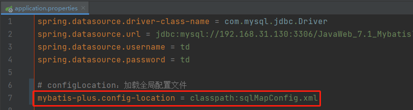


- Spring MVC项目

```xml
<bean id="sqlSessionFactory" class="com.baomidou.mybatisplus.extension.spring.MybatisSqlSessionFactoryBean">
	<property name="configLocation" value="classpath:mybatis-config.xml"/>
</bean>
```


#### （2）mapperLocations：加载映射配置文件

- Spring Boot项目 

```properties
# mapperLocations：加载映射配置文件
mybatis-plus.mapper-locations = classpath*:mapper/*.xml
```

- Spring MVC项目

```xml
<bean id="sqlSessionFactory" class="com.baomidou.mybatisplus.extension.spring.MybatisSqlSessionFactoryBean">
 <property name="mapperLocations" value="classpath*:mybatis/*.xml"/>
</bean>
```


#### （3）typeAliasesPackage：起别名

- Spring Boot项目 

```properties
# typeAliasesPackage：起别名
mybatis-plus.type-aliases-package = com.loto.pojo
```

- Spring MVC项目

```xml
<bean id="sqlSessionFactory" class="com.baomidou.mybatisplus.extension.spring.MybatisSqlSessionFactoryBean">
 <property name="typeAliasesPackage" value="com.loto.pojo"/>
</bean>
```


### 类型2：进阶配置

#### （1）mapUnderscoreToCamelCase：是否开启自动驼峰映射

```properties
# mapUnderscoreToCamelCase：是否开启自动驼峰映射（默认开启，值为true）
# 默认开启时，当数据库字段在实体类中的命名符合驼峰规则，则无需在实体类的成员变量上使用 @TableField 注解去指定数据库字段名
# 规则：从经典数据库列名 A_COLUMN（下划线命名） 到经典 Java 属性名 aColumn（驼峰命名） 的类似映射
# 关闭自动驼峰映射时，该参数不能和 mybatis-plus.config-location 同时存在
mybatis-plus.configuration.map-underscore-to-camel-case = false
```


#### （2）cacheEnabled：是否开启所有映射器已经配置缓存

```properties
# cacheEnabled：全局地开启或关闭配置文件中的所有映射器已经配置的任何缓存，默认为 true
mybatis-plus.configuration.cache-enabled = false
```


### 类型3：DB 策略配置

#### （1）idType：设置全局的主键生成策略

```properties
# idType：设置全局的主键生成策略
#（1）AUTO：主键自增
#（2）NONE：不设置主键类型
#（3）INPUT：用户输入主键 ID
# 以下3种类型、只有当插入对象ID 为空，才自动填充
#（4）ID_WORKER：全局唯一ID (idWorker)
#（5）ID_WORKER_STR：字符串全局唯一ID (idWorker 的字符串表示)
#（6）UUID：全局唯一ID (UUID)
mybatis-plus.global-config.db-config.id-type = auto
```


#### （2）tablePrefix：全局配置表名前缀

```properties
# tablePrefix：全局配置表名前缀
# 全局配置 tablePrefix 后，可省略 @TableName() 配置
mybatis-plus.global-config.db-config.table-prefix = tb_
```


## 6、条件构造器

### （1）allEq方法

- 方法

```java
// 参数1：params（key 为数据库字段名, value 为字段值）
allEq(Map<R, V> params) 
    
// 参数1：params（key 为数据库字段名, value 为字段值）
// 参数2：null2IsNull
// 		为 true 则在 map 的 value 为 null 时调用 isNull 方法
//	    为 false 时则忽略 value 为 null 的
allEq(Map<R, V> params, boolean null2IsNull) 
    
// 参数1：condition（为true，参数3才会起作用 为false，参数3不起作用，且没有where条件）
// 参数2：params（key 为数据库字段名, value 为字段值）
// 参数3：null2IsNull
//    为 true 则在 map 的 value 为 null 时调用 isNull 方法
//    为 false 时则忽略 value 为 null 的
allEq(boolean condition, Map<R, V> params, boolean null2IsNull)
    
// 参数1：filter（过滤函数,是否允许字段传入比对条件中）
// 参数2：params（key 为数据库字段名, value 为字段值
allEq(BiPredicate<R, V> filter, Map<R, V> params) 
    
// allEq(BiPredicate  filter, Map  params, boolean null2IsNull)
// 参数1：filter（过滤函数,是否允许字段传入比对条件中）
// 参数2：params（key 为数据库字段名, value 为字段值）
// 参数3：null2IsNull
//    为 true 则在 map 的 value 为 null 时调用 isNull 方法
//    为 false 时则忽略 value 为 null 的
allEq(BiPredicate<R, V> filter, Map<R, V> params, boolean null2IsNull) 
    
// allEq(boolean condition, BiPredicate  filter, Map  params, boolean null2IsNull)
// 参数1：condition（为true，参数4才会起作用 为false，参数4不起作用，且没有where条件）
// 参数2：filter（过滤函数,是否允许字段传入比对条件中）
// 参数3：params（key 为数据库字段名, value 为字段值）
// 参数4：null2IsNull
//    为 true 则在 map 的 value 为 null 时调用 isNull 方法
//    为 false 时则忽略 value 为 null 的
allEq(boolean condition, BiPredicate<R, V> filter, Map<R, V> params, boolean null2IsNull)
```

- 示例

```java
@RunWith(SpringRunner.class)
@SpringBootTest
public class Test_allEq {
	@Autowired
	private UserMapper userMapper;

	/**
	 * allEq(Map<R, V> params) <p>
	 * 参数1：params（key 为数据库字段名, value 为字段值）
	 */
	@Test
	public void test1_allEq() {
		QueryWrapper<User> queryWrapper = new QueryWrapper<>();
		Map<String, Object> map = new HashMap<>();
		map.put("name", "jack");
		map.put("age", null);

		// SELECT id,name,email AS mail,info_mark FROM mp_user WHERE name = ? AND age IS NULL
		queryWrapper.allEq(map);

		List<User> users = userMapper.selectList(queryWrapper);
		for (User user : users) {
			System.out.println(user);
		}
	}

	/**
	 * allEq(Map<R, V> params, boolean null2IsNull) <p>
	 * 参数1：params（key 为数据库字段名, value 为字段值）  <p>
	 * 参数2：null2IsNull  <p>
	 * &nbsp&nbsp 为 true 则在 map 的 value 为 null 时调用 isNull 方法 <p>
	 * &nbsp&nbsp 为 false 时则忽略 value 为 null 的
	 */
	@Test
	public void test2_allEq() {
		QueryWrapper<User> queryWrapper = new QueryWrapper<>();
		Map<String, Object> map = new HashMap<>();
		map.put("name", "jack");
		map.put("age", null);

		// SELECT id,name,email AS mail,info_mark FROM mp_user WHERE name = ? AND age IS NULL
		//queryWrapper.allEq(map, true);

		// SELECT id,name,email AS mail,info_mark FROM mp_user WHERE name = ?
		queryWrapper.allEq(map, false);

		List<User> users = userMapper.selectList(queryWrapper);
		for (User user : users) {
			System.out.println(user);
		}
	}

	/**
	 * allEq(boolean condition, Map<R, V> params, boolean null2IsNull) <p>
	 * 参数1：condition（为true，参数3才会起作用  为false，参数3不起作用，且没有where条件） <p>
	 * 参数2：params（key 为数据库字段名, value 为字段值） <p>
	 * 参数3：null2IsNull  <p>
	 * &nbsp&nbsp 为 true 则在 map 的 value 为 null 时调用 isNull 方法 <p>
	 * &nbsp&nbsp 为 false 时则忽略 value 为 null 的
	 */
	@Test
	public void test3_allEq() {
		QueryWrapper<User> queryWrapper = new QueryWrapper<>();
		Map<String, Object> map = new HashMap<>();
		map.put("name", "jack");
		map.put("age", null);

		// SELECT id,name,email AS mail,info_mark FROM mp_user
		//queryWrapper.allEq(false, map, false);

		// SELECT id,name,email AS mail,info_mark FROM mp_user
		//queryWrapper.allEq(false, map, true);

		// SELECT id,name,email AS mail,info_mark FROM mp_user WHERE name = ? AND age IS NULL
		//queryWrapper.allEq(true, map, true);

		// SELECT id,name,email AS mail,info_mark FROM mp_user WHERE name = ?
		queryWrapper.allEq(true, map, false);

		List<User> users = userMapper.selectList(queryWrapper);
		for (User user : users) {
			System.out.println(user);
		}
	}

	/**
	 * allEq(BiPredicate<R, V> filter, Map<R, V> params) <p>
	 * 参数1：filter（过滤函数,是否允许字段传入比对条件中） <p>
	 * 参数2：params（key 为数据库字段名, value 为字段值）
	 */
	@Test
	public void test4_allEq() {
		QueryWrapper<User> queryWrapper = new QueryWrapper<>();
		Map<String, Object> map = new HashMap<>();
		map.put("name", "jack");
		map.put("age", null);

		// 1、只在 where 条件后拼接 name 的查询条件
		// SELECT id,name,email AS mail,info_mark FROM mp_user WHERE name = ?
		//queryWrapper.allEq((k, v) -> k.equals("name"), map);

		// 2、不在 where 条件后拼接 name 的查询条件，其他查询条件根据 map 中的 kv 进行拼接
		// 此处除了name之外，只有age可以拼接
		// SELECT id,name,email AS mail,info_mark FROM mp_user WHERE age IS NULL
		queryWrapper.allEq((k, v) -> !k.equals("name"), map);

		List<User> users = userMapper.selectList(queryWrapper);
		for (User user : users) {
			System.out.println(user);
		}
	}

	/**
	 * allEq(BiPredicate<R, V> filter, Map<R, V> params, boolean null2IsNull) <p>
	 * 参数1：filter（过滤函数,是否允许字段传入比对条件中） <p>
	 * 参数2：params（key 为数据库字段名, value 为字段值） <p>
	 * 参数3：null2IsNull  <p>
	 * &nbsp&nbsp 为 true 则在 map 的 value 为 null 时调用 isNull 方法 <p>
	 * &nbsp&nbsp 为 false 时则忽略 value 为 null 的
	 */
	@Test
	public void test5_allEq() {
		QueryWrapper<User> queryWrapper = new QueryWrapper<>();
		Map<String, Object> map = new HashMap<>();
		map.put("name", "jack");
		map.put("age", null);

		// 1、不管 null2IsNull 的值，只在 where 条件后拼接 name 的查询条件
		// SELECT id,name,email AS mail,info_mark FROM mp_user WHERE name = ?
		//queryWrapper.allEq((k, v) -> k.equals("name"), map, true);

		// SELECT id,name,email AS mail,info_mark FROM mp_user WHERE name = ?
		//queryWrapper.allEq((k, v) -> k.equals("name"), map, false);

		// 2、不在 where 条件后拼接 name 的查询条件，其他查询条件根据 map 中的 kv 进行拼接，且根据 null2IsNull 的值进行判断是否拼接条件为NULL的
		// 此处除了name之外，只有age可以拼接
		// SELECT id,name,email AS mail,info_mark FROM mp_user WHERE age IS NULL
		//queryWrapper.allEq((k, v) -> !k.equals("name"), map, true);

		// SELECT id,name,email AS mail,info_mark FROM mp_user
		queryWrapper.allEq((k, v) -> !k.equals("name"), map, false);

		List<User> users = userMapper.selectList(queryWrapper);
		for (User user : users) {
			System.out.println(user);
		}
	}

	/**
	 * allEq(boolean condition, BiPredicate<R, V> filter, Map<R, V> params, boolean null2IsNull) <p>
	 * 参数1：condition（为true，参数4才会起作用 为false，参数4不起作用，且没有where条件） <p>
	 * 参数2：filter（过滤函数,是否允许字段传入比对条件中） <p>
	 * 参数3：params（key 为数据库字段名, value 为字段值） <p>
	 * 参数4：null2IsNull  <p>
	 * &nbsp&nbsp 为 true 则在 map 的 value 为 null 时调用 isNull 方法 <p>
	 * &nbsp&nbsp 为 false 时则忽略 value 为 null 的
	 */
	@Test
	public void test6_allEq() {
		QueryWrapper<User> queryWrapper = new QueryWrapper<>();
		Map<String, Object> map = new HashMap<>();
		map.put("name", "jack");
		map.put("age", null);

		// ===========================  condition为True  ==========================
		// 1、不管 null2IsNull 的值，只在 where 条件后拼接 name 的查询条件
		// SELECT id,name,email AS mail,info_mark FROM mp_user WHERE name = ?
		//queryWrapper.allEq(true, (k, v) -> k.equals("name"), map, true);

		// SELECT id,name,email AS mail,info_mark FROM mp_user WHERE name = ?
		//queryWrapper.allEq(true, (k, v) -> k.equals("name"), map, false);


		// 2、不在 where 条件后拼接 name 的查询条件，其他查询条件根据 map 中的 kv 进行拼接，且根据 null2IsNull 的值进行判断是否拼接条件为NULL的
		// 此处除了name之外，只有age可以拼接
		// SELECT id,name,email AS mail,info_mark FROM mp_user WHERE age IS NULL
		//queryWrapper.allEq(true, (k, v) -> !k.equals("name"), map, true);

		// SELECT id,name,email AS mail,info_mark FROM mp_user
		//queryWrapper.allEq(true, (k, v) -> !k.equals("name"), map, false);
		// ===========================  condition为True  ========================


		// ===========================  condition为false  ========================
		// 3、只要参数1 condition 为false，则不管后面的参数值，全都不拼接 where 条件
		// SELECT id,name,email AS mail,info_mark FROM mp_user
		//queryWrapper.allEq(false, (k, v) -> k.equals("name"), map, true);

		// SELECT id,name,email AS mail,info_mark FROM mp_user
		//queryWrapper.allEq(false, (k, v) -> k.equals("name"), map, false);

		// SELECT id,name,email AS mail,info_mark FROM mp_user
		//queryWrapper.allEq(false, (k, v) -> !k.equals("name"), map, true);

		// SELECT id,name,email AS mail,info_mark FROM mp_user
		queryWrapper.allEq(false, (k, v) -> !k.equals("name"), map, false);
		// ===========================  condition为false ===========================

		List<User> users = userMapper.selectList(queryWrapper);
		for (User user : users) {
			System.out.println(user);
		}
	}
}
```


### （2）基本比较操作

- 用法

```java
eq
等于 =
    
ne
不等于 <>
    
gt
大于 >
    
ge
大于等于 >=
    
lt
小于 <
    
le
小于等于 <=
    
between
BETWEEN 值1 AND 值2
    
notBetween
NOT BETWEEN 值1 AND 值2
    
in
字段 IN (value.get(0), value.get(1), ...)
    
notIn
字段 NOT IN (v0, v1, ...)
```

- 举例

```java
@RunWith(SpringRunner.class)
@SpringBootTest
public class Test_eq {
	@Autowired
	private UserMapper userMapper;

	@Test
	public void test_eq() {
		QueryWrapper<User> queryWrapper = new QueryWrapper<>();

		// 1、查询 name = Tom 的用户信息
		// SELECT id,name,email AS mail,info_mark FROM mp_user WHERE name = ?
		//queryWrapper.eq("name", "Tom");

		// 2、查询 name ！= Tom 的用户信息
		// SELECT id,name,email AS mail,info_mark FROM mp_user WHERE name <> ?
		//queryWrapper.ne("name", "Tom");

		// 3、查询 age > 20 的用户信息
		// SELECT id,name,email AS mail,info_mark FROM mp_user WHERE age > ?
		//queryWrapper.gt("age", 20);

		// 4、查询 age >= 20 的用户信息
		// SELECT id,name,email AS mail,info_mark FROM mp_user WHERE age >= ?
		//queryWrapper.ge("age", 20);

		// 5、查询 age < 20 的用户信息
		// SELECT id,name,email AS mail,info_mark FROM mp_user WHERE age < ?
		//queryWrapper.lt("age", 20);

		// 6、查询 age <= 20 的用户信息
		// SELECT id,name,email AS mail,info_mark FROM mp_user WHERE age <= ?
		//queryWrapper.le("age", 20);

		// 7、查询 age >= 20  且 age <= 28 的用户信息
		// SELECT id,name,email AS mail,info_mark FROM mp_user WHERE age BETWEEN ? AND ?
		//queryWrapper.between("age", 20, 28);

		// 8、查询 age <= 20  且 age >= 28 的用户信息
		// SELECT id,name,email AS mail,info_mark FROM mp_user WHERE age NOT BETWEEN ? AND ?
		//queryWrapper.notBetween("age", 20, 28);

		// 9、查询 name 是 xxx 的用户信息
		// SELECT id,name,email AS mail,info_mark FROM mp_user WHERE name IN (?,?)
		//queryWrapper.in("name", "Jone", "Jack");

		// 10、查询 name 不是 xxx 的用户信息
		// SELECT id,name,email AS mail,info_mark FROM mp_user WHERE name NOT IN (?,?)
		//queryWrapper.notIn("name", "Jone", "Jack");

		// 11、多条件综合查询
		// SELECT id,name,email AS mail,info_mark FROM mp_user WHERE email = ? AND age >= ? AND name IN (?)
		queryWrapper.eq("email", "test4@baomidou.com")
				.ge("age", 21)
				.in("name", "Sandy");

		List<User> users = userMapper.selectList(queryWrapper);
		for (User user : users) {
			System.out.println(user);
		}

	}
}
```


### （3）模糊查询

- 用法

```java
like
LIKE '%值%'
    
notLike
NOT LIKE '%值%'
    
likeLeft
LIKE '%值' 
    
likeRight
LIKE '值%'
```

- 举例

```java
@RunWith(SpringRunner.class)
@SpringBootTest
public class Test_like {
	@Autowired
	private UserMapper userMapper;

	@Test
	public void test_like() {
		QueryWrapper<User> queryWrapper = new QueryWrapper<>();

		// 1、查询 name 中包含 e 的用户信息
		// SELECT id,name,email AS mail,info_mark FROM mp_user WHERE name LIKE "%e%"
		//queryWrapper.like("name", "e");

		// 2、查询 name 中不包含 e 的用户信息
		// SELECT id,name,email AS mail,info_mark FROM mp_user WHERE name NOT LIKE "%e%"
		//queryWrapper.notLike("name", "e");

		// 3、查询 name 中以 e 为结尾的用户信息
		//  SELECT id,name,email AS mail,info_mark FROM mp_user WHERE name LIKE "%e"
		//queryWrapper.likeLeft("name", "e");

		// 4、查询 name 中以 e 为开头的用户信息
		// SELECT id,name,email AS mail,info_mark FROM mp_user WHERE name LIKE "e%"
		queryWrapper.likeRight("name", "e");

		List<User> users = userMapper.selectList(queryWrapper);
		for (User user : users) {
			System.out.println(user);
		}

	}
}
```


### （4）排序

- 用法

```java
/*
 * 参数1：condition – 是否开启执行条件
 * 参数2：isAsc – 是否是 ASC 排序
 * 参数3：columns – 字段数组
 */
orderBy(boolean condition, boolean isAsc, R... columns)
 
orderByAsc
升序排序：ORDER BY 字段, ... ASC

orderByDesc
降序排序：ORDER BY 字段, ... DESC
```

- 举例

```java
@RunWith(SpringRunner.class)
@SpringBootTest
public class Test_orderBy {
	@Autowired
	private UserMapper userMapper;

	/**
	 * orderBy(boolean condition, boolean isAsc, R... columns) <p>
	 * 参数1：condition – 是否开启执行条件 <p>
	 * 参数2：isAsc – 是否是 ASC 排序 <p>
	 * 参数3：columns – 字段数组
	 */
	@Test
	public void test_orderBy() {
		QueryWrapper<User> queryWrapper = new QueryWrapper<>();

		// 升序
		// SELECT id,name,email AS mail,info_mark FROM mp_user ORDER BY age ASC
		queryWrapper.orderBy(true, true, "age");

		// 降序
		// SELECT id,name,email AS mail,info_mark FROM mp_user ORDER BY age DESC
		//queryWrapper.orderBy(true, false, "age");

		// 参数1 condition 为 false 时，不排序
		// SELECT id,name,email AS mail,info_mark FROM mp_user
		//queryWrapper.orderBy(false, true, "age");

		// 参数1 condition 为 false 时，不排序
		// SELECT id,name,email AS mail,info_mark FROM mp_user
		//queryWrapper.orderBy(false, false, "age");

		List<User> users = userMapper.selectList(queryWrapper);
		for (User user : users) {
			System.out.println(user);
		}
	}

	/**
	 * 升序排序
	 */
	@Test
	public void test_orderByAsc() {
		QueryWrapper<User> queryWrapper = new QueryWrapper<>();

		// SELECT id,name,email AS mail,info_mark FROM mp_user ORDER BY age ASC
		queryWrapper.orderByAsc("age");

		List<User> users = userMapper.selectList(queryWrapper);
		for (User user : users) {
			System.out.println(user);
		}
	}

	/**
	 * 降序排序
	 */
	@Test
	public void test_orderByDesc() {
		QueryWrapper<User> queryWrapper = new QueryWrapper<>();

		// SELECT id,name,email AS mail,info_mark FROM mp_user ORDER BY age DESC
		queryWrapper.orderByDesc("age");

		List<User> users = userMapper.selectList(queryWrapper);
		for (User user : users) {
			System.out.println(user);
		}
	}
}
```


### （5）逻辑查询

- and

```java
@RunWith(SpringRunner.class)
@SpringBootTest
public class Test_andor {
	@Autowired
	private UserMapper userMapper;

	@Test
	public void test_and() {
		QueryWrapper<User> queryWrapper = new QueryWrapper<>();
		// SELECT id,name,email AS mail,info_mark FROM mp_user WHERE ( name = ? OR age = ? )
		//queryWrapper.and(i -> i.eq("name", "Jack").or().eq("age","20"));

		// SELECT id,name,email AS mail,info_mark FROM mp_user WHERE ( name = ? AND age = ? )
		//queryWrapper.and(i -> i.eq("name", "Jack").eq("age", "20"));

		// SELECT id,name,email AS mail,info_mark FROM mp_user WHERE name = ? AND age = ?
		queryWrapper.eq("name", "Jack").eq("age", "20");

		List<User> users = userMapper.selectList(queryWrapper);
		for (User user : users) {
			System.out.println(user);
		}
	}
}
```

- or

```java
@RunWith(SpringRunner.class)
@SpringBootTest
public class Test_andor {
	@Autowired
	private UserMapper userMapper;

		@Test
	public void test_or() {
		QueryWrapper<User> queryWrapper = new QueryWrapper<>();
		// SELECT id,name,email AS mail,info_mark FROM mp_user WHERE name = ?
		//queryWrapper.or().eq("name", "Jack");

		// SELECT id,name,email AS mail,info_mark FROM mp_user WHERE name = ? AND age = ?
		//queryWrapper.or().eq("name", "Jack").eq("age","20");

		// SELECT id,name,email AS mail,info_mark FROM mp_user WHERE ( name = ? )
		//queryWrapper.or(i -> i.eq("name", "Jack"));

		// SELECT id,name,email AS mail,info_mark FROM mp_user WHERE ( name = ? AND age = ? )
		//queryWrapper.or(i -> i.eq("name", "Jack").eq("age","20"));

		// SELECT id,name,email AS mail,info_mark FROM mp_user WHERE ( name = ? OR age = ? )
		//queryWrapper.or(i -> i.eq("name", "Jack").or().eq("age","20"));

		// SELECT id,name,email AS mail,info_mark FROM mp_user WHERE name = ? OR age = ?
		//queryWrapper.eq("name", "Jack").or().eq("age","20");

		// SELECT id,name,email AS mail,info_mark FROM mp_user WHERE name = ? AND age = ? OR email = ?
		//queryWrapper.eq("name", "Jack")
		//		.eq("age","20")
		//		.or().eq("email","test2@baomidou.com");

		// SELECT id,name,email AS mail,info_mark FROM mp_user WHERE name = ? AND ( age = ? OR email = ? )
		queryWrapper.eq("name", "Jack")
				.and(i -> i.eq("age", "20").or().eq("email", "test2@baomidou.com"));

		List<User> users = userMapper.selectList(queryWrapper);
		for (User user : users) {
			System.out.println(user);
		}
	}
}
```


### （6）select查询显示结果列

```java
@RunWith(SpringRunner.class)
@SpringBootTest
public class Test_select {
	@Autowired
	private UserMapper userMapper;

	@Test
	public void test_select() {
		QueryWrapper<User> queryWrapper = new QueryWrapper<>();

		// SELECT name FROM mp_user WHERE name = ? OR age = ?
		//queryWrapper.eq("name","Jack").or().eq("age",20).select("name");

		// SELECT name,age FROM mp_user WHERE name = ? OR age = ?
		queryWrapper.eq("name","Jack").or().eq("age",20).select("name","age");

		List<User> users = userMapper.selectList(queryWrapper);
		for (User user : users) {
			System.out.println(user);
		}
	}
}
```


## 7、ActiveRecord（AR）

### 7.1 简介

```java
- 属于ORM（对象关系映射）层，由Rails最早提出
- 遵循标准的ORM模型：表映射到记录，记录映射到对象，字段映射到对象属性
- 配合遵循的命名和配置惯例，能够很大程度的快速实现模型的操作，而且简洁易懂
```


### 7.2 主要思想

```java
- 每一个数据库表对应创建一个类，类的每一个对象实例对应于数据库中表的一行记录；通常表的每个字段在类中都有相应的Field
- ActiveRecord同时负责把自己持久化，在ActiveRecord中封装了对数据库的访问，即CURD
- ActiveRecord是一种领域模型(Domain Model)，封装了部分业务逻辑
```


###  7.3 使用步骤

#### （1）实体对象继承Model

- UserModel.java

```java
import com.baomidou.mybatisplus.annotation.TableField;
import com.baomidou.mybatisplus.annotation.TableName;
import com.baomidou.mybatisplus.extension.activerecord.Model;
import lombok.AllArgsConstructor;
import lombok.Data;
import lombok.NoArgsConstructor;

@Data                   // Lombok 插件自动生成 getter 和 setter
@NoArgsConstructor      // 生成无参构造
@AllArgsConstructor     // 生成全参构造
@TableName("mp_user")   // 指定数据库表名（全局配置 tablePrefix 后，可省略 @TableName() 配置）
public class UserModel extends Model<UserModel> {
	/**
	 * 主键生成策略
	 */
	//@TableId(type = IdType.AUTO)
	private Long id;

	/**
	 * 查询的时候，返回该字段的值
	 */
	@TableField(select = true)
	private String name;

	/**
	 * 查询的时候，不返回该字段的值
	 */
	@TableField(select = true)
	private Integer age;

	/**
	 * 解决字段名不一致问题
	 */
	@TableField(value = "email")
	private String mail;

	/**
	 * 该字段在数据库表中不存在
	 */
	@TableField(exist = false)
	private String address;

	/**
	 * 该字段满足从经典数据库列名 A_COLUMN（下划线命名） 到经典 Java 属性名 aColumn（驼峰命名） 的类似映射
	 * <p> info_mark -> infoMark
	 */
	private String infoMark;
}
```

#### （2）映射配置文件

- UserModelMapper.java

```java
import com.baomidou.mybatisplus.core.mapper.BaseMapper;
import com.loto.pojo.UserModel;
import org.apache.ibatis.annotations.Select;
import java.util.List;

public interface UserModelMapper extends BaseMapper<UserModel> {
	/**
	 * 注解式：自定义 sql
	 * <p>查询所有用户
	 */
	@Select("SELECT * FROM mp_user")
	public List<UserModel> findAll();
}
```


### 7.3 CRUD

#### （1）增

```java
@RunWith(SpringRunner.class)
@SpringBootTest
public class Test_AR_Insert {
	@Autowired
	private UserModelMapper userModelMapper;

	@Test
	public void test_ARInsert() {
		UserModel user = new UserModel();
		user.setName("TD");
		user.setAge(18);
		user.setMail("shorfng@126.com");

		// INSERT INTO mp_user ( name, age, email ) VALUES ( ?, ?, ? )
		//boolean insert = user.insert();

		// 根据主键判断，是否有记录，有就更新，没有则插入
		// INSERT INTO mp_user ( name, age, email ) VALUES ( ?, ?, ? )
		boolean insert = user.insertOrUpdate();
		System.out.println(insert);
	}
}
```


#### （2）改

```java
@RunWith(SpringRunner.class)
@SpringBootTest
public class Test_AR_Update {

	@Autowired
	private UserModelMapper userModelMapper;

	/**
	 * 根据主键更新
	 */
	@Test
	public void test_ARUpdateById() {
		UserModel user = new UserModel();
		UserModel user1 = user.selectById(12L);

		user.setId(5L);
		user.setName("CJ");
		//user.setVersion(user1.getVersion());

		// UPDATE mp_user SET name=? WHERE id=?
		boolean update = user.updateById();
		System.out.println(update);
	}

	/**
	 * 根据条件更新
	 */
	@Test
	public void test_ARUpdateByCondition() {
		UserModel user = new UserModel();
		user.setName("CJ");

		QueryWrapper<UserModel> queryWrapper = new QueryWrapper<>();
		queryWrapper.eq("name", "Billie");

		// UPDATE mp_user SET name=? WHERE name = ?
		boolean update = user.update(queryWrapper);
		System.out.println(update);
	}
}
```


#### （3）查

```java
@RunWith(SpringRunner.class)
@SpringBootTest
public class Test_AR_Select {
	@Autowired
	private UserModelMapper userModelMapper;

	/**
	 * 根据主键查询
	 */
	@Test
	public void test_ARSelectById() {
		UserModel user = new UserModel();
		user.setId(2L);

		// SELECT id,name,age,email AS mail,info_mark FROM mp_user WHERE id=?
		UserModel user1 = user.selectById();
		System.out.println(user1);

	}

	/**
	 * 根据条件查询
	 */
	@Test
	public void test_ARSelectByCondition() {
		QueryWrapper<UserModel> queryWrapper = new QueryWrapper<>();
		queryWrapper.ge("age", "20");

		//  SELECT id,name,age,email AS mail,info_mark FROM mp_user WHERE age >= ?
		UserModel user = new UserModel();
		List<UserModel> users = user.selectList(queryWrapper);

		for (UserModel user1 : users) {
			System.out.println(user1);
		}
	}
}
```


#### （4）删

```java
@RunWith(SpringRunner.class)
@SpringBootTest
public class Test_AR_Delete {

	@Autowired
	private UserModelMapper userModelMapper;

	@Test
	public void test_ARDelete() {
		UserModel user = new UserModel();

		// 方式1
		//user.setId(6L);
		//boolean delete = user.deleteById();

		// 方式2
		// DELETE FROM mp_user WHERE id=?
		boolean delete = user.deleteById(6L);
		System.out.println(delete);
	}
	
}
```


## 8、插件

### 三种插件

```java
插件1：执行分析插件
- 可用作阻断全表更新、删除的操作
- 注意：该插件仅适用于开发环境，不适用于开产环境

插件2：性能分析插件
- 用于输出每条 SQL 语句及其执行时间，可以设置最大执行时间，超过时间会抛出异常
- 注意：该插件仅适用于开发环境，不适用于开产环境

插件3：乐观锁插件
- 意图：当要更新一条记录的时候，希望这条记录没有被别人更新

- 必要步骤：
    - 为表添加version字段，并且设置初始值为1
    - 为User实体对象添加version字段，并且添加 @Version 注解
    
- 注意：
	- 支持的数据类型只有:int,Integer,long,Long,Date,Timestamp,LocalDateTime
	- 整数类型下 newVersion = oldVersion + 1 newVersion 会回写到 entity 中
	- 仅支持 updateById(id) 与 update(entity, wrapper) 方法
	- 在 update(entity, wrapper) 方法下, wrapper 不能复用
    
- 乐观锁实现方式：
	- 取出记录时，获取当前version
	- 更新时，带上这个version
	- 执行更新时， set version = newVersion where version = oldVersion
	- 如果version不对，就更新失败
```


### 配置文件 MybatisPlusConfig.java

```java
import com.baomidou.mybatisplus.core.parser.ISqlParser;
import com.baomidou.mybatisplus.extension.parsers.BlockAttackSqlParser;
import com.baomidou.mybatisplus.extension.plugins.OptimisticLockerInterceptor;
import com.baomidou.mybatisplus.extension.plugins.PerformanceInterceptor;
import com.baomidou.mybatisplus.extension.plugins.SqlExplainInterceptor;
import org.springframework.context.annotation.Bean;
import org.springframework.context.annotation.Configuration;

import java.util.ArrayList;
import java.util.List;

@Configuration
public class MybatisPlusConfig {
	/**
	 * 执行分析插件：对SQL执行的分析的插件，可用作阻断全表更新、删除的操作<p>
	 * 注意：该插件仅适用于开发环境，不适用于生产环境
	 */
	@Bean
	public SqlExplainInterceptor sqlExplainInterceptor() {
		SqlExplainInterceptor sqlExplainInterceptor = new SqlExplainInterceptor();

		// 攻击 SQL 阻断解析器、加入解析链
		List<ISqlParser> sqlParserList = new ArrayList<>();
		sqlParserList.add(new BlockAttackSqlParser());
		sqlExplainInterceptor.setSqlParserList(sqlParserList);
		return sqlExplainInterceptor;
	}

	/**
	 * 性能分析插件
	 */
	@Bean
	public PerformanceInterceptor performanceInterceptor() {
		PerformanceInterceptor performanceInterceptor = new PerformanceInterceptor();

		// 设置 sql 语句的最大执行时间
		// 如果超过100ms，则报错 The SQL execution time is too large, please optimize !
		performanceInterceptor.setMaxTime(100);

		// 设置打印到控制台的 sql 是否格式化显示
		performanceInterceptor.setFormat(true);

		return performanceInterceptor;
	}

	/**
	 * 乐观锁插件
	 */
	@Bean
	public OptimisticLockerInterceptor optimisticLockerInterceptor() {
		return new OptimisticLockerInterceptor();
	}

}
```


### 测试类 Test_Plugin.java

```java
import com.loto.mapper.UserMapper;
import com.loto.pojo.User;
import org.junit.Test;
import org.junit.runner.RunWith;
import org.springframework.beans.factory.annotation.Autowired;
import org.springframework.boot.test.context.SpringBootTest;
import org.springframework.test.context.junit4.SpringRunner;

@RunWith(SpringRunner.class)
@SpringBootTest
public class Test_Plugin {
	@Autowired
	private UserMapper userMapper;

	/**
	 * 测试 - 执行分析插件
	 */
	@Test
	public void test_sqlExplainInterceptor() {
		User user = new User();
		user.setAge(20);

		// 当执行全表更新时，会抛出异常，有效防止一些误操作
		// com.baomidou.mybatisplus.core.exceptions.MybatisPlusException: Prohibition of table update operation
		int result = this.userMapper.update(user, null);
		System.out.println("result = " + result);
	}

	/**
	 * 测试 - 性能分析插件
	 */
	@Test
	public void test_performanceInterceptor() {
		// 如果执行 sql 的时间超过配置的 100ms，则抛出异常
		// Cause: com.baomidou.mybatisplus.core.exceptions.MybatisPlusException:  The SQL execution time is too large, please optimize !
		User user = userMapper.selectById(2L);
		System.out.println(user);
	}

	/**
	 * 测试 - 乐观锁插件
	 */
	@Test
	public void test_optimisticLockerInterceptor() {
		User user = new User();
		user.setAge(31);
		user.setId(2L);
		user.setVersion(1);

		// 修改 version 为1的记录，如果成功则 version + 1，失败的话 result 为0，表示影响的行数为0
		int result = this.userMapper.updateById(user);
		System.out.println("result = " + result);
	}
}
```


## 9、SQL注入器

- 在MP中，通过 AbstractSqlInjector 将 BaseMapper  中的方法注入到了Mybatis容器，如果需要扩充 BaseMapper 中的方法

### 步骤1：编写 MyBaseMapper

```java
import com.baomidou.mybatisplus.core.mapper.BaseMapper;
import com.loto.injector.pojo.User;
import java.util.List;

public interface MyBaseMapper<T> extends BaseMapper<T> {
	/**
	 * 查询所有用户
	 */
	public List<User> findAll();

}
```

### 步骤2：其他 Mapper 继承 MyBaseMapper

```java
public interface UserMapper extends MyBaseMapper<User> {

}
```

### 步骤3：编写 MySqlInjector

- 如果直接继承 AbstractSqlInjector，原有的 BaseMapper 中的方法将失效，所以继承 DefaultSqlInjector 进行扩展

```java
public class MySqlInjector extends DefaultSqlInjector {
	@Override
	public List<AbstractMethod> getMethodList() {
		List<AbstractMethod> methodList = super.getMethodList();

		// 扩充自定义方法
		methodList.add(new FindAll());

		return methodList;
	}
}
```

### 步骤4：编写扩充方法类

```java
public class FindAll extends AbstractMethod {
	@Override
	public MappedStatement injectMappedStatement(Class<?> mapperClass, Class<?> modelClass, TableInfo tableInfo) {
		String sql = "select * from " + tableInfo.getTableName();
		SqlSource sqlSource = languageDriver.createSqlSource(configuration, sql, modelClass);
		return this.addSelectMappedStatement(mapperClass, "findAll", sqlSource, modelClass, tableInfo);
	}
}

```

### 步骤5：自定义sql注入器，注册到Spring容器

```java
@Configuration
public class MybatisPlusConfig {
	/**
	 * 自定义的sql注入器
	 */
	@Bean
	public MySqlInjector mySqlInjector(){
		return new MySqlInjector();
	}
}
```

### 测试类

```java
@RunWith(SpringRunner.class)
@SpringBootTest
public class Test_injector {
	@Autowired
	private UserMapper userMapper;

	/**
	 * 测试 - 自定义扩充方法
	 */
	@Test
	public void testFindAll() {
		List<User> all = userMapper.findAll();
		for (User user : all) {
			System.out.println(user);
		}
	}

}
```


## 10、自动填充（MetaObjectHandler）

- 使用场景：插入或者更新数据时，希望有些字段可以自动填充数据，比如密码、version等


### 步骤1：实体类中的成员变量上添加 @TableField 注解

```java
/*
DEFAULT 默认不处理
INSERT 插入时填充字段
UPDATE 更新时填充字段
INSERT_UPDATE 插入和更新时填充字段
*/
@Version
@TableField(fill = FieldFill.INSERT)
private Integer version;
```

### 步骤2：编写类，继承 MetaObjectHandler

```java
import com.baomidou.mybatisplus.core.handlers.MetaObjectHandler;
import org.apache.ibatis.reflection.MetaObject;
import org.springframework.stereotype.Component;

@Component
public class MyMetaObjectHandler implements MetaObjectHandler {
	@Override
	public void insertFill(MetaObject metaObject) {
		Object version = getFieldValByName("version", metaObject);
		if (null == version) {
			// 如果属性 version 为空，则进行填充为1
			setFieldValByName("version", 1, metaObject);
		}
	}

	@Override
	public void updateFill(MetaObject metaObject) {
	}
}
```

### 测试类

```java
@RunWith(SpringRunner.class)
@SpringBootTest
public class Test_MetaObjectHandler {
	@Autowired
	private UserMapper userMapper;

	@Test
	public void testInsert(){
		User user = new User();
		user.setName("Loto");
		user.setAge(20);
		user.setMail("Loto@126.com");

		// 返回值是影响的行数
		int result = userMapper.insert(user);
		System.out.println(result);

		System.out.println("id值为" + user.getId());
	}
}
```


## 11、逻辑删除

### 步骤1：修改表结构

```sql
增加deleted字段，用于表示数据是否被删除，1代表删除，0代表未删除
```


### 步骤2：实体类添加 @TableLogic 注解

```java
/**
 * 逻辑删除
 */
@TableLogic
private Integer deleted;
```


### 步骤3：修改 application.properties

```properties
# 逻辑已删除值(默认为 1)
mybatis-plus.global-config.db-config.logic-delete-value = 1

# 逻辑未删除值(默认为 0)
mybatis-plus.global-config.db-config.logic-not-delete-value = 0
```


### 测试类

```java
@RunWith(SpringRunner.class)
@SpringBootTest
public class Test_LogicallyDelete {
    @Autowired
    private UserMapper userMapper;

    /**
     * <p>方式1：根据 ID 进行删除</p>
     * 效果：删除 id 为 9 的数据
     */
    @Test
    public void testDeleteById() {
        int i = userMapper.deleteById(2L);
        System.out.println("受影响的数据的行数：" + i);
    }
}
```


##  12、代码生成器（AutoGenerator）

- AutoGenerator 是 MyBatis-Plus 的代码生成器，通过 AutoGenerator 可以快速生成 Entity、

  Mapper、Mapper XML、Service、Controller 等各个模块的代码，极大的提升了开发效率


---

# 第九章 MybatisX（idea插件）

```
MybatisX 是一款基于 IDEA 的快速开发插件，为效率而生

功能：
Java 与 XML 调回跳转
Mapper 方法自动生成 XML
```

## 用法1：点击跳转到对应的xml文件

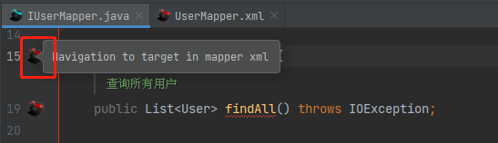


## 用法2：点击跳转到对应接口

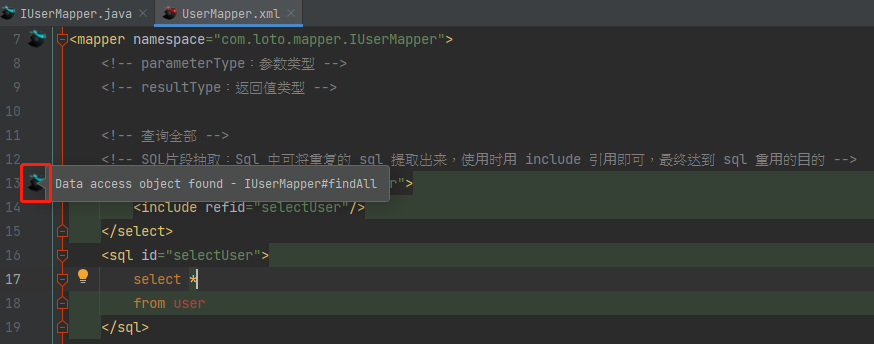


## 用法3：快速生成xml标签

- 在mapper.java中 Ctrl + Enter 快速生成 mapper.xml 对应标签

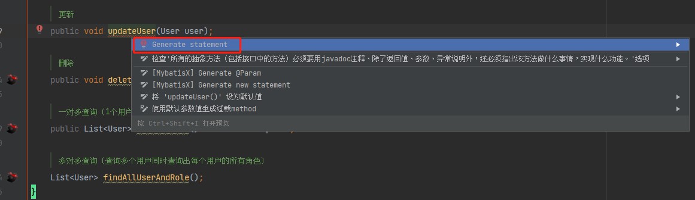


---

# 第十章 问题报错

## 1、报错问题：元素类型为 "mapper" 的内容必须匹配.....

- 问题描述

```java
元素类型为 "mapper" 的内容必须匹配 "(cache-ref|cache|resultMap==*==|parameterMap==*==|sql==*==|insert==*==|update==*==|delete==*==|select==*==)+".“
```

- 分析原因：属性必须按顺序来写
- 解决方案：比如<select 属性>   </select >，其中的属性的顺序必须按照规定写


---

# 参考文档

https://blog.csdn.net/fageweiketang/article/details/80739589

https://www.cnblogs.com/cainiao-Shun666/p/7909675.html?tdsourcetag=s_pcqq_aiomsg


> Author：蓝田_Loto