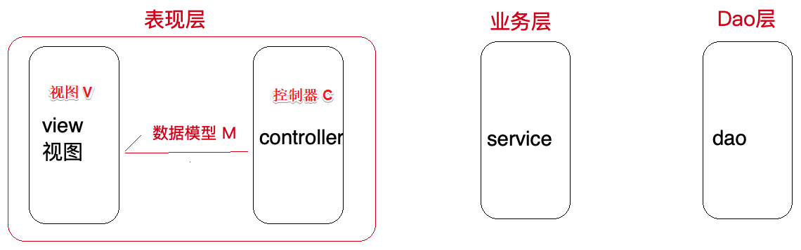
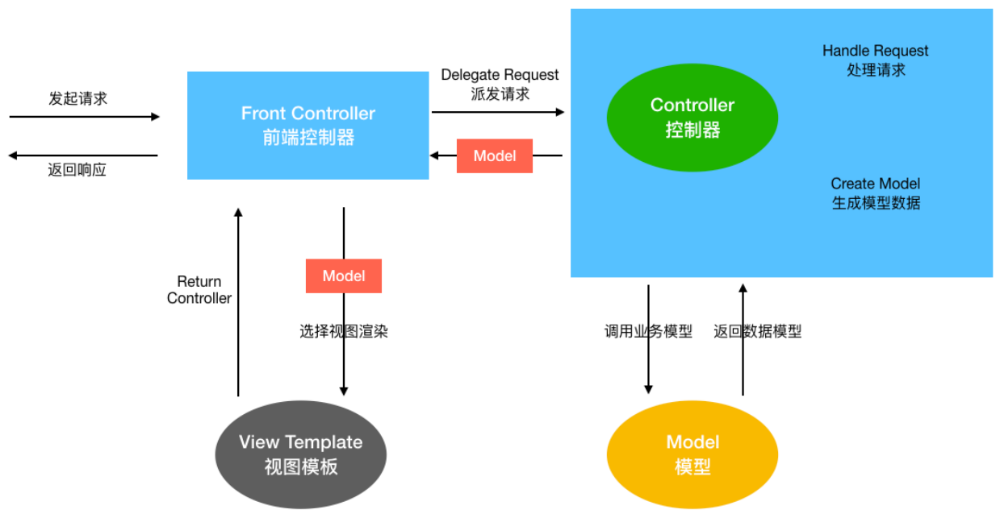
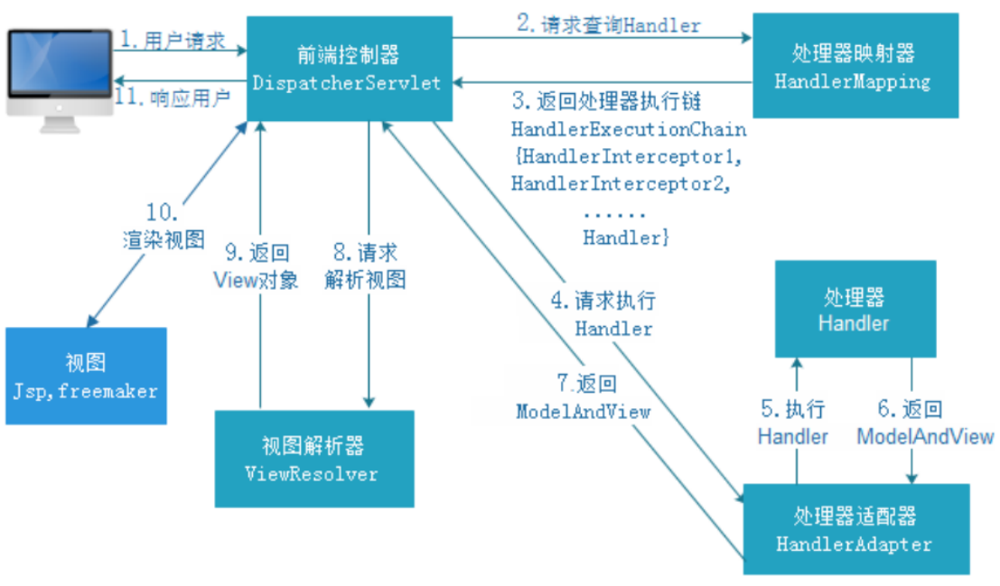
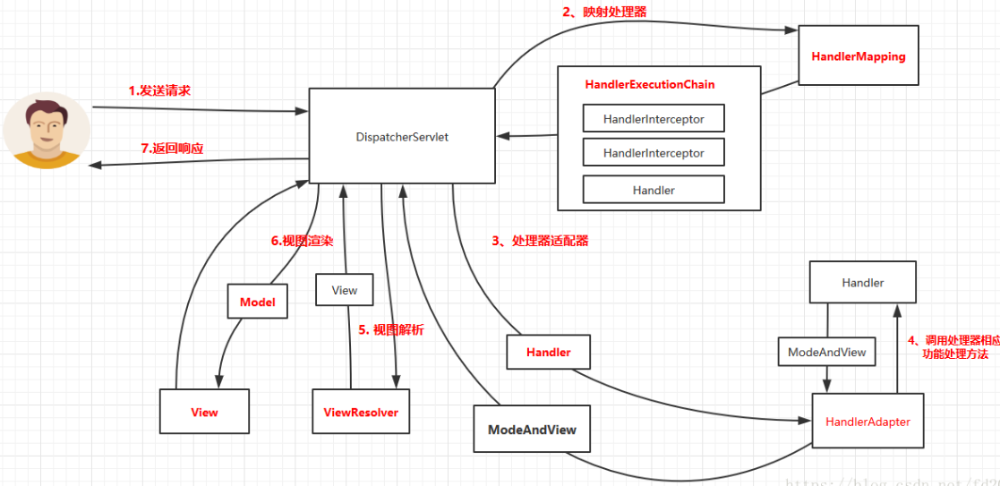
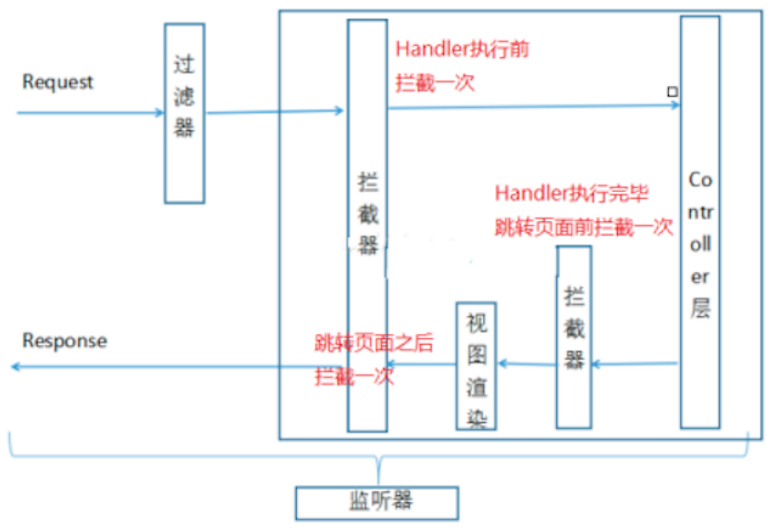
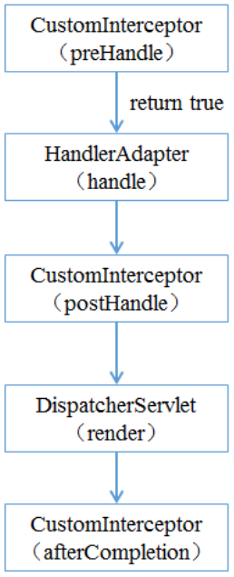
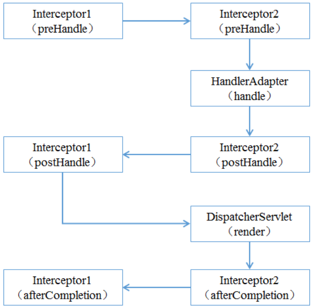
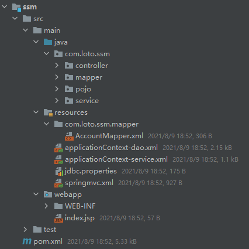

> 当前位置：【Java】09_Framework（开源框架）-> 9.5_SpringMVC


# 第一章 SpringMVC 简介

## 1、MVC 体系结构

### 1.1 开发架构

```java
开发架构⼀般都是基于两种形式
- C/S 架构，也就是客户端/服务器
- B/S 架构，也就是浏览器/服务器

在 JavaEE 开发中，⼏乎全都是基于 B/S 架构的开发
```


### 1.2 B/S 三层架构

```java
在 B/S 架构中，系统标准的三层架构包括：表现层、业务层、持久层

表现层（web 层）
- 负责接收客户端请求，向客户端响应结果，通常客户端使⽤ http 协议请求 web 层，web 需要接收 http 请求，完成 http 响应
- 表现层包括展示层和控制层：控制层负责接收请求，展示层负责结果的展示
- 表现层依赖业务层，接收到客户端请求⼀般会调⽤业务层进⾏业务处理，并将处理结果响应给客户端
- 表现层的设计⼀般都使⽤ MVC 模型（MVC 是表现层的设计模型，和其他层没有关系）

业务层（service 层）
- 负责业务逻辑处理，和开发项⽬的需求息息相关
- web 层依赖业务层，但是业务层不依赖 web 层
- 业务层在业务处理时可能会依赖持久层，如果要对数据持久化需要保证事务⼀致性（事务应该放到业务层来控制）

持久层（dao层）
- 负责数据持久化，包括数据层（即数据库和数据访问层）
  - 数据库是对数据进⾏持久化的载体
  - 数据访问层是业务层和持久层交互的接⼝
- 业务层需要通过数据访问层将数据久化到数据库中
- 通俗的讲，持久层就是和数据库交互，对数据库表进⾏增删改查的
```


## 2、MVC 设计模式

```
- MVC 全名是 Model View Controller，是 模型(model) －视图(view) －控制器(controller) 的缩写
- MVC 是⼀种⽤于设计创建 Web 应⽤程序 表现层 的模式
- MVC提倡：每⼀层只编写⾃⼰的东⻄，不编写任何其他的代码
- 分层是为了解耦，解耦是为了维护⽅便和分⼯协作
```



#### （1）Model / 模型

```java
模型包含业务模型和数据模型
- 数据模型⽤于封装数据（pojo、vo、po）
- 业务模型⽤于处理业务（业务逻辑）
```

#### （2）View / 视图

```java
- 用于展示数据（jsp 或 html）
- 通常视图是依据模型数据创建的 
```

#### （3）Controller / 控制器 

```java
- 用于处理程序逻辑
- 应⽤程序中处理⽤户交互的部分
```


## 3、SpringMVC 概述

```java
SpringMVC 全名叫 Spring Web MVC
- 是⼀种基于 Java 的实现 MVC 设计模型的请求驱动类型的轻量级 Web 框架，属于 SpringFrameWork 的后续产品
- 通过⼀套注解，让⼀个简单的 Java 类成为处理请求的控制器，⽽⽆须实现任何接⼝
- ⽀持 RESTful 编程⻛格的请求
- SpringMVC 和 Struts2 ⼀样，都是为了解决表现层问题的 web 框架，都是基于 MVC 设计模式（这些表现层框架的主要职责就是处理前端 HTTP 请求）
  
Spring MVC 本质
- 对 servlet 的封装，简化 serlvet的开发
```




# 第二章 SpringMVC 使用

## 1、SpringMVC 使用步骤

### 步骤1：配置 DispatcherServlet 前端控制器

- web.xml

```xml
<!DOCTYPE web-app PUBLIC
        "-//Sun Microsystems, Inc.//DTD Web Application 2.3//EN"
        "http://java.sun.com/dtd/web-app_2_3.dtd" >

<web-app>
    ......
  
    <servlet>
        <!-- 配置 DispatcherServlet 前端控制器 -->
        <servlet-name>springmvc</servlet-name>
        <servlet-class>org.springframework.web.servlet.DispatcherServlet</servlet-class>

       ......
    </servlet>

    <servlet-mapping>
        ......
    </servlet-mapping>
</web-app>
```


### 步骤2：开发处理具体业务逻辑的 Handler

#### （1）返回类型 ModelAndView

- xxxController.java

```java
@Controller
@RequestMapping("/quickstart")
public class QuickStartController {
    /**
     * 快速搭建<p>
     * http://localhost:8080/quickstart/handler
     */
    @RequestMapping("/handler")
    public ModelAndView Handler() {
      // ......
    }
}
```

#### （2）handler 形参类型区分

- ParamController.java

```java
package com.loto.springmvc.controller;

import org.springframework.stereotype.Controller;
import org.springframework.ui.Model;
import org.springframework.ui.ModelMap;
import org.springframework.web.bind.annotation.RequestMapping;
import org.springframework.web.servlet.ModelAndView;

import java.util.Date;
import java.util.Map;

/**
	* handler 方法上，分别传入 Map、Model和ModelMap 类型的形参，封装数据到 request 域中
 */

@Controller
@RequestMapping("/param")
public class ParamController {
    /**
     * 参数类型：ModelMap <p>
     * http://localhost:8080/param/modelmap
     */
    @RequestMapping("/modelmap")
    public String HandlerModelMap(ModelMap modelMap) {
        // 服务器时间
        Date date = new Date();

        // 向请求域添加属性值
        modelMap.addAttribute("date", date);

        // class org.springframework.validation.support.BindingAwareModelMap
        System.out.println("================= ModelMap:" + modelMap.getClass());

        // 返回到前端页面
        return "success";
    }

    /**
     * 参数类型：Model <p>
     * http://localhost:8080/param/model
     */
    @RequestMapping("/model")
    public String HandlerModel(Model model) {
        // 服务器时间
        Date date = new Date();

        // 向请求域添加属性值
        model.addAttribute("date", date);

        // class org.springframework.validation.support.BindingAwareModelMap
        System.out.println("================= Model:" + model.getClass());

        // 返回到前端页面
        return "success";
    }

    /**
     * 参数类型：map <p>
     * http://localhost:8080/param/map
     */
    @RequestMapping("/map")
    public String HandlerMap(Map<String,Object> map) {
        // 服务器时间
        Date date = new Date();

        // 向请求域添加属性值
        map.put("date",date);

        // class org.springframework.validation.support.BindingAwareModelMap
        System.out.println("================= Map:" + map.getClass());

        // 返回到前端页面
        return "success";
    }

    /* 总结：
     - ModelMap(spring中的 class 类型，实现了 Map 接口)
     - Model（spring中的接口）
     - Map(jdk中的接口)

     - 运行时的具体类型都是 BindingAwareModelMap，相当于给 BindingAwareModelMap 中保存的数据都会放在请求域中
     - BindingAwareModelMap 继承了 ExtendedModelMap
     - ExtendedModelMap 继承了 ModelMap 类，实现了 Model 接口
     */
}
```


### 步骤3：配置 controller 扫描，配置 springmvc 三大组件

- springmvc.xml（视图解析器、处理器映射器、处理器适配器）

```xml
<?xml version="1.0" encoding="UTF-8"?>
<beans xmlns="http://www.springframework.org/schema/beans"
       xmlns:xsi="http://www.w3.org/2001/XMLSchema-instance"
       xmlns:context="http://www.springframework.org/schema/context"
       xmlns:mvc="http://www.springframework.org/schema/mvc"
       xsi:schemaLocation="
        http://www.springframework.org/schema/beans
        https://www.springframework.org/schema/beans/spring-beans.xsd
        http://www.springframework.org/schema/context
        https://www.springframework.org/schema/context/spring-context.xsd
        http://www.springframework.org/schema/mvc
        https://www.springframework.org/schema/mvc/spring-mvc.xsd
">
		<!-- 开启 controller 扫描 -->
    <context:component-scan base-package="com.loto.springmvc.controller"/>

    <!-- 视图解析器 -->
    <bean class="org.springframework.web.servlet.view.InternalResourceViewResolver">
        <property name="prefix" value="/WEB-INF/jsp/"/>
        <property name="suffix" value=".jsp"/>
    </bean>

    <!-- 处理器映射器 和 处理器适配器（自动注册最合适的）-->
    <mvc:annotation-driven/>
</beans>
```


### 步骤4：将配置文件路径告诉 springmvc（DispatcherServlet）

- web.xml

```xml
<!DOCTYPE web-app PUBLIC
        "-//Sun Microsystems, Inc.//DTD Web Application 2.3//EN"
        "http://java.sun.com/dtd/web-app_2_3.dtd" >

<web-app>
    <display-name>Archetype Created Web Application</display-name>

    <servlet>
        .....

        <!-- 指定配置文件 springmvc.xml 路径 -->
        <init-param>
            <param-name>contextConfigLocation</param-name>
            <param-value>classpath:springmvc.xml</param-value>
        </init-param>
    </servlet>

    <servlet-mapping>
        ......
    </servlet-mapping>
</web-app>
```


### 步骤 5：servlet-mapping 拦截资源配置方案

#### 方案1：带后缀（推荐）

- web.xml

```xml
<!DOCTYPE web-app PUBLIC
        "-//Sun Microsystems, Inc.//DTD Web Application 2.3//EN"
        "http://java.sun.com/dtd/web-app_2_3.dtd" >

<web-app>
    <display-name>Archetype Created Web Application</display-name>

    <servlet>
        .....
    </servlet>

    <servlet-mapping>
        <!-- 比如*.action  *.do *.aaa -->
        <url-pattern>*.action</url-pattern>
    </servlet-mapping>
</web-app>
```


#### 方案2：加 /

- web.xml

```xml
<!DOCTYPE web-app PUBLIC
        "-//Sun Microsystems, Inc.//DTD Web Application 2.3//EN"
        "http://java.sun.com/dtd/web-app_2_3.dtd" >

<web-app>
    <display-name>Archetype Created Web Application</display-name>

    <servlet>
        .....
    </servlet>

    <servlet-mapping>
        <!-- 不会拦截 .jsp，但是会拦截.html等静态资源 -->
      	<!-- 静态资源：除了servlet和jsp之外的js、css、png等 -->
        <url-pattern>/</url-pattern>
    </servlet-mapping>
</web-app>
```

- springmvc.xml

  - 静态资源配置方式1

  ```xml
  <!-- 原理：
  - 添加该标签配置之后，会在 SpringMVC 上下文中定义一个 DefaultServletHttpRequestHandler 对象
  - 这个对象如同一个检查人员，对进入 DispatcherServlet的url 请求进行过滤筛查
  - 如果发现是一个静态资源请求，会把请求转由 web 应用服务器（tomcat）默认的 DefaultServlet 来处理
  - 如果不是静态资源请求，那么继续由 SpringMVC 框架处理
  -->
  <!-- 此方案只能将 静态资源 放在 webapp 根目录下，其他位置访问不到-->
  <mvc:default-servlet-handler/>
  ```

  - 静态资源配置方式2：SpringMVC 框架自己处理静态资源（推荐）

  ```xml
  <!-- mapping：约定的静态资源的url规则 -->
  <!-- location：指定的静态资源的存放位置 -->
  <!-- http://localhost:8080/resources/test.html -->
  <mvc:resources location="classpath:/"  mapping="/resources/**"/>
  
  <!-- http://localhost:8080/webapp/test.html -->
  <mvc:resources location="classpath:/"  mapping="/webapp/**"/>
  
  <mvc:resources location="/WEB-INF/js/" mapping="/js/**"/>
  ```


#### 方案3：加 /*

- web.xml

```xml
<!DOCTYPE web-app PUBLIC
        "-//Sun Microsystems, Inc.//DTD Web Application 2.3//EN"
        "http://java.sun.com/dtd/web-app_2_3.dtd" >

<web-app>
    <display-name>Archetype Created Web Application</display-name>

    <servlet>
        .....
    </servlet>

    <servlet-mapping>
        <!-- 拦截所有，包括.jsp -->
        <url-pattern>/*</url-pattern>
    </servlet-mapping>
</web-app>
```


## 2、SpringMVC 请求处理流程




```
第⼀步：⽤户发送请求⾄前端控制器 DispatcherServlet
第⼆步：DispatcherServlet 收到请求调⽤ HandlerMapping 处理器映射器
第三步：处理器映射器根据请求 Url 找到具体的 Handler（后端控制器），⽣成处理器对象及处理器拦截器(如果有则⽣成)⼀并返回DispatcherServlet
第四步：DispatcherServlet 调⽤ HandlerAdapter 处理器适配器去调⽤ Handler
第五步：处理器适配器执⾏ Handler
第六步：Handler 执⾏完成给处理器适配器返回 ModelAndView
第七步：处理器适配器向前端控制器返回 ModelAndView（是SpringMVC 框架的⼀个底层对象，包括 Model 和 View）
第⼋步：前端控制器请求视图解析器去进⾏视图解析，根据逻辑视图名来解析真正的视图
第九步：视图解析器向前端控制器返回 View
第⼗步：前端控制器进⾏视图渲染，就是将模型数据（在 ModelAndView 对象中）填充到 request 域
第⼗⼀步：前端控制器向⽤户响应结果
```




## 3、SpringMVC 九大组件

### 3.1 HandlerMapping（处理器映射器）

```
- HandlerMapping 是⽤来查找 Handler 的，也就是处理器，具体的表现形式可以是类，也可以是⽅法
- ⽐如，标注了 @RequestMapping 的每个⽅法都可以看成是⼀个 Handler
- Handler 负责具体实际的请求处理，在请求到达后，HandlerMapping 的作⽤便是找到请求相应的处理器 Handler 和 拦截器 Interceptor
```


### 3.2 HandlerAdapter（处理器适配器）

```
- 使用 HandlerAdapter 执行不同形式的 Handler

- 通过HandlerAdapter对处理器进行执行，这是适配器模式的应用
- 通过扩展适配器可以对更多类型的处理器进行执行
```


### 3.3 HandlerExceptionResolver（处理器异常解析器）

```java
- ⽤于处理 Handler 产⽣的异常情况
- 作⽤是根据异常设置 ModelAndView，之后交给渲染⽅法进⾏渲染，渲染⽅法会将 ModelAndView 渲染成⻚⾯
```


### 3.4 ViewResolver（视图解析器）

```java
- ⽤于将 String 类型的视图名和 Locale 解析为 View 类型的视图，只有⼀个 resolveViewName() ⽅法
- 从⽅法的定义可以看出，Controller 层返回的 String 类型视图名 viewName 最终会在这⾥被解析成为 View
- View 是⽤来渲染⻚⾯的，也就是说，它会将程序返回的参数和数据填⼊模板中，⽣成html⽂件

ViewResolver 在这个过程主要完成两件事情：
- ViewResolver 找到渲染所⽤的模板（第⼀件⼤事）和所⽤的技术（第⼆件⼤事，其实也就是找到视图的类型，如JSP）并填⼊参数

- 默认情况下，Spring MVC会⾃动配置⼀个 InternalResourceViewResolver，是针对 JSP 类型视图的
```


### 3.5 RequestToViewNameTranslator

```java
- 作用：从请求中获取 ViewName 视图名
- 因为 ViewResolver 根据 ViewName 查找 View，但有的 Handler 处理完成之后，没有设置 View，也没有设置 ViewName，便要通过这个组件从请求中查找 ViewName
```


### 3.6 LocaleResolver（国际化）

```java
- ViewResolver 组件的 resolveViewName ⽅法需要两个参数：⼀个是视图名，⼀个是 Locale
- LocaleResolver ⽤于从请求中解析出 Locale，⽤来表示⼀个区域（⽐如中国 Locale 是 zh-CN）
- 这个组件也是 i18n 的基础
```


### 3.7 ThemeResolver（主题解析器）

```java
- ThemeResolver 组件是⽤来解析主题的。
- 主题是样式、图⽚及它们所形成的显示效果的集合
- Spring MVC 中⼀套主题对应⼀个 properties⽂件，⾥⾯存放着与当前主题相关的所有资源，如图⽚、CSS样式等

创建主题步骤
- 准备好资源
- 新建“主题名.properties”并将资源路径放进去
- 将文件放在 classpath 下，之后便可以在⻚⾯中使⽤了

SpringMVC 中与主题相关的类
- ThemeResolver 负责从请求中解析出主题名
- ThemeSource 根据主题名找到具体的主题，其抽象也就是 Theme，
- Theme 用来获取主题和具体的资源
```


### 3.8 MultipartResolver

```java
- MultipartResolver 作⽤：封装普通的请求，使其拥有⽂件上传的功能
- 通过将普通的请求包装成 MultipartHttpServletRequest 来实现

- MultipartHttpServletRequest 可以通过 getFile() ⽅法直接获得⽂件
- 如果上传多个⽂件，还可以调⽤ getFileMap() ⽅法得到 Map<FileName，File> 这样的结构
```


### 3.9 FlashMapManager

```java
- ⽤于重定向时的参数传递
  
- ⽐如在处理⽤户订单时候，为了避免重复提交，可以处理完post请求之后重定向到⼀个get请求，这个get请求可以⽤来显示订单详情之类的信息。
- 这样做虽然可以规避⽤户重新提交订单的问题，但是在这个⻚⾯上要显示订单的信息，这些数据从哪⾥来获得呢？
- 因为重定向时么有传递参数这⼀功能的，如果不想把参数写进URL（不推荐），那么就可以通过FlashMap来传递。只需要在重定向之前将要传递的数据写⼊请求（可以通过ServletRequestAttributes.getRequest()⽅法获得）的属性OUTPUT_FLASH_MAP_ATTRIBUTE中，这样在重定向之后的Handler中Spring就会⾃动将其设置到Model中，在显示订单信息的⻚⾯上就可以直接从Model中获取数据
  
- FlashMapManager 就是⽤来管理 FalshMap 的
```


## 4、SpringMVC 参数绑定

- 参数绑定：取出参数值绑定到handler⽅法的形参上

### 4.1 SpringMVC 对原生 servlet api 的支持

- url：/parambinding/handleServlet?id=1

```java
// 如果要在 SpringMVC 中使用 servlet原生对象，比如 HttpServletRequest、HttpServletResponse、HttpSession，直接在 Handler 方法形参中声明使用即可
@RequestMapping("/handleServlet")
public ModelAndView handleServlet(HttpServletRequest request, HttpServletResponse response, HttpSession session) {
  String id = request.getParameter("id");

  Date date = new Date();
  ModelAndView modelAndView = new ModelAndView();
  modelAndView.addObject("date", date);
  modelAndView.setViewName("success");
  return modelAndView;
}
```


### 4.2 SpringMVC 接收简单数据类型参数

- url：/parambinding/simpledatatype?id=1
- url：/parambinding/simpledatatype?ids=1

```java
// 接收简单数据类型参数，直接在 handler 方法的形参中声明即可，框架会取出参数值然后绑定到对应参数上
// 要求：传递的参数名和声明的形参名称保持一致，如果不一致，使用 @RequestParam("实际访问的参数名")
@RequestMapping("/simpledatatype")
public ModelAndView handleSimpleDataType(@RequestParam("ids") Integer id) {
  Date date = new Date();
  ModelAndView modelAndView = new ModelAndView();
  modelAndView.addObject("date", date);
  modelAndView.setViewName("success");
  return modelAndView;
}
```


### 4.3 SpringMVC 接收 pojo 类型参数

- url：/parambinding/handlepojo?id=1&username=TD

```java
// 接收 pojo 类型参数，直接形参声明即可，类型就是Pojo的类型，形参名无所谓
// 要求：传递的参数名必须和Pojo的属性名保持一致
@RequestMapping("/handlepojo")
public ModelAndView handlePojo(User user) {
  Date date = new Date();
  ModelAndView modelAndView = new ModelAndView();
  modelAndView.addObject("date", date);
  modelAndView.setViewName("success");
  return modelAndView;
}
```


### 4.4 SpringMVC 接收 pojo 包装类型参数

- url：/parambinding/handlepackagetype?user.id=1&user.username=TD

```java
// 不管包装 Pojo 与否，它首先是一个pojo，那么就可以按照上述pojo的要求来
// 1、绑定时候直接形参声明即可
// 2、传参参数名和pojo属性保持一致，如果不能够定位数据项，那么通过属性名 + "." 的方式进一步锁定数据
@RequestMapping("/handlepackagetype")
public ModelAndView handlePackageType(QueryVo queryVo) {
  Date date = new Date();
  ModelAndView modelAndView = new ModelAndView();
  modelAndView.addObject("date", date);
  modelAndView.setViewName("success");
  return modelAndView;
}
```


### 4.5  SpringMVC 接收日期类型参数

- url：/parambinding/handledatetype?birthday=2019-10-08

```java
// 定义一个SpringMVC的类型转换器  接口，扩展实现接口接口，注册你的实现
@RequestMapping("/handledatetype")
public ModelAndView handleDateType(Date birthday) {
  Date date = new Date();
  ModelAndView modelAndView = new ModelAndView();
  modelAndView.addObject("date", date);
  modelAndView.setViewName("success");
  return modelAndView;
}
```

- DateConverter.java（自定义类型转换）

```java
package com.loto.springmvc.converter;

import org.springframework.core.convert.converter.Converter;

import java.text.ParseException;
import java.text.SimpleDateFormat;
import java.util.Date;

/**
 * S：source，源类型
 * T：target：目标类型
 */
public class DateConverter implements Converter<String, Date> {
    @Override
    public Date convert(String source) {
        // 完成字符串向日期的转换
        SimpleDateFormat simpleDateFormat = new SimpleDateFormat("yyyy-MM-dd");

        try {
            Date parse = simpleDateFormat.parse(source);
            return parse;
        } catch (ParseException e) {
            e.printStackTrace();
        }

        return null;
    }
}
```

- springmvc.xml

```xml
<?xml version="1.0" encoding="UTF-8"?>
<beans xmlns="http://www.springframework.org/schema/beans"
       xmlns:xsi="http://www.w3.org/2001/XMLSchema-instance"
       xmlns:context="http://www.springframework.org/schema/context"
       xmlns:mvc="http://www.springframework.org/schema/mvc"
       xsi:schemaLocation="
        http://www.springframework.org/schema/beans
        https://www.springframework.org/schema/beans/spring-beans.xsd
        http://www.springframework.org/schema/context
        https://www.springframework.org/schema/context/spring-context.xsd
        http://www.springframework.org/schema/mvc
        https://www.springframework.org/schema/mvc/spring-mvc.xsd
">

    ......

    <!-- 处理器映射器 和 处理器适配器（自动注册最合适的）-->
    <mvc:annotation-driven conversion-service="conversionServiceBean"/>

    <!-- 注册自定义类型转换器 -->
    <bean id="conversionServiceBean" class="org.springframework.format.support.FormattingConversionServiceFactoryBean">
        <property name="converters">
            <set>
                <bean class="com.loto.springmvc.converter.DateConverter"/>
            </set>
        </property>
    </bean>

    ......
</beans>
```


## 5、SpringMVC RESTful 支持

### 5.1 RESTful 概述

#### （1）概述

```
- REST（Representational State Transfer，简称 REST）描述了⼀个架构样式的⽹络系统
- Restful 是⼀种 web 软件架构⻛格，它不是标准也不是协议，它倡导的是⼀个资源定位及资源操作的⻛格
- Spring MVC ⽀持 RESTful ⻛格请求，使⽤ @PathVariable 注解获取 RESTful ⻛格的请求URL中的路径变量
```

#### （2）Restful 优点

```
- 结构清晰
- 符合标准
- 易于理解
- 扩展⽅便
```

#### （3）Restful 的特性

```java
资源（Resources）
- ⽹络上的⼀个实体，或者说是⽹络上的⼀个具体信息
- 它可以是⼀段⽂本、⼀张图⽚、⼀⾸歌曲、⼀种服务，总之就是⼀个具体的存在
- 可以⽤⼀个 URI（统⼀资源定位符）指向它，每种资源对应⼀个特定的 URI 
- 要获取这个资源，访问它的 URI 就可以
- 因此 URI 即为每⼀个资源的独⼀⽆⼆的识别符

表现层（Representation）
- 把资源具体呈现出来的形式，叫做它的表现层 （Representation）
- ⽐如，⽂本可以⽤ txt 格式表现，也可以⽤ HTML 格式、XML 格式、JSON 格式表现，甚⾄可以采⽤⼆进制格式

状态转化（State Transfer）
- 每发出⼀个请求，就代表了客户端和服务器的⼀次交互过程
- HTTP 协议，是⼀个⽆状态协议，即所有的状态都保存在服务器端。因此，如果客户端想要操作服务器， 必须通过某种⼿段，让服务器端发⽣“状态转化”（State Transfer）。⽽这种转化是建⽴在表现层之上的，所以就是 “ 表现层状态转化” 
- 具体说， 就是 HTTP 协议⾥⾯，四个表示操作⽅式的动词：GET 、POST 、PUT 、DELETE
- 分别对应四种基本操作：GET ⽤来获取资源，POST ⽤来新建资源，PUT ⽤来更新资源，DELETE ⽤来删除资源
```


### 5.2 RESTful 使用

#### （1）get - 查

```java
/**
* get 查询请求：/restful/handle/15
*/
@RequestMapping(value = "/handle/{id}", method = {RequestMethod.GET})
public ModelAndView handleGet(@PathVariable("id") Integer id) {
  Date date = new Date();
  ModelAndView modelAndView = new ModelAndView();
  modelAndView.addObject("date", date);
  modelAndView.setViewName("success");
  return modelAndView;
}
```


#### （2）post - 增

```java
/**
* post 新增请求：/restful/handle
*/
@RequestMapping(value = "/handle", method = {RequestMethod.POST})
public ModelAndView handlePost(String username) {
  Date date = new Date();
  ModelAndView modelAndView = new ModelAndView();
  modelAndView.addObject("date", date);
  modelAndView.setViewName("success");
  return modelAndView;
}
```


#### 配置 springmvc 请求方式转换过滤器，将特定的 post 请求转换为 put 和 delete 请求

- web.xml

```xml
<!-- 配置 springmvc 请求方式转换过滤器 -->
<!-- 会检查请求参数中是否有_method参数（html页面的控件 name="_method" ），如果有就按照指定的请求方式进行转换 -->
<!-- 将特定的 post 请求转换为 put 和 delete 请求-->
<filter>
  <filter-name>hiddenHttpMethodFilter</filter-name>
  <filter-class>org.springframework.web.filter.HiddenHttpMethodFilter</filter-class>
</filter>

<filter-mapping>
  <filter-name>hiddenHttpMethodFilter</filter-name>
  <url-pattern>/*</url-pattern>
</filter-mapping>
```


#### （3）put - 改

```java
/**
* put 修改请求：/restful/handle/15/td
*/
@RequestMapping(value = "/handle/{id}/{name}", method = {RequestMethod.PUT})
public ModelAndView handlePut(@PathVariable("id") Integer id, @PathVariable("name") String username) {
  Date date = new Date();
  ModelAndView modelAndView = new ModelAndView();
  modelAndView.addObject("date", date);
  modelAndView.setViewName("success");
  return modelAndView;
}
```


#### （4）delete -删

```java
/**
* delete 删除请求：/restful/handle/15
*/
@RequestMapping(value = "/handle/{id}", method = {RequestMethod.DELETE})
public ModelAndView handleDelete(@PathVariable("id") Integer id) {
  Date date = new Date();
  ModelAndView modelAndView = new ModelAndView();
  modelAndView.addObject("date", date);
  modelAndView.setViewName("success");
  return modelAndView;
}
```


## 6、SpringMVC Ajax Json 交互

### 6.1 Json 概述

```
Json 是⼀种与语⾔⽆关的数据交互格式，就是⼀种字符串
- {}内表示对象
- []内表示数组
- ""内是属性或值
- ：表示后者是前者的值

{"name": "Michael"}可以理解为是⼀个包含 name 为 Michael 的对象
[{"name": "Michael"},{"name": "Jerry"}]就表示包含两个对象的数组
```

### 6.2 SpringMVC Ajax Json 交互

```
交互：两个方向
前端到后台：前端 ajax 发送 json 格式字符串，后台直接接收为 pojo 参数，使⽤注解 @RequstBody
后台到前端：后台直接返回 pojo 对象，前端直接接收为 json 对象或者字符串，使⽤注解 @ResponseBody
```

### 6.3 使用

- pom 依赖包

```xml
<dependency>
  <groupId>com.fasterxml.jackson.core</groupId>
  <artifactId>jackson-core</artifactId>
  <version>2.9.0</version>
</dependency>

<dependency>
  <groupId>com.fasterxml.jackson.core</groupId>
  <artifactId>jackson-databind</artifactId>
  <version>2.9.0</version>
</dependency>

<dependency>
  <groupId>com.fasterxml.jackson.core</groupId>
  <artifactId>jackson-annotations</artifactId>
  <version>2.9.0</version>
</dependency>
```

- js

```javascript
<script>
  $(function () {
  $("#ajaxBtn").bind("click", function () {
    // 发送ajax请求
    $.ajax({
      url: '/json/handlejson',
      type: 'POST',
      data: '{"id":"1","name":"TD"}',
      contentType: 'application/json;charset=utf-8',
      dataType: 'json',
      success: function (data) {
        alert(data.name);
      }
    })
  })
})
</script>
```

- java

```java
@Controller
@RequestMapping("json")
public class JsonController {
    // @ResponseBody 注解作用：将 controller 的⽅法返回的对象通过适当的转换器转换为指定的格式之后，写⼊到 response 对象的 body 区，通常⽤来返回 JSON 数据或者是 XML 数据 
    // 添加 @ResponseBody 之后，不再走视图解析器那个流程，而是直接将数据写入到输⼊流中，效果等同于通过 response 对象输出指定格式的数据
    @RequestMapping("/handlejson")
    @ResponseBody
    public User handleJson(@RequestBody User user) {
        // 业务逻辑处理，修改 name
        user.setName("蓝田");
        return user;
    }
}
```


## 7、SpringMVC 拦截器

- Servlet：处理 Request 请求和 Response 响应

### 7.1 监听器（Listener）

```java
- 实现了 javax.servlet.ServletContextListener 接⼝的服务器端组件
- 它随 Web 应⽤的启动⽽启动，只初始化⼀次，然后会⼀直运⾏监视，随Web应⽤的停⽌⽽销毁

- 作⽤⼀，做⼀些初始化⼯作，web 应⽤中 spring 容器启动 ContextLoaderListener
- 作⽤⼆，监听 web 中的特定事件，⽐如 HttpSession、ServletRequest 的创建和销毁，变量的创建、销毁和修改等
  
- 可以在某些动作前后增加处理，实现监控，⽐如统计在线⼈数，利⽤ HttpSessionLisener等
```


### 7.2 过滤器（Filter）

```
- 对 Request 请求起到过滤的作⽤，作⽤在 Servlet 之前，如果配置为 /* 可以对所有的资源访问（servlet、js/css静态资源等）进⾏过滤处理
```


### 7.3 拦截器（Interceptor）

#### （1）概述

```java
- 拦截器是 SpringMVC、Struts 等表现层框架⾃⼰的，不会拦截 jsp/html/css/image 的访问等，只会拦截访问的控制器⽅法（Handler）
- 从配置的⻆度也能够总结发现，serlvet、filter、listener 是配置在 web.xm l中的，⽽ interceptor 是配置在表现层框架⾃⼰的配置⽂件中的
```

#### （2）拦截器的三次拦截

```
三次拦截：
- 在 Handler 业务逻辑执⾏之前拦截⼀次
- 在 Handler 逻辑执⾏完毕但未跳转⻚⾯之前拦截⼀次
- 在跳转⻚⾯之后拦截⼀次
```





#### （3）拦截器使用

- MyIntercepter.java（自定义 springmvc 拦截器）

```java
package com.loto.springmvc.interceptor;

import org.springframework.web.servlet.HandlerInterceptor;
import org.springframework.web.servlet.ModelAndView;

import javax.servlet.http.HttpServletRequest;
import javax.servlet.http.HttpServletResponse;

public class Interceptor01 implements HandlerInterceptor {
    /**
     * 在 handler 方法业务逻辑执行之前执行（可做权限校验）
     * @return 返回值boolean代表是否放行，true代表放行，false代表中止
     */
    @Override
    public boolean preHandle(HttpServletRequest request, HttpServletResponse response, Object handler) throws Exception {
        System.out.println("preHandle 01 ......");
        return true;
    }

    /**
     * 在 handler 方法业务逻辑执行之后尚未跳转页面时执行
     * @param modelAndView 封装了视图和数据，此时尚未跳转页面，可以在这里针对返回的数据和视图信息进行修改
     */
    @Override
    public void postHandle(HttpServletRequest request, HttpServletResponse response, Object handler, ModelAndView modelAndView) throws Exception {
        System.out.println("postHandle 01 ......");
    }

    /**
     * 页面已经跳转渲染完毕之后执行
     */
    @Override
    public void afterCompletion(HttpServletRequest request, HttpServletResponse response, Object handler, Exception ex) throws Exception {
        System.out.println("afterCompletion 01 ......");
    }
}
```

- springmvc.xml

```xml
<mvc:interceptors>
  <!-- 拦截器1 -->
  <!-- 方式1：拦截所有 handler -->
  <!--<bean class="com.loto.springmvc.interceptor.Interceptor01"/>-->

  <!-- 方式2：配置拦截规则 -->
  <mvc:interceptor>
    <!-- 配置当前拦截器的 url 拦截规则，**代表当前目录下及其子目录下的所有url -->
    <mvc:mapping path="/**"/>

    <!-- 在 mapping 的基础上排除一些 url 拦截-->
    <!--<mvc:exclude-mapping path="/json/**"/>-->

    <bean class="com.loto.springmvc.interceptor.Interceptor01"/>
  </mvc:interceptor>

  <!-- 拦截器2 -->
  <mvc:interceptor>
    <mvc:mapping path="/**"/>
    <bean class="com.loto.springmvc.interceptor.Interceptor02"/>
  </mvc:interceptor>
</mvc:interceptors>
```


#### （4）单个拦截器执行流程

```
- 程序先执⾏ preHandle() ⽅法，如果该⽅法的返回值为 true，则程序会继续向下执⾏处理器中的⽅法，否则将不再向下执⾏。
- 在业务处理器（即控制器 Controller 类）处理完请求后，会执⾏ postHandle() ⽅法，然后会通过 DispatcherServlet 向客户端返回响应。
- 在 DispatcherServlet 处理完请求后，才会执⾏ afterCompletion() ⽅法
```



#### （5）多个拦截器执行流程

```
- 当有多个拦截器同时⼯作时，它们的preHandle()⽅法会按照配置⽂件中拦截器的配置顺序执⾏
- ⽽它们的postHandle()⽅法和afterCompletion()⽅法则会按照配置顺序的反序执⾏
```





## 8、SpringMVC 异常处理器

### （1）对当前 controller 类进行异常处理

```java
@ExceptionHandler(ArithmeticException.class)
public void handleException(ArithmeticException exception, HttpServletResponse response) {
  // 异常处理逻辑
  try {
    response.getWriter().write(exception.getMessage());
  } catch (IOException e) {
    e.printStackTrace();
  }
}
```

### （2）捕获所有 Controller 对象 handler 方法抛出的异常

- GlobalExceptionResolver.java

```java
package com.loto.springmvc.controller;

import org.springframework.web.bind.annotation.ControllerAdvice;
import org.springframework.web.bind.annotation.ExceptionHandler;
import org.springframework.web.servlet.ModelAndView;

import javax.servlet.http.HttpServletResponse;

// 捕获所有 Controller 对象 handler 方法抛出的异常
@ControllerAdvice
public class GlobalExceptionResolver {

    @ExceptionHandler(ArithmeticException.class)
    public ModelAndView handleException(ArithmeticException exception, HttpServletResponse response) {
        ModelAndView modelAndView = new ModelAndView();
        modelAndView.addObject("msg",exception.getMessage());
        modelAndView.setViewName("error");
        return modelAndView;
    }
}
```


## 9、SpringMVC 处理 multipart 形式的数据

### （1）pom依赖包

```xml
<!-- 文件上传所需坐标 -->
<dependency>
  <groupId>commons-fileupload</groupId>
  <artifactId>commons-fileupload</artifactId>
  <version>1.3.1</version>
</dependency>
```

### （2）配置多元素解析器 springmvc.xml

```xml
<!-- 配置多元素解析器：id 固定为 multipartResolver -->
<bean id="multipartResolver" class="org.springframework.web.multipart.commons.CommonsMultipartResolver">
  <!-- 设置上传文件大小上限，单位是字节，-1代表没有限制也是默认的 -->
  <property name="maxUploadSize" value="5000000"/>
</bean>
```

### （3）html

```html
<div>
    <h2> multipart 文件上传</h2>
    <fieldset>
        <form method="post" enctype="multipart/form-data" action="/multipart/upload">
            <input type="file" name="uploadFile"/>
            <input type="submit" value="上传"/>
        </form>
    </fieldset>
</div>
```

### （4）MultipartController.java

```java
package com.loto.springmvc.controller;

import org.springframework.stereotype.Controller;
import org.springframework.web.bind.annotation.RequestMapping;
import org.springframework.web.multipart.MultipartFile;
import org.springframework.web.servlet.ModelAndView;

import javax.servlet.http.HttpSession;
import java.io.File;
import java.io.IOException;
import java.text.SimpleDateFormat;
import java.util.Date;
import java.util.UUID;

@Controller
@RequestMapping("multipart")
public class MultipartController {
    /**
     * 文件上传
     */
    @RequestMapping(value = "/upload")
    public ModelAndView upload(MultipartFile uploadFile, HttpSession session) throws IOException {
        // 获取原始名称
        String originalFilename = uploadFile.getOriginalFilename();

        // 获取扩展名
        String ext = originalFilename.substring(originalFilename.lastIndexOf(".") + 1, originalFilename.length());

        // 重命名
        String newName = UUID.randomUUID().toString() + "." + ext;

        // 存储到指定的文件夹，/uploads/yyyy-MM-dd，考虑文件过多的情况按照日期，生成一个子文件夹
        String realPath = session.getServletContext().getRealPath("/uploads");
        String datePath = new SimpleDateFormat("yyyy-MM-dd").format(new Date());
        File folder = new File(realPath + "/" + datePath);

        if (!folder.exists()) {
            folder.mkdirs();
        }

        // 存储文件到目录
        uploadFile.transferTo(new File(folder, newName));

        // TODO 文件磁盘路径要更新到数据库字段

        Date date = new Date();
        ModelAndView modelAndView = new ModelAndView();
        modelAndView.addObject("date", date);
        modelAndView.setViewName("success");
        return modelAndView;
    }
}
```


## 10、SpringMVC 重定向时参数传递丢失值的问题

- 基于 Flash 属性的跨重定向请求数据传递

```
现象：
- 访问http://localhost:8080/redirect/handle?name=td
- 访问后，跳转到 http://localhost:8080/redirect/handler01
- name的值丢失，为空
```

- RedirectController.java

```java
package com.loto.springmvc.controller;

import org.springframework.stereotype.Controller;
import org.springframework.web.bind.annotation.ModelAttribute;
import org.springframework.web.bind.annotation.RequestMapping;
import org.springframework.web.servlet.ModelAndView;
import org.springframework.web.servlet.mvc.support.RedirectAttributes;

import java.util.Date;

@Controller
@RequestMapping("redirect")
public class RedirectController {
    // 转发：url不会变，参数也不会丢失，一个请求
    // A 找 B 借钱400，B没有钱但是悄悄的找到C借了400块钱给A

    // 重定向：url会变，参数会丢失需要重新携带参数，两个请求
    // A 找 B 借钱400，B 说我没有钱，你找别人借去，那么A 又带着400块的借钱需求找到C

    /**
     * http://localhost:8080/redirect/handle?name=td
     */
    @RequestMapping("/handle")
    public String handleRedirect(String name, RedirectAttributes redirectAttributes) {
        // 重定向后，name 的值丢失，为空
        // return "redirect:handler01";
        
        // 方式1：拼接参数（安全性、参数长度都有局限）
        //return "redirect:handler01?name=" + name;

        // 方式2：addFlashAttribute 方法设置了一个 flash 类型属性，该属性会被暂存到 session 中，在跳转到页面之后该属性销毁
        redirectAttributes.addFlashAttribute("name", name);
        return "redirect:handler01";
    }

    /**
     * http://localhost:8080/redirect/handler01
     */
    @RequestMapping("/handler01")
    public ModelAndView Handler01(@ModelAttribute("name") String name) {
        // 服务器时间
        Date date = new Date();

        // ModelAndView：封装了数据和页面信息的模型
        ModelAndView modelAndView = new ModelAndView();

        // addObject：向请求域添加属性值，相当于 request.setAttribute("date",date);
        modelAndView.addObject("date", date);

        // 视图信息：封装跳转的页面信息
        modelAndView.setViewName("success");  // 逻辑视图名
        //modelAndView.setViewName("/WEB-INF/jsp/success.jsp");  // 物理视图名

        // 返回服务器时间到前端页面
        return modelAndView;
    }
}
```


# 第三章 自定义 MVC 框架

## （0）pom依赖

```xml
  <dependencies>
        <!-- 简化代码的⼯具包 -->
        <dependency>
            <groupId>org.projectlombok</groupId>
            <artifactId>lombok</artifactId>
            <version>1.18.18</version>
        </dependency>

        <dependency>
            <groupId>javax.servlet</groupId>
            <artifactId>javax.servlet-api</artifactId>
            <version>3.1.0</version>
            <scope>provided</scope>
        </dependency>

        <dependency>
            <groupId>org.apache.commons</groupId>
            <artifactId>commons-lang3</artifactId>
            <version>3.9</version>
        </dependency>
    </dependencies>

    <build>
        <plugins>
            <!-- 编译插件定义编译细节 -->
            <plugin>
                <groupId>org.apache.maven.plugins</groupId>
                <artifactId>maven-compiler-plugin</artifactId>
                <version>3.1</version>

                <configuration>
                    <source>11</source>
                    <target>11</target>
                    <encoding>utf-8</encoding>

                    <!-- 告诉编译器，编译的时候记录下形参的真实名称 -->
                    <compilerArgs>
                        <arg>-parameters</arg>
                    </compilerArgs>
                </configuration>
            </plugin>

            <plugin>
                <groupId>org.apache.tomcat.maven</groupId>
                <artifactId>tomcat7-maven-plugin</artifactId>
                <version>2.2</version>
                <configuration>
                    <port>8080</port>
                    <path>/</path>
                </configuration>
            </plugin>
        </plugins>
    </build>
```


## （1）web.xml

```xml
<!DOCTYPE web-app PUBLIC
        "-//Sun Microsystems, Inc.//DTD Web Application 2.3//EN"
        "http://java.sun.com/dtd/web-app_2_3.dtd" >

<web-app>
    <display-name>Archetype Created Web Application</display-name>

    <servlet>
        <servlet-name>lotomvc</servlet-name>
        <servlet-class>com.loto.mvcframework.servlet.LotoDispatcherServlet</servlet-class>
        <init-param>
            <param-name>contextConfigLocation</param-name>
            <param-value>springmvc.properties</param-value>
        </init-param>
    </servlet>

    <servlet-mapping>
        <servlet-name>lotomvc</servlet-name>
        <url-pattern>/*</url-pattern>
    </servlet-mapping>
</web-app>
```


## （2）LotoAutowired.java

```java
package com.loto.mvcframework.annotations;

import java.lang.annotation.Documented;
import java.lang.annotation.ElementType;
import java.lang.annotation.Retention;
import java.lang.annotation.RetentionPolicy;
import java.lang.annotation.Target;

@Documented
@Target(ElementType.FIELD)
@Retention(RetentionPolicy.RUNTIME)
public @interface LotoAutowired {
    String value() default "";
}
```


## （3）LotoController.java

```java
package com.loto.mvcframework.annotations;

import java.lang.annotation.Documented;
import java.lang.annotation.ElementType;
import java.lang.annotation.Retention;
import java.lang.annotation.RetentionPolicy;
import java.lang.annotation.Target;

@Documented
@Target(ElementType.TYPE)
@Retention(RetentionPolicy.RUNTIME)
public @interface LotoController {
    String value() default "";
}
```


## （4）LotoRequestMapping.java

```java
package com.loto.mvcframework.annotations;

import java.lang.annotation.Documented;
import java.lang.annotation.ElementType;
import java.lang.annotation.Retention;
import java.lang.annotation.RetentionPolicy;
import java.lang.annotation.Target;

@Documented
@Target({ElementType.TYPE, ElementType.METHOD})
@Retention(RetentionPolicy.RUNTIME)
public @interface LotoRequestMapping {
    String value() default "";
}
```


## （5）LotoService.java

```java
package com.loto.mvcframework.annotations;

import java.lang.annotation.Documented;
import java.lang.annotation.ElementType;
import java.lang.annotation.Retention;
import java.lang.annotation.RetentionPolicy;
import java.lang.annotation.Target;

@Documented
@Target(ElementType.TYPE)
@Retention(RetentionPolicy.RUNTIME)
public @interface LotoService {
    String value() default "";
}
```


## （6）LotoDispatcherServlet.java

```java
package com.loto.mvcframework.servlet;

import com.loto.mvcframework.annotations.LotoAutowired;
import com.loto.mvcframework.annotations.LotoController;
import com.loto.mvcframework.annotations.LotoRequestMapping;
import com.loto.mvcframework.annotations.LotoService;
import com.loto.mvcframework.pojo.Handler;
import org.apache.commons.lang3.StringUtils;

import javax.servlet.ServletConfig;
import javax.servlet.ServletException;
import javax.servlet.http.HttpServlet;
import javax.servlet.http.HttpServletRequest;
import javax.servlet.http.HttpServletResponse;
import java.io.File;
import java.io.IOException;
import java.io.InputStream;
import java.lang.reflect.Field;
import java.lang.reflect.InvocationTargetException;
import java.lang.reflect.Method;
import java.lang.reflect.Parameter;
import java.util.ArrayList;
import java.util.HashMap;
import java.util.List;
import java.util.Map;
import java.util.Properties;
import java.util.regex.Matcher;
import java.util.regex.Pattern;

/**
 * Author：蓝田_Loto
 * <p>Date：2021-08-06 16:18</p>
 * <p>PageName：servlet.java</p>
 * <p>Function：</p>
 */

public class LotoDispatcherServlet extends HttpServlet {
    private Properties properties = new Properties();
    private List<String> classNames = new ArrayList<>(); // 缓存扫描到的类的全限定类名
    private Map<String, Object> ioc = new HashMap<String, Object>();  // ioc容器
    //private Map<String,Method> handlerMapping = now HashMap<>(); // 存储url和Method之间的映射关系
    private List<Handler> handlerMapping = new ArrayList<>();

    @Override
    public void init(ServletConfig config) throws ServletException {
        // 1 加载配置文件 springmvc.properties
        String contextConfigLocation = config.getInitParameter("contextConfigLocation");
        doLoadConfig(contextConfigLocation);

        // 2 扫描相关的类，扫描注解
        doScan(properties.getProperty("scanPackage"));

        // 3 初始化bean对象（实现ioc容器，基于注解）
        doInstance();

        // 4 实现依赖注入
        doAutoWired();

        // 5 构造 HandlerMapping 处理器映射器，将配置好的 url和Method 建立映射关系
        initHandlerMapping();

        System.out.println("Loto mvc 初始化完成....");

        // 等待请求进入，处理请求
    }

    /**
     * 加载配置文件
     */
    private void doLoadConfig(String contextConfigLocation) {
        InputStream resourceAsStream = this.getClass().getClassLoader().getResourceAsStream(contextConfigLocation);

        try {
            properties.load(resourceAsStream);
        } catch (IOException e) {
            e.printStackTrace();
        }
    }

    /**
     * 扫描类
     */
    private void doScan(String scanPackage) {
        // 拿到 classpath 的路径（com.loto.mvcframework  转换成 com/loto/mvcframework）
        String scanPackagePath = Thread.currentThread().getContextClassLoader().getResource("").getPath() + scanPackage.replaceAll("\\.", "/");
        File pack = new File(scanPackagePath);

        File[] files = pack.listFiles();
        for (File file : files) {
            // 判断，如果有子文件夹，则递归调用
            if (file.isDirectory()) {
                doScan(scanPackage + "." + file.getName());  // com.Loto.demo.controller
            } else if (file.getName().endsWith(".class")) {
                // 否则，判断是否是以 .class 结尾
                // 获取全限定类名
                String className = scanPackage + "." + file.getName().replaceAll(".class", "");
                classNames.add(className);
            }
        }
    }

    /**
     * 初始化 bean 对象（实现 ioc 容器）<p>
     * 基于 classNames 缓存的类的全限定类名，以及反射技术，完成对象创建和管理
     */
    private void doInstance() {
        if (classNames.size() == 0) return;

        try {
            for (int i = 0; i < classNames.size(); i++) {
                // com.loto.example.controller.QueryController
                String className = classNames.get(i);

                // 反射
                Class<?> aClass = Class.forName(className);

                // 区分 controller 和 service
                if (aClass.isAnnotationPresent(LotoController.class)) {
                    // controller 的id此处不做过多处理，不取value了，拿类的首字母小写作为id，保存到ioc中
                    String simpleName = aClass.getSimpleName();           // QueryController
                    String lowerFirstSimpleName = lowerFirst(simpleName); // queryController

                    Object o = aClass.newInstance();
                    ioc.put(lowerFirstSimpleName, o);
                } else if (aClass.isAnnotationPresent(LotoService.class)) {
                    // 获取注解
                    LotoService annotation = aClass.getAnnotation(LotoService.class);

                    // 获取注解的 value 值
                    String beanName = annotation.value();

                    // 注解的 value 值不为空，表示指定了id，以指定的为准
                    if (!"".equals(beanName.trim())) {
                        ioc.put(beanName, aClass.newInstance());
                    } else {
                        // 注解的 value 值为空，表示没有指定，就以类名首字母小写
                        beanName = lowerFirst(aClass.getSimpleName());
                        ioc.put(beanName, aClass.newInstance());
                    }

                    // service 层往往是有接口的，面向接口开发，此时再以接口名为id，放入一份对象到ioc中，便于后期根据接口类型注入
                    Class<?>[] interfaces = aClass.getInterfaces();
                    for (int j = 0; j < interfaces.length; j++) {
                        Class<?> anInterface = interfaces[j];
                        // 以接口的全限定类名作为 id 放入
                        ioc.put(anInterface.getName(), aClass.newInstance());
                    }
                } else {
                    continue;
                }
            }
        } catch (Exception e) {
            e.printStackTrace();
        }
    }

    /**
     * 实现依赖注入
     */
    private void doAutoWired() {
        if (ioc.isEmpty()) {
            return;
        }

        // 有对象，再进行依赖注入处理

        // 遍历ioc中所有对象，查看对象中的字段，是否有@LotoAutowired注解，如果有需要维护依赖注入关系
        for (Map.Entry<String, Object> entry : ioc.entrySet()) {
            // 获取bean对象中的字段信息
            Field[] declaredFields = entry.getValue().getClass().getDeclaredFields();

            // 遍历判断处理
            for (int i = 0; i < declaredFields.length; i++) {
                Field declaredField = declaredFields[i];
                if (!declaredField.isAnnotationPresent(LotoAutowired.class)) {
                    continue;
                }

                // 有该注解
                LotoAutowired annotation = declaredField.getAnnotation(LotoAutowired.class);
                String beanName = annotation.value();  // 需要注入的 bean 的 id
                if ("".equals(beanName.trim())) {
                    // 没有配置具体的bean id，那就需要根据当前字段类型注入（接口注入）
                    beanName = declaredField.getType().getName();
                }

                // 开启赋值
                declaredField.setAccessible(true);

                try {
                    declaredField.set(entry.getValue(), ioc.get(beanName));
                } catch (IllegalAccessException e) {
                    e.printStackTrace();
                }
            }
        }
    }

    /**
     * 构造 HandlerMapping 处理器映射器，将配置好的 url和Method 建立映射关系
     */
    private void initHandlerMapping() {
        if (ioc.isEmpty()) {
            return;
        }

        for (Map.Entry<String, Object> entry : ioc.entrySet()) {
            // 获取ioc中当前遍历的对象的class类型
            Class<?> aClass = entry.getValue().getClass();

            if (!aClass.isAnnotationPresent(LotoController.class)) {
                continue;
            }

            String baseUrl = "";
            if (aClass.isAnnotationPresent(LotoRequestMapping.class)) {
                LotoRequestMapping annotation = aClass.getAnnotation(LotoRequestMapping.class);
                // 等同于/loto
                baseUrl = annotation.value();
            }

            // 获取方法
            Method[] methods = aClass.getMethods();
            for (int i = 0; i < methods.length; i++) {
                Method method = methods[i];

                //  方法没有标识 LotoRequestMapping，就不处理
                if (!method.isAnnotationPresent(LotoRequestMapping.class)) {
                    continue;
                }

                // 如果标识，就处理
                LotoRequestMapping annotation = method.getAnnotation(LotoRequestMapping.class);
                String methodUrl = annotation.value();  // /query
                String url = baseUrl + methodUrl;       // 计算出来的url：/loto/query

                // 把 method 所有信息及 url 封装为一个 Handler
                Handler handler = new Handler(entry.getValue(), method, Pattern.compile(url));

                // 计算方法的参数位置信息
                // query(HttpServletRequest request, HttpServletResponse response, String name)
                Parameter[] parameters = method.getParameters();
                for (int j = 0; j < parameters.length; j++) {
                    Parameter parameter = parameters[j];

                    // 如果是 request 和 response 对象，那么参数名称写 HttpServletRequest 和 HttpServletResponse
                    if (parameter.getType() == HttpServletRequest.class || parameter.getType() == HttpServletResponse.class) {
                        handler.getParamIndexMapping().put(parameter.getType().getSimpleName(), j);
                    } else {
                        // <name,2>
                        handler.getParamIndexMapping().put(parameter.getName(), j);
                    }
                }

                // 建立 url 和 method 之间的映射关系（map缓存起来）
                handlerMapping.add(handler);
            }
        }
    }

    @Override
    protected void doGet(HttpServletRequest req, HttpServletResponse resp) throws ServletException, IOException {
        doPost(req, resp);
    }

    @Override
    protected void doPost(HttpServletRequest req, HttpServletResponse resp) throws ServletException, IOException {
        // 处理请求：根据url，找到对应的Method方法，进行调用

        // 根据 uri 获取到能够处理当前请求的 hanlder（从 handlermapping 中）
        Handler handler = getHandler(req);

        if (handler == null) {
            resp.getWriter().write("404 not found");
            return;
        }

        // 参数绑定
        // 获取所有参数类型数组，这个数组的长度就是最后要传入的args数组的长度
        Class<?>[] parameterTypes = handler.getMethod().getParameterTypes();

        // 根据上述数组长度创建一个新的数组（参数数组，是要传入反射调用的）
        Object[] paraValues = new Object[parameterTypes.length];

        // 以下就是为了向参数数组中塞值，而且还得保证参数的顺序和方法中形参顺序一致

        Map<String, String[]> parameterMap = req.getParameterMap();

        // 遍历 request 中所有参数（填充除了request，response之外的参数）
        for (Map.Entry<String, String[]> param : parameterMap.entrySet()) {
            // name=1&name=2   name [1,2]
            String value = StringUtils.join(param.getValue(), ",");  // 如同 1,2

            // 如果参数和方法中的参数匹配上了，填充数据
            if (!handler.getParamIndexMapping().containsKey(param.getKey())) {
                continue;
            }

            // 方法形参确实有该参数，找到它的索引位置，对应的把参数值放入paraValues
            Integer index = handler.getParamIndexMapping().get(param.getKey());// name 在第 2 个位置

            // 把前台传递过来的参数值填充到对应的位置去
            paraValues[index] = value;
        }

        // 0
        int requestIndex = handler.getParamIndexMapping().get(HttpServletRequest.class.getSimpleName());
        paraValues[requestIndex] = req;

        // 1
        int responseIndex = handler.getParamIndexMapping().get(HttpServletResponse.class.getSimpleName());
        paraValues[responseIndex] = resp;

        // 最终调用 handler 的 method 属性
        try {
            handler.getMethod().invoke(handler.getController(), paraValues);
        } catch (IllegalAccessException | InvocationTargetException e) {
            e.printStackTrace();
        }
    }

    private Handler getHandler(HttpServletRequest req) {
        if (handlerMapping.isEmpty()) {
            return null;
        }

        String url = req.getRequestURI();

        for (Handler handler : handlerMapping) {
            Matcher matcher = handler.getPattern().matcher(url);
            if (!matcher.matches()) {
                continue;
            }
            return handler;
        }

        return null;
    }

    /**
     * 首字母小写方法
     */
    public String lowerFirst(String str) {
        char[] chars = str.toCharArray();
        if ('A' <= chars[0] && chars[0] <= 'Z') {
            chars[0] += 32;
        }
        return String.valueOf(chars);
    }
}
```


# 第四章 SpringMVC 源码分析


# 第五章 SSM 整合

- 项目整体目录结构



## （1）pom 依赖

```xml
<!--junit-->
<dependency>
  <groupId>junit</groupId>
  <artifactId>junit</artifactId>
  <version>4.12</version>
  <scope>test</scope>
</dependency>

<!--mybatis-->
<dependency>
  <groupId>org.mybatis</groupId>
  <artifactId>mybatis</artifactId>
  <version>3.4.5</version>
</dependency>

<!--spring相关-->
<dependency>
  <groupId>org.springframework</groupId>
  <artifactId>spring-context</artifactId>
  <version>5.1.12.RELEASE</version>
</dependency>
<dependency>
  <groupId>org.springframework</groupId>
  <artifactId>spring-test</artifactId>
  <version>5.1.12.RELEASE</version>
</dependency>
<dependency>
  <groupId>org.springframework</groupId>
  <artifactId>spring-jdbc</artifactId>
  <version>5.1.12.RELEASE</version>
</dependency>
<dependency>
  <groupId>org.springframework</groupId>
  <artifactId>spring-tx</artifactId>
  <version>5.1.12.RELEASE</version>
</dependency>
<dependency>
  <groupId>org.springframework</groupId>
  <artifactId>spring-aop</artifactId>
  <version>5.1.12.RELEASE</version>
</dependency>
<dependency>
  <groupId>org.aspectj</groupId>
  <artifactId>aspectjweaver</artifactId>
  <version>1.8.9</version>
</dependency>

<!--mybatis与spring的整合包-->
<dependency>
  <groupId>org.mybatis</groupId>
  <artifactId>mybatis-spring</artifactId>
  <version>2.0.3</version>
</dependency>

<!--数据库驱动jar-->
<dependency>
  <groupId>mysql</groupId>
  <artifactId>mysql-connector-java</artifactId>
  <version>5.1.46</version>
</dependency>

<!--druid连接池-->
<dependency>
  <groupId>com.alibaba</groupId>
  <artifactId>druid</artifactId>
  <version>1.1.21</version>
</dependency>

<!--SpringMVC-->
<dependency>
  <groupId>org.springframework</groupId>
  <artifactId>spring-webmvc</artifactId>
  <version>5.1.12.RELEASE</version>
</dependency>

<!-- jsp-api -->
<dependency>
  <groupId>javax.servlet</groupId>
  <artifactId>jsp-api</artifactId>
  <version>2.0</version>
  <scope>provided</scope>
</dependency>

<!-- servlet-api -->
<dependency>
  <groupId>javax.servlet</groupId>
  <artifactId>javax.servlet-api</artifactId>
  <version>3.1.0</version>
  <scope>provided</scope>
</dependency>

<!--页面使用jstl表达式-->
<dependency>
  <groupId>jstl</groupId>
  <artifactId>jstl</artifactId>
  <version>1.2</version>
</dependency>
<dependency>
  <groupId>taglibs</groupId>
  <artifactId>standard</artifactId>
  <version>1.1.2</version>
</dependency>

<!--json数据交互所需jar，start-->
<dependency>
  <groupId>com.fasterxml.jackson.core</groupId>
  <artifactId>jackson-core</artifactId>
  <version>2.9.0</version>
</dependency>
<dependency>
  <groupId>com.fasterxml.jackson.core</groupId>
  <artifactId>jackson-databind</artifactId>
  <version>2.9.0</version>
</dependency>
<dependency>
  <groupId>com.fasterxml.jackson.core</groupId>
  <artifactId>jackson-annotations</artifactId>
  <version>2.9.0</version>
</dependency>
<!--json数据交互所需jar，end-->
```


## （2）web.xml

```xml
<!DOCTYPE web-app PUBLIC
        "-//Sun Microsystems, Inc.//DTD Web Application 2.3//EN"
        "http://java.sun.com/dtd/web-app_2_3.dtd" >

<web-app>
    <display-name>Archetype Created Web Application</display-name>

    <context-param>
        <param-name>contextConfigLocation</param-name>
        <param-value>classpath*:applicationContext*.xml</param-value>
    </context-param>

    <!-- spring框架启动 -->
    <listener>
        <listener-class>org.springframework.web.context.ContextLoaderListener</listener-class>
    </listener>

    <!-- springmvc启动 -->
    <servlet>
        <servlet-name>springmvc</servlet-name>
        <servlet-class>org.springframework.web.servlet.DispatcherServlet</servlet-class>
        <init-param>
            <param-name>contextConfigLocation</param-name>
            <param-value>classpath*:springmvc.xml</param-value>
        </init-param>
        <load-on-startup>1</load-on-startup>
    </servlet>

    <servlet-mapping>
        <servlet-name>springmvc</servlet-name>
        <url-pattern>/</url-pattern>
    </servlet-mapping>
</web-app>
```


## （3）springmvc.xml

```xml
<?xml version="1.0" encoding="UTF-8"?>
<beans xmlns="http://www.springframework.org/schema/beans"
       xmlns:context="http://www.springframework.org/schema/context"
       xmlns:mvc="http://www.springframework.org/schema/mvc"
       xmlns:xsi="http://www.w3.org/2001/XMLSchema-instance"
       xsi:schemaLocation="http://www.springframework.org/schema/beans
       http://www.springframework.org/schema/beans/spring-beans.xsd
       http://www.springframework.org/schema/context
       http://www.springframework.org/schema/context/spring-context.xsd
       http://www.springframework.org/schema/mvc
       http://www.springframework.org/schema/mvc/spring-mvc.xsd
">
    <!-- 扫描 controller -->
    <context:component-scan base-package="com.loto.ssm.controller"/>

    <!-- 配置springmvc注解驱动，自动注册合适的组件 handlerMapping和handlerAdapter -->
    <mvc:annotation-driven/>
</beans>
```


## （4）jdbc.properties

```properties
jdbc.driver = com.mysql.jdbc.Driver
jdbc.url = jdbc:mysql://localhost:3306/JavaWeb_7.2_Spring?serverTimezone=GMT%2B8&useSSL=false
jdbc.username = root
jdbc.password = admin
```


## （5）applicationContext-service.xml

```xml
<?xml version="1.0" encoding="UTF-8"?>
<beans xmlns="http://www.springframework.org/schema/beans"
       xmlns:context="http://www.springframework.org/schema/context"
       xmlns:tx="http://www.springframework.org/schema/tx"
       xmlns:xsi="http://www.w3.org/2001/XMLSchema-instance"
       xsi:schemaLocation="
       http://www.springframework.org/schema/beans
       http://www.springframework.org/schema/beans/spring-beans.xsd
       http://www.springframework.org/schema/context
       http://www.springframework.org/schema/context/spring-context.xsd
       http://www.springframework.org/schema/tx
       http://www.springframework.org/schema/tx/spring-tx.xsd
">
    <!--包扫描-->
    <context:component-scan base-package="com.loto.ssm.service"/>

    <!--事务管理-->
    <bean id="transactionManager" class="org.springframework.jdbc.datasource.DataSourceTransactionManager">
        <property name="dataSource" ref="dataSource"/>
    </bean>

    <!--事务管理注解驱动-->
    <tx:annotation-driven transaction-manager="transactionManager"/>
</beans>
```


## （6）applicationContext-dao.xml

```xml
<?xml version="1.0" encoding="UTF-8"?>
<beans xmlns="http://www.springframework.org/schema/beans"
       xmlns:context="http://www.springframework.org/schema/context"
       xmlns:xsi="http://www.w3.org/2001/XMLSchema-instance"
       xsi:schemaLocation="
       http://www.springframework.org/schema/beans
       http://www.springframework.org/schema/beans/spring-beans.xsd
       http://www.springframework.org/schema/context
       http://www.springframework.org/schema/context/spring-context.xsd
">
    <!--包扫描-->
    <context:component-scan base-package="com.loto.ssm.mapper"/>

    <!--数据库连接池以及事务管理都交给Spring容器来完成-->

    <!--引入外部资源文件-->
    <context:property-placeholder location="classpath:jdbc.properties"/>

    <!--第三方jar中的bean定义在xml中-->
    <bean id="dataSource" class="com.alibaba.druid.pool.DruidDataSource">
        <property name="driverClassName" value="${jdbc.driver}"/>
        <property name="url" value="${jdbc.url}"/>
        <property name="username" value="${jdbc.username}"/>
        <property name="password" value="${jdbc.password}"/>
    </bean>

    <!-- SqlSessionFactory 对象应该放到Spring容器中作为单例对象管理 -->
    <!-- 原 Mybatis 中 sqlSessionFactory 是放在 SqlMapConfig.xml 中的 -->
    <bean id="sqlSessionFactory" class="org.mybatis.spring.SqlSessionFactoryBean">
        <!--别名映射扫描-->
        <property name="typeAliasesPackage" value="com.loto.ssm.pojo"/>
        <!--数据源dataSource-->
        <property name="dataSource" ref="dataSource"/>
    </bean>

    <!--Mapper动态代理对象交给Spring管理，从Spring容器中直接获得Mapper的代理对象-->
    <!--扫描mapper接口，生成代理对象，生成的代理对象会存储在ioc容器中-->
    <bean class="org.mybatis.spring.mapper.MapperScannerConfigurer">
        <!--mapper接口包路径配置-->
        <property name="basePackage" value="com.loto.ssm.mapper"/>
        <property name="sqlSessionFactoryBeanName" value="sqlSessionFactory"/>
    </bean>

</beans>
```


# 其他

## 1、请求中文乱码问题

### 1.1 post 请求中文乱码

- web.xml 中加⼊过滤器

```xml
<!-- springmvc提供的针对 post 请求的编码过滤器 -->
<filter>
  <filter-name>encoding</filter-name>
  <filter-class>org.springframework.web.filter.CharacterEncodingFilter</filter-class>
  <init-param>
    <param-name>encoding</param-name>
    <param-value>UTF-8</param-value>
  </init-param>
</filter>

<filter-mapping>
  <filter-name>encoding</filter-name>
  <url-pattern>/*</url-pattern>
</filter-mapping>
```

### 1.2  get 请求中文乱码

- Tomcat下 server.xml

```xml
<!-- 指定编码 URIEncoding="utf-8" -->
<Connector URIEncoding="utf-8" connectionTimeout="20000" port="8080" protocol="HTTP/1.1" redirectPort="8443"/>
```

