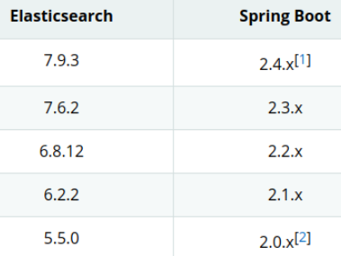
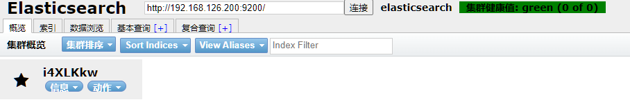
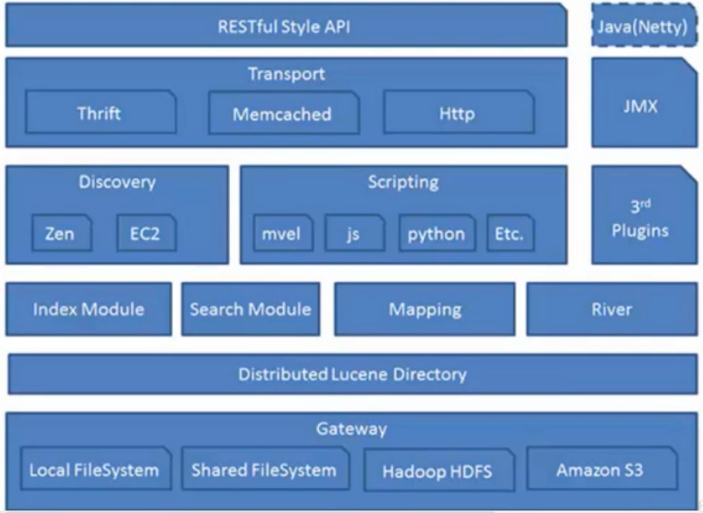
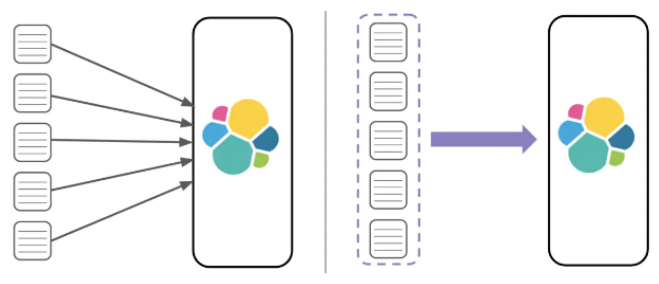
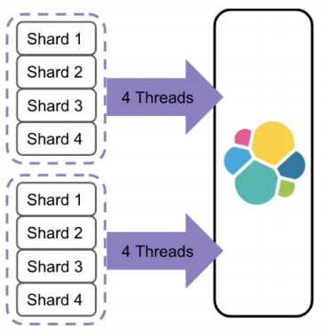
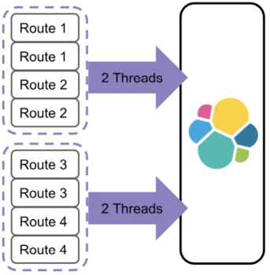

> 当前位置：【Java】10_Distributed（分布式架构）-> 10.10_ElasticSearch（分布式搜索引擎）

# ElasticSearch 下载安装和配置

## 0、ElasticSearch 下载 

- 官网：https://www.elastic.co/cn/elasticsearch/
- 所有版本下载：https://www.elastic.co/cn/downloads/past-releases#elasticsearch
- 7.3.0下载：https://www.elastic.co/cn/downloads/past-releases/elasticsearch-7-3-0


- SpringBoot 版本和 ES 安装版本有关



## 1、Docker - ElasticSearch 安装和配置

### 步骤1：系统参数配置

```bash
vi /etc/security/limits.conf
# 添加内容
* soft nofile 65536
* hard nofile 65536

vi /etc/sysctl.conf
# 添加内容
vm.max_map_count=655360
```

### 步骤2：配置文件

```yaml
# 创建文件夹
mkdir -p /docker_data/es/{conf,plugins}

cd /docker_data/es/conf

# 创建文件 elasticsearch.yml
# /usr/share/elasticsearch/config/elasticsearch.yml

# 7.3.0版本使用
node.name: node-1
network.host: 0.0.0.0
http.port: 9200
cluster.initial_master_nodes: ["node-1"]
# ES-Head
http.cors.enabled: true  # 开启跨域
http.cors.allow-origin: "*"  # 允许跨域域名，*代表所有域名

# 6.8.12版本使用
cluster.name: "elasticsearch"
http.cors.enabled: true
http.cors.allow-origin: "*"
network.host: 0.0.0.0
discovery.zen.minimum_master_nodes: 1
```

### 步骤3：创建容器

```bash
# 下载
docker pull elasticsearch:7.3.0
docker pull elasticsearch:6.8.12

# Linux - 挂载配置文件
docker run -di --name=es -p 9200:9200 -p 9300:9300  -v /docker_data/es/conf/elasticsearch.yml:/usr/share/elasticsearch/config/elasticsearch.yml -v /docker_data/es/plugins:/usr/share/elasticsearch/plugins elasticsearch:7.3.0

docker run -di --name=ES-6.8.12 -p 9200:9200 -p 9300:9300  -v /docker_data/es/conf/elasticsearch.yml:/usr/share/elasticsearch/config/elasticsearch.yml -v /docker_data/es/plugins:/usr/share/elasticsearch/plugins elasticsearch:6.8.12

# 进入容器
docker exec -it es /bin/bash
```

### 步骤4：验证是否安装成功

- http://192.168.126.200:9200/
- 出现如下，表示成功

```json
{
    "name": "UZxhFoS",
    "cluster_name": "elasticsearch",
    "cluster_uuid": "Xj2lKqPHSLCCXkwDCdWgXQ",
    "version": {
        "number": "6.8.12",
        "build_flavor": "default",
        "build_type": "docker",
        "build_hash": "7a15d2a",
        "build_date": "2020-08-12T07:27:20.804867Z",
        "build_snapshot": false,
        "lucene_version": "7.7.3",
        "minimum_wire_compatibility_version": "5.6.0",
        "minimum_index_compatibility_version": "5.0.0"
    },
    "tagline": "You Know, for Search"
}
```


## 2、Linux系统 - ElasticSearch 安装和配置

### 2.1 单机搭建

#### 步骤1：解压

```bash
cd /root/
tar -zxvf elasticsearch-7.3.0-linux-x86_64.tar.gz
mv /root/elasticsearch-7.3.0 /usr/elasticsearch/

cd /usr/elasticsearch/
```

#### 步骤2：修改配置文件

##### （1）elasticsearch.yml

```bash
vi /usr/elasticsearch/config/elasticsearch.yml

# 配置
node.name: node-1
network.host: 0.0.0.0
http.port: 9200
cluster.initial_master_nodes: ["node-1"]
```

##### （2）jvm.options

```bash
vi /usr/elasticsearch/config/jvm.options

# 默认都是1G，单机1G内存，启动会占用700m+，然后在安装 kibana 后，基本上无法运行了，运行了一会就挂了报内存不足，根据实际情况修改占用内存
-Xms1g
-Xmx1g

# -XX:+UseConcMarkSweepGC 改为 -XX:+UseG1GC
-XX:+UseG1GC
```

##### （3）sysctl.conf

```bash
vi /etc/sysctl.conf

# 末尾添加
vm.max_map_count=655360

# 刷新生效
sysctl -p
```

##### （4）limits.conf

```bash
vi /etc/security/limits.conf

# 末尾添加
*                soft    nofile          65536 
*                hard    nofile          65536 
*                soft    nproc           4096 
*                hard    nproc           4096
```

#### 步骤3：添加 ES 用户

```bash
# 默认root用户无法启动，需要改为其他用户
# 添加用户
useradd estest

# 修改密码（此处密码设置为123）
passwd estest

# 改变es目录拥有者账号
chown -R estest /usr/elasticsearch/
```

#### 步骤4：启动 ES

```bash
# 切换用户
su estest

# 前台启动
/usr/elasticsearch/bin/elasticsearch

# 后台启动
cd /usr/elasticsearch/bin/
./elasticsearch -d

# 查看进程
ps aux | grep elasticsearch

# 重启 ES
kill -9  xxxx
```

#### 步骤5：访问

- http://192.168.126.135:9200/


### 2.2 集群搭建

#### 步骤1：第1节点配置

-  修改完配置文件之后，一定要把之前的data目录下node数据删除再重启服务即可

```yaml
# 拷贝原来的 ES节点 elasticsearch 并命名为elasticsearch1，并授权
cd /usr/
cp /usr/elasticsearch/ elasticsearch1 -rf
chown -R estest elasticsearch1

vi /usr/elasticsearch1/config/elasticsearch.yml
# ----------------------------------------

cluster.name: my-es # 集群名称
node.name: node-1  # 每个节点名称都唯一，不可重复
network.host: 0.0.0.0  # # 监听访问地址为任意网段
http.port: 9201 # 服务端口
transport.port: 9301  # 服务间通信端口
discovery.seed_hosts: ["192.168.126.135:9301","192.168.126.135:9302","192.168.126.135:9303"]
cluster.initial_master_nodes: ["node-1", "node-2"]

# ----------------------------------------

# 切换用户
su estest

# 启动
cd /usr/elasticsearch1/bin/ 
./elasticsearch -d
```


#### 步骤2：第2节点配置

```bash
# 拷贝原来的 ES节点 elasticsearch 并命名为elasticsearch2，并授权
cp /usr/elasticsearch/ elasticsearch2 -rf
chown -R estest elasticsearch2

vi /usr/elasticsearch2/config/elasticsearch.yml
# ----------------------------------------

cluster.name: my-es # 集群名称
node.name: node-2  # 每个节点名称都唯一，不可重复
network.host: 0.0.0.0  # # 监听访问地址为任意网段
http.port: 9202 # 服务端口
transport.port: 9302  # 服务间通信端口
discovery.seed_hosts: ["192.168.126.135:9301","192.168.126.135:9302","192.168.126.135:9303"]
cluster.initial_master_nodes: ["node-1", "node-2"]

# ----------------------------------------

# 启动从环境2 一定要用estest用户来执行 
# 切换用户
su estest

# 启动
cd /usr/elasticsearch2/bin/ 
./elasticsearch -d
```


#### 步骤3：第3节点配置

```bash
# 拷贝原来的 ES节点 elasticsearch 并命名为elasticsearch3，并授权
cp /usr/elasticsearch/ elasticsearch3 -rf
chown -R estest elasticsearch3

vi /usr/elasticsearch3/config/elasticsearch.yml
# ----------------------------------------

cluster.name: my-es # 集群名称
node.name: node-3  # 每个节点名称都唯一，不可重复
network.host: 0.0.0.0  # # 监听访问地址为任意网段
http.port: 9203 # 服务端口
transport.port: 9303  # 服务间通信端口
discovery.seed_hosts: ["192.168.126.135:9301","192.168.126.135:9302","192.168.126.135:9303"]
cluster.initial_master_nodes: ["node-1", "node-2"]

# ----------------------------------------

# 启动从环境3 一定要用estest用户来执行 
# 切换用户
su estest

# 启动
cd /usr/elasticsearch3/bin/ 
./elasticsearch -d
```


#### 步骤4：验证

- 总览：http://192.168.126.135:9200/_cat/health?v
- 节点验证：http://192.168.126.135:9201/_cat/nodes?v

# Kibana（图形化工具）

## 0、Kibana 下载

- 官网：https://www.elastic.co/cn/kibana/

- 所有版本：https://www.elastic.co/cn/downloads/past-releases#kibana
- 7.3.0版本：https://www.elastic.co/cn/downloads/past-releases/kibana-7-3-0


## 1、Docker - Kibana 安装和配置


## 2、Linux系统 - Kibana 安装和配置

### 步骤1：解压

```bash
# root账户下操作
cd /root/
tar -zxvf kibana-7.3.0-linux-x86_64.tar.gz
mv /root/kibana-7.3.0-linux-x86_64 /usr/kibana/
cd /usr/kibana/

# 默认root用户无法启动，需要改为其他用户
# 添加用户
useradd estest

# 修改密码（此处密码设置为123）
passwd estest

# 改变es目录拥有者账号
chown -R estest /usr/kibana/

# 设置访问权限
chmod -R 777 /usr/kibana/

# 安装依赖
yum install ipa-gothic-fonts xorg-x11-fonts-100dpi xorg-x11-fonts-75dpi xorg-x11-utils xorg-x11-fonts-cyrillic xorg-x11-fonts-Type1 xorg-x11-fonts-misc fontconfig freetype
```

### 步骤2：修改配置文件

```bash
# 修改配置文件
vi /usr/kibana/config/kibana.yml

# 修改端口、访问ip、elasticsearch服务器ip
server.port: 5601 
server.host: "0.0.0.0" 
elasticsearch.hosts: ["http://192.168.126.135:9201"] 
i18n.locale: "zh-CN"
```

### 步骤3：启动

```bash
# 切换用户
su estest 

# 前台启动
cd /usr/kibana
./bin/kibana

# 后台启动
cd /usr/kibana
nohup ./bin/kibana &

# 停止
netstat -tunlp|grep 5601
kill -9
```

### 步骤4：访问

- http://192.168.126.135:5601/app/kibana

# ES-Head（图形化工具）

## 1、Docker 安装方式

```bash
# 下载
docker pull mobz/elasticsearch-head:5

# 创建容器
docker run -d --name=ES-head -p 9100:9100 docker.io/mobz/elasticsearch-head:5

# 进入容器
docker exec -it ES-head /bin/bash

# 进入 head 安装目录
cd _site

# 更新
apt-get update
 
# 安装 vim 
apt-get install -y vim

# 如果更新失败，从docker容器复制到主机中
docker cp ES-head:/usr/src/app/_site/vendor.js /docker_data/es/

# 编辑
cd /docker_data/es/
vi vendor.js

# 定位 6886 行
6886G

# "application/x-www-form-urlencoded" 改为 "application/json;charset=UTF-8"
"application/json;charset=UTF-8"

# 定位 7574 行
7574G
# "application/x-www-form-urlencoded" 改为 "application/json;charset=UTF-8"
"application/json;charset=UTF-8"

# 复制主机文件到docker容器中
docker cp /docker_data/es/vendor.js ES-head:/usr/src/app/_site/
```




# Elasticsearch 插件（IK 分词器）

## 1、IK 分词器

- IKAnalyzer是一个开源的，基于java语言开发的轻量级的中文分词工具包。
- 从2006年12月推出1.0版开始，IKAnalyzer已经推出 了3个大版本
- 最初，它是以开源项目Lucene为应用主体的，结合词典分词和文法分析算法的中文分词组件
- 新版本的IKAnalyzer3.0则发展为 面向Java的公用分词组件，独立于Lucene项目，同时提供了对Lucene的默认优化实现。
- IK分词器 3.0 特性

```bash
- 采用了特有的“正向迭代最细粒度切分算法“，具有60万字/秒的高速处理能力。
- 采用了多子处理器分析模式，支持：英文字母（IP地址、Email、URL）、数字（日期，常用中文数量词，罗马数字，科学计数法），中文词汇（姓名、地名处理）等分词处理。
- 支持个人词条的优化的词典存储，更小的内存占用。
- 支持用户词典扩展定义。
- 针对Lucene全文检索优化的查询分析器IKQueryParser；采用歧义分析算法优化查询关键字的搜索排列组合，能极大的提高Lucene检索的命中率。
```


## 2、安装

### 安装方式1：docker 容器适用

- 分词器下载地址：https://github.com/medcl/elasticsearch-analysis-ik/releases/tag/v6.8.12
- 将压缩包解压，修改文件夹为 ik，然后上传到 /docker_data/es/plugins/ 下

```bash
# 如果容器创建时，没有使用挂载目录，则可以使用命令将文件夹拷贝到容器内部
docker cp ik es:/usr/share/elasticsearch/plugins/
```

### 安装方式1：命令下载

```bash
# 单机
/usr/elasticsearch/bin/elasticsearch-plugin install https://github.com/medcl/elasticsearch-analysis-ik/releases/download/v7.3.0/elasticsearch-analysis-ik-7.3.0.zip


# 下载完成后会提示 Continue with installation? 输入 y 即可完成安装
# 重启 Elasticsearch 和 Kibana
```

### 安装方式2：上传安装包

- https://github.com/medcl/elasticsearch-analysis-ik/releases/tag/v7.3.0

```bash
# 在elasticsearch安装目录的plugins目录下
cd /usr/elasticsearch/plugins/
cd /usr/elasticsearch1/plugins/
cd /usr/elasticsearch2/plugins/
cd /usr/elasticsearch3/plugins/

# 新建analysis-ik文件夹 
mkdir analysis-ik 

# 切换至 analysis-ik文件夹下 
/usr/elasticsearch/plugins/analysis-ik/

# 上传资料中的 elasticsearch-analysis-ik-7.3.0.zip 

# 解压 
unzip elasticsearch-analysis-ik-7.3.3.zip 

# 解压完成后删除zip 
rm -rf elasticsearch-analysis-ik-7.3.0.zip

# 重启 Elasticsearch 和 Kibana
```


## 3、测试案例

```bash
# 分词模式：ik_max_word，将文本做最细粒度的拆分
POST _analyze
{
  "analyzer": "ik_max_word",
  "text": "南京市长江大桥"
}

# 分词模式：ik_smart，最粗粒度的拆分
POST _analyze
{
  "analyzer": "ik_smart",
  "text": "南京市长江大桥"
}
```


## 4、自定义词典

### 步骤1：切换目录

```bash
# 插件命令安装方式
cd /usr/elasticsearch/config/analysis-ik/

# 安装包安装方式
cd /usr/elasticsearch/plugins/analysis-ik/config
```

### 步骤2：新建自定义词典

```bash
# 扩展词典
vi td_ext_dict.dic

# 停用词典
vi td_stop_dict.dic
```

### 步骤3：修改配置文件 IKAnalyzer.cfg.xml

- 将自定义的扩展词典文件添加到 IKAnalyzer.cfg.xml 配置中

```bash
# 插件命令安装方式
vi /usr/elasticsearch/config/analysis-ik/IKAnalyzer.cfg.xml

# 安装包安装方式
vi /usr/elasticsearch/plugins/analysis-ik/config/IKAnalyzer.cfg.xml
```

- 修改内容

```xml
<?xml version="1.0" encoding="UTF-8"?>
<!DOCTYPE properties SYSTEM "http://java.sun.com/dtd/properties.dtd">
<properties>
	<comment>IK Analyzer 扩展配置</comment>
 
	<!--用户可以在这里配置自己的扩展字典 -->
	<entry key="ext_dict">td_ext_dict.dic</entry>
 
  <!--用户可以在这里配置自己的扩展停止词字典-->
	<entry key="ext_stopwords">td_stop_dict.dic</entry>
 
	<!--用户可以在这里配置远程扩展字典 -->
	<!-- <entry key="remote_ext_dict">words_location</entry> -->
 
	<!--用户可以在这里配置远程扩展停止词字典-->
	<!-- <entry key="remote_ext_stopwords">words_location</entry> -->
</properties>
```

### 步骤4：重启 es

### 步骤5：测试

- 测试结果：有“江大桥”，没有“市长”

```bash
POST _analyze
{
  "analyzer": "ik_max_word",
  "text": "南京市长江大桥"
}
```


## 5、同义词词典

- 扩展词和停用词是在索引的时候使用，而同义词是检索时候使用。
- Elasticsearch 自带一个名为 synonym 的同义词 filter

### 步骤1：添加 synonym.txt

```bash
vi /usr/elasticsearch/config/analysis-ik/synonym.txt

# 添加内容
china,中国

# 重启ES
```

### 步骤2：在索引创建模板中配置同义词

- 创建索引时，使用同义词配置，模板如下

```bash
PUT /索引名称
{
  "settings": {
    "analysis": {
      "filter": {
        "word_sync": {
          "type": "synonym",
          "synonyms_path": "analysis-ik/synonym.txt"
        }
      },
      "analyzer": {
        "ik_sync_max_word": {
          "filter": [
            "word_sync"
          ],
          "type": "custom",
          "tokenizer": "ik_max_word"
        },
        "ik_sync_smart": {
          "filter": [
            "word_sync"
          ],
          "type": "custom",
          "tokenizer": "ik_smart"
        }
      }
    }
  },
  "mappings": {
    "properties": {
      "字段名": {
        "type": "字段类型",
        "analyzer": "ik_sync_smart",
        "search_analyzer": "ik_sync_smart"
      }
    }
  }
}
```

- 示例

```bash
PUT /td-es-synonym
{
  "settings": {
    "analysis": {
      "filter": {
        "word_sync": {
          "type": "synonym",
          "synonyms_path": "analysis-ik/synonym.txt"
        }
      },
      "analyzer": {
        "ik_sync_max_word": {
          "filter": [
            "word_sync"
          ],
          "type": "custom",
          "tokenizer": "ik_max_word"
        },
        "ik_sync_smart": {
          "filter": [
            "word_sync"
          ],
          "type": "custom",
          "tokenizer": "ik_smart"
        }
      }
    }
  },
  "mappings": {
    "properties": {
      "name": {
        "type": "text",
        "analyzer": "ik_sync_max_word",
        "search_analyzer": "ik_sync_max_word"
      }
    }
  }
}
```

### 步骤3：测试数据

```bash
# 插入数据
POST /td-es-synonym/_doc/1 
{ 
"name":"中华人民共和国，简称中国"
}

# 使用同义词“china”进行搜索
POST /td-es-synonym/_doc/_search
{
  "query": {
    "match": {
      "name": "china"
    }
  }
}
```

# 第一章 ElasticSearch 操作命令

## 1、索引操作

### 1.1 创建索引库

```bash
# 格式
# settings：就是索引库设置，其中可以定义索引库的各种属性，比如分片数、副本数等
PUT /索引名称
{
  "settings": {
    "属性名": "属性值"
  }
}

# 示例
PUT /td-company-index

# 执行后显示如下，表示成功创建
{
  "acknowledged" : true,
  "shards_acknowledged" : true,
  "index" : "td-company-index"
}
```


### 1.2 判断索引库是否存在

```bash
# 格式
HEAD /索引名称

# 示例
HEAD /td-company-index

# 表示索引库存在
200 - OK

# 表示索引库不存在
404 - Not Found
```


### 1.3 查看索引库信息

```bash
# 格式
GET /索引名称
GET /索引名称1,索引名称2,索引名称3,...

# 查看所有索引库信息
GET _all

# 查看所有索引库简化信息
# 绿色：索引的所有分片都正常分配。
# 黄色：至少有一个副本没有得到正确的分配。
# 红色：至少有一个主分片没有得到正确的分配。
GET /_cat/indices?v

# 示例
GET /td-company-index
GET /td-company-index1,td-company-index2
GET _all
GET /_cat/indices?v
```


### 1.4 打开和关闭索引库

```bash
# 打开索引库
POST /索引名称/_open

# 关闭索引库
POST /索引名称/_close

# 示例
POST /td-company-index/_open
POST /td-company-index/_close
```


### 1.5 删除索引库

```bash
# 格式
DELETE /索引名称1,索引名称2,索引名称3

# 示例
DELETE /td-company-index
```


### 1.6 零停机索引重建

- 方案1：外部数据导入方案
- 方案2：基于 scroll + bulk + 索引别名方案
- 方案3：Reindex API方案


## 2、映射操作

### （1）创建映射字段

- https://www.elastic.co/guide/en/elasticsearch/reference/7.3/mapping-params.html

```bash
# 格式1：先创建索引库，后创建映射
# type：类型，可以是text、long、short、date、integer、object等
# index：是否索引，默认为true 
# store：是否存储，默认为false
# analyzer：指定分词器
PUT /索引库名/_mapping
{
  "properties": {
    "字段名": {
      "type": "类型",
      "index": true,
      "store": true,
      "analyzer": "分词器"
    }
  }
}

# 格式2：一次性创建索引和映射
PUT /索引库名称
{
  "settings": {
    "索引库属性名": "索引库属性值"
  },
  "mappings": {
    "properties": {
      "字段名": {
        "映射属性名": "映射属性值"
      }
    }
  }
}

# 示例1：先创建索引库，后创建映射
PUT /td-company-index

PUT /td-company-index/_mapping/
{
  "properties": {
    "name": {
      "type": "text",
      "analyzer": "ik_max_word"
    },
    "job": {
      "type": "text",
      "analyzer": "ik_max_word"
    },
    "logo": {
      "type": "keyword",
      "index": "false"
    },
    "payment": {
      "type": "float"
    }
  }
}

# 示例2：一次性创建索引和映射
PUT /td-employee-index
{
  "settings": {},
  "mappings": {
    "properties": {
      "name": {
        "type": "text",
        "analyzer": "ik_max_word"
      }
    }
  }
}
```


#### 映射属性 - type

- https://www.elastic.co/guide/en/elasticsearch/reference/7.3/mapping-types.html

- String 类型

```bash
text：可分词，不可参与聚合
keyword：不可分词，数据会作为完整字段进行匹配，可以参与聚合
```

- Numerical，数值类型

```bash
基本数据类型：long、interger、short、byte、double、flfloat、half_float
浮点数的高精度类型：scaled_float（需要指定一个精度因子，比如10或100。elasticsearch会把真实值乘以这个因子后存储，取出时再原值）
```

- Date，日期类型

```bash
elasticsearch可以对日期格式化为字符串存储
建议储为毫秒值，存储为long，节省空间
```

- Array，数组类型

```bash
进行匹配时，任意一个元素满足，都认为满足
排序时，如果升序则用数组中的最小值来排序，如果降序则用数组中的最大值来排序
```

- Object：对象

```bash
# 如果存储到索引库的是对象类型，会把girl变成两个字段：girl.name和girl.age
{
  name:"Jack", 
  age:21, 
  girl:{
    name: "Rose", 
    age:21 
	} 
}
```


#### 映射属性 - index

- index影响字段的索引情况

```bash
true：字段会被索引，则可以用来进行搜索。默认值就是true，不进行任何配置，所有字段都会被索引
false：字段不会被索引，不能用来搜索
```


#### 映射属性 - store

- 是否将数据进行独立存储。

```bash
# 默认设置，原始的文本会存储在 _source 里面，默认情况下其他提取出来的字段都不是独立存储的，是从_source 里面提取出来的
store:false

# 获取独立存储的字段要比从_source中解析快得多，但是也会占用更多的空间
store:true
```


#### 映射属性 - analyzer

- 指定分词器
- 一般处理中文会选择ik分词器 ik_max_word、ik_smart


### （2）查看映射关系

```bash
# 查看单个索引映射关系
GET /索引名称/_mapping
GET /td-company-index/_mapping

# 查看所有索引映射关系
GET _mapping
GET _all/_mapping
```


### （3）修改索引映射关系

- 只能增加字段
- 修改值只能删除索引，重新建立映射

```bash
# 格式
PUT /索引库名/_mapping
{
  "properties": {
    "字段名": {
      "type": "类型",
      "index": true,
      "store": true,
      "analyzer": "分词器"
    }
  }
}
```


### （4）动态映射

- Elasticsearch在遇到文档中以前未遇到的字段，使用dynamic mapping（动态映射机制） 来确定字段的数据类型并自动把新的字段添加到类型映射。
- Elastic的动态映射机制可以进行开关控制，通过设置mappings的dynamic属性

```bash
# dynamic = true：遇到陌生字段就执行dynamic mapping处理机制
# dynamic = false：遇到陌生字段就忽略
# dynamic = strict：遇到陌生字段就报错

# 设置为报错 
PUT /user
{
  "settings": {
    "number_of_shards": 3,
    "number_of_replicas": 0
  },
  "mappings": {
    "dynamic": "strict",
    "properties": {
      "name": {
        "type": "text"
      },
      "address": {
        "type": "object",
        "dynamic": true
      }
    }
  }
}

# 插入以下文档，将会报错 
# user索引层设置dynamic是strict，在user层内设置age将报错 
# address层设置dynamic是ture，将动态映射生成字段 
PUT /user/_doc/1
{
  "name": "lisi",
  "age": "20",
  "address": {
    "province": "beijing",
    "city": "beijing"
  }
}
```


### （5）自定义动态映射 - 日期检测

- 在根对象上设置 date_detection 为 false 来关闭

```bash
# 是第一次识别 note 字段，它会被添加为 date 字段
PUT /my_index/_doc/1
{
  "note": "2014-01-01"
} 

# 这个字段已经是一个日期类型，这个不合法的日期将会造成一个异常
PUT /my_index/_doc/2
{
  "note": "Logged out"
}

#########################################################

# 关闭日期检测
PUT /my_index
{
  "mappings": {
    "date_detection": false
  }
}

# 是第一次识别 note 字段，它会被添加为 date 字段
PUT /my_index1/_doc/1
{
  "note": "2014-01-01"
} 

# 因为已经关闭日期检测，所以不会报错
PUT /my_index1/_doc/2
{
  "note": "Logged out"
} 
```


### （6）自定义动态映射 - 指定日期规则

- 指定日期规则，使用 dynamic_date_formats 设置

```bash
# 指定日期规则
PUT /my_index2
{
  "mappings": {
    "dynamic_date_formats": "MM/dd/yyyy"
  }
}

# 不符合日期规则
PUT /my_index2/_doc/1
{
  "note": "2014-01-01"
} 

# 映射类型为：text
GET /my_index2/_mapping

#######################################
# 指定日期规则
PUT /my_index3
{
  "mappings": {
    "dynamic_date_formats": "MM/dd/yyyy"
  }
}

# 符合日期规则
PUT /my_index3/_doc/1
{
  "note": "01/01/2014"
}

# 映射类型为：date
GET /my_index3/_mapping
```


### （7）自定义动态映射 - 动态模板，dynamic_templates

- 可以完全控制新生成字段的映射，甚至可以通过字段名称或数据类型来应用不同的映射
- 每个模板都有一个名称，可以用来描述这个模板的用途，一个 mapping 来指定映射应该怎样使用，以及至少一个参数 (如 match) 来定义这个模板适用于哪个字段

```bash
# es：以 _es 结尾的字段名需要使用 spanish 分词器
# en：所有其他字段使用 english 分词器
PUT /my_index4
{
  "mappings": {
    "dynamic_templates": [
      {
        "es": {
          "match": "*_es",
          "match_mapping_type": "string",
          "mapping": {
            "type": "text",
            "analyzer": "spanish"
          }
        }
      },
      {
        "en": {
          "match": "*",
          "match_mapping_type": "string",
          "mapping": {
            "type": "text",
            "analyzer": "english"
          }
        }
      }
    ]
  }
}

# 查看映射
GET /my_index4/_mapping

# 匹配字段名以 _es 结尾的字段
# 匹配其他所有字符串类型字段
PUT /my_index4/_doc/1
{
  "name_es": "testes",
  "name": "es"
}
```


## 3、文档操作

- 文档，即索引库中的数据，会根据规则创建索引，将来用于搜索。可以类比做数据库中的一行数据

### （1）新增文档

- 手动指定id

```bash
# 格式
POST /索引名称/_doc/{id}

# 举例
POST /td-company-index/_doc/1
{
  "name": "百度",
  "job": "小度用户运营经理",
  "payment": "30000",
  "logo": "http://www.lgstatic.com/thubnail_120x120/i/image/M00/21/3E/CgpFT1kVdzeAJNbU AABJB7x9sm8374.png"
}
```

- 自动生成id

```bash
# 格式
POST /索引名称/_doc { "field":"value" }

# 举例
POST /td-company-index/_doc/
{
  "name": "百度",
  "job": "小度用户运营经理",
  "payment": "30000",
  "logo": "http://www.lgstatic.com/thubnail_120x120/i/image/M00/21/3E/CgpFT1kVdzeAJNbU AABJB7x9sm8374.png"
}
```


### （2）查看文档

```bash
# 查看单个文档
GET /索引名称/_doc/{id}
GET /td-company-index/_doc/1

# 查看所有文档
POST /索引名称/_search
{
  "query": {
    "match_all": {}
  }
}

POST /td-company-index/_search
{
  "query": {
    "match_all": {}
  }
}

# _source定制返回结果
GET /td-company-index/_doc/1?_source=name,job
```

- 查看文档返回结果

```bash
# _index
document所属index

# _type 
document所属type，Elasticsearch7.x默认type为_doc

# _id
代表document的唯一标识，与index和type一起，可以唯一标识和定位一个document

# _version
document的版本号，Elasticsearch利用_version (版本号)的方式来确保应用中相互冲突的变更不会导致数据丢失。需要修改数据时，需要指定想要修改文
档的version号，如果该版本不是当前版本号，请求将会失败

# _seq_no
严格递增的顺序号，每个文档一个，Shard级别严格递增，保证后写入的Doc seq_no大于先写入的Doc seq_no

# _primary_term
任何类型的写操作，包括index、create、update和Delete，都会生成一个_seq_no。

# found 
true/false，是否查找到文档

# _source 
存储原始文档
```


### （3）更新文档

- 全部更新：是直接把之前的老数据，标记为删除状态，然后，再添加一条更新的

- id对应文档存在，则修改
- id对应文档不存在，则新增

```bash
# 格式
PUT /索引名称/_doc/{id}

# 举例
PUT /td-company-index/_doc/1
{
  "name": "百度",
  "job": "小度用户运营经理",
  "payment": "30000",
  "logo": "http://www.lgstatic.com/thubnail_120x120/i/image/M00/21/3E/CgpFT1kVdzeAJNbU AABJB7x9sm8374.png"
}
```

- 局部更新：只是修改某个字段

```bash
# 格式
POST /索引名/_update/{id}
{
  "doc": {
    "field": "value"
  }
}
```


### （4）删除文档

```bash
# 根据 id 进行删除
DELETE /索引名/_doc/{id}

# 删除所有文档
POST 索引名/_delete_by_query
{
  "query": {
    "match_all": {}
  }
}

# 根据查询条件进行删除
POST /索引库名/_delete_by_query
{
  "query": {
    "match": {
      "字段名": "搜索关键字"
    }
  }
}

# 举例
POST /td-company-index/_delete_by_query
{
  "query": {
    "match": {
      "name": "1"
    }
  }
}
```


### （5）文档的全量替换、强制创建

- 全量替换

```bash
- 语法与创建文档是一样的，如果文档id不存在，那么就是创建；如果文档id已经存在，那么就是全量替换操作，替换文档的json串内容；
- 文档是不可变的，如果要修改文档的内容，第一种方式就是全量替换，直接对文档重新建立索引，替换里面所有的内容，elasticsearch会将老的文档标记为deleted，然后新增我们给定的一个文档，当我们创建越来越多的文档的时候，elasticsearch会在适当的时机在后台自动删除标记为deleted的文档
```

- 强制创建

```bash
# 如果id 存在就会报错
PUT /index/_doc/{id}?op_type=create {}，PUT /index/_doc/{id}/_create {}
```


### （6）批量查询文档（mget）

```bash
# 不同索引
GET /_mget
{
  "docs": [
    {
      "_index": "book",
      "_id": 1
    },
    {
      "_index": "book",
      "_id": 2
    }
  ]
}

# 同一索引
GET /book/_mget
{
  "docs": [
    {
      "_id": 2
    },
    {
      "_id": 3
    }
  ]
}

# 同一索引，简化写法
POST /book/_search
{
  "query": {
    "ids": {
      "values": [
        "1",
        "4"
      ]
    }
  }
}
```


### （7）批量增删改文档（bulk）

- 实际用法：bulk请求一次不要太大，否则一下积压到内存中，性能会下降。所以，一次请求几千个操作、大小在几M正好。
- bulk会将要处理的数据载入内存中，所以数据量是有限的，最佳的数据两不是一个确定的数据，它取决于硬件、文档大小、复杂性、索引以及搜索的负载。
- 一般建议是1000-5000个文档，大小建议是5-15MB，默认不能超过100M，可以在es的配置文件（ES的 config下的elasticsearch.yml）中配置。
- http.max_content_length: 10mb

```bash
# 格式
# delete：删除一个文档，只要1个json串就可以了 删除的批量操作不需要请求体
# create：相当于强制创建 PUT /index/type/id/_create
# update：执行的是局部更新partial update操作
# index：普通的put操作，可以是创建文档，也可以是全量替换文档
POST /_bulk 
{"action":{"metadata"}}
{"data"}

# 删除1，新增5，修改2
POST /_bulk
{"delete":{"_index":"book","_id":"1"}}
{"create":{"_index":"book","_id":"5"}}
{"name":"test14","price":100.99}
{"update":{"_index":"book","_id":"2"}}
{"doc":{"name":"test"}}

```


## 4、地理坐标点操作（经纬度操作）

### （1）地理坐标点 - 创建

- 地理坐标点是指地球表面可以用经纬度描述的一个点
- 地理坐标点可以用来计算两个坐标间的距离，还可以判断一个坐标是否在一个区域中
- 地理坐标点需要显式声明对应字段类型为 geo_point 

```bash
# 格式
PUT /company-locations
{
  "mappings": {
    "properties": {
      "name": {
        "type": "text"
      },
      "location": {
        "type": "geo_point"
      }
    }
  }
}

# 字符串形式
PUT /company-locations/_doc/1
{
  "name": "NetEase",
  "location": "40.715,74.011"
}

# 对象形式 
PUT /company-locations/_doc/2
{
  "name": "Sina",
  "location": {
    "lat": 40.722,
    "lon": 73.989
  }
}

# 数组形式 
PUT /company-locations/_doc/3
{
  "name": "Baidu",
  "location": [
    73.983,
    40.719
  ]
}
```


### （2）地理坐标点 - 查询 

- geo_bounding_box：找出落在指定矩形框中的点（指定一个矩形的顶部、底部、左边界、右边界，然后过滤器只需判断坐标的经度是否在左右边界之间，纬度是否在上下边界之间）
- geo_distance：找出与指定位置在给定距离内的点
- geo_distance_range：找出与指定点距离在给定最小距离和最大距离之间的点
- geo_polygon：找出落在多边形中的点。 这个过滤器使用代价很大 。使用前先看看 geo-shapes

```bash
# 使用 geo_bounding_box 过滤器查询
GET /company-locations/_search
{
  "query": {
    "bool": {
      "must": {
        "match_all": {}
      },
      "filter": {
        "geo_bounding_box": {
          "location": {
            "top_left": {
              "lat": 40.73,
              "lon": 71.12
            },
            "bottom_right": {
              "lat": 40.01,
              "lon": 74.1
            }
          }
        }
      }
    }
  }
}

# 使用 geo_distance 过滤器查询
GET /company-locations/_search
{
  "query": {
    "bool": {
      "must": {
        "match_all": {}
      },
      "filter": {
        "geo_distance": {
          "distance": "200km",
          "location": {
            "lat": 40,
            "lon": 70
          }
        }
      }
    }
  }
}
```


## 5、查询操作 - Query DSL

```bash
# 格式
POST /索引库名/_search
{
  "query": {
    "查询类型": {
      "查询条件": "查询条件值"
    }
  }
}
```


### （1）查询所有（match_all）

```bash
# query：代表查询对象
# match_all：代表查询所有
POST /td-company-index/_search
{
  "query": {
    "match_all": {}
  }
}

# 查询结果分析
# took：查询花费时间，单位是毫秒
# time_out：是否超时
# _shards：分片信息
# hits：搜索结果总览对象
#       total：搜索到的总条数
#       max_score：所有结果中文档得分的最高分
#       hits：搜索结果的文档对象数组，每个元素是一条搜索到的文档信息
#             _index：索引库
#             _type：文档类型
#             _id：文档id
#             _score：文档得分
#             _source：文档的源数据
```


### （2）全文搜索（full-text query）

#### 匹配搜索（match query）

- 可以对一个字段进行模糊、短语查询
- match queries 接收 text/numerics/dates，对它们进行分词分析，再组织成一个boolean查询
- 可通过operator 指定bool组合操作（or、and 默认是 or ）

- 数据准备

```bash
PUT /td-property
{
  "settings": {},
  "mappings": {
    "properties": {
      "title": {
        "type": "text",
        "analyzer": "ik_max_word"
      },
      "images": {
        "type": "keyword"
      },
      "price": {
        "type": "float"
      }
    }
  }
}

# 数据
POST /td-property/_doc/
{
  "title": "小米电视4A",
  "images": "http://image.com/12479122.jpg",
  "price": 4288
}

POST /td-property/_doc/
{
  "title": "小米手机",
  "images": "http://image.com/12479622.jpg",
  "price": 2699
}

POST /td-property/_doc/
{
  "title": "华为手机",
  "images": "http://image.com/12479922.jpg",
  "price": 5699
}
```

- 查询

```bash
# or 关系查询（默认），会把查询条件进行分词，然后进行查询
POST /td-property/_search
{
  "query": {
    "match": {
      "title": "小米电视4A"
    }
  }
}

# and 关系查询
POST /td-property/_search
{
  "query": {
    "match": {
      "title": {
        "query": "小米电视4A",
        "operator": "and"
      }
    }
  }
}
```


#### 短语搜索（match phrase query）

- 用来对一个字段进行短语查询，可以指定 analyzer、slop移动因子

```bash
# 查询结果为0，因为"小米 4A"，中间有其他词
GET /td-property/_search
{
  "query": {
    "match_phrase": {
      "title": "小米 4A"
    }
  }
}

# 有查询结果，因为"slop"移动因子设置为2，表示跨度为2
GET /td-property/_search
{
  "query": {
    "match_phrase": {
      "title": {
        "query": "小米 4A",
        "slop": 2
      }
    }
  }
}
```


#### query_string 查询

- 无需指定某字段而对文档全文进行匹配查询的一个高级查询，同时可以指定在 哪些字段上进行匹配

```bash
# 查询所有字段中，值为2699
GET /td-property/_search
{
  "query": {
    "query_string": {
      "query": "2699"
    }
  }
}

# 指定查询 title 字段中，值为2699
GET /td-property/_search
{
  "query": {
    "query_string": {
      "query": "2699",
      "default_field": "title"
    }
  }
}

# 逻辑查询，查询 title 字段中，值包括"手机" OR "小米"
GET /td-property/_search
{
  "query": {
    "query_string": {
      "query": "手机 OR 小米",
      "default_field": "title"
    }
  }
}

# 逻辑查询，查询 title 字段中，值包括"手机" and "小米"
GET /td-property/_search
{
  "query": {
    "query_string": {
      "query": "手机 AND 小米",
      "default_field": "title"
    }
  }
}

# 模糊查询，查询title中"大","米","大米"（大米，允许忽略其中一个字）
GET /td-property/_search
{
  "query": {
    "query_string": {
      "query": "大米~1",
      "default_field": "title"
    }
  }
}

# 多字段支持， title、price字段中有一个值为2699的
GET /td-property/_search
{
  "query": {
    "query_string": {
      "query": "2699",
      "fields": [
        "title",
        "price"
      ]
    }
  }
}
```


#### 多字段匹配搜索（multi match query）

```bash
GET /td-property/_search
{
  "query": {
    "multi_match": {
      "query": "2699",
      "fields": [
        "title",
        "price"
      ]
    }
  }
}


# *匹配多个字段
GET /td-property/_search
{
  "query": {
    "multi_match": {
      "query": "http://image.com/12479622.jpg",
      "fields": [
        "title",
        "ima*"
      ]
    }
  }
}
```


### （3）词条级搜索（term-level queries）

- 数据准备

```bash
	PUT /book
{
  "settings": {},
  "mappings": {
    "properties": {
      "description": {
        "type": "text",
        "analyzer": "ik_max_word"
      },
      "name": {
        "type": "text",
        "analyzer": "ik_max_word"
      },
      "price": {
        "type": "float"
      },
      "timestamp": {
        "type": "date",
        "format": "yyyy-MM-dd HH:mm:ss||yyyy-MM-dd||epoch_millis"
      }
    }
  }
}


PUT /book/_doc/1
{
  "name": "lucene",
  "description": "Lucene Core is a Java library providing powerful indexing and search features, as well as spellchecking, hit highlighting and advanced analysis/tokenization capabilities. The PyLucene sub project provides Python bindings for Lucene Core. ",
  "price": 100.45,
  "timestamp": "2020-08-21 19:11:35"
}

PUT /book/_doc/2
{
  "name": "solr",
  "description": "Solr is highly scalable, providing fully fault tolerant distributed indexing, search and analytics. It exposes Lucenes features through easy to use JSON/HTTP interfaces or native clients for Java and other languages.",
  "price": 320.45,
  "timestamp": "2020-07-21 17:11:35"
}

PUT /book/_doc/3
{
  "name": "Hadoop",
  "description": "The Apache Hadoop software library is a framework that allows for the distributed processing of large data sets across clusters of computers using simple programming models.",
  "price": 620.45,
  "timestamp": "2020-08-22 19:18:35"
}

PUT /book/_doc/4
{
  "name": "ElasticSearch",
  "description": "Elasticsearch是一个基于Lucene的搜索服务器。它提供了一个分布式多用户能力 的全文搜索引擎，基于RESTful web接口。Elasticsearch是用Java语言开发的，并作为Apache许可条 款下的开放源码发布，是一种流行的企业级搜索引擎。Elasticsearch用于云计算中，能够达到实时搜 索，稳定，可靠，快速，安装使用方便。官方客户端在Java、.NET（C#）、PHP、Python、Apache Groovy、Ruby和许多其他语言中都是可用的。根据DB-Engines的排名显示，Elasticsearch是最受欢 迎的企业搜索引擎，其次是Apache Solr，也是基于Lucene。",
  "price": 999.99,
  "timestamp": "2020-08-15 10:11:35"
}
```

- 搜素

```bash
# 词条搜索（term query）
# term 查询用于查询指定字段包含某个词项的文档
POST /book/_search
{
  "query": {
    "term": {
      "name": "solr"
    }
  }
}

# 词条集合搜索（terms query）
# terms 查询用于查询指定字段包含某些词项的文档
GET /book/_search
{
  "query": {
    "terms": {
      "name": [
        "solr",
        "elasticsearch"
      ]
    }
  }
}

# 范围搜索（range query）
# gte：大于等于
# gt：大于
# lte：小于等于
# lt：小于
# boost：查询权重
GET /book/_search
{
  "query": {
    "range": {
      "price": {
        "gte": 10,
        "lte": 200,
        "boost": 2
      }
    }
  }
}

GET /book/_search
{
  "query": {
    "range": {
      "timestamp": {
        "gte": "now-2d/d",
        "lt": "now/d"
      }
    }
  }
}

GET book/_search
{
  "query": {
    "range": {
      "timestamp": {
        "gte": "18/08/2020",
        "lte": "2021",
        "format": "dd/MM/yyyy||yyyy"
      }
    }
  }
}

# 不为空搜索（exists query）
# 查询指定字段值不为空的文档，相当 SQL 中的 column is not null
GET /book/_search
{
  "query": {
    "exists": {
      "field": "price"
    }
  }
}

# 词项前缀搜索（prefix query）
GET /book/_search
{
  "query": {
    "prefix": {
      "name": "so"
    }
  }
}

# 通配符搜索（wildcard query）
# 区分大小写
GET /book/_search
{
  "query": {
    "wildcard": {
      "name": "so*r"
    }
  }
}

GET /book/_search
{
  "query": {
    "wildcard": {
      "name": {
        "value": "lu*",
        "boost": 2
      }
    }
  }
}

# 正则搜索（regexp query）
# 如.*开头的查询，将会匹配所有的倒排索引中的关键字，这几乎相当于全表扫描，会很慢。因此如果可以的话，最好在使用正则前，加上匹配的前缀
GET /book/_search
{
  "query": {
    "regexp": {
      "name": "s.*"
    }
  }
}

GET /book/_search
{
  "query": {
    "regexp": {
      "name": {
        "value": "s.*",
        "boost": 1.2
      }
    }
  }
}

# 模糊搜索（fuzzy query）
GET /book/_search
{
  "query": {
    "fuzzy": {
      "name": "so"
    }
  }
}

# fuzziness，模糊值，允许模糊几个
GET /book/_search
{
  "query": {
    "fuzzy": {
      "name": {
        "value": "so",
        "boost": 1,
        "fuzziness": 2
      }
    }
  }
}

GET /book/_search
{
  "query": {
    "fuzzy": {
      "name": {
        "value": "sorl",
        "boost": 1,
        "fuzziness": 2
      }
    }
  }
}

# ids搜索（id集合查询）
GET /book/_search
{
  "query": {
    "ids": {
      "type": "_doc",
      "values": [
        "1",
        "3"
      ]
    }
  }
}
```


### （4）复合搜索（compound query）

```bash
# constant_score query
# 固定分数查询：包装另一个查询，将查询匹配的文档的评，设为一个常值
GET /book/_search
{
  "query": {
    "constant_score": {
      "filter": {
        "term": {
          "description": "solr"
        }
      },
      "boost": 1.2
    }
  }
}


# 布尔搜索（bool query）
# 组合多个查询字句为一个查询
# bool must：必须满足
# bool filter：必须满足，但执行的是filter上下文，不参与、不影响评分
# bool should：或
# bool must_not：必须不满足，在filter上下文中执行，不参与、不影响评分
# minimum_should_match：代表了最小匹配精度，如果设置minimum_should_match=1，那么should语句中至少需要有一个条件满足
POST /book/_search
{ 
  "query": {
    "bool": {
      "should": {
        "match": {
          "description": "java"
        }
      },
      "filter": {
        "term": {
          "name": "solr"
        }
      },
      "must_not": {
        "range": {
          "price": {
            "gte": 200,
            "lte": 300
          }
        }
      },
      "minimum_should_match": 1,
      "boost": 1
    }
  }
}
```


### （5）排序

```bash
# 评分升序排序
POST /book/_search
{
  "query": {
    "match": {
      "description": "solr"
    }
  },
  "sort": [
    {
      "_score": {
        "order": "asc"
      }
    }
  ]
}

# 字段值排序，降序
POST /book/_search
{
  "query": {
    "match_all": {}
  },
  "sort": [
    {
      "price": {
        "order": "desc"
      }
    }
  ]
}

# 多级排序
# 首先按照价格排序，然后按照相关性得分排序
POST /book/_search
{
  "query": {
    "match_all": {}
  },
  "sort": [
    {
      "price": {
        "order": "desc"
      }
    },
    {
      "timestamp": {
        "order": "desc"
      }
    }
  ]
}
```


### （6）分页

```bash
# size：每页显示多少条
# from：当前页起始索引, int start = (pageNum - 1) * size
POST /book/_search
{
  "query": {
    "match_all": {}
  },
  "size": 2,
  "from": 0
}

POST /book/_search
{
  "query": {
    "match_all": {}
  },
  "sort": [
    {
      "price": {
        "order": "desc"
      }
    }
  ],
  "size": 2,
  "from": 2
}
```


### （7）高亮

```bash
# pre_tags：前置标签
# post_tags：后置标签
# fields：需要高亮的字段

# 单字段
POST /book/_search
{
  "query": {
    "match": {
      "name": "elasticsearch"
    }
  },
  "highlight": {
    "pre_tags": "<font color='pink'>",
    "post_tags": "</font>",
    "fields": [
      {
        "name": {}
      }
    ]
  }
}

# 单字段高亮：query match 已经限制查询name了
POST /book/_search
{
  "query": {
    "match": {
      "name": "elasticsearch"
    }
  },
  "highlight": {
    "pre_tags": "<font color='pink'>",
    "post_tags": "</font>",
    "fields": [
      {
        "name": {}
      },
      {
        "description": {}
      }
    ]
  }
}

# 多字段高亮
POST /book/_search
{
  "query": {
    "query_string": {
      "query": "elasticsearch"
    }
  },
  "highlight": {
    "pre_tags": "<font color='pink'>",
    "post_tags": "</font>",
    "fields": [
      {
        "name": {}
      },
      {
        "description": {}
      }
    ]
  }
}
```


## 6、查询操作 - Filter DSL

- Elasticsearch中的所有的查询都会触发相关度得分的计算
- Filter DSL 执行速度快

```
过滤器不会计算相关度的得分，所以它们在计算上更快一些。
过滤器可以被缓存到内存中，这使得在重复的搜索查询上，其要比相应的查询快出许多
```

- 写法

```bash
# ES 5.0 之后的写法 
# 被过滤的查询包含一个match_all查询（查询部分）和一个过滤器（filter部分）
POST /book/_search
{
  "query": {
    "bool": {
      "must": {
        "match_all": {}
      },
      "filter": {
        "range": {
          "price": {
            "gte": 200,
            "lte": 1000
          }
        }
      }
    }
  }
}
```


## 7、聚合分析

### 7.1 聚合分析

```bash
# 格式（aggregations 也可简写为 aggs）
"aggregations" : 
{ "<aggregation_name>" : 
  {
    "<aggregation_type>" : { <aggregation_body> }
    [,"meta" : { [<meta_data_body>] } ]? 
    [,"aggregations" : { [<sub_aggregation>]+ } ]?
  }

  [,"<aggregation_name_2>" : { ... } ]
}

# 解释
"aggregations" : 
{ "聚合名称1" : 
  {
    "聚合类型" : { 聚合体（对哪些字段聚合） }
    [,"meta" : { [元数据] } ]? 
    [,"aggregations" : { [子聚合]+ } ]?
  }

  [,"聚合名称2" : { ... } ]
}
```


### 7.2 指标聚合 metric

- 指标聚合 metric：对一个数据集求最大、最小、和、平均值等指标的聚合

```bash
# max min sum avg
POST /book/_search
{
  "size": 0,
  "aggs": {
    "max_price": {
      "max": {
        "field": "price"
      }
    }
  }
}

# count：文档计数
# 统计price大于100的文档数量
POST /book/_count
{
  "query": {
    "range": {
      "price": {
        "gt": 100
      }
    }
  }
}

# value_count：统计某字段有值的文档数
POST /book/_search?size=0
{
  "aggs": {
    "price_count": {
      "value_count": {
        "field": "price"
      }
    }
  }
}

POST /book/_search
{
  "size": 0,
  "aggs": {
    "price_count": {
      "value_count": {
        "field": "price"
      }
    }
  }
}

# cardinality：去重
POST /book/_search?size=0
{
  "aggs": {
    "_id_count": {
      "cardinality": {
        "field": "_id"
      }
    },
    "price_count": {
      "cardinality": {
        "field": "price"
      }
    }
  }
}

# stats：统计 count max min avg sum 5个值的状态
POST /book/_search?size=0
{
  "aggs": {
    "price_stats": {
      "stats": {
        "field": "price"
      }
    }
  }
}

# Extended stats：统计 count max min avg sum 平方和、方差、标准差、平均值加/减两个标准差的区间
POST /book/_search?size=0
{
  "aggs": {
    "price_stats": {
      "extended_stats": {
        "field": "price"
      }
    }
  }
}

# Percentiles：占比百分位对应的值统计
POST /book/_search?size=0
{
  "aggs": {
    "price_percents": {
      "percentiles": {
        "field": "price"
      }
    }
  }
}

# 指定显示哪些百分比
POST /book/_search?size=0
{
  "aggs": {
    "price_percents": {
      "percentiles": {
        "field": "price",
        "percents": [
          75,
          99,
          99.9
        ]
      }
    }
  }
}

# Percentiles rank 统计值小于等于指定值的文档占比
# 统计price小于100和200的文档的占比
POST /book/_search?size=0
{
  "aggs": {
    "gge_perc_rank": {
      "percentile_ranks": {
        "field": "price",
        "values": [
          100,
          200
        ]
      }
    }
  }
}
```


### 7.3 桶聚合 buketing

- 桶聚合 bucketing：对查询出的数据进行分组 group by（分桶），再在组上进行指标聚合，桶聚合 bucketing
- https://www.elastic.co/guide/en/elasticsearch/reference/7.3/search-aggregations-bucket.html

- 使用

```bash
# 分组后，再统计
POST /book/_search
{
  "size": 0,
  "aggs": {
    "group_by_price": {
      "range": {
        "field": "price",
        "ranges": [
          {
            "from": 0,
            "to": 200
          },
          {
            "from": 200,
            "to": 400
          },
          {
            "from": 400,
            "to": 1000
          }
        ]
      },
      "aggs": {
        "average_price": {
          "avg": {
            "field": "price"
          }
        },
        "count_price": {
          "value_count": {
            "field": "price"
          }
        }
      }
    }
  }
}

# 实现 having 过滤
POST /book/_search
{
  "size": 0,
  "aggs": {
    "group_by_price": {
      "range": {
        "field": "price",
        "ranges": [
          {
            "from": 0,
            "to": 200
          },
          {
            "from": 200,
            "to": 400
          },
          {
            "from": 400,
            "to": 1000
          }
        ]
      },
      "aggs": {
        "average_price": {
          "avg": {
            "field": "price"
          }
        },
        "having": {
          "bucket_selector": {
            "buckets_path": {
              "avg_price": "average_price"
            },
            "script": {
              "source": "params.avg_price >= 200 "
            }
          }
        }
      }
    }
  }
}
```


## 8、智能搜索建议 Suggester

- Term Suggester
- Phrase Suggester
- Completion Suggester
- Context Suggeste


## 9、定位非法搜索及原因

```bash
# 使用 validate + explain 定位非法搜索及原因
GET /book/_validate/query?explain
{
  "query": {
    "match1": {
      "name": "test"
    }
  }
}
```


# 第二章 ElasticSearch 简介

## 1、概述

- Elaticsearch 简称为 ES，是一个开源的可扩展的分布式的全文检索引擎，它可以近乎实时的存储、检索数据。
- 本身扩展性很好，可扩展到上百台服务器，处理 PB 级别的数据。
- ES 使用 Java 开发并使用 Lucene 作为其核心来实现索引和搜索的功能
- 通过简单的 RestfulAPI 和 javaAPI 来隐藏 Lucene 的复杂性，从而让全文搜索变得简单。
- ELK 是三个开源软件的缩写：Elasticsearch、Logstash、Kibana

```bash
Elasticsearch 是一个搜索和分析引擎
Logstash 是服务器端数据处理管道，能够同时从多个来源采集数据，转换数据，然后将数据发送到诸如 Elasticsearch 等“存储库”中
Kibana 则可以让用户在 Elasticsearch 中使用图形和图表对数据进行可视化。
```


## 2、特点

- 提供了一个极速的搜索体验。这源于它的高速（speed）。相比较其它的一些大数据引擎，Elasticsearch可以实现秒级的搜索，速度非常有优势。Elasticsearch的cluster是一种分布式的部署，极易扩展(scale )这样很容易使它处理PB级的数据库容量。最重要的是Elasticsearch是它搜索的结果可以按照分数进行排序，它能提供我们最相关的搜索结果（relevance) 。
- 安装方便：没有其他依赖，下载后安装非常方便；只用修改几个参数就可以搭建起来一个集群
- JSON：输入/输出格式为 JSON，意味着不需要定义 Schema，快捷方便
- RESTful：基本所有操作 ( 索引、查询、甚至是配置 ) 都可以通过 HTTP 接口进行
- 分布式：节点对外表现对等（每个节点都可以用来做入口） 加入节点自动负载均衡
- 多租户：可根据不同的用途分索引，可以同时操作多个索引
- 支持超大数据： 可以扩展到 PB 级的结构化和非结构化数据 海量数据的近实时处理


## 3、版本

- Elasticsearch 主流版本为5.x、6.x、7.x版本


### 3.1 Elasticsearch 7.x 更新的内容

#### （1）集群连接变化：TransportClient被废弃

- es7的java代码，只能使用restclient。对于java编程，建议采用 High-level-rest- client 的方式操作ES集群
- High-level REST client 已删除接受Header参数的API方 法，Cluster Health API默认为集群级别。


#### （2）ES数据存储结构变化：简化了Type 默认使用_doc

- es6时，官方就提到了es7会逐渐删除索引type，并且es6时已经规定每一个index只能有一个 type
- 在es7中使用默认的_doc作为type，官方说在8.x版本会彻底移除type
- api请求方式也发送变化，如获得某索引的某ID的文档：GET index/_doc/id其中index和id为具体的值


#### （3）ES程序包默认打包jdk

- 7.x版本的程序包大小突然增大了200MB+， 对比6.x发现，包大了200MB+， 正是JDK的大小


#### （4）默认配置变化

- 默认节点名称为主机名，默认分片数改为1，不再是5。 


#### （5）升级到 lucene 8 查询相关性速度优化

- Weak-AND算法
- es可以看成是分布式lucene，lucene的性能直接决定es的性能。
- lucene8在top k及其他查询上有很大的性能提升。
- weak-and算 核心原理：取TOP N结果集，估算命中记录数。 TOP N的时候会跳过得分低于10000的文档来达到更快的性能。


#### （6）间隔查询(Intervals queries)

- intervals query 允许用户精确控制查询词在文档中出现的先后关系，实现了对terms顺序、terms之间的距离以及它们之间的包含关系的灵活控制。


#### （7）引入新的集群协调子系统

- 移除 minimum_master_nodes 参数，让 Elasticsearch 自己选择可以形成仲裁的节点。


#### （8）7.0 将不会再有OOM的情况

- JVM引入了新的 circuit breaker（熔断）机制，当查询或聚合的数据量超出单机处理的最大内存限制时会被截断。
- 设置 indices.breaker.fielddata.limit 的默认值已从JVM堆大小的60％降低到40％。


#### （9）分片搜索空闲时跳过 refresh

- 以前版本的数据插入，每一秒都会有refresh动作，这使得es能成为一个近实时的搜索引擎。
- 当没有查询需求的时候，该动作会使得es的资源得到较大的浪费。


### 3.2 兼容性 - Elasticsearch与操作系统

- https://www.elastic.co/cn/support/matrix#matrix_os


### 3.3 兼容性 - Elasticsearch and JVM

- https://www.elastic.co/cn/support/matrix#matrix_jvm


## 4、使用场景

### （1）分布式的搜索引擎

- 分布式：Elasticsearch自动将海量数据分散到多台服务器上去存储和检索

- 全文检索：提供模糊搜索等自动度很高的查询方式，并进行相关性排名，高亮等功能

- 搜索：百度、谷歌，站内搜索、电商网站、招聘网站、新闻资讯类网站、各种app内的搜索

  - 维基百科、百度百科：有全文检索、高亮、搜索推荐功能
  - stack overflow：有全文检索，可以根据报错关键信息，去搜索解决方法。
  - github：从上千亿行代码中搜索你想要的关键代码和项目。

  

### （2）日志分析类场景

- 经典的ELK组合（Elasticsearch/Logstash/Kibana），可以完成日志收集，日志存储，日志分析查询界面基本功能，目前该方案的实现很普及，大部分企业日志分析系统使用了该方案。

  

### （3）数据预警平台及数据分析场景（分组聚合）

- 例如电商价格预警，在支持的电商平台设置价格预警，当优惠的价格低于某个值时，触发通知消息，通知用户购买。
- 数据分析：常见的比如分析电商平台销售量top 10的品牌，分析博客系统、头条网站top 10关注度、评论数、访问量的内容等等。


### （4）对海量数据进行近实时的处理

- 海量数据的处理：因为是分布式架构，Elasticsearch可以采用大量的服务器去存储和检索数据，自然而然就可以实现海量数据的处理
- 近实时：Elasticsearch可以实现秒级别的数据搜索和分析
- 商业BI（Business Intelligence）系统：比如大型零售超市，需要分析上一季度用户消费金额，年龄段，每天各时间段到店人数分布等信息，输出相应的报表数据，并预测下一季度的热卖商品，根据年龄段定向推荐适宜产品。Elasticsearch执行数据分析和挖掘，Kibana做数据可视化。


## 5、全文搜索方案对比

- Solr和Elasticsearch都是基于Lucene实现的
- Solr和Elasticsearch之间的区别

```
Solr利用Zookpper进行分布式管理
Elasticsearch自身带有分布式协调管理功能

Solr比Elasticsearch实现更加全面
Solr官方提供的功能更多
Elasticsearch本身更注重于核心功能， 高级功能多由第三方插件提供

Solr在传统的搜索应用中表现好于Elasticsearch，
Elasticsearch在实时搜索应用方面比Solr表现好
```


### 5.1 基于Lucene

#### （1）【Lucene】全文搜索引擎框架

- 官方网站：http://lucene.apache.org/
- Lucene是Apache基金会维护的一套完全使用Java编写的信息搜索工具包（Jar包），它包含了索引结构、读写索引工具、相关性工具、排序等功能


#### （2）【ElasticSearch】分布式搜索引擎（基于Lucene框架，基于JSON进行索引）

- 官方网站：http://www.elasticsearch.org/
- Elasticsearch也是一个建立在全文搜索引擎 Apache Lucene基础上的搜索引擎
- 采用的策略是分布式实时文件存储，并将每一个字段都编入索引，使其可以被搜索

 

#### （3）【Compass】（基于Lucene框架）

- 官方网站：http://www.compass-project.org/
- 事务的，高性能的对象/搜索引擎映射（OSEM:object/search engine mapping）与一个Java持久层框架


#### （4）【LIRE】图片搜索框架（基于Lucene、基于Java）

- 官方网站：http://www.semanticmetadata.net/lire/

 

### 5.2 基于Solr

#### （1）【Solr】Java全文搜索服务器（基于Lucene框架）

- 官方网站：http://lucene.apache.org/solr/
- Solr是一个有HTTP接口的基于Lucene的查询服务器，是一个搜索引擎系统，封装了很多Lucene细节
- Solr可以直接利用HTTP GET/POST请求去查询，维护修改索引


#### （2）【Solandra】实时分布式搜索引擎（基于 Apache Solr 和 Apache Cassandra 构建）

- 官方网站：https://github.com/tjake/Solandra

 

### 5.3 基于Java

#### （1）【Nutch】开源Java搜索引擎

- 官方网站：http://nutch.apache.org/

 

#### （2）【Egothor】全文本搜索引擎（基于Java）

- 官方网站：http://www.egothor.org/cms/

 

#### （3）【IndexTank】基于Java的索引-实时全文搜索引擎实现

- 官方网站：https://github.com/linkedin/indextank-engine


# 第三章 ElasticSearch 用法

## 1、核心概念

### 1.1 索引（index）

- 类似的数据放在一个索引，非类似的数据放不同索引， 一个索引也可以理解成一个关系型数据库。


### 1.2 类型（type）

- 代表document属于index中的哪个类别（type）也有一种说法一种type就像是数据库的表，
- ES 5.x中一个index可以有多种type
- ES 6.x中一个index只能有一种type
- ES 7.x以后，要逐渐移除type这个概念


### 1.3 映射（mapping）

- mapping定义了每个字段的类型等信息。相当于关系型数据库中的表结构。
- 常用数据类型：text、keyword、number、array、range、boolean、date、geo_point、ip、nested、object


## 2、关系型数据库 VS Elasticsearch

| 关系型数据库（比如Mysql） | 非关系型数据库（Elasticsearch） |
| ------------------------- | ------------------------------- |
| 数据库 Database           | 索引 Index                      |
| 表 Table                  | 索引 Index 类型（原为Type）     |
| 数据行 Row                | 文档 Document                   |
| 数据列 Column             | 字段 Field                      |
| 约束 Schema               | 映射 Mapping                    |


## 3、Elasticsearch API

- https://www.elastic.co/guide/en/elasticsearch/client/index.html


## 4、Elasticsearch Java Client

### 步骤1：pom.xml

```xml
<dependencies>
  <dependency>
    <groupId>org.springframework.boot</groupId>
    <artifactId>spring-boot-starter-test</artifactId>
  </dependency>

  <dependency>
    <groupId>org.elasticsearch.client</groupId>
    <artifactId>elasticsearch-rest-high-level-client</artifactId>
    <version>7.3.0</version>
    <exclusions>
      <exclusion>
        <groupId>org.elasticsearch</groupId>
        <artifactId>elasticsearch</artifactId>
      </exclusion>
    </exclusions>
  </dependency>

  <dependency>
    <groupId>org.elasticsearch</groupId>
    <artifactId>elasticsearch</artifactId>
    <version>7.3.0</version>
  </dependency>
</dependencies>
```


### 步骤2：application.yml

```yaml
td:
  elasticsearch:
    hostlist: 192.168.203.133:9200
```


### 步骤3：配置类 ElasticsearchConfig

```java
@Configuration
public class ElasticsearchConfig {
    @Value("${td.elasticsearch.hostlist}")
    private String hostlist;

    @Bean
    public RestHighLevelClient restHighLevelClient() {
        // 解析 hostlist 信息
        String[] split = hostlist.split(",");

        // 创建HttpHost数组，封装es的主机和端口
        HttpHost[] httpHosts = new HttpHost[split.length];
        for (int i = 0; i < split.length; i++) {
            String iterm = split[i];
            httpHosts[i] = new HttpHost(iterm.split(":")[0], Integer.parseInt(iterm.split(":")[1]), "http");
        }

        return new RestHighLevelClient(RestClient.builder(httpHosts));
    }
}
```


### 步骤4：测试类

#### （1）Index

```java
@SpringBootTest
@RunWith(SpringRunner.class)
public class a_Index {
    @Autowired
    RestHighLevelClient client;

    // 创建索引库
    /*
    PUT /elasticsearch_test
    {
      "settings": {},
      "mappings": {
        "properties": {
          "description": {
            "type": "text",
            "analyzer": "ik_max_word"
          },
          "name": {
            "type": "keyword"
          },
          "pic": {
            "type": "text",
            "index": false
          },
          "studymodel": {
            "type": "keyword"
          }
        }
      }
    }
    */
    @Test
    public void testCreateIndex() throws IOException {
        // 创建一个索引创建请求对象
        CreateIndexRequest createIndexRequest = new CreateIndexRequest("elasticsearch_test");

        // 设置映射，方式1
        //XContentBuilder builder = XContentFactory.jsonBuilder()
        //        .startObject()
        //        .field("properties")
        //        .startObject()
        //        .field("description").startObject().field("type", "text").field("analyzer", "ik_max_word").endObject()
        //        .field("name").startObject().field("type", "keyword").endObject()
        //        .field("pic").startObject().field("type", "text").field("index", "false").endObject()
        //        .field("studymodel").startObject().field("type", "keyword").endObject()
        //        .endObject()
        //        .endObject();
        //createIndexRequest.mapping("doc", builder);

        // 设置映射，方式2
        createIndexRequest.mapping("doc", "{\n" +
                "        \"properties\": {\n" +
                "          \"description\": {\n" +
                "            \"type\": \"text\",\n" +
                "            \"analyzer\": \"ik_max_word\"\n" +
                "          },\n" +
                "          \"name\": {\n" +
                "            \"type\": \"keyword\"\n" +
                "          },\n" +
                "          \"pic\": {\n" +
                "            \"type\": \"text\",\n" +
                "            \"index\": false\n" +
                "          },\n" +
                "          \"studymodel\": {\n" +
                "            \"type\": \"keyword\"\n" +
                "          }\n" +
                "        }\n" +
                "      }", XContentType.JSON);

        // 操作索引的客户端
        IndicesClient indicesClient = client.indices();
        CreateIndexResponse createIndexResponse = indicesClient.create(createIndexRequest, RequestOptions.DEFAULT);

        // 得到响应
        boolean acknowledged = createIndexResponse.isAcknowledged();
        System.out.println(acknowledged);
    }

    @Test
    public void testDeleteIndex() throws IOException {
        // 构建 删除索引库的请求对象
        DeleteIndexRequest deleteIndexRequest = new DeleteIndexRequest("elasticsearch_test");
        IndicesClient indicesClient = client.indices();

        AcknowledgedResponse deleteResponse = indicesClient.delete(deleteIndexRequest, RequestOptions.DEFAULT);

        // 得到响应
        boolean acknowledge = deleteResponse.isAcknowledged();
        System.out.println(acknowledge);
    }
}
```


#### （2）doc

```java
@SpringBootTest
@RunWith(SpringRunner.class)
public class b_doc {
    @Autowired
    RestHighLevelClient client;

    //添加文档
    /*
    POST /elasticsearch_test/_doc/1
    {
      "name": "spring cloud实战",
      "description": "本课程主要从四个章节进行讲解： 1.微服务架构入门 2.spring cloud 基础入门 3.实战Spring Boot 4.注册中心eureka。",
      "studymodel":"201001",
      "timestamp": "2020-08-22 20:09:18",
      "price": 5.6
    }
     */
    @Test
    public void testAddDoc() throws IOException {
        // 准备索取请求对象
        //IndexRequest indexRequest  = new IndexRequest("elasticsearch_test","doc");
        IndexRequest indexRequest = new IndexRequest("elasticsearch_test");
        indexRequest.id("1");

        // 文档内容  准备json数据
        Map<String, Object> jsonMap = new HashMap<>();
        jsonMap.put("name", "spring cloud实战3");
        jsonMap.put("description", "本课程主要从四个章节进行讲解3： 1.微服务架构入门 2.spring cloud 基础入门 3.实战Spring Boot 4.注册中心eureka。");
        jsonMap.put("studymodel", "3101001");
        jsonMap.put("timestamp", "2020-07-22 20:09:18");
        jsonMap.put("price", 35.6);
        indexRequest.source(jsonMap);

        // 执行请求
        IndexResponse indexResponse = client.index(indexRequest, RequestOptions.DEFAULT);
        DocWriteResponse.Result result = indexResponse.getResult();
        System.out.println(result);
    }

    // 查询文档
    @Test
    public void testGetDoc() throws IOException {
        // 查询请求对象
        GetRequest getRequest = new GetRequest("elasticsearch_test", "1");
        GetResponse getResponse = client.get(getRequest, RequestOptions.DEFAULT);

        // 得到文档内容
        Map<String, Object> sourceMap = getResponse.getSourceAsMap();
        System.out.println(sourceMap);
    }
}
```


#### （3）查询

```java
@SpringBootTest
@RunWith(SpringRunner.class)
public class c_query {
    @Autowired
    RestHighLevelClient client;

    //搜索全部记录
    /*
       GET   /elasticsearch_test/_search
        {
          "query":{
             "match_all":{}
          }
        }
    */
    @Test
    public void testSearchAll() throws IOException {
        // 搜索请求对象
        SearchRequest searchRequest = new SearchRequest("elasticsearch_test");
        searchRequest.searchType(SearchType.QUERY_THEN_FETCH);

        // 搜索源构建对象
        SearchSourceBuilder searchSourceBuilder = new SearchSourceBuilder();

        // 设置搜索方法
        searchSourceBuilder.query(QueryBuilders.matchAllQuery());
        searchSourceBuilder.fetchSource(new String[]{"name", "price", "timestamp"}, new String[]{});

        // 请求对象设置 搜索源对象
        searchRequest.source(searchSourceBuilder);

        // 使用client  执行搜索
        SearchResponse searchResponse = client.search(searchRequest, RequestOptions.DEFAULT);

        // 搜索结果
        SearchHits hits = searchResponse.getHits();

        // 匹配到的总记录数
        TotalHits totalHits = hits.getTotalHits();
        System.out.println("查询到的总记录数:" + totalHits.value);

        // 得到的匹配度高的文档
        SearchHit[] searchHits = hits.getHits();
        for (SearchHit hit : searchHits) {
            String id = hit.getId();

            // 源文档的内容
            Map<String, Object> sourceMap = hit.getSourceAsMap();
            String name = (String) sourceMap.get("name");
            String timestamp = (String) sourceMap.get("timestamp");
            String description = (String) sourceMap.get("description");
            Double price = (Double) sourceMap.get("price");
            System.out.println(name);
            System.out.println(timestamp);
            System.out.println(description);
            System.out.println(price);
        }
    }

    @Test
    public void testTermQuery() throws IOException {
        // 搜索请求对象
        SearchRequest searchRequest = new SearchRequest("elasticsearch_test");

        // 搜索源构建对象
        SearchSourceBuilder searchSourceBuilder = new SearchSourceBuilder();

        // 设置搜索方法
        //searchSourceBuilder.query(QueryBuilders.termQuery("name","spring cloud实战"));
        searchSourceBuilder.query(QueryBuilders.termQuery("description", "spring"));
        searchSourceBuilder.fetchSource(new String[]{"name", "price", "timestamp"}, new String[]{});

        // 请求对象设置 搜索源对象
        searchRequest.source(searchSourceBuilder);

        // 使用client  执行搜索
        SearchResponse searchResponse = client.search(searchRequest, RequestOptions.DEFAULT);

        // 搜索结果
        SearchHits hits = searchResponse.getHits();

        // 匹配到的总记录数
        TotalHits totalHits = hits.getTotalHits();
        System.out.println("查询到的总记录数:" + totalHits.value);

        // 得到的匹配度高的文档
        SearchHit[] searchHits = hits.getHits();
        for (SearchHit hit : searchHits) {
            String id = hit.getId();
            // 源文档的内容
            Map<String, Object> sourceMap = hit.getSourceAsMap();
            String name = (String) sourceMap.get("name");
            String timestamp = (String) sourceMap.get("timestamp");
            String description = (String) sourceMap.get("description");
            Double price = (Double) sourceMap.get("price");
            System.out.println(name);
            System.out.println(timestamp);
            System.out.println(description);
            System.out.println(price);
        }
    }
}
```


#### （4）分页查询

```java
@SpringBootTest
@RunWith(SpringRunner.class)
public class d_querypage {
    @Autowired
    RestHighLevelClient client;

    @Test
    public void testSearchAllPage() throws IOException {
        // 搜索请求对象
        SearchRequest searchRequest = new SearchRequest("elasticsearch_test");

        // 搜索源构建对象
        SearchSourceBuilder searchSourceBuilder = new SearchSourceBuilder();

        // 设置搜索方法
        searchSourceBuilder.query(QueryBuilders.matchAllQuery());
        searchSourceBuilder.fetchSource(new String[]{"name", "price", "timestamp"}, new String[]{});

        // 设置分页参数
        int page = 2;
        int size = 2;

        // 计算出 from
        int form = (page - 1) * size;
        searchSourceBuilder.from(form);
        searchSourceBuilder.size(size);

        // 设置price 降序
        searchSourceBuilder.sort("price", SortOrder.DESC);

        // 请求对象设置 搜索源对象
        searchRequest.source(searchSourceBuilder);

        // 使用client  执行搜索
        SearchResponse searchResponse = client.search(searchRequest, RequestOptions.DEFAULT);

        // 搜索结果
        SearchHits hits = searchResponse.getHits();

        // 匹配到的总记录数
        TotalHits totalHits = hits.getTotalHits();
        System.out.println("查询到的总记录数:" + totalHits.value);

        // 得到的匹配度高的文档
        SearchHit[] searchHits = hits.getHits();
        for (SearchHit hit : searchHits) {
            String id = hit.getId();

            // 源文档的内容
            Map<String, Object> sourceMap = hit.getSourceAsMap();
            String name = (String) sourceMap.get("name");
            String timestamp = (String) sourceMap.get("timestamp");
            String description = (String) sourceMap.get("description");
            Double price = (Double) sourceMap.get("price");
            System.out.println(name);
            System.out.println(timestamp);
            System.out.println(description);
            System.out.println(price);
        }
    }

    @Test
    public void testTermQueryPage() throws IOException {
        // 搜索请求对象
        SearchRequest searchRequest = new SearchRequest("elasticsearch_test");

        // 搜索源构建对象
        SearchSourceBuilder searchSourceBuilder = new SearchSourceBuilder();

        // 设置搜索方法
        searchSourceBuilder.query(QueryBuilders.termQuery("name", "spring cloud实战"));
        searchSourceBuilder.fetchSource(new String[]{"name", "price", "timestamp"}, new String[]{});

        // 设置分页参数
        int page = 1;
        int size = 2;

        // 计算出 from
        int form = (page - 1) * size;
        searchSourceBuilder.from(form);
        searchSourceBuilder.size(size);

        // 设置price 降序
        searchSourceBuilder.sort("price", SortOrder.DESC);

        // 请求对象设置 搜索源对象
        searchRequest.source(searchSourceBuilder);

        // 使用client  执行搜索
        SearchResponse searchResponse = client.search(searchRequest, RequestOptions.DEFAULT);

        // 搜索结果
        SearchHits hits = searchResponse.getHits();

        // 匹配到的总记录数
        TotalHits totalHits = hits.getTotalHits();
        System.out.println("查询到的总记录数:" + totalHits.value);

        // 得到的匹配度高的文档
        SearchHit[] searchHits = hits.getHits();
        for (SearchHit hit : searchHits) {
            String id = hit.getId();
            // 源文档的内容
            Map<String, Object> sourceMap = hit.getSourceAsMap();
            String name = (String) sourceMap.get("name");
            String timestamp = (String) sourceMap.get("timestamp");
            String description = (String) sourceMap.get("description");
            Double price = (Double) sourceMap.get("price");
            System.out.println(name);
            System.out.println(timestamp);
            System.out.println(description);
            System.out.println(price);
        }
    }
}
```


# 第四章 ElasticSearch 架构

- Elasticseasrch的架构遵循其基本概念：一个采用Restful API标准的高扩展性和高可用性的实时数据分析的全文搜索引擎

```bash
# 高扩展性
- 体现在Elasticsearch添加节点非常简单，新节点无需做复杂的配置，只要配置好集群信息将会被集群自动发现。

# 高可用性
- 因为Elasticsearch是分布式的，每个节点都会有备份，所以宕机一两个节点也不会出现问题，集群会通过备份进行自动复盘。

# 实时性
- 使用倒排索引来建立存储结构，搜索时常在百毫秒内就可完成。
```


## 架构图




## 第一层 Gateway

- Elasticsearch支持的索引快照的存储格式，es默认是先把索引存放到内存中，当内存满了之后再持久化到本地磁盘。
- gateway对索引快照进行存储，当Elasticsearch关闭再启动的时候，它就会从这个gateway里面读取索引数据
- 支持的格式有：本地的Local FileSystem、分布式的Shared FileSystem、Hadoop的文件系统HDFS、Amazon（亚马逊）的S3


## 第二层 Lucene框架

- Elasticsearch基于Lucene（基于Java开发）框架。


## 第三层 Elasticsearch 数据的加工处理方式

- Index Module（创建Index模块）

- Search Module（搜索模块）

- Mapping（映射）

- River 代表es的一个数据源（运行在Elasticsearch集群内部的一个插件，主要用来从外部获取获取异构数据，然后在Elasticsearch里创建索引；常见的插件有RabbitMQ River、Twitter River）。

  

## 第四层 Elasticsearch发现机制、脚本

- Discovery 是Elasticsearch自动发现节点的机制的模块，Zen Discovery和 EC2 discovery

```bash
EC2 discovery：亚马逊弹性计算云 EC2 discovery主要在亚马云平台中使用。

Zen Discovery作用就相当于solrcloud中的zookeeper。
# zen Discovery 从功能上可以分为两部分
# 第一部分是集群刚启动时的选主，或者是新加入集群的节点发现当前集群的Master
# 第二部分是选主完成后，Master 和 Folower 的相互探活。 
```

- Scripting 是脚本执行功能，有这个功能能很方便对查询出来的数据进行加工处理。
-  3rd Plugins 表示Elasticsearch支持安装很多第三方的插件，例如elasticsearch-ik分词插件、elasticsearch-sql sql插件。


## 第五层 Elasticsearch的交互方式

- 有Thrift、Memcached、Http三种协议，默认的是用Http协议传输


## 第六层 Elasticsearch的API支持模式

- RESTFul Style API风格的API接口标准是当下十分流行的。Elasticsearch作为分布式集群，客户端到服务端，节点与节点间通信有TCP和Http通信协议，底层实现为Netty框架


# 第五章 ElasticSearch 集群

## 1、集群概念

### （1）集群（Cluster）

- 一个Elasticsearch集群由多个节点（Node）组成，每个集群都有一个共同的集群名称作为标识


### （2）节点（Node）

- 一个Elasticsearch实例即一个Node，
- 一台机器可以有多个实例，正常使用下每个实例都应该会部署在不同的机器上。
- Elasticsearch的配置文件中可以通过node.master、node.data来设置节点类型。

```bash
# true：代表的是有资格竞选主节点
# false：代表的是没有资格竞选主节点
node.master：表示节点是否具有成为主节点的资格

node.data：表示节点是否存储数据


```

- Node 节点组合

```bash
# 主节点 + 数据节点（master+data） 默认
# 节点既有成为主节点的资格，又存储数据
node.master: true 
node.data: true

# 数据节点（data）
# 节点没有成为主节点的资格，不参与选举，只会存储数据
node.master: false 
node.data: true

# 客户端节点（client）
# 不会成为主节点，也不会存储数据，主要是针对海量请求的时候可以进行负载均衡
node.master: false 
node.data: false
```


### （3）分片

- 每个索引有1个或多个分片，每个分片存储不同的数据。
- 分片可分为主分片（primaryshard）和复制分片（replica shard）
- 复制分片是主分片的拷贝。默认每个主分片有一个复制分片，每个索引的复制分片的数量可以动态地调整，复制分片从不与它的主分片在同一个节点上


### （4）副本

- 这里指主分片的副本分片（主分片的拷贝）
- 提高恢复能力：当主分片挂掉时，某个复制分片可以变成主分片
- 提高性能：get 和 search 请求既可以由主分片又可以由复制分片处理


## 2、集群规划

### 2.1 集群规模

- 需要从以下两个方面考虑：
- 当前的数据量有多大？数据增长情况如何？
- 你的机器配置如何？cpu、多大内存、多大硬盘容量？


- 推算的依据：
- Elasticsearch JVM heap 最大可以设置32G 。
- 30G heap 大概能处理的数据量 10 T。如果内存很大如128G，可在一台机器上运行多个ES节点实例。
- 备注：集群规划满足当前数据规模+适量增长规模即可，后续可按需扩展。


- 两类应用场景：
- A. 用于构建业务搜索功能模块，且多是垂直领域的搜索。数据量级几千万到数十亿级别。一般2-4台机器的规模。
- B. 用于大规模数据的实时OLAP（联机处理分析），经典的如ELK Stack，数据规模可能达到千亿或更多。几十到上百节点的规模。


### 2.2 集群节点角色分配

- 节点角色

```bash
# Master
# 节点可以作为主节点
node.master: true 

# DataNode
# 默认是数据节点
node.data: true 

# Coordinate node 协调节点，一个节点只作为接收请求、转发请求到其他节点、汇总各个节点返回数 据等功能的节点，就叫协调节点，如果仅担任协调节点，将上两个配置设为false。

# 说明：一个节点可以充当一个或多个角色，默认三个角色都有
```

- 节点角色如何分配

```bash
- 小规模集群，不需严格区分。 
- 中大规模集群（十个以上节点），应考虑单独的角色充当。特别并发查询量大，查询的合并量大，可以增加独立的协调节点。角色分开的好处是分工分开，不互影响。如不会因协调角色负载过高而影响数据节点的能力
```


### 2.3 避免脑裂

- 脑裂问题

```bash
一个集群中只有一个A主节点，A主节点因为需要处理的东西太多或者网络过于繁忙，从而导致其他从节点ping不通A主节点，这样其他从节点就会认为A主节点不可用了，就会重新选出一个新的主节点B。过了一会A主节点恢复正常了，这样就出现了两个主节点，导致一部分数据来源于A主节点，另外一部分数据来源于B主节点，出现数据不一致问题，这就是脑裂。

6.x和之前版本 尽量避免脑裂，需要添加最小数量的主节点配置：
discovery.zen.minimum_master_nodes: (有master资格节点数/2) + 1

这个参数控制的是，选举主节点时需要看到最少多少个具有master资格的活节点，才能进行选举。官方的推荐值是(N/2)+1，其中N是具有master资格的节点的数量。

在新版7.X的ES中，对es的集群发现系统做了调整，不再有discovery.zen.minimum_master_nodes这个控制集群脑裂的配置，转而由集群自主控制，并且新版在启动一个新的集群的时候需要有cluster.initial_master_nodes初始化集群列表。

在es7中，discovery.zen.* 开头的参数，有些已经失效
```


- 常用做法（中大规模集群）

```bash
Master 和 dataNode 角色分开，配置奇数个master，如3

# 单播发现机制，配置master资格节点(5.0之前)
# 关闭多播发现机制，默认是关闭的 
discovery.zen.ping.multicast.enabled: false 

# 延长ping master的等待时长（默认值是3秒）
# 其他节点ping主节点多久时间没有响应就认为主节点不可用了
discovery.zen.ping_timeout: 30
# es7中为 request_peers_timeout
discovery.request_peers_timeout
```


### 2.4 索引设置分片个数

- 说明：分片数指定后不可变，除非重建索引。
- 分片设置的可参考原则

```bash
ElasticSearch推荐的最大JVM堆空间是30~32G, 所以把你的分片最大容量限制为30GB, 然后再对分片数量做合理估算. 例如, 你认为你的数据能达到200GB, 推荐你最多分配7到8个分片。

在开始阶段, 一个好的方案是根据你的节点数量按照1.5~3倍的原则来创建分片. 例如,如果你有3个节点,则推荐你创建的分片数最多不超过9(3x3)个。当性能下降时，增加节点，ES会平衡分片的放置。

对于基于日期的索引需求, 并且对索引数据的搜索场景非常少. 也许这些索引量将达到成百上千, 但每个索引的数据量只有1GB甚至更小. 对于这种类似场景, 建议只需要为索引分配1个分片。如日志管理就是

一个日期的索引需求，日期索引会很多，但每个索引存放的日志数据量就很少。
```


### 2.5 分片设置副本数

- 副本设置基本原则

```bash
为保证高可用，副本数设置为2即可。
要求集群至少要有3个节点，来分开存放主分片、副本。
如发现并发量大时，查询性能会下降，可增加副本数，来提升并发查询能力。
注意：新增副本时主节点会自动协调，然后拷贝数据到新增的副本节点,副本数是可以随时调整的！

PUT /my_temp_index/_settings { "number_of_replicas": 1 }
```


## 3、集群调优策略 - Index（写）调优

### 3.1 副本数置 0

- 如果是集群首次灌入数据,可以将副本数设置为0，写入完毕再调整回去，这样副本分片只需要拷贝，节省了索引过程。

```json
PUT /my_temp_index/_settings
{
 "number_of_replicas": 0
}
```


### 3.2 自动生成 doc ID

- 通过Elasticsearch写入流程可以看出，如果写入doc时如果外部指定了id，则Elasticsearch会先尝试读取原来doc的版本号，以判断是否需要更新。这会涉及一次读取磁盘的操作，通过自动生成doc ID可以避免这个环节。


### 3.3 合理设置 mappings

- 将不需要建立索引的字段index属性设置为not_analyzed或no。对字段不分词，或者不索引，可以减少很多运算操作，降低CPU占用。 尤其是binary类型，默认情况下占用CPU非常高，而这种类型进行分词通常没有什么意义。
- 减少字段内容长度，如果原始数据的大段内容无须全部建立 索引，则可以尽量减少不必要的内容。
- 使用不同的分析器（analyzer），不同的分析器在索引过程中 运算复杂度也有较大的差异。


### 3.4 调整 _source 字段

- source 字段用于存储 doc 原始数据，对于部分不需要存储的字段，可以通过 includes excludes过 滤，或者将source禁用，一般用于索引和数据分离这样可以降低 I/O 的压力，不过实际场景中大多不会禁用_source。


### 3.5 对 analyzed 字段禁用 norms

- Norms用于在搜索时计算doc的评分，如果不需要评分，则可以将其禁用

```json
"title": { 
    "type": "string", 
    "norms": { 
        "enabled": false
    }
}
```


### 3.6 调整索引的刷新间隔

- 该参数缺省是1s，强制ES每秒创建一个新segment，从而保证新写入的数据近实时的可见、可被搜索到。比如该参数被调整为30s，降低了刷新的次数，把刷新操作消耗的系统资源释放出来给index操作使用。

```bash
# 以牺牲可见性的方式，提高了index操作的性能
PUT /my_index/_settings
{
 "index" : {
      "refresh_interval": "30s"
    }
}
```


### 3.7 批处理

- 批处理把多个index操作请求合并到一个batch中去处理，和mysql的jdbc的bacth有类似之处



- 比如每批1000个documents是一个性能比较好的size。每批中多少document条数合适，受很多因素影响而不同，如单个document的大小等。ES官网建议通过在单个node、单个shard做性能基准测试来确定这个参数的最优值。


### 3.8 Document 的路由处理

- 当对一批中的documents进行index操作时，该批index操作所需的线程的个数由要写入的目的shard的个数决定。看下图：



- 上图中，有2批documents写入ES, 每批都需要写入4个shard，所以总共需要8个线程。如果能减少shard的个数，那么耗费的线程个数也会减少。例如下图，两批中每批的shard个数都只有2个，总共线程消耗个数4个，减少一半。
- 默认的routing就是id，也可以在发送请求的时候，手动指定一个routing value，比如说put/index/doc/id?routing=user_id



- 值得注意的是线程数虽然降低了，但是单批的处理耗时可能增加了。和提高刷新间隔方法类似，这有可能会延长数据不见的时间。


## 4、集群调优策略 - Search（读）调优

- 在存储的Document条数超过10亿条后，我们如何进行搜索调优。

### 4.1 数据分组

- 很多人拿ES用来存储日志，日志的索引管理方式一般基于日期的，基于天、周、月、年建索引
- 当搜索单天的数据，只需要查询一个索引的shards就可以。当需要查询多天的数据时，需要查询多个索引的shards。这种方案其实和数据库的分表、分库、分区查询方案相比，思路类似，小数据范围查询而不是大海捞针。
- 开始的方案是建一个index，当数据量增大的时候，就扩容增加index的shard的个数。当shards增大时，要搜索的shards个数也随之显著上升。基于数据分组的思路，可以基于client进行数据分组，每一个client只需依赖自己的index的数据shards进行搜索，而不是所有的数据shards，大大提高了搜索的性能


### 4.2 使用Filter替代Query

- 在搜索时候使用Query，需要为Document的相关度打分。使用Filter，没有打分环节处理，做的事情更少，而且filter理论上更快一些。
- 如果搜索不需要打分，可以直接使用filter查询。如果部分搜索需要打分，建议使用'bool'查询。这种方式可以把打分的查询和不打分的查询组合在一起使用

```json
GET /_search { 
    "query": { 
        "bool": { 
            "must": { 
                "term": { 
                    "user": "kimchy" 
                } 
            },
            "filter": { 
                "term": { 
                    "tag": "tech" 
                } 
            } 
        } 
    } 
}
```


### 4.3 ID字段定义为keyword

- 一般情况，如果ID字段不会被用作Range 类型搜索字段，都可以定义成keyword类型。这是因为keyword会被优化，以便进行terms查询。Integers等数字类的mapping类型，会被优化来进行range类型搜索。
- 将integers改成keyword类型之后，搜索性能大约能提升30%。


### 4.4 别让用户的无约束的输入拖累了ES集群的性能

- 为了不让用户无约束的查询语句拖累ES集群的查询性能，可以限制用户用来查询的keywords。对于可以用来查询的keyworkds，也可以写成文档来帮助用户更正确的使用。


# 第六章 ElasticSearch 数据模型构建


# 第七章 ElasticSearch 原理


# 第八章 ElasticSearch 实战 
