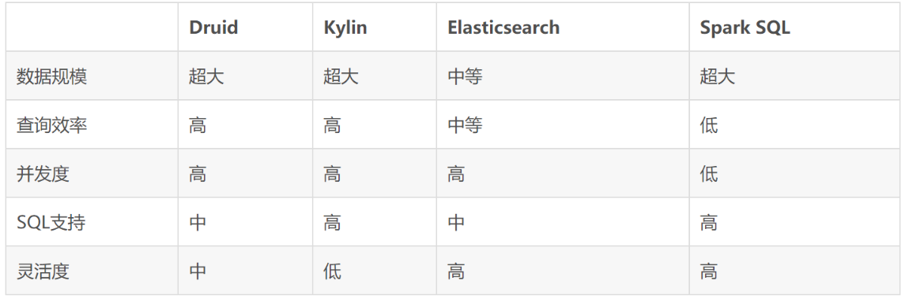

> 当前位置：【Java】10_Distributed（分布式架构）-> 10.12_ApacheDruid（海量日志收集）

# Apache Druid 安装

- 中文地址：http://www.apache-druid.cn/

```bash
# 前提软件 - 需要安装jdk8+

# 上传并解压
cd /usr/local/apache-druid-0.20.0/

# 单机版 Apache Druid 的 Zookeeper 端口换成3181
# sed -i "s/原字符串/新字符串/g" grep 原字符串 -rl 所在目录
sed -i "s/2181/3181/g" `grep 2181 -rl ./`
sed -i "s/druid.zk.service.host=localhost/druid.zk.service.host=localhost:3181/g" `grep druid.zk.service.host=localhost -rl ./`

# 更改时区
sed -i "s/Duser.timezone=UTC/Duser.timezone=UTC+8/g" `grep Duser.timezone=UTC -rl ./`

# 启动
cd /usr/local/apache-druid-0.20.0/bin/
./start-micro-quickstart

# 后台运行
cd /usr/local/apache-druid-0.20.0/bin/
./start-micro-quickstart &
```

- 访问：http://192.168.126.134:8888


# Apache Druid 简介


