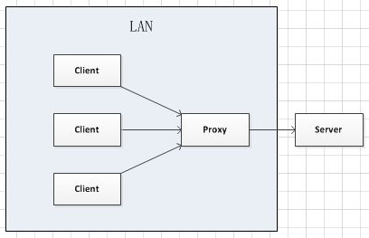
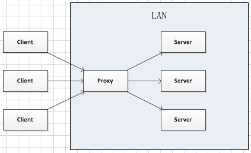
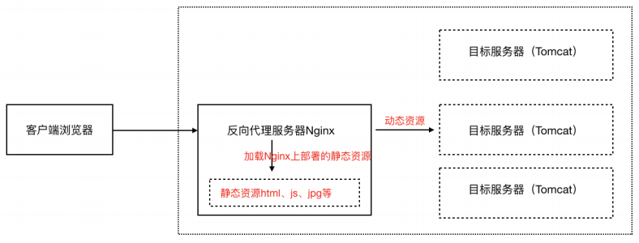

> 当前位置：【Java】10_Distributed（分布式架构）-> 10.2_Nginx（高性能Web容器）

# 第一章 Nginx 下载安装和配置

## 0、Nginx 下载

- 官网下载：http://nginx.org


## 1、Docker - Nginx 安装和配置

- Docker-Nginx 官网地址：https://hub.docker.com/_/nginx 

  

### 1.1 拉取镜像

```shell
docker pull nginx:1.21.1
```


### 1.2 备份镜像

```shell
cd /docker_data/
docker save nginx:1.21.1 -o nginx:1.21.1.tar
```


### 1.3 导入镜像

```shell
docker load -i nginx:1.21.1.tar
```


### 1.4 Linux 创建并运行容器

#### （1）创建文件夹

```shell
# 创建初始容器
docker run -d --name nginx -p 80:80 nginx:1.21.1

# 创建文件夹
mkdir -p /docker_data/nginx/{conf,html,logs,conf.d,staticData}

# 复制配置文件到挂载目录（66da为创建的初始容器的id前四位）
docker cp 66da:/etc/nginx/nginx.conf /docker_data/nginx/conf
docker cp 66da:/etc/nginx/conf.d/default.conf /docker_data/nginx/conf.d/
```

#### （2）修改 nginx.conf

- 此文件夹下创建 /docker_data/nginx/conf/

```properties
# ======================================== 全局块 =====================================================
# 运行用户
user  nginx;

# worker进程数量（通常设置的数与CPU数量相等）
worker_processes  auto;

# 全局错误日志及 pid 文件位置
error_log  /var/log/nginx/error.log notice;
pid        /var/run/nginx.pid;


# =================== events事件块（影响nginx服务器和用户的网络连接） ==================================

events {
    # 单个worker进程的最大并发连接数
    worker_connections  1024;
}

# ================== http块（nginx服务器中配置最频繁的部分，端口监听，请求转发等） =====================
http {
    # 引入 mime 类型定义文件
    include       /etc/nginx/mime.types;
    default_type  application/octet-stream;

    # 设定日志格式
    log_format  main  '$remote_addr - $remote_user [$time_local] "$request" '
                      '$status $body_bytes_sent "$http_referer" '
                      '"$http_user_agent" "$http_x_forwarded_for"';

    access_log  /var/log/nginx/access.log  main;

    sendfile        on;
    #tcp_nopush     on;

    # 连接超时时间
    keepalive_timeout  65;

    #gzip  on;
    
    # 负载均衡 - 轮询
    #upstream Serverloadbalance{
     #  server 192.168.203.130:8081;
     # server 192.168.203.130:8082;
    #}
    
    # 负载均衡 - 权重
    #upstream Serverloadbalance{
     #  server 192.168.203.130:8081 weight=1;
     #  server 192.168.203.130:8082 weight=2;
    #}

    # 负载均衡 - ip_hash
    upstream Serverloadbalance{
       ip_hash;
       server 192.168.203.130:8081;
       server 192.168.203.130:8082;
    }
    
    # 引入其他配置文件（此处将内容合并在一个文件中，并清空 /etc/nginx/conf.d/*.conf 文件的内容）
    #include /etc/nginx/conf.d/*.conf;
    
    server {
        # 监听端口号
        listen       80;
        listen  [::]:80;
        
        # 定义使用 localhost 访问
        server_name  localhost;
    
        #access_log  /var/log/nginx/host.access.log  main;
    
        # 静态资源处理，直接去 Nginx 服务器目录加载
				location /static/ {
					root staticData;
				}
				
        # 反向代理（http://192.168.203.130/abc）
        location /abc/ {
            proxy_pass http://192.168.203.130:8080/;
            
            #root   /usr/share/nginx/html;
            #index  index.html index.htm;
        }
    
        # 反向代理（http://192.168.203.130/def）
        location /def/ {
            proxy_pass http://Serverloadbalance/;
            
            #root   /usr/share/nginx/html;
            #index  index.html index.htm;
        }
    

        # 错误提示页面
        error_page 404 /404.html;
            location = /40x.html {
        }
        
        
        # 服务器重定向错误页面
        error_page   500 502 503 504  /50x.html;
        location = /50x.html {
            root   /usr/share/nginx/html;
        }
    }
}
```

#### （3）创容器命令

```bash
# 运行
docker run -itd --name nginx -d -p 80:80 -v /docker_data/nginx/conf/nginx.conf:/etc/nginx/nginx.conf -v /docker_data/nginx/logs:/var/log/nginx -v /docker_data/nginx/html:/usr/share/nginx/html -v /docker_data/nginx/conf.d:/etc/nginx/conf.d -v /docker_data/nginx/staticData:/etc/nginx/staticData --privileged=true nginx:1.21.1
```

#### （4）验证

- 浏览器访问：http://192.168.203.130:80

#### （5）核心目录

```bash
# 配置文件
/etc/nginx/nginx.conf

# 日志
/var/log/nginx

# 默认主页访问
/usr/share/nginx/html

# pid 文件
/var/run/nginx.pid;
```


### 1.5 Mac 创建并运行容器

#### （1）创建文件夹

```shell
mkdir -p /Users/td/Documents/03_DevTools/docker_data/nginx/{conf,conf.d,html,logs,staticData}
```

#### （2）创建 nginx.conf

- 此文件夹下创建 /Users/td/Documents/03_DevTools/docker_data/nginx/conf
- 具体配置见 1.4 章节

#### （3）创容器命令

```bash
# 运行
docker run -itd --name nginx -d -p 80:80 -v /Users/td/Documents/03_DevTools/docker_data/nginx/conf/nginx.conf:/etc/nginx/nginx.conf -v /Users/td/Documents/03_DevTools/docker_data/nginx/logs:/var/log/nginx -v /Users/td/Documents/03_DevTools/docker_data/nginx/html:/usr/share/nginx/html -v /Users/td/Documents/03_DevTools/docker_data/nginx/conf.d:/etc/nginx/conf.d -v /Users/td/Documents/03_DevTools/docker_data/nginx/staticData:/etc/nginx/staticData --privileged=true nginx:1.21.1
```

#### （4）验证

- 浏览器访问：http://localhost:80

#### （5）核心目录

```bash
# 配置文件
/etc/nginx/nginx.conf

# 日志
/var/log/nginx

# 默认主页访问
/usr/share/nginx/html

# pid 文件
/var/log/nginx.pid
```


## 2、Linux系统 - Nginx 安装和配置

### 2.1 安装步骤

#### 步骤0：安装环境

```shell
# 在Linux下安装gcc编译器
yum install gcc-c++

# 在Linux下安装第三方的开发包
# PCRE
# PCRE(PerlCompatible Regular Expressions)是一个Perl库，包括 perl 兼容的正则表达式库
# Nginx的http模块使用pcre来解析正则表达式，所以需要在Linux上安装pcre库
# pcre-devel是使用pcre开发的一个二次开发库，Nginx也需要此库
yum install -y pcre pcre-devel
        
# Zlib
# Zlib库提供了很多种压缩和解压缩的方式，Nginx使用Zlib对http包的内容进行gzip，所以需要在Linux上安装Zlib库
yum install -y zlib zlib-devel
        
# OpenSSL
# OpenSSL是一个强大的安全套接字层密码库，囊括主要的密码算法、常用的密钥和证书封装管理功能及SSL协议，并提供丰富的应用程序供测试或其它目的使用
# Nginx不仅支持http协议，还支持https（即在ssl协议上传输http），所以需要在Linux安装OpenSSL库
yum install -y openssl openssl-devel
```

#### 步骤2：安装前准备

```shell
# 将nginx添加到 yum repro库中
rpm -Uvh http://nginx.org/packages/centos/7/noarch/RPMS/nginx-release-centos-7-0.el7.ngx.noarch.rpm

# 查看nginx信息
yum info nginx

# 使用yum安装ngnix
yum -y install nginx

# 启动nginx
systemctl start nginx

# 后续参考
https://www.cnblogs.com/songxingzhu/p/8568432.html
https://juejin.cn/post/6844903827510919182
```

#### 步骤3：安装 Nginx

```shell
# 编译 Nginx
make

# 安装Nginx
make install
```

#### 步骤4：设置开机自启

```shell
# 编辑
vi /lib/systemd/system/nginx.service

# 写入下面代码
[Unit]
Description=nginx
After=network.target
[Service]
Type=forking
ExecStart=/usr/local/nginx/sbin/nginx -c /usr/local/nginx/conf/nginx.conf
ExecReload=/usr/local/nginx/sbin/nginx -s reload
ExecStop=/usr/local/nginx/sbin/nginx -s quit
PrivateTmp=true
[Install]
WantedBy=multi-user.target

# 刷新文件生效
systemctl enable nginx.service
```

#### 步骤5：访问

- 通过浏览器访问Nginx，访问地址为localhost（即是Linux系统的ip地址）：http://192.168.31.130/

#### 步骤6：主要命令

```shell
# 启动nginx
./nginx

# 终止 nginx（也可以找到 nginx 进程号，然后使用 kill -9 杀掉 nginx 进程）
./nginx -s stop

# 重新加载 nginx.conf 配置文件
./nginx -s reload
```


### 2.2 卸载步骤

```shell
# 停止Nginx软件
service nginx stop

# 删除Nginx的自动启动
chkconfig nginx off

# 从源头删除Nginx
rm -rf /usr/sbin/nginx
rm -rf /etc/nginx
rm -rf /etc/init.d/nginx

# 使用yum清理
yum remove nginx

#找一下是否卸载完全
which nginx
```


## 3、Win系统 - Nginx 安装和配置

- TODO


## 4、Mac系统 - Nginx 安装和配置

- TODO


# 第二章 Nginx 简介

## 1、Nginx 概述

### 1.1 什么是 Nginx 

```
- Nginx 是一个性能的 HTTP 和反向代理 web 服务器，核心特点是占有内存少，并发能力强
- C 语言开发
```


### 1.2 Nginx 的特点

```
- 跨平台：Nginx可以在大多数 unix 操作系统上编译运行，而且也有 windows 版本
- 上手容易，配置简单
- 高并发，性能好
- 稳定性好，宕机概率低
- 官方测试 Nginx 能够支支撑5万并发链接，并且cpu、内存等资源消耗却非常低，运行非常稳定（开源、免费）
```


## 2、Nginx 核心配置文件

### 2.1 核心配置文件位置

```xml
conf/nginx.conf
```

### 2.2 配置文件详解

```properties
# ======================================== 全局块 =====================================================
# 运行用户
user  nginx;

# worker进程数量（通常设置的数与CPU数量相等）
worker_processes  auto;

# 全局错误日志及 pid 文件位置
error_log  /var/log/nginx/error.log notice;
pid        /var/run/nginx.pid;


# =================== events事件块（影响nginx服务器和用户的网络连接） ==================================

events {
    # 单个worker进程的最大并发连接数
    worker_connections  1024;
}

# ================== http块（nginx服务器中配置最频繁的部分，端口监听，请求转发等） =====================
http {
    # 引入 mime 类型定义文件
    include       /etc/nginx/mime.types;
    default_type  application/octet-stream;

    # 设定日志格式
    log_format  main  '$remote_addr - $remote_user [$time_local] "$request" '
                      '$status $body_bytes_sent "$http_referer" '
                      '"$http_user_agent" "$http_x_forwarded_for"';

    access_log  /var/log/nginx/access.log  main;

    sendfile        on;
    #tcp_nopush     on;

    # 连接超时时间
    keepalive_timeout  65;

    #gzip  on;
    
    # 负载均衡 - 轮询
    #upstream Serverloadbalance{
     #  server 192.168.203.130:8081;
     # server 192.168.203.130:8082;
    #}
    
    # 负载均衡 - 权重
    #upstream Serverloadbalance{
     #  server 192.168.203.130:8081 weight=1;
     #  server 192.168.203.130:8082 weight=2;
    #}

    # 负载均衡 - ip_hash
    upstream Serverloadbalance{
       ip_hash;
       server 192.168.203.130:8081;
       server 192.168.203.130:8082;
    }
    
    # 引入其他配置文件（此处将内容合并在一个文件中，并清空 /etc/nginx/conf.d/*.conf 文件的内容）
    #include /etc/nginx/conf.d/*.conf;
    
    server {
        # 监听端口号
        listen       80;
        listen  [::]:80;
        
        # 定义使用 localhost 访问
        server_name  localhost;
    
        #access_log  /var/log/nginx/host.access.log  main;
    		
    		# 静态资源处理，直接去 Nginx 服务器目录加载
				location /static/ {
					root staticData;
				}

        # 反向代理（http://192.168.203.130/abc）
        location /abc/ {
            proxy_pass http://192.168.203.130:8080/;
            
            #root   /usr/share/nginx/html;
            #index  index.html index.htm;
        }
    
        # 反向代理（http://192.168.203.130/def）
        location /def/ {
            proxy_pass http://Serverloadbalance/;
            
            #root   /usr/share/nginx/html;
            #index  index.html index.htm;
        }

        # 错误提示页面
        error_page 404 /404.html;
            location = /40x.html {
        }
           
        # 服务器重定向错误页面
        error_page   500 502 503 504  /50x.html;
        location = /50x.html {
            root   /usr/share/nginx/html;
        }
    }
}
```


# 第三章 Nginx 应用场景

## 1、Http服务器（Web服务器）

```
- 性能非常高，非常注重效率，能够经受高负载的考验
- 支持50000个并发连接数，不仅如此，CPU和内存的占用也非常的低，10000个没有活动的连接才占用2.5M的内存
```


## 2、反向代理服务器

### 2.1 正向代理

```
正向代理：客户端代理，代理客户端，服务端不知道实际发起请求的客户端
正向代理的作用：
（1）访问原来无法访问的资源，如google
（2）可以做缓存，加速访问资源
（3）对客户端访问授权，上网进行认证
（4）代理可以记录用户访问记录（上网行为管理），对外隐藏用户信息
```




### 2.2 反向代理

```
反向代理：服务端代理，代理服务端，客户端不知道实际提供服务的服务端
反向代理的作用：
（1）保证内网的安全，阻止web攻击，大型网站，通常将反向代理作为公网访问地址，Web服务器是内网
（2）负载均衡，通过反向代理服务器来优化网站的负载
```



### 2.3 反向代理的使用

```properties
# 反向代理（http://192.168.203.130/abc）
location /abc {
	proxy_pass http://192.168.203.130:8080/;
}

# 反向代理（http://192.168.203.130/def）
location /def {
	proxy_pass http://Serverloadbalance/;
}
```

- location 语法

```properties
location [=|~|~*|^~] /uri/ { … }

优先级:从高到低
（1）精确匹配：location = /td { }
（2）匹配路径的前缀：location ^~ /td { }
（3）不区分⼤⼩写的正则匹配：location ~* /td { }
（4）正则匹配：location ~ /td { }
（5）普通路径前缀匹配：location /td { }
```


## 3、负载均衡服务器

```
- 当一个请求到来的时候，Nginx 反向代理服务器根据请求去找到一个原始服务器来处理当前请求，那么这叫做反向代理
- 如果目标服务器有多台（如tomcat1，tomcat2，tomcat3...），找哪一个目标服务器来处理当前请求呢，这个寻找确定的过程就叫做负载均衡
- 负载均衡就是为了解决高负载问题
```

### （1）轮询

- 默认策略，每个请求按时间顺序逐⼀分配到不同的服务器，如果某⼀个服务器下线，能⾃动剔除

```properties
# 负载均衡 - 轮询
# http://192.168.203.130/def
upstream Serverloadbalance{
  server 192.168.203.130:8081;
  server 192.168.203.130:8082;
}
```

### （2）权重

- weight代表权重，默认每⼀个负载的服务器都为1，权重越⾼那么被分配的请求越多（用于服务器性能不均衡的场景）

```properties
# 负载均衡 - 权重
# http://192.168.203.130/def
upstream Serverloadbalance{
  server 192.168.203.130:8081 weight=1;
  server 192.168.203.130:8082 weight=2;
}
```

### （3）ip_hash

- 每个请求按照ip的hash结果分配，每⼀个客户端的请求会固定分配到同⼀个⽬标服务器处理，可以解决session问题

```properties
# 负载均衡 - ip_hash
# http://192.168.203.130/def
upstream Serverloadbalance{
  ip_hash;
  server 192.168.203.130:8081;
  server 192.168.203.130:8082;
}
```


## 4、动静分离

### 4.1 概述

```
- 动静分离就是讲动态资源和静态资源的请求处理分配到不同的服务器上
- 经典的组合就是 Nginx+Tomcat 架构（Nginx处理静态资源请求，Tomcat处理动态资源请求）
```



### 4.2 使用步骤

#### （1）Linux服务器（非docker容器）

```bash
# Nginx 安装目录下创建静态资源文件夹，并将静态资源文件拷贝至该文件夹
mkdir staticData/static

# nginx.conf 配置
# 静态资源处理，直接去 Nginx 服务器目录加载
location /static/ {
	root staticData;
}

# 重启 Nginx
```

#### （2）docker容器下

```bash
# 创建文件夹
mkdir -p /docker_data/nginx/{conf,html,logs,conf.d,staticData}
mkdir -p /docker_data/nginx/staticData/static

# 将静态资源文件拷贝至挂载目录 static

# nginx.conf 配置
# 静态资源处理，直接去 Nginx 服务器目录加载
location /static/ {
	root staticData;
}

# docker下重新创建容器
docker run -itd --name nginx -d -p 80:80 -v /docker_data/nginx/conf/nginx.conf:/etc/nginx/nginx.conf -v /docker_data/nginx/logs:/var/log/nginx -v /docker_data/nginx/html:/usr/share/nginx/html -v /docker_data/nginx/conf.d:/etc/nginx/conf.d -v /docker_data/nginx/staticData:/etc/nginx/staticData --privileged=true nginx:1.21.1
```

#### （3）访问

http://192.168.203.130/static/abc.html


# 第四章 Nginx 原理

## 1、Nginx 底层进程机制


> 参考资料

https://www.cnblogs.com/taostaryu/p/10547132.html

