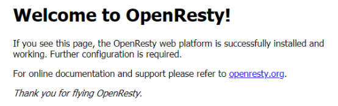

> 当前位置：【Java】10_Distributed（分布式架构）-> 10.2_OpenResty（高性能Web平台）

# 第一章 OpenResty 简介

## 1、官网

- 英文网：http://openresty.org/en/
- 中文网：http://openresty.org/cn/
- OpenResty 团队自主开发的 Nginx 模块：http://openresty.org/cn/nginx.html

## 2、简介

- OpenResty 是一个基于 Nginx 与 Lua 的高性能 Web 平台，其内部集成了大量精良的 Lua 库、第三方模块以及大多数的依赖项。用于方便地搭建能够处理超高并发、扩展性极高的动态 Web 应用、Web 服务和动态网关。
- OpenResty 通过汇聚各种设计精良的 Nginx 模块（主要由 OpenResty 团队自主开发），从而将 Nginx 有效地变成一个强大的通用 Web 应用平台。这样，Web 开发人员和系统工程师可以使用 Lua 脚本语言调动 Nginx 支持的各种 C 以及 Lua 模块，快速构造出足以胜任 10K 乃至 1000K 以上单机并发连接的高性能 Web 应用系统。
- OpenResty  的目标是让你的Web服务直接跑在 Nginx 服务内部，充分利用 Nginx 的非阻塞 I/O 模型，不仅仅对 HTTP 客户端请求,甚至于对远程后端诸如 MySQL、PostgreSQL、Memcached 以及 Redis 等都进行一致的高性能响应。

# 第二章 OpenResty 搭建

##  步骤1：下载 ngx_cache_purge-2.3

- Nginx代理缓存清理工具

```bash
cd /usr/local/

# 下载
wget http://labs.frickle.com/files/ngx_cache_purge-2.3.tar.gz

# 解压
tar -zxvf ngx_cache_purge-2.3.tar.gz
```

## 步骤2：下载安装 OpenResty

```bash
# 安装依赖库
yum install libtermcap-devel ncurses-devel libevent-devel readline-devel pcre-devel gcc openssl openssl-devel per perl wget

# 下载安装包
cd /usr/local/
wget https://openresty.org/download/openresty-1.11.2.5.tar.gz

# 解压
tar -xf openresty-1.11.2.5.tar.gz

# 进入安装包
cd /usr/local/openresty-1.11.2.5/

# 配置
./configure --prefix=/usr/local/openresty --with-luajit --without-http_redis2_module --with-http_stub_status_module --with-http_v2_module --with-http_gzip_static_module --with-http_sub_module --add-module=/usr/local/ngx_cache_purge-2.3/

# 编译并安装
make && make install
```

- 说明

```properties
# 安装路径
--prefix=/usr/local/openresty

# 安装luajit相关库，luajit是lua的一个高效版，LuaJIT的运行速度比标准Lua快数十倍
--with-luajit

# 现在使用的Redis都是3.x以上版本，这里不推荐使用Redis2，表示不安装redis2支持的lua库
--without-http_redis2_module

# Http对应状态的库
--with-http_stub_status_module

# 对Http2的支持
--with-http_v2_module

# gzip服务端压缩支持
--with-http_gzip_static_module

# 过滤器，可以通过将一个指定的字符串替换为另一个字符串来修改响应
--with-http_sub_module

# Nginx代理缓存清理工具
--add-module=/usr/local/ngx_cache_purge-2.3/

# 关于每个模块的具体作用，可以参考腾讯云的开发者手册：https://cloud.tencent.com/developer/doc/1158
```

## 步骤3：安装成功

```bash
make[2]: 离开目录“/usr/local/openresty-1.11.2.5/build/nginx-1.11.2”
make[1]: 离开目录“/usr/local/openresty-1.11.2.5/build/nginx-1.11.2”
mkdir -p /usr/local/openresty/site/lualib /usr/local/openresty/site/pod /usr/local/openresty/site/manifest
ln -sf /usr/local/openresty/nginx/sbin/nginx /usr/local/openresty/bin/openresty
```

## 步骤4：配置环境变量

```bash
vi /etc/profile

# 最后一行加入
export PATH=/usr/local/openresty/nginx/sbin:$PATH

# 刷新配置
source /etc/profile
```

## 步骤5：设置开机启动

- linux 系统结构 /lib/systemd/system/ 目录，该目录自动存放启动文件的配置位置，里面一般包含有 xxx.service，例如 systemctl enable nginx.service，就是调用  /lib/systemd/system/nginx.service 文件，使 nginx 开机启动。

```bash
vi /usr/lib/systemd/system/nginx.service

# 文件加入以下内容
[Service]
Type=forking
PIDFile=/usr/local/openresty/nginx/logs/nginx.pid
ExecStartPre=/usr/local/openresty/nginx/sbin/nginx -t
ExecStart=/usr/local/openresty/nginx/sbin/nginx
ExecReload=/bin/kill -s HUP $MAINPID
ExecStop=/bin/kill -s QUIT $MAINPID
PrivateTmp=true

[Install]
WantedBy=multi-user.target

# 重新加载某个服务的配置文件
systemctl daemon-reload

# 设置开机启动
systemctl enable nginx.service

# 启动 nginx
systemctl start nginx.service
```

## 步骤6：访问 OpenResty

- http://192.168.126.134/

 