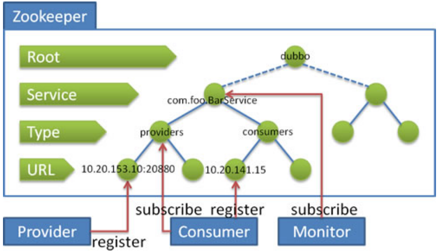

> 当前位置：【Java】10_Distributed（分布式架构）-> 10.3_Zookeeper（分布式协调服务）

# 第一章 Zookeeper 下载安装和配置

## 0、Zookeeper 下载

- 官网下载：http://zookeeper.apache.org/releases.html
- 历史版本：https://archive.apache.org/dist/zookeeper/


## 1、Docker - Zookeeper 安装和配置

- Docker-Zookeeper 官网地址：https://hub.docker.com/_/zookeeper

  

### 1.1 拉取镜像

```shell
docker pull zookeeper:3.7.0
```


### 1.2 备份镜像

```shell
cd /docker_data/
docker save zookeeper:3.7.0 -o zookeeper:3.7.0.tar
```


### 1.3 导入镜像

```shell
docker load -i zookeeper:3.7.0.tar
```


### 1.4 Linux 创建并运行容器

#### （1）单机版

##### 步骤 1：创建文件夹

```shell
# 创建文件夹
mkdir -p /docker_data/zookeeper-2181/{data,logs,conf}
```


##### 步骤 2：创建 zoo.cfg

- 此文件夹下创建 /docker_data/zookeeper-2181/conf

```properties
# The number of milliseconds of each tick
tickTime=2000

# The number of ticks that the initial 
# synchronization phase can take
initLimit=10

# The number of ticks that can pass between 
# sending a request and getting an acknowledgement
syncLimit=5

# the directory where the snapshot is stored.
# do not use /tmp for storage, /tmp here is just 
# example sakes.
dataDir=/data
dataLogDir=/logs

# the port at which the clients will connect
clientPort=2181

# the maximum number of client connections.
# increase this if you need to handle more clients
#maxClientCnxns=60


# Be sure to read the maintenance section of the 
# administrator guide before turning on autopurge.
#
# http://zookeeper.apache.org/doc/current/zookeeperAdmin.html#sc_maintenance

# The number of snapshots to retain in dataDir
#autopurge.snapRetainCount=3

# Purge task interval in hours
# Set to "0" to disable auto purge feature
#autopurge.purgeInterval=1

## Metrics Providers
#
# https://prometheus.io Metrics Exporter
#metricsProvider.className=org.apache.zookeeper.metrics.prometheus.PrometheusMetricsProvider
#metricsProvider.httpPort=7000
#metricsProvider.exportJvmInfo=true
```


##### 步骤 3：创建容器命令

```bash
cd /docker_data/zookeeper/

docker run -itd --name zookeeper --restart always -p 2181:2181 -v $(pwd)/conf/zoo.cfg:/conf/zoo.cfg  -v $(pwd)/data/:/data/ -v $(pwd)/logs:/logs zookeeper:3.7.0
```


#### （2）集群版 - 创建容器命令

##### 步骤1：创建 docker-compose.yml

```yml
version: '2.1'

services:
  zoo1:
    image: zookeeper
    restart: always
    hostname: zoo1
    volumes:
#      - /docker_data/zookeeper-2181/conf:/conf
      - /docker_data/zookeeper-2181/logs:/logs
      - /docker_data/zookeeper-2181/data:/data
    ports:
      - 2181:2181
    environment:
      ZOO_MY_ID: 1
      ZOO_SERVERS: server.1=0.0.0.0:2888:3888;2181 server.2=zoo2:2888:3888;2181 server.3=zoo3:2888:3888;2181

  zoo2:
    image: zookeeper
    restart: always
    hostname: zoo2
    volumes:
#      - /docker_data/zookeeper-2182/conf:/conf
      - /docker_data/zookeeper-2182/logs:/logs
      - /docker_data/zookeeper-2182/data:/data
    ports:
      - 2182:2181
    environment:
      ZOO_MY_ID: 2
      ZOO_SERVERS: server.1=zoo1:2888:3888;2181 server.2=0.0.0.0:2888:3888;2181 server.3=zoo3:2888:3888;2181

  zoo3:
    image: zookeeper
    restart: always
    hostname: zoo3
    volumes:
#      - /docker_data/zookeeper-2183/conf:/conf
      - /docker_data/zookeeper-2183/logs:/logs
      - /docker_data/zookeeper-2183/data:/data
    ports:
      - 2183:2181
    environment:
      ZOO_MY_ID: 3
      ZOO_SERVERS: server.1=zoo1:2888:3888;2181 server.2=zoo2:2888:3888;2181 server.3=0.0.0.0:2888:3888;2181
```


##### 步骤2：启动 docker-compose.yml

```bash
docker-compose up
```


##### 步骤3：查看集群状态

```bash
# 进入容器

# 切换目录
cd bin

# 查看 zk 状态
./zkServer.sh status
```


### 1.5 Mac 创建并运行容器

#### （1）单机版

##### 步骤 1：创建文件夹

```shell
# 创建文件夹
mkdir -p /Users/td/Documents/03_DevTools/docker_data/zookeeper-2181/{data,logs,conf}
```


##### 步骤 2：创建 zoo.cfg

- 此文件夹下创建 /Users/td/Documents/03_DevTools/docker_data/zookeeper-2181/conf

```properties
# The number of milliseconds of each tick
tickTime=2000

# The number of ticks that the initial 
# synchronization phase can take
initLimit=10

# The number of ticks that can pass between 
# sending a request and getting an acknowledgement
syncLimit=5

# the directory where the snapshot is stored.
# do not use /tmp for storage, /tmp here is just 
# example sakes.
dataDir=/data
dataLogDir=/logs

# the port at which the clients will connect
clientPort=2181

# the maximum number of client connections.
# increase this if you need to handle more clients
#maxClientCnxns=60


# Be sure to read the maintenance section of the 
# administrator guide before turning on autopurge.
#
# http://zookeeper.apache.org/doc/current/zookeeperAdmin.html#sc_maintenance

# The number of snapshots to retain in dataDir
#autopurge.snapRetainCount=3

# Purge task interval in hours
# Set to "0" to disable auto purge feature
#autopurge.purgeInterval=1

## Metrics Providers
#
# https://prometheus.io Metrics Exporter
#metricsProvider.className=org.apache.zookeeper.metrics.prometheus.PrometheusMetricsProvider
#metricsProvider.httpPort=7000
#metricsProvider.exportJvmInfo=true
```


##### 步骤 3：创建容器命令

```bash
cd /Users/td/Documents/03_DevTools/docker_data/zookeeper/

docker run -itd --name zookeeper --restart always -p 2181:2181 -v $(pwd)/conf/zoo.cfg:/conf/zoo.cfg  -v $(pwd)/data/:/data/ -v $(pwd)/logs:/logs zookeeper:3.7.0
```


#### （2）集群版 - 创建容器命令

##### 步骤1：创建 docker-compose.yml

```yml
version: '2.1'

services:
  zoo1:
    image: zookeeper
    restart: always
    hostname: zoo1
    volumes:
#      - /docker_data/zookeeper-2181/conf:/conf
      - /Users/td/Documents/03_DevTools/docker_data/zookeeper-2281/logs:/logs
      - /Users/td/Documents/03_DevTools/docker_data/zookeeper-2281/data:/data
      - /Users/td/Documents/03_DevTools/docker_data/zookeeper-2281/datalog:/datalog
    ports:
      - 2181:2181
    environment:
      ZOO_MY_ID: 1
      ZOO_SERVERS: server.1=zoo1:2888:3888 server.2=zoo2:2888:3888 server.3=zoo3:2888:3888

  zoo2:
    image: zookeeper
    restart: always
    hostname: zoo2
    volumes:
#      - /docker_data/zookeeper-2182/conf:/conf
      - /Users/td/Documents/03_DevTools/docker_data/zookeeper-2282/logs:/logs
      - /Users/td/Documents/03_DevTools/docker_data/zookeeper-2282/data:/data
      - /Users/td/Documents/03_DevTools/docker_data/zookeeper-2282/datalog:/datalog
    ports:
      - 2182:2181
    environment:
      ZOO_MY_ID: 2
      ZOO_SERVERS: server.1=zoo1:2888:3888 server.2=zoo2:2888:3888 server.3=zoo3:2888:3888

  zoo3:
    image: zookeeper
    restart: always
    hostname: zoo3
    volumes:
#      - /docker_data/zookeeper-2183/conf:/conf
      - /Users/td/Documents/03_DevTools/docker_data/zookeeper-2283/logs:/logs
      - /Users/td/Documents/03_DevTools/docker_data/zookeeper-2283/data:/data
      - /Users/td/Documents/03_DevTools/docker_data/zookeeper-2283/datalog:/datalog
    ports:
      - 2183:2181
    environment:
      ZOO_MY_ID: 3
      ZOO_SERVERS: server.1=zoo1:2888:3888 server.2=zoo2:2888:3888 server.3=zoo3:2888:3888
```


##### 步骤2：启动 docker-compose.yml

```bash
docker-compose up
```


##### 步骤3：查看集群状态

```bash
# 进入容器

# 切换目录
cd bin

# 查看 zk 状态
./zkServer.sh status
```


## 2、Linux系统 - Zookeeper 安装和配置

### 2.1 单机模式安装

#### （1）安装步骤

```bash
# 步骤1：安装JDK
# 步骤2：把zookeeper的压缩包上传到Linux系统下的/root/td_upload
cd /root/

# 步骤3：解压缩压缩包
tar -zxvf Zookeeper_3.4.6.tar.gz

# 步骤4：移动Zookeeper_3.4.6到/usr/local/下
cp -rf /root/zookeeper-3.4.6/ /usr/local/

# 步骤5：进入Zookeeper_3.4.6目录
cd /usr/local/zookeeper-3.4.6/

# 步骤6：创建data文件夹
mkdir data

# 步骤7：进入conf文件夹
cd conf

# 步骤8：把zoo_sample.cfg改名为zoo.cfg
mv zoo_sample.cfg zoo.cfg

# 步骤9：修改zoo.cfg
vim zoo.cfg

# 步骤10：修改zoo.cfg文件中的data属性，并保存退出vim
dataDir=/usr/local/zookeeper-3.4.6/data
```


#### （2）Zookeeper 启动和关闭

```bash
# 步骤0：关闭防火墙（为了可以访问Zookeeper的端口）
# 重启系统仍然会开启防火墙
service iptables stop
# 重启系统不会开启防火墙
chkconfig iptables off

# 步骤1：切换到bin目录
cd /usr/local/zookeeper-3.4.6/bin

# 步骤2：启动Zookeeper
./zkServer.sh start

# 步骤3：查看状态
./zkServer.sh status

# 步骤4：关闭Zookeeper
./zkServer.sh stop
```


#### （3）Zookeeper设置开机自启动

```bash
# 步骤1：切换目录
cd /etc/rc.d/init.d/

# 步骤2：新建zookeeper文件
vi zookeeper

# 步骤3：文件内容
#!/bin/bash
 
#chkconfig:2345 20 90
 
#description:zookeeper
 
#processname:zookeeper
export JAVA_HOME=/usr/local/jdk1.8.0_171
case $1 in
          start) su root /usr/local/zookeeper-3.4.6/bin/zkServer.sh start;;
          stop) su root /usr/local/zookeeper-3.4.6/bin/zkServer.sh stop;;
          status) su root /usr/local/zookeeper-3.4.6/bin/zkServer.sh status;;
          restart) su root /usr/local/zookeeper-3.4.6/bin/zkServer.sh restart;;
     *)  echo "require start|stop|status|restart"  ;;
esac


# 步骤4：为文件添加权限
chmod +x zookeeper

# 步骤5：在开机启动里面添加zookeeper
chkconfig --add zookeeper

# 步骤6：确认zookeeper是否成功添加到开机启动项
chkconfig --list
```


### 2.2 Zookeeper集群搭建

#### （1）安装步骤

```bash
# 创建集群目录
mkdir /usr/local/solr-cloud

# 在zookeeper解压包中创建一个data目录
mkdir /root/zookeeper-3.4.6/data
cd /root/zookeeper-3.4.6/data
touch myid

# 在里面添加内容为1的数字
vim myid

# 复制zookeeper到solr-cloud
cp -r /root/zookeeper-3.4.6 /usr/local/solr-cloud/zookeeper01
cp -r /root/zookeeper-3.4.6 /usr/local/solr-cloud/zookeeper02
cp -r /root/zookeeper-3.4.6 /usr/local/solr-cloud/zookeeper03

# 更改其他 myid 的内容
vim /usr/local/solr-cloud/zookeeper02/data/myid
vim /usr/local/solr-cloud/zookeeper03/data/myid

# 复制配置文件名为zoo.cfg
cp /usr/local/solr-cloud/zookeeper01/conf/zoo_sample.cfg /usr/local/solr-cloud/zookeeper01/conf/zoo.cfg
cp /usr/local/solr-cloud/zookeeper02/conf/zoo_sample.cfg /usr/local/solr-cloud/zookeeper02/conf/zoo.cfg
cp /usr/local/solr-cloud/zookeeper03/conf/zoo_sample.cfg /usr/local/solr-cloud/zookeeper03/conf/zoo.cfg

# 修改配置文件
vim /usr/local/solr-cloud/zookeeper01/conf/zoo.cfg

dataDir=/usr/local/solr-cloud/zookeeper01/data
clientPort=21811
# zookeeper内部通信端口和投票选举端口
server.1=192.168.31.246:2881:3881
server.2=192.168.31.246:2882:3882
server.3=192.168.31.246:2883:3883


vim /usr/local/solr-cloud/zookeeper02/conf/zoo.cfg

dataDir=/usr/local/solr-cloud/zookeeper02/data
clientPort=21812
# zookeeper内部通信端口和投票选举端口
server.1=192.168.31.246:2881:3881
server.2=192.168.31.246:2882:3882
server.3=192.168.31.246:2883:3883

vim /usr/local/solr-cloud/zookeeper03/conf/zoo.cfg

dataDir=/usr/local/solr-cloud/zookeeper03/data
clientPort=21813
# zookeeper内部通信端口和投票选举端口
server.1=192.168.31.246:2881:3881
server.2=192.168.31.246:2882:3882
server.3=192.168.31.246:2883:3883

# 编辑启动脚本
vim start-all.sh

cd zookeeper01/bin./zkServer.shstartcd ../../cd zookeeper02/bin./zkServer.shstartcd ../../cd zookeeper03/bin./zkServer.shstartcd ../../

# 修改脚本权限
chmod u+x start-all.sh
```


#### （2）启动zookeeper集群

```bash
cd /usr/local/solr-cloud
./start-all.sh
./restart-all.sh
```


#### （3）查看zookeeper的状态

```bash
# 主要看Mode：leader、follower
/usr/local/solr-cloud/zookeeper01/bin/zkServer.sh status
/usr/local/solr-cloud/zookeeper02/bin/zkServer.sh status
/usr/local/solr-cloud/zookeeper03/bin/zkServer.sh status
```


#### （4）查看zookeeper日志

```bash
tail -f /usr/local/solr-cloud/zookeeper01/bin/zookeeper.out
tail -f /usr/local/solr-cloud/zookeeper02/bin/zookeeper.out
tail -f /usr/local/solr-cloud/zookeeper03/bin/zookeeper.out
```


## 3、Win系统 - Zookeeper 安装和配置

- TODO


## 4、Mac系统 - Zookeeper 安装和配置

- TODO


# 第二章 Zookeeper 简介


# 第三章 Zookeeper 操作命令

## 1、启动/查看/重启/连接

```bash
# 启动ZK服务
./zkServer.sh start

# 查看ZK服务状态
./zkServer.sh status

# 停止ZK服务
./zkServer.sh stop

# 重启ZK服务
./zkServer.sh restart

# 连接客户端服务器
./zkCli.sh -server 127.0.0.1:2181

# 退出客户端服务器
quit
```


## 2、创建节点

```bash
# 创建持久节点
create /china

# japan必须提前创建好，否则报错 “节点不存在”
create /japan/Tokyo "hot" 

# 创建临时节点（退出客户端就销毁）
create -e /uk 

# 创建顺序节点（带序号）
# 如果原来没有序号节点，序号从0开始递增
# 如果原节点下已有2个节点，则再排序时从2开始，以此类推
create -s /ru/city 
```


## 3、读取节点

```bash
# 获取节点值
get /japan/Tokyo

# 查看当前znode中所包含的内容
ls /

# 查看当前节点详细数据
# zookeeper老版本使用 
ls2 /

# 新命令
ls -s /

# cZxid：Create ZXID，表示节点被创建时的事务ID
- 每次修改ZooKeeper状态都会收到一个zxid形式的时间发，也就是ZooKeeper事务ID。
- 事务ID是ZooKeeper中所有修改总的次序
- 每个修改都有唯一的zxid，如时zxid1小于zxid2，那么zxid1在zxid2之前发生。

# ctime：Create Time，表示节点创建时间（从1970年开始）

# mZxid：Modified ZXID，表示节点最后⼀次被修改时的事务ID

# mtime：Modified Time，表示节点最后⼀次被修改的时间（从1970年开始）

# pZxid：表示该节点的⼦节点列表最后⼀次被修改时的事务 ID。只有⼦节点列表变更才会更新 pZxid，⼦节点内容变更不会更新

# cversion 表示⼦节点的版本号，子节点修改次数

# dataVersion 表示内容版本号

# aclVersion 标识acl版本，权限版本号

# ephemeralOwner 表示创建该临时节点时的会话 sessionID，如果是持久性节点（不是临时节点）那么值为 0

# dataLength 表示数据⻓度。

# numChildren 表示直系⼦节点数。
```


## 3、更新节点

```bash
# 语法
set path data [version]

# 修改节点数据 
set /testnode/node1 aaa  
```


## 4、删除节点

```bash
# 语法
delete path [version]

# 删除节点
delete /usa/NewYork

# 递归删除节点 (非空节点，节点下有子节点)
# 不仅删除/ru，而且/ru下的所有子节点也随之删除
deleteall /ru
```


## 5、监听节点

```bash
# 监听节点的值变化 或 子节点变化(路径变化) addWatch /usa

# 在server3主机上注册监听/usa节点的数据变化
addWatch /usa

# 在Server1主机上修改/usa的数据
set /usa "telangpu”

# Server3会立刻响应
WatchedEvent state:SyncConnected type:NodeDataChanged path:/usa

# 如果在Server1的/usa下面创建子节点NewYork
create /usa/NewYork

# Server3会立刻响应
WatchedEvent state:SyncConnected type:NodeCreatedpath:/usa/NewYork
```


# 第四章 Zookeeper 的使用

## 1、API 的使用

### （0）导入依赖

```xml
<!-- zk api -->
<dependency>
  <groupId>org.apache.zookeeper</groupId>
  <artifactId>zookeeper</artifactId>
  <version>3.4.6</version>
</dependency>
```


### （1）建立会话

```java
// 通过创建一个 zk 实例来连接 zk 服务器
// connectString，连接地址（IP：端口）
// sesssionTimeOut，会话超时时间，单位毫秒
// Wather，监听器，当特定事件触发监听时，zk会通过 watcher 通知到客户端
new Zookeeper(connectString,sesssionTimeOut,Wather)     
```


### （2）创建节点

```java
// path：节点创建的路径
// data[]：节点创建要保存的数据，是个byte类型的
/*
acl：节点创建的权限信息(4种类型)
（1）ANYONE_ID_UNSAFE: 表示任何人
（2）AUTH_IDS：此ID仅可用于设置ACL。它将被客户机验证的ID替换。
（3）OPEN_ACL_UNSAFE：这是一个完全开放的ACL(常用)--> world:anyone
（4）CREATOR_ALL_ACL：此ACL授予创建者身份验证ID的所有权限
（5）createMode：创建节点的类型(4种类型)
- PERSISTENT：持久节点
- PERSISTENT_SEQUENTIAL：持久顺序节点
- EPHEMERAL：临时节点
- EPHEMERAL_SEQUENTIAL：临时顺序节点
*/			
String node = zookeeper.create(path,data,acl,createMode);
```


### （3）获取节点数据

```java
// 获取某个节点的内容
// path: 获取数据的路径
// watch: 是否开启监听
// stat: 节点状态信息（null 表示获取最新版本的数据）
zk.getData(path, watch, stat);

// 获取某个节点的子节点列表
// path：路径
// watch：是否要启动监听，当子节点列表发生变化，会触发监听
zooKeeper.getChildren(path, watch);
```


### （4）修改节点数据

```java
// path:路径
// data:要修改的内容 byte[]
// version:为-1，表示对最新版本的数据进行修改
zooKeeper.setData(path, data,version);
```


### （5）删除节点

```java
// 判断节点是否存在
zooKeeper.exists(path,watch)
  
// 删除节点
zookeeper.delete(path,version) 
```


## 2、zkclient 的使用

### （0）导入依赖

```xml
<!-- zkclient -->
<dependency>
  <groupId>com.101tec</groupId>
  <artifactId>zkclient</artifactId>
  <version>0.2</version>
</dependency>
```


### （1）建立会话

```java
// zkClient 通过对 zookeeperAPI 内部封装，将这个异步创建会话的过程同步化了
ZkClient zkClient = new ZkClient("192.168.31.246:2181");
```


### （2）创建节点

```java
// 创建节点：是否要创建父节点，如果值为true，那么就会递归创建节点
zkClient.createPersistent("/td-zkclient/c1", true);
```


### （3）删除节点

```java
// 递归删除节点：先删除所有⼦节点（如果存在），再删除父节点
zkClient.deleteRecursive(path);
```


### （4）获取子节点、注册监听事件

```java
// 获取子节点列表
List<String> children = zkClient.getChildren("/td-zkclient");

// 注册监听事件
// 客户端可以对一个不存在的节点进行子节点变更的监听，只要该节点的子节点列表发生变化，或者该节点本身被创建或者删除，都会触发监听
zkClient.subscribeChildChanges("/td-zkclient-get", new IZkChildListener() {
  public void handleChildChange(String parentPath, List<String> list) {
    System.out.println(parentPath + "的子节点列表发生了变化，变化后的子节点列表为" + list);
  }
});
```


### （5）其他操作（判断、读取、监听、更新）

```java
// 判断节点是否存在
String path = "/td-zkClient-Ep";
boolean exists = zkClient.exists(path);

// 创建临时节点
if (!exists) {
  zkClient.createEphemeral(path, "123");
}

// 读取节点内容
Object o = zkClient.readData(path);

// 注册监听
zkClient.subscribeDataChanges(path, new IZkDataListener() {
  // 当节点数据内容发生变化时，执行的回调方法
  public void handleDataChange(String s, Object o) throws Exception {
    System.out.println(s + "该节点内容被更新，更新的内容" + o);
  }

  // 当节点被删除时，会执行的回调方法
  public void handleDataDeleted(String s) throws Exception {
    System.out.println(s + "该节点被删除");
  }
});

// 更新节点内容
zkClient.writeData(path, "456");

// 删除节点
zkClient.delete(path);
```


# 第五章 Zookeeper 源码分析

## 1、Zookeeper 目录结构

- 所有的节点都是在dubbo层级下的

- dubbo根节点下面是当前所拥有的接口名称，如果有多个接口，则会以多个子节点的形式展开

- 每个服务下面又分别有四个配置项

  - consumers: 当前服务下面所有的消费者列表(URL)
  - providers: 当前服务下面所有的提供者列表(URL)
  - confifiguration: 当前服务下面的配置信息信息，provider或者consumer会通过读取这里的配置信息来获取配置
  - routers: 当消费者在进行获取提供者的时，会通过这里配置好的路由来进行适配匹配规则。

  

- 可以看到，dubbo基本上很多时候都是通过URL的形式来进行交互获取数据的，在URL中也会保存

```properties
+- dubbo 
| +- com.xxx.service.HelloService 
| | +- consumers |
| | +- consumer://192.168.1.102/com.xxx.service.HelloService? application=dubbo-demo-annotation- consumer&category=consumers&check=false&dubbo=2.0.2&init=false&interface=com.lag ou.service.HelloService&methods=sayHello,sayHelloWithPrint,sayHelloWithTransmiss ion,sayHelloWithException&pid=25923&release=2.7.5&side=consumer&sticky=false&tim estamp=1583896043650 
| | +- providers 
| | | +- dubbo://192.168.1.102:20880/com.xxxx.service.HelloService? anyhost=true&application=dubbo-demo-annotation- provider&deprecated=false&dubbo=2.0.2&dynamic=true&generic=false&interface=com.l agou.service.HelloService&methods=sayHello,sayHelloWithPrint,sayHelloWithTransmi ssion,sayHelloWithException&pid=25917&release=2.7.5&side=provider&telnet=clear,e xit,help,status,log,ls,ps,cd,pwd,invoke,trace,count,select,shutdown&timestamp=15 83896023597 
| | +- configuration 
| | +- routers
```


## 2、Zookeeper 结构图

- 提供者会在 providers 目录下进行自身的进行注册
- 消费者会在 consumers 目录下进行自身注册，并且监听 provider 目录，以此通过监听提供者增加或者减少，实现服务发现
- Monitor模块会对整个服务级别做监听，用来得知整体的服务情况。以此就能更多的对整体情况做监控




