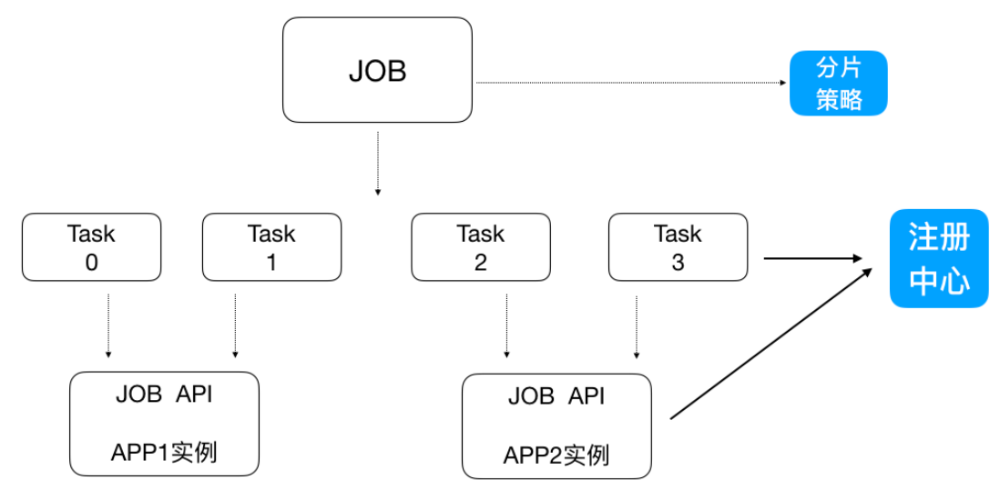
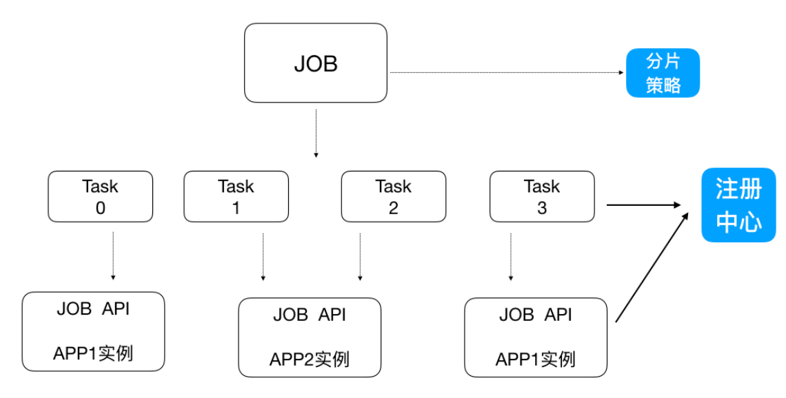

> 当前位置：【Java】10_Distributed（分布式架构）-> 10.5_Elastic-JOB（分布式任务调度框架）

# 第一章 Elastic-JOB 简介

## 1、概述

- GitHub地址：https://github.com/elasticjob

- Elastic-Job是当当⽹开源的⼀个分布式调度解决⽅案，基于Quartz⼆次开发的，由两个相互独⽴的⼦项⽬Elastic-Job-Lite和Elastic-Job-Cloud组成

```java 
- Elastic-Job-Lite，它定位为轻量级⽆中⼼化解决⽅案，使⽤Jar包的形式提供分布式任务的协调服务
- Elastic-Job-Cloud⼦项⽬需要结合 Mesos 以及 Docker 在云环境下使⽤
```


## 2、主要功能介绍

### （1）分布式调度协调

- 在分布式环境中，任务能够按指定的调度策略执⾏，并且能够避免同⼀任务多实例重复执⾏


### （2）丰富的调度策略

- 基于成熟的定时任务作业框架Quartz cron表达式执⾏定时任务


### （3）弹性扩容缩容

- 当集群中增加某⼀个实例，它应当也能够被选举并执⾏任务
- 当集群减少⼀个实例时，它所执⾏的任务能被转移到别的实例来执⾏。


### （4）失效转移

- 某实例在任务执⾏失败后，会被转移到其他实例执⾏


### （5）错过执⾏作业重触发

- 若因某种原因导致作业错过执⾏，⾃动记录错过执⾏的作业，并在上次作业完成后⾃动触发。


### （6）⽀持并⾏调度

- ⽀持任务分⽚，任务分⽚是指将⼀个任务分为多个⼩任务项在多个实例同时执⾏。


### （7）作业分⽚⼀致性

- 当任务被分⽚后，保证同⼀分⽚在分布式环境中仅⼀个执⾏实例。


# 第二章 Elastic-Job-Lite 的使用

## 1、使用步骤

### （1）添加依赖

```xml
<!-- Elastic-Job-Lite 核心包-->
<!-- https://mvnrepository.com/artifact/com.dangdang/elastic-job-lite-core -->
<dependency>
  <groupId>com.dangdang</groupId>
  <artifactId>elastic-job-lite-core</artifactId>
  <version>2.1.5</version>
</dependency>

<dependency>
  <groupId>mysql</groupId>
  <artifactId>mysql-connector-java</artifactId>
  <version>5.1.46</version>
</dependency>
```

### （2）定时任务业务逻辑处理类

- ArchiveJob.java

```java
package com.loto.elasticjob;

import com.dangdang.ddframe.job.api.ShardingContext;
import com.dangdang.ddframe.job.api.simple.SimpleJob;

import java.util.List;
import java.util.Map;

/**
 * ElasticJobLite定时任务业务逻辑处理类
 */
public class ArchiveJob implements SimpleJob {
    /**
     * 需求：resume表中未归档的数据归档到resume_bak表中，每次归档1条记录
     * execute方法中写我们的业务逻辑（execute方法每次定时任务执行都会执行一次）
     *
     * @param shardingContext
     */
    @Override
    public void execute(ShardingContext shardingContext) {
        int shardingItem = shardingContext.getShardingItem();
        System.out.println("=====>>>>当前分片：" + shardingItem);

        // 获取分片参数（即在 ElasticJobMain 设置的 0=bachelor,1=master,2=doctor）
        String shardingParameter = shardingContext.getShardingParameter();

        // 1 从resume表中查询出1条记录（未归档）
        String selectSql = "select * from resume where state='未归档' and education='" + shardingParameter + "' limit 1";
        List<Map<String, Object>> list = JdbcUtil.executeQuery(selectSql);
        if (list == null || list.size() == 0) {
            System.out.println("数据已经处理完毕！！！！！！");
            // 没有未归档的数据，程序结束
            return;
        }

        // 2 "未归档"更改为"已归档"
        Map<String, Object> stringObjectMap = list.get(0);
        long id = (long) stringObjectMap.get("id");
        String name = (String) stringObjectMap.get("name");
        String education = (String) stringObjectMap.get("education");

        System.out.println("=======>>>>id：" + id + "  name：" + name + " education：" + education);

        String updateSql = "update resume set state='已归档' where id=?";
        JdbcUtil.executeUpdate(updateSql, id);

        // 3 归档这条记录，把这条记录插入到resume_bak表
        String insertSql = "insert into resume_bak select * from resume where id=?";
        JdbcUtil.executeUpdate(insertSql, id);
    }
}
```

### （3）配置任务

- ElasticJobMain.java

```java
package com.loto.elasticjob;

import com.dangdang.ddframe.job.config.JobCoreConfiguration;
import com.dangdang.ddframe.job.config.simple.SimpleJobConfiguration;
import com.dangdang.ddframe.job.lite.api.JobScheduler;
import com.dangdang.ddframe.job.lite.config.LiteJobConfiguration;
import com.dangdang.ddframe.job.reg.base.CoordinatorRegistryCenter;
import com.dangdang.ddframe.job.reg.zookeeper.ZookeeperConfiguration;
import com.dangdang.ddframe.job.reg.zookeeper.ZookeeperRegistryCenter;

public class ElasticJobMain {
    public static void main(String[] args) {
        // 配置分布式协调服务（注册中心）Zookeeper
        ZookeeperConfiguration zookeeperConfiguration = new ZookeeperConfiguration("localhost:2181", "data-archive-job");
        CoordinatorRegistryCenter coordinatorRegistryCenter = new ZookeeperRegistryCenter(zookeeperConfiguration);
        coordinatorRegistryCenter.init();

        // 配置任务（时间事件、定时任务业务逻辑、调度器）
        JobCoreConfiguration jobCoreConfiguration = JobCoreConfiguration
                .newBuilder("archive-job", "*/2 * * * * ?", 3)
                .shardingItemParameters("0=bachelor,1=master,2=doctor")
                .build();

        SimpleJobConfiguration simpleJobConfiguration = new SimpleJobConfiguration(
                jobCoreConfiguration,
                ArchiveJob.class.getName());

        JobScheduler jobScheduler = new JobScheduler(
                coordinatorRegistryCenter,
                LiteJobConfiguration.newBuilder(simpleJobConfiguration).overwrite(true).build());

        jobScheduler.init();
    }
}
```

### （4）测试

- 先启动⼀个进程，然后再启动⼀个进程（两个进程模拟分布式环境下，同⼀个定时任务部署了两份在⼯作）
- 两个进程逐个启动，观察现象
- 关闭其中执⾏的进程，观察现象


## 2、去中心化

```
- 执行节点对等 (程序和jar一样，唯一不一样的可能是分片)
- 定时调度自触发 没有中心调度节点分配)
- 服务自发现 过注册中心的服务发现)
- 主节点非固定
```


## 3、轻量级

```
- Allin jar，必要依赖仅仅zookeeper
- 并非独立部署的中间件，就是jar程序
```


## 4、任务分片

- ElasticJob 把作业分为多个的task（每⼀个task就是⼀个任务分⽚），每⼀个task交给具体的⼀个机器实例去处理（⼀个机器实例是可以处理多个task的），但是具体每个task执⾏什么逻辑由我们⾃⼰来指定。
- Strategy 策略定义这些分⽚项怎么去分配到各个机器上去，默认是平均去分，可以定制，⽐如某⼀个机器负载 ⽐较⾼或者预配置⽐较⾼，那么就可以写策略。分⽚和作业本身是通过⼀个注册中⼼协调的，因为在分布式环境下，状态数据肯定集中到⼀点，才可以在分布式中沟通。




## 5、弹性扩容

- 新增加⼀个运⾏实例app3，它会⾃动注册到注册中⼼，注册中⼼发现新的服务上线，注册中⼼会通知ElasticJob 进⾏重新分⽚，那么总得分⽚项有多少，那么就可以搞多少个实例机器
- 注意：分⽚项也是⼀个JOB配置，修改配置，重新分⽚，在下⼀次定时运⾏之前会重新调⽤分⽚算法，那么这个分⽚算法的结果就是：哪台机器运⾏哪⼀个⼀⽚，这个结果存储到zk中的，主节点会把分⽚给分好放到注册中⼼去，然后执⾏节点从注册中⼼获取信息(执⾏节点在定时任务开启的时候获取相应的分⽚)。 如果所有的节点挂掉值剩下⼀个节点，所有分⽚都会指向剩下的⼀个节点，这也是ElasticJob的⾼可⽤。




# 第三章 Elastic-Job-Cloud的使用

