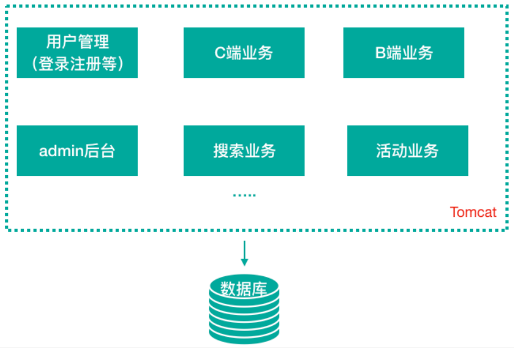
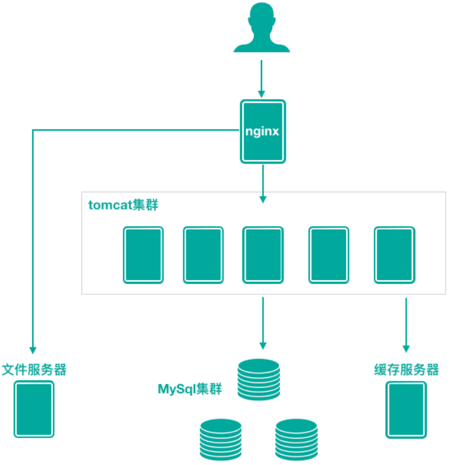
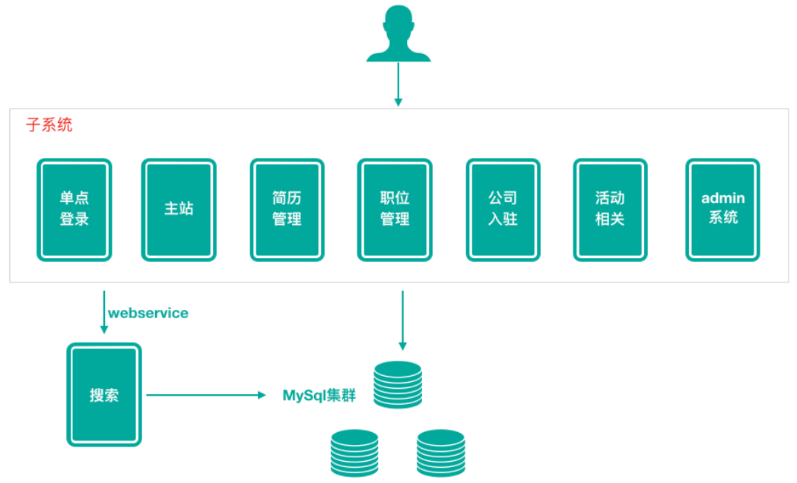
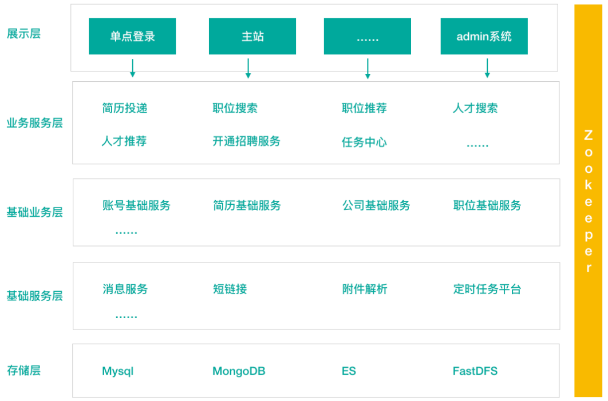
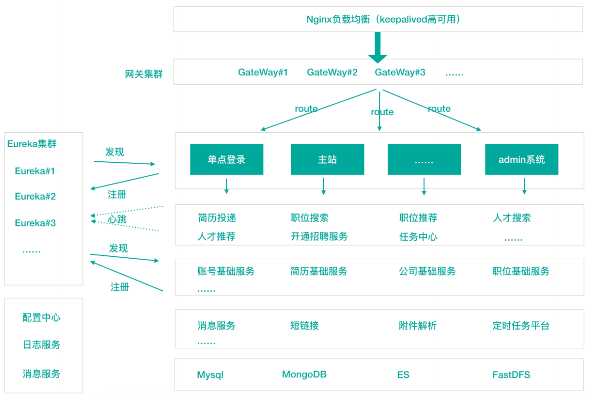
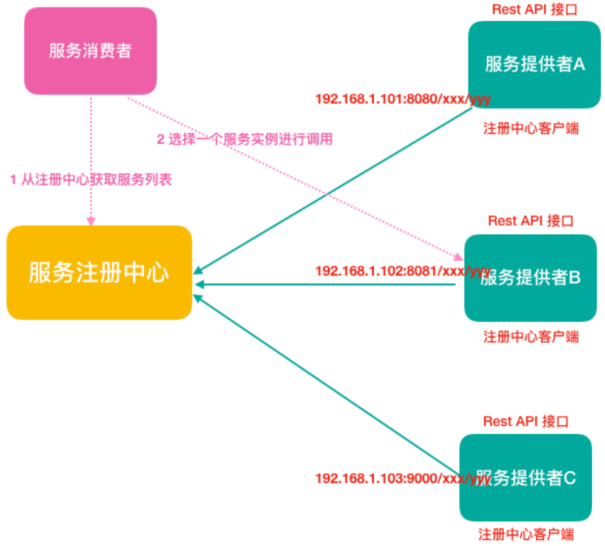
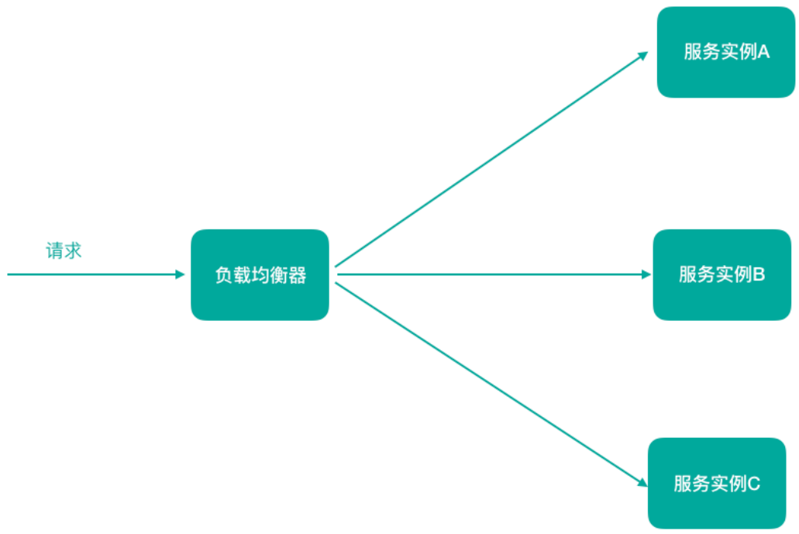
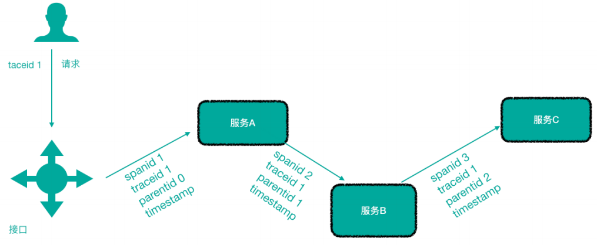
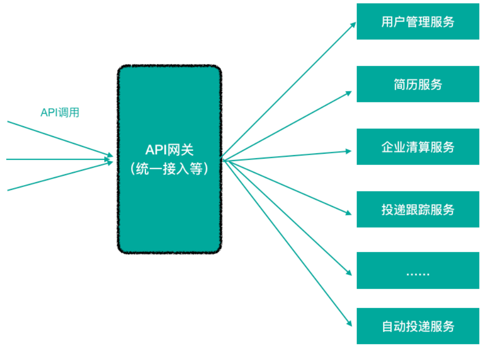

> 当前位置：【Java】10_MicroService（微服务）-> 10.0_MicroServiceBasic（微服务架构基础）


# 第一章 互联网应用架构发展

## 1、单体应用架构

- ⽤户量、数据量规模都⽐较⼩，项⽬所有的功能模块都放在⼀个⼯程中编码、编译、打包并且部署在⼀个Tomcat容器中的架构模式就是单体应⽤

  架构，这样的架构既简单实⽤、便于维护，成本⼜低



### 优点

- 项⽬前期开发节奏快，团队成员少的时候能够快速迭代
- 架构简单：MVC架构，只需要借助IDE开发、调试即可
- 易于测试：只需要通过单元测试或者浏览器完成
- 易于部署：打包成单⼀可执⾏的jar或者打成war包放到容器内启动


### 缺点

- 随着不断的功能迭代，单个项⽬过⼤，代码杂乱，耦合严重，开发团队逐渐壮⼤以后，沟通成本变⾼， 如：代码从编译到启动耗时达到 3-5 分钟
- 新增业务困难：在已经乱如麻的系统中增加新业务，维护旧功能，⼀脚踩进去全是不可预测的问题。新⼈来了以后很难接⼿任务，学习成本⾼，需要⼤概 ⼀周时间 才能上⼿开发
- 核⼼业务与边缘业务混合在⼀块，出现问题互相影响，如：⼀个临时活动流量猛涨，机器负 载升⾼就会影响正常的业务服务


## 2、单体应用架构（扩展）

- 业务量上涨之后，单体应⽤架构进⼀步丰富变化，⽐如应⽤集群部署、使⽤Nginx进⾏负载均衡、增加缓存服务器、增加⽂件服务器、数据库集群并做读写分离等，通过以上措施增强应对⾼并发的能⼒、应对⼀定的复杂业务场景，但依然属于单体应⽤架构



## 3、垂直应用架构

- 做垂直划分的原则是基于现有的业务特性来做，核⼼⽬标第⼀个是为了业务之间互不影响，第⼆个是在研发团队的壮⼤后为了提⾼ 效率，减少之间的依赖



### 优点

- 系统拆分实现了流量分担，解决了并发问题
- 可以针对不同模块进⾏优化
- ⽅便⽔平扩展，负载均衡，容错率提⾼
- 系统间相互独⽴，互不影响，新的业务迭代时更加⾼效


### 缺点

- 服务之间相互调⽤，如果某个服务的端⼝或者ip地址发⽣改变，调⽤的系统得⼿动改变
- 搭建集群之后，实现负载均衡⽐较复杂，如：内⽹负载，在迁移机器时会影响调⽤⽅的路 由，导致线上故障
- 服务之间调⽤⽅式不统⼀，基于 httpclient 、 webservice ，接⼝协议不统⼀
- 服务监控不到位：除了依靠端⼝、进程的监控，调⽤的成功率、失败率、总耗时等等这些监控指标是没有的


## 4、SOA 应用架构

- 在做了垂直划分以后，模块随之增多，维护的成本在也变⾼，⼀些通⽤的业务和模块重复的越来越多
- 为了解决上⾯提到的接⼝协议不统⼀、服务⽆法监控、服务的负载均衡，引⼊了阿⾥巴巴开源的 Dubbo ，⼀款⾼性能、轻量级的开源Java RPC框架，它提供了三⼤核⼼能⼒：⾯向接⼝的远程⽅法调⽤，智能容错和负载均衡，以及服务⾃动注册和发现
- SOA (Service-Oriented Architecture)，即⾯向服务的架构。根据实际业务，把系统拆分成合适的、独⽴部署的模块，模块之间相互独⽴（通过Webservice/Dubbo等技术进⾏通信）




### 优点

- 分布式、松耦合、扩展灵活、可重⽤。


### 缺点

- 服务抽取粒度较⼤、服务调⽤⽅和提供⽅耦合度较⾼（接⼝耦合度）


## 5、微服务应用架构

- 微服务架构可以说是SOA架构的⼀种拓展，这种架构模式下它拆分粒度更⼩、服务更独⽴。把应⽤拆分成为⼀个个微⼩的服务，不同的服务可以使⽤不同的开发语⾔和存储，服务之间往往通过Restful等轻量级通信。微服务架构关键在于微⼩、独⽴、轻量级通信
- 微服务是在 SOA 上做的升华粒度更加细致，微服务架构强调的⼀个重点是业务需要彻底的组件化和服务化




## 6、区别：微服务架构和SOA架构

- 微服务架构和SOA架构很明显的⼀个区别就是服务拆分粒度的不同


# 第二章 微服务架构

## 1、微服务架构的核心思想

- 微服务架构设计的核⼼思想就是微，拆分的粒度相对⽐较⼩，这样的话单⼀职责、开发的耦合度就会降低、微⼩的功能可以独⽴部署扩展、灵活性强，升级改造影响范围⼩


## 2、微服务架构的优点

- 微服务很⼩，便于特定业务功能的聚焦
- 微服务很⼩，每个微服务都可以被⼀个⼩团队单独实施（开发、测试、部署上线、运维），团队合作⼀定程度解耦，便于实施敏捷开发
- 微服务很⼩，便于重⽤和模块之间的组装
- 微服务很独⽴，那么不同的微服务可以使⽤不同的语⾔开发，松耦合
- 微服务架构下，我们更容易引⼊新技术
- 微服务架构下，我们可以更好的实现DevOps开发运维⼀体化；


## 3、微服务架构的缺点

- 微服务架构下，分布式复杂难以管理，当服务数量增加，管理将越加复杂；
- 微服务架构下，分布式链路跟踪难等；


## 4、微服务架构的相关概念

### 4.1 服务注册与服务发现

-  服务注册：服务提供者将所提供服务的信息（服务器IP和端⼝、服务访问协议等）注册/登记到注册中⼼
- 服务发现：服务消费者能够从注册中⼼获取到较为实时的服务列表，然后根究⼀定的策略选择⼀个服务访问



### 4.2 负载均衡

- 负载均衡即将请求压⼒分配到多个服务器（应⽤服务器、数据库服务器等），以此来提⾼服务的性能、可靠性



### 4.3 熔断

- 熔断即断路保护
- 微服务架构中，如果下游服务因访问压⼒过⼤⽽响应变慢或失败，上游服务为了保护系统整体可⽤性，可以暂时切断对下游服务的调⽤。这种牺牲局部，保全整体的措施就叫做熔断。


### 4.4 链路追踪

- 微服务架构越发流⾏，⼀个项⽬往往拆分成很多个服务，那么⼀次请求就需要涉及到很多个服务。不同的微服务可能是由不同的团队开发、可能使⽤不同的编程语⾔实现、整个项⽬也有可能部署在了很多服务器上（甚⾄百台、千台）横跨多个不同的数据中⼼
- 所谓链路追踪，就是对⼀次请求涉及的很多个服务链路进⾏⽇志记录、性能监控




### 4.5 API 网关

- 微服务架构下，不同的微服务往往会有不同的访问地址，客户端可能需要调⽤多个服务的接⼝才能完成⼀个业务需求，如果让客户端直接与各个微服务通信可能出现

```
- 客户端需要调⽤不同的url地址，增加了维护调⽤难度
- 在⼀定的场景下，也存在跨域请求的问题（前后端分离就会碰到跨域问题，原本在后端采⽤Cors就能解决，现在利⽤⽹关，那么就放在⽹关这层做好了）
- 每个微服务都需要进⾏单独的身份认证
```

- API⽹关就可以较好的统⼀处理上述问题，API请求调⽤统⼀接⼊API⽹关层，由⽹关转发请求。API⽹关更专注在安全、路由、流量等问题的处理上（微服务团队专注于处理业务逻辑即可）

```
API 网关的功能
- 统⼀接⼊（路由）
- 安全防护（统⼀鉴权，负责⽹关访问身份认证验证，与“访问认证中⼼”通信，实际认证业务逻辑交移“访问认证中⼼”处理）
- ⿊⽩名单（实现通过IP地址控制禁⽌访问⽹关功能，控制访问）
- 协议适配（实现通信协议校验、适配转换的功能）
- 流量管控（限流）
- ⻓短链接⽀持
- 容错能⼒（负载均衡）
```



