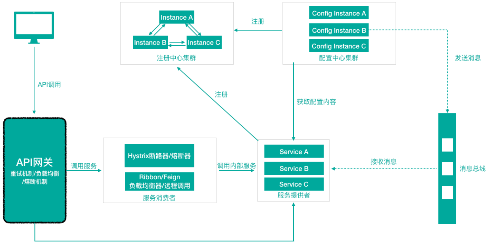
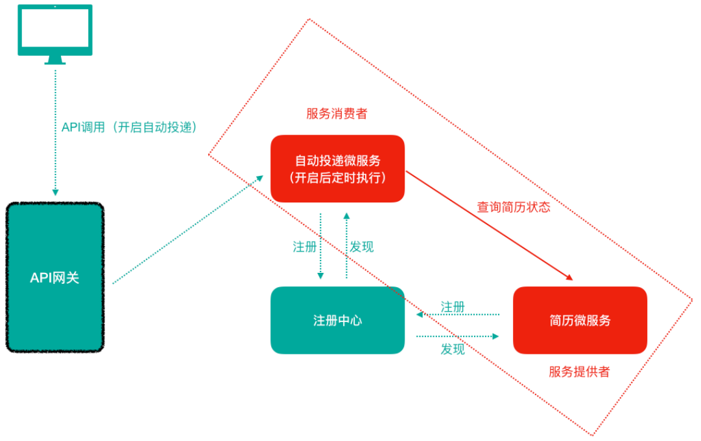

> 当前位置：【Java】10_MicroService（微服务）-> 10.1_SpringCloud


# 第一章 SpringCloud 简介

## 1、SpringCloud 概念

- Spring Cloud是⼀系列框架的有序集合
- 它利⽤Spring Boot的开发便利性巧妙地简化了分布式系统基础设施的开发，如服务发现注册、配置中⼼、消息总线、负载均衡、断路器、数据监控等，都可以⽤ Spring Boot的开发⻛格做到⼀键启动和部署。
- Spring Cloud并没有重复制造轮⼦，它只是将⽬前各家公司开发的⽐较成熟、经得起实际考验的服务框架组合起来，通过Spring Boot⻛格进⾏再封装屏蔽掉了复杂的配置和实现原理，最终给开发者留出了⼀套简单易懂、易部署和易维护的分布式系统开发⼯具包。

```
- Spring Cloud是⼀系列框架的有序集合（Spring Cloud是⼀个规范）
- 开发服务发现注册、配置中⼼、消息总线、负载均衡、断路器、数据监控等
- 利⽤Spring Boot的开发便利性简化了微服务架构的开发（⾃动装配）
```


## 2、SpringCloud 意图解决的问题

- Spring Cloud 规范及实现意图要解决的问题其实就是微服务架构实施过程中存在的⼀些问题，⽐如微服务架构中的服务注册发现问题、⽹络问题（⽐如熔断场景）、统⼀认证安全授权问题、负载均衡问题、链路追踪等问题。


# 第二章 SpringCloud 架构

## 1、SpringCloud 核心组件

### 1.1 对比：SpringCloud SCN 和 SpringCloud SCA

- Spring Cloud是⼀个微服务相关规范，这个规范意图为搭建微服务架构提供⼀站式服务，采⽤组件（框架）化机制定义⼀系列组件，各类组件针对性的处理微服务中的特定问题，这些组件共同来构成Spring Cloud微服务技术栈

|                | 第⼀代 Spring Cloud Netflix（SCN）                | 第⼆代 Spring Cloud Alibaba（SCA）             |
| -------------- | ------------------------------------------------- | ---------------------------------------------- |
| 服务注册中心   | Netflix Eureka                                    | 阿里巴巴：Nacos                                |
| 客户端负载均衡 | Netflix Ribbon                                    | 阿⾥巴巴：Dubbo RPC、SpringCloud：Loadbalancer |
| 服务熔断       | Netflix Hystrix                                   | 阿⾥巴巴：Sentinel                             |
| 远程服务调用   | Netflix Feign                                     | 阿⾥巴巴：Dubbo RPC                            |
| 网关           | Netflix Zuul（已退出）、==Spring Cloud：Gateway== | ==Spring Cloud：Gateway==                      |
| 服务配置中心   | Spring Cloud Config + Spring Cloud Bus            | 阿⾥巴巴：Nacos、携程：Apollo                  |
| 消息驱动       | ==Spring Cloud Stream==                           | ==Spring Cloud Stream==                        |
| 分布式链路追踪 | ==Spring Cloud Sleuth + Twitter Zipkin==          | ==Spring Cloud Sleuth + Twitter Zipkin==       |
| 统一认证方案   | ==Spring Cloud OAuth2 + JWT==                     | ==Spring Cloud OAuth2 + JWT==                  |
| 分布式事务方案 |                                                   | 阿里巴巴：seata                                |


### 1.2 对比：主流服务中心

- C：数据⼀致性
- A：⾼可用
- P：分区容错性（⼀定的要满⾜的）

| 组件名    | 语言 | CAP           | 对外暴露接口 |
| --------- | ---- | ------------- | ------------ |
| Eureka    | Java | AP            | HTTP         |
| Consul    | Go   | CP            | HTTP/DNS     |
| Zookeeper | Java | CP            | 客户端       |
| Nacos     | Java | ⽀持AP/CP切换 | HTTP         |


```java
Eureka
- 由Netflix开源，并被Pivatal集成到SpringCloud体系中
- 它是基于 RestfulAPI⻛格开发的服务注册与发现组件
- Eureka⾃我保护机制，保证可用
  
Consul
- Consul是由HashiCorp基于Go语⾔开发的⽀持多数据中⼼分布式⾼可⽤的服务发布和注册服务软件，
- 采⽤Raft算法保证服务的⼀致性，且⽀持健康检查

Zookeeper
- Zookeeper它是⼀个分布式服务框架
- 是Apache Hadoop 的⼀个⼦项⽬
- 它主要是⽤来解决分布式应⽤中经常遇到的⼀些数据管理问题，如：统⼀命名服务、状态同步服务、集群管理、分布式应⽤配置项的管理等
- zookeeper本质 = 存储 + 监听通知
- Zookeeper ⽤来做服务注册中⼼，主要是因为它具有节点变更通知功能，只要客户端监听相关服务节点，服务节点的所有变更，都能及时的通知到监听客户端，这样作为调⽤⽅只要使⽤ Zookeeper 的客户端就能实现服务节点的订阅和变更通知功能了，⾮常⽅便。另外，Zookeeper 可⽤性也可以，因为只要半数以上的选举节点存活，整个集群就是可⽤的

Nacos
- Nacos是⼀个更易于构建云原⽣应⽤的动态服务发现、配置管理和服务管理平台
- 简单来说 Nacos 就是注册中⼼ + 配置中⼼的组合，帮助解决微服务开发必会涉及到的服务注册与发现、服务配置、服务管理等问题
- Nacos 是Spring Cloud Alibaba 核⼼组件之⼀，负责服务注册与发现、配置
```


## 2、SpringCloud 体系结构（组件协同工作机制）

- 注册中⼼：负责服务的注册与发现，很好将各服务连接起来
- API⽹关：负责转发所有外来的请求
- 断路器：负责监控服务之间的调⽤情况，连续多次失败进⾏熔断保护
- 配置中⼼：提供了统⼀的配置信息管理服务,可以实时的通知各个服务获取最新的配置信息




## 3、区别：SpringCloud 和 Dubbo

- Dubbo是阿⾥巴巴公司开源的⼀个⾼性能优秀的服务框架，基于RPC调⽤
- 对于⽬前使⽤率较⾼的Spring Cloud Netflflix来说，它是基于HTTP的，所以效率上没有Dubbo⾼，但问题在于Dubbo体系的组件不全，不能够提供⼀站式解决⽅案，⽐如服务注册与发现需要借助于Zookeeper等实现，⽽Spring Cloud Netflflix则是真正的提供了⼀站式服务化解决⽅案，且有Spring⼤家族背景。


## 4、关系：SpringCloud 和 SpringBoot

- Spring Cloud 只是利⽤了Spring Boot 的特点，能够快速的实现微服务组件开发，否则不使⽤Spring Boot的话，在使⽤Spring Cloud时，每⼀个组件的相关Jar包都需要⾃⼰导⼊配置以及需要开发⼈员考虑兼容性等各种情况。所以Spring Boot是快速把Spring Cloud微服务技术应⽤起来的⼀种⽅式。


# 第三章 SpringCloud 案例

## 1、关系图



## 2、在微服务分布式集群环境下会存在什么问题呢？怎么解决？

```
（1）在服务消费者中，我们把url地址硬编码到代码中，不⽅便后期维护。
- 服务管理：⾃动注册与发现、状态监管

（2）服务提供者只有⼀个服务，即便服务提供者形成集群，服务消费者还需要⾃⼰实现负载均衡。
- 服务负载均衡

（3）在服务消费者中，不清楚服务提供者的状态。
- 熔断

（4）服务消费者调⽤服务提供者时候，如果出现故障能否及时发现不向⽤户抛出异常⻚⾯？
- 远程过程调⽤

（5）RestTemplate这种请求调⽤⽅式是否还有优化空间？能不能类似于Dubbo那样玩？
- ⽹关拦截、路由转发

（6）这么多的微服务统⼀认证如何实现？
- 统⼀认证

（7）配置⽂件每次都修改好多个很麻烦！？
- 集中式配置管理，配置信息实时⾃动更新
```

