> 当前位置：【Java】10_MicroService（微服务）-> 10.2_SpringCloud_Netflix


# SpringCloud_Netflix 组件

- 从形式上来说，Feign = RestTemplate + Ribbon + Hystrix

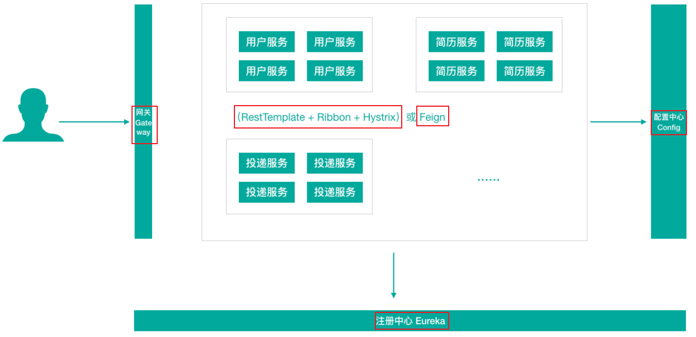


# 第一章 服务注册中心 - Eureka

## 1、Eureka 基础架构

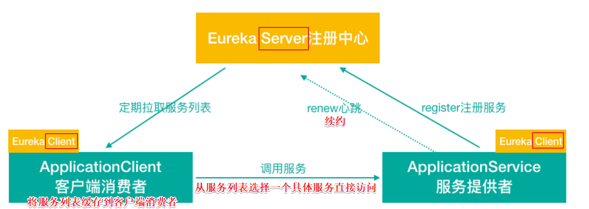


## 2、Eureka 交互流程及原理


## 3、搭建流程 - Eureka（单例）

### 步骤1：pom.xml 

#### （1）SpringCloud 父工程 pom.xml 引入 Spring Cloud 依赖

```xml
<dependencyManagement>
  <dependencies>
    <!-- SpringCloud 依赖管理 -->
    <dependency>
      <groupId>org.springframework.cloud</groupId>
      <artifactId>spring-cloud-dependencies</artifactId>
      <version>Greenwich.RELEASE</version>
      <type>pom</type>
      <scope>import</scope>
    </dependency>
  </dependencies>
</dependencyManagement>
```


#### （2）SpringCloud 父工程 pom.xml 手动引入 jaxb 的jar包

- 因为Jdk9之后默认没有加载该模块，EurekaServer使⽤到，所以需要⼿动导⼊，否则EurekaServer服务⽆法启动

```xml
<!-- eureka server 需要引入Jaxb，开始 -->
<dependency>
  <groupId>com.sun.xml.bind</groupId>
  <artifactId>jaxb-core</artifactId>
  <version>2.2.11</version>
</dependency>

<dependency>
  <groupId>javax.xml.bind</groupId>
  <artifactId>jaxb-api</artifactId>
</dependency>

<dependency>
  <groupId>com.sun.xml.bind</groupId>
  <artifactId>jaxb-impl</artifactId>
  <version>2.2.11</version>
</dependency>

<dependency>
  <groupId>org.glassfish.jaxb</groupId>
  <artifactId>jaxb-runtime</artifactId>
  <version>2.2.10-b140310.1920</version>
</dependency>

<dependency>
  <groupId>javax.activation</groupId>
  <artifactId>activation</artifactId>
  <version>1.1.1</version>
</dependency>
<!-- 引入Jaxb，结束 -->
```


#### （3）当前子工程  pom.xml 引入 Eureka server 依赖

```xml
<dependencies>
  <!-- Eureka server依赖 -->
  <dependency>
    <groupId>org.springframework.cloud</groupId>
    <artifactId>spring-cloud-starter-netflix-eureka-server</artifactId>
  </dependency>
</dependencies>
```


### 步骤2：application.yml 配置文件

- 当前子工程  application.yml 配置

```yaml
# eureka server服务端口
server:
  port: 8761

spring:
  application:
    # 应用服务名称（会在Eureka中作为服务名称）
    name: cloud-eureka-server

# eureka 客户端配置（用于和Server交互），Eureka Server 其实也是一个 Client
eureka:
  instance:
    # 当前 eureka 实例的主机名
    hostname: localhost
  client:
    service-url:
      # 配置客户端所交互的 Eureka Server 地址
      # Eureka Server集群中每一个Server其实相对于其它Server来说都是Client
      # 单机模式下
      defaultZone: http://${eureka.instance.hostname}:${server.port}/eureka
    # 是否禁止自己当做服务注册（集群模式下，可以改成 true）
    register-with-eureka: false
    # 是否屏蔽注册信息（默认为 true）
    # 单机模式下，自己就是 server，不需要从 EurekaServer 获取服务信息
    # 集群模式下，改成 true
    fetch-registry: false
  # 是否启用eureka服务控制台
  dashboard:
    enabled: true
```


### 步骤3：SpringBoot 启动类

- 使⽤ @EnableEurekaServer 声明当前项目为 EurekaServer 服务

```java
@SpringBootApplication
@EnableEurekaServer  // 声明当前项目为Eureka服务
public class CloudEurekaServer8761Application {
    public static void main(String[] args) {
        SpringApplication.run(CloudEurekaServer8761Application.class, args);
    }
}
```


## 4、搭建流程 - Eureka Server HA（高可用集群）

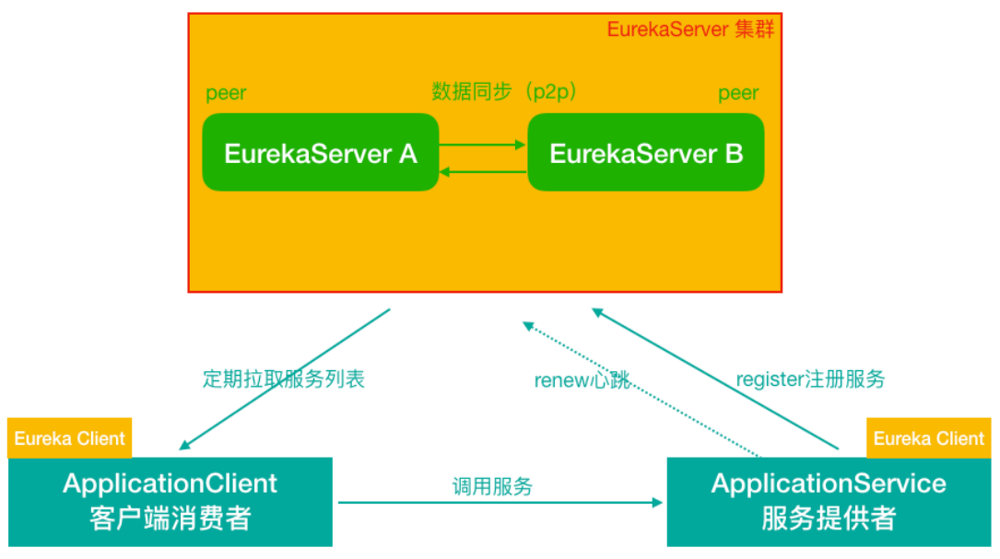

### 步骤1：pom.xml 

#### （1）SpringCloud 父工程 pom.xml 引入 Spring Cloud 依赖

```xml
<dependencyManagement>
  <dependencies>
    <!-- SpringCloud 依赖管理 -->
    <dependency>
      <groupId>org.springframework.cloud</groupId>
      <artifactId>spring-cloud-dependencies</artifactId>
      <version>Greenwich.RELEASE</version>
      <type>pom</type>
      <scope>import</scope>
    </dependency>
  </dependencies>
</dependencyManagement>
```


#### （2）SpringCloud 父工程 pom.xml 手动引入 jaxb 的jar包

- 因为Jdk9之后默认没有加载该模块，EurekaServer使⽤到，所以需要⼿动导⼊，否则EurekaServer服务⽆法启动

```xml
<!-- eureka server 需要引入Jaxb，开始 -->
<dependency>
  <groupId>com.sun.xml.bind</groupId>
  <artifactId>jaxb-core</artifactId>
  <version>2.2.11</version>
</dependency>

<dependency>
  <groupId>javax.xml.bind</groupId>
  <artifactId>jaxb-api</artifactId>
</dependency>

<dependency>
  <groupId>com.sun.xml.bind</groupId>
  <artifactId>jaxb-impl</artifactId>
  <version>2.2.11</version>
</dependency>

<dependency>
  <groupId>org.glassfish.jaxb</groupId>
  <artifactId>jaxb-runtime</artifactId>
  <version>2.2.10-b140310.1920</version>
</dependency>

<dependency>
  <groupId>javax.activation</groupId>
  <artifactId>activation</artifactId>
  <version>1.1.1</version>
</dependency>
<!-- 引入Jaxb，结束 -->
```


#### （3）当前子工程  pom.xml 引入 Eureka server 依赖

```xml
<dependencies>
  <!-- Eureka server依赖 -->
  <dependency>
    <groupId>org.springframework.cloud</groupId>
    <artifactId>spring-cloud-starter-netflix-eureka-server</artifactId>
  </dependency>
</dependencies>
```


### 步骤2：application.yml 配置文件

#### （1）当前子工程  application.yml 配置 - CloudEurekaServerA

```yaml
# eureka server服务端口
server:
  port: 8761

spring:
  application:
    # 应用服务名称（会在Eureka中作为服务名称）
    name: cloud-eureka-server

# eureka 客户端配置（用于和Server交互），Eureka Server 其实也是一个 Client
eureka:
  instance:
    # 当前 eureka 实例的主机名
    hostname: CloudEurekaServerA
  client:
    service-url:
      # 配置客户端所交互的 Eureka Server 地址
      # Eureka Server集群中每一个Server其实相对于其它Server来说都是Client
      # 单机模式下
      # defaultZone: http://${eureka.instance.hostname}:${server.port}/eureka
      # 集群模式下，defaultZone 应该指向其它 Eureka Server，如果有更多其它Server实例，逗号拼接即可
      defaultZone: http://CloudEurekaServerB:8762/eureka
    # 是否禁止自己当做服务注册（集群模式下，可以改成 true）
    register-with-eureka: true
    # 是否屏蔽注册信息（默认为 true）
    # 单机模式下，自己就是 server，不需要从 EurekaServer 获取服务信息
    # 集群模式下，改成 true
    fetch-registry: true
  # 是否启用eureka服务控制台
  dashboard:
    enabled: true
```

#### （2）当前子工程  application.yml 配置 - CloudEurekaServerB

```yaml
# eureka server服务端口
server:
  port: 8762

spring:
  application:
    # 应用服务名称（会在Eureka中作为服务名称）
    name: cloud-eureka-server

# eureka 客户端配置（用于和Server交互），Eureka Server 其实也是一个 Client
eureka:
  instance:
    # 当前 eureka 实例的主机名
    hostname: CloudEurekaServerB
  client:
    service-url:
      # 配置客户端所交互的 Eureka Server 地址
      # Eureka Server集群中每一个Server其实相对于其它Server来说都是Client
      # 单机模式下
      # defaultZone: http://${eureka.instance.hostname}:${server.port}/eureka
      # 集群模式下，defaultZone 应该指向其它 Eureka Server，如果有更多其它Server实例，逗号拼接即可
      defaultZone: http://CloudEurekaServerA:8761/eureka
    # 是否禁止自己当做服务注册（集群模式下，可以改成 true）
    register-with-eureka: true
    # 是否屏蔽注册信息（默认为 true）
    # 单机模式下，自己就是 server，不需要从 EurekaServer 获取服务信息
    # 集群模式下，改成 true
    fetch-registry: true
  # 是否启用eureka服务控制台
  dashboard:
    enabled: true
```


### 步骤3：SpringBoot 启动类

#### （1）使用 @EnableEurekaServer 声明当前项目为 EurekaServer 服务 - CloudEurekaServer8761Application

```java
@SpringBootApplication
@EnableEurekaServer  // 声明当前项目为Eureka服务
public class CloudEurekaServer8761Application {
    public static void main(String[] args) {
        SpringApplication.run(CloudEurekaServer8761Application.class, args);
    }
}
```

#### （2）使用 @EnableEurekaServer 声明当前项目为 EurekaServer 服务 - CloudEurekaServer8762Application

```java
@SpringBootApplication
@EnableEurekaServer  // 声明当前项目为Eureka服务
public class CloudEurekaServer8762Application {
    public static void main(String[] args) {
        SpringApplication.run(CloudEurekaServer8762Application.class, args);
    }
}
```


### 步骤4：修改本机 host 内容

```properties
# Eureka配置server集群
127.0.0.1 CloudEurekaServerA
127.0.0.1 CloudEurekaServerB
```


## 5、Eureka 服务控制台详解

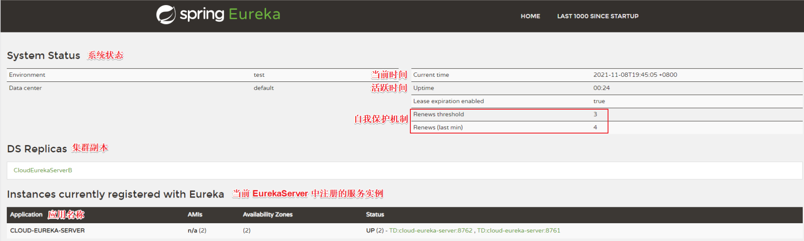

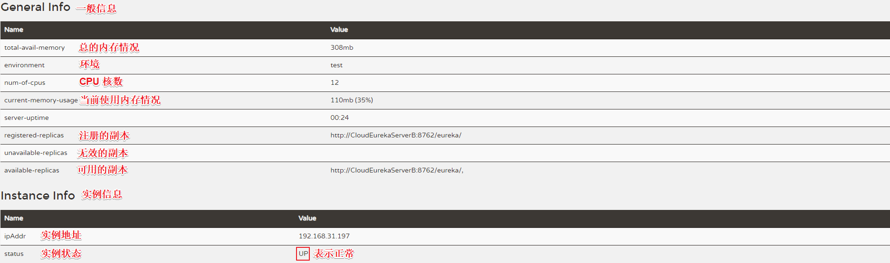


## 6、使用流程 - 将服务提供者注册到 Eureka 服务中心

### 步骤1：pom.xml 

#### （1）父工程中引入 spring-cloud-commons 依赖

```xml
<!-- spring cloud commons模块引入-->
<dependency>
    <groupId>org.springframework.cloud</groupId>
    <artifactId>spring-cloud-commons</artifactId>
</dependency>
```

#### （2）子工程中引入 eureka client 客户端依赖

```xml
<!-- eureka client 客户端依赖引入-->
<dependency>
    <groupId>org.springframework.cloud</groupId>
    <artifactId>spring-cloud-starter-netflix-eureka-client</artifactId>
</dependency>
```


### 步骤2：配置 application.yml 文件

```yaml
server:
  port: 8080

spring:
  application:
    name: resume-service-resume
  datasource:
    driver-class-name: com.mysql.cj.jdbc.Driver
    url: jdbc:mysql://localhost:3306/SpringCloud?useUnicode=true&characterEncoding=utf8&serverTimezone=UTC
    username: root
    password: root
  jpa:
    database: MySQL
    show-sql: true
    hibernate:
      naming:
        physical-strategy: org.hibernate.boot.model.naming.PhysicalNamingStrategyStandardImpl  #避免将驼峰命名转换为下划线命名

# 将服务提供者注册到 Eureka 服务中心
eureka:
  client:
    service-url:
      # 注册到单实例（非集群模式），就写一个就可以
      # 注册到集群，把多个 Eureka server 地址使用逗号连接起来即可
      defaultZone: http://CloudEurekaServerA:8761/eureka,http://CloudEurekaServerB:8762/eureka
  instance:
    # 服务实例中显示 ip，而不是显示主机名（为了兼容老的 eureka 版本）
    prefer-ip-address: true
    # 自定义实例显示格式（加上版本号，便于多版本管理）
    instance-id: ${spring.cloud.client.ip-address}:${spring.application.name}:${server.port}:@project.version@
```


### 步骤3：启动类添加注解

```java
@SpringBootApplication
@EntityScan("com.loto.pojo")

// 说明：从 SpringCloud Edgware 版本开始，不加注解也可以，但是建议加上
// 方式1：开启 Eureka Client（使用 Eureka 作为注册中心时）
//@EnableEurekaClient

// 方式2：开启注册中心客户端 （通用型注解，使用Eureka或者Nacos等作为注册中心时使用）
@EnableDiscoveryClient
public class ResumeApplication8080 {
    public static void main(String[] args) {
        SpringApplication.run(ResumeApplication8080.class,args);
    }
}
```


## 7、使用流程 - 将服务消费者注册到 Eureka 服务中心

### 步骤1：pom.xml 

#### （1）父工程中引入 spring-cloud-commons 依赖

```xml
<!-- spring cloud commons模块引入-->
<dependency>
    <groupId>org.springframework.cloud</groupId>
    <artifactId>spring-cloud-commons</artifactId>
</dependency>
```

#### （2）子工程中引入 eureka client 客户端依赖

```xml
<!-- eureka client 客户端依赖引入-->
<dependency>
    <groupId>org.springframework.cloud</groupId>
    <artifactId>spring-cloud-starter-netflix-eureka-client</artifactId>
</dependency>
```


### 步骤2：配置 application.yml 文件

```yaml
server:
  port: 8081

spring:
  application:
    name: resume-service-autodeliver

# 将服务提供者注册到 Eureka 服务中心
eureka:
  client:
    service-url:
      # 注册到单实例（非集群模式），就写一个就可以
      # 注册到集群，把多个 Eureka server 地址使用逗号连接起来即可
      defaultZone: http://CloudEurekaServerA:8761/eureka,http://CloudEurekaServerB:8762/eureka
  instance:
    # 服务实例中显示 ip，而不是显示主机名（为了兼容老的 eureka 版本）
    prefer-ip-address: true
    # 自定义实例显示格式（加上版本号，便于多版本管理）
    instance-id: ${spring.cloud.client.ip-address}:${spring.application.name}:${server.port}:@project.version@
```


### 步骤3：启动类添加注解

```java
@SpringBootApplication
@EnableDiscoveryClient
public class AutodeliverApplication8081 {
    public static void main(String[] args) {
        SpringApplication.run(AutodeliverApplication8081.class, args);
    }

    // 使用 RestTemplate 模板对象进行远程调用
    @Bean
    public RestTemplate getRestTemplate() {
        return new RestTemplate();
    }
}
```


## 8、使用流程 - 服务消费者 调用 服务提供者（通过Eureka）

```java
@RestController
@RequestMapping("/autodeliver")
public class AutodeliverController {
    // RestTemplate 模板对象（Rest 风格的远程服务调用）
    @Autowired
    private RestTemplate restTemplate;

    // 注入服务发现客户端
    @Autowired
    private DiscoveryClient discoveryClient;

    //http://localhost:8081/autodeliver/checkState/1545132
    /**
     * 服务注册到 Eureka 之后的改造：从注册中心拿服务实例，进行访问
     */
    @GetMapping("/checkState/{userId}")
    public Integer findResumeOpenState(@PathVariable Long userId) {
        // 1、从 Eureka Server 中获取 resume-service-resume 服务的实例信息（使用客户端对象做这件事）
        List<ServiceInstance> instances = discoveryClient.getInstances("resume-service-resume");

        // 2、如果有多个实例，选择一个使用(负载均衡的过程)
        ServiceInstance serviceInstance = instances.get(0);

        // 3、从元数据信息获取 host、port
        String host = serviceInstance.getHost();
        int port = serviceInstance.getPort();
        String url = "http://" + host + ":" + port + "/resume/openstate/" + userId;
        System.out.println("===============>>>从EurekaServer集群获取服务实例拼接的url：" + url);

        // 调用远程服务（简历微服务接口） - RestTemplate
        Integer forObject = restTemplate.getForObject(url, Integer.class);
        return forObject;
    }
}
```


## 9、Eureka 元数据

### （1）分类

- 标准元数据：主机名、IP地址、端⼝号等信息，这些信息都会被发布在服务注册表中，用于服务之间的调用
- 自定义元数据：可以使用 eureka.instance.metadata-map 配置，符合 KEY/VALUE 的存储格式。这些元数据可以在远程客户端中访问


### （2）自定义元数据的配置

- application.yml（resume-service-resume-8080）

```yaml
# 将服务提供者注册到 Eureka 服务中心
eureka:
  client:
    service-url:
      # 注册到单实例（非集群模式），就写一个就可以
      # 注册到集群，把多个 Eureka server 地址使用逗号连接起来即可
      defaultZone: http://CloudEurekaServerA:8761/eureka,http://CloudEurekaServerB:8762/eureka
  instance:
    # 服务实例中显示 ip，而不是显示主机名（为了兼容老的 eureka 版本）
    prefer-ip-address: true
    # 自定义实例显示格式（加上版本号，便于多版本管理）
    instance-id: ${spring.cloud.client.ip-address}:${spring.application.name}:${server.port}:@project.version@
    metadata-map:
      cluster: cl1
      region: rn1
```


### （3）获取自定义元数据

- resume-service-autodeliver-8081

- http://localhost:8081/autodeliver/metadata

```java
/**
 * 获取 Eureka 元数据
 */
@GetMapping("/metadata")
public void testInstanceMetadata() {
    List<ServiceInstance> instances = discoveryClient.getInstances("resume-service-resume");

    // 自定义的元数据的值
    System.out.println(instances.get(0).getMetadata().get("cluster"));
    System.out.println(instances.get(0).getMetadata().get("region"));
    System.out.println("=============================");

    // 所有实例
    for (int i = 0; i < instances.size(); i++) {
        ServiceInstance serviceInstance =  instances.get(i);
        System.out.println(serviceInstance);
    }
}
```


## 10、Eureka 源码分析

### 10.1 Eureka Server 启动过程

### 10.2 Eureka Server 服务接口暴露策略

### 10.3 Eureka Server 服务注册接口（接受客户端注册服务）

### 10.4 Eureka Server 服务续约接口（接受客户端续约）

### 10.5 Eureka Client 注册服务

### 10.6 Eureka Client 下架服务

### 10.7 Eureka Client 心跳续约


# 第二章 负载均衡 - Ribbon

## 1、Ribbon 简介

- 负载均衡⼀般分为服务器端负载均衡和客户端负载均衡

```
- 服务器端负载均衡，⽐如Nginx、F5这些，请求到达服务器之后由这些负载均衡器根据⼀定的算法将请求路由到⽬标服务器处理。
- 客户端负载均衡，⽐如Ribbon，服务消费者客户端会有⼀个服务器地址列表，调⽤⽅在请求前通过⼀定的负载均衡算法选择⼀个服务器进⾏访问，负载均衡算法的执⾏是在请求客户端进⾏。
```

- Ribbon是Netflix发布的负载均衡器
- Eureka⼀般配合Ribbon进⾏使⽤
- Ribbon利⽤从Eureka中读取到服务信息，在调⽤服务提供者提供的服务时，会根据⼀定的算法进⾏负载。


## 2、Ribbon 负载均衡策略

- 负责负载均衡的顶级接口：com.netflflix.loadbalancer.IRule


### 2.1 RoundRobinRule：轮询策略

- 默认超过10次获取到的server都不可⽤，会返回⼀个空的server


### 2.2 RandomRule：随机策略

- 如果随机到的server为null或者不可⽤的话，会while不停的循环选取


### 2.3 RetryRule：重试策略

- ⼀定时限内循环重试
- 默认继承RoundRobinRule，也⽀持⾃定义注⼊
- RetryRule会在每次选取之后，对选举的server进⾏判断，是否为null，是否alive，并且在500ms内会不停的选取判断，RandomRule是没有失效时间的概念，只要serverList没都挂。


### 2.4 BestAvailableRule：最小连接数策略

- 遍历serverList，选取出可⽤的且连接数最⼩的⼀个server
- 该算法⾥⾯有⼀个LoadBalancerStats的成员变量，会存储所有server的运⾏状况和连接数
- 如果选取到的server为null，那么会调⽤RoundRobinRule重新选取


### 2.5 AvailabilityFilteringRule：可用过滤策略

- 扩展了轮询策略
- 会先通过默认的轮询选取⼀个server，再去判断该server是否超时可⽤，当前连接数是否超限，都成功（即可用，且没有超限）再返回


### 2.6 ZoneAvoidanceRule：区域权衡策略（默认策略）

- 扩展了轮询策略
- 继承了2个过滤器：ZoneAvoidancePredicate 和 AvailabilityPredicate
- 除了过滤超时和链接数过多的server，还会过滤掉不符合要求的 zone 区域⾥⾯的所有节点


## 3、Ribbon 使用

### 步骤1：pom.xml 依赖

- eureka-client 依赖会引入 Ribbon 相关的 jar

```xml
<!-- eureka client 客户端依赖引入-->
<dependency>
    <groupId>org.springframework.cloud</groupId>
    <artifactId>spring-cloud-starter-netflix-eureka-client</artifactId>
</dependency>
```


### 步骤2：启动类添加注解 @LoadBalanced

- 在 RestTemplate 上添加对应注解

```java
@SpringBootApplication
@EnableDiscoveryClient
public class AutodeliverApplication8081 {
    public static void main(String[] args) {
        SpringApplication.run(AutodeliverApplication8081.class, args);
    }

    // 使用 RestTemplate 模板对象进行远程调用
    @Bean
    @LoadBalanced // Ribbon 负载均衡
    public RestTemplate getRestTemplate() {
        return new RestTemplate();
    }
}
```


### 步骤3：修改负载均衡策略

- 方式1：针对的被调用方微服务名称

```yaml
resume-service-resume:
  ribbon:
    # 负载策略调整：使用轮询
    NFLoadBalancerRuleClassName: com.netflix.loadbalancer.RoundRobinRule
```

- 方式2：全局生效

```yaml
ribbon:
	# 负载策略调整：使用轮询
	NFLoadBalancerRuleClassName: com.netflix.loadbalancer.RoundRobinRule 
```


### 步骤4：使用 Ribbon 负载均衡

```java
@RestController
@RequestMapping("/autodeliver")
public class AutodeliverController {
    // RestTemplate 模板对象（Rest 风格的远程服务调用）
    @Autowired
    private RestTemplate restTemplate;

    // 注入服务发现客户端
    @Autowired
    private DiscoveryClient discoveryClient;

    //http://localhost:8081/autodeliver/checkState3/1545132
    /**
     * 使用 Ribbon 负载均衡
     */
    @GetMapping("/checkState3/{userId}")
    public Integer findResumeOpenState3(@PathVariable Long userId) {
        // 指定服务名
        String url = "http://resume-service-resume/resume/openstate/" + userId;
        Integer forObject = restTemplate.getForObject(url, Integer.class);
        return forObject;
    }
}
```


## 4、Ribbon 工作原理

- 负载均衡管理器 LoadBalancer（总的协调者，相当于⼤脑，为了做事情，协调四肢）

```
围绕负载均衡管理器 LoadBalancer 周围的：
- IRule：是在选择实例的时候的负载均衡策略对象
- IPing：是⽤来向服务发起⼼跳检测的，通过⼼跳检测来判断该服务是否可⽤
- ServerListFilter：根据⼀些规则过滤传⼊的服务实例列表
- ServerListUpdater：定义了⼀系列的对服务列表的更新操作
```


## 5、Ribbon 源码分析

### 5.1 源码分析 - @LoadBalanced

#### （1）LoadBalanced.java

```java
// Annotation to mark a RestTemplate bean to be configured to use a LoadBalancerClient.
// 使用 @LoadBalanced 注解后，可以将普通的 RestTemplate 对象使用 LoadBalancerClient 去处理
@Target({ ElementType.FIELD, ElementType.PARAMETER, ElementType.METHOD })
@Retention(RetentionPolicy.RUNTIME)
@Documented
@Inherited
@Qualifier
public @interface LoadBalanced {
}
```


#### （2）spring.factories

- 根据 SpringBoot 自动装配，找到 spring.factories 配置文件

```properties
org.springframework.boot.autoconfigure.EnableAutoConfiguration=\
org.springframework.cloud.netflix.ribbon.RibbonAutoCon
```


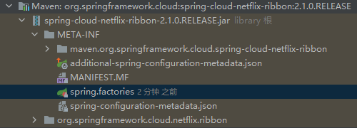


#### （3）RibbonAutoConfiguration.java

```java
@Configuration
@Conditional(RibbonAutoConfiguration.RibbonClassesConditions.class)
@RibbonClients
// 自动装配后
@AutoConfigureAfter(name = "org.springframework.cloud.netflix.eureka.EurekaClientAutoConfiguration")
// 自动装配前
@AutoConfigureBefore({LoadBalancerAutoConfiguration.class, AsyncLoadBalancerAutoConfiguration.class})
@EnableConfigurationProperties({RibbonEagerLoadProperties.class, ServerIntrospectorProperties.class})
public class RibbonAutoConfiguration {
	.....
}
```


#### （4）LoadBalancerAutoConfiguration.java

```java
@Configuration
// 只有存在 RestTemplate 这个类的时候，配置类才装配生效
@ConditionalOnClass(RestTemplate.class)
@ConditionalOnBean(LoadBalancerClient.class)
@EnableConfigurationProperties(LoadBalancerRetryProperties.class)
public class LoadBalancerAutoConfiguration {
  // 注⼊ RestTemplate 对象到集合
  // 声明了一个 List<RestTemplate> 集合对象，此处会自动注入拿些添加了 @LoadBalanced 注解的 RestTemplate 对象
  @LoadBalanced
  @Autowired(required = false)
  private List<RestTemplate> restTemplates = Collections.emptyList();

  // 使⽤定制器给集合中的每⼀个 RestTemplate 对象添加⼀个拦截器
	@Bean
	public SmartInitializingSingleton loadBalancedRestTemplateInitializerDeprecated(
			final ObjectProvider<List<RestTemplateCustomizer>> restTemplateCustomizers) {
		return () -> restTemplateCustomizers.ifAvailable(customizers -> {
            for (RestTemplate restTemplate : LoadBalancerAutoConfiguration.this.restTemplates) {
                for (RestTemplateCustomizer customizer : customizers) {
                    // 定制
                    customizer.customize(restTemplate);
                }
            }
        });
	}
    
  @Configuration
	@ConditionalOnMissingClass("org.springframework.retry.support.RetryTemplate")
	static class LoadBalancerInterceptorConfig {
		@Bean
		public LoadBalancerInterceptor ribbonInterceptor(LoadBalancerClient loadBalancerClient,LoadBalancerRequestFactory requestFactory) {
			return new LoadBalancerInterceptor(loadBalancerClient, requestFactory);
		}
    
    // 注⼊ RestTemplate 定制器
		@Bean
		@ConditionalOnMissingBean
		public RestTemplateCustomizer restTemplateCustomizer(final LoadBalancerInterceptor loadBalancerInterceptor) {
        return restTemplate -> {
            List<ClientHttpRequestInterceptor> list = new ArrayList<>(restTemplate.getInterceptors());
          	// 向容器注入 RestTemplate 定制器（给 RestTemplate 对象添加一个拦截器 loadBalancerInterceptor）
            list.add(loadBalancerInterceptor);
            restTemplate.setInterceptors(list);
        };
    }
	}
  
  .......
  
}
```


#### （5）LoadBalancerInterceptor.java

```java
@Override
public ClientHttpResponse intercept(final HttpRequest request, final byte[] body,final ClientHttpRequestExecution execution) throws IOException {
   // 获取拦截到的请求 URI
   final URI originalUri = request.getURI();
  
   // 获取 URI 中的服务名
   String serviceName = originalUri.getHost();
   Assert.state(serviceName != null, "Request URI does not contain a valid hostname: " + originalUri);
  
   // 交给 LoadBalancerClient 对象负责执行（实现类是 RibbonLoadBalancerClient 对象）
   return this.loadBalancer.execute(serviceName, requestFactory.createRequest(request, body, execution));
}
```


#### （6）LoadBalancerClient.java

- LoadBalancerClient 的实现类是 RibbonLoadBalancerClient

```java
// LoadBalancerClient.java
public interface LoadBalancerClient extends ServiceInstanceChooser {
   // 根据服务执⾏请求内容
   <T> T execute(String serviceId, LoadBalancerRequest<T> request) throws IOException;
   
   // 根据服务执⾏请求内容
   <T> T execute(String serviceId, ServiceInstance serviceInstance, LoadBalancerRequest<T> request) throws IOException;

   // 拼接请求⽅式 传统中是ip:port 现在是服务名称:port 形式
   URI reconstructURI(ServiceInstance instance, URI original);
}
```

- RibbonLoadBalancerClient 对象是在自动配置类 RibbonAutoConfiguration 中注入的

```java
// RibbonAutoConfiguration.java
@Bean
@ConditionalOnMissingBean(LoadBalancerClient.class)
public LoadBalancerClient loadBalancerClient() {
   return new RibbonLoadBalancerClient(springClientFactory());
}
```


#### （7）RibbonLoadBalancerClient.java

- LoadBalancerClient  中的 execute 实现方法

```java
@Override
public <T> T execute(String serviceId, LoadBalancerRequest<T> request) throws IOException {
    return execute(serviceId, request, null);
}

public <T> T execute(String serviceId, LoadBalancerRequest<T> request, Object hint) throws IOException {
  // 获取一个负载均衡对象
  ILoadBalancer loadBalancer = getLoadBalancer(serviceId);
 
  // 通过负载均衡器选择一个最终要使用的 server 实例对象
  Server server = getServer(loadBalancer, hint);
  
  if (server == null) {
    throw new IllegalStateException("No instances available for " + serviceId);
  }
  
  // 把 server 封装成 RibbonServer 对象
  RibbonServer ribbonServer = new RibbonServer(serviceId, server, isSecure(server,serviceId),serverIntrospector(serviceId).getMetadata(server));

  // 继续执行
  return execute(serviceId, ribbonServer, request);
}
```


##### 关注点1：追踪 getLoadBalancer 方法

```java
protected ILoadBalancer getLoadBalancer(String serviceId) {
   return this.clientFactory.getLoadBalancer(serviceId);
}

public ILoadBalancer getLoadBalancer(String name) {
	return getInstance(name, ILoadBalancer.class);
}
```


##### 关注点2：追踪 getServer 方法

```java
protected Server getServer(ILoadBalancer loadBalancer, Object hint) {
   if (loadBalancer == null) {
      return null;
   }
  
   // Use 'default' on a null hint, or just pass it on?
   return loadBalancer.chooseServer(hint != null ? hint : "default");
}
```

- 追踪 chooseServer 方法（ILoadBalancer.java）

```java
public Server chooseServer(Object key);
```

- 追踪 chooseServer 的实现方法，在 ZoneAwareLoadBalancer.java

```java
@Override
public Server chooseServer(Object key) {
    if (!ENABLED.get() || getLoadBalancerStats().getAvailableZones().size() <= 1) {
        logger.debug("Zone aware logic disabled or there is only one zone");
        return super.chooseServer(key);
    }
    ......
}
```

- 追踪 chooseServer 方法，在父类 BaseLoadBalancer.java 中

```java
public Server chooseServer(Object key) {
    if (counter == null) {
        counter = createCounter();
    }
  
    counter.increment();
    if (rule == null) {
        return null;
    } else {
        try {
            // 使用负载均衡策略选择一个实例，摸的是区域隔离策略
            return rule.choose(key);
        } catch (Exception e) {
            logger.warn("LoadBalancer [{}]:  Error choosing server for key {}", name, key, e);
            return null;
        }
    }
}
```

- 追踪 choose 方法

```java
public Server choose(Object key);
```

- 追踪 choose  方法，在实现类 PredicateBasedRule.java 中

```java
@Override
public Server choose(Object key) {
    ILoadBalancer lb = getLoadBalancer();
  
    // 从过滤之后的服务实例集合中，根据轮询策略选择一个 server
    Optional<Server> server = getPredicate().chooseRoundRobinAfterFiltering(lb.getAllServers(), key);
    
    if (server.isPresent()) {
        return server.get();
    } else {
        return null;
    }       
}
```

- 追踪 chooseRoundRobinAfterFiltering 方法，来到 AbstractServerPredicate.java 

```java
public Optional<Server> chooseRoundRobinAfterFiltering(List<Server> servers, Object loadBalancerKey) {
    List<Server> eligible = getEligibleServers(servers, loadBalancerKey);
    if (eligible.size() == 0) {
        return Optional.absent();
    }
  
    // 轮询到的实例索引值计算方法
    return Optional.of(eligible.get(incrementAndGetModulo(eligible.size())));
}

.....
  
private int incrementAndGetModulo(int modulo) {
  for (;;) {
    // 获取当前服务实例的索引值
    int current = nextIndex.get();
    
    // 通过求余的方式记录下一个索引值
    int next = (current + 1) % modulo;
    
    // 通过 compareAndSet 设置下一个索引值（解决并发场景下，可能造成的数据问题）
    if (nextIndex.compareAndSet(current, next) && current < modulo)
      return current;
  }
}
```


##### 关注点3：追踪 execute 方法

```java
@Override
public <T> T execute(String serviceId, ServiceInstance serviceInstance, LoadBalancerRequest<T> request) throws IOException {
   Server server = null;
  
   if(serviceInstance instanceof RibbonServer) {
      server = ((RibbonServer)serviceInstance).getServer();
   }
  
   if (server == null) {
      throw new IllegalStateException("No instances available for " + serviceId);
   }

   RibbonLoadBalancerContext context = this.clientFactory.getLoadBalancerContext(serviceId);
   RibbonStatsRecorder statsRecorder = new RibbonStatsRecorder(context, server);

   try {
      // 向 server 实例发起请求的关键步骤
      T returnVal = request.apply(serviceInstance);
      statsRecorder.recordStats(returnVal);
      return returnVal;
   }
   // catch IOException and rethrow so RestTemplate behaves correctly
   catch (IOException ex) {
      statsRecorder.recordStats(ex);
      throw ex;
   }
   catch (Exception ex) {
      statsRecorder.recordStats(ex);
      ReflectionUtils.rethrowRuntimeException(ex);
   }
   return null;
}
```

- 追踪 apply 方法，来到 LoadBalancerRequestFactory.java

```java
public LoadBalancerRequest<ClientHttpResponse> createRequest(final HttpRequest request,final byte[] body, final ClientHttpRequestExecution execution) {
  
   return instance -> {
           HttpRequest serviceRequest = new ServiceRequestWrapper(request, instance, loadBalancer);
           if (transformers != null) {
               for (LoadBalancerRequestTransformer transformer : transformers) {
                   serviceRequest = transformer.transformRequest(serviceRequest, instance);
               }
           }
     
           return execution.execute(serviceRequest, body);
       };
}
```

- 追踪 execute 方法，来到 LoadBalancerRequestFactory.java

```java
ClientHttpResponse execute(HttpRequest request, byte[] body) throws IOException;
```

- 追踪execute 方法，来到实现类 InterceptingClientHttpRequest.java

```java
@Override
public ClientHttpResponse execute(HttpRequest request, byte[] body) throws IOException {
  if (this.iterator.hasNext()) {
    ClientHttpRequestInterceptor nextInterceptor = this.iterator.next();
    return nextInterceptor.intercept(request, body, this);
  }else {
    HttpMethod method = request.getMethod();
    Assert.state(method != null, "No standard HTTP method");
    ClientHttpRequest delegate = requestFactory.createRequest(request.getURI(), method);
    request.getHeaders().forEach((key, value) -> delegate.getHeaders().addAll(key, value));
   
    if (body.length > 0) {
      if (delegate instanceof StreamingHttpOutputMessage) {
        StreamingHttpOutputMessage streamingOutputMessage = (StreamingHttpOutputMessage) delegate;
        streamingOutputMessage.setBody(outputStream -> StreamUtils.copy(body, outputStream));
      } else {
        StreamUtils.copy(body, delegate.getBody());
      }
    }
    return delegate.execute();
  }
}

```

- 追踪execute 方法，来到 ClientHttpRequest.java

```java
ClientHttpResponse execute() throws IOException;
```

- 追踪execute 方法，来到实现类 AbstractClientHttpRequest.java

```java
@Override
public final ClientHttpResponse execute() throws IOException {
   assertNotExecuted();
   ClientHttpResponse result = executeInternal(this.headers);
   this.executed = true;
   return result;
}
```


#### （8）RibbonAutoConfiguration

```java
@Bean
public SpringClientFactory springClientFactory() {
   SpringClientFactory factory = new SpringClientFactory();
   factory.setConfigurations(this.configurations);
   return factory;
}
```


#### （9）SpringClientFactory.java

```java
public class SpringClientFactory extends NamedContextFactory<RibbonClientSpecification> {
   static final String NAMESPACE = "ribbon";

   public SpringClientFactory() {
      // 在 SpringClientFactory 的构造器中涉及到了 RibbonClientConfiguration
      super(RibbonClientConfiguration.class, NAMESPACE, "ribbon.client.name");
   }
  
  .....
}
```


#### （10）RibbonClientConfiguration.java

```java
@Bean
@ConditionalOnMissingBean
public IRule ribbonRule(IClientConfig config) {
   // 如果配置文件配置了负载策略，则以配置文件为准
   if (this.propertiesFactory.isSet(IRule.class, name)) {
      return this.propertiesFactory.get(IRule.class, config, name);
   }
  
   ZoneAvoidanceRule rule = new ZoneAvoidanceRule();
  
   // 默认返回 ZoneAvoidanceRule 策略
   rule.initWithNiwsConfig(config);
   return rule;
}

....
  
  @Bean
  @ConditionalOnMissingBean
  public ILoadBalancer ribbonLoadBalancer(IClientConfig config,ServerList<Server> serverList, ServerListFilter<Server> serverListFilter,IRule rule, IPing ping, ServerListUpdater serverListUpdater) {
  
  if (this.propertiesFactory.isSet(ILoadBalancer.class, name)) {
    return this.propertiesFactory.get(ILoadBalancer.class, config, name);
  }
  
  // 默认注入的负载均衡器实现为 ZoneAwareLoadBalancer
  // 容器中的 bean 对象 ServerList 被注入到负载均衡器中
  return new ZoneAwareLoadBalancer<>(config, rule, ping, serverList,serverListFilter, serverListUpdater);
}
```

- 根据上面的代码，在进⾏负载 chooseServer 的时候，LoadBalancer负载均衡器中已经有了 serverList，那么这个serverList是什么时候被注⼊到LoadBalancer中的？

```java
// 向容器中注入 bean 对象 ServerList
@Bean
@ConditionalOnMissingBean
@SuppressWarnings("unchecked")
public ServerList<Server> ribbonServerList(IClientConfig config) {
   if (this.propertiesFactory.isSet(ServerList.class, name)) {
      return this.propertiesFactory.get(ServerList.class, config, name);
   }
  
   ConfigurationBasedServerList serverList = new ConfigurationBasedServerList();
   serverList.initWithNiwsConfig(config);
   return serverList;
}
```

- 追踪 ZoneAwareLoadBalancer（ZoneAwareLoadBalancer.java）

```java
public ZoneAwareLoadBalancer(IClientConfig clientConfig, 
                             IRule rule,
                             IPing ping, 
                             ServerList<T> serverList, 
                             ServerListFilter<T> filter,
                             ServerListUpdater serverListUpdater) {
  
    super(clientConfig, rule, ping, serverList, filter, serverListUpdater);
}
```

- 追踪父类 DynamicServerListLoadBalancer.java

```java
public DynamicServerListLoadBalancer(IClientConfig clientConfig, 
																		 IRule rule, 
																		 IPing ping,
                                     ServerList<T> serverList, 
                                     ServerListFilter<T> filter,
                                     ServerListUpdater serverListUpdater) {
                                     
    super(clientConfig, rule, ping);
    this.serverListImpl = serverList;
    this.filter = filter;
    this.serverListUpdater = serverListUpdater;
    
    if (filter instanceof AbstractServerListFilter) {
        ((AbstractServerListFilter) filter).setLoadBalancerStats(getLoadBalancerStats());
    }
    
    restOfInit(clientConfig);
}
```

- 追踪 restOfInit 方法

```java
void restOfInit(IClientConfig clientConfig) {
    boolean primeConnection = this.isEnablePrimingConnections();
    // turn this off to avoid duplicated asynchronous priming done in BaseLoadBalancer.setServerList()
    this.setEnablePrimingConnections(false);
    
    // 该方法会开启一个延时定时任务，若干时间后每隔一定时间，就去 Eureka Client 缓存中获取新的服务实例信息
    // Eureka Client 也会定时从 Eureka Sever 更新服务信息，然后更新到 Ribbon 本地缓存中
  	enableAndInitLearnNewServersFeature();

    // 因为上面定义了延时定时任务，并没有马上执行，这里执行更新
    updateListOfServers();
  
    if (primeConnection && this.getPrimeConnections() != null) {
        this.getPrimeConnections().primeConnections(getReachableServers());
    }
  
    this.setEnablePrimingConnections(primeConnection);
    LOGGER.info("DynamicServerListLoadBalancer for client {} initialized: {}", clientConfig.getClientName(), this.toString());
}
```

- 追踪 enableAndInitLearnNewServersFeature 方法

```java
public void enableAndInitLearnNewServersFeature() {
    LOGGER.info("Using serverListUpdater {}", serverListUpdater.getClass().getSimpleName());
    serverListUpdater.start(updateAction);
}
```

- 追踪 updateAction

```java
protected final ServerListUpdater.UpdateAction updateAction = new ServerListUpdater.UpdateAction() {
    @Override
    public void doUpdate() {
        updateListOfServers();
    }
};
```

- 追踪 updateListOfServers 方法

```java
@VisibleForTesting
public void updateListOfServers() {
    List<T> servers = new ArrayList<T>();
    if (serverListImpl != null) {
        servers = serverListImpl.getUpdatedListOfServers();
        LOGGER.debug("List of Servers for {} obtained from Discovery client: {}",getIdentifier(), servers);

        if (filter != null) {
            servers = filter.getFilteredListOfServers(servers);
            LOGGER.debug("Filtered List of Servers for {} obtained from Discovery client: {}",getIdentifier(), servers);
        }
    }
    updateAllServerList(servers);
}
```

- 追踪 start 方法，来到 PollingServerListUpdater.java

```java
@Override
public synchronized void start(final UpdateAction updateAction) {
    if (isActive.compareAndSet(false, true)) {
        // 定义了线程
        final Runnable wrapperRunnable = new Runnable() {
            @Override
            public void run() {
                if (!isActive.get()) {
                    if (scheduledFuture != null) {
                        scheduledFuture.cancel(true);
                    }
                    return;
                }
                try {
                    // 调用传进来的 updateAction 中的 doUpdate 方法
                    updateAction.doUpdate();
                    lastUpdated = System.currentTimeMillis();
                } catch (Exception e) {
                    logger.warn("Failed one update cycle", e);
                }
            }
        };

        // 定义了延迟定时任务，定时更新服务信息
        scheduledFuture = getRefreshExecutor().scheduleWithFixedDelay(
                wrapperRunnable,
                initialDelayMs,
                refreshIntervalMs,
                TimeUnit.MILLISECONDS
        );
    } else {
        logger.info("Already active, no-op");
    }
}
```


### 5.2 源码分析 - 负载均衡策略（RoundRobinRule.java）

- com/netflix/loadbalancer/RoundRobinRule.java

```java
public Server choose(ILoadBalancer lb, Object key) {
    if (lb == null) {
        log.warn("no load balancer");
        return null;
    }

    Server server = null;
    int count = 0;
  
    while (server == null && count++ < 10) {
        // 可⽤服务实例列表
        List<Server> reachableServers = lb.getReachableServers();
      
        // 所有服务实例列表
        List<Server> allServers = lb.getAllServers();
      
        int upCount = reachableServers.size();
        int serverCount = allServers.size();

        if ((upCount == 0) || (serverCount == 0)) {
            log.warn("No up servers available from load balancer: " + lb);
            return null;
        }

        // 获得⼀个轮询索引（根据服务器实例数量获取一个随机数，并根据随机数取出服务实例）
        int nextServerIndex = incrementAndGetModulo(serverCount);
      
        // 根据索引取出服务实例对象
        server = allServers.get(nextServerIndex);

        if (server == null) {
            /* Transient. */
            Thread.yield();
            continue;
        }

        // 判断服务实例状态是否为 up，可⽤就返回
        if (server.isAlive() && (server.isReadyToServe())) {
            return (server);
        }

        // Next.
        server = null;
    }

    if (count >= 10) {
        log.warn("No available alive servers after 10 tries from load balancer: "
                + lb);
    }
    return server;
}
```


# 第三章 熔断器 - Hystrix

## 1、微服务中的雪崩效应

### 1.1 雪崩效应 - 概述

- 扇⼊：代表上游微服务对该微服务被调用次数，扇入大，说明该模块复用性好
- 扇出：代表该微服务对下游微服务的调用次数，扇出⼤，说明业务逻辑复杂

- 在微服务架构中，⼀个应⽤可能会有多个微服务组成，微服务之间的数据交互通过远程过程调⽤完成。这就带来⼀个问题，假设微服务A调⽤微服务B和微服务C，微服务B和微服务C⼜调⽤其它的微服务，这就是所谓的“扇出”。如果扇出的链路上某个微服务的调⽤响应时间过⻓或者不可⽤，对微服务A的调⽤就会占⽤越来越多的系统资源，进⽽引起系统崩溃，所谓的“雪崩效应”。


### 1.2 雪崩效应 - 解决方案

- 从可用性可靠性着想，为防止系统的整体缓慢甚至崩溃，采用的技术⼿段

#### （1）服务熔断

- 熔断机制是应对雪崩效应的⼀种微服务链路保护机制。
- 当扇出链路的某个微服务不可⽤或者响应时间太⻓时，熔断该节点微服务的调⽤，进⾏服务的降级，快速返回错误的响应信息。当检测到该节点微服务调⽤响应正常后，恢复调⽤链路。

```
- 服务熔断重点在“断”，切断对下游服务的调⽤
- 服务熔断和服务降级往往是⼀起使⽤的，Hystrix就是这样。
```


#### （2）服务降级

- 通俗讲就是整体资源不够⽤了，先将⼀些不关紧的服务停掉（调⽤的时候，返回⼀个预留的值，也叫做兜底数据），待渡过难关⾼峰过去，再把那些服务打开。
- 服务降级⼀般是从整体考虑，就是当某个服务熔断之后，服务器将不再被调⽤，此刻客户端可以⾃⼰准备⼀个本地的fallback回调，返回⼀个缺省值


#### （3）服务限流

- 服务降级是当服务出问题或者影响到核⼼流程的性能时，暂时将服务屏蔽掉，待⾼峰或者问题解决后再打开
- 但是有些场景并不能⽤服务降级来解决，⽐如秒杀业务这样的核⼼功能，这个时候可以结合服务限流来限制这些场景的并发/请求量
- 限流措施

```
- 限制总并发数（⽐如数据库连接池、线程池）
- 限制瞬时并发数（如nginx限制瞬时并发连接数）
- 限制时间窗⼝内的平均速率（如Guava的RateLimiter、nginx的limit_req模块，限制每秒的平均速率）
- 限制远程接⼝调⽤速率、限制MQ的消费速率等
```


## 2、Hystrix 简介

- Hystrix 是由Netflix开源的⼀个延迟和容错库
- ⽤于隔离访问远程系统、服务或者第三⽅库，防⽌级联失败，从⽽提升系统的可⽤性与容错性
- Hystrix 主要通过以下⼏点实现延迟和容错

```
包裹请求
- 使⽤ @HystrixCommand 注解，包裹对依赖的调⽤逻辑

跳闸机制
- 当某服务的错误率超过⼀定的阈值时，Hystrix可以跳闸，停⽌请求该服务⼀段时间。

回退机制
- 当请求失败、超时、被拒绝，或当断路器打开时，执⾏回退逻辑。
- 回退逻辑由开发⼈员⾃⾏提供，例如返回⼀个缺省值。

资源隔离（舱壁模式）
- Hystrix 为每个依赖都维护了⼀个⼩型的线程池（舱壁模式）或者信号量
- 如果该线程池已满， 发往该依赖的请求就被⽴即拒绝，⽽不是排队等待，从⽽加速失败判定。

自我修复
- 断路器打开⼀段时间后，会⾃动进⼊“半开”状态

监控
- Hystrix 可以近乎实时地监控运⾏指标和配置的变化，例如成功、失败、超时、以及被拒绝的请求等。
```


## 3、Hystrix 使用

### 3.0 依赖包

```xml
<!-- 熔断器 Hystrix -->
<dependency>
    <groupId>org.springframework.cloud</groupId>
    <artifactId>spring-cloud-starter-netflix-hystrix</artifactId>
</dependency>
```


### 3.1 包裹请求（注解写在启动类上）

#### 方式1：开启 Hystrix 功能

```java
@EnableHystrix
```

#### 方式2：开启熔断器功能（通用）

```java
@EnableCircuitBreaker
```

#### 方式3：综合性的注解

```java
// @SpringCloudApplication  = @SpringBootApplication + @EnableDiscoveryClient + @EnableCircuitBreaker
@SpringCloudApplication
```


### 3.2 跳闸机制

- 使用 @HystrixCommand 注解进行熔断控制
- 使用 execution.isolation.thread.timeoutInMilliseconds 进行超时时间设置

```java
@HystrixCommand(
        // 熔断的一些细节属性配置
        commandProperties = {
                // 每一个属性都是一个 HystrixProperty
                @HystrixProperty(name = "execution.isolation.thread.timeoutInMilliseconds", value = "2000")
        }
)
@GetMapping("/checkState4/{userId}")
public Integer findResumeOpenState4(@PathVariable Long userId) {
    // 指定服务名
    String url = "http://resume-service-resume/resume/openstate/" + userId;
    Integer forObject = restTemplate.getForObject(url, Integer.class);
    return forObject;
}
```


### 3.3 回退机制（熔断后回退，返回预设默认值）

- 使用 fallbackMethod，返回预设默认值（即兜底数据）
- 降级（兜底）方法必须和被降级⽅法相同的⽅法签名（相同参数列表、相同返回值）
- 可以在类上使用 @DefaultProperties 注解统⼀指定整个类中共⽤的降级（兜底）方法

```java
@HystrixCommand(
        // 熔断的一些细节属性配置
        commandProperties = {
                // 每一个属性都是一个 HystrixProperty
                @HystrixProperty(name = "execution.isolation.thread.timeoutInMilliseconds", value = "2000"),
        },
        fallbackMethod = "myFallBack"  // 回退方法
)
@GetMapping("/checkState5/{userId}")
public Integer findResumeOpenState5(@PathVariable Long userId) {
    // 指定服务名
    String url = "http://resume-service-resume/resume/openstate/" + userId;
    Integer forObject = restTemplate.getForObject(url, Integer.class);
    return forObject;
}

/**
 * 定义回退方法，返回预设默认值（该方法形参和返回值与原始方法保持一致）
 */
public Integer myFallBack(Long userId) {
  return -123333; // 兜底数据
}
```


### 3.4 舱壁模式（线程池隔离策略）

- 如果不进⾏任何设置，所有熔断⽅法使⽤⼀个 Hystrix 线程池（假设默认为10个线程），那么会导致问题，这个问题并不是扇出链路微服务不可⽤导致的，⽽是线程机制导致的，
- 如果⽅法A的请求把10个线程都⽤了，⽅法2请求处理的时候压根都没法去访问B，因为没有线程可⽤，并不是B服务不可⽤。
- 为了避免问题服务请求过多导致正常服务⽆法访问，Hystrix 不是采⽤增加线程数，⽽是单独的为每⼀个控制⽅法创建⼀个线程池的⽅式，这种模式叫做”舱壁模式“，也是线程隔离的⼿段。

```java
@HystrixCommand(
        // 线程池标识，要保持唯一，不唯一的话就共用了
        threadPoolKey = "findResumeOpenState6",

        // 线程池细节属性配置
        threadPoolProperties = {
                @HystrixProperty(name = "coreSize", value = "2"), // 线程数
                @HystrixProperty(name = "maxQueueSize", value = "20") // 等待队列长度
        },

        // 熔断的一些细节属性配置
        commandProperties = {
                // 每一个属性都是一个 HystrixProperty
                @HystrixProperty(name = "execution.isolation.thread.timeoutInMilliseconds", value = "2000")
        },
        fallbackMethod = "myFallBack"  // 回退方法
)
@GetMapping("/checkState6/{userId}")
public Integer findResumeOpenState6(@PathVariable Long userId) {
    // 指定服务名
    String url = "http://resume-service-resume/resume/openstate/" + userId;
    Integer forObject = restTemplate.getForObject(url, Integer.class);
    return forObject;
}
```


### 3.5 熔断策略（跳闸后自我修复）

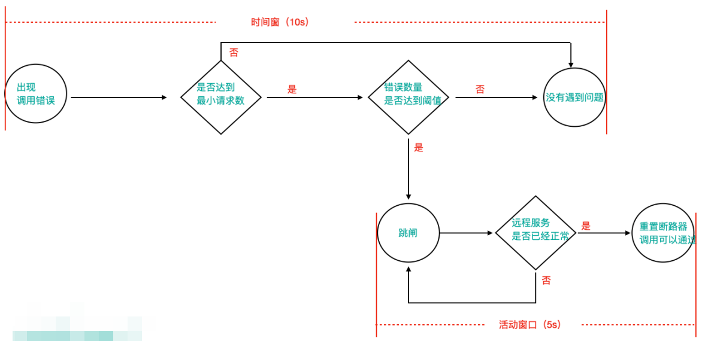

#### （1）跳闸后自我修复步骤

```
步骤1：当调⽤出现问题时，开启⼀个时间窗（10s）

步骤2：在这个时间窗内，统计调⽤次数是否达到最⼩请求数？
- 如果没有达到，则重置统计信息，回到第1步
- 如果达到了，则统计失败的请求数占所有请求数的百分⽐，是否达到阈值？
- 如果达到，则跳闸（不再请求对应服务）
- 如果没有达到，则重置统计信息，回到第1步

步骤3：
- 如果跳闸，则会开启⼀个活动窗⼝（默认5s）
- 每隔5s，Hystrix会让⼀个请求通过,到达那个问题服务，看是否调⽤成功
- 如果成功，重置断路器回到第1步
- 如果失败，回到第3步
```

#### （2）代码使用

- 注解式作用范围：在某一方法上
- 配置式作用范围：全局
- 当注解式 和 配置式 同时使用，注解式配置优先生效

##### 方式1：注解式

```java
@HystrixCommand(
        // 线程池标识，要保持唯一，不唯一的话就共用了
        threadPoolKey = "findResumeOpenState7",

        // 线程池细节属性配置
        threadPoolProperties = {
                @HystrixProperty(name = "coreSize", value = "2"), // 线程数
                @HystrixProperty(name = "maxQueueSize", value = "20") // 等待队列长度
        },

        // 熔断的一些细节属性配置
        commandProperties = {
                // 每一个属性都是一个 HystrixProperty
                @HystrixProperty(name = "execution.isolation.thread.timeoutInMilliseconds", value = "2000"),

                // Hystrix 熔断策略（高级配置，定制工作过程细节）
                // 8秒钟内，请求次数达到2个，并且失败率在50%以上，就跳闸，跳闸后活动窗⼝设置为3s
                // 统计时间窗口定义
                @HystrixProperty(name = "metrics.rollingStats.timeInMilliseconds", value = "8000"),
                // 统计时间窗口内的最小请求数
                @HystrixProperty(name = "circuitBreaker.requestVolumeThreshold", value = "2"),
                // 统计时间窗口内的错误数量百分比阈值
                @HystrixProperty(name = "circuitBreaker.errorThresholdPercentage", value = "50"),
                // 自我修复时的活动窗口长度
                @HystrixProperty(name = "circuitBreaker.sleepWindowInMilliseconds", value = "3000")
        },
        fallbackMethod = "myFallBack"  // 回退方法
)
@GetMapping("/checkState7/{userId}")
public Integer findResumeOpenState7(@PathVariable Long userId) {
    // 指定服务名
    String url = "http://resume-service-resume/resume/openstate/" + userId;
    Integer forObject = restTemplate.getForObject(url, Integer.class);
    return forObject;
}
```


##### 方式2：配置式（application.yml）

```yaml
# 配置熔断策略
hystrix:
 command:
 default:
 circuitBreaker:
 # 强制打开熔断器，如果该属性设置为true，强制断路器进⼊打开状态，将会拒绝所有的请求。 默认false关闭的
 forceOpen: false
 # 触发熔断错误比例阈值，默认值50%
 errorThresholdPercentage: 50
 # 熔断后休眠时长，默认值5秒
 sleepWindowInMilliseconds: 3000 
 # 熔断触发最小请求次数，默认值是20
 requestVolumeThreshold: 2 
 execution:
 isolation:
 thread:
 # 熔断超时设置，默认为1秒
 timeoutInMilliseconds: 2000
```


#### （3）查看跳闸状态变化

- 配合 SpringBoot 监控检查接口（http://localhost:8081/actuator/health）

```yaml
# springboot 中暴露健康检查等断点接口
management:
  endpoints:
    web:
      exposure:
        include: "*"
  # 暴露健康接口的细节
  endpoint:
    health:
      show-details: always
```

- 状态变化

```json
// 未跳闸
"hystrix": {
  "status": "UP"
}

// 跳闸
"hystrix": {
  "status": "CIRCUIT_OPEN",
  "details": {
    "openCircuitBreakers": [
      "AutodeliverController::findResumeOpenState7"
    ]
  }
}

// 自我修复后
"hystrix": {
  "status": "UP"
}
```


## 4、Hystrix 监控

### 4.1 Hystrix Dashboard（断路监控仪表盘）

#### （1）简介

- Hystrix Dashboard 仪表板可以显示每个断路器（被 @HystrixCommand 注解的⽅法）的状态

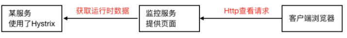

#### （2）使用

##### 步骤1：导入依赖

- 父工程引入 SpringBoot的 actuator（健康监控）

```xml
<dependency>
 <groupId>org.springframework.boot</groupId>
 <artifactId>spring-boot-starter-actuator</artifactId>
</dependency>
```

- 子工程 Dashboard

```xml
<dependencies>
    <!-- hystrix -->
    <dependency>
        <groupId>org.springframework.cloud</groupId>
        <artifactId>spring-cloud-starter-netflix-hystrix</artifactId>
    </dependency>

    <!-- hystrix 仪表盘 -->
    <dependency>
        <groupId>org.springframework.cloud</groupId>
        <artifactId>spring-cloud-starter-netflix-hystrix-dashboard</artifactId>
    </dependency>

    <!-- eureka-client -->
    <dependency>
        <groupId>org.springframework.cloud</groupId>
        <artifactId>spring-cloud-starter-netflix-eureka-client</artifactId>
    </dependency>
</dependencies>
```


##### 步骤2：启动类添加 @EnableHystrixDashboard 激活仪表盘 

```java
@SpringBootApplication
@EnableDiscoveryClient
// 开启 hystrix dashboard
@EnableHystrixDashboard
public class HystrixDashboard9000 {
    public static void main(String[] args) {
        SpringApplication.run(HystrixDashboard9000.class, args);
    }
}
```


##### 步骤3：yml 配置

```yaml
server:
  port: 9000

Spring:
  application:
    name: cloud-hystrix-dashboard

# 将服务提供者注册到 Eureka 服务中心
eureka:
  client:
    service-url:
      # 注册到单实例（非集群模式），就写一个就可以
      # 注册到集群，把多个 Eureka server 地址使用逗号连接起来即可
      defaultZone: http://CloudEurekaServerA:8761/eureka,http://CloudEurekaServerB:8762/eureka
  instance:
    # 服务实例中显示 ip，而不是显示主机名（为了兼容老的 eureka 版本）
    prefer-ip-address: true
    # 自定义实例显示格式（加上版本号，便于多版本管理）
    instance-id: ${spring.cloud.client.ip-address}:${spring.application.name}:${server.port}:@project.version@
```


##### 步骤4：在被监测的微服务启动类中注册监控 servlet

- 前提：被监控的微服务需要引入 springboo t的 actuator 功能

```java
@Bean
public ServletRegistrationBean getServlet() {
  HystrixMetricsStreamServlet streamServlet = new HystrixMetricsStreamServlet();
  ServletRegistrationBean registrationBean = new ServletRegistrationBean(streamServlet);
  registrationBean.setLoadOnStartup(1);
  registrationBean.addUrlMappings("/actuator/hystrix.stream");
  registrationBean.setName("HystrixMetricsStreamServlet");
  return registrationBean;
}
```


##### 步骤5：访问

- 直接访问监控 servlet：http://localhost:8090/actuator/hystrix.stream
- 访问 Hystrix Dashboard（断路监控仪表盘）：http://localhost:9000/hystrix

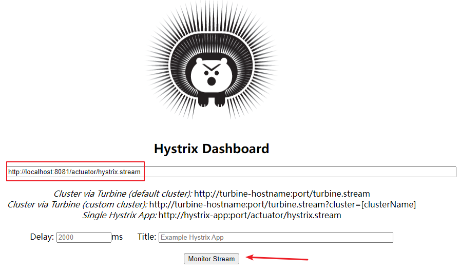

##### 步骤6：界面

- 百分比，表示 10s 内错误请求百分比

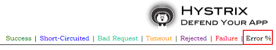


- 实⼼圆⼤⼩：代表请求流量的⼤⼩，流量越⼤球越⼤
- 实⼼圆颜⾊：代表请求处理的健康状态，从绿⾊到红⾊递减，绿⾊代表健康，红⾊就代表很不健康
- 曲线波动图：记录了2分钟内该⽅法上流量的变化波动图，判断流量上升或者下降的趋势

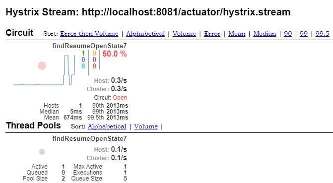


### 4.2 Hystrix Turbine（聚合监控）

#### （1）简介

- 使⽤ Hystrix Turbine 进⾏聚合监控，它可以把相关微服务的监控数据聚合在⼀起，便于查看

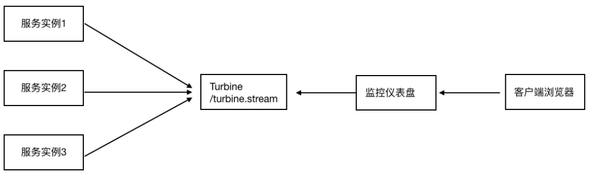


#### （2）使用

##### 步骤1：导入依赖

- 父工程引入 SpringBoot的 actuator（健康监控）

```xml
<dependency>
 <groupId>org.springframework.boot</groupId>
 <artifactId>spring-boot-starter-actuator</artifactId>
</dependency>
```

- 子工程 Dashboard

```xml
<dependencies>
  <!--hystrix turbine 聚合监控-->
  <dependency>
    <groupId>org.springframework.cloud</groupId>
    <artifactId>spring-cloud-starter-netflix-turbine</artifactId>
  </dependency>

  <!-- eureka client -->
  <dependency>
    <groupId>org.springframework.cloud</groupId>
    <artifactId>spring-cloud-starter-netflix-eureka-client</artifactId>
  </dependency>
</dependencies>
```


##### 步骤2：启动类添加 @EnableTurbine 开启聚合功能

```java
@SpringBootApplication
@EnableDiscoveryClient
@EnableTurbine  // 开启 Turbine 聚合功能
public class HystrixTurbineApplication9001 {
    public static void main(String[] args) {
        SpringApplication.run(HystrixTurbineApplication9001.class, args);
    }
}
```


##### 步骤3：yml 配置

```yaml
server:
  port: 9001

Spring:
  application:
    name: cloud-hystrix-turbine

# 将服务提供者注册到 Eureka 服务中心
eureka:
  client:
    service-url:
      # 注册到单实例（非集群模式），就写一个就可以
      # 注册到集群，把多个 Eureka server 地址使用逗号连接起来即可
      defaultZone: http://CloudEurekaServerA:8761/eureka,http://CloudEurekaServerB:8762/eureka
  instance:
    # 服务实例中显示 ip，而不是显示主机名（为了兼容老的 eureka 版本）
    prefer-ip-address: true
    # 自定义实例显示格式（加上版本号，便于多版本管理）
    instance-id: ${spring.cloud.client.ip-address}:${spring.application.name}:${server.port}:@project.version@

# Turbine 配置
turbine:
  # 配置需要聚合的服务名称，如果要聚合多个微服务的监控数据，那么可以使用英文逗号拼接，比如 a,b,c
  appConfig: resume-service-autodeliver
  # 集群默认名称
  clusterNameExpression: "'default'"
```


##### 步骤4：启动

- 按顺序启动下面8个服务

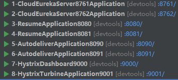


##### 步骤5：访问

- 直接访问 Turbine：http://localhost:9001/turbine.stream
- 访问 Hystrix Dashboard（断路监控仪表盘）：http://localhost:9000/hystrix

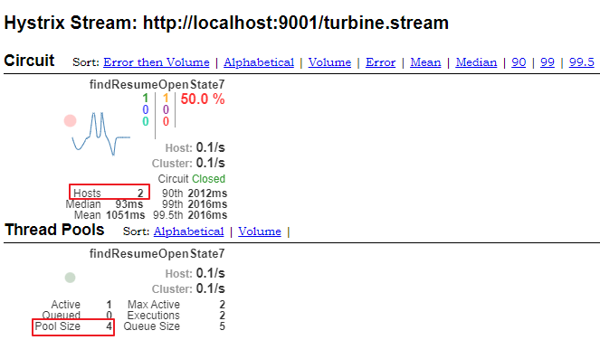


## 5、Hystrix 源码分析

### 5.1 入口：@EnableCircuitBreaker 注解

- EnableCircuitBreaker.java

```java
@Target(ElementType.TYPE)
@Retention(RetentionPolicy.RUNTIME)
@Documented
@Inherited
// 导入了一个 Selector
@Import(EnableCircuitBreakerImportSelector.class)
public @interface EnableCircuitBreaker {

}
```


### 5.2 EnableCircuitBreakerImportSelector.java

- EnableCircuitBreakerImportSelector.java

```java
@Order(Ordered.LOWEST_PRECEDENCE - 100)
// 父类 SpringFactoryImportSelector 的泛型传入注解类 EnableCircuitBreaker
public class EnableCircuitBreakerImportSelector extends SpringFactoryImportSelector<EnableCircuitBreaker> {
   // 获取断路器开关配置
   @Override
   protected boolean isEnabled() {
      return getEnvironment().getProperty("spring.cloud.circuit.breaker.enabled", Boolean.class, Boolean.TRUE);
   }
}
```


### 5.3 SpringFactoryImportSelector.java

- EnableCircuitBreakerImportSelector.java 的父类

```java
// 构造器
protected SpringFactoryImportSelector() {
   // 获取到子类传递到父类的泛型（即 EnableCircuitBreaker 注解类）
   this.annotationClass = (Class<T>) GenericTypeResolver.resolveTypeArgument(this.getClass(), SpringFactoryImportSelector.class);
}
```

- 关注 selectImports 方法

```java
@Override
public String[] selectImports(AnnotationMetadata metadata) {
   if (!isEnabled()) {
      return new String[0];
   }
  
   // 根据传进来的泛型全限定类名作为 key 去 spring.factories 文件查找对应的配置类，然后注入
   // 这里查到的结果是：org.springframework.cloud.netflix.hystrix.HystrixCircuitBreakerConfiguration
   AnnotationAttributes attributes = AnnotationAttributes.fromMap(metadata.getAnnotationAttributes(this.annotationClass.getName(), true));

   Assert.notNull(attributes, "No " + getSimpleName() + " attributes found. Is "+ metadata.getClassName() + " annotated with @" + getSimpleName() + "?");

   // Find all possible auto configuration classes, filtering duplicates
   List<String> factories = new ArrayList<>(new LinkedHashSet<>(SpringFactoriesLoader.loadFactoryNames(this.annotationClass, this.beanClassLoader)));

   if (factories.isEmpty() && !hasDefaultFactory()) {
      throw new IllegalStateException("Annotation @" + getSimpleName() + " found, but there are no implementations. Did you forget to include a starter?");
   }

   if (factories.size() > 1) {
      // there should only ever be one DiscoveryClient, but there might be more than
      // one factory
      log.warn("More than one implementation " + "of @" + getSimpleName() + " (now relying on @Conditionals to pick one): " + factories);
   }

   return factories.toArray(new String[factories.size()]);
}
```

- 查到的结果如下

```properties
org.springframework.cloud.client.circuitbreaker.EnableCircuitBreaker=\
org.springframework.cloud.netflix.hystrix.HystrixCircuitBreakerConfiguration
```

- 关注 org.springframework.cloud.netflix.hystrix.HystrixCircuitBreakerConfiguration.java

```java
@Configuration
public class HystrixCircuitBreakerConfiguration {
   // 注入了 HystrixCommandAspect 切面
   @Bean
   public HystrixCommandAspect hystrixCommandAspect() {
      return new HystrixCommandAspect();
   }
  
  .....   
}
```


### 5.4 HystrixCommandAspect.java

```java
// 切入点
@Pointcut("@annotation(com.netflix.hystrix.contrib.javanica.annotation.HystrixCommand)")
public void hystrixCommandAnnotationPointcut() {
}

// 切入点
@Pointcut("@annotation(com.netflix.hystrix.contrib.javanica.annotation.HystrixCollapser)")
public void hystrixCollapserAnnotationPointcut() {
}

// 环绕通知
@Around("hystrixCommandAnnotationPointcut() || hystrixCollapserAnnotationPointcut()")
public Object methodsAnnotatedWithHystrixCommand(final ProceedingJoinPoint joinPoint) throws Throwable {
    .....
}
```

- 关注 methodsAnnotatedWithHystrixCommand 方法，环绕通知

```java
static {
  META_HOLDER_FACTORY_MAP = ImmutableMap.<HystrixPointcutType, MetaHolderFactory>builder()
    .put(HystrixPointcutType.COMMAND, new CommandMetaHolderFactory())
    .put(HystrixPointcutType.COLLAPSER, new CollapserMetaHolderFactory())
    .build();
}

@Around("hystrixCommandAnnotationPointcut() || hystrixCollapserAnnotationPointcut()")
public Object methodsAnnotatedWithHystrixCommand(final ProceedingJoinPoint joinPoint) throws Throwable {
    // 获取原始目标方法
    Method method = getMethodFromTarget(joinPoint);
  
    Validate.notNull(method, "failed to get method from joinPoint: %s", joinPoint);
  
    if (method.isAnnotationPresent(HystrixCommand.class) && method.isAnnotationPresent(HystrixCollapser.class)) {
        throw new IllegalStateException("method cannot be annotated with HystrixCommand and HystrixCollapser " +"annotations at the same time");
    }
  
    MetaHolderFactory metaHolderFactory = META_HOLDER_FACTORY_MAP.get(HystrixPointcutType.of(method));
  
    // 获取封装元数据
    MetaHolder metaHolder = metaHolderFactory.create(joinPoint);
  
    // 创建可执行器 HystrixInvokable 对象，本质是 GenericCommand 对象
    HystrixInvokable invokable = HystrixCommandFactory.getInstance().create(metaHolder);
  
    // 获取执行方法（同步 或者 异步 或者 observable）
    ExecutionType executionType = metaHolder.isCollapserAnnotationPresent() ? metaHolder.getCollapserExecutionType() : metaHolder.getExecutionType();

    Object result;
    try {
        // 非 observable 类型
        if (!metaHolder.isObservable()) {
            result = CommandExecutor.execute(invokable, executionType, metaHolder);
        } else {
            result = executeObservable(invokable, executionType, metaHolder);
        }
    } catch (HystrixBadRequestException e) {
        throw e.getCause();
    } catch (HystrixRuntimeException e) {
        throw hystrixRuntimeExceptionToThrowable(metaHolder, e);
    }
    return result;
}
```


#### （1）关注 create 方法

- HystrixCommandFactory.getInstance().create(metaHolder)

- 跳转到 HystrixCommandFactory.java

```java
public HystrixInvokable create(MetaHolder metaHolder) {
    HystrixInvokable executable;
    if (metaHolder.isCollapserAnnotationPresent()) {
        executable = new CommandCollapser(metaHolder);
    } else if (metaHolder.isObservable()) {
        executable = new GenericObservableCommand(HystrixCommandBuilderFactory.getInstance().create(metaHolder));
    } else {
        // GenericCommand 中根据元数据信息重写了两个核心方法
        // ⼀个是run⽅法封装了对原始⽬标⽅法的调⽤，另外⼀个是getFallBack⽅法它封装了对回退⽅法的调⽤
        // 在 GenericCommand 的上层类构造函数中会完成资源的初始化
        // ⽐如线程池 GenericCommand —> AbstractHystrixCommand —> HystrixCommand -> AbstractCommand
        executable = new GenericCommand(HystrixCommandBuilderFactory.getInstance().create(metaHolder));
    }
    return executable;
}
```

- 关注 AbstractCommand.java

```java
protected AbstractCommand(HystrixCommandGroupKey group, HystrixCommandKey key, HystrixThreadPoolKey threadPoolKey, HystrixCircuitBreaker circuitBreaker, HystrixThreadPool threadPool,HystrixCommandProperties.Setter commandPropertiesDefaults, HystrixThreadPoolProperties.Setter threadPoolPropertiesDefaults, HystrixCommandMetrics metrics, TryableSemaphore fallbackSemaphore, TryableSemaphore executionSemaphore, HystrixPropertiesStrategy propertiesStrategy, HystrixCommandExecutionHook executionHook) {

    // 资源初始化
    this.commandGroup = initGroupKey(group);
    this.commandKey = initCommandKey(key, getClass());
    this.properties = initCommandProperties(this.commandKey, propertiesStrategy, commandPropertiesDefaults);
    this.threadPoolKey = initThreadPoolKey(threadPoolKey, this.commandGroup, this.properties.executionIsolationThreadPoolKeyOverride().get());
    this.metrics = initMetrics(metrics, this.commandGroup, this.threadPoolKey, this.commandKey, this.properties);
    this.circuitBreaker = initCircuitBreaker(this.properties.circuitBreakerEnabled().get(), circuitBreaker, this.commandGroup, this.commandKey, this.properties, this.metrics);
    // 线程池
    this.threadPool = initThreadPool(threadPool, this.threadPoolKey, threadPoolPropertiesDefaults);

    //Strategies from plugins
    this.eventNotifier = HystrixPlugins.getInstance().getEventNotifier();
    this.concurrencyStrategy = HystrixPlugins.getInstance().getConcurrencyStrategy();
    HystrixMetricsPublisherFactory.createOrRetrievePublisherForCommand(this.commandKey, this.commandGroup, this.metrics, this.circuitBreaker, this.properties);
    this.executionHook = initExecutionHook(executionHook);

    this.requestCache = HystrixRequestCache.getInstance(this.commandKey, this.concurrencyStrategy);
    this.currentRequestLog = initRequestLog(this.properties.requestLogEnabled().get(), this.concurrencyStrategy);

    /* fallback semaphore override if applicable */
    this.fallbackSemaphoreOverride = fallbackSemaphore;

    /* execution semaphore override if applicable */
    this.executionSemaphoreOverride = executionSemaphore;
}
```

- 关注  initThreadPool 方法

```java
private static HystrixThreadPool initThreadPool(HystrixThreadPool fromConstructor, HystrixThreadPoolKey threadPoolKey, HystrixThreadPoolProperties.Setter threadPoolPropertiesDefaults) {
    if (fromConstructor == null) {
        // get the default implementation of HystrixThreadPool
        return HystrixThreadPool.Factory.getInstance(threadPoolKey, threadPoolPropertiesDefaults);
    } else {
        return fromConstructor;
    }
}
```

- 关注 getInstance 方法
- 跳转到 HystrixThreadPool.java

```java
/* package */static HystrixThreadPool getInstance(HystrixThreadPoolKey threadPoolKey, HystrixThreadPoolProperties.Setter propertiesBuilder) {
    // get the key to use instead of using the object itself so that if people forget to implement equals/hashcode things will still work
    String key = threadPoolKey.name();

    // this should find it for all but the first time
    // threadPools 本质是 ConcurrentHashMap，使用了 ConcurrentHashMap 对线程池进行缓存
    HystrixThreadPool previouslyCached = threadPools.get(key);
    if (previouslyCached != null) {
        return previouslyCached;
    }

    // if we get here this is the first time so we need to initialize
    synchronized (HystrixThreadPool.class) {
        if (!threadPools.containsKey(key)) {
            // 缓存中没有，则创建
            threadPools.put(key, new HystrixThreadPoolDefault(threadPoolKey, propertiesBuilder));
        }
    }
    return threadPools.get(key);
}
```

- 关注 HystrixThreadPoolDefault

```java
public HystrixThreadPoolDefault(HystrixThreadPoolKey threadPoolKey, HystrixThreadPoolProperties.Setter propertiesDefaults) {
    this.properties = HystrixPropertiesFactory.getThreadPoolProperties(threadPoolKey, propertiesDefaults);
    HystrixConcurrencyStrategy concurrencyStrategy = HystrixPlugins.getInstance().getConcurrencyStrategy();
    this.queueSize = properties.maxQueueSize().get();

    this.metrics = HystrixThreadPoolMetrics.getInstance(threadPoolKey,concurrencyStrategy.getThreadPool(threadPoolKey, properties),properties);
  
    this.threadPool = this.metrics.getThreadPool();
    this.queue = this.threadPool.getQueue();

    /* strategy: HystrixMetricsPublisherThreadPool */
    HystrixMetricsPublisherFactory.createOrRetrievePublisherForThreadPool(threadPoolKey, this.metrics, this.properties);
}
```

- 关注 getThreadPool 方法
- 跳转到 HystrixConcurrencyStrategy.java

```java
public ThreadPoolExecutor getThreadPool(final HystrixThreadPoolKey threadPoolKey, HystrixThreadPoolProperties threadPoolProperties) {
    final ThreadFactory threadFactory = getThreadFactory(threadPoolKey);

    final boolean allowMaximumSizeToDivergeFromCoreSize = threadPoolProperties.getAllowMaximumSizeToDivergeFromCoreSize().get();
    final int dynamicCoreSize = threadPoolProperties.coreSize().get();
    final int keepAliveTime = threadPoolProperties.keepAliveTimeMinutes().get();
    final int maxQueueSize = threadPoolProperties.maxQueueSize().get();
    final BlockingQueue<Runnable> workQueue = getBlockingQueue(maxQueueSize);

    if (allowMaximumSizeToDivergeFromCoreSize) {
        final int dynamicMaximumSize = threadPoolProperties.maximumSize().get();
        if (dynamicCoreSize > dynamicMaximumSize) {
            logger.error("Hystrix ThreadPool configuration at startup for : " + threadPoolKey.name() + " is trying to set coreSize = " + dynamicCoreSize + " and maximumSize = " + dynamicMaximumSize + ".  Maximum size will be set to " +dynamicCoreSize + ", the coreSize value, since it must be equal to or greater than the coreSize value");
            
            // 最终是根据属性创建了 ThreadPoolExecutor
            return new ThreadPoolExecutor(dynamicCoreSize, dynamicCoreSize, keepAliveTime, TimeUnit.MINUTES, workQueue, threadFactory);
        } else {
            return new ThreadPoolExecutor(dynamicCoreSize, dynamicMaximumSize, keepAliveTime, TimeUnit.MINUTES, workQueue, threadFactory);
        }
    } else {
        return new ThreadPoolExecutor(dynamicCoreSize, dynamicCoreSize, keepAliveTime, TimeUnit.MINUTES, workQueue, threadFactory);
    }
}
```


#### （2）关注 execute 方法

- 跳转到 CommandExecutor.java

```java
public static Object execute(HystrixInvokable invokable, ExecutionType executionType, MetaHolder metaHolder) throws RuntimeException {
    Validate.notNull(invokable);
    Validate.notNull(metaHolder);

    switch (executionType) {
        // 同步的执行类型
        case SYNCHRONOUS: {
            return castToExecutable(invokable, executionType).execute();
        }
        
        case ASYNCHRONOUS: {
            HystrixExecutable executable = castToExecutable(invokable, executionType);
            if (metaHolder.hasFallbackMethodCommand()
                    && ExecutionType.ASYNCHRONOUS == metaHolder.getFallbackExecutionType()) {
                return new FutureDecorator(executable.queue());
            }
            return executable.queue();
        }
        
        case OBSERVABLE: {
            HystrixObservable observable = castToObservable(invokable);
            return ObservableExecutionMode.EAGER == metaHolder.getObservableExecutionMode() ? observable.observe() : observable.toObservable();
        }
        
        default:
            throw new RuntimeException("unsupported execution type: " + executionType);
    }
}
```

- 关注 execute 方法
- 跳转到 HystrixExecutable.java

```java
public R execute();
```

- 跳转到实现类 HystrixCommand.java

```java
public R execute() {
    try {
        // queue 方法会返回 Feture 对象（封装异步处理的结果）
        return queue().get();
    } catch (Exception e) {
        throw Exceptions.sneakyThrow(decomposeException(e));
    }
}
```

- 关注 queue() 方法

```java
public Future<R> queue() {
    // Future 的获取，业务逻辑执行，异常后对回退方法的调用等，都使用了 RxJava 响应式编程
    final Future<R> delegate = toObservable().toBlocking().toFuture();
   
    final Future<R> f = new Future<R>() {
      .....
    }
}
```


# 第四章 远程调用组件 - Feign

## 1、Feign 简介

- Feign 是 Netflix 开发的⼀个轻量级 RESTful 的 HTTP 服务客户端（⽤它来发起请求，远程调⽤的）
- Feign 是以 Java 接⼝注解的⽅式调⽤ Http 请求，⽽不⽤像Java中通过封装 HTTP 请求报⽂的⽅式直接调⽤
- 本质：封装了Http调⽤流程，更符合⾯向接⼝化的编程习惯，类似于Dubbo的服务调⽤


## 2、Feign 使用

- （效果）Feign = RestTemplate + Ribbon + Hystrix


### 步骤1：引入 Feign 依赖 

```xml
<!-- Feign 依赖 -->
<dependency>
    <groupId>org.springframework.cloud</groupId>
    <artifactId>spring-cloud-starter-openfeign</artifactId>
</dependency>
```


### 步骤2：application.yml

```yaml
server:
  port: 8092

spring:
  application:
    name: resume-service-autodeliver

# springboot 中暴露健康检查等断点接口
management:
  endpoints:
    web:
      exposure:
        include: "*"
  # 暴露健康接口的细节
  endpoint:
    health:
      show-details: always

# 将服务提供者注册到 Eureka 服务中心
eureka:
  client:
    service-url:
      # 注册到单实例（非集群模式），就写一个就可以
      # 注册到集群，把多个 Eureka server 地址使用逗号连接起来即可
      defaultZone: http://CloudEurekaServerA:8761/eureka,http://CloudEurekaServerB:8762/eureka
  instance:
    # 服务实例中显示 ip，而不是显示主机名（为了兼容老的 eureka 版本）
    prefer-ip-address: true
    # 自定义实例显示格式（加上版本号，便于多版本管理）
    instance-id: ${spring.cloud.client.ip-address}:${spring.application.name}:${server.port}:@project.version@

# 针对的被调用方微服务名称 resume-service-resume（不加 33 行这个服务名称，就是全局生效）
resume-service-resume:
  ribbon:
    # 负载策略调整：使用轮询
    NFLoadBalancerRuleClassName: com.netflix.loadbalancer.RoundRobinRule
```


### 步骤3：启动类添加 @EnableFeignClients

- 此时去掉 Hystrix 熔断的⽀持注解 @EnableCircuitBreaker ，包括引⼊的依赖，因为 Feign 会⾃动引⼊

```java
@SpringBootApplication
@EnableDiscoveryClient
@EnableFeignClients  // 开启 Feign 客户端功能
public class AutodeliverApplication8092 {
    public static void main(String[] args) {
        SpringApplication.run(AutodeliverApplication8092.class, args);
    }
}
```


### 步骤4：创建 Feign 接口（ResumeServiceFeignClient）

```java
// @FeignClient：表明当前类是一个 Feign 客户端
// value：指定该客户端要请求的服务名称（登记到注册中心上的服务提供者的服务名称）
// fallback：回退实现类
// path：当使用 fallback 时，无法使用 @RequestMapping("/resume")，而需要使用 path
@FeignClient(value = "resume-service-resume", fallback = ResumeFallback.class, path = "/resume")
public interface ResumeServiceFeignClient {
    // Feign 作用：拼装 url，发起请求
    // 调用该方法就是调用本地接口方法，实际上做的是远程请求
    @GetMapping("/openstate/{userId}")
    public Integer findDefaultResumeState(@PathVariable("userId") Long userId);
}
```


### 步骤5：降级回退逻辑，实现 FeignClient 接口，实现接口中的方法

- 针对超时这⼀点，当前有两个超时时间设置（Feign/hystrix）
- 熔断的时候是根据这两个时间的最⼩值来进⾏的，即处理时⻓超过最短的那个超时时间，就熔断进⼊回退降级逻辑

```java
@Component
public class ResumeFallback implements ResumeServiceFeignClient {
    @Override
    public Integer findDefaultResumeState(Long userId) {
        return -1;
    }
}
```


### 步骤6：在接口方法中完成远程调用（AutodeliverController）

```java
@RestController
@RequestMapping("/autodeliver")
public class AutodeliverController {
    @Autowired
    private ResumeServiceFeignClient resumeServiceFeignClient;

    //http://localhost:8092/autodeliver/checkState/1545132
    @GetMapping("/checkState/{userId}")
    public Integer findResumeOpenState(@PathVariable Long userId) {
        Integer defaultResumeState = resumeServiceFeignClient.findDefaultResumeState(userId);
        return defaultResumeState;
    }
}
```


## 3、Feign 对负载均衡 Ribbon 的支持

- Feign 本身已经集成了 Ribbon 依赖和⾃动配置，因此不需要额外引⼊依赖
- 可以通过 ribbon.xx 来进 ⾏全局配置，也可以通过服务名.ribbon.xx 来对指定服务进⾏细节配置配置
- Feign默认的请求处理超时时⻓1s，有时候业务确实执⾏的需要⼀定时间，那么这个时候，就需要调整请求处理超时时⻓，Feign⾃⼰有超时设置，如果配置Ribbon的超时，则会以Ribbon的为准

```yaml
# 针对的被调用方微服务名称 resume-service-resume（不加这个服务名称，就是全局生效）
resume-service-resume:
  ribbon:
    # 负载策略调整：使用轮询
    NFLoadBalancerRuleClassName: com.netflix.loadbalancer.RoundRobinRule
    ###############################  以下是 Feign 对负载均衡 Ribbon 的支持 ###############################
    # 请求连接超时时间
    ConnectTimeout: 2000
    # 请求处理超时时间（Feign 超时时长设置）
    ReadTimeout: 5000
    # 对所有操作都进行重试
    OkToRetryOnAllOperations: true
    #### 根据如上配置，当访问到故障请求的时候，它会再尝试访问一次当前实例（次数由 MaxAutoRetries 配置）
    #### 如果不行，就换一个实例进行访问，如果还不行，再换一次实例访问（更换次数由 MaxAutoRetriesNextServer 配置）
    #### 如果依然不行，返回失败信息
    MaxAutoRetries: 0             # 对当前选中实例重试次数，不包括第一次调用
    MaxAutoRetriesNextServer: 0   # 切换实例的重试次数
```


## 4、Feign 对熔断器 Hystrix 的支持

```yaml
# Feign 对熔断器 Hystrix 的支持
feign:
  hystrix:
    # 开启 Feign 的熔断功能
    enabled: true

hystrix:
  command:
    default:
      execution:
        isolation:
          thread:
            # Hystrix 超时时长设置
            timeoutInMilliseconds: 15000
```


## 5、Feign 对请求压缩和响应压缩的支持

- Feign ⽀持对请求和响应进⾏GZIP压缩，以减少通信过程中的性能损耗。

```yaml
# Feign 对请求压缩和响应压缩的支持
feign:
  compression:
    request:
      # 开启请求压缩
      enabled: true
      # 设置压缩的数据类型，此处也是默认值
      mime-types: text/html,application/xml,application/json
      # 设置触发压缩的大小下限，此处也是默认值
      min-request-size: 2048
    response:
      # 开启响应压缩
      enabled: true
```


## 6、Feign 日志级别配置

### 步骤1：开启 Feign 日志功能及级别

- FeignLog.java

```java
@Configuration
public class FeignLog {
    @Bean
    Logger.Level feignLevel() {
        // Feign ⽇志级别
        // NONE：默认的，不显示任何⽇志（性能最好）
        // BASIC：仅记录请求⽅法、URL、响应状态码以及执⾏时间（⽣产问题追踪）
        // HEADERS：在BASIC级别的基础上，记录请求和响应的header
        // FULL：记录请求和响应的header、body和元数据（适⽤于开发及测试环境定位问题）
        return Logger.Level.FULL;
    }
}
```


### 步骤2：配置 logging 日志级别为 debug

- application.yml

```yaml
# Feign 日志级别配置
logging:
  level:
    # Feign 日志只会对日志级别为 debug 的做出响应
    com.lagou.edu.controller.service.ResumeServiceFeignClient: debug
```


## 7、Feign 源码分析

### 7.1 @EnableFeignClients

```java
@Retention(RetentionPolicy.RUNTIME)
@Target(ElementType.TYPE)
@Documented
@Import(FeignClientsRegistrar.class)
public @interface EnableFeignClients {
	.....
}
```


### 7.2 FeignClientsRegistrar.java

```java
// 实现 ImportBeanDefinitionRegistrar 接口，重写 registerBeanDefinitions 方法，完成一些 bean 的注入
class FeignClientsRegistrar implements ImportBeanDefinitionRegistrar,ResourceLoaderAware, EnvironmentAware {
 	 .....

   @Override
   public void registerBeanDefinitions(AnnotationMetadata metadata,BeanDefinitionRegistry registry) {
      // 把 FeignClient 的全局默认配置注入到容器
      registerDefaultConfiguration(metadata, registry);
     
      // 把标记了 @FeignClient 的类，创建对象，并注入到容器（针对添加了 @FeignClient 注解的接口操作）
      registerFeignClients(metadata, registry);
   }
   
   ....
}
```


#### （1）registerDefaultConfiguration 方法

- 把 @EnableFeignClients 中的 defaultConfiguration 属性中配置的 class 类型注入到容器

```java
private void registerDefaultConfiguration(AnnotationMetadata metadata,BeanDefinitionRegistry registry) {
   Map<String, Object> defaultAttrs = metadata.getAnnotationAttributes(EnableFeignClients.class.getName(), true);

   if (defaultAttrs != null && defaultAttrs.containsKey("defaultConfiguration")) {
      String name;
      if (metadata.hasEnclosingClass()) {
         name = "default." + metadata.getEnclosingClassName();
      }else {
         name = "default." + metadata.getClassName();
      }
     
      registerClientConfiguration(registry, name,defaultAttrs.get("defaultConfiguration"));
   }
}
```

- registerClientConfiguration 方法

```java
private void registerClientConfiguration(BeanDefinitionRegistry registry, Object name,Object configuration) {
   BeanDefinitionBuilder builder = BeanDefinitionBuilder.genericBeanDefinition(FeignClientSpecification.class);
   builder.addConstructorArgValue(name);
   builder.addConstructorArgValue(configuration);
   registry.registerBeanDefinition(name + "." + FeignClientSpecification.class.getSimpleName(),builder.getBeanDefinition());
}
```


#### （2）registerFeignClients 方法

```java
public void registerFeignClients(AnnotationMetadata metadata,BeanDefinitionRegistry registry) {
   ClassPathScanningCandidateComponentProvider scanner = getScanner();
  
   // 定义扫描器，主要是想扫描 @FeignClient 注解
   scanner.setResourceLoader(this.resourceLoader);

   Set<String> basePackages;

   Map<String, Object> attrs = metadata.getAnnotationAttributes(EnableFeignClients.class.getName());
   AnnotationTypeFilter annotationTypeFilter = new AnnotationTypeFilter(FeignClient.class);
   final Class<?>[] clients = attrs == null ? null: (Class<?>[]) attrs.get("clients");
   
  if (clients == null || clients.length == 0) {
      scanner.addIncludeFilter(annotationTypeFilter);
      basePackages = getBasePackages(metadata);
   }else {
      final Set<String> clientClasses = new HashSet<>();
      basePackages = new HashSet<>();
    
      for (Class<?> clazz : clients) {
         basePackages.add(ClassUtils.getPackageName(clazz));
         clientClasses.add(clazz.getCanonicalName());
      }
    
      AbstractClassTestingTypeFilter filter = new AbstractClassTestingTypeFilter() {
         @Override
         protected boolean match(ClassMetadata metadata) {
            String cleaned = metadata.getClassName().replaceAll("\\$", ".");
            return clientClasses.contains(cleaned);
         }
      };
      scanner.addIncludeFilter(new AllTypeFilter(Arrays.asList(filter, annotationTypeFilter)));
   }

   // 使用扫描器扫描 @FeignClient 注解标识的类
   // 在 basePackage 指定的目录中扫描，如果不指定的话，按照 SpringBoot 规则扫描
   for (String basePackage : basePackages) {
      Set<BeanDefinition> candidateComponents = scanner.findCandidateComponents(basePackage);
      for (BeanDefinition candidateComponent : candidateComponents) {
         if (candidateComponent instanceof AnnotatedBeanDefinition) {
            // verify annotated class is an interface
            AnnotatedBeanDefinition beanDefinition = (AnnotatedBeanDefinition) candidateComponent;
            AnnotationMetadata annotationMetadata = beanDefinition.getMetadata();
            Assert.isTrue(annotationMetadata.isInterface(),"@FeignClient can only be specified on an interface");

            Map<String, Object> attributes = annotationMetadata.getAnnotationAttributes(FeignClient.class.getCanonicalName());

            String name = getClientName(attributes);
           
            // 取出 @FeignClient 注解中的一个配置属性 configuration，取出来注入到容器
            registerClientConfiguration(registry, name,attributes.get("configuration"));
           
            // 注入 FeignClient 客户端对象，这个对象也是 controller 中使用的对象
            registerFeignClient(registry, annotationMetadata, attributes);
         }
      }
   }
}
```

- registerFeignClient 方法

```java
// 封装 BeanDefinition 对象（根据 @FeignClient 注解中的属性配置）
private void registerFeignClient(BeanDefinitionRegistry registry,AnnotationMetadata annotationMetadata, Map<String, Object> attributes) {
  
   String className = annotationMetadata.getClassName();
   
   // 客户端对象是 FeignClientFactoryBean，是一个 FactoryBean
   // 使用的时候，从容器中获取到的对象是 FactoryBean.getObject 返回的对象，该对象就是对应接口的代理对象
   BeanDefinitionBuilder definition = BeanDefinitionBuilder.genericBeanDefinition(FeignClientFactoryBean.class);
   
   validate(attributes);
  
   definition.addPropertyValue("url", getUrl(attributes));
   definition.addPropertyValue("path", getPath(attributes));
  
   String name = getName(attributes);
   definition.addPropertyValue("name", name);
  
   String contextId = getContextId(attributes);
   definition.addPropertyValue("contextId", contextId);
  
   definition.addPropertyValue("type", className);
   definition.addPropertyValue("decode404", attributes.get("decode404"));
   definition.addPropertyValue("fallback", attributes.get("fallback"));
   definition.addPropertyValue("fallbackFactory", attributes.get("fallbackFactory"));
   definition.setAutowireMode(AbstractBeanDefinition.AUTOWIRE_BY_TYPE);

   String alias = contextId + "FeignClient";
   AbstractBeanDefinition beanDefinition = definition.getBeanDefinition();

   boolean primary = (Boolean)attributes.get("primary"); // has a default, won't be null

   beanDefinition.setPrimary(primary);

   String qualifier = getQualifier(attributes);
   if (StringUtils.hasText(qualifier)) {
      alias = qualifier;
   }

   BeanDefinitionHolder holder = new BeanDefinitionHolder(beanDefinition, className,new String[] { alias });
   BeanDefinitionReaderUtils.registerBeanDefinition(holder, registry);
}
```

- 关注 FeignClientFactoryBean 这个⼯⼚ Bean 的 getObject ⽅法、
- 跳转到 FeignClientFactoryBean.java

```java
@Override
public Object getObject() throws Exception {
   return getTarget();
}
```

- 关注 getTarget() 方法

```java
<T> T getTarget() {
   FeignContext context = applicationContext.getBean(FeignContext.class);
   Feign.Builder builder = feign(context);

   if (!StringUtils.hasText(this.url)) {
      if (!this.name.startsWith("http")) {
         url = "http://" + this.name;
      }else {
         url = this.name;
      }
     
      url += cleanPath();
      return (T) loadBalance(builder, context, new HardCodedTarget<>(this.type,this.name, url));
   }
  
   // 判断 @FeignClient 注解的 url 属性是否为空
   // url 为空的话，生成的 FeignClient 客户端对象就应该是一个带有负载均衡功能的客户端对象 feign + ribbon
   if (StringUtils.hasText(this.url) && !this.url.startsWith("http")) {
      this.url = "http://" + this.url;
   }
  
   String url = this.url + cleanPath();
   Client client = getOptional(context, Client.class);
   if (client != null) {
      if (client instanceof LoadBalancerFeignClient) {
         // not load balancing because we have a url,
         // but ribbon is on the classpath, so unwrap
         client = ((LoadBalancerFeignClient)client).getDelegate();
      }
      builder.client(client);
   }
  
   Targeter targeter = get(context, Targeter.class);
   return (T) targeter.target(this, builder, context, new HardCodedTarget<>(this.type, this.name, url));
}
```

- 关注 loadBalance 方法

```java
protected <T> T loadBalance(Feign.Builder builder, FeignContext context,HardCodedTarget<T> target) {
   // 使用 build 构造器包装 client
   Client client = getOptional(context, Client.class);
  
   if (client != null) {
      builder.client(client);
      Targeter targeter = get(context, Targeter.class);
      return targeter.target(this, builder, context, target);
   }

   throw new IllegalStateException("No Feign Client for loadBalancing defined. Did you forget to include spring-cloud-starter-netflix-ribbon?");
}
```

- 关注 target 方法
- 跳转到实现类 HystrixTargeter.java

```java
@Override
public <T> T target(FeignClientFactoryBean factory, Feign.Builder feign, FeignContext context,Target.HardCodedTarget<T> target) {
  
   if (!(feign instanceof feign.hystrix.HystrixFeign.Builder)) {
      return feign.target(target);
   }
  
   feign.hystrix.HystrixFeign.Builder builder = (feign.hystrix.HystrixFeign.Builder) feign;
   SetterFactory setterFactory = getOptional(factory.getName(), context,SetterFactory.class);
  
   if (setterFactory != null) {
      builder.setterFactory(setterFactory);
   }
  
   Class<?> fallback = factory.getFallback();
   if (fallback != void.class) {
      return targetWithFallback(factory.getName(), context, target, builder, fallback);
   }
  
   Class<?> fallbackFactory = factory.getFallbackFactory();
   if (fallbackFactory != void.class) {
      return targetWithFallbackFactory(factory.getName(), context, target, builder, fallbackFactory);
   }

   return feign.target(target);
}
```

- 关注 feign.target(target) 方法
- 跳转到 Feign.java

```java
public <T> T target(Target<T> target) {
  return build().newInstance(target);
}
```

- 关注 newInstance 方法
- 跳转到实现类 ReflectiveFeign.java

```java
@Override
public <T> T newInstance(Target<T> target) {
  Map<String, MethodHandler> nameToHandler = targetToHandlersByName.apply(target);
  Map<Method, MethodHandler> methodToHandler = new LinkedHashMap<Method, MethodHandler>();
  List<DefaultMethodHandler> defaultMethodHandlers = new LinkedList<DefaultMethodHandler>();

  for (Method method : target.type().getMethods()) {
    if (method.getDeclaringClass() == Object.class) {
      continue;
    } else if (Util.isDefault(method)) {
      DefaultMethodHandler handler = new DefaultMethodHandler(method);
      defaultMethodHandlers.add(handler);
      methodToHandler.put(method, handler);
    } else {
      methodToHandler.put(method, nameToHandler.get(Feign.configKey(target.type(), method)));
    }
  }
  
  InvocationHandler handler = factory.create(target, methodToHandler);
  
  // newProxyInstance 使用动态代理生成对象（通过debug得知，增强逻辑在 FeignInvocationHandler）
  T proxy = (T) Proxy.newProxyInstance(target.type().getClassLoader(),new Class<?>[] {target.type()}, handler);

  for (DefaultMethodHandler defaultMethodHandler : defaultMethodHandlers) {
    defaultMethodHandler.bindTo(proxy);
  }
  return proxy;
}
```


### 7.3 ReflectiveFeign.java（FeignInvocationHandler）

```java
static class FeignInvocationHandler implements InvocationHandler {
  private final Target target;
  private final Map<Method, MethodHandler> dispatch;

  FeignInvocationHandler(Target target, Map<Method, MethodHandler> dispatch) {
    this.target = checkNotNull(target, "target");
    this.dispatch = checkNotNull(dispatch, "dispatch for %s", target);
  }

  @Override
  public Object invoke(Object proxy, Method method, Object[] args) throws Throwable {
    if ("equals".equals(method.getName())) {
      try {
        Object otherHandler =args.length > 0 && args[0] != null ? Proxy.getInvocationHandler(args[0]) : null;
        return equals(otherHandler);
      } catch (IllegalArgumentException e) {
        return false;
      }
    } else if ("hashCode".equals(method.getName())) {
      return hashCode();
    } else if ("toString".equals(method.getName())) {
      return toString();
    }
    // 具体的方法增强逻辑又交给了对应的 SynchronousMethodHandler 来处理
    // 由返回的 value 类型可知是 SynchronousMethodHandler（debug模式可以看到）
    return dispatch.get(method).invoke(args);
  }

  @Override
  public boolean equals(Object obj) {
    if (obj instanceof FeignInvocationHandler) {
      FeignInvocationHandler other = (FeignInvocationHandler) obj;
      return target.equals(other.target);
    }
    return false;
  }

  @Override
  public int hashCode() {
    return target.hashCode();
  }

  @Override
  public String toString() {
    return target.toString();
  }
}
```


### 7.4 SynchronousMethodHandler.java

```java
@Override
public Object invoke(Object[] argv) throws Throwable {
  RequestTemplate template = buildTemplateFromArgs.create(argv);
  Retryer retryer = this.retryer.clone();
  
  while (true) {
    try {
      // 执行后续逻辑请求
      return executeAndDecode(template);
    } catch (RetryableException e) {
      try {
        retryer.continueOrPropagate(e);
      } catch (RetryableException th) {
        Throwable cause = th.getCause();
        
        if (propagationPolicy == UNWRAP && cause != null) {
          throw cause;
        } else {
          throw th;
        }
      }
      
      if (logLevel != Logger.Level.NONE) {
        logger.logRetry(metadata.configKey(), logLevel);
      }
      
      continue;
    }
  }
}
```

- 追踪 executeAndDecode 方法

```java
Object executeAndDecode(RequestTemplate template) throws Throwable {
  Request request = targetRequest(template);

  if (logLevel != Logger.Level.NONE) {
    logger.logRequest(metadata.configKey(), logLevel, request);
  }

  Response response;
  long start = System.nanoTime();
  try {
    // 执行 
    response = client.execute(request, options);
  } catch (IOException e) {
    if (logLevel != Logger.Level.NONE) {
      logger.logIOException(metadata.configKey(), logLevel, e, elapsedTime(start));
    }
    throw errorExecuting(request, e);
  }
  
  long elapsedTime = TimeUnit.NANOSECONDS.toMillis(System.nanoTime() - start);

  boolean shouldClose = true;
  try {
    if (logLevel != Logger.Level.NONE) {
      response = logger.logAndRebufferResponse(metadata.configKey(), logLevel, response, elapsedTime);
    }
    if (Response.class == metadata.returnType()) {
      if (response.body() == null) {
        return response;
      }
      
      if (response.body().length() == null || response.body().length() > MAX_RESPONSE_BUFFER_SIZE) {
        shouldClose = false;
        return response;
      }
      
      // Ensure the response body is disconnected
      byte[] bodyData = Util.toByteArray(response.body().asInputStream());
      return response.toBuilder().body(bodyData).build();
    }
    
    if (response.status() >= 200 && response.status() < 300) {
      if (void.class == metadata.returnType()) {
        return null;
      } else {
        Object result = decode(response);
        shouldClose = closeAfterDecode;
        return result;
      }
    } else if (decode404 && response.status() == 404 && void.class != metadata.returnType()) {
      Object result = decode(response);
      shouldClose = closeAfterDecode;
      return result;
    } else {
      throw errorDecoder.decode(metadata.configKey(), response);
    }
  } catch (IOException e) {
    if (logLevel != Logger.Level.NONE) {
      logger.logIOException(metadata.configKey(), logLevel, e, elapsedTime);
    }
    throw errorReading(request, response, e);
  } finally {
    if (shouldClose) {
      ensureClosed(response.body());
    }
  }
}
```

- 追踪 execute 方法
- 跳转到 LoadBalancerFeignClient.java

```java
@Override
public Response execute(Request request, Request.Options options) throws IOException {
   try {
      URI asUri = URI.create(request.url());
      String clientName = asUri.getHost();
      URI uriWithoutHost = cleanUrl(request.url(), clientName);
      // 构建 ribbon 请求对象
      FeignLoadBalancer.RibbonRequest ribbonRequest = new FeignLoadBalancer.RibbonRequest(this.delegate, request, uriWithoutHost);

      IClientConfig requestConfig = getClientConfig(options, clientName);
     
      // 后续处理，包括负载均衡等 
      return lbClient(clientName).executeWithLoadBalancer(ribbonRequest,requestConfig).toResponse();
   }catch (ClientException e) {
      IOException io = findIOException(e);
      if (io != null) {
         throw io;
      }
      throw new RuntimeException(e);
   }
}
```

- 追踪 executeWithLoadBalancer 方法

```java
public T executeWithLoadBalancer(final S request, final IClientConfig requestConfig) throws ClientException {
    LoadBalancerCommand<T> command = buildLoadBalancerCommand(request, requestConfig);

    try {
        return command.submit(
            // ServerOperation 对象（服务实例操作对象）
            new ServerOperation<T>() {
                @Override
                public Observable<T> call(Server server) {
                    URI finalUri = reconstructURIWithServer(server, request.getUri());
                    S requestForServer = (S) request.replaceUri(finalUri);
                    try {
                        return Observable.just(AbstractLoadBalancerAwareClient.this.execute(requestForServer, requestConfig));
                    } 
                    catch (Exception e) {
                        return Observable.error(e);
                    }
                }
            })
            .toBlocking()
            .single();
    } catch (Exception e) {
        Throwable t = e.getCause();
        if (t instanceof ClientException) {
            throw (ClientException) t;
        } else {
            throw new ClientException(e);
        }
    }
}
```

- 追踪 submit 方法
- 跳转到 LoadBalancerCommand.java

```java
public Observable<T> submit(final ServerOperation<T> operation) {
    final ExecutionInfoContext context = new ExecutionInfoContext();
    
    if (listenerInvoker != null) {
        try {
            listenerInvoker.onExecutionStart();
        } catch (AbortExecutionException e) {
            return Observable.error(e);
        }
    }

    final int maxRetrysSame = retryHandler.getMaxRetriesOnSameServer();
    final int maxRetrysNext = retryHandler.getMaxRetriesOnNextServer();

    // Use the load balancer
    // 进行负载均衡选择实例 
    Observable<T> o = (server == null ? selectServer() : Observable.just(server)).concatMap(new Func1<Server, Observable<T>>() {
     ......
}
```

- 追踪 selectServer 方法

```java
private Observable<Server> selectServer() {
    return Observable.create(new OnSubscribe<Server>() {
        @Override
        public void call(Subscriber<? super Server> next) {
            try {
                Server server = loadBalancerContext.getServerFromLoadBalancer(loadBalancerURI, loadBalancerKey);   
                next.onNext(server);
                next.onCompleted();
            } catch (Exception e) {
                next.onError(e);
            }
        }
    });
}
```

- 追踪 getServerFromLoadBalancer 方法

```java
public Server getServerFromLoadBalancer(@Nullable URI original, @Nullable Object loadBalancerKey) throws ClientException {
    String host = null;
    int port = -1;
    if (original != null) {
        host = original.getHost();
    }
    if (original != null) {
        Pair<String, Integer> schemeAndPort = deriveSchemeAndPortFromPartialUri(original);        
        port = schemeAndPort.second();
    }

    // 来到 Ribbon 的逻辑，ZoneAwareLoadBalancer，通过它调用负载均衡策略，完成 server 的选择
    ILoadBalancer lb = getLoadBalancer();
    if (host == null) {
        // Partial URI or no URI Case
        // well we have to just get the right instances from lb - or we fall back
        if (lb != null){
            Server svc = lb.chooseServer(loadBalancerKey);
            if (svc == null){
                throw new ClientException(ClientException.ErrorType.GENERAL,
                        "Load balancer does not have available server for client: "
                                + clientName);
            }
          
          ......
```


# 第五章 网关组件 - GateWay

## 1、GateWay 简介

### 1.1 GateWay 概述

- Spring Cloud GateWay 是Spring Cloud 的⼀个全新项⽬，⽬标是取代 Netflflix Zuul
- 基于Spring5.0 + SpringBoot2.0 + WebFlux 等技术开发，基于⾼性能的 Reactor 模式响应式通信框架 Netty，异步⾮阻塞模型，性能⾼于Zuul
- 旨在为微服务架构提供⼀种简单有效的统⼀的 API 路由管理⽅式（网关转发请求到下游的微服务，叫做 API 路由）
- Spring Cloud GateWay 不仅提供统⼀的路由⽅式（反向代理）并且基于 Filter 链（定义过滤器对请求过滤，完成⼀些功能）的⽅式提供了⽹关基本的功能，例如：鉴权、流量控制、熔断、路径重写、⽇志监控等。

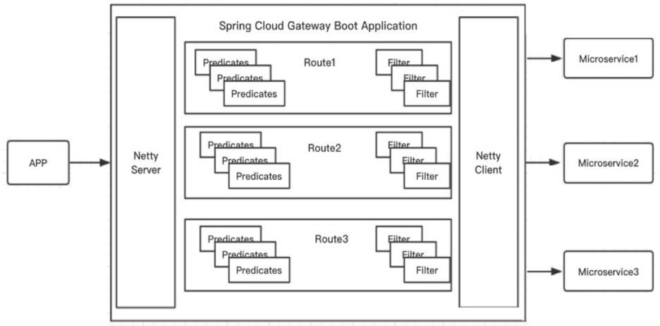

### 1.2 GateWay 在架构中的位置

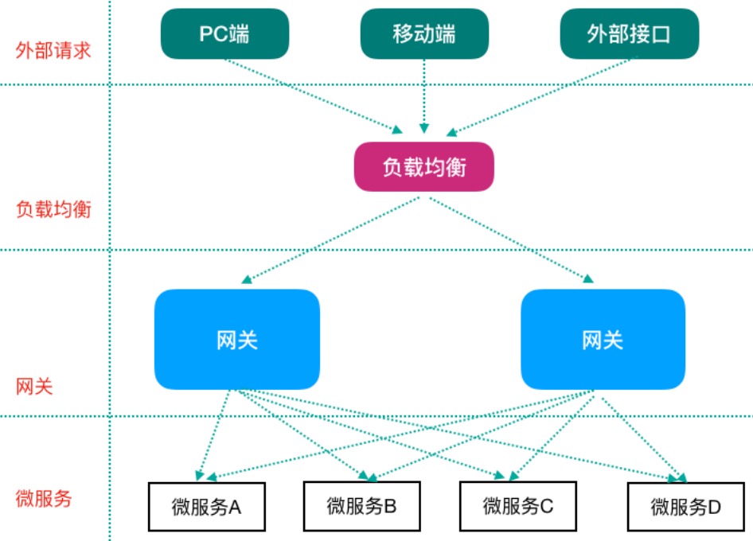


## 2、GateWay 核心概念 - 路由（route）

### 2.1 路由概念

- 路由（route）： ⽹关最基础的部分，也是⽹关⽐较基础的⼯作单元
- 路由由⼀个ID、⼀个⽬标URL（最终路由到的地址）、⼀系列的断⾔（匹配条件判断）和Filter过滤器（精细化控制）组成
- 如果断⾔为true，则匹配该路由


### 2.2 路由规则

- Spring Cloud GateWay 内置了很多 Predicates功能，实现了各种路由匹配规则（通过 Header、请求参数等作为条件）匹配到对应的路由

#### （1）时间点后匹配

```yaml
spring:
  cloud:
    gateway:
      routes:
        - id: after_route
        uri: https://example.org
        predicates:
          - After=2017-01-20T17:42:47.789-07:00[America/Denver]
```

#### （2）时间点前匹配

```yaml
spring:
  cloud:
    gateway:
      routes:
        - id: before_route
        uri: https://example.org
        predicates:
          - Before=2017-01-20T17:42:47.789-07:00[America/Denver]
```

#### （3）时间区间匹配

```yaml
spring:
  cloud:
    gateway:
      routes:
        - id: between_route
        uri: https://example.org
        predicates:
          - Between=2017-01-20T17:42:47.789-07:00[America/Denver],2017-01-21T17:42:47.789-07:00[America/Denver]
```

#### （4）指定 Cookie 正则匹配指定值

```yaml
spring:
  cloud:
    gateway:
      routes:
        - id: cookie_route
        uri: https://example.org
        predicates:
          - Cookie=chocolate, ch.p
```

#### （5）指定 Header 正则匹配指定值

```yaml
spring:
  cloud:
    gateway:
      routes:
        - id: header_route
        uri: https://example.org
        predicates:
          - Header=X-Request-Id, \d+
```

#### （6）请求 Host 匹配指定值

```yaml
spring:
  cloud:
    gateway:
      routes:
        - id: host_route
        uri: https://example.org
        predicates:
          - Host=**.somehost.org,**.anotherhost.org
```

#### （7）请求 Method 匹配指定请求方式

```yaml
spring:
  cloud:
    gateway:
      routes:
        - id: method_route
        uri: https://example.org
        predicates:
          - Method=GET,POST
```

#### （8）请求路径正则匹配

```yaml
spring:
  cloud:
    gateway:
      routes:
        - id: path_route
          uri: https://example.org
        predicates:
          - Path=/red/{segment},/blue/{segment}
```

#### （9）请求包含某参数

```yaml
spring:
  cloud:
    gateway:
      routes:
        - id: query_route
        uri: https://example.org
        predicates:
          - Query=green
```

#### （10）请求包含某参数，并且参数值匹配正则表达式

```yaml
spring:
  cloud:
    gateway:
      routes:
        - id: query_route
          uri: https://example.org
          predicates:
            - Query=red, gree.
```

#### （11）远程地址匹配

```yaml
spring:
  cloud:
    gateway:
      routes:
        - id: remoteaddr_route
          uri: https://example.org
          predicates:
            - RemoteAddr=192.168.1.1/24
```


### 2.3 动态路由

- GateWay ⽀持⾃动从注册中⼼中获取服务列表并访问，即所谓的动态路由


#### 步骤1：pom.xml中添加注册中心客户端依赖

- 因为要获取注册中⼼服务列表，eureka 客户端已经引⼊

```xml
<!-- eureka client -->
<dependency>
    <groupId>org.springframework.cloud</groupId>
    <artifactId>spring-cloud-starter-netflix-eureka-client</artifactId>
</dependency>
```


#### 步骤2：动态路由配置（application.yml）

- 动态路由设置时，uri以 lb: //开头（lb代表从注册中⼼获取服务），后⾯是需要转发到的服务名称

```yaml
Spring:
  application:
    name: cloud-gateway
  cloud:
    gateway:
      # 路由可以有多个
      routes:
        # 自定义的路由 ID，保持唯一
        - id: service-autodeliver-router
          # 目标服务地址
          # uri: http://127.0.0.1:8096
          # 动态路由：uri 配置为服务名称（gateway 网关从服务注册中心获取实例信息，负载后路由）
          uri: lb://resume-service-autodeliver
          # 断言：路由条件，接受一个输入参数，返回一个布尔值结果。
          # 该接口包含多种默认方法来将 Predicate 组合成其他复杂的逻辑（比如：与，或，非）。
          predicates:
            - Path=/autodeliver/**
        # 自定义的路由 ID，保持唯一
        - id: service-resume-router
          uri: lb://resume-service-resume
          predicates:
            - Path=/resume/**
          # 过滤器（GateWayFilter：会对单个路由生效）
          # filters:
            # 作用：去掉 url 中的占位后转发路由（这里1表示去掉第一个占位字符串）
            #- StripPrefix=1
```


## 3、GateWay 核心概念 - 断言（predicates）

- 断⾔（predicates）：参考了 Java8 中的断⾔ java.util.function.Predicate
- 开发⼈员可以匹配 Http 请求中的所有内容（包括请求头、请求参数等）（类似于 nginx 中的 location 匹配⼀样），如果断⾔与请求相匹配则路由。


## 4、GateWay 核心概念 - 过滤器（filter）

- 过滤器（filter）：⼀个标准的 Spring webFilter，使⽤过滤器，可以在请求之前或者之后执⾏业务逻辑。


### 4.1 过滤器分类

#### （1）从过滤器生命周期点（影响时机点）的角度

```
pre
- 这种过滤器在请求被路由之前调⽤
- 可利⽤这种过滤器实现身份验证、在集群中选择 请求的微服务、记录调试信息等

post
- 这种过滤器在路由到微服务以后执⾏
- 可⽤来为响应添加标准的 HTTP Header、收集统计信息和指标、将响应从微服务发送给客户端等
```

#### （2）从过滤器类型的角度

```
GateWayFilter：影响范围为，应用到单个路由路由上
GlobalFilter：影响范围为，应用到所有的路由上
```


### 4.2 自定义全局过滤器

- GlobalFilter：自定义全局过滤器，会对所有路由生效

```java
// ⾃定义全局过滤器实现IP访问限制（黑白名单）
@Slf4j
@Component  // 让容器扫描到，等同于注册了
public class BlackListFilter implements GlobalFilter, Ordered {
    // 模拟黑名单（实际可以去数据库或者redis中查询）
    private static List<String> blackList = new ArrayList<>();

    static {
        // 模拟本机地址
        blackList.add("0:0:0:0:0:0:0:1");
    }

    /**
     * 过滤器核心方法
     *
     * @param exchange 封装了 request 和 response 对象的上下文
     * @param chain    网关过滤器链（包含全局过滤器和单路由过滤器）
     * @return
     */
    @Override
    public Mono<Void> filter(ServerWebExchange exchange, GatewayFilterChain chain) {
        // 思路：获取客户端ip，判断是否在黑名单中，在的话就拒绝访问，不在的话就放行
        // 从上下文中取出 request 和 response 对象
        ServerHttpRequest request = exchange.getRequest();
        ServerHttpResponse response = exchange.getResponse();

        // 从 request 对象中获取客户端ip
        String clientIp = request.getRemoteAddress().getHostString();

        // 拿着 clientIp 去黑名单中查询，存在的话就拒绝访问
        if (blackList.contains(clientIp)) {
            // 拒绝访问，返回
            response.setStatusCode(HttpStatus.UNAUTHORIZED); // 状态码
            log.debug("=====>IP:" + clientIp + " 在黑名单中，将被拒绝访问！");

            String data = "Request be denied!";
            DataBuffer wrap = response.bufferFactory().wrap(data.getBytes());
            return response.writeWith(Mono.just(wrap));
        }

        // 合法请求，放行，执行后续的过滤器
        return chain.filter(exchange);
    }

    /**
     * 返回值表示当前过滤器的顺序(优先级)，数值越小，优先级越高
     *
     * @return
     */
    @Override
    public int getOrder() {
        return 0;
    }
}
```


## 5、GateWay 工作过程

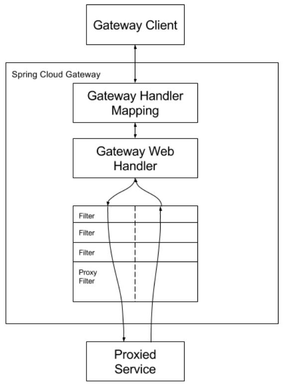

- 客户端向 Spring Cloud GateWay 发出请求
- 然后在GateWay Handler Mapping中找到与请求相匹配的路由，将其发送到GateWay Web Handler；
- Handler再通过指定的过滤器链来将请求发送到实际的服务执⾏业务逻辑，然后返回。
- 过滤器之间⽤虚线分开是因为过滤器可能会在发送代理请求之前（pre）或者之后（post）执⾏业务逻辑。

```
- Filter在“pre”类型过滤器中可以做参数校验、权限校验、流量监控、⽇志输出、协议转换等
- 在“post”类型的过滤器中可以做响应内容、响应头的修改、⽇志的输出、流量监控等。
```

- GateWay核⼼逻辑：路由转发 + 执⾏过滤器链


## 6、GateWay 使用

### 步骤1：pom 依赖

- GateWay 不需要使⽤web模块，它引⼊的是 WebFlux（类似于SpringMVC）

```xml
<?xml version="1.0" encoding="UTF-8"?>
<project xmlns="http://maven.apache.org/POM/4.0.0"
         xmlns:xsi="http://www.w3.org/2001/XMLSchema-instance"
         xsi:schemaLocation="http://maven.apache.org/POM/4.0.0 http://maven.apache.org/xsd/maven-4.0.0.xsd">
    <!-- spring boot 父启动器依赖-->
    <parent>
        <groupId>org.springframework.boot</groupId>
        <artifactId>spring-boot-starter-parent</artifactId>
        <version>2.1.6.RELEASE</version>
    </parent>

    <modelVersion>4.0.0</modelVersion>
    <artifactId>cloud-gateway-9002</artifactId>

    <properties>
        <maven.compiler.source>11</maven.compiler.source>
        <maven.compiler.target>11</maven.compiler.target>
    </properties>

    <dependencies>
        <!--GateWay 网关-->
        <dependency>
            <groupId>org.springframework.cloud</groupId>
            <artifactId>spring-cloud-starter-gateway</artifactId>
        </dependency>

        <!--引入webflux-->
        <dependency>
            <groupId>org.springframework.boot</groupId>
            <artifactId>spring-boot-starter-webflux</artifactId>
        </dependency>

        <dependency>
            <groupId>org.springframework.cloud</groupId>
            <artifactId>spring-cloud-commons</artifactId>
        </dependency>

        <!-- eureka client -->
        <dependency>
            <groupId>org.springframework.cloud</groupId>
            <artifactId>spring-cloud-starter-netflix-eureka-client</artifactId>
        </dependency>

        <!--日志依赖-->
        <dependency>
            <groupId>org.springframework.boot</groupId>
            <artifactId>spring-boot-starter-logging</artifactId>
        </dependency>

        <!--测试依赖-->
        <dependency>
            <groupId>org.springframework.boot</groupId>
            <artifactId>spring-boot-starter-test</artifactId>
            <scope>test</scope>
        </dependency>

        <!--lombok工具-->
        <dependency>
            <groupId>org.projectlombok</groupId>
            <artifactId>lombok</artifactId>
            <version>1.18.4</version>
            <scope>provided</scope>
        </dependency>

        <!--引入Jaxb，开始-->
        <dependency>
            <groupId>com.sun.xml.bind</groupId>
            <artifactId>jaxb-core</artifactId>
            <version>2.2.11</version>
        </dependency>

        <dependency>
            <groupId>javax.xml.bind</groupId>
            <artifactId>jaxb-api</artifactId>
        </dependency>

        <dependency>
            <groupId>com.sun.xml.bind</groupId>
            <artifactId>jaxb-impl</artifactId>
            <version>2.2.11</version>
        </dependency>

        <dependency>
            <groupId>org.glassfish.jaxb</groupId>
            <artifactId>jaxb-runtime</artifactId>
            <version>2.2.10-b140310.1920</version>
        </dependency>

        <dependency>
            <groupId>javax.activation</groupId>
            <artifactId>activation</artifactId>
            <version>1.1.1</version>
        </dependency>
        <!--引入Jaxb，结束-->

        <!-- Actuator可以帮助你监控和管理Spring Boot应用-->
        <dependency>
            <groupId>org.springframework.boot</groupId>
            <artifactId>spring-boot-starter-actuator</artifactId>
        </dependency>

        <!--热部署-->
        <dependency>
            <groupId>org.springframework.boot</groupId>
            <artifactId>spring-boot-devtools</artifactId>
            <optional>true</optional>
        </dependency>
    </dependencies>

    <dependencyManagement>
        <!--spring cloud依赖版本管理-->
        <dependencies>
            <dependency>
                <groupId>org.springframework.cloud</groupId>
                <artifactId>spring-cloud-dependencies</artifactId>
                <version>Greenwich.RELEASE</version>
                <type>pom</type>
                <scope>import</scope>
            </dependency>
        </dependencies>
    </dependencyManagement>

    <build>
        <plugins>
            <!--编译插件-->
            <plugin>
                <groupId>org.apache.maven.plugins</groupId>
                <artifactId>maven-compiler-plugin</artifactId>
                <configuration>
                    <source>11</source>
                    <target>11</target>
                    <encoding>utf-8</encoding>
                </configuration>
            </plugin>

            <!--打包插件-->
            <plugin>
                <groupId>org.springframework.boot</groupId>
                <artifactId>spring-boot-maven-plugin</artifactId>
            </plugin>
        </plugins>
    </build>

</project>
```


### 步骤2：yml 配置

```yaml
server:
  port: 9002

Spring:
  application:
    name: cloud-gateway
  cloud:
    gateway:
      # 路由可以有多个
      routes:
        # 自定义的路由 ID，保持唯一
        - id: service-autodeliver-router
          # 目标服务地址
          # uri: http://127.0.0.1:8096
          # 动态路由：uri 配置为服务名称（gateway 网关从服务注册中心获取实例信息，负载后路由）
          uri: lb://resume-service-autodeliver
          # 断言：路由条件，接受一个输入参数，返回一个布尔值结果。
          # 该接口包含多种默认方法来将 Predicate 组合成其他复杂的逻辑（比如：与，或，非）。
          predicates:
            - Path=/autodeliver/**
        # 自定义的路由 ID，保持唯一
        - id: service-resume-router
          uri: lb://resume-service-resume
          predicates:
            - Path=/resume/**
          # 过滤器（GateWayFilter：会对单个路由生效）
          # filters:
            # 作用：去掉 url 中的占位后转发路由（这里1表示去掉第一个占位字符串）
            #- StripPrefix=1

# 将服务提供者注册到 Eureka 服务中心
eureka:
  client:
    service-url:
      # 注册到单实例（非集群模式），就写一个就可以
      # 注册到集群，把多个 Eureka server 地址使用逗号连接起来即可
      defaultZone: http://CloudEurekaServerA:8761/eureka,http://CloudEurekaServerB:8762/eureka
  instance:
    # 服务实例中显示 ip，而不是显示主机名（为了兼容老的 eureka 版本）
    prefer-ip-address: true
    # 自定义实例显示格式（加上版本号，便于多版本管理）
    instance-id: ${spring.cloud.client.ip-address}:${spring.application.name}:${server.port}:@project.version@
```


### 步骤3：启动类

```java
@SpringBootApplication
@EnableDiscoveryClient
public class GateWayApplication9002 {
    public static void main(String[] args) {
        SpringApplication.run(GateWayApplication9002.class, args);
    }
}
```


## 7、GateWay 高可用

- 可以启动多个 GateWay 实例来实现⾼可用
- 在 GateWay 的上游使用 Nginx 等负载均衡设备进⾏负载转发以达到⾼可⽤的⽬的


- 启动多个GateWay实例（假如说两个，⼀个端⼝9002，⼀个端⼝9003），剩下的就是使⽤Nginx等完成负载代理即可

```properties
# 配置多个 GateWay 实例
upstream gateway {
 server 127.0.0.1:9002;
 server 127.0.0.1:9003;
}

location / {
 proxy_pass http://gateway;
}
```


# 第六章 分布式配置中心 - Spring Cloud Config 

## 1、Config 分布式配置方案

- Server 端：提供配置⽂件的存储、以接⼝的形式将配置⽂件的内容提供出去，通过使⽤ @EnableConfigServer 注解在 Spring boot 应⽤中嵌⼊
- Client 端：通过接⼝获取配置数据并初始化⾃⼰的应⽤

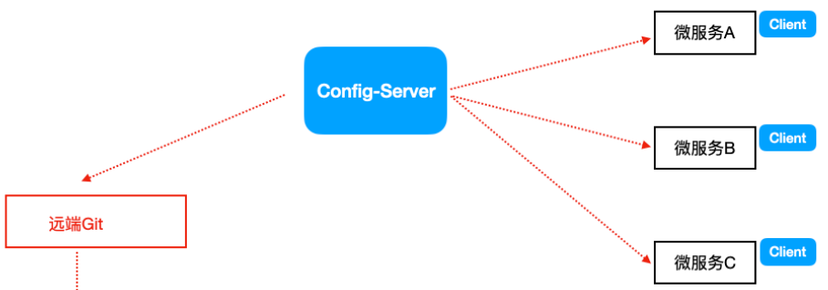


## 2、Config 配置中心搭建

### 步骤1：创建存储配置文件的项目

- 使用 git/gitee 创建存储配置文件的项目

- 在仓库中上传 yml 配置文件，命名规则如下

```properties
# application为应⽤名称
# profile 指的是环境（⽤于区分开发环境，测试环境、⽣产环境等）
{application}-{profile}.yml 或者 {application}-{profile}.properties

# 举例
resume-service-resume-dev.yml
resume-service-resume-test.yml
resume-service-resume-prod.yml
```


### 步骤2：项目引入依赖

```xml
<dependencies>
    <!-- eureka client 客户端依赖引入-->
    <dependency>
        <groupId>org.springframework.cloud</groupId>
        <artifactId>spring-cloud-starter-netflix-eureka-client</artifactId>
    </dependency>

    <!-- config 配置中心服务端 -->
    <dependency>
        <groupId>org.springframework.cloud</groupId>
        <artifactId>spring-cloud-config-server</artifactId>
    </dependency>
</dependencies>
```


### 步骤3：启动类配置注解

```java
@SpringBootApplication
@EnableDiscoveryClient
@EnableConfigServer  // 开启配置中心功能
public class ConfigServerApplication9003 {
    public static void main(String[] args) {
        SpringApplication.run(ConfigServerApplication9003.class, args);
    }
}
```


### 步骤4：application.yml

```yaml
Spring:
  cloud:
    config:
      server:
        git:
          # 配置 git 服务地址
          uri: https://gitee.com/shorfng/cloud-config-repo.git
          # 配置 git 用户名
          username: xxxxx
          # 配置 git 密码
          password: xxxx
          search-paths:
            - cloud-config-repo
      # 读取 git 分支
      label: main
```


### 步骤5：测试 - 访问配置文件内容

- http://ip:端口号/分支名称/配置文件名称

- http://localhost:9003/main/resume-service-resume-dev.yml


## 3、Config 客户端搭建

### 步骤1：客户端工程添加依赖

- 在本次举例中，修改客户端 resume-service-resume-8080 和 resume-service-resume-8081 项目中的 pom.xml 即可

```xml
<!--Config 客户端依赖-->
<dependency>
    <groupId>org.springframework.cloud</groupId>
    <artifactId>spring-cloud-config-client</artifactId>
</dependency>
```


### 步骤2：bootstrap.yml

- 因为 bootstrap.yml 是系统级别的，优先级比 application.yml 高，应⽤启动时会检查这个配置⽂件，在这个 bootstrap.yml 配置⽂件中指定配置中⼼的服务地址，会⾃动拉取所有应⽤配置并且启⽤，所以修改 application.yml 为 bootstrap.yml

```yaml
spring:
 cloud:
    # config 客户端配置（和 cloud-config-server-9003 通信，并告知希望获取的配置信息在哪个文件中）
    config:
      # git 上的配置文件名称
      name: resume-service-resume
      profile: dev  # 后缀名称
      label: main   # 分支名称
      # cloud-config-server 配置中心地址
      uri: http://localhost:9003
```


### 步骤3：config 配置中心的配置信息

```java
@RestController
@RequestMapping("/config")
public class ConfigController {
    @Value("${mysql.url}")
    private String mysqlUrl;

    @Value("${td.message}")
    private String tdMessage;

    //http://localhost:8080/config/viewconfig
    @GetMapping("/viewconfig")
    public String viewconfig() {
        return "tdMessage==>" + tdMessage + " mysqlUrl=>" + mysqlUrl;
    }
}
```


### 步骤4：测试

- http://localhost:8080/config/viewconfig


## 4、Config 客户端手动刷新方案

- 原因：当修改 GitHub 上⾯的值时，服务端（Config Server）能实时获取最新的值，但客户端（Config Client）读的是缓存，⽆法实时获取最新值
- 效果：不⽤重启微服务，只需要⼿动的做⼀些其他的操作（访问⼀个地址/refresh）刷新，之后再访问即可
- 方案：客户端使用 post 触发 refresh，获取最新数据


### 步骤1：添加依赖

- Client 客户端添加依赖 springboot-starter-actuator

```xml
<!-- Actuator可以帮助你监控和管理Spring Boot应⽤-->
<dependency>
    <groupId>org.springframework.boot</groupId>
    <artifactId>spring-boot-starter-actuator</artifactId>
</dependency>
```


### 步骤2：bootstrap.yml 暴露通信端点

- Client客户端 bootstrap.yml 中添加配置（暴露通信端点）

```yaml
# 暴露通信端口
management:
  endpoints:
    web:
      exposure:
        # include: refresh
        # *表示暴露所有端口
        include: "*"
```


### 步骤3：添加 @RefreshScope 注解

- Client 客户端使⽤到配置信息的类上添加 @RefreshScope

```java
@RestController
@RequestMapping("/config")
@RefreshScope
public class ConfigController {
    @Value("${mysql.url}")
    private String mysqlUrl;

    @Value("${td.message}")
    private String tdMessage;

    //http://localhost:8080/config/viewconfig
    @GetMapping("/viewconfig")
    public String viewconfig() {
        return "tdMessage==>" + tdMessage + " mysqlUrl=>" + mysqlUrl;
    }
}
```


### 步骤4：客户端使用 post 触发 refresh

- http://localhost:8080/actuator/refresh


## 5、Config 客户端自动刷新方案

### 5.1 Spring Cloud Bus（消息总线）

- 消息总线Bus，即经常会使⽤MQ消息代理构建⼀个共⽤的 Topic，通过这个 Topic 连接各个微服务实例，MQ⼴播的消息会被所有在注册中⼼的微服务实例监听和消费。换⾔之就是通过⼀个主题连接各个微服务，打通脉络。
- Spring Cloud Bus（基于MQ的，⽀持RabbitMq/Kafka） 是Spring Cloud中的消息总线⽅案
- Spring Cloud Config + Spring Cloud Bus 结合可以实现配置信息的⾃动更新。


### 5.2 Config + Bus 使用方案

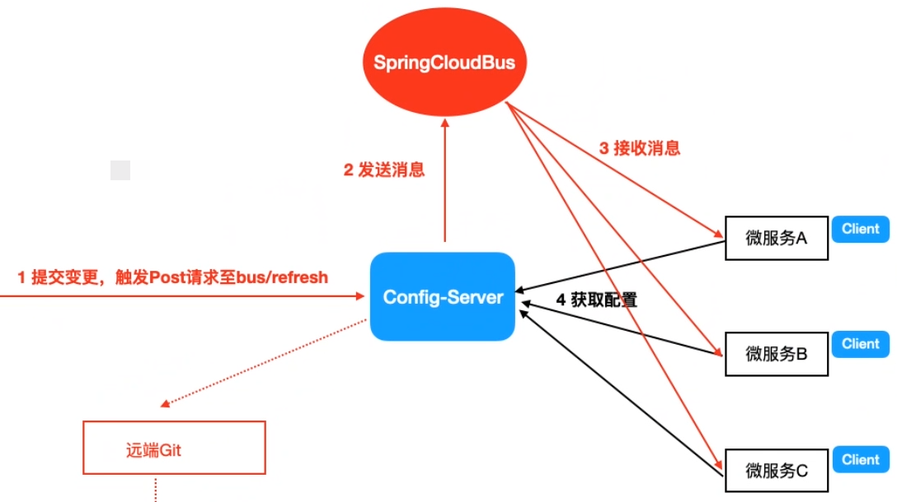


### 5.2 Config + Bus 使用步骤

#### 步骤1：添加 Spring Cloud Bus 依赖

- cloud-config-server-9003
- resume-service-resume-8081

```xml
<!-- Spring Cloud Bus -->
<dependency>
    <groupId>org.springframework.cloud</groupId>
    <artifactId>spring-cloud-starter-bus-amqp</artifactId>
</dependency>
```


#### 步骤2：application.yml 添加 rabbitmq 配置

- cloud-config-server-9003
- resume-service-resume-8081

```yaml
Spring:
  rabbitmq:
    host: 127.0.0.1
    port: 5672
    username: guest
    password: guest
```


#### 步骤3：application.yml 暴露通信端口

- cloud-config-server-9003

```yaml
# 暴露通信端口
management:
  endpoints:
    web:
      exposure:
        # include: refresh
        # *表示暴露所有端口
        include: "*"
```


#### 步骤4：ConfigController.java 配置 @RefreshScope 注解

- resume-service-resume-8081

```java
@RestController
@RequestMapping("/config")
@RefreshScope
public class ConfigController {
    @Value("${mysql.url}")
    private String mysqlUrl;

    @Value("${td.message}")
    private String tdMessage;

    //http://localhost:8081/config/viewconfig
    @GetMapping("/viewconfig")
    public String viewconfig() {
        return "tdMessage==>" + tdMessage + " mysqlUrl=>" + mysqlUrl;
    }
}
```


#### 步骤5：刷新所有实例（使用 post 触发 refresh）

- cloud-config-server-9003
- http://localhost:9003/actuator/bus-refresh


#### 步骤6：定向刷新指定实例（使用 post 触发 refresh）

- http://localhost:9003/actuator/bus-refresh/要刷新的服务名:要刷新的端口号

- http://localhost:9003/actuator/bus-refresh/resume-service-resume:8081


# 第七章 消息驱动组件 - Spring Cloud Stream

## 1、Stream 简介

### 1.1 Stream  概述

- Spring Cloud Stream 是⼀个构建消息驱动微服务的框架。
- 应⽤程序通过inputs（相当于消息消费者consumer）或者 outputs（相当于消息⽣产者producer）来与 Spring Cloud Stream 中的 binder 对象交互
- Binder 对象是⽤来屏蔽底层不同MQ消息中间件的细节差异，它负责与具体的消息中间件交互，当需要更换为其他消息中间件时，更换对应的Binder绑定器⽽不需要修改任何应⽤逻辑（Binder绑定器的实现是框架内置的）
- Spring Cloud Stream⽬前⽀持Rabbit、Kafka两种消息队列

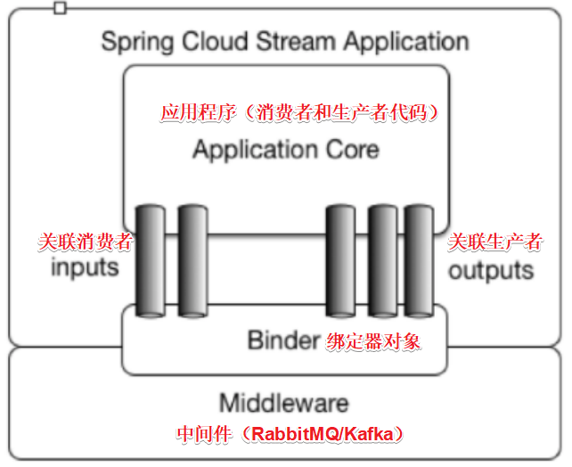


### 1.2 传统MQ模型与Stream消息驱动模型

- 传统MQ模型

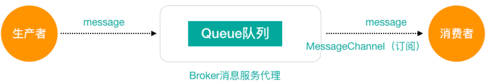

- Stream消息驱动模型

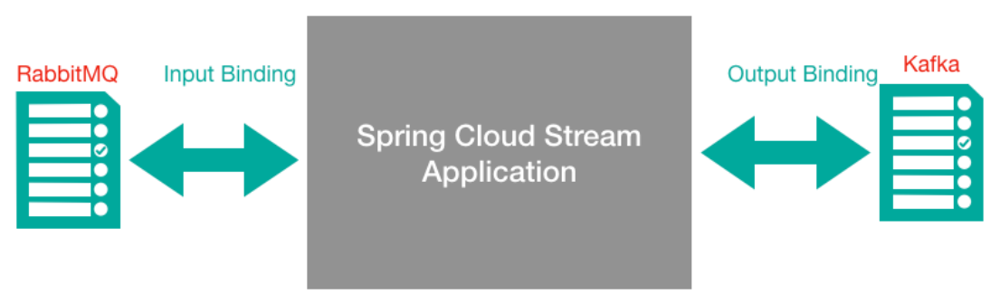


### 1.3 Stream消息通信方式

- Stream中的消息通信⽅式遵循了发布—订阅模式。
- 当⼀条消息被投递到消息中间件之 后，它会通过共享的 Topic 主题进⾏⼴播，消息消费者在订阅的主题中收到它并触发⾃身的业务逻辑处理
- 这⾥所提到的 Topic 主题是Spring Cloud Stream中的⼀个抽象概念，⽤来代表发布共享消息给消 费者的地⽅。在不同的消息中间件中， Topic 可能对应着不同的概念，⽐如：在RabbitMQ中的它对应了Exchange、在Kakfa中则对应了Kafka中的Topic


### 1.4 Stream 编程相关注解

#### @Input

- 在消费者⼯程中使⽤
- 注解标识输⼊通道，通过该输⼊通道接收到的消息进⼊应⽤程序

#### @Output

- 在⽣产者⼯程中使⽤
- 注解标识输出通道，发布的消息将通过该通道离开应⽤程序

#### @StreamListener

- 在消费者⼯程中使⽤，监听message的到来
- 监听队列，⽤于消费者的队列的消息的接收（有消息监听.....）

#### @EnableBinding 

- 对于RabbitMQ：把 Channel 和 Exchange 绑定在⼀起


## 2、Stream 构建生产者

### 步骤1：pom 依赖

```xml
<!--eureka client 客户端依赖引入-->
<dependency>
    <groupId>org.springframework.cloud</groupId>
    <artifactId>spring-cloud-starter-netflix-eureka-client</artifactId>
</dependency>

<!-- spring cloud stream 依赖（rabbit）-->
<dependency>
    <groupId>org.springframework.cloud</groupId>
    <artifactId>spring-cloud-starter-stream-rabbit</artifactId>
</dependency>
```


### 步骤2：启动类

- StreamProducerApplication9090

```java
@SpringBootApplication
@EnableDiscoveryClient
public class StreamProducerApplication9090 {
    public static void main(String[] args) {
        SpringApplication.run(StreamProducerApplication9090.class, args);
    }
}
```


### 步骤3：application.yml

```yaml
server:
  port: 9090

spring:
  application:
    name: cloud-stream-producer
  cloud:
    stream:
      binders: # 绑定 MQ服务信息（此是 RabbitMQ）
        # 自定义 Binder 名称，用于后面的关联
        TDRabbitBinder:
          # MQ 类型，如果是 Kafka，此处配置 kafka
          type: rabbit
          # MQ 环境配置（用户名、密码等）
          environment:
            spring:
              rabbitmq:
                host: localhost
                port: 5672
                username: guest
                password: guest
      # 关联整合通道和 binder对象
      bindings:
        # 定义的通道名称，此处不能乱改
        output:
          # 要使用的Exchange名称（消息队列主题名称）
          destination: TDExchange
          # 消息类型设置
          # content-type: application/json
          content-type: text/plain
          # 关联 MQ 服务
          binder: TDRabbitBinder

# 将服务提供者注册到 Eureka 服务中心
eureka:
  client:
    service-url:
      # 注册到单实例（非集群模式），就写一个就可以
      # 注册到集群，把多个 Eureka server 地址使用逗号连接起来即可
      defaultZone: http://CloudEurekaServerA:8761/eureka,http://CloudEurekaServerB:8762/eureka
  instance:
    # 服务实例中显示 ip，而不是显示主机名（为了兼容老的 eureka 版本）
    prefer-ip-address: true
    # 自定义实例显示格式（加上版本号，便于多版本管理）
    instance-id: ${spring.cloud.client.ip-address}:${spring.application.name}:${server.port}:@project.version@
```


### 步骤4：生产者

- IMessageProducer

```java
public interface IMessageProducer {
    public void sendMessage(String content);
}
```

- MessageProducerImpl

```java
package com.loto.service.impl;

import com.loto.service.IMessageProducer;
import org.springframework.beans.factory.annotation.Autowired;
import org.springframework.cloud.stream.annotation.EnableBinding;
import org.springframework.cloud.stream.messaging.Source;
import org.springframework.messaging.support.MessageBuilder;

// Source.class 里面是对输出通道的定义（这是 Spring Cloud Stream 内置的通道封装）
@EnableBinding(Source.class)
public class MessageProducerImpl implements IMessageProducer {
    // 将MessageChannel 的封装对象 Source 注入到这里使用
    @Autowired
    private Source source;

    @Override
    public void sendMessage(String content) {
        // 向 mq 中发送消息（并不是直接操作 mq，而是通过 spring cloud stream 操作的）
        // 使用通道向外发出消息(指的是 Source 里面的 output 通道)
        source.output().send(MessageBuilder.withPayload(content).build());
    }
}
```


### 步骤5：测试类

```java
@SpringBootTest(classes = {StreamProducerApplication9090.class})
@RunWith(SpringJUnit4ClassRunner.class)
public class MessageProducerTest {
    @Autowired
    private IMessageProducer iMessageProducer;

    @Test
    public void testSendMessage() {
        iMessageProducer.sendMessage("hello world,Spring Cloud Stream");
    }
}
```


## 3、Stream 构建消费者

### 步骤1：pom 依赖

```xml
<!--eureka client 客户端依赖引入-->
<dependency>
    <groupId>org.springframework.cloud</groupId>
    <artifactId>spring-cloud-starter-netflix-eureka-client</artifactId>
</dependency>

<!-- spring cloud stream 依赖（rabbit）-->
<dependency>
    <groupId>org.springframework.cloud</groupId>
    <artifactId>spring-cloud-starter-stream-rabbit</artifactId>
</dependency>
```


### 步骤2：启动类

- StreamProducerApplication9091

```java
@SpringBootApplication
@EnableDiscoveryClient
public class StreamConsumerApplication9091 {
    public static void main(String[] args) {
        SpringApplication.run(StreamConsumerApplication9091.class, args);
    }
}
```


### 步骤3：application.yml

```yaml
server:
  port: 9091

spring:
  application:
    name: cloud-stream-consumer
  cloud:
    stream:
      binders: # 绑定 MQ服务信息（此是 RabbitMQ）
        # 自定义 Binder 名称，用于后面的关联
        TDRabbitBinder:
          # MQ 类型，如果是 Kafka，此处配置 kafka
          type: rabbit
          # MQ 环境配置（用户名、密码等）
          environment:
            spring:
              rabbitmq:
                host: localhost
                port: 5672
                username: guest
                password: guest
      # 关联整合通道和 binder对象
      bindings:
        # 定义的通道名称，此处不能乱改
        input:
          # 要使用的Exchange名称（消息队列主题名称）
          destination: TDExchange
          # 消息类型设置
          # content-type: application/json
          content-type: text/plain
          # 关联 MQ 服务
          binder: TDRabbitBinder
          # 多个消费者实例配置为同⼀个 group 名称，能解决消息重复消费问题
          group: tdgroup01

# 将服务提供者注册到 Eureka 服务中心
eureka:
  client:
    service-url:
      # 注册到单实例（非集群模式），就写一个就可以
      # 注册到集群，把多个 Eureka server 地址使用逗号连接起来即可
      defaultZone: http://CloudEurekaServerA:8761/eureka,http://CloudEurekaServerB:8762/eureka
  instance:
    # 服务实例中显示 ip，而不是显示主机名（为了兼容老的 eureka 版本）
    prefer-ip-address: true
    # 自定义实例显示格式（加上版本号，便于多版本管理）
    instance-id: ${spring.cloud.client.ip-address}:${spring.application.name}:${server.port}:@project.version@
```


### 步骤4：消费者

```java
@EnableBinding(Sink.class)
public class MessageConsumerService {
    @StreamListener(Sink.INPUT)
    public void receiveMessages(Message<String> message) {
        System.out.println("========= 9091接收到的消息：" + message);
    }
}
```


## 4、Stream 自定义消费通道

// TODO


## 5、Stream 消息分组

### 问题描述

- 如果，消费者端有两个（消费同⼀个MQ的同⼀个主题），但是业务场景中希望这个主题的⼀个Message只能被⼀个消费者端消费处理，此时
  就可以使⽤消息分组。

### 解决方案

- 消息分组能解决消息重复消费问题

```yaml
# 在服务消费者端设置 spring.cloud.stream.bindings.input.group 属性
# 多个消费者实例配置为同⼀个group名称（在同⼀个group中的多个消费者只有⼀个可以获取到消息并消费）

spring:
  application:
    name: cloud-stream-consumer
  cloud:
    stream:
      binders: # 绑定 MQ服务信息（此是 RabbitMQ）
        # 自定义 Binder 名称，用于后面的关联
        TDRabbitBinder:
          # MQ 类型，如果是 Kafka，此处配置 kafka
          type: rabbit
          # MQ 环境配置（用户名、密码等）
          environment:
            spring:
              rabbitmq:
                host: localhost
                port: 5672
                username: guest
                password: guest
      # 关联整合通道和 binder对象
      bindings:
        # 定义的通道名称，此处不能乱改
        input:
          # 要使用的Exchange名称（消息队列主题名称）
          destination: TDExchange
          # 消息类型设置
          # content-type: application/json
          content-type: text/plain
          # 关联 MQ 服务
          binder: TDRabbitBinder
          # 多个消费者实例配置为同⼀个 group 名称，能解决消息重复消费问题
          group: tdgroup01
```

