> 当前位置：【Java】10_MicroService（微服务）-> 10.3_SpringCloud_Alibaba


# SpringCloud_Alibaba 组件

|                | 第⼀代 Spring Cloud Netflix（SCN）                | 第⼆代 Spring Cloud Alibaba（SCA）             |
| -------------- | ------------------------------------------------- | ---------------------------------------------- |
| 服务注册中心   | Netflix Eureka                                    | 阿里巴巴：Nacos                                |
| 客户端负载均衡 | Netflix Ribbon                                    | 阿⾥巴巴：Dubbo RPC、SpringCloud：Loadbalancer |
| 服务熔断       | Netflix Hystrix                                   | 阿⾥巴巴：Sentinel                             |
| 远程服务调用   | Netflix Feign                                     | 阿⾥巴巴：Dubbo RPC                            |
| 网关           | Netflix Zuul（已退出）、==Spring Cloud：Gateway== | ==Spring Cloud：Gateway==                      |
| 服务配置中心   | Spring Cloud Config + Spring Cloud Bus            | 阿⾥巴巴：Nacos、携程：Apollo                  |
| 消息驱动       | ==Spring Cloud Stream==                           | ==Spring Cloud Stream==                        |
| 分布式链路追踪 | ==Spring Cloud Sleuth + Twitter Zipkin==          | ==Spring Cloud Sleuth + Twitter Zipkin==       |
| 统一认证方案   | ==Spring Cloud OAuth2 + JWT==                     | ==Spring Cloud OAuth2 + JWT==                  |
| 分布式事务方案 |                                                   | 阿里巴巴：seata                                |


# 第一章 服务注册中心 和 服务配置中心 - Nacos

## 1、Nacos 简介

### 1.1 Nacos 地址

- 官网：https://nacos.io
- 下载地址：https://github.com/alibaba/Nacos


### 1.2 Nacos 概述

- Nacos （Dynamic Naming and Confifiguration Service）是阿⾥巴巴开源的⼀个针对微服务架构中服务发现、配置管理和服务管理平台。
- Nacos 是注册中心 + 配置中心的组合
- Nacos = Eureka + Config + Bus


### 1.3 Nacos 功能特性

- 服务发现与健康检查
- 动态配置管理
- 动态DNS服务
- 服务和元数据管理

```
- 管理平台的⻆度，nacos有⼀个ui⻚⾯，可以看到注册的服务及其实例信息（元数据信息）等
- 动态的服务权重调整、动态服务优雅下线，都可以做
```


## 2、Nacos Server 环境搭建

### 2.1 Nacos Server 数据持久化

- Nacos 默认使⽤嵌⼊式数据库进⾏数据存储，⽀持改为外部 Mysql 存储


### 2.2 Nacos Server 环境搭建 - 单机模式

- 详见 《【Java】12_EfficiencyTools（效率工具） -> 12.7_DevOps（运维部署） -> 02_Nacos安装和配置》


### 2.3 Nacos Server 环境搭建 - 集群模式

- 详见 《【Java】12_EfficiencyTools（效率工具） -> 12.7_DevOps（运维部署） -> 02_Nacos安装和配置》


## 3、Nacos 控制台界面详解 - 集群管理

- 集群启动

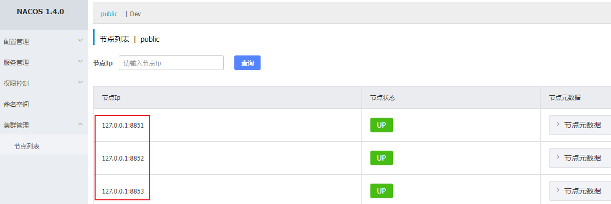

- 选举成功后，其中一台 Nacos 被选举为 leader，其他为 follower

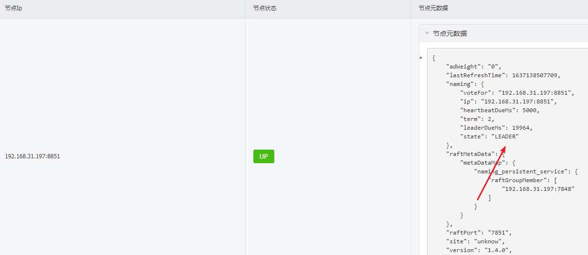


## 4、Nacos 控制台界面详解 - 命名空间

### 4.1 界面展示 - 命名空间

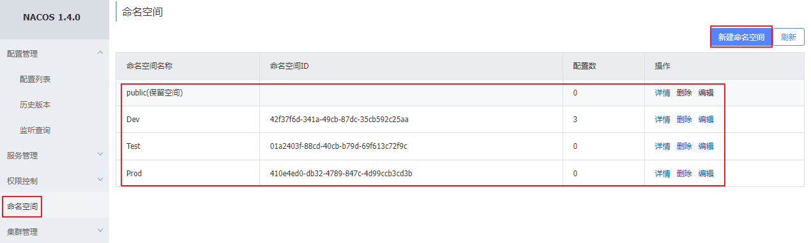


### 4.2 Nacos 数据模型/领域模型

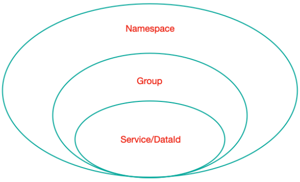

#### （1）Namespace 命名空间

- 对不同的环境进⾏隔离
- 如隔离开发环境、测试环境和⽣产环境


#### （2）Group 分组

- 将若⼲个服务或者若⼲个配置集归为⼀组
- 通常习惯⼀个系统归为⼀个组


#### （3）Service 服务

- 某一服务


#### （4）DataId 配置集

- 可以认为是⼀个配置⽂件


### 4.3 Nacos 服务的分级模型

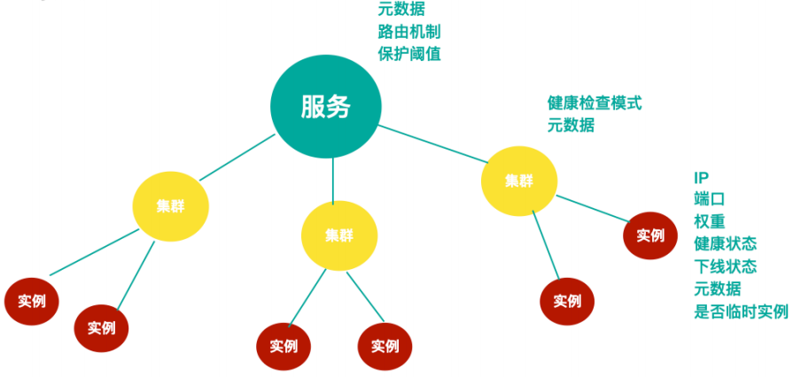


## 5、Nacos 控制台界面详解 - 服务注册中心

### 5.1 服务管理 - 服务列表

#### （1）服务列表

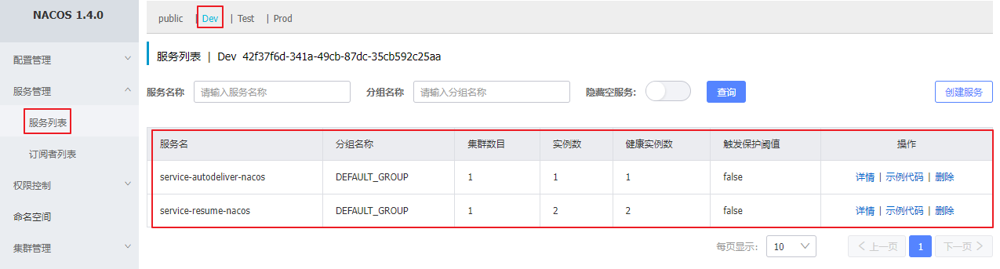


#### （2）服务详情（编辑和下线）

- 保护阈值：可以设置为0-1之间的浮点数，是⼀个⽐例值（当前服务健康实例数/当前服务总实例数）
- 当 ==服务健康实例数/总实例数 < 保护阈值== 的时候，说明健康实例真的不多了，这个时候保护阈值会被触发（状态true）
- nacos将会把该服务所有的实例信息（健康的+不健康的）全部提供给消费者，消费者可能访问到不健康的实例，请求失败，但这样也⽐造成雪崩要好，牺牲了⼀些请求，保证了整个系统的可⽤


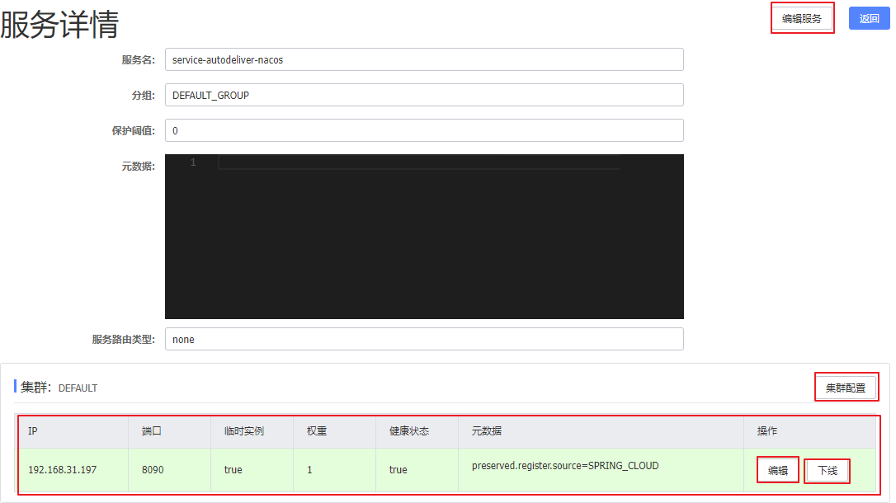


#### （3）更新服务/编辑服务

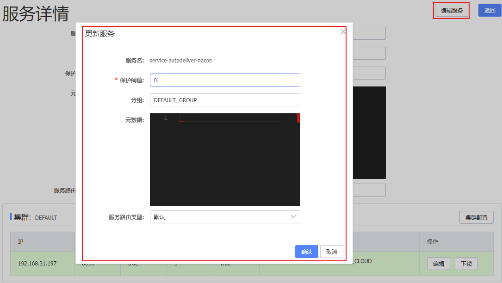


#### （4）编辑实例

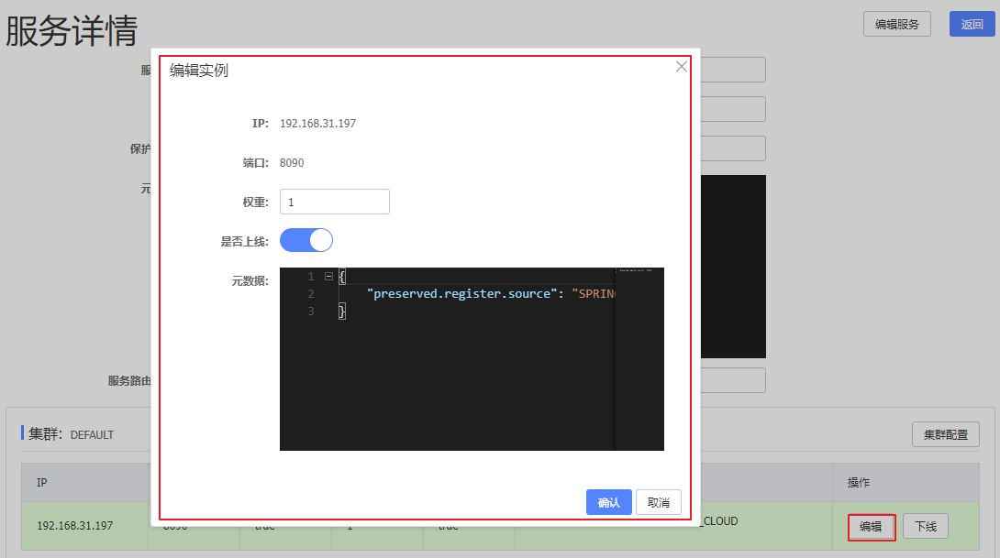


#### （5）更新集群/集群配置

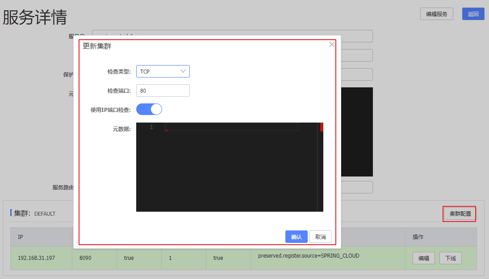


### 5.2 服务管理 - 订阅者列表

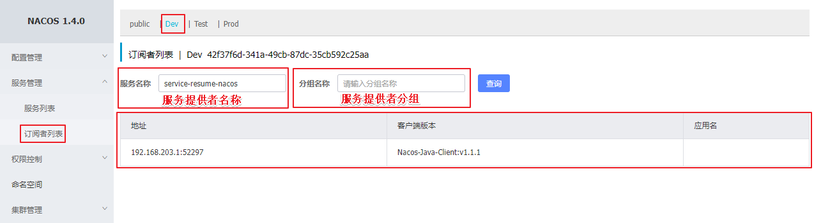


## 6、Nacos 控制台界面详解 - 服务配置中心

### 6.1 配置管理 - 配置列表

#### （1）配置列表

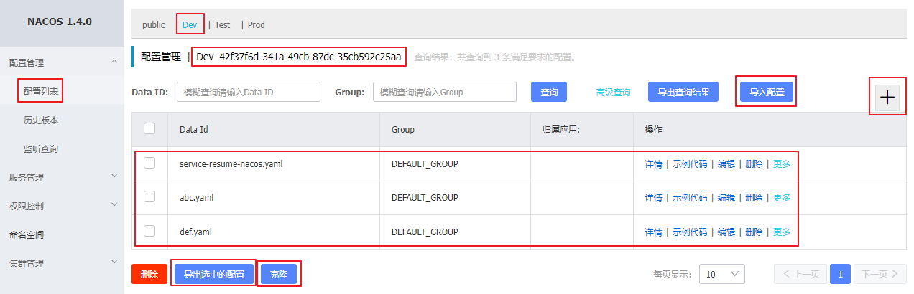


#### （2）新建配置

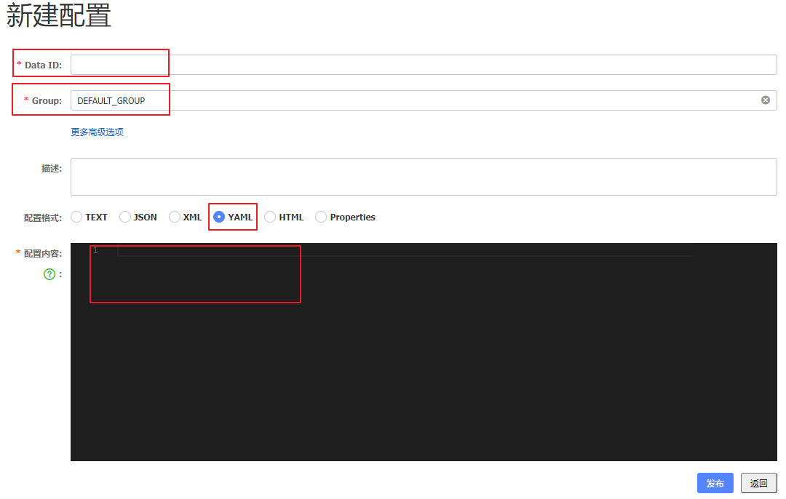

#### （3）配置详情（查看配置内容）

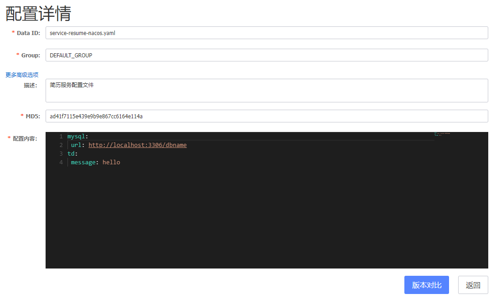

#### （4）编辑配置

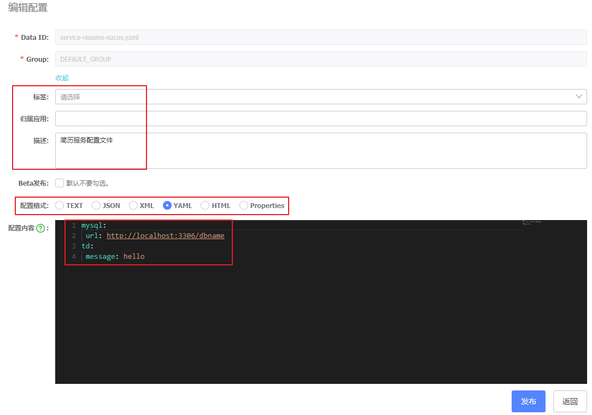

#### （5）导入配置

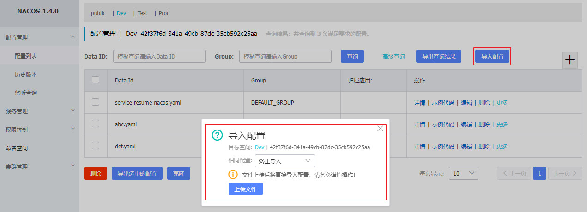


#### （6）克隆配置

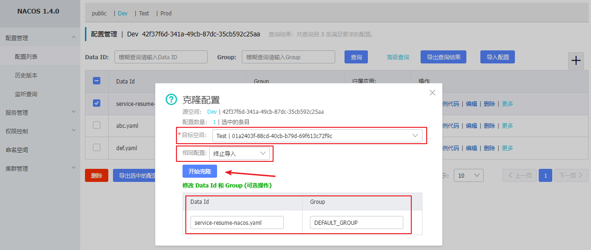


### 6.2 配置管理 - 监听查询

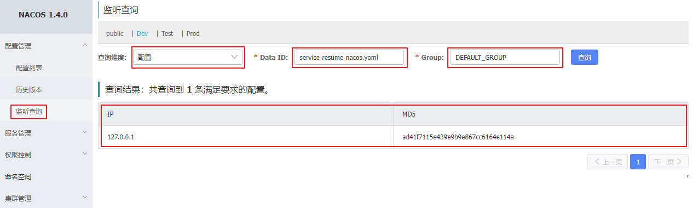


## 7、Nacos 使用 - 服务注册中心

### 7.1 父工程（Spring-Cloud-Alibaba）

- 主要是 spring-cloud-alibaba-dependencies

```xml
<dependencyManagement>
    <dependencies>
        <!-- SpringCloud 依赖管理 -->
        <dependency>
            <groupId>org.springframework.cloud</groupId>
            <artifactId>spring-cloud-dependencies</artifactId>
            <version>Greenwich.RELEASE</version>
            <type>pom</type>
            <scope>import</scope>
        </dependency>

        <!-- SCA -->
        <dependency>
            <groupId>com.alibaba.cloud</groupId>
            <artifactId>spring-cloud-alibaba-dependencies</artifactId>
            <version>2.1.0.RELEASE</version>
            <type>pom</type>
            <scope>import</scope>
        </dependency>
    </dependencies>
</dependencyManagement>

<dependencies>
    <dependency>
        <groupId>org.springframework.boot</groupId>
        <artifactId>spring-boot-starter</artifactId>
    </dependency>

    <!--web依赖-->
    <dependency>
        <groupId>org.springframework.boot</groupId>
        <artifactId>spring-boot-starter-web</artifactId>
    </dependency>

    <!--⽇志依赖-->
    <dependency>
        <groupId>org.springframework.boot</groupId>
        <artifactId>spring-boot-starter-logging</artifactId>
    </dependency>

    <!--测试依赖-->
    <dependency>
        <groupId>org.springframework.boot</groupId>
        <artifactId>spring-boot-starter-test</artifactId>
        <scope>test</scope>
    </dependency>

    <!--lombok⼯具-->
    <dependency>
        <groupId>org.projectlombok</groupId>
        <artifactId>lombok</artifactId>
        <version>1.18.4</version>
        <scope>provided</scope>
    </dependency>

    <!-- Actuator可以帮助你监控和管理Spring Boot应⽤-->
    <dependency>
        <groupId>org.springframework.boot</groupId>
        <artifactId>spring-boot-starter-actuator</artifactId>
    </dependency>

    <!--热部署-->
    <dependency>
        <groupId>org.springframework.boot</groupId>
        <artifactId>spring-boot-devtools</artifactId>
        <optional>true</optional>
    </dependency>

    <!-- spring cloud commons模块引入-->
    <dependency>
        <groupId>org.springframework.cloud</groupId>
        <artifactId>spring-cloud-commons</artifactId>
    </dependency>
</dependencies>

<build>
    <plugins>
        <!--编译插件-->
        <plugin>
            <groupId>org.apache.maven.plugins</groupId>
            <artifactId>maven-compiler-plugin</artifactId>
            <configuration>
                <source>11</source>
                <target>11</target>
                <encoding>utf-8</encoding>
            </configuration>
        </plugin>

        <!--打包插件-->
        <plugin>
            <groupId>org.springframework.boot</groupId>
            <artifactId>spring-boot-maven-plugin</artifactId>
        </plugin>
    </plugins>
</build>
```


### 7.2 服务提供者（service-resume-nacos-8080）

#### 步骤1：pom.xml

```xml
<!-- nacos service discovery client 依赖-->
<dependency>
    <groupId>com.alibaba.cloud</groupId>
    <artifactId>spring-cloud-starter-alibaba-nacos-discovery</artifactId>
</dependency>

<!-- nacos config client 依赖-->
<dependency>
    <groupId>com.alibaba.cloud</groupId>
    <artifactId>spring-cloud-starter-alibaba-nacos-config</artifactId>
</dependency>
```


#### 步骤2：bootstrap.yml

```yaml
server:
  port: 8080

spring:
  application:
    name: service-resume-nacos
  datasource:
    driver-class-name: com.mysql.cj.jdbc.Driver
    url: jdbc:mysql://localhost:3306/SpringCloud?useUnicode=true&characterEncoding=utf8&serverTimezone=UTC
    username: root
    password: root
  jpa:
    database: MySQL
    show-sql: true
    hibernate:
      naming:
        physical-strategy: org.hibernate.boot.model.naming.PhysicalNamingStrategyStandardImpl  #避免将驼峰命名转换为下划线命名
  # nacos 配置
  cloud:
    nacos:
      # nacos discovery 服务注册中心
      discovery:
        # 集群节点信息
        #server-addr: 127.0.0.1:8851,127.0.0.1:8852,127.0.0.1:8853
        # 集群名称（默认为 default）
        #cluster-name: TD

        # 单机模式
        server-addr: 127.0.0.1:8848
        namespace: 42f37f6d-341a-49cb-87dc-35cb592c25aa   # 命名空间id

      # nacos config 服务配置中心
      config:
        # 集群节点信息
        #server-addr: 127.0.0.1:8851,127.0.0.1:8852,127.0.0.1:8853

        # 单机模式
        server-addr: 127.0.0.1:8848
        namespace: 42f37f6d-341a-49cb-87dc-35cb592c25aa   # 命名空间id
        group: DEFAULT_GROUP   # 默认分组为 DEFAULT_GROUP，如果使用默认分组可以不配置
        # 根据规则拼接 dataId：${prefix}-${spring.profile.active}.${file-extension}
        # service-resume-nacos.yaml
        file-extension: yaml   # 文件扩展名，默认 properties

        # 关于优先级：根据规则生成的 dataId > 扩展的 dataId（对于扩展的 dataId，n越⼤优先级越高）
        # 扩展 dataId 配置信息（可配置多个 dataId）
        ext-config[0]:
          data-id: abc.yaml
          group: DEFAULT_GROUP
          refresh: true  # 开启扩展 dataId 动态刷新
        ext-config[1]:
          data-id: def.yaml
          group: DEFAULT_GROUP
          refresh: true  # 开启扩展 dataId 动态刷新

# 暴露通信端口
management:
  endpoints:
    web:
      exposure:
        # include: refresh
        # *表示暴露所有端口
        include: "*"
```


#### 步骤3：启动类

- ResumeApplication8080

```java
@SpringBootApplication
@EntityScan("com.loto.pojo")
// 开启注册中心客户端 （通用型注解，使用Eureka或者Nacos等作为注册中心时使用）
@EnableDiscoveryClient
public class ResumeApplication8080 {
    public static void main(String[] args) {
        SpringApplication.run(ResumeApplication8080.class,args);
    }
}
```


### 7.3 服务消费者（service-autodeliver-nacos-8090）

#### 步骤1：pom.xml

```xml
<!-- nacos service discovery client 依赖-->
<dependency>
    <groupId>com.alibaba.cloud</groupId>
    <artifactId>spring-cloud-starter-alibaba-nacos-discovery</artifactId>
</dependency>
```


#### 步骤2：application.yml

```yaml
server:
  port: 8090

spring:
  application:
    name: service-autodeliver-nacos
  cloud:
    # nacos 配置
    nacos:
      # nacos discovery 服务注册中心
      discovery:
        # 集群节点信息
        #server-addr: 127.0.0.1:8851,127.0.0.1:8852,127.0.0.1:8853
        # 集群名称（默认为 default）
        #cluster-name: TD

        # 单机模式
        server-addr: 127.0.0.1:8848
        namespace: 42f37f6d-341a-49cb-87dc-35cb592c25aa   # 命名空间id

# springboot 中暴露健康检查等断点接口
management:
  endpoints:
    web:
      exposure:
        include: "*"
  # 暴露健康接口的细节
  endpoint:
    health:
      show-details: always

# 针对的被调用方微服务名称 resume-service-resume（不加 22 行这个服务名称，就是全局生效）
resume-service-resume:
  ribbon:
    # 负载策略调整：使用轮询
    NFLoadBalancerRuleClassName: com.netflix.loadbalancer.RoundRobinRule
```


#### 步骤3：启动类

- AutodeliverApplication8090

```java
@SpringBootApplication
@EnableDiscoveryClient
@EnableFeignClients  // 开启 Feign 客户端功能
public class AutodeliverApplication8090 {
    public static void main(String[] args) {
        SpringApplication.run(AutodeliverApplication8090.class, args);
    }
}
```


#### 步骤4：远程调用（暂时使用 Feign）

- AutodeliverController

```java
@RestController
@RequestMapping("/autodeliver")
public class AutodeliverController {
    @Autowired
    private ResumeServiceFeignClient resumeServiceFeignClient;

    @GetMapping("/checkState/{userId}")
    public Integer findResumeOpenState(@PathVariable Long userId) {
        Integer defaultResumeState = resumeServiceFeignClient.findDefaultResumeState(userId);
        return defaultResumeState;
    }
}
```


## 8、Nacos 使用 - 服务配置中心

### 8.1 微服务中如何锁定 Nacos Server 中的配置文件（dataId）

- 通过 Namespace + Group + dataId 来锁定配置文件

```
- Namespace 不指定就默认 public
- Group不指定就默认 DEFAULT_GROUP
```


- dataId 的完整格式如下

```properties
# prefix 默认为 spring.application.name 的值，也可以通过配置项 spring.cloud.nacos.config.prefix 来配置
# spring.profile.active 即为当前环境对应的 profile
# file-exetension 为配置内容的数据格式，可以通过配置项 spring.cloud.nacos.config.file-extension 来配置，目前只⽀持 properties 和 yaml
${prefix}-${spring.profile.active}.${file-extension}


# 注意：当 spring.profile.active 为空时，对应的连接符 - 也将不存在，dataId 的拼接格式变成
${prefix}.${file-extension}
```


### 8.2 使用步骤

#### 步骤1：Nacos 控制台 - 配置管理 - 配置列表 - 新增/修改 DataId

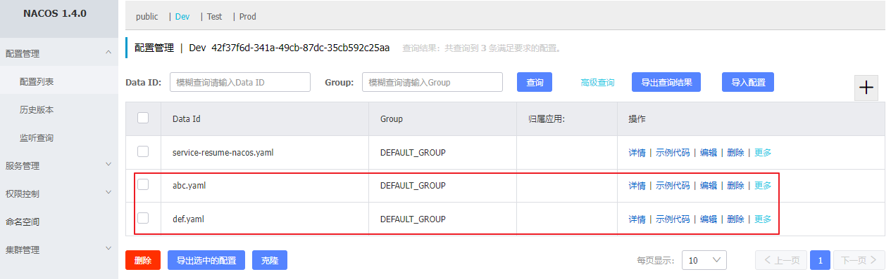


#### 步骤2：微服务项目开启 Nacos 配置管理

##### （1）依赖包

```xml
<!-- nacos config client 依赖-->
<dependency>
    <groupId>com.alibaba.cloud</groupId>
    <artifactId>spring-cloud-starter-alibaba-nacos-config</artifactId>
</dependency>
```


##### （2）bootstrap.yml 配置

```yaml
spring:
 # nacos 配置
  cloud:
    nacos:
      # nacos config 服务配置中心
      config:
        # 集群节点信息
        #server-addr: 127.0.0.1:8851,127.0.0.1:8852,127.0.0.1:8853

        # 单机模式
        server-addr: 127.0.0.1:8848
        namespace: 42f37f6d-341a-49cb-87dc-35cb592c25aa   # 命名空间id
        group: DEFAULT_GROUP   # 默认分组为 DEFAULT_GROUP，如果使用默认分组可以不配置
        # 根据规则拼接 dataId：${prefix}-${spring.profile.active}.${file-extension}
        # service-resume-nacos.yaml
        file-extension: yaml   # 文件扩展名，默认 properties

        # 关于优先级：根据规则生成的 dataId > 扩展的 dataId（对于扩展的 dataId，n越⼤优先级越高）
        # 扩展 dataId 配置信息（可配置多个 dataId）
        ext-config[0]:
          data-id: abc.yaml
          group: DEFAULT_GROUP
          refresh: true  # 开启扩展 dataId 动态刷新
        ext-config[1]:
          data-id: def.yaml
          group: DEFAULT_GROUP
          refresh: true  # 开启扩展 dataId 动态刷新
```


#### 步骤3：@RefreshScope 实现配置自动更新

- ConfigController.java

```java
@RestController
@RequestMapping("/config")
@RefreshScope  // 配置自动刷新
public class ConfigController {
    @Value("${mysql.url}")
    private String mysqlUrl;

    @Value("${td.message}")
    private String tdMessage;

    //http://localhost:8080/config/viewconfig
    @GetMapping("/viewconfig")
    public String viewconfig() {
        return "tdMessage==>" + tdMessage + " mysqlUrl==>" + mysqlUrl;
    }

    @Value("${abc.test}")
    private String abctest;

    @Value("${def.test}")
    private String deftest;

    //http://localhost:8080/config/dataids
    @GetMapping("/dataids")
    public String dataids() {
        return "abctest==>" + abctest + " deftest==>" + deftest;
    }
}
```


#### 步骤4：访问接口，获取配置信息

##### （1）单个 dataId

- http://localhost:8080/config/viewconfig

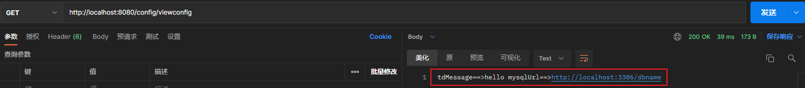


##### （2）扩展 dataId（多个）

- http://localhost:8080/config/dataids

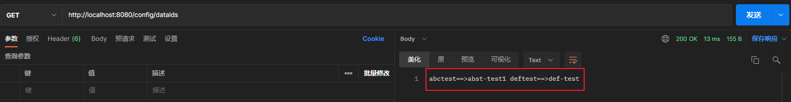


# 第二章 客户端负载均衡 - Dubbo RPC、Loadbalancer


# 第三章 服务熔断 - Sentinel

## 1、Sentinel 简介

### 1.1 Sentinel 概述

- Sentinel 是⼀个⾯向云原⽣微服务的流量控制、熔断降级组件。
- 替代Hystrix，针对问题：服务雪崩、服务降级、服务熔断、服务限流
- Sentinel 分为核⼼库和控制台两个部分

```
核⼼库：（Java 客户端）
- 不依赖任何框架/库，能够运⾏于所有 Java 运⾏时环境，同时对 Dubbo / Spring Cloud 等框架也有较好的⽀持

控制台：（Dashboard）
- 基于 Spring Boot 开发，打包后可以直接运⾏，不需要额外的 Tomcat 等应⽤容器。
```


### 1.2  Sentinel 优点

- 独⽴可部署Dashboard/控制台组件
- 减少代码开发，通过UI界⾯配置即可完成细粒度控制


### 1.3 Sentinel 特点

#### （1）丰富的应用场景

- Sentinel 承接了阿⾥巴巴近 10 年的双⼗⼀⼤促流量的核⼼场景
- 例如秒杀（即突发流量控制在系统容量可以承受的范围）、消息削峰填⾕、集群流量控制、实时熔断下游不可⽤应⽤等。


#### （2）完备的实时监控

- Sentinel 同时提供实时的监控功能

- 可以在控制台中看到接⼊应⽤的单台机器秒级数据，甚⾄ 500 台以下规模的集群的汇总运⾏情况

  

#### （3）广泛的开源生态

- Sentinel 提供开箱即⽤的与其它开源框架/库的整合模块
- 例如与 Spring Cloud、Dubbo的整合。只需要引⼊相应的依赖并进⾏简单的配置即可快速地接⼊ Sentinel


#### （4）完善的 SPI 扩展点

- Sentinel 提供简单易⽤、完善的 SPI 扩展接⼝
- 可以通过实现扩展接⼝来快速地定制逻辑。例如定制规则管理、适配动态数据源等。


## 2、Sentinel DashBoard 部署

- 下载地址：https://github.com/alibaba/Sentinel/releases/tag/1.7.1
- 启动命令：java -jar sentinel-dashboard-1.7.1.jar
- 访问地址：http://localhost:8080/
- ⽤户名/密码：sentinel/sentinel

- 界面

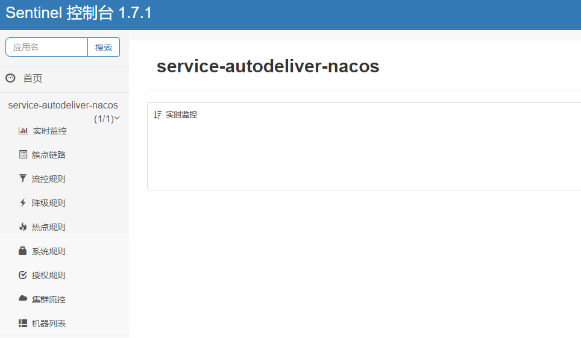


## 3、Sentinel 服务限流（/流量控制规则/限流模式）

### 3.0 流控规则界面详解

#### （1）资源名

- 默认请求路径


#### （2）针对来源

- Sentinel 可以针对调⽤者进⾏限流，填写微服务名称，默认default（不区分来源）


#### （3）阈值类型/单机阈值

- QPS：（每秒钟请求数量）当调⽤该资源的QPS达到阈值时进⾏限流
- 线程数：当调⽤该资源的线程数达到阈值的时候进⾏限流（线程处理请求的时候，如果说业务逻辑执⾏时间很⻓，流量洪峰来临时，会耗费很多线程资源，这些线程资源会堆积，最终可能造成服务不可⽤，进⼀步上游服务不可⽤，最终可能服务雪崩）


#### （4）是否集群

- 是否集群限流


#### （5）流控模式

- 直接：资源调⽤达到限流条件时，直接限流
- 关联：关联的资源调⽤达到阈值时候限流⾃⼰

- 链路：只记录指定链路上的流量，链路模式下会控制该资源所在的调⽤链路⼊⼝的流量。需要在规则中配置⼊⼝资源，即该调⽤链路⼊⼝的上下⽂名称


#### （6）流控效果

- 快速失败：直接失败，抛出异常
- Warm Up：根据冷加载因⼦（默认3）的值，从阈值/冷加载因⼦，经过预热时⻓，才达到设置的QPS阈值
- 排队等待：匀速排队，让请求匀速通过，阈值类型必须设置为QPS，否则⽆效


### 3.1 流控规则：QPS - 直接

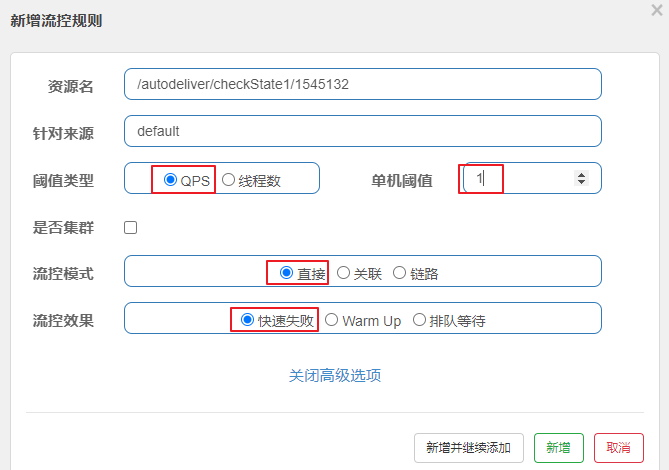


### 3.2 流控规则：线程数 - 直接

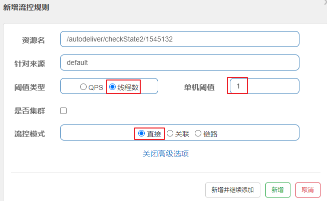


### 3.3 流控规则：QPS/线程数 - 关联

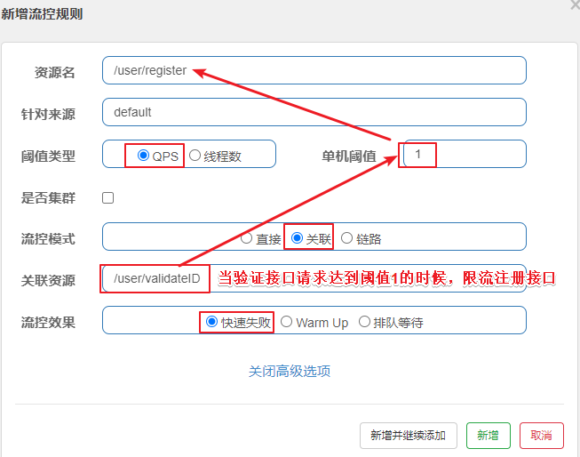


### 3.4 流控规则：QPS/线程数 - 链路

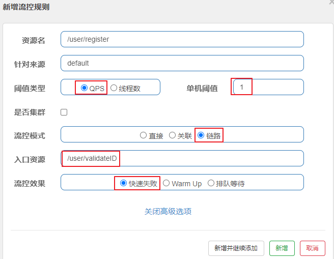


### 3.5 流控规则：QPS -  Warm Up预热

- 预热时长内（1s -10s），阈值为设定值 9 的 1/3，即 3
- 预热时长后（10s +），阈值恢复到设定大小，即 9

```
- 概述：通过 Warm Up 模式（预热模式），让通过的流量缓慢增加，经过设置的预热时间以后，到达系统处理请求速率的设定值。
- 过程：Warm Up 模式默认会从设置的 QPS 阈值的 1/3 开始慢慢往上增加⾄ QPS 设置值
- 场景：当系统⻓期处于空闲的情况下，当流量突然增加时，直接把系统拉升到⾼⽔位可能瞬间把系统压垮，⽐如电商⽹站的秒杀模块。
```

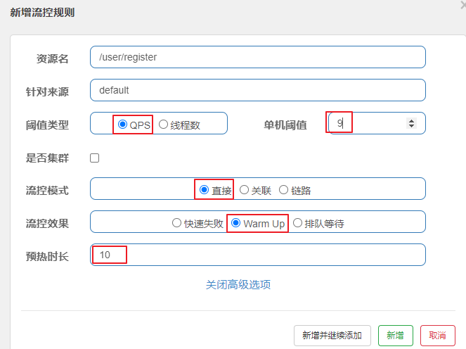


### 3.6 流控规则：QPS -  排队等待

- 排队等待模式下会严格控制请求通过的间隔时间，即请求会匀速通过，允许部分请求排队等待，通常⽤于消息队列削峰填⾕等场景。需设置具体的超时时间，当计算的等待时间超过超时时间时请求就会被拒绝。
- 很多流量过来了，并不是直接拒绝请求，⽽是请求进⾏排队，⼀个⼀个匀速通过（处理），请求能等就等着被处理，不能等（等待时间>超时时间）就会被拒绝
- 例如，QPS 配置为 5，则代表请求每 200 ms 才能通过⼀个，多出的请求将排队等待通过。超时时间代表最⼤排队时间，超出最⼤排队时间的请求将会直接被拒绝。
- 排队等待模式下，QPS 设置值不要超过 1000（请求间隔 1 ms）。

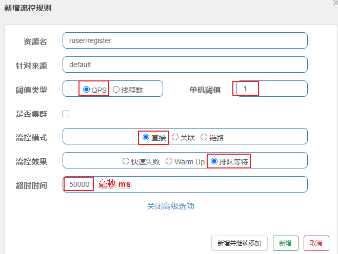


## 4、Sentinel 服务降级（/服务熔断/降级规则/降级策略）

- Sentinel 降级会在调⽤链路中某个资源出现不稳定状态时（例如调⽤超时或异常⽐例升⾼），对这个资源的调⽤进⾏限制，让请求快速失败，避免影响到其它的资源⽽导致级联错误

- 当资源被降级后，在接下来的降级时间窗⼝之内，对该资源的调⽤都⾃动熔断

  

### 4.1 降级策略：RT（平均响应时间 ）

- 当 1s 内持续进⼊ >=5 个请求，平均响应时间超过阈值（以 ms 为单位），那么在接下的时间窗⼝（以 s 为单位）之内，对这个⽅法的调⽤都会⾃动地熔断（抛出 DegradeException）

```
注意：
- Sentinel 默认统计的 RT 上限是 4900 ms
- 超出此阈值的都会算作 4900 ms
- 若需要变更此上限可以通过启动配置项 -Dcsp.sentinel.statistic.max.rt=xxx 来配置
```

- 流程图


- 添加规则示意图

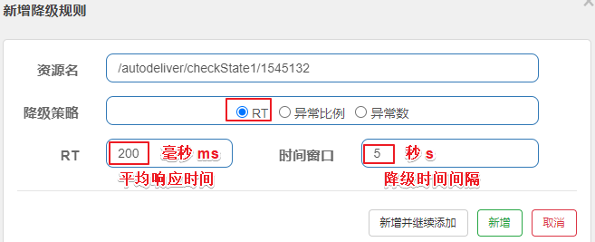


### 4.2 降级策略：异常比例

- 当资源的每秒请求量 >= 5，并且每秒异常总数占通过量的⽐值超过阈值之后，资源进⼊降级状态，即在接下的时间窗⼝（以 s 为单位）之内，对这个⽅法的调⽤都会⾃动地返回
- 异常⽐率的阈值范围是 [0.0, 1.0] ，代表 0% - 100%

- 流程图


- 添加规则示意图

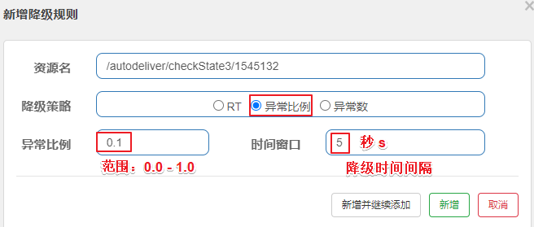


### 4.3 降级策略：异常数

- 当资源近 1 分钟的异常数⽬超过阈值之后会进⾏熔断
- 由于统计时间窗⼝是分钟级别的，若 timeWindow ⼩于 60s，则结束熔断状态后仍可能再进⼊熔断状态。因此设置 时间窗⼝ >= 60s

- 流程图


- 添加规则示意图

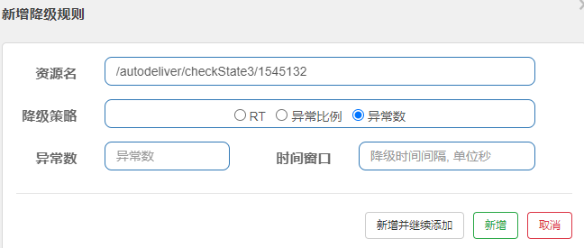


### 4.4 Sentinel 自定义兜底方法

#### 步骤1：在 API 接口资源处配置

- AutodeliverController
- http://localhost:8091/autodeliver/checkState4/1545132

```java
@SentinelResource(
        value = "findResumeOpenState4",
        blockHandlerClass = SentinelHandlersClass.class,
        blockHandler = "handleException",   // ⽤来指定不满⾜ Sentinel 规则的降级兜底⽅法
        fallbackClass = SentinelHandlersClass.class,
        fallback = "handleError")           // ⽤于指定 Java 运⾏时异常兜底⽅法
@GetMapping("/checkState4/{userId}")
public Integer findResumeOpenState4(@PathVariable Long userId) {
    // 模拟降级：异常比例
    int i = 1/0;
  
    Integer defaultResumeState = resumeServiceFeignClient.findDefaultResumeState(userId);
    return defaultResumeState;
}
```


#### 步骤2：自定义兜底逻辑类

- SentinelHandlersClass

- 兜底类中的方法为 static 静态方法

```java
import com.alibaba.csp.sentinel.slots.block.BlockException;

public class SentinelHandlersClass {
    // 在形参中添加BlockException参数，用于接收异常
    public static Integer handleException(Long userId, BlockException blockException) {
        return -100;
    }

    public static Integer handleError(Long userId) {
        return -500;
    }
}
```


#### 步骤3：测试

- http://localhost:8091/autodeliver/checkState4/1545132


## 5、基于 Nacos 实现 Sentinel 规则持久化

- ⼀个资源可以同时有多个限流规则和降级规则，所以配置集中是⼀个json数组
- Sentinel控制台中修改规则，仅是内存中⽣效，不会修改Nacos中的配置值，重启后恢复原来的值
- Nacos控制台中修改规则，不仅内存中⽣效，Nacos 中持久化规则也⽣效，重启后规则依然保持

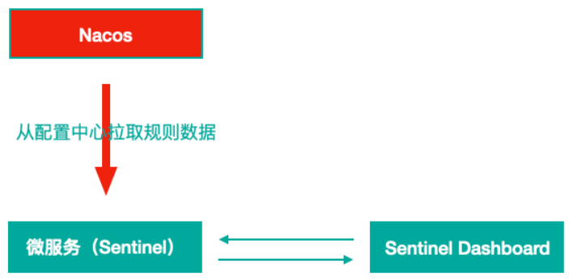


### 步骤1：pom.xml

- service-autodeliver-nacos-8091-sentinel

```xml
<!-- Sentinel 支持采用 Nacos 作为规则配置数据源，引入该适配依赖 -->
<dependency>
    <groupId>com.alibaba.csp</groupId>
    <artifactId>sentinel-datasource-nacos</artifactId>
</dependency>
```


### 步骤2：application.yml

```yaml
spring:
  application:
    name: service-autodeliver-nacos
  cloud:
    # nacos 配置
    nacos:
      # nacos discovery 服务注册中心
      discovery:
        # 集群节点信息
        #server-addr: 127.0.0.1:8851,127.0.0.1:8852,127.0.0.1:8853
        # 集群名称（默认为 default）
        #cluster-name: TD

        # 单机模式
        server-addr: 127.0.0.1:8848
        namespace: 42f37f6d-341a-49cb-87dc-35cb592c25aa   # 命名空间id

    # sentinel 配置
    sentinel:
      transport:
        dashboard: 127.0.0.1:8080 # sentinel dashboard 地址
        port: 8719   #  sentinel会在该端口启动 http server，控制台定义的一些限流等规则才能发送传递过来，如果8719端口被占用，那么会依次+1
      # Sentinel Nacos 数据源配置（Nacos 中的规则会自动同步到 sentinel 流控规则中）
      datasource:
        # 自定义 流控规则 数据源名称
        flow:
          nacos:
            server-addr: ${spring.cloud.nacos.discovery.server-addr}
            data-id: ${spring.application.name}-flow-rules
            groupId: DEFAULT_GROUP
            data-type: json
            rule-type: flow     # 类型来自 Sentinel 中的 RuleType 类
        # 自定义 降级规则 数据源名称
        degrade:
          nacos:
            server-addr: ${spring.cloud.nacos.discovery.server-addr}
            data-id: ${spring.application.name}-degrade-rules
            groupId: DEFAULT_GROUP
            data-type: json
            rule-type: degrade  # 类型来自 Sentinel 中的 RuleType 类
```


### 步骤3：Nacos Server 中添加对应规则配置集 datId

#### （1）流控规则配置集 service-autodeliver-nacos-flow-rules

- resource：资源名称
- limitApp：来源应⽤
- grade：阈值类型（0 线程数、1 QPS）
- count：单机阈值
- strategy：流控模式（0 直接、1 关联、2 链路）
- controlBehavior：流控效果（0 快速失败、1 Warm Up、2 排队等待）
- clusterMode：是否集群（true、false）

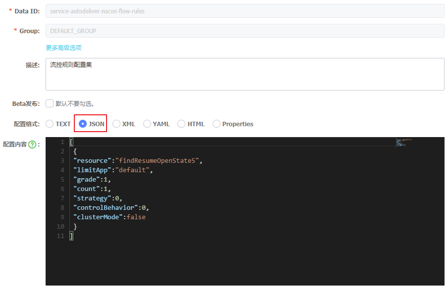


#### （2）降级规则配置集 service-autodeliver-nacos-degrade-rules

- resource：资源名称
- grade：降级策略（0 RT、1 异常⽐例、2 异常数）
- count：阈值
- timeWindow：时间窗

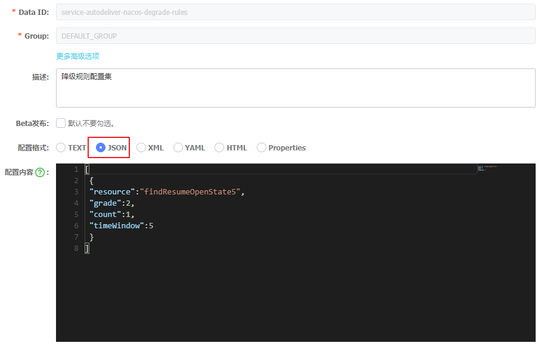


### 步骤4：接口调用

```java
@SentinelResource(
        value = "findResumeOpenState5",
        blockHandlerClass = SentinelHandlersClass.class,
        blockHandler = "handleException",
        fallbackClass = SentinelHandlersClass.class,
        fallback = "handleError")
@GetMapping("/checkState5/{userId}")
public Integer findResumeOpenState5(@PathVariable Long userId) {
    Integer defaultResumeState = resumeServiceFeignClient.findDefaultResumeState(userId);
    return defaultResumeState;
}
```


### 步骤5：访问

- http://localhost:8091/autodeliver/checkState5/1545132


# 第四章 远程服务调用 - Dubbo RPC


# ========================================================================================================================


# Nacos + Sentinel + Dubbo 整合

## 1、service-dubbo-api

- ResumeService

```java
public interface ResumeService {
    Integer findDefaultResumeByUserId(Long userId);
}
```


## 2、service-resume-nacos-8082-sentinel-dubbo

### 步骤1：pom.xml

```xml
<dependencies>
    <dependency>
        <groupId>com.loto</groupId>
        <artifactId>resume-service-common</artifactId>
        <version>0.0.1-SNAPSHOT</version>
    </dependency>

    <!-- nacos service discovery client 依赖-->
    <dependency>
        <groupId>com.alibaba.cloud</groupId>
        <artifactId>spring-cloud-starter-alibaba-nacos-discovery</artifactId>
    </dependency>

    <!-- nacos config client 依赖-->
    <dependency>
        <groupId>com.alibaba.cloud</groupId>
        <artifactId>spring-cloud-starter-alibaba-nacos-config</artifactId>
    </dependency>

    <!-- spring cloud + dubbo 依赖-->
    <dependency>
        <groupId>com.alibaba.cloud</groupId>
        <artifactId>spring-cloud-starter-dubbo</artifactId>
    </dependency>

    <!-- sentinel + dubbo 适配器 -->
    <dependency>
        <groupId>com.alibaba.csp</groupId>
        <artifactId>sentinel-apache-dubbo-adapter</artifactId>
    </dependency>

    <!-- dubbo 服务接口 -->
    <dependency>
        <groupId>com.loto</groupId>
        <artifactId>service-dubbo-api</artifactId>
        <version>1.0-SNAPSHOT</version>
    </dependency>
</dependencies>
```


### 步骤2：bootstrap.yml

```yaml
server:
  port: 8082

spring:
  application:
    name: service-resume-nacos
  # SpringBoot 2.1 版本，整合 Nacos + Sentinel + Dubbo 需要设定
  main:
    allow-bean-definition-overriding: true
  datasource:
    driver-class-name: com.mysql.cj.jdbc.Driver
    url: jdbc:mysql://localhost:3306/SpringCloud?useUnicode=true&characterEncoding=utf8&serverTimezone=UTC
    username: root
    password: root
  jpa:
    database: MySQL
    show-sql: true
    hibernate:
      naming:
        physical-strategy: org.hibernate.boot.model.naming.PhysicalNamingStrategyStandardImpl  #避免将驼峰命名转换为下划线命名
  # nacos 配置
  cloud:
    nacos:
      # nacos discovery 服务注册中心
      discovery:
        # 集群节点信息
        #server-addr: 127.0.0.1:8851,127.0.0.1:8852,127.0.0.1:8853
        # 集群名称（默认为 default）
        #cluster-name: TD

        # 单机模式
        server-addr: 127.0.0.1:8848
        namespace: 42f37f6d-341a-49cb-87dc-35cb592c25aa   # 命名空间id

      # nacos config 服务配置中心
      config:
        # 集群节点信息
        #server-addr: 127.0.0.1:8851,127.0.0.1:8852,127.0.0.1:8853

        # 单机模式
        server-addr: 127.0.0.1:8848
        namespace: 42f37f6d-341a-49cb-87dc-35cb592c25aa   # 命名空间id
        group: DEFAULT_GROUP   # 默认分组为 DEFAULT_GROUP，如果使用默认分组可以不配置
        # 根据规则拼接 dataId：${prefix}-${spring.profile.active}.${file-extension}
        # service-resume-nacos.yaml
        file-extension: yaml   # 文件扩展名，默认 properties

        # 关于优先级：根据规则生成的 dataId > 扩展的 dataId（对于扩展的 dataId，n越⼤优先级越高）
        # 扩展 dataId 配置信息（可配置多个 dataId）
        ext-config[0]:
          data-id: abc.yaml
          group: DEFAULT_GROUP
          refresh: true  # 开启扩展 dataId 动态刷新
        ext-config[1]:
          data-id: def.yaml
          group: DEFAULT_GROUP
          refresh: true  # 开启扩展 dataId 动态刷新


# 暴露通信端口
management:
  endpoints:
    web:
      exposure:
        # include: refresh
        # *表示暴露所有端口
        include: "*"


# dubbo 配置
dubbo:
  scan:
    base-packages: com.loto.service.impl   # dubbo 服务扫描基准包
  protocol:
    name: dubbo  # dubbo 协议
    port: -1     # dubbo 协议端口（ -1 表示自增端口，从 20880 开始）
    host: 127.0.0.1
  registry:
    address: spring-cloud://localhost   # 挂载到 Spring Cloud 的注册中心 Nacos
```


### 步骤3：启动类

- ResumeApplication8082

```java
@SpringBootApplication
@EntityScan("com.loto.pojo")
// 开启注册中心客户端 （通用型注解，使用Eureka或者Nacos等作为注册中心时使用）
@EnableDiscoveryClient
public class ResumeApplication8082 {
    public static void main(String[] args) {
        SpringApplication.run(ResumeApplication8082.class,args);
    }
}
```


### 步骤4：ResumeDao.java

```java
public interface ResumeDao extends JpaRepository<Resume,Long> {
}
```


### 步骤5：ResumeServiceImpl.java

```java
import com.loto.ResumeService;
import com.loto.dao.ResumeDao;
import com.loto.pojo.Resume;
import org.apache.dubbo.config.annotation.Service;
import org.springframework.beans.factory.annotation.Autowired;
import org.springframework.data.domain.Example;

// import org.apache.dubbo.config.annotation.Service;
@Service
public class ResumeServiceImpl implements ResumeService {
    @Autowired
    private ResumeDao resumeDao;

    @Override
    public Integer findDefaultResumeByUserId(Long userId) {
        Resume resume = new Resume();
        resume.setUserId(userId);
        resume.setIsDefault(1);    // 查询默认简历

        Example<Resume> example = Example.of(resume);
        //return resumeDao.findOne(example).get();

        return 8082;
    }
}
```


## 3、service-autodeliver-nacos-8092-sentinel-dubbo

### 步骤1：pom.xml

```xml
<dependencies>
    <!-- nacos service discovery client 依赖-->
    <dependency>
        <groupId>com.alibaba.cloud</groupId>
        <artifactId>spring-cloud-starter-alibaba-nacos-discovery</artifactId>
    </dependency>

    <!-- sentinel 核心环境 依赖-->
    <dependency>
        <groupId>com.alibaba.cloud</groupId>
        <artifactId>spring-cloud-starter-alibaba-sentinel</artifactId>
    </dependency>

    <!-- Sentinel 支持采用 Nacos 作为规则配置数据源，引入该适配依赖 -->
    <dependency>
        <groupId>com.alibaba.csp</groupId>
        <artifactId>sentinel-datasource-nacos</artifactId>
    </dependency>

    <!-- spring cloud + dubbo 依赖-->
    <dependency>
        <groupId>com.alibaba.cloud</groupId>
        <artifactId>spring-cloud-starter-dubbo</artifactId>
    </dependency>

    <!-- sentinel + dubbo 适配器 -->
    <dependency>
        <groupId>com.alibaba.csp</groupId>
        <artifactId>sentinel-apache-dubbo-adapter</artifactId>
    </dependency>

    <!-- dubbo 服务接口 -->
    <dependency>
        <groupId>com.loto</groupId>
        <artifactId>service-dubbo-api</artifactId>
        <version>1.0-SNAPSHOT</version>
    </dependency>
</dependencies>
```


### 步骤2：application.yml

```yaml
server:
  port: 8092

spring:
  application:
    name: service-autodeliver-nacos
  cloud:
    # nacos 配置
    nacos:
      # nacos discovery 服务注册中心
      discovery:
        # 集群节点信息
        #server-addr: 127.0.0.1:8851,127.0.0.1:8852,127.0.0.1:8853
        # 集群名称（默认为 default）
        #cluster-name: TD

        # 单机模式
        server-addr: 127.0.0.1:8848
        namespace: 42f37f6d-341a-49cb-87dc-35cb592c25aa   # 命名空间id

    # sentinel 配置
    sentinel:
      transport:
        dashboard: 127.0.0.1:8080 # sentinel dashboard 地址
        port: 8719   #  sentinel会在该端口启动 http server，控制台定义的一些限流等规则才能发送传递过来，如果8719端口被占用，那么会依次+1
      # Sentinel Nacos 数据源配置（Nacos 中的规则会自动同步到 sentinel 流控规则中）
      datasource:
        # 自定义 流控规则 数据源名称
        flow:
          nacos:
            server-addr: ${spring.cloud.nacos.discovery.server-addr}
            data-id: ${spring.application.name}-flow-rules
            groupId: DEFAULT_GROUP
            namespace: 42f37f6d-341a-49cb-87dc-35cb592c25aa   # 命名空间id
            data-type: json
            rule-type: flow     # 类型来自 Sentinel 中的 RuleType 类
        # 自定义 降级规则 数据源名称
        degrade:
          nacos:
            server-addr: ${spring.cloud.nacos.discovery.server-addr}
            data-id: ${spring.application.name}-degrade-rules
            groupId: DEFAULT_GROUP
            namespace: 42f37f6d-341a-49cb-87dc-35cb592c25aa   # 命名空间id
            data-type: json
            rule-type: degrade  # 类型来自 Sentinel 中的 RuleType 类


# springboot 中暴露健康检查等断点接口
management:
  endpoints:
    web:
      exposure:
        include: "*"
  # 暴露健康接口的细节
  endpoint:
    health:
      show-details: always
```


### 步骤3：启动类

- AutodeliverApplication8092

```java
@SpringBootApplication
@EnableDiscoveryClient
public class AutodeliverApplication8092 {
    public static void main(String[] args) {
        SpringApplication.run(AutodeliverApplication8092.class, args);
    }
}
```


### 步骤4：SentinelHandlersClass.java

```java
import com.alibaba.csp.sentinel.slots.block.BlockException;

public class SentinelHandlersClass {
    // 触发在 Sentinel DashBoard 设置的降级策略后，接收异常，返回自定义兜底数据
    // 在形参中添加 BlockException 参数，用于接收异常
    public static Integer handleException(Long userId, BlockException blockException) {
        return -100;
    }

    // 触发 java 程序异常
    public static Integer handleError(Long userId) {
        return -500;
    }
}
```


### 步骤5：AutodeliverController.java

```java
import com.alibaba.csp.sentinel.annotation.SentinelResource;
import com.loto.ResumeService;
import com.loto.config.SentinelHandlersClass;
import org.apache.dubbo.config.annotation.Reference;
import org.springframework.web.bind.annotation.GetMapping;
import org.springframework.web.bind.annotation.PathVariable;
import org.springframework.web.bind.annotation.RequestMapping;
import org.springframework.web.bind.annotation.RestController;

@RestController
@RequestMapping("/autodeliver")
public class AutodeliverController {
    @Reference
    private ResumeService resumeService;

    //http://localhost:8092/autodeliver/checkState/1545132
    @GetMapping("/checkState/{userId}")
    @SentinelResource(
            value = "findResumeOpenState",
            blockHandlerClass = SentinelHandlersClass.class,
            blockHandler = "handleException",   // ⽤来指定不满⾜ Sentinel 规则的降级兜底⽅法
            fallbackClass = SentinelHandlersClass.class,
            fallback = "handleError")           // ⽤于指定 Java 运⾏时异常兜底⽅法
    public Integer findResumeOpenState(@PathVariable Long userId) {
        return resumeService.findDefaultResumeByUserId(userId);
    }
}
```


## 4、启动微服务

- service-resume-nacos-8082-sentinel-dubbo

- service-autodeliver-nacos-8092-sentinel-dubbo


## 5、测试地址

- http://localhost:8092/autodeliver/checkState/1545132


## 6、Nacos Server 效果

- 运⾏发布之后，会发现 Nacos 控制台已经有了服务注册信息，从元数据中可以看出是 dubbo 注册上来的

  

### （1）服务管理 - 服务列表 - service-autodeliver-nacos

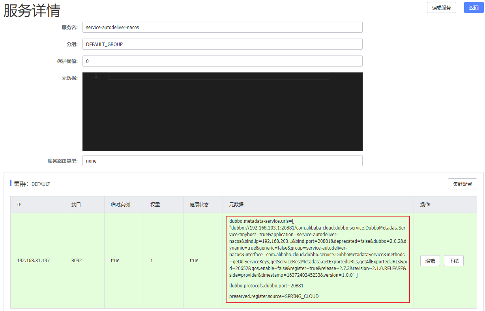


### （2）服务管理 - 服务列表 - service-resume-nacos

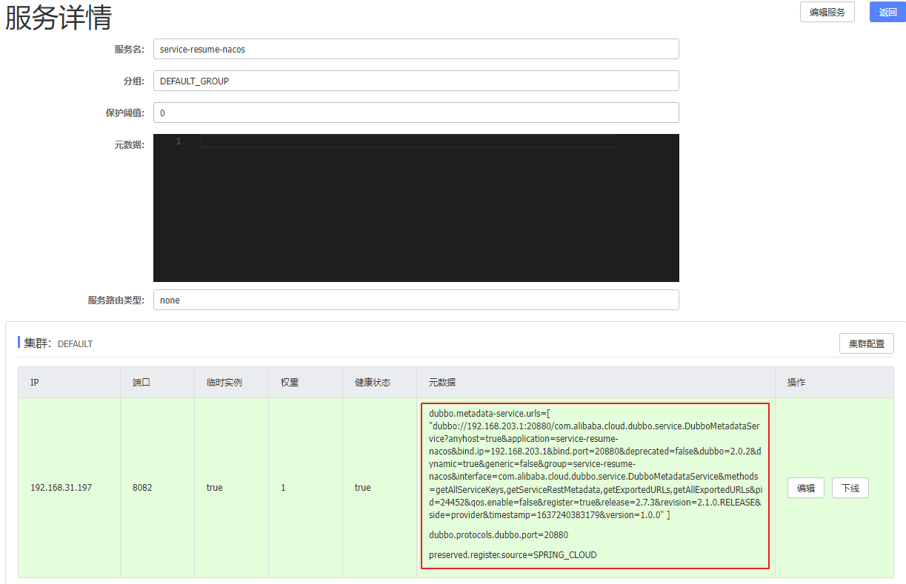


# ========================================================================================================================


# 第五章 网关 - Spring Cloud Gateway


# 第六章 消息驱动 - Spring Cloud Stream


# 第七章 分布式链路追踪 - Spring Cloud Sleuth + Twitter Zipkin


# 第八章 统一认证方案 - Spring Cloud OAuth2 + JWT


# 第九章 分布式事务解决方案 - Seata

