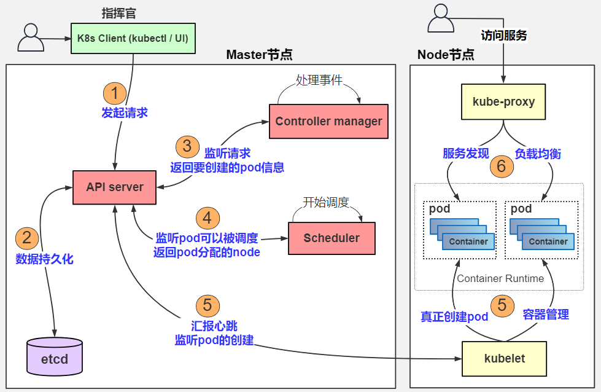

> 当前位置：【Java】11_EfficiencyTools（效率工具） -> 11.8_ContainerOrchestration（容器编排） -> 02_Kubernetes（K8S）


# K8S 下载安装和配置

## 0、K8S 网站

- 英文官网：https://kubernetes.io/
- 中文官网：https://www.kubernetes.org.cn/


## 1、K8S 集群安装和配置

-  环境要求

```bash
# 系统
centos7.7 +

# 名称和 ip
k8s-master01 192.168.198.156
k8s-node01 192.168.198.157
k8s-node02 192.168.198.158
k8s-node03 192.168.198.159
```

- 主节点（k8s-master01）

```bash
# 使用 docker 下载 k8s 镜像

# 初始化
kubeadm init --apiserver-advertise-address=192.168.198.156 --kubernetes- version v1.17.5 --service-cidr=10.1.0.0/16 --pod-network-cidr=10.81.0.0/16

# 配置
mkdir -p $HOME/.kube 
sudo cp -i /etc/kubernetes/admin.conf $HOME/.kube/config 
sudo chown $(id -u):$(id -g) $HOME/.kube/config

# 加入
kubeadm join 192.168.198.156:6443 --token 8ic4bd.ns2wgycdqx5ey7go \ --discovery-token-ca-cert-hash sha256:3b883e6c1f0dcb29834dd08af8eb6e105854d0a475edb3630afc4539fd4f95c8
```

- 工作节点

```bash
# 加入主节点，三个节点都执行
kubeadm join 192.168.198.156:6443 --token 8ic4bd.ns2wgycdqx5ey7go \ --discovery-token-ca-cert-hash sha256:3b883e6c1f0dcb29834dd08af8eb6e105854d0a475edb3630afc4539fd4f95c8
```

- k8s 集群网络配置

```bash
# 主节点执行（文件需要上传到服务器，然后执行）
kubectl apply -f calico.yml
```

- 查看集群状态

```bash
kubectl get nodes
```


# K8S 命令

## 1、NameSpace 命名空间

```bash
# 创建命名空间
kubectl create namespace td
# 简写命令
kubectl create ns td

# 查看命名空间
kubectl get namespace
# 简写命令 
kubectl get ns

# 查看所有命名空间的pod资源
kubectl get pod --all-namespaces 
kubectl get pod -A 

# 删除命名空间
kubectl delete namespace td 
# 简写命令 
kubectl delete ns td
```


## 2、Pod

### 2.1 查看 Pod

```bash
# 查看default命名空间下的pods 
kubectl get pods 

# 查看kube-system命名空间下的pods 
kubectl get pods -n kube-system 

# 查看所有命名空间下的pods 
kubectl get pod --all-namespaces 
kubectl get pod -A
```


### 2.2 创建 Pod

- 下载镜像

```bash
# K8S集群的每一个节点都需要下载镜像:选择不同的基础镜像，下载镜像的大小也不同。 
# 108MB
docker pull tomcat:9.0.20-jre8-alpine 
# 305MB 
docker pull tomcat:9.0.37-jdk8-openjdk-slim
# 531MB
docker pull tomcat:9.0.37-jdk8  

# 备份镜像
docker save -o tomcat9.tar tomcat:9.0.20-jre8-alpine 

# 导入镜像
docker load -i tomcat9.tar
```

- 运行 Pod

```bash
# 在default命名空间中创建一个pod副本的deployment 
kubectl run tomcat9-test --image=tomcat:9.0.20-jre8-alpine --port=8080 
kubectl get pod 
kubectl get pod -o wide 

# 将副本扩容至3个 
kubectl scale --replicas=3 deployment/tomcat9-test 
kubectl get deployment 
kubectl get deployment -o wide 

# 创建服务
kubectl expose deployment tomcat9-test --name=tomcat9-svc --port=8888 -- target-port=8080 --protocol=TCP --type=NodePort 
kubectl get svc 
kubectl get svc -o wide 

# 访问服务端口 
curl 10.105.225.0:8888 

# 访问集群外端口 
http://192.168.198.120:30217
```


# 第一章 K8S 简介

## 1、K8S 概述

- Kubernetes是一个用于在集群环境中管理容器化应用程序的开源系统。以正确的方式使用Kubernetes可以帮助DevOps作为一个服务团队自动扩展应用程序，并在零停机的情况下进行更新。


## 2、K8S 优点

### （1）速度很快

- 在不停机的情况下持续部署新功能时，Kubernetes是一个完美的选择。
- Kubernetes的目标是以恒定的正常运行时间更新应用程序。它的速度通过您每小时可以运送的许多功能来衡量，同时保持可用的服务。

### （2）遵循不可变基础架构的原则

- 在传统的方法中，如果多个更新出现错误，您没有任何关于部署了多少个更新以及发生错误的时间点的记录。在不可变的基础架构中，如果想要更新任何应用程序，需要使用新标记构建容器映像并部署它，用旧映像版本销毁旧容器。这样，你就会有一个记录，并了解你做了什么，万一有什么错误;您可以轻松地回滚到前面的映像。

### （3）提供声明式配置

- 用户可以知道系统应该处于什么状态以避免错误。源代码控制、单元测试等传统
- 工具不能与命令式配置一起使用，但可以与声明式配置一起使用。

### （4）大规模部署和更新软件

- 由于Kubernetes具有不可变的声明性，因此扩展很容易
- Kubernetes提供了一些用于扩展目的的有用功能
  - 水平基础架构扩展：在单个服务器级别执行操作以应用水平扩展。可以毫不费力地添加或分离atest服务器。
  - 自动扩展：根据CPU资源或其他应用程序指标的使用情况，您可以更改正在运行的容器数
  - 手动扩展：您可以通过命令或界面手动扩展正在运行的容器的数量
  - 复制控制器：复制控制器确保集群在运行状态下具有指定数量的等效pod。如果存在太多pod，则复制控制器可以删除额外的pod，反之亦然。

### （5）处理应用程序的可用性

- Kubernetes检查节点和容器的运行状况，并在由于错误导致的盒中崩溃时提供自我修复和自动替换。此外，它在多个pod之间分配负载，以便在意外流量期间快速平衡资源。

### （6）存储卷

- 在Kubernetes中，数据是在容器之间共享的，但是如果pod被杀死，则自动删除卷。此外，数据是远程存储的，因此如果将pod移动到另一个节点，数据将一直保留，直到用户删除它。


## 3、K8S 缺点

### （1）初始进程需要时间

- 当创建一个新进程时，您必须等待应用程序启动，然后用户才能使用它。如果您要迁移到Kubernetes，则需要对代码库进行修改，以提高启动流程的效率，这样用户就不会有不好的体验。

### （2）迁移到无状态需要做很多工作

- 如果您的应用程序是集群的或无状态的，那么将不会配置额外的pod，并且必须重新处理应用程序中的配置。

### （3）安装过程非常单调乏味

- 如果不使用Azure、谷歌或Amazon等云提供商，就很难在集群上设置Kubernetes。


# 第二章 K8S 架构




## 1、控制平面组件（Control Plane Components）


## 2、Node 组件


## 3、Pod

### 3.1 Pod 生命周期

### 3.2 Pod 控制器

#### （1）ReplicaSet

#### （2）Deployment

#### （3）DaemonSet

#### （4）Job

#### （5）StatefulSet


## 4、Service

### （1）ClusterIp

### （2）NodePort

### （3）LoadBalancer

### （4）ExternalName


# 第三章 K8S 网络 - Ingress


# 第四章 K8S 存储 - volume


# 第五章 K8S 高可用

## 1、kubespray

## 2、Sealos


# 第六章 K8S 集群安全

- Kubernetes 使用了认证（Authentication）、鉴权（Authorization）、准入控制（AdmissionControl）三步来保证API Server的安全


## 1、认证（Authentication）

#### 方式1：第三方授权协议 authenticating proxy

#### 方式2：HTTP Token 认证

#### 方式3：HTTP Base 认证

#### 方式4：最严格的 HTTPS 证书认证（K8S使用此方式）


## 2、鉴权（Authorization）


## 3、准入控制（AdmissionControl）


