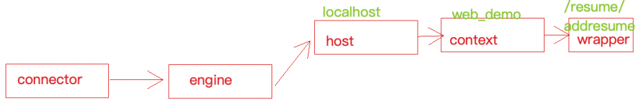

> 【Java】12_EfficiencyTools（效率工具）-> 12.8_DeployContainer（部署容器）-> 01_ApacheTomcat


# 第一章 Tomcat 下载安装和配置

## 0、Tomcat 下载

### （1）官网地址

- https://tomcat.apache.org/


### （2）Tomcat 与 JDK 版本

- https://tomcat.apache.org/whichversion.html


## 1、Docker - Tomcat安装和配置

- Docker-Tomcat官网地址：https://hub.docker.com/_/tomcat

  

### 1.1 拉取镜像

```shell
docker pull tomcat:8.5.41-alpine
```


### 1.2 备份镜像

```shell
cd /docker_data/
docker save tomcat:8.5.41-alpine -o tomcat:8.5.tar
```


### 1.3 导入镜像

```shell
docker load -i tomcat:8.5.tar
```


### 1.4 Linux 创建并运行容器

#### （1）创建文件夹

```shell
# 创建三个文件夹，对应三个Tomcat挂载目录
mkdir -p /docker_data/tomcat/{localtime,webapps}
mkdir -p /docker_data/tomcat-8081/{localtime,webapps}
mkdir -p /docker_data/tomcat-8082/{localtime,webapps}
```

#### （2）创建容器  

```bash
# 创建三个Tomcat容器
docker run -itd --name tomcat -d -p 8080:8080 --privileged=true -e TZ="Asia/Shanghai" -v /docker_data/tomcat/localtime:/etc/localtime -v /docker_data/tomcat/webapps:/usr/local/tomcat/webapps tomcat:8.5.41-alpine

docker run -itd --name tomcat-8081 -d -p 8081:8080 --privileged=true -e TZ="Asia/Shanghai" -v /docker_data/tomcat-8081/localtime:/etc/localtime -v /docker_data/tomcat-8081/webapps:/usr/local/tomcat/webapps tomcat:8.5.41-alpine

docker run -itd --name tomcat-8082 -d -p 8082:8080 --privileged=true -e TZ="Asia/Shanghai" -v /docker_data/tomcat-8082/localtime:/etc/localtime -v /docker_data/tomcat-8082/webapps:/usr/local/tomcat/webapps tomcat:8.5.41-alpine
```


## 2、Linux系统 - Tomcat安装和配置

```bash
# 下载好之后，使用ftp工具传送到服务器文件夹中
cd /root

# 解压压缩包
tar -zxv -f apache-tomcat-7.0.92.tar.gz -C /usr/local

# 启动tomcat
cd /usr/local/apache-tomcat-7.0.92/bin
./startup.sh

# 查看tomcat日志
cd /usr/local/apache-tomcat-7.0.92/logs
tail -f catalina.out
```


## 3、Win系统 - Tomcat安装和配置


## 4、Mac系统 - Tomcat安装和配置


## 5、Tomcat 目录结构


### （1）bin

```
- 该目录下存放的是二进制可执行文件
- 如果是安装版，这个目录下会有 tomcat6.exe（在控制台下启动Tomcat）、tomcat6w.exe（弹出UGI窗口启动Tomcat）
- 如果是解压版，这个目录下会有 startup.bat（用来启动Tomcat，需要先配置JAVA_HOME环境变量）、shutdown.bat（用来停止Tomcat）
```

### （2）conf

```
这个目录下有四个最为重要的文件:
- server.xml：配置整个服务器信息（例如修改端口号，添加虚拟主机等）

- tomcatusers.xml：存储tomcat用户的文件，这里保存的是tomcat的用户名及密码，以及用户的角色信息。可以按着该文件中的注释信息添加tomcat用户，然后就可以在Tomcat主页中进入Tomcat Manager页面了

- web.xml：部署描述符文件，这个文件中注册了很多MIME类型，即文档类型。这些MIME类型是客户端与服务器之间说明文档类型的，如用户请求一个html网页，那么服务器还会告诉客户端浏览器响应的文档是text/html类型的，这就是一个MIME类型。客户端浏览器通过这个MIME类型就知道如何处理它了。当然是在浏览器中显示这个html文件了。但如果服务器响应的是一个exe文件，那么浏览器就不可能显示它，而是应该弹出下载窗口才对。MIME就是用来说明文档的内容是什么类型的！

- context.xml：对所有应用的统一配置，通常不会去配置它
```

### （3）lib

```
- Tomcat的类库，里面是一大堆jar文件
- 如果需要添加Tomcat依赖的jar文件，可以把它放到这个目录中
- 也可以把应用依赖的jar文件放到这个目录中，这个目录中的jar所有项目都可以共享之，但如果应用再放到其他Tomcat下时就不能再共享这个目录下的Jar包了，所以建议只把Tomcat需要的Jar包放到这个目录下
```

### （4）logs

```
- 记录了Tomcat启动和关闭的信息
- 如果启动Tomcat时有错误，那么异常也会记录在日志文件中
```

### （5）temp

```
- 存放Tomcat的临时文件
- 这个目录下的东西可以在停止Tomcat后删除！
```

### （6）webapps

```
- 存放web项目的目录，其中每个文件夹都是一个项目
- 如果这个目录下已经存在了目录，那么都是tomcat自带的项目
- 其中ROOT是一个特殊的项目，在地址栏中没有给出项目目录时，对应的就是ROOT项目
- http://localhost:8080/examples，进入示例项目，其中examples就是项目名，即文件夹的名字
```

### （7）work

```
- jsp运行时生成的文件，最终运行的文件都在这里
- 通过webapps中的项目生成的！可以把这个目录下的内容删除，再次运行时会生再次生成work目录
- 当客户端用户访问一个JSP文件时，Tomcat会通过JSP生成Java文件，然后再编译Java文件生成class文件，生成的java和class文件都会存放到这个目录下
```


## 6、核心配置文件 conf/server.xml 详解

### 6.1 节点框架

```xml
<!-- Server 根元素，创建⼀个Server实例 -->
<Server>
	<!-- 定义监听器 -->
	<Listener/>
	
	<!-- 定义服务器的全局JNDI资源 -->
	<GlobalNamingResources/>
	
	<!-- 定义⼀个Service服务，⼀个Server标签可以有多个Service服务实例 -->
	<Service>
    <!-- ⽤于配置Service 共享线程池 -->
    <Executor/>

    <!-- ⽤于配置Service 包含的链接器 -->
    <Connector/>

    <!-- ⽤于配置Service中链接器对应的Servlet 容器引擎 -->
    <Engine>
      <!-- ⽤于配置⼀个虚拟主机（可多个）-->
      <Host></Host>
      <Host></Host>
      
			<Host>
        <!-- ⽤于配置⼀个Web应⽤（可多个）-->
      	<Context></Context>
        <Context></Context>
      </Host>
      
    </Engine>
  </Service>
</Server>
```


### 6.2 详细解析

```xml
<?xml version="1.0" encoding="UTF-8"?>

<!-- port：关闭服务器的监听端⼝ -->
<!-- shutdown：关闭服务器的指令字符串 -->
<Server port="8005" shutdown="SHUTDOWN">
	<!-- 以⽇志形式输出服务器 、操作系统、JVM的版本信息 -->
	<Listener className="org.apache.catalina.startup.VersionLoggerListener"/>
	
	<!-- Security listener. Documentation at /docs/config/listeners.html
	<Listener className="org.apache.catalina.security.SecurityListener" />-->


	<!-- 加载（服务器启动）和 销毁 （服务器停⽌）APR。 如果找不到APR库，则会输出⽇志，并不影响 Tomcat 启动 -->
	<!-- APR library loader. Documentation at /docs/apr.html -->
	<Listener SSLEngine="on" className="org.apache.catalina.core.AprLifecycleListener"/>
	
	<!-- 避免JRE内存泄漏问题 -->
	<!-- Prevent memory leaks due to use of particular java/javax APIs-->
	<Listener className="org.apache.catalina.core.JreMemoryLeakPreventionListener"/>

	<!-- 加载（服务器启动） 和 销毁（服务器停⽌）全局命名服务 -->
	<Listener className="org.apache.catalina.mbeans.GlobalResourcesLifecycleListener"/>

	<!-- 在Context停⽌时重建 Executor 池中的线程，以避免ThreadLocal 相关的内存泄漏 -->
	<Listener className="org.apache.catalina.core.ThreadLocalLeakPreventionListener"/>

	<!-- GlobalNamingResources 中定义了全局命名服务 -->
	<!-- Global JNDI resources Documentation at /docs/jndi-resources-howto.html -->
	<GlobalNamingResources>
		<!-- Editable user database that can also be used by UserDatabaseRealm to authenticate users-->
		<Resource 
			auth="Container" 
			description="User database that can be updated and saved" 
			factory="org.apache.catalina.users.MemoryUserDatabaseFactory" 
			name="UserDatabase" 
			pathname="conf/tomcat-users.xml" 
			type="org.apache.catalina.UserDatabase"/>
	</GlobalNamingResources>

	<!-- 定义⼀个Service服务，⼀个Server标签可以有多个Service服务实例 -->
	<!-- Service 标签⽤于创建 Service 实例，默认使⽤ org.apache.catalina.core.StandardService，默认值为 "Catalina" -->
	<Service name="Catalina">
		<!-- ⽤于配置Service 共享线程池 -->
		<!-- 默认情况下，Service 并未添加共享线程池配置，如果想添加⼀个线程池，可以在<Service>下添加如下配置：

			name：线程池名称，⽤于 Connector中指定
			namePrefix：所创建的每个线程的名称前缀，⼀个单独的线程名称为 namePrefix+threadNumber
			maxThreads：池中最⼤线程数
			minSpareThreads：活跃线程数，也就是核⼼池线程数，这些线程不会被销毁，会⼀直存在
			maxIdleTime：线程空闲时间，超过该时间后，空闲线程会被销毁，默认值为6000毫秒（1分钟）
			maxQueueSize：在被执⾏前最⼤线程排队数⽬，默认为Int的最⼤值，也就是⼴义的⽆限。除⾮特殊情况，这个值 不需要更改，否则会有请求不会被处理的情况发⽣
			prestartminSpareThreads：启动线程池时是否启动 minSpareThreads部分线程。默认值为false，即不启动
			threadPriority：线程池中线程优先级，默认值为5，值从1到10
			className：线程池实现类，未指定情况下，默认实现类为org.apache.catalina.core.StandardThreadExecutor，如果想使⽤⾃定义线程池⾸先需要实现 org.apache.catalina.Executor 接⼝
		-->
		<Executor 
			name="commonThreadPool" 
		    className="org.apache.catalina.core.StandardThreadExecutor" 
		    maxIdleTime="60000" 
		    maxQueueSize="Integer.MAX_VALUE" 
		    maxThreads="200" 
		    minSpareThreads="100" 
		    namePrefix="thread-exec-" 
		    prestartminSpareThreads="false" 
		    threadPriority="5"/>

		<!-- Connector ⽤于配置Service 包含的链接器 -->
		<!--
		port：端⼝号，Connector ⽤于创建服务端 Socket 并进⾏监听，以等待客户端请求链接，如果该属性设置为0， Tomcat将会随机选择⼀个可⽤的端⼝号给当前 Connector 使⽤

		protocol：当前 Connector ⽀持的访问协议。 默认为 HTTP/1.1，并采⽤⾃动切换机制选择⼀个基于 Java NIO 的链接器或者基于本地APR的链接器（根据本地是否含有Tomcat的本地库判定）

		connectionTimeOut：Connector 接收链接后的等待超时时间，单位为毫秒，-1 表示不超时

		redirectPort：当前 Connector 不⽀持SSL请求，接收到了⼀个请求，并且也符合 security-constraint 约束，需要SSL传输，Catalina ⾃动将请求重定向到指定的端⼝。

		executor：指定共享线程池的名称，也可以通过 maxThreads、minSpareThreads 等属性配置内部线程池

		URIEncoding：⽤于指定编码URI的字符编码，Tomcat8.x版本默认的编码为 UTF-8，Tomcat7.x版本默认为ISO-8859-1
		-->
		<Connector 
			executor="commonThreadPool" 
		    URIEncoding="UTF-8" 
		    acceptCount="1000" 
		    compression="on" 
		    compressionMinSize="2048" 
		    connectionTimeout="20000" 
		    disableUploadTimeout="true" 
		    maxConnections="1000" 
		    maxThreads="1000" 
		    minSpareThreads="100" 
		    port="8080" 
		    protocol="HTTP/1.1" 
		    redirectPort="8443"
		    />

		<Connector port="8080" protocol="HTTP/1.1" redirectPort="8443" connectionTimeout="20000"/>
		<Connector port="8009" protocol="AJP/1.3" redirectPort="8443"/>

		<!-- ⾮阻塞式 Java NIO 链接器：org.apache.coyote.http11.Http11NioProtocol -->
		<!-- <Connector port="8443" protocol="org.apache.coyote.http11.Http11NioProtocol" maxThreads="150" SSLEnabled="true">
			<SSLHostConfig>
				<Certificate certificateKeystoreFile="conf/localhost-rsa.jks" type="RSA" />
			</SSLHostConfig>
		</Connector> -->


     	<!-- <Connector port="8443" protocol="org.apache.coyote.http11.Http11AprProtocol" maxThreads="150" SSLEnabled="true" >
        	<UpgradeProtocol className="org.apache.coyote.http2.Http2Protocol" />
        	<SSLHostConfig>
            	<Certificate 
            		certificateKeyFile="conf/localhost-rsa-key.pem"
            		certificateFile="conf/localhost-rsa-cert.pem"
            		certificateChainFile="conf/localhost-rsa-chain.pem"
            		type="RSA" />
        	</SSLHostConfig>
        </Connector> -->

    	<!-- Engine 表示 Servlet 引擎 -->
        <!-- name： ⽤于指定Engine 的名称，默认为 Catalina -->
        <!-- defaultHost：默认使⽤的虚拟主机名称，当客户端请求指向的主机⽆效时，将交由默认的虚拟主机处理， 默认为 localhost -->
		<Engine defaultHost="localhost" name="Catalina">
			<!--<Cluster className="org.apache.catalina.ha.tcp.SimpleTcpCluster"/>-->

			<Realm className="org.apache.catalina.realm.LockOutRealm">
				<Realm className="org.apache.catalina.realm.UserDatabaseRealm" resourceName="UserDatabase"/>
			</Realm>
			
			<!-- ⽤于配置⼀个虚拟主机 -->
			<Host appBase="webapps" autoDeploy="true" name="localhost" unpackWARs="true">

				<!--<Valve className="org.apache.catalina.authenticator.SingleSignOn" /> -->

				<!-- ⽤于配置⼀个Web应⽤ -->
    			<!-- docBase：Web应⽤⽬录或者War包的部署路径，可以是绝对路径，也可以是相对于 Host appBase 的相对路径 -->
    			<!-- path：Web应⽤的Context 路径，如果我们Host名为localhost， 则该web应⽤访问的根路径为： http://localhost:8080/web3 -->
      			<Context docBase="/Users/web_demo" path="/web3"/>

				<Valve 
					className="org.apache.catalina.valves.AccessLogValve" 
					directory="logs" 
					pattern="%h %l %u %t &quot;%r&quot; %s %b" 
					prefix="localhost_access_log" 
					suffix=".txt"/>
			</Host>

			<Host appBase="webapps123" autoDeploy="true" name="localhost123" unpackWARs="true">

				<!--<Valve className="org.apache.catalina.authenticator.SingleSignOn" /> -->

				<!-- ⽤于配置⼀个Web应⽤ -->
    			<!-- docBase：Web应⽤⽬录或者War包的部署路径，可以是绝对路径，也可以是相对于 Host appBase 的相对路径 -->
    			<!-- path：Web应⽤的Context 路径，如果我们Host名为localhost， 则该web应⽤访问的根路径为： http://localhost:8080/web3 -->
      			<Context docBase="/Users/web_demo" path="/web3"/>

				<Valve 
					className="org.apache.catalina.valves.AccessLogValve" 
					directory="logs" 
					pattern="%h %l %u %t &quot;%r&quot; %s %b" 
					prefix="localhost_access_log" 
					suffix=".txt"/>
			</Host>
		</Engine>
	</Service>
</Server>
```


# 第二章 Tomcat 架构设计

## 1、浏览器访问服务器的流程


## 2、Tomcat 是一个 http 服务器

```
- Tomcat 能够接收并且处理 http 请求，所以它是一个 http 服务器

- 浏览器访问服务器使用的是Http协议
- Http是应用层协议，用于定义数据通信的格式，具体的数据传输使用的是TCP/IP协议，Http服务器接收到这个请求之后，会调用具体的程序（Java类）进行处理，往往不同的请求由不同的Java类完成处理
```

- 浏览器访问服务器的流程


## 3、Tomcat 是一个 Servlet 容器

```
- HTTP 服务器接收到请求之后把请求交给Servlet容器来处理，Servlet 容器通过Servlet接口调用业务类。Servlet接口和Servlet容器这一整套内容叫作Servlet规范
```

- Tomcat Servlet容器处理流程


```
当用户请求某个URL资源时
（1）HTTP服务器会把请求信息使用 ServletRequest 对象封装起来
（2）进一步去调用 Servlet 容器中某个具体的 Servlet
（3）Servlet 容器拿到请求后，根据 URL 和 Servlet 的映射关系，找到相应的 Servlet
（4）如果 Servlet 还没有被加载，就使用反射机制创建这个 Servlet，并调用 Servlet 的 init 方法来完成初始化
（5）接着调用这个具体 Servlet 的 service 方法来处理请求，请求处理结果使用 ServletResponse 对象封装
（6）把 ServletResponse 对象返回给 HTTP 服务器，HTTP 服务器会把响应发送给客户端
```


## 4、Tomcat 总体架构

```
两大核心组件：连接器（Connector）和容器（Container）

连接器（Connector）：负责对外交流，处理Socket连接，负责网络字节流与 Request 和 Response 对象的转化
容器（Container）：负责内部处理，加载和管理 Servlet，以及具体处理 Request 请求
```

- Tomcat是⼀个由⼀系列可配置（conf/server.xml）的组件构成的Web容器
  - Catalina是Tomcat的servlet容器，是 Tomcat 的核心 
  - 其他模块都是为 Catalina 提供⽀撑的，⽐如 ： 通过 Coyote 模块提供链接通信，Jasper 模块提供 JSP 引擎，Naming 提供JNDI 服务，Juli 提供⽇志服务。


## 5、Tomcat 连接器组件 - Coyote

### 5.1 Coyote 简介

```
Coyote 是Tomcat 中连接器的组件名称，是对外的接口，客户端通过Coyote与服务器建⽴连接、发送请求并接受响应

（1）Coyote 封装了底层的⽹络通信（Socket 请求及响应处理）
（2）Coyote 使Catalina 容器（容器组件）与具体的请求协议及IO操作⽅式完全解耦
（3）Coyote 将Socket 输⼊转换封装为 Request 对象，进⼀步封装后交由Catalina 容器进⾏处理，处理请求完成后，Catalina 通过Coyote 提供的Response 对象将结果写⼊输出流
（4）Coyote 负责的是具体协议（应⽤层）和IO（传输层）相关内容
```


### 5.2 Coyote 支持的 IO 模型

- 传输层 IO模型

| IO模型 | 描述                                                         |
| ------ | ------------------------------------------------------------ |
| BIO    | 同步阻塞I/O（Tomcat 8.0之前默认采用）                        |
| NIO    | 同步非阻塞I/O，采用Java NIO类库实现（Tomcat 8.0 + 默认的 IO 模型为 NIO） |
| NIO2   | 异步I/O，采用 JDK7 最新 NIO2 类库实现                        |
| APR    | 采用Apache 可移植运行库实现，是C/C++编写的本地库（需要单独安装APR库） |


### 5.3 Coyote 支持的协议

- 应用层协议

| 应用层协议 | 描述                                                         |
| ---------- | ------------------------------------------------------------ |
| HTTP/1.1   | 大部分Web应用采用的访问协议（Tomcat默认）                    |
| AJP        | 用于和WX集成以实现对静态资源的优化以及集群部署（当前支持AJP/1.3） |
| HTTP/2.0   | 大幅度提升了Web性能（Tomcat 8.5 和Tomcat 9.0版本之后支持）   |


### 5.4 Coyote的内部组件及流程


| **组件**        | 作用描述                                                     |
| --------------- | ------------------------------------------------------------ |
| EndPoint        | EndPoint 是 Coyote 通信端点，即通信监听的接⼝，是具体Socket接收和发送处理器，是对传输层的抽象，因此EndPoint⽤来实现TCP/IP协议的 |
| Processor       | Processor 是Coyote 协议处理接⼝ ，如果说EndPoint是⽤来实现TCP/IP协议的，那么Processor⽤来实现HTTP协议，Processor接收来⾃EndPoint的Socket，读取字节流解析成Tomcat Request和Response对象，并通过Adapter将其提交到容器处理，Processor是对应⽤层协议的抽象 |
| ProtocolHandler | Coyote 协议接⼝， 通过Endpoint 和 Processor ， 实现针对具体协议的处理能⼒。Tomcat 按照协议和I/O 提供了6个实现类 ： AjpNioProtocol ，AjpAprProtocol， AjpNio2Protocol ， Http11NioProtocol ，Http11Nio2Protocol ，Http11AprProtocol |
| Adapter         | 由于协议不同，客户端发过来的请求信息也不尽相同，Tomcat定义了⾃⼰的Request类来封装这些请求信息。ProtocolHandler接⼝负责解析请求并⽣成Tomcat Request类。但是这个Request对象不是标准的ServletRequest，不能⽤Tomcat Request作为参数来调⽤容器。Tomcat设计者的解决⽅案是引⼊CoyoteAdapter，这是适配器模式的经典运⽤，连接器调⽤CoyoteAdapter的Sevice⽅法，传⼊的是Tomcat Request对象，CoyoteAdapter负责将Tomcat Request转成ServletRequest，再调⽤容器 |


## 6、Tomcat Servlet 容器组件 -  Catalina

### 6.1 Catalina 实例

- 整个Tomcat就是⼀个Catalina实例，Tomcat 启动的时候会初始化这个实例，Catalina实例通过加载server.xml完成其他实例的创建，创建并管理⼀个Server，Server创建并管理多个服务，每个服务又可以有多个Connector和⼀个Container

```
⼀个 Catalina 实例（容器）
		⼀个 Server 实例（容器）
				多个 Service 实例（容器）
        		每⼀个 Service 实例下可以有多个 Connector 实例和⼀个 Container 实例
```


```
Catalina
- 负责解析 Tomcat 的配置⽂件（server.xml） , 以此来创建服务器 Server 组件并进行管理

Server
- 服务器表示整个 Catalina servlet 容器以及其它组件，负责组装并启动 servlet 引擎,Tomcat 连接器。Server 通过实现 Lifecycle 接口，提供了⼀种优雅的启动和关闭整个系统的⽅式

Service（多个）
- 服务是 Server 内部的组件，⼀个 Server 包含多个 Service。它将若干个 Connector 组件绑定到⼀个 Container

Container（一个）
- 容器，负责处理用户的 servlet 请求，并返回对象给 web 用户的模块
```


### 6.2 Container 组件结构

```
Engine（一个）
- 表示整个 Catalina 的 Servlet 引擎，⽤来管理多个虚拟站点，⼀个Service最多只能有⼀个Engine，但是⼀个引擎可包含多个Host

Host（多个）
- 代表⼀个虚拟主机，或者说⼀个站点，可以给Tomcat配置多个虚拟主机地址，⽽⼀个虚拟主机下可包含多个Context

Context（多个）
- 表示⼀个Web应⽤程序， ⼀个Web应⽤可包含多个Wrapper

Wrapper（多个）
- 表示⼀个Servlet，Wrapper 作为容器中的最底层，不能包含⼦容器

上述组件的配置其实就体现在conf/server.xml中。
```


# 第三章 Tomcat 迷你版实现

## Minicat 1.0 版本：浏览器请求

```java
// Minicat 1.0版本：浏览器请求 http://localhost:8081，返回一个固定的字符串到页面 "Hello Minicat!"
/**
 * Minicat 启动需要初始化展开的一些操作
 */
public void start() throws Exception {
    ServerSocket serverSocket = new ServerSocket(port);
    System.out.println("=====>>> Minicat start on port：" + port);

    while (true) {
        Socket socket = serverSocket.accept();

        // 获取输出流
        OutputStream outputStream = socket.getOutputStream();

        String data = "Hello Minicat!";
        String responseText = HttpProtocolUtil.getHttpHeader200(data.getBytes().length) + data;
        outputStream.write(responseText.getBytes());
        socket.close();
    }
}
```


## Minicat 2.0 版本：封装Request和Response对象，返回html静态资源文件

```Java
// Minicat 2.0版本：封装Request和Response对象，返回html静态资源文件
// http://localhost:8082/index.html
/**
 * Minicat 启动需要初始化展开的一些操作
 */
public void start() throws Exception {
    ServerSocket serverSocket = new ServerSocket(port);
    System.out.println("=====>>> Minicat start on port：" + port);

    while (true) {
        Socket socket = serverSocket.accept();
        InputStream inputStream = socket.getInputStream();

        // 封装Request对象和Response对象
        Request request = new Request(inputStream);
        Response response = new Response(socket.getOutputStream());

        response.outputHtml(request.getUrl());
        socket.close();
    }
}
```


## Minicat 3.0 版本：可以请求动态资源（Servlet）

```java
// Minicat 3.0版本：可以请求动态资源（Servlet）
// http://localhost:8083/index.html
/**
 * Minicat 启动需要初始化展开的一些操作
 */
public void start() throws Exception {
    // 加载解析相关的配置，web.xml
    loadServlet();

    ServerSocket serverSocket = new ServerSocket(port);
    System.out.println("=====>>> Minicat start on port：" + port);

    while (true) {
        Socket socket = serverSocket.accept();
        InputStream inputStream = socket.getInputStream();

        // 封装Request对象和Response对象
        Request request = new Request(inputStream);
        Response response = new Response(socket.getOutputStream());

        // 静态资源处理
        if (servletMap.get(request.getUrl()) == null) {
            response.outputHtml(request.getUrl());
        } else {
            // 动态资源servlet请求
            HttpServlet httpServlet = servletMap.get(request.getUrl());
            httpServlet.service(request, response);
        }

        socket.close();
    }
}
```


## Minicat 4.0 版本：多线程改造（不使用线程池）

```java
// Minicat 4.0版本：多线程改造（不使用线程池）
// http://localhost:8084/index.html
/**
 * Minicat 启动需要初始化展开的一些操作
 */
public void start() throws Exception {
    // 加载解析相关的配置，web.xml
    loadServlet();

    ServerSocket serverSocket = new ServerSocket(port);
    System.out.println("=====>>> Minicat start on port：" + port);

    // 多线程改造（不使用线程池）
    while (true) {
        Socket socket = serverSocket.accept();
        RequestProcessor requestProcessor = new RequestProcessor(socket, servletMap);
        requestProcessor.start();
    }
}
```


## Minicat 5.0 版本：多线程改造（使用线程池）

```java
// Minicat 5.0版本：多线程改造（使用线程池）
// http://localhost:8085/index.html

/**
 * Minicat 启动需要初始化展开的一些操作
 */
public void start() throws Exception {
    // 加载解析相关的配置，web.xml
    loadServlet();

    ServerSocket serverSocket = new ServerSocket(port);
    System.out.println("=====>>> Minicat start on port：" + port);

    // 定义一个线程池
    int corePoolSize = 10;
    int maximumPoolSize = 50;
    long keepAliveTime = 100L;
    TimeUnit unit = TimeUnit.SECONDS;   // 单位：秒
    BlockingQueue<Runnable> workQueue = new ArrayBlockingQueue<>(50);   // 请求队列（长度50）
    ThreadFactory threadFactory = Executors.defaultThreadFactory();             // 线程工厂
    RejectedExecutionHandler handler = new ThreadPoolExecutor.AbortPolicy();    // 拒绝策略

    ThreadPoolExecutor threadPoolExecutor = new ThreadPoolExecutor(
            corePoolSize,
            maximumPoolSize,
            keepAliveTime,
            unit,
            workQueue,
            threadFactory,
            handler
    );

    // 多线程改造（使用线程池）
    while (true) {
        Socket socket = serverSocket.accept();
        RequestProcessor requestProcessor = new RequestProcessor(socket, servletMap);
        threadPoolExecutor.execute(requestProcessor);
    }
}
```


# 第四章 Tomcat 源码分析

## 1、下载源码

地址：https://tomcat.apache.org/


## 2、导入IDEA步骤

### （1）解压 tar.gz 压缩包

```
- 得到目录 apache-tomcat-8.5.50-src
```

### （2）创建 **source**文件夹（名字自定义）

```
- 在 apache-tomcat-8.5.50-src 根目录录中创建 source 文件夹
- 将 conf、webapps 目录移动到刚刚创建 source 文件夹
```

### （3）创建 pom.xml 文件（根目录）

```xml
<?xml version="1.0" encoding="UTF-8"?>
<project xmlns="http://maven.apache.org/POM/4.0.0"
         xmlns:xsi="http://www.w3.org/2001/XMLSchema-instance"
         xsi:schemaLocation="http://maven.apache.org/POM/4.0.0
http://maven.apache.org/xsd/maven-4.0.0.xsd">
    
    <modelVersion>4.0.0</modelVersion>
    <groupId>org.apache.tomcat</groupId>
    <artifactId>apache-tomcat-8.5.50-src</artifactId>
    <name>Tomcat8.5</name>
    <version>8.5</version>
    
    <build>
        <!-- 指定源目录 -->
        <finalName>Tomcat8.5</finalName>
        <sourceDirectory>java</sourceDirectory>
        
        <resources>
            <resource>
                <directory>java</directory>
            </resource>
        </resources>
        
        <plugins>
            <!--引入编译插件-->
            <plugin>
                <groupId>org.apache.maven.plugins</groupId>
                <artifactId>maven-compiler-plugin</artifactId>
                <version>3.1</version>
                
                <configuration>
                    <encoding>UTF-8</encoding>
                    <source>11</source>
                    <target>11</target>
                </configuration>
            </plugin>
        </plugins>
    </build>
    
    <!-- tomcat 依赖的基础包 -->
    <dependencies>
        <dependency>
            <groupId>org.easymock</groupId>
            <artifactId>easymock</artifactId>
            <version>3.4</version>
        </dependency>
        
        <dependency>
            <groupId>ant</groupId>
            <artifactId>ant</artifactId>
            <version>1.7.0</version>
        </dependency>
        
        <dependency>
            <groupId>wsdl4j</groupId>
            <artifactId>wsdl4j</artifactId>
            <version>1.6.2</version>
        </dependency>
        
        <dependency>
            <groupId>javax.xml</groupId>
            <artifactId>jaxrpc</artifactId>
            <version>1.1</version>
        </dependency>
        
        <dependency>
            <groupId>org.eclipse.jdt.core.compiler</groupId>
            <artifactId>ecj</artifactId>
            <version>4.5.1</version>
        </dependency>
        
        <dependency>
            <groupId>javax.xml.soap</groupId>
            <artifactId>javax.xml.soap-api</artifactId>
            <version>1.4.0</version>
        </dependency>
    </dependencies>
</project>
```

### （4）使用 IDEA 打开项目

### （5）启动 Bootstrap.java 类的 main 函数

```
文件路径：java/org/apache/catalina/startup/Bootstrap.java
```

### （4）配置VM选项，加入source的配置

```properties
-Dcatalina.home=E:\06_DevCode\GitHub_SourceTranslationTeam\apache-tomcat-8.5.50-src\source
-Dcatalina.base=E:\06_DevCode\GitHub_SourceTranslationTeam\apache-tomcat-8.5.50-src\source
-Djava.util.logging.manager=org.apache.juli.ClassLoaderLogManager
-Djava.util.logging.config.file=E:\06_DevCode\GitHub_SourceTranslationTeam\apache-tomcat-8.5.50-src\source\conf\logging.properties
```


### （5）初始化 Jsp 引擎

- 解决访问 http://localhost:8080/ 报错：org.apache.jasper.JasperException: Unable to compile class for JSP

```java
// org/apache/catalina/startup/ContextConfig.java类中 configureStart 方法中添加下面的代码

// 初始化jsp解析引擎-jasper
context.addServletContainerInitializer(new JasperInitializer(), null);
```


### （6）访问

-  http://localhost:8080/


### 问题

#### （1）报错：程序包 sun.rmi.registry 已在模块 java.rmi 中声明, 但该模块未将它导出到未命名模块

```
解决方案：根据idea提示修复即可
```


## 3、源码解析

### 3.1 Tomcat 启动流程


### 3.2 Tomcat 请求处理流程

- Tomcat Mapper 组件体系结构（完成url和Host、Context、Wrapper等容器的映射）


- 请求处理流程示意图




# 第五章 Tomcat 类加载机制

## 1、Java类库存放目录

```
- 放置在 /common 目录中，类库可被Tomcat和所有的Web应用程序共同使用
- 放置在 /server 目录中，类库可被Tomcat使用，对所有的Web应用程序都不可见
- 放置在 /shared 目录中，类库可被所有的Web应用程序共同使用，但对Tomcat自己不可见
- 放置在 /WebApp/WEB-INF 目录中，类库仅仅可以被该Web应用程序使用，对Tomcat和其他Web应用程序都不可见
```


## 2、Tomcat 类加载架构

### 2.1 双亲委派模型


### 2.2 加载过程

```java
- 启动类加载器：作用不变
- 扩展类加载器：作用不变
  
- 系统类加载器：正常情况下加载的是 CLASSPATH 下的类，但是 Tomcat 的启动脚本并未使用，而是加载tomcat启动的类，如bootstrap.jar，通常在catalina.bat或者catalina.sh中指定（位于CATALINA_HOME/bin下）
  
- Common ClassLoader：通用类加载器加载 Tomcat 使用以及应用通用的一些类（位于CATALINA_HOME/lib下）
  
- Catalina ClassLoader：用于加载服务器内部可用类，这些类应用程序不能访问
  
- Shared ClassLoader：用于加载应用程序共享类，这些类服务器不会依赖
  
- Webapp ClassLoader：每个应用程序都会有一个独一无二的 Webapp ClassLoader，用来加载应用程序 /WEB-INF/classes 和 /WEB-INF/lib 下的类
```


### 2.3 tomcat 8.5 默认改变了严格的双亲委派机制

```java
步骤1：先从 Bootstrap Classloader加载指定的类

步骤2：如果未加载到，加载 Webapp ClassLoader
  - 如果未加载到，则从 /WEB-INF/classes加载
  - 如果未加载到，则从 /WEB-INF/lib/*.jar 加载
  
步骤3如果未加载到，则依次从 System、Common、Shared 类加载器加载（在这最后一步，遵从双亲委派机制）
```


# 第六章 Tomcat 对 HTTPS的支持

## 步骤1： JDK 中的 keytool 工具生成免费的秘钥库文件（证书）

```sh
cd xxx

keytool -genkey -alias loto -keyalg RSA -keystore loto.keystore

输入口令（自定义一个口令即可） 

输入姓氏（即网站域名）

输入组织单位名称

输入组织名称

输入市区或区域名称

输入城市

输入国家（CN）

确认信息（输入Y）
```


## 步骤2：配置conf/server.xml

```xml
<Connector port="8443" protocol="org.apache.coyote.http11.Http11NioProtocol" maxThreads="150" schema="https" secure="true" SSLEnabled="true">
 <SSLHostConfig>
 	<Certificate certificateKeystoreFile="/Users/apache-tomcat-8.5.50/conf/loto.keystore" certificateKeystorePassword="loto123" type="RSA"/>
 </SSLHostConfig>
</Connector>
```


## 步骤3：使用 https 协议访问8443端口

- https://localhost:8443


# 第七章 Tomcat 性能优化

## 0、系统性能的衡量指标

- 响应时间：执行某个操作的耗时
- 吞吐量：系统在给定时间内能够支持的事务数量

```java
- 单位为TPS（Transactions PerSecond的缩写）也就是事务数/秒
- 一个事务是指一个客户机向服务器发送请求然后服务器做出反应的过程
```


## 1、Java 虚拟机运行优化

```java
- 内存直接影响服务的运行效率和吞吐量
- 垃圾回收机制会不同程度地导致程序运行中断（垃圾回收策略不同，垃圾回收次数和回收效率都是不同的）
```


### 1.1 内存分配优化

#### （1）JVM内存模型


#### （2）参数介绍

| 参数                 | 参数作用                                | 优化建议                |
| -------------------- | --------------------------------------- | ----------------------- |
| -server              | 启动Server，以服务端模式运行            | 服务端模式建议开启      |
| -Xms                 | 最小堆内存                              | 建议-Xmx设置相同        |
| -Xmx                 | 最大堆内存                              | 建议设置为可用内存的80% |
| -XX:MetaspaceSize    | 元空间初始值                            |                         |
| -XX:MaxMetaspaceSize | 元空间最大内存                          | 默认无限                |
| -XX:NewRatio         | 年轻代和老年代大小比值，取整数，默认2   | 不需要修改              |
| -XX:SurvivorRatio    | Eden区与Survivor区大小比值，取整，默认8 | 不需要修改              |

#### （3）参数调整示例

```shell
# apache-tomcat-7.0.81/bin/catalina.sh 中配置
JAVA_OPTS="-server -Xms2048m -Xmx2048m -XX:MetaspaceSize=256m -XX:MaxMetaspaceSize=512m"
```

#### （4）使用内存映射工具查看 Tomcat 中 jvm 内存配置

```sh
# 查看 java 进程编号
ps -ef|grep tomcat

# 使用内存映射工具查看 Tomcat 中 jvm 内存配置
jhsdb jmap --heap --pid xxx
```


### 1.2 垃圾回收（GC）策略优化

#### 垃圾回收性能指标

```
- 吞吐量：工作时间（排除GC时间）占总时间的百分比， 工作时间并不仅是程序运行的时间，还包含内存分配时间
- 暂停时间：由垃圾回收导致的应用程序停止响应次数/时间
```


#### 垃圾收集器分类

##### （1）串行收集器（Serial Collector）

```
工作进程 -->（单线程）垃圾回收线程进行垃圾收集 --> 工作进程继续

- 单线程执行所有的垃圾回收工作，适用于单核CPU服务器
```

##### （2）并行收集器（Parallel Collector）

```
工作进程 --> （多线程）垃圾回收线程进行垃圾收集 --> 工作进程继续

- 并行收集器又称为吞吐量收集器（关注吞吐量），以并行的方式执行年轻代的垃圾回收，该方式可以显著降低垃圾回收的开销（指多条垃圾收集线程并行工作，但此时用户线程仍然处于等待状态)
- 适用于多处理器或多线程硬件上运行的数据量较大的应用
```

##### （3）并发收集器（Concurrent Collector）

```
- 以并发的方式执行大部分垃圾回收工作，以缩短垃圾回收的暂停时间
- 适用于那些响应时间优先于吞吐量的应用，因为该收集器虽然最小化了暂停时间(指用户线程与垃圾收集线程同时执行,但不一定是并行的，可能会交替进行)， 但是会降低应用程序的性能
```

##### （4）CMS收集器（Concurrent Mark Sweep Collector）

```
- 并发标记清除收集器，适用于那些更愿意缩短垃圾回收暂停时间并且负担的起与垃圾回收共享处理器资源的应用
```

##### （5）G1收集器（Garbage-First Garbage Collector）

```
- 适用于大容量内存的多核服务器，可以在满足垃圾回收暂停时间目标的同时， 以最大可能性实现高吞吐量(JDK1.7之后)
```


#### 垃圾回收器参数

| 参数                           | 描述                                                         |
| ------------------------------ | ------------------------------------------------------------ |
| -XX:+UseSerialGC               | 启用串行收集器                                               |
| -XX:+UseParallelGC             | 启用并行垃圾收集器，配置了该选项，那么 -XX:+UseParallelOldGC 默认启用 |
| -XX:+UseParNewGC               | 年轻代采用并行收集器，如果设置了 -XX:+UseConcMarkSweepGC 选项，自动启用 |
| -XX:ParallelGCThreads          | 年轻代及老年代垃圾回收使用的线程数。默认值依赖于JVM使用的CPU个数 |
| -XX:+UseConcMarkSweepGC（CMS） | 对于老年代，启用CMS垃圾收集器。 当并行收集器无法满足应用的延迟需求时，推荐使用CMS或G1收集器。启用该选项后， -XX:+UseParNewGC自动启用 |
| -XX:+UseG1GC                   | 启用G1收集器。 G1是服务器类型的收集器， 用于多核、大内存的机器。它在保持高吞吐量的情况下，高概率满足GC暂停时间的目标 |


#### 垃圾回收器配置

- 在bin/catalina.sh的脚本中 , 追加如下配置 

```shell
# 举例：切换为 GMS 收集器
JAVA_OPTS="-XX:+UseConcMarkSweepGC"
```


## 2、Tomcat 配置优化

### 2.1 调整 Tomcat 线程池

- Connector 连接器使用线程池


### 2.2 调整 Tomcat 连接器

- 调整tomcat/conf/server.xml 中关于链接器的配置可以提升应用服务器的性能

| 参数           | 说明                                                         |
| -------------- | ------------------------------------------------------------ |
| maxConnections | 最大连接数，当到达该值后，服务器接收但不会处理更多的请求， 额外的请求将会阻塞直到连接数低于maxConnections 。可通过ulimit -a 查看服务器限制。对于CPU要求更高(计算密集型)时，建议不要配置过大； 对于CPU要求不是特别高时，建议配置在2000左右(受服务器性能影响)。 当然这个需要服务器硬件的支持 |
| maxThreads     | 最大线程数，需要根据服务器的硬件情况，进行一个合理的设置     |
| acceptCount    | 最大排队等待数，当服务器接收的请求数量到达maxConnections ，此时Tomcat会将后面的请求，存放在任务队列中进行排序， acceptCount指的就是任务队列中排队等待的请求数 。 一台Tomcat的最大的请求处理数量，是maxConnections+acceptCount |


### 2.3 禁用 AJP 连接器

```xml
<!-- 注释下面的配置，禁用 AJP 协议 -->
<!-- Define an AJP 1.3 Connector on port 8009 -->
<Connector port="8009" protocol="AJP/1.3" redirectPort="8443" />
```


### 2.4 调整 IO 模式

- 调整的是 Connector 标签中的 protocol 属性

（1）Tomcat8 之前的版本默认使用 BIO（阻塞式IO），对于每一个请求都要创建一个线程来处理，不适合高并发

（2）Tomcat8 以后的版本默认使用 NIO 模式（非阻塞式IO）

（3）当Tomcat并发性能有较⾼要求或者出现瓶颈时，可以尝试使⽤ APR 模式

```
APR（Apache PortableRuntime）是从操作系统级别解决异步IO问题，使⽤时需要在操作系统上安装APR和Native（因为APR原理是使⽤使⽤JNI技术调⽤操作系统底层的IO接⼝）
```


### 2.5 动静分离

- 可以使用 Nginx + Tomcat 相结合的部署方案

```
- Nginx负责静态资源访问
- Tomcat负责Jsp等动态资源访问处理（因为Tomcat不擅⻓处理静态资源）
```


### 2.6 启动速度优化

```xml
- 删除没用的web应用
- 关闭websocket
- 随机数优化
- 多线程启动web应用
<Host startStopThreads="0"> </Host>
```


### 2.7 其他方面

```
- Connector 配置压缩属性compression=“500”，文件大于500bytes才会压缩
- 数据库优化 减少对数据库访问等待的时间，缓存方案考虑一下
- 开启浏览器缓存、nginx静态资源部署等 开启浏览器缓存，cdn静态资源服务器，nginx
- too many open files 关掉无用的句柄或者增加句柄数:ulimit -n 10000
```


# 第八章 问题报错

## 1、Tomcat8.5.x, js中文乱码

- 解决方案

```bash
# 修改 tomcat\bin\catalina.bat 
set "JAVA_OPTS=%JAVA_OPTS% %JSSE_OPTS%  -Dfile.encoding=UTF-8"
    
# Tomcat重启, 清除浏览器缓存
```


> 参考资料

https://blog.csdn.net/qq_41517071/article/details/82181003
