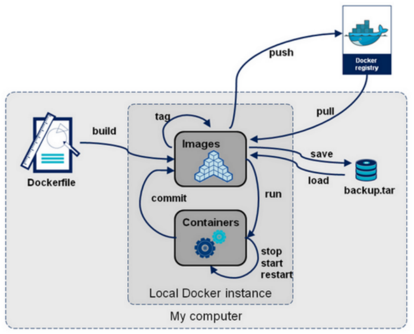
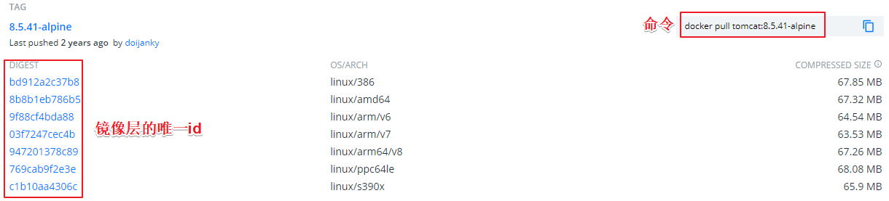
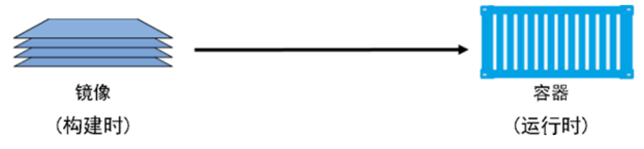
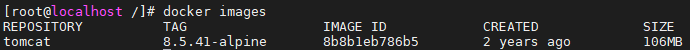

> 【Java】12_Container（容器）-> 12.2_Docker

# 第一章 Docker 简介

## 1、Docker 下载安装和配置

### 1.0 Docker 下载

- docker官网

https://www.docker.com 

- docker官方文档地址

https://docs.docker.com/ 

https://github.com/docker/docker-ce


### 1.1 Linux系统 -  Docker 安装和配置

#### （1）查看centos系统版本命令

```shell
cat /etc/centos-release

centos7.8
```

#### （2）配置阿里云yum源

```shell
# 1.下载安装
yum install -y wget

# 2.备份默认的
cd /etc/yum.repos.d
mv /etc/yum.repos.d /etc/yum.repos.d.backup

# 3.设置新的 yum 目录 
mkdir -p /etc/yum.repos.d
cd /etc/yum.repos.d

# 4.下载阿里 yum 配置到该目录中，选择对应版本 
wget -O /etc/yum.repos.d/CentOS-Base.repo http://mirrors.aliyun.com/repo/Centos-7.repo
wget -O /etc/yum.repos.d/CentOS-Base.repo http://mirrors.aliyun.com/repo/Centos-7.repo

# 5.更新 epel 源为阿里云epel源 
mv /etc/yum.repos.d/epel.repo /etc/yum.repos.d/epel.repo.backup
mv /etc/yum.repos.d/epel-testing.repo /etc/yum.repos.d/epel-testing.repo.backup
wget -O /etc/yum.repos.d/epel.repo http://mirrors.aliyun.com/repo/epel-7.repo

# 6.重建缓存
yum clean all
yum makecache

# 7.看一下yum仓库有多少包 
yum repolist
```

#### （3）升级系统内核

```shell
# 升级系统内核
rpm -Uvh http://www.elrepo.org/elrepo-release-7.0-3.el7.elrepo.noarch.rpm
yum --enablerepo=elrepo-kernel install -y kernel-lt
grep initrd16 /boot/grub2/grub.cfg
grub2-set-default 0

# 重启虚拟机
reboot

# 查看 centos 系统内核信息
# 简单信息
uname -r
# 详细信息
uname -a

# 查看 CPU
lscpu

# 查看内存
free -h

# 查看硬盘信息
fdisk -l
```

#### （4）常规设置

```shell
# 关闭防火墙
systemctl stop firewalld
systemctl disable firewalld

# 关闭selinux
sed -i 's/SELINUX=enforcing/SELINUX=disabled/g' /etc/sysconfig/selinux
setenforce 0

#网桥过滤
vi /etc/sysctl.conf

net.bridge.bridge-nf-call-ip6tables = 1
net.bridge.bridge-nf-call-iptables = 1
net.bridge.bridge-nf-call-arptables = 1
net.ipv4.ip_forward=1 
net.ipv4.ip_forward_use_pmtu = 0

# 使命令生效
sysctl --system
```

#### （5）其他软件安装（选择性安装）

```shell
# 补全软件 bash-completion
yum -y install bash-completion bash-completion-extras

# 使 bash-completion 生效
source /etc/profile.d/bash_completion.sh

# =====================================================

# 上传文件软件（未验证）
# 安装命令
yum -y install lrzsz

# 使用
（1）鼠标拖拽上传文件
（2）下载文件 
# 下载一个文件 
sz filename

# 下载多个文件
sz filename1 filename2

# 下载dir目录下所有文件，不包含dir下的文件夹
sz dir/*
```

#### （6）安装 Docker 前置准备

- 阿里云开发者平台：https://www.aliyun.com/

```shell
# 安装docker前置条件
yum install -y yum-utils device-mapper-persistent-data lvm2

# 添加源
yum-config-manager --add-repo http://mirrors.aliyun.com/docker-ce/linux/centos/docker-ce.repo
yum makecache fast

# 查看docker版本
yum list docker-ce --showduplicates | sort -r
```

#### （7）安装 Docker 

```shell
# 安装最新版：
yum -y install docker-ce

# 安装指定版本：
语法规则：yum install docker-ce-<VERSION_STRING> docker-ce-cli-<VERSION_STRING> containerd.io

# 本次安装19.03
yum install -y docker-ce-19.03.9-3.el7 docker-ce-cli-19.03.9-3.el7
 
# 开启 docker 服务
systemctl start docker

# 查看 docker 状态
systemctl status docker
```

#### （8）设置 Docker 

```shell
# 安装阿里云镜像加速器（整体粘贴命令执行）
sudo mkdir -p /etc/docker
sudo tee /etc/docker/daemon.json <<-'EOF'
{
  "registry-mirrors": ["https://a4cj7wl8.mirror.aliyuncs.com"]
}
EOF
sudo systemctl daemon-reload
sudo systemctl restart docker

# 设置 docker 开机启动服务
systemctl enable docker
```

#### （9）验证 Docker 安装是否成功

```shell
# docker 简单信息
docker -v

# docker 详细信息（有client和service两部分表示docker安装启动都成功了）
docker version

# docker 运行信息
docker info

# 查看 docker 状态
# Active: active (running)  表示正在运行
systemctl status docker

# 强制重启 docker
systemctl reset-failed docker.service
```


### 1.2 Win系统 -  Docker 安装和配置

- TODO


### 1.3 Mac系统 -  Docker 安装和配置

- TODO


## 2、Docker 版本

Docker 从 17.03 版本之后分为 CE（Community Edition: 社区版，免费） 和 EE（Enterprise Edition: 企业版，收费）


## 3、Docker 概述

### 3.1 Docker 是什么

```
当人们说“Docker”时，通常是指 Docker Engine，它是一个客户端 - 服务器应用程序，由 Docker 守护进程、一个 REST API 指定与守护进程交互的接口、和一个命令行接口（CLI）与守护进程通信（通过封装REST API）

Docker Engine 从 CLI 中接受 docker 命令，例如 docker run 、docker ps 来列出正在运行的容器、docker images 来列出镜像，等等

docker是一个软件，可以运行在window、linux、mac等各种操作系统上

docker 是一个开源的应用容器引擎，基于Go 语言开发并遵从 Apache2.0 协议开源，项目代码托管在github上进行维护

docker 可以让开发者打包他们的应用以及依赖包到一个轻量级、可移植的容器中，然后发布到任何流行的 Linux 机器上

容器是完全使用沙箱机制，相互之间不会有任何接口,更重要的是容器性能开销极低
```


### 3.2 Docker 基本组成

```
Docker 主机(Host)：安装了Docker程序的机器（Docker直接安装在操作系统之上）
Docker 仓库(Registry)：用来保存各种打包好的软件镜像；仓库分为公有仓库和私有仓库(类似maven) 
Docker 镜像(Images)：软件打包好的镜像；放在docker仓库中
Docker 容器(Container)：镜像启动后的实例称为一个容器；容器是独立运行的一个或一组应用
```


### 3.3 Docker 与 虚拟机

| 特性     | 容器               | 虚拟机     |
| -------- | ------------------ | ---------- |
| 启动速度 | 秒级               | 分钟级     |
| 性能     | 接近原生           | 较弱       |
| 内存代价 | 很小               | 较多       |
| 硬盘使用 | 一般为MB           | 一般为GB   |
| 运行密度 | 单机支持上千个容器 | 一般几十个 |
| 隔离性   | 安全隔离           | 安全隔离   |
| 迁移性   | 优秀               | 一般       |


# 第二章 Docker 命令 

## 0、分类

- 参考文档：https://docs.docker.com/engine/reference/run/

```
Docker环境信息 — docker [info|version]
容器生命周期管理 — docker [create|exec|run|start|stop|restart|kill|rm|pause|unpause]
容器操作管理 — docker [ps|inspect|top|attach|wait|export|port|rename|stat]
容器rootfs命令 — docker [commit|cp|diff]
镜像仓库 — docker [login|pull|push|search]
本地镜像管理 — docker [build|images|rmi|tag|save|import|load]
容器资源管理 — docker [volume|network]
系统日志信息 — docker [events|history|logs]
```

- 结构图




## 1、Docker 镜像（image）

- Docker Hub镜像仓库地址：https://hub.docker.com/

```shell
- 镜像从远程镜像仓库服务的仓库中下载
- Docker 在下载之前，会去检测本地是否会有同样 ID 的层，如果本地已经存在，就直接使用本地镜像，否则会从 Docker Hub 的仓库中拉取
- Docker 通过前缀地址的不同，来保证不同仓库中，重名镜像的唯一性

- 一个镜像一般是由多个层组成，每层叠加之后，从外部看来就如一个独立的对象（类似 bd912a2c37b8 这样的串表示层的唯一 ID）
- 镜像内部是一个精简的操作系统（OS），同时还包含应用运行所必须的文件和依赖包
```




```
- 镜像可以理解为一种构建时（build-time）结构
- 容器可以理解为一种运行时（run-time）结构
```




### 1.1 pull 命令（下载镜像）

- 命令

```shell
# docker pull 镜像名称:镜像版本号
docker pull tomcat:8.5.41-alpine
```

- 注意事项

```shell
在使用 pull命令时，需要在镜像前面指定仓库地址(Registry), 如果不指定，则 Docker 会使用您默认配置的仓库地址
例如：当执行 docker pull tomcat:8.5.41-alpine 命令时，实际上相当于 docker pull docker.io/tomcat:8.5.41-alpine
```


### 1.2 images 命令（查看镜像）

- 命令

```shell
# 列出本机已有的镜像
docker images
```

- 展示列表说明

```
REPOSITORY：表示镜像的仓库源
TAG：镜像的标签
IMAGE ID：镜像ID
CREATED：镜像创建时间
SIZE：镜像大小
```




### 1.3 save 命令（保存/导出镜像）

- 命令

```shell
# 创建镜像保存目录
mkdir -p /docker_data

# 切换目录
cd /docker_data

# 保存一个镜像，方式1（-o 表示输出到的文件）
docker save tomcat:8.5.41-alpine -o tomcat8.tar
# 保存一个镜像，方式2（> 表示输出到的文件）
docker save tomcat:8.5.41-alpine > tomcat8.5.tar

# 保存多个镜像，方式1
# docker save 镜像1 镜像2 -o 保存文件名.tar
docker save tomcat:8.5.41-alpine redis:6.0.9 -o soft.tar

# 保存多个镜像，方式2（使用idea、sublime等工具多行编辑）
docker save \ 
ubuntu:20.04 \ 
alpine:3.12.1 \ 
debian:10.6-slim \ 
centos:7.8.2003 \ 
-o linux.tar
```


### 1.4 load 命令（导入镜像）

- 命令

```shell
# 切换目录
cd /docker_data

# 导入镜像，方式1（-i input，表示输指定导入的文件）
docker load -i tomcat8.tar

# 导入镜像，方式2（< 表示导入的文件）
docker load < tomcat8.tar
```


### 1.5 search 命令（查找镜像）不推荐使用

- 命令

```shell
# docker search 镜像名称
docker search tomcat
```

- 常用参数

```shell
-f, --filter filter : 过滤输出的内容
--limit int ：指定搜索内容展示个数
--no-index : 不截断输出内容
--no-trunc ：不截断输出内容
```


### 1.6 inspect 命令（获取镜像详细信息）

- 命令

```shell
# docker inspect 镜像名称:镜像版本号（返回的是 JSON格式的信息）
docker inspect tomcat:8.5.41-alpine

# 通过 -f 指定详细信息一项内容
# 获取镜像大小信息
docker inspect -f {{".Size"}} tomcat:8.5.41-alpine
# 获取环境信息
docker inspect -f {{".Config.Env"}} tomcat:8.5.41-alpine
```


### 1.7 history 命令

- 命令

```shell
# 列出各个层的创建信息
# docker history 镜像名称:镜像版本号
docker history tomcat:8.5.41-alpine
```


### 1.8 tag 命令

- 命令

```shell
# 标记本地镜像，将其归入某一仓库
# docker tag 旧镜像名称:镜像版本号 新镜像名称/版本号
docker tag tomcat:8.5.41-alpine td/tomcat:8
```


### 1.9 rmi 命令（删除镜像）

- 命令

```shell
# 方式1：docker rmi 镜像名称:镜像版本号
docker rmi tomcat:8.5.41-alpine

# 方式2：docker rmi imageid（imageid没有重复时，才能删除，不推荐此方式）
docker rmi 8b8b1eb786b5

# 方式3：docker image rm 镜像名称:镜像版本号
docker image rm tomcat:8.5.41-alpine
```

- 常用参数

```shell
-f, -force : 强制删除镜像，即便有容器引用该镜像
-no-prune : 不要删除未带标签的父镜像
```

- 注意事项

```shell
当通过该镜像创建的容器未被销毁时，镜像是无法被删除的，正确做法是：
1. 先删除引用这个镜像的容器
2. 再删除这个镜像
```


### 1.10 prune 命令（清理镜像）

- 命令

```shell
# 清除临时的、没有被使用的镜像
docker image prune
```

- 常用参数

```shell
-a, --all : 删除所有没有用的镜像，而不仅仅是临时文件
-f, --force ：强制删除镜像文件，无需弹出提示确认
```


## 2、Docker 容器（container）

### 2.0  批量操作

```shell
# 停止所有运行容器
docker stop $(docker ps -qa) 

# 删除所有的容器
docker rm $(docker ps -aq) 

# 删除所有已经停止的容器
docker rm $(docker stop $(docker ps -q)) 

# 删除所有的镜像
docker rmi $(docker images -q)
```


### 2.1 create 命令（创建容器） 不推荐

- 命令

```shell
# 语法
docker create [OPTIONS] IMAGE [COMMAND] [ARG...]

# docker create -it --name 容器名称1 -p 主机端口1:容器端口 镜像名称:镜像版本号
docker create -it --name tomcat8.5 -p 8080:8080 tomcat:8.5.41-alpine
```


### 2.2 start 命令（启动容器）

- 命令

```shell
# 语法
docker start [OPTIONS] CONTAINER [CONTAINER...]

docker start tomcat8.5
```


### 2.3 run 命令（新建并启动容器）

- 命令

```shell
# 语法
docker run [OPTIONS] IMAGE [COMMAND] [ARG...]

# 前台运行容器（命令行有日志输出，关闭会导致容器停止）
# docker run -it --rm -p 主机端口:容器端口 镜像名称:镜像版本号
docker run -it --rm -p 8080:8080 tomcat:8.5.41-alpine

# 后台运行容器
# docker run -itd --name 容器名称1 -p 主机端口1:容器端口 镜像名称:镜像版本号
docker run -itd --name tomcat8.5 -p 8080:8080 tomcat:8.5.41-alpine

# 运行第二个容器（容器名称、主机端口不能重复）
# docker run -itd --name 容器名称2 -p 主机端口2:容器端口 镜像名称:镜像版本号
docker run -itd --name tomcat8.5.1 -p 8081:8080 tomcat:8.5.41-alpine
```

- 常用参数

```shell
-d, --detach=false: 后台运行容器，并返回容器ID
-i, --interactive=false: 以交互模式运行容器，通常与 -t 同时使用
-P, --publish-all=false: 随机端口映射，容器内部端口随机映射到主机的端口（不推荐使用）
-p, --publish=[]: 指定端口映射，格式为：主机(宿主)端口:容器端口（推荐使用）
-t, --tty=false: 为容器重新分配一个伪输入终端，通常与 -i 同时使用
--name="nginx-lb": 为容器指定一个名称
-h , --hostname="laosiji": 指定容器的hostname
-e , --env=[]: 设置环境变量，容器中可以使用该环境变量
--net="bridge": 指定容器的网络连接类型，支持 bridge/host/none/container: 四种类型
--link=[]: 添加链接到另一个容器；不推荐各位小伙伴使用该参数
-v, --volume : 绑定一个卷
--privileged=false: 指定容器是否为特权容器，特权容器拥有所有的capabilities

--restart=no：指定容器停止后的重启策略
  no：容器退出时不重启 
  on-failure：容器故障退出（返回值非零）时重启 
  always：容器退出时总是重启,推荐各位小伙伴们使用 
  
--rm=false: 指定容器停止后自动删除容器,不能以docker run -d启动的容器
```


### 2.4 stop 命令（停止容器）

- 命令

```shell
# 语法
docker stop [OPTIONS] CONTAINER [CONTAINER...]

docker stop tomcat8.5
```


### 2.5 kill 命令（杀掉运行中的容器）

- 命令

```shell
# 语法
docker kill [OPTIONS] CONTAINER [CONTAINER...]

docker kill tomcat8.5
```

- 常用参数

```shell
-s :向容器发送一个信号
```


### 2.6 restart 命令（重启容器）

- 命令

```shell
# 语法
docker restart [OPTIONS] CONTAINER [CONTAINER...]

docker restart tomcat8.5
```


### 2.7 rm 命令（删除容器）

- 命令

```shell
# 语法 
docker rm [OPTIONS] CONTAINER [CONTAINER...]

# 步骤1：先停止运行中的容器再删除，否则无法删除容器
docker stop tomcat8.5

# 步骤2：按照容器名称删除
docker rm tomcat8.5

# 步骤2：按照容器ID删除
docker rm 8dd95a95e687

# PS：强制删除所有容器
docker rm -f $(docker ps -aq)
```

- 常用参数

```shell
-f :通过 SIGKILL 信号强制删除一个运行中的容器
-l :移除容器间的网络连接，而非容器本身
-v :删除与容器关联的卷
```


### 2.8 exec 命令（进入容器）

- 命令

```shell
# 语法
docker exec [OPTIONS] CONTAINER COMMAND [ARG...]

# 有bash命令的linux系统：例如centos
docker exec -it tomcat8.5 /bin/bash

# 没有bash命令的linux系统：例如alpine系统 
docker exec -it tomcat8.5.1 sh
```

-  常用参数

```shell
-i：即使没有附加也保持STDIN 打开
-t：分配一个伪终端
```

- 进入后的命令

```shell
# 查看当前路径
pwd

# 列出当前文件夹的文件和目录
ls

# 查看当前容器的操作系统信息
cat /etc/issue

# 切换目录
cd webapps/

# 退出容器
exit
```


### 2.9 inspect 命令（查看容器）

- 命令

```shell
# 语法
docker inspect [OPTIONS] NAME|ID [NAME|ID...]

docker inspect tomcat8.5
```

- 常用参数

```shell
-f :指定返回值的模板文件
-s :显示总的文件大小
--type :为指定类型返回JSON
```


### 2.10 logs 命令（容器日志）

- 命令

```shell
# 语法
docker logs [OPTIONS] CONTAINER

# docker logs -f 容器名称
docker logs -f tomcat8.5
```

- 常用参数

```shell
-f : 跟踪日志输出
--tail :仅列出最新N条容器日志
```


### 2.11 ps 命令（列出容器）

- 命令

```shell
# 语法
docker ps [OPTIONS]

# 查看运行中的容器
docker ps

# 查看所有容器
docker ps -a
```

- 常用参数

```shell
-a :显示所有的容器，包括未运行的
-q :只显示容器编号
```

- 输出详情介绍

```shell
CONTAINER ID: 容器 ID
IMAGE: 使用的镜像
COMMAND: 启动容器时运行的命令
CREATED: 容器的创建时间
STATUS: 容器状态，状态有7种
      created（已创建）
      restarting（重启中）
      running（运行中）
      removing（迁移中）
      paused（暂停）
      exited（停止）
      dead（死亡）
PORTS: 容器的端口信息和使用的连接类型（tcp\udp）
NAMES: 自动分配的容器名称
```


### 2.12 update 命令（更新容器）不推荐

- 命令

```shell
# 语法
docker update [OPTIONS] CONTAINER [CONTAINER...]

# 更新容器restart策略
docker update --restart always tomcat8.5

- 可以动态地更新容器配置
- 可以更新一个或多个容器配置
- 多个容器名称或ID之间使用空格分隔
- 但update命令不是很成熟，有很多配置项不能动态更新
- 推荐大家还是rm容器后，再重新run一个新的镜像
```


# 第三章 Docker 常用软件安装

## 1、安装 MySQL

- Docker-MySQL 官网地址：https://hub.docker.com/_/mysql
- 拉取镜像

```shell
docker pull mysql:5.7.34
```

- 备份镜像

```shell
cd /docker_data/
docker save mysql:5.7.34 -o mysql.5.7.34.tar
```

- 导入镜像

```shell
docker load -i mysql.5.7.34.tar
```

- 创建并运行容器

```shell
# --restart always：容器退出时总是重启
# --privileged=true：特权模式，不受限制地访问任何自己的系统调用，给容器提供了几乎所有主机（作为root）可以做的事情的权=限
# -e , --env=[]：设置环境变量，容器中可以使用该环境变量
docker run -itd --name mysql --restart always --privileged=true -p 3306:3306 -e MYSQL_ROOT_PASSWORD=admin mysql:5.7.34 --character-set-server=utf8 --collation-server=utf8_general_ci
```

- 进入容器

```shell
docker exec -it mysql bash
```

- 退出容器

```shell
exit
```


## 2、安装 Nginx

- Docker-Nginx 官网地址：https://hub.docker.com/_/nginx 

- 拉取镜像

```shell
docker pull nginx:1.20.0-alpine
```

- 备份镜像

```shell
cd /docker_data/
docker save nginx:1.20.0-alpine -o nginx:1.20.0-alpine.tar
```

- 导入镜像

```shell
docker load -i nginx:1.20.0-alpine.tar
```

- 创建并运行容器

```shell
docker run -itd --name nginx -p 80:80 nginx:1.20.0-alpine
```

- 浏览器访问：http://192.168.203.128:80


## 3、安装 Zookeeper

- Docker-Zookeeper 官网地址：https://hub.docker.com/_/zookeeper 
- 拉取镜像

```shell
docker pull zookeeper:3.6.2
```

- 备份镜像

```shell
cd /docker_data/
docker save zookeeper:3.6.2 -o zookeeper.3.6.2.tar
```

- 导入镜像

```shell
docker load -i zookeeper.3.6.2.tar
```

- 单机版：创建并运行容器

```shell
docker run -itd --name zookeeper --restart always -p 2181:2181 zookeeper:3.6.2
```

- 进入容器

```shell
docker exec -it zookeeper /bin/bash
```


## 4、安装 ActiveMQ

- Docker-ActiveMQ 第三方地址：https://hub.docker.com/r/webcenter/activemq
- 拉取镜像

```shell
docker pull webcenter/activemq:5.14.3
```

- 备份镜像

```shell
cd /docker_data/
docker save webcenter/activemq:5.14.3 -o webcenter.activemq:5.14.3.tar
```

- 导入镜像

```shell
docker load -i webcenter.activemq:5.14.3.tar
```

- 单机版：创建并运行容器

```shell
# 61616为ActiveMQ的外部访问端口，8161为web页面访问端口
docker run -itd --name activmq --restart always -p 61616:61616 -p 8161:8161 webcenter/activemq:5.14.3
```

- 进入容器

```shell
docker exec -it activmq /bin/bash
```

- 浏览器访问 ActiveMQ 管理界面（admin/admin）：http://192.168.203.128:8161/


## 5、安装 ElasticSearch


## 6、安装 fastDFS


## 7、安装 GitLab


## 8、安装 Swarm


## 9、安装 harbor


# 第四章 Docker 核心原理

## 1、虚拟化技术

### 1.1 云计算

```
IaaS: Infrastructure-as-a-Service（基础设施即服务），国内典型代表是阿里云，国际上的是IWS
PaaS: Platform-as-a-Service（平台即服务），国内典型代表是新浪云、docker也是属于PaaS
SaaS: Software-as-a-Service（软件即服务），office 365、github的Codespaces
```


### 1.2 虚拟化

```
- 虚拟化就是在一台物理服务器上，运行多台“虚拟服务器”，这种虚拟服务器，也叫虚拟机（VM，VirtualMachine）
- 物理机，通常称为“宿主机（Host）”
- 虚拟机，则称为“客户机（Guest）”

- Hypervisor 来完成物理资源虚拟化的工作


```

- Hypervisor

```
- Hypervisor也叫做VMM（Virtual Machine Monitor，虚拟机监视器）
- 它不是一款具体的软件，而是一类软件的统称Hypervisor是一种运行在基础物理服务器硬件之上的软件层，可以虚拟化硬件资源，例如：cpu，硬盘，内存，声卡等资源。然后我们可以通过在虚拟化出来的资源之上安装操作系统。也就是所谓的虚拟机。通过Hyperviosr我们可以创建不同的虚拟机，并且每个虚拟机都是分离、独立的系统。这样操作，我们就可以在一台硬件服务器和本地操作系统之上虚拟化出很多服务器，供我们用来部署应用程序。一台硬件服务器可以虚拟化多台服务器，让计算机资源得以充分利用

Hypervisor分为两大类：
- 第一类，hypervisor直接运行在物理机之上，虚拟机运行在hypervisor之上
- 第二类，物理机上安装正常的操作系统（例如Linux或Windows），然后在正常操作系统上安装hypervisor，生成和管理虚拟机。（如VMware、KVM、Xen、Virtual Box）
```


### 1.3 虚拟化技术分类

#### （1）CPU虚拟化

```
- 虚拟化在计算机方面通常是指计算元件在虚拟的基础上而不是真实的基础上运行。
- 虚拟化技术可以扩大硬件的容量，简化软件的重新配置过程。
- 简单说来，CPU的虚拟化技术就是单CPU模拟多CPU并行，允许一个平台同时运行多个操作系统，并且应用程序都可以在相互独立的空间内运行而互不影响，从而显著提高计算机的工作效率。
```

#### （2）网络虚拟化

```
- 网络虚拟化是目前业界关于虚拟化细分领域界定最不明确，存在争议较多的一个概念
- 微软眼中的“网络虚拟化”，是指虚拟专用网络 (VPN)。
- VPN 对网络连接的概念进行了抽象，允许远程用户访问组织的内部网络，就像物理上连接到该网络一样。网络虚拟化可以帮助保护 IT环境，防止来自 Internet 的威胁，同时使用户能够快速安全的访问应用程序和数据。
```

#### （3）服务器虚拟化

```
- 与网络虚拟化不同，服务器虚拟化却是虚拟化技术最早细分出来的子领域。
- 根据2006年2月ForresterResearch的调查，全球范围的企业对服务器虚拟化的认知率达到了75%。三分之一的企业已经在使用或者准备部署服务器虚拟化。这个产生于20世纪60年代的技术日益显示出其重要价值。
- 由于服务器虚拟化发展时间长，应用广泛，所以很多时候人们几乎把服务器虚拟化等同于虚拟化。
```

#### （4）存储虚拟化

```
- 随着信息业务的不断运行和发展，存储系统网络平台已经成为一个核心平台，大量高价值数据积淀下来，围绕这些数据的应用对平台的要求也越来越高，不光是在存储容量上，还包括数据访问性能、数据传输性能、数据管理能力、存储扩展能力等等多个方面。
- 可以说，存储网络平台的综合性能的优劣，将直接影响到整个系统的正常运行。因为这个原因，虚拟化技术又一子领域——虚拟存储技术，应运而生。
```

#### （5）应用虚拟化

```
前面几种虚拟化技术，主要还专注于对硬件平台资源的虚拟优化分配

2006年7月由Forrester咨询公司在美国对各种不同行业的高层IT管理人员所做的一项研究显示，当今的机构现在将应用虚拟化当作是业务上的一个必由之路，而不是一个IT决策。据统计，全世界目前至少有超过18万个机构在利用应用虚拟化技术进行集中IT管理、加强安全性和减少总体成本。
```


## 2、容器化技术


## 3、Docker 网络

### 3.0 网络模式

| Docker 网络模式 | 配置                      | 说明                                                         |
| --------------- | ------------------------- | ------------------------------------------------------------ |
| host模式        | –net=host                 | 容器和宿主机共享Network namespace。容器将不会虚拟出自己的网卡，配置自己的IP等，而是使用宿主机的IP和端口。 |
| container模式   | –net=container:NAME_or_ID | 容器和另外一个容器共享Network namespace。kubernetes中的pod就是多个容器共享一个Network namespace。创建的容器不会创建自己的网卡，配置自己的IP，而是和一个指定的容器共享IP、端口范围。 |
| none模式        | –net=none                 | 容器有独立的Network namespace，并没有对其进行任何网络设置，如分配veth pair 和网桥连接，配置IP等。该模式关闭了容器的网络功能。 |
| bridge模式      | –net=bridge               | （默认为该模式）。此模式会为每一个容器分配、设置IP等，并将容器连接到一个docker0虚拟网桥，通过docker0网桥以及Iptables nat表配置与宿主机通信。 |
| Macvlan network | 无                        | 容器具备Mac地址，使其显示为网络上的物理设备                  |
| Overlay         | 无                        | (覆盖网络）： 利用VXLAN实现的bridge模式                      |


### 3.1 bridge 桥接模式

#### （1）简介

```
- 默认的网络模式
- bridge模式下容器没有一个公有ip,只有宿主机可以直接访问,外部主机是不可见的,但容器通过宿主机的NAT规则后可以访问外网。
```

#### （2）实现步骤

```
- Docker Daemon 利用 veth pair 技术，在宿主机上创建两个虚拟网络接口设备，假设为veth0 和veth1。而veth pair 技术的特性可以保证无论哪一个 veth 接收到网络报文，都会将报文传输给另一方。
- Docker Daemon 将 veth0 附加到 Docker Daemon 创建的 docker0网桥上。保证宿主机的网络报文可以发往 veth0；
- Docker Daemon 将 veth1 添加到 Docker Container 所属的 namespace 下，并被改名为eth0。如此一来，保证宿主机的网络报文若发往 veth0，则立即会被 eth0 接收，实现宿主机到DockerContainer网络的联通性；同时，也保证 Docker Container 单独使用 eth0，实现容器网络环境的隔离性。
```

#### （3）缺陷

```
- 最明显的是，该模式下 Docker Container 不具有一个公有 IP，即和宿主机的 eth0 不处于同一个网段。导致的结果是宿主机以外的世界不能直接和容器进行通信。
- 虽然 NAT 模式经过中间处理实现了这一点，但是 NAT 模式仍然存在问题与不便，如：容器均需要在宿主机上竞争端口，容器内部服务的访问者需要使用服务发现获知服务的外部端口等。
- 另外 NAT 模式由于是在三层网络上的实现手段，故肯定会影响网络的传输效率。

注意：
veth设备是成双成对出现的，一端是容器内部命名为eth0，一端是加入到网桥并命名的veth（通常命名为veth），它们组成了一个数据传输通道，一端进一端出，veth设备连接了两个网络设备并实现了数据通信
```

#### （4）创建

```shell
docker network create -d bridge td-bridge
```


### 3.2 host 模式

#### （1）简介

```
- 相当于Vmware中的NAT模式，与宿主机在同一个网络中，但没有独立IP地址。

- 如果启动容器的时候使用host模式，那么这个容器将不会获得一个独立的Network Namespace，而是和宿主机共用一个Network Namespace。容器将不会虚拟出自己的网卡，配置自己的IP等，而是使用宿主机的IP和端口。但是，容器的其他方面，如文件系统、进程列表等还是和宿主机隔离的。

- 使用host模式的容器可以直接使用宿主机的IP地址与外界通信，容器内部的服务端口也可以使用宿主机的端口，不需要进行NAT，host最大的优势就是网络性能比较好，但是docker host上已经使用的端口就不能再用了，网络的隔离性不好。

- host 模式是 bridge 桥接模式很好的补充。采用 host 模式的 Docker Container，可以直接使用宿主机的 IP地址与外界进行通信，若宿主机的 eth0 是一个公有 IP，那么容器也拥有这个公有IP。同时容器内服务的端口也可以使用宿主机的端口，无需额外进行 NAT 转换。

- host模式可以让容器共享宿主机网络栈,这样的好处是外部主机与容器直接通信,但是容器的网络缺少隔离性。

- host网络模式需要在容器创建时指定–network=host
```

#### （2）缺陷

```
- 最明显的是 Docker Container 网络环境隔离性的弱化。即容器不再拥有隔离、独立的网络环境。

- 另外，使用 host 模式的 Docker Container 虽然可以让容器内部的服务和传统情况无差别、无改造的使用，但是由于网络隔离性的弱化，该容器会与宿主机共享竞争网络栈的使用；

- 另外，容器内部将不再拥有所有的端口资源，原因是部分端口资源已经被宿主机本身的服务占用，还有部分端口已经用以 bridge 网络模式容器的端口映射
```


### 3.3 container 模式 

#### （1）简介

```
- Container 网络模式是 Docker 中一种较为特别的网络的模式
- 处于这个模式下的 Docker 容器会共享一个网络环境,这样两个容器之间可以使用localhost高效快速通信
- 在容器创建时使用–network=container:vm1指定(vm1指定的是运行的容器名)
```

#### （2）缺陷

```
- 它并没有改善容器与宿主机以外世界通信的情况（和桥接模式一样，不能连接宿主机以外的其他设备）。

- 这个模式指定新创建的容器和已经存在的一个容器共享一个 Network Namespace，而不是和宿主机共享。新创建的容器不会创建自己的网卡，配置自己的 IP，而是和一个指定的容器共享 IP、端口范围等。同样，两个容器除了网络方面，其他的如文件系统、进程列表等还是隔离的。两个容器的进程可以通过lo 网卡设备通信。
```


### 3.4 none 模式

#### （1）简介

```
- 使用none模式，Docker容器拥有自己的Network Namespace，但是，并不为Docker容器进行任何网络配置。也就是说，这个Docker容器没有网卡、IP、路由等信息。需要我们自己为Docker容器添加网卡、配置IP等

- 这种网络模式下容器只有lo回环网络，没有其他网卡
- 这种类型的网络没有办法联网，封闭的网络能很好的保证容器的安全

- none模式可以在容器创建时通过--network=none来指定
```


### 3.5 overlay 模式

```
Overlay 网络，也称为覆盖网络。主要用于docker集群部署。
Overlay 网络的实现方式和方案有多种。Docker自身集成了一种，基于VXLAN隧道技术实现。
Overlay 网络主要用于实现跨主机容器之间的通信。

应用场景：需要管理成百上千个跨主机的容器集群的网络时
```


### 3.6 macvlan 模式

```
- macvlan网络模式，最主要的特征就是他们的通信会直接基于mac地址进行转发。
- 这时宿主机其实充当一个二层交换机。Docker会维护着一个MAC地址表，当宿主机网络收到一个数据包后，直接根据mac地址找到对应的容器，再把数据交给对应的容器。
- 容器之间可以直接通过IP互通，通过宿主机上内建的虚拟网络设备（创建macvlan网络时自动创建），但与主机无法直接利用IP互通。

应用场景：由于每个外来的数据包的目的mac地址就是容器的mac地址，这时每个容器对于外面网络来说就相当于一个真实的物理网络设备。因此当需要让容器来的网络看起来是一个真实的物理机时，使用macvlan模式

Macvlan是一个新的尝试，是真正的网络虚拟化技术的转折点。Linux实现非常轻量级，因为与传统的Linux Bridge隔离相比，它们只是简单地与一个Linux以太网接口或子接口相关联，以实现网络之间的分离和与物理网络的连接。

Macvlan提供了许多独特的功能，并有充足的空间进一步创新与各种模式。这些方法的两个高级优点是绕过Linux网桥的正面性能以及移动部件少的简单性。删除传统上驻留在Docker主机NIC和容器接口之间的网桥留下了一个非常简单的设置，包括容器接口，直接连接到Docker主机接口。由于在这些情况下没有端口映射，因此可以轻松访问外部服务。

Macvlan Bridge模式每个容器都有唯一的MAC地址，用于跟踪Docker主机的MAC到端口映射。

Macvlan驱动程序网络连接到父Docker主机接口。示例是物理接口，例如eth0，用于802.1q VLAN标记的子接口eth0.10（.10代表VLAN 10）或甚至绑定的主机适配器，将两个以太网接口捆绑为单个逻辑接口。 指定的网关由网络基础设施提供的主机外部。 每个Macvlan Bridge模式的Docker网络彼此隔离，一次只能有一个网络连接到父节点。

每个主机适配器有一个理论限制，每个主机适配器可以连接一个Docker网络。 同一子网内的任何容器都可以与没有网关的同一网络中的任何其他容器进行通信macvlan bridge。 相同的docker network命令适用于vlan驱动程序。 在Macvlan模式下，在两个网络/子网之间没有外部进程路由的情况下，单独网络上的容器无法互相访问。这也适用于同一码头网络内的多个子网。
```


### 3.7 Docker 网络命令汇总

#### （1）创建网络


#### （2）查看网络

```shell
# 命令格式：docker network ls [OPTIONS]
# 命令参数(OPTIONS)： 
# 	-f, --filter filter 过滤条件(如 'driver=bridge’)
#				--format string 格式化打印结果 
#				--no-trunc 不缩略显示 
#		-q, --quiet 只显示网络对象的ID
docker network ls

# 默认情况下，docker安装完成后，会自动创建 bridge、host、none三种网络驱动
```

#### （3）查看网络详细信息

```shell
# 命令格式： docker network inspect [OPTIONS] NETWORK [NETWORK...] 
#					 docker inspect [OPTIONS] NETWORK [NETWORK...] 
# 命令参数(OPTIONS)： 
#		-f, --format string 根据format输出结果
docker network inspect bridge
```

#### （4）使用网络

#### （5）连接和断开网络

#### （6）删除网络


# 第五章 Docker 多容器应用部署和管理 - docker-compose

## 5.1 数据卷


## 5.2 数据卷容器


## 5.3 docker-compose 安装

```bash
# 安装扩展源
sudo yum -y install epel-release

# 安装python-pip模块
sudo yum install python-pip

# 通过以命令进行安装
cd /usr/local/bin/
wget https://github.com/docker/compose/releases/download/1.14.0-rc2/docker-compose-Linux-x86_64
rename docker-compose-Linux-x86_64 docker-compose docker-compose-Linux-x86_64
chmod +x /usr/local/bin/docker-compose

# 查看版本
docker-compose version
```


## 5.4 docker-compose.yml 配置解析

https://blog.csdn.net/qq_36148847/article/details/79427878


# 第六章 Docker 镜像制作 - Dockerfile

## 6.1 命令


# 第七章 Docker 私服

## 7.1 官方私服 - registry

## 7.2 企业私服 -  harbor


# 第八章 idea 集成 Docker

## 步骤1：修改服务器 docker.service 服务信息

```shell
# 修改服务器docker.service服务信息，允许其他主机远程访问服务器的docker
vi /usr/lib/systemd/system/docker.service

# 在ExecStart行最后增加 -H tcp://0.0.0.0:2375 开放远程主机访问权限
ExecStart=/usr/bin/dockerd -H fd:// --containerd=/run/containerd/containerd.sock -H tcp://0.0.0.0:2375

# 重启docker
systemctl daemon-reload
systemctl restart docker

# 查看docker进程，发现docker守护进程在已经监听2375的tcp端口 
ps -ef|grep docker

# 查看系统的网络端口，检查tcp的2375端口,docker的守护进程是否监听 
netstat -tulp
```

## 步骤2：配置 idea

# 第九章 Docker 图形化界面管理软件 - Portainer

## 9.1 安装

```shell
# 创建 Portainer 文件夹
mkdir -p /docker_data/portainer/data /docker_data/portainer/public

# 进入 Portainer 文件夹
cd /docker_data/portainer

# 下载汉化文件
wget https://labx.me/dl/4nat/public.zip

# 安装zip的解压软件
yum install zip
yum install unzip

# 解压汉化文件
unzip public.zip

# 下载
docker pull portainer/portainer:latest

# 安装 Portainer（Linux）
docker run -d --restart=always --name portainer -p 9000:9000 -v /var/run/docker.sock:/var/run/docker.sock -v /docker_data/portainer/data:/data -v /docker_data/portainer/public:/public portainer/portainer:latest

# 安装 Portainer（Mac）
docker run -d --restart=always --name portainer -p 9000:9000 -v /var/run/docker.sock:/var/run/docker.sock -v /Users/td/Documents/03_DevTools/docker_data/portainer/data:/data -v /Users/td/Documents/03_DevTools/docker_data/portainer/public:/public portainer/portainer:latest

# 访问地址（admin/admin1234）
http://192.168.126.200:9000
```


## 9.2 使用 - 拉取镜像


## 9.3 使用 - 容器管理

# 第十章 问题集锦

## 1、docker容器内无法使用 vim/vi

```bash
# 进入容器
docker exec -it 容器名称 /bin/bash
docker exec -it 容器名称 /bash

# 更新
apt-get update
 
# 安装 vim 
apt-get install -y vim

# 如果出现 apt-get找不到的情况，把apt-get换成yum
```

# Docker和k8s的区别与介绍

https://www.cnblogs.com/misswangxing/p/10669444.html


> 参考资料

https://mrchou.com/internet/docker-portainer-cn.html

