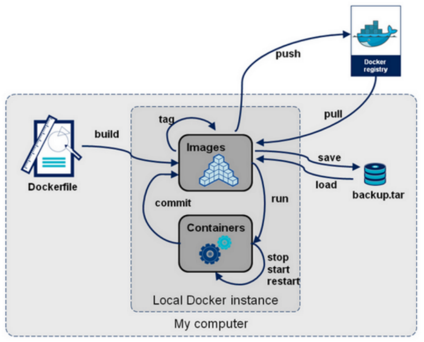
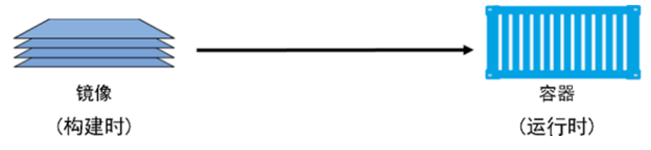
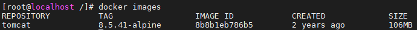

> 当前位置：【Java】12_EfficiencyTools（效率工具） -> 12.7_DevOps（运维部署） -> Docker


# 第一章 Docker 简介

## 1、Docker 下载安装和配置

### 1.0 Docker 下载

- docker官网

https://www.docker.com 


- docker官方文档地址

https://docs.docker.com/ 

https://github.com/docker/docker-ce


### 1.2 Linux系统 -  Docker 安装和配置

#### （1）查看centos系统版本命令

```shell
cat /etc/centos-release
```

#### （2）配置阿里云yum源

```shell
# 1.下载安装
wget yum install -y wget

# 2.备份默认的
yum mv /etc/yum.repos.d /etc/yum.repos.d.backup

# 3.设置新的 yum 目录 
mkdir -p /etc/yum.repos.d

# 4.下载阿里 yum 配置到该目录中，选择对应版本 
wget -O /etc/yum.repos.d/CentOS-Base.repo http://mirrors.aliyun.com/repo/Centos-7.repo

# 5.更新 epel 源为阿里云epel源 
mv /etc/yum.repos.d/epel.repo /etc/yum.repos.d/epel.repo.backup
mv /etc/yum.repos.d/epel-testing.repo /etc/yum.repos.d/epel-testing.repo.backup
wget -O /etc/yum.repos.d/epel.repo http://mirrors.aliyun.com/repo/epel-7.repo

# 6.重建缓存
yum clean all
yum makecache

# 7.看一下yum仓库有多少包 
yum repolist
```

#### （3）升级系统内核

```shell
# 升级系统内核
rpm -Uvh http://www.elrepo.org/elrepo-release-7.0-3.el7.elrepo.noarch.rpm
yum --enablerepo=elrepo-kernel install -y kernel-lt
grep initrd16 /boot/grub2/grub.cfg
grub2-set-default 0

# 重启虚拟机

# 查看 centos 系统内核信息
# 简单信息
uname -r
# 详细信息
uname -a

# 查看 CPU
lscpu

# 查看内存
free -h

# 查看硬盘信息
fdisk -l
```

#### （4）常规设置

```shell
# 关闭防火墙
systemctl stop firewalld
systemctl disable firewalld

# 关闭selinux
sed -i 's/SELINUX=enforcing/SELINUX=disabled/g' /etc/sysconfig/selinux
setenforce 0

#网桥过滤
vi /etc/sysctl.conf

net.bridge.bridge-nf-call-ip6tables = 1
net.bridge.bridge-nf-call-iptables = 1
net.bridge.bridge-nf-call-arptables = 1
net.ipv4.ip_forward=1 net.ipv4.ip_forward_use_pmtu = 0

# 使命令生效
sysctl --system
```

#### （5）其他软件安装（选择性安装）

```shell
# 补全软件 bash-completion
yum -y install bash-completion bash-completion-extras

# 使 bash-completion 生效
source /etc/profile.d/bash_completion.sh

# =====================================================

# 上传文件软件（未验证）
# 安装命令
yum -y install lrzsz

# 使用
（1）鼠标拖拽上传文件
（2）下载文件 
# 下载一个文件 
sz filename

# 下载多个文件
sz filename1 filename2

# 下载dir目录下所有文件，不包含dir下的文件夹
sz dir/*
```

#### （6）安装 Docker 前置准备

- 阿里云开发者平台：https://www.aliyun.com/

```shell
# 安装docker前置条件
yum install -y yum-utils device-mapper-persistent-data lvm2

# 添加源
yum-config-manager --add-repo http://mirrors.aliyun.com/docker-ce/linux/centos/docker-ce.repo
yum makecache fast

# 查看docker版本
yum list docker-ce --showduplicates | sort -r
```

#### （7）安装 Docker 

```shell
# 安装最新版：
yum -y install docker-ce

# 安装指定版本：
语法规则：yum install docker-ce-<VERSION_STRING> docker-ce-cli-<VERSION_STRING> containerd.io

# 本次安装19.03
yum install -y docker-ce-19.03.9-3.el7 docker-ce-cli-19.03.9-3.el7
 
# 开启 docker 服务
systemctl start docker

# 查看 docker 状态
systemctl status docker
```

#### （8）设置 Docker 

```shell
# 安装阿里云镜像加速器（整体粘贴命令执行）
mkdir -p /etc/docker
tee /etc/docker/daemon.json <<-'EOF' 
{ 
	"registry-mirrors": ["https://a4cj7wl8.mirror.aliyuncs.com"] 
}
EOF
systemctl daemon-reload
systemctl restart docker

# 设置 docker 开机启动服务
systemctl enable docker
```

#### （9）验证 Docker 安装是否成功

```shell
# docker 简单信息
docker -v

# docker 详细信息（有client和service两部分表示docker安装启动都成功了）
docker version

# docker 运行信息
docker info
```


### 1.2 Win系统 -  Docker 安装和配置

- TODO


### 1.3 Mac系统 -  Docker 安装和配置

- TODO


## 2、Docker 版本

Docker 从 17.03 版本之后分为 CE（Community Edition: 社区版，免费） 和 EE（Enterprise Edition: 企业版，收费）


## 3、Docker 概述

### 3.1 Docker 是什么

```
当人们说“Docker”时，通常是指 Docker Engine，它是一个客户端 - 服务器应用程序，由 Docker 守护进程、一个 REST API 指定与守护进程交互的接口、和一个命令行接口（CLI）与守护进程通信（通过封装REST API）

Docker Engine 从 CLI 中接受 docker 命令，例如 docker run 、docker ps 来列出正在运行的容器、docker images 来列出镜像，等等

docker是一个软件，可以运行在window、linux、mac等各种操作系统上

docker 是一个开源的应用容器引擎，基于Go 语言开发并遵从 Apache2.0 协议开源，项目代码托管在github上进行维护

docker 可以让开发者打包他们的应用以及依赖包到一个轻量级、可移植的容器中，然后发布到任何流行的 Linux 机器上

容器是完全使用沙箱机制，相互之间不会有任何接口,更重要的是容器性能开销极低
```


### 3.2 Docker 基本组成

```
Docker 主机(Host)：安装了Docker程序的机器（Docker直接安装在操作系统之上）
Docker 仓库(Registry)：用来保存各种打包好的软件镜像；仓库分为公有仓库和私有仓库(类似maven) 
Docker 镜像(Images)：软件打包好的镜像；放在docker仓库中
Docker 容器(Container)：镜像启动后的实例称为一个容器；容器是独立运行的一个或一组应用
```


### 3.3 Docker 与 虚拟机

| 特性     | 容器               | 虚拟机     |
| -------- | ------------------ | ---------- |
| 启动速度 | 秒级               | 分钟级     |
| 性能     | 接近原生           | 较弱       |
| 内存代价 | 很小               | 较多       |
| 硬盘使用 | 一般为MB           | 一般为GB   |
| 运行密度 | 单机支持上千个容器 | 一般几十个 |
| 隔离性   | 安全隔离           | 安全隔离   |
| 迁移性   | 优秀               | 一般       |


# 第二章 Docker 命令 

## 0、分类

- 参考文档：https://docs.docker.com/engine/reference/run/

```
Docker环境信息 — docker [info|version]
容器生命周期管理 — docker [create|exec|run|start|stop|restart|kill|rm|pause|unpause]
容器操作管理 — docker [ps|inspect|top|attach|wait|export|port|rename|stat]
容器rootfs命令 — docker [commit|cp|diff]
镜像仓库 — docker [login|pull|push|search]
本地镜像管理 — docker [build|images|rmi|tag|save|import|load]
容器资源管理 — docker [volume|network]
系统日志信息 — docker [events|history|logs]
```

- 结构图




## 1、Docker 镜像（image）

- Docker Hub镜像仓库地址：https://hub.docker.com/

```shell
- 镜像从远程镜像仓库服务的仓库中下载
- Docker 在下载之前，会去检测本地是否会有同样 ID 的层，如果本地已经存在，就直接使用本地镜像，否则会从 Docker Hub 的仓库中拉取
- Docker 通过前缀地址的不同，来保证不同仓库中，重名镜像的唯一性

- 一个镜像一般是由多个层组成，每层叠加之后，从外部看来就如一个独立的对象（类似 bd912a2c37b8 这样的串表示层的唯一 ID）
- 镜像内部是一个精简的操作系统（OS），同时还包含应用运行所必须的文件和依赖包
```


```
- 镜像可以理解为一种构建时（build-time）结构
- 容器可以理解为一种运行时（run-time）结构
```




### 1.1 pull 命令（下载镜像）

- 命令

```shell
# docker pull 镜像名称:镜像版本号
docker pull tomcat:8.5.41-alpine
```

- 注意事项

```shell
在使用 pull命令时，需要在镜像前面指定仓库地址(Registry), 如果不指定，则 Docker 会使用您默认配置的仓库地址
例如：当执行 docker pull tomcat:8.5.41-alpine 命令时，实际上相当于 docker pull docker.io/tomcat:8.5.41-alpine
```


### 1.2 images 命令（查看镜像）

- 命令

```shell
# 列出本机已有的镜像
docker images
```

- 展示列表说明

```
REPOSITORY：表示镜像的仓库源
TAG：镜像的标签
IMAGE ID：镜像ID
CREATED：镜像创建时间
SIZE：镜像大小
```




### 1.3 save 命令（保存/导出镜像）

- 命令

```shell
# 创建镜像保存目录
mkdir -p /docker_data

# 切换目录
cd /docker_data

# 保存一个镜像，方式1（-o 表示输出到的文件）
docker save tomcat:8.5.41-alpine -o tomcat8.tar
# 保存一个镜像，方式2（> 表示输出到的文件）
docker save tomcat:8.5.41-alpine > tomcat8.5.tar

# 保存多个镜像，方式1
# docker save 镜像1 镜像2 -o 保存文件名.tar
docker save tomcat:8.5.41-alpine redis:6.0.9 -o soft.tar

# 保存多个镜像，方式2（使用idea、sublime等工具多行编辑）
docker save \ 
ubuntu:20.04 \ 
alpine:3.12.1 \ 
debian:10.6-slim \ 
centos:7.8.2003 \ 
-o linux.tar
```


### 1.4 load 命令（导入镜像）

- 命令

```shell
# 切换目录
cd /docker_data

# 导入镜像，方式1（-i input，表示输指定导入的文件）
docker load -i tomcat8.tar

# 导入镜像，方式2（< 表示导入的文件）
docker load < tomcat8.tar
```


### 1.5 search 命令（查找镜像）不推荐使用

- 命令

```shell
# docker search 镜像名称
docker search tomcat
```

- 常用参数

```shell
-f, --filter filter : 过滤输出的内容
--limit int ：指定搜索内容展示个数
--no-index : 不截断输出内容
--no-trunc ：不截断输出内容
```


### 1.6 inspect 命令（获取镜像详细信息）

- 命令

```shell
# docker inspect 镜像名称:镜像版本号（返回的是 JSON格式的信息）
docker inspect tomcat:8.5.41-alpine

# 通过 -f 指定详细信息一项内容
# 获取镜像大小信息
docker inspect -f {{".Size"}} tomcat:8.5.41-alpine
# 获取环境信息
docker inspect -f {{".Config.Env"}} tomcat:8.5.41-alpine
```


### 1.7 history 命令

- 命令

```shell
# 列出各个层的创建信息
# docker history 镜像名称:镜像版本号
docker history tomcat:8.5.41-alpine
```


### 1.8 tag 命令

- 命令

```shell
# 标记本地镜像，将其归入某一仓库
# docker tag 旧镜像名称:镜像版本号 新镜像名称/版本号
docker tag tomcat:8.5.41-alpine td/tomcat:8
```


### 1.9 rmi 命令（删除镜像）

- 命令

```shell
# 方式1：docker rmi 镜像名称:镜像版本号
docker rmi tomcat:8.5.41-alpine

# 方式2：docker rmi imageid（imageid没有重复时，才能删除，不推荐此方式）
docker rmi 8b8b1eb786b5

# 方式3：docker image rm 镜像名称:镜像版本号
docker image rm tomcat:8.5.41-alpine
```

- 常用参数

```shell
-f, -force : 强制删除镜像，即便有容器引用该镜像
-no-prune : 不要删除未带标签的父镜像
```

- 注意事项

```shell
当通过该镜像创建的容器未被销毁时，镜像是无法被删除的，正确做法是：
1. 先删除引用这个镜像的容器
2. 再删除这个镜像
```


### 1.10 prune 命令（清理镜像）

- 命令

```shell
# 清除临时的、没有被使用的镜像
docker image prune
```

- 常用参数

```shell
-a, --all : 删除所有没有用的镜像，而不仅仅是临时文件
-f, --force ：强制删除镜像文件，无需弹出提示确认
```


## 2、Docker 容器（container）

### 2.0  批量操作

```shell
# 停止所有运行容器
docker stop $(docker ps -qa) 

# 删除所有的容器
docker rm $(docker ps -aq) 

# 删除所有已经停止的容器
docker rm $(docker stop $(docker ps -q)) 

# 删除所有的镜像
docker rmi $(docker images -q)
```


### 2.1 create 命令（创建容器） 不推荐

- 命令

```shell
# 语法
docker create [OPTIONS] IMAGE [COMMAND] [ARG...]

# docker create -it --name 容器名称1 -p 主机端口1:容器端口 镜像名称:镜像版本号
docker create -it --name tomcat8.5 -p 8080:8080 tomcat:8.5.41-alpine
```


### 2.2 start 命令（启动容器）

- 命令

```shell
# 语法
docker start [OPTIONS] CONTAINER [CONTAINER...]

docker start tomcat8.5
```


### 2.3 run 命令（新建并启动容器）

- 命令

```shell
# 语法
docker run [OPTIONS] IMAGE [COMMAND] [ARG...]

# 前台运行容器（命令行有日志输出，关闭会导致容器停止）
# docker run -it --rm -p 主机端口:容器端口 镜像名称:镜像版本号
docker run -it --rm -p 8080:8080 tomcat:8.5.41-alpine

# 后台运行容器
# docker run -itd --name 容器名称1 -p 主机端口1:容器端口 镜像名称:镜像版本号
docker run -itd --name tomcat8.5 -p 8080:8080 tomcat:8.5.41-alpine

# 运行第二个容器（容器名称、主机端口不能重复）
# docker run -itd --name 容器名称2 -p 主机端口2:容器端口 镜像名称:镜像版本号
docker run -itd --name tomcat8.5.1 -p 8081:8080 tomcat:8.5.41-alpine
```

- 常用参数

```shell
-d, --detach=false: 后台运行容器，并返回容器ID
-i, --interactive=false: 以交互模式运行容器，通常与 -t 同时使用
-P, --publish-all=false: 随机端口映射，容器内部端口随机映射到主机的端口（不推荐使用）
-p, --publish=[]: 指定端口映射，格式为：主机(宿主)端口:容器端口（推荐使用）
-t, --tty=false: 为容器重新分配一个伪输入终端，通常与 -i 同时使用
--name="nginx-lb": 为容器指定一个名称
-h , --hostname="laosiji": 指定容器的hostname
-e , --env=[]: 设置环境变量，容器中可以使用该环境变量
--net="bridge": 指定容器的网络连接类型，支持 bridge/host/none/container: 四种类型
--link=[]: 添加链接到另一个容器；不推荐各位小伙伴使用该参数
-v, --volume : 绑定一个卷
--privileged=false: 指定容器是否为特权容器，特权容器拥有所有的capabilities

--restart=no：指定容器停止后的重启策略
  no：容器退出时不重启 
  on-failure：容器故障退出（返回值非零）时重启 
  always：容器退出时总是重启,推荐各位小伙伴们使用 
  
--rm=false: 指定容器停止后自动删除容器,不能以docker run -d启动的容器
```


### 2.4 stop 命令（停止容器）

- 命令

```shell
# 语法
docker stop [OPTIONS] CONTAINER [CONTAINER...]

docker stop tomcat8.5
```


### 2.5 kill 命令（杀掉运行中的容器）

- 命令

```shell
# 语法
docker kill [OPTIONS] CONTAINER [CONTAINER...]

docker kill tomcat8.5
```

- 常用参数

```shell
-s :向容器发送一个信号
```


### 2.6 restart 命令（重启容器）

- 命令

```shell
# 语法
docker restart [OPTIONS] CONTAINER [CONTAINER...]

docker restart tomcat8.5
```


### 2.7 rm 命令（删除容器）

- 命令

```shell
# 语法 
docker rm [OPTIONS] CONTAINER [CONTAINER...]

# 步骤1：先停止运行中的容器再删除，否则无法删除容器
docker stop tomcat8.5

# 步骤2：按照容器名称删除
docker rm tomcat8.5

# 步骤2：按照容器ID删除
docker rm 8dd95a95e687
```

- 常用参数

```shell
-f :通过 SIGKILL 信号强制删除一个运行中的容器
-l :移除容器间的网络连接，而非容器本身
-v :删除与容器关联的卷
```


### 2.8 exec 命令（进入容器）

- 命令

```shell
# 语法
docker exec [OPTIONS] CONTAINER COMMAND [ARG...]

# 有bash命令的linux系统：例如centos
docker exec -it tomcat8.5 /bin/bash

# 没有bash命令的linux系统：例如alpine系统 
docker exec -it tomcat8.5.1 sh
```

-  常用参数

```shell
-i：即使没有附加也保持STDIN 打开
-t：分配一个伪终端
```

- 进入后的命令

```shell
# 查看当前路径
pwd

# 列出当前文件夹的文件和目录
ls

# 查看当前容器的操作系统信息
cat /etc/issue

# 切换目录
cd webapps/

# 退出容器
exit
```


### 2.9 inspect 命令（查看容器）

- 命令

```shell
# 语法
docker inspect [OPTIONS] NAME|ID [NAME|ID...]

docker inspect tomcat8.5
```

- 常用参数

```shell
-f :指定返回值的模板文件
-s :显示总的文件大小
--type :为指定类型返回JSON
```


### 2.10 logs 命令（容器日志）

- 命令

```shell
# 语法
docker logs [OPTIONS] CONTAINER

# docker logs -f 容器名称
docker logs -f tomcat8.5
```

- 常用参数

```shell
-f : 跟踪日志输出
--tail :仅列出最新N条容器日志
```


### 2.11 ps 命令（列出容器）

- 命令

```shell
# 语法
docker ps [OPTIONS]

# 查看运行中的容器
docker ps

# 查看所有容器
docker ps -a
```

- 常用参数

```shell
-a :显示所有的容器，包括未运行的
-q :只显示容器编号
```

- 输出详情介绍

```shell
CONTAINER ID: 容器 ID
IMAGE: 使用的镜像
COMMAND: 启动容器时运行的命令
CREATED: 容器的创建时间
STATUS: 容器状态，状态有7种
      created（已创建）
      restarting（重启中）
      running（运行中）
      removing（迁移中）
      paused（暂停）
      exited（停止）
      dead（死亡）
PORTS: 容器的端口信息和使用的连接类型（tcp\udp）
NAMES: 自动分配的容器名称
```


### 2.12 update 命令（更新容器）不推荐

- 命令

```shell
# 语法
docker update [OPTIONS] CONTAINER [CONTAINER...]

# 更新容器restart策略
docker update --restart always tomcat8.5

- 可以动态地更新容器配置
- 可以更新一个或多个容器配置
- 多个容器名称或ID之间使用空格分隔
- 但update命令不是很成熟，有很多配置项不能动态更新
- 推荐大家还是rm容器后，再重新run一个新的镜像
```


# 第三章 常用软件安装

## 1、安装 MySQL

- Docker-MySQL 官网地址：https://hub.docker.com/_/mysql
- 拉取镜像

```shell
docker pull mysql:5.7.34
```

- 备份镜像

```shell
cd /docker_data/
docker save mysql:5.7.34 -o mysql.5.7.34.tar
```

- 导入镜像

```shell
docker load -i mysql.5.7.34.tar
```

- 创建并运行容器

```shell
# --restart always：容器退出时总是重启
# --privileged=true：特权模式，不受限制地访问任何自己的系统调用，给容器提供了几乎所有主机（作为root）可以做的事情的权=限
# -e , --env=[]：设置环境变量，容器中可以使用该环境变量
docker run -itd --name mysql --restart always --privileged=true -p 3306:3306 -e MYSQL_ROOT_PASSWORD=admin mysql:5.7.34 --character-set-server=utf8 --collation-server=utf8_general_ci
```

- 进入容器

```shell
docker exec -it mysql bash
```

- 退出容器

```shell
exit
```


## 2、安装 Nginx

- Docker-Nginx 官网地址：https://hub.docker.com/_/nginx 

- 拉取镜像

```shell
docker pull nginx:1.20.0-alpine
```

- 备份镜像

```shell
cd /docker_data/
docker save nginx:1.20.0-alpine -o nginx:1.20.0-alpine.tar
```

- 导入镜像

```shell
docker load -i nginx:1.20.0-alpine.tar
```

- 创建并运行容器

```shell
docker run -itd --name nginx -p 80:80 nginx:1.20.0-alpine
```

- 浏览器访问：http://192.168.203.128:80


## 3、安装 Zookeeper

- Docker-Zookeeper 官网地址：https://hub.docker.com/_/zookeeper 
- 拉取镜像

```shell
docker pull zookeeper:3.6.2
```

- 备份镜像

```shell
cd /docker_data/
docker save zookeeper:3.6.2 -o zookeeper.3.6.2.tar
```

- 导入镜像

```shell
docker load -i zookeeper.3.6.2.tar
```

- 单机版：创建并运行容器

```shell
docker run -itd --name zookeeper --restart always -p 2181:2181 zookeeper:3.6.2
```

- 进入容器

```shell
docker exec -it zookeeper /bin/bash
```


## 4、安装 ActiveMQ

- Docker-ActiveMQ 第三方地址：https://hub.docker.com/r/webcenter/activemq
- 拉取镜像

```shell
docker pull webcenter/activemq:5.14.3
```

- 备份镜像

```shell
cd /docker_data/
docker save webcenter/activemq:5.14.3 -o webcenter.activemq:5.14.3.tar
```

- 导入镜像

```shell
docker load -i webcenter.activemq:5.14.3.tar
```

- 单机版：创建并运行容器

```shell
# 61616为ActiveMQ的外部访问端口，8161为web页面访问端口
docker run -itd --name activmq --restart always -p 61616:61616 -p 8161:8161 webcenter/activemq:5.14.3
```

- 进入容器

```shell
docker exec -it activmq /bin/bash
```

- 浏览器访问 ActiveMQ 管理界面（admin/admin）：http://192.168.203.128:8161/


## 5、安装 ElasticSearch


## 6、安装 fastDFS


## 7、安装 GitLab


## 8、安装 Swarm


## 9、安装 harbor


# 第四章 Docker 核心原理

## 1、虚拟化技术

### 1.1 云计算

```
IaaS: Infrastructure-as-a-Service（基础设施即服务），国内典型代表是阿里云，国际上的是IWS
PaaS: Platform-as-a-Service（平台即服务），国内典型代表是新浪云、docker也是属于PaaS
SaaS: Software-as-a-Service（软件即服务），office 365、github的Codespaces
```


### 1.2 虚拟化技术


# Docker和k8s的区别与介绍

https://www.cnblogs.com/misswangxing/p/10669444.html
