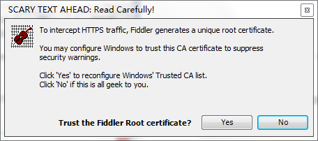

> 当前位置：【Java】12_拓展技能  -> 12.2_Fiddler（抓包工具）

------

# Fiddler的简介

- 作用

  - Fiddler能够监听http/httpS的流量，可以截获从浏览器或者客户端软件向服务器发送的http/https请求，查看请求中的内容

  - 不仅可以伪造客户端的请求，还能够伪造服务器的响应（方便进行前后端的调式）

  - 测试网站的性能

  - 解密https的外部会话（https本身是一种加密的协议）

  - 提供第三方扩展插件，满足更多需求

- 下载

  - Windows: https://www.telerik.com/download/fiddler 

  - Mac/Linux： http://fiddler.wikidot.com/mono 

- 原理

  

# Fiddler的配置

# Fiddler的使用

- 